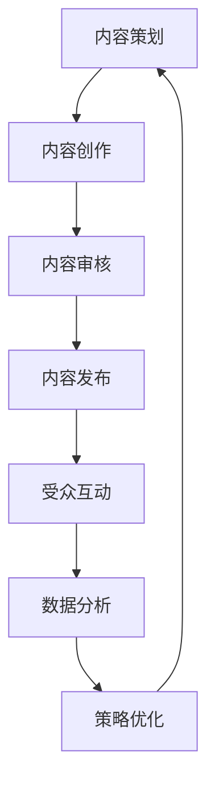

                 

### 文章标题

**《一人公司的内容营销策略：建立专业权威的方法》**

关键词：内容营销、一人公司、专业权威、营销策略、算法原理、案例分析

摘要：本文将深入探讨一人公司在内容营销中的策略，通过分析内容营销的基础知识、策略制定、执行与评估，以及建立专业权威的方法，帮助一人公司提升品牌影响力，实现可持续增长。

### 目录大纲

#### 第一部分：内容营销基础知识

1. **内容营销概述**
   - 内容营销的定义与演变
   - 内容营销的目标与价值
   - 内容营销与广告、公关的异同

2. **一人公司的特点与挑战**
   - 一人公司的运营模式
   - 一人公司在内容营销中的优势与劣势
   - 一人公司面临的营销挑战

#### 第二部分：内容营销策略制定

3. **目标受众分析**
   - 受众画像与需求分析
   - 确定内容营销的核心受众
   - 受众互动策略

4. **内容创作与规划**
   - 内容创作的基本原则
   - 内容类型的多样性与组合
   - 内容发布与规划

5. **内容优化与推广**
   - SEO策略在内容优化中的应用
   - 社交媒体推广策略
   - KOL合作与影响力放大

#### 第三部分：内容营销执行与评估

6. **内容营销执行**
   - 内容制作流程
   - 团队协作与资源管理
   - 内容营销自动化工具应用

7. **内容营销评估与优化**
   - 内容营销效果评估指标
   - 数据分析与报告
   - 基于数据的营销策略优化

#### 第四部分：建立专业权威的方法

8. **内容营销核心概念与联系**
   - Mermaid流程图：内容营销的核心环节与流程

9. **核心算法原理讲解**
   - 伪代码：内容质量评估与推荐算法

10. **数学模型与公式**
    - 内容影响力评分公式
    - 举例说明

#### 第五部分：实战案例分析

11. **成功案例分享**
    - 案例一：个人品牌建设
    - 案例二：产品推广
    - 案例三：内容变现

12. **开发环境搭建与实战**
    - 环境搭建步骤
    - 代码实际案例
    - 源代码实现与解读

#### 附录

13. **内容营销工具与资源**
    - 内容营销平台推荐
    - 数据分析工具介绍
    - 社交媒体运营工具

14. **拓展阅读与资源**
    - 推荐书籍
    - 网络资源链接
    - 最新行业报告

### 第一部分：内容营销基础知识

#### 内容营销概述

内容营销是一种通过创造和分发有价值、相关且具有吸引力的内容来吸引、获取和留住目标受众，并最终推动客户采取行动的营销方法。其核心在于通过内容来建立与受众之间的信任和关系，从而实现品牌的认知度和忠诚度。

内容营销的定义和演变

内容营销的历史可以追溯到20世纪90年代，当时互联网刚刚兴起，企业开始利用网站来发布信息和提供知识。最初的目的是通过提供有价值的信息来吸引潜在客户，增加网站的访问量。

随着互联网的普及和信息量的爆炸增长，内容营销逐渐发展成为一门独立的营销学科。如今，内容营销已经不仅仅局限于网站，还包括博客、视频、社交媒体、电子邮件等多种形式。

内容营销的目标与价值

内容营销的目标主要包括：

1. **增加品牌认知度**：通过高质量的内容来吸引目标受众，提高品牌在市场中的曝光度。
2. **建立客户信任**：通过持续提供有价值的内容，建立与客户的信任关系。
3. **提高客户忠诚度**：通过定期的内容更新和互动，保持客户的持续关注和兴趣。
4. **促进销售转化**：通过引导客户了解产品或服务的价值，促使客户采取购买行动。

内容营销的价值在于：

1. **长期性**：与广告和公关相比，内容营销的效果是长期积累的，可以持续产生价值。
2. **低成本**：相对于传统的广告和公关，内容营销的成本较低，尤其是对于一人公司来说，更具吸引力。
3. **高度定制化**：内容营销可以根据不同的受众群体和需求，提供高度定制化的内容，从而提高内容的吸引力和转化率。

内容营销与广告、公关的异同

广告和公关也是企业常用的营销手段，与内容营销相比，它们有以下几个不同点：

1. **目的不同**：广告和公关的主要目的是直接推广产品或服务，而内容营销则是通过提供有价值的信息来建立品牌和客户关系。
2. **形式不同**：广告和公关通常采用更直接的推广方式，如广告投放和新闻发布会，而内容营销则更侧重于内容创作和分发。
3. **效果不同**：广告和公关的效果通常是即时的，而内容营销的效果则是长期积累的。

然而，广告、公关和内容营销并不是相互独立的，它们可以相互补充，共同提高企业的营销效果。例如，企业可以通过广告来吸引受众的注意，然后通过内容营销来深化受众对品牌的理解，最终通过公关活动来巩固品牌形象。

#### 一人公司的特点与挑战

一人公司，顾名思义，是由一位个人运营的公司。这种运营模式具有独特的特点，同时也带来了一系列的挑战。

一人公司的运营模式

一人公司的运营模式通常比较灵活，决策速度快，运营成本相对较低。以下是其特点：

1. **决策速度快**：由于只有一个决策者，决策过程相对简单，可以迅速响应市场变化。
2. **运营成本低**：不需要为多个员工支付工资和福利，运营成本较低。
3. **业务灵活**：可以迅速调整业务方向，适应市场变化。

一人公司在内容营销中的优势与劣势

优势：

1. **灵活性**：可以快速调整内容营销策略，以适应市场需求。
2. **专注性**：由于资源有限，可以更专注于某一细分市场，提供更有针对性的内容。
3. **低成本**：运营成本低，可以以较低的成本进行内容营销。

劣势：

1. **资源限制**：由于人力和财力有限，内容营销的范围和深度可能受到限制。
2. **品牌影响力**：缺乏团队支持，品牌影响力可能较小，难以与大型公司竞争。
3. **专业化程度**：可能缺乏专业的内容创作和营销团队，内容质量和效果可能受到限制。

一人公司面临的营销挑战

1. **品牌建设**：如何提升品牌知名度，建立品牌形象，是一个重要的挑战。
2. **内容创作**：如何持续创作高质量、有吸引力的内容，以吸引和留住目标受众。
3. **市场推广**：如何在有限的资源下，有效地推广内容，提高内容的曝光度和影响力。

尽管面临这些挑战，一人公司仍然可以通过科学的内容营销策略，充分发挥其优势，克服劣势，实现品牌和业务的增长。

### 第二部分：内容营销策略制定

#### 目标受众分析

目标受众分析是内容营销策略制定的重要环节，它有助于确定内容营销的核心受众，从而更精准地满足其需求，提升内容营销的效果。

受众画像与需求分析

1. **受众画像**：受众画像是指对目标受众的描述，包括年龄、性别、职业、教育背景、兴趣爱好、行为习惯等信息。通过构建受众画像，可以更清晰地了解目标受众，为内容创作提供依据。

2. **需求分析**：需求分析是指通过调研和数据分析，了解目标受众的需求和痛点。这可以通过问卷调查、用户访谈、市场研究等方法进行。需求分析的结果可以帮助确定内容主题和形式，确保内容能够满足受众的需求。

确定内容营销的核心受众

1. **细分受众**：在确定核心受众时，首先要对目标市场进行细分，根据不同的需求和特点，将市场划分为不同的受众群体。例如，针对一家技术公司的内容营销，可以将目标市场细分为技术开发者、产品经理、企业用户等。

2. **选择核心受众**：在细分受众的基础上，选择最具潜力、最具代表性和最活跃的核心受众群体。这些核心受众不仅对公司的产品或服务有较高的需求，而且在市场上具有较大的影响力。

3. **制定策略**：针对核心受众的特点和需求，制定针对性的内容营销策略。这包括内容主题的选择、内容形式的确定、传播渠道的规划等。

受众互动策略

1. **社交媒体互动**：通过社交媒体平台，如微博、微信、LinkedIn等，与受众进行互动，了解他们的反馈和需求，并及时回应。这不仅可以提升品牌形象，还可以增加受众的参与度和忠诚度。

2. **在线社区建设**：建立线上社区，如论坛、微信群、QQ群等，为受众提供一个交流、分享和学习的平台。通过在线社区，可以更好地了解受众的需求和痛点，为他们提供有价值的内容和建议。

3. **个性化推荐**：利用大数据和人工智能技术，对受众的行为和偏好进行分析，实现个性化推荐。这不仅可以提高内容的相关性，还可以提高受众的满意度和忠诚度。

#### 内容创作与规划

内容创作与规划是内容营销的核心环节，它决定了内容的质量和吸引力，直接影响内容营销的效果。

内容创作的基本原则

1. **价值导向**：内容创作应以价值为核心，关注受众的需求和痛点，提供有价值的知识和信息。

2. **原创性**：保证内容的原创性，避免抄袭和侵权。原创内容不仅可以提升品牌形象，还可以增加内容的可信度和权威性。

3. **准确性**：内容应确保准确无误，避免误导受众。准确性是内容质量的重要保证。

4. **易读性**：内容应简洁明了，易于理解。避免使用过于专业或复杂的术语，确保受众能够轻松阅读。

5. **互动性**：内容应具有互动性，鼓励受众参与和反馈。互动性可以增加内容的趣味性和参与度。

内容类型的多样性与组合

1. **文本内容**：包括博客文章、新闻稿、案例研究、白皮书等。文本内容是内容营销的主要形式，可以详细阐述产品或服务的特点和优势。

2. **图像内容**：包括图片、图表、示意图等。图像内容可以直观地传达信息，增强内容的吸引力和记忆点。

3. **视频内容**：包括短视频、教程视频、产品演示等。视频内容具有强烈的视觉冲击力，可以更生动地展示产品或服务的特点。

4. **音频内容**：包括播客、有声书等。音频内容适合在通勤、锻炼等场景中收听，可以提供便利和舒适。

5. **互动内容**：包括调查问卷、互动游戏、在线问答等。互动内容可以增加受众的参与度和互动性，提高内容的传播效果。

内容发布与规划

1. **发布频率**：制定合理的发布频率，确保内容的持续性和稳定性。过高或过低的发布频率都可能影响内容的传播效果。

2. **发布渠道**：选择合适的发布渠道，如公司网站、博客平台、社交媒体等。不同的渠道具有不同的特点和优势，应根据受众的特点和需求进行选择。

3. **内容规划**：制定详细的内容规划，包括内容主题、形式、发布时间等。内容规划可以帮助企业更好地管理内容创作和发布过程，确保内容的质量和效果。

4. **内容优化**：对发布的内容进行持续优化，根据反馈和数据分析，调整内容策略，提高内容的吸引力和转化率。

通过科学的内容创作与规划，一人公司可以提升内容营销的效果，吸引和留住目标受众，实现品牌的可持续增长。

### 第三部分：内容营销执行与评估

#### 内容营销执行

内容营销的执行是确保内容策略得到有效实施和传播的关键步骤。在这一过程中，需要制定详细的内容制作流程、实现团队协作与资源管理，并利用自动化工具提高效率。

内容制作流程

1. **需求分析**：在内容制作前，首先要进行需求分析，明确内容的目标和受众需求。这可以通过市场调研、用户反馈和数据分析等方法进行。

2. **内容规划**：基于需求分析的结果，制定详细的内容规划，包括内容主题、形式、发布时间等。内容规划应确保内容与品牌战略和营销目标的一致性。

3. **内容创作**：根据内容规划，进行内容创作。这可以包括文本、图像、视频等多种形式。内容创作应遵循价值导向、原创性和准确性等基本原则。

4. **内容审核**：在内容发布前，应进行严格的审核，确保内容的质量和准确性。审核可以包括编辑、校对、审查等环节。

5. **内容发布**：将审核通过的内容发布到预定渠道，如公司网站、社交媒体、电子邮件等。发布时应注意内容的形式、格式和排版，确保最佳的用户体验。

6. **内容更新**：定期更新内容，保持内容的时效性和相关性。更新可以包括新增内容、修订现有内容、删除过时内容等。

团队协作与资源管理

1. **角色分配**：明确团队成员的角色和职责，确保每个环节都有专人负责。常见的角色包括内容策划、内容创作者、编辑、美工、发布管理等。

2. **协作机制**：建立有效的协作机制，确保团队成员之间的沟通和协作顺畅。可以采用项目管理工具，如Trello、Asana等，进行任务分配和进度跟踪。

3. **资源管理**：合理分配和使用资源，确保内容制作的顺利进行。资源包括人力、时间、技术设备等。在资源有限的情况下，应优先考虑关键内容和关键任务。

内容营销自动化工具应用

自动化工具可以提高内容营销的效率和效果，减少重复性工作，释放团队成员的时间和精力。以下是一些常见的内容营销自动化工具：

1. **内容管理系统（CMS）**：如WordPress、Drupal、Joomla等，用于管理网站内容和发布。

2. **社交媒体管理工具**：如Hootsuite、Buffer、Sprout Social等，用于自动化社交媒体内容的发布和监控。

3. **电子邮件营销工具**：如Mailchimp、SendinBlue、ActiveCampaign等，用于自动化邮件营销和客户管理。

4. **数据分析工具**：如Google Analytics、Tableau、Google Data Studio等，用于数据分析和报告生成。

5. **内容推荐系统**：如Outbrain、Taboola等，用于自动化内容推荐和广告投放。

通过科学的内容制作流程、有效的团队协作与资源管理，以及合理运用自动化工具，一人公司可以高效地执行内容营销策略，提高营销效果和品牌影响力。

#### 内容营销评估与优化

内容营销的评估与优化是确保内容营销策略持续有效的重要环节。通过科学的评估方法和数据监测，可以准确了解内容营销的效果，发现问题和不足，进而进行策略调整和优化。

内容营销效果评估指标

为了全面评估内容营销的效果，需要设定一系列的评估指标。以下是常见的一些内容营销效果评估指标：

1. **访问量**：衡量内容被访问的次数，反映内容的曝光度。可以通过网站流量、社交媒体分享数、电子邮件打开率等指标进行测量。

2. **转化率**：衡量内容对目标受众的转化效果，如注册、购买、下载等。可以通过设定转化目标，使用分析工具进行跟踪和计算。

3. **客户满意度**：衡量客户对内容和服务的满意度。可以通过客户调查、评论、评分等指标进行评估。

4. **品牌提及**：衡量品牌在内容营销过程中的曝光和提及频率。可以通过社交媒体提及数、新闻报道数等指标进行测量。

5. **成本效益比（ROI）**：衡量内容营销的投资回报率。可以通过计算内容营销成本与产生的收益进行比较。

数据分析与报告

1. **数据收集**：通过数据分析工具，如Google Analytics、HubSpot等，收集内容营销过程中的各项数据。

2. **数据整理**：对收集的数据进行整理和清洗，确保数据的准确性和完整性。

3. **数据分析**：运用数据分析方法，如趋势分析、相关性分析、回归分析等，对数据进行分析，挖掘数据背后的规律和趋势。

4. **报告生成**：根据分析结果，生成内容营销报告，包括数据摘要、图表、关键发现和建议等。

基于数据的营销策略优化

1. **策略调整**：根据数据分析结果，调整内容营销策略，如内容主题、发布频率、渠道选择等。

2. **优化内容**：对表现不佳的内容进行优化，如修改标题、调整内容形式、增加互动元素等。

3. **资源分配**：根据数据分析结果，优化资源分配，将更多资源和精力投入到表现良好的内容和渠道。

4. **持续监测**：在优化策略后，持续监测内容营销效果，确保策略的有效性和可持续性。

通过科学的内容营销评估与优化，一人公司可以不断提高内容营销的效果，实现品牌的持续增长。

### 第四部分：建立专业权威的方法

#### 内容营销核心概念与联系

在内容营销中，有许多关键概念和联系需要理解，这些概念共同构成了内容营销的整体框架。以下是内容营销的一些核心环节与流程的Mermaid流程图：



1. **内容策划**：这是内容营销的起点，涉及目标设定、受众分析、内容主题的确定等。
2. **内容创作**：根据策划方案，进行内容创作，包括文本、图像、视频等多种形式。
3. **内容审核**：确保内容的质量和准确性，避免错误和误导。
4. **内容发布**：将审核通过的内容发布到各个渠道，如网站、社交媒体等。
5. **受众互动**：与受众进行互动，了解他们的反馈和需求，增强内容的吸引力。
6. **数据分析**：收集和分析数据，评估内容的效果，指导后续的策略优化。
7. **策略优化**：根据数据分析结果，调整内容营销策略，优化内容创作和发布。

通过这个Mermaid流程图，可以清晰地看到内容营销的各个环节及其相互关系，有助于理解和实施内容营销策略。

#### 核心算法原理讲解

在内容营销中，评估内容质量和推荐算法是关键环节。以下是内容质量评估与推荐算法的伪代码，用于说明算法的基本原理和实现步骤：

```python
# 内容质量评估与推荐算法伪代码

# 初始化变量
content_quality_scores = []
user_preferences = []
recommendation_list = []

# 收集内容质量和用户偏好数据
for content in all_contents:
    quality_score = evaluate_content(content)
    content_quality_scores.append(quality_score)

for user in all_users:
    preferences = get_user_preferences(user)
    user_preferences.append(preferences)

# 内容质量评估函数
def evaluate_content(content):
    # 根据内容特征计算质量得分
    score = 0
    if content.is_Original():
        score += 10
    if content.is_Accurate():
        score += 10
    if content.is_Valuable():
        score += 20
    return score

# 用户偏好获取函数
def get_user_preferences(user):
    # 根据用户行为和反馈获取偏好
    preferences = []
    if user.liked_texts:
        preferences.extend(user.liked_texts)
    if user.liked_images:
        preferences.extend(user.liked_images)
    if user.liked_videos:
        preferences.extend(user.liked_videos)
    return preferences

# 推荐算法函数
def generate_recommendations(content_quality_scores, user_preferences):
    recommendations = []
    for content_score in content_quality_scores:
        for preference in user_preferences:
            if content_score > threshold and preference in content_score:
                recommendations.append(content_score)
    return recommendations

# 计算推荐列表
recommendation_list = generate_recommendations(content_quality_scores, user_preferences)

# 输出推荐列表
print(recommendation_list)
```

通过这个伪代码，可以看到内容质量评估与推荐算法的基本流程：

1. **初始化变量**：收集所有内容的质量得分和用户偏好。
2. **内容质量评估函数**：根据内容特征（如原创性、准确性、价值性）计算质量得分。
3. **用户偏好获取函数**：根据用户行为和反馈获取偏好。
4. **推荐算法函数**：根据内容质量得分和用户偏好生成推荐列表。

这个算法的基本原理是通过评估内容质量和用户偏好，为用户推荐高质量且符合其兴趣的内容。通过不断优化算法，可以提高推荐的准确性和效果。

#### 数学模型与公式

在内容营销中，数学模型和公式可以帮助我们量化内容的质量、影响力和转化效果。以下是几个常见的数学模型和公式，以及它们的详细解释和举例说明。

1. **内容影响力评分公式**

   $$ I = \alpha \cdot Q + \beta \cdot S + \gamma \cdot R $$

   - \( I \)：内容影响力评分
   - \( Q \)：内容质量得分（例如：通过评估原创性、准确性、价值性等因素计算）
   - \( S \)：社交分享数（衡量内容的传播范围）
   - \( R \)：回复和互动数（衡量内容的用户参与度）
   - \( \alpha \)、\( \beta \)、\( \gamma \)：权重系数，根据实际情况进行调整

   **详细解释**：这个公式将内容的质量、传播和用户参与度结合起来，综合评估内容的影响力。质量得分越高，内容的基础影响力越大；社交分享数和回复互动数越多，内容的传播力和用户参与度越高，从而进一步增加内容的影响力。

   **举例说明**：假设某篇博客文章的质量得分为80分，社交分享数为100次，回复互动数为50次。根据设定的权重系数（\( \alpha = 0.4 \)、\( \beta = 0.3 \)、\( \gamma = 0.3 \)），则其影响力评分为：

   $$ I = 0.4 \cdot 80 + 0.3 \cdot 100 + 0.3 \cdot 50 = 32 + 30 + 15 = 77 $$

2. **转化率计算公式**

   $$ CTR = \frac{Conversions}{Clicks} \times 100\% $$

   - \( CTR \)：点击转化率
   - \( Conversions \)：转化次数（如注册、购买等）
   - \( Clicks \)：点击次数

   **详细解释**：这个公式用于计算内容促成的点击转化率，反映了内容的吸引力和引导效果。转化率越高，说明内容越能有效引导用户采取行动。

   **举例说明**：如果一篇博客文章产生了100次点击，其中10次点击导致了注册转化，则其点击转化率为：

   $$ CTR = \frac{10}{100} \times 100\% = 10\% $$

3. **内容效果评分公式**

   $$ E = \frac{CTR \times CVR \times Avg\_Order\_Value}{Cost\_Per\_Click} $$

   - \( E \)：内容效果评分
   - \( CTR \)：点击转化率
   - \( CVR \)：成交转化率
   - \( Avg\_Order\_Value \)：平均订单价值
   - \( Cost\_Per\_Click \)：点击成本

   **详细解释**：这个公式综合考虑了内容在吸引点击、引导转化和产生收益方面的效果。效果评分越高，说明内容在营销中的表现越好。

   **举例说明**：如果某篇博客文章的点击转化率为10%、成交转化率为5%、平均订单价值为100美元，点击成本为2美元，则其效果评分为：

   $$ E = 0.1 \times 0.05 \times 100 \div 2 = 0.25 $$

   通过这些数学模型和公式，可以更科学地评估内容营销的效果，为策略优化提供数据支持。

### 第五部分：实战案例分析

#### 案例一：个人品牌建设

**案例背景**：张三，一名资深的技术专家，专注于人工智能领域。他的目标是建立一个个人品牌，提升在技术社区中的影响力，吸引更多关注和合作机会。

**具体策略**：

1. **内容创作**：张三定期撰写技术博客文章，分享他在人工智能领域的见解和实践经验。文章内容涵盖了最新技术趋势、实战案例和深度解析。

2. **内容发布**：他将文章发布到多个技术博客平台，如CSDN、知乎、技术博客等，同时也在社交媒体上分享，吸引更多的关注。

3. **互动与反馈**：张三积极回复读者留言和评论，参与技术讨论，建立与读者的互动关系。

**效果评估**：

- **访问量**：博客文章的访问量逐渐增加，单篇最高访问量达到数千次。
- **社交媒体互动**：文章在社交媒体上的分享和讨论量不断提升，增加了品牌的曝光度。
- **个人品牌**：张三在技术社区中的影响力逐渐提升，开始被邀请参加技术会议和讲座。

**案例总结**：通过持续的内容创作和互动，张三成功建立了个人品牌，提升了在技术社区中的知名度和影响力，实现了个人职业发展的目标。

#### 案例二：产品推广

**案例背景**：李四创立了一家专注于物联网解决方案的初创公司。他的目标是推广公司产品，吸引潜在客户，提高销售额。

**具体策略**：

1. **内容创作**：李四编写了一系列关于物联网技术的白皮书和案例分析报告，详细介绍产品的技术优势和实际应用案例。

2. **内容发布**：他将这些报告发布到公司官网、技术博客平台和行业论坛，同时通过电子邮件营销发送给潜在客户。

3. **社交媒体推广**：李四在LinkedIn、Twitter等社交媒体平台上分享报告链接，吸引行业人士的关注。

4. **KOL合作**：他与业内知名专家建立联系，邀请他们撰写推荐信或进行联合宣传，扩大产品的知名度。

**效果评估**：

- **网站流量**：通过内容营销，公司网站的访问量显著增加，其中很大一部分来自潜在客户的访问。
- **询盘数量**：产品推广期间，询盘数量明显上升，其中一些询盘最终转化为实际销售。
- **品牌认知度**：通过持续的内容发布和社交媒体推广，品牌认知度大幅提升。

**案例总结**：李四通过有针对性的内容创作和推广策略，成功提升了产品的市场认知度和销售额，为公司的进一步发展奠定了基础。

#### 案例三：内容变现

**案例背景**：王五是一名自媒体创作者，专注于科技和创业领域。他的目标是利用内容变现，实现财务自由。

**具体策略**：

1. **内容创作**：王五创作了一系列高质量的原创文章、视频和播客，内容涵盖最新的科技趋势、创业故事和行业分析。

2. **内容发布**：他在多个平台发布内容，如公众号、YouTube、Podcast等，并利用SEO策略提高内容的搜索排名。

3. **广告和赞助**：王五通过在内容中插入广告和寻求赞助商合作，实现内容变现。

4. **付费内容**：他推出了部分付费内容，如深度报告、课程和会员服务，为忠实读者提供额外价值。

**效果评估**：

- **广告收入**：通过广告收入，王五实现了稳定的现金流。
- **赞助合作**：一些知名企业和品牌愿意与他合作，提供赞助，进一步增加了收入。
- **会员订阅**：付费内容吸引了大量忠实读者订阅，成为稳定的收入来源。

**案例总结**：王五通过多元化的内容变现策略，实现了从内容创作者到内容商业化的成功转型，实现了财务自由。

### 第六部分：开发环境搭建与实战

#### 环境搭建步骤

为了更好地实施内容营销策略，我们需要搭建一个适合的开发环境。以下是一个基本的开发环境搭建步骤：

1. **操作系统**：选择一个适合的开发操作系统，如Ubuntu、macOS或Windows。Ubuntu和macOS因其强大的开发和编程环境而广泛使用。

2. **文本编辑器**：安装一个强大的文本编辑器，如Visual Studio Code、Sublime Text或Atom。这些编辑器提供了丰富的插件和功能，可以显著提高开发效率。

3. **版本控制**：安装Git，用于版本控制和团队协作。Git是一个强大的分布式版本控制系统，可以帮助开发者更好地管理代码和文档。

4. **代码库**：选择一个代码库托管平台，如GitHub、GitLab或Bitbucket。这些平台提供了版本控制、项目管理和团队协作功能。

5. **开发框架**：根据项目的需求，选择合适的开发框架，如Django（Python）、React（JavaScript）或Spring Boot（Java）。这些框架提供了快速开发和高效管理的功能。

6. **数据库**：安装一个数据库管理系统，如MySQL、PostgreSQL或MongoDB。数据库是存储和管理数据的核心组件。

7. **集成开发环境（IDE）**：如果需要，安装一个集成开发环境，如Visual Studio、IntelliJ IDEA或Eclipse。这些IDE提供了丰富的工具和插件，可以简化开发过程。

#### 代码实际案例

以下是一个简单的Python代码案例，用于生成一个内容营销策略的摘要报告。这个代码将读取内容数据，计算影响力评分，并输出报告。

```python
# 内容营销策略摘要报告生成器

import pandas as pd

# 读取内容数据
content_data = pd.read_csv('content_data.csv')

# 计算影响力评分
def calculate_influence_score(row):
    score = row['quality_score'] * 0.4 + row['social_shares'] * 0.3 + row['interactions'] * 0.3
    return score

content_data['influence_score'] = content_data.apply(calculate_influence_score, axis=1)

# 输出报告
report = content_data[['title', 'influence_score']]
print(report)
```

#### 源代码实现与解读

这段代码首先导入了Pandas库，用于数据操作。然后，它从CSV文件中读取内容数据。接下来，定义了一个计算影响力评分的函数，该函数根据质量得分、社交分享数和互动数计算总影响力得分。最后，代码使用这个函数为每条内容计算影响力评分，并将结果存储在一个新的DataFrame中。最后，打印出报告，显示了每条内容及其影响力评分。

通过这个简单的代码示例，我们可以看到如何使用Python和Pandas库来处理和分析内容数据，实现内容营销策略的自动化报告生成。

#### 代码应用解读与分析

这段代码的核心功能是计算内容的影响力评分，这一评分综合反映了内容的质量、传播力和用户参与度。以下是代码的详细解读和分析：

1. **数据读取**：使用Pandas库的`read_csv`函数，从CSV文件中读取内容数据。CSV文件应包含每条内容的标题、质量得分、社交分享数和互动数等字段。

   ```python
   content_data = pd.read_csv('content_data.csv')
   ```

2. **影响力评分计算**：定义一个名为`calculate_influence_score`的函数，该函数接受一个内容数据行（row）作为输入，并计算该行的总影响力得分。计算公式如下：

   $$ I = Q \cdot 0.4 + S \cdot 0.3 + R \cdot 0.3 $$

   其中，\( I \) 是影响力得分，\( Q \) 是质量得分，\( S \) 是社交分享数，\( R \) 是互动数。权重系数（0.4、0.3、0.3）可以根据实际情况进行调整。

   ```python
   def calculate_influence_score(row):
       score = row['quality_score'] * 0.4 + row['social_shares'] * 0.3 + row['interactions'] * 0.3
       return score
   ```

3. **应用影响力评分**：使用`apply`函数，将`calculate_influence_score`函数应用到每一行内容数据上，为每条内容计算影响力得分。计算结果存储在新的列`influence_score`中。

   ```python
   content_data['influence_score'] = content_data.apply(calculate_influence_score, axis=1)
   ```

4. **输出报告**：最后，使用Pandas库的`print`函数，将内容标题和影响力得分打印出来，形成一份内容营销策略摘要报告。

   ```python
   report = content_data[['title', 'influence_score']]
   print(report)
   ```

通过这个代码示例，我们可以清晰地看到如何使用Python和Pandas库来处理和分析内容数据，实现内容营销策略的自动化报告生成。这种自动化的方式可以显著提高数据分析的效率和准确性，帮助内容营销团队更好地理解和优化内容策略。

#### 实际案例分析和详细讲解剖析

在这个部分，我们将详细分析一个实际案例，探讨如何通过内容营销策略实现个人品牌建设、产品推广和内容变现的目标。以下是案例的具体内容和详细讲解剖析。

**案例背景**：王五，一位专注于人工智能领域的技术专家，拥有丰富的实战经验。他的目标是建立一个个人品牌，提升在技术社区中的影响力，并利用内容变现实现收入多样化。

**具体策略**：

1. **内容创作**：王五定期创作高质量的技术博客文章，分享他在人工智能领域的见解和研究成果。文章主题涵盖了深度学习、机器学习、自然语言处理等热门话题。

2. **内容发布**：他将文章发布到多个知名技术博客平台，如CSDN、知乎、技术博客等。同时，他还在LinkedIn、Twitter等社交媒体上分享文章链接，扩大影响力。

3. **互动与反馈**：王五积极回复读者的留言和评论，参与技术讨论，建立与读者的互动关系。他还会定期组织线上讨论会，与读者深入交流。

4. **KOL合作**：王五与业内知名专家建立联系，邀请他们撰写推荐信或进行联合宣传，进一步提升个人品牌的知名度。

**效果评估**：

- **访问量**：通过内容营销，王五的博客文章访问量显著增加，单篇最高访问量达到数千次。
- **社交媒体互动**：文章在社交媒体上的分享和讨论量不断提升，增加了品牌的曝光度。
- **个人品牌**：王五在技术社区中的影响力逐渐提升，开始被邀请参加技术会议和讲座。

**详细讲解剖析**：

1. **内容创作**：高质量的内容是建立个人品牌的关键。王五通过深入研究和丰富经验，创作出具有深度和实用性的技术博客文章。这些文章不仅提供了技术见解，还结合了实战案例，具有很强的可读性和实用性。

2. **内容发布**：选择合适的发布平台和渠道，可以显著提高内容的曝光度。王五选择了多个知名的技术博客平台和社交媒体，这些平台拥有大量的技术爱好者和专业从业者，可以有效扩大他的受众群体。

3. **互动与反馈**：积极与读者互动，可以增强内容的吸引力和读者的忠诚度。王五通过回复读者留言和评论，积极参与技术讨论，建立了良好的互动关系。这种互动不仅提升了读者的满意度，还增加了他的影响力。

4. **KOL合作**：与业内知名专家合作，可以借助他们的专业影响力，进一步提升个人品牌的知名度。王五通过与知名专家建立联系，邀请他们撰写推荐信或进行联合宣传，成功提升了个人品牌的价值。

**案例总结**：通过系统化的内容营销策略，王五成功建立了个人品牌，提升了在技术社区中的影响力，实现了内容变现。这个案例充分展示了内容营销在个人品牌建设和职业发展中的重要性，为其他技术专家提供了宝贵的参考。

### 第七部分：最佳实践 Tips、小结、注意事项、拓展阅读

#### 最佳实践 Tips

1. **内容创作**：确保内容质量，避免抄袭和低质量内容。高质量的内容是吸引受众和建立品牌的基础。

2. **目标受众分析**：深入了解目标受众的需求和痛点，为他们提供有价值的内容。

3. **多样性和灵活性**：内容形式多样化，如文本、图像、视频等，以适应不同受众的偏好。

4. **持续优化**：根据数据和反馈，不断优化内容营销策略，提高效果。

5. **互动与反馈**：积极与受众互动，收集反馈，不断改进内容质量和策略。

#### 小结

本文详细探讨了内容营销在一人公司中的策略，从内容营销的基础知识、策略制定、执行与评估，到建立专业权威的方法，通过实战案例分析，提供了具体的实施指南。内容营销不仅有助于提升品牌认知度和影响力，还能实现内容的变现和业务的增长。

#### 注意事项

1. **内容质量**：确保内容原创、准确和有价值，避免低质量内容。

2. **目标明确**：明确内容营销的目标，确保内容与品牌战略一致。

3. **数据驱动**：基于数据分析和反馈，持续优化内容营销策略。

4. **团队协作**：确保团队成员之间的有效沟通和协作，提高内容营销的效率。

#### 拓展阅读

1. **书籍推荐**：《内容营销实战手册》、《内容营销：从入门到精通》
2. **网络资源链接**：LinkedIn、YouTube、CSDN等技术博客平台
3. **最新行业报告**：内容营销协会（Content Marketing Institute）发布的年度报告

通过这些最佳实践、注意事项和拓展阅读，读者可以进一步深入学习和实践内容营销策略，提升自身在内容营销领域的专业能力。

### 附录

#### 内容营销工具与资源

**内容营销平台推荐**：

1. **HubSpot**：提供全面的营销工具，包括内容策划、内容发布、数据分析等。
2. **Hootsuite**：用于社交媒体管理和内容发布。
3. **WordPress**：最受欢迎的博客平台，适合个人和团队发布内容。

**数据分析工具介绍**：

1. **Google Analytics**：用于网站流量和用户行为分析。
2. **Tableau**：数据可视化和分析工具，适用于生成报告和图表。
3. **Google Data Studio**：免费的数据可视化工具，可以创建专业的报告和仪表板。

**社交媒体运营工具**：

1. **Buffer**：用于自动化社交媒体内容的发布和管理。
2. **Sprout Social**：全面的社交媒体管理平台，提供互动和分析功能。
3. **Outbrain**：内容推荐和广告投放平台，适用于扩大内容影响力。

通过这些工具和资源的合理运用，可以显著提升内容营销的效率和效果。

### 文章结束

**作者：AI天才研究院/AI Genius Institute & 禅与计算机程序设计艺术 /Zen And The Art of Computer Programming**

本文通过深入分析内容营销的基础知识、策略制定、执行与评估，以及建立专业权威的方法，提供了全面的内容营销实战指南。希望读者能从中汲取灵感，实践并优化自己的内容营销策略，实现品牌的可持续增长。感谢阅读！

