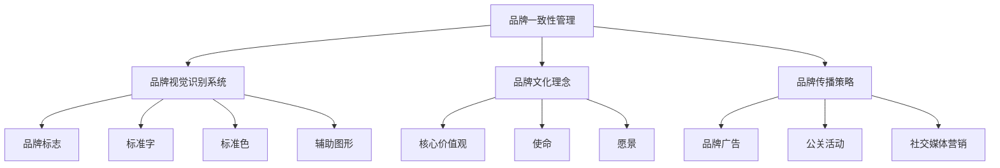
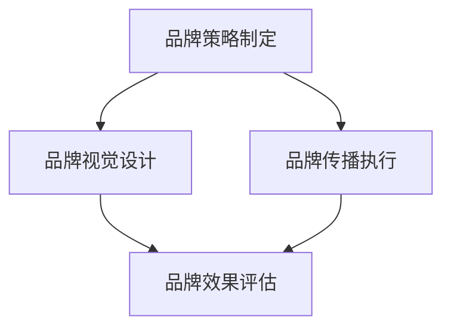

                 


### 文章标题：一人公司的品牌一致性管理系统

> 关键词：品牌一致性管理、品牌策略、品牌视觉设计、品牌传播、品牌效果评估、品牌算法原理

> 摘要：本文旨在探讨一人公司的品牌一致性管理系统，从核心概念、管理流程、技术实现与工具应用、数学模型和算法原理等方面进行详细阐述，旨在为读者提供一套全面、系统、实用的品牌一致性管理方法论。

#### 目录

#### 第一部分：品牌一致性管理系统概述

##### 第1章：品牌一致性管理的核心概念

##### 第2章：品牌一致性管理流程

#### 第二部分：技术实现与工具应用

##### 第3章：品牌一致性管理工具介绍

##### 第4章：品牌一致性管理系统的开发

##### 第5章：品牌一致性管理的数学模型

##### 第6章：品牌一致性管理的算法原理

##### 第7章：项目实战与案例分享

##### 第8章：品牌一致性管理的未来发展

#### 附录

##### 附录A：品牌一致性管理工具与资源

#### 引入

在当今激烈的市场竞争中，品牌已经成为企业的重要资产。品牌不仅代表着企业的形象，更是消费者认知和选择的依据。因此，品牌一致性管理成为了企业成功的关键因素。对于一人公司来说，品牌一致性管理的重要性更加凸显。一人公司由于缺乏专业的品牌管理团队，往往需要在品牌一致性的管理上投入更多的时间和精力。本文将围绕一人公司的品牌一致性管理系统展开讨论，旨在为读者提供一套实用的品牌一致性管理方法论。

本文将从以下几个方面进行探讨：

1. 品牌一致性管理的核心概念，包括品牌一致性管理的定义、构成要素以及现状分析。
2. 品牌一致性管理流程，从品牌策略制定、品牌视觉设计、品牌传播执行到品牌效果评估的详细流程。
3. 品牌一致性管理的技术实现与工具应用，介绍品牌一致性管理工具的类型、功能与特点，以及实际应用案例。
4. 品牌一致性管理的数学模型与算法原理，包括品牌一致性的评价指标、数学模型的构建方法、常用算法介绍与实现。
5. 品牌一致性管理的项目实战与案例分享，通过实际项目来展示品牌一致性管理系统的实施过程与效果。
6. 品牌一致性管理的未来发展，探讨新技术引入、挑战与应对策略以及未来发展方向的展望。

通过以上几个方面的探讨，本文希望能够为读者提供一套全面、系统、实用的品牌一致性管理方法论，帮助一人公司实现品牌的一致性，提升品牌价值。

#### 第一部分：品牌一致性管理系统概述

##### 第1章：品牌一致性管理的核心概念

品牌一致性管理是指通过一系列策略和措施，确保企业在各个渠道、产品、市场等方面传达出统一的品牌形象和信息，从而提高品牌知名度和消费者忠诚度。对于一人公司来说，品牌一致性管理尤为重要，因为缺乏专业的品牌管理团队，一人公司需要依靠一套完善的品牌一致性管理系统来实现品牌的统一和标准化。

**1.1 品牌一致性管理的定义与意义**

品牌一致性管理（Brand Consistency Management）是指企业在品牌传播过程中，通过各种策略和手段，确保品牌在不同渠道、产品、市场等环节传达出一致的价值观、视觉形象和信息内容。其核心在于确保品牌形象的统一性和标准化，从而提升品牌的市场竞争力。

品牌一致性管理的定义可以从以下几个方面进行解读：

- **品牌形象的统一性**：品牌一致性管理要求企业在品牌传播过程中，保持视觉形象、语言风格、传播策略等方面的统一，确保消费者在不同渠道、产品上能够获得一致的品牌体验。
- **品牌信息的标准化**：品牌一致性管理强调品牌信息的标准化，包括品牌名称、标志、口号、标语、广告语等，确保这些信息在各个传播渠道中能够得到统一的应用。
- **品牌价值观的传递**：品牌一致性管理不仅仅是形式上的统一，更是品牌核心价值的传递。企业需要通过品牌一致性管理，将品牌的核心价值观传递给消费者，建立品牌与消费者之间的情感连接。

品牌一致性管理的意义在于：

- **提升品牌知名度**：通过品牌一致性管理，企业能够在消费者心中建立统一的品牌形象，提升品牌知名度。
- **增强消费者忠诚度**：品牌一致性管理能够确保消费者在购买和使用品牌产品时获得一致的品牌体验，从而增强消费者对品牌的忠诚度。
- **降低品牌管理成本**：通过品牌一致性管理，企业可以减少品牌传播中的重复和冲突，降低品牌管理成本。

**1.2 品牌一致性的构成要素**

品牌一致性管理涉及多个方面，主要包括品牌视觉识别系统、品牌文化理念、品牌传播策略等构成要素。

- **品牌视觉识别系统**：品牌视觉识别系统是品牌一致性的重要组成部分，包括品牌标志、标准字、标准色、辅助图形等元素。这些视觉元素通过统一的视觉设计语言，向消费者传达品牌的形象和价值观。
  - **品牌标志**：品牌标志是品牌视觉识别系统的核心，通常是一个简洁、易记、具有辨识度的图形或符号，能够快速传达品牌的特征和价值。
  - **标准字**：标准字是品牌标志的补充，通过特定的字体和排版，传达品牌的个性和精神。
  - **标准色**：标准色是品牌视觉识别系统的视觉基础，通过特定的颜色搭配，增强品牌的辨识度和视觉冲击力。
  - **辅助图形**：辅助图形是对品牌视觉识别系统的补充，通常用于品牌广告、宣传资料等，增强品牌的视觉表现力。

- **品牌文化理念**：品牌文化理念是品牌一致性的灵魂，包括品牌的核心价值观、使命、愿景等。品牌文化理念通过企业的日常运营、产品和服务，传递给消费者，形成品牌与消费者之间的情感连接。
  - **核心价值观**：核心价值观是品牌文化的核心，是品牌在长期经营过程中形成的核心理念，能够指导企业的行为和决策。
  - **使命**：使命是品牌存在的意义，是企业致力于实现的目标和愿景。
  - **愿景**：愿景是品牌未来发展的方向和目标，是品牌长期的战略规划。

- **品牌传播策略**：品牌传播策略是品牌一致性管理的重要手段，包括品牌广告、公关活动、社交媒体营销等。品牌传播策略通过不同的传播渠道和方式，将品牌信息传递给消费者，确保品牌形象的统一和标准化。
  - **品牌广告**：品牌广告是品牌传播的重要手段，通过广告的创意和内容，向消费者传达品牌的形象和价值。
  - **公关活动**：公关活动是品牌传播的辅助手段，通过举办新闻发布会、品牌活动、赞助活动等，提升品牌的影响力和知名度。
  - **社交媒体营销**：社交媒体营销是品牌传播的新渠道，通过社交媒体平台，与消费者进行互动和沟通，增强品牌的社交影响力。

**1.3 品牌一致性的现状分析**

在当前的市场环境中，品牌一致性管理已经成为企业竞争的重要手段。然而，在实际操作中，许多企业仍然面临着品牌一致性管理方面的挑战。

- **一人公司的品牌一致性管理现状**：对于一人公司而言，由于缺乏专业的品牌管理团队，品牌一致性管理面临更大的挑战。一人公司需要通过一套完善的品牌一致性管理系统，来确保品牌的统一和标准化。

- **品牌一致性管理面临的主要挑战**：
  - **缺乏统一的品牌策略**：一人公司在品牌一致性管理中，往往缺乏明确的品牌策略，导致品牌传播缺乏方向和目标。
  - **品牌视觉识别系统不统一**：一人公司的品牌视觉识别系统可能存在设计不规范、色彩搭配不合理等问题，影响品牌的视觉表现力。
  - **品牌传播渠道不统一**：一人公司在品牌传播中，可能同时使用多个传播渠道，导致品牌信息的传递不一致，影响品牌形象的统一性。
  - **品牌文化理念缺失**：一人公司在品牌一致性管理中，可能忽视品牌文化理念的建设，导致品牌与消费者之间的情感连接不足。

**1.4 品牌一致性管理的核心概念联系架构**

为了更好地理解品牌一致性管理的核心概念，我们可以通过以下Mermaid流程图来展示各个概念之间的关系架构：



通过这个流程图，我们可以清晰地看到品牌一致性管理的核心概念之间的关系，从而更好地理解品牌一致性管理的整体架构。

**1.5 小结**

品牌一致性管理是企业在品牌传播过程中，确保品牌形象和信息统一的重要手段。一人公司由于缺乏专业的品牌管理团队，更需要通过一套完善的品牌一致性管理系统来实现品牌的统一和标准化。品牌一致性管理涉及品牌视觉识别系统、品牌文化理念和品牌传播策略等多个方面，通过统一的视觉设计语言、核心价值的传递和多样化的品牌传播渠道，提升品牌的市场竞争力和消费者忠诚度。在面对品牌一致性管理挑战时，一人公司需要制定明确的品牌策略，构建统一的品牌视觉识别系统，并采用多样化的品牌传播策略，实现品牌的一致性和标准化。

### 第2章：品牌一致性管理流程

品牌一致性管理流程是确保品牌形象和信息统一的关键环节。一个完善的品牌一致性管理流程包括品牌策略制定、品牌视觉设计、品牌传播执行和品牌效果评估。以下是具体的步骤和内容：

**2.1 品牌一致性管理流程概述**

品牌一致性管理流程可以分为以下几个阶段：

1. **品牌策略制定**：在这个阶段，企业需要明确品牌的目标和定位，制定品牌的核心价值观和使命，为后续的品牌视觉设计和传播策略提供指导。
2. **品牌视觉设计**：在这个阶段，企业需要设计品牌标志、标准字、标准色和辅助图形等视觉元素，确保品牌视觉识别系统的统一性和规范性。
3. **品牌传播执行**：在这个阶段，企业需要通过多种渠道和方式，将品牌信息传递给消费者，包括品牌广告、公关活动和社交媒体营销等。
4. **品牌效果评估**：在这个阶段，企业需要对品牌传播效果进行评估，包括品牌知名度、消费者偏好度和品牌忠诚度等，以便优化和调整品牌传播策略。

**2.2 品牌策略制定**

品牌策略制定是品牌一致性管理流程的基础，关系到品牌的一致性和有效性。以下是品牌策略制定的详细步骤：

1. **市场调研与定位**：企业需要通过市场调研，了解目标市场的需求和竞争状况，明确品牌在市场中的定位。
2. **品牌目标设定**：根据市场调研结果，企业需要设定具体的品牌目标，包括品牌知名度、消费者偏好度和市场份额等。
3. **品牌核心价值提炼**：企业需要提炼品牌的核心价值，这是品牌一致性的核心，将指导品牌视觉设计和传播策略。
4. **品牌策略规划**：在明确品牌目标和核心价值后，企业需要制定具体的品牌策略，包括品牌视觉设计、品牌传播渠道和方式等。

**2.3 品牌视觉设计**

品牌视觉设计是品牌一致性管理的重要环节，关系到品牌形象的统一和识别度。以下是品牌视觉设计的详细步骤：

1. **品牌标志设计**：品牌标志是品牌的象征和识别标志，需要设计出简洁、易记、具有辨识度的标志。
2. **标准字设计**：标准字是品牌标志的补充，需要选择合适的字体和排版，传达品牌的个性和精神。
3. **标准色设计**：标准色是品牌视觉识别系统的视觉基础，需要选择统一的颜色搭配，增强品牌的辨识度和视觉冲击力。
4. **辅助图形设计**：辅助图形是对品牌视觉识别系统的补充，需要设计出具有品牌特色和视觉吸引力的图形。

**2.4 品牌传播执行**

品牌传播执行是将品牌信息传递给消费者的关键环节，需要通过多种渠道和方式实现。以下是品牌传播执行的详细步骤：

1. **品牌内容创作**：根据品牌策略，创作符合品牌形象和价值的品牌内容，包括广告文案、宣传海报、社交媒体内容等。
2. **品牌传播渠道选择**：选择适合品牌传播的渠道，包括传统媒体（如电视、报纸、杂志）、网络媒体（如社交媒体、博客、论坛）和自媒体（如微信公众号、抖音、微博）等。
3. **品牌活动策划**：策划和举办符合品牌形象和价值的品牌活动，如发布会、展览、赞助活动等，增强品牌的社交影响力和知名度。
4. **品牌传播效果监测**：通过监测品牌传播的效果，如广告点击率、社交媒体互动数、品牌曝光度等，评估品牌传播的效果，以便调整和优化传播策略。

**2.5 品牌效果评估**

品牌效果评估是品牌一致性管理流程的最后一步，关系到品牌策略的优化和调整。以下是品牌效果评估的详细步骤：

1. **品牌知名度测量**：通过问卷调查、社交媒体监测等方式，测量品牌在目标市场中的知名度。
2. **消费者偏好度评估**：通过消费者调研、市场反馈等方式，评估消费者对品牌的偏好度。
3. **品牌忠诚度分析**：通过购买记录、客户关系管理等方式，分析消费者对品牌的忠诚度。
4. **效果评估报告**：根据评估结果，撰写品牌效果评估报告，分析品牌传播的效果，提出优化和调整的建议。

**2.6 品牌一致性管理流程的Mermaid流程图**

为了更好地理解品牌一致性管理流程，我们可以通过以下Mermaid流程图来展示各个阶段的关系：



通过这个流程图，我们可以清晰地看到品牌一致性管理流程的各个阶段以及它们之间的关系，从而更好地理解和应用品牌一致性管理。

**2.7 小结**

品牌一致性管理流程是确保品牌形象和信息统一的关键环节，包括品牌策略制定、品牌视觉设计、品牌传播执行和品牌效果评估。品牌策略制定是品牌一致性管理的基础，品牌视觉设计是品牌形象的核心，品牌传播执行是将品牌信息传递给消费者的关键，品牌效果评估是品牌策略优化的依据。通过品牌一致性管理流程的实施，一人公司可以确保品牌的一致性和标准化，提升品牌的市场竞争力和消费者忠诚度。

### 第3章：品牌一致性管理工具介绍

品牌一致性管理工具是确保品牌形象和信息统一的必要手段。这些工具可以帮助一人公司规范品牌视觉识别系统，提升品牌传播效果，优化品牌管理流程。以下是几种常见的品牌一致性管理工具及其类型、功能与特点：

**3.1 品牌一致性管理工具的类型**

品牌一致性管理工具可以分为以下几类：

1. **内部管理工具**：主要用于品牌策略制定、视觉设计规范和传播内容管理。如品牌管理平台、品牌手册等。
2. **客户端展示工具**：主要用于品牌形象的展示和传播。如品牌网站、社交媒体页面等。
3. **在线协作工具**：主要用于品牌团队之间的协作和沟通。如项目管理工具、协同办公软件等。

**3.2 品牌一致性管理工具的功能与特点**

以下是对几种典型品牌一致性管理工具的功能与特点的详细介绍：

1. **品牌管理平台**：

   - **功能**：
     - 品牌策略制定与维护：提供品牌策略的制定和更新功能，确保品牌策略的一致性和可持续性。
     - 视觉设计规范：提供视觉设计规范和模板，确保品牌视觉识别系统的统一性和规范性。
     - 内容创作与审核：提供内容创作和管理功能，支持多渠道内容发布，并支持内容审核机制，确保内容符合品牌策略和视觉规范。

   - **特点**：
     - 高度定制化：根据企业需求提供个性化定制服务，满足不同品牌的独特需求。
     - 易用性：界面简洁直观，操作简便，降低使用门槛。

2. **品牌手册**：

   - **功能**：
     - 品牌文化理念阐述：详细阐述品牌的核心价值观、使命和愿景，帮助员工和合作伙伴理解品牌文化。
     - 视觉识别系统规范：提供品牌视觉识别系统的详细规范，包括标志、标准字、标准色和辅助图形等。
     - 品牌传播策略指导：提供品牌传播的具体策略和执行指南，确保品牌传播的一致性和有效性。

   - **特点**：
     - 专业性：由专业的品牌设计团队制定，确保品牌手册的专业性和权威性。
     - 完整性：涵盖品牌文化的各个方面，提供全面、系统的品牌指导。

3. **品牌网站**：

   - **功能**：
     - 品牌形象展示：通过精美的设计，展示品牌形象和产品信息，提升品牌的专业性和吸引力。
     - 在线互动：提供互动模块，如在线咨询、问卷调查等，增强品牌与消费者的互动。
     - 内容管理：支持内容发布和管理，确保网站内容的更新和优化。

   - **特点**：
     - 可定制性：根据品牌需求提供个性化设计，满足不同品牌的独特需求。
     - 用户体验：注重用户交互设计，提升用户体验，增强品牌与消费者的情感连接。

4. **社交媒体工具**：

   - **功能**：
     - 内容发布：支持多平台内容发布，确保品牌信息的一致性和及时性。
     - 数据分析：提供数据分析功能，监测品牌在社交媒体上的传播效果，优化传播策略。
     - 社交互动：提供互动模块，如点赞、评论、分享等，增强品牌与消费者的互动。

   - **特点**：
     - 高互动性：提供多种互动方式，增强品牌与消费者的互动，提升品牌知名度。
     - 实时性：支持实时发布和互动，确保品牌信息及时传递。

5. **在线协作工具**：

   - **功能**：
     - 团队协作：提供任务分配、进度跟踪和沟通协作功能，提升团队协作效率。
     - 项目管理：提供项目管理功能，帮助团队高效管理项目进度和质量。
     - 文档共享：支持文档共享和协同编辑，提高文档管理和工作效率。

   - **特点**：
     - 高效性：提供高效的团队协作和项目管理功能，提升工作效率。
     - 实时性：支持实时沟通和协作，确保项目进度的实时跟进。

**3.3 品牌一致性管理工具的实际应用案例**

以下是一些品牌一致性管理工具的实际应用案例：

1. **品牌管理平台案例**：

   - **企业背景**：一家国际知名的化妆品公司，拥有多个品牌和产品线。
   - **应用效果**：通过品牌管理平台，该企业实现了品牌策略的统一管理，视觉设计的标准化，以及内容创作和发布的规范化，提升了品牌的一致性和市场竞争力。

2. **品牌手册案例**：

   - **企业背景**：一家时尚品牌公司，注重品牌文化建设和视觉识别系统的统一性。
   - **应用效果**：通过品牌手册，该企业明确了品牌的核心价值观和使命，规范了品牌视觉识别系统，提升了品牌的认知度和消费者忠诚度。

3. **品牌网站案例**：

   - **企业背景**：一家电子产品公司，致力于打造专业、现代的品牌形象。
   - **应用效果**：通过品牌网站，该企业成功展示了产品信息和品牌形象，提升了品牌的专业性和市场吸引力。

4. **社交媒体工具案例**：

   - **企业背景**：一家餐饮连锁品牌，注重品牌传播和消费者互动。
   - **应用效果**：通过社交媒体工具，该企业实现了品牌信息的多渠道发布和互动，提升了品牌的知名度和粉丝黏性。

5. **在线协作工具案例**：

   - **企业背景**：一家大型广告公司，需要高效管理多个品牌项目。
   - **应用效果**：通过在线协作工具，该企业实现了团队成员的高效协作和项目管理，提升了项目效率和质量。

**3.4 小结**

品牌一致性管理工具是确保品牌形象和信息统一的重要手段。品牌管理平台、品牌手册、品牌网站、社交媒体工具和在线协作工具等不同类型的工具，各自具有独特的功能和特点，能够满足不同企业的品牌一致性管理需求。通过实际应用案例，我们可以看到品牌一致性管理工具在提升品牌一致性和市场竞争力方面的显著效果。一人公司可以根据自身需求和实际情况，选择合适的品牌一致性管理工具，实现品牌的统一和标准化，提升品牌价值。

### 第4章：品牌一致性管理系统的开发

品牌一致性管理系统的开发是确保品牌在不同渠道和产品上保持一致性的关键。该系统需要具备良好的架构设计、核心模块和实现技术。以下是品牌一致性管理系统的详细开发过程。

**4.1 品牌一致性管理系统的架构设计**

品牌一致性管理系统的整体架构应具备灵活性、可扩展性和高效性，以适应不同的品牌需求。以下是系统架构的详细设计：

- **系统架构**：
  - **前端展示层**：负责品牌信息的展示和用户交互，使用现代化的前端技术（如React、Vue.js）构建。
  - **后端服务层**：负责数据处理和管理，使用Node.js、Java或Python等后端技术构建，提供API接口供前端调用。
  - **数据存储层**：负责存储品牌数据和管理，使用关系型数据库（如MySQL、PostgreSQL）或NoSQL数据库（如MongoDB）进行数据存储。

- **数据流与处理流程**：
  - **数据采集**：从各个渠道收集品牌信息，如网站、社交媒体、市场调研等。
  - **数据处理**：对收集到的品牌信息进行清洗、整理和标准化，确保数据的准确性和一致性。
  - **数据存储**：将处理后的品牌数据存储到数据库中，以便后续查询和调用。
  - **数据展示**：通过前端展示层将品牌信息展示给用户，并提供交互功能。

**4.2 品牌一致性管理系统的核心模块**

品牌一致性管理系统包括以下几个核心模块：

- **数据采集与处理模块**：
  - **功能**：负责从各个渠道采集品牌数据，如网站日志、社交媒体数据、市场调研数据等，并对数据进行清洗、整理和标准化。
  - **实现技术**：使用爬虫技术（如Python的Scrapy）从互联网上采集数据，使用数据处理框架（如Apache Spark）对大量数据进行处理和分析。

- **品牌策略与设计模块**：
  - **功能**：负责制定和更新品牌策略，包括品牌视觉设计、品牌传播策略等。
  - **实现技术**：使用品牌管理平台（如Brandfolder）进行品牌策略的制定和存储，使用设计软件（如Adobe Creative Suite）进行品牌视觉设计。

- **内容创作与传播模块**：
  - **功能**：负责品牌内容的创作和发布，包括广告文案、宣传海报、社交媒体内容等。
  - **实现技术**：使用内容管理系统（如WordPress）进行内容创作和管理，使用营销自动化工具（如HubSpot）进行内容发布和传播。

- **效果评估与优化模块**：
  - **功能**：负责评估品牌传播的效果，包括品牌知名度、消费者偏好度和品牌忠诚度等，并根据评估结果进行优化。
  - **实现技术**：使用数据分析工具（如Google Analytics）进行效果评估，使用机器学习算法（如Python的Scikit-learn）进行数据分析和预测。

**4.3 品牌一致性管理系统的实现技术**

以下是品牌一致性管理系统实现所需的关键技术：

- **后端开发技术**：
  - **Node.js**：用于构建后端服务，提供RESTful API接口，支持高并发和实时数据处理。
  - **Java**：用于构建高性能的后端服务，支持大规模数据存储和处理。
  - **Python**：用于数据处理和爬虫开发，支持快速开发和灵活的编程。

- **前端展示技术**：
  - **React**：用于构建用户界面，支持组件化和状态管理，提升开发效率。
  - **Vue.js**：用于构建用户界面，支持双向数据绑定和虚拟DOM，提升性能。

- **数据库设计与应用**：
  - **MySQL**：用于存储品牌数据和管理，支持事务处理和ACID特性。
  - **MongoDB**：用于存储大规模的非结构化数据，支持高扩展性和水平分区。

**4.4 系统开发过程中的最佳实践**

在系统开发过程中，以下最佳实践有助于提高开发效率和质量：

- **模块化开发**：将系统划分为多个模块，每个模块负责特定的功能，提高代码的可维护性和可扩展性。
- **单元测试**：编写单元测试，确保每个模块的功能正确无误，提高系统的稳定性和可靠性。
- **持续集成与部署**：使用持续集成工具（如Jenkins），实现代码的自动化测试和部署，提高开发效率和质量。
- **代码规范**：制定统一的代码规范，确保代码的可读性和可维护性。

**4.5 小结**

品牌一致性管理系统的开发是一个复杂的过程，需要综合考虑系统的架构设计、核心模块和实现技术。通过模块化开发、单元测试、持续集成与部署以及代码规范等最佳实践，可以提高系统开发的效率和质量。品牌一致性管理系统有助于确保品牌在不同渠道和产品上的一致性，提升品牌的市场竞争力。一人公司可以根据自身需求，选择合适的技术栈和开发方法，构建一套高效、可靠的品牌一致性管理系统。

### 第5章：品牌一致性管理的数学模型

品牌一致性管理中的数学模型是一种量化工具，用于评估品牌的一致性程度和效果。这些模型可以帮助品牌管理者理解品牌在不同维度上的表现，从而制定更有效的策略。

**5.1 品牌一致性的数学模型介绍**

品牌一致性的数学模型通常包括以下几个评价指标：

1. **品牌识别度**：衡量品牌在消费者心中的辨识程度。可以使用以下公式表示：
   $$ \text{品牌识别度} = \frac{\text{识别品牌产品的消费者数}}{\text{总消费者数}} $$
   
2. **品牌忠诚度**：衡量消费者对品牌的忠诚程度。可以使用以下公式表示：
   $$ \text{品牌忠诚度} = \frac{\text{多次购买同一品牌产品的消费者数}}{\text{总消费者数}} $$

3. **品牌传播效果**：衡量品牌信息在不同渠道上的传播效果。可以使用以下公式表示：
   $$ \text{品牌传播效果} = \frac{\text{品牌提及次数}}{\text{总提及次数}} $$

**5.2 数学模型的构建方法**

构建品牌一致性的数学模型通常包括以下几个步骤：

1. **数据收集**：收集品牌在各个维度上的数据，如消费者行为数据、市场调研数据等。

2. **数据清洗**：对收集到的数据进行清洗，去除无效和错误的数据，确保数据的准确性。

3. **数据标准化**：对数据进行标准化处理，将不同数据源的数据进行统一度量，便于分析和比较。

4. **模型构建**：根据品牌一致性的评价指标，构建相应的数学模型。例如，可以使用回归分析、聚类分析等方法来构建品牌识别度和品牌忠诚度的模型。

5. **模型验证**：使用验证数据集对模型进行验证，确保模型的准确性和可靠性。

**5.3 品牌一致性数学模型应用**

以下是一个具体的品牌一致性数学模型应用示例：

假设有一家公司在进行品牌一致性管理，他们收集了以下数据：

- 品牌提及次数：1000次
- 总提及次数：5000次
- 多次购买同一品牌产品的消费者数：300人
- 总消费者数：1000人

根据这些数据，我们可以使用以下公式计算品牌的一致性指标：

1. **品牌识别度**：
   $$ \text{品牌识别度} = \frac{1000}{5000} = 0.2 $$
   
2. **品牌忠诚度**：
   $$ \text{品牌忠诚度} = \frac{300}{1000} = 0.3 $$

3. **品牌传播效果**：
   $$ \text{品牌传播效果} = \frac{1000}{5000} = 0.2 $$

通过这些计算结果，公司可以了解品牌在不同维度上的表现。如果品牌识别度较低，公司可能需要加强品牌宣传；如果品牌忠诚度较低，公司可能需要改进产品和服务。

**5.4 小结**

品牌一致性管理的数学模型是一种有效的量化工具，用于评估品牌的一致性程度和效果。通过构建和运用这些模型，品牌管理者可以更好地了解品牌的表现，制定更有效的策略。品牌一致性管理不仅需要定性的分析和思考，还需要定量的数据和模型支持。通过合理运用数学模型，品牌可以更加科学地管理品牌一致性，提升品牌的市场竞争力。

### 第6章：品牌一致性管理的算法原理

品牌一致性管理算法是确保品牌在不同渠道和产品上保持一致性的关键技术。这些算法通过数据分析、机器学习和优化技术，帮助品牌管理者优化品牌策略、提升品牌传播效果。

**6.1 品牌一致性管理的算法概述**

品牌一致性管理算法可以分为以下几类：

1. **数据清洗与预处理算法**：用于处理原始数据，包括数据去重、缺失值填充、异常值检测等，确保数据的质量和一致性。
2. **特征提取与选择算法**：用于从数据中提取有用的特征，并选择对品牌一致性影响最大的特征，提高模型的预测准确性。
3. **分类与聚类算法**：用于对消费者行为和品牌传播效果进行分类和聚类，帮助品牌管理者了解不同消费者群体的特征和需求。
4. **优化算法**：用于优化品牌策略和传播方案，确保品牌在不同渠道和产品上的一致性。

**6.2 品牌一致性管理的算法实现**

以下是一个具体的品牌一致性管理算法实现示例，使用伪代码详细阐述算法流程：

```python
# 品牌一致性管理算法伪代码

# 输入：品牌数据集（包括消费者行为数据、品牌传播数据等）
# 输出：优化后的品牌策略和传播方案

1. 数据清洗与预处理
   - 去重：去除重复的消费者数据
   - 缺失值填充：使用平均值、中位数等方法填充缺失值
   - 异常值检测：使用统计方法检测并处理异常值

2. 特征提取与选择
   - 特征工程：提取品牌数据中的特征，如消费者年龄、购买频率、品牌提及次数等
   - 特征选择：使用信息增益、卡方检验等方法选择对品牌一致性影响最大的特征

3. 分类与聚类
   - 分类算法：使用决策树、随机森林等分类算法对消费者行为进行分类
   - 聚类算法：使用K-means、层次聚类等聚类算法对消费者群体进行聚类

4. 优化品牌策略
   - 根据分类和聚类结果，分析不同消费者群体的特征和需求
   - 优化品牌策略：调整品牌传播渠道和方式，确保品牌在不同消费者群体中的一致性

5. 优化品牌传播方案
   - 使用优化算法（如线性规划、遗传算法等），优化品牌传播方案，确保传播效果的最大化

6. 模型评估与调整
   - 使用交叉验证、A/B测试等方法评估品牌策略和传播方案的优化效果
   - 根据评估结果调整模型参数，进一步提升品牌一致性管理的效果

```

**6.3 伪代码详细说明**

以下是对上述伪代码的详细说明：

- **数据清洗与预处理**：
  - **去重**：通过比对品牌数据集中的各项数据，去除重复的消费者记录，保证数据的一致性。
  - **缺失值填充**：对于缺失的数据，使用平均值、中位数等方法进行填充，以保证数据的完整性。
  - **异常值检测**：通过统计学方法（如箱线图、Z-score等）检测数据中的异常值，并采取适当的处理措施（如删除、修正等）。

- **特征提取与选择**：
  - **特征工程**：从原始数据中提取对品牌一致性有重要影响的特征，如消费者年龄、购买频率、品牌提及次数等。
  - **特征选择**：使用信息增益、卡方检验等方法评估特征的贡献度，选择对品牌一致性影响最大的特征，以提高模型的预测准确性。

- **分类与聚类**：
  - **分类算法**：使用决策树、随机森林等分类算法对消费者行为进行分类，以了解消费者对品牌的认知和偏好。
  - **聚类算法**：使用K-means、层次聚类等聚类算法对消费者群体进行聚类，以识别不同的消费者群体和其特征。

- **优化品牌策略**：
  - 根据分类和聚类结果，分析不同消费者群体的特征和需求，调整品牌传播策略，确保品牌在不同消费者群体中的一致性。

- **优化品牌传播方案**：
  - 使用优化算法（如线性规划、遗传算法等）对品牌传播方案进行优化，确保传播效果的最大化。例如，通过调整广告投放的预算分配，提高品牌信息的覆盖率和有效性。

- **模型评估与调整**：
  - 使用交叉验证、A/B测试等方法评估品牌策略和传播方案的优化效果，根据评估结果调整模型参数，进一步提升品牌一致性管理的效果。

**6.4 小结**

品牌一致性管理算法通过数据清洗与预处理、特征提取与选择、分类与聚类、优化品牌策略和传播方案等多个步骤，帮助品牌管理者确保品牌在不同渠道和产品上的一致性。伪代码的详细说明为算法的实现提供了明确的指导和参考，品牌管理者可以根据实际情况调整算法参数，优化品牌一致性管理的效果。通过合理运用品牌一致性管理算法，品牌可以更加精准地把握市场趋势，提升品牌的市场竞争力。

### 第7章：项目实战与案例分享

为了更好地展示品牌一致性管理系统的实际应用效果，我们将通过一个具体的项目实战案例来进行详细分析。

#### 7.1 一人公司品牌一致性管理项目实战

**项目背景与目标**

一人公司是一家小型科技初创企业，专注于人工智能技术的研发和应用。随着公司的成长，品牌影响力逐渐扩大，但由于缺乏专业的品牌管理团队，公司的品牌一致性管理面临较大挑战。为了确保品牌在不同渠道和产品上的统一性，一人公司决定实施品牌一致性管理系统，提升品牌的市场竞争力。

项目目标包括：

1. 制定明确的品牌策略和视觉识别系统。
2. 构建品牌一致性管理平台，实现品牌信息的统一管理。
3. 优化品牌传播渠道和方式，提高品牌传播效果。
4. 评估品牌一致性管理效果，持续优化品牌策略。

**项目实施过程**

1. **品牌策略制定**：

   - **市场调研与定位**：通过市场调研，了解目标市场和消费者需求，明确品牌在市场中的定位。
   - **品牌目标设定**：设定品牌知名度、消费者偏好度和市场份额等具体目标。
   - **品牌核心价值提炼**：提炼品牌的核心价值观和使命，为后续的品牌视觉设计和传播策略提供指导。

2. **品牌视觉设计**：

   - **品牌标志设计**：设计一个简洁、易记、具有辨识度的品牌标志，代表公司的人工智能技术实力。
   - **标准字和标准色设计**：选择合适的字体和颜色，确保品牌视觉识别系统的统一性和规范性。
   - **辅助图形设计**：设计辅助图形，如图标、插图等，用于品牌广告和宣传材料。

3. **品牌一致性管理平台搭建**：

   - **系统架构设计**：设计品牌一致性管理平台的整体架构，包括前端展示层、后端服务层和数据存储层。
   - **品牌数据采集与处理**：从各个渠道采集品牌数据，如网站、社交媒体、市场调研等，对数据进行清洗和标准化。
   - **品牌策略与设计管理**：搭建品牌策略与设计管理模块，实现品牌策略的制定和更新，以及品牌视觉识别系统的统一管理。

4. **品牌传播执行**：

   - **内容创作**：根据品牌策略，创作符合品牌形象和价值的品牌内容，如广告文案、宣传海报、社交媒体内容等。
   - **传播渠道选择**：选择适合品牌传播的渠道，如社交媒体、电子邮件营销、合作伙伴推广等。
   - **品牌活动策划**：策划和举办符合品牌形象和价值的品牌活动，如发布会、研讨会、赞助活动等。

5. **品牌效果评估**：

   - **品牌知名度测量**：通过问卷调查、社交媒体监测等方式，测量品牌在目标市场中的知名度。
   - **消费者偏好度评估**：通过消费者调研、市场反馈等方式，评估消费者对品牌的偏好度。
   - **品牌忠诚度分析**：通过购买记录、客户关系管理等方式，分析消费者对品牌的忠诚度。
   - **效果评估报告**：撰写品牌效果评估报告，分析品牌传播的效果，提出优化和调整的建议。

**项目效果评估**

1. **品牌知名度显著提升**：通过品牌传播活动的实施，品牌在目标市场中的知名度显著提升，社交媒体关注者数量增加，品牌曝光度提高。

2. **消费者偏好度增强**：品牌核心价值的传达和品牌传播策略的优化，使消费者对品牌的偏好度增强，消费者满意度和忠诚度提高。

3. **品牌一致性管理得到加强**：品牌一致性管理平台的搭建和运营，确保品牌在不同渠道和产品上的视觉识别系统的一致性，提升品牌的专业形象和市场竞争力。

4. **品牌策略持续优化**：通过效果评估和数据分析，品牌管理者能够及时了解品牌传播的效果，调整和优化品牌策略，确保品牌一致性管理的持续改进。

#### 7.2 成功案例分享

**案例1：科技公司品牌一致性管理**

一家国际知名的科技公司通过实施品牌一致性管理系统，成功实现了品牌在不同地区和市场的统一管理。通过品牌管理平台，公司实现了品牌策略的统一制定和更新，以及品牌视觉识别系统的标准化管理。公司还通过多渠道的品牌传播策略，提高了品牌的知名度和消费者忠诚度。项目的成功使公司在全球市场上的品牌影响力显著提升。

**案例2：时尚品牌一致性管理**

一家时尚品牌公司通过品牌一致性管理系统，规范了品牌视觉识别系统，提升了品牌的视觉表现力。公司通过在线协作工具，实现了团队成员的高效协作，确保了品牌内容的创作和发布的一致性。此外，公司还通过社交媒体营销，增强了品牌与消费者的互动，提升了品牌的市场竞争力。

**经验与教训总结**

1. **明确品牌策略和目标**：品牌一致性管理的基础是明确的品牌策略和目标。只有明确了品牌的核心价值和目标，才能在品牌视觉设计、传播执行和效果评估中有所依据。

2. **重视品牌视觉识别系统的设计**：品牌视觉识别系统是品牌形象的核心，需要专业的设计团队进行设计，确保品牌的视觉表现力和一致性。

3. **搭建品牌一致性管理平台**：品牌一致性管理平台是品牌信息统一管理和传播执行的重要工具，需要根据企业需求进行定制化搭建。

4. **持续优化品牌策略和传播方案**：品牌一致性管理是一个持续的过程，需要根据品牌效果评估的结果，及时调整和优化品牌策略和传播方案。

5. **加强团队成员的培训与协作**：品牌一致性管理需要团队成员的共同努力，加强团队成员的培训与协作，确保品牌策略和传播执行的一致性。

**7.3 小结**

一人公司的品牌一致性管理项目通过明确的品牌策略、专业的品牌视觉设计、高效的协作平台和持续的效果评估，成功提升了品牌的市场竞争力。成功案例分享进一步展示了品牌一致性管理的实际效果和重要性。通过品牌一致性管理，企业可以确保品牌在不同渠道和产品上的一致性，提升品牌价值和市场影响力。一人公司可以借鉴这些经验，优化自身的品牌一致性管理，实现品牌的持续成长。

### 第8章：品牌一致性管理的未来发展

随着技术的不断进步和市场环境的变迁，品牌一致性管理也在不断演进。未来，品牌一致性管理将面临新的趋势和挑战，同时也将迎来新的发展机遇。

**8.1 品牌一致性管理的趋势**

1. **深度学习与人工智能的应用**：

   - **个性化品牌策略**：通过深度学习算法，分析消费者行为和偏好，为不同消费者群体提供个性化的品牌策略和内容。
   - **自动化内容创作**：利用自然语言处理（NLP）技术，实现自动化内容创作，提高品牌传播的效率和效果。
   - **智能品牌效果评估**：利用机器学习算法，对品牌传播效果进行智能评估和预测，优化品牌策略。

2. **数据驱动的品牌管理**：

   - **数据收集与分析**：通过大数据技术，收集品牌在各个渠道的数据，进行深度分析和挖掘，为品牌策略提供数据支持。
   - **数据可视化**：通过数据可视化技术，将品牌数据转化为直观的图表和报告，帮助品牌管理者更好地理解和应用数据。
   - **实时数据反馈**：通过实时数据反馈系统，品牌管理者可以随时了解品牌传播的效果和消费者反馈，及时调整品牌策略。

3. **多元化品牌传播渠道**：

   - **社交媒体整合**：整合多种社交媒体渠道，如微信、微博、抖音、Facebook等，实现品牌信息的全面覆盖和互动。
   - **线上线下融合**：结合线上和线下的品牌传播活动，提高品牌的影响力和覆盖范围。
   - **虚拟现实（VR）与增强现实（AR）**：利用VR和AR技术，创造沉浸式的品牌体验，增强品牌与消费者的互动。

**8.2 品牌一致性管理面临的挑战**

1. **数据隐私与安全**：

   - **数据隐私保护**：随着大数据技术的应用，品牌需要确保消费者数据的隐私和安全，遵守相关法律法规。
   - **数据安全风险**：品牌数据在传输和存储过程中可能面临安全风险，需要采取有效的安全措施。

2. **品牌传播的碎片化**：

   - **渠道多样化**：品牌传播渠道的多样化带来了管理上的挑战，品牌需要确保在不同渠道上的传播一致性。
   - **内容差异化**：不同渠道的消费者群体和内容偏好不同，品牌需要制定差异化的传播策略。

3. **品牌文化的传承与创新**：

   - **品牌文化的传承**：品牌文化是品牌一致性的核心，企业需要确保品牌文化的传承和延续。
   - **品牌文化的创新**：在保持品牌文化核心价值的同时，品牌需要不断进行创新，以适应市场变化和消费者需求。

**8.3 应对策略与未来发展方向**

1. **技术创新**：

   - **引入先进技术**：积极引入深度学习、人工智能、大数据等先进技术，提升品牌一致性管理的效率和效果。
   - **技术研发投入**：加大技术研发投入，培养专业的技术团队，确保品牌一致性管理系统的持续更新和优化。

2. **数据合规与安全**：

   - **合规性培训**：对品牌管理团队进行数据合规性培训，确保数据收集、处理和存储符合相关法律法规。
   - **安全防护措施**：采取有效的安全防护措施，如数据加密、访问控制等，确保品牌数据的安全。

3. **多元化品牌传播**：

   - **渠道整合**：整合线上线下渠道，实现品牌传播的全面覆盖和一致。
   - **内容差异化**：根据不同渠道的消费者特征和内容偏好，制定差异化的品牌传播策略。

4. **品牌文化传承与创新**：

   - **品牌文化建设**：加强品牌文化建设，确保品牌文化的传承和延续。
   - **品牌文化创新**：积极进行品牌文化创新，以适应市场变化和消费者需求，保持品牌的活力和吸引力。

**8.4 小结**

品牌一致性管理在未来将面临深度学习与人工智能、数据驱动、多元化品牌传播等新的趋势和挑战。通过技术创新、数据合规与安全、多元化品牌传播以及品牌文化传承与创新，品牌管理者可以不断提升品牌一致性管理的效率和效果，确保品牌在激烈的市场竞争中保持领先地位。一人公司应积极应对这些趋势和挑战，不断优化品牌一致性管理系统，实现品牌的持续发展和价值提升。

### 附录A：品牌一致性管理工具与资源

为了帮助读者更好地了解和应用品牌一致性管理，本附录将推荐一些品牌一致性管理工具和资源，包括工具推荐、资源汇总和书籍推荐。

**A.1 品牌一致性管理工具推荐**

1. **品牌管理平台**：
   - **Brandfolder**：提供品牌资产管理和协作工具，帮助团队统一管理品牌视觉识别系统和文件。
   - **Proxing**：提供品牌内容管理系统，支持品牌策略制定和传播内容管理。

2. **品牌设计工具**：
   - **Adobe Creative Suite**：包括Photoshop、Illustrator、InDesign等，是专业的设计软件，适用于品牌视觉设计。
   - **Canva**：提供在线设计工具，易于使用，适合快速创作品牌视觉内容。

3. **社交媒体管理工具**：
   - **Hootsuite**：提供社交媒体监控和管理工具，帮助品牌在多个社交媒体平台上进行统一管理。
   - **Sprout Social**：提供社交媒体分析和营销工具，支持品牌传播效果监测。

4. **内容管理系统**：
   - **WordPress**：开源的内容管理系统，适用于建立品牌网站和博客。
   - **HubSpot**：提供营销自动化和内容管理系统，支持品牌内容创作和发布。

**A.2 品牌一致性管理资源汇总**

1. **学术研究资源**：
   - **学术期刊**：《Journal of Advertising Research》、《Journal of Brand Management》等，提供品牌管理相关的学术研究。
   - **学术论文库**：Google Scholar、PubMed等，可以检索到大量关于品牌一致性管理的学术论文。

2. **行业报告与案例研究**：
   - **市场研究公司报告**：如Forrester、Gartner等，提供品牌一致性管理的行业报告。
   - **案例研究**：品牌管理协会（Brand Management Association）等机构，发布成功的品牌一致性管理案例研究。

3. **在线课程与培训**：
   - **Coursera**：提供品牌管理相关的在线课程，包括品牌策略、品牌传播等。
   - **Udemy**：提供各种品牌管理相关的在线培训课程，适合不同水平的学员。

**A.3 品牌一致性管理书籍推荐**

1. **经典读物**：
   - **《品牌法则：如何打造强大而持久的品牌》（Brand Warfare）**：作者：阿尔·里斯（Al Ries）和杰克·特劳特（Jack Trout），深入分析了品牌策略和品牌管理的核心原则。
   - **《品牌的起源》（The Origin of Brands）**：作者：斯蒂夫·霍曼斯（Steve Harrison），探讨了品牌的历史和品牌价值的来源。

2. **最新出版物**：
   - **《品牌一致性与创新》（Brand Consistency and Innovation）**：作者：克里斯·贝克（Chris Beck），探讨了如何通过品牌一致性管理实现创新和品牌价值的提升。
   - **《品牌力：如何打造强大的品牌资产》（Brand Power）**：作者：布鲁斯·亨德里克（Bruce Henderson），提供了品牌资产管理的实用策略和方法。

通过以上工具、资源和书籍的推荐，读者可以更好地了解和应用品牌一致性管理，提升品牌价值和市场竞争力。

### 总结

本文围绕一人公司的品牌一致性管理系统，从核心概念、管理流程、技术实现、数学模型、算法原理、项目实战和未来发展等多个方面进行了全面探讨。品牌一致性管理是确保品牌在不同渠道和产品上保持一致性的关键，对于一人公司尤为重要。通过制定明确的品牌策略、构建专业的品牌视觉识别系统、采用多样化的品牌传播渠道和工具，以及运用数学模型和算法进行效果评估和优化，一人公司可以提升品牌的市场竞争力。

品牌一致性管理不仅涉及到品牌视觉设计、品牌传播策略，还涉及数据分析和人工智能技术的应用。随着技术的不断进步，品牌一致性管理将继续发展，为企业带来更多创新和机遇。一人公司应积极应对这些变化，持续优化品牌一致性管理，以实现品牌的持续发展和价值提升。

最后，本文通过附录部分推荐了品牌一致性管理工具和资源，帮助读者更好地理解和应用品牌一致性管理。希望本文能为读者提供有价值的参考和启示，助力企业在品牌一致性管理方面取得更好的成效。作者：AI天才研究院/AI Genius Institute & 禅与计算机程序设计艺术 /Zen And The Art of Computer Programming。

