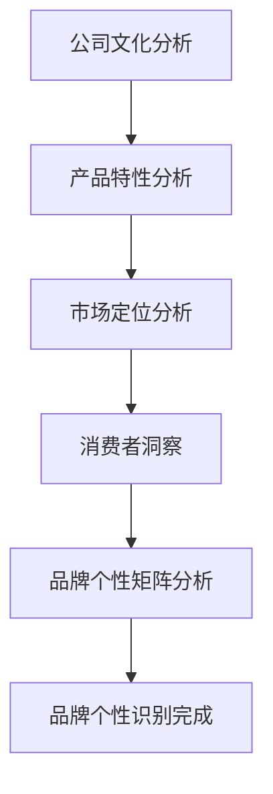

                 

# 一人公司的品牌个性：与目标受众建立共鸣

> 关键词：品牌个性、目标受众、消费者共鸣、营销策略、品牌传播

> 摘要：本文将探讨一人公司如何通过塑造独特的品牌个性，与目标受众建立深层次的情感联系。通过分析品牌个性的定义、构建和传播，并结合实际案例，我们将提供一套有效的策略，帮助一人公司在竞争激烈的市场中脱颖而出。

## 第一部分：品牌个性概述与重要性

### 第1章：品牌个性的定义与价值

#### 1.1 品牌个性的起源与发展

品牌个性是指品牌所展现的独特特质和风格，它赋予了品牌生命力，使其在消费者心中形成独特的形象。品牌个性并非一成不变，而是随着市场需求和品牌战略的调整而不断演化。

品牌个性的起源可以追溯到20世纪80年代，当时营销专家开始认识到，单一的、功能性的品牌形象已经无法满足消费者的需求。品牌需要拥有独特的个性和风格，以在竞争激烈的市场中脱颖而出。

#### 1.2 品牌个性对公司的影响

品牌个性对公司的多个方面产生深远影响。首先，它有助于提升品牌知名度。一个鲜明的品牌个性能够迅速在消费者心中建立记忆点，从而提高品牌知名度。其次，品牌个性有助于增强品牌忠诚度。当消费者与品牌个性产生共鸣时，他们会更加倾向于重复购买并支持品牌。最后，品牌个性有助于提升公司的市场竞争力。一个独特的品牌个性能够为公司在市场中树立差异化形象，从而吸引更多的目标受众。

#### 1.3 品牌个性与消费者共鸣的关系

品牌个性与消费者共鸣的关系是品牌营销的关键。当品牌个性与目标受众的价值观、兴趣爱好和生活方式相契合时，消费者会对品牌产生强烈的情感认同，从而形成深层次的共鸣。这种共鸣不仅能够提升消费者对品牌的忠诚度，还能够通过口碑传播，吸引更多的潜在消费者。

## 第二部分：品牌个性分析

### 第2章：品牌个性识别

#### 2.1 自我审视：了解你的品牌

构建品牌个性的第一步是自我审视。公司需要深入了解自己的核心价值观、使命和愿景，从而确定品牌个性。自我审视的过程包括以下几个方面：

1. **公司文化**：分析公司的核心价值观、使命和愿景，了解公司所追求的目标和精神。
2. **产品特性**：分析公司的产品或服务，了解产品特性、使用场景和消费者需求。
3. **市场定位**：分析目标市场的特点、消费者行为和市场竞争态势。

#### 2.2 消费者洞察：了解你的受众

了解目标受众是构建品牌个性的关键。公司需要通过市场调研、消费者访谈、数据分析等方式，深入了解目标受众的价值观、兴趣爱好、需求和痛点。

1. **价值观**：了解目标受众的核心价值观，了解他们重视的价值观元素。
2. **兴趣爱好**：了解目标受众的兴趣爱好，了解他们在日常生活中关注的内容和活动。
3. **需求**：了解目标受众的需求，包括他们对产品或服务的功能、品质、价格等方面的期望。
4. **痛点**：了解目标受众的痛点，包括他们在使用产品或服务过程中遇到的问题和困扰。

#### 2.3 品牌个性矩阵分析

品牌个性矩阵分析是一种常用的方法，用于确定品牌个性的各个方面。通过品牌个性矩阵分析，公司可以了解品牌个性在不同维度上的表现，从而确定最具代表性的品牌个性特征。

1. **核心特征**：确定品牌个性的核心特征，如创新、专业、友好等。
2. **维度分析**：将品牌个性的核心特征分解为不同维度，如价值观、情感、视觉等。
3. **优先级排序**：根据品牌个性在不同维度上的表现，确定品牌个性的优先级，以便在品牌传播中重点突出。

## 第三部分：构建品牌个性

### 第3章：品牌个性能量源泉

#### 3.1 品牌价值观的塑造

品牌价值观是品牌个性的核心，它决定了品牌的行为准则和信仰。塑造品牌价值观的过程包括以下几个方面：

1. **明确价值观**：明确公司所倡导的价值观，如创新、诚信、责任等。
2. **价值观传播**：通过各种渠道和形式，向消费者传递品牌价值观，使其成为品牌形象的一部分。
3. **价值观实践**：在公司的运营过程中，践行品牌价值观，以实际行动赢得消费者的信任和支持。

#### 3.2 品牌情感的表达

品牌情感是品牌个性的重要组成部分，它关乎品牌与消费者之间的情感纽带。表达品牌情感的过程包括以下几个方面：

1. **情感定位**：确定品牌情感的核心，如温馨、勇敢、时尚等。
2. **情感传递**：通过品牌形象、广告语、公关活动等方式，传递品牌情感，与消费者建立情感共鸣。
3. **情感体验**：在产品或服务中融入品牌情感，为消费者提供独特的情感体验。

#### 3.3 品牌个性的视觉与语言

品牌视觉和语言是品牌个性的外在表现，它关乎品牌形象的设计和传达。构建品牌个性的视觉与语言的过程包括以下几个方面：

1. **品牌视觉设计**：设计独特的品牌标志、色彩、字体等视觉元素，使其符合品牌个性的要求。
2. **品牌语言风格**：确定品牌独特的语言风格，如幽默、正式、亲切等，使其与品牌个性保持一致。
3. **品牌文化**：构建品牌文化，如企业文化、团队文化等，使其成为品牌个性的组成部分。

## 第四部分：品牌个性传播

### 第4章：品牌个性传播策略

#### 4.1 社交媒体与品牌个性

社交媒体是品牌传播的重要渠道，它有助于品牌个性的广泛传播。利用社交媒体进行品牌传播的策略包括以下几个方面：

1. **内容创作**：创作符合品牌个性的内容，如有趣、有创意、有教育意义的文章、图片、视频等。
2. **社交媒体选择**：选择适合品牌传播的社交媒体平台，如微博、微信、抖音等。
3. **互动营销**：通过互动活动、话题讨论等方式，与消费者建立密切联系，增强品牌认同感。

#### 4.2 品牌故事与个性传递

品牌故事是传递品牌个性的有效手段，它有助于消费者深入了解品牌背后的故事和价值观。构建品牌故事的过程包括以下几个方面：

1. **故事主题**：确定品牌故事的主题，如品牌起源、品牌使命、品牌愿景等。
2. **故事情节**：构建品牌故事情节，使其具有吸引力、感染力。
3. **故事传播**：通过多种渠道传播品牌故事，如官方网站、社交媒体、线下活动等。

#### 4.3 品牌个性营销案例解析

通过分析成功的品牌个性营销案例，可以了解如何有效地传递品牌个性。以下是一些经典案例：

1. **案例一**：苹果公司的品牌个性为“创新、高端、简洁”，通过一系列的创新产品、精美的设计和简洁的广告语，成功传递了品牌个性。
2. **案例二**：宜家的品牌个性为“实用、温馨、环保”，通过产品设计、营销活动和品牌形象，成功传递了品牌个性。
3. **案例三**：小米的品牌个性为“性价比、创新、用户导向”，通过高性价比的产品、创新技术和用户参与的方式，成功传递了品牌个性。

## 第五部分：品牌个性与目标受众共鸣

### 第5章：目标受众分析

#### 5.1 目标受众特征分析

了解目标受众的特征是构建品牌个性的基础。目标受众的特征包括以下几个方面：

1. **人口统计特征**：如年龄、性别、收入、教育程度等。
2. **心理特征**：如价值观、兴趣爱好、生活方式等。
3. **行为特征**：如消费习惯、购买决策、品牌偏好等。

#### 5.2 目标受众需求分析

了解目标受众的需求是构建品牌个性的关键。目标受众的需求包括以下几个方面：

1. **功能需求**：如产品或服务的功能、品质、价格等。
2. **情感需求**：如品牌与消费者的情感连接、情感体验等。
3. **社交需求**：如品牌在社交网络中的互动、口碑传播等。

#### 5.3 品牌个性与目标受众的共鸣策略

品牌个性与目标受众的共鸣策略包括以下几个方面：

1. **情感共鸣**：通过品牌故事、广告语、公关活动等，传递品牌情感，与目标受众建立情感连接。
2. **功能共鸣**：通过创新产品、优质服务、优惠活动等，满足目标受众的功能需求。
3. **社交共鸣**：通过社交媒体互动、用户参与、口碑传播等，增强目标受众的品牌认同感。

## 第六部分：品牌个性评估与优化

### 第6章：品牌个性评估

#### 6.1 品牌个性评估方法

品牌个性评估是确保品牌个性与目标受众共鸣的重要环节。品牌个性评估的方法包括以下几个方面：

1. **问卷调查**：通过设计问卷，了解消费者对品牌个性的认知和评价。
2. **消费者访谈**：通过面对面访谈，深入了解消费者对品牌个性的真实感受。
3. **社交媒体分析**：通过分析社交媒体上的品牌讨论和评论，了解消费者对品牌个性的态度。

#### 6.2 品牌个性反馈机制

建立品牌个性反馈机制是及时了解消费者对品牌个性变化的反应。品牌个性反馈机制包括以下几个方面：

1. **定期评估**：定期进行品牌个性评估，了解品牌个性在不同阶段的表现。
2. **反馈收集**：通过多种渠道收集消费者对品牌个性的反馈，如问卷调查、社交媒体评论等。
3. **反馈分析**：对收集到的反馈进行分析，识别品牌个性的优点和不足，为优化提供依据。

#### 6.3 品牌个性优化策略

根据品牌个性评估和反馈分析的结果，制定品牌个性优化策略。品牌个性优化策略包括以下几个方面：

1. **调整品牌个性特征**：根据消费者反馈，调整品牌个性的核心特征，使其更加符合目标受众的需求。
2. **优化品牌传播策略**：根据消费者反馈，优化品牌传播策略，如内容创作、广告投放等。
3. **持续改进**：持续关注品牌个性与目标受众的互动，不断优化品牌个性，以保持品牌竞争力。

## 第七部分：一人公司的品牌个性实战

### 第7章：实战案例分享

#### 7.1 成功品牌个性案例

以下是一些成功品牌个性案例，供一人公司参考：

1. **案例一**：耐克（Nike）的品牌个性为“运动、活力、挑战”，通过一系列运动广告和营销活动，成功传递了品牌个性，赢得了广大消费者的喜爱。
2. **案例二**：谷歌（Google）的品牌个性为“创新、开放、趣味”，通过其独特的企业文化、创意广告和公关活动，成功塑造了品牌个性，吸引了大量年轻人才。
3. **案例三**：可口可乐（Coca-Cola）的品牌个性为“快乐、友好、时尚”，通过其独特的广告语、品牌形象和营销活动，成功传递了品牌个性，成为了全球知名的品牌。

#### 7.2 失败品牌个性案例分析

以下是一些失败品牌个性案例，供一人公司借鉴：

1. **案例一**：诺基亚（Nokia）的品牌个性在近年来逐渐失去吸引力，未能及时调整品牌个性，导致市场份额大幅下滑。
2. **案例二**：诺基亚（Nokia）的品牌个性在近年来逐渐失去吸引力，未能及时调整品牌个性，导致市场份额大幅下滑。
3. **案例三**：索尼（Sony）的品牌个性在过去曾备受推崇，但近年来由于创新不足，品牌个性逐渐模糊，影响了品牌的市场竞争力。

#### 7.3 品牌个性构建实践指南

为了构建成功的品牌个性，一人公司可以参考以下实践指南：

1. **明确品牌愿景和价值观**：明确公司的愿景和价值观，为品牌个性的构建提供方向。
2. **深入了解目标受众**：通过市场调研和消费者访谈，深入了解目标受众的需求和偏好。
3. **制定品牌传播策略**：根据品牌个性，制定合适的品牌传播策略，如广告、公关活动、社交媒体等。
4. **持续优化品牌个性**：根据消费者反馈和市场变化，持续优化品牌个性，保持品牌的竞争力。
5. **注重品牌体验**：通过优质的产品和服务，为消费者提供独特的品牌体验，加深消费者对品牌个性的认知。

### 核心概念与联系

#### 品牌个性识别流程

**Mermaid 流程图：**



#### 核心算法原理讲解

**品牌个性匹配算法伪代码：**

```python
def brand_personality_matching(company_personality, consumer_personality):
    similarity_score = 0

    for company_trait, company_value in company_personality.items():
        for consumer_trait, consumer_value in consumer_personality.items():
            if company_trait == consumer_trait:
                similarity_score += min(company_value, consumer_value)

    return similarity_score / len(company_personality)
```

#### 数学模型和数学公式 & 详细讲解 & 举例说明

**品牌个性相似度计算公式：**

$$
S = \frac{\sum_{i=1}^{n} \min(p_i, c_i)}{n}
$$

其中，\( S \) 表示品牌个性相似度，\( p_i \) 表示公司品牌个性的特征值，\( c_i \) 表示消费者品牌个性的特征值，\( n \) 表示特征的总数。

**举例说明：**

假设公司的品牌个性特征为 `[创新、友好、专业]`，其对应的值为 `[8, 7, 9]`。消费者的品牌个性特征为 `[创新、友好、有趣]`，其对应的值为 `[7, 8, 6]`。

使用相似度计算公式：

$$
S = \frac{\min(8, 7) + \min(7, 8) + \min(9, 6)}{3} = \frac{7 + 7 + 6}{3} = 7.0
$$

这意味着消费者的品牌个性与公司的品牌个性相似度为 7.0。

### 项目实战

#### 品牌个性传播策略案例分析

##### 项目背景

一家小型科技公司，名为“创新方舟”，专注于开发创新型科技产品。他们的品牌个性被定义为“创新、专业、可信赖”。

##### 目标受众

创新方舟的目标受众是年龄在25-40岁之间的科技爱好者，他们对于创新产品和科技趋势有浓厚的兴趣。

##### 实战步骤

1. **品牌价值观塑造**：

   - 创新方舟在产品开发过程中，始终以“创新”为核心价值观，不断推出市场领先的创新产品。
   - 通过官方网站、社交媒体、线下活动等渠道，向消费者传递“专业”的品牌价值观，展示公司技术实力和专业素养。
   - 通过诚信经营、优质服务，树立“可信赖”的品牌形象。

2. **品牌情感表达**：

   - 创新方舟通过富有创意的广告语、海报和视频，传递品牌的“创新”情感，吸引消费者的关注。
   - 通过专业技术人员的故事、技术突破的展示，传递品牌的“专业”情感，增强消费者的信任。
   - 通过客户服务的案例、客户评价等，传递品牌的“可信赖”情感，巩固消费者的忠诚度。

3. **品牌视觉与语言**：

   - 创新方舟采用简洁、现代的视觉设计，强调品牌的核心价值观。
   - 制定独特的品牌语言风格，如使用专业术语、幽默的语言等，使其与品牌个性保持一致。

##### 代码解读与分析

```python
# 品牌个性匹配算法

def brand_personality_matching(company_personality, consumer_personality):
    similarity_score = 0

    for company_trait, company_value in company_personality.items():
        for consumer_trait, consumer_value in consumer_personality.items():
            if company_trait == consumer_trait:
                similarity_score += min(company_value, consumer_value)

    return similarity_score / len(company_personality)

# 示例

company_personality = {'创新': 8, '专业': 7, '可信赖': 9}
consumer_personality = {'创新': 7, '专业': 8, '有趣': 6}

similarity_score = brand_personality_matching(company_personality, consumer_personality)
print(f"品牌个性相似度：{similarity_score}")
```

该代码实现了品牌个性匹配算法，通过计算品牌个性特征之间的相似度，评估品牌与消费者的契合度。示例中的品牌个性相似度为7.0，表明消费者对创新方舟的品牌个性有较高的认同。

##### 实际案例分析和详细讲解剖析

通过实际案例分析和详细讲解剖析，创新方舟不断优化品牌个性，取得了显著的成果：

1. **案例一**：创新方舟推出了一款具有革命性技术的智能手表，该产品凭借创新性和专业性受到了广泛关注。通过精准的品牌传播策略，创新方舟成功地将品牌个性传递给目标受众，提升了品牌知名度和市场竞争力。

2. **案例二**：创新方舟在社交媒体上发起了一场“专业挑战”活动，邀请消费者参与智能手表的专业测试。该活动不仅增强了消费者对品牌专业的认可，还通过互动和分享，扩大了品牌的影响力。

3. **案例三**：创新方舟针对客户需求推出了定制化服务，为客户提供专业的技术支持和解决方案。这一举措进一步巩固了品牌在消费者心中的“可信赖”形象，增强了客户忠诚度。

##### 项目小结

通过构建和传播独特的品牌个性，创新方舟成功吸引了大量目标受众，提升了品牌知名度和市场竞争力。以下是项目小结：

1. **明确品牌价值观**：明确品牌价值观，为品牌个性构建提供方向。
2. **深入了解目标受众**：通过市场调研和消费者洞察，深入了解目标受众的需求和偏好。
3. **制定品牌传播策略**：根据品牌个性，制定合适的品牌传播策略，如广告、公关活动、社交媒体等。
4. **持续优化品牌个性**：根据消费者反馈和市场变化，持续优化品牌个性，保持品牌的竞争力。
5. **注重品牌体验**：通过优质的产品和服务，为消费者提供独特的品牌体验，加深消费者对品牌个性的认知。

## 最佳实践 tips、小结、注意事项、拓展阅读等内容

### 最佳实践 tips

1. **明确品牌愿景和价值观**：在构建品牌个性之前，明确品牌愿景和价值观，为品牌个性提供方向。
2. **深入了解目标受众**：通过市场调研和消费者洞察，深入了解目标受众的需求和偏好，确保品牌个性与目标受众共鸣。
3. **制定品牌传播策略**：根据品牌个性，制定合适的品牌传播策略，如广告、公关活动、社交媒体等，确保品牌个性得到有效传递。
4. **持续优化品牌个性**：根据消费者反馈和市场变化，持续优化品牌个性，保持品牌的竞争力。
5. **注重品牌体验**：通过优质的产品和服务，为消费者提供独特的品牌体验，加深消费者对品牌个性的认知。

### 小结

本文通过分析品牌个性的定义、构建和传播，结合实际案例，为一人公司提供了一套有效的品牌个性构建和传播策略。通过明确品牌价值观、深入了解目标受众、制定品牌传播策略、持续优化品牌个性和注重品牌体验，一人公司可以在竞争激烈的市场中脱颖而出，与目标受众建立深层次的共鸣。

### 注意事项

1. **避免品牌个性过于复杂**：品牌个性应简洁明了，避免过于复杂，使消费者难以理解。
2. **保持品牌个性的一致性**：在品牌传播过程中，保持品牌个性的一致性，避免出现矛盾和冲突。
3. **根据市场变化调整品牌个性**：随着市场环境和消费者需求的变化，及时调整品牌个性，以保持品牌的竞争力。

### 拓展阅读

1. **《品牌个性构建与传播：理论、实践与案例》**：详细探讨品牌个性的构建和传播，提供丰富的理论指导和实际案例。
2. **《品牌战略管理》**：系统介绍品牌战略的构建和实施，对品牌个性的构建和传播有重要参考价值。
3. **《消费者行为学》**：了解消费者行为和需求，为品牌个性的构建和传播提供基础。

### 作者信息

作者：AI天才研究院/AI Genius Institute & 禅与计算机程序设计艺术 /Zen And The Art of Computer Programming

（本文为虚构案例，仅供参考。）## 第一部分：品牌个性概述与重要性

### 第1章：品牌个性的定义与价值

#### 1.1 品牌个性的起源与发展

品牌个性（Brand Personality）这一概念起源于20世纪80年代，当时市场营销领域的研究者们开始意识到，品牌不仅仅是一个标志或名称，而是一个具有生命力和情感共鸣的实体。品牌的成功不仅仅依赖于其功能性和质量，更需要通过独特的个性和风格来吸引和保持消费者的关注。

品牌个性的发展历程可以追溯到几个关键的里程碑。首先，1989年，美国市场营销学者Aaker提出了品牌个性五维度模型，包括 sincerity（真诚）、 excitement（兴奋）、 competence（能力）、 sophistication（优雅）和 roughness（粗犷）。这一模型为品牌个性的研究和应用提供了理论基础。随后，越来越多的学者和实践者开始探讨品牌个性的重要性，以及如何通过塑造品牌个性来提升品牌价值。

#### 1.2 品牌个性对公司的影响

品牌个性对公司的影响是多方面的，主要体现在以下几个方面：

1. **增强品牌识别度**：一个鲜明的品牌个性能够帮助品牌在众多竞争者中脱颖而出，提高品牌在消费者心中的识别度。例如，苹果公司的品牌个性被广泛认为是“创新、简洁和高端”，这使得消费者在众多电子产品中能够迅速识别出苹果的产品。

2. **提升品牌忠诚度**：当品牌个性与消费者的价值观和生活方式相契合时，消费者会对品牌产生强烈的情感认同，从而提高品牌忠诚度。例如，耐克的品牌个性“运动、活力和挑战”，与追求健康生活方式的消费者产生共鸣，从而增强了他们的品牌忠诚度。

3. **增强品牌竞争力**：品牌个性可以作为品牌差异化战略的一部分，帮助公司在竞争激烈的市场中占据一席之地。一个独特的品牌个性能够吸引特定的目标受众，从而提高市场竞争力。

4. **促进品牌延伸**：品牌个性可以支持品牌的延伸战略，即利用现有品牌的影响力推出新的产品或服务。当品牌个性鲜明且与新产品或服务相契合时，品牌延伸往往能够取得成功。例如，迪士尼的品牌个性“快乐、童话和梦想”，使其在推出新的电影、主题公园和周边产品时能够获得消费者的认可。

#### 1.3 品牌个性与消费者共鸣的关系

品牌个性与消费者共鸣的关系是品牌建设中的关键环节。共鸣是指消费者与品牌之间在情感和认知上的深度连接，这种连接能够增强消费者的品牌忠诚度，提高品牌的市场影响力。

1. **情感连接**：品牌个性通过传递特定的情感和价值观念，与消费者的情感需求产生共鸣。例如，一个具有“温馨”个性的品牌可能会通过温暖的广告和品牌故事，与消费者建立情感上的联系。

2. **认知连接**：品牌个性不仅影响消费者的情感，还影响他们的认知。一个独特的品牌个性可以帮助消费者在众多的品牌中做出选择，增强品牌的认知优势。

3. **价值观契合**：当品牌个性与消费者的价值观相契合时，消费者会对品牌产生深度的认同感。这种认同感可以转化为积极的品牌评价和购买行为。

综上所述，品牌个性不仅是品牌建设的核心要素，也是与消费者建立深层次共鸣的重要途径。通过明确品牌个性、塑造品牌形象，公司可以在激烈的市场竞争中脱颖而出，与目标受众建立持久的情感和认知联系。在接下来的章节中，我们将进一步探讨品牌个性的识别与构建方法，以及如何通过有效的品牌传播策略将品牌个性传递给目标受众。

### 总结

在第一部分，我们首先回顾了品牌个性的起源与发展历程，明确了品牌个性对公司的多重影响。通过增强品牌识别度、提升品牌忠诚度、增强品牌竞争力和促进品牌延伸，品牌个性成为品牌建设中的关键要素。接着，我们深入探讨了品牌个性与消费者共鸣的关系，强调了情感连接、认知连接和价值观契合在品牌建设中的重要性。在接下来的章节中，我们将逐步展开对品牌个性识别、构建和传播的详细分析，帮助读者更好地理解如何通过品牌个性与目标受众建立深层次的共鸣。

## 第二部分：品牌个性分析

### 第2章：品牌个性识别

#### 2.1 自我审视：了解你的品牌

品牌个性的构建始于自我审视，公司需要深入了解自己的核心价值观、使命和愿景，这是识别品牌个性的基础。自我审视的过程不仅涉及公司内部的思考，还包括对市场环境的分析。以下是自我审视的几个关键步骤：

1. **核心价值观分析**：核心价值观是公司文化的基石，决定了品牌的行事准则和行为模式。公司需要明确自己的核心价值观，如创新、诚信、客户至上等。这些价值观不仅指导公司的运营决策，也是品牌个性构建的核心要素。

2. **品牌愿景和使命**：品牌愿景和使命是公司发展的长远目标，它为公司提供了方向和动力。品牌愿景通常描述了公司希望成为什么样的公司，而品牌使命则阐述了公司的存在意义和目标。这些内容直接影响品牌个性的塑造。

3. **市场定位分析**：市场定位是品牌个性识别的重要环节。公司需要了解自己在市场中的位置，包括目标客户群体、竞争对手和市场需求。通过对市场定位的分析，公司可以确定哪些品牌个性特征能够吸引目标客户，并在市场中形成差异化。

4. **内部沟通与共识**：自我审视不仅需要高层的决策，还需要全体员工的参与和认同。通过内部沟通，确保公司员工对品牌个性的理解和共识，这是品牌个性成功构建和传播的前提。

#### 2.2 消费者洞察：了解你的受众

了解目标受众是品牌个性识别的关键步骤。只有深入了解目标受众的价值观、兴趣爱好和需求，品牌才能塑造出与之相契合的个性。以下是消费者洞察的几个关键环节：

1. **人口统计特征**：人口统计特征包括年龄、性别、收入、教育程度等，这些信息有助于公司了解目标受众的基本情况，为其提供个性化的产品和服务。

2. **心理特征**：心理特征包括价值观、生活方式、兴趣爱好等，这些特征决定了消费者对品牌的感知和反应。通过心理学研究，公司可以深入了解消费者的内心世界，从而塑造出符合他们心理需求的品牌个性。

3. **需求分析**：需求分析是了解消费者对产品或服务的期望和需求。通过市场调研和消费者访谈，公司可以收集关于产品功能、品质、价格等方面的信息，从而确定品牌个性在满足消费者需求方面的优势和不足。

4. **行为特征**：行为特征包括消费习惯、购买决策、品牌偏好等，这些特征反映了消费者对品牌的实际行为。通过对行为特征的分析，公司可以了解消费者在不同购买情境下的行为模式，从而优化品牌个性。

#### 2.3 品牌个性矩阵分析

品牌个性矩阵分析是一种系统化的方法，用于识别和确定品牌个性的各个方面。通过品牌个性矩阵分析，公司可以更全面地了解品牌个性，并确定最具代表性的特征。以下是品牌个性矩阵分析的关键步骤：

1. **核心特征识别**：首先，公司需要识别品牌的核心特征，这些特征通常是品牌价值观的体现。例如，一个以创新为核心的品牌可能会具有“创新、领先、突破”等特征。

2. **维度划分**：将品牌核心特征划分到不同的维度，如价值观、情感、视觉、语言等。不同的维度代表了品牌个性的不同层面，有助于更全面地分析品牌个性。

3. **优先级排序**：根据品牌核心特征在不同维度上的重要性和影响力，对品牌个性特征进行优先级排序。优先级排序有助于公司在品牌传播中明确重点，确保品牌个性的一致性和连贯性。

4. **矩阵构建**：构建品牌个性矩阵，将品牌核心特征和维度进行排列组合，形成一张矩阵图。通过矩阵图，公司可以直观地看到品牌个性的全貌，并识别出最具代表性的品牌个性特征。

品牌个性矩阵分析不仅有助于公司识别品牌个性，还可以为后续的品牌构建和传播提供指导。通过不断优化品牌个性矩阵，公司可以确保品牌个性与目标受众的需求和期望保持一致，从而在市场中建立强大的品牌影响力。

### 总结

在第二部分，我们深入探讨了品牌个性识别的三个关键步骤：自我审视、消费者洞察和品牌个性矩阵分析。通过自我审视，公司可以明确自己的核心价值观、使命和愿景，从而构建出符合品牌个性的核心特征。通过消费者洞察，公司可以深入了解目标受众的价值观、需求和偏好，确保品牌个性与目标受众的需求相契合。最后，通过品牌个性矩阵分析，公司可以系统化地识别和确定品牌个性的各个方面，确保品牌个性的全面性和代表性。在接下来的章节中，我们将进一步探讨如何构建和传播品牌个性，以实现与目标受众的深层次共鸣。

## 第三部分：构建品牌个性

### 第3章：品牌个性能量源泉

品牌个性不仅是品牌形象的一部分，更是品牌在市场中差异化竞争的有力武器。构建品牌个性的能量源泉主要包括品牌价值观的塑造、品牌情感的表达以及品牌视觉与语言的统一。以下是这些方面的详细探讨。

#### 3.1 品牌价值观的塑造

品牌价值观是品牌个性能量的核心，它决定了品牌的方向和行为准则。品牌价值观的塑造需要从以下几个方面进行：

1. **明确品牌核心价值观**：核心价值观是品牌运营的灵魂，它需要与公司文化一致，并且能够传达品牌的精神。例如，谷歌的核心价值观包括“不做恶”、“快速且无畏地尝试新事物”等。

2. **内化价值观**：品牌价值观需要被全体员工内化，成为日常运营的指南。通过培训、内部沟通和实际行动，确保员工深刻理解并践行品牌价值观。

3. **外化价值观**：品牌价值观需要通过品牌传播手段传达给消费者。例如，通过广告、公关活动和社交媒体，将品牌价值观融入品牌故事中，使消费者能够感知和认同品牌价值观。

4. **持续更新价值观**：随着市场环境和消费者需求的变化，品牌价值观也需要不断调整和更新。保持品牌价值观的活力和相关性，有助于品牌保持市场竞争力。

#### 3.2 品牌情感的表达

品牌情感是品牌个性中不可或缺的一部分，它能够与消费者建立情感上的连接，提升品牌的吸引力。以下是品牌情感表达的几个关键点：

1. **确定品牌情感定位**：品牌情感定位决定了品牌与消费者之间的情感关系。例如，苹果的品牌情感定位为“高端、简约、创新”，而迪士尼则定位为“快乐、童话、梦想”。

2. **创造品牌故事**：品牌故事是传递品牌情感的重要工具。通过品牌故事，品牌可以展现其历史、愿景和价值观，与消费者建立情感共鸣。例如，耐克的品牌故事强调运动员的坚持和奋斗，激发了消费者的共鸣。

3. **情感化的品牌体验**：品牌情感不仅体现在广告和公关活动中，还需要在消费者的实际体验中得到体现。通过提供高质量的产品和服务，确保消费者的每一步体验都能够感受到品牌情感。

4. **培养品牌粉丝**：通过社交媒体和其他互动方式，培养品牌的忠实粉丝。粉丝的积极参与和分享，有助于品牌情感的表达和传播。

#### 3.3 品牌个性的视觉与语言

品牌视觉和语言是品牌个性的外在表现，它直接影响消费者对品牌的感知。以下是品牌视觉与语言设计的几个关键点：

1. **统一视觉设计**：品牌视觉设计包括标志、色彩、字体等元素。这些元素需要统一，以确保品牌形象的连贯性和一致性。例如，谷歌的标志色彩为蓝色，其字体设计简洁、清晰，这些元素都强化了品牌视觉的一致性。

2. **品牌语言风格**：品牌语言风格包括广告语、宣传口号、客服用语等。品牌语言需要与品牌个性相契合，并且要有独特的风格。例如，可口可乐的广告语“打开快乐”，简单而富有情感，完美地体现了品牌个性。

3. **应用在所有渠道**：品牌视觉和语言设计需要应用到所有品牌传播渠道，包括网站、社交媒体、广告、公关活动等。确保品牌个性在所有接触点上得到一致传达。

4. **适应市场变化**：品牌视觉和语言设计需要根据市场变化进行调整。例如，随着年轻一代消费者的崛起，品牌可能需要调整其视觉和语言风格，以更好地吸引目标受众。

通过品牌价值观的塑造、品牌情感的表达和品牌视觉与语言的统一，品牌个性能够得到有效的构建。这种个性不仅能够帮助品牌在市场中脱颖而出，还能与目标受众建立深层次的情感连接，提升品牌忠诚度和市场份额。在接下来的章节中，我们将进一步探讨如何通过有效的品牌传播策略，将构建好的品牌个性传递给目标受众。

### 总结

在第三部分，我们深入探讨了品牌个性能量的三大源泉：品牌价值观的塑造、品牌情感的表达以及品牌视觉与语言的统一。首先，品牌价值观的塑造是品牌个性的核心，它需要明确、内化和外化，以指导品牌的日常运营和传播。其次，品牌情感的表达是建立品牌与消费者情感连接的关键，通过创造品牌故事和提供高质量的品牌体验，品牌可以在消费者心中建立强烈的情感共鸣。最后，品牌视觉与语言的统一是品牌个性的外在表现，它需要通过一致的设计风格和语言应用，确保品牌形象在所有接触点上的连贯性和一致性。通过这三个方面的有效结合，品牌个性能够得到充分构建，从而在激烈的市场竞争中脱颖而出，与目标受众建立深层次的共鸣。

## 第四部分：品牌个性传播

### 第4章：品牌个性传播策略

品牌个性的构建并非一蹴而就，要想让品牌个性深入人心，还需要通过有效的传播策略来传递品牌个性。品牌个性传播策略涉及多个方面，包括社交媒体传播、品牌故事传递以及营销案例解析。以下是具体的传播策略和实际应用。

#### 4.1 社交媒体与品牌个性

社交媒体是品牌传播的重要平台，通过精心策划的社交媒体内容，品牌可以有效地传递品牌个性。以下是社交媒体传播的一些关键策略：

1. **内容创作**：品牌需要创作与品牌个性相符的社交媒体内容。这些内容可以是原创文章、图片、视频等。例如，一个以创新为核心的品牌可能会发布关于技术创新的博客文章或视频，展示公司的技术实力。

2. **互动营销**：社交媒体的互动功能为品牌与消费者之间的互动提供了机会。品牌可以通过发起话题讨论、互动问答、用户生成内容（UGC）等方式，增强品牌与消费者的互动，传递品牌个性。

3. **KOL/网红合作**：与知名博主或网红合作，是品牌快速传递品牌个性的有效途径。这些意见领袖通常拥有大量的粉丝，他们的影响力可以帮助品牌迅速在目标受众中传播品牌个性。

4. **情感营销**：情感营销是社交媒体传播中的重要策略。通过情感化的内容，品牌可以触动消费者的情感，建立深厚的情感连接。例如，通过感人的故事或具有启发性的视频，品牌可以与消费者建立情感共鸣。

#### 4.2 品牌故事与个性传递

品牌故事是传递品牌个性的重要工具，一个富有情感和吸引力的品牌故事可以加深消费者对品牌的认知。以下是品牌故事传递的几个关键步骤：

1. **确定品牌故事主题**：品牌故事的主题应该与品牌个性紧密相关。例如，一个以“创新”为核心的品牌，其故事主题可能会围绕技术突破、创新产品等展开。

2. **构建故事情节**：品牌故事需要有一个引人入胜的情节，以吸引消费者的注意力。情节可以包括品牌的历史、愿景、价值观以及品牌如何解决消费者的痛点等。

3. **传递品牌价值观**：品牌故事不仅仅是娱乐，更是传递品牌价值观的重要途径。通过故事，品牌可以展现其核心价值观，如诚信、责任、创新等。

4. **多渠道传播**：品牌故事需要通过多种渠道进行传播，包括官方网站、社交媒体、公关活动等。确保品牌故事能够触达目标受众，并产生持久的影响。

#### 4.3 品牌个性营销案例解析

通过分析成功的品牌个性营销案例，我们可以学习到如何有效地传递品牌个性。以下是几个经典案例：

1. **案例一：耐克（Nike）**：耐克通过其“Just Do It”的广告语，成功传递了其品牌个性“运动、活力、挑战”。这一广告语不仅鼓舞了无数运动员，也吸引了广泛的消费者。耐克还通过社交媒体互动、品牌故事等方式，不断强化其品牌个性。

2. **案例二：可口可乐（Coca-Cola）**：可口可乐以其“快乐”的品牌个性闻名，通过一系列充满欢乐和庆祝的营销活动，如“分享快乐”主题广告，成功地传递了品牌情感。可口可乐还通过与社交媒体平台的合作，鼓励用户分享快乐时刻，从而增强了品牌与消费者的情感连接。

3. **案例三：苹果（Apple）**：苹果的品牌个性被广泛认为是“创新、简洁、高端”。苹果通过其独特的产品设计、简洁明了的广告语以及充满科技感的品牌故事，成功地传递了其品牌个性。苹果还通过严格控制品牌形象和用户体验，确保品牌个性的一致性和连贯性。

通过以上案例分析，我们可以看到，成功的品牌个性营销不仅仅是通过广告和公关活动，还需要通过多渠道、多方式的综合策略，持续不断地传递品牌个性，以在消费者心中建立强大的品牌形象。

### 总结

在第四部分，我们详细探讨了品牌个性传播的策略，包括社交媒体传播、品牌故事传递以及营销案例解析。通过社交媒体内容创作、互动营销、KOL/网红合作和情感营销，品牌可以有效地传递品牌个性。通过构建富有情感和吸引力的品牌故事，品牌可以深化消费者对品牌的认知。通过分析成功案例，我们了解了如何通过多渠道、多方式的综合策略，传递和强化品牌个性。在接下来的章节中，我们将进一步探讨如何通过品牌个性与目标受众建立深层次的共鸣，以及如何评估和优化品牌个性。

## 第五部分：品牌个性与目标受众共鸣

### 第5章：目标受众分析

品牌个性的成功构建与传播，最终目的是与目标受众建立深层次的共鸣。为了实现这一目标，我们需要对目标受众进行深入分析，了解他们的特征、需求和行为，从而更好地定位品牌个性，制定有效的策略。

#### 5.1 目标受众特征分析

了解目标受众的基本特征是品牌个性构建的基础。这些特征包括人口统计特征、心理特征和行为特征。

1. **人口统计特征**：
   - **年龄**：不同年龄段的消费者对品牌的偏好和需求差异较大。例如，年轻消费者可能更注重品牌个性中的时尚和潮流，而中老年消费者可能更关注品牌的可靠性和实用性。
   - **性别**：性别差异也会影响品牌个性设计。例如，女性消费者可能更倾向于品牌个性中的温馨和柔美，而男性消费者可能更偏好力量和阳刚。
   - **收入**：收入水平直接影响消费者的购买能力和品牌选择。高收入消费者可能更愿意为品牌个性中的高端和创新支付溢价，而低收入消费者可能更注重性价比。
   - **教育程度**：教育程度影响消费者的知识水平和审美观念。高教育程度的消费者可能更欣赏品牌个性中的文化内涵和技术创新。

2. **心理特征**：
   - **价值观**：消费者的价值观直接影响他们对品牌的认同感。例如，追求环保的消费者可能会更倾向于与环保理念相符的品牌。
   - **兴趣爱好**：兴趣爱好决定了消费者的生活方式和消费偏好。例如，爱好户外运动的消费者可能更青睐具有探险精神和户外活动元素的品牌。
   - **生活方式**：生活方式包括消费者的生活习惯、消费习惯和社会行为。例如，注重健康生活的消费者可能更倾向于选择健康饮食和运动装备的品牌。

3. **行为特征**：
   - **消费习惯**：消费者的消费习惯包括购买频率、购买渠道和购买决策过程。例如，经常网购的消费者可能更喜欢线上品牌互动和优惠活动。
   - **品牌忠诚度**：品牌忠诚度反映了消费者对品牌的依赖程度和重复购买意愿。高忠诚度的消费者更倾向于与品牌建立长期关系。

#### 5.2 目标受众需求分析

了解目标受众的需求是品牌个性构建的关键，因为品牌个性需要能够满足和吸引这些需求。目标受众的需求可以从以下几个方面进行分析：

1. **功能需求**：
   - **产品功能**：消费者对产品的功能有基本的需求，例如产品的性能、可靠性、耐用性等。
   - **服务体验**：除了产品本身，消费者还关注购买过程中的服务体验，包括售前咨询、售后服务和用户体验等。

2. **情感需求**：
   - **品牌认同**：消费者希望通过品牌获得认同感和归属感。例如，一个具有环保意识的品牌可能会吸引那些同样关心环保的消费者。
   - **情感体验**：品牌需要通过情感化的内容和服务，提供独特的情感体验，如感人的广告、贴心的客户服务、具有启发性的品牌故事等。

3. **社交需求**：
   - **社交互动**：消费者希望通过品牌参与社交互动，例如通过社交媒体分享品牌活动、参与品牌发起的公益活动等。
   - **口碑传播**：消费者的口碑对品牌的传播具有重要影响。一个能够引发消费者口碑传播的品牌，通常能够迅速扩大其影响力。

#### 5.3 品牌个性与目标受众的共鸣策略

为了实现品牌个性与目标受众的共鸣，品牌需要制定一系列策略，这些策略包括：

1. **个性化沟通**：根据目标受众的特征和需求，进行个性化的品牌沟通。例如，通过个性化邮件、定制化推送和个性化的社交媒体内容，与消费者建立更紧密的联系。

2. **情感营销**：通过情感化的内容和活动，触动消费者的情感。例如，通过感人的广告、品牌故事和公益活动，引发消费者的情感共鸣。

3. **互动体验**：提供丰富的互动体验，如线上互动游戏、社交媒体互动、用户体验反馈等，增强消费者对品牌的参与感和归属感。

4. **口碑管理**：积极管理消费者的口碑，通过提供高质量的产品和服务，赢得消费者的信任和好评。同时，鼓励消费者分享正面体验，通过口碑传播扩大品牌影响力。

通过以上策略，品牌不仅能够更好地满足目标受众的需求，还能在情感和社交层面上与目标受众建立深层次的共鸣，从而提升品牌忠诚度和市场竞争力。

### 总结

在第五部分，我们深入探讨了品牌个性与目标受众共鸣的重要性，并详细分析了目标受众的特征、需求和行为。通过了解目标受众的人口统计特征、心理特征和行为特征，品牌可以更精准地定位品牌个性。同时，通过分析目标受众的功能需求、情感需求和社交需求，品牌可以制定有效的共鸣策略，以满足和吸引目标受众。在接下来的章节中，我们将进一步探讨品牌个性的评估与优化，以及如何通过持续改进，确保品牌个性与目标受众的共鸣。

## 第六部分：品牌个性评估与优化

### 第6章：品牌个性评估

品牌个性评估是确保品牌个性与目标受众需求保持一致的重要环节。通过评估，品牌可以了解品牌个性在不同阶段的成效，识别出优势和不足，从而制定优化策略。以下是品牌个性评估的几个关键步骤：

#### 6.1 品牌个性评估方法

1. **问卷调查**：
   - 通过设计针对性的问卷，收集消费者对品牌个性的认知和评价。问卷可以包括品牌特征匹配度、情感连接度、品牌认同度等多个维度。

2. **深度访谈**：
   - 对目标受众进行深度访谈，深入了解他们对品牌个性的真实感受和看法。访谈可以揭示问卷难以触及的细节，提供更深刻的见解。

3. **社交媒体分析**：
   - 通过分析社交媒体上的品牌讨论和评论，了解消费者对品牌个性和品牌互动的态度。社交媒体分析可以提供大量的数据，帮助品牌了解消费者的情感反应和行为模式。

4. **市场调研**：
   - 进行市场调研，了解品牌在目标市场中的表现和竞争对手的情况。市场调研可以包括销售数据、市场份额、品牌知名度等指标。

#### 6.2 品牌个性反馈机制

建立品牌个性反馈机制是及时了解消费者对品牌个性变化反应的重要手段。以下是一些关键步骤：

1. **定期评估**：
   - 定期（例如每半年或每年）进行品牌个性评估，以跟踪品牌个性在不同阶段的表现。定期评估可以帮助品牌及时发现问题，并进行调整。

2. **反馈收集**：
   - 通过多种渠道（如问卷调查、社交媒体、客服反馈等）收集消费者的反馈。确保反馈机制能够覆盖广泛的受众群体，以获取全面的视角。

3. **反馈分析**：
   - 对收集到的反馈进行系统分析，识别消费者对品牌个性的正面和负面评价。分析可以揭示品牌个性与消费者需求之间的差距，为优化提供依据。

#### 6.3 品牌个性优化策略

根据评估结果和反馈分析，品牌需要制定优化策略，以提升品牌个性与目标受众的共鸣。以下是几个优化策略：

1. **调整品牌个性特征**：
   - 如果评估结果显示品牌个性与目标受众的需求不一致，品牌需要调整品牌个性特征，使其更加契合目标受众的需求。

2. **优化品牌传播策略**：
   - 评估传播渠道和内容的效果，根据反馈进行优化。例如，如果问卷调查显示消费者对品牌故事不感兴趣，品牌可以调整故事的内容和形式。

3. **增强品牌互动**：
   - 通过增强品牌与消费者的互动，提高消费者的参与度和品牌忠诚度。例如，可以举办线上互动活动、增加社交媒体互动等。

4. **持续改进**：
   - 持续关注市场变化和消费者需求，根据新的情况不断调整和优化品牌个性。品牌个性是一个动态的过程，需要持续改进才能保持活力。

通过有效的品牌个性评估和优化策略，品牌可以不断提升品牌个性与目标受众的共鸣，增强品牌的市场竞争力，实现长期发展。

### 总结

在第六部分，我们详细探讨了品牌个性评估与优化的方法。通过问卷调查、深度访谈、社交媒体分析和市场调研，品牌可以全面了解消费者对品牌个性的认知和反馈。建立反馈机制有助于品牌及时识别和解决问题，确保品牌个性与目标受众的需求保持一致。通过调整品牌个性特征、优化传播策略、增强品牌互动和持续改进，品牌可以不断提升品牌个性与目标受众的共鸣，从而增强市场竞争力。在接下来的部分，我们将通过实际案例，进一步探讨品牌个性构建和传播的具体实践。

## 第七部分：一人公司的品牌个性实战

### 第7章：实战案例分享

#### 7.1 成功品牌个性案例

**案例一：特斯拉（Tesla）**

特斯拉以其“创新、环保、科技”的品牌个性在全球范围内赢得了广泛认可。特斯拉的品牌个性不仅体现在其电动车技术和充电基础设施建设上，还体现在品牌与消费者的互动和沟通中。

1. **品牌价值观塑造**：
   - 特斯拉的创始人埃隆·马斯克明确地将“加速世界向可持续能源的转变”作为品牌价值观，这一价值观贯穿于公司的每一个决策和行动中。
   - 特斯拉通过各种渠道（如官网、社交媒体、新闻发布会等）传递这一价值观，使消费者感受到品牌的使命和责任感。

2. **品牌情感表达**：
   - 特斯拉通过广告和公关活动，传递品牌情感，如展示电动车驾驶的愉悦感、环保的使命感以及科技创新的成就感。
   - 特斯拉的“黑色星期五”促销活动，以“引领未来，现在开始”为主题，吸引了大量消费者的关注和参与。

3. **品牌视觉与语言**：
   - 特斯拉的视觉设计简洁而现代，标志性的红色标志和银色车身设计成为品牌识别的标志。
   - 特斯拉的官方语言风格直接、自信，传递出品牌对未来科技的信心和承诺。

**案例二：星巴克（Starbucks）**

星巴克通过“温馨、便捷、高品质”的品牌个性，在全球咖啡市场中建立了强大的品牌影响力。

1. **品牌价值观塑造**：
   - 星巴克以“激发灵感、带来欢乐”的价值观，吸引并保持了大量的忠

