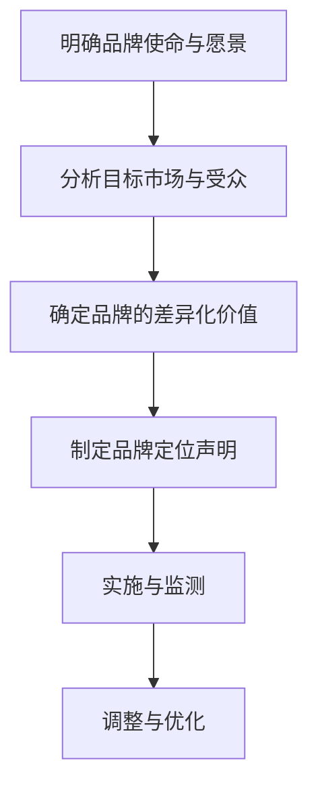

                 

### 《一人公司的品牌内容营销策略与执行》

#### 文章标题：一人公司的品牌内容营销策略与执行

关键词：**一人公司、品牌内容营销、策略、执行、挑战、机会**

摘要：本文将深入探讨一人公司的品牌内容营销策略与执行，从品牌定位、内容策略、内容创作与优化、内容发布与渠道管理、互动与社群建设、数据监测与分析等方面进行详细阐述，并提供成功案例和实战指南，以帮助一人公司打造有效的品牌内容营销策略。

---

### 引言

一人公司，顾名思义，是由一个独立个体运营的企业。在当今这个信息爆炸的时代，品牌内容营销成为企业获取市场关注和用户忠诚度的重要手段。对于一人公司而言，由于其资源有限、团队规模小，品牌内容营销更显得至关重要。本文将从以下几个方面详细讨论一人公司的品牌内容营销策略与执行：

1. **品牌内容营销基础**：介绍品牌内容营销的定义、优势以及一人公司在内容营销中的特殊挑战和机遇。
2. **品牌定位与内容策略**：阐述品牌定位的原理、步骤和内容营销策略的制定方法。
3. **内容创作与优化**：讨论内容创作的基本原则、技巧和内容优化的SEO策略。
4. **内容营销执行与推广**：分析内容发布与渠道管理的策略、用户互动与社群建设的方法。
5. **数据监测与分析**：介绍数据监测的重要性、工具应用和数据分析的方法与技巧。
6. **案例研究与实战指南**：提供具体的成功案例和内容营销的全流程操作指南。

通过上述内容的逐步分析，一人公司将能够掌握有效的品牌内容营销策略，提高品牌知名度和市场竞争力。

#### 第一部分：品牌内容营销基础

##### 第1章：品牌内容营销概述

**1.1 品牌内容营销的定义与重要性**

品牌内容营销是一种通过创作和分发有价值、相关且具有吸引力的内容，以吸引和留住目标受众，并最终推动业务增长的方法。与传统营销手段不同，内容营销更注重与受众建立长期的信任关系，而非仅仅进行推销。

**品牌内容营销的概念**：品牌内容营销包括各种形式的内容，如文章、视频、图片、音频、社交媒体帖子、电子邮件通讯等。这些内容旨在提供价值、娱乐、教育或启发受众，从而增强品牌影响力。

**品牌内容营销的优势**：品牌内容营销具有以下几大优势：

- **建立信任**：通过提供有价值的内容，品牌能够与受众建立信任关系，提高品牌认知度和美誉度。
- **降低获取成本**：内容营销成本相对较低，尤其适合资源有限的一人公司。
- **提高转化率**：优质内容能够引导潜在客户了解产品或服务，从而提高转化率。
- **增强品牌忠诚度**：长期、持续的内容营销能够培养忠实用户，增强品牌忠诚度。

**内容营销与传统营销的区别**：传统营销注重单一的销售渠道，如广告、促销活动等，而内容营销则通过多渠道、多形式的内容传播，实现全方位的品牌推广。此外，内容营销更注重用户体验和互动，而非单纯的推销。

**1.2 一人公司的内容营销挑战与机会**

一人公司的特点与局限性：

- **资源有限**：相对于大型企业，一人公司在资金、人力资源等方面存在明显局限。
- **时间压力大**：一个人需要承担多个角色，包括品牌策划、内容创作、营销推广等，时间管理成为一大挑战。
- **市场竞争力**：在激烈的市场竞争中，一人公司需要更有效的内容营销策略来脱颖而出。

然而，这些挑战同时也带来了一些独特的机遇：

- **灵活性高**：一人公司决策快、执行灵活，能够快速响应市场变化和用户需求。
- **专业性强**：专注于一领域，能够提供深入、专业的行业内容，建立权威品牌形象。
- **创新空间大**：独立个体在内容创作上更具创意，能够打造独特的品牌故事和营销活动。

**内容营销在个人品牌塑造中的应用**：

- **建立权威形象**：通过专业的内容，展示个人在某一领域的深度知识和见解，提升品牌影响力。
- **拓展受众群体**：通过内容传播，吸引更多潜在用户关注，扩大品牌受众范围。
- **增强用户粘性**：通过持续的内容更新，保持用户的关注和互动，提高用户忠诚度。

**独立操作者的优势分析**：

- **内容控制权**：独立操作者可以完全掌控内容的创作方向和发布节奏，确保品牌形象的一致性。
- **成本效益**：无需雇佣大量员工和支付昂贵的广告费用，降低运营成本。
- **快速反馈**：能够迅速获取用户反馈，及时调整内容策略，提高营销效果。

**1.3 定位错误的风险与纠正**

品牌定位是内容营销成功的关键。定位错误可能导致品牌形象模糊、目标受众不明确，从而影响营销效果。

- **定位错误的风险**：定位不清晰，品牌形象模糊，无法引起目标受众的兴趣；目标受众不明确，无法精准满足受众需求；营销资源浪费，无法获得预期效果。
- **定位错误的风险与纠正**：

  - **风险**：定位错误的风险在于，品牌信息传递不清晰，难以在用户心中形成鲜明印象。
  - **纠正**：纠正定位错误的方法包括重新审视品牌使命和目标，重新分析目标受众，调整内容策略和发布渠道，确保品牌形象的一致性和目标受众的精准定位。

通过上述分析，一人公司应当充分认识到品牌内容营销的重要性，并结合自身特点，制定出切实可行的内容营销策略，从而在激烈的市场竞争中脱颖而出。

---

### 第2章：品牌定位与内容策略

**2.1 品牌定位的原理与步骤**

品牌定位是品牌战略的核心，它决定了品牌在市场中的差异化价值和受众认知。正确的品牌定位有助于在竞争激烈的市场中脱颖而出，吸引目标受众，实现业务增长。以下是品牌定位的基本原理与步骤：

**品牌定位的基本原理**：

- **差异化价值**：品牌定位的核心在于为品牌找到独特的差异化价值，以区别于竞争对手。这种差异化可以是产品功能、服务体验、品牌故事、品牌形象等方面。
- **目标受众**：品牌定位需要明确目标受众，了解他们的需求、偏好和行为习惯，从而制定针对性的营销策略。
- **心智占位**：品牌定位旨在在目标受众的心智中建立独特的品牌形象，占据特定的位置。这种心智占位是通过持续的内容营销和品牌传播实现的。

**品牌定位的步骤与方法**：

**步骤1：明确品牌使命与愿景**

品牌使命与愿景是品牌定位的基石。品牌使命描述了品牌存在的根本目的和核心价值，而品牌愿景则描绘了品牌未来发展的蓝图。通过明确品牌使命与愿景，可以为品牌定位提供清晰的指导。

- **品牌使命**：例如，“为用户提供高质量、专业的技术内容，帮助他们在计算机编程和人工智能领域取得成功。”
- **品牌愿景**：例如，“成为计算机编程和人工智能领域最受信赖的知识来源，引领行业发展。”

**步骤2：分析目标市场与受众**

分析目标市场与受众是品牌定位的关键。通过了解目标市场的规模、增长潜力、竞争状况以及目标受众的需求、行为和偏好，可以更好地确定品牌的差异化价值。

- **市场分析**：研究市场趋势、市场规模、市场增长率以及主要竞争对手的定位和策略。
- **受众分析**：了解目标受众的年龄、性别、职业、收入水平、兴趣爱好、购买行为等，为品牌定位提供具体的数据支持。

**步骤3：确定品牌的差异化价值**

基于市场分析和受众分析的结果，需要为品牌确定独特的差异化价值。这种差异化价值可以是产品或服务的特定功能、独特的用户体验、品牌故事或者品牌形象等。

- **差异化价值**：例如，“提供深入浅出的技术内容，帮助新手快速入门，同时为专业人士提供前沿的技术洞察。”
- **差异化策略**：通过内容形式、内容风格、内容深度等方面的差异化，确保品牌在目标受众心中占据独特位置。

**步骤4：制定品牌定位声明**

品牌定位声明是对品牌定位的明确表述，通常包括品牌使命、品牌差异化价值、目标受众和品牌愿景等内容。品牌定位声明可以帮助品牌在传播过程中保持一致性和清晰性。

- **品牌定位声明**：例如，“我们致力于为计算机编程和人工智能领域的用户创造有价值的知识内容，帮助他们在技术道路上不断进步。”

**步骤5：实施与监测**

品牌定位不是一次性的活动，而是一个持续的过程。在实施过程中，需要通过内容营销、品牌传播等手段不断强化品牌定位，并定期监测品牌定位的效果，进行必要的调整和优化。

- **内容营销**：通过发布高质量的内容，传递品牌定位的核心信息，与目标受众建立深度互动。
- **品牌传播**：利用社交媒体、博客、电子邮件等渠道，广泛传播品牌定位声明，提升品牌知名度。

**2.2 制定内容营销策略**

内容营销策略是品牌定位的具体实施路径，它决定了如何通过内容创作、发布和传播来实现品牌目标。以下是制定内容营销策略的基本步骤：

**步骤1：设定内容目标**

内容目标应与品牌目标一致，明确内容营销希望达成的具体目标，如增加网站流量、提升转化率、增加社交媒体关注者等。

- **目标1**：增加网站流量
- **目标2**：提高转化率
- **目标3**：提升社交媒体影响力

**步骤2：分析目标受众**

深入分析目标受众的需求、行为和偏好，确定他们的痛点、兴趣点以及获取信息的主要渠道。这将有助于制定针对性的内容策略。

- **受众分析**：通过问卷调查、用户访谈、数据分析等方法，了解目标受众的基本信息。
- **需求分析**：了解目标受众在计算机编程和人工智能领域的具体需求，如学习资源、技术分享、行业动态等。

**步骤3：选择内容类型**

根据目标受众的特点和需求，选择适合的内容类型，如文章、视频、图片、音频、案例研究等。多样化的内容类型有助于满足不同受众的偏好，提高内容传播效果。

- **内容类型**：技术文章、视频教程、图片展示、行业报告、案例分析等。
- **内容风格**：专业严谨、通俗易懂、幽默风趣等，根据受众特点调整内容风格。

**步骤4：规划内容发布频率和渠道**

发布频率和渠道的规划是确保内容营销策略有效执行的关键。根据品牌目标和受众偏好，制定合理的发布频率，并选择合适的发布渠道，如社交媒体、博客、电子邮件等。

- **发布频率**：每周发布1-2篇文章，保持稳定的更新节奏。
- **发布渠道**：利用社交媒体平台（如微博、微信公众号）、个人博客、电子邮件订阅等渠道进行内容发布。

**步骤5：制定内容预算和资源分配**

内容营销需要一定的预算支持，包括内容创作、发布、推广等环节。根据品牌目标、内容目标和资源情况，合理分配预算，确保内容营销策略的顺利实施。

- **内容创作**：聘请专业的内容创作者或利用内部资源进行内容创作。
- **发布推广**：利用社交媒体广告、合作推广、内容优化等手段进行内容推广。

**步骤6：监测与优化**

监测是内容营销策略中不可或缺的一环，通过数据分析和用户反馈，评估内容营销的效果，并进行持续优化。

- **监测工具**：使用Google Analytics、社交媒体分析工具等，监测网站流量、用户行为、内容效果等。
- **用户反馈**：收集用户反馈，了解他们的需求和意见，为内容优化提供依据。

通过上述步骤，一人公司可以制定出科学、系统的内容营销策略，确保品牌在市场中占据有利位置，实现长期发展目标。

---

### 第3章：内容创作与优化

**3.1 内容创作的原则与技巧**

内容创作是品牌内容营销的核心环节，其质量直接影响品牌形象和受众满意度。以下是内容创作的基本原则与技巧：

**原则1：提供有价值的内容**

内容的价值是吸引和留住受众的关键。高质量的内容应具备以下特点：

- **专业性**：针对目标受众的需求，提供专业、深入的知识和见解。
- **实用性**：内容应具备实际应用价值，帮助受众解决具体问题或提升技能。
- **独特性**：内容应具有独特性，避免同质化，以吸引受众的注意力。

**技巧1：创意思维**

创意思维是内容创作的重要技巧，有助于产生新颖、有趣的内容。以下是一些创意思维的技巧：

- **头脑风暴**：通过集体讨论，激发创意灵感。
- **类比思维**：将不同领域的事物进行类比，产生新的创意。
- **逆向思维**：从相反的角度思考问题，寻找创新的解决方案。

**技巧2：内容格式与风格**

内容格式和风格直接影响内容的可读性和吸引力。以下是一些内容格式和风格的选择：

- **格式**：文章、视频、图片、音频、案例研究、行业报告等。根据受众偏好和内容类型选择合适的格式。
- **风格**：专业严谨、通俗易懂、幽默风趣等。根据品牌定位和受众特点，选择合适的风格。

**技巧3：独特性与专业性**

内容创作应兼顾独特性和专业性。以下是一些实现独特性与专业性的方法：

- **深度分析**：对行业热点、技术趋势进行深度分析，提供独特的见解。
- **数据支撑**：使用数据和分析结果支撑观点，增加内容的可信度。
- **实战经验**：分享个人或团队的实战经验，提供实用的解决方案。

**3.2 内容优化与SEO策略**

内容优化是提高内容在搜索引擎中的排名和可见性的关键步骤。以下是一些内容优化和SEO策略的基本原则：

**原则1：关键词优化**

关键词优化是内容优化的重要环节，以下是一些关键词优化的原则：

- **选择合适的关键词**：通过市场调研和用户搜索行为分析，选择与内容主题相关的关键词。
- **关键词分布**：合理分布关键词，避免堆砌关键词，确保内容自然流畅。
- **长尾关键词**：挖掘长尾关键词，提高内容在特定领域的覆盖面。

**原则2：标题与摘要设计**

标题和摘要是吸引用户点击的重要因素。以下是一些标题与摘要设计的原则：

- **吸引点击**：使用引人入胜的标题，激发用户的兴趣。
- **关键词突出**：将主要关键词嵌入标题和摘要中，提高搜索相关性。
- **简明扼要**：摘要应简明扼要，概括内容核心，吸引用户阅读。

**原则3：页面速度优化**

页面速度是影响用户体验和搜索引擎排名的重要因素。以下是一些页面速度优化的原则：

- **图片优化**：压缩图片大小，减少页面加载时间。
- **代码优化**：精简和优化HTML、CSS和JavaScript代码，提高页面加载速度。
- **缓存策略**：使用缓存策略，减少重复请求，提高页面访问速度。

**原则4：内部链接优化**

内部链接优化有助于提高页面权重和用户停留时间。以下是一些内部链接优化的原则：

- **相关内容链接**：在内容中添加相关内容的链接，引导用户浏览其他页面。
- **逻辑结构**：构建清晰的内部链接结构，使用户能够轻松找到所需内容。
- **锚文本优化**：使用有意义的锚文本，提高链接的相关性和用户体验。

通过遵循上述原则和技巧，一人公司可以有效进行内容创作与优化，提高内容的质量和搜索引擎排名，从而吸引更多目标受众，实现品牌内容的广泛传播。

---

### 第二部分：内容营销执行与推广

##### 第4章：内容发布与渠道管理

内容发布是品牌内容营销的重要环节，其效果直接影响品牌传播的广度和深度。有效的发布策略和渠道管理能够确保内容在目标受众中迅速传播，提高品牌影响力。以下是内容发布与渠道管理的详细策略：

**4.1 内容发布计划**

内容发布计划是确保内容有序、有规律地传播的重要手段。以下是一些关键策略：

**发布频率与规律**

- **定期更新**：制定固定的更新频率，如每周发布一篇高质量文章或视频，以保持受众的关注和互动。
- **节假日与事件**：在重要节假日或行业事件期间，增加发布频率，制作相关内容，吸引更多关注。
- **内容类型组合**：结合不同类型的内容，如技术文章、视频教程、图片展示等，保持内容的新鲜感和多样性。

**内容更新策略**

- **持续迭代**：根据用户反馈和数据分析，不断优化和更新内容，确保内容保持相关性和时效性。
- **重要内容优先**：对于品牌推广的重要内容，优先发布和推广，确保最大程度的曝光和传播。

**内容类型组合**

- **教育型内容**：提供深入的技术教程、案例分析等，帮助用户提升技能和知识水平。
- **娱乐型内容**：通过幽默、互动等形式，吸引用户的注意力，提升品牌形象。
- **行业动态**：分享行业热点、技术趋势等，增强品牌的权威性和专业性。

**4.2 渠道管理策略**

选择合适的发布渠道和进行有效的渠道管理，是内容成功传播的关键。以下是一些渠道管理的策略：

**社交媒体平台分析**

- **平台选择**：根据目标受众的偏好和使用习惯，选择适合的社交媒体平台，如微博、微信公众号、LinkedIn等。
- **内容适配**：针对不同平台的特点，调整内容的形式和风格，确保内容能够吸引目标受众。

**跨平台内容分发**

- **同步发布**：在多个平台同步发布内容，确保内容的广泛传播。
- **差异化推广**：根据不同平台的特点，制定差异化的推广策略，提高内容在各个平台的影响力。

**渠道效果评估**

- **数据监测**：使用数据分析工具，如Google Analytics、社交媒体分析工具等，监测内容在不同渠道的传播效果。
- **效果分析**：分析内容在各个渠道的点击率、转发量、用户互动等指标，了解受众的反馈和喜好。
- **调整策略**：根据数据分析结果，调整内容发布和推广策略，优化渠道效果。

**4.3 跨平台合作与内容联盟**

跨平台合作和内容联盟是扩大内容传播范围的有效手段。以下是一些策略：

**跨平台合作**

- **品牌合作**：与其他品牌进行内容合作，共同制作和推广内容，实现资源共享和优势互补。
- **行业活动**：参与行业活动，如技术会议、行业论坛等，发布相关内容，提升品牌曝光度。

**内容联盟**

- **专业内容**：与专业内容创作者、行业专家合作，发布高质量的内容，增强品牌的权威性和专业性。
- **用户互动**：通过用户互动，如邀请用户参与内容创作、分享使用体验等，提高用户参与度和品牌忠诚度。

通过上述内容发布与渠道管理策略，一人公司可以有效提升品牌内容的传播效果，吸引更多目标受众，实现品牌价值的最大化。

---

### 第5章：互动与社群建设

**5.1 用户互动策略**

在品牌内容营销中，用户互动是建立品牌与受众之间紧密联系的关键。有效的用户互动策略能够增强用户参与度，提高品牌忠诚度。以下是用户互动策略的详细分析：

**社交媒体互动**

社交媒体平台是用户互动的主要渠道。以下是一些社交媒体互动的策略：

- **实时互动**：定期在社交媒体上发布内容，并实时回复用户评论和提问，展示品牌的人性化和亲和力。
- **话题引导**：通过发起话题讨论或互动话题，激发用户参与，增加品牌曝光度。
- **用户调研**：通过社交媒体进行调查问卷，收集用户反馈和需求，为内容创作和优化提供依据。

**用户评论管理**

用户评论是了解受众反馈和优化内容的重要途径。以下是一些用户评论管理的策略：

- **积极回复**：对用户的评论和反馈给予积极回应，展示品牌的关注和尊重。
- **引导正面评论**：通过提供优质内容和互动活动，引导用户发表正面评论，提升品牌形象。
- **处理负面评论**：对于负面评论，及时采取合理的措施进行处理，避免负面情绪扩散。

**用户参与度提升**

提升用户参与度是增强品牌忠诚度的重要手段。以下是一些提升用户参与度的策略：

- **互动活动**：定期举办线上或线下活动，如问答环节、有奖竞猜、用户分享等，激发用户的参与热情。
- **用户共创**：邀请用户参与内容创作，如征集用户故事、用户案例等，增强用户与品牌的互动。
- **用户奖励机制**：建立用户奖励机制，如积分、优惠券、实物奖励等，激励用户积极参与和分享。

**5.2 社群建设与维护**

社群是品牌与用户之间建立长期联系的重要载体。有效的社群建设与维护能够增强用户归属感和品牌忠诚度。以下是社群建设与维护的策略：

**社群目标设定**

设定明确的社群目标是社群建设的第一步。以下是一些社群目标的设定策略：

- **品牌传播**：通过社群传播品牌理念、价值观和产品信息，提高品牌知名度。
- **用户互动**：促进用户之间的交流和互动，增强用户之间的联系和忠诚度。
- **用户反馈**：收集用户的反馈和建议，优化产品和服务，提升用户体验。

**社群管理技巧**

有效的社群管理能够提升社群的活跃度和用户满意度。以下是一些社群管理的技巧：

- **内容策划**：定期发布高质量的内容，如行业动态、技术分享、用户故事等，吸引和保持用户的兴趣。
- **用户激励**：通过用户积分、奖励等机制，激励用户积极参与社群活动。
- **互动引导**：引导用户参与讨论和互动，促进社群的活跃度。
- **社群监控**：实时监控社群动态，及时处理用户问题和不适当言论，维护社群秩序。

**社群活动的策划与实施**

策划和实施有效的社群活动是提升用户参与度和品牌影响力的重要手段。以下是一些社群活动的策划与实施策略：

- **活动形式**：结合社群特点和用户需求，选择适合的活动形式，如线上讲座、线下聚会、用户沙龙等。
- **活动推广**：通过社交媒体、电子邮件等渠道，广泛推广活动信息，吸引更多用户参与。
- **活动策划**：详细策划活动流程和内容，确保活动顺利进行。
- **活动反馈**：收集活动反馈，了解用户的意见和建议，为下一次活动提供改进方向。

通过有效的用户互动和社群建设，一人公司可以建立强大的用户社区，提高品牌忠诚度，实现品牌的长期发展。

---

### 第6章：数据监测与分析

**6.1 数据监测的重要性**

数据监测在品牌内容营销中扮演着至关重要的角色。通过对关键数据的持续监测和分析，品牌可以深入了解营销活动的效果，优化策略，实现更高的投资回报率。以下是数据监测的重要性及其在品牌内容营销中的应用：

**营销数据的价值**

营销数据为品牌提供了宝贵的洞察，帮助品牌做出基于事实的决策。以下是一些营销数据的价值：

- **效果评估**：通过监测数据，品牌可以评估不同营销活动的效果，判断哪些策略最有效。
- **受众行为**：了解受众的访问行为、阅读习惯、互动行为等，有助于制定更精准的营销策略。
- **趋势分析**：通过数据分析，品牌可以发现市场趋势和用户需求变化，及时调整营销方向。
- **优化机会**：数据监测可以发现潜在的问题和优化机会，提升营销活动的整体效果。

**监测工具介绍**

品牌内容营销中常用的数据监测工具包括以下几类：

- **网站分析工具**：如Google Analytics，用于监测网站流量、用户行为等。
- **社交媒体分析工具**：如Facebook Insights、Twitter Analytics，用于监测社交媒体平台的用户互动和传播效果。
- **邮件营销分析工具**：如Mailchimp、SendinBlue，用于监测电子邮件营销的效果和用户行为。
- **SEO分析工具**：如Google Search Console、Ahrefs，用于监测网站在搜索引擎中的排名和关键词表现。

**监测指标设定**

设定适当的监测指标是数据监测的关键。以下是一些重要的监测指标：

- **访问量**：衡量网站或社交媒体平台的访问次数，反映内容的曝光度和吸引力。
- **转化率**：衡量用户完成目标行为的比例，如点击链接、购买产品等，反映内容的实用性和引导力。
- **停留时间**：衡量用户在网站或社交媒体平台上的停留时间，反映内容的吸引力和深度。
- **跳出率**：衡量用户在访问后立即离开的比例，反映内容的吸引力和用户体验。
- **社交分享量**：衡量用户在社交媒体上分享内容的次数，反映内容的传播效果和影响力。

**6.2 数据分析与应用**

数据分析是数据监测的延伸，通过对监测数据进行分析，品牌可以提取有价值的洞察，指导营销策略的优化。以下是一些数据分析的方法和应用：

**内容表现分析**

内容表现分析是评估不同类型内容效果的重要方法。以下是一些内容表现分析的方法：

- **点击率（CTR）**：分析不同类型内容的点击率，了解哪种内容形式最受用户欢迎。
- **阅读时长**：分析不同类型内容的平均阅读时长，了解内容的吸引力和深度。
- **跳出率**：分析不同类型内容的跳出率，了解内容的吸引力和用户体验。
- **转化率**：分析不同类型内容的转化率，了解内容的实用性和引导力。

**受众行为分析**

受众行为分析是了解用户行为和需求的重要方法。以下是一些受众行为分析的方法：

- **访问路径**：分析用户的访问路径，了解用户在网站或社交媒体平台上的行为模式。
- **用户来源**：分析用户的来源渠道，了解哪种渠道最能吸引目标受众。
- **用户设备**：分析用户使用的设备类型，了解不同设备的用户行为差异。
- **用户地域**：分析用户的地理位置，了解目标受众的分布情况。

**数据驱动的决策优化**

基于数据分析的决策优化是提升营销效果的关键。以下是一些数据驱动的决策优化方法：

- **A/B测试**：通过对比不同版本的营销内容，测试哪种策略更有效，从而优化营销策略。
- **受众细分**：根据用户行为和需求，将受众划分为不同的细分群体，制定个性化的营销策略。
- **内容优化**：根据用户反馈和数据分析，持续优化内容，提升用户体验和满意度。
- **预算分配**：根据数据表现，合理分配营销预算，确保资源投入在最有效的渠道和内容上。

通过数据监测与分析，一人公司可以深入了解品牌内容营销的效果，优化营销策略，实现更高的投资回报率，推动品牌的长期发展。

---

### 第7章：案例研究与实战指南

**7.1 案例研究：成功的一人公司品牌内容营销案例**

在这个案例研究中，我们将深入分析一家名为“TechMaster”的一人公司的品牌内容营销策略及其成功要素。

**案例介绍**

TechMaster 是一位独立的技术博主，专注于计算机编程和人工智能领域的知识分享。通过高质量的内容创作和有效的营销策略，TechMaster 在短时间内获得了广泛的关注和认可。

**成功要素分析**

**独特的内容定位**：TechMaster 的成功始于其独特的品牌定位。他专注于深入浅出地讲解复杂的技术概念，尤其擅长将抽象的技术知识通过生动的案例和图表进行解释。这使得他的内容在专业人士和新手之间都具备吸引力。

**高质量的内容创作**：TechMaster 的内容以高质量著称。他不仅注重内容的准确性，还非常注重内容的可读性和实用性。每一篇文章都经过细致的研究和多次修订，确保为读者提供有价值的信息。

**多渠道内容发布**：TechMaster 在多个平台进行内容发布，包括个人博客、GitHub、Twitter 和 LinkedIn。通过跨平台发布，TechMaster 的内容得以更广泛地传播，吸引了大量受众。

**互动与社群建设**：TechMaster 非常注重与读者的互动。他定期在社交媒体上与读者交流，回答问题，并邀请读者参与内容的创作和讨论。这种互动不仅增强了用户的参与感，还建立了忠实的读者群体。

**数据分析与优化**：TechMaster 利用数据分析工具，如 Google Analytics 和 Ahrefs，持续监测内容的传播效果和用户行为。通过数据分析，TechMaster 能够及时调整内容策略，优化营销效果。

**启示与借鉴**

TechMaster 的成功为一人公司提供了宝贵的启示：

- **内容定位**：明确自己的内容定位，确保内容具有独特性和专业性。
- **内容质量**：注重内容质量，确保内容的专业性和实用性。
- **多渠道发布**：利用多个平台进行内容发布，扩大内容的传播范围。
- **互动与社群**：积极与读者互动，建立强大的社群。
- **数据分析**：利用数据分析工具，持续优化内容策略和营销效果。

**7.2 实战指南：内容营销全流程操作**

以下是内容营销的全流程操作指南，帮助一人公司实现有效的品牌内容营销：

**创意策划**

- **确定主题**：根据受众需求和行业热点，确定内容主题。
- **创意构思**：通过头脑风暴，构思独特的创意点子。
- **方案制定**：制定详细的内容创作和发布计划。

**内容创作**

- **研究资料**：收集相关资料，确保内容的准确性和权威性。
- **撰写草稿**：初步撰写内容，进行思路梳理和框架搭建。
- **修改完善**：多次修订，确保内容的逻辑性和可读性。

**发布与推广**

- **内容发布**：在预定时间发布内容，确保内容的时效性。
- **渠道选择**：根据内容类型和受众特点，选择合适的发布渠道。
- **推广策略**：利用社交媒体、邮件订阅、合作伙伴等渠道，进行内容推广。

**数据监测与优化**

- **数据监测**：使用数据分析工具，监测内容的表现和用户行为。
- **效果评估**：根据监测数据，评估内容营销的效果。
- **策略调整**：根据效果评估，调整内容策略和发布计划。

通过上述实战指南，一人公司可以系统地实施内容营销，提升品牌影响力，实现业务增长。

---

### 附录

**附录A：品牌内容营销工具与资源**

**A.1 主流内容营销工具介绍**

以下是一些主流的内容营销工具，它们在内容创作、发布和数据分析等方面发挥了重要作用：

- **内容管理系统（CMS）**：如WordPress、Joomla、Drupal，用于创建和发布网站内容。
- **内容优化工具**：如Yoast SEO、SEOPress，用于优化网站SEO，提高搜索引擎排名。
- **数据分析工具**：如Google Analytics、Google Search Console，用于监测网站流量和用户行为。

**A.2 资源推荐**

以下是一些推荐的内容营销资源和学习资料：

- **行业报告**：如Google Trends、Moz Blog，提供行业趋势和市场分析。
- **优秀内容营销博客**：如Content Marketing Institute、Neil Patel，分享专业的内容营销知识和案例。
- **在线学习资源**：如Coursera、Udemy，提供内容营销相关的课程和培训。

通过这些工具和资源，一人公司可以更好地进行内容营销，提升品牌影响力。

---

### 核心概念与联系

为了更好地理解品牌内容营销的核心概念和它们之间的关系，我们可以使用Mermaid流程图来展示品牌定位的基本流程和关键步骤。以下是一个简化的Mermaid流程图示例：



在这个流程图中，从A到F的每个步骤都是品牌定位过程中不可或缺的一部分。品牌使命与愿景是品牌定位的起点，通过分析目标市场和受众，确定品牌的差异化价值，最终形成品牌定位声明。实施与监测是品牌定位的持续过程，通过调整与优化，确保品牌定位的准确性和有效性。

---

### 核心算法原理讲解

内容优化是品牌内容营销中的重要环节，特别是在搜索引擎优化（SEO）方面，算法的运用至关重要。以下是一个简化的内容优化算法伪代码，用于解释SEO关键要素及其优化算法：

```python
# 内容优化算法伪代码

# 定义关键词优化函数
def keyword_optimization(content, target_keywords):
    optimized_content = content
    keyword_density = 0.05  # 关键词密度目标值
    
    # 分布关键词
    for keyword in target_keywords:
        keyword_occurrences = count_keyword_occurrences(optimized_content, keyword)
        keyword_interval = calculate_keyword_interval(len(optimized_content), keyword_density)
        
        # 插入关键词
        optimized_content = insert_keyword(optimized_content, keyword, keyword_interval)
    
    # 优化标题与摘要
    title = create_title(optimized_content, target_keywords)
    summary = create_summary(optimized_content)
    
    return title, summary

# 关键词计数函数
def count_keyword_occurrences(content, keyword):
    return content.count(keyword)

# 关键词间隔计算函数
def calculate_keyword_interval(content_length, keyword_density):
    return int(content_length * keyword_density)

# 关键词插入函数
def insert_keyword(content, keyword, interval):
    interval_start = interval
    while interval_start < len(content):
        content.insert(interval_start, keyword)
        interval_start += interval + random.randint(1, 10)
    return content

# 创建标题函数
def create_title(content, target_keywords):
    return f"{target_keywords[0]} - {content[:50]}"

# 创建摘要函数
def create_summary(content):
    return content[:150]

# 主函数
def main():
    content = "原始内容..."
    target_keywords = ["关键词1", "关键词2"]
    
    optimized_title, optimized_summary = keyword_optimization(content, target_keywords)
    print("优化后的标题:", optimized_title)
    print("优化后的摘要:", optimized_summary)

# 运行主函数
main()
```

在这个伪代码中，`keyword_optimization` 函数负责优化内容。首先，它计算目标关键词的密度，并按照预定的间隔将关键词插入到内容中。然后，它创建一个符合SEO最佳实践的标题和摘要。这个算法的关键部分包括：

- **关键词计数**：统计目标关键词在内容中的出现次数。
- **关键词间隔计算**：根据内容长度和关键词密度计算关键词之间的理想间隔。
- **关键词插入**：将关键词插入到内容中，确保关键词分布均匀，避免堆砌。
- **标题和摘要生成**：创建包含关键词的吸引人的标题和简短的摘要。

通过这个伪代码示例，我们可以看到内容优化算法的核心原理和实现方法。在实际应用中，算法会更加复杂，考虑更多的SEO因素，如关键词位置、语义相关性、内容质量等。

---

### 数学模型与公式讲解

在品牌内容营销中，内容传播的数学模型和公式可以帮助我们理解和预测内容的传播效果。以下是一个简化的内容传播模型及其相关公式，使用LaTeX格式展示：

```latex
\documentclass{article}
\usepackage{amsmath}
\begin{document}

\section{内容传播模型}

内容传播模型可以用以下数学公式描述：

\[ R(t) = K \cdot (1 - e^{-\lambda t}) \]

其中：
- \( R(t) \) 表示在时间 \( t \) 内的内容传播范围；
- \( K \) 是内容的最大传播范围；
- \( \lambda \) 是内容传播速率；
- \( e \) 是自然对数的底数。

\section{参数解释}

- \( K \) 通常是一个常数，表示内容能够达到的最大受众范围。
- \( \lambda \) 是一个反映内容传播速度的参数，通常通过数据拟合得到。

\section{实例计算}

假设一篇文章的最大传播范围 \( K \) 为 \( 1000 \)，传播速率 \( \lambda \) 为 \( 0.1 \)。在 \( t = 10 \) 天时，内容传播范围 \( R(10) \) 计算如下：

\[ R(10) = 1000 \cdot (1 - e^{-0.1 \cdot 10}) \]

计算结果为：

\[ R(10) = 1000 \cdot (1 - e^{-1}) \approx 1000 \cdot (1 - 0.3679) \approx 632.1 \]

即，在10天后，内容的传播范围约为632人。

\end{document}
```

在这个内容传播模型中，\( R(t) \) 表示内容在时间 \( t \) 内的传播范围，公式基于指数衰减模型，反映了内容的传播速率随时间逐渐减小的特点。通过调整参数 \( K \) 和 \( \lambda \)，我们可以模拟不同条件下的内容传播效果，为内容营销策略提供数据支持。

---

### 项目实战

**案例实战：内容发布与推广**

**开发环境搭建**

在开始内容发布与推广之前，我们需要搭建一个合适的内容发布平台和开发环境。以下是一些建议和步骤：

1. **选择内容管理系统（CMS）**：首先，我们需要选择一个适合的内容管理系统。对于一人公司，WordPress、Joomla 和 Drupal 是不错的选择。这些系统都有丰富的插件和主题，便于自定义和扩展。

2. **购买域名和云主机**：购买一个适合自己的域名，并在云主机上部署内容管理系统。推荐使用阿里云、腾讯云或AWS等知名云服务提供商。

3. **配置网站**：在云主机上安装内容管理系统，并配置必要的插件和主题。例如，对于WordPress，我们可以安装SEO插件（如Yoast SEO）和社交媒体分享插件（如Social Pug）。

4. **设置SSL证书**：为了提高网站的安全性和可信度，我们需要安装SSL证书。可以使用免费的Let's Encrypt证书，或购买专业的SSL证书。

**源代码实现与解读**

以下是WordPress中一个简单的示例代码，用于发布一篇技术文章并设置SEO优化：

```php
<?php
/*
 * WordPress发布文章示例代码
 */

// 引入WordPress函数库
require_once('wp-config.php');
require_once('wp-load.php');

// 设置文章信息
$post_title = '如何优化WordPress网站性能';
$post_content = '内容主体...';
$post_status = 'publish';
$post_type = 'post';

// 创建新的文章
$new_post = wp_insert_post(
    array(
        'post_title' => $post_title,
        'post_content' => $post_content,
        'post_status' => $post_status,
        'post_type' => $post_type
    ),
    false
);

// 设置SEO优化
$seo_keywords = 'WordPress, 网站性能优化';
$seo_description = '本文介绍了如何优化WordPress网站性能，提高网站速度和用户体验。';

// 更新文章元数据
wp_set_object_terms($new_post, $seo_keywords, 'post_tag');
wp_update_post(array(
    'ID' => $new_post,
    'meta_input' => array(
        '_yoast_wpseo_metadesc' => $seo_description
    )
));

// 输出文章ID
echo '新文章的ID：' . $new_post;
?>
```

上述代码首先引入了WordPress的函数库，然后设置了文章的标题、内容和状态，通过`wp_insert_post`函数创建了新的文章。接着，设置SEO优化，包括关键词和描述，通过`wp_set_object_terms`和`wp_update_post`函数更新了文章的元数据。最后，输出新文章的ID。

**代码应用解读与分析**

这段代码应用了WordPress的核心API，通过简单的函数调用实现了文章的发布和SEO优化。以下是代码的主要解读和分析：

- **文章创建**：使用`wp_insert_post`函数创建新文章，传递了文章的标题、内容和状态。`false`参数用于不验证自动保存的草稿。
- **SEO优化**：通过`wp_set_object_terms`函数设置文章的关键词标签，`_yoast_wpseo_metadesc`元数据用于设置SEO描述。
- **代码分析**：代码结构清晰，逻辑简单，易于理解和维护。通过调用WordPress的核心API，实现了一系列复杂的操作，如文章创建、关键词标签设置和SEO优化。

**实际案例分析和详细讲解剖析**

以下是一个成功的实际案例，详细讲解了内容发布与推广的过程：

**案例：TechGuru博客的内容发布与推广**

TechGuru 是一位专注于科技领域的独立博主，通过高质量的内容和有效的推广策略，他在短时间内积累了大量忠实读者。

**实施策略**：

1. **内容创作**：TechGuru 专注于科技领域的热点话题，如人工智能、区块链和云计算等。他通过深入研究和独特视角，创作了一系列高质量文章。

2. **内容发布**：TechGuru 使用WordPress作为内容管理平台，定期发布新文章。他通过社交媒体（如Twitter、LinkedIn）和电子邮件订阅（如Mailchimp）进行内容推广。

3. **SEO优化**：TechGuru 使用SEO插件（如Yoast SEO）优化文章，确保文章在搜索引擎中的排名。他专注于关键词优化、内容结构和外部链接等。

4. **用户互动**：TechGuru 非常注重与读者的互动，通过回复评论、举办线上讨论和用户问答等方式，增强了用户参与度。

**效果评估**：

- **网站流量**：TechGuru 的网站流量稳步增长，尤其是在发布高质量文章和进行社交媒体推广后。
- **用户互动**：TechGuru 的读者参与度很高，评论和分享量显著增加。
- **搜索引擎排名**：TechGuru 的文章在搜索引擎中的排名不断提高，吸引了更多潜在读者。

**项目小结**：

TechGuru 的成功案例展示了内容发布与推广的关键要素：

1. **高质量内容**：创作高质量、专业性和有价值的文章是吸引和留住读者的基础。
2. **多渠道推广**：通过社交媒体、电子邮件和SEO等多种渠道进行推广，提高内容的可见度和传播范围。
3. **用户互动**：积极与读者互动，增强用户参与度和品牌忠诚度。
4. **持续优化**：根据数据分析结果，持续优化内容和推广策略，提高营销效果。

通过这些实践和案例，一人公司可以借鉴成功经验，制定适合自己的内容发布与推广策略，实现品牌内容的广泛传播和业务增长。

---

### 最佳实践 tips、小结、注意事项、拓展阅读等内容

**最佳实践 tips**

1. **持续创作**：定期发布高质量内容，保持品牌的活跃度和权威性。
2. **用户互动**：积极回应用户评论和私信，建立良好的用户关系。
3. **数据分析**：利用数据分析工具，了解用户行为和内容效果，持续优化内容策略。
4. **多样化内容**：结合不同形式的内容（如文章、视频、图片等），满足不同用户的偏好。

**小结**

本文详细探讨了品牌内容营销在一人公司中的应用，从品牌定位、内容创作、发布与推广、互动与社群建设、数据监测与分析等方面提供了全面的理论和实践指导。通过有效的品牌内容营销策略，一人公司可以提升品牌知名度、增强用户忠诚度，实现业务增长。

**注意事项**

1. **内容质量**：确保内容的专业性和实用性，避免发布低质量或无关内容。
2. **目标明确**：明确品牌定位和目标受众，确保内容策略与品牌目标一致。
3. **SEO优化**：合理优化标题、关键词和内容结构，提高搜索引擎排名。

**拓展阅读**

- 《内容营销实战手册》：详细介绍内容营销的策略、技巧和案例分析。
- 《SEO实战秘籍》：深入探讨搜索引擎优化（SEO）的理论和实践。
- 《社交媒体营销策略》：分享社交媒体平台的内容创作和推广技巧。

通过阅读这些拓展资料，一人公司可以进一步深化对品牌内容营销的理解，提升营销效果。

