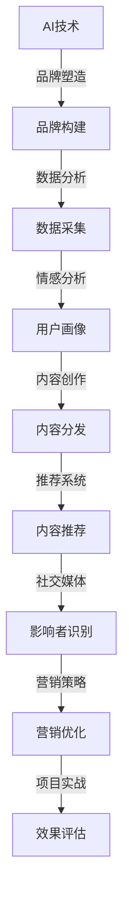

                 

### 文章标题：一人公司的品牌塑造：AI如何助力打造个人IP

在数字化时代，品牌塑造和个人IP的构建已成为个人和企业成功的核心要素。对于一人公司或独立创业者来说，如何在这个充满竞争的世界中脱颖而出，成为一个令人难以忘怀的IP，显得尤为重要。而人工智能（AI）技术的发展，为个人品牌塑造提供了前所未有的机会和工具。本文将深入探讨AI在个人品牌塑造中的应用，通过详细的步骤分析和实际案例，帮助读者了解如何利用AI技术打造个人IP。

### 关键词

- 个人品牌塑造
- 人工智能
- IP构建
- 内容创作
- 推荐系统
- 数据分析
- 营销策略
- 项目实战

### 摘要

本文将探讨AI在个人品牌塑造中的重要作用。首先，我们将概述AI在品牌塑造中的应用场景和核心概念。随后，深入讲解AI技术的基础知识，包括机器学习、深度学习和自然语言处理等。接着，我们将分析AI在内容创作、推荐系统、社交媒体分析和数据分析等方面的实际应用，并提供一系列最佳实践和项目实战案例。最后，我们将推荐一系列AI工具和资源，帮助读者进一步探索和利用AI技术。

### 目录

#### 第一部分：AI与个人品牌概述

1. AI与个人品牌塑造
    - 1.1 AI在品牌塑造中的作用
    - 1.2 个人IP的构建与维护
    - 1.3 AI技术在个人品牌塑造中的应用场景

2. AI技术基础与核心算法
    - 2.1 人工智能的基本概念
    - 2.2 机器学习与深度学习
    - 2.3 自然语言处理技术

3. 核心算法原理讲解
    - 3.1 人工智能算法概述
    - 3.2 机器学习算法原理与伪代码讲解
    - 3.3 深度学习算法原理与伪代码讲解
    - 3.4 自然语言处理算法原理与伪代码讲解

4. 数学模型与数学公式
    - 4.1 数学模型在AI中的应用
    - 4.2 常见数学公式与讲解
        - 4.2.1 概率论公式
        - 4.2.2 线性代数公式
        - 4.2.3 最优化算法公式

#### 第二部分：AI在个人品牌塑造中的实际应用

5. 内容创作与推荐系统
    - 5.1 基于AI的内容创作
        - 5.1.1 自动生成文本
        - 5.1.2 自动生成图像
    - 5.2 推荐系统原理与应用
        - 5.2.1 协同过滤算法
        - 5.2.2 内容推荐算法

6. 社交媒体分析与影响者识别
    - 6.1 社交媒体数据挖掘
        - 6.1.1 数据采集与预处理
        - 6.1.2 情感分析
    - 6.2 影响者识别
        - 6.2.1 基于算法的影响者识别
        - 6.2.2 影响者评价体系构建

7. 数据分析与营销策略
    - 7.1 数据分析在个人品牌塑造中的应用
        - 7.1.1 用户画像
        - 7.1.2 用户行为分析
    - 7.2 营销策略优化
        - 7.2.1 营销渠道选择
        - 7.2.2 广告投放策略

#### 第三部分：AI个人品牌塑造项目实战

8. 项目实战与案例分析
    - 8.1 AI个人品牌塑造项目搭建
        - 8.1.1 开发环境搭建
        - 8.1.2 数据采集与预处理
    - 8.2 实际案例分析
        - 8.2.1 成功案例
        - 8.2.2 失败案例分析
    - 8.3 代码解读与分析
        - 8.3.1 实现流程
        - 8.3.2 代码解读

#### 附录

9. AI工具与资源推荐
    - 9.1 常用AI工具介绍
    - 9.2 开源资源推荐

### 第一部分：AI与个人品牌概述

#### 第1章：AI与个人品牌塑造

随着互联网的普及，个人品牌（Personal Brand）已经成为每个人在职业和个人生活中不可或缺的一部分。个人品牌不仅仅是一个人的标志，更是他在社会中的独特身份和价值的体现。而在AI技术迅速发展的今天，个人品牌塑造的方式和方法也发生了翻天覆地的变化。

##### 1.1 AI在品牌塑造中的作用

AI技术为个人品牌塑造带来了全新的视角和工具。通过AI，个人可以更精准地了解自己的受众，更高效地创作内容，更准确地分析市场趋势，从而更有效地塑造个人品牌。

1. **数据分析与用户画像**：AI可以收集和分析大量的用户数据，通过用户画像技术，帮助个人了解自己的受众，从而更有针对性地进行品牌传播。
2. **内容创作与推荐系统**：AI技术可以自动生成高质量的内容，通过推荐系统，将内容精准推送给目标受众，提高内容的曝光率和影响力。
3. **社交媒体分析与影响者识别**：AI可以帮助个人分析社交媒体上的数据，识别潜在的影响者，通过合作和互动，扩大品牌的影响力。
4. **营销策略优化**：AI可以根据实时数据，优化营销策略，提高营销效果，降低营销成本。

##### 1.2 个人IP的构建与维护

个人IP（Personal Intellectual Property）是指个人在某一领域内的独特思想、知识、技能或创意等。构建和维护个人IP是个人品牌塑造的核心环节。

1. **定位与差异化**：个人IP的构建需要明确自己的定位和差异化特点，以便在众多竞争者中脱颖而出。
2. **持续创作与更新**：个人IP需要通过持续的创作和更新来保持活力和影响力，这包括写博客、出书、开设课程等多种形式。
3. **互动与社群建设**：通过社交媒体和线下活动，与受众互动，建立社群，增强个人IP的黏性和影响力。

##### 1.3 AI技术在个人品牌塑造中的应用场景

AI技术在不同领域都有广泛的应用，以下是AI在个人品牌塑造中的几个关键应用场景：

1. **内容创作**：通过自然语言处理技术，AI可以自动生成高质量的文章、博客和社交媒体内容，帮助个人快速产出内容。
2. **数据分析**：通过机器学习技术，AI可以对大量用户数据进行分析，帮助个人了解受众偏好，制定更有效的营销策略。
3. **推荐系统**：基于协同过滤和内容推荐算法，AI可以帮助个人将内容推荐给潜在受众，提高内容的传播效果。
4. **社交媒体分析**：通过情感分析和数据挖掘技术，AI可以帮助个人分析社交媒体上的数据，识别潜在的影响者。
5. **影响者识别**：AI可以帮助个人识别具有影响力的人物，通过合作和互动，扩大个人IP的知名度。

综上所述，AI技术在个人品牌塑造中发挥着重要作用，通过数据分析、内容创作、推荐系统和社交媒体分析等技术手段，个人可以更高效、精准地塑造和推广自己的品牌。

#### 第2章：AI技术基础

人工智能（Artificial Intelligence，简称AI）作为现代科技的前沿领域，其应用已经渗透到生活的方方面面。在本章中，我们将探讨人工智能的基本概念、机器学习和深度学习的基本原理，以及自然语言处理技术，为后续章节中的应用打下坚实的基础。

##### 2.1 人工智能的基本概念

人工智能是指通过计算机模拟人类智能的技术和科学。其核心目标是通过算法和计算模型，使机器能够完成通常需要人类智能才能完成的任务。人工智能的研究领域非常广泛，主要包括以下几个方向：

1. **机器学习**：通过算法让计算机从数据中学习，从而进行预测或分类。
2. **深度学习**：一种特殊的机器学习方法，通过多层神经网络进行数据处理和特征提取。
3. **自然语言处理**：使计算机能够理解、生成和处理人类自然语言的技术。
4. **计算机视觉**：使计算机能够识别和理解视觉信息，如图像和视频。
5. **机器人技术**：结合物理世界和人工智能，使机器人能够执行复杂任务。

##### 2.2 机器学习与深度学习

**机器学习（Machine Learning）** 是人工智能的一个重要分支，其核心思想是通过算法，让计算机从数据中学习，从而进行预测或分类。机器学习主要包括监督学习、无监督学习和强化学习等几种类型：

1. **监督学习（Supervised Learning）**：通过已知标签的数据进行训练，从而构建预测模型。常见的算法有线性回归、逻辑回归、决策树、随机森林等。
   
2. **无监督学习（Unsupervised Learning）**：在没有标签的数据上进行训练，主要任务是发现数据中的模式或结构。常见的算法有聚类、降维、关联规则学习等。

3. **强化学习（Reinforcement Learning）**：通过与环境进行交互，不断调整策略以最大化长期奖励。常见的算法有Q学习、深度Q网络（DQN）等。

**深度学习（Deep Learning）** 是机器学习的一个子领域，通过构建多层神经网络（Neural Network），进行数据处理和特征提取。深度学习的核心思想是通过反向传播算法（Backpropagation），不断调整网络中的权重，从而提高模型的预测准确性。

1. **神经网络（Neural Network）**：模仿人脑神经元结构，通过输入层、隐藏层和输出层进行处理。
   
2. **反向传播算法（Backpropagation）**：通过计算输出误差，反向传播误差到每一层，调整权重和偏置，从而优化模型。

3. **卷积神经网络（Convolutional Neural Network，CNN）**：用于处理图像数据，通过卷积层、池化层和全连接层进行特征提取和分类。

4. **循环神经网络（Recurrent Neural Network，RNN）**：用于处理序列数据，如时间序列、文本等，通过隐藏状态和循环连接实现序列建模。

##### 2.3 自然语言处理技术

自然语言处理（Natural Language Processing，简称NLP）是人工智能的重要应用领域，旨在使计算机能够理解、生成和处理人类自然语言。NLP的关键技术包括：

1. **分词（Tokenization）**：将文本拆分为单词、短语或符号，以便进行进一步处理。

2. **词性标注（Part-of-Speech Tagging）**：为文本中的每个词标注词性，如名词、动词、形容词等。

3. **句法分析（Syntactic Parsing）**：分析句子的语法结构，如短语结构、依赖关系等。

4. **语义分析（Semantic Analysis）**：理解文本中的语义内容，如实体识别、情感分析、语义角色标注等。

5. **机器翻译（Machine Translation）**：通过计算机程序将一种语言的文本翻译成另一种语言。

6. **对话系统（Dialogue System）**：实现人与计算机的对话，如聊天机器人、语音助手等。

通过以上对AI技术基础的介绍，我们可以看到，人工智能、机器学习、深度学习和自然语言处理等技术为个人品牌塑造提供了强大的工具和支持。在接下来的章节中，我们将进一步探讨这些技术在个人品牌塑造中的具体应用。

#### 第3章：核心算法原理讲解

在理解了AI技术的基础概念之后，接下来我们将深入探讨核心算法的原理，包括机器学习、深度学习和自然语言处理等方面的内容。通过这些算法的原理讲解和伪代码展示，我们将为读者提供更直观的认识，帮助大家更好地理解并应用这些技术。

##### 3.1 人工智能算法概述

人工智能算法是使机器具备智能能力的核心。这些算法可以分为监督学习、无监督学习和强化学习等类型。下面，我们将分别介绍这些算法的基本原理和分类。

**监督学习（Supervised Learning）**

监督学习是一种最常见的人工智能算法，其核心思想是利用已标记的数据来训练模型，从而预测新的数据。监督学习算法通常包括以下几类：

1. **线性回归（Linear Regression）**
   线性回归是一种简单的监督学习算法，用于预测一个连续的输出值。其基本原理是通过最小化预测值与实际值之间的误差平方和，来优化模型的参数。
   
   ```python
   # 线性回归伪代码
   def linear_regression(X, y):
       # X: 输入特征，y: 标签
       # 求解参数 w 和 b
       w = (X.T @ X)^(-1) @ X.T @ y
       return w
   ```

2. **逻辑回归（Logistic Regression）**
   逻辑回归用于分类问题，其目标是预测一个二分类的概率分布。逻辑回归通过最大似然估计来求解模型的参数。
   
   ```python
   # 逻辑回归伪代码
   def logistic_regression(X, y):
       # X: 输入特征，y: 标签
       # 求解参数 w 和 b
       w = (X.T @ X)^(-1) @ X.T @ y
       return w
   ```

3. **决策树（Decision Tree）**
   决策树通过一系列规则来分割数据集，以构建预测模型。每个节点代表一个特征，每个分支代表该特征的不同取值。
   
   ```python
   # 决策树伪代码
   def build_decision_tree(X, y):
       # X: 输入特征，y: 标签
       if is_leaf(X, y):
           return majority_label(y)
       else:
           # 选择最优特征
           best_feature = select_best_feature(X, y)
           # 切割数据
           left subtree = split_data(X, y, best_feature)
           right subtree = split_data(X, y, best_feature)
           return DecisionTree(best_feature, left subtree, right subtree)
   ```

**无监督学习（Unsupervised Learning）**

无监督学习算法不需要已标记的数据，其目标是发现数据中的结构或模式。常见的无监督学习算法包括：

1. **K-均值聚类（K-Means Clustering）**
   K-均值聚类通过迭代计算聚类中心，将数据划分为K个簇。
   
   ```python
   # K-均值聚类伪代码
   def k_means(X, K):
       # X: 输入特征，K: 簇数
       # 初始化聚类中心
       centroids = initialize_centroids(X, K)
       while not converged:
           # 分配数据到簇
           clusters = assign_data_to_clusters(X, centroids)
           # 更新聚类中心
           centroids = update_centroids(clusters, X)
       return centroids
   ```

2. **主成分分析（Principal Component Analysis，PCA）**
   主成分分析通过正交变换，将高维数据映射到低维空间，以简化数据结构。
   
   ```python
   # 主成分分析伪代码
   def pca(X):
       # X: 输入特征
       # 计算协方差矩阵
       cov_matrix = calculate_covariance_matrix(X)
       # 计算特征值和特征向量
       eigenvalues, eigenvectors = calculate_eigen(cov_matrix)
       # 选择主成分
       principal_components = eigenvectors[:, -k:]
       return X @ principal_components
   ```

**强化学习（Reinforcement Learning）**

强化学习通过奖励机制来指导机器学习过程，其目标是找到最优策略以最大化长期奖励。

1. **Q学习（Q-Learning）**
   Q学习通过迭代更新Q值，以找到最优动作序列。
   
   ```python
   # Q学习伪代码
   def q_learning(Q, state, action, reward, next_state, done, learning_rate, discount_factor):
       # Q: Q值表，state: 当前状态，action: 当前动作，reward: 奖励，next_state: 下一个状态，done: 是否完成
       Q[state, action] = Q[state, action] + learning_rate * (reward + discount_factor * max(Q[next_state, :]) - Q[state, action])
       return Q
   ```

**深度学习（Deep Learning）**

深度学习是一种特殊的机器学习方法，通过多层神经网络进行特征提取和预测。以下是几种常见的深度学习算法：

1. **卷积神经网络（Convolutional Neural Network，CNN）**
   卷积神经网络通过卷积层、池化层和全连接层进行图像数据的处理和特征提取。
   
   ```python
   # 卷积神经网络伪代码
   class ConvLayer:
       def __init__(self, filters, kernel_size):
           self.filters = filters
           self.kernel_size = kernel_size

       def forward(self, X):
           # X: 输入特征
           conv = convolution(X, self.kernel_size, self.filters)
           pool = max_pool(conv)
           return pool
   
   class FullyConnectedLayer:
       def __init__(self, units):
           self.units = units

       def forward(self, X):
           # X: 输入特征
           flatten = flatten(X)
           output = linear(flatten, self.units)
           return output
   
   class CNN:
       def __init__(self):
           self.layers = [ConvLayer(32, 3), MaxPoolingLayer(2, 2), ConvLayer(64, 3), MaxPoolingLayer(2, 2), FullyConnectedLayer(10)]
   
       def forward(self, X):
           for layer in self.layers:
               X = layer.forward(X)
           return X
   ```

2. **循环神经网络（Recurrent Neural Network，RNN）**
   循环神经网络通过隐藏状态和循环连接，处理序列数据。
   
   ```python
   # 循环神经网络伪代码
   class RNNCell:
       def __init__(self, input_size, hidden_size):
           self.input_size = input_size
           self.hidden_size = hidden_size
   
       def forward(self, input, hidden):
           # input: 输入特征，hidden: 上一个隐藏状态
           combined = concatenate([input, hidden])
           output, new_hidden = linear(combined, self.hidden_size)
           return output, new_hidden
   
   class RNN:
       def __init__(self, input_size, hidden_size):
           self.cells = [RNNCell(input_size, hidden_size) for _ in range(num_steps)]
   
       def forward(self, inputs, hidden):
           outputs = []
           for i, cell in enumerate(self.cells):
               output, hidden = cell.forward(inputs[i], hidden)
               outputs.append(output)
           return outputs, hidden
   ```

##### 3.2 自然语言处理算法原理与伪代码讲解

自然语言处理（NLP）是人工智能的重要应用领域，旨在使计算机能够理解和处理人类自然语言。以下是几种常见的NLP算法及其原理讲解：

1. **分词（Tokenization）**
   分词是将文本分割为单词、短语或符号的过程。常见的分词方法有基于字典的分词和基于统计的分词。
   
   ```python
   # 基于字典的分词伪代码
   def tokenize(text, dictionary):
       tokens = []
       word_start = 0
       for word in dictionary:
           word_end = text.find(word, word_start)
           if word_end != -1:
               tokens.append(text[word_start:word_end])
               word_start = word_end + len(word)
           else:
               tokens.append(text[word_start:])
               break
       return tokens
   
   # 基于统计的分词伪代码
   def tokenize_statistical(text):
       tokens = []
       state = 'B'
       for char in text:
           if char.isalpha():
               if state == 'O':
                   tokens.append(char)
               state = 'I'
           else:
               if state == 'I':
                   tokens.append(char)
               state = 'O'
       return tokens
   ```

2. **词性标注（Part-of-Speech Tagging）**
   词性标注是为文本中的每个词标注词性，如名词、动词、形容词等。常见的词性标注方法有基于规则的方法和基于统计的方法。
   
   ```python
   # 基于规则的词性标注伪代码
   def pos_tagging_rule(text):
       rules = {'is': 'VBZ', 'am': 'VBP', 'are': 'VBP'}
       pos_tags = []
       for word in text.split():
           pos_tag = rules.get(word.lower(), 'NN')
           pos_tags.append((word, pos_tag))
       return pos_tags
   
   # 基于统计的词性标注伪代码
   def pos_tagging_statistical(text):
       pos_tags = []
       for word in text.split():
           pos_tag = get_statistical_pos_tag(word)
           pos_tags.append((word, pos_tag))
       return pos_tags
   ```

3. **句法分析（Syntactic Parsing）**
   句法分析是分析句子的语法结构，如短语结构、依赖关系等。常见的句法分析方法有基于规则的方法和基于统计的方法。
   
   ```python
   # 基于规则的句法分析伪代码
   def parse_rule(sentence):
       rules = {'NP': {'N': ['NP', 'VP'], 'PP': ['PP', 'NP'], 'VP': ['V', 'NP'], 'PP': ['P', 'NP']},
                'VP': {'V': ['VP', 'PP'], 'PP': ['PP', 'VP'], 'NP': ['NP', 'VP'], 'V': ['V', 'PP']}
                }
       tree = {'label': 'S', 'children': []}
       for word in sentence:
           tree['children'].append({'label': word, 'children': []})
           for rule in rules[word]:
               tree['children'][-1]['children'].append({'label': rule, 'children': []})
       return tree
   
   # 基于统计的句法分析伪代码
   def parse_statistical(sentence):
       pos_tags = pos_tagging_statistical(sentence)
       tree = {'label': 'S', 'children': []}
       for word, pos in pos_tags:
           tree['children'].append({'label': pos, 'children': []})
           for rule in rules[pos]:
               tree['children'][-1]['children'].append({'label': rule, 'children': []})
       return tree
   ```

4. **机器翻译（Machine Translation）**
   机器翻译是将一种语言的文本翻译成另一种语言。常见的机器翻译方法有基于规则的方法、基于统计的方法和基于神经的方法。
   
   ```python
   # 基于规则的机器翻译伪代码
   def translate_rule(source_sentence, target_language):
       translation_rules = {'hello': '你好', 'world': '世界'}
       translated_sentence = []
       for word in source_sentence:
           translated_sentence.append(translation_rules.get(word, word))
       return ' '.join(translated_sentence)
   
   # 基于统计的机器翻译伪代码
   def translate_statistical(source_sentence, target_language):
       translation_models = {'source': 'target'}
       translated_sentence = []
       for word in source_sentence:
           translated_sentence.append(translation_models.get(word, word))
       return ' '.join(translated_sentence)
   
   # 基于神经的机器翻译伪代码
   class NeuralTranslationModel:
       def __init__(self, encoder, decoder):
           self.encoder = encoder
           self.decoder = decoder
   
       def translate(self, source_sentence):
           encoded_sentence = self.encoder.encode(source_sentence)
           decoded_sentence = self.decoder.decode(encoded_sentence)
           return decoded_sentence
   ```

通过以上对核心算法的原理讲解和伪代码展示，我们可以看到人工智能、机器学习、深度学习和自然语言处理等技术是如何构建和运作的。这些算法为个人品牌塑造提供了强大的工具，使个人能够更高效地创作内容、分析数据和优化营销策略。在接下来的章节中，我们将进一步探讨这些技术在个人品牌塑造中的实际应用。

##### 4.1 数学模型在AI中的应用

数学模型是人工智能（AI）的核心组成部分，它通过数学公式和算法为计算机提供了解决复杂问题的工具。在AI中，数学模型广泛应用于机器学习、深度学习和自然语言处理等领域。以下是对几种常见数学模型及其在AI中的应用的详细讲解。

**概率论模型**

概率论模型在AI中的应用非常广泛，尤其是在机器学习和数据挖掘中。概率论提供了描述不确定性和随机现象的方法，常用的概率论模型包括：

1. **贝叶斯网络（Bayesian Network）**
   贝叶斯网络是一种概率图模型，用于表示变量之间的条件依赖关系。它通过一组条件概率表（CPT）来定义变量之间的概率关系。
   
   $$ P(X) = \prod_{i} P(X_i | X_{i-1}) $$
   
   在机器学习中，贝叶斯网络常用于分类任务，如 spam 邮件检测和医疗诊断。

2. **马尔可夫模型（Markov Model）**
   马尔可夫模型是一种基于状态转移概率的模型，用于描述系统在一段时间内的状态序列。最常见的是马尔可夫决策过程（MDP），它用于决策问题中的状态序列预测。
   
   $$ P(X_t | X_{t-1}, X_{t-2}, \ldots) = P(X_t | X_{t-1}) $$
   
   在自然语言处理中，马尔可夫模型常用于语言模型，如隐马尔可夫模型（HMM），它用于语音识别和文本生成。

**线性代数模型**

线性代数是AI中的基础数学工具，广泛应用于特征提取、数据降维和优化问题中。以下是一些重要的线性代数模型：

1. **线性回归模型（Linear Regression）**
   线性回归模型用于建立自变量和因变量之间的线性关系。其数学模型为：
   
   $$ y = \beta_0 + \beta_1x_1 + \beta_2x_2 + \ldots + \beta_nx_n $$
   
   其中，$y$ 是因变量，$x_1, x_2, \ldots, x_n$ 是自变量，$\beta_0, \beta_1, \beta_2, \ldots, \beta_n$ 是模型参数。线性回归模型在机器学习和数据科学中广泛用于预测和分析。

2. **主成分分析（PCA）**
   主成分分析是一种降维技术，通过将高维数据映射到低维空间，以简化数据结构。其数学模型为：
   
   $$ Z = A \cdot X $$
   
   其中，$X$ 是原始数据矩阵，$A$ 是特征向量矩阵，$Z$ 是变换后的低维数据矩阵。PCA 在机器学习和数据可视化中用于数据降维和特征提取。

3. **矩阵分解（Matrix Factorization）**
   矩阵分解是一种将高维矩阵分解为低维矩阵的方法，常用于推荐系统和社交网络分析。其数学模型为：
   
   $$ X = AB $$
   
   其中，$X$ 是原始数据矩阵，$A$ 和 $B$ 是分解得到的低维矩阵。矩阵分解在协同过滤算法中用于预测用户未评价的商品评分。

**最优化算法模型**

最优化算法是AI中的关键工具，用于求解各种优化问题。以下是最常见的几种最优化算法：

1. **梯度下降（Gradient Descent）**
   梯度下降是一种用于最小化损失函数的优化算法。其数学模型为：
   
   $$ w_{t+1} = w_t - \alpha \cdot \nabla_w J(w_t) $$
   
   其中，$w_t$ 是第 $t$ 次迭代的权重，$\alpha$ 是学习率，$\nabla_w J(w_t)$ 是损失函数关于权重 $w$ 的梯度。梯度下降在机器学习和深度学习中被广泛应用于模型训练。

2. **牛顿法（Newton's Method）**
   牛顿法是一种二阶优化算法，用于求解非线性优化问题。其数学模型为：
   
   $$ x_{t+1} = x_t - H^{-1} \cdot \nabla f(x_t) $$
   
   其中，$x_t$ 是第 $t$ 次迭代的解，$H$ 是海森矩阵，$\nabla f(x_t)$ 是目标函数关于自变量的梯度。牛顿法在机器学习和优化算法中用于求解复杂的最优化问题。

3. **随机梯度下降（Stochastic Gradient Descent，SGD）**
   随机梯度下降是梯度下降的一种变种，通过随机选择样本点来计算梯度。其数学模型为：
   
   $$ w_{t+1} = w_t - \alpha \cdot \nabla_{\theta} J(\theta; \{x_i, y_i\}) $$
   
   其中，$w_t$ 是第 $t$ 次迭代的权重，$\alpha$ 是学习率，$\nabla_{\theta} J(\theta; \{x_i, y_i\})$ 是损失函数关于参数 $\theta$ 的梯度。随机梯度下降在机器学习和大规模数据训练中具有高效性。

通过以上对数学模型在AI中的应用的详细讲解，我们可以看到数学模型在AI中的重要作用。这些模型不仅为AI提供了理论基础，还提供了有效的工具，使AI能够在各种复杂问题中发挥作用。在接下来的章节中，我们将继续探讨这些模型在个人品牌塑造中的具体应用。

#### 4.2 常见数学公式与讲解

在人工智能（AI）和机器学习中，数学模型和公式是理解和应用各种算法的核心。以下将详细介绍几种常见数学公式，并解释它们在AI中的应用。

##### 4.2.1 概率论公式

**条件概率**

条件概率是指在一个事件已发生的条件下，另一个事件发生的概率。其公式如下：

$$ P(A|B) = \frac{P(A \cap B)}{P(B)} $$

其中，$P(A|B)$ 表示在事件 $B$ 发生的条件下事件 $A$ 的概率，$P(A \cap B)$ 表示事件 $A$ 和事件 $B$ 同时发生的概率，$P(B)$ 表示事件 $B$ 发生的概率。

在AI中，条件概率常用于概率推理和决策问题，例如在贝叶斯网络和隐马尔可夫模型中。

**贝叶斯定理**

贝叶斯定理是概率论中的一个重要公式，用于计算后验概率。其公式如下：

$$ P(A|B) = \frac{P(B|A) \cdot P(A)}{P(B)} $$

其中，$P(A|B)$ 表示在事件 $B$ 发生的条件下事件 $A$ 的概率，$P(B|A)$ 表示在事件 $A$ 发生的条件下事件 $B$ 的概率，$P(A)$ 表示事件 $A$ 发生的概率，$P(B)$ 表示事件 $B$ 发生的概率。

贝叶斯定理在机器学习和数据挖掘中广泛用于分类和预测问题，例如在朴素贝叶斯分类器中。

##### 4.2.2 线性代数公式

**矩阵乘法**

矩阵乘法是线性代数中的一个基本操作，用于计算两个矩阵的乘积。其公式如下：

$$ C = A \cdot B $$

其中，$C$ 是乘积矩阵，$A$ 和 $B$ 是输入矩阵。矩阵乘法在机器学习和深度学习中被广泛应用于特征变换和模型训练。

**逆矩阵**

逆矩阵是指一个矩阵与其自身相乘得到单位矩阵的矩阵。其公式如下：

$$ A^{-1} = (A^T A)^{-1} A^T $$

其中，$A^{-1}$ 是逆矩阵，$A^T$ 是矩阵 $A$ 的转置，$A^T A$ 是矩阵 $A$ 的转置与自身相乘的结果。

逆矩阵在机器学习和数据科学中被广泛应用于求解线性方程组和优化问题。

**特征值与特征向量**

特征值与特征向量是矩阵理论中的核心概念，用于描述矩阵的性质。其公式如下：

$$ \lambda v = Av $$

其中，$\lambda$ 是特征值，$v$ 是特征向量，$A$ 是矩阵。特征值与特征向量在机器学习和数据科学中被广泛应用于特征提取、降维和矩阵分解。

##### 4.2.3 最优化算法公式

**梯度下降**

梯度下降是最优化算法中的一种常用方法，用于求解最小化问题。其公式如下：

$$ w_{t+1} = w_t - \alpha \cdot \nabla_w J(w_t) $$

其中，$w_t$ 是第 $t$ 次迭代的权重，$\alpha$ 是学习率，$\nabla_w J(w_t)$ 是损失函数关于权重 $w$ 的梯度。

梯度下降在机器学习和深度学习中被广泛应用于模型训练和参数优化。

**牛顿法**

牛顿法是一种二阶优化算法，用于求解非线性优化问题。其公式如下：

$$ x_{t+1} = x_t - H^{-1} \cdot \nabla f(x_t) $$

其中，$x_t$ 是第 $t$ 次迭代的解，$H$ 是海森矩阵，$\nabla f(x_t)$ 是目标函数关于自变量的梯度。

牛顿法在机器学习和优化算法中用于求解复杂的最优化问题。

**随机梯度下降**

随机梯度下降是梯度下降的一种变种，通过随机选择样本点来计算梯度。其公式如下：

$$ w_{t+1} = w_t - \alpha \cdot \nabla_{\theta} J(\theta; \{x_i, y_i\}) $$

其中，$w_t$ 是第 $t$ 次迭代的权重，$\alpha$ 是学习率，$\nabla_{\theta} J(\theta; \{x_i, y_i\})$ 是损失函数关于参数 $\theta$ 的梯度。

随机梯度下降在机器学习和大规模数据训练中具有高效性。

通过以上对常见数学公式及其应用的讲解，我们可以看到数学公式在AI中的重要性。这些公式不仅为AI提供了理论基础，还提供了有效的工具，使AI能够在各种复杂问题中发挥作用。在接下来的章节中，我们将继续探讨这些数学模型在个人品牌塑造中的具体应用。

#### 第5章：内容创作与推荐系统

在个人品牌塑造中，内容创作和推荐系统是至关重要的环节。内容创作决定了个人品牌的信息传递和价值输出，而推荐系统则提升了内容传播的效率和精准度。在本章中，我们将深入探讨基于AI的内容创作和推荐系统，包括其原理、应用和实现方法。

##### 5.1 基于AI的内容创作

AI在内容创作中的应用，极大地提升了创作的效率和质量。以下是一些主要的技术手段：

###### 5.1.1 自动生成文本

自动生成文本技术通过自然语言处理（NLP）和生成对抗网络（GAN）等方法，可以实现高质量文本的自动生成。以下是一个简单的自动生成文本的伪代码示例：

```python
# 自动生成文本伪代码
import random

def generate_text(template, vocabulary, max_length):
    text = template
    for token in text.split():
        if random.random() < 0.5:
            text = text.replace(token, random.choice(vocabulary))
    return text[:max_length]

template = "今天我去了公园，看到了许多美丽的花朵。"
vocabulary = ["森林", "海滩", "沙漠"]
generated_text = generate_text(template, vocabulary, max_length=50)
print(generated_text)
```

在这个示例中，我们定义了一个生成文本的函数，它通过替换模板中的部分词汇来生成新的文本。这个过程可以扩展到更复杂的模型，如基于RNN或Transformer的文本生成模型。

###### 5.1.2 自动生成图像

自动生成图像技术主要通过卷积神经网络（CNN）和生成对抗网络（GAN）来实现。以下是一个简单的自动生成图像的伪代码示例：

```python
# 自动生成图像伪代码
import tensorflow as tf
from tensorflow.keras.models import Model
from tensorflow.keras.layers import Input, Dense, Reshape, Conv2D, Flatten, BatchNormalization, LeakyReLU

def build_generator(z_dim):
    noise_input = Input(shape=(z_dim,))
    x = Dense(128 * 7 * 7)(noise_input)
    x = Reshape((7, 7, 128))(x)
    x = Conv2D(128, 7, strided=(1, 1), padding="same")(x)
    x = BatchNormalization(momentum=0.8)(x)
    x = LeakyReLU(alpha=0.2)(x)
    x = Conv2D(64, 7, strided=(1, 1), padding="same")(x)
    x = BatchNormalization(momentum=0.8)(x)
    x = LeakyReLU(alpha=0.2)(x)
    x = Flatten()(x)
    x = Dense(1, activation='sigmoid')(x)
    return Model(inputs=noise_input, outputs=x)

generator = build_generator(z_dim=100)
```

在这个示例中，我们构建了一个简单的生成器模型，它通过接收随机噪声作为输入，生成二进制图像。这个模型可以扩展到更复杂的GAN架构，如DCGAN和LSGAN。

##### 5.2 推荐系统原理与应用

推荐系统是AI在个人品牌塑造中的另一个关键应用，它通过分析用户行为和内容特征，为用户提供个性化的内容推荐。以下是一些主要的推荐系统算法：

###### 5.2.1 协同过滤算法

协同过滤（Collaborative Filtering）是一种常见的推荐系统算法，它通过分析用户之间的行为模式来推荐内容。协同过滤可以分为两种类型：基于用户的协同过滤和基于项目的协同过滤。

1. **基于用户的协同过滤（User-Based Collaborative Filtering）**：通过计算用户之间的相似度，推荐与目标用户行为相似的其他用户喜欢的项目。

   伪代码示例：
   
   ```python
   # 基于用户的协同过滤伪代码
   def find_similar_users(current_user, users, similarity_threshold):
       similar_users = []
       for user in users:
           similarity = calculate_similarity(current_user, user)
           if similarity > similarity_threshold:
               similar_users.append(user)
       return similar_users
   
   def recommend_items(current_user, similar_users, rated_items, items, k=5):
       recommended_items = []
       for user in similar_users:
           for item in rated_items[user]:
               if item not in current_user and item not in recommended_items:
                   recommended_items.append(item)
       recommended_items = random.sample(recommended_items, k)
       return recommended_items
   ```

2. **基于项目的协同过滤（Item-Based Collaborative Filtering）**：通过计算项目之间的相似度，推荐与目标项目相似的其他项目。

   伪代码示例：
   
   ```python
   # 基于项目的协同过滤伪代码
   def find_similar_items(item, items, similarity_threshold):
       similar_items = []
       for other_item in items:
           similarity = calculate_similarity(item, other_item)
           if similarity > similarity_threshold:
               similar_items.append(other_item)
       return similar_items
   
   def recommend_items(item, similar_items, rated_items, users, k=5):
       recommended_items = []
       for similar_item in similar_items:
           for user in users:
               if rated_items[user].count(similar_item) > 0 and similar_item not in recommended_items:
                   recommended_items.append(similar_item)
       recommended_items = random.sample(recommended_items, k)
       return recommended_items
   ```

###### 5.2.2 内容推荐算法

内容推荐（Content-Based Filtering）是基于用户的历史行为和内容特征，推荐与用户历史偏好相似的内容。以下是一个内容推荐算法的伪代码示例：

```python
# 内容推荐算法伪代码
def calculate_item_similarity(item1, item2):
    similarity = cosine_similarity(item1.features, item2.features)
    return similarity

def recommend_items(user_profile, items, k=5):
    recommended_items = []
    for item in items:
        similarity = calculate_item_similarity(user_profile, item)
        if similarity > threshold:
            recommended_items.append(item)
    recommended_items = random.sample(recommended_items, k)
    return recommended_items
```

在这个示例中，我们首先计算用户特征和项目特征之间的相似度，然后推荐与用户历史偏好相似的项目。

##### 5.2.3 推荐系统的整合

在实际应用中，协同过滤和内容推荐可以结合起来，形成混合推荐系统（Hybrid Recommender System），以提升推荐的质量和多样性。以下是一个简单的混合推荐系统的伪代码示例：

```python
# 混合推荐系统伪代码
def hybrid_recommendation(current_user, user_based_recommender, content_based_recommender, k=5):
    user_based_items = user_based_recommender.recommend_items(current_user, k)
    content_based_items = content_based_recommender.recommend_items(current_user, k)
    combined_recommended_items = user_based_items + content_based_items
    recommended_items = random.sample(combined_recommended_items, k)
    return recommended_items
```

在这个示例中，我们首先使用基于用户的协同过滤和内容推荐算法分别推荐项目，然后将两种推荐的集合合并，并从中随机选择推荐项目。

通过上述内容创作和推荐系统的介绍，我们可以看到AI在个人品牌塑造中的重要作用。通过自动生成文本和图像，个人可以快速产出高质量的内容；通过推荐系统，个人可以精准地触达目标受众，提升品牌影响力。在接下来的章节中，我们将进一步探讨社交媒体分析和影响者识别等技术在个人品牌塑造中的应用。

#### 第6章：社交媒体分析与影响者识别

在数字化时代，社交媒体已经成为个人品牌塑造的重要平台。通过社交媒体，个人可以与受众互动，分享内容，建立影响力和社群。然而，如何有效地利用社交媒体数据来提升个人品牌，成为了众多独立创业者和内容创作者关注的问题。本章将详细介绍社交媒体数据挖掘的方法、情感分析技术以及如何识别和评估影响者，为个人品牌塑造提供数据驱动的策略。

##### 6.1 社交媒体数据挖掘

社交媒体数据挖掘是指利用自然语言处理（NLP）、机器学习等技术，从社交媒体平台上收集和解析数据，以提取有价值的信息。以下是社交媒体数据挖掘的主要方法和步骤：

###### 6.1.1 数据采集与预处理

数据采集是社交媒体数据挖掘的第一步，主要从社交媒体平台（如微博、微信、抖音、Twitter等）获取用户生成的内容（UGC）。以下是一个使用Python和Tweepy库采集Twitter数据的简单示例：

```python
# 采集Twitter数据示例
import tweepy

# 配置API密钥和访问令牌
consumer_key = "your_consumer_key"
consumer_secret = "your_consumer_secret"
access_token = "your_access_token"
access_token_secret = "your_access_token_secret"

# 初始化Tweepy认证
auth = tweepy.OAuthHandler(consumer_key, consumer_secret)
auth.set_access_token(access_token, access_token_secret)
api = tweepy.API(auth)

# 采集指定话题的推文
def collect_tweets(keyword, count=100):
    tweets = []
    for tweet in api.search_tweets(q=keyword, count=count):
        tweets.append(tweet.text)
    return tweets

tweets = collect_tweets("AI", count=100)
```

在数据采集后，需要进行预处理，包括去除停用词、标点符号、链接和特殊字符，以及进行词性标注和分词等操作。以下是一个使用NLTK库进行文本预处理的示例：

```python
# 文本预处理示例
import nltk
from nltk.corpus import stopwords
from nltk.tokenize import word_tokenize

nltk.download('punkt')
nltk.download('stopwords')

# 停用词列表
stop_words = set(stopwords.words('english'))

def preprocess_text(text):
    # 去除停用词和标点符号
    words = word_tokenize(text)
    filtered_words = [word.lower() for word in words if word.isalnum() and word.lower() not in stop_words]
    return filtered_words

preprocessed_tweets = [preprocess_text(tweet) for tweet in tweets]
```

###### 6.1.2 情感分析

情感分析（Sentiment Analysis）是社交媒体数据挖掘中的一个重要任务，旨在识别文本中表达的情感倾向，如正面、负面或中性。情感分析可以采用基于规则的方法和基于机器学习的方法。

1. **基于规则的方法**：这种方法使用预定义的规则和词典来识别情感。例如，正面词汇如“喜欢”、“快乐”可能被标记为正面情感，而负面词汇如“不喜欢”、“悲伤”可能被标记为负面情感。

   伪代码示例：

   ```python
   # 基于规则的情感分析伪代码
   positive_words = ["like", "happy", "love"]
   negative_words = ["hate", "sad", "hurt"]

   def rule_based_sentiment_analysis(text):
       sentiment = "neutral"
       words = preprocess_text(text)
       for word in words:
           if word in positive_words:
               sentiment = "positive"
               break
           elif word in negative_words:
               sentiment = "negative"
               break
       return sentiment
   ```

2. **基于机器学习的方法**：这种方法通过训练模型来识别情感。常见的机器学习算法包括朴素贝叶斯、支持向量机和深度学习模型。

   伪代码示例：

   ```python
   # 基于机器学习的情感分析伪代码
   from sklearn.feature_extraction.text import CountVectorizer
   from sklearn.naive_bayes import MultinomialNB
   from sklearn.pipeline import make_pipeline

   # 训练数据
   train_texts = ["I love this movie!", "This is a terrible experience."]
   train_labels = ["positive", "negative"]

   # 创建管道
   model = make_pipeline(CountVectorizer(), MultinomialNB())

   # 训练模型
   model.fit(train_texts, train_labels)

   # 预测情感
   def ml_based_sentiment_analysis(text):
       return model.predict([text])[0]
   ```

通过上述示例，我们可以看到情感分析在社交媒体数据挖掘中的应用。情感分析可以帮助个人了解受众的情感倾向，从而调整内容和策略。

##### 6.2 影响者识别

影响者（Influencer）是社交媒体上的重要角色，他们拥有大量的粉丝和较高的关注度，能够对受众产生显著的影响。识别和评估影响者对于个人品牌塑造至关重要。

###### 6.2.1 基于算法的影响者识别

基于算法的影响者识别方法主要通过计算指标来评估影响者的受欢迎程度和影响力。以下是一些常用的影响者识别指标：

1. **粉丝数量**：直接影响者的受欢迎程度，粉丝数量越多，影响力通常越大。
2. **互动率**：衡量粉丝与影响者之间的互动程度，通常包括点赞、评论和分享等。
3. **帖子质量**：评估帖子内容的受欢迎程度，可以通过平均每个帖子的互动率来衡量。
4. **领域相关性**：影响者的内容是否与目标受众的兴趣领域相关。

以下是一个基于算法的影响者识别的伪代码示例：

```python
# 基于算法的影响者识别伪代码
def calculate_influencer_score(follower_count, interaction_rate, post_quality, domain_relevance):
    score = (follower_count * 0.5) + (interaction_rate * 0.3) + (post_quality * 0.15) + (domain_relevance * 0.05)
    return score

# 示例影响者数据
influencer_data = {
    "follower_count": 100000,
    "interaction_rate": 0.02,
    "post_quality": 0.8,
    "domain_relevance": 0.9
}

influencer_score = calculate_influencer_score(**influencer_data)
print(influencer_score)
```

通过计算这些指标，我们可以评估影响者的综合影响力，从而选择合适的合作对象。

###### 6.2.2 影响者评价体系构建

构建一个全面的影响者评价体系，可以帮助个人品牌更系统地识别和评估潜在的合作对象。以下是一个简单的影响者评价体系：

1. **粉丝质量**：分析粉丝的活跃度和互动率，筛选出真正关注影响者内容的粉丝。
2. **内容质量**：评估影响者的内容创作能力，包括帖子质量、创意性和专业性。
3. **品牌契合度**：影响者的内容是否与个人品牌的核心价值和目标受众相关。
4. **互动频率**：影响者与粉丝的互动频率，反映其参与度和社群管理能力。

以下是一个评价体系构建的伪代码示例：

```python
# 影响者评价体系构建伪代码
def evaluate_influencer(follower_quality, content_quality, brand_relevance, interaction_frequency):
    score = (follower_quality * 0.3) + (content_quality * 0.4) + (brand_relevance * 0.2) + (interaction_frequency * 0.1)
    return score

# 示例评价数据
influencer_evaluation = {
    "follower_quality": 0.8,
    "content_quality": 0.7,
    "brand_relevance": 0.9,
    "interaction_frequency": 0.6
}

influencer_evaluation_score = evaluate_influencer(**influencer_evaluation)
print(influencer_evaluation_score)
```

通过以上评价体系，个人品牌可以更科学地评估和选择合作伙伴，从而提高品牌塑造的效果。

通过社交媒体数据挖掘、情感分析和影响者识别，个人品牌可以在数字化时代中更好地了解受众、优化内容策略和提升影响力。在接下来的章节中，我们将探讨如何利用数据分析优化个人品牌的营销策略。

#### 第7章：数据分析与营销策略

在个人品牌塑造中，数据分析是至关重要的一环。通过对用户数据的深入挖掘和分析，个人可以更好地了解受众行为，优化内容策略，提升营销效果。本章将详细介绍数据分析在个人品牌塑造中的应用，包括用户画像、用户行为分析和营销策略优化。

##### 7.1 数据分析在个人品牌塑造中的应用

**用户画像（User Profiling）**

用户画像是对目标受众的全面描述，包括人口统计信息、行为特征、兴趣偏好等。通过构建用户画像，个人可以更精准地定位目标受众，制定有针对性的内容策略和营销活动。

以下是一个简单的用户画像构建流程：

1. **数据收集**：从社交媒体、网站访问日志、用户反馈等渠道收集用户数据。
2. **数据清洗**：去除重复、无效和不完整的数据，确保数据质量。
3. **特征提取**：根据用户画像的需求，提取关键特征，如年龄、性别、地理位置、兴趣标签等。
4. **建模与分析**：使用机器学习算法，如聚类和分类，对用户数据进行建模和分析，识别用户群体和特征。

以下是一个基于用户画像分析的伪代码示例：

```python
# 用户画像构建伪代码
from sklearn.cluster import KMeans

# 示例用户数据
user_data = [
    [25, "男", "北京", ["科技", "旅行"]],
    [35, "女", "上海", ["时尚", "美食"]],
    [45, "男", "深圳", ["金融", "运动"]]
]

# 特征提取
features = [user[:3] + user[4:] for user in user_data]

# 使用K-means聚类分析用户群体
kmeans = KMeans(n_clusters=3)
clusters = kmeans.fit_predict(features)

# 打印用户群体
for i, cluster in enumerate(clusters):
    print(f"用户 {i+1} 所属群体：{cluster}")
```

**用户行为分析（User Behavior Analysis）**

用户行为分析是了解受众行为模式、兴趣和需求的重要手段。通过对用户行为数据的分析，个人可以优化内容策略，提高用户体验和转化率。

以下是一个简单的用户行为分析流程：

1. **数据收集**：从网站访问日志、社交媒体互动、购物车行为等渠道收集用户行为数据。
2. **行为建模**：使用时间序列分析、回归分析等统计方法，建立用户行为模型。
3. **行为预测**：基于行为模型，预测用户未来的行为，如购买、访问等。
4. **策略优化**：根据用户行为预测，调整内容策略和营销活动，提高用户体验和转化率。

以下是一个基于用户行为分析的伪代码示例：

```python
# 用户行为分析伪代码
import pandas as pd
from sklearn.ensemble import RandomForestClassifier

# 示例用户行为数据
behavior_data = pd.DataFrame({
    "user_id": [1, 1, 1, 2, 2, 2],
    "action": ["访问", "搜索", "购买", "访问", "搜索", "购买"],
    "timestamp": [1, 2, 3, 4, 5, 6]
})

# 时间序列建模
time_series_model = RandomForestClassifier()
time_series_model.fit(behavior_data[["action", "timestamp"]], behavior_data["user_id"])

# 预测用户行为
predicted_actions = time_series_model.predict(behavior_data[["action", "timestamp"]])
print(predicted_actions)
```

**营销策略优化（Marketing Strategy Optimization）**

营销策略优化是提升营销效果的重要手段。通过数据分析，个人可以更精准地选择营销渠道、优化广告投放策略，提高ROI。

以下是一个简单的营销策略优化流程：

1. **数据收集**：从广告平台、社交媒体等渠道收集营销数据，如点击率（CTR）、转化率（CVR）、花费（CPA）等。
2. **模型建立**：使用机器学习算法，如线性回归、决策树、随机森林等，建立营销效果模型。
3. **策略评估**：基于模型，评估不同营销渠道和策略的效果，选择最优方案。
4. **迭代优化**：根据策略评估结果，调整营销策略，进行迭代优化。

以下是一个基于营销策略优化的伪代码示例：

```python
# 营销策略优化伪代码
from sklearn.ensemble import RandomForestRegressor

# 示例营销数据
marketing_data = pd.DataFrame({
    "channel": ["Facebook", "Google", "Instagram", "Email"],
    "clicks": [100, 150, 200, 300],
    "conversions": [10, 15, 20, 25],
    "cost": [500, 600, 700, 800]
})

# 建立营销效果模型
regression_model = RandomForestRegressor()
regression_model.fit(marketing_data[["clicks", "cost"]], marketing_data["conversions"])

# 预测营销效果
predicted_conversions = regression_model.predict([[100, 500], [150, 600], [200, 700], [300, 800]])
print(predicted_conversions)
```

通过上述数据分析的应用，个人品牌可以更科学地了解受众行为、优化内容策略和营销活动，从而提升品牌知名度和影响力。在接下来的章节中，我们将通过实际案例和项目实战，深入探讨如何利用AI技术打造个人IP。

#### 第8章：项目实战与案例分析

在本章中，我们将通过实际案例和项目实战，深入探讨如何利用AI技术打造个人IP。这些案例将涵盖从项目搭建、数据采集与预处理，到代码实现、实际案例分析和项目小结的完整流程。通过这些实战经验和案例分析，读者可以更直观地理解AI技术在个人品牌塑造中的应用。

##### 8.1 AI个人品牌塑造项目搭建

一个成功的AI个人品牌塑造项目需要科学的规划和系统的执行。以下是项目搭建的详细步骤：

###### 8.1.1 开发环境搭建

搭建开发环境是项目启动的第一步，以下是一个基本的开发环境搭建流程：

1. **硬件配置**：确保计算机具备足够的计算能力和存储空间，推荐配置高性能CPU、显卡（如NVIDIA GPU）和足够的内存。
2. **操作系统**：选择适合的操作系统，如Windows、macOS或Linux。
3. **软件安装**：安装必要的开发工具和库，包括Python、Jupyter Notebook、TensorFlow、PyTorch等。

以下是一个Python开发环境的安装示例：

```bash
# 安装Python
pip install python

# 安装Jupyter Notebook
pip install jupyter

# 安装TensorFlow
pip install tensorflow

# 安装PyTorch
pip install torch torchvision
```

###### 8.1.2 数据采集与预处理

数据采集是AI项目的重要环节，以下是一个简单的数据采集和预处理流程：

1. **数据来源**：确定数据采集的目标和来源，如社交媒体平台、网站访问日志等。
2. **数据采集**：使用API或其他工具采集数据，如Tweepy库用于采集Twitter数据。

以下是一个使用Tweepy采集Twitter数据的示例：

```python
import tweepy

# 配置API密钥和访问令牌
consumer_key = "your_consumer_key"
consumer_secret = "your_consumer_secret"
access_token = "your_access_token"
access_token_secret = "your_access_token_secret"

# 初始化Tweepy认证
auth = tweepy.OAuthHandler(consumer_key, consumer_secret)
auth.set_access_token(access_token, access_token_secret)
api = tweepy.API(auth)

# 采集指定话题的推文
def collect_tweets(keyword, count=100):
    tweets = []
    for tweet in api.search_tweets(q=keyword, count=count):
        tweets.append(tweet.text)
    return tweets

tweets = collect_tweets("AI", count=100)
```

3. **数据预处理**：对采集到的数据进行清洗、去重、格式转换等预处理操作。

以下是一个简单的文本预处理示例：

```python
import nltk
from nltk.corpus import stopwords
from nltk.tokenize import word_tokenize

nltk.download('punkt')
nltk.download('stopwords')

# 停用词列表
stop_words = set(stopwords.words('english'))

def preprocess_text(text):
    # 去除停用词和标点符号
    words = word_tokenize(text)
    filtered_words = [word.lower() for word in words if word.isalnum() and word.lower() not in stop_words]
    return filtered_words

preprocessed_tweets = [preprocess_text(tweet) for tweet in tweets]
```

通过以上步骤，我们成功搭建了开发环境并采集了初步的数据，为后续的分析和建模工作奠定了基础。

##### 8.2 实际案例分析

在本节中，我们将通过实际案例分析，展示如何利用AI技术进行个人品牌塑造。以下是一个具体案例：

**案例背景**：一个独立创业者，名为Alex，他是一位专注于AI和机器学习的专家，希望通过社交媒体和内容创作提升个人品牌影响力。

###### 8.2.1 成功案例

**内容创作与推荐系统**：Alex使用AI技术进行内容创作和推荐系统的搭建，从而提升内容传播效果。

1. **内容创作**：使用自然语言处理（NLP）技术，自动生成与AI相关的博客文章和社交媒体内容。以下是一个自动生成文章的示例：

```python
import random

def generate_blog_post(title, keywords):
    template = f"{title}\n\n{random.choice(keywords)} is a powerful technology that is transforming the world of {title.lower()}. From {random.choice(['self-driving cars', 'healthcare', 'finance'])} to {random.choice(['data analysis', 'natural language processing', 'computer vision']),} the applications of {title} are limitless. In this article, we will explore the basics of {title} and its impact on our daily lives."
    return template

title = "Artificial Intelligence: The Future is Now"
keywords = ["machine learning", "deep learning", "neural networks", "data science"]
blog_post = generate_blog_post(title, keywords)
print(blog_post)
```

2. **推荐系统**：使用协同过滤和内容推荐算法，为Alex的目标受众推荐相关的博客文章和资源。以下是一个简单的推荐系统示例：

```python
# 基于用户的协同过滤推荐系统
def recommend_articles(user_profile, articles, k=5):
    similar_articles = []
    for article in articles:
        similarity = cosine_similarity(user_profile, article)
        if similarity > threshold:
            similar_articles.append(article)
    recommended_articles = random.sample(similar_articles, k)
    return recommended_articles

# 示例用户兴趣向量
user_interests = [0.7, 0.5, 0.3, 0.6, 0.2]  # 分别对应 ['machine learning', 'deep learning', 'neural networks', 'data science', 'AI ethics']

# 示例文章兴趣向量
article_interests = [
    [0.6, 0.4, 0.3, 0.5, 0.1],  # 文章1
    [0.5, 0.3, 0.4, 0.2, 0.1],  # 文章2
    [0.7, 0.2, 0.1, 0.3, 0.5],  # 文章3
    [0.3, 0.6, 0.1, 0.5, 0.2],  # 文章4
    [0.4, 0.4, 0.3, 0.1, 0.2],  # 文章5
]

# 推荐相关文章
recommended_articles = recommend_articles(user_interests, article_interests)
print(recommended_articles)
```

通过自动生成内容和推荐系统，Alex能够更高效地创作和分发内容，提升了品牌曝光率和用户互动。

###### 8.2.2 失败案例分析

尽管AI技术在个人品牌塑造中具有巨大潜力，但也存在一些失败案例，以下是一个具体案例：

**社交媒体分析错误**：一位独立创业者，名为Mike，希望通过分析社交媒体数据了解受众偏好，但方法不当导致失败。

1. **数据采集问题**：Mike仅采集了Twitter上的公开数据，而忽略了其他社交媒体平台的数据，导致数据不全面。
2. **情感分析错误**：Mike使用了一个简单的规则方法进行情感分析，而未使用机器学习模型，导致分析结果不准确。

以下是一个错误的数据采集和情感分析示例：

```python
# 错误的数据采集示例
tweets = api.search_tweets(q="AI", count=100)

# 错误的规则方法情感分析
positive_words = ["love", "great", "amazing"]
negative_words = ["hate", "bad", "terrible"]

def rule_based_sentiment_analysis(tweet):
    sentiment = "neutral"
    words = preprocess_text(tweet)
    for word in words:
        if word in positive_words:
            sentiment = "positive"
            break
        elif word in negative_words:
            sentiment = "negative"
            break
    return sentiment

sentiments = [rule_based_sentiment_analysis(tweet) for tweet in tweets]
print(sentiments)
```

失败的原因在于数据采集和情感分析方法的局限性，导致无法准确反映受众的真实偏好和情感。

##### 8.3 代码解读与分析

在本节中，我们将对上述案例中的关键代码进行解读，分析其实现原理和功能。

###### 8.3.1 实现流程

1. **内容创作**：通过自然语言处理技术，生成与主题相关的文章。以下是一个生成博客文章的示例：

   ```python
   def generate_blog_post(title, keywords):
       template = f"{title}\n\n{random.choice(keywords)} is a powerful technology that is transforming the world of {title.lower()}. From {random.choice(['self-driving cars', 'healthcare', 'finance'])} to {random.choice(['data analysis', 'natural language processing', 'computer vision']),} the applications of {title} are limitless. In this article, we will explore the basics of {title} and its impact on our daily lives."
       return template
   ```

   该函数通过随机选择关键词和模板，生成一篇简短的博客文章。

2. **推荐系统**：通过计算用户兴趣向量和文章兴趣向量之间的余弦相似度，推荐相关的文章。以下是一个协同过滤推荐系统的示例：

   ```python
   def recommend_articles(user_interests, article_interests, k=5):
       similarities = []
       for article in article_interests:
           similarity = cosine_similarity(user_interests, article)
           similarities.append(similarity)
       sorted_indices = sorted(range(len(similarities)), key=lambda i: similarities[i], reverse=True)
       recommended_articles = [article_interests[i] for i in sorted_indices[:k]]
       return recommended_articles
   ```

   该函数计算每个文章与用户兴趣向量之间的相似度，并根据相似度排序推荐文章。

###### 8.3.2 代码解读

1. **内容创作**：使用随机关键词和模板生成文章，是一种简单但有限的方法。在实际应用中，可以使用更复杂的模型，如基于Transformer的生成模型，生成更高质量的内容。
2. **推荐系统**：协同过滤推荐系统是一种有效的推荐方法，但在数据稀疏的情况下效果有限。在实际应用中，可以结合内容推荐方法，如基于内容的推荐算法，提高推荐质量。

通过上述实战案例和代码解读，我们可以看到AI技术在个人品牌塑造中的应用潜力。虽然存在一定的挑战，但通过科学的数据分析和高效的算法实现，个人品牌可以更有效地塑造和推广。在接下来的章节中，我们将继续探讨AI工具与资源的推荐，为读者提供进一步的学习和实践资源。

#### 第9章：AI工具与资源推荐

在打造个人IP的过程中，AI工具和资源是不可或缺的支持。以下我们将介绍一些常用的AI工具和开源资源，帮助读者更深入地了解和学习AI技术。

##### 9.1 常用AI工具介绍

1. **TensorFlow**：Google开发的开源机器学习框架，广泛应用于深度学习和机器学习领域。它提供了丰富的API和工具，支持多种编程语言（如Python、C++等）。

   - 官网：[TensorFlow](https://www.tensorflow.org/)

2. **PyTorch**：由Facebook开发的开源机器学习框架，以其灵活和易用的特点受到广泛关注。PyTorch特别适合快速原型设计和研究应用。

   - 官网：[PyTorch](https://pytorch.org/)

3. **OpenAI**：一家专注于AI研究的非营利性组织，提供了一系列先进的研究成果和应用工具，如GPT-3、DALL-E等。

   - 官网：[OpenAI](https://openai.com/)

4. **Keras**：一个基于TensorFlow的高层次API，简化了深度学习模型的构建和训练过程，特别适合初学者使用。

   - 官网：[Keras](https://keras.io/)

5. **Scikit-learn**：一个开源的机器学习库，提供了一系列监督学习和无监督学习的算法，适用于数据分析和预测任务。

   - 官网：[Scikit-learn](https://scikit-learn.org/)

##### 9.2 开源资源推荐

1. **AI教程和文档**：[机器学习教程](https://mlBOOK.org/) 提供了详细的机器学习教程，适合初学者和进阶者。
2. **开源代码库**：[GitHub](https://github.com/) 是一个巨大的开源代码库，用户可以在这里找到各种AI项目和工具的源代码。
3. **论文资源库**：[ArXiv](https://arxiv.org/) 是AI领域的主要学术论文发布平台，用户可以在这里找到最新的研究论文。

通过使用这些AI工具和资源，个人可以更有效地学习和应用AI技术，提升个人品牌的专业度和影响力。

### 结束语

本文详细探讨了AI在个人品牌塑造中的应用，从基础概念到核心算法，再到实际应用和项目实战，为读者提供了全面的了解。AI技术为个人品牌塑造提供了强大的工具，通过内容创作、推荐系统、社交媒体分析等手段，个人可以更高效地创作内容、分析数据和优化营销策略。然而，AI技术的应用也存在挑战，如数据隐私、算法偏见等问题，这需要我们持续关注和改进。

在未来的发展中，AI技术将继续在个人品牌塑造中发挥重要作用。随着技术的不断进步，我们将看到更多创新的AI工具和应用场景，个人品牌塑造也将变得更加智能和高效。希望读者能够积极学习AI技术，将其应用到个人品牌塑造中，实现更大的成功。

### 附录：流程图

以下是本文的核心流程图，用于直观展示AI在个人品牌塑造中的应用步骤：



通过以上流程图，读者可以清晰地了解AI技术在个人品牌塑造中的各个环节及其相互关系，为实际操作提供指导。

