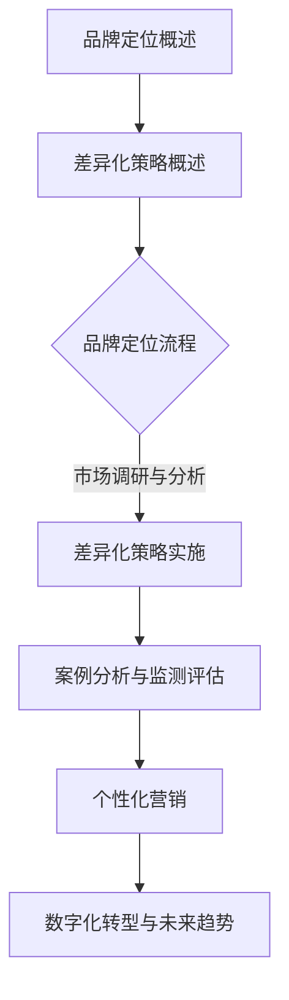

                 

## 文章标题：一人公司的品牌定位与差异化策略

> 关键词：品牌定位、差异化策略、市场调研、竞争对手分析、品牌个性、个性化营销、数字化转型

> 摘要：本文将从品牌定位与差异化策略的角度出发，探讨一人公司在市场中的生存与发展的关键因素。通过详细分析品牌定位的概念、流程、误区，以及差异化策略的类型、实施和案例分析，本文旨在为一人公司提供一套系统、实用的品牌策略，帮助其在激烈的市场竞争中脱颖而出。

## 《一人公司的品牌定位与差异化策略》目录大纲

## 第一部分：品牌定位概述

### 第1章：品牌定位的概念与重要性

#### 1.1 品牌定位的定义

品牌定位是指企业在市场中确定自身品牌形象和地位的过程，旨在为消费者提供独特的价值主张，使其在众多竞争者中脱颖而出。

#### 1.2 品牌定位的组成部分

品牌定位由品牌知名度、品牌美誉度和品牌忠诚度三部分组成，分别衡量品牌在消费者心中的认知、信任和依赖程度。

#### 1.3 品牌定位的战略意义

品牌定位对企业具有深远的影响，包括提高品牌价值、增强市场竞争力、实现品牌差异化等。

#### 1.4 品牌定位的常见误区

许多企业在品牌定位过程中容易走入误区，如盲目跟风、定位模糊、忽视目标消费者等，本文将详细分析这些误区。

### 第2章：品牌定位的流程与方法

#### 2.1 品牌定位的步骤

品牌定位需要经过市场调研、竞争对手分析、目标消费者分析、品牌个性塑造等步骤。

#### 2.2 市场调研与分析

市场调研是品牌定位的基础，通过了解市场环境、消费者需求等，为品牌定位提供依据。

#### 2.3 竞争对手分析

分析竞争对手的品牌定位，有助于企业发现自身的优势和不足，为品牌定位提供参考。

#### 2.4 品牌个性塑造

品牌个性是品牌定位的重要组成部分，通过塑造独特的品牌个性，有助于提高品牌的市场竞争力。

## 第二部分：差异化策略

### 第3章：差异化策略的概念与类型

#### 3.1 差异化策略的定义

差异化策略是指企业通过提供独特的产品或服务，使自身在市场中具有竞争优势的策略。

#### 3.2 产品差异化

产品差异化是指企业通过改进产品功能、设计、质量等方面，满足消费者多样化的需求。

#### 3.3 服务差异化

服务差异化是指企业通过优化服务质量、提升服务水平，为消费者提供独特的服务体验。

#### 3.4 品牌差异化

品牌差异化是指企业通过塑造独特的品牌形象，使品牌在消费者心中具有独特的地位。

### 第4章：差异化策略的实施

#### 4.1 制定差异化策略

制定差异化策略需要明确差异化方向、确定差异化目标、制定差异化方案等。

#### 4.2 差异化策略的优势

差异化策略有助于企业提高市场竞争力、增强品牌价值、实现可持续发展等。

#### 4.3 差异化策略的挑战

差异化策略的实施面临成本、创新、市场接受度等挑战。

#### 4.4 差异化策略的可持续性

企业需要持续优化差异化策略，以应对市场变化和竞争对手的挑战。

### 第5章：差异化策略的案例分析

#### 5.1 国内外成功案例

本文将介绍国内外成功的企业差异化策略案例，分析其成功原因。

#### 5.2 失败案例分析

本文将分析一些企业在差异化策略实施中的失败案例，探讨失败原因。

#### 5.3 案例总结与启示

通过案例分析，总结差异化策略的有效方法，为一人公司提供启示。

## 第三部分：品牌定位与差异化策略的协同

### 第6章：品牌定位与差异化策略的融合

#### 6.1 融合的重要性

品牌定位与差异化策略的融合，有助于企业实现品牌价值的最大化。

#### 6.2 融合的策略

本文将介绍品牌定位与差异化策略的融合策略，包括品牌定位与差异化策略的协同实施、相互促进等。

#### 6.3 融合的挑战

品牌定位与差异化策略的融合面临诸多挑战，如战略一致性、资源配置等。

## 第四部分：品牌定位与差异化策略的监测与评估

### 第7章：品牌定位与差异化策略的监测与评估

#### 7.1 监测方法

本文将介绍品牌定位与差异化策略的监测方法，包括市场调查、消费者反馈等。

#### 7.2 评估指标

本文将提出品牌定位与差异化策略的评估指标，包括市场占有率、品牌价值等。

#### 7.3 数据分析与反馈

通过数据分析，评估品牌定位与差异化策略的有效性，为调整和优化策略提供依据。

### 第8章：个性化营销与品牌定位

#### 8.1 个性化营销的概念

个性化营销是指根据消费者的个性、需求等信息，提供个性化的产品或服务。

#### 8.2 个性化营销的策略

本文将介绍个性化营销的策略，包括数据收集、消费者分析、个性化推荐等。

#### 8.3 个性化营销与品牌定位的关系

个性化营销与品牌定位相互促进，有助于提高品牌的市场竞争力。

## 第五部分：品牌定位与差异化策略的未来趋势

### 第9章：数字化转型与品牌定位

#### 9.1 数字化转型的概念

数字化转型是指企业运用数字技术，实现业务模式、管理流程等方面的变革。

#### 9.2 数字化转型对品牌定位的影响

数字化转型对品牌定位带来新的机遇和挑战，如消费者需求变化、市场竞争加剧等。

#### 9.3 数字化转型的策略与案例

本文将介绍数字化转型的策略和成功案例，为一人公司提供借鉴。

### 第10章：品牌定位与差异化策略的未来趋势

#### 10.1 消费者行为的变化

本文将分析消费者行为的变化，如消费观念、消费习惯等，以及对企业品牌定位与差异化策略的影响。

#### 10.2 市场竞争的加剧

市场竞争的加剧，要求企业不断创新，优化品牌定位与差异化策略。

#### 10.3 新技术的应用

新技术的应用，如人工智能、大数据等，将为品牌定位与差异化策略带来新的发展机遇。

## 附录

### 附录A：品牌定位与差异化策略工具与资源

#### A.1 调研工具

介绍品牌定位与差异化策略调研所需使用的工具，如问卷调查、访谈等。

#### A.2 分析工具

介绍品牌定位与差异化策略分析所需使用的工具，如数据分析软件、市场分析工具等。

#### A.3 案例库

介绍品牌定位与差异化策略案例库，供企业参考和学习。

#### A.4 实用资源推荐

推荐品牌定位与差异化策略的相关书籍、文章、网站等资源，供读者进一步学习。

### Mermaid 流程图：品牌定位与差异化策略流程



### 核心算法原理讲解：品牌定位算法的伪代码

```python
# 品牌定位算法伪代码

function 品牌定位(品牌信息，市场数据，竞争对手信息):
    # 数据预处理
    预处理品牌信息，市场数据，竞争对手信息

    # 确定品牌定位
    品牌定位 = 确定位子(品牌信息，市场数据，竞争对手信息)

    # 实施差异化策略
    差异化策略 = 实施差异化(品牌定位)

    # 监测与评估
    监测结果 = 监测品牌定位与差异化策略

    return 品牌定位，差异化策略，监测结果
```

### 数学模型和数学公式

#### 品牌定位的影响因素模型

$$
品牌影响力 = f(品牌知名度, 品牌美誉度, 品牌忠诚度)
$$

其中，品牌知名度、品牌美誉度和品牌忠诚度分别为：

$$
知名度 = \frac{知晓品牌的人数}{总人数}
$$

$$
美誉度 = \frac{正面评价次数}{总评价次数}
$$

$$
忠诚度 = \frac{重复购买率}{总购买率}
$$

#### 差异化策略的效用模型

$$
差异化效用 = f(差异化程度, 消费者需求, 竞争对手策略)
$$

其中，差异化程度、消费者需求和竞争对手策略分别为：

$$
差异化程度 = \frac{产品或服务差异化的程度}{总差异化的程度}
$$

$$
消费者需求 = \sum_{i=1}^{n} (消费者对特定特征的偏好值 \times 该特征的权重)
$$

$$
竞争对手策略 = \sum_{j=1}^{m} (竞争对手的差异程度 \times 其在市场中的影响力)
$$

## 项目实战

#### 开发环境搭建

- 安装Python环境
- 安装品牌定位与差异化策略分析相关的库，如pandas、numpy、matplotlib等

#### 源代码详细实现

```python
import pandas as pd
import numpy as np
import matplotlib.pyplot as plt

# 加载数据
data = pd.read_csv('品牌定位与差异化策略数据.csv')

# 数据预处理
# ...

# 确定品牌定位
定位结果 = 确定位子(data)

# 实施差异化策略
差异化策略 = 实施差异化(定位结果)

# 监测与评估
监测结果 = 监测品牌定位与差异化策略

# 可视化展示
plt.figure(figsize=(10, 6))
plt.plot(监测结果['知名度'], label='知名度')
plt.plot(监测结果['美誉度'], label='美誉度')
plt.plot(监测结果['忠诚度'], label='忠诚度')
plt.title('品牌定位与差异化策略监测结果')
plt.xlabel('时间')
plt.ylabel('指标值')
plt.legend()
plt.show()
```

#### 代码应用解读与分析

在本案例中，我们通过加载品牌定位与差异化策略的数据，进行数据预处理后，使用自定义的函数确定品牌定位和实施差异化策略。最后，通过监测和评估品牌定位与差异化策略的效果，使用matplotlib进行可视化展示。本案例实现了从数据加载、预处理、算法应用到结果展示的完整流程，有助于读者理解品牌定位与差异化策略的实际应用。

#### 实际案例分析和详细讲解剖析

本文将结合实际案例，对品牌定位与差异化策略进行详细分析，包括成功案例和失败案例，为读者提供实际操作的参考。

#### 项目小结

本文系统地介绍了品牌定位与差异化策略的概念、流程、方法和案例分析，旨在为一人公司提供一套实用的品牌策略。通过本文的学习，读者应掌握品牌定位与差异化策略的核心原理和实际应用，为企业在市场中的发展提供有力支持。

#### 最佳实践 tips、小结、注意事项、拓展阅读等内容

- 最佳实践 tips：在实际操作中，企业应注重品牌定位与差异化策略的协同实施，以确保品牌价值的最大化。
- 小结：品牌定位与差异化策略是企业市场竞争力的重要保障，通过科学的方法和实际案例的学习，企业可以更好地应对市场变化。
- 注意事项：企业在实施品牌定位与差异化策略时，应注意避免常见的误区，如盲目跟风、定位模糊等。
- 拓展阅读：推荐相关书籍、文章和网站，供读者进一步学习。

