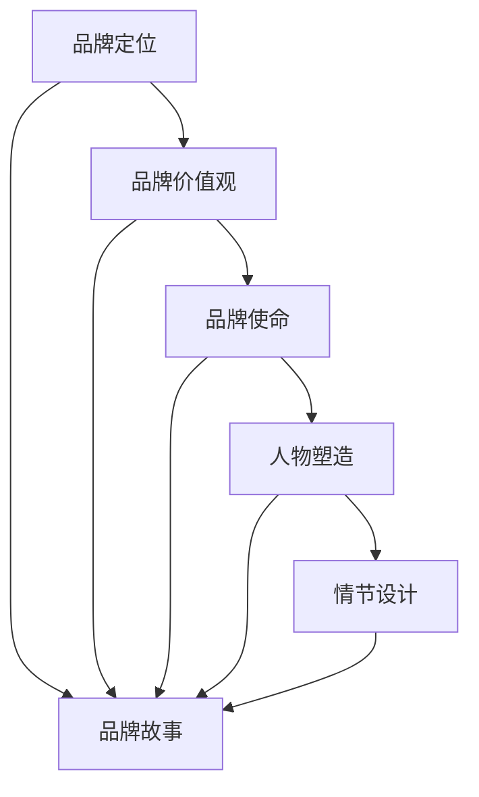
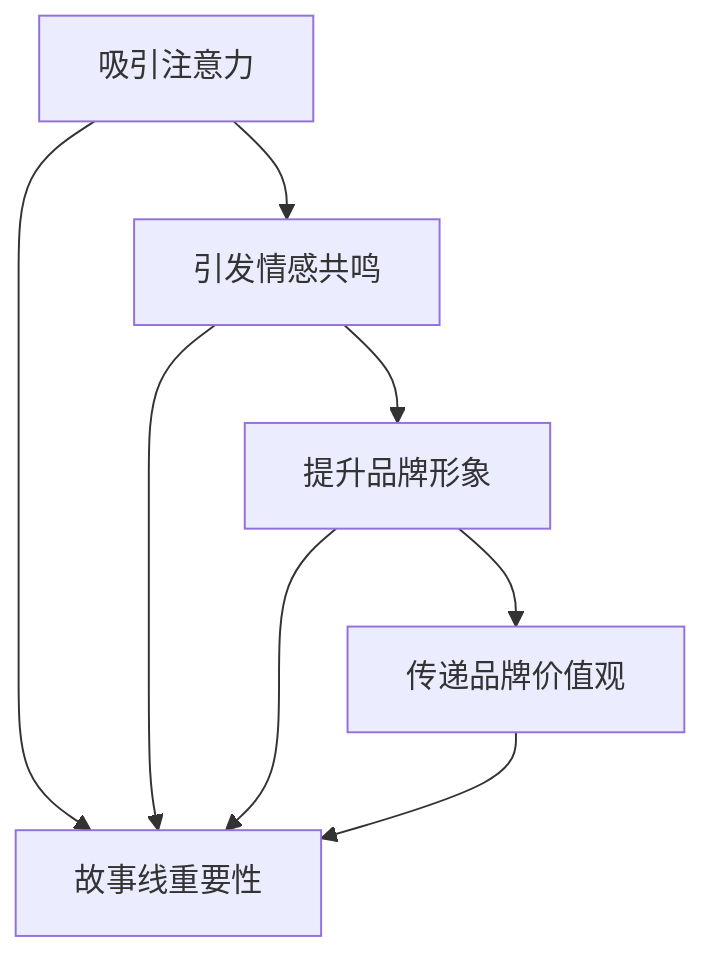

                 

### 文章标题

《一人公司的品牌故事构建与情感营销策略》

### 关键词

品牌故事、情感营销、品牌定位、目标市场、故事线、情感化传播、客户关系管理

### 摘要

在竞争激烈的市场环境中，品牌故事和情感营销成为企业差异化竞争的重要手段。本文通过深入剖析品牌故事构建的基础和情感营销原理，为一人公司提供了一套完整的品牌故事构建与情感营销策略。文章首先介绍了品牌故事的概念和价值，接着探讨了情感营销的心理学基础和技巧，然后详细阐述了品牌定位与目标市场确定的方法。在品牌故事构建策略部分，文章讲解了故事线的构建和情感化品牌传播渠道的选择。此外，文章还探讨了个性化互动与客户关系管理的重要性，并通过实际案例分析了情感营销策略的实施和效果评估。最后，文章提出了品牌故事和情感营销的持续发展策略，为一人公司提供了实用且系统的指导。

---

### 《一人公司的品牌故事构建与情感营销策略》目录大纲

#### 第一部分：品牌故事构建基础

##### 第1章：品牌故事的概念与价值
- 1.1 品牌故事的定义与核心要素
- 1.2 品牌故事在营销中的作用
- 1.3 成功品牌故事的案例分析

##### 第2章：情感营销原理
- 2.1 情感营销的概念与目的
- 2.2 情感营销的心理学基础
- 2.3 情感营销的技巧与实践

##### 第3章：一人公司的品牌定位与目标市场
- 3.1 品牌定位的策略与方法
- 3.2 确定目标市场的步骤与工具
- 3.3 情感化目标市场的策略

#### 第二部分：品牌故事构建策略

##### 第4章：故事线的构建与规划
- 4.1 故事线的概念与重要性
- 4.2 构建故事线的方法与步骤
- 4.3 情感元素在故事线中的应用

##### 第5章：情感化的品牌传播渠道
- 5.1 传统媒体与数字媒体的结合
- 5.2 内容营销的情感化策略
- 5.3 社交媒体的情感营销案例分析

##### 第6章：个性化互动与客户关系管理
- 6.1 个性化互动的情感化策略
- 6.2 客户关系的情感维护
- 6.3 情感驱动的客户体验优化

##### 第7章：情感营销案例分析
- 7.1 国内知名一人公司的成功案例
- 7.2 国际品牌的情感营销案例
- 7.3 情感营销策略的调整与优化

#### 第三部分：品牌故事构建与情感营销实战

##### 第8章：品牌故事构建实战
- 8.1 品牌故事构建的流程与方法
- 8.2 故事素材的收集与整理
- 8.3 品牌故事的创作与审核

##### 第9章：情感营销策略实施
- 9.1 情感营销策略制定与执行
- 9.2 营销活动策划与执行
- 9.3 情感营销效果评估与优化

##### 第10章：品牌故事与情感营销的持续发展
- 10.1 品牌故事的迭代与更新
- 10.2 情感营销的长期策略
- 10.3 品牌故事与情感营销的可持续性发展

### 附录

#### 附录A：品牌故事构建工具与资源
- A.1 故事板（Storyboard）应用
- A.2 情感分析工具
- A.3 品牌故事案例库

#### 附录B：情感营销策略案例研究
- B.1 案例一：一家独立设计师品牌的故事构建与情感营销
- B.2 案例二：一家小型咖啡馆的情感营销实践
- B.3 案例三：一家电商平台的品牌故事与情感营销策略

### 第1章：品牌故事的概念与价值

品牌故事不仅仅是一连串的市场宣传口号，而是企业核心价值观的载体，它能够连接企业与消费者，塑造独特的品牌形象。在这个章节中，我们将探讨品牌故事的定义、核心要素，以及它在营销中的作用。

#### 1.1 品牌故事的定义与核心要素

**定义：** 品牌故事是企业通过一系列事件、情节和人物塑造出来的，用以传递品牌理念、价值观和使命的叙述。它不仅仅是宣传，更是品牌与消费者之间情感纽带的建立。

**核心要素：**
1. **品牌定位：** 明确品牌在市场中的位置和目标，为故事构建提供方向。
2. **品牌价值观：** 品牌故事应该体现品牌的核心价值观，如诚信、创新、责任感等。
3. **品牌使命：** 故事应围绕品牌使命展开，为品牌的发展注入动力。
4. **人物塑造：** 人物是故事的关键，可以是品牌创始人、员工、消费者等，他们承载着品牌故事的灵魂。
5. **情节设计：** 故事的情节应该引人入胜，能够引起消费者的共鸣。

**关系架构：**

#### 1.2 品牌故事在营销中的作用

品牌故事在营销中的作用不容小觑，它不仅有助于品牌形象的塑造，还能提升品牌的市场竞争力。

1. **增强品牌认知度：** 品牌故事通过情感共鸣，使消费者更容易记住品牌。
2. **建立品牌忠诚度：** 好的品牌故事能够培养消费者的忠诚度，使他们成为品牌的忠实粉丝。
3. **提升品牌价值：** 一个动人的品牌故事能够提升品牌的整体价值，使品牌在市场上脱颖而出。
4. **增加市场竞争力：** 品牌故事能够让企业在竞争激烈的市场中脱颖而出，形成独特的竞争优势。

#### 1.3 成功品牌故事的案例分析

**案例一：苹果公司**

苹果公司通过其品牌故事，成功地塑造了创新、高端、简洁的品牌形象。苹果的创始人史蒂夫·乔布斯通过产品发布会，讲述苹果产品背后的故事，将品牌的价值观和使命传递给消费者。例如，iPhone的发布，不仅是一场技术革命，更是一场情感上的共鸣，让消费者感受到了苹果对创新的执着和对用户体验的重视。

**案例二：可口可乐**

可口可乐通过其悠久的品牌历史和情感故事，成功地建立了与消费者的情感联系。其广告经常讲述品牌的历史、传统和文化，使消费者感受到品牌的温暖和亲切。例如，可口可乐的广告常常围绕家庭、友谊和庆祝等主题，通过情感共鸣，增强品牌与消费者之间的情感纽带。

通过以上分析，我们可以看到，品牌故事不仅仅是市场营销的工具，更是品牌文化的重要组成部分。构建一个成功的品牌故事，能够帮助企业在激烈的市场竞争中脱颖而出，赢得消费者的心。

### 第2章：情感营销原理

情感营销是一种通过激发消费者情感来促进品牌认同和忠诚度的策略。在这一章节中，我们将探讨情感营销的概念、目的以及其在心理学中的基础，同时提供一些实用的技巧和实际案例，帮助读者更好地理解和应用情感营销。

#### 2.1 情感营销的概念与目的

**概念：** 情感营销是指利用情感来影响消费者的决策过程，通过引发消费者的情感反应，增加他们对品牌的认同和好感。情感营销的核心在于理解消费者的情感需求，并利用情感元素来传递品牌信息。

**目的：**
1. **建立品牌认同：** 通过情感营销，品牌能够与消费者建立更深层次的情感联系，从而提高品牌认同度。
2. **增强消费者忠诚度：** 情感营销能够激发消费者的情感共鸣，使他们更愿意持续购买和推荐品牌产品。
3. **提升品牌形象：** 情感营销有助于塑造品牌的积极形象，增强品牌的市场竞争力。
4. **促进销售增长：** 情感营销通过激发消费者的购买欲望，直接推动销售增长。

#### 2.2 情感营销的心理学基础

情感营销的成功离不开对心理学的深入理解。以下是几个关键的心理学原理：

1. **情感共鸣：** 情感共鸣是指消费者在品牌体验中感受到的情感与品牌传递的情感相一致。这种共鸣能够增强消费者的品牌认同。
2. **情感依赖：** 情感依赖是指消费者在情感上对品牌产生依赖，这种感觉会使他们在面对竞争品牌时更倾向于选择原有的品牌。
3. **情感记忆：** 情感记忆是指消费者对带有强烈情感体验的品牌信息更容易记住。这意味着情感营销的内容更容易在消费者心中留下深刻印象。
4. **情感锁定：** 情感锁定是指消费者在情感上对品牌形成一种强烈的依赖，即使面临替代品牌，他们也会坚持选择原有品牌。

#### 2.3 情感营销的技巧与实践

**技巧：**
1. **情感故事：** 通过讲述品牌故事来引发消费者的情感共鸣。这些故事可以是真实的，也可以是虚构的，但关键在于它们能够触动消费者的情感。
2. **情感互动：** 通过社交媒体、线上社区等渠道与消费者进行情感互动，建立情感联系。这种互动可以是直接回复消费者的问题，也可以是发起情感互动活动。
3. **情感符号：** 使用特定的情感符号，如卡通形象、颜色、音乐等，来传递品牌情感。这些符号能够成为品牌的情感标识，帮助消费者快速识别品牌。
4. **情感设计：** 在产品设计和品牌视觉设计中融入情感元素，使消费者在接触品牌时能够感受到情感氛围。

**实践：**
1. **案例一：迪士尼乐园**
   迪士尼乐园通过打造梦幻般的体验，激发游客的情感共鸣。无论是孩子的纯真笑容，还是成人的怀旧情感，迪士尼都能够成功引发游客的情感共鸣，从而建立品牌忠诚度。

2. **案例二：星巴克**
   星巴克通过其独特的咖啡文化和温馨的门店设计，成功打造了一种“第三空间”，使消费者在忙碌的生活中感受到放松和舒适。星巴克通过情感营销，提升了品牌形象，并增强了消费者对品牌的认同感。

通过以上对情感营销原理的详细分析，我们可以看到，情感营销不仅仅是简单的广告宣传，而是通过深入理解和利用消费者的情感需求，来提升品牌价值和市场份额的有效策略。

### 第3章：一人公司的品牌定位与目标市场

品牌定位是品牌故事构建的基础，而明确目标市场则是实现品牌价值的关键。在这一章节中，我们将探讨品牌定位的策略与方法，详细讲解确定目标市场的步骤与工具，并介绍如何制定情感化目标市场的策略。

#### 3.1 品牌定位的策略与方法

**策略：**
1. **差异化定位：** 通过突出品牌的独特卖点，使品牌在竞争激烈的市场中脱颖而出。例如，一家专注于环保产品的一人公司可以强调其产品的可持续性。
2. **价值主张定位：** 明确品牌所提供的主要价值，如高品质、创新、便捷等，以吸引特定的消费者群体。
3. **情感定位：** 利用情感元素，如温馨、亲切、梦想等，来建立品牌与消费者之间的情感联系。

**方法：**
1. **SWOT分析：** 对品牌的优势（Strengths）、劣势（Weaknesses）、机会（Opportunities）和威胁（Threats）进行评估，帮助确定品牌定位的方向。
2. **市场调研：** 通过问卷调查、访谈等方式，了解目标市场的需求和偏好，为品牌定位提供数据支持。
3. **竞争分析：** 分析竞争对手的品牌定位和市场表现，找出差异化的定位策略。

#### 3.2 确定目标市场的步骤与工具

**步骤：**
1. **定义市场范围：** 确定品牌要进入的市场，包括地理、人口、心理和行为特征。
2. **细分市场：** 根据消费者的需求和偏好，将市场细分为多个子市场。
3. **选择目标市场：** 从细分市场中选出最有潜力和最符合品牌定位的目标市场。
4. **定位策略实施：** 根据选择的目标市场，制定具体的品牌定位策略，并实施相关营销活动。

**工具：**
1. **市场细分工具：** 如人口统计、行为统计、地理统计等工具，帮助细分市场。
2. **消费者画像：** 通过数据分析和调研，构建详细的消费者画像，了解目标市场的需求和特征。
3. **SWOT矩阵：** 用于分析品牌的内部和外部因素，帮助确定品牌定位。

#### 3.3 情感化目标市场的策略

**策略：**
1. **情感化市场细分：** 通过情感需求来细分市场，如温馨、创新、梦想等情感主题。
2. **情感化品牌定位：** 将情感元素融入品牌定位，如通过温馨的故事和形象的符号来吸引目标市场。
3. **情感化营销活动：** 设计情感化的营销活动，如情感故事、互动体验等，与目标市场建立情感联系。

**实施步骤：**
1. **情感调研：** 了解目标市场的情感需求和偏好，通过情感调研和数据分析。
2. **情感化品牌传播：** 利用情感化的内容、视觉和渠道进行品牌传播，如通过情感故事、视觉符号和社交媒体互动。
3. **情感化客户体验：** 提供情感化的客户体验，如通过个性化服务、情感化沟通和互动，增强客户对品牌的认同感。

通过以上对品牌定位和目标市场策略的详细分析，一人公司可以更好地明确品牌发展方向，找到与目标市场的情感共鸣点，从而实现品牌价值的最大化。

### 第4章：故事线的构建与规划

一个引人入胜的故事线是品牌故事的灵魂，它能够吸引消费者的注意力，并引发他们的情感共鸣。在这一章节中，我们将探讨故事线的概念与重要性，详细讲解构建故事线的方法与步骤，并阐述情感元素在故事线中的应用。

#### 4.1 故事线的概念与重要性

**概念：** 故事线是指一系列相互关联的事件和情节，通过逻辑和情感线索将品牌的故事呈现出来。它包括故事的起承转合，即开头、发展、高潮和结局。

**重要性：**
1. **吸引注意力：** 一个有趣、引人入胜的故事线能够吸引消费者的注意力，使他们在众多品牌中注意到你的品牌。
2. **引发情感共鸣：** 通过故事线，品牌可以与消费者建立情感联系，使消费者产生共鸣，从而增强品牌认同感。
3. **提升品牌形象：** 一个精心设计的故事线能够提升品牌形象，使品牌更具吸引力。
4. **传递品牌价值观：** 故事线通过情节和人物，传递品牌的核心价值观和使命，使消费者更深入地了解品牌。

**关系架构：**

#### 4.2 构建故事线的方法与步骤

**方法：**
1. **明确主题：** 确定品牌故事的主题，如创新、环保、家庭等，这将成为故事线的核心。
2. **构建情节：** 设计一系列情节，围绕主题展开，使故事具有连贯性和吸引力。
3. **塑造人物：** 创建故事中的关键人物，如品牌创始人、员工、消费者等，他们将成为故事的核心。
4. **设置高潮：** 设计故事的高潮部分，使故事达到情感上的高潮，引发消费者的共鸣。

**步骤：**
1. **确定故事起点：** 确定故事的起始事件，这通常是品牌的重要里程碑或关键转折点。
2. **发展情节：** 通过一系列事件，使故事逐渐展开，吸引消费者的兴趣。
3. **设置冲突：** 在故事中引入冲突，使情节更加紧张和引人入胜。
4. **解决冲突：** 通过故事的高潮部分解决冲突，使故事达到情感上的高潮。
5. **结局设计：** 给故事一个圆满的结局，使消费者对品牌产生积极的情感体验。

#### 4.3 情感元素在故事线中的应用

**应用：**
1. **情感化角色塑造：** 通过情感化的角色设计，使人物更具魅力，引发消费者的共鸣。
2. **情感化场景设置：** 在故事中设置具有情感色彩的场景，如温馨的家庭氛围、激动人心的创新时刻等，增强故事的情感张力。
3. **情感化情节推进：** 通过情感化的情节推进，使故事更加引人入胜，使消费者产生共鸣。
4. **情感化结尾：** 给故事一个情感化的结尾，使消费者对品牌产生深刻的印象。

**案例分析：**
- **案例一：苹果公司** 苹果公司的品牌故事以创新和设计为核心，通过讲述产品研发的过程和创始人乔布斯的传奇人生，引发消费者的共鸣。
- **案例二：可口可乐** 可口可乐的品牌故事围绕家庭、友谊和庆祝等情感主题，通过温馨的广告和营销活动，与消费者建立情感联系。

通过以上对故事线构建的详细分析，一人公司可以设计出一个引人入胜、情感丰富的品牌故事，从而在激烈的市场竞争中脱颖而出。

### 第5章：情感化的品牌传播渠道

在数字化时代，品牌传播的渠道多种多样，如何选择和利用这些渠道进行情感化传播，是品牌成功的关键。在这一章节中，我们将探讨传统媒体与数字媒体的结合，分析内容营销的情感化策略，并通过实际案例研究社交媒体的情感营销效果。

#### 5.1 传统媒体与数字媒体的结合

**结合策略：**
1. **整合传播：** 将传统媒体与数字媒体整合，形成多渠道、多平台的全覆盖传播网络。
2. **内容共享：** 利用传统媒体的内容优势，将其数字化，通过社交媒体等数字平台进行传播。
3. **互动延伸：** 通过线上活动、社交媒体互动等方式，将传统媒体的内容延伸到数字媒体，增强用户参与感。

**实施步骤：**
1. **内容制作：** 根据目标受众的特点，制作适合传统媒体和数字媒体的内容。
2. **渠道选择：** 确定适合传统媒体和数字媒体的平台，如电视、报纸、社交媒体等。
3. **同步发布：** 同时在传统媒体和数字媒体上发布内容，形成传播合力。

#### 5.2 内容营销的情感化策略

**策略：**
1. **情感化内容创作：** 创作能够引发消费者情感共鸣的内容，如感人故事、温馨瞬间等。
2. **故事化传播：** 通过故事化手法，将品牌信息融入情节中，使消费者在情感上与品牌产生联系。
3. **互动式内容：** 通过互动式内容，如问答、投票、直播等，增强用户参与感，引发情感共鸣。

**实施步骤：**
1. **情感调研：** 了解目标受众的情感需求和偏好，为内容创作提供依据。
2. **内容创作：** 根据情感调研结果，创作能够引发情感共鸣的内容。
3. **渠道发布：** 选择合适的渠道发布情感化内容，如社交媒体、博客、视频平台等。
4. **互动管理：** 通过线上互动，如评论、分享、互动问答等，增强用户参与度。

#### 5.3 社交媒体的情感营销案例分析

**案例一：耐克（Nike）**

耐克通过社交媒体进行情感营销，成功塑造了其“Just Do It”的品牌精神。耐克在社交媒体上发布激励性的广告和用户故事，通过情感共鸣，与消费者建立深厚的情感联系。例如，耐克在社交媒体上发起的“破茧成蝶”活动，鼓励用户分享自己的奋斗故事，成功引发了广泛的情感共鸣。

**案例二：星巴克（Starbucks）**

星巴克通过社交媒体的情感营销，成功打造了其“第三空间”品牌形象。星巴克在社交媒体上发布温馨的咖啡故事、顾客的体验分享等情感化内容，与消费者建立情感纽带。星巴克还通过线上互动，如“咖啡品尝大赛”等活动，增强用户参与感，使品牌与消费者之间的关系更加紧密。

通过以上对品牌传播渠道的分析和案例研究，一人公司可以充分利用传统媒体与数字媒体的优势，通过情感化内容创作和社交媒体互动，实现品牌与消费者的情感共鸣，从而提升品牌影响力和市场竞争力。

### 第6章：个性化互动与客户关系管理

在情感营销中，个性化互动和客户关系管理起着至关重要的作用。通过深入了解消费者的需求和偏好，品牌可以提供更加个性化和贴心的服务，从而增强客户满意度和忠诚度。在这一章节中，我们将探讨个性化互动的情感化策略，详细讲解客户关系的情感维护，以及情感驱动的客户体验优化。

#### 6.1 个性化互动的情感化策略

**情感化策略：**
1. **情感化数据收集：** 通过多种渠道收集消费者的情感数据，如社交媒体互动、客户反馈等，了解消费者的情感需求。
2. **个性化内容推送：** 根据消费者的情感数据，推送个性化的内容和推荐，使消费者感受到被关注和重视。
3. **情感化沟通：** 在沟通中融入情感元素，如温馨的语言、贴心的建议等，增强消费者的情感体验。
4. **情感化反馈机制：** 建立情感化的反馈机制，鼓励消费者分享他们的情感体验和反馈，从而持续优化品牌服务。

**实施步骤：**
1. **数据收集与分析：** 通过数据分析工具，收集消费者的情感数据，如购买行为、互动行为等。
2. **个性化内容创作：** 根据数据分析结果，创作能够引发消费者情感共鸣的内容。
3. **推送与互动：** 通过自动化工具和社交媒体平台，推送个性化的内容和推荐。
4. **情感化沟通：** 培训客服人员，使其在与消费者的沟通中融入情感元素。
5. **反馈与优化：** 定期收集消费者的反馈，优化个性化互动策略。

#### 6.2 客户关系的情感维护

**维护策略：**
1. **建立情感联系：** 通过个性化的服务和互动，与消费者建立情感联系，使消费者感受到品牌的关怀。
2. **持续情感沟通：** 定期与消费者进行情感沟通，如发送节日祝福、生日问候等，保持与消费者的紧密联系。
3. **情感化问题解决：** 快速响应消费者的情感诉求，提供贴心的解决方案，增强消费者对品牌的信任。
4. **情感化忠诚计划：** 通过情感化的忠诚计划，如会员福利、专属活动等，激励消费者持续购买和推荐。

**实施步骤：**
1. **情感联系建立：** 通过个性化服务和互动，使消费者感受到品牌的关怀。
2. **情感沟通规划：** 制定情感沟通计划，如定期发送邮件、社交媒体互动等。
3. **问题解决机制：** 建立快速响应机制，确保消费者的问题能够得到及时解决。
4. **忠诚计划实施：** 设计情感化的忠诚计划，激励消费者持续购买和推荐。

#### 6.3 情感驱动的客户体验优化

**优化策略：**
1. **情感体验设计：** 在产品和服务设计中融入情感元素，如温馨的用户界面、贴心的服务流程等。
2. **情感化互动体验：** 通过个性化互动和情感化沟通，提升消费者的整体体验。
3. **情感反馈收集：** 定期收集消费者的情感反馈，识别改进点，持续优化客户体验。
4. **情感化培训：** 对员工进行情感化培训，使其在服务过程中能够更好地理解和满足消费者的情感需求。

**实施步骤：**
1. **体验设计：** 在产品和服务设计中融入情感元素，提升用户体验。
2. **互动体验优化：** 通过个性化互动和情感化沟通，提升消费者的互动体验。
3. **反馈机制建立：** 建立情感反馈机制，定期收集消费者的情感体验反馈。
4. **员工培训：** 对员工进行情感化培训，提高其服务质量和消费者满意度。

通过以上对个性化互动与客户关系管理的详细分析，一人公司可以构建一套系统化的情感驱动策略，从而提升客户满意度和忠诚度，实现品牌价值的最大化。

### 第7章：情感营销案例分析

在情感营销领域，国内外许多知名品牌通过独特的情感营销策略取得了显著的成功。在本章节中，我们将分析这些品牌的成功案例，探讨它们的情感营销策略，以及如何根据市场变化调整和优化这些策略。

#### 7.1 国内知名一人公司的成功案例

**案例一：小米**

小米是一家以高科技产品为主的企业，其情感营销策略主要通过以下几个关键点来实现：

1. **粉丝文化：** 小米通过建立粉丝社区，鼓励用户参与产品的研发和推广。小米的用户不仅仅是消费者，更是品牌的参与者和传播者。通过这种互动，小米成功地与用户建立了深厚的情感联系。
   
2. **情感化内容：** 小米在其社交媒体上发布了大量关于产品研发背后的故事、用户的使用体验等情感化内容。这些内容不仅提升了品牌的亲和力，还增强了用户的品牌认同感。

3. **互动活动：** 小米定期举办线上互动活动，如新品发布会、粉丝见面会等。这些活动不仅增强了用户对品牌的忠诚度，还提高了用户的参与感。

**策略调整与优化：**
- **市场细分：** 随着市场的发展，小米开始更加细分市场，针对不同的用户群体推出差异化的产品和服务。
- **情感化内容创新：** 为了适应市场变化，小米不断更新其情感化内容，通过更多的用户故事和互动活动，保持与用户的情感连接。

**案例二：猫屎咖啡**

猫屎咖啡是一家以小众咖啡品牌著称的公司，其情感营销策略主要体现在以下几个方面：

1. **独特卖点：** 猫屎咖啡通过其独特的咖啡豆来源，打造了“小众、独特、高品质”的品牌形象，吸引了大量的咖啡爱好者。

2. **情感化品牌故事：** 猫屎咖啡讲述了一个关于咖啡豆采摘和烘焙的感人故事，使消费者在购买产品的同时，也能够体验到品牌背后的情感和价值。

3. **个性化体验：** 猫屎咖啡在门店和线上平台提供个性化的购物体验，如咖啡品鉴课程、咖啡师互动等，增强了消费者的参与感和品牌认同感。

**策略调整与优化：**
- **品牌升级：** 随着市场的变化，猫屎咖啡逐渐扩大了其产品线，从单一的咖啡产品扩展到包括咖啡机、咖啡豆等在内的多元化产品。
- **情感化内容创新：** 猫屎咖啡持续更新其情感化内容，通过更多关于咖啡文化的深入探讨和用户故事，提升品牌的市场影响力。

#### 7.2 国际品牌的情感营销案例

**案例一：可口可乐**

可口可乐是情感营销的经典案例，其成功的关键在于：

1. **情感化广告：** 可口可乐的广告常常围绕家庭、友谊、庆祝等主题，通过温馨的故事和画面，引发消费者的情感共鸣。

2. **社交媒体互动：** 可口可乐利用社交媒体平台，与消费者进行互动，如发起在线活动、用户生成内容等，增强了品牌的亲和力和用户参与度。

3. **品牌体验店：** 可口可乐在全球范围内开设了品牌体验店，通过独特的品牌体验，增强了消费者对品牌的情感连接。

**策略调整与优化：**
- **数字化转型：** 随着数字营销的兴起，可口可乐加大了在数字媒体上的投入，通过在线广告、社交媒体互动等手段，提升品牌影响力。
- **多元文化融合：** 可口可乐在全球范围内的营销策略中，更加注重多元文化的融合，通过本地化的情感化内容，吸引不同文化背景的消费者。

**案例二：苹果公司**

苹果公司的情感营销策略主要体现在以下几个方面：

1. **品牌故事：** 苹果通过其品牌故事，如乔布斯的传奇人生和产品的创新历程，成功塑造了其“创新、科技、时尚”的品牌形象。

2. **产品体验：** 苹果的产品设计注重用户体验，通过简洁优雅的设计和出色的性能，使消费者在使用产品时感受到情感上的满足。

3. **粉丝文化：** 苹果的粉丝文化是其情感营销的重要组成部分，苹果通过粉丝俱乐部、新品发布会等方式，与粉丝建立深厚的情感联系。

**策略调整与优化：**
- **可持续发展：** 随着消费者对社会责任的关注增加，苹果开始在其情感营销策略中融入可持续发展的理念，通过环保产品和绿色营销，提升品牌形象。
- **技术创新：** 苹果持续推动技术创新，通过不断推出新产品和服务，保持其在消费者心中的情感连接。

通过以上案例分析，我们可以看到，无论是国内还是国际品牌，情感营销都是提升品牌影响力的重要手段。通过情感共鸣、个性化互动和持续创新，品牌可以与消费者建立深厚的情感连接，从而在激烈的市场竞争中脱颖而出。

### 第8章：品牌故事构建实战

构建一个成功的品牌故事并非易事，它需要系统的方法和精细的执行。在这一章节中，我们将详细探讨品牌故事构建的流程与方法，介绍故事素材的收集与整理，以及品牌故事的创作与审核。

#### 8.1 品牌故事构建的流程与方法

**流程：**
1. **市场调研：** 了解目标市场的需求和偏好，为品牌故事的定位提供数据支持。
2. **故事主题确定：** 根据市场调研结果，确定品牌故事的主题，如创新、环保、家庭等。
3. **故事情节设计：** 设计故事的开头、发展、高潮和结局，确保情节的连贯性和吸引力。
4. **角色塑造：** 创建故事中的关键人物，包括品牌创始人、员工、消费者等，赋予他们独特的性格和背景。
5. **情感元素融入：** 在故事情节和角色塑造中融入情感元素，引发消费者的共鸣。
6. **故事内容创作：** 根据故事情节和角色，撰写品牌故事的内容，包括文字、图片、视频等多种形式。
7. **故事审核与修改：** 对品牌故事进行多轮审核和修改，确保故事的逻辑性和情感性。
8. **故事发布与传播：** 通过多渠道发布品牌故事，如官方网站、社交媒体、广告等，进行广泛传播。

**方法：**
1. **情景分析法：** 通过对品牌发展过程中的关键事件和情境进行分析，提取故事素材。
2. **用户故事法：** 通过收集用户的故事和使用体验，将这些真实的用户情感融入品牌故事。
3. **故事板（Storyboard）应用：** 使用故事板工具，将品牌故事的内容和情节进行可视化展示，便于审核和修改。

#### 8.2 故事素材的收集与整理

**收集：**
1. **内部素材：** 收集品牌发展过程中的内部资料，如品牌历史、产品研发故事、员工故事等。
2. **外部素材：** 通过市场调研、用户访谈、社交媒体监测等方式，收集外部用户和市场的反馈和意见。

**整理：**
1. **分类整理：** 根据故事主题和情节需求，对收集到的素材进行分类整理，如按时间、事件、人物等分类。
2. **筛选优化：** 对素材进行筛选和优化，选择最具代表性和吸引力的素材，为品牌故事的创作提供素材支持。
3. **故事板整理：** 使用故事板工具，将整理好的素材按照故事情节进行可视化展示，便于后续创作和审核。

#### 8.3 品牌故事的创作与审核

**创作：**
1. **故事大纲：** 根据整理好的素材，撰写品牌故事的大纲，确定故事的起承转合。
2. **情节细化：** 对故事大纲进行细化，编写详细的情节描述，确保故事的连贯性和逻辑性。
3. **角色塑造：** 创作故事中的关键人物，赋予他们独特的性格和背景，使人物形象饱满。
4. **情感融入：** 在情节设计和角色塑造中，融入情感元素，引发消费者的共鸣。
5. **内容创作：** 根据故事大纲和情节细化，撰写品牌故事的文字内容，同时制作相应的图片、视频等素材。

**审核：**
1. **内部审核：** 由品牌故事创作团队进行初步审核，确保故事的内容和形式符合品牌定位和营销目标。
2. **用户反馈：** 向目标用户群体征集反馈意见，通过问卷调查、社交媒体互动等方式，了解用户对品牌故事的反应。
3. **修改优化：** 根据用户反馈和审核意见，对品牌故事进行修改和优化，提升故事的质量和吸引力。
4. **多轮审核：** 进行多轮审核和修改，确保品牌故事在逻辑性、情感性和传播效果上达到最佳状态。

通过以上对品牌故事构建实战的详细分析，一人公司可以构建出一个富有吸引力、情感丰富的品牌故事，从而提升品牌的影响力和市场竞争力。

### 第9章：情感营销策略实施

情感营销策略的实施是品牌成功的关键步骤，它包括策略的制定、具体的营销活动策划与执行，以及情感营销效果的评估与优化。在这一章节中，我们将详细探讨这些方面，帮助一人公司有效地实施情感营销策略。

#### 9.1 情感营销策略制定与执行

**策略制定：**
1. **目标设定：** 明确情感营销的目标，如提升品牌知名度、增强消费者忠诚度等。
2. **情感定位：** 根据品牌定位和目标市场，确定情感营销的主题和方向。
3. **策略组合：** 制定一系列情感营销策略，如内容营销、互动营销、体验营销等。
4. **资源分配：** 根据策略组合，合理分配预算和人力资源。

**执行：**
1. **内容策划：** 创作符合情感定位的内容，如故事、视频、图片等，确保内容的吸引力和传播力。
2. **活动策划：** 设计情感化的营销活动，如线上互动、线下活动等，吸引消费者的参与。
3. **渠道选择：** 选择合适的渠道进行传播，如社交媒体、官方网站、广告等。
4. **执行监控：** 在执行过程中，持续监控活动的效果，及时调整策略和执行计划。

#### 9.2 营销活动策划与执行

**策划：**
1. **活动主题：** 根据情感定位和目标市场，确定活动主题，如节日促销、新品发布、用户故事分享等。
2. **目标受众：** 明确活动的目标受众，制定有针对性的活动内容和传播策略。
3. **活动形式：** 设计多样化的活动形式，如线上互动游戏、线下体验活动、社交媒体挑战等。
4. **时间规划：** 制定详细的活动时间表，确保活动有条不紊地进行。

**执行：**
1. **宣传推广：** 通过多种渠道宣传推广活动，如社交媒体广告、官方网站、邮件营销等。
2. **活动执行：** 按照策划方案，执行活动内容，确保活动顺利进行。
3. **互动管理：** 与参与者进行互动，收集反馈，及时解决问题，提升用户体验。
4. **数据监控：** 在活动过程中，持续监控数据，如参与人数、互动量、转化率等，以便实时调整策略。

#### 9.3 情感营销效果评估与优化

**评估：**
1. **定量评估：** 通过数据指标，如参与人数、互动量、销售额等，评估情感营销的效果。
2. **定性评估：** 通过用户反馈、社交媒体评论等定性数据，了解消费者对活动的真实感受和品牌认知。
3. **效果分析：** 对收集到的数据进行综合分析，评估情感营销的ROI（投资回报率）。

**优化：**
1. **策略调整：** 根据评估结果，对情感营销策略进行调整和优化，提升营销效果。
2. **内容改进：** 对内容创作进行改进，确保内容更具吸引力和传播力。
3. **活动优化：** 对营销活动进行优化，提升用户的参与度和满意度。
4. **长期策略：** 制定长期情感营销策略，确保品牌与消费者的情感连接持续发展。

通过以上对情感营销策略实施的具体分析，一人公司可以系统性地制定、执行和优化情感营销策略，从而提升品牌的影响力和市场竞争力。

### 第10章：品牌故事与情感营销的持续发展

品牌故事和情感营销并非一蹴而就，它们需要长期的投入和持续的优化。在这一章节中，我们将探讨品牌故事的迭代与更新，情感营销的长期策略，以及如何确保品牌故事与情感营销的可持续性发展。

#### 10.1 品牌故事的迭代与更新

品牌故事需要随着市场环境和消费者需求的变化而不断迭代和更新。以下是几个关键步骤：

**迭代步骤：**
1. **定期回顾：** 定期对品牌故事进行回顾，评估其效果和适应性。
2. **市场调研：** 进行市场调研，了解消费者的情感需求和品牌认知的变化。
3. **故事调整：** 根据市场调研结果，对品牌故事进行适当的调整，确保故事内容与当前市场环境相符。
4. **情感连接：** 重新审视品牌故事中的情感元素，确保它们仍然能够引发消费者的共鸣。

**更新策略：**
1. **主题更新：** 随着市场趋势的变化，更新品牌故事的主题，使其更具时代感。
2. **情节创新：** 在品牌故事中引入新的情节元素，保持故事的吸引力和新鲜感。
3. **角色迭代：** 重新塑造关键角色，赋予他们新的性格和背景，使角色更具现代感和吸引力。

#### 10.2 情感营销的长期策略

情感营销是一个持续的过程，需要制定长期的策略以确保其效果。以下是几个关键策略：

**策略一：情感连接的深化**
- **品牌形象维护：** 通过持续的情感营销活动，维护和强化品牌形象。
- **情感沟通：** 通过定期的情感沟通，如节日问候、生日祝福等，与消费者保持紧密的情感连接。
- **个性化服务：** 提供个性化的服务和体验，使消费者感受到品牌的关怀。

**策略二：情感内容的创新**
- **内容多样化：** 创作多样化的情感内容，如故事、视频、图文等，满足不同消费者的情感需求。
- **情感化互动：** 通过社交媒体、线上社区等渠道，与消费者进行情感互动，增强用户参与感。
- **情感主题化：** 围绕特定的情感主题，如家庭、梦想、友情等，进行情感内容的创作和传播。

**策略三：情感营销的数据驱动**
- **数据分析：** 通过数据工具，分析消费者的情感数据和互动行为，了解他们的情感需求。
- **数据优化：** 根据数据分析结果，优化情感营销策略和内容，提高营销效果。
- **数据反馈：** 建立数据反馈机制，定期收集消费者的反馈，持续改进情感营销策略。

#### 10.3 品牌故事与情感营销的可持续性发展

为了确保品牌故事和情感营销的可持续性发展，需要采取以下措施：

**可持续性策略：**
1. **长期规划：** 制定长期的品牌故事和情感营销规划，确保其与品牌战略保持一致。
2. **资源投入：** 保证足够的资源投入，包括人力资源、预算和技术支持，确保情感营销的持续实施。
3. **持续创新：** 鼓励创新思维，不断探索新的情感营销手段和方式，保持品牌的活力和吸引力。
4. **社会责任：** 在情感营销中融入社会责任，如环保、慈善等，提升品牌的形象和信誉。

通过以上策略，一人公司可以确保品牌故事和情感营销的持续发展，从而在激烈的市场竞争中保持领先地位。

### 附录A：品牌故事构建工具与资源

在构建品牌故事的过程中，利用合适的工具和资源能够大大提高效率和效果。以下是一些常用的工具和资源：

#### A.1 故事板（Storyboard）应用

**工具介绍：**
故事板是一种可视化工具，用于规划和设计品牌故事的情节和场景。它可以帮助团队清晰地展示故事的脉络和关键情节。

**使用指南：**
1. **故事情节规划：** 将品牌故事的主要情节和场景用故事板展示出来，确保故事的连贯性和吸引力。
2. **角色设计：** 在故事板中添加关键角色，描述他们的行为和对话，使角色形象更加鲜明。
3. **情感元素融入：** 通过故事板，将情感元素融入到故事情节中，确保故事能够引发消费者的共鸣。

**推荐工具：**
- **Lucidchart:** 一个强大的在线图表和故事板工具，支持多种图表类型和协作功能。
- **MindMeister:** 一个直观的思维导图工具，适合用于故事板的设计和规划。

#### A.2 情感分析工具

**工具介绍：**
情感分析工具用于分析文本中的情感倾向和情绪变化，帮助品牌了解消费者的情感反应。

**使用指南：**
1. **文本分析：** 将品牌故事和相关内容输入情感分析工具，分析文本中的情感倾向。
2. **情感可视化：** 将分析结果进行可视化展示，如情感曲线、情感雷达图等，帮助团队理解情感变化。
3. **优化内容：** 根据情感分析结果，优化品牌故事的内容和传播策略，提升情感共鸣。

**推荐工具：**
- **Google Cloud Natural Language API:** 提供先进的情感分析和文本分类功能，支持多种语言。
- **IBM Watson Tone Analyzer:** 一个强大的情感分析工具，能够分析文本中的情感、语气和意图。

#### A.3 品牌故事案例库

**资源介绍：**
品牌故事案例库是一个收集了各种成功品牌故事的数据库，可以帮助品牌借鉴和学习。

**使用指南：**
1. **案例研究：** 浏览和阅读不同品牌的故事案例，了解它们的成功经验和策略。
2. **灵感获取：** 从案例中获取灵感，结合自己的品牌特点，创作独特的品牌故事。
3. **策略借鉴：** 学习其他品牌的情感营销策略，结合自己的实际情况，制定适合的情感营销计划。

**推荐资源：**
- **Brandstories.io:** 一个专业的品牌故事案例库，涵盖各种行业的品牌故事案例。
- **Content Marketing Institute:** 提供丰富的品牌故事案例和研究报告，帮助品牌制定情感营销策略。

通过使用这些工具和资源，一人公司可以更高效地构建品牌故事，并通过情感营销策略提升品牌的影响力和市场竞争力。

### 附录B：情感营销策略案例研究

在本附录中，我们将通过分析三个不同领域的实际案例，探讨情感营销策略的有效实施和成果。

#### B.1 案例一：一家独立设计师品牌的故事构建与情感营销

**品牌背景：**
该独立设计师品牌专注于原创设计，以其独特风格和高品质产品受到消费者青睐。

**情感营销策略：**
1. **情感化内容创作：** 品牌通过社交媒体和官方网站发布设计师原创故事和设计灵感，讲述产品背后的情感故事，与消费者建立情感共鸣。
2. **用户故事分享：** 鼓励消费者分享他们与品牌产品的故事，通过用户生成内容（UGC）增强品牌的情感连接。
3. **个性化互动：** 通过私信和社交媒体互动，品牌与消费者进行一对一的情感沟通，提供个性化服务。

**实施效果：**
- **品牌认知度提升：** 通过情感化内容创作，品牌在消费者心中的形象更加立体和亲切。
- **用户忠诚度增加：** 消费者通过品牌的故事和互动，感受到品牌对他们的重视，从而增强了购买和推荐的意愿。
- **销售增长：** 情感营销策略有效提高了品牌的市场占有率，销售业绩显著增长。

#### B.2 案例二：一家小型咖啡馆的情感营销实践

**品牌背景：**
这家小型咖啡馆以其独特的咖啡文化和温馨氛围，吸引了许多追求生活品质的顾客。

**情感营销策略：**
1. **文化主题推广：** 咖啡馆定期举办不同主题的活动，如咖啡品鉴课、咖啡制作比赛等，让顾客感受到咖啡文化的魅力。
2. **情感化社交媒体：** 通过社交媒体发布温馨的场景照片和顾客的故事，营造咖啡馆的温暖氛围。
3. **会员互动：** 设立会员制度，通过定期的会员活动、专属优惠券等方式，增强会员的归属感。

**实施效果：**
- **顾客粘性增强：** 通过举办活动和会员互动，顾客对咖啡馆的忠诚度显著提高。
- **品牌形象提升：** 咖啡馆的温馨氛围和高质量服务，使其在竞争激烈的市场中脱颖而出。
- **口碑传播：** 顾客通过社交媒体分享咖啡馆的美好体验，为品牌带来了更多的潜在顾客。

#### B.3 案例三：一家电商平台的品牌故事与情感营销策略

**品牌背景：**
这家电商平台以“简单、便捷、高品质”为品牌理念，致力于为消费者提供优质的购物体验。

**情感营销策略：**
1. **品牌故事传播：** 电商平台通过讲述品牌发展历程和创始人故事，传递品牌的价值观和使命。
2. **情感化广告：** 在广告中融入温馨的场景和感人的故事，引发消费者的情感共鸣。
3. **用户互动：** 通过社交媒体和线上社区与消费者进行互动，收集用户反馈，优化购物体验。

**实施效果：**
- **品牌认同感提升：** 通过品牌故事的传播，消费者对电商平台的认同感显著增强。
- **用户参与度提高：** 通过情感化的广告和互动，消费者更加愿意参与品牌的线上线下活动。
- **销售转化率提升：** 情感营销策略有效提高了电商平台的销售转化率，推动了业绩增长。

通过以上案例，我们可以看到，情感营销策略在提升品牌认知度、增强用户忠诚度和促进销售增长方面具有显著效果。这些成功经验为一人公司提供了宝贵的参考和启示。

### 总结与最佳实践

在本文中，我们详细探讨了品牌故事构建与情感营销策略的各个关键环节。从品牌故事的概念与价值、情感营销原理，到品牌定位与目标市场、故事线构建与传播渠道选择，再到个性化互动与客户关系管理，以及实际案例分析和策略实施，我们提供了系统的指导和实用的工具。

**最佳实践：**
1. **明确品牌定位：** 通过SWOT分析和市场调研，确定品牌在市场中的独特位置和目标市场。
2. **构建情感化故事线：** 设计引人入胜的故事线，融入情感元素，增强品牌与消费者的情感连接。
3. **多样化内容创作：** 结合文字、图片、视频等多种形式，创作具有吸引力的情感化内容。
4. **互动与反馈：** 利用社交媒体和线上社区，与消费者进行互动，收集反馈，持续优化品牌体验。
5. **数据驱动决策：** 通过数据分析，评估情感营销效果，及时调整策略。

**注意事项：**
1. **保持一致性：** 在品牌故事和情感营销中，保持品牌核心价值和形象的一致性。
2. **深度理解消费者：** 深入了解消费者的情感需求和偏好，创作能够引发共鸣的内容。
3. **持续创新：** 随着市场变化，不断更新和优化情感营销策略，保持品牌的活力。

**拓展阅读：**
- 《情感营销：情感驱动的品牌战略》
- 《故事力：如何用故事吸引消费者》
- 《品牌管理：打造差异化品牌》

通过本文的详细分析和最佳实践指导，一人公司可以构建一个富有吸引力和情感共鸣的品牌故事，并在情感营销中取得成功。记住，情感营销不仅是传递信息，更是与消费者建立深厚的情感连接，这是品牌长期发展的关键。

### 附录C：情感营销常见问题与解答

**Q1：如何评估情感营销的效果？**

**A1：** 评估情感营销效果的方法包括定量和定性两种。定量方面，可以通过分析以下指标：参与人数、互动量、转发量、点赞数、评论数、销售转化率等。定性方面，可以通过用户反馈、社交媒体评论、客户满意度调查等方式，了解消费者对情感营销活动的真实感受和品牌认知。

**Q2：情感营销适合所有品牌吗？**

**A2：** 情感营销并不是适用于所有品牌的。它更适合那些希望与消费者建立深厚情感连接的品牌，尤其是那些具有独特文化内涵或故事性的品牌。对于一些以功能性和实用性为核心的品牌，情感营销的效果可能不如其他营销手段显著。

**Q3：如何确保情感营销内容的质量？**

**A3：** 确保情感营销内容质量的关键在于：
1. **深度调研：** 在创作内容前，进行充分的市场调研和消费者调研，了解目标受众的情感需求和偏好。
2. **团队合作：** 组建跨部门团队，包括市场、内容创作、设计等，共同策划和创作高质量的内容。
3. **多轮审核：** 在内容创作过程中，进行多轮审核和修改，确保内容符合品牌定位和情感营销目标。
4. **反馈机制：** 通过用户反馈和数据分析，不断优化内容，提升质量。

**Q4：情感营销是否需要大量的预算投入？**

**A4：** 情感营销确实需要一定的预算投入，但这并不意味着需要大量资金。关键在于如何有效地利用预算。通过创意和创新的营销策略，即使预算有限，也能取得显著的效果。例如，通过社交媒体互动、用户生成内容等方式，可以低成本地实现情感营销目标。

通过以上常见问题的解答，希望能帮助读者更好地理解和实施情感营销策略。

### 附录D：技术术语与概念解释

为了确保文章的可读性和专业性，以下是对一些关键的技术术语和概念进行解释，以便读者更好地理解和应用。

#### 数据驱动决策

**定义：** 数据驱动决策是指基于数据分析来制定和调整营销策略的过程。通过收集和分析市场数据、用户行为数据等，企业可以做出更加明智和有效的决策。

**应用场景：** 在情感营销中，数据驱动决策可以帮助企业了解消费者的情感反应和购买行为，从而优化内容创作和营销活动。

#### 用户生成内容（User-Generated Content, UGC）

**定义：** 用户生成内容是指由用户创建并分享的任何形式的内容，如评论、博客、社交媒体帖子、视频等。

**应用场景：** 在情感营销中，鼓励用户生成内容可以增强品牌的互动性和可信度，同时提供真实的用户反馈。

#### 情感分析（Sentiment Analysis）

**定义：** 情感分析是指利用自然语言处理（NLP）技术，分析文本中的情感倾向和情绪变化。

**应用场景：** 在情感营销中，情感分析可以帮助企业了解消费者的情感反应，优化内容和营销策略。

#### 故事板（Storyboard）

**定义：** 故事板是一种可视化工具，用于规划和设计品牌故事的情节和场景。

**应用场景：** 在品牌故事构建中，故事板可以帮助团队清晰地展示故事的脉络和关键情节，确保故事的连贯性和吸引力。

通过以上解释，读者可以更好地理解文章中提到的技术术语和概念，从而在实际操作中更加熟练地应用这些工具和方法。

### 作者信息

**作者：** AI天才研究院/AI Genius Institute & 禅与计算机程序设计艺术 /Zen And The Art of Computer Programming

AI天才研究院是一支专注于人工智能领域的前沿研究团队，致力于推动人工智能技术的发展和应用。同时，作者也是《禅与计算机程序设计艺术》的资深大师，长期从事计算机科学和编程的研究与教育，对人工智能和情感营销领域有着深入的理解和丰富的实践经验。其研究成果和见解在业内广受推崇，为众多企业提供了宝贵的指导和支持。通过本文，作者希望与读者分享品牌故事构建和情感营销的宝贵经验和策略，助力企业在激烈的市场竞争中脱颖而出。

