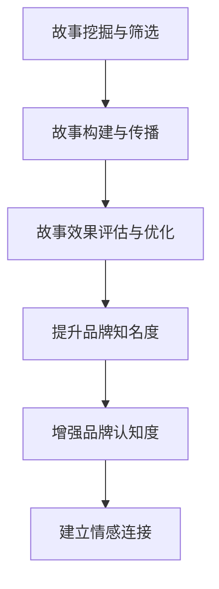
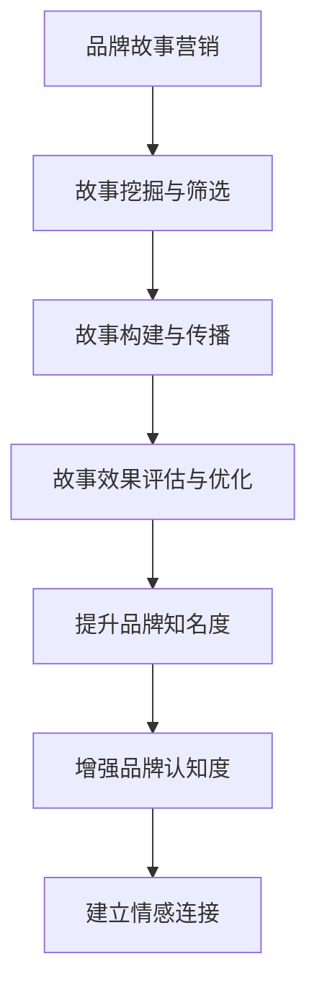

                 


### 引言

在当今数字化时代，品牌故事的营销策略显得尤为重要。一人公司的崛起，不仅依赖于创新的产品和服务，更在于其独具匠心的品牌故事营销与情感连接建立。本文将带领读者深入探讨这一话题，通过逻辑清晰的步骤分析，揭示品牌故事营销的核心原理和实践方法。

品牌故事不仅仅是一系列的市场宣传文字，它是一种深层次的营销策略，旨在与消费者建立情感上的联系。品牌故事通过讲述品牌的发展历程、核心价值观和使命，使消费者对品牌产生共鸣，从而增强品牌忠诚度和市场竞争力。

本文将分为八个部分展开讨论：

1. **品牌故事营销基础**：介绍品牌故事的重要性、营销流程以及效果评估。
2. **情感连接建立策略**：研究目标受众的情感需求，分析如何挖掘并满足这些需求。
3. **品牌故事创作技巧**：探讨故事结构设计、语言艺术等创作技巧。
4. **情感连接的营销传播**：分析多渠道营销策略和情感营销案例。
5. **品牌故事的持续优化**：介绍营销效果监测和优化策略。
6. **个人品牌塑造与情感连接**：探讨个人品牌故事的创作和情感连接建立。
7. **品牌故事营销案例分析**：深度分析成功案例，提取经验教训。
8. **品牌故事营销未来趋势**：展望品牌故事营销的发展方向。

通过上述步骤的分析，我们将全面了解品牌故事营销与情感连接建立的策略和方法，为读者提供实用的指导。

### 品牌故事营销基础

#### 品牌故事的重要性

品牌故事是品牌传播的核心内容，它不仅仅是一系列宣传材料的堆砌，更是品牌形象和价值观的传递。品牌故事通过讲述品牌的发展历程、核心价值观和使命，使消费者对品牌产生深刻的认知和情感上的共鸣。

首先，品牌故事有助于树立品牌形象。一个引人入胜的品牌故事能够塑造品牌独特的个性，使品牌在消费者心中留下深刻的印象。例如，苹果公司通过其创始人的故事和设计理念，成功地树立了科技与美学的完美结合的品牌形象。

其次，品牌故事可以增强品牌信任。消费者更愿意信任那些有故事的品牌。通过讲述品牌背后的故事，品牌能够展示其专业性和可靠性，从而赢得消费者的信任。例如，无印良品通过讲述其环保理念和生产过程，赢得了广大消费者的信任和好评。

最后，品牌故事有助于提升品牌忠诚度。品牌故事能够与消费者建立情感上的连接，使消费者对品牌产生强烈的归属感和忠诚度。例如，星巴克通过其咖啡文化故事和会员制度，成功地培养了一批忠实的消费者。

#### 品牌故事营销的目标

品牌故事营销的目标主要有三个方面：

1. **提升品牌知名度**：通过品牌故事的传播，提高品牌在公众中的知名度，使更多人了解和认可品牌。

2. **增强品牌认知度**：通过品牌故事，使消费者对品牌有更深入、更全面的认识，从而提升品牌在消费者心中的地位。

3. **建立情感连接**：品牌故事通过讲述品牌的发展历程和价值观，与消费者建立情感上的连接，增强消费者对品牌的忠诚度。

为了实现这些目标，品牌故事营销需要遵循以下原则：

- **真实性**：品牌故事必须是真实的，不能为了追求效果而夸大事实，否则会失去消费者的信任。

- **情感性**：品牌故事要能够触动消费者的情感，使其产生共鸣。

- **故事性**：品牌故事需要具备故事的特性，有情节、有冲突、有高潮和结局，从而吸引消费者的注意力。

- **一致性**：品牌故事需要与品牌形象和价值观保持一致，不能出现矛盾和冲突。

#### 品牌故事营销的流程

品牌故事营销是一个系统性的过程，主要包括以下几个步骤：

1. **故事挖掘与筛选**：首先需要挖掘品牌内部的故事素材，包括品牌的发展历程、重大事件、核心价值观等。然后对这些素材进行筛选，挑选出最具代表性和吸引力的故事。

2. **故事构建与传播**：将筛选出的故事进行结构化处理，使其具备故事的特性。然后通过多种渠道进行传播，包括社交媒体、广告、公关活动等。

3. **故事效果评估与优化**：在故事传播过程中，需要对其进行效果评估，包括品牌知名度、认知度和消费者情感反应等。根据评估结果对故事进行优化，以达到更好的传播效果。

下面我们将使用 Mermaid 流程图来详细描述品牌故事营销的流程：



通过上述步骤，品牌故事营销能够有效地提升品牌知名度和认知度，与消费者建立情感上的连接，从而增强品牌竞争力。

### 了解目标受众

#### 研究受众行为

在品牌故事营销中，了解目标受众的行为是非常重要的。通过对受众行为的研究，品牌可以更准确地把握消费者的需求和心理，从而设计出更加有效的营销策略。

首先，我们需要进行受众画像分析。受众画像是指对目标受众的基本信息进行描述，包括年龄、性别、职业、收入水平、教育背景等。通过这些信息，品牌可以了解消费者的基本特征，从而有针对性地制定营销策略。

例如，如果品牌的目标受众主要是年轻人，那么品牌故事可以更加年轻、时尚，以吸引这部分受众的注意。如果目标受众主要是专业人士，那么品牌故事可以更加专业、深入，以展示品牌的专业性。

其次，我们需要进行受众偏好分析。受众偏好分析是指对消费者的兴趣、喜好、购买行为等进行分析。通过这些分析，品牌可以了解消费者在消费过程中更倾向于哪些品牌、哪些产品类型，从而更好地满足消费者的需求。

例如，如果研究发现目标受众更偏好环保产品，那么品牌在讲故事时可以强调环保理念，展示品牌在环保方面的努力和成果，从而吸引这部分消费者的关注。

最后，我们需要进行受众需求分析。受众需求分析是指对消费者的需求进行深入挖掘，包括消费者的心理需求、情感需求等。通过这些分析，品牌可以了解消费者在消费过程中真正需要的是什么，从而提供更有针对性的产品和服务。

例如，如果研究发现目标受众在消费过程中更关注产品质量和售后服务，那么品牌在讲故事时可以强调产品的质量保证和售后服务政策，从而增强消费者的购买信心。

#### 情感需求洞察

在品牌故事营销中，了解目标受众的情感需求同样至关重要。情感需求是指消费者在消费过程中产生的情感体验，包括愉悦、焦虑、激动、感动等。这些情感体验直接影响消费者的购买决策和品牌忠诚度。

首先，我们需要了解情感需求的定义。情感需求是指消费者在消费过程中产生的情感体验，这些情感体验直接影响消费者的购买决策和品牌忠诚度。情感需求可以划分为多种类型，如愉悦、焦虑、激动、感动等。

接下来，我们需要分析情感需求类型。不同的消费者有不同的情感需求，常见的情感需求类型包括：

- **愉悦需求**：消费者在消费过程中追求愉悦的体验，如购物乐趣、产品使用带来的愉悦感等。
- **焦虑需求**：消费者在消费过程中可能会产生焦虑情绪，如担心产品质量、售后服务等。
- **激动需求**：消费者在消费过程中可能会产生激动情绪，如新产品发布、品牌活动等。
- **感动需求**：消费者在消费过程中可能会产生感动情绪，如品牌故事、公益项目等。

最后，我们需要了解情感需求挖掘方法。情感需求挖掘方法主要包括以下几种：

1. **用户调研**：通过问卷调查、访谈等方式收集消费者的情感需求信息。
2. **数据分析**：通过分析消费者的购买行为、反馈等数据，挖掘消费者的情感需求。
3. **市场调研**：通过观察市场趋势、消费者行为等，了解消费者的情感需求。

通过上述方法，品牌可以深入了解目标受众的情感需求，从而设计出更加贴近消费者需求的品牌故事。

### 情感需求洞察

#### 情感需求的定义

情感需求是指消费者在消费过程中产生的情感体验，这些情感体验直接影响消费者的购买决策和品牌忠诚度。情感需求不仅仅局限于愉悦或焦虑等单一的情感状态，而是涵盖了愉悦、焦虑、激动、感动等多种情感类型。

在品牌故事营销中，理解情感需求的定义至关重要。品牌故事不仅仅是信息的传递，更是情感的交流。通过捕捉并满足消费者的情感需求，品牌能够与消费者建立更深层次的连接，从而提升品牌忠诚度和市场竞争力。

#### 情感需求类型

消费者的情感需求多种多样，以下是一些常见的情感需求类型及其特点：

1. **愉悦需求**：消费者在购买和使用产品时，追求一种愉悦的感受。这种需求通常与产品带来的舒适体验、美观设计或有趣功能相关。例如，消费者购买一款时尚的手机，不仅因为它具备强大的性能，更因为它外观时尚，使用起来能够带来愉悦感。

2. **焦虑需求**：消费者在购买过程中可能会感到焦虑，尤其是在面临选择困难时。品牌故事可以针对这种需求，提供明确的购买建议和保障，如详细的产品介绍、用户评价和售后服务承诺，以减轻消费者的焦虑情绪。

3. **激动需求**：消费者的购买行为有时会因新产品发布、品牌活动或特殊优惠而激发出激动情绪。这种需求常常与品牌的新奇体验和创新精神相关。品牌可以通过发布新产品、举办线上或线下活动，以及提供限时优惠等方式，激发消费者的激动情感。

4. **感动需求**：品牌故事可以触动消费者的感动情感，例如通过讲述品牌的发展历程、社会责任或感人故事。这种需求往往能够提升品牌在消费者心中的地位，增强消费者对品牌的忠诚度。

#### 情感需求挖掘方法

要满足消费者的情感需求，首先需要深入了解这些需求。以下是几种常见的情感需求挖掘方法：

1. **用户调研**：通过问卷调查、深度访谈等方式收集消费者的情感体验数据。这些调研可以设计开放性和封闭性问题，以捕捉消费者的真实感受。

   ```markdown
   问卷示例：
   - 您在购买某品牌的产品时，主要追求哪种情感体验？
   - 非常愉悦、愉悦、一般、不愉悦、非常不愉悦
   ```

2. **数据分析**：利用数据分析工具对消费者的购买记录、评论和反馈进行分析，挖掘出潜在的情感需求。例如，通过分析消费者在社交媒体上的评论和讨论，可以发现消费者对品牌的哪些方面有强烈的情感反应。

   ```python
   # 伪代码示例
   import sentiment_analysis_tool

   # 分析消费者评论
   comments = sentiment_analysis_tool.analyze_comments(raw_comments)
   print("Emotional Needs Detected:", comments)
   ```

3. **市场调研**：通过观察市场趋势、竞争对手的营销策略以及消费者的行为习惯，了解消费者的情感需求。市场调研可以采用定量和定性研究方法，如焦点小组讨论、市场调查等。

   ```markdown
   市场调研示例：
   - 焦点小组讨论：邀请一组目标消费者，讨论他们对品牌故事的情感反应。
   - 市场调查：通过问卷调查了解消费者对品牌故事的满意度和期望。
   ```

通过以上方法，品牌可以全面了解消费者的情感需求，从而设计出更加符合消费者情感的品牌故事，提升品牌影响力和消费者忠诚度。

### 品牌故事创作技巧

#### 故事结构设计

一个成功的品牌故事需要具备吸引人的故事结构，这不仅是吸引消费者注意力的关键，也是确保故事能够深入人心的重要因素。故事结构设计包括基本要素、情节节奏控制以及高潮与结尾设计。

**基本要素**

1. **主题（Theme）**：故事的主题是整个故事的灵魂，它传达了品牌的核心价值观和品牌信息。一个好的主题应简洁明了，能够迅速引起消费者的共鸣。

2. **角色（Characters）**：故事中的角色是消费者与故事互动的桥梁。角色应具有鲜明的个性和背景，能够代表品牌的特点和价值。

3. **冲突（Conflict）**：冲突是故事发展的驱动力，它创造了故事的高潮。品牌故事中的冲突可以是对手、自我挑战或环境因素，但关键是要能够引发消费者的兴趣。

4. **情节（Plot）**：情节是故事发展的过程，包括起始、发展、高潮和结局。品牌故事中的情节应逻辑清晰，易于理解，同时能够传递品牌的核心信息。

5. **结局（Resolution）**：结局是对故事冲突的解决，它为故事画上圆满的句号。一个好的结局不仅能够让消费者满意，还应该能够加深消费者对品牌的印象。

**情节节奏控制**

情节节奏控制是确保故事流畅性和吸引力的关键。故事应遵循以下原则：

1. **起始阶段**：吸引注意。故事的开头应简洁有力，能够迅速抓住消费者的注意力，引导他们进入故事情境。

2. **发展阶段**：建立情感连接。故事的发展阶段应通过角色和情节逐步建立消费者与品牌之间的情感连接，使消费者产生共鸣。

3. **高潮阶段**：激发兴趣。故事的高潮应设置在冲突最激烈、情感最强烈的时刻，以激发消费者的兴趣和情感投入。

4. **结局阶段**：留下深刻印象。故事的结局应与开头呼应，通过圆满的解决冲突，为消费者留下深刻的印象，增强品牌忠诚度。

**高潮与结尾设计**

故事的高潮和结尾设计是故事成功的关键。高潮应设置在故事发展的最高点，冲突达到顶峰，角色面临关键决策。以下是几个设计高潮和结尾的技巧：

1. **意外转折**：在高潮阶段设置意外的转折，打破消费者的预期，增强故事的吸引力。

2. **情感共鸣**：通过高潮和结尾的设计，引发消费者的情感共鸣，使他们对品牌产生强烈的情感认同。

3. **开放性结尾**：虽然开放性结尾可能会给消费者留下疑惑，但也能够激发他们的好奇心和思考，从而加深对品牌的印象。

4. **重复主题**：在结尾部分重复故事的主题，使品牌信息更加深入人心。

通过以上的故事结构设计技巧，品牌可以创作出引人入胜的品牌故事，与消费者建立深层次的情感连接，提升品牌影响力和市场竞争力。

#### 品牌故事的语言艺术

品牌故事的语言艺术是传递品牌核心价值和情感的关键。语言的风格、表达技巧以及讲述的魅力直接影响消费者对品牌故事的接受程度和情感反应。以下将探讨如何通过语言艺术构建品牌故事。

**语言风格与品牌形象**

语言风格是品牌故事中的第一要素，它直接决定了品牌在消费者心中的形象。不同的语言风格可以传达出不同的品牌特质，如：

1. **正式风格**：正式风格的语言严谨、规范，适合传达专业性和权威性。例如，一些高端品牌的广告文案会采用这种风格，以彰显品牌的高质量和专业水平。

2. **亲切风格**：亲切风格的语言轻松、自然，适合建立与消费者的亲密关系。例如，一些快消品牌会使用亲切的语言与消费者沟通，以增强品牌的亲和力。

3. **幽默风格**：幽默风格的语言风趣、诙谐，适合提升品牌的故事性和吸引力。例如，一些科技品牌会通过幽默的广告来吸引年轻消费者的注意，增强品牌的趣味性。

4. **诗意风格**：诗意风格的语言优美、含蓄，适合传达品牌的文化内涵和艺术价值。例如，一些奢侈品牌的广告文案会采用诗意风格，以提升品牌的文化品位。

**感性语言的表达技巧**

感性语言的表达技巧是品牌故事中打动消费者情感的重要手段。以下是一些常用的表达技巧：

1. **情感化描述**：通过具体的细节和形象的语言描述，唤起消费者的情感共鸣。例如，描述一个温暖的拥抱、一次难忘的旅行，能够使消费者产生强烈的情感体验。

2. **比喻和隐喻**：比喻和隐喻是增强语言表现力的有效手段。通过将品牌特质比喻成生活中的常见事物，可以使品牌形象更加生动和易于理解。例如，将品牌的售后服务比喻成“家一般的温暖”，能够形象地传达品牌的关怀和贴心。

3. **排比和对比**：排比和对比可以增强语言的节奏感和表现力，使品牌故事更具说服力和感染力。例如，通过对比品牌的过去和现在、劣势和优势，可以突出品牌的发展和进步。

4. **情感动词和形容词**：使用情感动词和形容词可以增强语言的感染力，使品牌故事更加生动和有力。例如，使用“感动”、“温暖”、“震撼”等词语，可以更好地传达品牌的故事和情感。

**故事讲述的语言魅力**

故事讲述的语言魅力是品牌故事能否成功的关键。以下是一些提升故事讲述语言魅力的方法：

1. **对话与独白**：在品牌故事中巧妙地运用对话和独白，可以增强故事的互动性和情感共鸣。对话可以展示角色的性格和思想，独白可以揭示角色的内心世界。

2. **悬念与转折**：通过设置悬念和转折，可以增强故事的吸引力和紧张感。悬念可以激发消费者的好奇心，转折可以打破消费者的预期，使故事更加引人入胜。

3. **情感节奏**：通过调整情感的节奏，可以使品牌故事更具层次感和表现力。例如，在高潮部分增加情感的强度，在平静部分减弱情感的表达，可以创造出更加丰富的情感体验。

4. **重复与强调**：通过重复和强调关键信息，可以加深消费者对品牌的记忆和理解。例如，在品牌故事的结尾部分重复品牌的核心价值观或关键信息，可以增强品牌在消费者心中的印象。

通过以上语言艺术的运用，品牌故事可以更加生动、有力和有情感，从而更好地与消费者建立情感连接，提升品牌的认知度和忠诚度。

#### 情感连接的营销传播

在品牌故事营销中，情感连接的建立不仅依赖于精彩的故事创作，更需要通过多种渠道进行有效的传播。以下是几种主要的营销传播策略：

**内容营销策略**

内容营销是建立情感连接的核心手段之一。通过高质量的内容，品牌可以与消费者建立深层次的联系，传递品牌的价值和理念。

1. **博客与社交媒体营销**：品牌可以通过博客和社交媒体平台发布与品牌故事相关的内容，如文章、图片、视频等。这些内容可以结合时事热点、消费者兴趣和品牌特色，吸引消费者的关注。

2. **视频营销与直播营销**：视频和直播具有强烈的视觉冲击力和互动性，能够更好地传达情感。例如，品牌可以通过制作故事短片、纪录片或直播品牌活动，使消费者能够更加直观地了解品牌故事。

3. **KOL营销与口碑传播**：通过与意见领袖（KOL）合作，品牌可以在其影响下传递品牌故事，获得更多的关注和信任。此外，消费者的口碑也是品牌故事传播的重要渠道。通过鼓励满意的消费者分享他们的购买体验，品牌可以扩大影响力。

**情感营销案例解析**

以下是两个情感营销的案例解析，通过分析这些案例，我们可以更好地理解情感连接的建立和传播。

**案例一：可口可乐的“分享幸福”**

可口可乐通过其“分享幸福”活动，巧妙地利用品牌故事传递情感价值。该活动通过广告、社交媒体和线下活动，鼓励消费者分享自己的幸福瞬间。广告中，可口可乐将瓶身设计成笑脸，象征着快乐和分享。这一简单而深刻的品牌故事，成功地与消费者的情感产生了共鸣，增强了品牌忠诚度。

**案例二：苹果的“Designed by Apple in California”**

苹果通过其“Designed by Apple in California”品牌故事，传达了其对产品质量和设计理念的执着追求。这一故事不仅展示了苹果产品背后的设计历程，还强调了品牌的核心价值观——创新和卓越。苹果通过其官网、广告和零售店，不断地传递这一品牌故事，使其深入人心，赢得了消费者的广泛认同。

**情感营销策略优化**

为了优化情感营销策略，品牌可以采取以下措施：

1. **数据驱动**：通过数据分析，了解消费者的情感需求和反应，从而有针对性地优化营销策略。

2. **个性化内容**：根据消费者的兴趣和行为，提供个性化的内容，增强消费者的参与感和归属感。

3. **互动体验**：通过互动活动，如线上问答、互动游戏等，增强消费者与品牌之间的互动，建立更紧密的情感连接。

4. **长期合作**：与意见领袖和消费者建立长期合作关系，通过持续的互动和内容输出，保持品牌的活力和影响力。

通过多渠道营销策略和情感营销案例的解析，品牌可以更好地理解如何建立和传递情感连接，从而提升品牌的市场竞争力。

#### 品牌故事的持续优化

在品牌故事营销中，监测与评估是确保营销策略有效性的关键环节。通过系统性的监测和评估，品牌可以及时了解市场反馈，优化品牌故事，提升营销效果。

**营销效果监测**

1. **数据监测方法**：数据监测是评估品牌故事效果的基础。品牌可以通过多种方法收集数据，如网站流量分析、社交媒体互动数据、用户反馈等。具体方法包括：

   - **网站流量分析**：通过网站分析工具（如Google Analytics），监测页面访问量、用户停留时间、跳出率等关键指标，了解品牌故事在网站上的表现。
   - **社交媒体互动数据**：通过社交媒体平台的数据分析工具，监测品牌的粉丝增长、互动率、分享量等指标，评估品牌故事在社交媒体上的传播效果。
   - **用户反馈**：通过在线调查、问卷调查、客户回访等方式，收集消费者的直接反馈，了解他们对品牌故事的看法和感受。

2. **指标体系构建**：构建科学的指标体系是监测效果的重要步骤。品牌应根据营销目标设定关键指标（KPI），如品牌知名度、认知度、消费者忠诚度等。以下是几个常用的指标：

   - **品牌知名度**：通过市场调研、品牌知名度调查等，了解消费者对品牌的认知程度。
   - **消费者忠诚度**：通过重复购买率、客户保留率等指标，评估消费者对品牌的忠诚程度。
   - **用户满意度**：通过用户反馈调查，了解消费者对品牌故事的满意度和体验。

3. **监测工具介绍**：选择合适的监测工具可以帮助品牌高效地收集和分析数据。以下是一些常用的监测工具：

   - **Google Analytics**：用于网站流量分析和用户行为分析。
   - **Hootsuite**：用于社交媒体数据的监测和分析。
   - **SurveyMonkey**：用于在线调查和用户反馈收集。

**品牌故事优化策略**

1. **用户反馈收集与分析**：用户反馈是优化品牌故事的重要依据。品牌应建立机制，及时收集和分析用户的反馈，了解他们在品牌故事中的痛点和需求。

   - **收集方法**：通过在线问卷、客户回访、社交媒体互动等方式收集用户反馈。
   - **分析内容**：对用户反馈进行分类和统计，识别出普遍问题和改进点。

2. **内容迭代与调整**：根据用户反馈和监测数据，对品牌故事进行内容迭代和调整。以下是一些优化策略：

   - **内容更新**：定期更新品牌故事，使其保持新鲜感和吸引力。
   - **细节优化**：优化故事中的细节，如角色描述、情节设置等，使其更加符合用户期望。
   - **形式创新**：尝试不同的故事形式和渠道，如视频、动画等，以吸引更多用户。

3. **传播渠道优化**：根据监测数据，优化品牌故事的传播渠道和策略。以下是一些建议：

   - **渠道选择**：根据目标受众的媒介使用习惯，选择合适的传播渠道。
   - **内容定制**：根据不同渠道的特点，定制不同的内容形式和传播策略。
   - **互动互动**：增加与用户的互动，如开展线上活动、举办线下活动等，提高用户参与度。

通过有效的监测与评估，品牌可以及时了解市场反馈，优化品牌故事，提升营销效果，从而在竞争激烈的市场中脱颖而出。

#### 个人品牌塑造与情感连接

在品牌故事营销中，个人品牌塑造同样至关重要。个人品牌不仅仅是个人的职业标签，更是与目标受众建立情感连接的重要渠道。以下将探讨如何通过个人品牌故事创作和情感连接建立，提升个人在市场中的影响力。

**个人品牌故事定位**

个人品牌故事定位是塑造个人品牌形象的基础。一个清晰、独特的个人品牌故事能够帮助个人在众多竞争者中脱颖而出，赢得目标受众的认可和信任。以下是几个关键步骤：

1. **自我认知**：首先，个人需要深入了解自己的价值观、专业技能、成就和独特优势。这包括分析个人的职业背景、教育经历、工作成果等，确定自己的核心竞争力和品牌定位。

2. **目标受众分析**：了解目标受众的需求、兴趣和痛点，是设计个人品牌故事的重要依据。通过市场调研、用户反馈等方式，收集目标受众的偏好和期望，确保个人品牌故事能够满足他们的需求。

3. **品牌定位策略**：基于自我认知和目标受众分析，确定个人的品牌定位。这包括明确个人的品牌价值主张、目标市场、品牌形象等。例如，一个专注于技术创新的个人品牌，可以定位为“科技领域的专家”。

**个人情感连接建立**

在品牌故事营销中，情感连接是建立长期关系的关键。以下是几种建立情感连接的方法：

1. **真诚表达**：个人品牌故事应真诚表达个人的经历、感受和理念。通过真实的情感流露，个人能够与目标受众建立信任和共鸣。

2. **故事性**：个人品牌故事需要具备故事性，包括情节、角色、冲突和结局。一个引人入胜的故事能够吸引目标受众的注意力，使他们更愿意了解和信任个人。

3. **情感共鸣**：在个人品牌故事中，通过描绘具体的情境和细节，唤起目标受众的情感共鸣。例如，分享一次成功的项目经历、一次克服困难的经历，都能引起目标受众的共鸣。

**个人品牌故事创作方法**

以下是几个步骤，帮助个人创作出有吸引力的品牌故事：

1. **故事构思**：确定故事的主题和核心信息。这可以是一个成功案例、一次挫折经历或一个成长故事。

2. **情节设置**：设计故事的情节，包括起始、发展、高潮和结局。确保情节紧凑、逻辑清晰，能够吸引受众的注意力。

3. **语言表达**：使用生动的语言和情感化的描述，使故事更具吸引力。注意语言风格要与个人品牌形象一致。

4. **视觉呈现**：通过图片、视频等视觉元素，增强故事的表现力。视觉元素应与故事主题和情感氛围相匹配。

通过个人品牌故事的创作和情感连接的建立，个人可以提升在市场中的影响力，赢得更多目标受众的认可和支持。

### 品牌故事营销案例分析

为了更好地理解品牌故事营销的实际效果，我们将通过几个成功的案例进行深度分析。这些案例不仅展示了品牌故事营销的独特魅力，还为其他品牌提供了宝贵的经验教训。

#### 案例一：苹果公司的“Designed by Apple in California”

**背景介绍**：
苹果公司是一家全球知名的科技公司，以其创新的产品和独特的设计理念闻名。2017年，苹果推出了“Designed by Apple in California”广告系列，旨在传递苹果对产品质量和设计的执着追求。

**目标**：
通过这个广告系列，苹果希望增强品牌形象，提升消费者对品牌创新能力和设计质量的认可。

**实施过程**：
苹果的广告以一系列短片的形式呈现，每部短片都展示了苹果产品背后的设计过程和故事。广告中，设计师们与工程师们共同努力，克服各种技术挑战，最终创造出令人惊叹的产品。这些短片通过细腻的镜头和情感化的叙事，将观众带入苹果的设计工作室，感受到苹果对产品完美的追求。

**效果评估**：
该广告系列在全球范围内取得了巨大的成功。根据苹果公司的数据，广告播出后，品牌认知度和消费者满意度显著提升。此外，广告引发了广泛的讨论和分享，进一步增强了品牌的影响力。

**成功原因分析**：
苹果的“Designed by Apple in California”广告成功的原因主要有以下几点：

1. **情感共鸣**：广告通过展示设计过程中的细节和设计师的情感投入，成功激发了观众的情感共鸣。
2. **品牌一致性**：广告内容与苹果的品牌形象高度一致，传递了苹果一贯的创新和高质量的品牌价值观。
3. **故事性**：广告具备强烈的叙事性，使观众对产品背后的故事产生了浓厚的兴趣。

**案例启示**：
这个案例表明，一个具有情感共鸣、品牌一致性和故事性的品牌故事，能够极大地提升品牌形象和市场竞争力。其他品牌可以借鉴这一策略，通过讲述自己的品牌故事，与消费者建立深层次的连接。

#### 案例二：可口可乐的“Share a Coke”

**背景介绍**：
可口可乐是一家全球饮料巨头，其“Share a Coke”活动是其在全球范围内推出的一项品牌故事营销活动。

**目标**：
通过这个活动，可口可乐希望增强品牌与消费者的互动，提升品牌在年轻人中的影响力。

**实施过程**：
可口可乐在瓶装饮料上印上了消费者的名字，取代了传统的品牌名称。这个创新的做法使消费者在购买饮料时，感受到了品牌对他们的个性化关注。此外，可口可乐还在社交媒体上鼓励消费者分享他们的饮料瓶，进一步增强了互动性。

**效果评估**：
“Share a Coke”活动在全球范围内取得了巨大的成功。根据可口可乐的数据，活动期间，饮料销量显著提升，社交媒体互动率也大幅增加。消费者对活动的积极反馈表明，他们非常喜欢这种个性化的体验。

**成功原因分析**：
可口可乐的“Share a Coke”活动成功的原因主要有以下几点：

1. **个性化**：通过在饮料瓶上印上消费者的名字，可口可乐成功地将品牌与消费者的个人身份联系在一起。
2. **互动性**：社交媒体的参与和分享机制，使消费者成为品牌传播的主动参与者，增强了品牌的社交影响力。
3. **情感共鸣**：这个活动不仅提升了消费者的购买体验，还使消费者感受到了品牌对他们的重视和关怀。

**案例启示**：
这个案例表明，通过个性化的内容和互动机制，品牌可以与消费者建立更紧密的连接。其他品牌可以从这一案例中学习，通过创造性的方法，提升品牌与消费者之间的互动和情感共鸣。

#### 案例三：红牛的“超越极限”

**背景介绍**：
红牛是一家全球功能性饮料品牌，其“超越极限”品牌故事营销活动旨在传递红牛支持消费者追求极限的精神。

**目标**：
通过这个活动，红牛希望提升品牌形象，增强消费者对品牌支持极限运动精神的理解和认同。

**实施过程**：
红牛通过赞助极限运动赛事和制作相关的品牌故事视频，展示了运动员们如何通过红牛的支持，克服极限，实现梦想。这些视频通过社交媒体和线下活动进行传播，吸引了大量消费者的关注。

**效果评估**：
“超越极限”活动在市场上获得了极大的成功。根据红牛的数据，活动期间，品牌知名度显著提升，消费者对品牌的认同度和忠诚度也大幅增加。此外，品牌在年轻消费者中的影响力显著增强。

**成功原因分析**：
红牛的“超越极限”活动成功的原因主要有以下几点：

1. **品牌一致性**：活动内容与红牛的品牌形象高度一致，传递了品牌支持极限运动和追求卓越的核心价值。
2. **故事性**：通过生动的品牌故事，使消费者能够更加直观地感受到红牛品牌的精神。
3. **互动性**：通过社交媒体和线下活动，增强了消费者与品牌之间的互动和情感连接。

**案例启示**：
这个案例表明，通过具有品牌一致性和故事性的活动，品牌可以与消费者建立深层次的情感连接。其他品牌可以从这一案例中学习，通过创造性的品牌故事，提升品牌形象和市场竞争力。

通过以上案例的分析，我们可以看到，成功的品牌故事营销不仅能够提升品牌知名度，还能与消费者建立深层次的情感连接，从而增强品牌忠诚度。这些案例为其他品牌提供了宝贵的经验和启示，值得借鉴和参考。

### 品牌故事营销未来趋势

随着技术的不断进步和市场的演变，品牌故事营销的未来趋势也在悄然发生着变化。以下是几个关键趋势：

#### 技术趋势分析

**人工智能在品牌故事营销中的应用**

人工智能（AI）在品牌故事营销中的应用前景广阔。首先，AI可以用于数据分析和消费者行为预测，帮助品牌更好地了解目标受众的需求和情感反应。例如，通过自然语言处理（NLP）技术，品牌可以分析消费者的社交媒体评论和反馈，提取关键的情感词汇和主题，从而优化品牌故事的内容和传播策略。

此外，人工智能还可以用于个性化营销。通过机器学习算法，品牌可以根据消费者的兴趣和行为，推荐个性化的品牌故事和产品信息，提高营销的精准度和转化率。

**5G技术对品牌故事传播的影响**

5G技术的普及将为品牌故事营销带来新的机遇。首先，5G网络的低延迟和高带宽将极大地提升品牌故事的传播速度和效果。例如，品牌可以实时发布视频内容，通过高清直播与消费者互动，增强品牌的影响力和吸引力。

其次，5G技术将推动虚拟现实（VR）和增强现实（AR）技术的发展，为品牌故事营销带来更多的创新形式。通过VR和AR，品牌可以打造沉浸式的品牌体验，使消费者能够更加直观地感受品牌故事，提升品牌与消费者之间的情感连接。

**新媒体平台对品牌故事传播的作用**

随着新媒体平台的不断发展和变化，品牌故事传播的渠道也在不断拓宽。例如，短视频平台如抖音（TikTok）和快手（Kuaishou）已经成为品牌故事营销的重要阵地。这些平台用户基数庞大，内容形式多样，品牌可以通过创意短视频吸引年轻消费者的关注和互动。

此外，社交媒体平台如微信和微博也继续在品牌故事传播中扮演着重要角色。通过公众号和微博，品牌可以与消费者进行直接的互动和沟通，发布品牌故事和相关内容，增强品牌的影响力和忠诚度。

#### 营销策略展望

**情感营销的发展方向**

情感营销是品牌故事营销的核心，未来将继续朝着更加个性化、情感化和互动性的方向发展。品牌需要更加深入地挖掘消费者的情感需求，通过个性化的内容和互动机制，与消费者建立深层次的连接。

例如，品牌可以通过情感化的故事内容，激发消费者的共鸣和情感认同。同时，通过互动活动，如线上挑战、用户参与等，增强消费者与品牌之间的情感互动，提升品牌忠诚度。

**品牌故事营销的创新策略**

未来，品牌故事营销将不断涌现出新的创新形式和策略。例如，虚拟品牌大使和虚拟互动体验将成为品牌故事传播的重要手段。通过虚拟现实（VR）和增强现实（AR）技术，品牌可以打造虚拟的品牌大使，与消费者进行实时互动，提供独特的品牌体验。

此外，品牌还可以尝试使用人工智能和大数据技术，进行智能化的品牌故事创作和传播。通过分析消费者的行为数据和情感反应，品牌可以动态调整品牌故事的策略和内容，实现更加精准和高效的营销。

**品牌故事营销的未来挑战与机遇**

尽管品牌故事营销面临诸多挑战，如技术成本、内容创作难度等，但同时也蕴含着巨大的机遇。首先，随着消费者对个性化体验的需求增加，品牌故事营销将发挥更大的作用。通过讲述独特的品牌故事，品牌可以更好地满足消费者的需求，提升品牌忠诚度和市场竞争力。

其次，随着技术进步和新媒体平台的发展，品牌故事营销将变得更加多样化和创新化。品牌可以通过多种渠道和形式，传递品牌故事，与消费者建立更紧密的连接。

总之，品牌故事营销的未来充满挑战和机遇。品牌需要不断创新和优化策略，通过情感连接和个性化体验，与消费者建立深层次的连接，实现品牌的长期发展。

### 附录

#### 品牌故事营销资源

在品牌故事营销的实践中，利用合适的工具和资源能够显著提升营销效果。以下是几种常用的品牌故事营销资源，包括创作工具、分析工具、传播渠道以及案例研究与参考资料。

**品牌故事创作工具**

1. **故事板（Storyboard）**：故事板是一种用于规划和呈现故事情节的工具。它可以帮助品牌详细规划故事的发展、角色设置和关键场景，以便在创作过程中保持一致性和连贯性。

2. **故事地图（Story Map）**：故事地图是一种视觉化的工具，用于展示故事的整体结构和发展流程。通过故事地图，品牌可以清晰地规划故事的起点、中间环节和结局，确保故事情节的逻辑性和吸引力。

3. **故事模板（Story Template）**：故事模板是一种预制的模板，用于快速构建品牌故事。这些模板提供了故事的基本框架和指导，品牌可以根据实际情况进行调整和个性化，节省创作时间。

**情感连接分析工具**

1. **用户调研工具**：通过在线调查、问卷和访谈等方式，收集消费者的情感需求和反馈。常见的用户调研工具有SurveyMonkey、Google Forms等。

2. **情感分析工具**：利用自然语言处理（NLP）技术，分析消费者的文本反馈和社交媒体评论，提取情感词汇和情感倾向。常用的情感分析工具包括IBM Watson、Google Cloud Natural Language API等。

3. **用户体验评估工具**：通过用户行为分析和用户体验测试，评估品牌故事的效果和影响力。常用的用户体验评估工具包括Google Analytics、UserTesting等。

**营销传播渠道**

1. **社交媒体平台**：包括Facebook、Instagram、Twitter、LinkedIn、微信、微博等，品牌可以通过这些平台发布内容、与用户互动、推广品牌故事。

2. **电子邮件营销**：通过电子邮件发送定制化内容，与用户保持沟通和互动，传递品牌故事和营销信息。

3. **内容营销平台**：如YouTube、Bilibili、TikTok等，品牌可以通过视频内容展示品牌故事，吸引目标受众的注意力。

**案例研究与参考资料**

1. **国内外成功案例**：通过分析国内外知名品牌的成功案例，了解品牌故事营销的最佳实践和策略。例如，可口可乐的“Share a Coke”、苹果的“Designed by Apple in California”等。

2. **学术论文与研究报告**：查阅相关领域的学术论文和行业研究报告，获取最新的研究进展和理论成果。如《品牌故事营销：理论与实践》等书籍。

3. **品牌故事营销书籍推荐**：推荐一些经典的品牌故事营销书籍，如《故事思维》、《品牌故事的力量》等，为品牌故事的创作和营销提供理论支持和实践指导。

通过上述品牌故事营销资源，品牌可以更有效地创作和传播故事，与消费者建立深层次的情感连接，提升品牌影响力和市场竞争力。

#### Mermaid 流程图

以下是一个简化的Mermaid流程图示例，用于描述品牌故事营销的基本流程：



这个流程图展示了品牌故事营销的核心步骤，从故事挖掘到传播，再到效果评估和品牌提升，每个环节都相互关联，共同构建了品牌故事营销的整体框架。通过这个流程图，品牌可以清晰地了解营销活动的每一个环节，并确保故事的连贯性和有效性。

