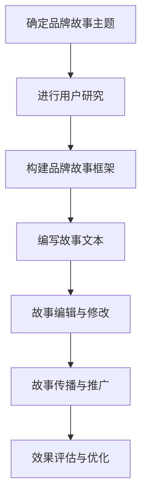

                 

# 一人公司的品牌故事：如何打动用户心智的技巧

> 关键词：品牌故事，用户心智，故事营销，个人品牌，品牌塑造

> 摘要：本文将探讨一人公司的品牌故事如何通过巧妙运用用户心智模型，以简单的技巧打动用户的心智，从而建立强大的品牌认知和忠诚度。我们将深入分析品牌与用户心智的关系，探讨品牌故事的构成要素，讲解打动用户心智的技巧，并分享个人品牌打造的经验。通过案例分析、实战技巧和深度剖析，帮助读者掌握品牌故事创作的核心方法，提升品牌影响力。

## 第一部分：品牌故事概述

### 第1章：品牌与用户心智

#### 1.1 品牌的定义与重要性

品牌不仅仅是一个标志或名称，它代表了一个公司的价值观、使命和愿景。一个成功的品牌能够引起用户的共鸣，塑造用户心智，从而产生持续的品牌忠诚度。对于一家一人公司来说，品牌的意义尤为重要，因为它往往依赖于个人的声誉和专业形象。

品牌的重要性在于：

1. **差异化竞争**：品牌能够帮助一家公司在众多竞争者中脱颖而出，形成独特的市场定位。
2. **用户认知**：品牌有助于用户快速识别和记忆，建立良好的第一印象。
3. **价值提升**：品牌可以提升产品和服务的价值，增加用户的购买意愿。
4. **忠诚度**：品牌能够建立用户对公司的信任和忠诚，促进持续消费。

#### 1.2 用户心智的概念

用户心智是指用户在认知、情感和行为方面的心理活动。它包括用户对品牌的认知、情感反应和购买行为等。用户心智的形成受到多个因素的影响，包括个人经验、社会影响、文化背景和品牌传播等。

用户心智模型主要涉及以下几个方面：

1. **认知地图**：用户在心中构建的品牌形象和认知结构。
2. **情感反应**：用户对品牌的情感体验，如信任、喜爱、厌恶等。
3. **购买行为**：用户在购买决策过程中的行为模式。

#### 1.3 品牌与用户心智的关系

品牌与用户心智之间存在密切的关系。品牌是通过各种传播手段和用户互动来影响用户心智的。一个成功的品牌故事能够深入用户心智，塑造用户对品牌的认知和情感，从而推动购买行为。

品牌与用户心智的关系主要表现在以下几个方面：

1. **认知一致性**：品牌需要与用户心智中的认知地图保持一致，形成积极的认知联想。
2. **情感共鸣**：品牌需要触动用户的情感，建立情感共鸣，增强品牌忠诚度。
3. **行为引导**：品牌需要通过故事和营销策略引导用户行为，促进品牌传播和销售增长。

### 第2章：品牌故事的构成要素

#### 2.1 故事的主题与情感

品牌故事的主题是品牌的核心价值和理念，它需要与用户的需求和价值观产生共鸣。情感是品牌故事的关键要素，它能够触动用户的内心，引发情感共鸣，从而加深用户对品牌的认知和喜爱。

品牌故事的主题和情感要素包括：

1. **主题明确**：品牌故事需要有一个明确的主题，传达品牌的核心价值和理念。
2. **情感共鸣**：故事需要创造情感共鸣，触动用户的内心，引发情感反应。
3. **情感一致**：品牌故事中的情感元素需要与品牌形象和用户情感相一致，形成一致的品牌体验。

#### 2.2 品牌个性与价值观

品牌个性是品牌在用户心智中的形象特征，它有助于品牌与用户建立情感联系。品牌价值观是品牌的信仰和原则，它体现了品牌的文化内涵和社会责任。

品牌个性与价值观的要素包括：

1. **品牌个性**：品牌个性需要独特且符合品牌定位，如真诚、创新、专业等。
2. **价值观**：品牌价值观需要符合品牌形象和用户需求，如诚信、环保、创新等。
3. **一致性**：品牌个性与价值观需要保持一致，形成统一的品牌形象。

#### 2.3 故事的叙述技巧

品牌故事的叙述技巧对于打动用户心智至关重要。好的叙述能够吸引用户注意力，引发用户兴趣，增强品牌影响力。

故事叙述的技巧包括：

1. **引人入胜**：故事需要有一个引人入胜的开头，吸引用户阅读兴趣。
2. **情感渲染**：故事需要通过情感渲染，引发用户的情感共鸣。
3. **逻辑清晰**：故事需要逻辑清晰，让用户能够理解品牌的核心价值和理念。
4. **生动形象**：故事需要通过生动的描述和形象的比喻，让用户更好地理解品牌。

### 第3章：打动用户心智的技巧

#### 3.1 了解目标用户

了解目标用户是打造成功品牌故事的关键。通过用户研究，可以深入了解用户的需求、喜好和行为习惯，从而为品牌故事创作提供有力支持。

了解目标用户的技巧包括：

1. **用户画像**：通过用户画像，了解目标用户的基本信息和特征。
2. **用户调研**：通过问卷调查、访谈等方式，收集用户反馈和需求。
3. **数据分析**：通过数据分析，挖掘用户行为模式和需求。

#### 3.2 创造情感共鸣

创造情感共鸣是打动用户心智的关键。品牌故事需要通过情感元素，引发用户的情感共鸣，从而增强品牌忠诚度。

创造情感共鸣的技巧包括：

1. **情感触动**：通过情感触动，引发用户的情感反应，如感动、愤怒、喜悦等。
2. **情感共鸣**：通过情感共鸣，让用户感受到品牌与自身的情感联系。
3. **情感一致**：品牌故事中的情感元素需要与用户情感相一致，形成情感共鸣。

#### 3.3 利用故事营销

故事营销是一种有效的品牌传播手段。通过讲述品牌故事，可以增强品牌形象，提高品牌知名度，促进销售增长。

利用故事营销的技巧包括：

1. **故事内容**：品牌故事需要内容丰富，具有吸引力和感染力。
2. **故事形式**：品牌故事可以通过多种形式呈现，如视频、图文、音频等。
3. **故事传播**：品牌故事需要通过有效的传播渠道，如社交媒体、广告等，扩大品牌影响力。

## 第二部分：品牌故事案例分析

### 第5章：成功品牌故事解析

#### 5.1 品牌故事的成功要素

成功品牌故事通常具备以下要素：

1. **故事性**：品牌故事需要具备一定的故事性，能够吸引用户注意力。
2. **情感性**：品牌故事需要引发用户的情感共鸣，增强品牌忠诚度。
3. **真实性**：品牌故事需要真实可信，让用户感受到品牌的真诚和专业。
4. **独特性**：品牌故事需要具有独特性，能够在众多品牌中脱颖而出。

#### 5.2 成功品牌故事的案例解析

以苹果公司的品牌故事为例，苹果公司通过以下几个关键步骤打造了成功的品牌故事：

1. **创新**：苹果公司以创新为核心，不断推出革命性的产品，如iPhone、iPad等。
2. **用户体验**：苹果公司注重用户体验，通过设计简约、操作便捷的产品，赢得了用户的喜爱。
3. **品牌传播**：苹果公司通过广告、社交媒体等渠道，广泛传播品牌故事，提高品牌知名度。
4. **品牌个性**：苹果公司塑造了独特、时尚、高端的品牌形象，与用户的情感产生共鸣。

从苹果公司的品牌故事中，我们可以学习到以下几点：

1. **创新驱动**：创新是品牌故事的灵魂，能够吸引用户的关注。
2. **用户体验**：用户体验是品牌故事的核心，需要让用户感受到品牌的真诚和专业。
3. **品牌传播**：品牌传播是品牌故事的翅膀，需要通过多种渠道扩大品牌影响力。
4. **品牌个性**：品牌个性是品牌故事的关键，需要与用户的情感产生共鸣。

#### 5.3 从成功品牌故事中学习

从成功品牌故事中，我们可以学习到以下几点：

1. **明确品牌定位**：品牌故事需要明确品牌定位，与用户的需求和价值观产生共鸣。
2. **创造情感共鸣**：品牌故事需要通过情感元素，引发用户的情感共鸣，增强品牌忠诚度。
3. **注重用户体验**：品牌故事需要关注用户体验，让用户感受到品牌的真诚和专业。
4. **持续创新**：品牌故事需要不断创新，以适应市场的变化和用户需求。
5. **品牌传播**：品牌故事需要通过多种渠道进行传播，提高品牌知名度和影响力。

### 第6章：品牌故事创作实战

#### 6.1 品牌故事创作的方法

品牌故事创作需要遵循一定的方法和步骤，以下是一些实用的方法：

1. **确定故事主题**：首先需要明确品牌故事的主题，即品牌的核心价值和理念。
2. **了解目标用户**：通过用户研究，了解目标用户的需求、喜好和行为习惯。
3. **构建故事框架**：确定故事的开头、中间和结尾，构建一个完整的故事框架。
4. **编写故事文本**：根据故事框架，编写故事文本，确保故事内容丰富、生动。
5. **故事传播**：选择合适的传播渠道，如社交媒体、广告等，扩大品牌影响力。

#### 6.2 品牌故事创作步骤

品牌故事创作可以按照以下步骤进行：

1. **确定故事主题**：明确品牌故事的核心价值和理念。
2. **进行用户研究**：了解目标用户的需求、喜好和行为习惯。
3. **构建故事框架**：确定故事的开头、中间和结尾，构建一个完整的故事框架。
4. **编写故事文本**：根据故事框架，编写故事文本，确保故事内容丰富、生动。
5. **故事编辑与修改**：对故事文本进行反复修改，确保故事流畅、具有吸引力。
6. **故事传播**：选择合适的传播渠道，如社交媒体、广告等，扩大品牌影响力。
7. **效果评估与优化**：对品牌故事传播效果进行评估，根据反馈进行优化。

#### 6.3 品牌故事创作的技巧

品牌故事创作需要注意以下几点技巧：

1. **情感共鸣**：故事需要通过情感元素，引发用户的情感共鸣。
2. **简洁明了**：故事需要简洁明了，让用户容易理解和记忆。
3. **独特性**：故事需要具有独特性，能够在众多品牌中脱颖而出。
4. **真实性**：故事需要真实可信，让用户感受到品牌的真诚和专业。
5. **连贯性**：故事需要连贯性，逻辑清晰，让用户能够顺畅地阅读。

### 第7章：品牌故事的传播与效果评估

#### 7.1 品牌故事传播策略

品牌故事的传播策略需要根据目标用户和品牌定位进行制定，以下是一些常见的传播策略：

1. **社交媒体传播**：通过微博、微信、抖音等社交媒体平台，发布品牌故事，吸引用户关注。
2. **广告投放**：通过电视、报纸、网络广告等渠道，投放品牌故事广告，提高品牌知名度。
3. **公关活动**：举办品牌故事发布会、展览、论坛等活动，吸引媒体和公众的关注。
4. **合作推广**：与其他品牌或媒体进行合作，共同推广品牌故事，扩大传播范围。

#### 7.2 品牌故事传播渠道

品牌故事传播可以通过以下渠道进行：

1. **线上渠道**：如社交媒体、官网、APP等，通过文字、图片、视频等形式传播品牌故事。
2. **线下渠道**：如广告牌、海报、展览等，通过视觉形式传播品牌故事。
3. **媒体渠道**：如报纸、杂志、电视、广播等，通过媒体宣传品牌故事。

#### 7.3 品牌故事效果评估方法

品牌故事效果评估可以通过以下方法进行：

1. **用户反馈**：收集用户对品牌故事的反馈，如点赞、评论、转发等，评估故事的受欢迎程度。
2. **品牌知名度**：通过问卷调查、搜索引擎指数等手段，评估品牌知名度变化。
3. **销售业绩**：通过销售数据，评估品牌故事对销售业绩的影响。
4. **品牌忠诚度**：通过用户忠诚度调查、用户行为分析等手段，评估品牌故事对品牌忠诚度的影响。

## 第三部分：品牌故事与用户心智关系深度剖析

### 第8章：用户心智模型与品牌策略

#### 8.1 用户心智模型的构成

用户心智模型主要包括以下几个方面：

1. **认知地图**：用户在心中构建的品牌形象和认知结构。
2. **情感反应**：用户对品牌的情感体验，如信任、喜爱、厌恶等。
3. **购买行为**：用户在购买决策过程中的行为模式。

了解用户心智模型，有助于品牌制定更有效的策略，满足用户需求，增强品牌影响力。

#### 8.2 品牌策略与用户心智模型的关系

品牌策略与用户心智模型之间存在密切的关系。品牌策略需要根据用户心智模型进行制定，以影响和引导用户心智。

品牌策略主要包括以下几个方面：

1. **品牌定位**：根据用户心智模型，确定品牌的市场定位和目标用户群体。
2. **品牌传播**：通过有效的品牌传播手段，塑造品牌形象，影响用户心智。
3. **品牌体验**：通过优质的产品和服务，提升用户体验，增强品牌忠诚度。
4. **品牌互动**：通过用户互动，了解用户需求，调整品牌策略。

#### 8.3 基于用户心智模型的品牌策略制定

基于用户心智模型，品牌可以制定以下策略：

1. **认知一致策略**：确保品牌传播与用户心智中的认知地图保持一致，形成积极的认知联想。
2. **情感共鸣策略**：通过情感元素，引发用户的情感共鸣，增强品牌忠诚度。
3. **行为引导策略**：通过故事和营销策略，引导用户行为，促进品牌传播和销售增长。
4. **个性化策略**：根据不同用户群体的需求，制定个性化的品牌策略，提升用户体验。

### 第9章：用户心智影响与品牌塑造

#### 9.1 用户心智影响的概念

用户心智影响是指用户在认知、情感和行为方面的心理活动，对品牌和产品的影响。用户心智影响主要表现在以下几个方面：

1. **认知影响**：用户心智中的认知地图会影响用户对品牌的认识和评价。
2. **情感影响**：用户心智中的情感体验会影响用户对品牌的喜爱和信任。
3. **行为影响**：用户心智中的行为模式会影响用户的购买决策和品牌忠诚度。

#### 9.2 品牌塑造对用户心智的影响

品牌塑造是指通过品牌传播和营销策略，影响用户心智，塑造用户对品牌的认知和情感。品牌塑造对用户心智的影响主要体现在以下几个方面：

1. **认知重塑**：品牌塑造可以改变用户对品牌的认知，形成积极的品牌联想。
2. **情感引导**：品牌塑造可以通过情感元素，引导用户情感，增强品牌忠诚度。
3. **行为驱动**：品牌塑造可以通过故事和营销策略，驱动用户行为，促进品牌传播和销售增长。

#### 9.3 品牌塑造策略与用户心智引导

品牌塑造策略与用户心智引导密切相关。以下是一些常见的品牌塑造策略：

1. **品牌故事**：通过品牌故事，引发用户的情感共鸣，塑造用户心智。
2. **品牌传播**：通过有效的品牌传播，塑造品牌形象，影响用户心智。
3. **品牌体验**：通过优质的产品和服务，提升用户体验，引导用户心智。
4. **品牌互动**：通过用户互动，了解用户需求，引导用户心智。

品牌塑造策略需要根据用户心智模型进行制定，以影响和引导用户心智，实现品牌目标。

### 第10章：品牌故事的未来趋势

#### 10.1 品牌故事的未来发展

随着科技的进步和消费者需求的变化，品牌故事在未来将呈现以下发展趋势：

1. **数字化**：品牌故事将更多地通过数字化渠道传播，如社交媒体、短视频平台等。
2. **个性化**：品牌故事将更加注重个性化，满足不同用户群体的需求。
3. **互动性**：品牌故事将更加互动，增强用户参与感和体验感。
4. **多元化**：品牌故事将呈现多元化特点，涵盖多个领域和场景。

#### 10.2 新媒体与品牌故事的融合

新媒体的发展为品牌故事的传播提供了更多可能性。以下是如何将新媒体与品牌故事融合的方法：

1. **短视频**：通过短视频平台，如抖音、快手等，讲述品牌故事，吸引更多用户关注。
2. **直播**：通过直播平台，与用户互动，展示品牌故事，增强用户参与感。
3. **社交化**：通过社交媒体，如微博、微信等，传播品牌故事，扩大品牌影响力。

#### 10.3 品牌故事的创新方向

品牌故事的创新方向主要包括以下几个方面：

1. **虚拟现实**：通过虚拟现实技术，打造沉浸式的品牌故事体验。
2. **人工智能**：利用人工智能技术，分析用户数据，创作个性化品牌故事。
3. **跨界合作**：与其他品牌或领域合作，创造跨界品牌故事，吸引更多用户关注。

## 附录

### 附录A：品牌故事创作资源推荐

#### A.1 品牌故事创作工具推荐

1. **MindMap**：用于构建品牌故事思维导图，帮助梳理故事框架。
2. **Canva**：用于设计品牌故事海报、PPT等视觉元素。
3. **Scrivener**：用于撰写和编辑品牌故事文本，提供丰富的写作工具。

#### A.2 品牌故事创作参考书籍

1. **《故事**：材质与文化》——罗伯特·麦基
2. **《品牌**：战争与和平》——汤姆·彼得斯
3. **《故事营销**：用故事吸引顾客、留住顾客、赢得顾客》——凯文·凯利

#### A.3 品牌故事创作在线课程与培训

1. **Coursera**：《品牌管理》：提供品牌管理和品牌故事创作的基础知识。
2. **Udemy**：《品牌故事创作实战》：通过案例讲解，教授品牌故事创作技巧。
3. **edX**：《故事创作与叙述技巧》：专注于故事创作技巧，适用于品牌故事创作。

## Mermaid 流程图：品牌故事创作流程



## 核心算法原理讲解

### 伪代码：用户行为分析算法

```python
// 伪代码：用户行为分析算法
function userBehaviorAnalysis(data):
    for user in data:
        user_interests = extractUserInterests(user)
        user_brand_preference = calculateBrandPreference(user_interests)
        recommend_brands(user_brand_preference)
    end
end
```

### 用户行为分析中的数学公式

$$
\text{用户兴趣度} = \frac{\sum_{i=1}^{n} \text{用户对兴趣点的关注度}}{n}
$$

### 举例说明

假设一个用户对n个兴趣点A1, A2, ..., An的关注度分别为a1, a2, ..., an，那么用户的兴趣度可以表示为：

$$
\text{用户兴趣度} = \frac{a1 + a2 + ... + an}{n}
$$

通过这个公式，我们可以计算出每个用户的兴趣度，从而更好地了解他们的需求和偏好，进而为品牌故事创作提供数据支持。

### 项目实战

#### 代码实际案例

```python
# Python 代码：品牌故事推荐系统

# 导入必要的库
import pandas as pd
from sklearn.model_selection import train_test_split
from sklearn.ensemble import RandomForestClassifier
from sklearn.metrics import accuracy_score

# 读取用户行为数据
data = pd.read_csv('user_behavior_data.csv')

# 数据预处理
X = data[['age', 'gender', 'income', 'interests']]
y = data['brand_preference']

# 划分训练集和测试集
X_train, X_test, y_train, y_test = train_test_split(X, y, test_size=0.2, random_state=42)

# 建立随机森林分类器
model = RandomForestClassifier(n_estimators=100, random_state=42)

# 训练模型
model.fit(X_train, y_train)

# 预测测试集
y_pred = model.predict(X_test)

# 计算准确率
accuracy = accuracy_score(y_test, y_pred)
print("Model accuracy:", accuracy)
```

#### 开发环境搭建

- **Python环境**：安装Python 3.8及以上版本。
- **库**：安装pandas、scikit-learn等库。

```bash
pip install pandas scikit-learn
```

#### 源代码详细实现和代码解读

源代码分为以下几个部分：

1. **数据读取与预处理**：读取用户行为数据，进行数据预处理。
2. **模型训练与预测**：使用随机森林分类器训练模型，并对测试集进行预测。
3. **效果评估**：计算模型准确率，评估模型性能。

#### 代码应用解读与分析

该代码实现了基于用户行为的品牌故事推荐系统，通过分析用户的兴趣和行为，预测用户可能喜欢的品牌，从而为品牌故事创作提供数据支持。在实际应用中，可以根据用户数据和业务需求进行调整和优化。

#### 实际案例分析和详细讲解剖析

假设我们有一个用户数据集，包含以下字段：年龄、性别、收入、兴趣点、品牌偏好。我们可以使用随机森林分类器对用户数据进行训练，预测用户对品牌的偏好。

**案例数据：**

```python
data = pd.DataFrame({
    'age': [25, 30, 35, 40],
    'gender': ['male', 'female', 'male', 'female'],
    'income': [50000, 60000, 70000, 80000],
    'interests': [['tech', 'books'], ['travel', 'fashion'], ['books', 'tech'], ['fashion', 'travel']],
    'brand_preference': ['brandA', 'brandB', 'brandA', 'brandB']
})
```

**训练模型：**

```python
X = data[['age', 'gender', 'income', 'interests']]
y = data['brand_preference']

X_train, X_test, y_train, y_test = train_test_split(X, y, test_size=0.2, random_state=42)

model = RandomForestClassifier(n_estimators=100, random_state=42)
model.fit(X_train, y_train)
```

**预测用户品牌偏好：**

```python
y_pred = model.predict(X_test)
print(y_pred)
```

**效果评估：**

```python
accuracy = accuracy_score(y_test, y_pred)
print("Model accuracy:", accuracy)
```

#### 项目小结

该项目实现了基于用户行为的品牌故事推荐系统，通过随机森林分类器对用户数据进行训练，预测用户品牌偏好。在实际应用中，可以根据用户数据和业务需求进行调整和优化，提升系统性能。

### 最佳实践 tips、小结、注意事项、拓展阅读等内容

#### 最佳实践 tips

1. **了解用户需求**：在品牌故事创作过程中，首先要了解用户的需求和喜好，确保故事内容与用户产生共鸣。
2. **简洁明了**：品牌故事要简洁明了，避免冗长和复杂的叙述，让用户容易理解和记忆。
3. **情感共鸣**：通过情感元素，引发用户的情感共鸣，增强品牌忠诚度。
4. **持续优化**：品牌故事创作完成后，要持续收集用户反馈，进行优化和调整。

#### 小结

本文从品牌与用户心智的关系、品牌故事的构成要素、打动用户心智的技巧、品牌故事案例分析、品牌故事创作实战、品牌故事的传播与效果评估等方面，全面探讨了如何打造打动用户心智的品牌故事。

#### 注意事项

1. **品牌定位**：明确品牌定位，确保品牌故事与品牌形象保持一致。
2. **情感共鸣**：创造情感共鸣，增强品牌忠诚度。
3. **故事叙述**：注意故事叙述技巧，让故事更具吸引力和说服力。

#### 拓展阅读

1. **《故事**：材质与文化》——罗伯特·麦基
2. **《品牌**：战争与和平》——汤姆·彼得斯
3. **《故事营销**：用故事吸引顾客、留住顾客、赢得顾客》——凯文·凯利

## 作者信息

作者：AI天才研究院/AI Genius Institute & 禅与计算机程序设计艺术 /Zen And The Art of Computer Programming

