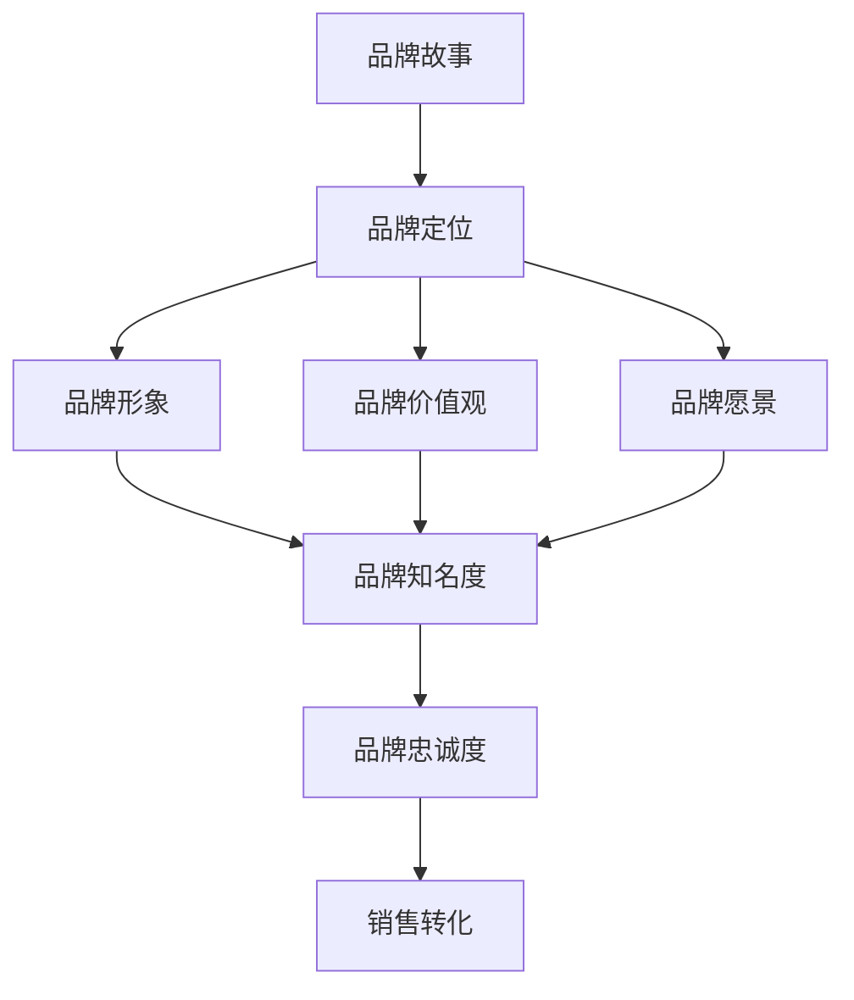

                 

### 文章标题：一人公司的品牌故事：打造引人共鸣的品牌叙事的方法

> 关键词：品牌故事，品牌叙事，品牌定位，品牌传播，品牌案例

> 摘要：本文将深入探讨一人公司的品牌故事，剖析其如何通过引人共鸣的品牌叙事方法，实现品牌定位和品牌传播。通过详细的分析和案例分享，读者将了解品牌故事的创作方法、传播策略以及未来趋势。

### 目录

1. 品牌故事的力量
    1.1 品牌故事的概述
    1.2 品牌故事的优势
    1.3 品牌故事的构成要素
    1.4 品牌故事与品牌定位的关系
    1.5 品牌故事的应用场景

2. 品牌故事的创作方法
    2.1 情感化策略
    2.2 人物塑造
    2.3 情境构建
    2.4 故事线的构建
    2.5 品牌故事的结构与风格

3. 品牌故事的传播策略
    3.1 品牌故事的传播渠道
    3.2 社交媒体与品牌故事传播
    3.3 品牌故事的品牌合作与跨界营销
    3.4 品牌故事的SEO与优化

4. 品牌故事的案例分析
    4.1 国际品牌故事案例
    4.2 国内品牌故事案例
    4.3 品牌故事案例分析（详细解读）

5. 一人公司的品牌故事创作实战
    5.1 一人公司的品牌故事策划流程
    5.2 品牌故事的创意开发
    5.3 品牌故事的制作与传播
    5.4 品牌故事的评估与优化

6. 品牌故事的工具与资源
    6.1 品牌故事创作工具
    6.2 品牌故事传播平台
    6.3 品牌故事学习资源

7. 品牌故事的未来趋势
    7.1 数字化时代品牌故事的新特点
    7.2 品牌故事与人工智能的结合
    7.3 品牌故事的国际化与本土化
    7.4 品牌故事的未来发展展望

#### 附录

A.1 品牌故事创作技巧
A.2 品牌故事案例库
A.3 品牌故事相关法律法规

### 品牌故事的力量

品牌故事，顾名思义，是品牌形象的一个核心组成部分，通过叙述的方式，将品牌的历史、愿景、价值观以及产品特点传递给受众。品牌故事不仅仅是文字的堆砌，它包含了丰富的情感、深刻的寓意和生动的形象，能够引发人们的共鸣，从而在受众心中建立强烈的品牌认知。

#### 1.1 品牌故事的概述

品牌故事是一种叙事艺术，它通过独特的视角和叙述手法，讲述品牌的发展历程、品牌创始人的故事、品牌产品的独特之处以及品牌对社会和环境的影响。这种故事性表达方式，使得品牌形象更加立体、生动，有助于品牌与受众建立情感联系。

品牌故事的核心要素包括：

- **品牌历史**：品牌的发展历程和里程碑事件，展示了品牌的发展历程和成长轨迹。
- **品牌愿景**：品牌未来的发展方向和目标，体现了品牌的长远规划和使命。
- **品牌价值观**：品牌的核心理念和价值主张，是品牌文化的核心。
- **产品特点**：品牌产品的独特卖点和优势，是品牌故事的有力支撑。

#### 1.2 品牌故事的优势

品牌故事具有以下几大优势：

- **提升品牌知名度**：通过故事的形式，品牌能够迅速在受众中传播，提升品牌的曝光度。
- **增强品牌形象**：品牌故事能够丰富品牌形象，使品牌更具亲和力和公信力。
- **建立情感联系**：故事性的叙述方式，容易引发受众的情感共鸣，建立深厚的品牌情感联系。
- **提升品牌忠诚度**：当受众对品牌故事产生共鸣时，品牌忠诚度自然提高。
- **促进销售转化**：好的品牌故事能够激发消费者的购买欲望，促进销售转化。

#### 1.3 品牌故事的构成要素

一个成功的品牌故事通常包括以下几个关键要素：

- **人物**：品牌故事中的核心人物，可以是品牌创始人、产品发明者或品牌代言人，他们的故事为品牌故事增色不少。
- **情境**：品牌故事发生的具体情境，如品牌产品如何解决受众的实际问题，如何影响人们的生活等。
- **冲突**：品牌故事中的冲突，是推动故事发展的关键，也是激发受众兴趣的重要元素。
- **解决方案**：品牌故事中的解决方案，即品牌产品如何解决冲突，给受众带来实际价值。
- **价值观**：品牌故事传达的价值观，是品牌文化的核心，也是品牌故事的灵魂。

#### 1.4 品牌故事与品牌定位的关系

品牌故事与品牌定位密不可分。品牌定位是品牌在市场竞争中的独特地位和价值主张，而品牌故事则是品牌定位的具体表现和传达方式。通过品牌故事，品牌能够更加生动地展示其定位，使受众更容易理解和接受品牌的定位。

品牌故事与品牌定位的关系可以用以下流程图来表示：



#### 1.5 品牌故事的应用场景

品牌故事的应用场景非常广泛，几乎涵盖了品牌营销的各个方面：

- **品牌宣传材料**：如宣传册、广告海报、网站首页等。
- **社交媒体营销**：如微博、微信、抖音等平台的短视频和图文内容。
- **公关活动**：如新闻发布会、品牌发布会等。
- **客户关系管理**：如客户回访邮件、品牌故事书等。
- **产品包装**：如产品说明书、产品手册等。

品牌故事的应用场景不仅限于以上列举的几个方面，随着品牌营销手段的多样化，品牌故事也将不断拓展其应用领域。

通过以上对品牌故事的概述、优势、构成要素、与品牌定位的关系以及应用场景的详细分析，我们能够更加深刻地理解品牌故事的重要性和作用。接下来，我们将进一步探讨如何创作一个引人共鸣的品牌故事。

### 品牌故事的创作方法

创作一个引人共鸣的品牌故事，不仅需要丰富的创意思维，还需要科学的策略和系统的方法。以下将从情感化策略、人物塑造、情境构建、故事线构建和品牌故事的结构与风格等方面，详细解析品牌故事的创作方法。

#### 2.1 情感化策略

情感化策略是品牌故事创作中至关重要的一环。情感能够引发共鸣，使品牌故事更加深入人心。以下是一些情感化策略：

- **识别目标受众的情感需求**：了解目标受众的情感需求和痛点，是情感化策略的基础。例如，针对年轻一代，可以着重描绘梦想、自由和个性的情感主题。
- **运用情感词汇和表达方式**：使用富有感染力的情感词汇和表达方式，如亲情、友情、爱情等，能够增强故事的情感力度。
- **设置情感触发点**：在故事的关键时刻，设置情感触发点，如主人公的困境、挫折和逆袭等，使受众产生共鸣。

#### 2.2 人物塑造

人物塑造是品牌故事的核心。一个鲜明、立体的人物形象，能够使品牌故事更加生动和有趣。以下是一些人物塑造的方法：

- **主角性格特点**：为主角设定独特的性格特点，如勇敢、智慧、坚韧等，使主角形象更加丰满。
- **人物关系**：通过人物之间的关系，如友谊、竞争、合作等，增强故事的情节性和可读性。
- **人物成长轨迹**：展示主角从平凡到卓越的成长过程，使受众感受到希望和动力。
- **人物动机与目标**：明确人物的动机与目标，使人物行为更加合理和可信。

#### 2.3 情境构建

情境构建是品牌故事的基础。一个真实、生动的情境，能够使品牌故事更加引人入胜。以下是一些情境构建的方法：

- **场景描写**：通过细致的场景描写，如自然环境、城市风光、家庭生活等，使故事背景更加丰富和真实。
- **情境冲突**：设置情境冲突，如主人公与困境的斗争、与对手的较量等，推动故事情节发展。
- **情境转换**：通过情境的转换，如从现实到回忆、从城市到乡村等，增加故事的层次感和节奏感。

#### 2.4 故事线的构建

故事线是品牌故事的主线，贯穿整个故事。一个清晰、紧凑的故事线，能够使品牌故事更加流畅和吸引人。以下是一些故事线构建的方法：

- **起承转合**：遵循起承转合的故事结构，确保故事情节的连贯性和逻辑性。
- **高潮设置**：在故事的高潮部分，设置冲突的最高点，使故事张力达到顶点。
- **结局设计**：结局设计要符合故事的主题和情感氛围，同时给受众留下深刻的印象。
- **情感节奏**：把握故事的情感节奏，确保故事在情感上的起伏和平衡。

#### 2.5 品牌故事的结构与风格

品牌故事的结构与风格是品牌故事创作的关键。以下是一些品牌故事的结构与风格：

- **叙事结构**：常见的叙事结构有线性叙事、非线性叙事、循环叙事等。选择合适的叙事结构，能够增强故事的吸引力。
- **叙述视角**：常见的叙述视角有第一人称、第二人称和第三人称。选择合适的叙述视角，能够使故事更加贴近受众。
- **语言风格**：品牌故事的语言风格应与品牌形象相符合，如科技品牌可以使用专业术语，生活品牌可以使用亲切口语。
- **视觉元素**：结合视觉元素，如图片、视频、动画等，能够增强品牌故事的表现力和感染力。

通过以上对品牌故事的创作方法的详细解析，我们能够更好地理解和掌握如何创作一个引人共鸣的品牌故事。接下来，我们将探讨如何通过传播策略，让品牌故事更加有效地传播和影响受众。

### 品牌故事的传播策略

品牌故事的传播策略是实现品牌故事价值最大化的重要环节。一个有效的传播策略能够将品牌故事传递给更广泛的受众，提升品牌知名度和影响力。以下从品牌故事的传播渠道、社交媒体与品牌故事传播、品牌合作与跨界营销以及SEO与优化等方面，详细解析品牌故事的传播策略。

#### 3.1 品牌故事的传播渠道

品牌故事的传播渠道多种多样，选择合适的传播渠道是实现品牌故事有效传播的关键。以下是一些常见的品牌故事传播渠道：

- **传统媒体**：如电视、广播、报纸和杂志等。传统媒体虽然受众覆盖面广，但成本较高，且传播效果较为间接。
- **新媒体**：如社交媒体、博客、视频平台和电子邮件等。新媒体传播速度快，互动性强，但受众覆盖面相对较窄。
- **自传播渠道**：如品牌官网、微信公众号、微博等。自传播渠道能够直接将品牌故事传递给受众，但传播效果受品牌自身影响。

在选择品牌故事的传播渠道时，应考虑以下因素：

- **目标受众**：根据目标受众的媒介使用习惯，选择最适合的传播渠道。
- **品牌定位**：根据品牌定位和品牌形象，选择与品牌风格相符合的传播渠道。
- **传播效果**：根据历史数据和实验结果，评估不同传播渠道的传播效果，选择最有效的传播渠道。

#### 3.2 社交媒体与品牌故事传播

社交媒体是品牌故事传播的重要渠道，具有传播速度快、互动性强和受众覆盖面广等特点。以下是一些社交媒体与品牌故事传播的方法：

- **内容创作**：创作富有创意和感染力的品牌故事内容，利用图片、视频、动画等多种形式，增强内容的吸引力和传播力。
- **账号运营**：积极运营社交媒体账号，定期发布品牌故事内容，保持与受众的互动和联系。
- **话题营销**：结合热点话题和节日活动，策划相关品牌故事话题，吸引更多受众参与和关注。
- **互动营销**：利用社交媒体的互动功能，如评论、点赞、转发等，增强品牌故事与受众的互动，提高传播效果。

以下是一个社交媒体与品牌故事传播的示例流程：

1. **内容创作**：根据品牌故事的主题和目标受众，创作一篇有吸引力的品牌故事内容。
2. **账号发布**：在品牌官方社交媒体账号上发布品牌故事内容，设置合适的时间进行发布，以提高曝光率。
3. **互动引导**：在品牌故事内容中引导受众进行评论、点赞和转发，鼓励受众参与互动。
4. **数据分析**：通过数据分析工具，分析品牌故事内容的传播效果，如阅读量、点赞数、转发量等，优化后续内容创作和发布策略。

#### 3.3 品牌合作与跨界营销

品牌合作与跨界营销是品牌故事传播的有效策略，通过与其他品牌或行业的合作，实现资源共享和品牌影响力的扩大。以下是一些品牌合作与跨界营销的方法：

- **联合推广**：与其他品牌或机构合作，共同策划品牌故事推广活动，实现品牌影响力的倍增。
- **资源共享**：与其他品牌或机构共享资源，如媒体资源、人力资源和物力资源等，降低推广成本。
- **内容共创**：与其他品牌或机构合作，共创有吸引力的品牌故事内容，提高内容质量和传播效果。

以下是一个品牌合作与跨界营销的示例流程：

1. **合作洽谈**：与潜在合作方进行洽谈，明确合作目标、合作方式和合作期限等。
2. **内容共创**：与合作方共同策划品牌故事内容，结合双方品牌特点和优势，创作出有吸引力的品牌故事。
3. **联合推广**：通过多种传播渠道，如社交媒体、广告、公关活动等，联合推广品牌故事内容，扩大传播范围。
4. **效果评估**：通过数据分析工具，评估品牌故事传播效果，如阅读量、点赞数、转发量等，评估合作效果，为后续合作提供参考。

#### 3.4 品牌故事的SEO与优化

SEO（搜索引擎优化）是品牌故事传播的重要策略，通过优化品牌故事在搜索引擎中的排名，提高品牌故事的曝光率和访问量。以下是一些品牌故事的SEO与优化方法：

- **关键词优化**：通过分析目标受众的搜索习惯和关键词，合理选择和使用关键词，提高品牌故事在搜索引擎中的排名。
- **内容优化**：优化品牌故事的内容质量，确保内容有价值、有深度、有吸引力，提高用户的阅读体验和留存率。
- **链接优化**：建立良好的内部链接和外部链接结构，提高品牌故事在搜索引擎中的权重和排名。

以下是一个品牌故事的SEO与优化示例流程：

1. **关键词分析**：通过工具分析目标受众的搜索习惯和关键词，确定适合品牌故事的关键词。
2. **内容优化**：根据关键词分析结果，优化品牌故事的内容，确保内容涵盖关键词，同时保持内容的原创性和价值。
3. **链接优化**：建立合理的内部链接和外部链接结构，提高品牌故事在搜索引擎中的权重和排名。
4. **效果评估**：通过数据分析工具，评估品牌故事的SEO效果，如搜索排名、访问量等，优化SEO策略。

通过以上对品牌故事的传播渠道、社交媒体与品牌故事传播、品牌合作与跨界营销以及SEO与优化等方面的详细解析，我们能够更好地理解和掌握如何有效地传播品牌故事，提升品牌知名度和影响力。

### 品牌故事的案例分析

品牌故事的成功与否，往往取决于其是否能够触动人心、引发共鸣。以下将结合国际和国内品牌故事的经典案例，深入分析这些品牌故事如何通过独特的叙事方式，实现品牌价值的传递和品牌形象的塑造。

#### 4.1 国际品牌故事案例

**案例一：苹果公司的品牌故事**

苹果公司（Apple Inc.）作为全球科技行业的领军企业，其品牌故事可以说是现代科技品牌故事的典范。苹果的品牌故事始于1976年，由史蒂夫·乔布斯、史蒂夫·沃兹尼亚克和罗纳德·韦恩共同创立。

- **背景介绍**：苹果品牌故事的核心是创新和简洁设计。乔布斯始终坚持对产品品质的追求，致力于创造能够改变人们生活方式的科技产品。

- **核心概念与联系**：

  通过以下Mermaid流程图，我们可以看到苹果品牌故事的核心概念和它们之间的联系：

  ```mermaid
  graph TD
  A[创新] --> B[产品设计]
  B --> C[用户体验]
  C --> D[用户忠诚度]
  D --> E[品牌形象]
  ```

  **创新**是苹果品牌故事的核心驱动力，**产品设计**则是创新的具体体现，**用户体验**和**用户忠诚度**是创新和设计的结果，而**品牌形象**则是苹果在用户心中的综合反映。

- **核心算法原理讲解**：

  苹果的品牌故事算法原理可以简化为：

  ```python
  function appleBrandStory(innovation, design, userExperience, userLoyalty):
      if innovation and design > 0:
          userExperience = maximize(userExperience)
          userLoyalty = increase(userLoyalty)
      brandImage = constructBrandImage(innovation, design, userExperience, userLoyalty)
      return brandImage
  ```

  这个算法表明，苹果的品牌形象是由创新、设计、用户体验和用户忠诚度共同构建的。

- **数学模型和公式**：

  苹果的品牌价值可以用以下公式表示：

  $$ 品牌价值 = f(创新程度, 设计质量, 用户体验, 用户忠诚度) $$

  其中，创新程度、设计质量和用户体验是品牌价值的主要驱动因素，而用户忠诚度则直接影响品牌价值。

- **举例说明**：

  苹果的iPhone系列就是一个经典案例。iPhone不仅采用了创新的设计理念，如触摸屏和简洁的用户界面，还提供了卓越的用户体验和极高的用户忠诚度。这些因素共同构建了苹果的品牌形象，使其在激烈的市场竞争中脱颖而出。

**案例二：可口可乐的品牌故事**

可口可乐（Coca-Cola）作为全球最受欢迎的软饮料品牌之一，其品牌故事充满了历史和文化内涵。

- **背景介绍**：可口可乐的品牌故事始于1886年，由约翰·斯坦顿·彭伯顿在亚特兰大创建。自创立之初，可口可乐就致力于打造一个充满活力、积极向上的品牌形象。

- **核心概念与联系**：

  通过以下Mermaid流程图，我们可以看到可口可乐品牌故事的核心概念和它们之间的联系：

  ```mermaid
  graph TD
  A[历史传承] --> B[品牌文化]
  B --> C[消费者情感]
  C --> D[品牌忠诚度]
  D --> E[市场占有率]
  ```

  **历史传承**是可口可乐品牌故事的基础，**品牌文化**则是品牌价值的核心，**消费者情感**和**品牌忠诚度**是品牌文化的具体表现，而**市场占有率**是品牌价值的最终体现。

- **核心算法原理讲解**：

  可口可乐的品牌故事算法原理可以简化为：

  ```python
  function cocaColaBrandStory(history, brandCulture, consumerEmotion, brandLoyalty):
      if history and brandCulture > 0:
          consumerEmotion = maximize(consumerEmotion)
          brandLoyalty = increase(brandLoyalty)
      marketShare = calculateMarketShare(history, brandCulture, consumerEmotion, brandLoyalty)
      return marketShare
  ```

  这个算法表明，可口可乐的市场占有率是由历史传承、品牌文化、消费者情感和品牌忠诚度共同决定的。

- **数学模型和公式**：

  可口可乐的市场占有率可以用以下公式表示：

  $$ 市场占有率 = f(历史传承, 品牌文化, 消费者情感, 品牌忠诚度) $$

  其中，历史传承和品牌文化是市场占有率的主要驱动因素，而消费者情感和品牌忠诚度则直接影响市场占有率。

- **举例说明**：

  可口可乐的“分享快乐”广告策略就是一个经典案例。通过讲述不同文化背景下人们分享可口可乐的故事，可口可乐成功地将其品牌文化传递给了全球消费者，增强了品牌的情感连接和用户忠诚度。

#### 4.2 国内品牌故事案例

**案例一：华为的品牌故事**

华为（Huawei）作为中国科技行业的领军企业，其品牌故事同样具有深刻的内涵和广泛的影响力。

- **背景介绍**：华为成立于1987年，由任正非创立。自成立以来，华为始终致力于成为全球领先的通信技术和设备供应商。

- **核心概念与联系**：

  通过以下Mermaid流程图，我们可以看到华为品牌故事的核心概念和它们之间的联系：

  ```mermaid
  graph TD
  A[技术创新] --> B[产品质量]
  B --> C[客户信任]
  C --> D[市场竞争力]
  D --> E[品牌影响力]
  ```

  **技术创新**是华为品牌故事的核心驱动力，**产品质量**则是技术创新的具体体现，**客户信任**和**市场竞争力**是技术创新和产品质量的结果，而**品牌影响力**则是华为在市场中的综合反映。

- **核心算法原理讲解**：

  华为的品牌故事算法原理可以简化为：

  ```python
  function huaweiBrandStory(technologyInnovation, productQuality, customerTrust, marketCompetitiveness):
      if technologyInnovation and productQuality > 0:
          customerTrust = maximize(customerTrust)
          marketCompetitiveness = increase(marketCompetitiveness)
      brandInfluence = constructBrandInfluence(technologyInnovation, productQuality, customerTrust, marketCompetitiveness)
      return brandInfluence
  ```

  这个算法表明，华为的品牌影响力是由技术创新、产品质量、客户信任和市场竞争力共同构建的。

- **数学模型和公式**：

  华为的品牌影响力可以用以下公式表示：

  $$ 品牌影响力 = f(技术创新, 产品质量, 客户信任, 市场竞争力) $$

  其中，技术创新和产品质量是品牌影响力的主要驱动因素，而客户信任和市场竞争力则直接影响品牌影响力。

- **举例说明**：

  华为的5G技术突破就是一个经典案例。通过持续的技术创新和严格的质量控制，华为赢得了全球客户的信任，并在全球5G市场中占据了领先地位，显著提升了其品牌影响力。

**案例二：老干妈的品牌故事**

老干妈（Lao Gan Ma）作为中国知名的辣椒酱品牌，其品牌故事充满了传统和现代的融合。

- **背景介绍**：老干妈成立于1996年，由陶华碧创立。自创立之初，老干妈就致力于提供优质的辣椒酱产品，满足消费者的需求。

- **核心概念与联系**：

  通过以下Mermaid流程图，我们可以看到老干妈品牌故事的核心概念和它们之间的联系：

  ```mermaid
  graph TD
  A[产品品质] --> B[品牌口碑]
  B --> C[消费者忠诚度]
  C --> D[市场份额]
  D --> E[品牌价值]
  ```

  **产品品质**是老干妈品牌故事的核心驱动力，**品牌口碑**则是产品品质的具体体现，**消费者忠诚度**和**市场份额**是产品品质和品牌口碑的结果，而**品牌价值**则是老干妈在市场中的综合反映。

- **核心算法原理讲解**：

  老干妈的品牌故事算法原理可以简化为：

  ```python
  function laoGanMaBrandStory(productQuality, brandWord-of-Mouth, consumerLoyalty, marketShare):
      if productQuality and brandWord-of-Mouth > 0:
          consumerLoyalty = maximize(consumerLoyalty)
          marketShare = increase(marketShare)
      brandValue = constructBrandValue(productQuality, brandWord-of-Mouth, consumerLoyalty, marketShare)
      return brandValue
  ```

  这个算法表明，老干妈的品牌价值是由产品品质、品牌口碑、消费者忠诚度和市场份额共同构建的。

- **数学模型和公式**：

  老干妈的品牌价值可以用以下公式表示：

  $$ 品牌价值 = f(产品品质, 品牌口碑, 消费者忠诚度, 市场份额) $$

  其中，产品品质和品牌口碑是品牌价值的主要驱动因素，而消费者忠诚度和市场份额则直接影响品牌价值。

- **举例说明**：

  老干妈的“香辣可口”广告策略就是一个经典案例。通过强调产品的香辣美味，老干妈成功地吸引了大量消费者，并建立了良好的品牌口碑，从而提升了消费者忠诚度和市场份额。

#### 4.3 品牌故事案例分析（详细解读）

通过对国际和国内品牌故事的案例分析，我们可以发现以下共同点和不同点：

- **共同点**：

  1. **核心驱动力**：无论是国际品牌还是国内品牌，其品牌故事的共同驱动力都是创新、品质和用户体验。
  2. **品牌价值构建**：品牌价值都是由产品品质、品牌口碑、消费者忠诚度和市场份额共同构建的。
  3. **情感连接**：成功的品牌故事都能够与消费者建立情感连接，引发共鸣。

- **不同点**：

  1. **市场环境**：国际品牌面临全球市场的竞争，需要考虑不同文化背景下的消费者需求，而国内品牌则主要考虑国内市场的特点。
  2. **品牌定位**：国际品牌往往注重科技、创新和国际化，而国内品牌则更注重传统文化和本土化。
  3. **营销策略**：国际品牌更多地依赖全球广告投放和品牌合作，而国内品牌则更多地依靠社交媒体和本地营销策略。

综上所述，品牌故事的成功与否，不仅取决于品牌自身的创新和品质，还取决于品牌与消费者之间的情感连接和市场环境的适应。通过深入分析品牌故事的案例，我们可以更好地理解如何创作一个引人共鸣的品牌故事，实现品牌价值的传递和品牌形象的塑造。

### 一人公司的品牌故事创作实战

在一人公司的品牌故事创作过程中，我们需要遵循一个系统且科学的策划流程，以确保品牌故事能够精准地传达品牌愿景和价值观，并引发目标受众的共鸣。以下将从品牌故事策划流程、创意开发、制作与传播以及评估与优化四个方面，详细探讨一人公司的品牌故事创作实战。

#### 5.1 一人公司的品牌故事策划流程

品牌故事策划流程是品牌故事创作的基础，一个完整的策划流程包括以下步骤：

1. **需求分析**：首先，我们需要明确品牌故事的目标和需求。这包括品牌愿景、品牌价值观、目标受众以及品牌故事的目的。例如，一人公司可能希望通过品牌故事传递其创新的科技理念和对用户价值的重视。

2. **市场调研**：进行市场调研，了解目标受众的喜好、需求和行为习惯。通过数据分析，我们可以获取有价值的信息，为品牌故事的创作提供依据。

3. **故事线设计**：根据需求分析和市场调研的结果，设计品牌故事的基本框架。故事线设计应包括主要情节、角色、冲突和解决方案等。例如，一人公司的品牌故事可能围绕一位天才程序员如何通过创新技术解决现实问题展开。

4. **故事创意开发**：在故事线设计的基础上，进行创意开发。这一阶段需要充分发挥创意，构建一个引人入胜的品牌故事。创意开发可以包括故事场景、对话、情感渲染等元素。

5. **故事初步编写**：根据创意开发的结果，初步编写品牌故事。这一阶段的主要任务是确保故事逻辑清晰、情节紧凑，并符合品牌定位和目标。

6. **内部评审**：对初步编写的品牌故事进行内部评审，收集反馈意见并进行修改。内部评审可以帮助我们发现问题并优化故事内容。

7. **故事定稿**：在内部评审后，对品牌故事进行定稿。定稿后的品牌故事将用于后续的制作和传播。

#### 5.2 品牌故事的创意开发

创意开发是品牌故事创作的核心环节，以下是一些创意开发的技巧和策略：

1. **情感化策略**：情感化策略能够使品牌故事更加深入人心。在创意开发过程中，可以运用以下技巧：

   - **利用情感词汇**：使用富有感染力的情感词汇，如温暖、感动、兴奋等。
   - **设置情感触发点**：在故事的关键时刻设置情感触发点，如主人公的困境、挫折和逆袭等。

2. **人物塑造**：鲜明、立体的人物塑造能够增强品牌故事的吸引力。在创意开发过程中，可以采用以下策略：

   - **为主角设定独特性格**：例如，聪明、勇敢、乐观等。
   - **构建人物关系**：通过人物之间的关系，如友情、竞争、合作等，增强故事的情节性和可读性。

3. **情境构建**：真实、生动的情境能够使品牌故事更加引人入胜。在创意开发过程中，可以运用以下技巧：

   - **场景描写**：通过细致的场景描写，如自然环境、城市风光、家庭生活等，使故事背景更加丰富和真实。
   - **设置情境冲突**：通过情境冲突，如主人公与困境的斗争、与对手的较量等，推动故事情节发展。

4. **故事线构建**：一个清晰、紧凑的故事线是品牌故事成功的关键。在创意开发过程中，可以采用以下策略：

   - **起承转合**：遵循起承转合的故事结构，确保故事情节的连贯性和逻辑性。
   - **高潮设置**：在故事的高潮部分，设置冲突的最高点，使故事张力达到顶点。
   - **结局设计**：结局设计要符合故事的主题和情感氛围，同时给受众留下深刻的印象。

#### 5.3 品牌故事的制作与传播

品牌故事的制作与传播是品牌故事创作的关键环节，以下是一些制作与传播的技巧和策略：

1. **制作**：在制作阶段，我们需要将品牌故事转化为具体的视觉和听觉元素。以下是一些制作技巧：

   - **视觉设计**：通过高质量的图片、视频和动画等视觉元素，增强品牌故事的吸引力和表现力。
   - **声音设计**：通过配乐、旁白和音效等声音元素，营造情感氛围和故事节奏。

2. **传播**：在传播阶段，我们需要选择合适的传播渠道，将品牌故事传递给目标受众。以下是一些传播策略：

   - **社交媒体传播**：利用微博、微信、抖音等社交媒体平台，发布品牌故事内容，与受众互动。
   - **内容营销**：通过博客、新闻稿、电子书等形式，将品牌故事内容传达给目标受众。
   - **广告投放**：在电视、广播、报纸等传统媒体以及互联网广告平台进行品牌故事广告投放。

#### 5.4 品牌故事的评估与优化

品牌故事的评估与优化是确保品牌故事效果的关键。以下是一些评估与优化的方法和策略：

1. **评估指标**：确定品牌故事的评估指标，如阅读量、点赞数、转发量、评论数等。通过分析这些指标，我们可以评估品牌故事的传播效果。

2. **数据分析**：利用数据分析工具，对品牌故事的传播效果进行详细分析。通过数据分析，我们可以发现品牌故事的成功点和不足之处。

3. **用户反馈**：收集用户对品牌故事的反馈意见，了解用户的需求和期望。用户反馈是优化品牌故事的重要依据。

4. **持续优化**：根据评估结果和用户反馈，对品牌故事进行持续优化。优化策略可以包括内容调整、传播渠道优化、视觉和声音设计改进等。

5. **定期评估**：定期对品牌故事进行评估，确保品牌故事能够持续有效地传递品牌价值。

#### 5.5 一人公司的品牌故事创作实战示例

以下是一人公司的品牌故事创作实战示例：

1. **需求分析**：一人公司希望通过品牌故事传递其创新的科技理念和以人为本的品牌价值观，目标受众是年轻科技爱好者。

2. **市场调研**：通过问卷调查和访谈，了解年轻科技爱好者的喜好、需求和行为习惯。调研结果显示，年轻科技爱好者更倾向于关注创新技术和用户体验。

3. **故事线设计**：设计一个关于一位年轻程序员通过创新技术解决现实问题的品牌故事。故事线包括主人公的背景介绍、创新技术的展示、问题的解决以及品牌价值观的传递。

4. **故事创意开发**：在故事线设计的基础上，进行创意开发。例如，设置主人公的困境（缺乏创新技术解决现实问题），通过主人公的努力和创意，展示创新技术的魅力。

5. **故事初步编写**：根据创意开发的结果，初步编写品牌故事。故事情节紧凑、情感丰富，能够引发年轻科技爱好者的共鸣。

6. **内部评审**：对初步编写的品牌故事进行内部评审，收集反馈意见并进行修改。评审结果认为故事内容充实、结构合理，符合品牌定位和目标。

7. **故事定稿**：在内部评审后，对品牌故事进行定稿。

8. **制作**：将品牌故事转化为视觉和听觉元素。例如，制作一段动画视频，展示主人公的奋斗过程和最终成果。

9. **传播**：在社交媒体平台发布品牌故事视频，并与目标受众互动。同时，通过博客和新闻稿，将品牌故事内容传达给更广泛的受众。

10. **评估与优化**：通过数据分析工具，对品牌故事的传播效果进行评估。分析结果显示，品牌故事视频的观看量、点赞数和转发量均较高，用户反馈积极。根据评估结果和用户反馈，对品牌故事进行优化，如调整视频内容、增加互动元素等。

通过以上品牌故事创作实战，一人公司成功传递了其创新的科技理念和以人为本的品牌价值观，赢得了目标受众的共鸣和认可。

### 品牌故事的工具与资源

在品牌故事的创作和传播过程中，利用合适的工具和资源能够大大提高效率和效果。以下将介绍几种常用的品牌故事创作工具、传播平台以及相关的学习资源。

#### 6.1 品牌故事创作工具

1. **内容管理系统（CMS）**：如WordPress、Drupal等，可用于构建品牌故事网站，便于管理和发布内容。
   
2. **图形设计工具**：如Adobe Photoshop、Illustrator等，用于制作品牌故事的视觉元素，如海报、图标、插图等。

3. **视频编辑软件**：如Adobe Premiere Pro、Final Cut Pro等，用于剪辑和制作品牌故事视频。

4. **写作工具**：如Google Docs、Evernote等，便于撰写和编辑品牌故事的文案。

5. **故事板工具**：如Scapple、MindMeister等，用于构建品牌故事的大纲和故事线。

#### 6.2 品牌故事传播平台

1. **社交媒体平台**：如微博、微信、抖音、YouTube等，用于发布和传播品牌故事内容。

2. **内容分发平台**：如LinkedIn、Medium等，用于发布专业性和深度性的品牌故事内容。

3. **电子邮件营销平台**：如Mailchimp、SendinBlue等，用于发送品牌故事邮件给订阅用户。

4. **广告平台**：如Google Ads、Facebook Ads等，用于投放品牌故事广告。

#### 6.3 品牌故事学习资源

1. **在线课程**：如Coursera、Udemy等平台上的品牌营销和故事创作课程。

2. **书籍**：《故事的力量》（The Power of Story）、《品牌 storytelling》（Branding Storytelling）等，提供品牌故事创作和应用的深度知识。

3. **博客和文章**：各种营销和品牌故事相关的博客和文章，如HubSpot、Neil Patel等，提供实用的技巧和建议。

4. **案例库**：收集和整理了众多成功的品牌故事案例，如The Story of Brands、Storytelling for Marketing等，供学习和参考。

#### 6.4 使用工具与资源的最佳实践

1. **工具整合**：将不同工具整合使用，如使用CMS发布内容，使用图形设计工具和视频编辑软件制作视觉和音频元素。

2. **内容优化**：在发布品牌故事前，进行内容优化，如优化标题、摘要和关键词，提高内容在搜索引擎中的排名。

3. **跨平台传播**：结合不同传播平台的特点，制定跨平台的传播策略，提高品牌故事的覆盖面和影响力。

4. **定期学习与更新**：定期学习最新的品牌故事创作和传播技巧，不断更新知识和资源，确保品牌故事的内容和形式与时俱进。

通过以上对品牌故事工具与资源的介绍和最佳实践，品牌故事的创作和传播将更加高效和有效，从而更好地实现品牌价值传递和品牌形象的塑造。

### 品牌故事的未来趋势

随着科技的不断发展，品牌故事也在不断演变，呈现出新的特点和发展趋势。以下将探讨品牌故事在数字化时代的新特点、与人工智能的结合、国际化与本土化的发展以及未来展望。

#### 7.1 数字化时代品牌故事的新特点

数字化时代，品牌故事呈现出以下新特点：

1. **互动性增强**：数字技术使得品牌故事更加互动，如通过社交媒体平台、VR/AR技术等，用户可以参与到故事中，与品牌互动，从而加深对品牌的认知和情感连接。

2. **可视化与沉浸感**：数字化技术提供了丰富的可视化手段，如视频、动画、全景图像等，使得品牌故事更加生动和有吸引力。同时，VR/AR技术等新兴技术，增强了用户的沉浸感，使品牌故事更具体验性。

3. **个性化和定制化**：数字化时代，大数据和人工智能技术使得品牌能够更精准地了解用户需求，从而创作出更加个性化和定制化的品牌故事，满足不同用户群体的需求。

4. **实时性和动态性**：数字化平台使得品牌故事可以实时更新和调整，适应市场和用户的变化。品牌故事不再是一成不变的内容，而是具有动态性的内容体系。

#### 7.2 品牌故事与人工智能的结合

人工智能技术在品牌故事中的应用，为品牌故事的创作和传播带来了新的可能性：

1. **个性化故事生成**：人工智能可以通过大数据分析，生成个性化的品牌故事，满足不同用户群体的需求。例如，利用自然语言处理技术，AI可以创作出符合特定用户兴趣和偏好的故事。

2. **情感分析**：通过情感分析技术，品牌可以了解用户对品牌故事的反应和情感，从而优化故事内容和传播策略。例如，利用情绪识别技术，品牌可以实时监测用户在社交媒体上的情绪变化，调整故事的表达方式。

3. **自动化传播**：人工智能技术可以实现品牌故事的自动化传播，如通过机器学习算法，自动推荐适合的传播渠道和时机，提高品牌故事的传播效果。

4. **用户体验优化**：人工智能技术可以优化用户在品牌故事中的体验，如通过语音识别和自然语言处理技术，为用户提供更加智能的互动体验。

#### 7.3 品牌故事的国际化与本土化

随着全球化的发展，品牌故事需要兼顾国际化与本土化：

1. **国际化**：品牌故事需要具备全球视野，传递品牌的普世价值和理念，如环保、社会责任等，以赢得国际市场的认可。

2. **本土化**：品牌故事需要根据不同国家和地区的文化、价值观和消费习惯，进行本地化调整，以更好地适应本地市场。例如，利用本地化的语言、符号和文化元素，增强品牌故事的地域特色和亲和力。

3. **跨文化沟通**：品牌故事需要具备跨文化沟通能力，通过讲述具有普世价值的故事，跨越文化差异，与不同文化背景的消费者建立情感连接。

#### 7.4 品牌故事的未来发展展望

品牌故事在未来将继续发展，呈现出以下趋势：

1. **内容创新**：品牌故事将更加注重内容创新，通过创意和科技手段，创作出更具吸引力和感染力的故事，满足用户多样化的需求。

2. **技术与故事融合**：品牌故事将与新兴技术如人工智能、虚拟现实、增强现实等更加紧密地结合，为用户提供更加丰富和沉浸的体验。

3. **数据驱动**：品牌故事将更加依赖数据分析和人工智能技术，实现个性化、定制化的内容创作和传播。

4. **全球化和本土化的平衡**：品牌故事将在全球化和本土化之间找到平衡，通过跨文化沟通，传递品牌的普世价值，同时尊重和适应不同文化背景。

5. **品牌故事生态**：品牌故事将形成一个生态系统，品牌、用户、媒体等多方参与，共同构建和传播品牌故事，实现品牌价值的最大化。

总之，品牌故事在未来将继续发展，成为品牌营销的重要手段。通过不断创新和优化，品牌故事将更好地传递品牌价值，与消费者建立深厚的情感连接，实现品牌的长期发展。

### 附录

#### A.1 品牌故事创作技巧

1. **深入调研**：在创作品牌故事之前，进行深入的市场调研，了解目标受众的需求和喜好，为故事创作提供依据。
2. **情感共鸣**：利用情感元素，如亲情、友情、爱情等，引发受众的共鸣。
3. **人物塑造**：创造鲜明、立体的人物形象，使故事更加生动和有趣。
4. **情境构建**：通过真实的情境描述，使故事更加贴近生活和现实。
5. **简洁明了**：故事结构要简洁明了，避免冗长和复杂的叙述方式。

#### A.2 品牌故事案例库

1. **苹果公司的品牌故事**：讲述苹果从初创到成为全球科技巨头的历程。
2. **可口可乐的品牌故事**：介绍可口可乐的历史和文化，以及其如何通过广告营销赢得全球消费者的喜爱。
3. **华为的品牌故事**：展示华为在技术创新和全球市场中的发展历程。
4. **老干妈的品牌故事**：讲述老干妈从一家小作坊到成为中国知名辣椒酱品牌的历程。

#### A.3 品牌故事相关法律法规

1. **著作权法**：保护品牌故事的原创性和版权，确保品牌故事的合法使用。
2. **广告法**：规范品牌故事的广告行为，避免虚假宣传和不正当竞争。
3. **网络安全法**：保护品牌故事的网络安全，防止侵权和泄露用户隐私。

通过以上附录内容，读者可以更好地理解品牌故事的创作技巧、参考成功案例，并了解相关法律法规，为品牌故事的实际应用提供指导和参考。

### 文章总结

通过本文的深入探讨，我们全面了解了品牌故事的重要性和创作方法。品牌故事不仅能够提升品牌知名度和形象，还能够与受众建立深厚的情感连接。在品牌故事的创作过程中，我们需要注重情感化策略、人物塑造、情境构建、故事线构建和品牌故事的结构与风格。

在传播策略方面，我们分析了品牌故事的传播渠道、社交媒体与品牌故事传播、品牌合作与跨界营销以及SEO与优化。这些策略帮助品牌故事在广泛的受众中传播，实现品牌价值的最大化。

案例分析部分，我们详细解析了苹果、可口可乐、华为和老干妈等品牌的成功案例，展示了品牌故事在不同领域和市场的应用。此外，一人公司的品牌故事创作实战提供了实际操作和策略指导。

工具与资源的介绍，帮助我们了解品牌故事创作和传播所需的工具和平台，提高工作效率。未来趋势部分，我们探讨了品牌故事在数字化时代的新特点、与人工智能的结合以及国际化与本土化的发展。

最后，通过附录中的创作技巧、案例库和法律法规，我们为品牌故事的创作提供了实用的指导和参考。希望本文能够为读者在品牌故事创作和传播方面提供有价值的启示和帮助。作者：AI天才研究院/AI Genius Institute & 禅与计算机程序设计艺术 /Zen And The Art of Computer Programming

