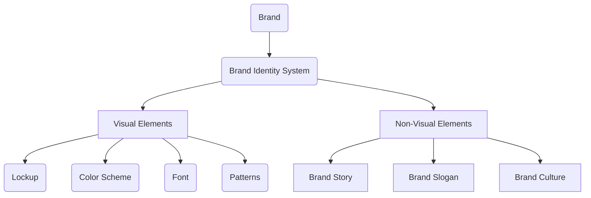

                 

## 文章标题

### 《一人公司的品牌识别系统：从logo到视觉语言的设计策略》

> 关键词：品牌识别系统、Logo设计、视觉语言、设计策略、个人品牌

> 摘要：本文将深入探讨一人公司的品牌识别系统设计，从Logo设计到视觉语言的各个方面，提供一套完整的策略和案例分析，帮助读者掌握设计原则和实际应用技巧。

### 引言

在当今这个信息爆炸的时代，品牌识别系统（Brand Identity System）的重要性不言而喻。无论是大型跨国公司还是个人品牌，都需要一套独特且有力的品牌识别系统来传达其核心价值观和独特卖点。对于一人公司（Solopreneurship），品牌识别系统更是至关重要，因为它往往承载着个人形象和企业形象的统一。

品牌识别系统包括视觉元素和非视觉元素，前者如Logo、色彩、字体和图案，后者如品牌故事、口号和品牌文化等。本文旨在为读者提供从Logo设计到整个视觉语言系统的全面指导，帮助一人公司建立强大而独特的品牌形象。

### 第1章：品牌识别系统的核心概念

#### 1.1 品牌与品牌识别系统的定义

品牌是指消费者对某个产品或服务的整体感知和认知。品牌不仅是一个名字或标志，更是一个情感和心理的符号。品牌识别系统则是品牌形象的核心，它包括所有用来传达品牌价值和特性的视觉和非视觉元素。

**品牌定义**：品牌是指消费者对某个产品或服务的整体感知和认知。

**品牌识别系统定义**：品牌识别系统是品牌形象的核心，包括视觉元素和非视觉元素。

#### 1.2 品牌识别系统的作用

**增强品牌认知度**：通过统一的视觉语言，使消费者更容易记住品牌。

**建立品牌形象**：视觉元素传达品牌的文化、价值和个性。

**提升品牌价值**：良好的品牌识别系统能够提升品牌的市场价值和竞争力。

#### 1.3 品牌识别系统的组成部分

品牌识别系统由两部分组成：视觉元素和非视觉元素。

**视觉元素**：包括Logo、色彩、字体、图案等。

**非视觉元素**：包括品牌故事、品牌口号、品牌文化等。

### Mermaid 流程图

#### 1.4 品牌识别系统的演变

品牌识别系统的设计经历了几个发展阶段：

**早期**：以Logo和标语为主，功能较为单一。

**中期**：开始注重品牌故事和文化，视觉元素更加多样化。

**现代**：品牌识别系统成为一个综合性的系统，包括视觉和非视觉元素，注重与消费者的互动和情感连接。

### 结论

品牌识别系统是品牌战略的核心，它不仅关乎品牌形象的建立，还直接影响品牌的认知度、价值和竞争力。对于一人公司来说，一个独特且有效的品牌识别系统更是不可或缺的。接下来的章节将深入探讨品牌识别系统中的关键元素，如Logo设计、色彩策略、字体设计和图案设计，帮助读者一步步构建属于自己的品牌识别系统。

---

在本文接下来的章节中，我们将逐一深入探讨品牌识别系统的各个组成部分，包括Logo设计策略、色彩选择原则、字体设计技巧以及图案设计的原则和流程。我们将结合实际案例，详细分析这些元素如何共同构建一个强有力的品牌识别系统。希望通过这些内容，读者能够对品牌识别系统有更深入的理解，并能够将其应用到自己的品牌建设中。

### 第2章：Logo设计策略

Logo，即标志，是企业品牌识别系统中最重要的视觉元素之一。一个好的Logo不仅能够简洁明了地传达品牌的核心价值和理念，还能够深深印在消费者的脑海中，成为品牌的象征。本章节将详细探讨Logo设计的原则、流程以及成功的案例，帮助读者了解如何设计一个有效的Logo。

#### 2.1 Logo设计原则

**简洁性**：一个成功的Logo应该是简洁的。简洁的Logo更容易被记住，也更易于在各种媒体上使用。复杂的Logo往往难以传达清晰的信息，反而让人感到困惑。

**独创性**：独创性的Logo能够帮助企业从众多品牌中脱颖而出，避免与现有的品牌产生混淆。一个具有独创性的Logo能够体现出品牌的独特性和个性。

**适应性**：Logo在不同尺寸和媒体上都能保持清晰可辨。这意味着Logo的设计需要考虑到其应用场景，包括印刷、网站、社交媒体等。

**时间性**：Logo设计应该具有时间性，能够适应市场的变化和品牌的发展。一个优秀的Logo应该能够在未来一段时间内仍然适用。

**文化适宜性**：Logo的设计应该考虑目标市场的文化背景，确保Logo在不同文化中都能传达出正确的信息。

#### 2.2 Logo设计流程

**市场调研**：在进行Logo设计之前，进行市场调研是至关重要的。通过调研，设计师可以了解目标受众、市场趋势以及竞争对手的Logo设计，从而为Logo设计提供有力的数据支持。

**创意构思**：根据市场调研的结果，设计师开始构思Logo的创意。这一过程需要发挥创意思维，创造出既符合品牌特性又具有独创性的Logo设计。

**初步设计**：设计师根据创意构思制作初步的Logo设计。这个阶段的设计可能会包含多种方案，设计师需要从中选择出最具有代表性和可行性的方案。

**客户反馈**：将初步设计提交给客户，收集客户的反馈。客户的反馈对于Logo设计的修正和改进至关重要。

**设计迭代**：根据客户的反馈，设计师对Logo进行修改和优化。这个迭代过程可能需要多次进行，直到达到客户满意。

**最终定稿**：在经过多次迭代后，设计师最终确定一个Logo设计方案，并生成高分辨率的Logo文件，以便在各种应用场景中使用。

#### 2.3 成功的Logo案例分析

**苹果公司**：苹果公司的Logo是由一个简单的苹果图案和一个简洁的字体组成。这个Logo简洁、独特且易于识别，已经成为全球知名品牌的标志。它的成功在于其简洁性、独创性和时间性，自1976年成立以来，苹果的Logo几乎没有变化。

**可口可乐**：可口可乐的Logo是一个独特的波浪形图案，它不仅代表了品牌的历史和传统，还传达出活力和快乐的感觉。这个Logo的成功在于其文化适宜性和适应性，它能够适应不同的市场和文化背景。

**耐克**：耐克的Logo是著名的“Swoosh”符号，它简洁且富有动感。这个Logo的设计理念源于希腊神话中的胜利女神翅膀的形状，它成功地传达了耐克品牌的运动精神和追求卓越的理念。

**Airbnb**：Airbnb的Logo由四个相互连接的“B”字母组成，象征着全球化和共享经济。这个Logo的设计非常简洁，但同时又能够传达出品牌的核心理念和独特性。

#### 结论

Logo设计是品牌识别系统中的核心元素，它需要具备简洁性、独创性、适应性和时间性。通过合理的设计流程和成功的案例分析，设计师可以设计出一个有效的Logo，帮助企业建立强大的品牌形象。在接下来的章节中，我们将继续探讨品牌识别系统中的其他重要元素，如色彩策略、字体设计和图案设计，帮助读者全面掌握品牌识别系统的设计原则和策略。

---

在品牌识别系统中，色彩策略起着至关重要的作用。色彩不仅是视觉元素的一部分，更是品牌形象和品牌价值观的传递媒介。通过合适的色彩选择和搭配，品牌能够有效地传达其独特的个性和情感，从而在消费者心中留下深刻的印象。接下来，我们将详细探讨色彩在品牌识别中的作用、色彩选择策略以及色彩搭配原则，并通过案例分析，展示如何成功地运用色彩策略来提升品牌形象。

#### 3.1 色彩在品牌识别中的作用

**情感传达**：不同的颜色能够传达不同的情感和信息。例如，蓝色通常与信任和技术感相关，而红色则与活力和热情相关。通过选择合适的颜色，品牌可以传达特定的情感和价值观。

**品牌认知**：色彩是品牌识别的重要元素之一。一个独特的色彩组合可以使品牌在众多竞争对手中脱颖而出，帮助消费者快速识别品牌。

**增强记忆**：色彩能够增强品牌的记忆点。研究表明，人们更容易记住带有颜色的信息，因此，一个鲜明的色彩组合可以提升品牌的认知度和记忆度。

**文化适宜**：色彩选择需要考虑目标市场的文化背景。不同文化对颜色有不同的喜好和象征意义，因此，品牌需要选择能够适应该文化背景的色彩。

#### 3.2 色彩选择策略

**品牌个性**：品牌个性的选择是色彩选择的首要考虑因素。品牌个性可以通过色彩来传达，例如，一个年轻、时尚的品牌可能会选择鲜艳的颜色，而一个高端、奢华的品牌则可能选择更为稳重和深色的色调。

**市场趋势**：了解当前的市场趋势和流行色彩可以帮助品牌选择符合时代潮流的颜色。这不仅可以使品牌看起来更加时尚和现代，还可以增强品牌的吸引力和竞争力。

**竞争对手分析**：分析竞争对手的色彩策略，可以帮助品牌避免与竞争对手产生混淆，并找到一个独特的色彩组合来凸显自身。

**受众偏好**：了解目标受众对颜色的偏好和反应，可以帮助品牌选择最能够吸引受众的色彩。

#### 3.3 色彩搭配原则

**和谐性**：色彩搭配应和谐，避免过于刺眼或冲突的颜色组合。和谐的色彩组合可以使品牌视觉语言更加统一和美观。

**一致性**：品牌内部色彩应保持一致性，无论是Logo、网站、广告还是产品包装，色彩的使用都应保持一致，以增强品牌的整体识别性。

**层次感**：通过不同的色彩层次，可以创造出丰富的视觉效果。例如，使用深浅不同的同色系色彩，可以创造出层次感和立体感。

**对比度**：适当的对比度可以使品牌视觉语言更加鲜明和突出。然而，对比度过高可能会引起视觉疲劳，因此需要在对比度和和谐性之间找到平衡。

**适用性**：色彩选择应考虑到不同媒介的适用性。例如，在印刷媒体中，颜色的选择可能受到印刷技术的限制，而在数字媒体中，则可以选择更加鲜艳和丰富的颜色。

#### 3.4 成功的色彩案例分析

**苹果公司**：苹果公司的色彩策略非常简单，但极其有效。苹果主要使用浅灰色和白色，这些颜色传达出简洁、现代和高科技的感觉。苹果的色彩选择与其品牌形象高度一致，使其品牌在消费者心中建立了强烈的视觉联系。

**可口可乐**：可口可乐的色彩选择非常独特，其经典的红色和白色组合已经成为品牌的标志。红色代表活力和热情，而白色则代表纯净和简洁。这种色彩组合不仅使可口可乐在众多品牌中脱颖而出，还成功地传达了品牌的核心价值观。

**星巴克**：星巴克的色彩策略注重舒适和温馨。其主色调是深棕色和绿色，这两种颜色传达出自然、舒适和放松的感觉。星巴克的色彩选择与其品牌形象和品牌文化紧密相关，使其在消费者心中建立了强烈的情感联系。

**谷歌**：谷歌的色彩策略非常鲜明，其标志性的蓝色、红色、黄色和绿色组合不仅使品牌看起来现代和科技感十足，还成功地传达了谷歌的创新和多元化。

#### 结论

色彩在品牌识别中起着至关重要的作用。通过合适的色彩选择和搭配，品牌可以有效地传达其独特的个性和情感，从而在消费者心中建立强大的品牌形象。在接下来的章节中，我们将继续探讨品牌识别系统中的其他重要元素，如字体设计和图案设计，帮助读者全面掌握品牌识别系统的设计原则和策略。

---

### 第4章：字体设计

字体设计在品牌识别系统中扮演着至关重要的角色。一个合适的字体不仅能够增强品牌的视觉效果，还能够传达品牌的核心价值和个性。本章节将探讨字体设计在品牌识别中的作用、字体选择策略以及成功的字体设计案例。

#### 4.1 字体在品牌识别中的作用

**传达品牌形象**：字体设计直接影响品牌的视觉效果和传达的信息。一个设计优雅、简洁的字体可能传达出高端、专业的感觉，而一个活泼、有趣的字体则可能传达出年轻、时尚的感觉。

**增强可读性**：字体设计必须确保文字的清晰易读，特别是在不同尺寸和媒介上。良好的字体设计能够提升品牌信息的可读性和传达效果。

**强化品牌记忆**：一个独特的字体设计可以使品牌在消费者心中留下深刻的印象，从而增强品牌记忆度。

**建立品牌个性**：不同的字体设计具有不同的个性和风格，通过选择合适的字体，品牌可以传达出独特的品牌个性。

**整合品牌视觉语言**：字体设计是品牌视觉语言的一部分，与Logo、色彩和图案等其他视觉元素相互配合，共同构建品牌形象。

#### 4.2 字体选择策略

**品牌个性**：根据品牌的核心理念和目标市场，选择适合品牌个性的字体。例如，一个高端品牌可能选择优雅、简洁的字体，而一个时尚品牌则可能选择活泼、有趣的字体。

**功能需求**：考虑字体在不同应用场景中的功能需求。例如，网站上的字体需要易于阅读和浏览，而广告牌上的字体则需要醒目和突出。

**文化适宜性**：根据目标市场的文化背景，选择适当的字体。某些字体可能在某些文化中具有特定的象征意义或使用习惯。

**市场趋势**：考虑当前的市场趋势和流行字体，选择符合时代潮流的字体设计，以提升品牌的现代感和吸引力。

**品牌一致性**：确保字体在所有品牌应用中保持一致，包括网站、广告、产品包装等，以增强品牌的统一性和识别度。

#### 4.3 成功的字体设计案例分析

**Airbnb**：Airbnb选择了Open Sans字体，这种字体简洁、现代且易于阅读，与Airbnb的年轻、时尚和友好的品牌形象相契合。Open Sans字体的使用不仅提升了Airbnb的品牌视觉效果，还增强了品牌的可读性和用户友好度。

**Google**：Google的官方字体是Roboto，这是一种清晰、简洁且具有现代感的字体。Roboto字体的选择与Google的科技、简洁和创新品牌形象高度一致。Roboto字体的使用使Google的品牌视觉语言更加统一和协调。

**IBM**：IBM选择了Helvetica字体，这种字体简洁、优雅且具有权威感。Helvetica字体的使用使IBM的品牌形象更加现代化和国际化，同时也传达出IBM的专业性和可靠性。

**Nike**：Nike的Logo和品牌文字使用了Futura字体，这种字体简洁、现代且具有动感。Futura字体的使用与Nike的运动精神、创新和速度感相契合，增强了Nike品牌的视觉冲击力和品牌识别度。

#### 结论

字体设计是品牌识别系统中的重要组成部分，它能够传达品牌形象和个性，增强品牌的视觉效果和可读性。通过合理的字体选择策略和成功的案例分析，品牌可以设计出一个既符合品牌个性又具有吸引力的字体，从而提升品牌形象和品牌认知度。在接下来的章节中，我们将继续探讨品牌识别系统中的其他关键元素，如图案设计和品牌故事，帮助读者全面掌握品牌识别系统的设计原则和策略。

---

### 第5章：图案设计

图案设计在品牌识别系统中起着至关重要的作用。它不仅能够丰富品牌视觉语言的层次感，还能有效地传达品牌的核心价值观和文化特质。本章节将探讨图案设计的原则、流程以及成功案例，帮助读者了解如何设计出具有吸引力和辨识度的图案。

#### 5.1 图案设计原则

**简洁性**：简洁的图案设计更容易被记住，也更容易在各种媒介和应用场景中使用。过于复杂的图案可能会分散观众的注意力，从而降低品牌识别度。

**独创性**：图案应具有独创性，避免与现有品牌或文化元素产生混淆。独特的图案能够帮助品牌在竞争激烈的市场中脱颖而出。

**适应性**：图案设计需要考虑到其应用场景，包括印刷、数字媒体、产品包装等。在不同的媒介上，图案应保持其核心元素，但也可以进行适当的调整以适应特定的应用需求。

**品牌一致性**：图案设计应与品牌的整体视觉语言保持一致，确保品牌识别系统的统一性。图案的设计应与品牌色彩、字体等元素相互协调。

**情感传达**：图案应能够传达出品牌想要传达的情感和价值观。例如，一个抽象的图形可能传达出现代感和技术感，而一个具体的图形可能传达出温暖和亲近感。

#### 5.2 图案设计流程

**市场调研**：在进行图案设计之前，进行市场调研是必要的。通过调研，设计师可以了解目标受众、市场趋势以及竞争对手的图案设计，从而为图案设计提供有力的数据支持。

**创意构思**：根据市场调研的结果，设计师开始构思图案的创意。这一过程需要发挥创意思维，创造出既符合品牌特性又具有独创性的图案设计。

**初步设计**：设计师根据创意构思制作初步的图案设计。这个阶段的设计可能会包含多种方案，设计师需要从中选择出最具有代表性和可行性的方案。

**客户反馈**：将初步设计提交给客户，收集客户的反馈。客户的反馈对于图案设计的修正和改进至关重要。

**设计迭代**：根据客户的反馈，设计师对图案进行修改和优化。这个迭代过程可能需要多次进行，直到达到客户满意。

**最终定稿**：在经过多次迭代后，设计师最终确定一个图案设计方案，并生成高分辨率的图案文件，以便在各种应用场景中使用。

#### 5.3 图案设计案例分析

**Nike**：Nike的“Swoosh”标志是图案设计的典范。这个简洁的图案不仅富有动感，还能够传达出运动精神和速度感。Nike通过不断的迭代和优化，使其“Swoosh”标志成为全球最具辨识度的品牌符号之一。

**FedEx**：FedEx的箭头图案不仅独特，还能够传达出速度和精准的品牌理念。这个图案设计巧妙地将公司名称和品牌核心价值结合在一起，使其在品牌识别系统中具有极高的辨识度和记忆点。

**Target**：Target的Logo中的红色靶心图案不仅简洁明了，还富有视觉冲击力。这个图案设计成功地传达了品牌的精准和专注，使Target在众多零售品牌中脱颖而出。

**Apple**：Apple的Logo中的苹果图案虽然简单，但设计非常独特。苹果的一口咬掉的部分不仅避免了与其他品牌产生混淆，还增加了图案的趣味性和独特性，使其成为科技界的经典图案之一。

#### 结论

图案设计是品牌识别系统中的重要组成部分，它能够增强品牌的视觉效果和传达品牌的核心价值观。通过简洁、独创、适应性和品牌一致性等原则，设计师可以创造出具有吸引力和辨识度的图案，从而提升品牌形象和品牌认知度。在接下来的章节中，我们将继续探讨品牌识别系统中的其他关键元素，如品牌故事与传播策略，帮助读者全面掌握品牌识别系统的设计原则和策略。

---

### 第6章：品牌故事与传播策略

品牌故事是品牌识别系统中的重要组成部分，它不仅能够帮助品牌建立情感连接，还能提升品牌的认知度和忠诚度。一个有趣、真实且引人入胜的品牌故事可以吸引消费者的注意力，使其对品牌产生共鸣。本章节将探讨品牌故事的重要性、构建策略和传播策略，帮助读者了解如何通过品牌故事提升品牌价值。

#### 6.1 品牌故事的重要性

**品牌认同**：品牌故事能够帮助消费者更好地理解和认同品牌。一个有吸引力的品牌故事可以传达品牌的核心理念和价值，使消费者感受到品牌的人文关怀和真实情感。

**增强记忆**：品牌故事通过情节和情感共鸣，可以加深消费者对品牌的记忆。一个生动的品牌故事能够让消费者在众多品牌中印象深刻，从而提升品牌的认知度。

**建立情感连接**：品牌故事可以帮助品牌与消费者建立情感连接。当消费者能够与品牌故事产生共鸣时，他们会更加愿意支持品牌，甚至成为品牌的忠实粉丝。

**提升品牌价值**：品牌故事能够提升品牌的价值感知。一个有深度的品牌故事可以使品牌在消费者心中树立良好的形象，从而提高品牌的市场竞争力。

#### 6.2 品牌故事构建策略

**真实性**：品牌故事应真实可信。消费者对于虚假的品牌故事非常敏感，一旦发现品牌故事不真实，可能会对品牌产生负面影响。因此，品牌故事应基于真实的事件和经历，使消费者感到真实可信。

**共鸣性**：品牌故事应与目标受众产生共鸣。通过了解目标受众的需求、喜好和价值观，品牌可以构建出能够触动消费者情感的故事。例如，一个致力于环保的品牌可以讲述其如何通过创新和努力实现环保目标的故事。

**简洁性**：品牌故事应简洁明了。过于复杂的品牌故事可能会使消费者感到困惑，从而降低故事的吸引力。因此，品牌故事需要简洁有力，能够快速传达品牌的核心价值和情感。

**可传播性**：品牌故事应具有可传播性。一个有趣、引人入胜的品牌故事可以激发消费者的传播欲望，从而通过口碑传播提升品牌知名度。

**多角度呈现**：品牌故事可以从多个角度进行呈现，例如，从品牌创始人、品牌历史、品牌理念等角度讲述故事，使消费者能够全方位地了解品牌。

#### 6.3 品牌传播策略

**社交媒体**：利用社交媒体平台进行品牌传播是现代品牌营销的重要手段。通过发布有趣、有价值的品牌故事，品牌可以在社交媒体上吸引大量的关注和讨论，从而提升品牌知名度。

**内容营销**：通过高质量的内容营销，品牌可以吸引消费者的注意力并建立信任。例如，品牌可以发布博客文章、视频、图片等，讲述品牌故事和品牌背后的故事，使消费者更加了解品牌。

**合作伙伴关系**：与相关行业或领域的合作伙伴建立合作关系，可以共同推广品牌故事。例如，品牌可以与知名博主、意见领袖或媒体合作，通过他们的渠道传播品牌故事。

**公关活动**：通过举办公关活动，品牌可以吸引媒体和公众的关注，从而提升品牌知名度。例如，品牌可以举办发布会、展览、公益活动等，吸引媒体报道和公众参与。

**广告**：在适当的渠道进行广告投放，可以帮助品牌快速提升知名度。例如，品牌可以在电视、网络、户外等媒体上进行广告投放，将品牌故事传达给更广泛的受众。

#### 6.4 成功的品牌故事案例

**可口可乐**：可口可乐的品牌故事充满了情感和回忆。从经典的可口可乐广告到全球性的营销活动，可口可乐通过讲述品牌的故事，使消费者感受到品牌的历史和情感。例如，可口可乐的“Share a Coke”活动，通过在瓶子上印上消费者的名字，使消费者与品牌建立了深刻的情感连接。

**苹果公司**：苹果的品牌故事讲述了其创新、简洁和用户至上的理念。从乔布斯创办苹果公司开始，苹果通过一系列的产品和营销策略，成功地将品牌故事传递给全球消费者。例如，苹果的“Think Different”广告，通过讲述一系列创新者的故事，展示了苹果的创新精神和价值观。

**Airbnb**：Airbnb的品牌故事讲述了其分享和社区的理念。通过讲述不同用户在Airbnb上的故事，Airbnb成功地将其品牌故事传递给了全球消费者。例如，Airbnb的“#WeCanHost”活动，通过分享用户的故事，增强了品牌与消费者之间的情感连接。

**迪士尼**：迪士尼的品牌故事充满了奇幻和梦想。从米老鼠到迪士尼乐园，迪士尼通过一系列的品牌故事，使消费者感受到品牌的魔力和魅力。例如，迪士尼的“Once Upon a Time”活动，通过讲述迪士尼经典故事的现代版，使消费者重新感受到品牌的魅力。

#### 结论

品牌故事是品牌识别系统中的重要组成部分，它能够帮助品牌建立情感连接、提升品牌认知度和忠诚度。通过真实、共鸣性和多角度呈现的品牌故事，品牌可以在消费者心中建立强大的品牌形象。通过有效的传播策略，品牌故事可以跨越各种渠道和媒介，将品牌价值观传递给更广泛的受众。在接下来的章节中，我们将探讨品牌识别系统的实际应用，帮助读者了解如何将品牌识别系统应用于实际的品牌建设和营销中。

---

### 第7章：品牌识别系统的实际应用

品牌识别系统不仅是设计图纸上的概念，更是实际操作中的应用策略。在这一章中，我们将探讨品牌识别系统的统一性、更新策略以及成功案例，帮助读者理解如何在实际品牌运营中有效地应用品牌识别系统。

#### 7.1 品牌视觉语言的统一性

**品牌视觉语言的统一性**是确保品牌识别系统成功实施的关键。无论是线上还是线下，品牌视觉元素如Logo、色彩、字体和图案都应保持一致。这种一致性能够增强品牌的辨识度和专业性，使消费者在任何接触点上都能感受到品牌的核心价值观和形象。

**实现统一性的方法**：

- **标准手册**：创建一份品牌视觉标准手册，详细规定品牌视觉元素的使用规范，包括颜色代码、字体样式、Logo尺寸等。这份手册应作为品牌视觉设计的指南，确保所有设计师和营销人员遵循统一的标准。
- **跨部门协作**：品牌识别系统的实施需要跨部门协作，包括市场营销、产品设计、广告创意等部门。各部门应密切合作，确保品牌视觉语言的统一性和连贯性。
- **监控和反馈**：定期监控品牌视觉元素的执行情况，收集用户反馈，及时调整和优化品牌视觉语言，确保其与品牌的核心价值保持一致。

#### 7.2 品牌识别系统的更新策略

**品牌识别系统的更新**是品牌持续发展和适应市场变化的必要步骤。以下是一些品牌识别系统更新的策略：

**定期审查**：定期审查品牌识别系统，确保其与品牌当前的市场定位和目标受众保持一致。审查可以包括市场调研、用户反馈和竞争对手分析。

**适应市场变化**：随着市场环境的变化，品牌识别系统也需要相应调整。例如，当品牌扩展到新的市场或目标受众时，品牌识别系统可能需要做出调整以适应新的文化背景和消费者偏好。

**技术进步**：随着技术的发展，品牌识别系统也可能需要更新以利用新的媒体和技术。例如，随着移动设备的普及，品牌可能需要优化其数字平台和移动应用上的视觉语言。

**创新元素引入**：品牌识别系统的更新可以引入新的创意元素，以保持品牌的活力和吸引力。这些创新元素可以包括新的色彩方案、独特的字体设计或创新的图案。

**保持品牌核心价值**：在更新品牌识别系统时，必须确保核心品牌价值不变。品牌识别系统的更新应围绕如何更好地传达品牌的核心价值和理念，而不是完全重新设计。

#### 7.3 成功的品牌识别系统应用案例

**Instagram**：Instagram的品牌识别系统以其简洁性和一致性著称。Instagram的Logo是一个简洁的蓝底白字图案，其色彩和字体在各种应用场景中始终保持一致。这种统一性使Instagram的品牌形象在用户心中根深蒂固，无论是在应用图标、社交媒体帖子还是广告中，用户都能快速识别出这是Instagram的内容。

**可口可乐**：可口可乐的品牌识别系统是全球知名的，其红色和白色的色彩组合、独特的字体和经典瓶身设计都是品牌识别系统的关键元素。尽管可口可乐的Logo和视觉语言在不同市场和时期有所变化，但其核心的品牌价值和形象始终保持不变。可口可乐通过持续的品牌传播和营销活动，使其品牌识别系统在消费者心中建立了强烈的认知和情感连接。

**Nike**：Nike的品牌识别系统以其运动感和创新精神著称。Nike的Logo和品牌口号“Just Do It”已经成为品牌识别系统的重要组成部分。Nike不断更新其广告和营销策略，以保持品牌的活力和吸引力，同时保持其核心品牌价值的一致性。

**Airbnb**：Airbnb的品牌识别系统注重共享和社区的构建。其Logo中的四个相互连接的“B”字母象征着全球化和共享精神。Airbnb通过其品牌故事和营销活动，将品牌识别系统成功地传递给了全球用户，使其品牌在竞争激烈的市场中脱颖而出。

#### 结论

品牌识别系统不仅是设计上的策略，更是品牌实际应用中的指导原则。通过确保品牌视觉语言的统一性，制定合理的更新策略，品牌能够有效地传递其核心价值和理念。成功应用品牌识别系统的案例展示了品牌如何在竞争激烈的市场中建立强大的品牌形象和认知度。在品牌建设和营销中，品牌识别系统是一个持续的过程，需要不断调整和优化，以适应市场变化和品牌发展的需求。

### 总结与展望

品牌识别系统在塑造企业品牌形象和市场竞争力中发挥着至关重要的作用。无论是Logo、色彩、字体还是图案设计，每一个元素都承载着品牌的核心价值观和独特个性。通过合理的设计策略和有效的传播，品牌能够与消费者建立深层次的情感连接，从而提升品牌认知度和忠诚度。

在设计品牌识别系统时，我们应遵循简洁性、独创性、适应性和品牌一致性等原则，确保品牌视觉语言的统一性和一致性。同时，随着市场和技术的不断变化，品牌识别系统也需要进行适当的更新，以保持其活力和吸引力。

展望未来，随着数字化和社交媒体的发展，品牌识别系统将更加依赖于数字媒体和互动设计。品牌需要不断创新，利用最新的技术手段和传播渠道，使其品牌识别系统能够更有效地触达和影响目标受众。此外，随着全球化和市场多元化的发展，品牌识别系统也需要考虑到不同文化背景和消费者偏好，以实现全球范围内的品牌传播和认同。

对于一人公司和个人品牌来说，一个强大的品牌识别系统是建立市场竞争优势的关键。通过深入理解和应用品牌识别系统的设计原则和策略，一人公司和个人品牌可以更好地传达其独特价值，吸引和留住消费者，实现长期的品牌发展。

### 作者信息

**作者：AI天才研究院/AI Genius Institute & 禅与计算机程序设计艺术 /Zen And The Art of Computer Programming**

AI天才研究院致力于推动人工智能技术的创新和发展，提供高质量的技术研究和解决方案。同时，研究院创始人之一，也是本文作者，以其深厚的技术功底和独特的思考方式，撰写了多部关于计算机编程和人工智能的畅销书，深受读者喜爱。本文旨在通过深入剖析品牌识别系统，帮助读者掌握品牌设计的核心原则和策略，为个人和企业品牌建设提供有益的参考。希望本文能够激发读者的思考，共同探索品牌设计的无限可能。

