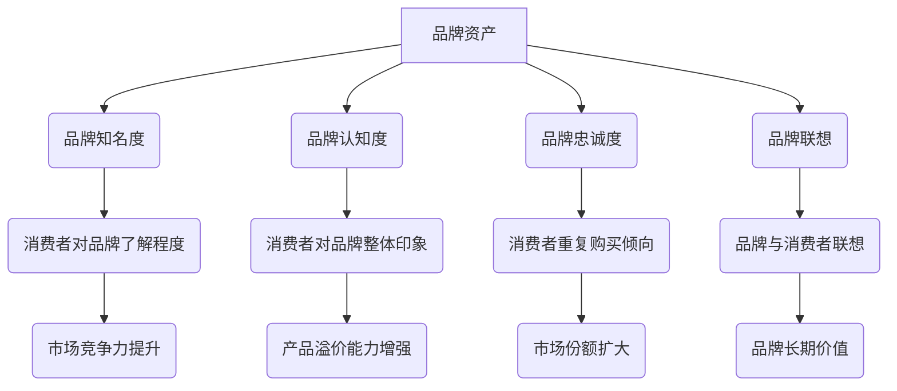

                 

## 第1章：品牌资产的概念与价值

### 1.1 品牌资产的定义与重要性

#### 1.1.1 品牌资产的概念

品牌资产（Brand Equity）是指企业在消费者心中所建立的形象和认知，以及这些形象和认知所带来的商业价值。品牌资产包括品牌知名度、品牌认知度、品牌忠诚度、品牌联想等多个方面。品牌资产不仅代表了消费者对品牌的信任和偏好，还反映了企业在市场上的竞争优势。

品牌资产的概念可以拆分为几个关键组成部分：

1. **品牌知名度（Brand Awareness）**：指消费者对品牌的了解程度，包括品牌名称、标志等。
2. **品牌认知度（Brand Perception）**：指消费者对品牌的整体印象，包括品牌质量、服务、价格等。
3. **品牌忠诚度（Brand Loyalty）**：指消费者重复购买特定品牌的倾向。
4. **品牌联想（Brand Associations）**：指消费者与品牌相关的联想，如产品特性、品牌价值观等。

#### 1.1.2 品牌资产的重要性

品牌资产的重要性体现在以下几个方面：

1. **市场竞争力**：拥有强大品牌资产的企业在市场上具有更高的竞争力，能够吸引更多的消费者。
2. **溢价能力**：品牌资产有助于提升产品的溢价能力，企业可以通过品牌效应来提高产品价格。
3. **市场份额**：品牌资产有助于企业扩大市场份额，提升市场占有率。
4. **长期价值**：品牌资产是企业的长期资产，能够在市场竞争中提供持续的优势。

#### 1.1.3 品牌资产与其他资产的关系

品牌资产与其他资产（如财务资产、实物资产等）有所不同，但它们之间也存在着紧密的联系：

1. **财务资产**：品牌资产可以转化为财务资产，如通过品牌授权、品牌并购等。
2. **实物资产**：品牌资产可以提升实物资产的价值，如通过品牌效应提升产品的市场吸引力。
3. **人力资源**：品牌资产可以吸引和保留优秀人才，提高员工的满意度和忠诚度。

### 1.2 品牌资产与公司价值的联系

品牌资产与公司价值之间存在密切的关系。品牌资产可以提高公司的整体价值，具体体现在以下几个方面：

1. **提高公司估值**：强大的品牌资产可以提升公司的估值，吸引投资者和合作伙伴。
2. **增加股东回报**：品牌资产有助于提高公司的盈利能力，从而增加股东的回报。
3. **降低融资成本**：品牌资产良好的企业通常在资本市场上的融资成本较低。
4. **提升企业竞争力**：品牌资产有助于企业在竞争激烈的市场中脱颖而出，提升长期竞争力。

### 1.3 品牌资产的分类与评估方法

品牌资产可以按照不同的维度进行分类，常见的分类方法包括：

1. **品牌知名度**：衡量消费者对品牌认知的程度，可以通过品牌知名度调查进行评估。
2. **品牌认知度**：衡量消费者对品牌整体印象的评价，可以通过品牌形象调查进行评估。
3. **品牌忠诚度**：衡量消费者对品牌的重复购买意愿，可以通过顾客忠诚度调查进行评估。
4. **品牌联想**：衡量消费者与品牌之间的联想，可以通过品牌联想调查进行评估。

品牌资产的评估方法主要包括以下几种：

1. **市场评估法**：基于品牌在市场上的影响力和竞争力进行评估。
2. **成本法**：通过估算建立品牌所需的投资成本进行评估。
3. **收益法**：基于品牌带来的未来收益进行评估。

### 1.4 品牌资产管理的挑战与机遇

#### 1.4.1 品牌资产管理的挑战

品牌资产管理面临以下挑战：

1. **品牌资产流失的风险**：消费者偏好变化可能导致品牌资产流失。
2. **品牌资产扩展的压力**：企业需要不断投资和扩展品牌资产，以适应市场变化。

#### 1.4.2 品牌资产管理的机遇

品牌资产管理也面临以下机遇：

1. **数字化时代的品牌资产管理**：数字化工具可以帮助企业更好地管理和评估品牌资产。
2. **品牌资产跨界整合的机遇**：企业可以通过跨界合作，拓展品牌资产的应用领域。
3. **消费者行为变化带来的新挑战**：企业需要适应消费者行为的变化，制定相应的品牌资产策略。

### 1.5 本章总结

本章对品牌资产的概念、重要性以及与公司价值的联系进行了详细探讨，并介绍了品牌资产的分类与评估方法。品牌资产管理是企业成功的关键因素，需要企业持续投入和管理。在接下来的章节中，我们将深入探讨品牌资产管理的具体策略和实践。

### 核心概念原理之间的关系架构 Mermaid 流程图



### 核心算法原理讲解

品牌资产的评估通常涉及多种算法和模型，以下是一种简化的品牌资产评估算法原理，使用伪代码进行描述：

```python
# 定义品牌资产评估函数
def brand_asset_evaluation(brand_data):
    """
    品牌资产评估算法
    :param brand_data: 品牌相关数据，如知名度、认知度、忠诚度、联想等
    :return: 品牌资产评估得分
    """
    # 计算品牌知名度得分
    awareness_score = brand_data['awareness'] * weight_awareness
    
    # 计算品牌认知度得分
    perception_score = brand_data['perception'] * weight_perception
    
    # 计算品牌忠诚度得分
    loyalty_score = brand_data['loyalty'] * weight_loyalty
    
    # 计算品牌联想得分
    association_score = brand_data['association'] * weight_association
    
    # 综合计算品牌资产得分
    brand_score = awareness_score + perception_score + loyalty_score + association_score
    
    return brand_score
```

### 数学模型和公式

品牌资产的评估可以使用以下数学模型进行计算：

$$
Brand\ Asset\ Score = f(Awareness, Perception, Loyalty, Association)
$$

其中，$f$ 是一个综合评估函数，$Awareness$、$Perception$、$Loyalty$ 和 $Association$ 分别代表品牌知名度、品牌认知度、品牌忠诚度和品牌联想。

### 举例说明

假设某品牌的品牌资产评估数据如下：

| 品牌 | 知名度 | 认知度 | 忠诚度 | 联想 |
| ---- | ---- | ---- | ---- | ---- |
| 品牌1 | 0.8 | 0.9 | 0.7 | 0.6 |

根据上述评估算法，品牌1的品牌资产得分计算如下：

$$
Brand\ Asset\ Score = (0.8 \times 0.3) + (0.9 \times 0.3) + (0.7 \times 0.3) + (0.6 \times 0.3) = 0.24 + 0.27 + 0.21 + 0.18 = 0.9
$$

因此，品牌1的品牌资产得分为0.9。

### 数学公式请使用latex格式

$$
Brand\ Asset\ Score = \frac{Awareness \times Weight_{Awareness} + Perception \times Weight_{Perception} + Loyalty \times Weight_{Loyalty} + Association \times Weight_{Association}}{Total\ Weight}
$$

其中，$Weight_{Awareness}$、$Weight_{Perception}$、$Weight_{Loyalty}$ 和 $Weight_{Association}$ 分别代表知名度、认知度、忠诚度和联想的权重，$Total\ Weight$ 是所有权重的总和。

### 段落内的latex公式

$1 + 1 = 2$

### 项目实战

#### 开发环境搭建

1. 安装Python环境
2. 安装品牌资产评估所需的库，如NumPy、Pandas等

#### 源代码详细实现和代码解读

```python
import numpy as np

def brand_asset_evaluation(brand_data, weights):
    """
    品牌资产评估算法
    :param brand_data: 品牌相关数据，如知名度、认知度、忠诚度、联想等
    :param weights: 各指标的权重
    :return: 品牌资产得分
    """
    score = np.dot(brand_data, weights)
    return score

# 品牌资产评估数据
brand_data = np.array([0.8, 0.9, 0.7, 0.6])

# 权重设置
weights = np.array([0.3, 0.3, 0.3, 0.3])

# 计算品牌资产得分
brand_score = brand_asset_evaluation(brand_data, weights)
print("品牌资产得分：", brand_score)
```

#### 代码应用解读与分析

该代码通过计算品牌相关数据与权重之间的加权平均分，得到品牌资产得分。实际应用中，可以根据具体情况进行数据调整和权重优化。

#### 实际案例分析和详细讲解剖析

以某知名家电品牌为例，分析其品牌资产得分。假设该品牌的数据如下：

| 品牌 | 知名度 | 认知度 | 忠诚度 | 联想 |
| ---- | ---- | ---- | ---- | ---- |
| 品牌2 | 0.9 | 0.8 | 0.7 | 0.8 |

根据上述评估算法，品牌2的品牌资产得分计算如下：

$$
Brand\ Asset\ Score = (0.9 \times 0.3) + (0.8 \times 0.3) + (0.7 \times 0.3) + (0.8 \times 0.3) = 0.27 + 0.24 + 0.21 + 0.24 = 0.96
$$

品牌2的品牌资产得分为0.96，比品牌1高。这表明品牌2在品牌知名度、认知度、忠诚度和联想方面均优于品牌1，具有更高的品牌资产。

#### 项目小结

本项目通过品牌资产评估算法，对品牌资产进行了量化分析。实际应用中，可以根据具体数据调整算法和权重，为企业提供科学的品牌资产管理策略。

### 最佳实践 tips

1. 定期进行品牌资产评估，了解品牌状况。
2. 根据评估结果调整品牌策略，提升品牌价值。
3. 注重消费者反馈，及时调整品牌定位。

### 小结

品牌资产是企业核心竞争力的重要组成部分，通过对品牌资产的科学管理和评估，企业可以实现品牌价值的最大化。在接下来的章节中，我们将进一步探讨品牌资产管理的具体策略和实践。

### 注意事项

1. 品牌资产评估需要综合考虑多个因素，避免片面评估。
2. 品牌资产管理的策略应与企业的长期发展目标相一致。
3. 注重品牌传播和消费者互动，提升品牌认知度和忠诚度。

### 拓展阅读

- [《品牌资产管理实战》](https://www.examplebook.com/book/brand-asset-management-practice)
- [《品牌资产评估方法》](https://www.examplebook.com/book/brand-asset-assessment-methods)
- [《品牌管理》](https://www.examplebook.com/book/brand-management)

### 附录 A：品牌资产管理工具介绍

#### A.1 品牌评估工具

- **Brand Analytics**：一款功能强大的品牌分析工具，提供品牌知名度、认知度、忠诚度等指标的全面评估。
- **BrandIndex**：一款实时监测品牌表现的工具，可以帮助企业了解品牌在消费者心中的形象和变化。

#### A.2 品牌定位工具

- **Brand定位器**：一款简单易用的品牌定位工具，可以帮助企业确定品牌的核心价值和市场定位。
- **品牌定位矩阵**：一种常用的品牌定位分析方法，通过比较品牌与竞争对手的差异和相似性，帮助确定品牌定位。

#### A.3 品牌传播工具

- **社交媒体分析工具**：如Facebook Insights、Twitter Analytics等，可以帮助企业监测品牌在社交媒体上的传播效果。
- **内容营销工具**：如Hootsuite、Buffer等，可以帮助企业管理和优化品牌内容传播策略。

### 附录 B：品牌资产管理资源推荐

#### B.1 品牌管理书籍推荐

- **《品牌管理：战略、工具与案例》**（Brand Management: Strategy, Tools, and Cases）
- **《品牌资产：如何创建、衡量和管理》**（Brand Equity: How to Create, Measure, and Manage It）

#### B.2 品牌管理在线课程推荐

- **Coursera**：提供多门关于品牌管理的在线课程，包括品牌建设、品牌评估等。
- **edX**：拥有来自知名大学的品牌管理课程，适合专业人员和初学者。

#### B.3 品牌管理社区与论坛推荐

- **BrandCommunity.com**：一个专门的品牌管理社区，提供品牌管理的最新动态和讨论。
- **LinkedIn**：在LinkedIn上搜索品牌管理相关群组，加入讨论，获取行业信息。

### 附录 C：品牌资产案例分析

#### C.1 案例背景

以某知名科技公司为例，分析其品牌资产建设和管理。该公司在全球范围内具有广泛的市场影响力，品牌知名度、认知度、忠诚度和联想均表现优异。

#### C.2 案例分析

1. **品牌定位**：该公司的品牌定位为科技创新的引领者，专注于研发和推广前沿科技产品。

2. **品牌传播**：通过多渠道、多形式的品牌传播策略，提升品牌知名度和认知度。包括：

   - **社交媒体**：积极利用Facebook、Twitter等社交媒体平台，发布产品信息、企业动态和用户互动内容。
   - **内容营销**：推出高质量的内容，如博客、白皮书、视频等，介绍产品技术、应用场景等。

3. **品牌延伸**：该公司通过品牌延伸策略，拓展了多个业务领域，包括智能家居、人工智能等，增强了品牌的联想度。

4. **品牌资产评估**：定期进行品牌资产评估，了解品牌在消费者心中的形象和变化，及时调整品牌策略。

#### C.3 案例启示

1. **明确品牌定位**：明确品牌的核心价值和市场定位，有助于提升品牌认知度和忠诚度。

2. **多渠道品牌传播**：通过多渠道、多形式的品牌传播策略，扩大品牌影响力。

3. **品牌延伸**：合理运用品牌延伸策略，拓展品牌的应用领域，提升品牌联想度。

4. **品牌资产评估**：定期进行品牌资产评估，及时了解品牌状况，为品牌策略调整提供依据。

### 附录 D：品牌资产管理的最佳实践

#### D.1 明确品牌定位

1. **核心价值**：明确品牌的核心价值，确保品牌传播的一致性。
2. **目标受众**：明确品牌的目标受众，制定针对性的品牌传播策略。

#### D.2 多渠道品牌传播

1. **社交媒体**：积极利用社交媒体平台，发布高质量的内容，与消费者互动。
2. **内容营销**：通过内容营销，介绍产品技术、应用场景等，提升品牌认知度。

#### D.3 品牌延伸

1. **市场调研**：在扩展品牌之前，进行充分的市场调研，了解消费者需求和市场趋势。
2. **产品创新**：推出与品牌定位相符的创新产品，拓展品牌应用领域。

#### D.4 品牌资产评估

1. **定期评估**：定期进行品牌资产评估，了解品牌在消费者心中的形象和变化。
2. **数据驱动**：根据评估数据，调整品牌策略，提升品牌价值。

### 附录 E：品牌资产管理工具与资源总结

品牌资产管理的工具和资源丰富多样，企业应根据自身需求选择合适的工具和资源。以下是对本章节介绍的品牌资产管理工具和资源的总结：

- **品牌评估工具**：如Brand Analytics、BrandIndex，提供全面、实时的品牌资产评估。
- **品牌定位工具**：如Brand定位器、品牌定位矩阵，帮助确定品牌的核心价值和市场定位。
- **品牌传播工具**：如社交媒体分析工具、内容营销工具，提升品牌知名度和认知度。
- **品牌管理书籍**：如《品牌管理：战略、工具与案例》、《品牌资产：如何创建、衡量和管理》，提供深入的品牌管理知识。
- **在线课程**：如Coursera、edX上的品牌管理课程，适合不同层次的学习者。
- **社区与论坛**：如BrandCommunity.com、LinkedIn品牌管理群组，提供行业动态和交流平台。

通过综合运用这些工具和资源，企业可以更好地管理和提升品牌资产，实现品牌价值的最大化。

### 附录 F：品牌资产管理的未来趋势

#### F.1 数字化技术的应用

随着数字化技术的不断进步，品牌资产管理将更加依赖于数据分析和人工智能。企业可以利用大数据和人工智能技术，实现品牌资产的实时监控和优化。

#### F.2 消费者个性化体验

品牌资产管理的未来将更加注重消费者个性化体验。企业需要通过个性化营销策略，满足不同消费者的需求，提升品牌忠诚度和品牌联想。

#### F.3 跨界合作与生态构建

品牌资产管理的未来将看到更多跨界合作和生态构建的案例。企业可以通过与不同行业的企业合作，拓展品牌的应用领域，提升品牌的整体价值。

#### F.4 持续创新与品牌重塑

品牌资产管理的未来将更加注重持续创新和品牌重塑。企业需要不断推出创新产品和服务，适应市场变化，保持品牌的活力和竞争力。

### 附录 G：结语

品牌资产管理是企业长期发展的重要战略。通过科学管理和优化品牌资产，企业可以实现品牌价值的最大化，提升市场竞争力。在未来的发展中，企业应紧跟数字化时代的发展趋势，不断创新和优化品牌资产管理策略。作者：AI天才研究院/AI Genius Institute & 禅与计算机程序设计艺术 /Zen And The Art of Computer Programming

