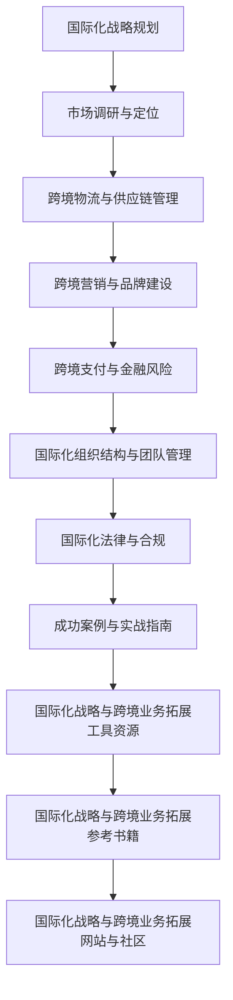

                 

### 文章标题

一人公司的国际化战略与跨境业务拓展

> 关键词：一人公司、国际化战略、跨境业务拓展、市场调研、物流管理、营销策略、支付与金融风险、团队管理、合规与法律

> 摘要：本文将深入探讨一人公司的国际化战略与跨境业务拓展的重要性。通过分析国际化战略的意义、市场调研与定位、跨境物流与供应链管理、跨境营销与品牌建设、跨境支付与金融风险、国际化运营与团队管理以及国际化法律与合规等方面，本文旨在为一人公司提供一套切实可行的国际化战略与跨境业务拓展方案，助力公司在全球市场取得成功。

### 第一部分：一人公司的国际化战略概述

#### 第1章：国际化战略与公司成长

在全球化经济的浪潮下，无论是大型企业还是小型公司，国际化战略都成为了企业发展的必经之路。对于一人公司而言，国际化战略不仅关乎公司的成长，更关系到其生存与发展。本章节将从国际化战略的意义与必要性、一人公司的国际化优势、全球市场环境分析以及一人公司的国际化路径选择等方面，对国际化战略进行全面的概述。

**1. 国际化战略的意义与必要性**

国际化战略是企业开拓全球市场，利用全球资源，提高竞争力的战略布局。对于一人公司来说，国际化战略的意义主要体现在以下几个方面：

- **市场拓展**：通过国际化战略，一人公司可以进入新的市场，开拓更广阔的业务领域，从而实现销售增长。
- **资源整合**：国际化战略有助于一人公司整合全球资源，降低生产成本，提高产品质量。
- **品牌提升**：通过在全球市场的表现，一人公司可以提升品牌知名度和品牌影响力。
- **风险管理**：多元化市场可以分散风险，降低单一市场波动对公司的影响。

在当今全球化的背景下，国际化战略已经不再是一种选择，而是企业发展的必然趋势。一人公司如果不采取国际化战略，将难以在激烈的市场竞争中立足。

**2. 一人公司的国际化优势**

与大型企业相比，一人公司在国际化战略中具有一定的优势：

- **灵活性强**：一人公司结构简单，决策迅速，能够灵活调整战略。
- **成本低**：一人公司不需要承担大规模的运营成本，可以更加专注于核心业务。
- **创新力强**：一人公司往往更加注重创新，更容易适应市场的变化。
- **地域优势**：一人公司可能位于一些具有地理优势的地区，便于开展跨境业务。

**3. 全球市场环境分析**

全球市场环境是影响一人公司国际化战略的重要因素。当前，全球市场环境呈现出以下特点：

- **经济全球化**：随着全球贸易和投资的自由化，企业可以更加容易地进入国际市场。
- **技术进步**：互联网和电子商务的发展，使得跨境贸易变得更加便捷。
- **市场竞争**：国际市场上的竞争日益激烈，一人公司需要具备独特的竞争优势。
- **政策法规**：各国政府的政策法规对企业的国际化经营有着重要的影响。

**4. 一人公司的国际化路径选择**

一人公司在制定国际化战略时，需要根据自身的优势和全球市场环境，选择合适的国际化路径：

- **出口**：通过出口产品或服务，将业务拓展到国际市场。
- **并购**：通过并购海外企业，快速进入目标市场。
- **合资**：与本地企业合作，共同开展业务。
- **本地化**：根据目标市场的需求，对产品或服务进行本地化调整。

在本章节中，我们分析了国际化战略的意义与必要性，以及一人公司在国际化战略中的优势。接下来，我们将深入探讨市场调研与定位的重要性，帮助一人公司确定合适的国际化战略。

#### 第2章：市场调研与定位

市场调研与定位是国际化战略成功的关键步骤。对于一人公司而言，了解目标市场的需求和特点，准确进行市场定位，是确保国际化战略顺利实施的基础。本章节将从国际市场调研方法、确定目标市场、定位策略制定以及竞争对手分析等方面，详细探讨市场调研与定位的过程。

**1. 国际市场调研方法**

市场调研是获取市场信息、了解市场动向的重要手段。对于一人公司来说，有效的市场调研方法包括：

- **二手资料调研**：通过查阅相关的行业报告、市场调研报告等二手资料，获取市场的基本信息。
- **问卷调查**：设计有针对性的问卷，通过在线调查、电话调查等方式收集目标市场的消费者数据。
- **深度访谈**：与目标市场的消费者、供应商、分销商等进行面对面交流，深入了解市场需求和痛点。
- **实地考察**：亲自到目标市场进行实地考察，了解当地市场环境、文化特点、消费者行为等。

在国际市场调研中，一人公司需要重点关注以下方面：

- **市场规模**：了解目标市场的潜在客户数量和市场规模。
- **市场趋势**：分析目标市场的消费趋势、技术发展趋势等，以预测市场未来的发展方向。
- **竞争状况**：分析竞争对手的市场份额、产品特点、营销策略等，评估自身的竞争地位。

**2. 确定目标市场**

确定目标市场是国际化战略的核心环节。一人公司需要根据自身的产品或服务特点、市场调研结果以及自身的资源能力，选择最合适的进入市场。在选择目标市场时，可以考虑以下因素：

- **市场规模与增长潜力**：选择市场规模较大且增长潜力较高的市场，有利于公司快速扩大市场份额。
- **市场竞争力**：评估目标市场的竞争程度，选择竞争相对较小但具有潜力的市场。
- **进入壁垒**：考虑目标市场的政策法规、关税、贸易壁垒等因素，评估进入的难易程度。
- **文化适应性**：分析目标市场的文化特点，确保产品或服务的文化适应性。

**3. 定位策略制定**

在确定目标市场后，一人公司需要制定具体的定位策略，以在目标市场中占据一席之地。定位策略的制定可以从以下几个方面考虑：

- **产品定位**：根据目标市场的需求，对产品进行差异化定位，强调产品的独特卖点。
- **市场定位**：根据目标市场的特点和消费者的偏好，制定合适的市场定位策略，如高端市场、大众市场等。
- **价格定位**：根据产品的成本、竞争对手的价格以及消费者的购买力，制定合理的价格策略。
- **品牌定位**：通过品牌形象、品牌故事等手段，建立品牌在目标市场的认知度和影响力。

**4. 竞争对手分析**

竞争对手分析是国际化战略制定过程中不可或缺的一部分。通过分析竞争对手的产品、市场策略、市场地位等，一人公司可以了解自身在市场中的竞争地位，并制定相应的应对策略。

- **产品分析**：分析竞争对手的产品特点、性能、价格等，了解其产品的市场竞争力。
- **市场策略**：分析竞争对手的市场策略，如营销策略、渠道策略等，评估其策略的有效性。
- **市场地位**：通过市场份额、品牌影响力等指标，评估竞争对手在市场中的地位。

在本章节中，我们详细探讨了市场调研与定位的重要性，以及如何进行国际市场调研、确定目标市场和制定定位策略。通过这些步骤，一人公司可以更加准确地把握国际市场的需求，制定出符合自身实际情况的国际化战略。

#### 第3章：跨境物流与供应链管理

跨境物流与供应链管理是国际化战略成功的关键因素之一。对于一人公司来说，有效的跨境物流与供应链管理不仅能够降低成本、提高效率，还能提升客户满意度，增强竞争力。本章节将详细讨论跨境物流模式、供应链风险管理、物流成本优化以及跨境物流案例分析，帮助一人公司建立高效的跨境物流与供应链管理体系。

**1. 跨境物流模式**

跨境物流模式是跨境贸易中至关重要的一环。一人公司需要根据自身的产品特点、市场定位以及目标市场的物流需求，选择合适的跨境物流模式。常见的跨境物流模式包括：

- **直接运输**：直接从供应商处运输产品到目标市场，适用于产品体积较小、重量较轻的情况。
- **中转运输**：通过第三国进行中转，再运输到目标市场，适用于产品体积较大、重量较重的情况。
- **集运**：多个供应商的产品一起运输，通过降低单次运输成本来提高整体效率。
- **海外仓储**：在目标市场建立仓储设施，实现本地化库存管理，提高物流响应速度。

**2. 供应链风险管理**

跨境供应链管理涉及到诸多风险，如物流延误、货物损坏、关税问题等。有效的供应链风险管理是确保跨境业务顺利运行的关键。一人公司应关注以下风险点：

- **物流延误**：由于运输时间过长、海关检查等因素导致的物流延误，影响交货时间和客户满意度。
- **货物损坏**：在运输过程中由于包装不当、装卸不当等原因导致的货物损坏，影响产品品质和客户体验。
- **关税问题**：关税政策的不确定性、关税税率的变化等，对企业的成本控制和利润产生重大影响。
- **供应链中断**：由于自然灾害、政治动荡等原因导致的供应链中断，影响企业的生产和交付能力。

**3. 物流成本优化**

跨境物流成本是企业国际化运营中的重要成本之一。通过优化物流成本，一人公司可以降低运营成本，提高竞争力。以下是一些常见的物流成本优化方法：

- **规模效应**：通过扩大运输规模，降低单次运输成本。
- **物流外包**：将物流业务外包给专业的物流服务提供商，降低自有物流成本。
- **运输模式选择**：根据产品特点和市场需求，选择合适的物流模式，优化运输路径和运输时间。
- **供应链协同**：与供应商、分销商等供应链合作伙伴建立紧密的协同关系，提高物流效率，降低成本。
- **技术创新**：利用信息技术，如物流管理系统、物联网技术等，提高物流管理的精细化程度，降低物流成本。

**4. 跨境物流案例分析**

以下是一个跨境物流案例分析，旨在展示一人公司如何通过有效的跨境物流与供应链管理实现业务的国际化拓展。

**案例：某电子产品公司跨境物流管理**

某电子产品公司A计划将产品出口到欧洲市场。为了确保产品顺利交付，公司采取了以下措施：

- **物流模式选择**：公司选择了集运模式，通过将多个供应商的产品一起运输，降低了单次运输成本。
- **供应链协同**：公司与供应商建立了紧密的协同关系，确保生产计划与物流计划相互匹配，提高了物流效率。
- **物流成本优化**：公司通过外包物流业务，将物流管理交给专业的物流服务提供商，降低了自有物流成本。
- **风险控制**：公司制定了详细的物流应急预案，包括应对物流延误、货物损坏等情况，确保了跨境物流的顺畅运行。

通过以上措施，该公司成功地降低了跨境物流成本，提高了物流效率，并在欧洲市场建立了良好的物流体系，为后续业务的持续拓展奠定了基础。

在本章节中，我们详细讨论了跨境物流与供应链管理的重要性，包括跨境物流模式、供应链风险管理、物流成本优化以及跨境物流案例分析。通过这些讨论，一人公司可以更好地理解跨境物流与供应链管理的关键环节，制定出有效的跨境物流与供应链管理策略，为国际化战略的成功实施提供有力支持。

#### 第4章：跨境营销与品牌建设

跨境营销与品牌建设是国际化战略的重要组成部分，对于一人公司来说，如何在异国他乡赢得消费者的心，建立起强大的品牌影响力，是成功拓展国际市场的关键。本章节将详细探讨跨境营销策略、品牌国际化路径、社交媒体营销以及成功跨境营销案例解析，帮助一人公司制定并实施有效的跨境营销与品牌建设方案。

**1. 跨境营销策略**

跨境营销策略是指为了在国际市场上推广产品或服务，吸引和留住消费者而采取的一系列营销措施。一人公司需要根据目标市场的特点，制定符合自身实际情况的跨境营销策略。以下是一些常见的跨境营销策略：

- **产品定位**：根据目标市场的消费者需求和偏好，对产品进行差异化定位，突出产品的独特卖点和优势。
- **市场细分**：将目标市场划分为不同的细分市场，有针对性地进行营销，提高营销效果。
- **本地化营销**：根据目标市场的文化、语言、习俗等，对营销内容进行本地化调整，增强营销的亲和力和接受度。
- **互动营销**：通过线上互动、客户反馈等方式，与消费者建立良好的沟通关系，提高品牌忠诚度。
- **联合营销**：与当地合作伙伴共同开展营销活动，借助合作伙伴的市场资源，扩大品牌影响力。

**2. 品牌国际化路径**

品牌国际化是跨境营销的核心目标之一。一人公司需要通过一系列措施，将品牌在全球范围内推广和传播。以下是一些常见的品牌国际化路径：

- **品牌定位**：根据公司的愿景和使命，确定品牌的定位，明确品牌的核心价值和差异化优势。
- **品牌传播**：通过广告、公关、赞助等多种渠道，将品牌信息传递给目标市场的消费者。
- **品牌延伸**：根据品牌的特点和市场需求，将品牌扩展到新的产品线或服务领域，实现品牌的多元化发展。
- **品牌维护**：持续关注品牌形象和市场反馈，及时调整品牌策略，确保品牌价值的持续提升。

**3. 社交媒体营销**

社交媒体营销是现代跨境营销的重要手段，通过社交媒体平台，一人公司可以与全球消费者进行实时互动，提高品牌知名度和影响力。以下是一些社交媒体营销的策略：

- **内容创作**：创作具有吸引力的内容，如图文、视频、直播等，提高用户的参与度和传播效果。
- **平台选择**：根据目标市场的特点，选择合适的社交媒体平台，如Facebook、Instagram、Twitter等，进行精准营销。
- **互动管理**：积极与用户互动，回复评论和私信，建立良好的用户关系，提高品牌忠诚度。
- **数据分析**：通过数据分析工具，了解用户行为和偏好，优化营销策略，提高营销效果。

**4. 成功跨境营销案例解析**

以下是一个成功跨境营销案例解析，旨在展示一人公司如何通过有效的跨境营销策略和品牌建设，实现国际市场的突破。

**案例：某时尚品牌全球营销**

某时尚品牌B致力于将时尚潮流带入全球市场。为了实现这一目标，公司采取了以下措施：

- **品牌定位**：品牌B以“时尚、个性、创新”为核心价值，定位为高端时尚品牌，满足全球消费者的个性化需求。
- **社交媒体营销**：公司通过Instagram、Facebook等社交媒体平台，发布时尚潮流图片和短视频，吸引全球时尚爱好者的关注。同时，通过互动活动，如线上抽奖、用户生成内容等，增强用户参与度。
- **品牌传播**：公司通过赞助国际时尚秀、举办线上直播活动等，提高品牌在国际时尚圈的影响力。此外，公司与知名时尚博主和社交媒体达人合作，通过KOL营销，扩大品牌传播范围。
- **市场细分**：公司针对不同市场的消费者特点，进行市场细分，制定差异化的营销策略。例如，在欧洲市场，公司强调品牌的设计创新和环保理念；在亚洲市场，公司则强调品牌的时尚性和实用性。

通过以上措施，品牌B成功地进入了多个国际市场，建立了强大的品牌影响力。公司销售额逐年增长，品牌知名度不断提升，成为全球时尚品牌之一。

在本章节中，我们详细探讨了跨境营销与品牌建设的重要性，包括跨境营销策略、品牌国际化路径、社交媒体营销以及成功跨境营销案例解析。通过这些讨论，一人公司可以更好地理解跨境营销与品牌建设的核心要素，制定出符合自身实际情况的跨境营销与品牌建设方案，为国际化战略的成功实施提供有力支持。

#### 第5章：跨境支付与金融风险

跨境支付与金融风险是国际化战略中的重要环节，直接关系到一人公司在全球市场的财务安全和运营效率。本章节将深入探讨跨境支付系统、金融风险管理、外汇风险管理以及跨境支付风险应对策略，帮助一人公司建立稳健的跨境支付与金融管理体系。

**1. 跨境支付系统**

跨境支付系统是进行国际间资金转移的基础设施，对于一人公司的跨境业务至关重要。跨境支付系统通常包括以下组成部分：

- **支付渠道**：包括银行间支付系统、第三方支付平台等，提供支付通道和服务。
- **结算系统**：实现不同货币之间的兑换和结算，确保跨境交易顺利完成。
- **风险管理**：通过风险评估、资金监控等措施，防范支付过程中的风险。

一人公司在选择跨境支付系统时，需要考虑以下因素：

- **稳定性**：支付系统需要具备高稳定性和可靠性，确保跨境交易顺利进行。
- **安全性**：支付系统需具备良好的安全性，保障资金和信息安全。
- **便捷性**：支付系统应提供便捷的操作界面和支付方式，提高用户体验。
- **成本**：支付系统的费用结构需要合理，避免高额的跨境支付费用影响利润。

**2. 金融风险管理**

金融风险管理是指在一人公司跨境业务中，识别、评估和控制金融风险的过程。金融风险主要包括：

- **信用风险**：交易对手无法履行支付义务，导致资金损失。
- **市场风险**：汇率、利率等市场波动导致资金价值变化。
- **操作风险**：支付系统操作失误、欺诈行为等导致的财务损失。

为了有效管理金融风险，一人公司应采取以下措施：

- **风险评估**：定期对金融风险进行评估，识别潜在风险点。
- **风险控制**：制定风险控制策略，如设定信用限额、汇率锁定等，降低风险暴露。
- **风险监控**：实时监控跨境交易，及时发现和处理异常情况。
- **应急准备**：制定应急计划，确保在发生风险时能够迅速响应和应对。

**3. 外汇风险管理**

外汇风险是指由于汇率波动导致企业财务状况发生变动的风险。对于一人公司而言，外汇风险管理尤为重要，因为其业务涉及多种货币的支付和结算。以下是一些常见的外汇风险管理策略：

- **汇率锁定**：通过远期合约、期权等金融工具，锁定未来的汇率，减少汇率波动带来的不确定性。
- **多元化货币**：通过使用多种货币进行业务运营，分散汇率风险。
- **现金流管理**：合理安排现金流，确保在不同货币间的资金流动平衡，降低外汇风险。

**4. 跨境支付风险应对策略**

跨境支付风险主要包括支付失败、支付延迟、支付错误等。为了有效应对跨境支付风险，一人公司可以采取以下策略：

- **支付前审核**：在支付前对交易进行严格审核，确保交易合法性和真实性。
- **支付确认**：与交易对手建立确认机制，确保支付信息准确无误。
- **风险预警**：建立风险预警系统，及时发现潜在风险并采取措施。
- **应急处理**：制定应急处理流程，确保在发生支付风险时能够迅速响应和解决。

**5. 成功案例解析**

以下是一个跨境支付风险管理的成功案例，展示了一人公司如何通过有效的金融风险管理策略，应对跨境支付风险。

**案例：某电商企业跨境支付风险管理**

某电商企业C在全球多个市场开展业务，面临较高的跨境支付风险。为了有效管理风险，公司采取了以下措施：

- **选择可靠的支付服务商**：公司与多家知名的跨境支付服务商合作，确保支付渠道的稳定性和安全性。
- **风险控制措施**：公司制定了严格的风险控制措施，如设定交易限额、实时监控支付情况等，确保交易合法和安全。
- **汇率风险管理**：公司通过外汇远期合约锁定汇率，减少汇率波动对财务的影响。
- **支付确认机制**：公司与交易对手建立了支付确认机制，确保支付信息的准确性，降低支付错误的风险。

通过以上措施，该电商企业成功地降低了跨境支付风险，确保了业务的顺利运营，并赢得了客户的信任。

在本章节中，我们详细探讨了跨境支付与金融风险的重要性，包括跨境支付系统、金融风险管理、外汇风险管理以及跨境支付风险应对策略。通过这些讨论，一人公司可以更好地理解跨境支付与金融风险的管理要点，制定出有效的风险管理策略，确保在全球市场的财务安全和运营效率。

#### 第6章：国际化组织结构与团队管理

国际化组织结构与团队管理是确保一人公司全球业务顺利运营的关键。随着公司在国际市场的扩展，如何构建有效的国际化组织结构和团队管理机制，提升跨文化沟通效率，解决跨国团队管理挑战，成为公司成功国际化的重要保障。本章节将深入探讨国际化组织结构设计、跨国团队管理挑战、跨文化沟通策略以及成功跨国团队管理实践，帮助一人公司构建高效的国际化组织与团队管理体系。

**1. 国际化组织结构设计**

国际化组织结构设计是公司全球业务布局的基础。一人公司需要根据业务需求、市场环境和文化差异，设计适合自身的国际化组织结构。常见的国际化组织结构包括：

- **跨国矩阵组织**：将全球市场划分为不同的区域，每个区域设有负责区域运营的管理团队，同时设立职能部门，如研发、财务、人力资源等，实现区域与职能的双重管理。
- **国际团队组织**：由来自不同国家的员工组成的团队，共同负责特定项目的管理和执行，适用于项目驱动的国际化业务。
- **全球集中式组织**：公司在全球范围内设立总部，统一管理和协调全球业务，适用于业务集中度较高的公司。

在国际化组织结构设计中，一人公司应关注以下要点：

- **灵活性**：组织结构应具备灵活性，能够快速响应市场变化和业务需求。
- **协同性**：不同部门和区域之间应建立紧密的协同关系，提高业务协同效应。
- **文化适应性**：组织结构应考虑文化差异，尊重不同国家的文化习惯和价值观。

**2. 跨国团队管理挑战**

跨国团队管理面临诸多挑战，如文化差异、沟通障碍、团队合作问题等。一人公司需要认真应对这些挑战，才能确保跨国团队的顺利运营。以下是一些常见的跨国团队管理挑战：

- **文化差异**：不同国家的员工在价值观、工作方式、沟通风格等方面存在差异，可能导致误解和冲突。
- **沟通障碍**：语言障碍、时间差异、信息不对称等，会影响跨国团队的沟通效果和决策效率。
- **团队合作问题**：跨国团队成员可能缺乏共同的目标和愿景，导致团队合作不力。
- **管理复杂性**：跨国团队的管理涉及多个国家和地区的法律法规、商业环境，管理复杂性增加。

**3. 跨文化沟通策略**

跨文化沟通策略是解决跨国团队管理挑战的有效手段。一人公司应采取以下策略，提升跨文化沟通效果：

- **文化意识**：培养员工的文化意识，了解和尊重不同文化的特点和习惯，减少文化冲突。
- **沟通渠道**：建立多样化的沟通渠道，如电子邮件、视频会议、即时通讯工具等，确保信息传达的及时性和准确性。
- **语言培训**：为员工提供语言培训，提高员工的跨语言沟通能力，减少语言障碍。
- **团队建设**：组织跨文化团队建设活动，增强团队成员之间的了解和信任，提高团队合作效率。

**4. 成功跨国团队管理实践**

以下是一个成功跨国团队管理实践案例，展示了一人公司如何通过有效的管理策略，克服跨国团队管理挑战，实现全球业务的成功运营。

**案例：某科技公司跨国团队管理**

某科技公司的全球化战略使其在全球设立了多个研发中心。为了管理好这些跨国团队，公司采取了以下措施：

- **文化融合**：公司定期组织文化融合活动，如团队建设、文化分享会等，促进不同文化背景的员工之间的相互了解和融合。
- **领导力培训**：为跨国团队的领导者提供跨文化管理培训，提高其跨文化沟通和团队管理能力。
- **透明沟通**：公司建立了透明的沟通机制，确保信息在跨国团队中的有效传递，减少信息不对称。
- **激励机制**：公司通过设立全球奖金和荣誉，激励跨国团队成员积极参与团队工作，提升团队合作效果。

通过以上措施，该公司成功地克服了跨国团队管理挑战，提高了团队的协作效率，实现了全球业务的持续增长。

在本章节中，我们详细探讨了国际化组织结构与团队管理的重要性，包括国际化组织结构设计、跨国团队管理挑战、跨文化沟通策略以及成功跨国团队管理实践。通过这些讨论，一人公司可以更好地理解国际化组织结构与团队管理的核心要点，制定出有效的管理策略，为国际化战略的成功实施提供有力支持。

#### 第7章：国际化法律与合规

国际化法律与合规是保障一人公司在全球市场稳健运营的重要基石。随着公司在不同国家和地区开展业务，如何应对跨境法律环境、合规要求以及知识产权保护，是国际化经营中必须面对的关键问题。本章节将深入探讨国际化法律与合规的重要性，包括跨境法律环境、合规要求与风险、知识产权保护以及合规管理经验分享，帮助一人公司建立全面的法律与合规管理体系。

**1. 跨境法律环境**

跨境法律环境是影响一人公司国际化运营的重要因素。不同国家和地区的法律体系、法规政策存在显著差异，一人公司需要充分了解和适应这些法律环境。以下是跨境法律环境中的关键方面：

- **商业法律**：不同国家的商业法律包括公司注册、合同签订、税收政策等，一人公司需遵守当地的商业法律，确保业务合法性。
- **劳动法律**：不同国家的劳动法律涉及员工招聘、劳动条件、工资待遇等，一人公司需遵守当地的劳动法律，保障员工的合法权益。
- **数据保护法律**：随着全球数据隐私保护意识的提高，各国纷纷制定数据保护法规，如欧盟的《通用数据保护条例》（GDPR），一人公司需遵守这些数据保护法律，保护用户隐私。
- **知识产权法律**：不同国家的知识产权法律包括专利、商标、著作权等，一人公司需保护自身的知识产权，同时也需避免侵犯他人的知识产权。

**2. 合规要求与风险**

合规要求与风险是国际化运营中不可忽视的重要问题。一人公司需要全面了解不同国家和地区的合规要求，并采取相应的措施进行风险控制。以下是合规要求与风险的关键方面：

- **法规遵从**：公司需遵守不同国家和地区的法律法规，如反洗钱（AML）法规、反贿赂法规等，避免因违法而面临高额罚款和声誉损失。
- **合规检查**：公司需定期接受合规检查，确保业务运营符合法律法规要求。合规检查可能来自政府机构、行业监管机构等。
- **合规风险**：合规风险包括法律风险、财务风险、声誉风险等。公司需建立有效的合规风险管理体系，识别、评估和控制合规风险。

**3. 知识产权保护**

知识产权保护是国际化运营中的重要环节，对于技术创新型企业尤为重要。一人公司需采取有效措施保护自身的知识产权，避免侵权行为的发生。以下是知识产权保护的关键方面：

- **专利申请**：公司需在关键市场国家和地区申请专利，保护技术创新和核心竞争力。
- **商标注册**：公司需在不同市场国家和地区注册商标，保护品牌形象和商誉。
- **版权保护**：公司需保护软件、文字、图像等知识产权，防止未经授权的复制和使用。
- **侵权监控**：公司需建立侵权监控机制，及时发现和处理侵权行为，维护知识产权。

**4. 合规管理经验分享**

以下是一个合规管理经验分享案例，展示了一人公司如何通过有效的合规管理，确保国际化运营的合规性和稳健性。

**案例：某科技公司合规管理实践**

某科技公司在全球多个市场开展业务，为了确保合规运营，公司采取了以下措施：

- **合规培训**：公司定期为员工提供合规培训，提高员工的合规意识和能力。
- **合规手册**：公司制定详细的合规手册，明确合规要求和操作流程，确保员工熟悉合规要求。
- **内部审计**：公司建立内部审计制度，定期对业务流程和合规情况进行审计，及时发现和纠正违规行为。
- **外部合作**：公司与专业法律顾问和合规服务机构合作，确保合规管理的专业性和有效性。

通过以上措施，该公司成功建立了全面的合规管理体系，确保了业务的合规运营，赢得了市场和客户的信任。

在本章节中，我们详细探讨了国际化法律与合规的重要性，包括跨境法律环境、合规要求与风险、知识产权保护以及合规管理经验分享。通过这些讨论，一人公司可以更好地理解国际化法律与合规的核心要点，制定出有效的法律与合规策略，为国际化战略的成功实施提供有力保障。

### 第四部分：成功案例与实战指南

#### 第8章：一人公司的国际化成功案例

在探索国际化战略与跨境业务拓展的过程中，许多一人公司取得了显著的成就。本章节将介绍几个成功的国际化案例，分析这些公司的国际化策略，总结成功经验，并探讨失败案例中的教训，为一人公司提供实用的实战指南。

**1. 成功案例介绍**

**案例1：小A的跨境电商之路**

小A是一位电商创业者，他在中国创办了一家专注于国际市场的小型电商公司。公司初期以跨境销售手工艺品为主，通过社交媒体和电商平台拓展业务。以下是该公司成功实现国际化的几个关键步骤：

- **市场调研**：小A在进入国际市场前，进行了详细的市场调研，确定了目标市场（欧美地区）和消费者需求。
- **产品定位**：公司根据目标市场的需求，对产品进行优化，推出符合国际消费者偏好的手工艺品。
- **品牌建设**：通过社交媒体营销，小A成功打造了一个具有国际影响力的品牌形象。
- **物流与供应链**：公司采用海外仓储和第三方物流服务，确保了产品的高效配送和客户满意度。

**案例2：B科技公司的全球化布局**

B科技公司是一家以软件开发为主的企业。该公司通过收购和合作，成功实现了全球化布局。以下是该公司国际化战略的关键步骤：

- **跨国并购**：B科技公司通过并购海外公司，迅速进入国际市场，获得了当地的市场资源和客户基础。
- **本地化运营**：公司根据不同市场的特点，制定了本地化运营策略，包括语言本地化、文化本地化等。
- **技术研发**：公司投入大量资源进行技术研发，确保产品的技术领先性和市场竞争力。
- **国际化团队**：公司组建了多元化的国际化团队，提升了跨文化沟通和协作效率。

**2. 国际化策略分析**

以上成功案例展示了不同的国际化策略，以下是对这些策略的详细分析：

- **市场调研与定位**：成功的国际化首先需要准确的市场调研和定位，了解目标市场的需求和竞争状况，制定符合自身优势的国际化战略。
- **品牌建设**：品牌是国际化的重要资产，通过有效的品牌建设和营销策略，可以提升公司的知名度和美誉度。
- **物流与供应链**：高效的物流与供应链管理是确保产品及时交付和客户满意度的重要因素。
- **跨国并购与合作**：通过并购和合作，可以迅速获得国际市场资源，加快国际化进程。

**3. 成功经验借鉴**

从以上成功案例中，一人公司可以借鉴以下经验：

- **深入了解目标市场**：进行详细的市场调研，了解目标市场的需求和竞争状况，制定针对性的市场策略。
- **重视品牌建设**：通过有效的品牌营销策略，提升公司的国际知名度，建立良好的品牌形象。
- **建立高效供应链**：优化物流与供应链管理，确保产品的高效配送和客户满意度。
- **多元化团队建设**：组建多元化的国际化团队，提升跨文化沟通和协作效率。

**4. 失败案例分析**

尽管许多一人公司成功实现了国际化，但仍有一些公司在国际化过程中遇到了挫折。以下是一个失败案例分析及其教训：

**案例：C公司的国际化失败**

C公司是一家以电子配件为主的企业，试图通过直接出口和建立海外分支机构实现国际化。然而，公司在国际化过程中遇到了以下问题：

- **市场定位不准确**：公司在进入国际市场时，未能准确了解目标市场的需求和偏好，导致产品不符合市场需求。
- **供应链管理不善**：公司未能有效管理跨国供应链，导致产品交付不及时，影响了客户满意度。
- **文化差异管理不当**：公司缺乏对跨国文化差异的理解和管理，导致内部沟通和协作不顺畅。

**教训**：

- **市场调研的重要性**：准确的市场调研是国际化成功的前提，缺乏市场调研可能导致市场定位失误。
- **供应链管理的复杂性**：跨国供应链管理涉及多个环节，需要专业的管理能力和经验。
- **跨文化沟通的重要性**：跨国团队的沟通和协作需要重视文化差异，建立有效的沟通机制。

**5. 实战指南**

以下是为一人公司提供的国际化实战指南：

- **市场调研与定位**：进行详细的市场调研，了解目标市场的需求和竞争状况，制定符合自身优势的国际化战略。
- **品牌建设与营销**：通过有效的品牌营销策略，提升公司的国际知名度和美誉度。
- **物流与供应链管理**：优化物流与供应链管理，确保产品的高效配送和客户满意度。
- **团队建设与跨文化沟通**：组建多元化的国际化团队，提升跨文化沟通和协作效率。
- **风险管理**：建立有效的风险管理体系，识别和控制国际化过程中的各种风险。

通过以上实战指南，一人公司可以更好地实施国际化战略，实现跨境业务拓展，迈向全球化。

#### 第9章：跨境业务拓展实战指南

跨境业务拓展对于一人公司来说既是机遇也是挑战。为了确保跨境业务的顺利拓展，一人公司需要制定详细的实战指南，包括实战步骤、资源整合与利用、风险评估与应对以及持续改进与优化。以下将从这些方面为一人公司提供跨境业务拓展的实战指南。

**1. 实战步骤详解**

跨境业务拓展通常需要经历以下步骤：

- **市场调研**：通过二手资料调研、问卷调查、深度访谈等方式，了解目标市场的需求和竞争状况，确定目标市场和定位策略。
- **产品与服务优化**：根据市场调研结果，对产品或服务进行优化，确保产品或服务符合目标市场的需求和偏好。
- **物流与供应链规划**：选择合适的物流模式，制定供应链管理策略，确保产品的高效配送和客户满意度。
- **市场营销与品牌推广**：制定跨境营销策略，通过社交媒体、广告、公关活动等手段提升品牌知名度和市场影响力。
- **支付与金融管理**：建立跨境支付系统，进行外汇风险管理，确保跨境交易的安全和高效。
- **合规与法律咨询**：了解目标市场的法律法规，寻求专业法律咨询，确保业务运营的合法合规。
- **团队建设与培训**：组建多元化的国际化团队，进行跨文化沟通和团队管理培训，提升团队协作效率。

**2. 资源整合与利用**

跨境业务拓展需要整合和利用多种资源，包括：

- **市场资源**：通过行业协会、专业市场调研机构等获取市场信息，了解市场趋势和竞争对手动态。
- **物流资源**：与专业的物流服务提供商合作，利用其成熟的物流网络和资源，提高物流效率。
- **金融资源**：与银行、支付服务商等建立合作关系，利用其提供的金融服务，降低跨境交易风险和成本。
- **技术资源**：利用互联网、电子商务平台等现代技术手段，提升跨境业务的管理和运营效率。
- **人力资源**：招聘具有国际视野和跨文化沟通能力的员工，提升团队的整体素质。

**3. 风险评估与应对**

跨境业务拓展面临多种风险，包括市场风险、物流风险、金融风险等。一人公司应建立有效的风险评估和应对机制：

- **市场风险**：通过市场调研和数据分析，识别潜在的市场风险，制定应对策略，如多元化市场布局、灵活调整产品策略等。
- **物流风险**：建立完善的物流应急预案，确保在物流延误、货物损坏等情况下能够迅速响应和解决。
- **金融风险**：通过外汇风险管理、信用风险控制等措施，降低金融风险，确保跨境交易的安全和高效。
- **法律风险**：了解目标市场的法律法规，寻求专业法律咨询，确保业务运营的合法合规。

**4. 持续改进与优化**

跨境业务拓展是一个持续的过程，一人公司应不断进行改进与优化：

- **数据分析**：通过数据分析，了解跨境业务的运营效果，识别问题和机会，进行针对性的改进。
- **客户反馈**：积极收集客户的反馈意见，了解客户需求和市场变化，优化产品和服务。
- **技术创新**：利用最新的技术手段，提升跨境业务的管理和运营效率，降低成本。
- **团队协作**：建立高效的团队协作机制，提升团队的整体协作能力和执行力。

通过以上实战指南，一人公司可以更好地进行跨境业务拓展，实现全球市场的持续增长和成功运营。

### 附录

#### 附录A：国际化战略与跨境业务拓展工具资源

在进行国际化战略与跨境业务拓展时，一系列的工具和资源有助于提升效率和效果。以下是一些关键的工具和资源：

- **市场调研工具**：
  - **Google Analytics**：用于追踪和分析网站流量，获取市场数据。
  - **SurveyMonkey**：提供在线问卷调查服务，方便收集市场反馈。
  - **LinkedIn**：通过LinkedIn的洞察工具，了解行业动态和潜在客户。

- **跨境支付系统**：
  - **PayPal**：全球知名的在线支付平台，适用于跨境支付。
  - **WorldFirst**：提供专业的跨境支付解决方案，包括外汇管理和支付服务。

- **跨境物流平台**：
  - **DHL**：提供全球物流服务，包括快递、空运、海运等。
  - **FedEx**：提供高效的物流服务，包括国际快递和货运服务。

- **拓展业务必备资源清单**：
  - **国际市场报告**：通过市场研究报告，了解目标市场的市场趋势和竞争状况。
  - **商业咨询服务**：寻求专业的商业咨询公司，提供市场调研、战略规划等服务。

#### 附录B：国际化战略与跨境业务拓展参考书籍

为了更好地理解和实施国际化战略与跨境业务拓展，以下是一些推荐的参考书籍：

- **《国际营销学》**：详细介绍了国际营销的基本概念、策略和实践。
- **《跨境电子商务》**：探讨电子商务在国际贸易中的应用和挑战。
- **《国际商务》**：涵盖国际商务的理论和实践，包括市场进入策略、国际贸易法规等。
- **《全球化战略》**：分析全球化对企业战略的影响，提供全球化运营的策略和建议。

#### 附录C：国际化战略与跨境业务拓展网站与社区

以下是一些有益的国际化战略与跨境业务拓展网站和社区：

- **LinkedIn**：全球最大的职业社交平台，提供行业动态、招聘信息和市场洞察。
- **进出口商会**：各国的进出口商会网站，提供市场报告、贸易政策和商业机会。
- **跨境电商论坛**：专业的跨境电商论坛，分享跨境业务经验、讨论市场动态。
- **国际化社区链接**：如Toastmasters International、International Chamber of Commerce等，提供跨文化交流和商业合作的平台。

### 核心概念与联系 Mermaid 流程图



### 核心算法原理讲解 & 数学模型讲解 & 详细讲解 & 举例说明

**核心算法原理讲解**

国际化战略规划是一个复杂的过程，涉及多个变量和因素。以下是国际化战略规划的核心算法原理，采用伪代码进行阐述：

```python
def international_strategy_planning(company_info, market_research, competitors_info):
    # 分析公司信息，包括资源、优势、劣势
    company_profile = analyze_company_info(company_info)
    
    # 进行市场调研，收集目标市场的数据
    market_data = conduct_market_research(market_research)
    
    # 确定目标市场与定位策略
    target_market = determine_target_market(market_data)
    positioning_strategy = define_positioning_strategy(target_market)
    
    # 分析竞争对手信息，制定应对策略
    competitive_strategy = analyze_competitors(competitors_info)
    
    # 综合以上信息，制定国际化战略规划
    strategy_plan = integrate_all_informations(company_profile, market_data, target_market, positioning_strategy, competitive_strategy)
    
    return strategy_plan

# 分析公司信息
def analyze_company_info(company_info):
    # 包括资源分析、优势分析、劣势分析等
    resources = company_info['resources']
    strengths = company_info['strengths']
    weaknesses = company_info['weaknesses']
    return {
        'resources': resources,
        'strengths': strengths,
        'weaknesses': weaknesses
    }

# 进行市场调研
def conduct_market_research(market_research):
    # 包括市场数据分析、消费者调研等
    market_data = market_research['data']
    consumer_insights = market_research['consumer_insights']
    return {
        'market_data': market_data,
        'consumer_insights': consumer_insights
    }

# 确定目标市场与定位策略
def determine_target_market(market_data):
    # 包括市场规模、增长潜力、竞争状况等
    market_size = market_data['market_size']
    growth_potential = market_data['growth_potential']
    competitive_status = market_data['competitive_status']
    return {
        'market_size': market_size,
        'growth_potential': growth_potential,
        'competitive_status': competitive_status
    }

def define_positioning_strategy(target_market):
    # 包括产品定位、市场定位、价格定位等
    product_positioning = target_market['product_positioning']
    market_positioning = target_market['market_positioning']
    price_positioning = target_market['price_positioning']
    return {
        'product_positioning': product_positioning,
        'market_positioning': market_positioning,
        'price_positioning': price_positioning
    }

# 分析竞争对手信息
def analyze_competitors(competitors_info):
    # 包括产品分析、市场策略分析等
    competitors = competitors_info['competitors']
    market_strategy = competitors_info['market_strategy']
    return {
        'competitors': competitors,
        'market_strategy': market_strategy
    }

# 综合以上信息，制定国际化战略规划
def integrate_all_informations(company_profile, market_data, target_market, positioning_strategy, competitive_strategy):
    # 包括综合分析、战略规划等
    integrated_plan = {
        'company_profile': company_profile,
        'market_data': market_data,
        'target_market': target_market,
        'positioning_strategy': positioning_strategy,
        'competitive_strategy': competitive_strategy
    }
    return integrated_plan
```

**数学模型讲解**

国际化战略规划中的市场调研数据分析和风险评估可以利用数学模型进行量化。以下是一个简单的市场吸引力计算模型：

$$
\text{市场吸引力} = \frac{\text{市场需求}}{\text{市场容量}} \times \text{竞争强度}^{-\alpha}
$$

其中，$\alpha$ 是一个调整参数，用于平衡市场需求和市场容量与竞争强度的影响。

举例说明：

假设目标市场的市场需求为 100 万，市场容量为 300 万，竞争强度为 0.8，$\alpha = 0.5$，则：

$$
\text{市场吸引力} = \frac{100 万}{300 万} \times 0.8^{-0.5} \approx 0.435
$$

这意味着该目标市场具有一定的吸引力，但竞争较为激烈。

通过上述核心算法原理和数学模型讲解，一人公司可以更好地理解和应用国际化战略规划的方法，制定出科学合理的国际化战略。

### 最佳实践 tips、小结、注意事项、拓展阅读等内容

**最佳实践 tips**：

1. **深度市场调研**：在制定国际化战略前，进行全面的深度市场调研，了解目标市场的需求、竞争状况和文化差异。
2. **灵活调整策略**：国际化过程中，市场环境变化较快，公司应具备灵活调整策略的能力，及时应对市场变化。
3. **构建本地化团队**：在目标市场建立本地化团队，了解当地市场环境和消费者需求，提升业务运营效率。
4. **重视法律合规**：遵守目标市场的法律法规，建立合规管理体系，避免法律风险。

**小结**：

本文从国际化战略概述、市场调研与定位、跨境物流与供应链管理、跨境营销与品牌建设、跨境支付与金融风险、国际化运营与团队管理以及国际化法律与合规等方面，详细探讨了国际化战略与跨境业务拓展的关键要素和实战指南。通过这些讨论，一人公司可以更好地制定和实施国际化战略，实现跨境业务的持续增长。

**注意事项**：

1. **文化适应性**：在跨国运营中，重视文化差异，确保产品、服务和文化适应目标市场的需求。
2. **风险管理**：建立完善的风险管理体系，识别和控制国际化过程中的各种风险。
3. **团队协作**：构建高效的国际化团队，提升跨文化沟通和协作效率。

**拓展阅读**：

1. **《国际市场营销学》**：详细探讨国际市场营销的基本理论、策略和实践。
2. **《跨境电商运营与管理》**：介绍跨境电商的运营模式、营销策略和业务管理。
3. **《跨国企业合规管理》**：探讨跨国企业合规管理的理论、实践和案例分析。

通过拓展阅读，一人公司可以进一步深化对国际化战略与跨境业务拓展的理解，为实际操作提供更多参考。作者：AI天才研究院/AI Genius Institute & 禅与计算机程序设计艺术 /Zen And The Art of Computer Programming。

