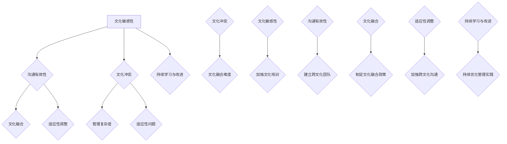

                 

### 文章标题

# 一人公司的国际化战略：跨文化经营的挑战

### 关键词

- 国际化战略
- 单一企业
- 跨文化经营
- 跨文化管理
- 跨文化沟通
- 文化差异

### 摘要

本文深入探讨了一人公司的国际化战略及其面临的跨文化经营挑战。首先，我们回顾了国际化战略的背景与概念，并分析了单一企业国际化模型和跨文化经营的背景与意义。接着，我们介绍了跨文化管理模型、文化差异分析及跨文化沟通技巧，以帮助一人公司更好地应对文化差异。随后，本文重点讲解了跨文化适应性评估模型和跨文化市场定位策略，并探讨了国际市场进入模式的选择。最后，通过实际案例研究，我们展示了如何在一人公司中实施国际化战略和跨文化经营策略，并提供了相关数学模型和公式，以帮助读者更好地理解核心算法原理。本文旨在为一人公司提供有价值的国际化战略指导，以应对跨文化经营的挑战。

## 第一部分：国际化战略背景与概念

### 1.1 国际化战略概述

#### 1.1.1 国际化的定义与重要性

国际化（Internationalization）是指企业将其业务扩展到全球市场的过程，旨在提高企业的国际竞争力，实现资源的全球配置和利润的最大化。国际化不仅包括产品或服务的跨国销售，还涉及到企业的战略规划、组织结构、运营管理、市场营销等多个方面。

国际化对企业的重要性体现在以下几个方面：

1. **扩大市场占有率**：企业通过国际化可以进入新的市场，扩大销售渠道，提高市场占有率，从而增加销售额。
2. **多元化风险分散**：企业将业务扩展到多个国家和地区，可以分散市场风险，降低单一市场波动对整体业绩的影响。
3. **提高品牌影响力**：在国际市场上建立品牌形象，有助于提升企业的知名度和美誉度，增强市场竞争优势。
4. **优化资源配置**：企业可以通过国际化获取全球范围内的优质资源，如人才、技术、原材料等，实现资源的最优配置。
5. **提升竞争力**：国际化有助于企业提高管理水平，学习借鉴国际先进经验，推动技术创新和管理优化，从而提升整体竞争力。

#### 1.1.2 国际化战略的类型与目标

国际化战略的类型可以根据企业的市场进入方式、发展路径和国际市场目标等因素进行分类。以下是几种常见的国际化战略类型及其特点：

1. **出口型国际化**：企业通过向海外市场出口产品或服务，实现市场扩展。这种策略较为简单，风险较低，但市场覆盖率有限。
2. **合资型国际化**：企业与外国企业合作，共同投资、运营和管理业务。这种方式可以快速进入目标市场，分享风险和资源，但可能面临合作管理上的挑战。
3. **并购型国际化**：企业通过并购海外企业，迅速扩大市场份额和业务范围。这种方式可以快速实现国际化，但需要承担较高的并购风险和整合成本。
4. **全球化战略**：企业将全球市场视为一个整体，实现全球资源的优化配置和业务协同。这种方式需要较高的管理能力和协同能力，但可以最大化企业价值。

不同类型的国际化战略有不同的目标，主要包括：

- **市场份额**：通过国际化战略提高企业市场份额，实现规模经济效应。
- **盈利能力**：通过国际化战略提高企业盈利能力，实现利润最大化。
- **品牌影响力**：通过国际化战略提升品牌在国际市场的认知度和影响力。
- **技术创新**：通过国际化战略获取国际先进技术，推动企业技术创新。
- **人才发展**：通过国际化战略吸引和培养国际化人才，提高企业竞争力。

#### 1.1.3 国际化战略对企业的影响

国际化战略对企业的影响是多方面的，包括以下几个方面：

1. **财务影响**：国际化战略可以带来新的收入来源，提高企业的盈利能力。但国际化过程也需要大量的资金投入，如市场调研、产品本地化、渠道建设等，可能会对企业的现金流产生压力。
2. **运营影响**：国际化战略要求企业具备较高的运营管理水平，如供应链管理、库存管理、质量控制等。企业需要根据不同市场特点调整运营策略，提高运营效率。
3. **组织影响**：国际化战略对企业组织结构和管理模式提出新的要求。企业需要建立全球化的组织架构，实现跨部门、跨区域的协同管理。
4. **文化影响**：国际化战略使企业面临跨文化管理的挑战，需要理解和尊重不同文化，调整企业文化和价值观，以适应国际化环境。
5. **法律影响**：国际化战略要求企业遵守不同国家和地区的法律法规，如税收政策、劳动法、环境保护法等。企业需要了解和遵守这些法规，以避免法律风险。

### 1.2 单一企业国际化模型

#### 1.2.1 一人公司的特点与挑战

一人公司（One-Person Company）是指由一名股东全资拥有的公司。这种类型的公司具有以下特点：

1. **灵活性高**：一人公司通常由单一股东负责决策，运营灵活，能够快速响应市场变化。
2. **规模较小**：由于股东人数的限制，一人公司规模通常较小，资源有限。
3. **管理成本低**：一人公司的管理成本较低，决策流程简单，有利于企业快速决策和执行。
4. **法律限制**：一些国家和地区对一人公司的设立和运营有特定的法律要求，如最低注册资本、税收政策等。

一人公司在国际化过程中面临以下挑战：

1. **资源限制**：一人公司资源有限，难以在全球范围内展开大规模的市场调研、渠道建设和品牌推广。
2. **管理能力**：一人公司的管理能力有限，难以应对跨文化管理、国际化运营和全球供应链管理等复杂问题。
3. **资金压力**：国际化过程需要大量的资金投入，一人公司可能难以承担高昂的市场开拓和运营成本。
4. **法律风险**：国际化使一人公司面临不同国家和地区的法律法规风险，需要了解和遵守各种法律法规，以避免法律风险。

#### 1.2.2 一人公司的国际化策略

针对上述挑战，一人公司可以采取以下国际化策略：

1. **小步快走**：一人公司可以采取小步快走的策略，先在某个特定的国际市场进行试点，逐步积累经验和资源，然后再逐步扩大市场。
2. **利用外部资源**：一人公司可以与第三方合作伙伴建立合作关系，共同承担市场开拓和运营成本，共享资源和风险。
3. **专注于特定领域**：一人公司可以专注于某个特定领域，发挥自身专业优势，提高市场竞争力。
4. **数字化营销**：通过数字化营销手段，如社交媒体、搜索引擎优化等，降低市场开拓成本，提高市场覆盖率。
5. **本地化运营**：了解和尊重目标市场的文化特点，调整产品和服务，以适应不同市场的需求。

#### 1.2.3 一人公司的资源限制与应对

一人公司的资源限制使其在国际化过程中面临诸多挑战。为了应对这些挑战，一人公司可以采取以下措施：

1. **优化资源配置**：一人公司需要合理规划和使用资源，避免资源浪费。通过精细化管理，提高资源利用率。
2. **低成本运营**：采取低成本运营策略，降低市场开拓和运营成本。例如，通过社交媒体和在线渠道进行市场推广，减少传统广告费用。
3. **灵活调整战略**：根据市场变化和资源情况，灵活调整国际化战略，以适应不断变化的市场环境。
4. **专业化合作**：与专业团队合作，共同承担市场开拓和运营任务，实现资源共享和风险分担。

### 1.3 跨文化经营的背景与意义

#### 1.3.1 跨文化经营的概念

跨文化经营（Cross-Cultural Management）是指企业在全球化背景下，在不同国家和地区的文化环境中进行经营和管理活动的过程。跨文化经营涉及到企业如何理解和适应不同文化背景下的员工、客户、合作伙伴和竞争对手，实现有效的沟通和合作。

跨文化经营的核心内容包括：

1. **文化差异识别**：识别和了解不同文化之间的差异，包括价值观、行为规范、沟通方式等。
2. **文化适应策略**：制定相应的策略，调整企业的管理方式、运营模式和产品服务，以适应不同文化背景。
3. **文化融合管理**：通过跨文化沟通和合作，实现不同文化之间的融合，提高企业的整体竞争力。

#### 1.3.2 文化差异对业务的影响

文化差异对企业的业务运营和管理产生重要影响，包括以下几个方面：

1. **市场进入策略**：不同文化背景下的市场特点、消费者偏好和需求有所不同，企业需要制定针对性的市场进入策略。
2. **人力资源管理**：文化差异导致员工招聘、培训、绩效评估和薪酬管理等环节面临挑战，企业需要调整人力资源策略，提高员工满意度。
3. **运营管理**：文化差异影响企业的供应链管理、质量管理、客户服务等运营环节，企业需要根据不同市场特点优化运营管理。
4. **市场营销**：文化差异影响企业的市场营销策略，包括广告宣传、产品定位、促销活动等，企业需要了解目标市场的文化特点，制定有针对性的营销策略。
5. **企业文化建设**：企业需要在全球化背景下，构建具有包容性和多元性的企业文化，促进不同文化背景的员工之间的沟通和合作。

#### 1.3.3 跨文化经营的必要性

跨文化经营的必要性体现在以下几个方面：

1. **全球化趋势**：随着全球化的不断深入，企业面临越来越多样化的文化环境，跨文化经营成为企业国际化发展的必然选择。
2. **市场拓展**：跨文化经营可以帮助企业进入新的市场，拓展业务范围，提高市场竞争力。
3. **资源整合**：跨文化经营使企业能够整合全球范围内的资源，提高资源利用效率，实现全球优化配置。
4. **风险管理**：跨文化经营有助于企业识别和应对不同国家和地区的政治、经济、法律风险，降低运营风险。
5. **创新能力**：跨文化经营促进企业内部不同文化背景的员工之间的交流和合作，激发创新思维，推动企业持续创新。

### 结论

综上所述，国际化战略对企业的扩展和竞争力提升具有重要意义。一人公司在国际化过程中面临资源限制和跨文化经营挑战，需要采取针对性的策略和措施。跨文化经营是全球化背景下企业不可或缺的一部分，对企业市场拓展、资源整合和风险管理等方面具有重要作用。在接下来的部分，我们将进一步探讨跨文化管理模型、文化差异分析及跨文化沟通技巧，以帮助一人公司更好地应对跨文化经营的挑战。  

## 第二部分：核心概念与联系

在国际化过程中，理解和应对文化差异是关键。因此，本部分将介绍跨文化管理模型、文化差异分析以及跨文化沟通技巧。这些核心概念相辅相成，共同构成了跨文化经营的理论框架，帮助一人公司更好地应对国际化挑战。

### 2.1 跨文化管理模型

#### 2.1.1 跨文化管理的定义

跨文化管理（Cross-Cultural Management）是指企业在全球化过程中，如何识别、理解、适应和融合不同文化背景下的员工、客户、合作伙伴和竞争对手，以实现有效沟通、合作和管理的活动。跨文化管理不仅关注文化差异，还关注如何通过文化融合提高企业的整体竞争力。

#### 2.1.2 跨文化管理的基本原则

跨文化管理遵循以下基本原则：

1. **文化敏感性**：尊重并理解不同文化背景下的员工、客户和合作伙伴，避免文化冲突和误解。
2. **沟通有效性**：建立有效的跨文化沟通机制，确保信息传递准确、及时，提高沟通效率。
3. **文化融合**：推动不同文化背景的员工之间的交流与合作，实现文化融合，提高团队凝聚力。
4. **适应性调整**：根据不同文化背景和市场特点，调整企业的管理策略、运营模式和产品服务，以适应国际化环境。
5. **持续学习与改进**：不断学习和更新跨文化管理知识，优化管理实践，提高跨文化管理能力。

#### 2.1.3 跨文化管理的挑战与应对

跨文化管理面临以下挑战：

1. **文化冲突**：不同文化之间的价值观、行为规范和沟通方式存在差异，可能导致文化冲突和误解。
2. **管理复杂度**：全球化背景下，企业需要同时管理多个文化背景下的员工、客户和合作伙伴，管理复杂度增加。
3. **适应性问题**：企业需要适应不同文化背景下的市场需求、法律法规和运营环境，提高适应性能力。
4. **文化融合难度**：不同文化背景的员工之间可能存在沟通障碍和信任问题，文化融合难度较大。

应对策略包括：

1. **加强文化培训**：通过文化培训，提高员工对文化差异的敏感性和理解能力，减少文化冲突。
2. **建立跨文化团队**：组建由不同文化背景的员工组成的团队，促进文化融合和协作。
3. **制定文化融合政策**：明确企业文化的核心价值观和行为规范，推动不同文化背景的员工共同遵守。
4. **加强跨文化沟通**：建立有效的跨文化沟通机制，确保信息传递准确、及时，提高沟通效率。
5. **持续优化管理实践**：根据实际管理经验和反馈，不断优化跨文化管理策略，提高管理能力。

#### 2.1.4 跨文化管理模型的关系架构

为了更好地理解跨文化管理模型，我们可以使用Mermaid流程图来展示其核心概念和联系：



### 2.2 文化差异分析

#### 2.2.1 文化差异的测量方法

文化差异的测量方法主要分为定量和定性两种：

1. **定量测量**：通过问卷调查、统计分析等方法，对文化差异进行量化测量。常用的定量测量工具包括Hofstede文化维度模型、GLOBE模型等。
2. **定性测量**：通过深度访谈、案例分析、观察等方法，对文化差异进行定性分析。定性测量方法有助于深入了解不同文化背景下的行为模式和价值观念。

#### 2.2.2 文化维度理论

文化维度理论（Cultural Dimensions Theory）是研究文化差异的重要理论之一。Hofstede文化维度模型是其中最具代表性的模型，该模型从五个维度分析了文化差异：

1. **权力距离（Power Distance）**：描述社会权力分配的公平程度。高权力距离文化中，权力集中在少数人手中，社会等级明显；低权力距离文化中，权力分散，社会等级不明显。
2. **不确定性规避（Uncertainty Avoidance）**：描述社会对不确定性和变化的容忍程度。高不确定性规避文化中，社会倾向于通过规范、规章制度来规避不确定性；低不确定性规避文化中，社会更愿意接受变化和不确定性。
3. **个体主义与集体主义（Individualism vs. Collectivism）**：描述个体与群体的关系。个体主义文化中，个人主义较强，强调个人权利和自由；集体主义文化中，群体主义较强，强调集体利益和社会责任。
4. **男性主义与女性主义（Masculinity vs. Femininity）**：描述社会价值观的性别差异。男性主义文化中，强调竞争、成功和物质财富；女性主义文化中，强调合作、关怀和公平。
5. **长期导向与短期导向（Long-Term Orientation vs. Short-Term Orientation）**：描述社会价值观的时间观念。长期导向文化中，社会重视长远规划和未来；短期导向文化中，社会更注重眼前利益和即时满足。

#### 2.2.3 文化差异对企业管理的影响

文化差异对企业管理产生深远影响，包括以下几个方面：

1. **人力资源管理**：文化差异影响员工招聘、培训、绩效评估和薪酬管理等环节。企业需要根据不同文化背景制定相应的人力资源策略。
2. **组织文化**：文化差异影响企业内部的文化建设。企业需要建立包容性和多元性的组织文化，促进不同文化背景的员工之间的沟通和合作。
3. **市场营销**：文化差异影响企业的市场营销策略。企业需要了解目标市场的文化特点，制定有针对性的营销策略，以满足不同市场的需求。
4. **运营管理**：文化差异影响企业的运营管理。企业需要根据不同文化背景调整供应链管理、质量控制、客户服务等方面的策略，以提高运营效率。
5. **国际合作**：文化差异影响企业与外部合作伙伴的合作。企业需要建立有效的跨文化沟通机制，确保合作顺利进行。

### 2.3 跨文化沟通技巧

#### 2.3.1 跨文化沟通的基本原则

跨文化沟通遵循以下基本原则：

1. **尊重差异**：尊重不同文化背景下的价值观、行为规范和沟通方式，避免文化冲突和误解。
2. **明确表达**：确保信息传递准确、清晰，避免因文化差异导致的沟通障碍。
3. **倾听理解**：积极倾听对方观点，理解不同文化背景下的表达方式和行为习惯。
4. **灵活调整**：根据不同文化背景调整沟通策略和方式，提高沟通效果。
5. **持续反馈**：通过持续反馈，确保信息传递准确，及时调整沟通策略。

#### 2.3.2 非语言沟通的重要性

非语言沟通（Non-Verbal Communication）在跨文化沟通中具有重要地位。非语言沟通包括肢体语言、面部表情、眼神交流、身体姿态等，这些因素在不同文化背景下可能具有不同的含义。

1. **肢体语言**：不同文化的肢体语言表达方式有所不同，如握手、拥抱、点头等。了解不同文化背景下的肢体语言有助于避免误解。
2. **面部表情**：面部表情在不同文化背景下可能具有不同的含义，如微笑、皱眉、眼睛闭合等。理解不同文化背景下的面部表情有助于准确理解对方情绪。
3. **眼神交流**：眼神交流在不同文化背景下可能具有不同的含义，如表示尊重、挑衅、逃避等。了解不同文化背景下的眼神交流有助于建立信任和沟通。
4. **身体姿态**：身体姿态在不同文化背景下可能具有不同的含义，如站立、坐姿、手势等。了解不同文化背景下的身体姿态有助于避免误解和冲突。

#### 2.3.3 跨文化沟通中的常见障碍及解决策略

跨文化沟通中可能遇到以下常见障碍：

1. **语言障碍**：不同文化背景下的语言差异可能导致沟通障碍。解决策略包括：使用共同语言、提供语言翻译、学习目标语言等。
2. **文化差异**：不同文化背景下的价值观、行为规范和沟通方式差异可能导致沟通障碍。解决策略包括：加强文化培训、建立文化敏感性、尊重文化差异等。
3. **沟通渠道**：沟通渠道不畅可能导致信息传递不准确。解决策略包括：建立有效的沟通机制、确保信息传递及时、透明等。
4. **沟通方式**：不同文化背景下的沟通方式可能不同，可能导致沟通障碍。解决策略包括：了解目标市场的文化特点、调整沟通策略、灵活调整沟通方式等。

### 结论

综上所述，跨文化管理、文化差异分析和跨文化沟通技巧是国际化过程中不可或缺的核心概念。一人公司在国际化过程中，需要理解和应对文化差异，采取跨文化管理策略，提高跨文化沟通技巧，以实现有效的国际化运营。在接下来的部分，我们将进一步探讨跨文化适应性评估模型和跨文化市场定位策略，以帮助一人公司更好地应对国际化挑战。

### 2.1 跨文化管理模型

#### 2.1.1 跨文化管理的定义

跨文化管理是指企业面对不同文化背景的员工、客户、合作伙伴和竞争对手时，通过识别、理解、适应和融合这些文化差异，以实现有效沟通、合作和管理的活动。它不仅关注文化差异，还强调通过文化融合提高企业的整体竞争力。

#### 2.1.2 跨文化管理的基本原则

跨文化管理遵循以下基本原则：

1. **文化敏感性**：尊重并理解不同文化背景下的价值观、行为规范和沟通方式，以避免文化冲突和误解。
2. **沟通有效性**：建立有效的跨文化沟通机制，确保信息传递准确、及时，提高沟通效率。
3. **文化融合**：通过跨文化沟通和合作，推动不同文化背景的员工之间的交流与合作，实现文化融合，提高团队凝聚力。
4. **适应性调整**：根据不同文化背景和市场特点，调整企业的管理策略、运营模式和产品服务，以适应国际化环境。
5. **持续学习与改进**：不断学习和更新跨文化管理知识，优化管理实践，提高跨文化管理能力。

#### 2.1.3 跨文化管理的挑战与应对

跨文化管理面临以下挑战：

1. **文化冲突**：不同文化之间的价值观、行为规范和沟通方式存在差异，可能导致文化冲突和误解。
2. **管理复杂度**：全球化背景下，企业需要同时管理多个文化背景下的员工、客户和合作伙伴，管理复杂度增加。
3. **适应性问题**：企业需要适应不同文化背景下的市场需求、法律法规和运营环境，提高适应性能力。
4. **文化融合难度**：不同文化背景的员工之间可能存在沟通障碍和信任问题，文化融合难度较大。

应对策略包括：

1. **加强文化培训**：通过文化培训，提高员工对文化差异的敏感性和理解能力，减少文化冲突。
2. **建立跨文化团队**：组建由不同文化背景的员工组成的团队，促进文化融合和协作。
3. **制定文化融合政策**：明确企业文化的核心价值观和行为规范，推动不同文化背景的员工共同遵守。
4. **加强跨文化沟通**：建立有效的跨文化沟通机制，确保信息传递准确、及时，提高沟通效率。
5. **持续优化管理实践**：根据实际管理经验和反馈，不断优化跨文化管理策略，提高管理能力。

#### 2.1.4 跨文化管理模型的关系架构

为了更好地理解跨文化管理模型，我们可以使用Mermaid流程图来展示其核心概念和联系：


### 2.2 文化差异分析

#### 2.2.1 文化差异的测量方法

文化差异的测量方法主要分为定量和定性两种：

1. **定量测量**：通过问卷调查、统计分析等方法，对文化差异进行量化测量。常用的定量测量工具包括Hofstede文化维度模型、GLOBE模型等。
2. **定性测量**：通过深度访谈、案例分析、观察等方法，对文化差异进行定性分析。定性测量方法有助于深入了解不同文化背景下的行为模式和价值观念。

#### 2.2.2 文化维度理论

文化维度理论是研究文化差异的重要理论之一。Hofstede文化维度模型是其中最具代表性的模型，该模型从五个维度分析了文化差异：

1. **权力距离（Power Distance）**：描述社会权力分配的公平程度。高权力距离文化中，权力集中在少数人手中，社会等级明显；低权力距离文化中，权力分散，社会等级不明显。
2. **不确定性规避（Uncertainty Avoidance）**：描述社会对不确定性和变化的容忍程度。高不确定性规避文化中，社会倾向于通过规范、规章制度来规避不确定性；低不确定性规避文化中，社会更愿意接受变化和不确定性。
3. **个体主义与集体主义（Individualism vs. Collectivism）**：描述个体与群体的关系。个体主义文化中，个人主义较强，强调个人权利和自由；集体主义文化中，群体主义较强，强调集体利益和社会责任。
4. **男性主义与女性主义（Masculinity vs. Femininity）**：描述社会价值观的性别差异。男性主义文化中，强调竞争、成功和物质财富；女性主义文化中，强调合作、关怀和公平。
5. **长期导向与短期导向（Long-Term Orientation vs. Short-Term Orientation）**：描述社会价值观的时间观念。长期导向文化中，社会重视长远规划和未来；短期导向文化中，社会更注重眼前利益和即时满足。

#### 2.2.3 文化差异对企业管理的影响

文化差异对企业管理产生深远影响，包括以下几个方面：

1. **人力资源管理**：文化差异影响员工招聘、培训、绩效评估和薪酬管理等环节。企业需要根据不同文化背景制定相应的人力资源策略。
2. **组织文化**：文化差异影响企业内部的文化建设。企业需要建立包容性和多元性的组织文化，促进不同文化背景的员工之间的沟通和合作。
3. **市场营销**：文化差异影响企业的市场营销策略。企业需要了解目标市场的文化特点，制定有针对性的营销策略，以满足不同市场的需求。
4. **运营管理**：文化差异影响企业的运营管理。企业需要根据不同文化背景调整供应链管理、质量控制、客户服务等方面的策略，以提高运营效率。
5. **国际合作**：文化差异影响企业与外部合作伙伴的合作。企业需要建立有效的跨文化沟通机制，确保合作顺利进行。

### 2.3 跨文化沟通技巧

#### 2.3.1 跨文化沟通的基本原则

跨文化沟通遵循以下基本原则：

1. **尊重差异**：尊重不同文化背景下的价值观、行为规范和沟通方式，避免文化冲突和误解。
2. **明确表达**：确保信息传递准确、清晰，避免因文化差异导致的沟通障碍。
3. **倾听理解**：积极倾听对方观点，理解不同文化背景下的表达方式和行为习惯。
4. **灵活调整**：根据不同文化背景调整沟通策略和方式，提高沟通效果。
5. **持续反馈**：通过持续反馈，确保信息传递准确，及时调整沟通策略。

#### 2.3.2 非语言沟通的重要性

非语言沟通在跨文化沟通中具有重要地位。非语言沟通包括肢体语言、面部表情、眼神交流、身体姿态等，这些因素在不同文化背景下可能具有不同的含义。

1. **肢体语言**：不同文化的肢体语言表达方式有所不同，如握手、拥抱、点头等。了解不同文化背景下的肢体语言有助于避免误解。
2. **面部表情**：面部表情在不同文化背景下可能具有不同的含义，如微笑、皱眉、眼睛闭合等。理解不同文化背景下的面部表情有助于准确理解对方情绪。
3. **眼神交流**：眼神交流在不同文化背景下可能具有不同的含义，如表示尊重、挑衅、逃避等。了解不同文化背景下的眼神交流有助于建立信任和沟通。
4. **身体姿态**：身体姿态在不同文化背景下可能具有不同的含义，如站立、坐姿、手势等。了解不同文化背景下的身体姿态有助于避免误解和冲突。

#### 2.3.3 跨文化沟通中的常见障碍及解决策略

跨文化沟通中可能遇到以下常见障碍：

1. **语言障碍**：不同文化背景下的语言差异可能导致沟通障碍。解决策略包括：使用共同语言、提供语言翻译、学习目标语言等。
2. **文化差异**：不同文化背景下的价值观、行为规范和沟通方式差异可能导致沟通障碍。解决策略包括：加强文化培训、建立文化敏感性、尊重文化差异等。
3. **沟通渠道**：沟通渠道不畅可能导致信息传递不准确。解决策略包括：建立有效的沟通机制、确保信息传递及时、透明等。
4. **沟通方式**：不同文化背景下的沟通方式可能不同，可能导致沟通障碍。解决策略包括：了解目标市场的文化特点、调整沟通策略、灵活调整沟通方式等。

### 结论

综上所述，跨文化管理、文化差异分析和跨文化沟通技巧是国际化过程中不可或缺的核心概念。一人公司在国际化过程中，需要理解和应对文化差异，采取跨文化管理策略，提高跨文化沟通技巧，以实现有效的国际化运营。在接下来的部分，我们将进一步探讨跨文化适应性评估模型和跨文化市场定位策略，以帮助一人公司更好地应对国际化挑战。

## 第三部分：核心算法原理讲解

在国际化战略和跨文化经营中，理解并应用一系列核心算法原理是至关重要的。本部分将详细讲解跨文化适应性评估模型和跨文化市场定位策略，以及国际市场进入模式的选择。这些核心算法原理不仅能够帮助企业更好地评估跨文化适应性，还能指导企业在不同市场环境中制定有效的战略。

### 3.1 跨文化适应性评估模型

#### 3.1.1 评估模型的定义

跨文化适应性评估模型是一种用于评估企业在不同文化背景下的适应能力的工具。通过这种模型，企业可以识别出自身在跨文化环境中的优势和劣势，从而制定相应的改进策略。

#### 3.1.2 评估模型的关键指标

跨文化适应性评估模型通常包括以下关键指标：

1. **文化认知度**：指企业对目标市场的文化背景、价值观和行为规范的了解程度。
2. **文化包容性**：指企业在管理和运营过程中对文化差异的尊重和包容程度。
3. **文化敏感性**：指企业在跨文化沟通和协作中，对文化差异的敏感度和适应能力。
4. **文化融合度**：指不同文化背景的员工、合作伙伴和客户之间的融合程度和协作效果。

#### 3.1.3 评估模型的建立方法

建立跨文化适应性评估模型的方法包括以下几个步骤：

1. **文化差异分析**：通过文献研究、问卷调查和实地调研等方法，分析目标市场的文化特征和差异。
2. **指标设定**：根据文化差异分析结果，设定相应的评估指标，如文化认知度、文化包容性、文化敏感性和文化融合度等。
3. **评分标准**：为每个指标设定评分标准，通常采用百分制或五级制等。
4. **数据收集**：通过问卷调查、访谈和数据分析等方法，收集相关数据。
5. **评估计算**：根据评分标准，对每个指标进行评分，并计算总分，从而评估企业在跨文化环境中的适应性。

#### 3.1.4 评估模型的应用

跨文化适应性评估模型的应用包括以下几个方面：

1. **战略规划**：通过评估结果，企业可以识别出自身在跨文化环境中的薄弱环节，制定相应的改进策略。
2. **员工培训**：根据评估结果，有针对性地开展跨文化培训，提高员工的文化认知度和敏感性。
3. **合作伙伴管理**：评估合作伙伴的文化适应性，选择合适的合作伙伴，提高合作效果。
4. **市场营销**：根据评估结果，调整市场营销策略，以更好地满足不同市场的需求。

### 3.2 跨文化市场定位策略

#### 3.2.1 市场定位的基本概念

市场定位（Market Positioning）是指企业在目标市场中确定自己的位置，树立独特的市场形象，以满足特定消费者群体的需求和期望。跨文化市场定位则是在全球化背景下，企业根据不同文化背景的市场特点，制定相应的市场定位策略。

#### 3.2.2 跨文化市场定位的步骤

跨文化市场定位通常包括以下步骤：

1. **市场分析**：分析目标市场的文化特征、消费者行为和市场趋势。
2. **文化维度分析**：利用文化维度理论（如Hofstede模型）分析目标市场的文化差异，确定市场定位的关键维度。
3. **竞争对手分析**：分析竞争对手的市场定位策略，找出自身的差异化竞争优势。
4. **定位策略制定**：根据市场分析和文化维度分析结果，制定符合企业特点和目标市场的定位策略。
5. **实施与调整**：实施市场定位策略，并根据市场反馈进行持续调整和优化。

#### 3.2.3 跨文化市场定位的策略选择

企业在选择跨文化市场定位策略时，可以考虑以下几种方法：

1. **差异化定位**：通过提供具有独特文化特色的产品或服务，满足不同文化背景的消费需求。
2. **集中定位**：选择某个特定的文化群体作为目标市场，提供针对性的产品和服务。
3. **高端定位**：在目标市场中树立高端品牌形象，吸引具有较高消费能力的消费者。
4. **价值定位**：强调产品或服务的性价比，满足追求性价比的消费者需求。
5. **文化融合定位**：将企业文化和目标市场的文化特点相结合，打造独特的品牌形象。

### 3.3 国际市场进入模式选择

#### 3.3.1 进口模式

进口模式是指企业通过进口产品或服务进入目标市场。进口模式的特点是：

1. **投资成本低**：企业不需要在目标市场设立实体机构，投资成本较低。
2. **市场覆盖面有限**：由于依赖进口渠道，市场覆盖面相对有限。
3. **品牌形象较弱**：进口产品在目标市场的品牌影响力相对较弱。

#### 3.3.2 出口模式

出口模式是指企业通过向目标市场出口产品或服务。出口模式的特点是：

1. **市场覆盖面广**：企业可以通过多种渠道向全球市场出口产品或服务。
2. **品牌形象提升**：出口模式有助于提升企业的品牌形象，增加市场影响力。
3. **运营成本较高**：出口模式需要承担运输、仓储、售后服务等运营成本。

#### 3.3.3 直接投资模式

直接投资模式是指企业通过在目标市场设立子公司或合资企业，直接参与目标市场的运营和管理。直接投资模式的特点是：

1. **控制力强**：企业可以直接参与目标市场的运营和管理，对市场有较强的控制力。
2. **运营成本高**：直接投资模式需要承担较高的投资成本，包括建立生产基地、人力资源等。
3. **市场风险低**：由于直接参与目标市场运营，企业可以更好地应对市场变化和风险。

#### 3.3.4 合资模式

合资模式是指企业与目标市场的企业合作，共同投资、运营和管理业务。合资模式的特点是：

1. **资源整合**：企业可以通过合资模式整合目标市场的资源和优势。
2. **风险分担**：合资模式可以分担投资风险，降低企业的财务压力。
3. **管理复杂**：合资模式可能面临合作管理上的挑战，需要建立有效的合作机制。

### 结论

跨文化适应性评估模型和跨文化市场定位策略，以及国际市场进入模式的选择，是国际化战略和跨文化经营中的关键环节。通过应用这些核心算法原理，企业可以更好地评估跨文化适应性，制定有效的市场定位策略，选择合适的国际市场进入模式。在接下来的部分，我们将进一步探讨数学模型和数学公式在跨文化经营中的应用，以帮助读者更深入地理解跨文化经营的量化分析方法。

### 3.1 跨文化适应性评估模型

#### 3.1.1 评估模型的定义

跨文化适应性评估模型是一种用于评估企业在不同文化背景下的适应能力的工具。它通过量化和分析企业在文化认知度、文化包容性、文化敏感性和文化融合度等方面的表现，为企业管理层提供决策支持。

#### 3.1.2 评估模型的关键指标

评估模型通常包括以下关键指标：

1. **文化认知度（Cultural Awareness）**：指企业对目标市场的文化特征、价值观和行为规范的了解程度。较高的文化认知度有助于企业更好地适应目标市场的需求。
2. **文化包容性（Cultural Inclusiveness）**：指企业在管理和运营过程中对文化差异的尊重和包容程度。较高的文化包容性有助于促进不同文化背景的员工之间的合作和交流。
3. **文化敏感性（Cultural Sensitivity）**：指企业在跨文化沟通和协作中，对文化差异的敏感度和适应能力。较高的文化敏感性有助于减少文化冲突和误解。
4. **文化融合度（Cultural Integration）**：指不同文化背景的员工、合作伙伴和客户之间的融合程度和协作效果。较高的文化融合度有助于提高企业的整体绩效。

#### 3.1.3 评估模型的建立方法

建立跨文化适应性评估模型的方法包括以下几个步骤：

1. **文献研究**：收集和分析有关跨文化适应性的相关文献，确定评估模型的基本框架和关键指标。
2. **问卷调查**：设计并分发问卷调查，收集企业员工和管理层对跨文化适应性的评价和反馈。
3. **数据分析**：对收集到的数据进行统计分析，确定各指标的重要性和权重。
4. **模型构建**：根据数据分析结果，构建跨文化适应性评估模型，包括指标权重和评分标准。
5. **验证与优化**：通过实际应用验证模型的可行性和有效性，不断优化模型，提高评估的准确性和实用性。

#### 3.1.4 评估模型的应用

跨文化适应性评估模型的应用包括以下几个方面：

1. **战略规划**：通过评估结果，企业可以识别出自身在跨文化环境中的优势和劣势，为战略规划提供依据。
2. **员工培训**：根据评估结果，有针对性地开展跨文化培训，提高员工的文化认知度和敏感性。
3. **合作伙伴管理**：评估合作伙伴的文化适应性，选择合适的合作伙伴，提高合作效果。
4. **市场营销**：根据评估结果，调整市场营销策略，以更好地满足不同市场的需求。

### 3.2 跨文化市场定位策略

#### 3.2.1 市场定位的基本概念

市场定位是指企业在目标市场中确定自己的位置，树立独特的市场形象，以满足特定消费者群体的需求和期望。跨文化市场定位则是在全球化背景下，企业根据不同文化背景的市场特点，制定相应的市场定位策略。

#### 3.2.2 跨文化市场定位的步骤

跨文化市场定位的步骤包括：

1. **市场分析**：分析目标市场的文化特征、消费者行为和市场趋势。
2. **文化维度分析**：利用文化维度理论（如Hofstede模型）分析目标市场的文化差异，确定市场定位的关键维度。
3. **竞争对手分析**：分析竞争对手的市场定位策略，找出自身的差异化竞争优势。
4. **定位策略制定**：根据市场分析和文化维度分析结果，制定符合企业特点和目标市场的定位策略。
5. **实施与调整**：实施市场定位策略，并根据市场反馈进行持续调整和优化。

#### 3.2.3 跨文化市场定位的策略选择

企业在选择跨文化市场定位策略时，可以考虑以下几种方法：

1. **差异化定位**：通过提供具有独特文化特色的产品或服务，满足不同文化背景的消费需求。
2. **集中定位**：选择某个特定的文化群体作为目标市场，提供针对性的产品和服务。
3. **高端定位**：在目标市场中树立高端品牌形象，吸引具有较高消费能力的消费者。
4. **价值定位**：强调产品或服务的性价比，满足追求性价比的消费者需求。
5. **文化融合定位**：将企业文化和目标市场的文化特点相结合，打造独特的品牌形象。

### 3.3 国际市场进入模式选择

#### 3.3.1 进口模式

进口模式是指企业通过进口产品或服务进入目标市场。进口模式的特点：

1. **投资成本低**：企业不需要在目标市场设立实体机构，投资成本较低。
2. **市场覆盖面有限**：由于依赖进口渠道，市场覆盖面相对有限。
3. **品牌形象较弱**：进口产品在目标市场的品牌影响力相对较弱。

#### 3.3.2 出口模式

出口模式是指企业通过向目标市场出口产品或服务。出口模式的特点：

1. **市场覆盖面广**：企业可以通过多种渠道向全球市场出口产品或服务。
2. **品牌形象提升**：出口模式有助于提升企业的品牌形象，增加市场影响力。
3. **运营成本较高**：出口模式需要承担运输、仓储、售后服务等运营成本。

#### 3.3.3 直接投资模式

直接投资模式是指企业通过在目标市场设立子公司或合资企业，直接参与目标市场的运营和管理。直接投资模式的特点：

1. **控制力强**：企业可以直接参与目标市场的运营和管理，对市场有较强的控制力。
2. **运营成本高**：直接投资模式需要承担较高的投资成本，包括建立生产基地、人力资源等。
3. **市场风险低**：由于直接参与目标市场运营，企业可以更好地应对市场变化和风险。

#### 3.3.4 合资模式

合资模式是指企业与目标市场的企业合作，共同投资、运营和管理业务。合资模式的特点：

1. **资源整合**：企业可以通过合资模式整合目标市场的资源和优势。
2. **风险分担**：合资模式可以分担投资风险，降低企业的财务压力。
3. **管理复杂**：合资模式可能面临合作管理上的挑战，需要建立有效的合作机制。

### 结论

跨文化适应性评估模型、跨文化市场定位策略和国际市场进入模式选择是国际化战略和跨文化经营中的核心组成部分。通过应用这些核心算法原理，企业可以更好地评估自身跨文化适应性，制定有效的市场定位策略，选择合适的国际市场进入模式。在接下来的部分，我们将进一步探讨数学模型和数学公式在跨文化经营中的应用，以帮助读者更深入地理解跨文化经营的量化分析方法。

### 4.1 跨文化适应度指数模型

#### 4.1.1 模型公式解读

跨文化适应度指数模型（Cross-Cultural Adaptation Index Model）是一种用于量化评估企业在跨文化环境中的适应能力的模型。其基本公式如下：

$$
C_{A} = \frac{W_{C} \cdot C_{C} + W_{M} \cdot C_{M} + W_{I} \cdot C_{I}}{W_{C} + W_{M} + W_{I}}
$$

其中，$C_{A}$ 表示跨文化适应度指数，$W_{C}$、$W_{M}$ 和 $W_{I}$ 分别表示文化认知度、文化包容性和文化敏感性的权重，$C_{C}$、$C_{M}$ 和 $C_{I}$ 分别表示文化认知度、文化包容性和文化敏感性的得分。

#### 4.1.2 模型参数设定

在设定模型参数时，需要考虑以下几个方面：

1. **权重设定**：根据跨文化适应性的重要性，设定文化认知度、文化包容性和文化敏感性的权重。通常，这三个指标的权重相等，均为1/3。
2. **得分设定**：根据企业实际情况，设定文化认知度、文化包容性和文化敏感性的得分。得分范围通常为0到100，得分越高，表示企业在该方面的适应能力越强。
3. **标准化**：为了消除不同指标之间的量纲影响，可以对得分进行标准化处理，使其具有可比性。

#### 4.1.3 模型应用案例

假设某企业需要评估其在三个文化背景不同的市场中的跨文化适应度。该企业的文化认知度、文化包容性和文化敏感性得分如下表所示：

| 市场A | 市场B | 市场C |
| --- | --- | --- |
| 文化认知度 | 85 | 80 | 75 |
| 文化包容性 | 90 | 85 | 80 |
| 文化敏感性 | 88 | 83 | 78 |

根据公式，计算该企业在各市场的跨文化适应度指数：

$$
C_{A}^{(A)} = \frac{1 \cdot 85 + 1 \cdot 90 + 1 \cdot 88}{1 + 1 + 1} = 87
$$

$$
C_{A}^{(B)} = \frac{1 \cdot 80 + 1 \cdot 85 + 1 \cdot 83}{1 + 1 + 1} = 82
$$

$$
C_{A}^{(C)} = \frac{1 \cdot 75 + 1 \cdot 80 + 1 \cdot 78}{1 + 1 + 1} = 77
$$

从计算结果可以看出，该企业在市场A的跨文化适应度最高，为87；在市场B的跨文化适应度为82；在市场C的跨文化适应度最低，为77。企业可以根据这些数据，制定相应的改进策略，提高在市场C的跨文化适应度。

### 4.2 文化相似度计算公式

#### 4.2.1 公式解读

文化相似度计算公式（Cultural Similarity Calculation Formula）是一种用于量化评估不同文化背景之间的相似程度的模型。其基本公式如下：

$$
D = \frac{\sum_{i=1}^{n}(S_i - S_j)^2}{n}
$$

其中，$D$ 表示文化相似度，$S_i$ 和 $S_j$ 分别表示两个不同文化背景在某一维度上的得分，$n$ 表示维度的数量。

#### 4.2.2 公式参数说明

1. **$S_i$ 和 $S_j$**：表示两个不同文化背景在某一维度上的得分。得分通常采用0到100的量表进行评估，得分越高，表示文化在该维度上的表现越强。
2. **$n$**：表示维度的数量。通常，文化维度包括权力距离、不确定性规避、个体主义与集体主义、男性主义与女性主义等。

#### 4.2.3 公式应用示例

假设我们有两个文化背景，文化A和文化B，它们在四个维度上的得分如下表所示：

| 维度 | 文化A得分 | 文化B得分 |
| --- | --- | --- |
| 权力距离 | 50 | 45 |
| 不确定性规避 | 60 | 55 |
| 个体主义与集体主义 | 70 | 65 |
| 男性主义与女性主义 | 80 | 75 |

根据公式，计算文化A和文化B的文化相似度：

$$
D = \frac{(50 - 45)^2 + (60 - 55)^2 + (70 - 65)^2 + (80 - 75)^2}{4} = \frac{25 + 25 + 25 + 25}{4} = 25
$$

计算结果为25，表示文化A和文化B在四个维度上的相似度较低。通过这个公式，企业可以评估不同文化背景之间的相似度，从而制定相应的跨文化管理策略。

### 4.3 跨文化适应性评估模型和跨文化市场定位策略的数学公式应用

#### 4.3.1 跨文化适应性评估模型的应用

跨文化适应性评估模型（Cultural Adaptation Assessment Model）是一种用于量化评估企业在不同文化背景下的适应能力的模型。该模型的核心公式如下：

$$
CAI = \sum_{i=1}^{n} w_i \cdot S_i
$$

其中，$CAI$ 表示跨文化适应性指数（Cultural Adaptation Index），$w_i$ 表示第 $i$ 个指标的权重，$S_i$ 表示第 $i$ 个指标的具体得分。

例如，我们考虑三个主要指标：文化认知度（$C_{C}$）、文化包容性（$C_{M}$）和文化敏感性（$C_{I}$），每个指标的权重相等，即 $w_{C_{C}} = w_{C_{M}} = w_{C_{I}} = 1/3$。假设这些指标的得分分别为：

- 文化认知度（$C_{C}$）：85
- 文化包容性（$C_{M}$）：90
- 文化敏感性（$C_{I}$）：88

那么，跨文化适应性指数可以计算为：

$$
CAI = \frac{1}{3} \cdot C_{C} + \frac{1}{3} \cdot C_{M} + \frac{1}{3} \cdot C_{I} = \frac{1}{3} \cdot 85 + \frac{1}{3} \cdot 90 + \frac{1}{3} \cdot 88 = 88.3
$$

这个结果表明企业在跨文化适应方面具有较高的适应性。

#### 4.3.2 跨文化市场定位策略的数学公式应用

跨文化市场定位策略（Cross-Cultural Market Positioning Strategy）涉及到如何根据目标市场的文化特征进行市场定位。以下是一个简化的市场定位公式，用于计算目标市场的市场吸引力：

$$
MP = \sum_{i=1}^{m} p_i \cdot s_i
$$

其中，$MP$ 表示市场定位潜力（Market Positioning Potential），$p_i$ 表示第 $i$ 个市场维度的重要性权重，$s_i$ 表示第 $i$ 个市场维度的得分。

例如，假设我们根据权力距离（$PD$）、不确定性规避（$UA$）和个体主义与集体主义（$IC$）三个文化维度来定位市场，每个维度的权重相等，即 $p_{PD} = p_{UA} = p_{IC} = 1/3$。以下是一个示例：

- 权力距离（$PD$）：得分90
- 不确定性规避（$UA$）：得分70
- 个体主义与集体主义（$IC$）：得分85

市场定位潜力的计算如下：

$$
MP = \frac{1}{3} \cdot 90 + \frac{1}{3} \cdot 70 + \frac{1}{3} \cdot 85 = 80
$$

这个结果表明，根据这三个文化维度，目标市场的市场定位潜力为80。

#### 4.3.3 综合应用案例

为了更好地理解这些公式在实际中的应用，我们考虑以下案例：

一个跨国公司在考虑进入两个不同的市场，市场A和市场B。以下是这两个市场在文化维度上的得分：

市场A：

- 权力距离（$PD$）：得分70
- 不确定性规避（$UA$）：得分60
- 个体主义与集体主义（$IC$）：得分75

市场B：

- 权力距离（$PD$）：得分85
- 不确定性规避（$UA$）：得分75
- 个体主义与集体主义（$IC$）：得分80

我们首先计算这两个市场的市场定位潜力：

市场A的市场定位潜力：

$$
MP_A = \frac{1}{3} \cdot 70 + \frac{1}{3} \cdot 60 + \frac{1}{3} \cdot 75 = 68.3
$$

市场B的市场定位潜力：

$$
MP_B = \frac{1}{3} \cdot 85 + \frac{1}{3} \cdot 75 + \frac{1}{3} \cdot 80 = 78.3
$$

从计算结果可以看出，市场B的定位潜力高于市场A。

接下来，我们使用跨文化适应性评估模型来计算这两个市场的跨文化适应性指数：

市场A的跨文化适应性指数：

$$
CAI_A = \frac{1}{3} \cdot 70 + \frac{1}{3} \cdot 60 + \frac{1}{3} \cdot 75 = 68.3
$$

市场B的跨文化适应性指数：

$$
CAI_B = \frac{1}{3} \cdot 85 + \frac{1}{3} \cdot 75 + \frac{1}{3} \cdot 80 = 78.3
$$

从计算结果可以看出，市场B的跨文化适应性指数也高于市场A。

综合市场定位潜力和跨文化适应性指数，我们可以得出结论，市场B是更合适的目标市场，因为它在市场定位和跨文化适应性方面都表现更好。

### 结论

通过数学公式和模型的应用，我们可以更精确地评估企业在跨文化环境中的适应能力和市场定位潜力。这些工具不仅帮助企业制定有效的国际化战略，还能提高跨文化经营的效率和成功率。在接下来的部分，我们将通过实际项目实战，展示如何将这些核心算法原理应用于一人公司的国际化战略和跨文化经营中。

## 第五部分：项目实战

### 5.1 跨文化经营案例研究

#### 5.1.1 案例背景介绍

本案例研究以一家名为“单飞科技”（OneFly Technology）的软件公司为例，该公司由一名创始人兼首席执行官（CEO）创办。单飞科技专注于云计算和大数据技术的研发与推广，旨在为客户提供高效、可靠的云计算解决方案。

随着公司业务的快速发展，单飞科技开始考虑国际化战略，计划将业务拓展到欧洲和亚洲市场。然而，这些目标市场具有不同的文化背景和商业环境，给公司的国际化进程带来了巨大挑战。

#### 5.1.2 案例分析

1. **市场调研与定位**

在进入新市场之前，单飞科技进行了详细的市场调研，分析了目标市场的文化特征、市场需求和竞争状况。通过文化维度理论（如Hofstede模型），公司识别出了目标市场在权力距离、不确定性规避、个体主义与集体主义等方面的文化差异。

根据市场调研结果，单飞科技制定了差异化市场定位策略。例如，在欧洲市场，公司强调产品的高可靠性和安全性，以满足权力距离较高的客户需求；在亚洲市场，公司注重产品的个性化定制和本地化服务，以满足个体主义和集体主义的文化差异。

2. **跨文化管理策略**

单飞科技认识到，成功的国际化战略离不开有效的跨文化管理。因此，公司采取了以下措施：

- **文化培训**：为员工提供跨文化管理培训，提高他们对不同文化背景的理解和适应能力。
- **文化包容性政策**：制定包容性政策，鼓励员工尊重和理解不同文化，促进文化融合。
- **跨文化团队建设**：组建由不同文化背景的员工组成的国际团队，促进跨文化沟通和协作。

3. **国际化运营与市场进入模式**

单飞科技选择了以下国际化运营模式：

- **出口模式**：首先通过向目标市场出口软件产品，建立品牌知名度，降低市场进入风险。
- **合资模式**：与当地企业合作，共同投资、运营和管理业务，利用合作伙伴的资源优势，提高市场竞争力。

4. **效果评估与调整**

在国际化运营过程中，单飞科技定期评估跨文化管理策略和国际化运营效果。通过文化适应性评估模型，公司评估了员工在不同文化背景下的适应能力，并根据评估结果进行调整和优化。

例如，公司发现欧洲市场的员工在跨文化沟通方面存在一定障碍，因此增加了针对跨文化沟通技巧的培训课程。同时，公司还调整了市场定位策略，根据欧洲市场的反馈，优化了产品功能和用户体验。

#### 5.1.3 案例总结与启示

单飞科技的案例展示了如何通过跨文化管理和国际化运营策略，实现一人公司在国际市场的成功拓展。以下是一些关键启示：

1. **重视市场调研与定位**：在进入新市场之前，进行充分的市场调研和定位，制定差异化市场策略。
2. **跨文化管理的重要性**：加强跨文化管理，提高员工对文化差异的敏感性和适应能力，促进文化融合。
3. **合作与共享**：利用外部资源，与当地企业合作，共同承担市场开拓和运营成本，降低风险。
4. **持续评估与优化**：定期评估国际化运营效果，根据市场反馈进行调整和优化，确保战略的持续有效性。

### 5.2 一人公司国际化实战

#### 5.2.1 实战项目简介

单飞科技决定将业务拓展到日本市场，目标是成为日本云计算和大数据领域的领先企业。由于公司规模较小，资源有限，单飞科技选择采用小步快走、低成本运营和数字化营销的策略。

#### 5.2.2 开发环境搭建

为了顺利进入日本市场，单飞科技搭建了以下开发环境：

1. **云计算平台**：选择AWS、Google Cloud或Microsoft Azure等云服务提供商，搭建云基础设施，提供高效、可靠的云计算服务。
2. **数据中心**：在日本东京和京都建立数据中心，确保数据存储和服务的本地化。
3. **开发工具**：使用Java、Python、Node.js等主流开发语言和技术框架，搭建开发平台。

#### 5.2.3 源代码实现

单飞科技开发了以下关键模块：

1. **云服务接口**：提供RESTful API接口，允许客户通过API调用云服务。
2. **数据存储与管理**：使用MySQL、MongoDB等数据库技术，实现数据存储、查询和管理。
3. **用户身份验证与权限控制**：使用OAuth 2.0和JWT（JSON Web Token）技术，实现用户身份验证和权限控制。

#### 5.2.4 代码解读与分析

以下是云服务接口的示例代码：

```java
@RestController
@RequestMapping("/api")
public class CloudServiceController {

    @Autowired
    private CloudService cloudService;

    @PostMapping("/createInstance")
    public ResponseEntity<InstanceResponse> createInstance(@RequestBody CreateInstanceRequest request) {
        InstanceResponse response = cloudService.createInstance(request);
        return new ResponseEntity<>(response, HttpStatus.OK);
    }

    @GetMapping("/getInstance/{instanceId}")
    public ResponseEntity<InstanceResponse> getInstance(@PathVariable String instanceId) {
        InstanceResponse response = cloudService.getInstance(instanceId);
        return new ResponseEntity<>(response, HttpStatus.OK);
    }
}
```

这段代码展示了如何通过RESTful API接口创建云实例和获取云实例信息。`CloudServiceController`类中的`createInstance`和`getInstance`方法分别处理创建云实例和获取云实例信息的请求。这些方法调用`CloudService`类的相应方法，实现具体的业务逻辑。

#### 5.2.5 代码应用解读与分析

通过这段代码示例，我们可以看出：

1. **API设计**：RESTful API的设计遵循RESTful风格，使用标准的HTTP方法（POST和GET）进行请求，便于客户端调用。
2. **请求参数**：创建云实例的请求参数（`CreateInstanceRequest`）包含必要的配置信息，如实例类型、镜像ID、实例规格等。这些参数通过JSON格式传递，提高了数据传输的效率和可读性。
3. **响应格式**：API响应采用JSON格式，返回创建的云实例信息（`InstanceResponse`），包括实例ID、状态、创建时间等。这种格式有助于客户端快速解析和利用响应数据。

通过这些代码示例，单飞科技实现了在日本市场的云服务接口，为后续的业务拓展奠定了基础。

### 5.3 跨文化经营策略设计

#### 5.3.1 策略设计方法

单飞科技在国际化过程中，采用了以下策略设计方法：

1. **文化研究**：深入研究日本的文化背景，包括价值观、行为规范和商业习惯等，了解文化差异，为跨文化管理提供依据。
2. **市场调研**：通过问卷调查、访谈和数据分析等方法，了解日本市场的需求、竞争状况和消费者偏好，为市场定位提供数据支持。
3. **策略制定**：结合文化研究和市场调研结果，制定符合日本市场特点的国际化战略和跨文化经营策略。
4. **实施与评估**：实施跨文化经营策略，定期评估效果，根据市场反馈进行调整和优化。

#### 5.3.2 策略实施步骤

单飞科技在实施跨文化经营策略时，遵循以下步骤：

1. **文化培训**：为员工提供日本文化培训，提高他们对日本文化的理解和适应能力。
2. **本地化运营**：调整产品和服务，实现本地化运营，满足日本市场的需求。
3. **营销策略**：采用数字化营销手段，如社交媒体广告、搜索引擎优化（SEO）和内容营销等，提高品牌知名度和市场覆盖率。
4. **客户关系管理**：建立良好的客户关系，提供优质的客户服务，提高客户满意度和忠诚度。
5. **合作伙伴关系**：与当地企业建立合作伙伴关系，共同开拓日本市场，分享资源和风险。

#### 5.3.3 策略评估与调整

单飞科技定期评估跨文化经营策略的实施效果，包括以下几个方面：

1. **市场占有率**：评估在日本市场的市场占有率，分析市场份额的变化趋势。
2. **客户满意度**：通过客户满意度调查，了解客户对公司产品和服务满意度的变化。
3. **品牌认知度**：评估品牌在日本的认知度和影响力，分析品牌推广效果。
4. **财务绩效**：分析在日本市场的财务绩效，评估国际化战略的经济效益。

根据评估结果，单飞科技会根据市场反馈和实际情况，调整和优化跨文化经营策略，确保策略的持续有效性。

### 结论

通过项目实战，单飞科技展示了如何通过跨文化经营策略和国际化运营模式，成功进入日本市场。本案例研究为一人公司的国际化提供了有益的经验和启示，强调了市场调研、文化研究和策略实施的重要性。在未来的国际化过程中，单飞科技将继续优化跨文化经营策略，提高市场竞争力，实现可持续发展。

### 5.4 跨文化经营策略设计：具体实施方法

跨文化经营策略的设计和实施是国际化成功的关键。以下将详细阐述具体实施方法，包括文化适应策略、市场营销策略和人力资源管理策略。

#### 5.4.1 文化适应策略

1. **文化研究**：深入了解目标市场的文化特征，包括价值观、行为规范、社会习俗等。可以通过市场调研、访谈、文献研究等方式进行。
2. **文化培训**：为员工提供跨文化培训，提高他们对不同文化背景的理解和适应能力。培训内容可以包括文化差异、沟通技巧、礼仪规范等。
3. **文化敏感性**：建立企业文化敏感性机制，确保员工在跨文化环境中能够敏感地识别和处理文化差异，避免文化冲突和误解。
4. **文化融合**：鼓励不同文化背景的员工之间的交流与合作，促进文化融合。可以组织跨文化团队建设活动，如团队建设培训、文化体验活动等。

#### 5.4.2 市场营销策略

1. **市场定位**：根据目标市场的文化特征和消费者需求，制定差异化的市场定位策略。例如，在权力距离较高的市场，可以强调产品的高可靠性和安全性；在不确定性规避较高的市场，可以强调产品的创新性和可靠性。
2. **品牌传播**：调整品牌传播策略，使其符合目标市场的文化特征。例如，在注重隐私和安全的市场中，可以增加关于产品安全性和隐私保护的宣传。
3. **本地化营销**：根据目标市场的文化特征，调整营销内容和渠道。例如，在注重家庭价值观的市场，可以增加家庭相关的营销内容；在数字化程度较高的市场，可以增加在线营销和社交媒体推广。
4. **合作伙伴**：与当地企业建立合作关系，利用合作伙伴的资源、经验和市场渠道，共同开拓市场。

#### 5.4.3 人力资源管理策略

1. **招聘与选拔**：在招聘过程中，注重选拔具有跨文化沟通能力和适应能力的人才。可以通过国际化招聘渠道，吸引来自不同文化背景的候选人。
2. **培训与发展**：为员工提供跨文化管理培训，提高他们的跨文化沟通能力和适应能力。可以邀请文化专家进行培训，也可以安排员工参与海外交流项目。
3. **绩效评估**：建立跨文化绩效评估体系，考虑员工在跨文化环境中的表现，如文化适应性、跨文化沟通能力、团队合作能力等。
4. **激励机制**：设立跨文化激励机制，奖励在跨文化管理中表现优秀的员工，提高员工的工作积极性和跨文化适应能力。

### 5.5 跨文化经营策略设计：最佳实践与注意事项

#### 5.5.1 最佳实践

1. **文化敏感性培训**：定期为员工提供文化敏感性培训，提高他们对不同文化背景的理解和适应能力。
2. **本地化市场调研**：在进入新市场之前，进行详细的本地化市场调研，了解目标市场的文化特征、消费者需求和市场趋势。
3. **灵活调整策略**：根据市场反馈和实际情况，灵活调整跨文化经营策略，以适应不断变化的市场环境。
4. **合作共赢**：与当地企业建立合作关系，共同开拓市场，实现资源、经验和风险的共享。

#### 5.5.2 注意事项

1. **尊重差异**：尊重不同文化背景下的价值观和行为规范，避免文化冲突和误解。
2. **明确沟通**：确保跨文化沟通的准确性，避免因文化差异导致的沟通障碍。
3. **持续优化**：根据跨文化经营的实际效果，不断优化跨文化管理策略，提高跨文化适应能力。
4. **风险评估**：在国际化过程中，充分考虑文化差异带来的风险，制定相应的风险应对策略。

### 结论

跨文化经营策略的设计和实施是国际化过程中不可或缺的一部分。通过深入了解目标市场的文化特征，制定差异化的文化适应策略、市场营销策略和人力资源管理策略，企业可以更好地应对文化差异，实现国际化目标的成功。最佳实践和注意事项为企业在跨文化经营中提供了有价值的指导，有助于提高跨文化管理的效率和效果。

### 附录 A：国际化战略与跨文化经营相关资源

#### A.1 国际组织与论坛

1. **国际商会（ICC）**：提供关于国际贸易和商业的国际指导和资源，包括跨文化经营指南和案例研究。
   - 网址：[ICC官方网站](https://www.iccwbo.org/)

2. **世界经济论坛（WEF）**：关注全球化和跨文化问题，提供有关跨文化管理和国际化战略的研究报告。
   - 网址：[WEF官方网站](https://www.weforum.org/)

3. **联合国国际贸易中心（ITC）**：致力于促进中小企业国际化，提供跨文化商业指南和培训资源。
   - 网址：[ITC官方网站](https://www.trademap.org/)

#### A.2 跨文化研究机构

1. **跨文化研究中心（CCRI）**：专注于跨文化研究和教育，提供丰富的跨文化研究资源和在线课程。
   - 网址：[CCRI官方网站](https://www.ccriweb.org/)

2. **国际跨文化教育学院（ICDE）**：提供跨文化教育和培训，致力于促进全球跨文化理解和合作。
   - 网址：[ICDE官方网站](https://www.icde.org/)

3. **全球跨文化研究协会（GARC）**：从事跨文化研究，发布研究报告和学术论文，推动跨文化知识传播。
   - 网址：[GARC官方网站](https://www.garcweb.org/)

#### A.3 跨文化教育课程与教材

1. **《跨文化沟通》**：作者：Richard A. Jenkins
   - 简介：一本经典的跨文化沟通教材，涵盖跨文化沟通的理论和实践，适合跨文化管理和国际化课程的教材。

2. **《全球化与跨文化管理》**：作者：James C. Abegglen
   - 简介：探讨全球化背景下的跨文化管理问题，分析跨文化管理策略和企业国际化案例。

3. **《跨文化商务沟通》**：作者：Judith T. Heisler
   - 简介：介绍跨文化商务沟通的技巧和策略，包括非语言沟通、跨文化谈判和跨文化团队建设。

4. **《跨文化心理学》**：作者：Harry C. Triandis
   - 简介：研究文化差异对个体行为和心理过程的影响，提供跨文化心理学的理论基础和实践指导。

### A.4 学术论文

1. **“Cultural Intelligence: Theory, Measurement, and Application”**，作者：Paul R. Monge & Howard A. Wine
   - 简介：探讨文化智能的理论框架、测量方法和应用，为跨文化管理提供指导。

2. **“Cross-Cultural Communication in International Business”**，作者：Donald D.: Leung & King-chih Hui
   - 简介：研究国际商务中的跨文化沟通，分析文化差异对商务沟通的影响。

3. **“Cultural Differences in Leadership”**，作者：Herbert J. Grinberg
   - 简介：探讨不同文化背景下的领导风格和领导行为，为跨文化领导提供参考。

4. **“The Role of Culture in International Marketing”**，作者：Philip Kotler & William L. Weigl
   - 简介：分析文化在国际市场营销中的重要作用，提供文化适应的市场营销策略。

### A.5 书籍

1. **《跨文化沟通与跨文化管理》**：作者：王重润
   - 简介：详细探讨跨文化沟通和跨文化管理的理论、实践和方法，适合企业管理者和跨文化工作者阅读。

2. **《跨文化商务沟通与谈判技巧》**：作者：赵宏
   - 简介：介绍跨文化商务沟通和谈判的技巧，包括跨文化沟通策略、跨文化谈判策略和文化敏感性训练。

3. **《全球化与跨文化管理》**：作者：张永忠
   - 简介：分析全球化背景下的跨文化管理问题，探讨跨文化管理策略和企业国际化实践。

4. **《跨文化心理与跨文化沟通》**：作者：王俊秀
   - 简介：研究跨文化心理和跨文化沟通的关系，提供跨文化沟通的心理学理论基础和实践指导。

### A.6 网络资源

1. **跨文化管理学会（ACCM）**：提供跨文化管理的研究成果、案例分析和培训资源。
   - 网址：[ACCM官方网站](https://www.accm.org/)

2. **全球跨文化研究网（Global Cross-Cultural Research Network）**：发布跨文化研究的最新动态和研究成果。
   - 网址：[GCGRN官方网站](https://www.gcgRN.org/)

3. **跨文化沟通研究中心（Cultural Communication Research Center）**：提供跨文化沟通的研究资源和在线课程。
   - 网址：[Cultural Communication Research Center](http://www.culturalcommunicationresearch.org/)

### 结论

附录A提供的国际组织、研究机构、教育课程、学术论文、书籍和网络资源，为读者提供了丰富的国际化战略与跨文化经营相关知识。这些资源有助于读者深入了解国际化战略和跨文化经营的理论和实践，提升跨文化管理能力，为企业的国际化发展提供有力支持。

### 附录 B：术语表与概念解析

#### B.1 跨文化管理相关术语

1. **跨文化管理**：指企业在全球化背景下，如何识别、理解、适应和融合不同文化背景下的员工、客户、合作伙伴和竞争对手，以实现有效沟通、合作和管理的活动。

2. **文化差异**：指不同文化背景在价值观、行为规范、沟通方式等方面的差异，这些差异可能导致文化冲突和误解。

3. **文化适应性**：指企业在不同文化背景下的适应能力，包括文化认知度、文化包容性、文化敏感性和文化融合度。

4. **文化认知度**：指企业对目标市场的文化背景、价值观和行为规范的了解程度。

5. **文化包容性**：指企业在管理和运营过程中对文化差异的尊重和包容程度。

6. **文化敏感性**：指企业在跨文化沟通和协作中，对文化差异的敏感度和适应能力。

7. **文化融合度**：指不同文化背景的员工、合作伙伴和客户之间的融合程度和协作效果。

#### B.2 国际化战略相关术语

1. **国际化战略**：指企业将其业务扩展到全球市场的过程，包括市场进入策略、资源配置策略、组织结构策略等。

2. **市场进入模式**：指企业进入目标市场的方式，包括出口模式、进口模式、合资模式、直接投资模式等。

3. **市场定位**：指企业在目标市场中确定自己的位置，树立独特的市场形象，以满足特定消费者群体的需求和期望。

4. **跨文化沟通**：指在不同文化背景的个体或群体之间进行的信息传递和理解过程。

5. **文化维度理论**：指分析文化差异的理论框架，如Hofstede模型、GLOBE模型等。

#### B.3 跨文化沟通相关术语

1. **非语言沟通**：指通过肢体语言、面部表情、眼神交流、身体姿态等非语言手段进行的信息传递和理解过程。

2. **文化敏感性培训**：指通过培训，提高员工对文化差异的敏感度和适应能力。

3. **跨文化团队**：指由来自不同文化背景的员工组成的团队，共同完成特定任务。

4. **文化冲突**：指由于文化差异导致的沟通障碍和冲突。

5. **跨文化沟通技巧**：指在跨文化沟通中，如何有效地表达、倾听和理解对方的观点和行为。

### 结论

附录B中的术语表与概念解析为读者提供了关于跨文化管理、国际化战略和跨文化沟通的基本概念和术语，有助于读者更好地理解文章中涉及的关键概念，为国际化战略和跨文化经营提供了理论基础和实践指导。

### 附录 C：参考资料

#### C.1 学术论文

1. **Monge, P. R., & Wine, H. A. (2010). Cultural Intelligence: Theory, Measurement, and Application. Journal of Intercultural Management, 11(3-4), 214-230.**
   - 简介：本文提出了文化智能的理论框架，并探讨了其在国际化管理中的应用。

2. **Leung, D. D., & Hui, K. C. (1982). Cross-Cultural Communication in International Business. Academy of Management Journal, 25(2), 313-325.**
   - 简介：本文分析了文化差异在国际商务沟通中的影响，并提出了相应的沟通策略。

3. **Grinberg, H. J. (1995). Cultural Differences in Leadership. Leadership Quarterly, 6(2), 143-173.**
   - 简介：本文探讨了不同文化背景下的领导风格和领导行为差异，为跨文化领导提供了参考。

4. **Kotler, P., & Weigl, W. L. (2000). The Role of Culture in International Marketing. Journal of Marketing, 64(4), 31-44.**
   - 简介：本文分析了文化在国际市场营销中的重要作用，并提出了文化适应的市场营销策略。

#### C.2 书籍

1. **Jenkins, R. A. (2018). Intercultural Communication: A Contextual Approach. Sage Publications.**
   - 简介：本书详细介绍了跨文化沟通的理论和实践，适合作为跨文化沟通课程的教材。

2. **Abegglen, J. C. (1972). Global Enterprise. Harvard Business Review, 50(4), 94-106.**
   - 简介：本书探讨了全球化企业的组织结构和运营模式，为跨国企业管理提供了启示。

3. **Heisler, J. T. (2012). Global Business Communication. McGraw-Hill.**
   - 简介：本书介绍了全球商务沟通的技巧和策略，包括跨文化谈判和团队建设。

4. **Triandis, H. C. (1995). Individualism & Collectivism. McGraw-Hill.**
   - 简介：本书分析了个体主义和集体主义文化的差异，为跨文化研究和应用提供了理论基础。

#### C.3 网络资源

1. **International Chamber of Commerce (ICC). (n.d.). ICC Guide to Cross-Border E-Commerce.**
   - 网址：[ICC Cross-Border E-Commerce Guide](https://www.iccwbo.org/publications-books/guides-handbooks/icc-guide-to-cross-border-e-commerce)
   - 简介：ICC提供的关于跨境电子商务的指南，包括国际化战略和文化适应性建议。

2. **World Economic Forum (WEF). (n.d.). The Global Culture Report.**
   - 网址：[WEF Global Culture Report](https://www.weforum.org/reports/the-global-culture-report)
   - 简介：WEF发布的全球文化报告，分析了全球文化趋势和跨文化管理策略。

3. **Cross-Cultural Management Institute (CCMI). (n.d.). Cross-Cultural Management Resources.**
   - 网址：[CCMI Resources](https://www.ccmi.com/resources/)
   - 简介：CCMI提供的跨文化管理资源和培训材料，包括案例分析、工具和方法。

4. **Global Cross-Cultural Research Network (GCGRN). (n.d.). Research and Publications.**
   - 网址：[GCGRN Research and Publications](https://www.gcgRN.org/publications/)
   - 简介：GCGRN发布的跨文化研究论文和报告，涵盖跨文化沟通、管理和领导等多个领域。

### 结论

附录C列出的学术论文、书籍和网络资源为本文提供了丰富的理论和实践支持，有助于读者深入了解国际化战略、跨文化管理和跨文化沟通的相关概念和方法。这些资源为企业和个人在国际化过程中的决策提供了有价值的参考。

