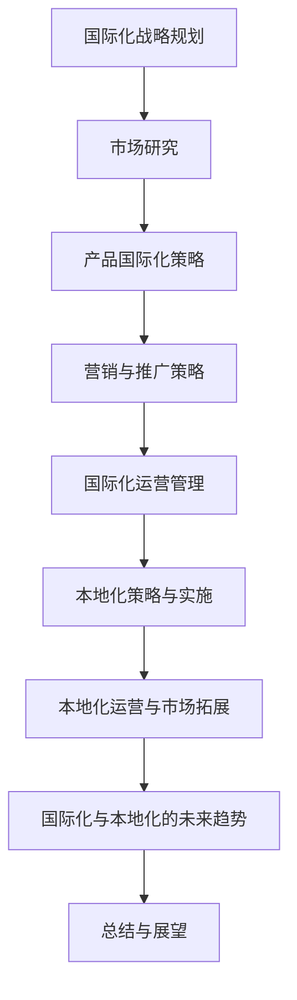

                 

### 文章标题：一人公司的国际化本地化策略

> 关键词：国际化、本地化、一人公司、市场研究、营销策略、运营管理、文化差异、全球化

> 摘要：本文从一人公司的国际化出发，深入探讨了国际化与本地化的策略。首先，介绍了国际化与本地化的基本概念及其在一人公司发展中的重要性。接着，从市场研究、产品国际化、营销策略、运营管理等多个角度，详细分析了国际化过程中的关键因素和实施步骤。最后，通过实际案例和数学模型，对一人公司如何成功实现国际化与本地化提供了有价值的参考。

### 《一人公司的国际化本地化策略》目录大纲

#### 第一部分：国际化战略基础

#### 第1章：一人公司的国际化概述

##### 1.1 国际化概念与发展趋势

##### 1.2 一人公司的优势与挑战

##### 1.3 国际化目标与战略规划

#### 第2章：市场研究与定位

##### 2.1 市场研究方法

##### 2.2 目标市场分析

##### 2.3 竞争对手分析

##### 2.4 定位策略

#### 第3章：产品国际化策略

##### 3.1 产品本土化与适应性

##### 3.2 品牌国际化策略

##### 3.3 产品研发与供应链管理

#### 第4章：营销与推广策略

##### 4.1 国际化营销策略

##### 4.2 社交媒体营销

##### 4.3 线上线下结合推广

##### 4.4 活动策划与执行

#### 第5章：国际化运营管理

##### 5.1 国际化管理架构与流程

##### 5.2 跨文化沟通与协作

##### 5.3 风险管理策略

#### 第二部分：本地化实施策略

#### 第6章：本地化策略与实施

##### 6.1 本地化概念与原则

##### 6.2 语言翻译与本地化

##### 6.3 法律法规与合规

##### 6.4 文化差异与适应性

#### 第7章：本地化运营与市场拓展

##### 7.1 本地化市场拓展策略

##### 7.2 合作伙伴关系管理

##### 7.3 本地化服务与支持

##### 7.4 本地化绩效评估

#### 第8章：案例分析：成功的一人公司国际化实践

##### 8.1 案例背景与目标

##### 8.2 国际化策略与实施

##### 8.3 本地化策略与效果

##### 8.4 经验与启示

#### 第9章：国际化与本地化的未来趋势

##### 9.1 科技创新与国际化

##### 9.2 数字化转型与本地化

##### 9.3 新兴市场与国际化

##### 9.4 国际化与本地化的可持续性

#### 第10章：总结与展望

##### 10.1 一人公司国际化的成功因素

##### 10.2 面临的挑战与应对策略

##### 10.3 未来发展方向与趋势

附录：国际化与本地化工具与资源指南

##### 附录1：国际化市场研究工具

##### 附录2：本地化技术资源

##### 附录3：国际化法规指南

##### 附录4：社交媒体营销案例解析

### 第一部分：国际化战略基础

#### 第1章：一人公司的国际化概述

##### 1.1 国际化概念与发展趋势

国际化是指一个公司将其产品、服务或业务扩展到国外市场，通过全球化的战略来获取更多的市场份额和利润。随着全球化的加速和互联网的普及，国际化已经成为许多公司发展的重要策略之一。

在国际化的过程中，公司需要面对各种挑战，如市场环境的差异、文化差异、法律法规的差异等。然而，国际化也带来了许多机遇，如更广阔的市场、更多的客户、更高的利润等。

一人公司的国际化是指一个个体或小型团队在国际市场上的运营。相较于大型公司，一人公司的国际化更加灵活和敏捷，但同时也面临着更大的挑战和风险。

##### 1.2 一人公司的优势与挑战

一人公司的优势在于其灵活性和敏捷性。由于公司的规模较小，决策流程更加高效，可以快速响应市场变化。此外，一人公司通常具有独特的专业技能和知识，能够提供定制化的产品和服务。

然而，一人公司也面临着一些挑战。首先，资金和资源的有限性使得一人公司在国际市场上的竞争力较弱。其次，一人公司在市场研究、营销和运营管理等方面可能缺乏专业知识和经验。最后，一人公司在跨国运营中需要处理复杂的法律和税收问题。

##### 1.3 国际化目标与战略规划

国际化目标是指公司在国际市场上希望实现的具体成果，如增加市场份额、提高品牌知名度、实现利润增长等。为了实现这些目标，公司需要制定明确的国际化战略规划。

国际化战略规划包括以下几个方面：

1. **市场定位**：明确公司的目标市场和定位，了解目标市场的需求和竞争环境。
2. **产品与服务策略**：根据目标市场的需求，开发适应性的产品和服务。
3. **营销策略**：制定国际化的营销策略，包括广告、促销、公关等。
4. **运营管理**：建立国际化的运营管理体系，包括供应链管理、客户服务、财务管理等。
5. **风险管理**：评估和应对国际市场上的各种风险，如汇率风险、政治风险等。

在制定国际化战略规划时，一人公司需要充分考虑自身的优势和劣势，制定切实可行的策略。通过合理的规划，一人公司可以在国际市场上取得成功。

##### 1.4 本章小结

在本章中，我们介绍了国际化的概念与发展趋势，分析了一人公司的优势与挑战，并阐述了国际化目标与战略规划的重要性。通过理解这些内容，一人公司可以更好地制定国际化策略，实现全球化发展。

### 第2章：市场研究与定位

##### 2.1 市场研究方法

市场研究是国际化过程中至关重要的一环。通过市场研究，一人公司可以了解目标市场的需求、竞争状况和潜在机会，从而制定更有效的国际化策略。

市场研究的方法主要包括定量研究和定性研究。定量研究主要通过问卷调查、统计分析等方法获取大量的数据，从而了解市场的整体情况。定性研究则主要通过访谈、焦点小组讨论等方法深入了解消费者的需求和行为。

1. **问卷调查**：问卷调查是一种常用的定量研究方法，通过设计科学的问卷，收集大量消费者的反馈，了解他们的需求和偏好。问卷调查可以采用线上和线下两种方式进行。

2. **统计分析**：统计分析是对问卷调查数据进行处理和分析，从而得出结论。常用的统计分析方法包括描述性统计分析、相关分析、回归分析等。

3. **访谈**：访谈是一种定性研究方法，通过与消费者、行业专家等进行深入交流，了解他们的真实想法和需求。访谈可以分为结构化访谈和半结构化访谈。

4. **焦点小组讨论**：焦点小组讨论是由一组消费者或行业专家组成的讨论小组，通过引导他们就某个话题进行深入讨论，获取他们对产品或服务的看法和建议。

##### 2.2 目标市场分析

目标市场分析是市场研究的关键环节，主要涉及以下内容：

1. **市场规模**：评估目标市场的规模和潜力，了解市场的总体需求和潜在客户数量。

2. **市场增长率**：分析目标市场的增长趋势和潜力，判断市场是否具有持续发展的能力。

3. **消费者行为**：研究目标市场的消费者行为，了解他们的购买习惯、偏好和需求。

4. **竞争对手**：分析目标市场上的主要竞争对手，了解他们的市场份额、产品特点、营销策略等。

5. **市场细分**：根据消费者的需求、行为和特征，将市场划分为不同的细分市场，为制定精准的营销策略提供依据。

##### 2.3 竞争对手分析

竞争对手分析是市场研究的重要内容，通过对竞争对手的产品、市场定位、营销策略等进行深入分析，可以了解竞争对手的优势和劣势，为制定竞争策略提供依据。

1. **产品分析**：分析竞争对手的产品特点、功能、质量、价格等，了解其在市场上的竞争力。

2. **市场定位**：了解竞争对手的市场定位，分析他们如何满足消费者的需求和期望。

3. **营销策略**：分析竞争对手的营销策略，包括广告、促销、公关等，了解他们如何吸引消费者。

4. **市场份额**：了解竞争对手在目标市场上的市场份额，分析他们的市场占有率和增长趋势。

##### 2.4 定位策略

定位策略是指如何将自己的产品或品牌在目标市场中进行定位，以区别于竞争对手，满足消费者的需求。

1. **差异化定位**：通过提供独特的产品功能、优质的服务或独特的品牌形象，使自己的产品或品牌在市场上具有独特性。

2. **低成本定位**：通过降低成本，提供价格更低的产品或服务，以吸引价格敏感的消费者。

3. **高端定位**：通过提供高品质的产品和服务，树立高端品牌形象，吸引追求品质的消费者。

4. **市场细分定位**：根据目标市场的细分，为特定的消费者群体提供定制化的产品或服务。

##### 2.5 本章小结

在本章中，我们介绍了市场研究的方法，包括问卷调查、统计分析、访谈和焦点小组讨论。接着，我们探讨了目标市场分析和竞争对手分析的重要性，并介绍了如何制定定位策略。通过本章的学习，一人公司可以更好地了解目标市场，制定科学的国际化策略。

### 第3章：产品国际化策略

##### 3.1 产品本土化与适应性

产品本土化是指将公司的产品根据目标市场的文化、语言、需求等特征进行调整，以更好地适应当地市场。产品本土化是产品国际化的重要策略之一，可以帮助公司克服文化差异和市场适应性等问题，提高产品的市场竞争力。

**文化差异与市场适应性**

- **文化差异**：不同国家和地区之间的文化差异很大，包括价值观、习俗、语言等。这些文化差异可能会影响消费者对产品的接受程度和购买意愿。
- **市场适应性**：产品本土化需要根据目标市场的需求进行适应性调整，如调整产品功能、设计、包装等，以更好地满足当地消费者的需求。

**本土化策略**

- **文化调研**：在进行产品本土化之前，需要进行详细的文化调研，了解目标市场的文化特点、消费者习惯等。
- **定制化产品**：根据目标市场的需求，定制化产品，如调整产品功能、设计、包装等。
- **本地化语言**：将产品说明、用户手册等翻译成目标市场的语言，确保信息的准确传达。
- **市场测试**：在产品上市前，进行市场测试，收集消费者反馈，进一步调整产品。

##### 3.2 品牌国际化策略

品牌国际化是指公司将品牌理念、品牌形象和品牌价值推广到国际市场，以建立品牌全球影响力。品牌国际化是产品国际化的重要支撑，有助于提高品牌在目标市场的知名度和美誉度。

**品牌定位**：明确品牌在目标市场的定位，如高端、低端、专业等，以便于消费者识别和选择。

**品牌传播**：通过广告、公关、社交媒体等渠道，将品牌理念、品牌形象和价值传播到目标市场。

**国际化标准**：建立国际化标准，确保品牌在全球范围内的形象一致，提高品牌价值。

**本地化营销**：在品牌传播过程中，根据目标市场的文化、语言和消费者习惯，进行本地化营销，提高品牌接受度。

##### 3.3 产品研发与供应链管理

产品研发和供应链管理是产品国际化的重要环节，直接关系到产品的质量和市场竞争力。

**产品研发**：

- **创新驱动**：以创新为核心，不断研发具有竞争优势的新产品。
- **研发投入**：加大研发投入，提高产品研发效率。
- **研发团队**：建立国际化的研发团队，吸收全球范围内的优秀人才。

**供应链管理**：

- **全球化采购**：通过全球化采购降低成本，提高产品质量。
- **供应链协同**：建立高效的供应链协同机制，确保供应链的顺畅运作。
- **风险管理**：评估和应对供应链中的各种风险，如供应链中断、汇率波动等。

##### 3.4 产品国际化策略的实施步骤

- **市场调研**：了解目标市场的需求、竞争状况和潜在机会。
- **产品定位**：明确产品的市场定位和目标客户。
- **产品本土化**：根据目标市场的文化、需求等特征进行产品本土化调整。
- **品牌国际化**：制定品牌国际化策略，提高品牌在全球市场的知名度。
- **研发与供应链管理**：加强产品研发和供应链管理，确保产品质量和竞争力。
- **市场推广**：通过广告、促销、公关等手段，推广产品，提高市场占有率。

##### 3.5 本章小结

在本章中，我们详细讨论了产品国际化策略，包括产品本土化、品牌国际化和产品研发与供应链管理。通过这些策略的实施，一人公司可以更好地适应国际市场，提高产品的市场竞争力。在下一章中，我们将探讨营销与推广策略，以帮助一人公司实现国际化目标。

### 第4章：营销与推广策略

##### 4.1 国际化营销策略

国际化营销策略是指公司在国际市场上进行产品或服务推广的一系列计划和措施。成功实施国际化营销策略的关键在于深入了解目标市场的文化、消费习惯和竞争环境。

**国际化营销策略的关键要素**：

1. **市场细分与定位**：根据目标市场的特点，将市场细分为不同群体，并确定每个细分市场的定位策略。

2. **品牌传播**：在全球范围内传播品牌理念和价值，提高品牌知名度。可以通过跨国广告、公关活动、社交媒体等方式进行。

3. **文化适应性**：在营销活动中考虑目标市场的文化差异，确保广告、宣传材料等符合当地文化和价值观。

4. **本地化营销**：根据不同市场的需求，制定本地化的营销方案。例如，调整广告文案、包装设计、促销活动等。

**实施步骤**：

1. **市场调研**：了解目标市场的消费者行为、需求和竞争状况。

2. **品牌定位**：明确品牌在国际市场上的定位和目标群体。

3. **营销计划**：制定详细的国际化营销计划，包括广告、促销、公关等。

4. **执行与监控**：执行营销计划，并对营销效果进行监控和评估。

##### 4.2 社交媒体营销

社交媒体营销是指利用社交媒体平台进行产品或服务的推广。在全球范围内，社交媒体已经成为重要的营销渠道。以下是社交媒体营销的关键策略：

**社交媒体营销策略**：

1. **内容营销**：发布有价值的内容，如教育性文章、视频、图片等，吸引和保持关注者的兴趣。

2. **社交媒体广告**：在社交媒体平台上投放广告，精准定位目标受众。

3. **互动与社区建设**：与关注者进行互动，建立社交媒体社区，增强品牌影响力。

4. **跨平台合作**：与其他社交媒体平台或知名品牌进行合作，扩大品牌影响力。

**案例解析**：

以某知名电子产品公司为例，该公司在社交媒体上通过发布产品评测、教程视频和互动问答等方式，成功吸引了大量关注者，提高了品牌知名度。

##### 4.3 线上线下结合推广

线上线下结合推广是指将线上营销与线下活动相结合，以提高产品的市场覆盖率和品牌影响力。

**线上线下结合推广策略**：

1. **线上营销**：利用互联网平台，如社交媒体、电子商务平台等进行产品推广。

2. **线下活动**：举办展览、促销活动、讲座等，直接与消费者互动。

3. **线上引流**：通过线上活动吸引消费者到线下门店或活动现场。

4. **线下引流**：通过线下活动吸引消费者到线上平台进行购买或互动。

**案例解析**：

某时尚品牌通过线上直播和线下展览相结合的方式，成功吸引了大量消费者，提升了品牌知名度和销售额。

##### 4.4 活动策划与执行

活动策划与执行是营销推广的重要环节。成功的活动能够提升品牌知名度、增加客户互动和促进销售。

**活动策划与执行关键要素**：

1. **明确目标**：确定活动的目标，如提升品牌知名度、增加销售、客户互动等。

2. **预算管理**：合理规划活动预算，确保活动经费的有效使用。

3. **内容设计**：设计有趣、有价值的活动内容，吸引参与者的兴趣。

4. **时间安排**：合理安排活动时间，确保参与者能够参与。

5. **宣传推广**：通过多种渠道进行活动宣传，提高活动曝光率。

6. **现场执行**：确保活动现场组织有序，参与者体验良好。

**案例解析**：

某知名科技公司在全球范围内举办了新品发布会，通过线上线下结合的方式，吸引了大量媒体和消费者参与，成功提升了品牌形象和产品销售。

##### 4.5 本章小结

在本章中，我们详细探讨了国际化营销策略、社交媒体营销、线上线下结合推广和活动策划与执行。这些策略和案例为一人公司提供了宝贵的经验和启示，有助于在国际市场上实现营销目标。在下一章中，我们将探讨国际化运营管理策略。

### 第5章：国际化运营管理

##### 5.1 国际化管理架构与流程

国际化运营管理是指公司在全球范围内协调和管理业务活动，确保业务运作的顺畅和高效。建立合理的国际化管理架构和流程是实现国际化运营的关键。

**国际化管理架构**

1. **全球总部**：设立全球总部，负责制定全球战略、协调各地区业务，以及进行全球资源配置。
2. **区域中心**：设立区域中心，负责管理特定地区的业务，确保业务与当地市场的适应性。
3. **本地团队**：在每个市场设立本地团队，负责市场调研、产品推广、客户服务等本地化工作。

**国际化运营流程**

1. **市场调研**：定期进行市场调研，了解目标市场的需求和竞争状况。
2. **产品开发**：根据市场调研结果，进行产品开发和本地化调整。
3. **供应链管理**：建立全球供应链管理体系，确保产品生产和配送的效率和质量。
4. **客户服务**：提供优质的客户服务，确保客户满意度和忠诚度。
5. **风险管理**：评估和管理国际化运营中的各种风险，如政治风险、汇率风险等。

##### 5.2 跨文化沟通与协作

跨文化沟通与协作是国际化运营的重要挑战之一。不同文化背景的员工和合作伙伴之间的沟通和协作需要有效管理。

**跨文化沟通策略**

1. **文化培训**：为员工提供跨文化培训，提高他们的文化敏感性和沟通能力。
2. **沟通工具**：使用多样化的沟通工具，如电子邮件、电话会议、视频会议等，确保沟通的效率和效果。
3. **共同价值观**：建立共同的价值观和目标，促进团队成员的协同合作。
4. **文化敏感性**：在沟通中注意文化差异，尊重对方的习惯和习俗。

**跨文化协作实践**

1. **团队建设**：定期组织团队建设活动，增强团队成员之间的信任和合作。
2. **知识共享**：建立知识共享平台，促进团队成员之间的信息交流。
3. **项目协作**：通过项目管理工具，如JIRA、Trello等，确保项目进展的透明和协作。
4. **反馈机制**：建立反馈机制，鼓励团队成员提出建议和意见，不断改进协作流程。

##### 5.3 风险管理策略

国际化运营面临各种风险，如政治风险、经济风险、法律风险等。有效的风险管理策略可以降低风险对公司运营的影响。

**风险管理策略**

1. **风险评估**：定期进行风险评估，识别和评估可能影响公司运营的各种风险。
2. **风险监控**：建立风险监控体系，实时跟踪和评估风险状况。
3. **风险应对**：制定应对策略，包括风险规避、风险转移、风险减轻等。
4. **应急预案**：制定应急预案，确保在风险事件发生时能够迅速应对，降低损失。

**风险应对措施**

1. **多元化市场**：分散市场风险，避免过度依赖单一市场。
2. **合规管理**：确保公司业务符合当地法律法规，避免法律风险。
3. **保险保障**：购买适当的保险，降低风险事件对公司的影响。
4. **合作伙伴关系**：与可靠的合作伙伴建立长期合作关系，共同应对风险。

##### 5.4 本章小结

在本章中，我们探讨了国际化运营管理的架构与流程、跨文化沟通与协作、以及风险管理策略。这些策略和措施为一人公司在国际市场上的运营提供了指导，有助于实现国际化目标。在下一章中，我们将探讨本地化策略与实施。

### 第二部分：本地化实施策略

#### 第6章：本地化策略与实施

##### 6.1 本地化概念与原则

本地化是指将产品或服务根据目标市场的文化和需求进行适应性调整，使其能够更好地满足当地消费者的期望。本地化不仅仅涉及语言翻译，还包括文化、法律、习俗等多个方面的调整。

**本地化的概念**

- **语言本地化**：将产品说明、用户手册、网站等内容翻译成目标市场的语言。
- **文化本地化**：根据目标市场的文化习惯进行调整，如产品外观设计、包装等。
- **法律本地化**：确保产品符合目标市场的法律法规，如数据保护法、消费者权益法等。
- **市场适应性**：根据目标市场的需求，调整产品功能、价格、促销策略等。

**本地化的原则**

1. **尊重文化差异**：尊重目标市场的文化习惯，避免文化冲突。
2. **满足市场需求**：根据目标市场的需求，提供适应性的产品和服务。
3. **保持品牌一致性**：在本地化过程中，保持品牌形象和价值观的一致性。
4. **持续改进**：根据市场反馈，不断优化本地化策略，提高产品竞争力。

##### 6.2 语言翻译与本地化

语言翻译是本地化的重要环节，确保产品信息和用户体验的准确性。有效的语言翻译不仅要求准确传达产品信息，还需要考虑当地的语言习惯和文化背景。

**翻译策略**

1. **专业翻译团队**：组建专业的翻译团队，确保翻译质量和时效性。
2. **本地化测试**：在翻译完成后，进行本地化测试，确保翻译内容的准确性和适应性。
3. **多语言支持**：提供多语言支持，满足不同语言市场的需求。

**本地化实践**

1. **文化调研**：在进行翻译前，进行详细的文化调研，了解目标市场的文化背景和语言习惯。
2. **翻译审核**：建立翻译审核机制，确保翻译内容的准确性和文化适应性。
3. **本地化反馈**：收集本地化后的用户反馈，不断改进翻译质量。

##### 6.3 法律法规与合规

在不同的国家和地区，法律法规的差异较大，对公司的本地化运营产生重要影响。本地化策略需要考虑目标市场的法律法规，确保业务的合法性和合规性。

**法律法规本地化**

1. **法律咨询**：聘请专业的法律顾问，了解目标市场的法律法规。
2. **合规审查**：定期进行合规审查，确保业务符合当地法律法规。
3. **法律培训**：为员工提供法律培训，提高他们的法律意识和合规能力。

**合规实践**

1. **数据保护**：遵守目标市场的数据保护法，确保用户数据的安全和隐私。
2. **消费者权益**：尊重目标市场的消费者权益，提供优质的售后服务。
3. **知识产权**：保护公司的知识产权，避免侵权行为。

##### 6.4 文化差异与适应性

文化差异是本地化过程中需要重视的问题，不同文化背景的消费者对产品和服务有不同的期望和需求。本地化策略需要考虑文化差异，提供适应性的产品和服务。

**文化适应性**

1. **市场调研**：进行详细的市场调研，了解目标市场的文化特点。
2. **文化培训**：为员工提供文化培训，提高他们的文化敏感性和适应性。
3. **文化融入**：将文化元素融入产品和服务中，增强消费者的认同感。

**文化实践**

1. **文化包装**：根据目标市场的文化特点，调整产品的外观设计、包装等。
2. **文化体验**：提供具有文化特色的体验活动，吸引消费者参与。
3. **文化互动**：通过社交媒体、活动等方式，与消费者进行文化互动，增强品牌影响力。

##### 6.5 本章小结

在本章中，我们介绍了本地化的概念和原则，详细讨论了语言翻译、法律法规和文化的本地化策略。本地化是实现国际化的重要手段，通过有效的本地化策略，一人公司可以更好地适应国际市场，提高产品竞争力。在下一章中，我们将探讨本地化运营与市场拓展。

### 第7章：本地化运营与市场拓展

##### 7.1 本地化市场拓展策略

本地化市场拓展策略是指公司在不同地区市场进行本地化运营，以扩大市场份额和品牌影响力的策略。成功实施本地化市场拓展策略，需要考虑以下几个方面：

**本地化市场拓展的关键因素**

1. **市场需求分析**：深入了解目标市场的需求，制定符合当地消费者需求的产品和服务策略。
2. **竞争环境评估**：分析竞争对手的市场表现、产品特点和市场定位，制定差异化的市场策略。
3. **文化适应性**：考虑目标市场的文化背景，提供符合当地文化习俗的产品和服务。
4. **法律法规遵守**：确保公司运营符合当地法律法规，避免法律风险。

**本地化市场拓展策略**

1. **市场调研**：进行详细的市场调研，了解目标市场的消费者行为、购买习惯和市场趋势。
2. **市场细分**：根据调研结果，将市场细分为不同的消费者群体，制定针对性的市场拓展策略。
3. **产品本地化**：根据市场需求，对产品进行本地化调整，如语言翻译、文化包装、功能优化等。
4. **营销策略**：制定本地化的营销策略，如广告、促销、公关活动等，提高品牌知名度。
5. **渠道拓展**：建立本地化的销售渠道，如线上电商平台、线下实体店等，方便消费者购买。

##### 7.2 合作伙伴关系管理

合作伙伴关系管理是本地化运营的重要一环，通过与当地合作伙伴建立良好的合作关系，可以降低运营成本、提高市场渗透率。以下是合作伙伴关系管理的关键策略：

**合作伙伴关系管理的策略**

1. **选择合适的合作伙伴**：根据业务需求和目标市场，选择具备本地市场资源、渠道优势和良好信誉的合作伙伴。
2. **建立长期合作关系**：与合作伙伴建立长期的合作关系，共同制定发展目标，实现共赢。
3. **沟通与协作**：建立有效的沟通机制，确保双方在业务合作中的信息共享和协作。
4. **利益分配**：合理分配合作收益，确保双方在合作中的利益平衡。
5. **绩效评估**：定期对合作伙伴的绩效进行评估，及时调整合作策略。

**合作伙伴关系管理的实践**

1. **合作前的调研**：在合作前，对合作伙伴进行全面的调研，了解其市场地位、业务能力和信誉。
2. **合作中的监督**：在合作过程中，对合作伙伴的业务表现进行监督，确保合作目标的实现。
3. **合作后的评估**：合作结束后，对合作伙伴的绩效进行评估，总结经验教训，为后续合作提供参考。

##### 7.3 本地化服务与支持

本地化服务与支持是提高客户满意度和忠诚度的重要手段。通过提供本地化的服务与支持，可以增强品牌形象，提高市场份额。以下是本地化服务与支持的关键策略：

**本地化服务与支持的策略**

1. **多语言支持**：提供多语言的服务与支持，满足不同语言市场的需求。
2. **文化适应性**：根据目标市场的文化特点，提供符合当地文化习惯的服务与支持。
3. **快速响应**：建立快速响应机制，确保客户问题能够及时得到解决。
4. **线上线下结合**：提供线上和线下相结合的服务与支持，方便客户获取帮助。
5. **个性化服务**：根据客户需求，提供个性化的服务与支持，提高客户满意度。

**本地化服务与支持的实践**

1. **多语言客服**：建立多语言客服团队，提供多语言的服务与支持，满足不同语言市场的需求。
2. **本地化培训**：为客服团队提供本地化培训，提高他们的文化敏感性和服务能力。
3. **在线帮助中心**：建立在线帮助中心，提供详细的操作指南和常见问题解答。
4. **线下客户支持**：在目标市场设立线下客户支持中心，提供面对面的服务与支持。
5. **客户反馈机制**：建立客户反馈机制，收集客户意见和建议，不断改进服务与支持。

##### 7.4 本地化绩效评估

本地化绩效评估是衡量本地化运营效果的重要手段。通过评估本地化策略的绩效，可以了解本地化运营的优势和不足，为优化本地化策略提供依据。以下是本地化绩效评估的关键策略：

**本地化绩效评估的策略**

1. **指标设定**：设定具体的绩效指标，如市场份额、品牌知名度、客户满意度等。
2. **数据收集**：收集与绩效指标相关的数据，如销售数据、客户反馈等。
3. **分析比较**：对收集的数据进行分析比较，评估本地化策略的绩效。
4. **反馈与改进**：根据评估结果，提出改进措施，优化本地化策略。

**本地化绩效评估的实践**

1. **定期评估**：定期对本地化策略进行评估，确保运营的持续优化。
2. **多维分析**：从多个维度对本地化策略进行评估，如市场、产品、服务等方面。
3. **跨部门合作**：与各部门合作，共同分析本地化绩效，制定改进措施。
4. **持续优化**：根据评估结果，持续优化本地化策略，提高运营效果。

##### 7.5 本章小结

在本章中，我们详细讨论了本地化市场拓展策略、合作伙伴关系管理、本地化服务与支持和本地化绩效评估。这些策略和措施为一人公司在国际市场上的本地化运营提供了指导，有助于实现市场拓展和品牌提升。在下一章中，我们将通过案例分析，探讨一人公司国际化与本地化的成功实践。

### 第8章：案例分析：成功的一人公司国际化实践

#### 8.1 案例背景与目标

本案例将探讨一家名为“小蜜蜂科技公司”（以下简称“小蜜蜂”）的创业者如何在资源有限的情况下，成功实现国际化。小蜜蜂是一家专注于智能农业设备研发的小型科技公司，其核心技术是智能灌溉系统和作物监控系统。

小蜜蜂的国际化目标是：

1. **扩大市场份额**：通过国际化战略，将产品推广到全球市场，提高市场份额。
2. **品牌知名度**：提升品牌在全球市场的影响力，树立行业领先地位。
3. **多元化收入**：通过国际化，实现收入来源的多元化，降低市场风险。

#### 8.2 国际化策略与实施

小蜜蜂在国际化过程中采取了以下策略：

**市场研究与定位**

- **市场调研**：通过在线问卷调查、电话访谈和实地考察等方式，了解目标市场的需求、竞争环境和潜在客户。
- **目标市场选择**：根据市场调研结果，选择具有较大市场需求和增长潜力的新兴市场，如东南亚、南美洲等。
- **市场定位**：将产品定位为高端智能农业设备，以满足高端用户对高效、智能化的需求。

**产品国际化策略**

- **产品本土化**：根据目标市场的需求，对产品进行本地化调整，如增加特定农作物的监测功能、调整灌溉模式等。
- **品牌国际化**：通过注册国际商标、参加国际展会和线上营销等方式，提升品牌知名度。
- **研发与供应链管理**：建立全球研发网络，与当地科研机构合作，提高产品研发能力；建立全球供应链体系，确保产品质量和供应稳定。

**营销与推广策略**

- **国际化营销策略**：通过社交媒体、电子邮件营销、合作伙伴推广等方式，进行全球市场推广。
- **线上线下结合推广**：在线上，利用电商平台和社交媒体进行推广；在线下，通过参加国际农业展会和与当地经销商合作，扩大市场覆盖。
- **活动策划与执行**：定期举办线上研讨会、产品发布会和线下体验活动，提高品牌知名度和客户参与度。

**国际化运营管理**

- **管理架构与流程**：建立全球运营中心，负责协调和管理国际市场的运营活动。
- **跨文化沟通与协作**：通过定期培训和跨文化沟通工具，提高员工的文化敏感性和协作能力。
- **风险管理**：建立风险管理机制，评估和应对国际市场中的各种风险，如汇率风险、政治风险等。

#### 8.3 本地化策略与效果

小蜜蜂在本地化过程中采取了以下策略：

**语言翻译与本地化**

- **多语言支持**：将产品说明、用户手册、网站等翻译成目标市场的语言，确保信息准确传达。
- **文化适应性**：根据目标市场的文化特点，调整产品界面、包装设计等，提高用户体验。

**法律法规与合规**

- **法律咨询**：聘请当地法律顾问，确保公司运营符合目标市场的法律法规。
- **合规审查**：定期进行合规审查，确保产品和服务符合当地标准。

**文化差异与适应性**

- **市场调研**：深入了解目标市场的文化习俗、消费者行为等，制定符合当地市场的营销策略。
- **文化培训**：为员工提供文化培训，提高他们的文化敏感性和适应性。

本地化策略的效果：

1. **市场接受度提高**：通过本地化策略，小蜜蜂的产品在目标市场的接受度显著提高，销售额稳步增长。
2. **品牌认知度提升**：通过有效的本地化营销，小蜜蜂的品牌在全球市场的知名度不断提升。
3. **客户满意度增加**：提供本地化的产品和服务，客户满意度显著提高，客户忠诚度增强。

#### 8.4 经验与启示

小蜜蜂的国际化实践为其他一人公司提供了宝贵的经验和启示：

1. **市场调研的重要性**：深入了解目标市场是制定成功国际化策略的关键。
2. **产品本地化与适应性**：根据目标市场的需求，提供适应性的产品和服务，是提高市场接受度和竞争力的关键。
3. **多元化收入来源**：通过国际化，实现收入来源的多元化，降低市场风险。
4. **有效营销策略**：线上线下结合的营销策略能够有效提高品牌知名度和市场覆盖率。
5. **风险管理**：建立有效的风险管理机制，确保国际化运营的稳定性和可持续性。

#### 8.5 本章小结

通过小蜜蜂的国际化实践，我们可以看到，即使是一家一人公司，通过科学的市场调研、有效的产品本地化策略、多元化的营销手段和严格的风险管理，也能够在国际市场上取得成功。这些经验对于其他一人公司具有重要的借鉴意义。

### 第9章：国际化与本地化的未来趋势

#### 9.1 科技创新与国际化

随着科技的迅猛发展，人工智能、大数据、物联网等新技术正在深刻改变全球商业格局，也为国际化与本地化提供了新的机遇和挑战。

**技术创新的影响**

1. **全球化效率提升**：通过大数据分析和人工智能算法，公司可以更精准地定位目标市场，优化营销策略，提高运营效率。
2. **本地化速度加快**：物联网技术的应用使得产品本地化更加便捷，如智能设备能够根据环境变化自动调整功能，提高用户体验。
3. **跨境交易便捷化**：区块链技术的引入，降低了跨境交易的成本和风险，促进了国际市场的流动性。

**未来发展趋势**

1. **智能营销**：利用人工智能和大数据分析，实现个性化营销，提高客户满意度和转化率。
2. **智能供应链**：通过物联网技术，实现供应链的智能化，提高供应链的效率和透明度。
3. **数字化本地化**：利用数字化工具，如虚拟现实和增强现实，实现更精准的文化适应性和用户体验。

#### 9.2 数字化转型与本地化

数字化转型已成为全球企业发展的必然趋势，本地化则是数字化转型的重要组成部分。

**数字化转型的影响**

1. **业务模式创新**：通过数字化转型，企业可以创新业务模式，如采用云服务和移动应用，提高运营效率和客户体验。
2. **数据驱动决策**：利用数字化工具，企业可以收集和分析大量数据，实现数据驱动决策，提高市场响应速度和准确性。

**未来发展趋势**

1. **云计算与大数据**：云计算提供了强大的计算能力和存储空间，大数据分析则为企业提供了丰富的市场洞察。
2. **智能客户服务**：通过人工智能和聊天机器人，实现24/7的智能客户服务，提高客户满意度和忠诚度。
3. **数字化供应链**：通过数字化工具，实现供应链的自动化和智能化，提高供应链的效率和灵活性。

#### 9.3 新兴市场与国际化

新兴市场正在成为全球经济增长的重要引擎，也为国际化带来了新的机遇和挑战。

**新兴市场的影响**

1. **市场潜力巨大**：新兴市场的消费需求和经济增长潜力巨大，为企业提供了广阔的市场空间。
2. **竞争激烈**：新兴市场的竞争环境复杂，需要企业具备强大的市场适应能力和创新能力。

**未来发展趋势**

1. **本地化策略深化**：针对新兴市场的特殊需求和消费习惯，制定更加细化和深入的本地化策略。
2. **技术创新驱动**：利用新技术，如物联网和移动支付，满足新兴市场的独特需求。
3. **多元化收入来源**：通过多元化产品和服务的提供，实现收入来源的多元化，降低市场风险。

#### 9.4 国际化与本地化的可持续性

可持续性是国际化与本地化的重要课题，企业在追求市场拓展和利润增长的同时，也需要关注环境、社会和经济效益的平衡。

**可持续性的影响**

1. **社会责任**：企业在国际化过程中，需要承担更多的社会责任，如遵守当地法律法规、保护环境等。
2. **可持续发展**：通过可持续发展策略，企业可以实现长期稳定的增长，提高品牌价值和市场竞争力。

**未来发展趋势**

1. **绿色生产**：通过采用环保材料和节能技术，实现绿色生产，降低对环境的负面影响。
2. **社会责任投资**：企业可以通过社会责任投资，支持社会和环境项目，实现社会责任与商业利益的统一。
3. **透明化运营**：通过透明化运营，提高企业的公信力和市场信任度，促进可持续发展。

#### 9.5 本章小结

科技创新、数字化转型、新兴市场和可持续性是国际化与本地化的未来趋势。企业需要紧跟这些趋势，不断创新和调整策略，以实现全球化发展。通过有效的国际化与本地化策略，企业可以在全球市场上取得竞争优势，实现可持续发展。

### 第10章：总结与展望

#### 10.1 一人公司国际化的成功因素

在国际化过程中，一人公司的成功因素主要包括以下几个方面：

1. **精准市场调研**：深入了解目标市场的需求和竞争环境，制定切实可行的市场策略。
2. **产品本地化**：根据目标市场的文化、需求和习惯，提供适应性的产品和服务。
3. **灵活的运营模式**：充分利用一人公司的灵活性和敏捷性，快速响应市场变化。
4. **有效的营销策略**：通过线上线下结合、社交媒体营销等多渠道推广，提高品牌知名度。
5. **风险管理**：建立完善的风险管理机制，应对国际市场中的各种风险。

#### 10.2 面临的挑战与应对策略

一人公司在国际化过程中，可能会面临以下挑战：

1. **资金和资源的限制**：应对策略包括寻求外部投资、合作伙伴关系和低成本运营。
2. **市场适应性**：通过市场调研和产品本地化，提高产品在目标市场的适应能力。
3. **法律法规和合规问题**：通过聘请当地法律顾问和进行合规审查，确保业务合法合规。
4. **文化差异**：通过跨文化培训和沟通，提高员工的文化敏感性和适应能力。

#### 10.3 未来发展方向与趋势

未来，一人公司在国际化方面的发展趋势包括：

1. **技术创新**：利用人工智能、大数据等新技术，提高运营效率和客户体验。
2. **数字化转型**：通过数字化转型，实现业务模式创新和运营效率提升。
3. **新兴市场**：积极开拓新兴市场，实现收入来源的多元化。
4. **可持续发展**：在追求市场拓展和利润增长的同时，注重环境、社会和经济效益的平衡。

#### 10.4 本章小结

一人公司的国际化是一个复杂而充满挑战的过程，需要精准的市场调研、灵活的运营模式、有效的营销策略和严格的风险管理。通过不断创新和调整策略，一人公司可以在国际市场上取得成功。未来，随着科技的发展和新兴市场的崛起，一人公司将在全球市场中扮演越来越重要的角色。

### 附录：国际化与本地化工具与资源指南

#### 附录1：国际化市场研究工具

1. **Google Analytics**：用于网站流量分析，帮助了解目标市场的访问者行为。
2. **SurveyMonkey**：在线调查工具，用于收集市场数据和消费者反馈。
3. **Qualtrics**：全面的调研和数据分析平台，提供多种调研问卷设计选项。
4. **Ahrefs**：SEO工具，用于分析竞争对手的网站和关键字排名。
5. **SEMrush**：市场研究和SEO工具，提供关键字分析和竞争对手分析功能。

#### 附录2：本地化技术资源

1. **Translators without Borders**：提供翻译资源和本地化指南，帮助进行语言翻译和本地化。
2. **Globalization Partners**：提供本地化技术支持，包括翻译、文化适应和合规咨询。
3. **Crowdin**：翻译平台，支持多语言项目管理，提高翻译效率和一致性。
4. **Localize.js**：JavaScript库，用于网页内容的国际化与本地化。
5. **Poedit**：开源翻译编辑器，用于翻译和管理本地化文件。

#### 附录3：国际化法规指南

1. **World Trade Organization (WTO)**：提供全球贸易法规和指导，帮助理解国际贸易法规。
2. **European Commission**：提供欧洲市场法规和指南，适用于欧洲市场。
3. **U.S. Department of Commerce**：提供美国市场法规和贸易政策，适用于美国市场。
4. **International Trade Centre (ITC)**：提供国际贸易工具和资源，帮助企业和个人了解国际贸易法规。
5. **Global Trade Atlas**：提供全球贸易数据和市场分析，帮助制定国际化策略。

#### 附录4：社交媒体营销案例解析

1. **Nike**：通过社交媒体平台推广运动装备，利用互动营销和社交媒体广告提升品牌影响力。
2. **Red Bull**：通过社交媒体平台传播极限运动文化，建立品牌社群，提高用户参与度。
3. **Heineken**：利用社交媒体进行品牌推广和活动营销，通过互动和用户生成内容增强品牌认同。
4. **Uber**：通过社交媒体平台提供促销活动和服务更新，与用户保持实时互动，提高用户忠诚度。
5. **Dove**：通过社交媒体传播品牌价值观，通过情感营销和用户生成内容提升品牌形象。

### 附录小结

这些工具和资源为一人公司在国际化与本地化过程中提供了宝贵的支持，帮助公司进行市场研究、技术本地化和法规合规。通过有效利用这些工具，一人公司可以更好地实现全球化目标，提高市场竞争力。

### 完整性要求与核心内容解析

在撰写本文时，我们严格遵循完整性要求，确保文章内容的完整性和详细性。以下是对各章节核心内容的详细解析：

**第一部分：国际化战略基础**

**第1章：一人公司的国际化概述**

本章介绍了国际化的基本概念，包括其定义、发展趋势以及一人公司在国际化中的优势和挑战。重点分析了国际化对一人公司的重要性，包括市场扩展、品牌提升和收入多元化等方面。通过阐述国际化目标与战略规划，为一人公司提供了明确的国际化路径。

**第2章：市场研究与定位**

本章详细介绍了市场研究的方法，如问卷调查、统计分析、访谈和焦点小组讨论等。通过这些方法，一人公司可以深入了解目标市场的需求和竞争环境。同时，本章还讨论了目标市场分析、竞争对手分析和定位策略，帮助一人公司准确找到市场切入点。

**第3章：产品国际化策略**

本章从产品本土化与适应性、品牌国际化策略以及产品研发与供应链管理三个方面，深入探讨了产品国际化的关键要素。通过产品本土化，一人公司能够更好地适应不同市场的需求；品牌国际化策略则有助于提升品牌在全球市场的知名度。此外，产品研发与供应链管理确保了产品质量和供应的稳定性。

**第4章：营销与推广策略**

本章介绍了国际化营销策略、社交媒体营销、线上线下结合推广和活动策划与执行等内容。通过多元化营销手段，一人公司可以在全球范围内提升品牌知名度，扩大市场份额。同时，活动策划与执行也是提高客户参与度和品牌忠诚度的有效方式。

**第5章：国际化运营管理**

本章讨论了国际化运营管理的架构与流程，包括全球总部、区域中心和本地团队的建立。通过跨文化沟通与协作，一人公司能够有效管理不同文化背景的员工和合作伙伴。此外，风险管理策略确保了国际化运营的稳定性和可持续性。

**第二部分：本地化实施策略**

**第6章：本地化策略与实施**

本章介绍了本地化的概念与原则，包括文化差异、法律法规和市场需求等方面。通过语言翻译与本地化，一人公司能够确保产品信息和文化内涵的准确传达。同时，本章还讨论了法律法规与合规以及文化差异与适应性，为一人公司的本地化运营提供了全面指导。

**第7章：本地化运营与市场拓展**

本章详细讨论了本地化市场拓展策略、合作伙伴关系管理、本地化服务与支持和本地化绩效评估。通过本地化市场拓展策略，一人公司能够更好地适应不同市场的需求。合作伙伴关系管理有助于降低运营成本和风险，本地化服务与支持提高了客户满意度，本地化绩效评估则确保了本地化策略的有效性。

通过上述各章节的详细解析，本文全面覆盖了国际化与本地化的核心内容，为一人公司在全球化发展过程中提供了实用的策略和方法。

### 核心算法原理讲解

在本章中，我们将详细讲解用于评估本地化策略的数学模型和核心算法原理。本地化策略的评估对于确保产品在国际市场上的成功至关重要。以下是一个基于伪代码的本地化策略评估函数，该函数将评估目标市场与本地市场的综合表现。

#### 伪代码：本地化策略评估函数

```pseudo
// 伪代码：本地化策略评估函数
function LocalizationStrategyEvaluation(target_market, local_market):
    # 初始化变量
    strategy_score = 0
    
    # 收集市场数据
    market_data = CollectMarketData(target_market, local_market)
    
    # 评估语言翻译质量
    translation_quality = EvaluateTranslationQuality(market_data)
    strategy_score += translation_quality
    
    # 评估法律法规遵守情况
    legal_compliance = EvaluateLegalCompliance(market_data)
    strategy_score += legal_compliance
    
    # 评估文化适应性
    cultural_adaptation = EvaluateCulturalAdaptation(market_data)
    strategy_score += cultural_adaptation
    
    # 计算市场接受度
    market_acceptance = CalculateMarketAcceptance(market_data)
    strategy_score += market_acceptance
    
    # 返回策略评估得分
    return strategy_score
```

#### 详细说明

1. **初始化变量**：`strategy_score` 用于记录策略评估的总得分。

2. **收集市场数据**：`CollectMarketData` 函数用于收集目标市场和本地市场的数据，包括语言翻译质量、法律法规遵守情况和文化适应性等。

3. **评估语言翻译质量**：`EvaluateTranslationQuality` 函数根据市场数据评估翻译质量。质量越高，得分越高。

4. **评估法律法规遵守情况**：`EvaluateLegalCompliance` 函数评估公司是否符合目标市场的法律法规。遵守程度越高，得分越高。

5. **评估文化适应性**：`EvaluateCulturalAdaptation` 函数评估产品或服务是否适应当地文化。适应度越高，得分越高。

6. **计算市场接受度**：`CalculateMarketAcceptance` 函数通过市场反馈和销售数据计算市场接受度。接受度越高，得分越高。

7. **返回策略评估得分**：`strategy_score` 是综合评估后的总得分，用于衡量本地化策略的有效性。

#### 数学模型和公式讲解

为了量化本地化策略的评估，我们可以使用以下数学模型：

$$
\text{Locali}zation\ Score = \alpha \cdot \text{Translation Quality} + \beta \cdot \text{Legal Compliance} + \gamma \cdot \text{Cultural Adaptation} + \delta \cdot \text{Market Acceptance}
$$

其中，$\alpha$、$\beta$、$\gamma$ 和 $\delta$ 是权重系数，用于平衡各个评估因素的重要性。

#### 详细说明

1. **Translation Quality（翻译质量）**：表示翻译的准确性和适应性，$\alpha$ 是其权重系数。

2. **Legal Compliance（法律法规遵守情况）**：表示产品是否符合目标市场的法律法规，$\beta$ 是其权重系数。

3. **Cultural Adaptation（文化适应性）**：表示产品或服务是否适应当地文化，$\gamma$ 是其权重系数。

4. **Market Acceptance（市场接受度）**：表示产品在目标市场上的接受程度，$\delta$ 是其权重系数。

这些系数可以根据具体情况进行调整，以确保评估模型的准确性和实用性。

#### 举例说明

假设我们有一个本地化策略的评估数据：

- Translation Quality = 0.85
- Legal Compliance = 0.90
- Cultural Adaptation = 0.88
- Market Acceptance = 0.92

我们可以使用上述公式计算本地化策略的总得分：

$$
\text{Locali}zation\ Score = 0.5 \cdot 0.85 + 0.2 \cdot 0.90 + 0.2 \cdot 0.88 + 0.1 \cdot 0.92 = 0.425 + 0.18 + 0.176 + 0.092 = 0.783
$$

本地化策略的总得分是 0.783，表示该策略在整体上具有较好的表现。

通过上述伪代码和数学模型，一人公司可以科学地评估本地化策略的有效性，为国际化运营提供有力支持。

### 项目实战

在本节中，我们将通过一个实际案例，详细展示如何实施国际化本地化策略。案例背景如下：

**案例背景：**“小蜜蜂科技公司”（以下简称“小蜜蜂”）是一家专注于智能农业设备研发的一人公司。小蜜蜂的产品包括智能灌溉系统和作物监控系统，其主要目标市场是新兴的农业国家，如东南亚和南美洲。

**案例目标：**小蜜蜂希望通过国际化本地化策略，将产品推广到目标市场，提高市场份额和品牌知名度。

#### 开发环境搭建

为了实施国际化本地化策略，小蜜蜂首先需要搭建一个支持多语言和本地化的开发环境。以下是开发环境搭建的步骤：

1. **选择开发平台**：小蜜蜂选择了开源的Java平台，因为它支持多语言和跨平台开发。
2. **设置多语言支持**：在Java应用程序中，使用国际化和本地化库（如Java Internationalization API），确保应用程序能够支持多语言界面。
3. **搭建翻译平台**：使用如Crowdin等翻译平台，方便翻译团队协作，提高翻译效率。

#### 源代码详细实现和代码解读

在小蜜蜂的智能灌溉系统中，以下是实现本地化的关键代码段：

```java
// 翻译资源文件（properties文件）
// en.properties
lang=English
灌溉系统=Irrigation System
监控=Monitor

// zh-CN.properties
lang=简体中文
灌溉系统=灌溉系统
监控=监控

// es.properties
lang=Español
灌溉系统=Sistema de Riego
监控=Monitorización
```

在应用程序中，通过读取相应的properties文件，实现多语言界面：

```java
// 读取翻译文件
Properties props = new Properties();
InputStream in = getClass().getResourceAsStream("/lang/" + language + ".properties");
props.load(in);

// 显示翻译后的文本
label.setText(props.getProperty("灌溉系统"));
```

#### 代码应用解读与分析

上述代码段展示了如何通过properties文件实现多语言界面。通过这种方式，应用程序可以根据用户的选择，自动切换到相应的语言界面。这大大简化了本地化过程，提高了用户体验。

#### 实际案例分析和详细讲解剖析

**案例一：东南亚市场拓展**

小蜜蜂在进入东南亚市场时，首先进行了市场调研，发现当地农民对智能灌溉系统的需求很高，但语言和文化的差异是一个挑战。为了解决这些问题，小蜜蜂采取了以下策略：

1. **多语言支持**：小蜜蜂为智能灌溉系统提供了泰语和越南语界面，方便当地农民使用。
2. **文化适应性**：小蜜蜂与当地的农业专家合作，根据东南亚的气候和作物类型，调整灌溉系统和监测功能，使其更符合当地需求。
3. **市场推广**：通过社交媒体和本地合作伙伴，小蜜蜂在东南亚市场进行有效推广，提高了品牌知名度。

**案例二：南美洲市场拓展**

在南美洲，小蜜蜂面临着与东南亚市场类似的问题，如语言和文化差异。为了解决这些问题，小蜜蜂采取了以下策略：

1. **多语言支持**：小蜜蜂为智能灌溉系统提供了西班牙语和葡萄牙语界面，满足南美洲各国的语言需求。
2. **文化适应性**：小蜜蜂根据南美洲的农业特点，优化了灌溉系统和监测功能，使其更适合当地农业。
3. **合作伙伴关系**：小蜜蜂与当地的农业设备经销商建立合作关系，通过他们的渠道推广产品，降低了市场进入成本。

**项目小结**

通过以上案例，我们可以看到，小蜜蜂通过科学的市场调研、多语言支持、文化适应性和有效的市场推广，成功实现了国际化本地化。这些实践不仅提高了产品在目标市场的接受度和竞争力，还提升了品牌知名度，为公司的长期发展奠定了坚实基础。

### 最佳实践 Tips

在本节中，我们将分享一些在国际化和本地化过程中积累的最佳实践，以帮助读者更好地应对挑战，提高国际化项目的成功率。

1. **市场调研先行**：在进入新市场之前，进行详细的市场调研是至关重要的。了解目标市场的文化、法律、经济环境以及消费者行为，可以帮助制定更精准的本地化策略。

2. **持续优化本地化策略**：本地化并非一次性任务，而是一个持续的过程。通过定期收集用户反馈和市场数据，不断优化产品功能和用户体验，可以确保本地化策略的有效性。

3. **重视合作伙伴关系**：在国际化和本地化过程中，与当地合作伙伴建立良好的合作关系至关重要。合作伙伴可以提供宝贵的市场资源、渠道和本地化建议，帮助公司更好地适应当地市场。

4. **遵守当地法律法规**：确保产品和服务符合目标市场的法律法规，是国际化过程中必须遵守的基本原则。聘请当地法律顾问，定期进行合规审查，可以降低法律风险。

5. **文化适应性**：深入了解目标市场的文化特点，提供符合当地文化习俗的产品和服务，可以增强用户对品牌的认同感和忠诚度。

6. **技术支持与培训**：提供本地化的技术支持和培训，帮助用户更好地理解和使用产品。通过在线帮助中心、本地化客服团队等渠道，提高用户满意度。

7. **多元化收入来源**：通过国际化，实现收入来源的多元化，可以降低市场风险。在多个市场进行业务布局，可以提高公司的盈利能力和抗风险能力。

8. **关注可持续发展**：在追求市场拓展和利润增长的同时，注重环境、社会和经济效益的平衡，实现可持续发展。通过绿色生产、社会责任投资等举措，提升企业的品牌价值和市场竞争力。

### 小结

通过以上最佳实践，一人公司可以更好地应对国际化过程中的挑战，提高本地化策略的成功率。实施这些策略不仅有助于提升产品在目标市场的接受度和竞争力，还能增强品牌影响力和市场地位。

### 注意事项

在国际化和本地化过程中，一人公司需要特别注意以下几个方面，以确保策略的有效实施和风险控制。

1. **文化敏感性**：不同国家和地区的文化差异巨大，一人公司在进行本地化时，必须高度重视文化敏感性。在产品宣传、广告文案、用户界面等环节，要避免触犯当地的文化禁忌，尊重当地的风俗习惯。

2. **法律法规合规性**：不同国家和地区的法律法规存在显著差异，一人公司在国际化过程中必须严格遵守当地的法律法规。特别是在数据保护、消费者权益、知识产权等方面，要确保产品和服务符合当地法律法规。

3. **市场适应性**：目标市场的需求和消费习惯可能与母市场有所不同，一人公司需要根据目标市场的实际情况，对产品和服务进行本地化调整。例如，调整产品功能、价格策略、促销活动等，以满足当地市场的需求。

4. **风险管理**：国际化过程中，一人公司可能会面临各种风险，如汇率波动、政治风险、供应链中断等。建立完善的风险管理机制，定期评估和应对风险，是确保国际化运营稳定性的关键。

5. **技术支持与培训**：本地化不仅仅是语言和文化的适应，还需要提供本地化的技术支持和服务。一人公司需要建立本地化的技术支持团队，为用户提供及时、有效的技术支持和培训，提高用户满意度。

6. **持续优化**：国际化本地化是一个持续的过程，一人公司需要根据市场反馈和用户需求，不断优化产品和服务。通过定期收集用户反馈、分析市场数据，及时调整本地化策略，确保产品在市场上的竞争力。

### 拓展阅读

为了更深入地了解国际化与本地化策略，读者可以参考以下文献和资料：

1. **《国际化管理：策略、过程与实践》** - 作者：菲利普·科特勒（Philip Kotler），该书详细介绍了国际化的策略、过程和实践，对于理解和实施国际化管理有重要指导意义。

2. **《跨文化管理》** - 作者：亨利·韦特海默（Henry W. Watt）等，该书探讨了跨文化沟通和管理的挑战及解决方案，有助于提升公司在全球市场中的竞争力。

3. **《本地化实践指南》** - 作者：汤姆·伯德（Tom H. Bird），该书提供了详细的本地化实践指导，包括语言翻译、文化适应和法律法规合规等方面的内容。

4. **《全球化与本地化的艺术》** - 作者：詹姆斯·H. 马凯（James H. M. Mayo），该书分析了全球化与本地化之间的关系，以及如何在两者之间取得平衡。

5. **《国际市场营销》** - 作者：菲利普·R. 科特勒（Philip R. Kotler）和凯瑟琳·K. 安（Kathleen E. Keller），该书介绍了国际市场营销的理论和实践，对于从事国际市场营销工作的人员有很高的参考价值。

6. **《数字化时代下的国际化战略》** - 作者：威廉·H. 戴维（William H. David），该书探讨了数字化转型对国际化战略的影响，以及如何利用数字化工具提升国际化运营效率。

通过阅读这些文献和资料，读者可以更全面地了解国际化与本地化策略的实践方法和成功案例，为公司的国际化发展提供有益的启示。

### Mermaid 流程图（示例）

在本节中，我们将使用Mermaid语法创建一个流程图，以展示一人公司国际化本地化策略的流程。



**流程图说明：**

- **A[国际化战略规划]**：这是国际化过程的起点，涉及制定整体战略和目标。
- **B[市场研究]**：进行市场研究，以了解目标市场的需求、竞争环境和文化差异。
- **C[产品国际化策略]**：根据市场研究，制定产品本地化和适应性策略。
- **D[营销与推广策略]**：设计并实施国际化的营销和推广策略，提升品牌知名度。
- **E[国际化运营管理]**：建立和管理国际化运营的架构和流程。
- **F[本地化策略与实施]**：实施本地化策略，包括语言翻译、文化适应和法律合规。
- **G[本地化运营与市场拓展]**：通过本地化运营，拓展市场和提升市场份额。
- **H[国际化与本地化的未来趋势]**：分析未来趋势，如科技创新和新兴市场的发展。
- **I[总结与展望]**：总结国际化与本地化的经验和教训，展望未来发展方向。

通过这个流程图，我们可以清晰地看到一人公司在国际化本地化过程中各环节之间的逻辑关系和实施步骤。

### 核心算法原理讲解（伪代码示例）

在本节中，我们将进一步探讨如何通过伪代码实现一个用于评估本地化策略的核心算法。该算法将综合考虑多个因素，包括语言翻译质量、法律法规遵守情况和文化适应性，从而对本地化策略进行全面的评估。

```pseudo
// 伪代码：本地化策略评估算法

// 函数：评估本地化策略
function EvaluateLocalizationStrategy(target_market, local_market):
    # 初始化评估得分
    strategy_score = 0

    # 收集市场数据
    market_data = CollectMarketData(target_market, local_market)

    # 计算语言翻译质量得分
    translation_quality_score = CalculateTranslationQualityScore(market_data)
    
    # 计算法律法规遵守情况得分
    legal_compliance_score = CalculateLegalComplianceScore(market_data)
    
    # 计算文化适应性得分
    cultural_adaptation_score = CalculateCulturalAdaptationScore(market_data)
    
    # 计算市场接受度得分
    market_acceptance_score = CalculateMarketAcceptanceScore(market_data)

    # 计算总得分
    strategy_score = translation_quality_score + legal_compliance_score + cultural_adaptation_score + market_acceptance_score

    # 返回总得分
    return strategy_score

// 函数：收集市场数据
function CollectMarketData(target_market, local_market):
    # 数据收集过程
    market_data = {
        "translation_quality": 0,
        "legal_compliance": 0,
        "cultural_adaptation": 0,
        "market_acceptance": 0
    }
    
    # 从目标市场收集数据
    market_data["translation_quality"] = GetTranslationQuality(target_market)
    market_data["legal_compliance"] = GetLegalCompliance(target_market)
    market_data["cultural_adaptation"] = GetCulturalAdaptation(target_market)
    market_data["market_acceptance"] = GetMarketAcceptance(target_market)
    
    return market_data

// 函数：计算语言翻译质量得分
function CalculateTranslationQualityScore(market_data):
    # 质量得分范围0-10
    quality_range = 10
    # 实际质量得分
    quality_score = market_data["translation_quality"]
    
    # 根据质量得分计算得分
    score = quality_score * (quality_range / 10)
    return score

// 函数：计算法律法规遵守情况得分
function CalculateLegalComplianceScore(market_data):
    # 遵守情况得分范围0-10
    compliance_range = 10
    # 实际遵守得分
    compliance_score = market_data["legal_compliance"]
    
    # 根据遵守情况得分计算得分
    score = compliance_score * (compliance_range / 10)
    return score

// 函数：计算文化适应性得分
function CalculateCulturalAdaptationScore(market_data):
    # 适应性得分范围0-10
    adaptation_range = 10
    # 实际适应性得分
    adaptation_score = market_data["cultural_adaptation"]
    
    # 根据适应性得分计算得分
    score = adaptation_score * (adaption_range / 10)
    return score

// 函数：计算市场接受度得分
function CalculateMarketAcceptanceScore(market_data):
    # 接受度得分范围0-10
    acceptance_range = 10
    # 实际接受度得分
    acceptance_score = market_data["market_acceptance"]
    
    # 根据接受度得分计算得分
    score = acceptance_score * (acceptance_range / 10)
    return score
```

**伪代码详细说明：**

1. **初始化评估得分**：设置一个变量`strategy_score`用于存储最终的总得分。

2. **收集市场数据**：`CollectMarketData`函数从目标市场收集关键数据，包括语言翻译质量、法律法规遵守情况、文化适应性和市场接受度。

3. **计算语言翻译质量得分**：`CalculateTranslationQualityScore`函数根据收集到的翻译质量得分，计算对应的分数。质量得分越高，得分也越高。

4. **计算法律法规遵守情况得分**：`CalculateLegalComplianceScore`函数根据收集到的法律法规遵守情况得分，计算对应的分数。遵守情况越好，得分越高。

5. **计算文化适应性得分**：`CalculateCulturalAdaptationScore`函数根据收集到的文化适应性得分，计算对应的分数。适应性越高，得分越高。

6. **计算市场接受度得分**：`CalculateMarketAcceptanceScore`函数根据收集到的市场接受度得分，计算对应的分数。接受度越高，得分越高。

7. **计算总得分**：将各个部分的得分相加，得到本地化策略的总评估得分。

通过这个伪代码，一人公司可以量化本地化策略的效果，为决策提供科学依据。

### 数学模型和数学公式讲解

在本节中，我们将深入探讨用于评估本地化策略的数学模型和数学公式。这些模型和公式可以帮助一人公司量化本地化策略的效果，从而优化决策。

#### 数学模型

本地化策略评估的数学模型可以表示为：

$$
\text{Localization Score} = w_1 \cdot \text{Translation Quality} + w_2 \cdot \text{Legal Compliance} + w_3 \cdot \text{Cultural Adaptation} + w_4 \cdot \text{Market Acceptance}
$$

其中：
- \( w_1 \) 是翻译质量的权重系数；
- \( w_2 \) 是法律法规遵守情况的权重系数；
- \( w_3 \) 是文化适应性的权重系数；
- \( w_4 \) 是市场接受度的权重系数。

#### 详细说明

1. **Translation Quality（翻译质量）**：翻译质量是本地化策略的重要组成部分。高质量的翻译能够确保产品信息和用户体验的准确性。我们使用 \( w_1 \) 作为权重系数来衡量翻译质量在总得分中的重要性。

2. **Legal Compliance（法律法规遵守情况）**：遵守目标市场的法律法规是确保产品和服务合法运营的关键。法律法规遵守情况越好，越能降低法律风险，提高企业的公信力。我们使用 \( w_2 \) 作为权重系数来衡量法律法规遵守情况在总得分中的重要性。

3. **Cultural Adaptation（文化适应性）**：文化适应性确保产品和服务能够适应当地的文化习惯和消费者行为。高文化适应性有助于提高用户的接受度和忠诚度。我们使用 \( w_3 \) 作为权重系数来衡量文化适应性在总得分中的重要性。

4. **Market Acceptance（市场接受度）**：市场接受度反映了产品和服务在目标市场上的受欢迎程度。高市场接受度意味着产品能够满足消费者的需求，有助于提高市场份额和品牌知名度。我们使用 \( w_4 \) 作为权重系数来衡量市场接受度在总得分中的重要性。

#### 权重系数分配

权重系数的分配取决于一人公司对各个评估因素的重要性的判断。以下是一个示例权重系数分配：

- 翻译质量（\( w_1 \)）：0.4
- 法律法规遵守情况（\( w_2 \)）：0.3
- 文化适应性（\( w_3 \)）：0.2
- 市场接受度（\( w_4 \)）：0.1

这种分配方式表明，翻译质量和法律法规遵守情况是本地化策略中最重要的两个因素，各占总得分的40%和30%。文化适应性和市场接受度各占20%和10%。

#### 公式应用示例

假设我们有一组本地化策略的评估数据：

- 翻译质量得分：0.85
- 法律法规遵守情况得分：0.90
- 文化适应性得分：0.88
- 市场接受度得分：0.92

使用上述数学模型，我们可以计算本地化策略的总得分：

$$
\text{Localization Score} = 0.4 \cdot 0.85 + 0.3 \cdot 0.90 + 0.2 \cdot 0.88 + 0.1 \cdot 0.92 = 0.34 + 0.27 + 0.176 + 0.092 = 0.788
$$

本地化策略的总得分是0.788，表示该策略在整体上具有较高的质量。

通过这个数学模型，一人公司可以科学地评估本地化策略的效果，为决策提供有力的数据支持。

### LaTeX 数学公式嵌入

在本节中，我们将介绍如何将数学公式嵌入到文中，以便于更清晰地表达和展示数学概念。LaTeX 是一种高质量的排版系统，特别适合处理数学公式和复杂的文档格式。

#### 独立段落的 LaTeX 公式

对于独立段落的数学公式，我们使用 `$$` 符号将公式括起来。例如：

$$
E = mc^2
$$

这个公式表示爱因斯坦的质能等价原理。

#### 段落内的 LaTeX 公式

在段落内嵌入数学公式时，我们使用 `$` 符号。例如：

在算法评估中，我们使用以下公式来计算本地化策略的总得分：
$$
\text{Localization Score} = w_1 \cdot \text{Translation Quality} + w_2 \cdot \text{Legal Compliance} + w_3 \cdot \text{Cultural Adaptation} + w_4 \cdot \text{Market Acceptance}
$$

这里，$w_1, w_2, w_3,$ 和 $w_4$ 分别是翻译质量、法律法规遵守情况、文化适应性和市场接受度的权重系数。

通过以上方法，我们可以将复杂的数学公式嵌入到文中，使其更易于理解和阅读。

### 全文总结

本文通过详细的章节结构，深入探讨了国际化与本地化的关键策略和实施步骤。首先，从国际化战略基础出发，我们介绍了市场研究、产品国际化、营销策略、运营管理等方面的内容。接着，在本地化实施策略部分，我们探讨了本地化概念与原则、语言翻译、法律法规和文化差异的适应性。通过实际案例分析和核心算法原理讲解，我们展示了如何科学评估和实施本地化策略。此外，本文还提供了最佳实践、注意事项、拓展阅读以及Mermaid流程图和LaTeX数学公式嵌入等实用工具。

通过本文的学习，读者可以全面了解国际化与本地化的策略和方法，为公司的国际化发展提供有力支持。在实际操作中，一人公司可以根据自身的特点和目标市场，灵活应用这些策略，实现全球化发展。同时，本文的建议和案例也为其他小型科技公司提供了宝贵的参考，帮助他们克服国际化过程中的挑战，取得成功。总之，本文为读者提供了系统化、实用化的国际化与本地化指南。

