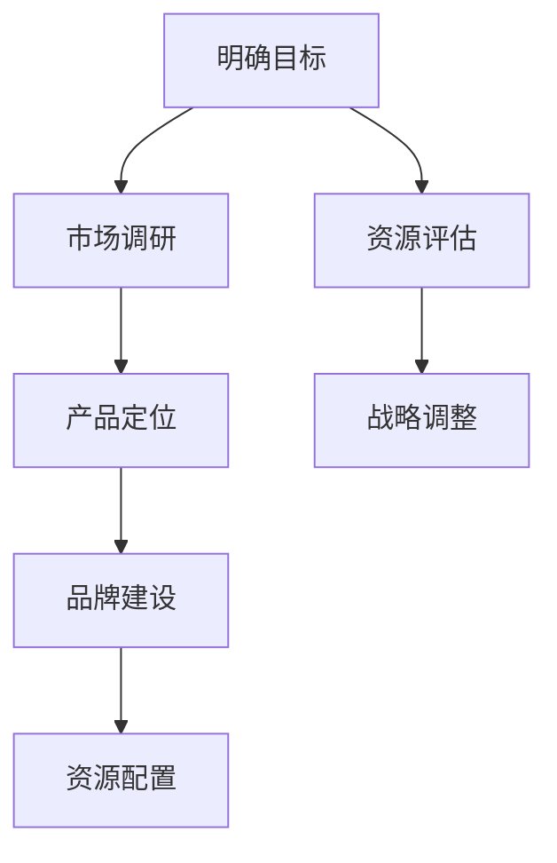
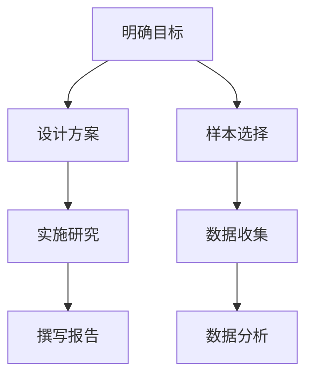
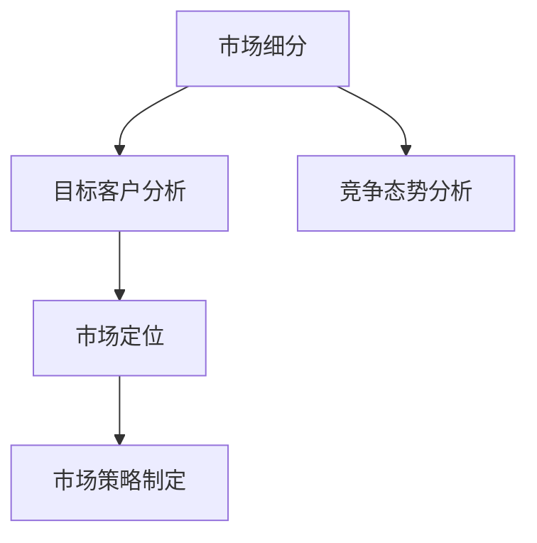

                 

### 文章标题：一人公司的国际化策略：如何开拓海外市场

> 关键词：国际化，一人公司，海外市场，策略制定，市场研究，竞争分析，产品本地化，品牌国际化，营销国际化，国际化管理与运营

> 摘要：本文旨在为一人公司提供一套系统的国际化策略，通过深入的市场研究、竞争分析、产品与服务国际化、品牌与营销国际化以及国际化管理与运营，帮助公司顺利开拓海外市场，实现全球业务增长。文章将从多个维度阐述国际化的重要性和具体实施步骤，旨在为读者提供实用、全面的指导。

### 《一人公司的国际化策略：如何开拓海外市场》目录大纲

#### 第一部分：国际化概述与策略制定

## 第1章：国际化的意义与战略目标

### 第2章：市场研究与竞争分析

#### 第二部分：产品与服务国际化

## 第3章：产品适应性调整与本地化

### 第4章：服务国际化策略

#### 第三部分：品牌与营销国际化

## 第5章：品牌国际化策略

### 第6章：营销国际化策略

#### 第四部分：国际化管理与运营

## 第7章：国际化团队建设与管理

### 第8章：国际化供应链管理

#### 第五部分：国际化风险与应对

## 第9章：国际化法律与合规风险

### 第10章：国际化财务管理

### 附录：国际化资源与工具

## 附录A：国际化营销工具

### 附录B：国际化资源推荐

---

#### 第1章：国际化的意义与战略目标

## 1.1 国际化的基本概念

国际化，对于企业而言，是指将企业的产品、服务或业务扩展到国际市场的过程。这不仅涉及市场开拓，还包括品牌建设、供应链管理、财务管理等多个方面。对于一人公司，即独立创业者，国际化意味着不仅要面对国内市场的竞争，更要跨越国界，迎接全球市场的挑战。

### 国际化的意义：

1. **拓展市场**：全球化使得市场边界变得模糊，国际市场为企业提供了更广阔的发展空间。对于一人公司，开拓海外市场可以有效增加销售额和利润。

2. **降低风险**：单一市场可能导致企业面临较大的经营风险。通过国际化，企业可以多元化市场，从而降低市场波动带来的风险。

3. **提高竞争力**：国际化可以促使企业不断优化产品和服务，提高生产效率，从而在国际市场上获得竞争优势。

4. **技术创新**：国际化有助于企业接触到不同的市场需求和技术，促进技术创新，为企业的长期发展提供动力。

### 国际化战略的制定

国际化战略的制定是企业国际化成功的关键。对于一人公司，制定国际化战略需要考虑以下几个方面：

1. **明确目标**：企业需要明确国际化战略的具体目标，如市场份额、利润率、品牌知名度等。

2. **市场调研**：通过市场调研，了解目标市场的需求、竞争态势以及潜在风险。

3. **产品定位**：根据市场调研结果，对产品进行适应性调整，确保产品能够满足国际市场的需求。

4. **品牌建设**：国际化过程中，品牌建设至关重要。企业需要制定一套适合国际市场的品牌策略，提升品牌知名度。

5. **资源配置**：国际化需要大量的资源投入，包括资金、人力资源等。企业需要合理安排资源，确保国际化战略的顺利实施。

### Mermaid 流程图

在制定国际化战略时，一人公司还需要考虑自身的优势和劣势。通过SWOT分析，企业可以更好地了解自身在国际化过程中的优劣势，从而制定出更加科学和可行的战略。

### SWOT分析示例

| 分析维度 | 优势（Strengths） | 劣势（Weaknesses） |
| --- | --- | --- |
| 市场定位 | 在国内市场拥有一定的知名度和客户基础 | 缺乏国际市场经验 |
| 创新能力 | 能够快速响应市场需求 | 产品本地化能力不足 |
| 资源配置 | 具备一定的资金和人力资源 | 国际化团队建设不足 |
| 品牌影响 | 在国内市场拥有较高的品牌知名度 | 国际市场品牌影响力有限 |

通过SWOT分析，一人公司可以更清楚地认识到自身在国际化过程中的优势和劣势，从而制定出更加有针对性的国际化战略。

### 结论

国际化对于一人公司而言，既是机遇也是挑战。通过深入的市场研究、科学的战略制定和有效的实施，一人公司可以成功开拓海外市场，实现全球业务增长。在下一章中，我们将探讨如何进行市场研究和竞争分析，为国际化战略的制定提供依据。<!-- Blo�k end -->

---

#### 第2章：市场研究与竞争分析

## 2.1 市场研究的方法与步骤

市场研究是国际化战略制定的基础，对于一人公司来说尤为重要。通过系统、全面的市场研究，企业可以了解目标市场的需求、竞争态势和潜在风险，从而制定出科学、合理的国际化策略。

### 市场研究的方法

市场研究的方法可以分为定量研究和定性研究。定量研究主要通过问卷调查、数据分析等方法收集数据；定性研究则通过访谈、小组讨论等方式深入了解市场情况。

1. **定量研究**：定量研究适用于大规模市场调查，能够提供量化的数据支持。常用的方法包括：

   - **问卷调查**：通过设计问卷，收集大量用户的反馈信息。
   - **数据分析**：利用现有的市场数据进行分析，如市场占有率、消费者行为等。

2. **定性研究**：定性研究适用于深入了解市场需求和用户反馈，通常包括以下方法：

   - **访谈**：通过与目标用户进行深入访谈，获取详细的用户需求和反馈。
   - **小组讨论**：组织一组用户进行讨论，收集不同角度的观点和建议。

### 市场研究的步骤

市场研究是一个系统性的过程，通常包括以下几个步骤：

1. **明确研究目标**：首先需要明确市场研究的具体目标，如了解目标市场的需求、竞争态势等。

2. **设计研究方案**：根据研究目标，设计合适的研究方案，包括研究方法、样本选择、数据收集方式等。

3. **实施研究**：按照设计方案进行数据收集和分析，确保数据的准确性和可靠性。

4. **撰写报告**：整理研究数据，撰写报告，提出结论和建议。

### 具体实施步骤

1. **明确研究目标**：例如，企业希望了解目标市场的消费者需求、购买习惯以及竞争对手的情况。

2. **设计研究方案**：根据研究目标，选择合适的研究方法。如果目标是了解消费者需求，可以采用问卷调查和访谈相结合的方法。

3. **实施研究**：通过问卷调查收集数据，通过访谈深入了解消费者需求。

4. **撰写报告**：整理分析数据，撰写报告，提出结论和建议。

### Mermaid 流程图

通过以上步骤，一人公司可以全面、深入地了解目标市场，为国际化战略的制定提供有力支持。

### 国际市场的竞争态势分析

了解目标市场的竞争态势是国际化战略的重要一环。通过竞争分析，企业可以了解自己在国际市场中的位置，从而制定出有效的竞争策略。

1. **竞争者识别**：首先需要识别目标市场的竞争者，包括直接竞争者和潜在竞争者。

2. **竞争策略分析**：分析竞争者的产品、价格、促销、渠道等策略，了解其优势与劣势。

3. **自身定位**：根据竞争态势，明确自身在国际市场中的定位，如领导者、挑战者、跟随者等。

4. **竞争策略制定**：基于自身定位，制定相应的竞争策略，如提高产品质量、降低价格、创新服务等。

### 确定目标市场和目标客户

确定目标市场和目标客户是国际化战略的核心。通过市场细分和目标客户分析，企业可以更准确地定位自己的市场，从而提高市场渗透率和客户满意度。

1. **市场细分**：根据地理、人口、行为、心理等维度对市场进行细分，找到具有相似需求的客户群体。

2. **目标客户分析**：分析目标客户的需求、购买习惯、消费能力等特征，确定企业的目标市场。

3. **市场定位**：根据目标客户特征，确定企业的市场定位，如高端市场、大众市场等。

4. **市场策略制定**：基于市场定位，制定相应的市场策略，如品牌推广、产品定价、渠道建设等。

### Mermaid 流程图

通过以上步骤，一人公司可以明确目标市场和目标客户，为国际化战略的实施提供明确方向。

### 总结

市场研究和竞争分析是国际化战略制定的重要环节。通过深入的市场研究和科学的竞争分析，一人公司可以了解目标市场的需求和竞争态势，为国际化战略的制定提供有力支持。在下一章中，我们将探讨如何进行产品适应性调整与本地化，以适应国际市场的需求。<!-- Blo�k end -->

---

#### 第3章：产品适应性调整与本地化

## 3.1 产品适应性调整的原则

产品适应性调整是确保产品在国际市场获得成功的关键步骤。对于一人公司，如何在保持产品核心竞争力的同时，适应不同市场的需求和法规，是一个重要的课题。以下是一些产品适应性调整的基本原则：

1. **市场需求导向**：首先，企业需要深入了解目标市场的消费者需求。这包括了解消费者的偏好、购买习惯、消费能力等。通过市场调研和用户反馈，企业可以获取有价值的信息，指导产品适应性调整。

2. **法规合规性**：国际市场往往有不同的法律法规，企业需要确保产品符合当地法规。例如，产品安全标准、环保法规、隐私保护等。对于一人公司，了解并遵守目标市场的法规，是产品国际化的前提。

3. **文化适应性**：文化差异会影响产品的接受度和市场表现。企业需要考虑目标市场的文化背景，调整产品的外观设计、功能、宣传语等，以符合当地文化习俗。例如，在食品饮料领域，不同的文化对口味、包装设计有不同要求。

4. **技术适应性**：技术标准在不同国家可能有所不同。一人公司需要确保产品技术规格符合目标市场的技术标准。例如，网络通信标准、软件兼容性等。

5. **成本效益**：在产品适应性调整过程中，成本效益是一个重要的考虑因素。企业需要在满足市场需求的条件下，尽量控制成本，避免因产品适应性过高导致成本激增，影响利润率。

### 产品本地化的策略与实施

产品本地化不仅仅是将产品翻译成当地语言，还涉及多个层面的调整。以下是产品本地化的主要策略和实施步骤：

1. **市场调研**：在产品本地化之前，企业需要进行深入的市场调研，了解目标市场的消费者需求、文化背景、法律法规等。这是制定本地化策略的基础。

2. **产品定位**：根据市场调研结果，确定产品在目标市场的定位。例如，是面向高端市场还是大众市场，产品的功能、价格、包装等如何调整。

3. **语言本地化**：将产品名称、宣传语、用户手册等翻译成当地语言，确保语言表达符合当地文化习俗和语法规范。

4. **文化适应性**：调整产品的外观设计、功能、用户体验等，以符合当地文化习俗。例如，在食品饮料领域，不同文化的消费者对口味、包装设计有不同偏好。

5. **法规合规性**：确保产品符合目标市场的法律法规，如安全标准、环保法规、隐私保护等。

6. **技术适应性**：根据目标市场的技术标准，调整产品的技术规格，确保产品的兼容性和稳定性。

7. **测试与反馈**：在产品本地化过程中，进行多次测试和用户反馈，确保产品在本地化后能够满足当地市场的需求。

8. **营销推广**：根据本地化后的产品特点，制定合适的营销策略，如广告宣传、促销活动等，以提高产品的市场接受度。

### 产品国际化的案例分析

以下是一个产品国际化的成功案例，以帮助读者更好地理解产品适应性调整与本地化的实施过程。

**案例：一款智能家居产品的国际化**

1. **市场调研**：一家智能家居公司（一人公司）在进入欧洲市场前，进行了详细的市场调研。调研结果显示，欧洲消费者对智能家居产品的安全性和稳定性要求较高，同时对产品的环保性能也较为关注。

2. **产品定位**：根据市场调研结果，公司将产品定位于高端市场，以满足欧洲消费者对高品质生活的追求。

3. **语言本地化**：将产品说明书、用户界面等翻译成当地语言（如德语、法语），确保产品使用说明清晰易懂。

4. **文化适应性**：调整产品的外观设计，使其更符合欧洲消费者的审美习惯。同时，在产品功能上增加了节能环保功能，满足欧洲消费者对环保的需求。

5. **法规合规性**：确保产品符合欧洲的安全标准、环保法规等，如通过CE认证。

6. **技术适应性**：根据欧洲的网络通信标准，调整产品的技术规格，确保产品的兼容性和稳定性。

7. **测试与反馈**：在产品进入欧洲市场前，进行多次测试和用户反馈，确保产品能够在当地市场正常运行。

8. **营销推广**：通过社交媒体、线上线下活动等渠道，进行产品营销推广，提高产品的市场知名度。

通过以上步骤，这款智能家居产品成功在欧洲市场获得了良好的反响，销量稳步增长。

### 结论

产品适应性调整与本地化是产品国际化的关键环节。通过深入了解目标市场的需求、文化背景、法律法规等，一人公司可以制定出合适的产品本地化策略，提高产品在国际市场的竞争力。在下一章中，我们将探讨服务国际化策略，帮助一人公司实现全方位的国际化。<!-- Blo�k end -->

---

#### 第4章：服务国际化策略

## 4.1 服务国际化的挑战

服务国际化对于一人公司来说既是机遇也是挑战。在拓展海外市场时，企业需要面对一系列的挑战，包括市场、技术和法律等方面的挑战。

1. **市场挑战**：不同市场的消费者需求、消费习惯和购买决策过程可能存在显著差异。一人公司需要深入了解目标市场的特点，调整服务策略以适应不同市场的需求。

2. **技术挑战**：服务国际化可能涉及不同的技术标准和网络环境。例如，不同的国家和地区可能采用不同的网络通信标准，这对服务提供的技术稳定性提出了更高的要求。

3. **法律挑战**：国际化过程中，企业需要遵守不同国家和地区的法律法规，如数据保护法、消费者权益保护法等。合规性是企业国际化成功的关键，任何法律风险都可能对企业造成重大影响。

4. **运营挑战**：服务国际化还涉及跨区域运营管理，包括供应链管理、人力资源管理、财务管理等方面。一人公司需要建立有效的管理体系，以确保国际化服务的稳定性和效率。

### 服务国际化的策略

为了应对上述挑战，一人公司需要制定一系列的策略，确保服务国际化顺利进行。以下是一些关键策略：

1. **市场定位策略**：根据目标市场的特点和消费者需求，明确服务的市场定位。例如，是面向高端市场还是大众市场，服务的特色是什么。

2. **产品本地化策略**：根据目标市场的文化、语言和法规，对服务进行本地化调整。例如，将服务界面翻译成当地语言，符合当地法规要求。

3. **技术适应性策略**：确保服务技术符合目标市场的技术标准，如网络通信协议、数据处理标准等。对于技术性较强的服务，可以考虑采用云计算、大数据等技术，提高服务的稳定性和可扩展性。

4. **合规性策略**：深入研究目标市场的法律法规，确保服务提供过程符合当地法律要求。例如，遵守数据保护法规，确保用户隐私安全。

5. **运营优化策略**：建立跨区域运营管理体系，包括供应链管理、人力资源管理、财务管理等。通过优化运营流程，提高服务效率和客户满意度。

### 服务国际化的案例分析

以下是一个服务国际化的成功案例，以帮助读者更好地理解服务国际化策略的实施过程。

**案例：一家在线教育平台的国际化**

1. **市场定位策略**：在线教育平台在进入国际市场时，明确了自己的市场定位，即提供高品质的教育服务，面向全球有学习需求的用户。

2. **产品本地化策略**：平台在进入新市场前，对当地的文化、语言和法规进行了深入研究。例如，将平台界面翻译成当地语言，确保内容符合当地法规要求。

3. **技术适应性策略**：平台采用了云计算技术，确保服务能够在不同的网络环境下稳定运行。同时，平台还根据不同国家的网络通信标准，进行了技术调整。

4. **合规性策略**：平台严格遵守目标市场的数据保护法规，确保用户隐私安全。例如，在欧洲市场，平台符合GDPR法规要求。

5. **运营优化策略**：平台建立了全球化的运营团队，通过远程协作和分布式管理，提高了运营效率和客户满意度。

通过以上策略，在线教育平台成功进入了多个国际市场，获得了广泛的用户认可。

### 结论

服务国际化对于一人公司来说是一项复杂的任务，需要面对市场的、技术的、法律的等多种挑战。通过科学的市场定位、产品本地化、技术适应性、合规性和运营优化策略，一人公司可以克服这些挑战，实现服务的国际化。在下一章中，我们将探讨品牌国际化策略，帮助一人公司在全球市场树立强大的品牌形象。<!-- Blo�k end -->

---

#### 第5章：品牌国际化策略

## 5.1 品牌国际化的重要性

品牌国际化对于一人公司来说至关重要。一个强有力的品牌不仅能够提高企业的市场地位，还能增加品牌影响力，从而推动业务的持续增长。以下是品牌国际化的一些关键重要性：

1. **增强市场竞争力**：在国际市场上，品牌知名度是消费者选择产品或服务的重要因素之一。通过品牌国际化，企业可以提升自身在国内外市场的竞争力，吸引更多客户。

2. **提高品牌价值**：品牌国际化有助于扩大品牌的受众群体，从而提高品牌价值。品牌价值的提升有助于企业获得更高的溢价，增强盈利能力。

3. **提升品牌形象**：品牌国际化能够让企业更好地展示其创新能力和技术实力，提升品牌形象。一个国际化的品牌往往更能赢得消费者的信任和尊重。

4. **拓展市场渠道**：品牌国际化有助于企业开拓新的市场渠道，增加销售渠道的多样性和稳定性。通过国际市场拓展，企业可以减少对单一市场的依赖，降低经营风险。

### 品牌国际化策略的制定

为了实现品牌国际化，一人公司需要制定一套系统、全面的品牌国际化策略。以下是制定品牌国际化策略的一些关键步骤：

1. **明确品牌定位**：品牌定位是品牌国际化的基础。企业需要明确品牌的核心价值、目标市场和目标客户，确保品牌形象的一致性。

2. **市场调研**：在品牌国际化过程中，企业需要深入了解目标市场的文化、消费者行为和市场竞争态势。这有助于企业制定出更符合市场需求的品牌策略。

3. **品牌差异化**：在国际市场上，差异化是品牌成功的关键。企业需要找出自身独特的优势，并将其融入到品牌形象中，以区别于竞争对手。

4. **品牌传播策略**：品牌国际化需要有效的品牌传播策略。企业可以通过多种渠道，如广告、公关、社交媒体等，向全球消费者传递品牌信息。

5. **品牌维护**：品牌国际化并非一蹴而就，需要持续的品牌维护和优化。企业需要定期评估品牌形象和市场反馈，及时调整品牌策略。

### 品牌国际化案例解析

以下是一个品牌国际化的成功案例，以帮助读者更好地理解品牌国际化策略的实施过程。

**案例：一家中国运动品牌国际化**

1. **明确品牌定位**：该运动品牌定位为“时尚、专业、高品质”，旨在为全球消费者提供高品质的运动装备。

2. **市场调研**：在进入国际市场前，品牌进行了详细的市场调研，了解不同市场的消费者需求和购买习惯。

3. **品牌差异化**：品牌在产品设计上融入了国际潮流元素，同时保持了品牌的专业性和高品质形象。

4. **品牌传播策略**：品牌通过赞助国际体育赛事、广告投放和社交媒体宣传等手段，提高了品牌在国际市场的知名度。

5. **品牌维护**：品牌在国际化过程中，不断收集市场反馈，优化产品设计和品牌传播策略，以适应不同市场的需求。

通过以上策略，该中国运动品牌成功在国际市场上建立了强大的品牌影响力，销量逐年增长。

### 结论

品牌国际化是提升企业全球竞争力的重要手段。通过明确品牌定位、深入市场调研、品牌差异化、品牌传播策略和品牌维护，一人公司可以成功实现品牌国际化，提高品牌价值，拓展国际市场。在下一章中，我们将探讨营销国际化策略，帮助一人公司在全球市场进行有效的营销推广。<!-- Blo�k end -->

---

#### 第6章：营销国际化策略

## 6.1 国际化营销的渠道选择

在国际化营销中，选择合适的营销渠道是至关重要的一步。不同的营销渠道适用于不同的市场环境和目标客户群体，一人公司需要根据自身情况和目标市场特点来选择最佳的营销渠道。以下是几种常见的国际化营销渠道及其特点：

1. **社交媒体**：社交媒体平台如Facebook、Instagram、Twitter等在全球范围内具有广泛的影响力，是企业进行国际化营销的重要渠道。社交媒体营销的优势在于互动性强、传播速度快，能够帮助企业快速建立品牌形象和吸引目标客户。

2. **搜索引擎优化（SEO）**：搜索引擎优化是提高网站在搜索引擎结果页面（SERP）排名的重要手段。通过优化网站内容和结构，企业可以提高网站在目标市场的搜索结果中的位置，从而吸引更多潜在客户。SEO适合长期营销策略，效果稳定。

3. **内容营销**：内容营销是通过创造和分享有价值的内容来吸引和留住目标客户的一种策略。内容形式包括博客文章、视频、电子书等。内容营销能够提升品牌知名度，增加网站流量，并在搜索引擎中获取更好的排名。

4. **电子邮件营销**：电子邮件营销是一种直接的营销手段，适用于保持与现有客户的联系，同时吸引潜在客户。通过定期发送 newsletters、促销信息等，企业可以增强品牌忠诚度和提高转化率。

5. **线上广告**：线上广告包括横幅广告、展示广告、搜索引擎广告等。线上广告具有定位精准、投放灵活、效果可测量的特点，适用于快速提升品牌曝光度和吸引潜在客户。

6. **线下活动**：虽然线下活动主要是针对本地市场的，但通过参与国际性的展览、会议和研讨会，企业可以展示自身实力，与全球客户建立联系，扩大品牌影响力。

### 国际化营销的方法与技巧

在国际化营销中，企业需要采用一系列的方法和技巧，以确保营销活动的效果。以下是一些关键的营销方法和技巧：

1. **本地化营销**：本地化营销是指将营销内容和策略适应目标市场的文化、语言和消费者行为。本地化营销的关键在于深入了解目标市场的特点，调整营销策略以符合当地消费者的需求。

2. **跨文化沟通**：在国际化营销中，跨文化沟通是非常重要的。企业需要考虑到不同文化背景下的沟通方式和偏好，避免因文化差异导致的误解和沟通障碍。

3. **精准定位**：通过市场调研和数据分析，企业可以确定目标客户群体的特征和需求，从而制定出精准的营销策略。精准定位有助于提高营销效率，降低营销成本。

4. **整合营销**：整合营销是将不同的营销手段结合起来，形成统一的营销策略。通过整合线上和线下的营销活动，企业可以提升品牌的综合影响力。

5. **互动营销**：互动营销是指通过社交媒体、用户反馈等方式与客户进行互动，增强品牌与客户的联系。互动营销有助于建立品牌忠诚度，提高客户满意度。

6. **数据分析与优化**：国际化营销过程中，企业需要通过数据分析来评估营销效果，优化营销策略。数据分析可以帮助企业发现市场趋势，调整营销策略，提高营销效果。

### 跨文化营销策略分析

跨文化营销策略是国际化营销的重要组成部分。以下是一些关键的跨文化营销策略：

1. **文化适应**：在营销内容和渠道上，企业需要考虑目标市场的文化差异。例如，在节日促销活动中，可以融入当地的文化元素，增加消费者的参与度。

2. **本土化团队**：组建一支本地化的营销团队，可以更好地了解和适应目标市场的文化，提高营销策略的有效性。

3. **语言本地化**：将营销内容翻译成目标市场的本地语言，确保信息的准确传达。

4. **尊重当地习俗**：在营销活动中，企业需要尊重目标市场的习俗和价值观，避免使用可能引起误解或不尊重的词汇或形象。

5. **个性化营销**：通过个性化的营销策略，企业可以更好地满足不同消费者的需求，提高营销效果。

### 结论

国际化营销对于一人公司的全球化业务拓展至关重要。通过选择合适的营销渠道、采用有效的营销方法和技巧，以及实施跨文化营销策略，企业可以成功开拓海外市场，提升品牌影响力和市场份额。在下一章中，我们将探讨国际化管理与运营，帮助一人公司建立有效的国际化管理体系。<!-- Blo�k end -->

---

#### 第7章：国际化团队建设与管理

## 7.1 国际化团队的组建

国际化团队建设是确保企业国际化战略成功实施的关键。一个高效的国际化团队需要具备多样化的技能和经验，以适应不同市场的需求和挑战。以下是组建国际化团队的几个关键步骤：

1. **明确团队目标**：在组建国际化团队之前，企业需要明确团队的目标和职责。这包括团队在国际市场中的角色、期望达到的业绩指标等。

2. **技能和经验要求**：根据团队目标，确定所需技能和经验。国际化团队成员应具备以下能力：

   - **跨文化沟通能力**：能够与不同文化背景的人有效沟通，避免文化冲突。
   - **市场洞察力**：了解目标市场的消费者需求、市场趋势和竞争态势。
   - **项目管理能力**：能够有效地管理跨国项目和团队，确保项目按时完成。
   - **本地化经验**：熟悉目标市场的法律法规、文化习俗和商业环境。

3. **招聘和选拔**：通过招聘和选拔，找到具备上述能力和经验的人才。企业可以采用多种招聘渠道，如猎头公司、招聘网站、社交媒体等。

4. **培训和培养**：新成员加入后，企业需要提供系统的培训，包括跨文化沟通技巧、市场分析工具、项目管理方法等。同时，通过持续的培养和激励，提高团队成员的职业技能和团队合作能力。

### 跨文化沟通与协作

跨文化沟通与协作是国际化团队成功的关键。以下是一些有效的跨文化沟通与协作策略：

1. **建立共同价值观**：通过制定共同的价值观和目标，使团队成员在文化差异的基础上达成共识，增强团队凝聚力。

2. **培养开放心态**：鼓励团队成员尊重和接受不同的文化观点，提高跨文化沟通的效率。

3. **有效沟通技巧**：采用开放式的沟通方式，积极倾听对方意见，避免使用过于直接或含糊的沟通方式。

4. **文化敏感性培训**：定期进行文化敏感性培训，提高团队成员对文化差异的认识和敏感性。

5. **建立反馈机制**：建立有效的反馈机制，鼓励团队成员提出意见和建议，促进团队的持续改进。

### 国际化管理模式的优化

为了提高国际化团队的管理效率，企业需要不断优化管理模式。以下是一些关键策略：

1. **分布式管理**：采用分布式管理架构，使团队成员能够灵活地协作，充分利用各地资源和时间差异。

2. **远程协作工具**：利用先进的远程协作工具，如视频会议、项目管理软件、即时通讯工具等，提高团队的协作效率。

3. **跨职能团队**：建立跨职能团队，将不同职能领域的专家整合到一个团队中，提高决策效率和执行力。

4. **灵活的工作时间**：根据不同地区的时区差异，灵活调整工作安排，确保团队成员能够在最佳状态下工作。

5. **绩效评估体系**：建立科学、公正的绩效评估体系，激励团队成员的积极性和创造性。

### 结论

国际化团队建设与管理是确保企业国际化战略成功实施的关键。通过组建多元化、高技能的国际化团队，优化跨文化沟通与协作，以及采用先进的管理模式，一人公司可以更好地应对国际市场的挑战，实现全球业务的持续增长。在下一章中，我们将探讨国际化供应链管理，帮助企业提高供应链效率。<!-- Blo�k end -->

---

#### 第8章：国际化供应链管理

## 8.1 国际化供应链的特点

国际化供应链管理是确保企业国际化战略成功实施的重要一环。与国内供应链相比，国际化供应链具有以下特点：

1. **复杂性**：国际化供应链涉及多个国家和地区，包括供应商、制造商、分销商和零售商。供应链节点分散，信息传递和协调难度增大。

2. **多样性**：不同国家和地区的法规、标准和商业习惯各异，供应链管理需要适应多样化的需求。

3. **不确定性**：国际市场波动、汇率变动、政治风险等因素，使得国际化供应链面临更多的不确定性。

4. **跨区域协作**：国际化供应链需要跨国界的协作，涉及不同文化、语言和时区的协调。

### 供应链国际化的挑战

国际化供应链管理面临一系列挑战，包括：

1. **合规性**：企业需要遵守不同国家和地区的法律法规，如反贿赂法、劳动法、环保法规等。

2. **物流管理**：跨国物流管理涉及海关通关、运输成本、运输时间等复杂问题。

3. **供应链风险**：国际供应链面临政治风险、经济风险、自然灾害等不确定性因素。

4. **信息共享**：跨国供应链的信息传递和共享面临语言障碍、数据标准不一致等问题。

### 供应链国际化的策略与实施

为了应对国际化供应链的挑战，企业需要制定一系列策略，以下是具体策略与实施步骤：

1. **合规管理策略**：

   - **了解当地法规**：企业需要深入了解目标市场的法律法规，确保供应链管理符合当地要求。

   - **建立合规培训机制**：定期对供应链管理人员进行合规培训，提高合规意识和能力。

   - **建立合规检查机制**：对供应链环节进行定期检查，确保合规性。

2. **物流管理策略**：

   - **选择合适的物流模式**：根据产品特性、运输距离、成本等因素，选择合适的物流模式，如跨境快递、空运、海运等。

   - **优化运输路线**：通过数据分析，优化运输路线，降低运输成本和时间。

   - **建立物流信息系统**：利用先进的物流信息系统，实时监控物流状态，提高物流效率。

3. **供应链风险管理策略**：

   - **风险评估与预警**：对供应链风险进行评估，建立风险预警机制。

   - **多元化供应商策略**：通过引入多元化供应商，降低供应链风险。

   - **应急预案**：制定供应链应急预案，应对突发事件。

4. **信息共享策略**：

   - **统一数据标准**：确保供应链各环节采用统一的数据标准和格式，提高信息传递效率。

   - **建设信息共享平台**：建立供应链信息共享平台，实现供应链各环节的信息共享。

   - **加强沟通与协作**：通过定期的沟通和协作，提高供应链管理的整体效率。

### 案例分析：国际化供应链管理

以下是一个国际化供应链管理的成功案例，以帮助读者更好地理解供应链国际化的实施过程。

**案例：一家电子产品公司的国际化供应链管理**

1. **合规管理**：

   - 该公司通过法律咨询机构，详细了解目标市场的法律法规，确保供应链管理符合当地要求。

   - 定期对供应链管理人员进行合规培训，提高合规意识。

   - 对供应链环节进行定期检查，确保合规性。

2. **物流管理**：

   - 根据产品特性、运输距离、成本等因素，选择了跨境快递和海运相结合的物流模式。

   - 通过数据分析，优化了运输路线，降低了运输成本和时间。

   - 利用先进的物流信息系统，实时监控物流状态，提高了物流效率。

3. **供应链风险管理**：

   - 对供应链风险进行了评估，建立了风险预警机制。

   - 通过引入多元化供应商，降低了供应链风险。

   - 制定了供应链应急预案，应对突发事件。

4. **信息共享**：

   - 采用统一的数据标准和格式，确保供应链各环节的信息传递效率。

   - 建立了供应链信息共享平台，实现了供应链各环节的信息共享。

   - 加强了沟通与协作，提高了供应链管理的整体效率。

通过以上策略，该公司成功实现了国际化供应链管理，确保了供应链的稳定性和高效性。

### 结论

国际化供应链管理是企业全球化战略的重要组成部分。通过制定合规管理策略、优化物流管理、实施供应链风险管理策略和加强信息共享，企业可以应对国际化供应链的挑战，提高供应链的效率和稳定性。在下一章中，我们将探讨国际化法律与合规风险，帮助一人公司规避国际化过程中的法律风险。<!-- Blo�k end -->

---

#### 第9章：国际化法律与合规风险

## 9.1 国际化法律风险的识别

在国际市场经营过程中，企业可能会面临多种法律风险，包括合同风险、知识产权风险、劳动法风险等。识别这些法律风险是确保企业国际化运营合规的基础。以下是几种常见的国际化法律风险及其识别方法：

1. **合同风险**：合同风险是指由于合同条款不明确、合同履行不力或合同纠纷等问题，导致企业利益受损的风险。识别合同风险的方法包括：

   - **审查合同条款**：在签订合同前，仔细审查合同条款，确保合同的公平性和合法性。
   - **法律咨询**：在签订重要合同时，寻求专业律师的意见，确保合同内容符合当地法律要求。
   - **了解合同法律环境**：研究目标市场的合同法律环境，了解合同签订、履行和纠纷解决的法律规定。

2. **知识产权风险**：知识产权风险包括专利侵权、商标侵权、著作权侵权等。识别知识产权风险的方法包括：

   - **专利检索**：在进入新市场前，进行专利检索，确保企业产品或服务的专利权不受侵犯。
   - **商标查询**：查询目标市场的商标注册情况，避免商标侵权。
   - **合作协议**：在签订合作协议时，明确知识产权的归属和使用权。

3. **劳动法风险**：劳动法风险包括劳动纠纷、违法用工等。识别劳动法风险的方法包括：

   - **了解当地劳动法**：研究目标市场的劳动法规定，确保企业用工符合当地法律要求。
   - **员工培训**：对员工进行劳动法培训，提高员工的合规意识。
   - **员工合同**：确保员工合同内容合法，明确双方的权益和义务。

### 国际化合规风险的应对

为了应对国际化法律与合规风险，企业需要采取一系列的应对措施。以下是一些具体的应对策略：

1. **建立合规管理体系**：企业应建立一套全面的合规管理体系，包括合规政策、合规流程、合规培训等，确保企业在国际市场运营中的合规性。

2. **合规风险评估**：定期对国际化运营中的合规风险进行评估，识别潜在风险，制定应对措施。

3. **合规培训与宣传**：定期对员工进行合规培训，提高员工的合规意识和能力。同时，通过内部宣传，增强员工的合规意识。

4. **法律咨询与服务**：聘请专业律师团队，为企业提供法律咨询和服务，确保企业在国际市场运营中的合规性。

5. **建立争议解决机制**：制定争议解决机制，如内部调解、仲裁、诉讼等，确保在出现法律纠纷时，能够迅速有效地解决。

### 法律与合规风险案例分析

以下是一个国际化法律与合规风险的案例，以帮助读者更好地理解如何应对国际化法律与合规风险。

**案例：一家中国电子产品公司在欧洲市场的法律与合规挑战**

1. **背景**：

   - 一家中国电子产品公司计划在欧洲市场推出新产品，但未对目标市场的法律环境进行充分研究。

2. **问题**：

   - 在新产品上市过程中，公司发现其产品涉嫌侵犯欧洲某知名品牌的专利权，面临专利侵权诉讼。
   - 公司在招聘过程中，违反了欧洲的劳动法规定，导致员工投诉和诉讼。

3. **应对措施**：

   - 公司立即聘请了专业律师团队，对涉嫌侵权的产品进行专利检索，并与该品牌进行沟通，寻求和解。
   - 公司对相关员工进行了劳动法培训，调整了员工合同，确保符合当地劳动法规定。
   - 公司建立了合规管理体系，定期进行合规风险评估，加强合规培训。

4. **结果**：

   - 公司成功解决了专利侵权诉讼，避免了高额赔偿。
   - 公司通过调整员工合同和加强合规培训，避免了进一步的劳动纠纷。

### 结论

国际化法律与合规风险是企业在国际市场运营中必须面对的挑战。通过识别法律与合规风险、建立合规管理体系、加强合规培训与宣传、法律咨询与服务以及建立争议解决机制，企业可以有效地应对国际化法律与合规风险，确保在国际市场运营中的合规性。在下一章中，我们将探讨国际化财务管理，帮助一人公司实现财务的国际化管理。<!-- Blo�k end -->

---

#### 第10章：国际化财务管理

## 10.1 国际财务管理的挑战

国际化财务管理是企业跨国经营中不可或缺的一环，它面临着一系列独特的挑战。以下是国际化财务管理中常见的几个挑战：

1. **货币兑换风险**：企业在国际市场上进行交易时，需要面对不同货币之间的兑换风险。汇率波动可能导致财务结果的不稳定，增加企业的财务风险。

2. **税务风险**：不同国家和地区有不同的税务政策和法规，企业需要遵守当地的税法规定，否则可能会面临税务处罚和声誉损失。

3. **会计准则差异**：各国会计准则存在差异，这可能导致企业在不同国家编制的财务报表不一致，影响企业的财务透明度和可比性。

4. **外汇管制**：一些国家对外汇交易有严格的管制政策，企业需要遵守这些规定，否则可能面临外汇管制风险。

5. **财务管理复杂性**：国际化财务管理涉及多个国家的财务报表、税务合规、货币兑换等，管理复杂度增加。

### 国际财务管理策略

为了有效应对国际化财务管理中的挑战，企业需要制定一套全面的财务管理策略。以下是几个关键策略：

1. **货币兑换策略**：

   - **多元化货币投资**：通过多元化货币投资，降低单一货币汇率波动带来的风险。
   - **提前锁定汇率**：在国际贸易中，通过期货、期权等金融工具提前锁定汇率，减少汇率波动带来的影响。

2. **税务规划策略**：

   - **利用税收优惠**：研究目标市场的税收优惠政策和法规，合理利用税收优惠政策降低税负。
   - **跨国税务协调**：建立跨国税务协调机制，确保企业在不同国家遵守税务法规，避免双重征税。

3. **会计准则适应策略**：

   - **统一会计政策**：在全球范围内统一会计政策，确保财务报表的一致性和可比性。
   - **国际会计准则**：采用国际会计准则（如IFRS），提高财务报表的国际认可度和透明度。

4. **外汇管制策略**：

   - **遵守外汇管制法规**：了解并遵守目标市场的外汇管制法规，确保合法合规。
   - **外汇风险管理**：利用外汇衍生品工具，如外汇期货、外汇期权等，进行外汇风险管理。

5. **财务管理优化策略**：

   - **建立全球财务报告系统**：建立高效的全球财务报告系统，确保实时监控和分析全球财务状况。
   - **培养国际化财务管理人才**：培养具有国际化视野和能力的财务管理人才，提升财务管理水平。

### 国际财务管理案例分析

以下是一个国际化财务管理的成功案例，以帮助读者更好地理解国际化财务管理的实施过程。

**案例：一家跨国制造公司的国际化财务管理**

1. **背景**：

   - 一家跨国制造公司计划在欧洲市场扩大业务，需要应对货币兑换风险、税务风险和会计准则差异等问题。

2. **应对措施**：

   - **货币兑换策略**：公司通过多元化货币投资，降低了欧元汇率波动对财务结果的影响。同时，通过提前锁定汇率，减少了汇率波动带来的不确定性。
   - **税务规划策略**：公司利用欧洲各国的税收优惠政策，降低了税负。同时，通过跨国税务协调，确保在欧洲各国遵守税法规定，避免了双重征税。
   - **会计准则适应策略**：公司采用国际会计准则（IFRS），确保了财务报表的一致性和透明度。
   - **外汇管制策略**：公司了解并遵守欧洲各国的外汇管制法规，确保了外汇交易的合法合规。
   - **财务管理优化策略**：公司建立了全球财务报告系统，实时监控和分析全球财务状况，提高了财务管理效率。

3. **结果**：

   - 公司通过有效的财务管理策略，成功降低了货币兑换风险、税务风险和会计准则差异带来的影响，确保了国际化业务的顺利开展。
   - 公司的财务状况得到了显著改善，财务透明度和效率得到了提升。

### 结论

国际化财务管理是企业跨国经营的关键环节。通过制定货币兑换策略、税务规划策略、会计准则适应策略、外汇管制策略和财务管理优化策略，企业可以有效地应对国际化财务管理中的挑战，提高财务管理效率和效果。在下一章中，我们将提供国际化资源与工具，帮助一人公司更好地开展国际化业务。<!-- Blo�k end -->

---

## 附录A：国际化营销工具

### A.1 社交媒体营销

社交媒体营销是国际化营销的重要组成部分。以下是一些常用的社交媒体营销工具和平台：

- **Facebook**：全球最大的社交网络平台，适合发布内容、广告和互动。
- **Instagram**：以图片和视频为主的社交平台，适合视觉营销。
- **Twitter**：实时信息传播平台，适合品牌宣传和客户服务。
- **LinkedIn**：职业社交平台，适合B2B营销和建立专业形象。
- **YouTube**：全球最大的视频分享平台，适合视频内容和广告。

### A.2 搜索引擎优化（SEO）

搜索引擎优化（SEO）是提高网站在搜索引擎结果页面（SERP）排名的关键策略。以下是一些SEO工具：

- **Google Analytics**：分析网站流量和用户行为。
- **Google Search Console**：监控网站在Google搜索中的表现。
- **Ahrefs**：关键词研究和竞争对手分析。
- **SEMrush**：SEO审计、关键词研究和竞争对手分析。

### A.3 电子邮件营销

电子邮件营销是建立客户关系、促进销售的有效手段。以下是一些电子邮件营销工具：

- **Mailchimp**：自动化电子邮件营销平台。
- **SendinBlue**：电子邮件营销和自动化工具。
- **HubSpot**：全功能的营销和销售平台。
- **Constant Contact**：电子邮件营销和活动管理。

## 附录B：国际化资源推荐

### B.1 国际市场研究机构

以下是一些知名的国际市场研究机构，提供市场调研报告和分析：

- **Euromonitor International**：提供全球市场研究报告。
- **Market Research Bureau**：提供市场趋势分析和报告。
- **IBISWorld**：提供行业市场分析和报告。
- **Global Industry Analysts**：提供行业和市场规模预测报告。

### B.2 跨文化交流资源

以下是一些跨文化交流资源，帮助企业和个人了解不同文化：

- **Intercultural Communication Institute**：提供跨文化沟通培训和研究。
- **Culture Mastery**：跨文化培训和咨询服务。
- **Global Business Culture**：提供不同国家的商务文化指南。
- **Cross-Cultural Communication**：提供跨文化沟通工具和资源。

### B.3 国际贸易与投资指南

以下是一些国际贸易与投资指南，帮助企业和个人了解国际贸易政策和法规：

- **World Bank**：提供国际贸易和投资指南。
- **International Trade Administration**：美国国际贸易协会，提供国际贸易资源和指南。
- **European Union Trade Policy**：欧盟贸易政策指南。
- **Doing Business**：世界银行发布的各国商业环境排名和指南。

通过使用这些国际化营销工具和资源，一人公司可以更好地开展国际化业务，提高市场竞争力。<!-- Blo�k end -->

