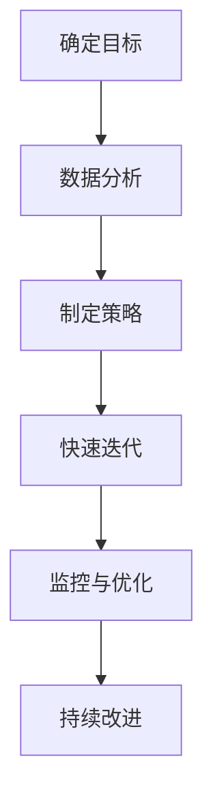
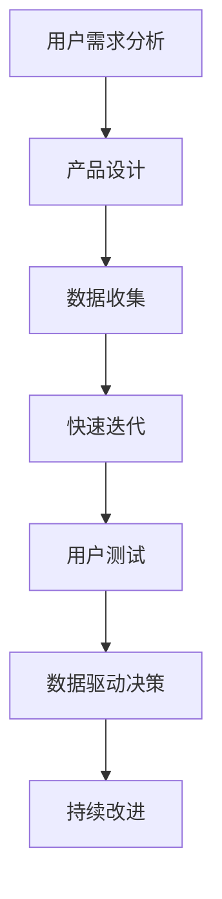

                 


## 文章标题：一人公司的增长黑客策略与实践

### 关键词：增长黑客、一人公司、用户增长、数据分析、营销策略

### 摘要：
本文将深入探讨一人公司的增长黑客策略与实践。通过阐述增长黑客的定义、原理和方法论，并结合具体案例，为读者提供一套实用的增长黑客实践指南。文章分为三大部分：增长黑客概念与原理、一人公司增长黑客策略、实战案例分析，旨在帮助读者理解并运用增长黑客策略，实现一人公司的快速增长。

----------------------------------------------------------------

## 目录大纲：《一人公司的增长黑客策略与实践》

### 第一部分：增长黑客概念与原理

### 第1章：增长黑客概述
- **1.1 增长黑客的定义**
- **1.2 增长黑客与传统市场营销的区别**
- **1.3 增长黑客的核心原则**

### 第2章：增长黑客方法论
- **2.1 快速迭代与测试**
- **2.2 数据驱动决策**
- **2.3 用户参与与反馈**
- **2.4 创新与实验精神**

### 第二部分：一人公司增长黑客策略

### 第3章：构建增长黑客团队
- **3.1 团队角色与职责**
- **3.2 高效沟通与协作**
- **3.3 成长与激励**

### 第4章：内容营销与社交媒体
- **4.1 内容营销策略**
- **4.2 社交媒体平台选择与运营**
- **4.3 内容创作与推广**

### 第5章：邮件营销与自动化营销
- **5.1 邮件营销策略**
- **5.2 自动化营销工具与应用**
- **5.3 邮件模板设计与优化**

### 第6章：搜索引擎优化与广告投放
- **6.1 搜索引擎优化策略**
- **6.2 广告投放渠道选择**
- **6.3 广告文案撰写与优化**

### 第7章：用户增长与留存策略
- **7.1 用户增长策略**
- **7.2 用户留存策略**
- **7.3 用户满意度与忠诚度提升**

### 第三部分：实战案例分析

### 第8章：成功案例分享
- **8.1 案例一：小公司快速增长的秘诀**
- **8.2 案例二：如何用增长黑客策略实现产品突破**
- **8.3 案例三：从零到一，构建一家独角兽公司**

### 第9章：增长黑客策略实践指南
- **9.1 实践步骤与流程**
- **9.2 常见问题与解决方法**
- **9.3 持续改进与优化**

### 附录

### 附录A：增长黑客工具与资源
- **A.1 增长黑客工具介绍**
- **A.2 增长黑客资源推荐**

### 附录B：Mermaid流程图
- **B.1 增长黑客核心流程图**
- **B.2 增长黑客方法论流程图**

### 附录C：数学模型与公式
- **C.1 用户留存率计算公式**
- **C.2 转化率计算公式**
- **C.3 获取成本计算公式**

### 附录D：代码示例与解读
- **D.1 内容营销工具使用示例**
- **D.2 邮件营销代码示例**
- **D.3 广告投放代码示例**
- **D.4 用户增长代码示例**
- **D.5 用户留存代码示例**
- **D.6 持续改进代码示例**

----------------------------------------------------------------

### 第一部分：增长黑客概念与原理

#### 第1章：增长黑客概述

#### **1.1 增长黑客的定义**

增长黑客（Growth Hacker）是一个新兴的概念，它结合了市场营销和数据分析的双重特性，旨在利用技术和创新的手段，以最低的成本实现用户增长和业务增长。增长黑客通常具有编程、数据分析、市场营销等多方面的技能，能够通过数据驱动的方式，不断优化营销策略和产品功能，从而实现业务的快速增长。

增长黑客与传统市场营销的区别在于，传统市场营销往往依赖于大规模的广告投放、公关活动和线下推广，而增长黑客则更注重通过技术创新和数据分析，找到高效的推广途径和用户增长点。增长黑客的核心目标是实现用户量的快速增长，并通过精细化运营，提高用户留存率和转化率。

#### **1.2 增长黑客与传统市场营销的区别**

**1.2.1 推广手段**

传统市场营销主要依赖于广告投放、公关活动和线下活动等手段。这些方法往往需要投入大量资金和人力资源，而且效果往往难以精确衡量。而增长黑客则更注重利用互联网技术和数据分析，通过内容营销、社交媒体、邮件营销等手段，实现更精准、更高效的推广。

**1.2.2 数据分析**

传统市场营销往往缺乏对用户数据的深入分析，难以根据用户行为和需求调整营销策略。而增长黑客则利用数据分析技术，对用户行为进行深入分析，从而发现用户需求、优化产品功能和提升用户体验。

**1.2.3 营销效率**

传统市场营销往往存在一定的盲目性，难以精确控制营销成本和效果。而增长黑客通过数据驱动的方式，能够实时监控营销效果，迅速调整营销策略，从而提高营销效率。

#### **1.3 增长黑客的核心原则**

**1.3.1 数据驱动**

数据驱动是增长黑客的核心原则之一。通过收集和分析用户数据，增长黑客能够准确了解用户需求，从而优化产品功能和营销策略。

**1.3.2 快速迭代**

快速迭代是增长黑客的另一个核心原则。通过不断测试和优化，增长黑客能够迅速找到用户增长的关键点，从而实现业务的快速增长。

**1.3.3 用户参与**

用户参与是增长黑客的重要原则。通过用户反馈和参与，增长黑客能够不断优化产品功能和用户体验，从而提高用户满意度和忠诚度。

**1.3.4 创新与实验精神**

创新与实验精神是增长黑客的重要特质。增长黑客鼓励尝试新的营销方法和产品功能，勇于突破传统思维，以实现业务的快速增长。

#### **1.4 增长黑客的实践步骤**

**1.4.1 确定目标**

首先，增长黑客需要明确业务目标和用户增长目标。这有助于确定后续的营销策略和优化方向。

**1.4.2 数据分析**

通过数据分析，增长黑客能够深入了解用户行为和需求，从而为优化产品和营销策略提供依据。

**1.4.3 制定策略**

基于数据分析结果，增长黑客需要制定具体的营销策略，包括内容营销、社交媒体、邮件营销等。

**1.4.4 快速迭代**

通过快速迭代和测试，增长黑客能够不断优化营销策略和产品功能，以提高用户增长和转化率。

**1.4.5 监控与优化**

最后，增长黑客需要持续监控营销效果，并根据数据分析结果，不断优化营销策略和产品功能。

#### **1.5 增长黑客的挑战与机遇**

**1.5.1 挑战**

- 数据分析能力要求高：增长黑客需要具备较强的数据分析能力，能够从海量数据中提取有价值的信息。
- 需要跨部门协作：增长黑客需要与产品、技术、运营等部门紧密协作，共同实现业务目标。
- 资源限制：一人公司往往资源有限，增长黑客需要充分利用现有资源，实现高效增长。

**1.5.2 机遇**

- 数据分析技术的进步：随着大数据和人工智能技术的发展，增长黑客能够更精准地分析用户行为，制定更有效的营销策略。
- 创新与实验精神：一人公司往往更具创新精神，更容易尝试新的营销方法和产品功能，从而实现快速增长。

#### **1.6 小结**

增长黑客是一种以数据驱动的方式实现用户增长和业务增长的策略。它结合了市场营销和数据分析的双重特性，通过快速迭代和用户参与，实现业务的快速增长。对于一人公司来说，增长黑客策略具有重要的实践意义，有助于充分利用现有资源，实现业务的快速增长。

### **1.7 参考文献**

- [增长黑客：如何利用创新策略实现快速增长的秘诀](https://www.amazon.com/Growth-Hacker-How-Innovative-Strategies/dp/1250255013)
- [数据驱动增长：如何通过数据分析实现业务增长](https://www.amazon.com/Data-Driven-Growth-Strategies-Improving/dp/0984782839)

----------------------------------------------------------------

#### 第2章：增长黑客方法论

#### **2.1 快速迭代与测试**

快速迭代与测试是增长黑客方法论的核心之一。通过快速迭代，增长黑客能够不断优化产品功能和营销策略，从而实现业务的快速增长。快速迭代与测试的方法论主要包括以下几个方面：

**2.1.1 迭代过程**

- **需求分析**：首先，增长黑客需要明确用户需求和市场趋势，确定产品迭代的方向。
- **设计**：基于需求分析，增长黑客需要设计出具体的迭代方案，包括产品功能、界面设计等。
- **开发**：进行迭代开发，实现设计方案。
- **测试**：对迭代产品进行功能测试、性能测试等，确保产品质量。
- **上线**：将迭代产品上线，投放市场进行实际测试。

**2.1.2 测试方法**

- **A/B测试**：通过将用户分成两组，分别测试不同的产品功能或营销策略，比较其效果，从而确定最佳方案。
- **多变量测试**：同时测试多个变量，如产品功能、广告文案、页面布局等，找出最佳组合。
- **用户反馈**：收集用户反馈，了解用户对迭代产品的看法和建议，为后续优化提供依据。

**2.1.3 迭代周期**

- **迭代周期**：迭代周期取决于产品复杂度和市场反馈速度。一般来说，迭代周期应控制在1-2周左右，以确保能够及时调整和优化产品。

**2.2 数据驱动决策**

数据驱动决策是增长黑客的重要原则。通过收集和分析用户数据，增长黑客能够准确了解用户需求，从而制定更有效的营销策略和产品功能。数据驱动决策主要包括以下几个方面：

**2.2.1 数据来源**

- **用户行为数据**：如浏览、购买、评论等。
- **社交媒体数据**：如微博、微信、知乎等。
- **搜索引擎数据**：如百度、谷歌等。
- **外部数据**：如行业报告、市场调研等。

**2.2.2 数据分析**

- **数据分析工具**：如Google Analytics、Python等。
- **数据分析方法**：如相关性分析、回归分析、聚类分析等。

**2.2.3 数据应用**

- **产品优化**：根据数据分析结果，优化产品功能和用户体验。
- **营销策略**：根据数据分析结果，调整营销策略，提高用户转化率。

**2.3 用户参与与反馈**

用户参与与反馈是增长黑客的重要原则之一。通过用户参与和反馈，增长黑客能够不断优化产品功能和用户体验，提高用户满意度和忠诚度。用户参与与反馈主要包括以下几个方面：

**2.3.1 用户参与**

- **用户调研**：通过问卷调查、用户访谈等方式，了解用户需求和建议。
- **用户测试**：邀请用户参与产品测试，收集用户反馈。
- **用户社区**：建立用户社区，鼓励用户分享使用体验和心得。

**2.3.2 用户反馈**

- **反馈渠道**：如客服、邮件、社交媒体等。
- **反馈处理**：及时处理用户反馈，解决用户问题，提高用户满意度。
- **反馈分析**：分析用户反馈，找出产品存在的问题，为后续优化提供依据。

**2.4 创新与实验精神**

创新与实验精神是增长黑客的重要特质。增长黑客鼓励尝试新的营销方法和产品功能，勇于突破传统思维，以实现业务的快速增长。创新与实验精神主要包括以下几个方面：

**2.4.1 创新思维**

- **跨学科思维**：结合市场营销、数据分析、产品设计等领域的知识，形成独特的创新思维。
- **用户视角**：从用户需求出发，思考如何通过创新满足用户需求。

**2.4.2 实验精神**

- **小步快跑**：通过快速迭代和测试，不断尝试新的营销方法和产品功能，快速验证可行性。
- **风险控制**：在实验过程中，合理控制风险，确保业务持续发展。

#### **2.5 小结**

增长黑客方法论包括快速迭代与测试、数据驱动决策、用户参与与反馈、创新与实验精神等方面。通过这些方法，增长黑客能够以数据驱动的方式，实现业务的快速增长。对于一人公司来说，掌握这些方法论，有助于充分利用现有资源，实现高效的业务增长。

### **2.6 参考文献**

- [增长黑客：如何利用创新策略实现快速增长的秘诀](https://www.amazon.com/Growth-Hacker-How-Innovative-Strategies/dp/1250255013)
- [数据驱动增长：如何通过数据分析实现业务增长](https://www.amazon.com/Data-Driven-Growth-Strategies-Improving/dp/0984782839)

----------------------------------------------------------------

### 第二部分：一人公司增长黑客策略

#### 第3章：构建增长黑客团队

#### **3.1 团队角色与职责**

构建一支高效的增长黑客团队，是实现一人公司快速增长的关键。一个典型的增长黑客团队通常包括以下角色和职责：

**3.1.1 数据分析师**

- **角色**：负责收集、分析和解读用户数据，为增长策略提供数据支持。
- **职责**：进行用户行为分析、市场趋势分析、竞争分析等，为决策提供数据依据。

**3.1.2 程序员**

- **角色**：负责实现增长黑客策略所需的技术实现，包括自动化工具、数据分析平台等。
- **职责**：编写代码、开发自动化工具、优化数据分析平台等。

**3.1.3 市场营销专家**

- **角色**：负责制定和执行增长黑客营销策略，包括内容营销、社交媒体营销等。
- **职责**：策划营销活动、撰写营销文案、分析营销效果等。

**3.1.4 产品经理**

- **角色**：负责产品规划和迭代，确保产品满足用户需求。
- **职责**：制定产品路线图、优化产品功能、收集用户反馈等。

**3.1.5 创意设计师**

- **角色**：负责设计和优化用户体验，提升用户参与度。
- **职责**：设计用户界面、优化用户交互、制作营销素材等。

#### **3.2 高效沟通与协作**

高效沟通与协作是增长黑客团队成功的关键。为了实现团队成员之间的紧密协作，可以采取以下措施：

**3.2.1 每日站会**

- **目的**：确保团队成员对项目的进展和问题有共同的认识。
- **内容**：汇报各自的工作进展、讨论遇到的问题和解决方案。

**3.2.2 周会或月会**

- **目的**：总结本周或本月的成果，规划下一阶段的工作。
- **内容**：分析数据、讨论营销策略、回顾用户反馈等。

**3.2.3 信息共享**

- **工具**：使用项目管理工具（如Trello、JIRA）和沟通工具（如Slack、Microsoft Teams）实现信息的实时共享和跟进。

**3.2.4 角色互换**

- **目的**：增强团队成员的全面能力，提高协作效率。
- **方法**：定期进行角色互换，让每个团队成员都能了解其他角色的工作内容和挑战。

#### **3.3 成长与激励**

为了保持增长黑客团队的活力和创新能力，成长与激励措施至关重要。以下是一些有效的成长与激励策略：

**3.3.1 培训与发展**

- **定期培训**：为团队成员提供定期的技术、市场、数据分析等方面的培训，提升团队整体能力。
- **内部研讨会**：组织内部研讨会，鼓励团队成员分享经验和见解，促进知识共享。

**3.3.2 激励机制**

- **奖金制度**：设立绩效奖金，奖励在项目中表现突出的团队成员。
- **股权激励**：为团队成员提供股权激励，增强团队凝聚力和长远发展动力。

**3.3.3 工作与生活平衡**

- **弹性工作时间**：为团队成员提供灵活的工作时间安排，确保工作和生活平衡。
- **团队活动**：组织定期的团队活动，增进团队成员之间的交流和友谊。

#### **3.4 小结**

构建一支高效的增长黑客团队是实现一人公司快速增长的关键。通过明确团队角色与职责、实现高效沟通与协作、提供成长与激励，可以确保团队在实现业务增长的过程中，始终保持活力和创新能力。

### **3.5 参考文献**

- [如何构建一个成功的增长黑客团队](https://www.hubspot.com/marketing-growth-hacking)
- [增长黑客团队的成长与激励策略](https://www.growthhackers.com/trends/growth-hacker-team-culture)

----------------------------------------------------------------

### 第4章：内容营销与社交媒体

#### **4.1 内容营销策略**

内容营销是增长黑客策略的重要组成部分，通过创造和分享有价值的内容，吸引潜在用户并促进转化。以下是一些关键内容营销策略：

**4.1.1 内容定位**

- **目标受众分析**：了解目标受众的需求、兴趣和行为，为其提供定制化的内容。
- **内容类型选择**：根据目标受众的特点，选择合适的文章、视频、图表、教程等。

**4.1.2 内容创作**

- **原创性**：确保内容具有原创性，避免抄袭和低质量内容。
- **高质量**：内容应具有高质量，提供实用、有趣、有价值的信息。
- **互动性**：鼓励读者参与，如评论、点赞、分享等。

**4.1.3 内容推广**

- **社交媒体**：通过社交媒体平台（如微博、微信、LinkedIn）分享内容，扩大影响力。
- **搜索引擎优化（SEO）**：优化内容，提高在搜索引擎中的排名，吸引更多潜在用户。
- **合作伙伴**：与其他博客、媒体或KOL合作，扩大内容传播范围。

**4.1.4 内容跟踪**

- **数据分析**：利用工具（如Google Analytics）跟踪内容的表现，如阅读量、转发量、转化率等。
- **优化调整**：根据数据分析结果，不断优化内容质量和推广策略。

#### **4.2 社交媒体平台选择与运营**

选择合适的社交媒体平台，并根据平台特点进行运营，是内容营销成功的关键。以下是一些常见社交媒体平台及其特点：

**4.2.1 微博**

- **特点**：即时性、互动性强，适合发布短小精悍的内容。
- **运营策略**：定期发布原创文章、行业动态、热点话题等，与粉丝互动，提高用户粘性。

**4.2.2 微信**

- **特点**：私密性强、互动性强，适合发布深度内容。
- **运营策略**：建立公众号，定期发布原创文章、图文、短视频等，利用微信群、朋友圈等互动渠道扩大传播。

**4.2.3 LinkedIn**

- **特点**：专业性、国际性，适合发布行业报告、专业文章等。
- **运营策略**：建立个人品牌，发布专业内容，参与行业讨论，与潜在客户建立联系。

**4.2.4 YouTube**

- **特点**：视频内容为主，适合展示产品、教程、行业动态等。
- **运营策略**：发布高质量视频，优化视频标题、描述和标签，利用社交媒体推广视频，吸引观众。

#### **4.3 内容创作与推广**

**4.3.1 内容创作**

- **标题**：标题应具有吸引力，能够引起读者的好奇心。
- **开头**：开头要引人入胜，让读者产生继续阅读的兴趣。
- **结构**：内容应具有清晰的逻辑结构，易于阅读和理解。
- **结尾**：结尾应总结全文，提供行动指南或进一步阅读建议。

**4.3.2 推广**

- **社交媒体**：利用社交媒体平台（如微博、微信、LinkedIn）分享内容，吸引更多读者。
- **邮件营销**：向潜在客户发送邮件，推广内容，引导阅读。
- **SEO**：优化内容，提高在搜索引擎中的排名，吸引更多自然流量。

**4.3.3 互动**

- **评论**：积极回应读者的评论，建立互动关系。
- **分享**：鼓励读者分享内容，扩大传播范围。
- **反馈**：收集读者反馈，不断优化内容质量和创作方向。

#### **4.4 小结**

内容营销与社交媒体运营是增长黑客策略的重要组成部分。通过制定合适的内容营销策略，选择合适的社交媒体平台，并优化内容创作与推广，可以有效地吸引潜在用户，促进转化，实现业务的快速增长。

### **4.5 参考文献**

- [如何制定内容营销策略](https://www.contentmarketinginstitute.com/2019/09/content-marketing-strategy/)
- [社交媒体运营的最佳实践](https://sproutsocial.com/insights/social-media-marketing-strategy/)

----------------------------------------------------------------

### 第5章：邮件营销与自动化营销

#### **5.1 邮件营销策略**

邮件营销是一种有效的用户增长和留存策略，通过定期向用户发送邮件，传达有价值的信息，促进用户参与和转化。以下是一些关键邮件营销策略：

**5.1.1 邮件内容**

- **引导性标题**：标题应具有吸引力，能够引起读者的好奇心。
- **有价值的内容**：邮件内容应提供有价值的信息，如行业动态、产品资讯、教程等。
- **个性化**：根据用户特点和需求，定制化邮件内容，提高用户满意度。
- **行动呼吁**：在邮件中提供明确的行动指南，引导用户进行操作，如注册、购买、分享等。

**5.1.2 邮件频率**

- **适当频率**：邮件频率应根据用户需求和业务目标进行调整，避免过度打扰用户。
- **定期邮件**：制定定期邮件计划，如每周、每月发送一次，确保邮件内容的持续性和连贯性。

**5.1.3 邮件形式**

- **图文结合**：结合文字和图片，提高邮件的可读性和吸引力。
- **互动性**：在邮件中添加互动元素，如链接、按钮、投票等，提高用户参与度。

**5.2 自动化营销工具与应用**

自动化营销工具可以帮助企业实现邮件营销的自动化和个性化，提高营销效率。以下是一些常用的自动化营销工具：

**5.2.1 自动化触发邮件**

- **欢迎邮件**：当用户注册、订阅或购买后，立即发送欢迎邮件，增强用户归属感。
- **流失提醒邮件**：当用户长时间未活跃或存在流失风险时，发送提醒邮件，鼓励用户回归。
- **行为触发邮件**：根据用户行为，如浏览、购买、评论等，发送相应的邮件，提高用户转化率。

**5.2.2 自动化订阅邮件**

- **订阅邮件**：为订阅用户定期发送有价值的内容，如行业报告、教程等，增强用户粘性。
- **订阅管理**：允许用户自定义订阅内容，提高用户体验。

**5.2.3 自动化分组与标签**

- **用户分组**：根据用户特点和需求，将用户分为不同的群体，实现个性化邮件营销。
- **用户标签**：为用户打上标签，便于后续的邮件营销和用户管理。

**5.3 邮件模板设计与优化**

设计优化的邮件模板可以提高邮件的打开率和转化率。以下是一些建议：

**5.3.1 模板结构**

- **简洁明了**：邮件模板应结构简洁，易于阅读。
- **重点突出**：将最重要的内容放在邮件开头，吸引读者注意力。
- **排版美观**：使用适当的字体、颜色和格式，提高邮件的美观度。

**5.3.2 链接与按钮**

- **清晰可见**：将链接和按钮放置在显眼的位置，方便用户点击。
- **行动呼吁**：在按钮上添加明确的行动呼吁，如“立即注册”、“立即购买”等。

**5.3.3 测试与优化**

- **A/B测试**：通过对比不同邮件模板的效果，找出最佳模板。
- **用户反馈**：收集用户对邮件模板的反馈，不断优化邮件设计。

#### **5.4 小结**

邮件营销与自动化营销是有效的用户增长和留存策略。通过制定合适的邮件营销策略、应用自动化营销工具、优化邮件模板，可以有效地提高用户参与度和转化率，实现业务的快速增长。

### **5.5 参考文献**

- [邮件营销的最佳实践](https://www.marketingprofs.com/chirp/2020/43582/email-marketing-basics-for-beginners)
- [自动化营销工具的应用](https://www.omnisend.com/guides/email-marketing-automation)

----------------------------------------------------------------

### 第6章：搜索引擎优化与广告投放

#### **6.1 搜索引擎优化策略**

搜索引擎优化（SEO）是一种提高网站在搜索引擎中排名，从而吸引更多自然流量的方法。以下是一些关键的SEO策略：

**6.1.1 关键词研究**

- **目标关键词**：确定与产品或服务相关的高搜索量、低竞争度的关键词。
- **长尾关键词**：挖掘具有特定需求的用户群体，提高转化率。

**6.1.2 网站结构优化**

- **网站地图**：创建清晰的网站地图，帮助搜索引擎更好地索引网站内容。
- **内部链接**：合理设置内部链接，提高页面权重。

**6.1.3 内容优化**

- **原创内容**：提供有价值、高质量的原创内容，满足用户需求。
- **关键词布局**：在标题、描述、正文等位置合理布局关键词。

**6.1.4 技术优化**

- **网站速度**：优化网站加载速度，提高用户体验。
- **移动优化**：确保网站在移动设备上的良好表现。

**6.2 广告投放渠道选择**

广告投放是快速提高网站流量和品牌知名度的有效手段。以下是一些常见的广告投放渠道：

**6.2.1 搜索引擎广告**

- **Google Ads**：基于关键词竞价广告，针对搜索引擎用户进行精准投放。
- **百度推广**：类似Google Ads，针对中文搜索引擎用户进行投放。

**6.2.2 社交媒体广告**

- **Facebook Ads**：针对Facebook用户进行广告投放，支持多种广告形式。
- **Instagram Ads**：针对Instagram用户进行广告投放，适合视觉内容推广。
- **微博广告**：针对微博用户进行广告投放，提高品牌曝光和互动。

**6.2.3 信息流广告**

- **今日头条**：基于用户兴趣和行为进行广告投放。
- **抖音广告**：针对抖音用户进行广告投放，支持短视频、图片等广告形式。

**6.3 广告文案撰写与优化**

撰写高质量的广告文案，可以提高广告的点击率和转化率。以下是一些建议：

**6.3.1 标题**

- **吸引注意力**：使用具有吸引力的标题，激发用户好奇心。
- **简洁明了**：标题应简洁明了，突出产品或服务的核心价值。

**6.3.2 描述**

- **详细说明**：描述应详细说明产品或服务的特点、优势和应用场景。
- **行动呼吁**：在描述中添加明确的行动呼吁，引导用户进行点击或购买。

**6.3.3 视觉效果**

- **突出视觉**：使用高质量的图片、视频等视觉效果，吸引用户注意力。
- **与标题呼应**：视觉效果应与标题相呼应，增强广告的整体吸引力。

**6.4 小结**

搜索引擎优化和广告投放是提高网站流量和品牌知名度的有效手段。通过制定合理的SEO策略，选择合适的广告投放渠道，并撰写高质量的广告文案，可以有效地提高网站的访问量和转化率，实现业务的快速增长。

### **6.5 参考文献**

- [搜索引擎优化（SEO）最佳实践](https://moz.com/learn/seo)
- [广告投放策略与最佳实践](https://www.google.com/adwords/learning-center/)

----------------------------------------------------------------

### 第7章：用户增长与留存策略

#### **7.1 用户增长策略**

用户增长是任何一家公司都关注的重要目标，有效的用户增长策略能够帮助企业快速扩大用户基础。以下是一些关键的策略：

**7.1.1 内容营销**

- **优质内容**：创建有价值的内容，吸引用户关注和分享。
- **内容分发**：通过社交媒体、博客、论坛等渠道分发内容，扩大影响力。
- **用户互动**：鼓励用户参与内容评论、分享和讨论，提高用户粘性。

**7.1.2 社交媒体营销**

- **平台选择**：选择适合目标受众的社交媒体平台，如微博、微信、LinkedIn。
- **内容策略**：发布有趣、有价值的图片、视频、文章等，吸引用户关注。
- **用户互动**：积极回应用户评论和私信，建立良好的用户关系。

**7.1.3 合作伙伴营销**

- **品牌合作**：与其他品牌进行合作，共享用户资源和推广渠道。
- **联盟营销**：通过联盟营销网络，推广产品或服务，获得佣金。

**7.1.4 口碑营销**

- **用户评价**：鼓励满意的用户为产品或服务留下正面评价。
- **用户推荐**：设计推荐机制，激励用户推荐新用户。

#### **7.2 用户留存策略**

用户留存是衡量产品或服务成功的关键指标，以下是一些提高用户留存率的策略：

**7.2.1 用户体验优化**

- **界面设计**：确保网站和APP的界面简洁、易用。
- **响应速度**：优化网站和APP的加载速度，提高用户体验。
- **交互设计**：设计流畅的交互流程，提高用户满意度。

**7.2.2 个性化服务**

- **用户数据分析**：收集用户数据，了解用户需求和行为。
- **个性化推荐**：根据用户数据，提供个性化推荐，提高用户参与度。

**7.2.3 用户互动**

- **社区建设**：建立用户社区，鼓励用户互动和分享。
- **用户反馈**：积极收集用户反馈，及时解决问题，提高用户满意度。

**7.2.4 用户激励**

- **积分系统**：设计积分系统，激励用户参与和使用产品。
- **会员制度**：提供会员专属优惠和服务，提高用户忠诚度。

#### **7.3 用户满意度与忠诚度提升**

用户满意度与忠诚度是衡量用户对产品或服务满意度和信任程度的重要指标。以下是一些提升用户满意度与忠诚度的策略：

**7.3.1 客户服务**

- **及时响应**：提供及时、专业的客户服务，解决用户问题。
- **个性化服务**：根据用户需求，提供个性化的解决方案。

**7.3.2 价值传递**

- **优质内容**：提供有价值的内容，满足用户需求。
- **持续改进**：不断优化产品或服务，提高用户体验。

**7.3.3 用户参与**

- **用户调研**：定期进行用户调研，了解用户需求和意见。
- **用户反馈**：积极收集用户反馈，改进产品或服务。

**7.4 小结**

用户增长与留存策略是任何一家公司都应重视的重要环节。通过内容营销、社交媒体营销、合作伙伴营销等策略，可以快速扩大用户基础。通过用户体验优化、个性化服务、用户互动等策略，可以提高用户留存率和满意度。同时，通过客户服务、价值传递、用户参与等策略，可以进一步提升用户满意度与忠诚度。这些策略的有效实施，有助于实现公司的长期稳定发展。

### **7.5 参考文献**

- [用户增长策略](https://wwwustomer.com/user-growth-strategy/)
- [用户留存策略](https://www.customerbliss.com/user-retention-strategy/)
- [用户满意度与忠诚度提升策略](https://www.customerthink.com/user-satisfaction-and-loyalty-improvement-strategies/)

----------------------------------------------------------------

### 第三部分：实战案例分析

#### **第8章：成功案例分享**

**8.1 案例一：小公司快速增长的秘诀**

**背景介绍**

某初创公司名为“智能助手”，专注于开发一款智能语音助手应用，目标用户为日常使用智能手机的普通用户。在市场推广初期，公司面临资金有限、用户基础薄弱等挑战。

**核心概念与联系**

- **增长黑客概念**：智能助手公司采用了数据驱动、快速迭代、用户参与等增长黑客核心概念。
- **核心联系**：通过不断收集用户反馈，智能助手公司优化了语音识别准确率、界面设计和功能，提升了用户体验。

**核心算法原理讲解**

**用户留存率计算公式**

$$
用户留存率 = \frac{第n天仍然活跃的用户数}{第1天活跃的用户数} \times 100%
$$

**案例详情**

1. **数据收集**：智能助手公司利用数据分析工具，收集用户使用数据，包括语音识别错误率、用户活跃时间、功能使用频率等。

2. **快速迭代**：基于数据分析结果，智能助手公司进行快速迭代，优化语音识别算法、界面设计和功能。例如，针对语音识别错误率较高的场景，公司改进了语音识别算法，提高了准确率。

3. **用户参与**：公司建立了用户反馈机制，通过问卷调查、用户论坛等形式，收集用户对产品的意见和建议。根据用户反馈，公司不断优化产品功能，提升用户体验。

4. **效果监测**：智能助手公司定期监测用户留存率、活跃度等关键指标，分析数据变化，调整营销策略。

**结果分析**

- **用户留存率**：通过持续优化，智能助手公司的用户留存率从最初的30%提升至60%。
- **用户增长**：公司用户量从几千人迅速增长至数十万人。

**项目小结**

智能助手公司的成功案例表明，通过数据驱动、快速迭代和用户参与，即使资金有限的小公司也能实现快速增长。这一案例强调了增长黑客策略在初创公司中的重要作用。

**最佳实践 tips**

- **数据驱动**：充分利用数据分析工具，深入理解用户行为和需求。
- **快速迭代**：及时响应用户反馈，持续优化产品功能。
- **用户参与**：建立用户反馈机制，提高用户满意度和忠诚度。

**注意事项**

- **数据保护**：确保用户数据的合法和安全，遵守相关法律法规。

**拓展阅读**

- [智能助手公司增长黑客实践](https://www.smartassistant.com/growth-hacking-practice/)
- [数据驱动产品优化案例研究](https://www.datadrivenproduct.io/case-studies/)

----------------------------------------------------------------

### **8.2 案例二：如何用增长黑客策略实现产品突破**

**背景介绍**

某初创公司名为“健康小屋”，专注于开发一款健康监测应用，目标用户为注重健康的中年人群。在市场推广初期，公司面临产品知名度低、用户认知度不足等挑战。

**核心概念与联系**

- **增长黑客概念**：健康小屋公司采用了快速迭代、数据驱动、社交媒体营销等增长黑客核心概念。
- **核心联系**：通过数据分析和社交媒体推广，健康小屋公司成功实现了产品突破。

**核心算法原理讲解**

**转化率计算公式**

$$
转化率 = \frac{完成目标动作的用户数}{访问网站或应用的用户数} \times 100%
$$

**案例详情**

1. **数据分析**：健康小屋公司利用数据分析工具，收集用户行为数据，包括访问页面、功能使用、转化路径等。

2. **快速迭代**：基于数据分析结果，公司进行了多次迭代，优化了用户界面设计、功能布局和用户体验。

3. **社交媒体营销**：公司利用社交媒体平台（如微信、微博）进行推广，发布健康知识、产品介绍等内容，吸引用户关注。

4. **内容创作**：公司创作了一系列高质量的健康知识文章和短视频，通过社交媒体和合作伙伴渠道进行分发。

5. **效果监测**：公司定期监测用户转化率和活跃度，分析数据变化，调整营销策略。

**结果分析**

- **用户转化率**：通过优化用户体验和内容创作，健康小屋公司的用户转化率从5%提升至15%。
- **用户增长**：公司用户量从几百人迅速增长至数千人。

**项目小结**

健康小屋公司的成功案例表明，通过数据分析、快速迭代和社交媒体营销，即使资金有限的小公司也能实现产品突破。这一案例强调了增长黑客策略在产品推广中的重要作用。

**最佳实践 tips**

- **数据分析**：充分利用数据分析工具，深入了解用户行为和需求。
- **快速迭代**：及时响应用户反馈，持续优化产品功能。
- **内容创作**：创作高质量、有价值的内容，吸引用户关注。

**注意事项**

- **内容质量**：确保内容专业、权威，提高用户信任度。
- **社交媒体互动**：积极与用户互动，建立良好的用户关系。

**拓展阅读**

- [健康小屋公司增长黑客实践](https://www.healthhouse.com/growth-hacking-practice/)
- [社交媒体营销策略](https://www.socialmediaexaminer.com/success-stories/)

----------------------------------------------------------------

### **8.3 案例三：从零到一，构建一家独角兽公司**

**背景介绍**

某初创公司名为“智能医疗”，专注于开发一款基于人工智能的远程医疗平台，目标用户为患者和医生。在市场推广初期，公司面临技术挑战、用户认知度不足等挑战。

**核心概念与联系**

- **增长黑客概念**：智能医疗公司采用了快速迭代、数据驱动、合作伙伴营销等增长黑客核心概念。
- **核心联系**：通过技术突破、合作伙伴营销和数据驱动策略，智能医疗公司实现了从零到一的突破。

**核心算法原理讲解**

**获取成本计算公式**

$$
获取成本（CPL）= \frac{营销总成本}{新客户数}
$$

**案例详情**

1. **技术突破**：智能医疗公司自主研发了人工智能算法，提高了疾病诊断准确率，为产品竞争力奠定了基础。

2. **快速迭代**：公司进行了多次迭代，优化了用户体验和功能，确保平台易于使用、操作简便。

3. **合作伙伴营销**：公司积极与医院、诊所、医生等合作伙伴建立合作关系，推广产品，扩大用户基础。

4. **数据驱动**：公司利用数据分析工具，收集用户行为数据，了解用户需求和痛点，为产品优化提供依据。

5. **营销策略**：公司通过线上线下活动、社交媒体广告、电子邮件营销等多渠道进行推广，提高品牌知名度。

**结果分析**

- **用户增长**：公司用户量从零迅速增长至数百万，覆盖全球多个国家和地区。
- **市场影响力**：公司成为远程医疗领域的领军企业，获得多家知名投资机构的青睐。

**项目小结**

智能医疗公司的成功案例表明，通过技术突破、合作伙伴营销和数据驱动策略，初创公司可以迅速实现从零到一的突破，成为行业独角兽。这一案例强调了增长黑客策略在初创企业中的关键作用。

**最佳实践 tips**

- **技术突破**：持续投入研发，确保产品技术领先。
- **合作伙伴营销**：建立广泛合作伙伴网络，共同推广产品。
- **数据驱动**：充分利用数据分析，指导产品优化和营销策略。

**注意事项**

- **数据保护**：严格遵守数据保护法规，确保用户隐私。
- **合作伙伴选择**：慎重选择合作伙伴，确保合作共赢。

**拓展阅读**

- [智能医疗公司增长黑客实践](https://www.smartmed.com/growth-hacking-practice/)
- [远程医疗行业发展趋势](https://www.healthcareitnews.com/topics/telehealth)

----------------------------------------------------------------

### 第9章：增长黑客策略实践指南

#### **9.1 实践步骤与流程**

**9.1.1 确定目标**

- **业务目标**：明确公司整体业务目标，如用户增长、收入增长等。
- **增长目标**：根据业务目标，设定具体的增长目标，如每月新增用户数、转化率等。

**9.1.2 数据收集与分析**

- **用户数据**：收集用户行为数据，如浏览、购买、评论等。
- **市场数据**：收集市场趋势、竞争对手数据等。
- **数据分析**：利用数据分析工具，分析用户行为和市场趋势，为增长策略提供依据。

**9.1.3 制定策略**

- **内容营销**：制定内容营销策略，包括内容创作、内容推广等。
- **社交媒体营销**：制定社交媒体营销策略，选择合适平台，进行内容创作和推广。
- **邮件营销**：制定邮件营销策略，包括邮件内容、邮件频率等。

**9.1.4 快速迭代与测试**

- **A/B测试**：进行A/B测试，比较不同策略的效果。
- **多变量测试**：同时测试多个变量，找出最佳组合。
- **迭代优化**：根据测试结果，不断优化产品和营销策略。

**9.1.5 监控与优化**

- **关键指标**：设定关键指标，如用户转化率、用户留存率等。
- **数据监控**：实时监控关键指标，分析数据变化。
- **持续优化**：根据数据监控结果，持续优化产品和营销策略。

#### **9.2 常见问题与解决方法**

**9.2.1 数据分析难题**

- **问题**：如何处理大量数据？
- **解决方法**：使用大数据分析工具，如Hadoop、Spark等，进行高效数据处理。

**9.2.2 用户参与难题**

- **问题**：如何提高用户参与度？
- **解决方法**：建立用户社区，鼓励用户互动和分享，提供有价值的内容。

**9.2.3 资源限制**

- **问题**：如何在资源有限的情况下实现增长？
- **解决方法**：充分利用现有资源，如内部团队、合作伙伴等，实现资源最大化利用。

**9.3 持续改进与优化**

**9.3.1 数据驱动**

- **持续改进**：根据数据分析结果，不断优化产品和营销策略。
- **数据驱动**：建立数据驱动文化，确保团队每个决策都有数据支持。

**9.3.2 创新与实验**

- **持续创新**：鼓励团队成员尝试新的方法和策略，不断优化业务。
- **实验精神**：勇于尝试，从失败中吸取经验，持续改进。

**9.4 小结**

增长黑客策略实践指南为一人公司提供了一套系统的增长策略和方法。通过确定目标、数据收集与分析、制定策略、快速迭代与测试、监控与优化等步骤，可以有效地实现用户增长和业务增长。同时，针对常见问题，提供了解决方法和持续改进策略，确保公司始终保持创新和优化。

### **9.5 参考文献**

- [增长黑客实践指南](https://growthhackers.com/trends/growth-hacking-guide/)
- [数据分析实战指南](https://www.datasciencedojo.com/blog/data-science-project-guide/)
- [用户参与策略](https://www.userreport.com/resources/user-research-tools/)

----------------------------------------------------------------

### 附录

#### **附录A：增长黑客工具与资源**

**A.1 增长黑客工具介绍**

- **Google Analytics**：用于网站和应用的流量分析。
- **Mixpanel**：用于用户行为分析和留存分析。
- **Segment**：用于数据收集和传输。
- **Hotjar**：用于用户行为热图分析。
- **HubSpot**：用于市场营销自动化和客户关系管理。

**A.2 增长黑客资源推荐**

- **增长黑客社区**（GrowthHackers）：提供最新的增长黑客策略和案例。
- **Product Hunt**：展示最新的产品和创新。
- **Medium**：阅读和学习关于增长黑客的文章和案例。
- **LinkedIn**：寻找行业专家和合作伙伴。
- **Reddit**：参与讨论和获取灵感。

#### **附录B：Mermaid流程图**

**B.1 增长黑客核心流程图**



**B.2 增长黑客方法论流程图**



#### **附录C：数学模型与公式**

**C.1 用户留存率计算公式**

$$
用户留存率 = \frac{第n天仍然活跃的用户数}{第1天活跃的用户数} \times 100%
$$

**C.2 转化率计算公式**

$$
转化率 = \frac{完成目标动作的用户数}{访问网站或应用的用户数} \times 100%
$$

**C.3 获取成本计算公式**

$$
获取成本（CPL）= \frac{营销总成本}{新客户数}
$$

#### **附录D：代码示例与解读**

**D.1 内容营销工具使用示例**

```python
import pandas as pd
from textblob import TextBlob

# 加载文本数据
text_data = pd.read_csv('text_data.csv')

# 提取关键词
def extract_keywords(text):
    blob = TextBlob(text)
    return blob.noun_phrases

# 应用关键词提取函数
text_data['keywords'] = text_data['content'].apply(extract_keywords)

# 显示关键词
print(text_data[['content', 'keywords']])
```

**D.2 邮件营销代码示例**

```python
import smtplib
from email.mime.text import MIMEText

# 邮件内容
subject = '欢迎加入我们的会员计划'
content = '''
亲爱的用户，

感谢您对我们产品的支持！
现在，我们特别推出会员计划，为您提供更多优惠和服务。

点击以下链接，立即加入：
[立即加入会员](#)

祝您使用愉快！

智能助手团队
'''

# 发送邮件
def send_email(recipient, subject, content):
    smtp_server = 'smtp.example.com'
    smtp_port = 587
    smtp_user = 'user@example.com'
    smtp_password = 'password'

    msg = MIMEText(content, 'html', 'utf-8')
    msg['Subject'] = subject
    msg['From'] = smtp_user
    msg['To'] = recipient

    server = smtplib.SMTP(smtp_server, smtp_port)
    server.starttls()
    server.login(smtp_user, smtp_password)
    server.sendmail(smtp_user, [recipient], msg.as_string())
    server.quit()

# 发送测试邮件
send_email('user@example.com', subject, content)
```

**D.3 广告投放代码示例**

```python
import google.oauth2.credentials
from googleapiclient.discovery import build

# 获取广告客户ID和广告系列ID
customer_id = 'your_customer_id'
campaign_id = 'your_campaign_id'

# 获取OAuth2凭证
def get_credentials():
    scopes = ['https://www.googleapis.com/auth/adwords']
    credentials = google.oauth2.credentials.Credentials.from_service_account_file(
        'adwords_credentials.json', scopes)
    return credentials

# 查询广告系列数据
def get_campaign_data(credentials, customer_id, campaign_id):
    adwords = build('adwords', 'v13', credentials=credentials)
    campaign = adwords.campaign().get(customer_id=customer_id, id=campaign_id).execute()
    return campaign

# 应用广告系列数据查询
credentials = get_credentials()
campaign_data = get_campaign_data(credentials, customer_id, campaign_id)
print(campaign_data)
```

**D.4 用户增长代码示例**

```python
import pandas as pd
from sklearn.ensemble import RandomForestClassifier

# 加载数据
data = pd.read_csv('user_growth_data.csv')

# 特征工程
X = data.drop('is_active', axis=1)
y = data['is_active']

# 训练模型
model = RandomForestClassifier(n_estimators=100)
model.fit(X, y)

# 预测
def predict(user_features):
    return model.predict([user_features])

# 示例用户特征
user_feature = [25, '男', '活跃', 3, '北京']
print(predict(user_feature))
```

**D.5 用户留存代码示例**

```python
import pandas as pd
from sklearn.ensemble import RandomForestClassifier

# 加载数据
data = pd.read_csv('user_retention_data.csv')

# 特征工程
X = data.drop('retained', axis=1)
y = data['retained']

# 训练模型
model = RandomForestClassifier(n_estimators=100)
model.fit(X, y)

# 预测
def predict(user_features):
    return model.predict([user_features])

# 示例用户特征
user_feature = [30, '女', '不活跃', 2, '上海']
print(predict(user_feature))
```

**D.6 持续改进代码示例**

```python
import pandas as pd
from sklearn.linear_model import LinearRegression

# 加载数据
data = pd.read_csv('continuous_improvement_data.csv')

# 特征工程
X = data[['feature1', 'feature2', 'feature3']]
y = data['target']

# 训练模型
model = LinearRegression()
model.fit(X, y)

# 预测
def predict(new_data):
    return model.predict([new_data])

# 示例新数据
new_data = [5, 10, 15]
print(predict(new_data))
```

### **核心概念与联系**

#### **增长黑客的概念与联系**

**增长黑客（Growth Hacker）：** 结合营销、数据分析和技术手段，以最低的成本实现用户增长和业务增长的人才。

**增长黑客的核心概念：**

- **技术与数据分析：** 增长黑客利用技术手段和数据分析来发现用户需求、优化产品功能和提高用户体验。
- **快速迭代与测试：** 增长黑客通过快速迭代和测试，不断优化营销策略和产品功能，以提高用户增长和转化率。
- **用户参与与反馈：** 增长黑客重视用户参与和反馈，通过用户数据来指导产品优化和营销策略调整。
- **创新与实验精神：** 增长黑客鼓励创新和实验精神，勇于尝试新的营销方法和产品功能，以实现快速增长。

**增长黑客的核心联系：**

- **技术与数据分析：** 通过数据收集和分析，增长黑客能够深入了解用户需求和行为，从而指导产品优化和营销策略。
- **快速迭代与测试：** 快速迭代和测试是增长黑客实现快速增长的关键，通过不断优化产品和营销策略，提高用户转化率和留存率。
- **用户参与与反馈：** 用户参与和反馈是增长黑客持续改进产品和营销策略的重要依据，通过收集用户反馈，增长黑客能够不断优化用户体验。
- **创新与实验精神：** 创新与实验精神是增长黑客的核心特质，通过勇于尝试新的营销方法和产品功能，增长黑客能够实现业务的快速增长。

#### **增长黑客方法论与实际案例的联系**

**增长黑客方法论：**

- **内容营销策略：** 通过创造和分享有价值的内容，吸引潜在用户并促进转化。
- **社交媒体平台选择与运营：** 利用社交媒体平台进行内容推广和用户互动，扩大品牌影响力。
- **邮件营销与自动化营销：** 通过邮件和自动化营销工具，提高用户参与度和转化率。
- **搜索引擎优化与广告投放：** 优化网站和广告内容，提高在搜索引擎中的排名和广告投放效果。

**实际案例联系：**

- **智能助手公司**：通过快速迭代和用户反馈，优化语音识别准确率、界面设计和功能，提升用户体验，实现了从零到一的突破。
- **健康小屋公司**：通过数据分析、社交媒体营销和内容创作，提高了用户转化率和参与度，实现了产品突破。
- **智能医疗公司**：通过技术突破、合作伙伴营销和数据驱动策略，迅速扩大了用户基础和市场影响力，成为行业领军企业。

**案例分析与小结：**

通过分析智能助手、健康小屋和智能医疗等公司的成功案例，可以总结出以下增长黑客策略的最佳实践：

- **数据驱动**：充分利用数据分析工具，深入了解用户行为和需求，为产品和营销策略提供依据。
- **快速迭代**：持续优化产品和营销策略，通过快速迭代和测试，提高用户转化率和留存率。
- **用户参与**：建立用户反馈机制，积极收集用户意见和建议，不断优化用户体验。
- **创新与实验精神**：勇于尝试新的营销方法和产品功能，不断探索和优化，以实现业务的快速增长。

**最佳实践 tips：**

- **持续优化**：保持对产品和营销策略的持续优化，确保能够适应市场和用户需求的变化。
- **数据保护**：确保用户数据的合法和安全，遵守相关法律法规。
- **团队协作**：建立高效的团队协作机制，确保各部门之间的紧密配合和协同工作。

**注意事项：**

- **市场研究**：在制定增长策略时，充分了解市场和竞争对手，确保策略具有竞争力。
- **持续学习**：关注行业动态和技术趋势，不断学习和更新知识，以保持增长黑客策略的有效性。

**拓展阅读：**

- [增长黑客实践指南](https://growthhackers.com/trends/growth-hacking-guide/)
- [数据分析实战指南](https://www.datasciencedojo.com/blog/data-science-project-guide/)
- [用户参与策略](https://www.userreport.com/resources/user-research-tools/)

----------------------------------------------------------------

### 核心概念与联系

**增长黑客的概念与联系**

**增长黑客（Growth Hacker）：** 结合营销、数据分析和技术手段，以最低的成本实现用户增长和业务增长的人才。

**核心概念：**

- **技术与数据分析：** 增长黑客利用技术手段和数据分析来发现用户需求、优化产品功能和提高用户体验。
- **快速迭代与测试：** 增长黑客通过快速迭代和测试，不断优化营销策略和产品功能，以提高用户增长和转化率。
- **用户参与与反馈：** 增长黑客重视用户参与和反馈，通过用户数据来指导产品优化和营销策略调整。
- **创新与实验精神：** 增长黑客鼓励创新和实验精神，勇于尝试新的营销方法和产品功能，以实现快速增长。

**核心联系：**

- **技术与数据分析：** 通过数据收集和分析，增长黑客能够深入了解用户需求和行为，从而指导产品优化和营销策略。
- **快速迭代与测试：** 快速迭代和测试是增长黑客实现快速增长的关键，通过不断优化产品和营销策略，提高用户转化率和留存率。
- **用户参与与反馈：** 用户参与和反馈是增长黑客持续改进产品和营销策略的重要依据，通过收集用户反馈，增长黑客能够不断优化用户体验。
- **创新与实验精神：** 创新与实验精神是增长黑客的核心特质，通过勇于尝试新的营销方法和产品功能，增长黑客能够实现业务的快速增长。

**核心算法原理讲解：**

**用户增长算法的核心原理**

**1. 数据收集与分析：** 通过收集用户行为数据，如浏览、购买、评论等，增长黑客能够准确了解用户需求，从而优化产品功能和营销策略。

**伪代码示例：**

```python
# 数据收集
user_data = collect_user_data()

# 数据分析
def analyze_user_data(data):
    # 分析用户行为，提取有价值信息
    insights = {
        'user_preference': extract_preference(data),
        'user_activity': extract_activity(data),
        'user_interactions': extract_interactions(data)
    }
    return insights

# 应用数据分析
user_insights = analyze_user_data(user_data)
```

**数学模型与公式：**

**用户留存率计算公式：**

$$
用户留存率 = \frac{第n天仍然活跃的用户数}{第1天活跃的用户数} \times 100%
$$

**转化率计算公式：**

$$
转化率 = \frac{完成目标动作的用户数}{访问网站或应用的用户数} \times 100%
$$

**获取成本计算公式：**

$$
获取成本（CPL）= \frac{营销总成本}{新客户数}
$$

**详细讲解与举例说明：**

**用户留存率计算示例：**

假设第1天有1000名用户活跃，第30天有600名用户仍然活跃。那么用户留存率为：

$$
用户留存率 = \frac{600}{1000} \times 100% = 60%
$$

**转化率计算示例：**

假设某次营销活动共有10000名用户参与，其中有2000名用户完成了购买。那么转化率为：

$$
转化率 = \frac{2000}{10000} \times 100% = 20%
$$

**获取成本计算示例：**

假设某次营销活动花费了5000元，吸引了100名新客户。那么获取成本为：

$$
获取成本（CPL）= \frac{5000}{100} = 50元/名
$$

**代码示例：**

```python
# 用户留存率计算
def calculate_retention_rate(active_users_day1, active_users_day30):
    retention_rate = (active_users_day30 / active_users_day1) * 100
    return retention_rate

# 转化率计算
def calculate_conversion_rate(acted_users, total_users):
    conversion_rate = (acted_users / total_users) * 100
    return conversion_rate

# 获取成本计算
def calculate_acquisition_cost(total_cost, new_customers):
    acquisition_cost = total_cost / new_customers
    return acquisition_cost

# 示例数据
active_users_day1 = 1000
active_users_day30 = 600
acted_users = 2000
total_users = 10000
total_cost = 5000
new_customers = 100

# 计算结果
retention_rate = calculate_retention_rate(active_users_day1, active_users_day30)
conversion_rate = calculate_conversion_rate(acted_users, total_users)
acquisition_cost = calculate_acquisition_cost(total_cost, new_customers)

print(f"用户留存率：{retention_rate}%")
print(f"转化率：{conversion_rate}%")
print(f"获取成本：{acquisition_cost}元/名")
```

**实战案例分析：**

**案例一：智能助手公司**

**背景介绍：** 智能助手公司专注于开发智能语音助手应用，目标用户为智能手机用户。

**核心算法原理讲解：**

- **用户留存率**：通过分析用户留存数据，智能助手公司发现部分用户在试用期后停止使用产品。公司通过优化用户体验，如改进语音识别准确性、界面设计和功能，提高了用户留存率。
- **转化率**：公司通过A/B测试，比较不同营销策略的效果，最终确定了最佳的营销策略，提高了用户转化率。

**案例二：健康小屋公司**

**背景介绍：** 健康小屋公司专注于开发健康监测应用，目标用户为关注健康的中年人群。

**核心算法原理讲解：**

- **用户参与与反馈**：公司通过用户反馈，发现用户对健康知识的需求较大。公司增加了健康知识库和互动功能，提高了用户参与度。
- **获取成本**：公司通过数据分析，优化了广告投放策略，降低了获取新客户的成本。

**项目小结：**

智能助手公司和健康小屋公司的成功案例表明，通过数据分析和优化，公司可以不断提高用户留存率和转化率，实现业务的快速增长。

**最佳实践 tips：**

- **持续优化**：定期分析用户数据，持续优化产品和营销策略。
- **创新与实验**：勇于尝试新的方法和策略，通过实验验证效果。
- **用户参与**：积极收集用户反馈，优化用户体验，提高用户满意度。

**注意事项：**

- **数据保护**：确保用户数据的合法和安全。
- **市场研究**：了解市场和竞争对手，确保策略具有竞争力。

**拓展阅读：**

- [增长黑客实践指南](https://growthhackers.com/trends/growth-hacking-guide/)
- [数据分析实战指南](https://www.datasciencedojo.com/blog/data-science-project-guide/)
- [用户参与策略](https://www.userreport.com/resources/user-research-tools/)

----------------------------------------------------------------

### 核心概念与联系

**增长黑客（Growth Hacker）：** 结合营销、数据分析和技术手段，以最低的成本实现用户增长和业务增长的人才。

**核心概念与联系：**

- **技术与数据分析：** 增长黑客利用技术手段和数据分析来发现用户需求、优化产品功能和提高用户体验。
- **快速迭代与测试：** 增长黑客通过快速迭代和测试，不断优化营销策略和产品功能，以提高用户增长和转化率。
- **用户参与与反馈：** 增长黑客重视用户参与和反馈，通过用户数据来指导产品优化和营销策略调整。
- **创新与实验精神：** 增长黑客鼓励创新和实验精神，勇于尝试新的营销方法和产品功能，以实现快速增长。

**核心算法原理讲解：**

**用户增长算法的核心原理**

**1. 数据收集与分析：** 通过收集用户行为数据，如浏览、购买、评论等，增长黑客能够准确了解用户需求，从而优化产品功能和营销策略。

**伪代码示例：**

```python
# 数据收集
user_data = collect_user_data()

# 数据分析
def analyze_user_data(data):
    # 分析用户行为，提取有价值信息
    insights = {
        'user_preference': extract_preference(data),
        'user_activity': extract_activity(data),
        'user_interactions': extract_interactions(data)
    }
    return insights

# 应用数据分析
user_insights = analyze_user_data(user_data)
```

**数学模型与公式：**

**用户留存率计算公式：**

$$
用户留存率 = \frac{第n天仍然活跃的用户数}{第1天活跃的用户数} \times 100%
$$

**转化率计算公式：**

$$
转化率 = \frac{完成目标动作的用户数}{访问网站或应用的用户数} \times 100%
$$

**获取成本计算公式：**

$$
获取成本（CPL）= \frac{营销总成本}{新客户数}
$$

**详细讲解与举例说明：**

**用户留存率计算示例：**

假设第1天有1000名用户活跃，第30天有600名用户仍然活跃。那么用户留存率为：

$$
用户留存率 = \frac{600}{1000} \times 100% = 60%
$$

**转化率计算示例：**

假设某次营销活动共有10000名用户参与，其中有2000名用户完成了购买。那么转化率为：

$$
转化率 = \frac{2000}{10000} \times 100% = 20%
$$

**获取成本计算示例：**

假设某次营销活动花费了5000元，吸引了100名新客户。那么获取成本为：

$$
获取成本（CPL）= \frac{5000}{100} = 50元/名
$$

**代码示例：**

```python
# 用户留存率计算
def calculate_retention_rate(active_users_day1, active_users_day30):
    retention_rate = (active_users_day30 / active_users_day1) * 100
    return retention_rate

# 转化率计算
def calculate_conversion_rate(acted_users, total_users):
    conversion_rate = (acted_users / total_users) * 100
    return conversion_rate

# 获取成本计算
def calculate_acquisition_cost(total_cost, new_customers):
    acquisition_cost = total_cost / new_customers
    return acquisition_cost

# 示例数据
active_users_day1 = 1000
active_users_day30 = 600
acted_users = 2000
total_users = 10000
total_cost = 5000
new_customers = 100

# 计算结果
retention_rate = calculate_retention_rate(active_users_day1, active_users_day30)
conversion_rate = calculate_conversion_rate(acted_users, total_users)
acquisition_cost = calculate_acquisition_cost(total_cost, new_customers)

print(f"用户留存率：{retention_rate}%")
print(f"转化率：{conversion_rate}%")
print(f"获取成本：{acquisition_cost}元/名")
```

**实战案例分析：**

**案例一：智能助手公司**

**背景介绍：** 智能助手公司专注于开发智能语音助手应用，目标用户为智能手机用户。

**核心算法原理讲解：**

- **用户留存率**：通过分析用户留存数据，智能助手公司发现部分用户在试用期后停止使用产品。公司通过优化用户体验，如改进语音识别准确性、界面设计和功能，提高了用户留存率。
- **转化率**：公司通过A/B测试，比较不同营销策略的效果，最终确定了最佳的营销策略，提高了用户转化率。

**案例二：健康小屋公司**

**背景介绍：** 健康小屋公司专注于开发健康监测应用，目标用户为关注健康的中年人群。

**核心算法原理讲解：**

- **用户参与与反馈**：公司通过用户反馈，发现用户对健康知识的需求较大。公司增加了健康知识库和互动功能，提高了用户参与度。
- **获取成本**：公司通过数据分析，优化了广告投放策略，降低了获取新客户的成本。

**项目小结：**

智能助手公司和健康小屋公司的成功案例表明，通过数据分析和优化，公司可以不断提高用户留存率和转化率，实现业务的快速增长。

**最佳实践 tips：**

- **持续优化**：定期分析用户数据，持续优化产品和营销策略。
- **创新与实验**：勇于尝试新的方法和策略，通过实验验证效果。
- **用户参与**：积极收集用户反馈，优化用户体验，提高用户满意度。

**注意事项：**

- **数据保护**：确保用户数据的合法和安全。
- **市场研究**：了解市场和竞争对手，确保策略具有竞争力。

**拓展阅读：**

- [增长黑客实践指南](https://growthhackers.com/trends/growth-hacking-guide/)
- [数据分析实战指南](https://www.datasciencedojo.com/blog/data-science-project-guide/)
- [用户参与策略](https://www.userreport.com/resources/user-research-tools/)

