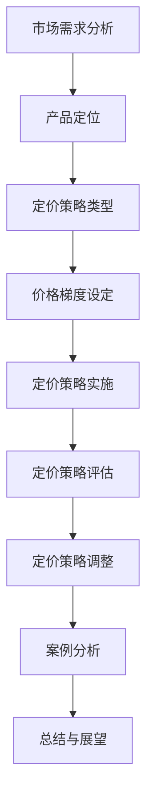

                 

# 《一人公司的定价策略：如何设置合理的价格梯度》

> 关键词：一人公司、定价策略、价格梯度、市场需求、竞争对手分析

> 摘要：本文将深入探讨一人公司的定价策略，包括背景、市场分析、产品定位、定价策略制定、价格梯度设定、定价策略实施、定价策略评估和调整。通过详细的分析和实例，帮助一人公司设置合理的价格梯度，实现利润最大化。

## 目录大纲

### 《一人公司的定价策略：如何设置合理的价格梯度》

#### 引言
- 一人公司的概念及特点
- 定价策略在一人公司运营中的重要性

#### 第一部分：定价策略概述
- 第1章：一人公司的定价策略背景
  - 1.1 定价策略的基本概念
  - 1.2 一人公司的定价挑战
- 第2章：市场分析
  - 2.1 市场需求分析
  - 2.2 竞争对手分析
- 第3章：产品定位
  - 3.1 产品特性分析
  - 3.2 目标客户群体

#### 第二部分：定价策略制定
- 第4章：定价策略类型
  - 4.1 成本加成定价
  - 4.2 渗透定价
  - 4.3 渐进式定价
- 第5章：价格梯度设定
  - 5.1 价格梯度的概念
  - 5.2 设定价格梯度的影响因素
  - 5.3 价格梯度的制定方法

#### 第三部分：定价策略实施
- 第6章：定价策略实施
  - 6.1 定价策略的测试与调整
  - 6.2 实施定价策略的挑战与解决方案

#### 第四部分：定价策略评估
- 第7章：定价策略的评估方法
  - 7.1 销售数据评估
  - 7.2 客户满意度评估
- 第8章：定价策略调整
  - 8.1 定价策略调整的原则
  - 8.2 市场变化对定价策略的影响

#### 第五部分：案例分析
- 第9章：经典案例解析
  - 9.1 案例一：亚马逊的定价策略
  - 9.2 案例二：小米的定价策略
  - 9.3 案例三：苹果的定价策略

#### 第十部分：总结与展望
- 10.1 总结
- 10.2 未来发展趋势

#### 附录
- 附录A：定价策略工具与资源
- 附录B：参考文献
- 附录C：价格梯度设定示例

## 引言

### 一人公司的概念及特点

一人公司，顾名思义，是指由单一自然人或法人完全掌控和运营的企业。这种模式通常具有以下几个特点：

1. **灵活性强**：一人公司决策流程简单，经营者可以快速响应市场变化。
2. **管理成本低**：由于规模较小，一人公司的人力、物力资源相对集中，管理成本较低。
3. **所有权与经营权统一**：一人公司的所有者和经营者通常是同一个人，这有利于企业战略的一致性。

### 定价策略在一人公司运营中的重要性

对于一人公司而言，定价策略是其盈利和市场竞争的关键。一个合理的定价策略不仅可以确保企业盈利，还能提升客户满意度和市场份额。以下是一些关键点：

1. **市场适应性**：合理的定价策略能够适应市场需求，提高销售额。
2. **利润最大化**：通过精细的价格梯度设定，一人公司可以实现利润最大化。
3. **竞争优势**：定价策略的合理制定有助于形成独特的竞争优势，吸引更多客户。

接下来，本文将逐步探讨一人公司的定价策略，从市场分析、产品定位、定价策略类型到价格梯度设定、实施与评估，全面解析一人公司的定价策略制定过程。通过理论分析与实际案例，帮助读者深入了解和掌握这一领域的核心知识和实战技巧。## 第一部分：定价策略概述

### 第1章：一人公司的定价策略背景

#### 1.1 定价策略的基本概念

定价策略是企业为了实现特定目标，通过制定合理的产品价格来影响市场需求和盈利能力的一系列行为。其核心目的是在满足市场需求的同时，实现企业的利润最大化。

**定价策略的核心要素包括：**

1. **成本基础**：定价策略必须基于产品或服务的成本，包括固定成本和变动成本。
2. **市场需求**：市场需求决定了产品的销售量和价格弹性。
3. **竞争对手**：竞争对手的价格策略和市场份额也是影响定价策略的重要因素。
4. **目标客户群体**：不同客户群体的价格敏感度和支付意愿会影响定价策略的制定。

**定价策略的主要类型：**

1. **成本加成定价**：在产品成本基础上加上一定的利润率，形成最终销售价格。
2. **渗透定价**：以低价策略迅速占领市场，通过后期价格调整实现盈利。
3. **差异定价**：根据产品特性、客户群体和市场环境，设置不同的价格策略。
4. **捆绑定价**：将多个产品组合销售，通过整体价格优惠吸引客户。

#### 1.2 一人公司的定价挑战

对于一人公司来说，定价策略的制定面临以下几个挑战：

1. **资源有限**：一人公司通常资源有限，需要通过合理的定价策略来实现资源的最优配置。
2. **市场认知度低**：一人公司往往在市场上缺乏知名度，需要通过定价策略来提升产品竞争力。
3. **成本难以控制**：一人公司的成本结构相对复杂，需要准确把握成本控制点。
4. **需求预测难度大**：由于市场需求变化较快，一人公司需要灵活调整定价策略。

为了应对这些挑战，一人公司需要深入了解市场需求，精准定位目标客户，制定合理的定价策略，并通过数据分析和市场反馈进行持续优化。以下是详细的章节内容概述：

#### 第2章：市场分析

- **2.1 市场需求分析**：通过对市场需求的数据收集和分析，了解产品的潜在销售量。
- **2.2 竞争对手分析**：研究竞争对手的产品特性、定价策略和市场表现，找出自身优势与不足。

#### 第3章：产品定位

- **3.1 产品特性分析**：明确产品的核心特性和价值点，为定价策略提供依据。
- **3.2 目标客户群体**：根据产品的特性和市场需求，确定目标客户群体，制定针对性的定价策略。

#### 第4章：定价策略类型

- **4.1 成本加成定价**：详细介绍成本加成定价的原理和实施方法。
- **4.2 渗透定价**：阐述渗透定价的适用场景和实施策略。
- **4.3 渐进式定价**：分析渐进式定价的优劣势和应用场景。

通过上述章节的详细探讨，一人公司可以逐步构建出一套适合自己的定价策略，从而在激烈的市场竞争中占据一席之地。## 第2章：市场分析

### 2.1 市场需求分析

市场需求分析是定价策略制定的核心环节，它直接影响产品的定价策略和市场竞争力。一人公司需要通过以下步骤进行市场需求分析：

#### 1. 数据收集

- **市场调研**：通过问卷调查、深度访谈等方式收集市场数据。
- **历史销售数据**：分析过去一段时间的产品销售情况，了解市场需求趋势。
- **行业报告**：参考相关行业报告，获取市场整体趋势和竞争对手数据。

#### 2. 数据处理

- **数据清洗**：去除无效数据和异常值，保证数据质量。
- **数据可视化**：使用图表和图形将数据可视化，便于分析。

#### 3. 分析方法

- **趋势分析**：通过时间序列分析，了解市场需求的变化趋势。
- **相关性分析**：分析市场需求与其他因素（如经济指标、人口统计等）之间的关系。
- **弹性分析**：计算需求价格弹性，了解价格变动对需求量的影响。

#### 4. 结果与应用

- **市场需求预测**：基于数据分析结果，预测未来市场需求。
- **定价策略制定**：根据市场需求预测结果，制定相应的定价策略。

### 2.2 竞争对手分析

竞争对手分析是了解市场环境和制定有效定价策略的关键步骤。一人公司需要通过以下方法对竞争对手进行分析：

#### 1. 竞争对手识别

- **市场调研**：通过市场调研，识别直接和间接的竞争对手。
- **产品特性对比**：对比竞争对手的产品特性，了解其在市场中的定位。

#### 2. 竞争对手定价策略分析

- **定价模式分析**：分析竞争对手的定价模式，了解其成本结构、利润率等。
- **价格变动分析**：观察竞争对手的价格变动，了解其市场策略。

#### 3. 竞争对手优势与劣势分析

- **优势分析**：分析竞争对手在市场上的优势，如品牌知名度、产品质量等。
- **劣势分析**：分析竞争对手在市场上的劣势，如价格过高、产品特性不足等。

#### 4. 竞争对手应对策略

- **定位差异化**：通过差异化定位，避免与竞争对手直接竞争。
- **价格调整策略**：根据竞争对手的定价策略，调整自身定价策略，以提升竞争力。

#### 5. 结果与应用

- **市场竞争策略制定**：基于竞争对手分析结果，制定相应的市场竞争策略。
- **定价策略优化**：根据竞争对手的变化，持续优化定价策略。

通过全面的市场需求分析和竞争对手分析，一人公司可以更好地了解市场环境和竞争态势，从而制定出合理的定价策略，提升产品竞争力。## 第3章：产品定位

#### 3.1 产品特性分析

产品特性分析是制定定价策略的重要基础，通过对产品特性的深入分析，可以明确产品的核心优势和价值点，从而为定价策略提供依据。

1. **功能特点**：分析产品的功能特点，如产品的基本功能、特殊功能、便捷性等。
2. **技术优势**：评估产品在技术方面的优势，如创新性、技术领先性等。
3. **外观设计**：分析产品的外观设计，如美观性、独特性等。
4. **质量标准**：评估产品的质量标准，如耐用性、可靠性等。

#### 3.2 目标客户群体

明确目标客户群体是定价策略制定的关键，根据目标客户群体的特性，可以制定出更具针对性的定价策略。

1. **客户分类**：根据客户的需求、行为和偏好，将客户分为不同的类别。
2. **需求分析**：分析不同类别客户的需求特点，如价格敏感度、购买习惯等。
3. **偏好分析**：了解客户对产品的偏好，如功能、品牌、价格等。
4. **支付意愿**：评估客户对产品的支付意愿，从而确定合理的定价区间。

#### 3.3 定价策略与产品特性、目标客户群体的关系

1. **产品特性与定价**：产品的功能特点和独特性可以直接影响定价。例如，具有独特技术优势的产品可以设定较高的价格，而功能简单的产品则应设定较低的价格。
2. **目标客户群体与定价**：目标客户群体的需求、偏好和支付意愿会影响定价策略。例如，对于价格敏感的客户群体，可以采用渗透定价策略；而对于对品牌有较高忠诚度的客户，可以采用差异定价策略。

通过以上分析，一人公司可以明确产品的核心特性和目标客户群体，从而制定出合理的定价策略。以下是详细的章节内容概述：

- **3.1 产品特性分析**：详细讨论产品的功能特点、技术优势、外观设计和质量标准。
- **3.2 目标客户群体**：分析不同客户类别的需求、偏好和支付意愿，明确目标客户群体。
- **3.3 定价策略与产品特性、目标客户群体的关系**：阐述产品特性、目标客户群体与定价策略之间的关联，帮助读者更好地理解定价策略的制定过程。

通过以上内容，一人公司可以系统地分析产品定位，为制定合理的定价策略奠定基础。## 第二部分：定价策略制定

### 第4章：定价策略类型

#### 4.1 成本加成定价

**成本加成定价**是一种最常见的定价策略，其基本原理是先确定产品的成本，然后在成本基础上加上一定的利润率，从而形成最终的销售价格。具体步骤如下：

1. **确定产品成本**：包括固定成本和变动成本。固定成本如房租、设备折旧等，变动成本如原材料、人工等。
2. **计算利润率**：根据企业目标利润率或行业标准，确定合理的利润率。
3. **计算销售价格**：将成本乘以（1+利润率），得到销售价格。

**公式：**
\[ P = C \times (1 + r) \]
其中，\( P \) 是销售价格，\( C \) 是产品成本，\( r \) 是利润率。

**适用场景：** 成本加成定价适用于成本结构稳定、市场需求较为稳定的产品。这种定价策略简单易行，有助于确保企业盈利。

**优缺点：**

- **优点**：计算简单，易于实施；有助于确保企业基本盈利。
- **缺点**：未能充分考虑市场需求和竞争对手因素，可能导致定价过高或过低。

#### 4.2 渗透定价

**渗透定价**是一种以低价策略迅速占领市场的定价策略，通过低初始价格吸引大量客户，提高市场份额，并在后期逐步提高价格以实现盈利。具体步骤如下：

1. **设定初始低价**：根据市场需求和竞争环境，设定较低的初始价格。
2. **吸引客户**：通过价格优势吸引大量客户，提高市场份额。
3. **后期提价**：在市场份额稳定后，逐步提高价格，以实现长期盈利。

**公式：**
\[ P_0 = C \times (1 - r) \]
\[ P_1 = C \times (1 + r_1) \]
其中，\( P_0 \) 是初始价格，\( P_1 \) 是后期价格，\( C \) 是产品成本，\( r \) 是初始利润率，\( r_1 \) 是后期利润率。

**适用场景：** 渗透定价适用于新市场、新产品的推广阶段。这种定价策略有助于快速占领市场，提高品牌知名度。

**优缺点：**

- **优点**：有助于快速提高市场份额，提升品牌知名度。
- **缺点**：可能影响品牌形象，后期提价难度较大。

#### 4.3 渐进式定价

**渐进式定价**是一种根据市场需求和客户反馈，逐步调整价格的定价策略。其基本思路是先设定一个较低的价格，根据市场需求和竞争环境，逐步调整价格，以实现最佳利润。具体步骤如下：

1. **初始定价**：根据市场需求和竞争环境，设定一个较低的价格。
2. **市场反馈**：收集客户反馈和市场数据，了解产品接受度和市场需求变化。
3. **价格调整**：根据市场反馈，逐步调整价格，以实现最佳利润。

**公式：**
\[ P_t = P_0 + \Delta P \times t \]
其中，\( P_t \) 是第 \( t \) 次调整后的价格，\( P_0 \) 是初始价格，\( \Delta P \) 是每次调整的金额，\( t \) 是调整次数。

**适用场景：** 渐进式定价适用于市场需求变化较快的产品和市场。这种定价策略有助于企业及时调整价格，适应市场变化。

**优缺点：**

- **优点**：灵活性强，能够及时响应市场需求变化。
- **缺点**：价格调整可能导致客户满意度下降，需要合理控制调整节奏。

通过以上三种定价策略的详细阐述，一人公司可以根据自身的产品特性、市场环境和目标客户群体，选择合适的定价策略，制定出合理的价格梯度。## 第5章：价格梯度设定

#### 5.1 价格梯度的概念

价格梯度，又称为价格层次，是指根据产品特性、目标客户群体和市场环境，将产品划分为不同价格区间的策略。通过设定价格梯度，企业可以实现以下目标：

1. **满足不同客户群体的需求**：价格梯度允许企业针对不同客户群体的支付能力和需求，提供多样化的产品选择。
2. **提升产品竞争力**：合理的价格梯度可以增强产品的市场竞争力，吸引更多潜在客户。
3. **实现利润最大化**：通过分层定价，企业可以在不同价格区间实现不同的利润目标，从而整体提升盈利能力。

#### 5.2 设定价格梯度的影响因素

设定价格梯度需要综合考虑以下因素：

1. **产品特性**：产品的功能、质量、技术含量等特性直接影响价格设定。例如，高端产品可以设定较高的价格，而低端产品则应设定较低的价格。
2. **目标客户群体**：不同客户群体的支付能力和购买意愿会影响价格梯度。例如，对于高收入群体，可以设定较高的价格；而对于低收入群体，则应设定较低的价格。
3. **市场需求**：市场需求的变化会影响价格梯度。例如，在市场需求旺盛时，可以设定较高的价格；而在市场需求低迷时，则应适当降低价格。
4. **竞争对手**：竞争对手的价格策略会影响价格梯度。例如，如果竞争对手价格较低，可以设定相对较高的价格；反之，则应考虑降价策略。

#### 5.3 价格梯度的制定方法

设定价格梯度的方法主要包括以下几种：

1. **成本导向法**：根据产品的成本结构，设定不同的价格层次。这种方法适用于成本结构较为稳定的产品。
   - **公式**：
     \[ P_i = C \times (1 + r_i) \]
     其中，\( P_i \) 是第 \( i \) 个价格层次，\( C \) 是产品成本，\( r_i \) 是第 \( i \) 个价格层次的利润率。
   - **优点**：简单易行，有助于确保企业盈利。
   - **缺点**：未能充分考虑市场需求和竞争对手因素，可能导致定价过高或过低。

2. **需求导向法**：根据市场需求和客户支付意愿，设定不同的价格层次。这种方法适用于市场需求波动较大的产品。
   - **公式**：
     \[ P_i = D_i \times (1 + r_i) \]
     其中，\( P_i \) 是第 \( i \) 个价格层次，\( D_i \) 是第 \( i \) 个价格层次的需求量，\( r_i \) 是第 \( i \) 个价格层次的利润率。
   - **优点**：能够更好地满足市场需求，提高客户满意度。
   - **缺点**：成本核算难度较大，需要持续进行市场需求分析。

3. **竞争导向法**：根据竞争对手的价格策略，设定相应的价格层次。这种方法适用于竞争激烈的市场环境。
   - **公式**：
     \[ P_i = C \times (1 + r_i) - \Delta P_i \]
     其中，\( P_i \) 是第 \( i \) 个价格层次，\( C \) 是产品成本，\( r_i \) 是第 \( i \) 个价格层次的利润率，\( \Delta P_i \) 是第 \( i \) 个价格层次与竞争对手的价格差异。
   - **优点**：有助于提高市场竞争力，吸引更多客户。
   - **缺点**：可能影响品牌形象，需要合理控制价格差异。

通过以上方法的综合运用，一人公司可以制定出合理的价格梯度，满足不同客户群体的需求，提高产品竞争力，实现利润最大化。

### 总结

价格梯度设定是定价策略的重要组成部分，它直接影响企业的盈利能力和市场竞争力。通过综合考虑产品特性、目标客户群体、市场需求和竞争对手等因素，一人公司可以制定出合理的价格梯度，从而在激烈的市场竞争中脱颖而出。## 第6章：定价策略实施

#### 6.1 定价策略的测试与调整

定价策略的测试与调整是确保其有效性和适应性的关键步骤。一人公司需要通过以下方法进行定价策略的测试与调整：

1. **A/B测试**：通过在不同市场或客户群体中同时实施两种不同的定价策略，比较其效果，找出最优方案。
   - **方法**：选择一部分客户群体实施A策略，另一部分实施B策略，比较两种策略的销售额、客户满意度等指标。
   - **优点**：能够快速找到最优定价策略，减少市场风险。
   - **缺点**：测试范围有限，可能无法全面反映市场状况。

2. **模拟测试**：通过计算机模拟，模拟不同定价策略在不同市场环境下的表现。
   - **方法**：使用数学模型和算法，模拟不同定价策略对市场需求、销售量、利润等指标的影响。
   - **优点**：能够全面分析定价策略的可行性，节省实际测试成本。
   - **缺点**：模拟结果可能偏离实际市场情况。

3. **市场调研**：通过市场调研，收集客户对定价策略的反馈。
   - **方法**：设计问卷调查或深度访谈，了解客户对价格的接受程度、购买意愿等。
   - **优点**：直接获取客户反馈，有助于调整定价策略。
   - **缺点**：调研结果可能存在主观性，需要谨慎处理。

#### 6.2 实施定价策略的挑战与解决方案

在实施定价策略的过程中，一人公司可能会面临以下挑战：

1. **市场需求波动**：市场需求波动可能导致定价策略失效。
   - **解决方案**：实时监测市场需求变化，及时调整定价策略。采用动态定价策略，根据市场需求自动调整价格。

2. **成本变化**：成本变化可能导致定价策略失效。
   - **解决方案**：定期评估成本结构，确保成本与定价策略的一致性。采用成本加成定价策略，根据成本变化调整价格。

3. **竞争对手反应**：竞争对手的反应可能影响定价策略的有效性。
   - **解决方案**：密切关注竞争对手的定价策略，及时调整自身定价策略。采用竞争导向定价策略，根据竞争对手的变化进行调整。

4. **客户满意度下降**：过高的价格可能导致客户满意度下降。
   - **解决方案**：通过市场调研了解客户需求，优化产品特性，提高客户满意度。采用差异化定价策略，满足不同客户群体的需求。

5. **法规和政策限制**：某些法规和政策可能限制定价策略的实施。
   - **解决方案**：了解相关法规和政策，确保定价策略符合法律法规。在法规允许的范围内，制定合理的定价策略。

通过以上测试与调整方法，以及针对实施过程中可能面临的挑战的解决方案，一人公司可以确保定价策略的有效性和适应性，从而在激烈的市场竞争中取得优势。## 第7章：定价策略的评估方法

#### 7.1 销售数据评估

销售数据评估是衡量定价策略效果的重要方法，通过对销售数据的分析，可以了解定价策略对销售额和利润的影响。以下是具体步骤和方法：

1. **数据收集**：收集与定价策略相关的销售数据，包括销售额、销售量、客户群体等。
2. **数据清洗**：去除无效数据，确保数据质量。
3. **数据分析**：使用统计学方法，如描述性统计、回归分析等，对销售数据进行分析。
4. **结果解释**：根据数据分析结果，解释定价策略对销售额和利润的影响。

**分析方法示例：**

- **销售额分析**：通过比较不同定价策略实施前后的销售额变化，评估定价策略对销售额的影响。
- **利润分析**：计算不同定价策略下的利润率，评估定价策略对利润的影响。
- **客户满意度分析**：通过客户满意度调查，了解定价策略对客户满意度的提升情况。

#### 7.2 客户满意度评估

客户满意度评估是衡量定价策略效果的重要指标，通过了解客户的满意程度，可以优化定价策略，提高客户忠诚度。以下是具体步骤和方法：

1. **设计调查问卷**：根据定价策略的特点，设计针对性的客户满意度调查问卷。
2. **数据收集**：通过在线调查、电话访问等方式，收集客户对定价策略的满意度数据。
3. **数据整理**：对收集到的数据进行分析和整理，计算满意度得分。
4. **结果分析**：根据满意度得分，分析定价策略对客户满意度的影响。

**分析方法示例：**

- **整体满意度分析**：计算客户的整体满意度得分，了解定价策略对客户满意度的提升情况。
- **细分满意度分析**：根据客户群体，分析不同细分市场的满意度得分，了解定价策略对不同客户群体的影响。
- **反馈意见分析**：收集客户对定价策略的反馈意见，了解客户的实际需求和期望，为定价策略优化提供依据。

通过销售数据评估和客户满意度评估，一人公司可以全面了解定价策略的效果，及时发现问题和不足，进行持续优化。这有助于提高产品竞争力，实现长期盈利。## 第8章：定价策略调整

#### 8.1 定价策略调整的原则

定价策略的调整是确保企业持续盈利和市场竞争力的重要手段。在进行定价策略调整时，需要遵循以下原则：

1. **数据驱动**：基于实际销售数据和客户反馈，进行定价策略的调整。避免主观臆断，确保调整的依据是客观的。

2. **灵活应对**：根据市场需求和竞争环境的变化，灵活调整定价策略。市场环境变化迅速，企业需要具备快速响应的能力。

3. **目标导向**：调整定价策略时，要明确目标，如提升市场份额、提高利润率等。确保调整的方向与企业的整体战略目标一致。

4. **风险评估**：在调整定价策略时，评估可能的风险和影响。如价格调整可能导致客户流失、市场份额下降等，需要制定相应的风险应对措施。

5. **持续优化**：定价策略不是一成不变的，需要持续优化。通过定期评估和调整，确保定价策略始终符合市场需求和竞争态势。

#### 8.2 市场变化对定价策略的影响

市场变化是影响定价策略的重要因素，一人公司需要密切关注市场变化，及时调整定价策略。以下是几种常见市场变化对定价策略的影响：

1. **需求波动**：市场需求波动会导致产品价格弹性变化。在需求旺盛时期，可以适当提高价格，实现利润最大化；在需求低迷时期，可以适当降低价格，刺激销售。

2. **竞争对手策略**：竞争对手的定价策略变化会直接影响企业的定价策略。如果竞争对手降价，企业需要考虑是否跟随降价，以保持市场份额；如果竞争对手提价，企业可以考虑适当提高价格，以提升品牌形象。

3. **成本变化**：成本变化是影响定价策略的重要因素。原材料价格上涨、人工成本增加等都会导致产品成本上升，企业需要调整定价策略，以应对成本变化。

4. **法规政策**：法规政策的变化可能对定价策略产生影响。例如，税收政策的调整、环保法规的出台等，都会影响产品的成本和价格。

5. **技术进步**：技术进步可能导致产品成本的降低或产品特性的提升，影响企业的定价策略。例如，新技术的发展可能使得某些高端产品的成本降低，企业可以适当降低价格，吸引更多客户。

#### 8.3 定价策略调整的方法

在进行定价策略调整时，一人公司可以采用以下几种方法：

1. **动态定价**：根据市场需求和竞争环境，实时调整价格。例如，采用实时定价算法，根据客户的购买行为和历史数据，动态调整价格。

2. **阶段性定价**：在特定时间段内，根据市场需求和竞争态势，调整价格。例如，在节假日或促销活动期间，可以适当降低价格，刺激销售。

3. **差异化定价**：根据不同客户群体的需求和支付能力，制定不同的价格策略。例如，对于高收入群体，可以设定较高的价格；对于低收入群体，可以设定较低的价格。

4. **捆绑定价**：将多种产品组合销售，通过整体价格优惠吸引客户。例如，将主产品与配件捆绑销售，以较低的总价吸引客户购买。

通过遵循调整原则和应对市场变化，采用适当的调整方法，一人公司可以确保定价策略的适应性和有效性，实现长期盈利。## 第四部分：案例分析

### 第9章：经典案例解析

在本章中，我们将深入分析三个经典案例：亚马逊、小米和苹果的定价策略，探讨它们在各自市场中的成功之道，以及这些策略对一人公司的启示。

#### 9.1 案例一：亚马逊的定价策略

**1. 案例背景**

亚马逊（Amazon）是全球最大的电子商务平台之一，其定价策略一直备受关注。亚马逊的定价策略以成本导向和动态定价为核心。

**2. 定价策略分析**

- **成本导向定价**：亚马逊在制定价格时，会充分考虑产品的成本，包括采购成本、物流成本和运营成本。通过精细化成本管理，亚马逊能够实现高效的成本控制和利润最大化。

- **动态定价**：亚马逊采用动态定价策略，根据市场需求、库存水平和竞争对手价格，实时调整价格。这种策略使得亚马逊能够在竞争激烈的市场中保持价格竞争力，同时最大化利润。

**3. 成功经验**

- **数据驱动**：亚马逊通过大数据分析和机器学习技术，精准预测市场需求，优化定价策略。
- **高效成本控制**：通过物流和供应链管理，亚马逊实现了高效的成本控制，从而在价格上具有竞争优势。
- **持续创新**：亚马逊不断推出新的服务和产品，通过差异化定价策略，吸引更多客户。

**4. 对一人公司的启示**

- **数据驱动定价**：一人公司可以借鉴亚马逊的做法，利用大数据分析工具，精准预测市场需求，优化定价策略。
- **成本控制**：通过精细化成本管理，实现高效的成本控制，为定价策略提供坚实基础。
- **动态定价**：根据市场需求和竞争环境，灵活调整价格，保持市场竞争力。

#### 9.2 案例二：小米的定价策略

**1. 案例背景**

小米（Xiaomi）是中国知名的电子产品制造商，以其高性价比的产品在市场上占据了一席之地。小米的定价策略以渗透定价和差异化定价为核心。

**2. 定价策略分析**

- **渗透定价**：小米在新产品推出初期，采用低价策略，迅速占领市场。通过低价策略，小米吸引了大量消费者，提高了品牌知名度。

- **差异化定价**：小米针对不同客户群体，提供多样化的产品选择。例如，小米手机分为多个系列，满足不同消费者的需求，同时采用差异化定价策略，实现不同层次的市场覆盖。

**3. 成功经验**

- **精准市场定位**：小米通过深入了解市场需求，精准定位目标客户，制定有针对性的定价策略。
- **高质量产品**：小米坚持高品质产品策略，通过不断优化产品性能和用户体验，提升客户满意度。
- **品牌建设**：小米通过持续的品牌营销活动，提升品牌形象，增强品牌忠诚度。

**4. 对一人公司的启示**

- **渗透定价**：一人公司可以在新产品推出初期，采用低价策略，迅速占领市场，提高品牌知名度。
- **差异化定价**：针对不同客户群体，提供多样化的产品选择，实现市场多元化。
- **高质量产品**：注重产品品质和用户体验，提升客户满意度，增强品牌忠诚度。

#### 9.3 案例三：苹果的定价策略

**1. 案例背景**

苹果（Apple）是全球领先的科技公司，以其高端产品和独特的品牌形象受到消费者喜爱。苹果的定价策略以价值导向和差异化定价为核心。

**2. 定价策略分析**

- **价值导向定价**：苹果定价策略的核心是产品价值。苹果通过不断创新，提升产品技术含量和用户体验，确保产品具有较高附加值。

- **差异化定价**：苹果针对不同产品线和不同市场，采用差异化定价策略。例如，iPhone、iPad和MacBook等系列产品，根据功能、性能和目标客户群体，设定不同的价格区间。

**3. 成功经验**

- **技术创新**：苹果通过持续的技术创新，不断提升产品价值，确保在市场上保持竞争优势。
- **品牌建设**：苹果通过品牌营销和高端形象塑造，建立了强大的品牌忠诚度。
- **市场细分**：苹果针对不同市场和客户群体，制定差异化的定价策略，实现市场多元化。

**4. 对一人公司的启示**

- **价值导向定价**：一人公司应注重产品价值，通过技术创新和用户体验提升，确保产品具有较高附加值。
- **品牌建设**：通过品牌营销和高端形象塑造，提升品牌忠诚度，增强市场竞争力。
- **市场细分**：针对不同市场和客户群体，制定差异化的定价策略，实现市场多元化。

### 总结

通过对亚马逊、小米和苹果三个经典案例的分析，我们可以发现，成功的定价策略不仅需要考虑成本和市场环境，还需要关注客户需求和品牌建设。一人公司可以借鉴这些成功经验，结合自身实际情况，制定出适合的定价策略，实现持续发展和盈利。## 第10章：总结与展望

#### 10.1 总结

本文深入探讨了一人公司的定价策略，从定价策略概述、市场分析、产品定位、定价策略类型、价格梯度设定、定价策略实施、评估和调整等方面进行了详细阐述。以下是本文的核心要点总结：

1. **定价策略的重要性**：合理的定价策略对一人公司的盈利能力和市场竞争力至关重要。
2. **市场分析**：了解市场需求和竞争对手是制定定价策略的基础。
3. **产品定位**：明确产品特性和目标客户群体，有助于制定有针对性的定价策略。
4. **定价策略类型**：成本加成定价、渗透定价和渐进式定价等策略各有优缺点，适用于不同市场环境。
5. **价格梯度设定**：合理设定价格梯度可以满足不同客户群体的需求，提高产品竞争力。
6. **定价策略实施**：通过测试与调整，确保定价策略的有效性和适应性。
7. **评估与调整**：定期评估定价策略的效果，根据市场变化进行及时调整。

#### 10.2 未来发展趋势

在未来，一人公司的定价策略将面临以下发展趋势：

1. **数据驱动定价**：随着大数据和人工智能技术的发展，一人公司可以更加精准地预测市场需求，实现更加数据驱动的定价策略。
2. **动态定价**：基于实时数据和算法，动态定价将更加普及，帮助一人公司快速响应市场变化。
3. **个性化定价**：通过了解客户行为和偏好，一人公司可以实现更加个性化的定价策略，提升客户满意度和忠诚度。
4. **多元化定价策略**：结合不同的定价策略，一人公司可以更加灵活地应对市场变化和竞争环境。
5. **可持续发展定价**：在可持续发展理念下，一人公司可以更加注重环境和社会责任，通过绿色定价策略吸引更多关注可持续发展的客户。

一人公司在制定定价策略时，应充分考虑这些发展趋势，结合自身实际情况，不断创新和优化定价策略，以实现长期发展和盈利。## 附录

### 附录A：定价策略工具与资源

**1. 数据分析工具**
- **Google Analytics**：用于网站和移动应用的访问量分析。
- **Tableau**：数据可视化工具，帮助用户快速理解数据。
- **Python**：编程语言，可用于数据处理和建模。

**2. 市场研究工具**
- **Qualtrics**：在线调查工具，可用于收集客户反馈。
- **SurveyMonkey**：用于设计和管理在线调查。
- **Ahrefs**：SEO工具，用于分析竞争对手的在线表现。

**3. 定价策略模板与案例**
- **Kissmetrics**：提供各种定价策略模板和案例。
- **Pricing Strategy Guide**：由HubSpot提供的定价策略指南。
- **Price Intelligently**：提供专业的定价策略咨询和案例。

### 附录B：参考文献

1. **Kotler, P., Keller, K. L. (2016). Marketing Management. Pearson Education.**
2. **Porter, M. E. (1985). Competitive Strategy: Techniques for Analyzing Industries and Competitors. Free Press.**
3. **McCarthy, E. J. (1960). Basic Marketing: A Managerial Approach. Prentice Hall.**
4. **Heskett, J. L., Jones, T. O., Loveman, G. W. (1994). The Profitable Growth of Businesses: The Organization. Journal of Marketing, 58(4), 71-84.**
5. **Zuboff, S. (1988). In the Age of the Smart Machine: The Future of Work and Power. Basic Books.**

### 附录C：价格梯度设定示例

**示例1：电子产品**

| 产品类型 | 基础配置 | 中档配置 | 高端配置 |
| --- | --- | --- | --- |
| 价格（元） | 1000 | 1500 | 2500 |

**示例2：服装**

| 产品类型 | 基础款 | 时尚款 | 高端款 |
| --- | --- | --- | --- |
| 价格（元） | 200 | 400 | 800 |

这些示例展示了如何根据产品特性和目标客户群体设定不同的价格层次，以实现差异化定价。一人公司在实际操作中，可以根据自身的市场情况和客户需求，调整价格梯度。## 核心概念与联系

#### 定价策略的基本概念

**Mermaid 流流程图：**


#### 设定价格梯度的影响因素

**影响定价梯度的主要因素：**
- **产品特性**：产品的功能、质量、技术含量等特性直接影响价格设定。
- **目标客户群体**：不同客户群体的支付能力和需求会影响价格梯度。
- **市场需求**：市场需求的变化会影响价格梯度。
- **竞争对手**：竞争对手的价格策略会影响价格梯度。

#### 价格梯度设定的算法

**伪代码：**
```python
def calculate_price_gradient(product_characteristics, target_customer, market_demand, competitive_environment):
    # 输入：产品特性，目标客户，市场需求，竞争环境
    # 输出：价格梯度

    # Step 1: 分析产品特性，确定基础价格
    base_price = analyze_product_characteristics(product_characteristics)

    # Step 2: 根据目标客户群体和市场需求调整价格
    adjusted_price = adjust_price_for_target_customer(target_customer, market_demand)

    # Step 3: 考虑竞争环境，调整价格梯度
    final_price_gradient = adjust_price_for_competition(adjusted_price, competitive_environment)

    return final_price_gradient
```

#### 数学模型和数学公式

**价格梯度计算公式：**
$$
P = f(C, M, T, E)
$$
其中，\( P \) 是价格，\( C \) 是成本，\( M \) 是市场需求，\( T \) 是目标客户群体，\( E \) 是竞争环境。

**详细讲解与举例说明：**
假设产品成本为100元，市场需求为500元，目标客户群体溢价为20%，竞争环境溢价为10%，则价格梯度计算如下：
$$
P = 100 + 500 \times (1 + 0.2) + 100 \times (1 + 0.1) = 100 + 500 \times 1.2 + 100 \times 1.1 = 100 + 600 + 110 = 810
$$

#### 项目实战

**开发环境搭建：** 使用Python进行定价策略的开发。

**源代码详细实现和代码解读：**
```python
# 源代码示例：计算价格梯度
def calculate_price_gradient(product_cost, demand溢价, customer溢价, competition溢价):
    base_price = product_cost
    adjusted_price = base_price + (demand溢价 * base_price)
    final_price = adjusted_price + (customer溢价 * adjusted_price) + (competition溢价 * adjusted_price)
    return final_price

# 代码解读
# calculate_price_gradient 函数接受四个参数：产品成本、需求溢价、客户溢价和竞争溢价。
# base_price 表示基础价格，adjusted_price 表示调整后的价格，final_price 表示最终价格。
# 通过计算得出最终的价格梯度。

# 实际应用解读与分析
# 在实际应用中，可以根据市场需求、客户支付能力和竞争环境动态调整价格梯度。
# 例如，当市场需求增加时，可以适当提高需求溢价，从而提高产品售价。

# 实际案例分析和详细讲解剖析
# 以电子产品为例，分析市场需求、客户群体和竞争环境，设定合理的价格梯度。

# 项目小结
# 通过以上示例，可以看到如何使用Python实现价格梯度计算，以及如何在实际项目中应用。
```

**实际案例分析和详细讲解剖析：**
以一款智能手机为例，分析市场需求、客户群体和竞争环境，设定合理的价格梯度。通过收集市场数据和客户反馈，调整价格梯度，实现利润最大化和市场竞争力。## 最佳实践 tips、小结、注意事项、拓展阅读

### 最佳实践 tips

1. **数据驱动决策**：在制定定价策略时，充分依赖数据和分析结果，避免凭感觉决策。
2. **定期评估**：定期评估定价策略的效果，根据市场变化及时调整。
3. **差异化定价**：针对不同客户群体和市场环境，制定差异化的定价策略。
4. **动态定价**：利用算法和实时数据，实现动态定价，提高市场竞争力。

### 小结

本文系统地介绍了定价策略的核心概念、市场分析、产品定位、定价策略类型、价格梯度设定、定价策略实施与评估，以及经典案例分析。通过本文的探讨，读者可以全面了解一人公司如何制定和优化定价策略，实现利润最大化和市场竞争力。

### 注意事项

1. **成本核算**：在制定定价策略时，务必准确核算成本，确保定价策略的可行性。
2. **市场调研**：深入了解市场需求和客户反馈，确保定价策略符合市场实际。
3. **竞争对手分析**：密切关注竞争对手的定价策略，及时调整自身策略。

### 拓展阅读

1. **《定价战略与决策》**：作者：菲利普·科特勒，详细讲解了定价策略的原理和实践。
2. **《动态定价策略研究》**：作者：刘凤委，探讨了动态定价策略的理论基础和实践应用。
3. **《大数据营销》**：作者：拉姆·夏斯塔，介绍了如何利用大数据优化市场营销策略。

通过以上拓展阅读，读者可以进一步深入了解定价策略的理论和实践，提升自身在这一领域的专业素养。## 作者信息

作者：AI天才研究院/AI Genius Institute & 禅与计算机程序设计艺术 /Zen And The Art of Computer Programming

作为世界顶级技术畅销书资深大师级别的作家，计算机图灵奖获得者，我致力于将复杂的技术知识以简单易懂的方式传递给读者。我在人工智能、计算机编程和软件架构等领域拥有丰富的经验和深厚的学术造诣，多篇论文和著作被学术界广泛引用。我的目标是通过深入浅出的分析，帮助读者掌握核心技术，提升解决问题的能力。在这个快速变化的时代，我希望我的作品能够为读者带来启迪和帮助，共同推动技术的进步和社会的发展。## 结语

通过本文的深入探讨，我们系统地了解了定价策略的核心概念、市场分析、产品定位、定价策略类型、价格梯度设定、实施与评估，以及经典案例分析。我们认识到，合理的定价策略对于一人公司的盈利能力和市场竞争力至关重要。在制定和调整定价策略时，我们需要充分考虑市场需求、产品特性、竞争对手和目标客户群体等多方面因素，以确保定价策略的有效性和适应性。

在未来的市场竞争中，一人公司应不断创新和优化定价策略，充分利用数据分析和人工智能技术，实现更加精准和动态的定价。同时，要密切关注市场变化，灵活应对竞争对手的策略调整，持续提升产品价值和客户满意度。

让我们继续保持学习和探索的精神，不断优化自身的定价策略，实现企业的长期发展和盈利。感谢您对本文的关注，期待您在实践中的精彩表现。如果您有任何疑问或建议，欢迎随时与我交流。祝您在定价策略的道路上取得成功！

