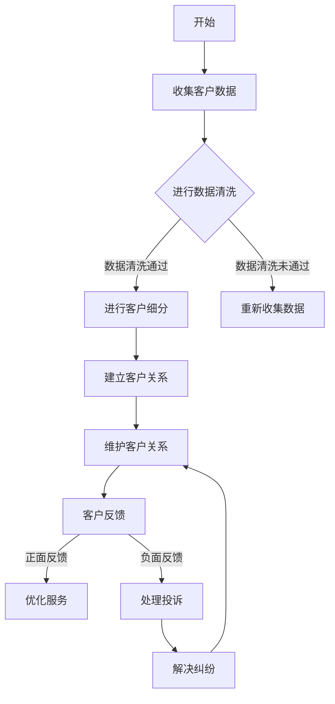

                 

### 《一人公司的客户关系：打造终身忠诚用户的策略》

> 关键词：客户关系管理、终身忠诚用户、用户体验、大数据分析、社交媒体、客户细分、忠诚度计划、投诉处理

> 摘要：本文旨在探讨一人公司如何通过有效的客户关系管理策略，打造终身忠诚用户，实现企业的长期可持续发展。文章将详细分析客户关系管理的基本概念、建立与维护客户关系的方法，以及如何利用大数据提升客户关系管理效果。通过成功案例分析，总结实践经验，提出未来发展趋势与挑战。

#### 目录大纲

1. **建立客户关系**
    - 第1章：客户关系管理的基本概念
    - 第2章：了解你的客户
    - 第3章：建立有效沟通渠道

2. **维护客户关系**
    - 第4章：提供卓越的客户体验
    - 第5章：建立忠诚度计划
    - 第6章：处理客户投诉与纠纷

3. **培养终身客户**
    - 第7章：客户关系维护的策略
    - 第8章：打造忠诚用户社区
    - 第9章：利用大数据提升客户关系管理

4. **成功案例与实践经验**
    - 第10章：成功案例分享
    - 第11章：实践经验总结
    - 第12章：未来发展趋势与挑战

5. **附录**
    - 附录A：客户关系管理工具推荐
    - 附录B：相关资源与进一步阅读
    - 附录C：Mermaid流程图与伪代码示例

6. **结语**

### 文章正文

#### 第1章：客户关系管理的基本概念

> **1.1 客户关系管理的定义与重要性**

客户关系管理（CRM）是一种旨在通过提高客户满意度、忠诚度和口碑来增加企业收益的策略。它涉及到企业内部多个部门，包括销售、市场、服务和客户支持等，共同协作，以提供个性化的客户体验。CRM的目标是建立和维护与客户的长期关系，从而实现客户留存和增长。

客户关系管理的重要性体现在以下几个方面：

- **增加销售额**：通过深入了解客户需求和偏好，企业可以更有效地开展营销活动，提高销售额。
- **提高客户满意度**：通过提供优质的客户服务和支持，企业可以增强客户的满意度和忠诚度。
- **降低客户流失率**：通过有效的客户关系管理，企业可以减少客户流失，提高客户留存率。
- **提高客户口碑**：满意的客户往往会向他人推荐企业，从而提高企业的口碑和市场地位。

> **1.2 客户关系管理的发展历程**

客户关系管理的发展可以追溯到20世纪80年代，当时企业开始意识到客户对企业成功的重要性。以下是CRM发展的几个重要阶段：

- **早期CRM**（1980-1990s）：企业开始使用简单的数据库系统来存储客户信息，以便更好地管理销售和营销活动。
- **接触管理**（1990-2000s）：随着互联网的发展，企业开始利用电子邮件、电话和在线聊天等渠道与客户进行沟通，以提高客户满意度。
- **客户关系管理软件**（2000s）：企业开始采用CRM软件来整合客户数据，提高销售和营销效率。
- **大数据CRM**（2010s-至今）：随着大数据技术的兴起，企业开始利用大数据分析来深入了解客户需求和行为，从而提供更个性化的服务。

> **1.3 客户关系管理的关键要素**

有效的客户关系管理需要关注以下几个关键要素：

- **数据管理**：企业需要收集、存储和分析客户数据，以便深入了解客户需求和偏好。
- **客户细分**：通过将客户划分为不同的群体，企业可以更有针对性地开展营销和服务活动。
- **沟通策略**：与客户建立有效的沟通渠道，及时回应客户需求和反馈。
- **客户体验**：提供卓越的客户体验，包括售前、售中和售后服务，以提高客户满意度和忠诚度。
- **忠诚度计划**：通过奖励和优惠活动，鼓励客户持续使用企业的产品和服务。
- **投诉处理**：及时处理客户投诉和纠纷，以维护客户关系和企业声誉。

#### 第2章：了解你的客户

> **2.1 客户数据分析**

客户数据分析是客户关系管理的重要组成部分。通过分析客户数据，企业可以深入了解客户的需求和行为，从而制定更有效的营销和服务策略。以下是客户数据分析的几个关键步骤：

1. **数据收集**：企业需要收集各种来源的客户数据，包括销售数据、客户反馈、社交媒体互动等。
2. **数据清洗**：清洗和整理数据，以确保数据的准确性和完整性。
3. **数据整合**：将来自不同来源的数据整合到一个统一的数据库中，以便进行分析。
4. **数据分析**：利用数据分析工具和方法，对客户数据进行分析，提取有价值的信息和洞察。
5. **数据可视化**：通过图表和可视化工具，将数据分析结果呈现给企业决策者，以便更好地理解和应用。

> **2.2 客户细分策略**

客户细分策略是将客户划分为不同的群体，以便企业可以更有针对性地开展营销和服务活动。以下是几种常见的客户细分策略：

- **基于行为的数据细分**：根据客户的行为特征，如购买频率、购买金额、购买渠道等，将客户划分为不同的群体。
- **基于人口统计学数据细分**：根据客户的人口统计数据，如年龄、性别、收入、教育程度等，将客户划分为不同的群体。
- **基于心理特征的数据细分**：根据客户的心理特征，如价值观、生活方式、兴趣爱好等，将客户划分为不同的群体。
- **基于价值的数据细分**：根据客户对企业价值的贡献，如客户生命周期价值、潜在价值等，将客户划分为不同的群体。

> **2.3 客户需求与行为分析**

了解客户的需求和行为是建立有效客户关系的基础。以下是客户需求和行为分析的几个关键步骤：

1. **需求调研**：通过问卷调查、访谈、焦点小组讨论等方式，收集客户的反馈和需求。
2. **行为分析**：分析客户的行为数据，如购买历史、浏览习惯、社交媒体互动等，以了解客户的行为模式和偏好。
3. **需求匹配**：将客户的需求与企业的产品和服务进行匹配，以满足客户的需求。
4. **行为预测**：利用数据分析和机器学习技术，预测客户未来的行为和需求，以便企业提供个性化的服务。
5. **需求反馈**：定期收集客户的反馈，以评估企业的服务质量和满足客户需求的能力。

#### 第3章：建立有效沟通渠道

> **3.1 社交媒体与客户关系**

社交媒体已成为企业与客户沟通的重要渠道。通过社交媒体，企业可以与客户进行实时互动，了解客户的需求和反馈，并及时回应客户的问题和抱怨。以下是社交媒体与客户关系的几个关键点：

- **建立社交媒体账户**：企业应在主要的社交媒体平台上建立官方账户，以便与客户进行互动。
- **定期发布内容**：企业应定期发布有趣、有价值的内容，以吸引和保持客户的关注。
- **积极互动**：企业应积极回应客户的评论、私信和反馈，以增强客户满意度和忠诚度。
- **解决问题**：企业应通过社交媒体平台解决客户的问题和抱怨，以维护客户关系和企业声誉。
- **监测社交媒体活动**：企业应定期监测社交媒体上的活动和趋势，以了解客户的需求和偏好，并调整营销策略。

> **3.2 客户服务与支持**

客户服务与支持是客户关系管理的重要组成部分。通过提供优质的客户服务和支持，企业可以增强客户的满意度和忠诚度。以下是客户服务与支持的几个关键点：

- **建立多渠道服务**：企业应建立多渠道服务，包括电话、邮件、在线聊天和社交媒体，以满足客户的不同需求。
- **提供即时响应**：企业应提供即时响应，以解决客户的问题和抱怨，并提高客户满意度。
- **培训员工**：企业应对员工进行培训，以确保他们具备提供优质客户服务的能力。
- **建立反馈机制**：企业应建立反馈机制，以收集客户反馈，并不断改进服务质量。
- **提供个性化服务**：企业应根据客户的需求和偏好，提供个性化的服务和支持。

> **3.3 客户反馈与互动**

客户反馈是客户关系管理的重要来源。通过收集和分析客户反馈，企业可以了解客户的需求和期望，并不断改进产品和服务。以下是客户反馈与互动的几个关键点：

- **收集反馈**：企业应通过问卷调查、访谈、在线评论等方式，收集客户反馈。
- **分析反馈**：企业应对客户反馈进行分析，以识别问题和改进机会。
- **及时回应**：企业应及时回应客户的反馈，以表达对客户的关注和尊重。
- **互动交流**：企业应与客户进行互动交流，以建立信任和长期关系。
- **持续改进**：企业应根据客户反馈，持续改进产品和服务，以提高客户满意度。

#### 第4章：提供卓越的客户体验

> **4.1 服务质量的重要性**

服务质量是客户关系管理的关键因素之一。提供卓越的客户体验可以提高客户满意度和忠诚度，从而促进企业的长期发展。以下是服务质量的重要性：

- **提高客户满意度**：优质的服务可以满足客户的需求和期望，从而提高客户满意度。
- **增强客户忠诚度**：优质的服务可以增强客户的信任和忠诚度，使客户更愿意持续使用企业的产品和服务。
- **促进口碑传播**：满意的客户往往会向他人推荐企业，从而提高企业的口碑和市场地位。
- **降低客户流失率**：优质的服务可以降低客户流失率，减少客户流失带来的损失。

> **4.2 个性化服务策略**

个性化服务策略是根据客户的需求和偏好，提供定制化的服务，以满足客户的个性化需求。以下是实施个性化服务策略的几个关键步骤：

- **收集客户数据**：企业需要收集客户的个人信息、购买历史、偏好和行为数据，以了解客户的需求和偏好。
- **分析客户数据**：企业应对客户数据进行分析，以识别客户的个性化需求和偏好。
- **设计个性化服务**：企业应根据客户数据，设计个性化的服务和产品，以满足客户的个性化需求。
- **实施个性化服务**：企业应通过多渠道，如线上和线下，实施个性化服务，以提供卓越的客户体验。
- **持续优化服务**：企业应根据客户反馈和需求变化，持续优化个性化服务，以提高客户满意度。

> **4.3 用户体验设计**

用户体验设计（UXD）是客户关系管理的重要组成部分。通过优化用户体验，企业可以提高客户满意度和忠诚度，从而促进企业的长期发展。以下是用户体验设计的几个关键步骤：

- **用户研究**：企业需要通过用户调研、访谈、观察等方式，了解用户的需求和行为习惯。
- **用户画像**：企业应根据用户研究数据，创建用户画像，以了解不同用户群体的需求和偏好。
- **设计原型**：企业应根据用户画像，设计用户体验的原型，包括页面布局、交互设计、内容呈现等。
- **测试和优化**：企业应通过用户测试和反馈，不断优化用户体验，以提高用户满意度和忠诚度。
- **持续迭代**：企业应持续关注用户反馈和需求变化，不断迭代和优化用户体验。

#### 第5章：建立忠诚度计划

> **5.1 忠诚度计划的定义与作用**

忠诚度计划是一种旨在鼓励客户持续使用企业产品或服务的策略。通过奖励和优惠活动，企业可以增强客户的忠诚度和满意度，从而提高客户留存率和市场份额。以下是忠诚度计划的定义与作用：

- **定义**：忠诚度计划是一种通过奖励和优惠活动，鼓励客户持续使用企业产品或服务的策略。
- **作用**：忠诚度计划可以增强客户的忠诚度和满意度，提高客户留存率和市场份额，从而促进企业的长期发展。

> **5.2 忠诚度计划的设计与实施**

设计有效的忠诚度计划需要考虑以下几个方面：

1. **确定目标**：企业需要明确忠诚度计划的目标，如提高客户留存率、增加销售额等。
2. **选择奖励形式**：企业可以选择优惠券、积分、礼品等形式的奖励，以吸引客户参与。
3. **制定奖励规则**：企业需要制定明确的奖励规则，包括积分获取方式、奖励兑换条件等。
4. **宣传推广**：企业需要通过多渠道宣传忠诚度计划，以吸引客户参与。
5. **跟踪和评估**：企业需要跟踪和评估忠诚度计划的实施效果，以不断优化计划。

实施忠诚度计划的步骤如下：

1. **准备阶段**：确定忠诚度计划的目标、奖励形式和规则，并制定宣传推广计划。
2. **实施阶段**：通过多渠道宣传忠诚度计划，鼓励客户参与。
3. **跟踪阶段**：跟踪客户参与度和满意度，评估忠诚度计划的效果。
4. **优化阶段**：根据跟踪结果，不断优化忠诚度计划，以提高客户忠诚度和满意度。

> **5.3 忠诚度计划的评估与优化**

评估忠诚度计划的效果是确保计划有效性的关键。以下是评估忠诚度计划的几个关键指标：

- **客户留存率**：忠诚度计划可以提高客户留存率，减少客户流失。
- **销售额**：忠诚度计划可以增加销售额，提高企业的收益。
- **客户满意度**：忠诚度计划可以增强客户满意度，提高客户忠诚度。
- **客户参与度**：忠诚度计划可以激发客户参与，提高客户互动。

根据评估结果，企业可以不断优化忠诚度计划，以提高客户忠诚度和满意度。优化措施包括调整奖励形式、优化奖励规则、提高客户参与度等。

#### 第6章：处理客户投诉与纠纷

> **6.1 客户投诉的类型与原因**

客户投诉是企业运营过程中常见的现象，了解客户投诉的类型与原因有助于企业更好地处理投诉，提高客户满意度。以下是常见的客户投诉类型与原因：

- **产品问题**：如产品质量问题、产品功能不符合预期等。
- **服务问题**：如服务态度不佳、服务流程不畅、响应速度慢等。
- **订单问题**：如订单处理错误、发货延迟、配送问题等。
- **价格问题**：如价格不公、优惠活动不符合预期等。
- **沟通问题**：如沟通不畅、信息不对称、沟通渠道不畅通等。

客户投诉的主要原因包括：

- **产品和服务质量**：产品和服务质量直接关系到客户满意度，质量问题是客户投诉的主要原因之一。
- **期望值差距**：客户的期望值与实际体验之间存在差距，导致投诉。
- **沟通不畅**：企业内部沟通不畅或与客户沟通不畅，导致客户投诉。
- **外部因素**：如天气、交通等外部因素导致的服务延误或中断，客户可能投诉。

> **6.2 投诉处理流程与技巧**

有效的投诉处理流程可以缓解客户的不满，提高客户满意度，以下是投诉处理的基本流程与技巧：

- **接收投诉**：建立多渠道的投诉接收渠道，如电话、邮件、在线聊天等，确保客户能够方便地提出投诉。
- **初步评估**：对投诉进行初步评估，确定投诉的类型和严重程度。
- **记录投诉**：详细记录投诉内容、投诉人信息、投诉时间等，以便后续跟踪和处理。
- **响应投诉**：及时回应客户的投诉，表达对客户的关注和尊重，告知客户处理进度。
- **解决问题**：根据投诉的类型和严重程度，采取相应的解决措施，如退换货、退款、补偿等。
- **跟踪与反馈**：对投诉处理结果进行跟踪，收集客户反馈，评估投诉处理的满意度。
- **总结与改进**：对投诉处理过程进行总结，识别问题所在，提出改进措施，以防止类似问题的再次发生。

以下是处理投诉的几个技巧：

- **保持冷静**：面对客户投诉时，保持冷静，避免情绪化，以保持专业形象。
- **倾听客户**：认真倾听客户的投诉，理解客户的需求和期望，给予客户充分的表达空间。
- **道歉与承诺**：如果投诉成立，及时向客户道歉，承诺解决问题，并告知客户处理时间。
- **提供解决方案**：根据客户投诉的情况，提供合理的解决方案，确保解决方案能够真正解决客户的问题。
- **跟踪与反馈**：及时跟踪投诉处理进度，向客户反馈处理结果，确保客户满意度。

> **6.3 纠纷调解与解决方案**

在处理客户投诉时，有时会涉及到纠纷的调解和解决方案。以下是纠纷调解与解决方案的几个关键步骤：

1. **了解纠纷原因**：与客户沟通，了解纠纷的起因和具体问题，以便制定合理的解决方案。
2. **评估纠纷严重性**：评估纠纷的严重程度，判断是否需要第三方介入调解。
3. **制定调解方案**：根据纠纷原因和严重程度，制定合理的调解方案，确保双方的利益得到平衡。
4. **沟通与协商**：与客户进行沟通和协商，解释调解方案的依据和优势，争取客户的理解和接受。
5. **执行调解方案**：双方达成一致后，执行调解方案，确保纠纷得到妥善解决。
6. **跟踪与反馈**：对调解结果进行跟踪，收集客户反馈，评估调解效果，确保客户满意度。

以下是纠纷调解与解决方案的几个注意事项：

- **尊重双方权益**：在调解过程中，要尊重双方的权益，确保双方的利益得到平衡。
- **公正与客观**：调解过程要公正、客观，避免偏袒任何一方。
- **及时沟通**：与客户保持及时沟通，确保双方对调解进展有清晰的了解。
- **灵活调整方案**：根据实际情况，灵活调整调解方案，确保方案能够真正解决问题。

通过有效的纠纷调解与解决方案，企业可以缓解客户的不满，提高客户满意度，维护企业声誉。

#### 第7章：客户关系维护的策略

> **7.1 定期沟通与关怀**

定期沟通与关怀是维护客户关系的重要策略。通过定期与客户沟通，企业可以了解客户的需求和反馈，及时解决问题，增强客户满意度。以下是定期沟通与关怀的几个关键步骤：

1. **制定沟通计划**：根据客户类型和需求，制定定期沟通计划，包括沟通频率、沟通方式等。
2. **确定沟通内容**：确定每次沟通的主题和内容，确保沟通有针对性和有效性。
3. **选择沟通渠道**：根据客户偏好和企业资源，选择合适的沟通渠道，如电话、邮件、短信、社交媒体等。
4. **实施沟通计划**：按照沟通计划，定期与客户进行沟通，了解客户需求和反馈，解决问题。
5. **关怀客户**：在沟通过程中，关注客户的需求和情感，给予客户关心和关怀，增强客户满意度。
6. **收集反馈**：在每次沟通后，收集客户反馈，了解客户对沟通效果的满意度和改进建议。

以下是定期沟通与关怀的几个注意事项：

- **持续性与一致性**：定期沟通与关怀需要持续性和一致性，确保客户感受到企业的关注和重视。
- **个性化**：根据客户的需求和偏好，提供个性化的沟通和关怀，提高客户满意度。
- **及时性**：及时回应客户的需求和问题，确保客户问题得到及时解决。
- **反馈机制**：建立有效的反馈机制，收集客户反馈，不断优化沟通和关怀策略。

> **7.2 价值主张与持续创新**

价值主张与持续创新是客户关系维护的关键策略。通过明确企业的价值主张，提供有价值的产品和服务，并不断进行创新，企业可以增强客户忠诚度和满意度。以下是价值主张与持续创新的几个关键步骤：

1. **明确价值主张**：明确企业的价值主张，即企业为客户提供的主要价值和差异化优势。
2. **制定创新策略**：根据市场需求和客户反馈，制定持续创新策略，包括产品创新、服务创新等。
3. **实施创新举措**：将创新策略转化为具体的行动，实施产品和服务创新，提供更好的客户体验。
4. **评估创新效果**：定期评估创新举措的效果，了解客户对创新的反馈和满意度，持续优化创新方案。
5. **与客户互动**：与客户保持互动，了解客户的需求和期望，根据客户反馈进行创新调整。

以下是价值主张与持续创新的几个注意事项：

- **客户需求导向**：以客户需求为导向，进行创新，确保创新能够真正满足客户需求。
- **持续投入**：持续投入资源和精力进行创新，保持企业的竞争力和活力。
- **灵活调整**：根据市场和客户反馈，灵活调整创新方向和策略，确保创新与市场需求匹配。
- **协同合作**：鼓励内部团队协作，共同推动创新，提高创新效果。

> **7.3 客户生命周期管理**

客户生命周期管理是一种基于客户全生命周期阶段的管理策略，旨在通过不同阶段的客户关系维护，提高客户满意度和忠诚度。以下是客户生命周期管理的几个关键步骤：

1. **获取客户**：通过营销活动、渠道拓展等方式，吸引潜在客户，将潜在客户转化为实际客户。
2. **客户激活**：通过初次接触和沟通，激活新客户，提高新客户的活跃度和满意度。
3. **客户留存**：通过持续沟通和关怀，提高客户留存率，减少客户流失。
4. **客户增长**：通过提供优质的产品和服务，促进客户增加购买频率和购买金额，实现客户增长。
5. **客户留存**：在客户生命周期末期，关注客户需求和反馈，确保客户满意度和忠诚度。
6. **客户推荐**：鼓励客户向他人推荐企业，实现客户口碑传播和增长。

以下是客户生命周期管理的几个注意事项：

- **个性化**：根据客户生命周期阶段，提供个性化的服务和关怀，满足客户需求。
- **全程跟踪**：对客户生命周期全过程进行跟踪和管理，确保每个阶段都能提供高质量的客户体验。
- **数据驱动**：利用客户数据，分析客户生命周期阶段的特征和需求，优化客户关系维护策略。
- **持续优化**：根据客户反馈和市场变化，不断优化客户生命周期管理策略，提高客户满意度和忠诚度。

#### 第8章：打造忠诚用户社区

> **8.1 用户社区的作用与价值**

用户社区是企业与客户互动的重要平台，通过打造忠诚用户社区，企业可以增强客户满意度和忠诚度，促进客户口碑传播。以下是用户社区的作用与价值：

- **增强客户满意度**：用户社区为用户提供了一个分享经验、寻求帮助和获得支持的场所，提高了用户的满意度。
- **提高客户忠诚度**：用户社区让客户感受到企业的关注和支持，增强了客户的归属感和忠诚度。
- **促进口碑传播**：用户社区中的用户可以相互推荐和分享经验，促进了口碑传播，提高了企业的知名度和美誉度。
- **收集用户反馈**：用户社区为用户提供了一个反馈渠道，企业可以收集用户的需求和意见，优化产品和服务。
- **降低营销成本**：用户社区可以降低企业的营销成本，通过用户自传播，实现低成本高效果的市场推广。

> **8.2 用户社区的建设与运营**

建设运营用户社区需要考虑以下几个方面：

1. **确定社区目标**：明确社区的目标和定位，如提供产品使用指导、用户经验分享、技术支持等。
2. **选择社区平台**：根据社区目标和用户特点，选择合适的社区平台，如论坛、社交媒体群组、企业公众号等。
3. **制定运营策略**：制定社区运营策略，包括内容规划、活动策划、用户管理等。
4. **内容建设**：丰富社区内容，提供有价值的信息和资源，吸引和留住用户。
5. **用户互动**：鼓励用户参与互动，建立用户之间的联系，提高社区活跃度。
6. **激励机制**：设立激励机制，如积分、奖励等，鼓励用户积极参与社区活动。
7. **维护与更新**：定期维护和更新社区内容，确保社区始终具有吸引力和价值。

以下是建设运营用户社区的几个注意事项：

- **目标明确**：确保社区目标清晰，避免社区内容混乱和用户流失。
- **内容有价值**：提供有价值的内容，满足用户需求，提高用户粘性和活跃度。
- **互动与参与**：鼓励用户参与互动，建立用户之间的联系，提高社区活跃度。
- **激励机制**：设立合理的激励机制，激发用户参与热情，提高社区活力。
- **持续改进**：根据用户反馈和社区运营效果，不断改进社区建设和运营策略。

> **8.3 用户社区活动与互动**

用户社区活动与互动是提高社区活力和用户满意度的关键。以下是用户社区活动与互动的几个关键点：

1. **活动策划**：根据社区目标和用户需求，策划有趣、有价值的社区活动，如线上讲座、互动游戏、知识竞赛等。
2. **宣传推广**：通过多渠道宣传社区活动，吸引更多用户参与，提高活动影响力。
3. **用户参与**：鼓励用户积极参与社区活动，提高社区活跃度。
4. **互动交流**：在活动中鼓励用户互动交流，分享经验和观点，建立用户之间的联系。
5. **反馈与改进**：收集用户对活动的反馈，不断改进活动策划和执行，提高用户满意度。
6. **奖励与激励**：设立奖励和激励措施，如积分、奖品等，鼓励用户积极参与活动。

以下是用户社区活动与互动的几个注意事项：

- **活动形式多样化**：根据社区特点和用户需求，设计多样化的活动形式，提高用户参与度。
- **互动与交流**：鼓励用户互动交流，建立用户之间的联系，提高社区活力。
- **奖励与激励**：设立合理的奖励和激励措施，激发用户参与热情，提高社区活力。
- **持续改进**：根据用户反馈和社区运营效果，不断改进活动策划和执行，提高用户满意度。

#### 第9章：利用大数据提升客户关系管理

> **9.1 大数据在客户关系管理中的应用**

大数据技术在客户关系管理中的应用日益广泛，通过大数据分析，企业可以更深入地了解客户需求和行为，优化客户关系管理策略。以下是大数据在客户关系管理中的应用：

1. **客户数据分析**：通过大数据分析，企业可以收集、存储和分析客户数据，包括购买历史、行为数据、反馈信息等，以了解客户需求和偏好。
2. **客户细分**：利用大数据分析，企业可以更精准地划分客户群体，实施差异化营销和服务策略，提高客户满意度和忠诚度。
3. **个性化推荐**：通过大数据分析，企业可以为客户提供个性化的产品和服务推荐，提高客户购买意愿和转化率。
4. **需求预测**：利用大数据分析，企业可以预测客户未来的需求和偏好，提前调整产品和服务策略，满足客户需求。
5. **风险控制**：通过大数据分析，企业可以识别潜在的客户流失风险，提前采取措施，降低客户流失率。

> **9.2 客户数据收集与存储**

客户数据收集与存储是大数据分析的基础，以下是客户数据收集与存储的关键步骤：

1. **数据收集**：通过多种渠道收集客户数据，包括在线行为数据、交易数据、客户反馈等。
2. **数据整合**：将来自不同渠道的数据进行整合，建立统一的客户数据仓库。
3. **数据清洗**：对收集到的数据进行清洗和整理，去除重复、错误和不完整的数据。
4. **数据存储**：将清洗后的数据存储在数据仓库中，确保数据的安全和可靠性。
5. **数据安全**：建立数据安全机制，保护客户数据的安全和隐私。

以下是客户数据收集与存储的几个注意事项：

- **合规性**：确保数据收集和存储过程符合相关法律法规，保护客户隐私。
- **实时性**：确保数据的实时性和准确性，避免数据滞后和错误。
- **安全性**：采取有效的安全措施，保护客户数据的安全和完整性。
- **可扩展性**：设计可扩展的数据存储系统，以应对数据量的增长和变化。

> **9.3 客户数据分析与预测**

客户数据分析与预测是大数据技术在客户关系管理中的重要应用，以下是客户数据分析与预测的几个关键步骤：

1. **数据预处理**：对客户数据进行预处理，包括数据清洗、格式转换、数据归一化等，确保数据质量。
2. **特征提取**：从客户数据中提取关键特征，如购买频率、购买金额、客户满意度等，用于分析预测。
3. **模型选择**：根据分析目标，选择合适的预测模型，如线性回归、决策树、神经网络等。
4. **模型训练**：利用历史数据对预测模型进行训练，优化模型参数，提高预测准确性。
5. **模型评估**：通过交叉验证、误差分析等方法，评估预测模型的性能，选择最佳模型。
6. **预测应用**：将训练好的模型应用于实际客户数据，进行需求预测、客户细分等分析。

以下是客户数据分析与预测的几个注意事项：

- **数据质量**：确保数据质量，避免数据误差和缺失，提高预测准确性。
- **模型选择**：根据分析目标，选择合适的预测模型，确保模型适用性和准确性。
- **模型评估**：对预测模型进行充分评估，确保模型性能和可靠性。
- **持续优化**：根据预测结果和客户反馈，不断优化模型和预测策略，提高预测准确性。

#### 第10章：成功案例与实践经验

> **10.1 成功案例分享**

以下是一个成功案例，展示了如何通过有效的客户关系管理策略，打造终身忠诚用户：

**案例：一家电商企业的客户关系管理**

1. **建立客户关系**：该电商企业通过多种渠道收集客户数据，包括购买历史、行为数据、客户反馈等，建立了详细的客户数据档案。
2. **客户细分策略**：根据客户购买行为、购买频率、购买金额等特征，将客户划分为高价值客户、普通客户和新客户等不同群体，实施差异化营销策略。
3. **个性化服务**：针对不同客户群体，提供个性化的产品推荐、优惠活动和定制化服务，提高客户满意度和忠诚度。
4. **忠诚度计划**：实施积分奖励机制，鼓励客户参与活动、购买产品，提高客户参与度和忠诚度。
5. **投诉处理**：建立多渠道的投诉处理机制，及时响应客户投诉，提供解决方案，确保客户满意度。

通过以上策略，该电商企业实现了客户留存率的显著提升，客户满意度持续提高，实现了企业的可持续发展。

> **10.2 实践经验总结**

以下是客户关系管理实践经验的总结：

1. **数据驱动的决策**：以数据为基础，进行客户关系管理的决策，确保策略的科学性和有效性。
2. **个性化服务**：提供个性化的产品和服务，满足客户的个性化需求，提高客户满意度和忠诚度。
3. **忠诚度计划**：实施有效的忠诚度计划，通过奖励和优惠活动，鼓励客户持续使用企业的产品和服务。
4. **多渠道沟通**：建立多渠道的沟通机制，确保客户能够方便地与企业进行互动，提高客户满意度和忠诚度。
5. **持续改进**：根据客户反馈和市场变化，不断优化客户关系管理策略，提高客户体验和满意度。

> **10.3 未来发展趋势与挑战**

随着技术的不断进步和市场的变化，客户关系管理将面临以下发展趋势和挑战：

1. **数字化转型**：数字化转型将成为客户关系管理的重要趋势，企业需要借助大数据、人工智能等技术，实现客户数据的全面收集和分析。
2. **个性化与智能化**：客户关系管理将更加注重个性化与智能化，通过大数据分析和人工智能技术，提供更加精准和智能化的客户服务。
3. **隐私保护**：随着隐私保护法规的不断完善，企业需要加强对客户数据的保护，确保客户隐私安全。
4. **客户体验**：提升客户体验将成为客户关系管理的核心目标，企业需要关注客户的全生命周期体验，提供卓越的客户服务。
5. **竞争加剧**：随着市场竞争的加剧，企业需要不断创新和优化客户关系管理策略，以保持竞争优势。

#### 附录

##### 附录A：客户关系管理工具推荐

1. **客户关系管理（CRM）软件**：如 Salesforce、Microsoft Dynamics 365、HubSpot 等。
2. **客户数据分析工具**：如 Tableau、Google Analytics、Microsoft Power BI 等。
3. **社交媒体管理工具**：如 Hootsuite、Buffer、Sprinklr 等。

##### 附录B：相关资源与进一步阅读

1. **经典书籍**：如《客户关系管理》、《客户中心化》、《大数据营销》等。
2. **行业报告与白皮书**：如 Gartner、Forrester 等研究机构的客户关系管理报告。
3. **学术论文与研究报告**：如 IEEE、ACM 等学术期刊上的相关论文和研究报告。

##### 附录C：Mermaid流程图与伪代码示例

以下是 Mermaid 流程图和伪代码示例：

**Mermaid流程图示例**



**伪代码示例**

```python
# 客户细分算法伪代码

# 输入：客户数据集
# 输出：客户细分结果

def customer_segmentation(data_set):
    # 初始化客户细分结果
    segments = []
    
    # 数据预处理
    preprocessed_data = preprocess_data(data_set)
    
    # 对数据进行聚类分析
    clusters = cluster_analysis(preprocessed_data)
    
    # 根据聚类结果，进行客户细分
    for cluster in clusters:
        segment = {
            "segment_id": len(segments) + 1,
            "description": "尚未定义",
            "customers": []
        }
        for customer in cluster:
            segment["customers"].append(customer)
        segments.append(segment)
    
    return segments
```

### 结语

客户关系管理不仅仅是一种策略，更是一种企业文化的体现。通过有效的客户关系管理，企业可以建立和维护与客户的长期关系，提高客户满意度和忠诚度，从而实现企业的长期可持续发展。本文从建立客户关系、维护客户关系、培养终身客户等多个方面，详细探讨了客户关系管理的策略和实践。希望本文能为企业提供有价值的参考和启示，助力企业打造终身忠诚用户，开启新的发展篇章。

### 总结

本文详细探讨了客户关系管理的各个方面，包括建立客户关系、维护客户关系、培养终身客户等。通过分析客户需求和行为，建立有效的沟通渠道，提供卓越的客户体验，实施忠诚度计划，处理客户投诉和纠纷，以及利用大数据提升客户关系管理效果，企业可以打造终身忠诚用户，实现长期可持续发展。希望本文能为企业提供有价值的参考和启示，助力企业提升客户关系管理能力，创造更大的商业价值。

