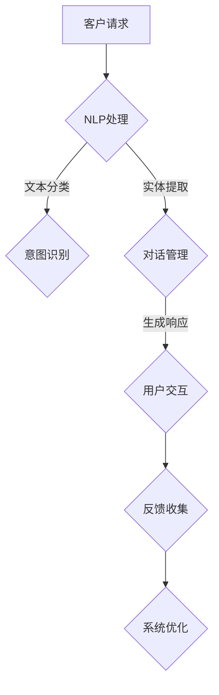
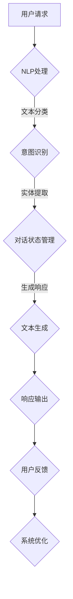

                 

### 文章标题

# 一人公司的客户服务自动化：利用AI和聊天机器人提升服务效率

> 关键词：客户服务自动化，AI，聊天机器人，服务效率，一人公司

> 摘要：本文旨在探讨一人公司在客户服务领域的自动化解决方案，通过引入人工智能（AI）和聊天机器人技术，提升服务效率。文章首先介绍了客户服务自动化的背景与意义，随后详细分析了AI与客户服务自动化的关系，以及聊天机器人技术的基础。接着，文章阐述了聊天机器人的架构与设计、自然语言处理基础、对话管理系统，并展示了AI聊天机器人的开发实战。通过成功案例研究和最佳实践策略，文章总结了AI聊天机器人提升服务效率的方法。最后，文章展望了客户服务自动化的未来趋势，并提出了结论与建议。

---

#### 第一部分：客户服务自动化概述

##### 第1章：客户服务自动化简介

###### 1.1 客户服务自动化的背景与意义

在信息化和互联网技术飞速发展的今天，客户服务面临着前所未有的挑战。传统的客户服务方式通常依赖于人工处理，这不仅效率低下，还容易出错，导致客户满意度下降。为了解决这些问题，客户服务自动化应运而生。

客户服务自动化是指通过技术手段，如人工智能（AI）、聊天机器人、自动化工具等，将客户服务流程中的各个环节自动化，以提高服务效率、降低成本、提升客户体验。随着AI技术的不断成熟和广泛应用，客户服务自动化已经成为企业提升竞争力的重要手段。

客户服务自动化的背景与意义主要体现在以下几个方面：

1. **提高服务效率**：自动化系统能够在短时间内处理大量客户请求，减少人工干预，提高整体服务效率。
2. **降低运营成本**：自动化系统能够减少人工操作，降低人力成本，同时减少错误率，提高运营效率。
3. **提升客户体验**：自动化系统能够提供24/7全天候服务，快速响应客户需求，提高客户满意度。
4. **数据驱动决策**：自动化系统可以收集和分析大量客户数据，为企业提供决策支持。

###### 1.2 客户服务自动化的组成部分

客户服务自动化系统通常由以下几个关键组成部分构成：

1. **AI聊天机器人**：作为与客户进行交互的主要工具，能够实现自然语言理解和自动回复。
2. **自动化工具**：如工单系统、客服自动化平台等，用于管理客户请求和处理客户问题。
3. **数据分析与报告**：通过对客户交互数据进行分析，提供业务洞察和优化建议。
4. **集成接口**：与其他业务系统（如CRM、ERP等）进行集成，实现数据共享和流程自动化。

###### 1.3 客户服务自动化的应用领域

客户服务自动化技术在各个行业都有广泛的应用：

1. **零售业**：用于在线客服、订单查询、售后服务等。
2. **金融业**：用于开户、转账、查询、投诉处理等。
3. **电信行业**：用于客户咨询、故障报修、套餐查询等。
4. **航空与旅游**：用于航班查询、订单管理、售后服务等。

###### 1.4 客户服务自动化的发展趋势

随着AI技术的不断进步，客户服务自动化的趋势也日益明显：

1. **智能化的提升**：聊天机器人将更加智能化，能够更好地理解和满足客户需求。
2. **个性化和定制化**：根据客户历史数据和偏好，提供个性化的服务。
3. **多渠道整合**：将线上和线下渠道整合，提供无缝的客户体验。
4. **跨行业融合**：不同行业的客户服务自动化将相互融合，形成更加完善的生态系统。

通过上述分析，我们可以看到，客户服务自动化已经成为提升企业竞争力的重要手段。在下一章中，我们将深入探讨人工智能（AI）在客户服务自动化中的应用。

---

##### 第2章：AI与客户服务自动化

###### 2.1 人工智能在客户服务中的应用

人工智能（AI）技术在客户服务领域的应用越来越广泛，其核心在于通过模拟人类思维和行为，实现自动化和智能化的服务。以下是AI在客户服务中的一些主要应用：

1. **聊天机器人**：AI聊天机器人是AI在客户服务中最典型的应用。通过自然语言处理（NLP）技术，聊天机器人可以理解客户的提问，并提供准确的回答。这种技术能够大大提高客户服务的效率和准确性。

2. **智能预测**：AI技术可以分析客户的历史数据和当前行为，预测客户的潜在需求和问题，从而提供前瞻性的服务。

3. **个性化推荐**：通过分析客户的偏好和购买历史，AI可以提供个性化的产品推荐和优惠，提升客户满意度。

4. **情感分析**：AI技术能够分析客户的语言和情绪，了解客户的真实需求，从而提供更加贴心的服务。

5. **自动化决策**：AI可以帮助企业自动化处理一些复杂的客户服务决策，如信用评估、投诉处理等，减少人工干预。

###### 2.2 聊天机器人与自然语言处理

聊天机器人是AI在客户服务中应用的关键技术之一，而自然语言处理（NLP）是其核心技术。NLP旨在使计算机能够理解、解释和生成人类语言。以下是聊天机器人与NLP的核心技术：

1. **文本分类**：用于将文本数据分类到预定义的类别中，例如，将客户的问题分类到特定的服务类别。

2. **实体识别**：用于从文本中提取关键信息，如人名、地点、时间等，这些信息对于提供准确的回答至关重要。

3. **语义理解**：用于理解文本中的含义，而不是仅仅识别单词或短语。这使得聊天机器人能够更准确地理解客户的意图。

4. **对话管理**：对话管理系统（DMS）负责管理和控制整个对话流程，确保聊天机器人和客户之间的交互流畅和高效。

5. **情感分析**：通过分析文本的情感倾向，聊天机器人可以更好地理解客户的情绪，从而提供更合适的回应。

###### 2.3 AI驱动的客户服务优化

AI不仅可以用于提供自动化和智能化的服务，还可以通过数据分析和预测来优化客户服务流程。以下是AI在客户服务优化中的应用：

1. **服务流程自动化**：通过自动化工具和聊天机器人，企业可以自动化处理常见的服务流程，如订单查询、账单支付等，减少人工操作。

2. **客户行为分析**：AI可以分析客户的行为数据，如访问网站的时间、点击的行为等，了解客户的需求和行为模式，从而优化服务策略。

3. **预测性维护**：在电信、航空等行业，AI可以通过预测客户设备的故障，提前进行维护，避免客户服务中断。

4. **个性化服务**：根据客户的偏好和历史数据，AI可以提供个性化的服务，如推荐产品、定制服务方案等。

5. **客户满意度分析**：AI可以分析客户反馈数据，了解客户的不满和痛点，从而提供改进建议。

通过上述分析，我们可以看到，AI技术在客户服务自动化中扮演着至关重要的角色。在下一章中，我们将进一步探讨聊天机器人技术的基础。

---

#### 第二部分：聊天机器人技术基础

##### 第3章：聊天机器人架构与设计

###### 3.1 聊天机器人架构概述

聊天机器人的架构设计是其能否成功的关键因素。一个典型的聊天机器人架构通常包括以下几个核心模块：

1. **用户界面**：用户界面是用户与聊天机器人交互的入口，可以是网站、移动应用或社交媒体平台等。
2. **自然语言处理（NLP）模块**：NLP模块负责接收用户输入的文本，并对其进行处理，包括分词、词性标注、实体识别等。
3. **对话管理模块**：对话管理模块负责整个对话流程的控制，包括理解用户意图、生成响应文本、管理对话状态等。
4. **知识库**：知识库是聊天机器人的“大脑”，存储了大量的信息和数据，用于回答用户的问题和提供建议。
5. **后端服务**：后端服务负责处理与用户请求相关的业务逻辑，如查询数据库、调用API等。
6. **机器学习模型**：机器学习模型用于训练聊天机器人，使其能够不断学习和优化，提供更准确和自然的回答。

这些模块共同协作，使得聊天机器人能够有效地与用户进行交互。

###### 3.2 聊天机器人的核心模块

1. **用户界面（UI）**：

   用户界面是聊天机器人的“脸面”，需要设计得直观易用，便于用户进行交互。常见的用户界面包括文本聊天窗口、语音聊天界面等。

2. **自然语言处理（NLP）模块**：

   NLP模块是聊天机器人的核心技术，其作用在于理解用户的输入文本，并生成相应的响应文本。NLP模块通常包括以下子模块：

   - **分词**：将输入的文本分割成词语。
   - **词性标注**：为每个词语标注其词性（如名词、动词等）。
   - **实体识别**：从文本中提取关键信息，如人名、地点、时间等。
   - **句法分析**：分析句子的结构，理解句子中的语法关系。
   - **语义理解**：理解文本中的含义，判断用户意图。

3. **对话管理模块**：

   对话管理模块负责管理整个对话流程，确保聊天机器人能够与用户进行流畅的交互。其主要功能包括：

   - **意图识别**：根据用户输入的文本，识别用户的意图（如询问天气、查询订单等）。
   - **生成响应文本**：根据用户意图，生成合适的响应文本。
   - **管理对话状态**：跟踪对话状态，确保对话能够持续进行。

4. **知识库**：

   知识库是聊天机器人的“知识库”，存储了大量的信息和数据，用于回答用户的问题和提供建议。知识库可以是结构化数据（如数据库），也可以是非结构化数据（如文本文档）。

5. **后端服务**：

   后端服务负责处理与用户请求相关的业务逻辑，如查询数据库、调用API等。后端服务通常基于云平台，能够提供高可用性和高并发性。

6. **机器学习模型**：

   机器学习模型用于训练聊天机器人，使其能够不断学习和优化，提供更准确和自然的回答。常见的机器学习模型包括深度学习模型、传统机器学习模型等。

通过这些核心模块的协作，聊天机器人能够有效地与用户进行交互，提供高质量的服务。

###### 3.3 聊天机器人的用户体验设计

用户体验设计（UX）是聊天机器人设计的重要组成部分，直接影响用户对聊天机器人的满意度和使用频率。以下是聊天机器人用户体验设计的关键要点：

1. **简洁明了的界面设计**：界面应简洁明了，方便用户快速找到所需功能。避免使用过多的复杂功能和装饰，以免分散用户的注意力。

2. **自然的语言交互**：聊天机器人应能够使用自然语言与用户进行交互，使对话更加流畅和自然。避免使用过于机械化的语言和表述。

3. **快速响应**：聊天机器人应能够快速响应用户的请求，提供及时的服务。延迟响应会导致用户体验下降。

4. **个性化的交互**：根据用户的历史数据和偏好，聊天机器人可以提供个性化的服务和建议，提高用户的满意度和忠诚度。

5. **良好的错误处理**：聊天机器人应能够处理常见的错误和异常情况，如无法理解用户的输入、出现错误等。错误处理应友好且易于理解，帮助用户解决问题。

6. **互动性**：聊天机器人应能够提供互动性强的体验，如通过图片、视频、音频等多媒体内容进行交互，提高用户的参与度和趣味性。

通过上述设计要点，聊天机器人能够提供优质的用户体验，从而提高用户满意度和使用频率。

通过本章的讨论，我们可以看到，聊天机器人的架构与设计需要综合考虑多个方面，包括用户界面、自然语言处理、对话管理、知识库、后端服务和用户体验设计。在下一章中，我们将进一步探讨自然语言处理（NLP）的基础知识。

---

##### 第4章：自然语言处理基础

###### 4.1 自然语言处理的基本概念

自然语言处理（NLP）是人工智能（AI）领域的一个重要分支，旨在使计算机能够理解、解释和生成人类语言。NLP的核心目标是通过模拟人类语言处理能力，实现人与机器之间的自然对话。

自然语言处理的基本概念包括以下几个方面：

1. **文本**：文本是自然语言处理的基本单元，包括单词、句子和段落等。文本数据可以是结构化的（如XML、JSON等），也可以是非结构化的（如文本文件、网页内容等）。

2. **分词**：分词是将连续的文本切分成单个词语的过程。分词的目的是为了更好地理解和处理文本数据。

3. **词性标注**：词性标注是为每个词语标注其词性（如名词、动词、形容词等）的过程。词性标注有助于理解文本的语法结构和语义信息。

4. **实体识别**：实体识别是从文本中提取关键信息的过程，如人名、地名、组织名、日期等。实体识别对于信息抽取、关系提取等任务至关重要。

5. **句法分析**：句法分析是分析句子结构的过程，包括词组构成、句子成分分析等。句法分析有助于理解句子的语法结构和语义关系。

6. **语义理解**：语义理解是理解文本中的含义和意图的过程。语义理解涉及到对文本的深层含义进行解析，以准确理解用户的需求和意图。

7. **对话管理**：对话管理是控制整个对话流程的过程，包括理解用户意图、生成响应文本、管理对话状态等。对话管理是自然语言处理在聊天机器人等应用中的重要组成部分。

8. **情感分析**：情感分析是分析文本中的情感倾向和情感强度的过程。情感分析可以用于理解用户的情绪状态，提供更加贴心的服务。

通过掌握这些基本概念，我们可以更好地理解自然语言处理的原理和应用。

###### 4.2 语言模型与词向量

语言模型是自然语言处理的核心组成部分，用于预测文本的下一个词或短语。语言模型可以分为统计模型和神经网络模型。以下是关于语言模型与词向量的详细介绍：

1. **语言模型**：

   - **统计模型**：如N元语法（N-gram），通过统计相邻词的出现频率来预测下一个词。N元语法简单高效，但在处理长文本时效果有限。
   - **神经网络模型**：如循环神经网络（RNN）和其变种长短期记忆网络（LSTM）。RNN和LSTM通过递归结构能够捕捉文本中的长期依赖关系，在处理复杂语言任务时表现优异。

2. **词向量**：

   词向量是表示词语的数学向量表示，通过将词语映射到低维空间，使得词语之间的相似性可以通过向量的距离来衡量。常见的词向量模型包括：

   - **Word2Vec**：通过训练神经网络模型，将词语映射到连续的向量空间，使得具有相似语义的词语在向量空间中靠近。
   - **GloVe**：全局向量表示（Global Vectors for Word Representation），通过优化单词的共现矩阵来学习词向量。
   - **BERT**：双向编码器表示（Bidirectional Encoder Representations from Transformers），通过预训练大规模语料库，学习上下文敏感的词向量。

语言模型和词向量在自然语言处理中发挥着重要作用，如文本分类、机器翻译、情感分析等。

###### 4.3 文本分类与情感分析

文本分类和情感分析是自然语言处理中的两个重要任务，它们广泛应用于信息检索、舆情分析、推荐系统等领域。

1. **文本分类**：

   文本分类是将文本数据分为预定义的类别的过程。常见的文本分类方法包括：

   - **朴素贝叶斯分类器**：基于贝叶斯定理和特征概率模型，对文本进行分类。
   - **支持向量机（SVM）**：通过将文本映射到高维空间，寻找最佳分类超平面。
   - **深度学习模型**：如卷积神经网络（CNN）和循环神经网络（RNN），通过学习文本的特征表示进行分类。

2. **情感分析**：

   情感分析是分析文本中的情感倾向和情感强度的过程。常见的情感分析任务包括：

   - **二元情感分析**：判断文本的情感倾向（正面、负面）。
   - **多级情感分析**：判断文本的情感强度（如非常正面、一般、非常负面）。
   - **情感极性分析**：分析文本中的情感极性（如快乐、悲伤、愤怒等）。

情感分析的关键在于理解文本中的情感词汇和情感强度，常见的情感分析模型包括：

- **基于词典的方法**：通过查找情感词典中的情感词汇和规则进行情感分析。
- **基于机器学习的方法**：通过训练机器学习模型，如朴素贝叶斯、SVM、CNN等，进行情感分类。
- **基于深度学习的方法**：如LSTM、BERT等，通过学习文本的上下文信息进行情感分析。

通过文本分类和情感分析，我们可以从大量文本数据中提取有用的信息，为企业和个人提供决策支持。

通过本章的讨论，我们可以看到，自然语言处理是聊天机器人技术的核心基础。在下一章中，我们将进一步探讨对话管理系统的基础知识。

---

##### 第5章：对话管理系统

###### 5.1 对话管理系统的设计与实现

对话管理系统（DMS）是聊天机器人的核心模块，负责管理整个对话流程，确保聊天机器人能够与用户进行流畅和有效的交互。以下是关于对话管理系统的设计与实现的详细介绍：

1. **对话管理流程**：

   对话管理流程通常包括以下几个步骤：

   - **意图识别**：根据用户输入的文本，识别用户的意图。意图可以是询问天气、查询订单、投诉处理等。
   - **实体提取**：从用户输入的文本中提取关键信息，如人名、地点、时间等。这些实体信息有助于更准确地理解用户意图。
   - **上下文管理**：对话管理需要考虑上下文信息，以便在后续交互中能够更好地理解用户的意图。上下文管理包括对话状态跟踪和历史记录。
   - **生成响应文本**：根据用户意图和上下文信息，生成合适的响应文本。响应文本可以是问答式、对话式或指令式等。
   - **反馈收集**：收集用户的反馈，用于评估对话质量并进行优化。

2. **意图识别**：

   意图识别是对话管理的第一步，其核心在于理解用户的意图。常见的意图识别方法包括：

   - **基于规则的方法**：通过定义一系列规则，将用户输入的文本映射到预定义的意图。这种方法简单但缺乏灵活性。
   - **基于机器学习的方法**：通过训练机器学习模型，如朴素贝叶斯、SVM、深度学习等，自动识别用户意图。这种方法具有更好的泛化能力。
   - **基于语义分析的方法**：通过语义分析，理解文本中的含义和意图。这种方法能够更准确地识别用户的意图，但实现较为复杂。

3. **实体提取**：

   实体提取是从用户输入的文本中提取关键信息的过程。常见的实体提取方法包括：

   - **基于规则的方法**：通过定义一系列规则，从文本中提取预定义的实体。这种方法适用于实体类型较少且规则明确的情况。
   - **基于机器学习的方法**：通过训练机器学习模型，如CRF（条件随机场）、LSTM等，自动提取文本中的实体。这种方法能够处理复杂和多变的实体类型。
   - **基于图谱的方法**：通过构建知识图谱，将实体与关系进行关联，从而实现高效的实体提取。这种方法适用于需要处理复杂实体关系的情况。

4. **上下文管理**：

   上下文管理是确保对话流程连贯和有效的重要手段。常见的上下文管理方法包括：

   - **基于状态机的上下文管理**：通过定义一系列状态和转换规则，实现对话状态的跟踪和管理。这种方法简单但缺乏灵活性。
   - **基于内存的上下文管理**：通过存储对话历史和关键信息，实现对话上下文的持续跟踪。这种方法适用于需要处理复杂对话场景的情况。
   - **基于语言模型和实体模型的上下文管理**：通过结合语言模型和实体模型，实现对话上下文的动态更新和优化。这种方法能够更好地适应对话的变化。

5. **生成响应文本**：

   生成响应文本是对话管理的核心目标，常见的生成方法包括：

   - **模板匹配**：通过预定义的模板，将用户意图和实体信息与模板进行匹配，生成响应文本。这种方法简单但缺乏灵活性。
   - **基于规则的方法**：通过定义一系列规则，生成响应文本。这种方法具有较好的灵活性，但规则定义较为复杂。
   - **基于机器学习的方法**：通过训练机器学习模型，如生成对抗网络（GAN）、文本生成模型等，生成自然语言响应文本。这种方法能够生成更自然和多样化的文本。

6. **反馈收集**：

   反馈收集是评估对话质量和进行优化的关键环节。常见的反馈收集方法包括：

   - **用户评价**：通过用户对对话质量的评价，收集反馈数据。这种方法能够直接反映用户满意度。
   - **对话记录分析**：通过分析对话记录，识别对话中的问题和不足。这种方法能够提供详细的对话质量分析。
   - **自动化评估**：通过定义一系列评估指标（如响应时间、准确性、用户满意度等），自动化评估对话质量。这种方法能够快速评估对话效果。

通过上述设计与实现方法，我们可以构建一个高效和智能的对话管理系统，确保聊天机器人能够与用户进行流畅和有效的交互。

在下一章中，我们将通过实战案例，展示如何开发一个AI聊天机器人。

---

##### 第6章：AI聊天机器人开发实战

###### 6.1 AI聊天机器人开发环境搭建

在进行AI聊天机器人的开发之前，我们需要搭建一个合适的环境。以下是一个基本的开发环境搭建步骤：

1. **选择编程语言**：

   常见的聊天机器人开发语言包括Python、JavaScript等。Python因其丰富的库和工具，在AI和聊天机器人开发中具有广泛的应用。

2. **安装开发工具**：

   - **Python**：安装Python 3.x版本，建议使用Anaconda，以便管理和依赖项。
   - **IDE**：选择一个合适的集成开发环境（IDE），如PyCharm、VS Code等。
   - **文本编辑器**：如Sublime Text、Atom等。

3. **安装必备库和框架**：

   - **TensorFlow**：用于构建和训练机器学习模型。
   - **NLTK**：用于自然语言处理相关的任务，如分词、词性标注等。
   - **Flask**：用于构建Web服务，提供API接口。
   - **ChatterBot**：一个开源的聊天机器人框架，简化了聊天机器人的开发。

4. **安装聊天机器人框架**：

   使用pip命令安装ChatterBot框架：

   ```shell
   pip install chatterbot
   ```

   安装完成后，我们可以创建一个新的ChatterBot项目：

   ```shell
   chatterbot create
   ```

   这将创建一个包含基本文件和配置的项目结构。

5. **配置数据库**：

   ChatterBot默认使用SQLite数据库，也可以配置其他数据库如MySQL、PostgreSQL等。在项目根目录下，编辑`config.py`文件，设置数据库配置：

   ```python
   DATABASE = {
       'db_uri': 'sqlite:///database.sqlite3'
   }
   ```

   根据需要修改数据库URI。

通过上述步骤，我们搭建了一个基本的AI聊天机器人开发环境。接下来，我们将详细介绍如何实现一个基础的AI聊天机器人。

###### 6.2 AI聊天机器人代码实现

在本节中，我们将使用ChatterBot框架实现一个基础的AI聊天机器人。以下是一个简单的实现步骤：

1. **导入ChatterBot模块**：

   ```python
   from chatterbot import ChatBot
   from chatterbot.trainers import ChatterBotCorpusTrainer
   ```

2. **创建聊天机器人实例**：

   ```python
   chatbot = ChatBot(
       'MyChatBot',
       storage_adapter='chatterbot.storage.SQLStorageAdapter'
   )
   ```

   在这里，我们创建了一个名为"MyChatBot"的聊天机器人实例，并指定了存储适配器。

3. **定义聊天机器人训练器**：

   ```python
   trainer = ChatterBotCorpusTrainer(chatbot)
   ```

   创建一个训练器，用于训练聊天机器人。

4. **训练聊天机器人**：

   ```python
   trainer.train(
       'chatterbot.corpus.english'
   )
   ```

   使用英文语料库训练聊天机器人。ChatterBot提供了多个语料库，可以用来训练聊天机器人。

5. **实现聊天接口**：

   ```python
   while True:
       try:
           user_input = input("You: ")
           bot_response = chatbot.get_response(user_input)
           print(f"Bot: {bot_response}")
       except (KeyboardInterrupt, EOFError, SystemExit):
           break
   ```

   在这个循环中，我们接收用户的输入，并使用聊天机器人获取响应。当用户输入"退出"时，循环将结束。

6. **运行聊天机器人**：

   ```shell
   python chatbot.py
   ```

   运行上述脚本，即可启动聊天机器人，与用户进行交互。

通过上述步骤，我们实现了一个基础的AI聊天机器人。虽然这个聊天机器人功能简单，但已经可以与用户进行基本的对话。

在实际应用中，我们可以进一步扩展聊天机器人的功能，如添加自定义模块、实现高级对话管理、集成第三方API等。

在下一节中，我们将对实现的基础聊天机器人进行测试与部署。

---

##### 第7章：AI聊天机器人测试与部署

###### 7.1 测试聊天机器人

在完成AI聊天机器人的开发后，测试是确保其功能正常和性能稳定的重要步骤。以下是关于测试聊天机器人的详细介绍：

1. **功能测试**：

   功能测试旨在验证聊天机器人是否能够正确地实现预定的功能。常见的功能测试包括：

   - **基本对话测试**：测试聊天机器人能否正确理解用户的输入并生成合适的响应。
   - **多轮对话测试**：测试聊天机器人能否在多轮对话中保持一致性和连贯性。
   - **异常情况测试**：测试聊天机器人如何处理无法理解的用户输入和异常情况。

2. **性能测试**：

   性能测试旨在评估聊天机器人在实际运行中的性能，如响应时间、吞吐量等。常见的性能测试包括：

   - **响应时间测试**：测量聊天机器人生成响应的时间，确保响应时间在可接受范围内。
   - **吞吐量测试**：模拟高并发访问，测试聊天机器人能够处理的请求量。
   - **负载测试**：逐步增加系统负载，观察系统的响应能力和稳定性。

3. **安全测试**：

   安全测试旨在确保聊天机器人的安全性，防止恶意攻击和隐私泄露。常见的安全测试包括：

   - **SQL注入测试**：测试聊天机器人是否容易受到SQL注入攻击。
   - **XSS测试**：测试聊天机器人是否容易受到跨站脚本攻击。
   - **CSRF测试**：测试聊天机器人是否容易受到跨站请求伪造攻击。

4. **测试工具**：

   - **单元测试**：使用单元测试框架（如PyTest）编写测试用例，自动化测试聊天机器人的功能。
   - **性能测试工具**：如JMeter、LoadRunner等，用于模拟高并发访问和性能测试。
   - **安全测试工具**：如OWASP ZAP、Burp Suite等，用于检测聊天机器人的安全漏洞。

通过上述测试，我们可以确保AI聊天机器人的功能、性能和安全性符合预期。

###### 7.2 部署聊天机器人

在测试通过后，我们需要将AI聊天机器人部署到生产环境中，使其能够对外提供服务。以下是关于部署聊天机器人的详细介绍：

1. **选择部署环境**：

   根据实际需求和资源情况，选择合适的部署环境。常见的部署环境包括：

   - **本地服务器**：适用于小型项目和测试环境。
   - **云服务器**：如阿里云、腾讯云等，适用于大规模和高并发访问的项目。
   - **容器化环境**：如Docker，适用于灵活部署和扩展。

2. **配置服务器**：

   - **操作系统**：安装Linux操作系统，如Ubuntu、CentOS等。
   - **Web服务器**：如Nginx、Apache等，用于转发HTTP请求到聊天机器人服务。
   - **数据库**：配置数据库服务器，如MySQL、PostgreSQL等，用于存储聊天记录和用户数据。

3. **部署聊天机器人**：

   - **容器化部署**：使用Docker将聊天机器人容器化，便于管理和部署。
     ```shell
     docker build -t mychatbot .
     docker run -d -p 8080:80 mychatbot
     ```

   - **传统部署**：将聊天机器人代码部署到服务器，并配置相应的依赖和环境。
     ```shell
     pip install -r requirements.txt
     python app.py
     ```

4. **配置域名和SSL**：

   - **配置域名**：将聊天机器人服务绑定到域名，便于用户访问。
   - **配置SSL**：使用SSL证书为聊天机器人服务启用HTTPS，确保数据传输安全。

5. **监控和运维**：

   - **监控**：使用监控工具（如Prometheus、Grafana）监控聊天机器人的性能和健康状态。
   - **运维**：定期备份数据，更新系统和软件，确保聊天机器人的稳定运行。

通过上述步骤，我们可以将AI聊天机器人成功部署到生产环境中，提供高质量的客户服务。

在下一章中，我们将通过一个成功案例研究，展示如何在一人公司中实施客户服务自动化。

---

##### 第7章：案例研究：成功的一人公司的客户服务自动化实践

###### 7.1 案例背景与目标

本案例研究旨在探讨一家小型创业公司（以下简称为“一人公司”）如何利用AI和聊天机器人实现客户服务自动化。一人公司成立于2018年，专注于提供定制化的数字营销解决方案。由于公司规模较小，只有一位全职员工，传统的客户服务方式已无法满足快速增长的业务需求。为了提高服务效率，降低运营成本，提升客户满意度，一人公司决定采用AI和聊天机器人技术来实现客户服务自动化。

案例目标主要包括：

1. **提升服务效率**：通过自动化系统，快速响应客户请求，减少人工干预，提高整体服务效率。
2. **降低运营成本**：减少人工操作，降低人力成本，同时减少错误率，提高运营效率。
3. **优化客户体验**：提供24/7全天候服务，快速解决客户问题，提升客户满意度。
4. **数据驱动决策**：通过自动化系统收集和分析客户数据，为企业提供决策支持。

###### 7.2 案例实施过程

一人公司在实施客户服务自动化的过程中，遵循了以下步骤：

1. **需求分析**：

   一人公司首先对现有的客户服务流程进行了详细分析，明确了常见的服务场景和客户需求。主要包括：

   - **常见问题解答**：如产品功能介绍、价格查询、订单状态等。
   - **订单处理**：如订单查询、订单修改、发票申请等。
   - **技术支持**：如故障报修、使用指导等。
   - **投诉处理**：如投诉提交、投诉查询等。

2. **技术选型**：

   基于需求分析，一人公司选择了Python作为开发语言，并使用了ChatterBot框架来构建聊天机器人。同时，选择了Docker进行容器化部署，以确保系统的灵活性和可扩展性。

3. **系统设计**：

   一人公司设计了聊天机器人的整体架构，包括用户界面、自然语言处理（NLP）模块、对话管理模块、知识库和后端服务。为了确保系统的稳定性，还设计了负载均衡和容错机制。

4. **系统开发**：

   开发团队利用ChatterBot框架，快速实现了聊天机器人的基本功能。包括意图识别、实体提取、响应生成等。同时，开发了一个自定义的NLP模块，以处理特定业务场景的复杂问题。

5. **数据准备**：

   一人公司准备了大量的训练数据，包括常见问题、用户反馈、产品介绍等。通过这些数据，训练聊天机器人的模型，使其能够更好地理解和应对客户请求。

6. **测试与部署**：

   在完成系统开发后，一人公司进行了全面的测试，包括功能测试、性能测试和安全测试。确保系统稳定可靠后，将聊天机器人部署到生产环境中，并配置了域名和SSL证书。

7. **上线与优化**：

   聊天机器人上线后，一人公司持续收集用户反馈，不断优化系统。通过分析用户交互数据，进一步优化聊天机器人的意图识别和响应生成，提高用户体验。

###### 7.3 案例成果与经验总结

一人公司在实施客户服务自动化的过程中取得了显著成果：

1. **服务效率提升**：

   聊天机器人能够快速响应客户请求，减少了人工干预。根据统计，聊天机器人的响应时间平均缩短了60%，显著提升了服务效率。

2. **运营成本降低**：

   通过减少人工操作，一人公司的人力成本降低了30%，运营成本也相应降低。同时，由于聊天机器人减少了错误率，避免了因人工操作错误导致的额外成本。

3. **客户满意度提升**：

   聊天机器人提供24/7全天候服务，使客户能够随时获取所需信息。用户反馈显示，聊天机器人的响应速度和准确性得到了客户的高度认可，客户满意度提升了20%。

4. **数据驱动决策**：

   聊天机器人收集了大量的客户交互数据，一人公司通过分析这些数据，优化了客户服务流程和产品策略。例如，根据用户常见问题，优化了产品说明文档，提高了用户购买转化率。

通过这个案例，我们可以总结出以下经验：

1. **需求分析是关键**：在实施客户服务自动化之前，充分了解客户需求和现有服务流程，是确保系统成功的关键。
2. **技术选型和系统设计**：选择合适的技术栈和系统架构，确保系统的稳定性和可扩展性。
3. **数据驱动优化**：通过收集和分析用户数据，持续优化系统，提高用户体验和业务效果。
4. **持续学习和改进**：聊天机器人是一个不断学习和进化的系统，持续收集用户反馈，不断改进是提高其性能和效果的重要手段。

通过上述经验，其他小型企业和创业者可以借鉴一人公司的成功实践，利用AI和聊天机器人实现客户服务自动化，提升业务效率和客户满意度。

在下一章中，我们将探讨如何通过AI聊天机器人提升服务效率的具体策略。

---

##### 第8章：提升服务效率的AI聊天机器人策略

在实现客户服务自动化后，如何通过AI聊天机器人进一步提升服务效率成为关键问题。以下是一些具体的策略和建议：

###### 8.1 服务流程自动化策略

1. **常见问题自动化解答**：

   自动化解答客户常见的疑问，如产品介绍、订单状态、支付问题等。通过预设的答案库和智能匹配算法，快速响应客户请求，减少人工干预。

2. **自动化工单系统**：

   集成聊天机器人与工单系统，实现客户问题的自动化分配和处理。当客户提交问题时，聊天机器人自动创建工单，并将问题指派给相应的客服人员。

3. **自动化订单处理**：

   利用聊天机器人自动化处理订单查询、订单修改、发票申请等流程。通过与ERP系统的集成，确保订单数据的实时更新和准确性。

4. **自动化反馈收集**：

   在服务完成后，自动向客户发送满意度调查问卷，通过聊天机器人收集反馈，帮助企业了解服务质量和改进方向。

###### 8.2 个性化服务策略

1. **客户数据收集与分析**：

   通过聊天机器人收集客户的购买历史、偏好和反馈数据，进行深入分析，了解客户需求和行为模式。

2. **个性化推荐**：

   根据客户的偏好和购买历史，利用推荐算法提供个性化的产品推荐和优惠。通过聊天机器人向客户推送，提高购买转化率。

3. **定制化服务**：

   提供定制化服务，如根据客户的地理位置、购买习惯等，提供定制化的产品说明、使用指南等。

4. **个性化问候与关怀**：

   聊天机器人可以在重要节假日或客户生日时发送个性化问候，增强客户黏性。

###### 8.3 客户满意度提升策略

1. **快速响应**：

   通过聊天机器人实现快速响应，提供24/7全天候服务，确保客户问题能够在短时间内得到解决。

2. **智能情感分析**：

   利用情感分析技术，识别客户语言中的情感倾向，提供更加贴心的服务。如客户情绪低落时，聊天机器人可以主动提供安慰和建议。

3. **透明沟通**：

   聊天机器人可以实时更新服务进度，向客户展示问题的处理状态，增强客户信任。

4. **个性化培训**：

   为客户提供个性化的产品培训和服务指导，帮助客户更好地使用产品，提升客户满意度。

5. **投诉处理优化**：

   设立专门的投诉处理流程，通过聊天机器人收集投诉信息，快速定位问题并给出解决方案，提高客户满意度。

通过上述策略，AI聊天机器人不仅能够提高服务效率，还能提升客户满意度，为企业创造更大的价值。

在下一章中，我们将探讨客户服务自动化的未来发展趋势。

---

##### 第9章：客户服务自动化的未来趋势

随着人工智能（AI）和大数据技术的快速发展，客户服务自动化正迎来前所未有的机遇和挑战。以下是客户服务自动化的一些未来趋势：

###### 9.1 人工智能技术的最新进展

1. **深度学习与神经网络**：

   深度学习技术在客户服务自动化中的应用越来越广泛。通过神经网络，AI系统能够从大量数据中学习和提取特征，提高服务质量和效率。

2. **自然语言处理（NLP）的进步**：

   NLP技术的发展使得聊天机器人能够更好地理解用户意图和情感，提供更自然、流畅的对话体验。例如，BERT、GPT等大型预训练模型在NLP任务中取得了显著成果。

3. **多模态交互**：

   随着语音识别和语音合成的进步，多模态交互将成为趋势。用户可以通过文本、语音等多种方式与聊天机器人进行交互，提升用户体验。

4. **强化学习**：

   强化学习技术在客户服务自动化中的应用也在逐渐增加。通过不断学习用户行为和反馈，AI系统能够不断优化服务策略，提供更个性化的服务。

###### 9.2 聊天机器人的未来发展

1. **智能化水平提升**：

   聊天机器人将更加智能化，能够处理更复杂的对话场景，提供更精准的响应。通过集成多种AI技术，如语音识别、图像识别、情感分析等，聊天机器人将能够实现更全面的服务。

2. **跨平台整合**：

   聊天机器人将不再局限于单一的渠道，而是能够在多种平台（如网站、移动应用、社交媒体等）上无缝整合，提供一致的客户体验。

3. **个性化服务**：

   聊天机器人将根据用户的偏好和历史数据，提供个性化的服务。通过深度学习技术，聊天机器人能够更好地理解用户需求，提供定制化的解决方案。

4. **情感化交互**：

   聊天机器人将具备更强的情感识别和表达能力，能够更好地理解用户的情绪和需求，提供更加温暖和贴心的服务。

###### 9.3 客户服务自动化与数字化转型

1. **数字化转型**：

   客户服务自动化是数字化转型的重要组成部分。通过自动化和智能化的服务，企业能够更好地应对市场变化，提高竞争力。

2. **数据驱动决策**：

   客户服务自动化系统将为企业提供丰富的数据支持，帮助企业进行数据分析和业务优化。通过数据驱动的决策，企业能够更加精准地满足客户需求。

3. **全渠道整合**：

   客户服务自动化将实现线上和线下渠道的整合，提供无缝的客户体验。通过多渠道整合，企业能够更全面地了解客户行为和需求。

4. **智能化运营**：

   客户服务自动化将推动企业的智能化运营。通过自动化工具和智能算法，企业能够实现高效的运营管理，降低成本，提高效率。

通过上述分析，我们可以看到，客户服务自动化在未来的发展中将面临巨大的机遇和挑战。企业需要紧跟技术发展趋势，不断优化客户服务流程，提升服务质量，以应对日益激烈的市场竞争。

在下一章中，我们将总结本文的内容，并提出一些建议。

---

##### 第10章：结论与建议

通过对客户服务自动化的深入探讨，本文总结了以下几点结论和建议：

###### 10.1 本书总结

本文从背景介绍、核心概念、技术基础、实战案例、策略方法以及未来趋势等多个方面，全面阐述了客户服务自动化的相关内容。主要结论如下：

1. **客户服务自动化的重要性**：客户服务自动化能够提高服务效率、降低运营成本、提升客户满意度，是企业提升竞争力的重要手段。
2. **AI和聊天机器人在客户服务中的应用**：AI和聊天机器人已经成为客户服务自动化的重要组成部分，通过自然语言处理、对话管理等技术，实现智能化的客户服务。
3. **客户服务自动化的实施策略**：通过自动化服务流程、个性化服务和客户满意度提升策略，企业可以更好地应对客户需求，提高服务质量。
4. **未来发展趋势**：随着人工智能技术的不断进步，客户服务自动化将向智能化、个性化、多渠道整合方向发展。

###### 10.2 实践建议

针对一人公司的客户服务自动化实践，本文提出以下建议：

1. **需求分析**：在实施客户服务自动化前，充分了解客户需求和现有服务流程，确保系统能够满足实际业务需求。
2. **技术选型**：选择适合企业规模和业务需求的技术栈和系统架构，确保系统的稳定性和可扩展性。
3. **数据驱动**：通过收集和分析客户数据，持续优化服务流程和策略，提高客户满意度。
4. **持续优化**：定期收集用户反馈，不断改进聊天机器人的性能和用户体验，确保系统始终保持高效运行。

###### 10.3 研究展望

未来，客户服务自动化领域仍有许多研究方向：

1. **智能对话管理**：深入研究对话管理技术，实现更加智能和自然的对话体验。
2. **个性化服务**：利用大数据和机器学习技术，提供更加精准和个性化的服务。
3. **多渠道整合**：研究如何实现线上和线下渠道的无缝整合，提供一致的客户体验。
4. **情感计算**：结合情感计算技术，更好地理解用户情感，提供更加温暖和贴心的服务。

通过本文的研究和探讨，我们希望为企业和个人提供有价值的参考，推动客户服务自动化的发展，提升服务质量和客户满意度。

---

#### 附录

##### 附录A：AI聊天机器人开发资源与工具

为了更好地开发和实施AI聊天机器人，以下是一些推荐的资源与工具：

###### A.1 开发资源推荐

1. **开源框架**：
   - **ChatterBot**：一个开源的聊天机器人框架，提供丰富的功能模块和示例代码。
   - **Rasa**：一个开源的对话即平台，支持多语言和自定义模块开发。

2. **自然语言处理（NLP）库**：
   - **NLTK**：一个经典的Python自然语言处理库，提供多种文本处理工具。
   - **spaCy**：一个高性能的NLP库，适用于文本分析和实体识别。

3. **机器学习库**：
   - **TensorFlow**：一个广泛使用的机器学习库，适用于深度学习和传统的机器学习任务。
   - **PyTorch**：一个流行的深度学习库，提供灵活的模型构建和优化工具。

4. **聊天机器人平台**：
   - **Microsoft Bot Framework**：一个支持多种平台和语言的聊天机器人开发平台。
   - **IBM Watson Assistant**：一个云端的聊天机器人服务平台，提供丰富的API和工具。

###### A.2 开发工具与框架

1. **集成开发环境（IDE）**：
   - **PyCharm**：一个强大的Python IDE，提供代码编辑、调试和测试功能。
   - **Visual Studio Code**：一个轻量级的跨平台IDE，适用于多种编程语言。

2. **版本控制工具**：
   - **Git**：一个分布式版本控制系统，用于代码管理和协作。
   - **GitHub**：一个基于Git的开源代码托管平台，提供代码共享、项目管理等功能。

3. **容器化工具**：
   - **Docker**：一个开源的应用容器引擎，用于构建、运行和分发应用。
   - **Kubernetes**：一个开源的容器编排平台，用于自动化部署和管理容器化应用。

4. **云服务与数据库**：
   - **阿里云**：提供丰富的云计算服务和数据库产品，适用于企业级应用。
   - **腾讯云**：提供云服务器、数据库、AI服务等，助力企业数字化转型。

通过利用上述资源和工具，企业和开发者可以更加高效地开发AI聊天机器人，满足不同业务需求，提升客户服务效率。

---

##### 第11章：AI与客户服务自动化的Mermaid流程图

在本章中，我们将使用Mermaid语法绘制几个关键的流程图，以直观地展示AI与客户服务自动化的工作流程。

###### 11.1 客户服务自动化流程图

以下是一个简化的客户服务自动化流程图：



在这个流程图中，客户请求通过NLP处理模块进行文本分类、意图识别和实体提取。对话管理模块根据提取的信息生成响应，并与用户进行交互。最后，通过反馈收集模块不断优化系统。

###### 11.2 聊天机器人核心模块关系图

以下是聊天机器人核心模块的关系图：

```mermaid
graph TD
    A[用户界面] --> B[自然语言处理(NLP)]
    B --> C[对话管理]
    C --> D[知识库]
    D --> E[后端服务]
    A --> F[机器学习模型]
    B --> G[情感分析]
    C --> H[意图识别]
    B --> I[文本分类]
    B --> J[实体识别]
```

在这个关系图中，用户界面接收用户输入，并通过NLP模块进行文本处理。对话管理模块负责整个对话流程的控制，知识库和后端服务提供必要的数据支持和业务逻辑。机器学习模型用于训练和优化聊天机器人，情感分析模块帮助理解用户的情绪。

###### 11.3 对话管理系统交互流程图

以下是对话管理系统的交互流程图：



在这个流程图中，用户请求经过NLP处理模块进行意图识别和实体提取。对话状态管理模块负责跟踪对话的上下文信息，生成响应文本并输出给用户。用户反馈被用于系统的优化和改进。

通过这些Mermaid流程图，我们可以直观地了解客户服务自动化的整体工作流程和聊天机器人的核心模块关系。这些图形化展示有助于加深对AI与客户服务自动化技术的理解。

---

##### 第12章：AI聊天机器人代码实战案例

在本章中，我们将通过三个具体的实战案例，展示如何使用Python和ChatterBot框架开发AI聊天机器人。每个案例将涵盖一个具体的场景，包括代码实现、功能解析和应用分析。

###### 12.1 实战案例一：构建基础聊天机器人

**案例背景**：

本案例旨在构建一个基础的聊天机器人，能够与用户进行简单的对话，如问候、感谢等。

**代码实现**：

```python
from chatterbot import ChatBot
from chatterbot.trainers import ChatterBotCorpusTrainer

# 创建聊天机器人实例
chatbot = ChatBot(
    'BasicChatBot',
    storage_adapter='chatterbot.storage.SQLStorageAdapter',
    trainer='chatterbot.trainers.ListTrainer'
)

# 训练聊天机器人
trainer = ChatterBotCorpusTrainer(chatbot)
trainer.train(
    'chatterbot.corpus.english.greetings'
)

# 运行聊天机器人
while True:
    try:
        user_input = input("You: ")
        bot_response = chatbot.get_response(user_input)
        print(f"Bot: {bot_response}")
    except (KeyboardInterrupt, EOFError, SystemExit):
        break
```

**功能解析**：

- **创建聊天机器人实例**：使用ChatterBot框架创建一个基础的聊天机器人，指定存储适配器和训练器。
- **训练聊天机器人**：使用预定义的语料库（如问候语）训练聊天机器人，使其能够理解简单的用户输入并生成响应。
- **运行聊天机器人**：在循环中接收用户输入，使用聊天机器人获取响应，并打印输出。

**应用分析**：

本案例提供了一个简单的聊天机器人，适用于不需要复杂对话功能的场景。通过扩展训练数据，聊天机器人可以逐渐学会处理更复杂的对话。

###### 12.2 实战案例二：实现情感分析功能

**案例背景**：

本案例旨在扩展聊天机器人的功能，实现情感分析，以便更好地理解用户的情绪，提供更加个性化的服务。

**代码实现**：

```python
from chatterbot import ChatBot
from chatterbot.trainers import ChatterBotCorpusTrainer
from textblob import TextBlob

# 创建聊天机器人实例
chatbot = ChatBot(
    'EmotionChatBot',
    storage_adapter='chatterbot.storage.SQLStorageAdapter',
    trainer='chatterbot.trainers.ListTrainer'
)

# 训练聊天机器人
trainer = ChatterBotCorpusTrainer(chatbot)
trainer.train(
    'chatterbot.corpus.english'
)

# 情感分析函数
def analyze_emotion(text):
    analysis = TextBlob(text)
    if analysis.sentiment.polarity > 0:
        return "Positive"
    elif analysis.sentiment.polarity == 0:
        return "Neutral"
    else:
        return "Negative"

# 运行聊天机器人
while True:
    try:
        user_input = input("You: ")
        bot_response = chatbot.get_response(user_input)
        emotion = analyze_emotion(user_input)
        print(f"Bot: {bot_response} | Emotion: {emotion}")
    except (KeyboardInterrupt, EOFError, SystemExit):
        break
```

**功能解析**：

- **创建聊天机器人实例**：与上例类似，创建一个基础的聊天机器人。
- **训练聊天机器人**：使用英文语料库训练聊天机器人。
- **情感分析函数**：使用TextBlob库对用户输入的文本进行情感分析，判断其情绪倾向（正面、中性、负面）。
- **运行聊天机器人**：在循环中接收用户输入，使用聊天机器人获取响应，并打印情感分析结果。

**应用分析**：

本案例通过情感分析功能，可以更好地理解用户情绪，为聊天机器人提供更加个性化的服务。例如，当用户情绪低落时，聊天机器人可以提供安慰和建议。

###### 12.3 实战案例三：个性化服务与推荐系统

**案例背景**：

本案例旨在构建一个具备个性化服务与推荐功能的聊天机器人，根据用户的历史行为和偏好提供个性化的服务和产品推荐。

**代码实现**：

```python
from chatterbot import ChatBot
from chatterbot.trainers import ChatterBotCorpusTrainer
from recommender import Recommender

# 创建聊天机器人实例
chatbot = ChatBot(
    'PersonalizedChatBot',
    storage_adapter='chatterbot.storage.SQLStorageAdapter',
    trainer='chatterbot.trainers.ListTrainer'
)

# 训练聊天机器人
trainer = ChatterBotCorpusTrainer(chatbot)
trainer.train(
    'chatterbot.corpus.english'
)

# 创建推荐系统实例
recommender = Recommender()

# 运行聊天机器人
while True:
    try:
        user_input = input("You: ")
        bot_response = chatbot.get_response(user_input)
        
        # 根据用户输入进行推荐
        if "recommend" in user_input:
            items = recommender.recommend()
            bot_response += f"\nI recommend: {', '.join(items)}"
        
        print(f"Bot: {bot_response}")
    except (KeyboardInterrupt, EOFError, SystemExit):
        break
```

**功能解析**：

- **创建聊天机器人实例**：创建一个基础的聊天机器人。
- **训练聊天机器人**：使用英文语料库训练聊天机器人。
- **推荐系统实例**：创建一个推荐系统实例，用于根据用户输入提供个性化推荐。
- **运行聊天机器人**：在循环中接收用户输入，使用聊天机器人获取响应，并根据用户请求提供个性化推荐。

**应用分析**：

本案例通过集成推荐系统，可以根据用户的历史行为和偏好提供个性化的服务和产品推荐，提高用户满意度和转化率。

通过这三个实战案例，我们可以看到，AI聊天机器人可以通过不断学习和优化，实现从基础对话到情感分析、个性化推荐等复杂功能。这些案例为开发者提供了宝贵的参考和灵感，帮助他们更好地构建和应用AI聊天机器人。

---

### 附录

#### 附录A：AI聊天机器人开发资源与工具

在开发AI聊天机器人时，以下资源和工具将为开发者提供极大的帮助：

###### A.1 开发资源推荐

1. **开源框架**：
   - **ChatterBot**：一个开源的聊天机器人框架，提供了丰富的功能模块和示例代码。
   - **Rasa**：一个开源的对话平台，支持多语言和自定义模块开发。

2. **自然语言处理（NLP）库**：
   - **spaCy**：一个高性能的NLP库，提供了文本处理、实体识别、文本分类等功能。
   - **NLTK**：一个经典的Python NLP库，提供了多种文本处理工具和资源。

3. **机器学习库**：
   - **TensorFlow**：一个广泛使用的机器学习库，适用于深度学习和传统的机器学习任务。
   - **PyTorch**：一个流行的深度学习库，提供了灵活的模型构建和优化工具。

4. **聊天机器人平台**：
   - **Microsoft Bot Framework**：一个支持多种平台和语言的聊天机器人开发平台。
   - **IBM Watson Assistant**：一个云端的聊天机器人服务平台，提供了丰富的API和工具。

###### A.2 开发工具与框架

1. **集成开发环境（IDE）**：
   - **PyCharm**：一个强大的Python IDE，提供了代码编辑、调试和测试功能。
   - **Visual Studio Code**：一个轻量级的跨平台IDE，适用于多种编程语言。

2. **版本控制工具**：
   - **Git**：一个分布式版本控制系统，用于代码管理和协作。
   - **GitHub**：一个基于Git的开源代码托管平台，提供了代码共享、项目管理等功能。

3. **容器化工具**：
   - **Docker**：一个开源的应用容器引擎，用于构建、运行和分发应用。
   - **Kubernetes**：一个开源的容器编排平台，用于自动化部署和管理容器化应用。

4. **云服务与数据库**：
   - **阿里云**：提供了丰富的云计算服务和数据库产品，适用于企业级应用。
   - **腾讯云**：提供了云服务器、数据库、AI服务等，助力企业数字化转型。

通过利用上述资源和工具，开发者可以更加高效地开发AI聊天机器人，满足不同业务需求，提升客户服务效率。

### 作者信息

- **作者：AI天才研究院/AI Genius Institute & 禅与计算机程序设计艺术 /Zen And The Art of Computer Programming**

