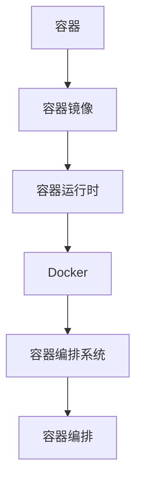
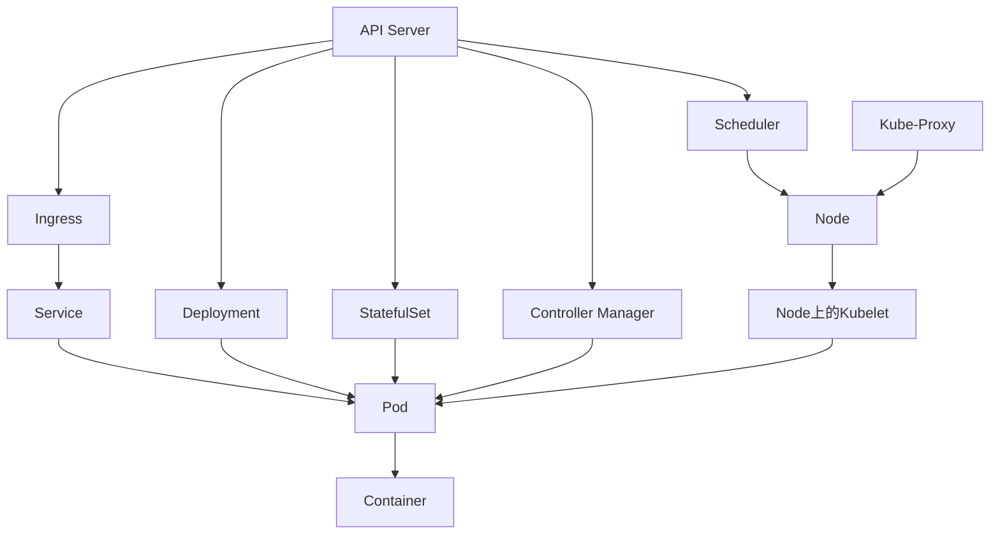

                 

### 引言

在当今快速发展的技术时代，容器化已成为应用部署的主流趋势。尤其对于一人公司来说，容器化不仅提高了开发和部署的效率，还显著降低了运维成本。那么，什么是容器化？为什么容器化对于一人公司至关重要？本文将深入探讨这些关键问题，并逐步介绍容器化部署的最佳实践。

#### 容器化的定义与意义

容器化是一种轻量级、可移植的计算模型，它通过封装应用及其依赖项，使开发者可以在任何环境中一致地运行应用。容器化的核心组件包括容器运行时（如Docker）和容器编排系统（如Kubernetes）。这种技术使得一人公司能够灵活、快速地部署和扩展应用。

#### 为什么容器化对一人公司至关重要

对于一人公司，容器化提供了以下几个关键优势：

1. **敏捷性**：容器化使得应用部署变得极其敏捷，开发人员可以在本地环境中开发、测试和部署应用，大大缩短了开发周期。
2. **成本效益**：容器化降低了硬件和软件的依赖性，一人公司无需购买昂贵的服务器，只需利用云计算资源即可满足需求。
3. **高可用性**：通过容器编排系统，一人公司可以轻松实现应用的高可用性，确保业务持续运行。
4. **易于维护**：容器化使应用和其依赖项的维护变得更加简单，因为一切都封装在容器中，减少了配置错误的风险。

#### 本文结构

本文将按照以下结构进行讨论：

1. **第一部分：容器化技术基础**：介绍容器化技术的基本概念，包括容器技术概述、Docker基础和Kubernetes入门。
2. **第二部分：容器化部署实战**：详细讲解如何将Web应用和微服务容器化，以及如何实现持续集成与持续部署（CI/CD）。
3. **第三部分：一人公司的容器化部署策略**：分析一人公司如何选择合适的容器化部署策略，并解决容器化部署的挑战。
4. **附录**：提供常用工具和资源的链接，帮助读者深入学习。

通过本文，读者将全面了解容器化技术，并学会如何将其应用到实际业务中，从而实现更高效、更可靠的应用部署。

### 第一部分：容器化技术基础

容器化技术的发展始于2000年代初，随着云计算和虚拟化技术的兴起，容器逐渐成为一种更加轻量级、高效的计算模型。本部分将详细介绍容器化技术的核心概念、Docker的基础知识和Kubernetes的入门知识，为后续的容器化部署实战打下坚实的基础。

#### 第1章：容器化技术概述

**1.1 容器技术简介**

容器（Container）是一种轻量级的虚拟化技术，它将应用程序及其运行时环境打包在一起，形成一个独立的运行单元。与传统的虚拟机相比，容器在资源占用、启动速度和隔离性等方面具有显著优势。

- **定义与特点**：容器是一种沙箱环境，通过操作系统的 Namespace 和 Cgroup 等机制实现资源隔离，但与虚拟机不同的是，容器并不需要额外的操作系统，从而极大地降低了资源消耗。
- **与传统虚拟机的区别**：虚拟机通过虚拟化硬件资源（如CPU、内存、网络等）来创建多个隔离的虚拟环境，每个虚拟环境都有自己的操作系统。而容器则直接运行在宿主机的操作系统上，共享宿主机的内核，从而避免了重复的资源占用和开销。
- **发展历程**：容器技术的发展经历了从最初的Chroot到LXC，再到Docker的演变。Docker的诞生标志着容器技术进入了一个新的时代，其易于使用和强大的生态系统使其迅速流行起来。

**1.2 容器运行时与容器编排**

容器运行时（Container Runtime）是负责容器生命周期管理的组件，如Docker、runc等。而容器编排（Container Orchestration）则是为了管理大规模容器集群而设计的系统，如Kubernetes。

- **容器运行时的工作原理**：容器运行时通过镜像仓库（Image Registry）获取容器镜像，并使用Namespace和Cgroup等机制创建和管理容器。Docker是当前最流行的容器运行时，其通过Dockerfile定义和构建容器镜像。
- **容器编排的基本概念**：容器编排系统负责在容器集群中自动化部署、扩展和管理容器。Kubernetes是当前最流行的容器编排系统，其通过声明式API（Application Programming Interface）管理集群中的所有资源，如Pod、Service、Deployment等。

**1.3 容器编排的优势与挑战**

容器编排带来了许多好处，但也伴随着一些挑战。

- **优势**：
  - **高效部署**：容器编排系统能够快速部署和扩展应用，减少了手动操作的时间和工作量。
  - **资源优化**：通过自动调度和负载均衡，容器编排系统能够更有效地利用资源，提高系统的整体性能。
  - **高可用性**：容器编排系统能够自动恢复故障节点上的容器，确保应用的高可用性。

- **挑战**：
  - **复杂性**：容器编排系统的管理和维护较为复杂，需要一定的专业技能和知识储备。
  - **安全性**：容器编排系统中的容器需要严格的安全策略和防护措施，以防止潜在的安全风险。
  - **性能优化**：虽然容器编排系统能够提高资源利用率，但需要进一步优化以避免性能瓶颈。

**核心概念与联系**

容器化技术的核心概念包括容器、容器镜像、容器运行时、容器编排和容器编排系统。它们之间的关系如下：

- **容器**：是应用运行的最终执行环境，负责封装应用及其依赖项。
- **容器镜像**：是容器的静态表示，包含了应用和运行时环境，是容器化的基础。
- **容器运行时**：负责创建和管理容器，如Docker。
- **容器编排**：是指管理大规模容器集群的技术，如Kubernetes。
- **容器编排系统**：是实现容器编排的具体系统，如Kubernetes。

**Mermaid 流程图**

以下是一个简单的Mermaid流程图，展示容器化技术的核心概念之间的关系：



通过上述介绍，读者可以初步了解容器化技术的核心概念和原理。接下来，我们将深入探讨Docker的基础知识，为后续的容器化部署实战做准备。

### 第2章：Docker基础

Docker是容器化技术的核心组件之一，它为容器化提供了完整的生命周期管理。本节将介绍Docker的安装与配置、Dockerfile的编写、以及Docker镜像与容器的管理，帮助读者全面了解Docker的基础知识。

#### 2.1 Docker安装与配置

**Docker环境搭建**

要在本地计算机上使用Docker，首先需要安装Docker引擎。以下是安装步骤：

1. **安装Docker引擎**

   对于Ubuntu系统，可以使用以下命令安装Docker：

   ```bash
   sudo apt-get update
   sudo apt-get install docker-ce docker-ce-cli containerd.io
   ```

   对于CentOS系统，可以使用以下命令安装Docker：

   ```bash
   sudo yum install docker
   ```

2. **启动Docker服务**

   安装完成后，启动Docker服务：

   ```bash
   sudo systemctl start docker
   ```

3. **验证Docker安装**

   运行以下命令，验证Docker是否安装成功：

   ```bash
   docker --version
   ```

   如果看到版本信息，说明Docker已成功安装。

**Dockerfile编写**

Dockerfile是一个文本文件，用于指定如何构建Docker镜像。以下是一个简单的Dockerfile示例：

```Dockerfile
# 使用官方Python镜像作为基础
FROM python:3.9-slim

# 设置工作目录
WORKDIR /app

# 将当前目录下的文件复制到容器的/app目录
COPY . /app

# 安装依赖项
RUN pip install --no-cache-dir -r requirements.txt

# 暴露容器的端口
EXPOSE 8000

# 运行应用程序
CMD ["python", "app.py"]
```

- **FROM**：指定基础镜像，这里是官方的Python镜像。
- **WORKDIR**：设置工作目录。
- **COPY**：将当前目录下的文件复制到容器中。
- **RUN**：执行命令，如安装依赖项。
- **EXPOSE**：暴露容器的端口。
- **CMD**：指定容器启动时要运行的命令。

**Docker镜像与容器管理**

- **构建镜像**：使用以下命令构建镜像：

  ```bash
  docker build -t my-python-app .
  ```

  这会使用当前目录中的Dockerfile构建一个名为`my-python-app`的镜像。

- **运行容器**：使用以下命令运行一个容器：

  ```bash
  docker run -d -p 8000:8000 my-python-app
  ```

  这会在后台运行一个容器，并映射端口8000到宿主机的端口8000。

- **列出容器**：使用以下命令列出当前运行的容器：

  ```bash
  docker ps
  ```

- **停止容器**：使用以下命令停止一个容器：

  ```bash
  docker stop [容器ID或名称]
  ```

- **删除容器**：使用以下命令删除一个容器：

  ```bash
  docker rm [容器ID或名称]
  ```

**示例**

假设我们有一个简单的Web应用，其Dockerfile如下：

```Dockerfile
FROM ubuntu:20.04
RUN apt-get update && apt-get install -y python3-pip
COPY requirements.txt .
RUN pip3 install -r requirements.txt
COPY . .
EXPOSE 8000
CMD ["python3", "app.py"]
```

在这个Dockerfile中，我们首先从Ubuntu 20.04镜像开始，然后安装Python和pip，复制requirements.txt文件并安装依赖项，最后复制应用代码并暴露端口。

构建和运行这个镜像的命令如下：

```bash
docker build -t my-web-app .
docker run -d -p 8000:8000 my-web-app
```

通过上述步骤，读者可以掌握Docker的基础操作，为后续的容器化部署实战做好准备。接下来，我们将进一步探讨Docker的网络配置，了解如何管理容器之间的网络通信。

#### 2.2 Docker网络配置

Docker提供了多种网络模式，使得容器之间的网络通信和外部访问变得更加灵活和可控。本节将介绍常见的网络模式、网络配置实战以及网络流量管理。

**2.2.1 容器网络模式介绍**

Docker支持以下几种网络模式：

- **bridge模式**：这是Docker默认的网络模式，通过虚拟桥接网络实现容器之间的通信。每个容器都会连接到一个名为`bridge`的虚拟桥接网络，并分配一个独立且唯一的IP地址。
- **host模式**：容器将直接使用宿主机的网络命名空间，共享宿主机的网络配置和端口。这种方式适用于容器和宿主机之间需要高度网络共享的场景，但会牺牲一定的隔离性。
- **none模式**：容器将不会连接到任何网络，从而无法进行网络通信。这种方式适用于需要完全隔离的容器，但实际应用较少。
- **user-defined模式**：用户可以自定义网络，通过创建自定义网络来配置容器之间的网络连接。

**2.2.2 网络配置实战**

以下是一个简单的网络配置实战示例，演示如何使用bridge模式创建一个自定义网络，并将容器连接到该网络。

1. **创建自定义网络**：

   ```bash
   docker network create my-custom-network
   ```

   这将创建一个名为`my-custom-network`的自定义网络。

2. **将容器连接到自定义网络**：

   ```bash
   docker run -d --network my-custom-network --name my-container1 busybox echo "Container 1 on custom network"
   docker run -d --network my-custom-network --name my-container2 busybox echo "Container 2 on custom network"
   ```

   这将启动两个容器，并将它们连接到`my-custom-network`网络。运行以下命令查看容器的网络信息：

   ```bash
   docker inspect my-container1
   docker inspect my-container2
   ```

   可以看到容器的IP地址和网络配置。

**2.2.3 网络流量管理**

Docker提供了多种工具来管理容器之间的网络流量：

- **iptables**：用于管理容器网络流量的防火墙规则，可以通过`iptables`命令来设置规则。
- **cgroups**：用于控制容器资源的消耗，包括网络带宽。
- **namespace**：用于隔离容器网络命名空间，确保容器之间不会相互干扰。

**示例**

以下是一个简单的iptables规则示例，用于限制容器之间的网络流量：

```bash
iptables -A FORWARD -i docker0 -o eth0 -j DROP
```

这将阻止通过`docker0`网络接口进入`eth0`接口的流量。

通过上述实战和示例，读者可以了解如何配置和管理Docker的网络，为容器化部署提供坚实的网络基础。接下来，我们将介绍Kubernetes的基础知识，了解如何使用Kubernetes进行容器编排。

### 第3章：Kubernetes入门

Kubernetes（简称K8s）是一个开源的容器编排平台，用于自动化容器化应用程序的部署、扩展和管理。在本章中，我们将介绍Kubernetes的架构、工作原理和对象模型，帮助读者了解Kubernetes的基本概念和操作。

#### 3.1 Kubernetes架构

Kubernetes由一组相互协作的组件构成，这些组件协同工作以管理容器集群。以下是Kubernetes的主要组件及其功能：

- **控制平面（Control Plane）**：
  - **API Server**：接收并处理集群的配置和请求，是Kubernetes的入口点。
  - **Scheduler**：负责调度容器到集群中的节点。
  - **Controller Manager**：由多个控制器组成，负责维护集群的状态，如复制控制器（Replica Controller）、网络控制器（Network Controller）等。

- **工作节点（Worker Node）**：
  - **Node**：集群中的计算节点，运行容器和Kubernetes的容器运行时（如Docker、containerd）。
  - **Pod**：Kubernetes中最小的部署单元，一个Pod可以包含一个或多个容器。
  - **Kubelet**：在每个节点上运行，负责监控容器状态，确保容器按预期运行。
  - **Kube-Proxy**：在每个节点上运行，负责实现集群内部网络流量的转发。

- **集群存储**：提供持久化存储解决方案，如NFS、iSCSI、GFS2等，用于存储容器数据。

**Kubernetes工作原理**

Kubernetes通过以下步骤来管理和调度容器：

1. **用户通过Kubernetes API提交配置**：用户通过Kubernetes API提交应用程序的配置，如部署（Deployment）、服务（Service）等。
2. **API Server接收配置并持久化**：API Server接收用户的配置请求，并将这些配置持久化到etcd（一个分布式键值存储系统）。
3. **Scheduler调度容器到节点**：Scheduler根据节点的资源情况和策略，选择一个最适合的节点来运行容器。
4. **Kubelet在节点上部署容器**：Kubelet在选定的节点上部署容器，启动Pod和管理容器生命周期。
5. **Kube-Proxy实现网络流量转发**：Kube-Proxy在节点上配置网络规则，确保容器之间的内部通信和外部访问。
6. **Controller Manager维护集群状态**：Controller Manager监控集群状态，确保所有资源按照预期运行，如调整副本数量、处理故障等。

**Kubernetes对象模型**

Kubernetes使用一组称为“对象”的数据结构来表示和管理资源。以下是一些主要的Kubernetes对象：

- **Pod**：Pod是Kubernetes的基本部署单元，包含一个或多个容器。Pod负责协调和管理容器的生命周期。
- **Container**：容器是Pod内的实际运行单元，可以是一个应用程序或服务。
- **Service**：Service是用于访问Pod的一种抽象，通过定义一组Pod的逻辑集合并提供稳定的网络标识，实现服务的负载均衡。
- **Deployment**：Deployment是一种用于管理Pod的控制器，可以确保指定的Pod副本数量并管理Pod的更新。
- **StatefulSet**：StatefulSet用于管理有状态服务，确保每个Pod具有稳定的网络标识和持久化存储。
- **Ingress**：Ingress定义了如何通过外部访问集群内部的服务，通常用于设置域名和负载均衡器。

**核心概念与联系**

以下是Kubernetes核心概念之间的关系架构图：



通过上述介绍，读者可以初步了解Kubernetes的架构和基本概念。在下一章中，我们将深入探讨如何使用Kubernetes部署和管理容器，帮助读者将理论应用到实际操作中。

### 第4章：应用容器化实践

在实际项目中，容器化技术的应用已经变得非常普遍。本章将详细介绍如何将Web应用和微服务容器化，并使用Docker Compose和Docker Swarm进行管理。通过具体的实战案例，我们将展示如何高效地进行容器化部署。

#### 4.1 容器化Web应用

容器化Web应用是容器化部署中最常见的场景之一。以下是一个基于LAMP（Linux、Apache、MySQL、PHP）环境的Web应用容器化实战。

**4.1.1 容器化LAMP环境搭建**

1. **准备Dockerfile**：

   创建一个名为`Dockerfile`的文件，内容如下：

   ```Dockerfile
   # 使用官方Ubuntu镜像作为基础
   FROM ubuntu:20.04

   # 安装Apache、MySQL和PHP
   RUN apt-get update && apt-get install -y apache2 mysql-server php libapache2-mod-php

   # 启动Apache和MySQL服务
   RUN systemctl start apache2 mysql

   # 设置Apache默认网站
   RUN echo "<h1>Hello, World!</h1>" > /var/www/html/index.php

   # 暴露Apache端口
   EXPOSE 80

   # 运行Apache服务
   CMD ["apache2-foreground"]
   ```

2. **构建镜像**：

   在项目目录下运行以下命令构建镜像：

   ```bash
   docker build -t my-lamp-app .
   ```

3. **运行容器**：

   使用以下命令运行容器：

   ```bash
   docker run -d -p 8080:80 my-lamp-app
   ```

   这样，一个容器化的LAMP环境就搭建完成了，外部访问宿主机的8080端口即可看到Apache默认网站。

**4.1.2 容器化Nginx反向代理配置**

为了提高Web应用的性能和可靠性，通常会使用Nginx作为反向代理服务器。以下是一个简单的Nginx容器配置：

1. **准备Nginx配置文件**：

   创建一个名为`nginx.conf`的文件，内容如下：

   ```nginx
   server {
       listen 80;
       server_name localhost;

       location / {
           proxy_pass http://localhost:8080;
           proxy_set_header Host $host;
           proxy_set_header X-Real-IP $remote_addr;
           proxy_set_header X-Forwarded-For $proxy_add_x_forwarded_for;
           proxy_set_header X-Forwarded-Proto $scheme;
       }
   }
   ```

2. **构建Nginx镜像**：

   创建一个名为`Dockerfile`的文件，内容如下：

   ```Dockerfile
   # 使用官方Nginx镜像作为基础
   FROM nginx:latest

   # 将配置文件复制到容器中
   COPY nginx.conf /etc/nginx/nginx.conf

   # 暴露Nginx端口
   EXPOSE 80

   # 运行Nginx服务
   CMD ["nginx", "-g", "daemon off;"]
   ```

3. **构建镜像并运行容器**：

   ```bash
   docker build -t my-nginx-proxy .
   docker run -d -p 80:80 my-nginx-proxy
   ```

   现在，通过宿主机的80端口访问Web应用，可以看到由Nginx反向代理处理的请求。

**4.1.3 容器化数据库（如MySQL）**

容器化数据库能够提高数据库的部署和管理效率。以下是如何将MySQL数据库容器化的步骤：

1. **准备MySQL配置文件**：

   创建一个名为`my.cnf`的文件，内容如下：

   ```ini
   [mysqld]
   datadir=/var/lib/mysql
   socket=/var/lib/mysql/mysql.sock
   user=mysql
   pid-file=/var/run/mysqld/mysqld.pid
   symbolic-links=0
   log-error=/var/log/mysql/error.log
   sql-mode=NO_ENGINE_SUBSTITUTION,STRICT_TRANS_TABLES,STRICT_ALL_TABLES,ERROR_FOR_DIVISION_BY_ZERO,NO_AUTO_CREATE_USER,NO_AUTO_USER

   [client]
   default-character-set=utf8mb4

   [mysql]
   default-character-set=utf8mb4
   ```

2. **构建MySQL镜像**：

   创建一个名为`Dockerfile`的文件，内容如下：

   ```Dockerfile
   # 使用官方MySQL镜像作为基础
   FROM mysql:8.0

   # 将配置文件复制到容器中
   COPY my.cnf /etc/mysql/conf.d/my.cnf

   # 设置root用户密码
   RUN mysql_root_password=$(tr -dc A-Za-z0-9 </dev/urandom || tr -dc A-Za-z0-9 [A-Z] </dev/urandom) && \
       mysql -e "ALTER USER 'root'@'localhost' IDENTIFIED BY '"$mysql_root_password"'; FLUSH PRIVILEGES;" && \
       echo "root_password=$mysql_root_password" > /run/secrets/mysql_root_password

   # 暴露MySQL端口
   EXPOSE 3306

   # 运行MySQL服务
   CMD ["mysqld", "--character-set-server=utf8mb4", "--collation-server=utf8mb4_unicode_ci"]
   ```

3. **构建镜像并运行容器**：

   ```bash
   docker build -t my-mysql-db .
   docker run -d -p 3306:3306 my-mysql-db
   ```

   运行容器后，可以使用`docker logs`命令查看root用户的密码，以便后续连接数据库。

通过上述实战案例，读者可以了解如何将Web应用、Nginx反向代理和MySQL数据库容器化，为后续的微服务容器化和CI/CD实践打下基础。接下来，我们将介绍如何使用Docker Compose和Docker Swarm进行容器化部署的管理。

#### 4.2 容器化微服务

微服务架构是一种将大型应用程序拆分成小型、独立服务的架构风格，这使得系统更加灵活、可扩展且易于维护。在本节中，我们将介绍如何使用Docker Compose和Docker Swarm进行微服务的容器化和管理。

**4.2.1 微服务架构概述**

微服务架构的核心思想是将应用程序划分为多个小型服务，每个服务负责完成特定的功能。这些服务通过API进行通信，独立部署和扩展，从而提高了系统的灵活性和可维护性。以下是微服务架构的一些关键特点：

- **独立性**：每个服务都是独立的，可以独立部署和扩展。
- **自治性**：每个服务都有自己的数据存储，不会与其它服务共享。
- **分布式**：服务可以分布在不同的服务器上，提高了系统的可用性和扩展性。
- **动态性**：服务可以根据需要动态启动和停止，以适应负载变化。

**4.2.2 使用Docker Compose管理微服务**

Docker Compose是一个用于定义和运行多容器Docker应用的工具，通过一个YAML文件（称为`docker-compose.yml`）描述应用程序的各个服务。以下是一个简单的Docker Compose实战案例。

1. **准备docker-compose.yml文件**：

   创建一个名为`docker-compose.yml`的文件，内容如下：

   ```yaml
   version: '3'
   services:
     web:
       build: ./web
       ports:
         - "8000:8000"
       depends_on:
         - db
         - cache
     db:
       image: mysql:5.7
       environment:
         - MYSQL_ROOT_PASSWORD=mysecretpassword
         - MYSQL_DATABASE=mydatabase
       volumes:
         - db_data:/var/lib/mysql
     cache:
       image: redis:alpine
   volumes:
     db_data:
   ```

   在这个文件中，我们定义了三个服务：web、db和cache。web服务是前端服务，db服务是后端数据库服务，cache服务是缓存服务。

2. **构建和运行服务**：

   在项目目录下运行以下命令：

   ```bash
   docker-compose build
   docker-compose up -d
   ```

   这会构建并运行所有服务，`-d`参数表示在后台运行。

3. **访问服务**：

   使用以下命令查看服务的IP地址和端口：

   ```bash
   docker-compose ps
   ```

   通过访问`web`服务的IP地址和端口（如`http://<web服务IP>:8000`），可以看到一个简单的Web应用。

**4.2.3 Docker Swarm集群管理**

Docker Swarm是一个内置的容器编排工具，用于管理Docker服务。通过Swarm，可以将多个Docker节点组成一个集群，实现容器的自动化部署和扩展。以下是如何使用Docker Swarm管理微服务。

1. **初始化Swarm**：

   在管理节点上运行以下命令初始化Swarm：

   ```bash
   docker swarm init
   ```

   这会将当前节点标记为Swarm的管理节点。

2. **加入Swarm**：

   在工作节点上运行以下命令将其加入Swarm：

   ```bash
   docker swarm join --token $(docker swarm init --ponge-token) <管理节点IP>
   ```

   这会将工作节点加入到Swarm集群中。

3. **部署服务到Swarm**：

   使用以下命令在Swarm集群中部署服务：

   ```bash
   docker service create --replicas 3 --name my-microservice --publish published --network my-network docker-compose.yml
   ```

   这会部署一个包含三个副本的微服务，并暴露服务。

4. **查看服务状态**：

   使用以下命令查看Swarm集群中服务的状态：

   ```bash
   docker service ls
   ```

   通过访问Swarm集群中服务的外部IP地址和端口，可以访问微服务。

通过Docker Compose和Docker Swarm，我们可以轻松地管理和部署微服务，提高系统的灵活性和可扩展性。接下来，我们将介绍如何实现持续集成与持续部署（CI/CD），进一步优化开发流程。

#### 4.3 持续集成与持续部署（CI/CD）

持续集成（CI）和持续部署（CD）是现代软件开发中的关键实践，它们通过自动化流程提高软件交付的速度和可靠性。在本节中，我们将介绍CI/CD的基本概念、设计流程以及使用Jenkins实现CI/CD的步骤。

**4.3.1 CI/CD简介**

持续集成（CI）是指开发者在每次提交代码时，自动执行一系列构建和测试任务，以确保代码的质量和功能完整性。持续部署（CD）则是在CI的基础上，自动将经过测试的代码部署到生产环境，实现快速、可靠的软件交付。

**4.3.2 CI/CD流程设计**

一个典型的CI/CD流程包括以下步骤：

1. **代码提交**：开发者在版本控制系统（如Git）中提交代码。
2. **构建**：CI服务器（如Jenkins）接收提交，并自动构建应用程序。
3. **测试**：执行一系列测试，包括单元测试、集成测试和性能测试，确保代码的正确性和稳定性。
4. **部署**：如果测试通过，CI/CD系统将应用程序部署到测试或生产环境。
5. **监控**：部署后，监控系统将持续监控应用程序的健康状况，及时发现和解决问题。

**4.3.3 常见的CI/CD工具介绍**

以下是一些常用的CI/CD工具：

- **Jenkins**：一个开源的自动化服务器，支持多种插件，可以实现复杂的CI/CD流程。
- **GitLab CI/CD**：GitLab内置的CI/CD解决方案，与GitLab仓库紧密集成。
- **Travis CI**：一个云端的CI服务，支持多种编程语言和平台。
- **CircleCI**：一个云端CI/CD服务，提供简单、强大的工作流程。

**4.3.4 Jenkins实践**

Jenkins是一个功能强大的CI/CD工具，以下是如何使用Jenkins实现CI/CD的步骤：

1. **安装Jenkins**：

   在Linux或macOS上，可以通过包管理器安装Jenkins：

   ```bash
   sudo apt-get install jenkins
   ```

   在Windows上，可以从Jenkins官网下载安装程序。

2. **配置Jenkins**：

   运行Jenkins安装程序时，选择自定义安装，并确保Jenkins服务被安装。

3. **安装必要的插件**：

   登录Jenkins后，进入“管理Jenkins”页面，选择“管理插件”，安装以下插件：
   - Gradle插件
   - Maven插件
   - Git插件
   - Pipeline插件

4. **创建一个Pipeline项目**：

   在Jenkins的首页创建一个新的自由风格的项目，然后选择“Pipeline”作为项目类型。

5. **编写Pipeline脚本**：

   在“Pipeline Script from SCM”选项卡中，选择Git作为源代码管理工具，并填写项目的Git仓库地址和分支信息。接着，编写Pipeline脚本，内容如下：

   ```groovy
   pipeline {
       agent any
       environment {
           // 定义环境变量
           DOCKER_IMAGE = 'myapp'
       }
       stages {
           stage('Build') {
               steps {
                   // 构建应用程序
                   sh 'mvn clean install'
               }
           }
           stage('Test') {
               steps {
                   // 执行测试
                   sh 'mvn test'
               }
           }
           stage('Deploy') {
               steps {
                   // 部署应用程序
                   sh 'docker build -t ${DOCKER_IMAGE} .'
                   sh 'docker push ${DOCKER_IMAGE}'
               }
           }
       }
   }
   ```

   在这个脚本中，我们定义了一个包含构建、测试和部署三个阶段的Pipeline。

6. **保存和运行Pipeline**：

   保存脚本后，点击“立即构建”按钮运行Pipeline。Jenkins将自动执行构建、测试和部署流程。

7. **集成容器化环境**：

   为了确保Jenkins能够访问和操作Docker环境，需要配置Jenkins的Docker插件，允许Jenkins与Docker守护进程通信。

通过上述步骤，读者可以使用Jenkins实现一个完整的CI/CD流程，从而提高软件开发的效率和质量。接下来，我们将介绍Kubernetes的高级部署和管理策略，帮助读者进一步优化容器化部署。

### 第5章：Kubernetes高级部署与管理

在容器化部署中，Kubernetes是一个强大的工具，能够帮助开发者和管理员高效地管理容器集群。本章将探讨Kubernetes的高级部署与管理策略，包括资源管理、集群扩展、自动化扩缩容以及高可用性部署。

#### 6.1 Kubernetes资源管理

Kubernetes资源管理是确保容器集群高效运行的核心。Kubernetes提供了一系列资源对象，如Pod、Service、Deployment和StatefulSet，用于管理容器集群中的资源。

**6.1.1 Deployment与StatefulSet详解**

- **Deployment**：Deployment是一种用于管理Pod的高级抽象，可以方便地创建、更新和回滚Pod。它通过控制副本数量来确保应用程序的可用性和一致性。以下是一个Deployment的YAML配置示例：

  ```yaml
  apiVersion: apps/v1
  kind: Deployment
  metadata:
    name: my-deployment
  spec:
    replicas: 3
    selector:
      matchLabels:
        app: my-app
    template:
      metadata:
        labels:
          app: my-app
      spec:
        containers:
        - name: my-container
          image: my-image:latest
          ports:
          - containerPort: 80
  ```

- **StatefulSet**：StatefulSet用于管理有状态服务，确保每个Pod具有稳定的网络标识和持久化存储。以下是一个StatefulSet的YAML配置示例：

  ```yaml
  apiVersion: apps/v1
  kind: StatefulSet
  metadata:
    name: my-statefulset
  spec:
    serviceName: "my-service"
    replicas: 3
    selector:
      matchLabels:
        app: my-app
    template:
      metadata:
        labels:
          app: my-app
      spec:
        containers:
        - name: my-container
          image: my-image:latest
          ports:
          - containerPort: 80
    volumeClaimTemplates:
    - metadata:
        name: data
      spec:
        accessModes: ["ReadWriteOnce"]
        resources:
          requests:
            storage: 1Gi
  ```

**6.1.2 Service与Ingress配置**

- **Service**：Service提供了一种抽象，允许容器应用通过稳定的网络标识进行通信。以下是一个Service的YAML配置示例：

  ```yaml
  apiVersion: v1
  kind: Service
  metadata:
    name: my-service
  spec:
    selector:
      app: my-app
    ports:
      - protocol: TCP
        port: 80
        targetPort: 80
    type: LoadBalancer
  ```

- **Ingress**：Ingress用于管理外部访问到集群内部服务。以下是一个Ingress的YAML配置示例：

  ```yaml
  apiVersion: networking.k8s.io/v1
  kind: Ingress
  metadata:
    name: my-ingress
    annotations:
      kubernetes.io/ingress.class: "nginx"
  spec:
    rules:
    - host: my-app.example.com
      http:
        paths:
        - path: /
          pathType: Prefix
          backend:
            service:
              name: my-service
              port:
                number: 80
  ```

**6.1.3 服务发现与配置管理**

- **服务发现**：Kubernetes通过DNS名称或环境变量自动提供服务发现机制，使容器能够相互发现和通信。
- **配置管理**：Kubernetes提供了ConfigMap和Secret两种机制，用于存储和管理应用程序的配置信息。

  - **ConfigMap**：用于存储非敏感配置信息。
    ```yaml
    apiVersion: v1
    kind: ConfigMap
    metadata:
      name: my-config
    data:
      database_url: "http://db:5432"
    ```

  - **Secret**：用于存储敏感信息，如密码、密钥等。
    ```yaml
    apiVersion: v1
    kind: Secret
    metadata:
      name: my-secret
    type: Opaque
    data:
      database_password: "c2VjdXJlcm5hbWU="
    ```

#### 6.2 Kubernetes集群扩展

Kubernetes集群的扩展是确保应用性能和可用性的关键。以下是一些常用的集群扩展策略：

**6.2.1 Kubernetes集群架构扩展**

- **水平扩展**：通过增加更多的节点来扩展集群规模，以支持更多的容器实例。
- **垂直扩展**：通过增加节点硬件资源（如CPU、内存）来提高单个节点的处理能力。

**6.2.2 自动化扩缩容策略**

Kubernetes提供了自动扩缩容（Horizontal Pod Autoscaler，HPA）功能，可以根据资源使用情况自动调整Pod的副本数量。

以下是一个HPA的YAML配置示例：

```yaml
apiVersion: autoscaling/v2beta2
kind: HorizontalPodAutoscaler
metadata:
  name: my-hpa
spec:
  scaleTargetRef:
    apiVersion: apps/v1
    kind: Deployment
    name: my-deployment
  minReplicas: 1
  maxReplicas: 10
  targetCPUUtilizationPercentage: 70
```

通过配置目标CPU利用率百分比，HPA可以自动调整Pod的副本数量，确保应用在高负载时得到足够的资源。

**6.2.3 高可用性集群部署**

高可用性（High Availability，HA）是确保应用在硬件或软件故障时仍然能够正常运行的关键。以下是一些实现高可用性集群部署的策略：

- **主从复制**：通过设置主从关系，确保数据在主节点和从节点之间保持同步，主节点故障时可以从从节点恢复。
- **负载均衡**：使用负载均衡器（如Nginx Ingress Controller）来分发流量，确保集群中的节点可以均衡负载。
- **故障转移**：配置故障转移机制，确保在主节点故障时，从节点可以接管主节点的任务。

通过上述策略和配置，Kubernetes集群可以有效地扩展和管理，从而满足不同的业务需求。接下来，我们将讨论容器化安全与监控，确保容器化部署的安全性和稳定性。

### 第7章：容器化安全与监控

容器化部署在带来高效和灵活的同时，也带来了一些安全和管理上的挑战。本章节将讨论容器化安全最佳实践，包括容器镜像安全扫描、容器运行时安全策略以及容器监控与性能优化。

#### 7.1 容器化安全最佳实践

容器化安全的关键在于确保容器镜像和运行时的安全性，以下是几个最佳实践：

**7.1.1 容器镜像安全扫描**

- **使用官方镜像**：尽量使用来自官方仓库的镜像，这些镜像经过了严格的审核和测试。
- **定期扫描**：定期对容器镜像进行安全扫描，以检测潜在的安全漏洞。可以使用工具如Clair或Docker Bench for Security。
- **最小权限原则**：容器镜像应该使用最小权限原则，避免运行具有过多权限的容器。
- **依赖管理**：确保镜像中的依赖项是最新且安全的，使用依赖管理工具如Dependabot或Snyk进行自动更新和扫描。

**7.1.2 容器运行时安全策略**

- **容器命名空间隔离**：通过使用命名空间隔离，确保容器之间不会共享系统资源，从而降低潜在的安全风险。
- **Cgroup资源限制**：通过Cgroup限制容器对CPU、内存、磁盘等资源的访问，避免容器占用过多资源影响其他容器。
- **AppArmor或SELinux**：使用AppArmor或SELinux等安全增强工具来限制容器访问宿主机上的文件系统和进程。
- **使用非根用户运行容器**：尽量避免以root用户运行容器，而是创建一个具有最小权限的用户，以减少安全风险。

**7.1.3 容器网络安全防护**

- **网络命名空间**：通过使用网络命名空间，确保容器之间的网络是隔离的。
- **使用防火墙规则**：在容器内部署防火墙，限制容器对外部网络的访问。
- **使用加密和认证**：确保容器之间的通信是加密的，并使用认证机制验证容器的身份。

#### 7.2 容器监控与管理

容器监控与管理是确保容器化部署稳定性和性能的关键。以下是一些常见的监控工具和最佳实践：

**7.2.1 Prometheus与Grafana的使用**

- **Prometheus**：Prometheus是一个开源的监控解决方案，主要用于收集和存储容器和服务的指标数据。以下是如何在Kubernetes集群中部署Prometheus的步骤：

  1. **安装Prometheus**：使用Helm或Kubernetes命令部署Prometheus。

     ```bash
     helm repo add prometheus-community https://prometheus-community.github.io/helm-charts
     helm repo update
     helm install my-prometheus prometheus-community/kube-prometheus
     ```

  2. **配置Prometheus**：在`prometheus.yml`文件中配置目标地址和 scrape 配置。

     ```yaml
     global:
       scrape_interval: 15s
     scrape_configs:
     - job_name: 'kubernetes-pods'
       kubernetes_sd_configs:
       - role: pod
     ```

- **Grafana**：Grafana是一个开源的数据可视化和监控工具，用于可视化Prometheus数据。以下是如何在Kubernetes集群中部署Grafana的步骤：

  1. **安装Grafana**：使用Helm部署Grafana。

     ```bash
     helm repo add grafana https://grafana.com/grafana-helm-charts
     helm repo update
     helm install my-grafana grafana/grafana
     ```

  2. **配置Grafana**：通过Grafana Web界面添加数据源，导入仪表板模板，并进行自定义配置。

**7.2.2 常见监控指标详解**

常见的容器监控指标包括：

- **CPU使用率**：容器消耗的CPU时间与总时间的比率。
- **内存使用率**：容器使用的内存总量与总内存的比率。
- **网络流量**：容器接收和发送的数据包数量和字节数量。
- **磁盘I/O**：容器读写磁盘的操作次数和速度。

**7.2.3 容器性能优化**

- **资源限制**：通过Kubernetes配置合理的数据资源限制，确保容器不会占用过多资源。
- **存储优化**：选择合适的存储解决方案，如使用SSD提高I/O性能。
- **容器编排优化**：合理分配容器资源，避免资源争用和瓶颈。
- **日志管理**：使用集中化的日志管理工具，如ELK（Elasticsearch、Logstash、Kibana）或Fluentd，提高日志收集和分析效率。

通过上述安全与监控的最佳实践，容器化部署不仅能够提高业务敏捷性，还能确保系统的安全和稳定性。接下来，我们将讨论如何为一人公司制定容器化部署策略，帮助读者解决实际部署过程中的挑战。

### 第8章：一人公司的容器化部署策略

对于一人公司，容器化部署不仅提供了灵活性和效率，还大大降低了运维成本。然而，面对单机部署与集群部署的选择、资源管理与成本控制，以及基础设施自动化管理，一人公司也需要谨慎考虑和策略性部署。以下是如何为一人公司制定容器化部署策略的具体建议。

#### 8.1 独立部署与分布式部署的选择

**8.1.1 独立部署**

独立部署是指在一台物理机或虚拟机上运行所有容器，适合资源有限、需求不高的场景。以下是独立部署的一些优势：

- **简单性**：独立部署的架构简单，易于管理和维护。
- **低成本**：无需购买多台服务器，减少了硬件和带宽的投入。
- **快速启动**：部署周期短，适合快速验证或测试环境。

但独立部署也有其局限性：

- **扩展性差**：随着业务增长，单机资源可能不足，影响系统性能。
- **高可用性差**：单点故障风险高，一旦服务器出现故障，可能导致整个系统不可用。

**8.1.2 分布式部署**

分布式部署是指将容器部署到多台服务器上，通过容器编排系统（如Kubernetes）进行管理和调度。以下是分布式部署的优势：

- **高可用性**：通过冗余部署和自动化扩缩容，确保系统的高可用性。
- **扩展性**：根据需求动态调整资源，适应业务增长。
- **性能优化**：负载均衡和资源隔离，提高系统性能。

但分布式部署也有其复杂性：

- **管理复杂**：需要更多的管理和维护工作。
- **成本较高**：需要购买多台服务器和存储设备。

**8.1.3 选择策略**

对于一人公司，以下策略可以帮助做出最佳选择：

- **初期阶段**：在业务规模较小、资源需求不高的初期，可以选择独立部署，以简化管理和降低成本。
- **业务增长**：随着业务增长和需求增加，应逐步转向分布式部署，以提升系统的可用性和扩展性。
- **混合部署**：可以根据不同的业务场景，采用混合部署策略，将核心业务部署在分布式集群中，非核心业务保持独立部署。

#### 8.2 资源管理与成本控制

**8.2.1 资源监控**

通过监控工具（如Prometheus）实时监控容器和集群的资源使用情况，可以及时发现和解决资源瓶颈。以下是一些关键指标：

- **CPU使用率**：监控容器和节点的CPU使用率，避免过载。
- **内存使用率**：监控容器和节点的内存使用率，确保系统稳定运行。
- **磁盘I/O**：监控容器和节点的磁盘I/O性能，优化存储资源。

**8.2.2 资源优化**

- **合理配置**：根据业务需求，合理配置容器和节点的资源，避免资源浪费。
- **负载均衡**：通过负载均衡器（如Kubernetes的Service）合理分配流量，避免单点压力。
- **自动化扩缩容**：使用Kubernetes的自动扩缩容功能，根据资源使用情况动态调整容器数量。

**8.2.3 成本控制**

- **按需付费**：使用云计算服务时，根据实际使用量按需付费，避免浪费。
- **优化配置**：选择合适的云服务器和存储配置，避免不必要的费用。
- **迁移成本**：评估迁移到容器化架构的收益，确保投入产出比合理。

#### 8.3 基础设施自动化管理

**8.3.1 自动化部署**

使用工具（如Kubernetes和Ansible）实现基础设施的自动化部署和管理，可以减少手动操作，提高部署效率。以下是一些自动化部署的关键步骤：

- **自动化脚本**：编写自动化脚本，实现环境搭建、服务部署和配置管理。
- **版本控制**：使用版本控制系统（如Git）管理自动化脚本和配置文件，确保部署的一致性。
- **CI/CD**：结合持续集成与持续部署（CI/CD）工具，实现自动化的代码构建、测试和部署。

**8.3.2 自动化监控**

- **Prometheus**：使用Prometheus收集和存储容器和服务的监控数据。
- **Grafana**：使用Grafana可视化监控数据，提供实时监控和报警。
- **自动化报警**：配置自动化报警规则，确保在系统发生异常时能够及时通知和响应。

通过上述策略和建议，一人公司可以有效地进行容器化部署，提高业务的敏捷性和可靠性。接下来，我们将讨论容器化部署的挑战与解决方案，帮助读者应对实际操作中的问题。

### 第9章：容器化部署的挑战与解决方案

尽管容器化部署带来了许多好处，但在实际操作中仍然存在一些挑战。本章将分析容器化部署中的常见挑战，并提出相应的解决方案，帮助读者应对这些问题。

#### 9.1 单机部署与集群部署的区别

**9.1.1 单机部署**

单机部署是将所有容器运行在同一台服务器上，适用于资源有限或测试环境。以下是单机部署的一些特点：

- **简单性**：架构简单，不需要复杂的编排和管理工具。
- **资源限制**：依赖单台服务器的资源，无法充分利用多台服务器的计算能力。

**9.1.2 集群部署**

集群部署是将容器分布运行在多台服务器上，通过容器编排系统（如Kubernetes）进行管理和调度。以下是集群部署的一些特点：

- **高可用性**：通过冗余部署和自动化扩缩容，提高系统的可用性。
- **扩展性**：可以根据需求动态调整资源，适应业务增长。

**9.1.3 解决方案**

- **资源规划**：根据业务需求合理分配资源，避免单点瓶颈。
- **自动化管理**：使用自动化工具（如Kubernetes）进行部署和管理，减少手动操作。

#### 9.2 容器化部署的安全考虑

容器化部署的安全问题主要集中在容器镜像、容器运行时和容器网络等方面。以下是几个关键的安全考虑：

**9.2.1 容器镜像安全**

- **使用官方镜像**：尽量使用来自官方仓库的镜像，减少潜在的安全风险。
- **定期扫描**：使用安全扫描工具定期扫描镜像，检测漏洞和风险。

**9.2.2 容器运行时安全**

- **最小权限原则**：容器应运行在具有最小权限的用户下，减少攻击面。
- **Cgroup资源限制**：通过Cgroup限制容器对系统资源的访问，防止恶意容器占用过多资源。

**9.2.3 容器网络安全**

- **网络命名空间**：使用网络命名空间确保容器之间的网络是隔离的。
- **防火墙规则**：配置防火墙规则，限制容器对外部网络的访问。

#### 9.3 容器化部署的运维挑战及解决方案

**9.3.1 故障恢复**

容器化部署中，由于容器是动态管理的，故障恢复是一个关键挑战。以下是一些解决方案：

- **自动重启**：配置容器自动重启策略，确保故障容器能够快速恢复。
- **集群扩缩容**：通过自动化扩缩容策略，确保系统具备足够的冗余资源。

**9.3.2 监控和日志管理**

容器化环境中的监控和日志管理是确保系统稳定运行的关键。以下是一些解决方案：

- **集中化监控**：使用Prometheus等工具实现集中化监控，实时监控系统状态。
- **日志收集**：使用ELK（Elasticsearch、Logstash、Kibana）等工具实现日志收集和分析，快速定位问题。

**9.3.3 配置管理**

容器化环境中的配置管理需要确保配置的一致性和安全性。以下是一些解决方案：

- **配置管理工具**：使用Ansible、Terraform等配置管理工具，实现自动化配置管理。
- **版本控制**：使用版本控制系统（如Git）管理配置文件，确保配置的一致性。

通过上述解决方案，一人公司可以有效地应对容器化部署中的挑战，确保系统的高效运行和安全性。接下来，我们将讨论容器化部署最佳实践，提供具体的操作指南和注意事项。

### 第9章：容器化部署最佳实践

在容器化部署中，遵循最佳实践不仅能够提高系统的稳定性，还能降低运维成本。以下是一些具体的操作指南和注意事项，帮助读者在实际部署过程中更好地应用容器化技术。

#### 9.1 容器化部署流程设计

一个完善的容器化部署流程应包括以下步骤：

1. **需求分析与架构设计**：根据业务需求进行系统架构设计，确定应用部署的容器化方案。
2. **容器镜像构建**：编写Dockerfile构建容器镜像，确保镜像中只包含必要的依赖项和应用程序。
3. **持续集成与持续部署（CI/CD）**：使用CI/CD工具实现自动化构建、测试和部署，确保代码质量。
4. **容器编排与调度**：使用Kubernetes等容器编排系统进行容器调度和管理，实现自动化扩缩容和高可用性。
5. **监控与日志管理**：配置监控工具和日志收集系统，实时监控系统状态并快速响应问题。

**9.1.1 部署流程设计与优化**

- **自动化脚本**：编写自动化部署脚本，减少手动操作，确保部署的一致性和效率。
- **环境隔离**：为不同的部署环境（如开发、测试、生产）配置独立的容器化环境，确保环境之间的隔离。
- **蓝绿部署**：采用蓝绿部署策略，逐步替换旧版本服务，降低部署风险。
- **灰度发布**：通过灰度发布策略，逐步向少量用户发布新版本，确保新版本的质量。

**9.1.2 部署脚本编写**

部署脚本应包括以下内容：

- **镜像构建与推送**：使用Docker命令构建和推送镜像。
- **配置文件管理**：管理部署所需的配置文件，如Kubernetes的YAML文件。
- **自动化部署**：使用Kubernetes命令或Helm等工具实现自动化部署。

**9.1.3 部署策略与监控**

- **部署策略**：根据业务需求和系统稳定性，选择合适的部署策略，如蓝绿部署、灰度发布或滚动更新。
- **监控策略**：配置实时监控和报警机制，确保系统在出现异常时能够及时响应。

**9.2 案例分析**

以下是一个容器化部署的实际案例：

**案例：一个简单的Web应用部署**

1. **需求分析**：一个简单的Web应用，使用Python和Flask框架，需要在生产环境上部署。

2. **架构设计**：选择Docker和Kubernetes作为容器化技术，将Web应用容器化，并使用Kubernetes进行编排和管理。

3. **容器镜像构建**：编写Dockerfile构建容器镜像，内容如下：

   ```Dockerfile
   FROM python:3.9-slim
   WORKDIR /app
   COPY requirements.txt .
   RUN pip install --no-cache-dir -r requirements.txt
   COPY . .
   EXPOSE 8000
   CMD ["python app.py"]
   ```

4. **持续集成与持续部署（CI/CD）**：使用Jenkins实现自动化构建和部署，配置Jenkinsfile，内容如下：

   ```groovy
   pipeline {
       agent any
       stages {
           stage('Build') {
               steps {
                   sh 'docker build -t my-web-app .'
               }
           }
           stage('Deploy') {
               steps {
                   sh 'kubectl apply -f deployment.yaml'
               }
           }
       }
   }
   ```

5. **容器编排与调度**：编写Kubernetes的YAML文件，内容如下：

   ```yaml
   apiVersion: apps/v1
   kind: Deployment
   metadata:
     name: my-web-app
   spec:
     replicas: 3
     selector:
       matchLabels:
         app: my-web-app
     template:
       metadata:
         labels:
           app: my-web-app
       spec:
         containers:
         - name: my-web-app
           image: my-web-app:latest
           ports:
           - containerPort: 8000
   ```

6. **监控与日志管理**：使用Prometheus和Grafana进行监控，配置Kubernetes的监控插件和日志收集插件。

通过上述步骤，实现了Web应用的容器化部署和自动化管理。

**9.3 案例总结与经验分享**

通过该案例，可以总结出以下经验：

- **自动化部署**：使用CI/CD工具实现自动化部署，减少手动操作，提高效率。
- **容器镜像优化**：构建轻量级、无冗余的容器镜像，提高系统性能。
- **监控与日志管理**：配置实时监控和日志收集系统，确保系统稳定运行并快速响应问题。

遵循这些最佳实践，可以有效提高容器化部署的效率和质量。

### 第10章：未来展望与持续学习

随着技术的不断进步，容器化技术也在不断演进。在本章中，我们将探讨容器化技术的发展趋势，以及如何通过持续学习不断提升自己的技术能力。

#### 10.1 容器化技术的发展趋势

**10.1.1 容器化与云原生架构的结合**

云原生（Cloud Native）是指利用云计算资源，以微服务架构、持续交付和声明式API为核心的新型应用开发方法和运行模式。容器化技术作为云原生架构的核心组件，将发挥越来越重要的作用。未来，容器化技术将更紧密地与云原生架构结合，推动应用的敏捷开发和高效部署。

**10.1.2 容器化与物联网（IoT）的融合**

物联网设备的计算和存储能力有限，但它们生成的海量数据需要高效处理和分析。容器化技术通过其轻量级和可移植性，将为物联网设备提供灵活的计算和存储解决方案。未来，容器化技术将在物联网领域得到广泛应用，助力设备的智能化和网络化。

**10.1.3 容器化与边缘计算的融合**

边缘计算是指在靠近数据源的地方进行数据处理，以减少延迟和带宽消耗。容器化技术将在边缘计算领域发挥重要作用，通过在边缘设备上运行容器，实现高效、可靠的边缘计算服务。

#### 10.2 持续学习与技能提升

**10.2.1 学习资源推荐**

- **官方文档**：Docker和Kubernetes的官方文档是学习容器化技术的基础资源，详细介绍了技术原理和实践指南。
- **在线课程**：Coursera、Udemy等平台提供了丰富的容器化技术在线课程，适合不同层次的读者。
- **技术社区**：参与GitHub、Stack Overflow、Reddit等技术社区，与其他开发者交流经验，解决问题。

**10.2.2 技术社区参与**

- **开源项目**：参与开源项目，实践容器化技术，提升自己的技术能力。
- **技术交流**：参加技术会议和研讨会，与行业专家交流，了解最新技术动态。
- **博客写作**：撰写技术博客，总结实践经验，提升自己的表达和沟通能力。

**10.2.3 个人成长规划**

- **定期学习**：设定学习计划，每天或每周投入一定时间学习容器化技术。
- **实践项目**：通过实际项目应用所学知识，提高解决实际问题的能力。
- **持续更新**：关注技术发展趋势，不断更新自己的知识体系，保持技术领先。

通过持续学习和实践，开发者可以不断提升自己的技术能力，为未来的技术发展做好准备。

### 附录

#### 附录 A：常用工具与资源

为了帮助读者更好地学习和实践容器化技术，本章节将列出一些常用的工具和资源，包括Docker、Kubernetes、Jenkins、Prometheus和Grafana的官方文档链接。

**A.1 Docker官方文档**

- Docker官方文档：[https://docs.docker.com/](https://docs.docker.com/)
- Docker文档中文版：[https://docs.docker.com/ce/release/](https://docs.docker.com/ce/release/)

**A.2 Kubernetes官方文档**

- Kubernetes官方文档：[https://kubernetes.io/docs/](https://kubernetes.io/docs/)
- Kubernetes中文文档：[https://kubernetes.io/zh/docs/](https://kubernetes.io/zh/docs/)

**A.3 Jenkins官方文档**

- Jenkins官方文档：[https://www.jenkins.io/doc/book/](https://www.jenkins.io/doc/book/)
- Jenkins中文文档：[https://www.jenkins.io/zh/doc/book/](https://www.jenkins.io/zh/doc/book/)

**A.4 Prometheus官方文档**

- Prometheus官方文档：[https://prometheus.io/docs/prometheus/latest/](https://prometheus.io/docs/prometheus/latest/)
- Prometheus中文文档：[https://prometheus.io/zh/docs/prometheus/latest/](https://prometheus.io/zh/docs/prometheus/latest/)

**A.5 Grafana官方文档**

- Grafana官方文档：[https://grafana.com/docs/grafana/latest/](https://grafana.com/docs/grafana/latest/)
- Grafana中文文档：[https://grafana.com/docs/grafana/latest/zh/](https://grafana.com/docs/grafana/latest/zh/)

通过上述资源，读者可以进一步深入学习容器化技术，掌握最佳实践，并应用到实际项目中。希望这些工具和资源能够对您在容器化部署道路上提供帮助。

### 总结

通过本文的详细讨论，我们全面了解了容器化技术的基础、Docker和Kubernetes的部署与管理、微服务与CI/CD实践的整合，以及容器化部署策略与安全监控的最佳实践。容器化技术为一人公司带来了敏捷性、高可用性和成本效益，使其能够快速响应市场需求，实现高效的开发和部署流程。

**关键点回顾**：

1. **容器化技术基础**：容器技术概述，Docker基础和Kubernetes入门。
2. **容器化部署实战**：Web应用和微服务的容器化，CI/CD实践。
3. **容器化部署策略**：一人公司的IT基础设施管理，容器化部署的挑战与解决方案。
4. **容器化安全与监控**：容器镜像安全、运行时安全、网络防护及监控工具的使用。

**展望未来**：

容器化技术将继续发展，与云原生架构、物联网和边缘计算紧密结合，提供更强大的基础设施解决方案。开发者应持续学习新技术，提升自身技能，以适应不断变化的行业需求。

**持续学习与成长**：

- **官方文档**：深入学习Docker、Kubernetes、Jenkins、Prometheus和Grafana的官方文档。
- **在线课程**：参加Coursera、Udemy等平台提供的容器化技术在线课程。
- **技术社区**：参与GitHub、Stack Overflow等社区，交流经验，分享知识。

通过不断学习和实践，读者可以掌握最新的容器化技术，提升自身竞争力，为未来的职业生涯奠定坚实基础。感谢您的阅读，祝您在容器化技术的道路上取得更大的成功！

### 作者信息

**作者：AI天才研究院/AI Genius Institute & 禅与计算机程序设计艺术 /Zen And The Art of Computer Programming**

AI天才研究院致力于推动人工智能技术的发展，通过创新的研究和成果转化，为行业和社会带来深远影响。而《禅与计算机程序设计艺术》则是一部经典的技术哲学著作，深刻探讨了计算机程序设计的艺术性，为开发者提供了宝贵的思维方法和灵感来源。这两部作品共同体现了作者对技术的深刻理解和对未来的无限憧憬。在此，衷心感谢读者的支持和关注，期待与您共同探索和见证技术的美好未来。

