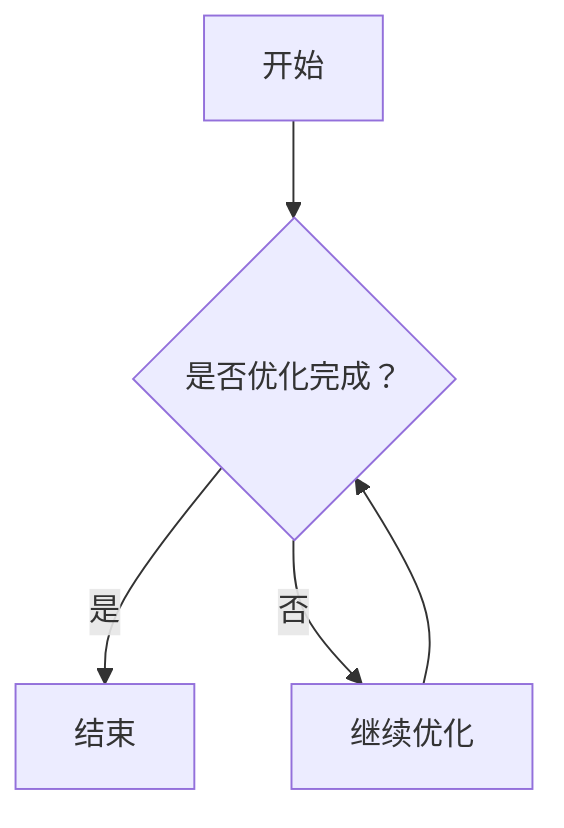

                 

### 文章标题：一人公司的工作流程优化：提高生产力的工具和方法

在当今快速变化和高度竞争的商业环境中，工作效率和生产力的提升成为企业生存和发展的关键。尤其是在一人公司（Solo Entrepreneurship）的情境下，个人的时间管理和工作流程优化显得尤为重要。本文将深入探讨一人公司的工作流程优化，通过介绍一系列实用的工具和方法，帮助读者提升生产力，从而在竞争激烈的市场中脱颖而出。

**关键词：**
- 一人公司
- 工作流程优化
- 时间管理
- 项目管理
- 生产力的提升

**摘要：**
本文旨在为一人公司的从业者提供一套系统化、可操作的工作流程优化方案。通过介绍时间管理工具、项目管理方法和提高生产力的策略，结合实际案例分析和代码示例，帮助读者理解并实施优化措施，从而在个人管理和业务运营上实现质的飞跃。

### 引言

#### 一人公司的概念与特点

一人公司，顾名思义，是指由单一个体独立运营的公司。这种模式在近年来变得越来越流行，尤其是在互联网和远程办公趋势的推动下。一人公司的特点主要包括：

1. **独立性**：公司的决策和运营完全由一个人负责，无需考虑其他股东的意愿。
2. **灵活性**：一人公司可以快速响应市场变化，调整业务方向。
3. **低成本**：由于人员较少，运营成本相对较低。
4. **高度压力**：依赖个人的能力和精力，工作负担较重。

#### 一人公司的优势与挑战

一人公司的优势显而易见，但也面临着一些独特的挑战：

1. **优势：**
   - **快速决策**：决策过程简化，能够迅速响应市场需求。
   - **低成本运营**：减少人工成本，资金压力较小。
   - **高度自主**：个人可以完全按照自己的意愿和节奏工作。

2. **挑战：**
   - **时间管理**：需要有效管理时间，避免因任务繁多而分散精力。
   - **角色多样**：一人需同时担任多个角色，如市场营销、客户服务、财务管理等。
   - **压力**：工作负担重，容易出现疲劳和焦虑。

#### 为什么要优化工作流程

对于一人公司而言，优化工作流程不仅能够提高工作效率，还能减轻工作压力，使业务运营更加顺畅。以下是优化工作流程的几个主要原因：

1. **提高生产力**：通过合理规划任务和时间，能够更高效地完成工作，减少不必要的浪费。
2. **减少错误**：优化后的工作流程有助于避免重复工作和错误，提高工作质量。
3. **减轻压力**：明确的工作流程和分工有助于减轻个人的工作负担，减少焦虑。
4. **增强灵活性**：优化的工作流程使公司能够更灵活地应对外部变化和挑战。

### 第二部分：工作流程优化的概念与重要性

#### 工作流程优化的定义

工作流程优化是指对现有工作流程进行分析、评估和改进，以提升工作效率和质量。它不仅涉及具体操作步骤的改进，还包括管理方法的优化、工具的合理应用等。

#### 优化工作流程的重要性

对于一人公司来说，优化工作流程具有重要意义：

1. **提高生产力**：优化后的流程能够减少无效工作，提高工作效率，使个体能够更好地利用时间和资源。
2. **提升工作质量**：清晰的工作流程有助于减少错误和遗漏，提高工作质量，增强客户满意度。
3. **减轻工作压力**：合理的工作流程可以减轻个人的工作负担，减少压力和焦虑，提高生活质量。
4. **增强业务灵活性**：优化的流程使公司能够更灵活地应对市场变化，抓住更多商机。

#### 工作流程优化的目标

优化工作流程的目标主要包括：

1. **效率**：通过减少不必要的步骤和等待时间，提高整体工作效率。
2. **质量**：确保工作流程中的每一个环节都达到预期质量标准。
3. **灵活性**：使工作流程能够适应不同的任务和环境变化。
4. **可持续性**：确保优化方案长期有效，不断适应业务发展需求。

### 第三部分：工具与方法

#### 常用工具与技术

在优化工作流程的过程中，选择合适的工具和方法至关重要。以下是一些常用的工具和技术：

1. **时间管理工具**
   - **To-Do List**：如Todoist、TickTick等，用于记录和追踪任务。
   - **时间块计划**：如Time Blocking，将时间划分为不同任务块，提高专注力。

2. **项目管理工具**
   - **Asana**：提供任务分配、进度追踪等功能，适合团队合作。
   - **Trello**：以看板形式组织任务，直观易用。

3. **生产力工具**
   - **Evernote**：强大的笔记和管理工具，用于记录灵感和工作内容。
   - **Notion**：集成多种功能，如笔记、数据库、看板等，适用于复杂工作场景。

#### 优化工作流程的步骤

优化工作流程需要系统化的步骤，以下是一个典型的流程：

1. **确定目标与愿景**：明确优化工作流程的目标和愿景，为后续步骤提供指导。
2. **分析当前工作流程**：评估现有流程的效率和质量，找出瓶颈和问题。
3. **设计优化方案**：根据分析结果，设计新的工作流程，包括步骤、工具和职责分配。
4. **实施与监控**：逐步实施新流程，并进行监控和调整，确保效果。
5. **持续改进**：通过定期评估和反馈，不断优化工作流程，以适应业务发展需求。

#### 提高生产力的方法

除了工具和方法，提高生产力还需要从思维方式、习惯和技能等方面入手：

1. **简化任务与目标**：将复杂任务分解为简单、可操作的步骤，明确目标，减少决策负担。
2. **精进思维与习惯**：培养高效的思考习惯和工作习惯，如早起、专注工作、定期休息等。
3. **避免拖延与焦虑**：制定明确的时间表和计划，避免拖延和焦虑。
4. **增强自我管理能力**：提高自律性，合理安排时间，有效管理任务和资源。

#### 案例分析

为了更好地理解工作流程优化的实际应用，本文将结合两个实际案例进行分析：

1. **案例一：个人咨询业务的流程优化**
   - **背景**：一位咨询师因任务繁多，时间管理混乱，导致工作效率低下。
   - **措施**：采用时间块计划和项目管理工具，明确任务优先级，简化工作流程。
   - **效果**：咨询师的工作效率显著提高，客户满意度上升，压力减轻。

2. **案例二：自媒体运营的流程优化**
   - **背景**：一位自媒体从业者因内容创作和运营压力较大，影响工作质量。
   - **措施**：使用内容管理工具和自动化工具，优化内容创作和发布流程。
   - **效果**：内容创作效率提升，运营效果改善，自媒体影响力增加。

#### 实践心得与反思

在实际操作中，优化工作流程可能会遇到一些问题和挑战，如：

1. **初始困难**：开始实施新流程时，可能会感到不适应，需要一定时间调整。
2. **工具选择**：选择合适的工具和方法是一个挑战，需要根据个人情况和业务需求进行选择。
3. **持续改进**：工作流程优化不是一劳永逸的，需要持续监控和改进。

为了克服这些问题，可以采取以下措施：

1. **逐步实施**：不要试图一次性完成所有优化措施，逐步推进，逐步适应。
2. **定期评估**：定期评估工作流程的效果，根据反馈进行调整。
3. **持续学习**：不断学习和尝试新的工具和方法，保持开放的心态。

#### 未来展望

随着技术的不断发展，工作流程优化工具和方法也在不断演进。未来，我们可以期待：

1. **人工智能**：人工智能在流程优化中的应用将越来越广泛，提供智能化的建议和自动化操作。
2. **区块链**：区块链技术的应用可能改变工作流程的透明度和可追溯性。
3. **物联网**：物联网技术将使工作流程更加智能化和自动化。

#### 拓展阅读

为了深入了解工作流程优化，以下是几本推荐阅读的书籍和学术论文：

1. **《精益创业》**：作者埃里克·莱斯，介绍如何通过快速迭代和验证来优化创业流程。
2. **《深度工作》**：作者卡尔·纽波特，探讨如何通过专注和深度工作来提高生产力。
3. **《流程管理》**：作者迈克尔·哈默和詹姆斯·钱皮，详细介绍流程管理的理论和实践。

#### 实践与拓展

为了将本文的理论应用到实际中，以下是几个实用的建议：

1. **制定个人工作计划**：每天早上制定详细的工作计划，明确任务和时间安排。
2. **使用项目管理工具**：选择一个适合自己的项目管理工具，如Trello或Asana，以便更好地管理任务和进度。
3. **定期反思和调整**：每周或每月进行反思，根据实际情况调整工作流程和计划。

通过以上实践和拓展，一人公司可以更好地优化工作流程，提高生产力，实现业务目标。

### 附录

#### 附录A：工具资源汇总

1. **时间管理工具**
   - Todoist
   - TickTick
   - Time Blocking
2. **项目管理工具**
   - Asana
   - Trello
   - Notion
3. **生产力工具**
   - Evernote
   - Notion

#### 附录B：参考文献

1. **《精益创业》**：埃里克·莱斯著
2. **《深度工作》**：卡尔·纽波特著
3. **《流程管理》**：迈克尔·哈默、詹姆斯·钱皮著

#### 附录C：Mermaid 流程图示例



#### 附录D：伪代码示例

```python
# 伪代码：工作流程优化算法
function optimize_workflow(current_state):
    if current_state not in optimal_states:
        new_state = apply_change(current_state)
        return optimize_workflow(new_state)
    else:
        return current_state

# 伪代码：时间管理策略
function time_management(task, deadline):
    if deadline - current_time < threshold:
        return "延迟任务"
    else:
        return "立即执行任务"
```

#### 附录E：数学模型与公式

$$
\text{生产率} = \frac{\text{完成的工作量}}{\text{工作时间}}
$$

生产率是衡量工作效率的重要指标，计算公式为完成的工作量除以工作时间。提高生产率意味着在相同时间内完成更多的工作。

#### 附录F：项目实战与代码解读

- **项目实战：使用Python编写一个简单的任务管理器**
  - **开发环境**：Python 3.8，PyCharm
  - **源代码实现**：
    ```python
    # 任务管理器源代码
    tasks = []

    def add_task(description):
        tasks.append(description)

    def display_tasks():
        for task in tasks:
            print(task)

    # 主程序
    if __name__ == "__main__":
        add_task("完成日报")
        add_task("准备会议")
        display_tasks()
    ```

通过以上实战和代码解读，可以了解如何使用Python实现一个简单的任务管理器，理解其基本结构和功能。

### 总结

一人公司在当今的商业环境中发挥着越来越重要的作用。通过优化工作流程，一人公司可以更高效地管理时间和资源，提高生产力，从而在竞争激烈的市场中取得成功。本文介绍了工作流程优化的概念、重要性、工具和方法，并结合实际案例进行了深入分析。希望读者能够将这些方法和策略应用到实际工作中，实现个人和公司的发展目标。随着技术的发展，未来工作流程优化将更加智能化和自动化，为一人公司带来更多机遇。让我们共同探索和实践，打造更高效、更灵活的一人公司！

