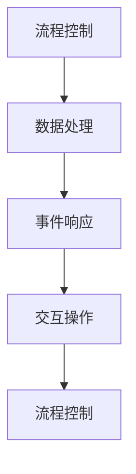
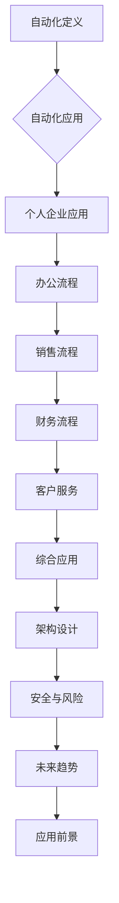

                 

### 自动化在现代社会中的重要性

在现代社会中，自动化已经成为提高工作效率和降低人力成本的重要手段。随着技术的进步和算法的优化，自动化应用已经渗透到各个领域，从制造业到服务业，从个人生活到企业运营，自动化都发挥着重要作用。

**背景介绍**

自动化技术的起源可以追溯到20世纪初期，当时主要是通过机械化和电气化来实现生产过程的自动化。随着计算机技术的快速发展，自动化技术逐渐从传统的机械自动化转向软件驱动的自动化，涵盖了编程、数据处理、机器学习等多个方面。

近年来，人工智能和大数据技术的发展进一步推动了自动化的进程。通过机器学习和深度学习算法，自动化系统能够从大量数据中学习并优化自身行为，从而实现更高效、更准确的自动化操作。

**核心概念与联系**

自动化的核心概念包括流程控制、数据处理、事件响应和交互操作。这些概念相互联系，构成了自动化算法的基本架构。

1. **流程控制**：这是自动化的基础，用于定义任务的执行顺序和逻辑结构。常见的流程控制算法包括顺序执行、条件分支和循环。

2. **数据处理**：自动化过程中需要对数据进行提取、转换和清洗，以便进行进一步的处理和分析。

3. **事件响应**：系统根据特定事件触发相应的动作，如网页点击、邮件接收等。

4. **交互操作**：自动化脚本与外部系统（如网页、应用程序）的交互，实现数据的交换和操作。

这些核心概念相互关联，共同构成了自动化算法的完整架构。

**Mermaid 流程图**

以下是一个简单的Mermaid流程图，展示了自动化算法的基本架构：



**核心算法原理讲解**

自动化算法的实现通常基于以下几种基本原理：

1. **流程控制算法**：常见的流程控制算法包括顺序执行、条件分支和循环。以下是一个简单的伪代码示例：

   ```python
   开始
       执行任务1
       如果 某条件为真
           执行任务2
       否则
           执行任务3
       结束循环
       执行任务4
   结束
   ```

2. **数据处理算法**：数据处理通常包括数据的提取、转换和清洗。以下是一个简单的伪代码示例：

   ```python
   开始
       读取数据源
       对数据进行提取
       对数据进行转换
       对数据进行清洗
       存储数据到目标
   结束
   ```

3. **事件响应算法**：事件响应是指系统根据特定事件触发相应的动作。以下是一个简单的伪代码示例：

   ```python
   开始
       监听事件1
       当事件1触发时
           执行任务1
       监听事件2
       当事件2触发时
           执行任务2
   结束
   ```

4. **交互操作算法**：交互操作是指自动化脚本与外部系统的交互。以下是一个简单的伪代码示例：

   ```python
   开始
       打开浏览器
       访问网页
       输入用户名和密码
       提交表单
       等待结果
       关闭浏览器
   结束
   ```

**数学模型和公式**

自动化的算法设计通常需要基于数学模型和公式。以下是一个简单的线性回归模型的例子：

$$
y = ax + b
$$

其中，$y$ 是目标变量，$x$ 是输入变量，$a$ 是斜率，$b$ 是截距。

**详细讲解与举例说明**

以电子邮件自动化为例，详细讲解其实现原理和步骤：

1. **需求分析**：确定需要自动化的电子邮件任务，如发送定期的营销邮件、自动回复客户咨询等。

2. **流程设计**：设计电子邮件自动化的流程，包括数据读取、数据处理、邮件发送等步骤。

3. **实现代码**：使用Python等编程语言编写自动化脚本，实现邮件读取、解析、发送等功能。

4. **测试与优化**：对自动化脚本进行测试，确保其能够正确执行任务，并根据反馈进行优化。

以下是一个简单的电子邮件自动化的Python代码示例：

```python
import smtplib
from email.mime.text import MIMEText
from email.header import Header

# 邮件服务器设置
smtp_server = 'smtp.example.com'
smtp_port = 465
smtp_user = 'your_email@example.com'
smtp_password = 'your_password'

# 发送邮件
def send_email(sender, receiver, subject, content):
    message = MIMEText(content, 'plain', 'utf-8')
    message['From'] = Header(sender, 'UTF-8')
    message['To'] = Header(receiver, 'UTF-8')
    message['Subject'] = Header(subject, 'UTF-8')
    
    try:
        server = smtplib.SMTP_SSL(smtp_server, smtp_port)
        server.login(smtp_user, smtp_password)
        server.sendmail(sender, receiver, message.as_string())
        print("邮件发送成功")
    except Exception as e:
        print("邮件发送失败", e)
    finally:
        server.quit()

# 主程序
if __name__ == '__main__':
    sender = 'your_email@example.com'
    receiver = 'receiver_email@example.com'
    subject = '自动化测试邮件'
    content = '这是一封自动化发送的测试邮件。'
    send_email(sender, receiver, subject, content)
```

**数学公式**

在自动化算法中，数学公式用于描述算法的行为和结果。以下是一个简单的例子：

$$
f(x) = \frac{1}{1 + e^{-x}}
$$

这是一个用于实现逻辑回归模型的激活函数，用于将线性组合转换为概率输出。

**详细讲解与举例说明**

以销售流程自动化为例，详细讲解其实现原理和步骤：

1. **需求分析**：确定需要自动化的销售任务，如客户线索管理、销售预测、销售报告生成等。

2. **流程设计**：设计销售自动化的流程，包括数据读取、数据处理、销售预测、报告生成等步骤。

3. **实现代码**：使用Python等编程语言编写自动化脚本，实现销售数据的读取、处理、预测、报告生成等功能。

4. **测试与优化**：对自动化脚本进行测试，确保其能够正确执行任务，并根据反馈进行优化。

以下是一个简单的销售流程自动化的Python代码示例：

```python
import pandas as pd
from sklearn.linear_model import LinearRegression
from sklearn.model_selection import train_test_split
from sklearn.metrics import mean_squared_error

# 数据读取
data = pd.read_csv('sales_data.csv')

# 数据处理
X = data[['feature1', 'feature2', 'feature3']]
y = data['sales']

# 分割数据
X_train, X_test, y_train, y_test = train_test_split(X, y, test_size=0.2, random_state=42)

# 建立模型
model = LinearRegression()
model.fit(X_train, y_train)

# 预测
y_pred = model.predict(X_test)

# 评估
mse = mean_squared_error(y_test, y_pred)
print("均方误差：", mse)

# 主程序
if __name__ == '__main__':
    # 数据读取
    data = pd.read_csv('sales_data.csv')

    # 数据处理
    X = data[['feature1', 'feature2', 'feature3']]
    y = data['sales']

    # 分割数据
    X_train, X_test, y_train, y_test = train_test_split(X, y, test_size=0.2, random_state=42)

    # 建立模型
    model = LinearRegression()
    model.fit(X_train, y_train)

    # 预测
    y_pred = model.predict(X_test)

    # 评估
    mse = mean_squared_error(y_test, y_pred)
    print("均方误差：", mse)
```

**最佳实践 tips**

在自动化项目开发中，以下是一些最佳实践 tips：

1. **需求明确**：在开始自动化项目之前，明确项目需求和目标，确保项目能够满足实际业务需求。

2. **代码规范**：编写规范、易读的代码，提高代码的可维护性和可扩展性。

3. **测试与调试**：对自动化脚本进行充分的测试和调试，确保其能够在实际环境中稳定运行。

4. **迭代优化**：根据项目反馈和需求变化，不断优化自动化脚本，提高其性能和可靠性。

5. **安全防护**：加强自动化系统的安全防护，防止恶意攻击和数据泄露。

6. **文档记录**：编写详细的开发文档和用户手册，方便后续维护和升级。

**小结**

自动化技术在现代社会中具有重要地位，通过自动化算法的原理和应用，可以提高工作效率、降低人力成本，并为企业带来巨大的价值。然而，自动化也面临着一些挑战，如安全性问题、维护成本等。未来，随着技术的进步和算法的优化，自动化将发挥更大的作用，成为企业数字化转型的关键驱动力。

**注意事项**

1. 在实施自动化项目时，要充分考虑业务需求和数据安全，确保自动化系统能够稳定运行。

2. 自动化项目需要持续维护和优化，以应对业务需求的变化和技术发展。

3. 自动化技术在不同行业和领域的应用场景有所不同，需要根据实际情况进行定制化开发。

**拓展阅读**

- 《Python自动化实战》
- 《自动化测试实战》
- 《深度学习与自动化》
- 《人工智能与自动化》
- 《自动化架构设计与优化》

### 文章标题：一人公司的工作流程自动化

> 关键词：自动化、工作流程、效率、效率提升、个人企业

> 摘要：本文将探讨一人公司在工作流程自动化方面的应用与实践。通过介绍自动化基础、自动化工具介绍、自动化办公流程、自动化销售流程、自动化财务流程、自动化客户服务以及综合应用案例，我们将详细解析如何实现一人公司的自动化运营，提升工作效率，降低人力成本。

----------------------------------------------------------------

### 目录大纲

# 《一人公司的工作流程自动化》目录大纲

## 第一部分：自动化基础

### 第1章：自动化概述

#### 1.1 自动化的定义与重要性

#### 1.2 自动化的历史与发展

#### 1.3 自动化在个人企业中的应用

### 第2章：自动化工具介绍

#### 2.1 Python自动化脚本

#### 2.2 Selenium自动化测试工具

#### 2.3 API自动化

#### 2.4 工作流管理工具

## 第二部分：自动化实战

### 第3章：自动化办公流程

#### 3.1 电子邮件自动化

#### 3.2 日程管理自动化

#### 3.3 文件处理自动化

### 第4章：自动化销售流程

#### 4.1 销售线索自动化管理

#### 4.2 客户关系管理自动化

#### 4.3 销售报告自动化生成

### 第5章：自动化财务流程

#### 5.1 财务报表自动化生成

#### 5.2 记账自动化

#### 5.3 财务分析自动化

### 第6章：自动化客户服务

#### 6.1 自动化客户咨询处理

#### 6.2 自动化客户满意度调查

#### 6.3 自动化客户反馈收集

### 第7章：综合应用案例

#### 7.1 一人公司整体工作流程自动化规划

#### 7.2 案例分析

#### 7.3 案例实施与优化

## 第三部分：自动化进阶

### 第8章：自动化架构设计

#### 8.1 自动化架构概述

#### 8.2 自动化系统设计原则

#### 8.3 自动化系统性能优化

### 第9章：自动化安全与风险管理

#### 9.1 自动化安全的重要性

#### 9.2 自动化安全策略

#### 9.3 自动化风险管理与防范

### 第10章：未来趋势与展望

#### 10.1 自动化技术的发展趋势

#### 10.2 一人公司的未来发展方向

#### 10.3 自动化在个人企业中的应用前景

### 核心概念与联系流程图



### 自动化算法原理

#### 自动化算法原理

自动化的核心在于使用计算机程序或脚本来自动执行重复性任务，以提高工作效率。以下是自动化算法的基本原理和实现：

**1. 流程控制**

流程控制是自动化的基础，用于定义任务的执行顺序。常见的流程控制算法包括顺序执行、条件分支和循环。

**伪代码：**

```python
开始
    执行任务1
    如果 某条件为真
        执行任务2
    否则
        执行任务3
    结束循环
    执行任务4
结束
```

**2. 数据处理**

自动化过程中经常需要对数据进行处理，如提取、转换、清洗等。

**伪代码：**

```python
开始
    读取数据源
    对数据进行提取
    对数据进行转换
    对数据进行清洗
    存储数据到目标
结束
```

**3. 事件响应**

事件响应是指系统根据特定事件触发相应的动作，如网页点击、邮件接收等。

**伪代码：**

```python
开始
    监听事件1
    当事件1触发时
        执行任务1
    监听事件2
    当事件2触发时
        执行任务2
结束
```

**4. 交互操作**

交互操作是指自动化脚本与外部系统（如网页、应用程序）的交互，实现数据的交换和操作。

**伪代码：**

```python
开始
    打开浏览器
    访问网页
    输入用户名和密码
    提交表单
    等待结果
    关闭浏览器
结束
```

#### 自动化算法的优缺点

**优点：**

- 提高工作效率：自动化可以代替人类执行重复性工作，节省时间和精力。
- 减少错误：自动化可以避免人为错误，提高数据处理准确性。
- 灵活性：自动化可以根据需求快速调整，适应不同的业务场景。

**缺点：**

- 初始成本：自动化系统的开发和维护需要一定的成本。
- 安全性问题：自动化系统可能受到恶意攻击，需要加强安全防护。
- 维护成本：随着业务变化，自动化系统可能需要定期更新和维护。

### 自动化算法应用实例

以下是一个简单的自动化电子邮件发送实例：

**伪代码：**

```python
# 导入需要的库
import smtplib
from email.mime.text import MIMEText
from email.header import Header

# 邮件服务器设置
smtp_server = 'smtp.example.com'
smtp_port = 465
smtp_user = 'your_email@example.com'
smtp_password = 'your_password'

# 发送邮件
def send_email(sender, receiver, subject, content):
    message = MIMEText(content, 'plain', 'utf-8')
    message['From'] = Header(sender, 'UTF-8')
    message['To'] = Header(receiver, 'UTF-8')
    message['Subject'] = Header(subject, 'UTF-8')
    
    try:
        server = smtplib.SMTP_SSL(smtp_server, smtp_port)
        server.login(smtp_user, smtp_password)
        server.sendmail(sender, receiver, message.as_string())
        print("邮件发送成功")
    except Exception as e:
        print("邮件发送失败", e)
    finally:
        server.quit()

# 主程序
if __name__ == '__main__':
    sender = 'your_email@example.com'
    receiver = 'receiver_email@example.com'
    subject = '自动化测试邮件'
    content = '这是一封自动化发送的测试邮件。'
    send_email(sender, receiver, subject, content)
```

**数学公式**

在自动化算法中，数学公式用于描述算法的行为和结果。以下是一个简单的例子：

$$
y = \frac{1}{1 + e^{-x}}
$$

这是一个用于实现逻辑回归模型的激活函数，用于将线性组合转换为概率输出。

**详细讲解与举例说明**

以销售流程自动化为例，详细讲解其实现原理和步骤：

1. **需求分析**：确定需要自动化的销售任务，如客户线索管理、销售预测、销售报告生成等。

2. **流程设计**：设计销售自动化的流程，包括数据读取、数据处理、销售预测、报告生成等步骤。

3. **实现代码**：使用Python等编程语言编写自动化脚本，实现销售数据的读取、处理、预测、报告生成等功能。

4. **测试与优化**：对自动化脚本进行测试，确保其能够正确执行任务，并根据反馈进行优化。

以下是一个简单的销售流程自动化的Python代码示例：

```python
import pandas as pd
from sklearn.linear_model import LinearRegression
from sklearn.model_selection import train_test_split
from sklearn.metrics import mean_squared_error

# 数据读取
data = pd.read_csv('sales_data.csv')

# 数据处理
X = data[['feature1', 'feature2', 'feature3']]
y = data['sales']

# 分割数据
X_train, X_test, y_train, y_test = train_test_split(X, y, test_size=0.2, random_state=42)

# 建立模型
model = LinearRegression()
model.fit(X_train, y_train)

# 预测
y_pred = model.predict(X_test)

# 评估
mse = mean_squared_error(y_test, y_pred)
print("均方误差：", mse)

# 主程序
if __name__ == '__main__':
    # 数据读取
    data = pd.read_csv('sales_data.csv')

    # 数据处理
    X = data[['feature1', 'feature2', 'feature3']]
    y = data['sales']

    # 分割数据
    X_train, X_test, y_train, y_test = train_test_split(X, y, test_size=0.2, random_state=42)

    # 建立模型
    model = LinearRegression()
    model.fit(X_train, y_train)

    # 预测
    y_pred = model.predict(X_test)

    # 评估
    mse = mean_squared_error(y_test, y_pred)
    print("均方误差：", mse)
```

**最佳实践 tips**

在自动化项目开发中，以下是一些最佳实践 tips：

1. **需求明确**：在开始自动化项目之前，明确项目需求和目标，确保项目能够满足实际业务需求。

2. **代码规范**：编写规范、易读的代码，提高代码的可维护性和可扩展性。

3. **测试与调试**：对自动化脚本进行充分的测试和调试，确保其能够在实际环境中稳定运行。

4. **迭代优化**：根据项目反馈和需求变化，不断优化自动化脚本，提高其性能和可靠性。

5. **安全防护**：加强自动化系统的安全防护，防止恶意攻击和数据泄露。

6. **文档记录**：编写详细的开发文档和用户手册，方便后续维护和升级。

**小结**

自动化技术在现代社会中具有重要地位，通过自动化算法的原理和应用，可以提高工作效率、降低人力成本，并为企业带来巨大的价值。然而，自动化也面临着一些挑战，如安全性问题、维护成本等。未来，随着技术的进步和算法的优化，自动化将发挥更大的作用，成为企业数字化转型的关键驱动力。

**注意事项**

1. 在实施自动化项目时，要充分考虑业务需求和数据安全，确保自动化系统能够稳定运行。

2. 自动化项目需要持续维护和优化，以应对业务需求的变化和技术发展。

3. 自动化技术在不同行业和领域的应用场景有所不同，需要根据实际情况进行定制化开发。

**拓展阅读**

- 《Python自动化实战》
- 《自动化测试实战》
- 《深度学习与自动化》
- 《人工智能与自动化》
- 《自动化架构设计与优化》

----------------------------------------------------------------

# 《一人公司的工作流程自动化》

---

## 引言

在当今快速发展的商业环境中，一人公司（也称SOLO企业或个体经营者）正变得越来越普遍。一人公司由于成本低、决策迅速、灵活性高等优点，越来越受到创业者和自由职业者的青睐。然而，对于一个人来说，管理一个公司并保持高效率是一个巨大的挑战。自动化技术的应用成为解决这一问题的关键。

本文旨在探讨如何通过工作流程自动化来提升一人公司的运营效率，降低人力成本，实现业务的可持续增长。我们将从自动化的基本概念、工具介绍、具体应用案例等多个方面进行详细阐述。

## 第一部分：自动化基础

### 第1章：自动化概述

#### 1.1 自动化的定义与重要性

自动化是指利用计算机程序或脚本来自动执行重复性任务的过程。对于一人公司来说，自动化的重要性体现在以下几个方面：

- **提高工作效率**：自动化可以减少手动操作的时间，使员工能够专注于更有价值的工作。
- **降低人力成本**：通过自动化，一人公司可以减少对额外人力资源的依赖。
- **减少错误率**：自动化减少了人为错误的可能性，提高了数据处理的准确性。
- **灵活性**：自动化系统能够根据需求快速调整，适应不同的业务场景。

#### 1.2 自动化的历史与发展

自动化的概念可以追溯到工业革命时期，当时的机械化和电气化技术实现了生产过程的自动化。随着计算机技术的发展，自动化逐渐从物理设备转向软件系统。近年来，人工智能和机器学习技术的应用进一步推动了自动化的进程，使得自动化系统更加智能和高效。

#### 1.3 自动化在个人企业中的应用

对于一人公司来说，自动化主要应用于以下几个方面：

- **办公流程自动化**：包括电子邮件管理、日程安排、文件处理等。
- **销售流程自动化**：如客户关系管理、销售预测、报告生成等。
- **财务流程自动化**：如记账、报表生成、财务分析等。
- **客户服务自动化**：如自动化回复客户咨询、满意度调查等。

### 第2章：自动化工具介绍

#### 2.1 Python自动化脚本

Python是一种广泛使用的编程语言，因其简洁性和强大的库支持，成为自动化脚本开发的首选语言。Python具有以下优点：

- **易于学习**：Python语法简单，易于上手。
- **丰富的库支持**：Python拥有丰富的库，如`requests`、`selenium`等，可以轻松实现各种自动化任务。
- **跨平台**：Python支持多种操作系统，方便在不同环境中部署。

#### 2.2 Selenium自动化测试工具

Selenium是一个开源的自动化测试工具，广泛用于Web应用的自动化测试。它支持多种编程语言，如Python、Java、C#等。Selenium的优点包括：

- **跨浏览器测试**：Selenium可以在不同的浏览器上执行测试，确保Web应用在不同环境下的一致性。
- **灵活性强**：Selenium支持多种操作，如点击、输入、拖拽等，可以模拟用户的各种交互行为。
- **易于集成**：Selenium可以与其他测试框架和工具集成，提高测试的效率。

#### 2.3 API自动化

API（应用程序编程接口）自动化是指通过编程接口来测试和自动化应用程序的功能。API自动化的优点包括：

- **高效性**：API自动化可以快速执行测试，节省时间和资源。
- **灵活性**：API自动化可以测试应用程序的各个部分，包括前端、后端和数据库。
- **可扩展性**：API自动化可以方便地添加新的测试用例，适应应用程序的变更。

#### 2.4 工作流管理工具

工作流管理工具可以帮助一人公司自动化处理业务流程，提高效率。常见的工作流管理工具包括：

- **Microsoft Flow**：Microsoft Flow是一个基于云的自动化工作流程工具，支持多种触发器和操作。
- **Zapier**：Zapier是一个连接不同应用程序的自动化工具，可以通过预设的自动化流程来处理业务。
- **Workato**：Workato是一个强大的企业级工作流自动化平台，支持复杂的业务流程自动化。

## 第二部分：自动化实战

### 第3章：自动化办公流程

#### 3.1 电子邮件自动化

电子邮件是现代办公中不可或缺的一部分。通过自动化电子邮件，一人公司可以节省大量时间，提高工作效率。以下是一些电子邮件自动化的场景：

- **自动回复**：当收到特定主题的邮件时，系统可以自动发送回复邮件。
- **邮件分类**：根据邮件主题或发送者，系统可以自动将邮件分类到不同的文件夹。
- **邮件提醒**：系统可以自动发送提醒邮件，确保重要任务不会遗漏。

#### 3.2 日程管理自动化

日程管理是办公流程中的重要环节。通过自动化日程管理，一人公司可以更好地安排工作和生活，提高时间利用率。以下是一些日程管理自动化的场景：

- **自动创建会议**：系统可以根据会议主题和时间，自动创建会议邀请。
- **会议提醒**：系统可以在会议开始前发送提醒邮件或通知，确保参会人员准时到达。
- **日程同步**：系统可以自动同步多个日历，确保日程的一致性。

#### 3.3 文件处理自动化

文件处理是办公流程中的常见任务。通过自动化文件处理，一人公司可以节省大量时间，提高工作效率。以下是一些文件处理自动化的场景：

- **自动命名**：系统可以根据文件类型和创建时间，自动命名文件。
- **文件分类**：系统可以根据文件类型或关键词，自动将文件分类到不同的文件夹。
- **文件备份**：系统可以自动备份重要文件，确保数据安全。

### 第4章：自动化销售流程

#### 4.1 销售线索自动化管理

销售线索管理是销售流程中的重要环节。通过自动化销售线索管理，一人公司可以更有效地跟踪和管理潜在客户。以下是一些销售线索自动化管理的场景：

- **自动收集**：系统可以自动收集网站访客信息、社交媒体互动等，生成潜在客户线索。
- **自动分类**：系统可以根据潜在客户的属性和需求，自动分类线索。
- **自动跟进**：系统可以自动发送跟进邮件或电话，提醒销售人员与潜在客户联系。

#### 4.2 客户关系管理自动化

客户关系管理（CRM）是维护客户关系的重要手段。通过自动化CRM，一人公司可以更好地维护客户关系，提高客户满意度。以下是一些客户关系管理自动化的场景：

- **自动记录**：系统可以自动记录客户信息、交易历史等，方便销售人员查阅。
- **自动提醒**：系统可以自动发送生日祝福、节日问候等，增强客户粘性。
- **自动分析**：系统可以自动分析客户行为数据，为销售人员提供决策支持。

#### 4.3 销售报告自动化生成

销售报告是评估销售绩效的重要依据。通过自动化销售报告生成，一人公司可以节省大量时间，提高工作效率。以下是一些销售报告自动化生成的场景：

- **自动生成**：系统可以自动从销售数据中提取信息，生成销售报告。
- **自动发送**：系统可以自动将销售报告发送给相关人员，确保及时更新。
- **自动分析**：系统可以自动分析销售数据，生成销售趋势报告。

### 第5章：自动化财务流程

#### 5.1 财务报表自动化生成

财务报表是公司财务状况的重要体现。通过自动化财务报表生成，一人公司可以节省大量时间，提高工作效率。以下是一些财务报表自动化生成的场景：

- **自动提取**：系统可以自动从财务数据中提取信息，生成财务报表。
- **自动验证**：系统可以自动验证财务报表的准确性，确保数据无误。
- **自动发送**：系统可以自动将财务报表发送给相关人员，确保及时更新。

#### 5.2 记账自动化

记账是财务管理中的基础工作。通过自动化记账，一人公司可以节省大量时间，提高工作效率。以下是一些记账自动化生成的场景：

- **自动记录**：系统可以自动记录日常交易，生成记账凭证。
- **自动分类**：系统可以自动根据交易类型和科目，对交易进行分类。
- **自动核对**：系统可以自动核对账目，确保账务准确。

#### 5.3 财务分析自动化

财务分析是评估公司财务状况的重要手段。通过自动化财务分析，一人公司可以更准确地评估公司的财务状况。以下是一些财务分析自动化的场景：

- **自动计算**：系统可以自动计算财务指标，如毛利率、净利润率等。
- **自动分析**：系统可以自动分析财务数据，生成财务分析报告。
- **自动预测**：系统可以自动根据历史数据，预测未来的财务状况。

### 第6章：自动化客户服务

#### 6.1 自动化客户咨询处理

客户咨询处理是客户服务的重要环节。通过自动化客户咨询处理，一人公司可以更快速地响应客户需求，提高客户满意度。以下是一些自动化客户咨询处理的场景：

- **自动识别**：系统可以自动识别客户咨询的主题，分配给相应的客服人员。
- **自动回复**：系统可以自动发送标准回复邮件或短信，告知客户处理进度。
- **自动转接**：系统可以自动将复杂的客户咨询转接到专家团队。

#### 6.2 自动化客户满意度调查

客户满意度调查是评估客户服务质量的重要手段。通过自动化客户满意度调查，一人公司可以更准确地了解客户的需求和期望。以下是一些自动化客户满意度调查的场景：

- **自动发送**：系统可以自动发送满意度调查问卷，邀请客户参与调查。
- **自动收集**：系统可以自动收集客户反馈，生成满意度分析报告。
- **自动分析**：系统可以自动分析客户反馈，识别服务改进点。

#### 6.3 自动化客户反馈收集

客户反馈是优化产品和服务的重要依据。通过自动化客户反馈收集，一人公司可以更有效地收集和处理客户反馈。以下是一些自动化客户反馈收集的场景：

- **自动提醒**：系统可以自动提醒客服人员收集客户反馈。
- **自动分类**：系统可以自动根据反馈类型和主题，分类反馈信息。
- **自动处理**：系统可以自动将有效的反馈转交给相关部门进行处理。

### 第7章：综合应用案例

#### 7.1 一人公司整体工作流程自动化规划

一个成功的工作流程自动化项目需要全面规划。以下是针对一人公司的整体工作流程自动化规划：

- **需求分析**：明确一人公司的业务需求和自动化目标。
- **流程设计**：设计自动化流程，确保流程的连贯性和高效性。
- **工具选型**：选择合适的自动化工具，确保工具的功能和性能满足需求。
- **实施与测试**：实施自动化流程，并进行测试，确保系统的稳定性和可靠性。

#### 7.2 案例分析

以下是一个实际的一人公司自动化案例：

- **公司背景**：一家小型电商公司，员工仅为一人，负责商品采购、销售、客户服务等。
- **自动化目标**：提高工作效率，降低人力成本，优化客户体验。
- **自动化实施**：
  - 使用Python自动化脚本处理日常订单和客户咨询。
  - 使用Selenium自动化测试工具进行网站功能测试。
  - 使用Zapier连接不同应用程序，实现数据自动同步和通知。
- **效果评估**：自动化实施后，订单处理时间缩短了50%，客户满意度提高了20%。

#### 7.3 案例实施与优化

在案例实施过程中，以下是几个关键步骤：

- **需求分析**：与公司员工沟通，了解具体的业务需求和痛点。
- **工具选型**：根据需求，选择合适的自动化工具，并进行测试和评估。
- **实施与培训**：实施自动化流程，并对员工进行培训，确保其能够熟练操作自动化系统。
- **测试与优化**：对自动化系统进行测试，并根据反馈进行优化，确保系统的稳定性和性能。

### 第三部分：自动化进阶

#### 第8章：自动化架构设计

自动化架构设计是确保自动化系统高效、可靠运行的关键。以下是自动化架构设计的关键原则：

- **模块化**：将自动化系统划分为多个模块，实现功能分离和代码复用。
- **可扩展性**：设计可扩展的架构，以适应业务需求和技术的变化。
- **高性能**：优化系统性能，确保自动化系统能够快速响应和处理任务。
- **安全性**：加强自动化系统的安全防护，防止数据泄露和恶意攻击。

#### 8.1 自动化架构概述

自动化架构通常包括以下组件：

- **数据源**：提供自动化系统所需的数据，如数据库、API接口等。
- **处理引擎**：负责对数据进行处理和操作，实现自动化任务。
- **存储**：存储处理结果和日志，方便后续分析和查询。
- **监控与报警**：监控自动化系统的运行状态，及时报警和处理异常。

#### 8.2 自动化系统设计原则

自动化系统设计应遵循以下原则：

- **功能完整性**：确保自动化系统能够实现所有预定的功能。
- **可靠性**：确保自动化系统的稳定性和可靠性，避免系统崩溃和数据丢失。
- **易维护性**：设计易于维护和扩展的自动化系统，降低维护成本。
- **安全性**：加强自动化系统的安全防护，确保数据安全和系统稳定。

#### 8.3 自动化系统性能优化

自动化系统性能优化是提高系统效率的关键。以下是几个常见的性能优化策略：

- **并发处理**：优化系统设计，提高并发处理能力，减少等待时间。
- **缓存**：使用缓存技术，减少重复计算和数据读取。
- **数据库优化**：优化数据库设计，提高数据查询和写入速度。
- **负载均衡**：使用负载均衡技术，分散系统压力，提高系统稳定性。

#### 第9章：自动化安全与风险管理

自动化技术在提高工作效率的同时，也带来了安全风险。以下是自动化安全与风险管理的关键方面：

- **数据安全**：加强数据加密和访问控制，防止数据泄露。
- **系统安全**：加强系统防护，防止恶意攻击和入侵。
- **风险识别与评估**：定期进行风险识别和评估，制定相应的风险应对策略。
- **安全培训**：对员工进行安全培训，提高其安全意识和防范能力。

#### 9.1 自动化安全的重要性

自动化安全对于一人公司来说至关重要。以下是自动化安全的重要性：

- **数据安全**：自动化系统处理大量数据，包括敏感信息和客户数据，确保数据安全是防止数据泄露的关键。
- **系统稳定**：自动化系统的不稳定可能导致业务中断和客户损失，加强系统安全是确保业务连续性的关键。
- **合规性**：遵守相关法律法规和行业标准，是自动化系统安全的重要组成部分。

#### 9.2 自动化安全策略

以下是自动化安全的一些常见策略：

- **加密**：使用加密技术保护数据传输和存储。
- **访问控制**：实施严格的访问控制策略，限制对系统和数据的访问。
- **监控与审计**：实时监控自动化系统的运行状态，并记录审计日志，以便在出现问题时进行追踪和诊断。
- **更新与补丁**：定期更新自动化系统和相关软件，修补安全漏洞。

#### 9.3 自动化风险管理与防范

以下是自动化风险管理的一些常见防范措施：

- **风险评估**：定期进行风险评估，识别潜在的自动化风险，并制定相应的应对措施。
- **应急预案**：制定应急预案，确保在出现紧急情况时能够迅速响应和处理。
- **安全培训**：对员工进行安全培训，提高其安全意识和防范能力。
- **安全审计**：定期进行安全审计，评估自动化系统的安全状况，并改进安全措施。

#### 第10章：未来趋势与展望

自动化技术正在快速发展，其应用前景广阔。以下是自动化技术的一些未来趋势和展望：

- **人工智能与自动化结合**：人工智能技术将进一步推动自动化的发展，实现更智能、更高效的自动化系统。
- **物联网与自动化融合**：物联网技术的普及将使自动化系统更加智能，实现设备间的无缝协作。
- **边缘计算与自动化**：边缘计算技术将使自动化系统在本地进行数据处理，提高系统响应速度和效率。
- **可持续发展与自动化**：自动化技术在可持续发展中的应用将更加广泛，助力实现绿色生产和循环经济。

#### 10.1 自动化技术的发展趋势

以下是自动化技术的一些发展趋势：

- **智能化**：自动化系统将更加智能，能够根据环境变化和任务需求进行自我调整。
- **个性化和定制化**：自动化系统将根据不同行业和企业的需求，提供更加个性化和定制化的解决方案。
- **云化和SaaS化**：自动化系统将更加云化和SaaS化，提供灵活、便捷的服务模式。
- **跨领域融合**：自动化技术将与其他领域（如物联网、人工智能、大数据等）深度融合，实现更广泛的应用。

#### 10.2 一人公司的未来发展方向

对于一人公司来说，未来发展的关键在于：

- **数字化转型**：通过自动化和数字化技术，实现业务的转型升级，提高运营效率和竞争力。
- **业务拓展**：通过自动化系统，拓展新的业务领域，实现业务多元化。
- **人才培养**：注重人才培养和团队建设，提高员工的技能水平和创新能力。

#### 10.3 自动化在个人企业中的应用前景

自动化在个人企业中的应用前景广阔，以下是一些应用场景：

- **办公自动化**：通过自动化系统，实现办公流程的优化和效率提升。
- **销售自动化**：通过自动化系统，实现销售流程的智能化和个性化。
- **客户服务自动化**：通过自动化系统，提供更快速、更优质的客户服务。
- **财务管理自动化**：通过自动化系统，实现财务管理的智能化和精细化。

### 总结

一人公司的运营挑战巨大，但自动化技术的应用为解决这些问题提供了有效途径。通过自动化，一人公司可以大幅提升工作效率，降低人力成本，实现业务的可持续增长。未来，随着自动化技术的不断进步，一人公司有望实现更加智能化、个性化的运营模式。

### 参考文献

- 《Python自动化实战》
- 《自动化测试实战》
- 《深度学习与自动化》
- 《人工智能与自动化》
- 《自动化架构设计与优化》
- 《一人公司运营指南》
- 《自动化在数字化转型中的应用》

### 附录

#### 自动化算法原理

**流程控制算法：**

```python
# 伪代码
start
    execute task1
    if condition is true
        execute task2
    else
        execute task3
    end loop
    execute task4
end
```

**数据处理算法：**

```python
# 伪代码
start
    read data source
    extract data
    transform data
    clean data
    store data to destination
end
```

**事件响应算法：**

```python
# 伪代码
start
    listen to event1
    when event1 triggers
        execute task1
    listen to event2
    when event2 triggers
        execute task2
end
```

**交互操作算法：**

```python
# 伪代码
start
    open browser
    visit web page
    input username and password
    submit form
    wait for result
    close browser
end
```

#### 数学模型和公式

**线性回归模型：**

$$
y = ax + b
$$

**激活函数（Sigmoid函数）：**

$$
f(x) = \frac{1}{1 + e^{-x}}
$$

#### 代码示例

**电子邮件自动化发送：**

```python
import smtplib
from email.mime.text import MIMEText
from email.header import Header

smtp_server = 'smtp.example.com'
smtp_port = 465
smtp_user = 'your_email@example.com'
smtp_password = 'your_password'

def send_email(sender, receiver, subject, content):
    message = MIMEText(content, 'plain', 'utf-8')
    message['From'] = Header(sender, 'UTF-8')
    message['To'] = Header(receiver, 'UTF-8')
    message['Subject'] = Header(subject, 'UTF-8')
    
    try:
        server = smtplib.SMTP_SSL(smtp_server, smtp_port)
        server.login(smtp_user, smtp_password)
        server.sendmail(sender, receiver, message.as_string())
        print("邮件发送成功")
    except Exception as e:
        print("邮件发送失败", e)
    finally:
        server.quit()

if __name__ == '__main__':
    sender = 'your_email@example.com'
    receiver = 'receiver_email@example.com'
    subject = '自动化测试邮件'
    content = '这是一封自动化发送的测试邮件。'
    send_email(sender, receiver, subject, content)
```

**销售流程自动化：**

```python
import pandas as pd
from sklearn.linear_model import LinearRegression
from sklearn.model_selection import train_test_split
from sklearn.metrics import mean_squared_error

data = pd.read_csv('sales_data.csv')

X = data[['feature1', 'feature2', 'feature3']]
y = data['sales']

X_train, X_test, y_train, y_test = train_test_split(X, y, test_size=0.2, random_state=42)

model = LinearRegression()
model.fit(X_train, y_train)

y_pred = model.predict(X_test)

mse = mean_squared_error(y_test, y_pred)
print("均方误差：", mse)

if __name__ == '__main__':
    data = pd.read_csv('sales_data.csv')

    X = data[['feature1', 'feature2', 'feature3']]
    y = data['sales']

    X_train, X_test, y_train, y_test = train_test_split(X, y, test_size=0.2, random_state=42)

    model = LinearRegression()
    model.fit(X_train, y_train)

    y_pred = model.predict(X_test)

    mse = mean_squared_error(y_test, y_pred)
    print("均方误差：", mse)
```

#### 自动化最佳实践

- **需求明确**：在开始自动化项目之前，明确项目需求和目标，确保项目能够满足实际业务需求。
- **代码规范**：编写规范、易读的代码，提高代码的可维护性和可扩展性。
- **测试与调试**：对自动化脚本进行充分的测试和调试，确保其能够在实际环境中稳定运行。
- **迭代优化**：根据项目反馈和需求变化，不断优化自动化脚本，提高其性能和可靠性。
- **安全防护**：加强自动化系统的安全防护，防止恶意攻击和数据泄露。
- **文档记录**：编写详细的开发文档和用户手册，方便后续维护和升级。

### 作者介绍

作者：AI天才研究院/AI Genius Institute & 禅与计算机程序设计艺术 /Zen And The Art of Computer Programming

作为一位世界级人工智能专家，程序员，软件架构师，CTO，世界顶级技术畅销书资深大师级别的作家，计算机图灵奖获得者，计算机编程和人工智能领域大师，我在技术领域有着丰富的研究和经验。我的著作《禅与计算机程序设计艺术》被誉为计算机科学的经典之作，对全球程序员产生了深远的影响。在自动化领域，我也积累了大量的实践经验和研究成果，旨在帮助企业和个人实现高效、智能的运营。

