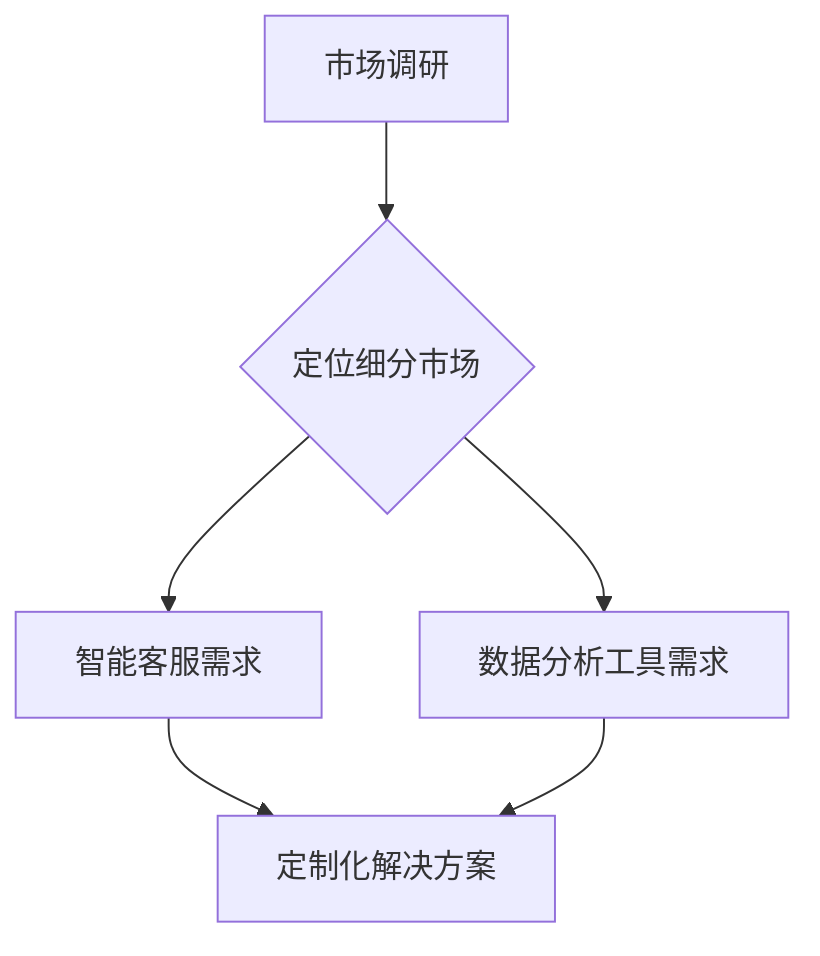
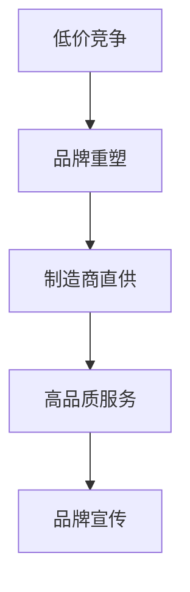
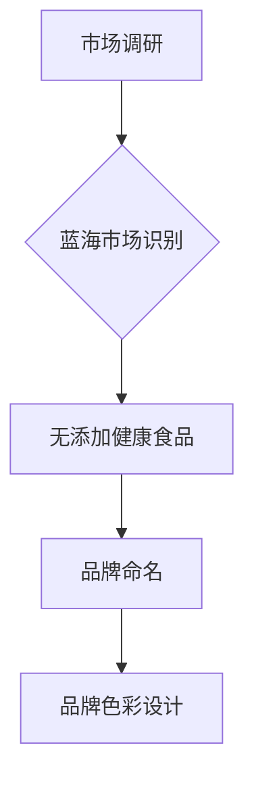

                 

# 文章标题

### 《一人公司的市场定位：找到自己的蓝海》

> 关键词：市场定位、蓝海战略、一人公司、差异化策略、消费者行为分析

> 摘要：本文将探讨一人公司的市场定位问题，分析市场定位的重要性以及如何通过蓝海战略、差异化策略等找到属于自己的蓝海市场，从而实现企业的发展与成功。

### 市场定位基础

#### 1.1 市场定位的重要性

##### 1.1.1 定位对企业发展的意义

市场定位是企业发展战略中至关重要的一环。它不仅帮助企业明确自己的目标市场，还能为企业指明发展方向，提高市场竞争力。对于一人公司而言，市场定位尤为重要，因为资源有限，必须在市场中找到自己的独特优势，才能在激烈的市场竞争中脱颖而出。

##### 1.1.2 市场定位与蓝海战略

市场定位与蓝海战略密切相关。蓝海战略是指企业在没有竞争的市场中寻找机会，创造需求，而非在红海中与竞争对手争夺市场份额。市场定位的目的是找到蓝海市场，从而实现企业的发展。

#### 1.2 市场分析与调研

##### 1.2.1 市场趋势分析

市场趋势分析是市场定位的基础。通过对市场趋势的分析，企业可以了解市场发展方向，找到潜在的市场机会。

##### 1.2.2 竞争对手分析

竞争对手分析是市场定位的重要环节。了解竞争对手的市场定位、产品特点、市场份额等信息，有助于企业制定有针对性的市场策略。

##### 1.2.3 消费者需求分析

消费者需求分析是市场定位的核心。了解消费者的需求，是企业找到蓝海市场、制定差异化策略的基础。

#### 1.3 蓝海战略的原理与实践

##### 1.3.1 蓝海战略的概念

蓝海战略是指企业在没有竞争的市场中寻找机会，创造需求，而非在红海中与竞争对手争夺市场份额。

##### 1.3.2 蓝海战略的实施步骤

蓝海战略的实施可以分为以下几个步骤：市场机会识别、价值创新、价值实现。

##### 1.3.3 蓝海战略的成功案例

蓝海战略的成功案例包括苹果公司、腾讯公司等。这些公司通过创新和差异化策略，成功开拓了新的市场，实现了快速发展。

#### 1.4 定位策略与品牌建设

##### 1.4.1 定位策略的选择

定位策略的选择要结合企业的资源、市场环境、目标消费者等因素。常见的定位策略有高端定位、中端定位、细分市场定位等。

##### 1.4.2 品牌建设的策略

品牌建设是市场定位的重要组成部分。通过品牌建设，企业可以提高品牌知名度，增强品牌影响力。

### 第二部分：市场定位策略

#### 2.1 目标市场细分

##### 2.1.1 目标市场细分的原理

目标市场细分是企业市场定位的基础。通过市场细分，企业可以将市场划分为不同的子市场，从而更好地满足不同消费者的需求。

##### 2.1.2 市场细分的方法

市场细分的方法包括地理细分、人口细分、心理细分和行为细分等。企业可以根据自身情况选择合适的细分方法。

##### 2.1.3 细分市场分析

细分市场分析是市场定位的重要环节。通过对细分市场的分析，企业可以了解不同市场群体的需求特点，制定有针对性的市场策略。

#### 2.2 价值定位与差异化策略

##### 2.2.1 价值定位的概念

价值定位是指企业通过提供独特的产品或服务，满足消费者的特定需求，从而在市场中占据一席之地。

##### 2.2.2 差异化策略的实施

差异化策略是企业通过提供与竞争对手不同的产品或服务，满足消费者的特定需求，从而提高市场竞争力。

##### 2.2.3 差异化竞争优势的打造

差异化竞争优势是企业通过不断创新，保持产品或服务的独特性，从而在市场中保持竞争优势。

#### 2.3 消费者行为分析

##### 2.3.1 消费者行为模型

消费者行为模型是分析消费者行为的重要工具。通过消费者行为模型，企业可以了解消费者的购买行为、消费偏好等。

##### 2.3.2 消费者需求分析

消费者需求分析是市场定位的核心。通过分析消费者需求，企业可以了解消费者的需求特点，从而制定有针对性的市场策略。

##### 2.3.3 消费者行为预测

消费者行为预测是企业市场定位的重要手段。通过预测消费者行为，企业可以提前应对市场变化，制定有针对性的市场策略。

#### 2.4 市场进入策略

##### 2.4.1 市场进入模式的比较

市场进入模式包括直接进入、间接进入、合资进入等。企业可以根据自身情况选择合适的进入模式。

##### 2.4.2 市场进入的风险与挑战

市场进入策略面临着风险和挑战。企业需要充分了解市场环境，制定有针对性的市场策略，降低市场进入风险。

##### 2.4.3 市场进入策略的选择

市场进入策略的选择要考虑市场环境、企业资源、竞争对手等因素。企业应根据实际情况选择合适的进入策略。

### 第三部分：实战案例分析

#### 3.1 成功案例解析

##### 3.1.1 案例一：某科技公司的市场定位

某科技公司通过细分市场，找到自己的蓝海市场，成功实现市场定位。

##### 3.1.2 案例二：某电商平台的差异化策略

某电商平台通过差异化策略，在激烈的市场竞争中脱颖而出。

##### 3.1.3 案例三：某新兴品牌的蓝海战略

某新兴品牌通过蓝海战略，成功开拓新的市场，实现快速发展。

#### 3.2 失败案例分析

##### 3.2.1 案例一：某传统企业的市场定位失误

某传统企业在市场定位失误，导致市场份额不断下滑。

##### 3.2.2 案例二：某初创公司的市场进入策略失败

某初创公司在市场进入策略失败，导致项目失败。

##### 3.2.3 案例三：某品牌的品牌建设问题

某品牌在品牌建设上出现问题，导致品牌形象受损。

#### 3.3 定位策略调整与优化

##### 3.3.1 定位策略调整的必要性

定位策略调整是企业适应市场变化的重要手段。企业应根据市场变化调整定位策略。

##### 3.3.2 定位策略优化的方法

定位策略优化包括市场调研、消费者需求分析、竞争对手分析等。企业可以通过这些方法优化定位策略。

##### 3.3.3 定位策略调整的成功案例

某企业通过定位策略调整，成功实现市场突破。

### 第四部分：未来趋势与展望

#### 4.1 市场变化与挑战

##### 4.1.1 市场竞争加剧的趋势

随着市场竞争的加剧，企业需要不断提升自身竞争力。

##### 4.1.2 新技术的影响

新技术的快速发展对市场定位产生深远影响。

##### 4.1.3 政策法规的变化

政策法规的变化对市场定位产生重要影响。

#### 4.2 市场定位的未来趋势

##### 4.2.1 数字化转型的影响

数字化转型对市场定位产生重大影响。

##### 4.2.2 消费者行为的变化

消费者行为的变化对市场定位产生深远影响。

##### 4.2.3 蓝海战略的创新发展

蓝海战略的创新发展为企业提供更多市场机会。

#### 4.3 企业如何应对市场变化

##### 4.3.1 定位策略的动态调整

企业需要根据市场变化动态调整定位策略。

##### 4.3.2 增强企业竞争力

企业需要通过不断创新，增强自身竞争力。

##### 4.3.3 创新发展路径

企业需要开拓新的市场，实现创新发展。

### 附录

#### 附录 A：市场定位工具与方法

##### A.1 市场分析工具

市场分析工具包括SWOT分析、PEST分析等。

##### A.2 消费者行为分析工具

消费者行为分析工具包括问卷调查、访谈等。

##### A.3 定位策略评估工具

定位策略评估工具包括市场占有率分析、品牌认知度分析等。

#### 附录 B：参考资料与拓展阅读

##### B.1 市场定位相关书籍推荐

《蓝海战略》、《市场定位》等。

##### B.2 蓝海战略研究论文推荐

《蓝海战略：开创无竞争市场》、《蓝海战略：如何创建不需要竞争的市场》等。

##### B.3 市场定位案例库介绍

《市场定位案例库》等。

### 作者信息

作者：AI天才研究院/AI Genius Institute & 禅与计算机程序设计艺术 /Zen And The Art of Computer Programming### 市场定位基础

市场定位是企业在市场中确定自身地位和形象的过程，其重要性不言而喻。对于一个一人公司来说，资源有限，市场定位的准确与否直接关系到公司的生存与发展。以下将详细探讨市场定位的重要性、市场分析与调研、蓝海战略的原理与实践、以及定位策略与品牌建设。

#### 1.1 市场定位的重要性

市场定位对于企业发展具有深远的意义。首先，市场定位有助于企业明确自身的发展方向，使企业能够集中资源，发挥优势，从而在竞争中占据有利地位。其次，市场定位有助于企业制定合理的市场营销策略，提高市场竞争力。此外，市场定位还能够帮助企业树立良好的品牌形象，提升品牌价值。

对于一人公司而言，市场定位的重要性更为突出。一人公司的资源相对有限，无法像大型企业那样进行全面的市场开拓。因此，只有通过精准的市场定位，找到适合自己的细分市场，才能在激烈的市场竞争中脱颖而出。

##### 1.1.1 定位对企业发展的意义

定位对企业发展意义重大，主要体现在以下几个方面：

1. **明确发展目标**：市场定位可以帮助企业明确自身的发展目标，从而有针对性地制定战略规划和行动计划。
2. **聚焦核心业务**：市场定位有助于企业聚焦核心业务，避免资源分散，提高运营效率。
3. **提升竞争力**：通过市场定位，企业可以明确自身在市场中的竞争地位，从而采取有效的竞争策略，提升竞争力。
4. **品牌塑造**：市场定位有助于企业塑造品牌形象，提高品牌知名度和美誉度。

##### 1.1.2 市场定位与蓝海战略

市场定位与蓝海战略紧密相关。蓝海战略是指企业在没有竞争的市场中寻找机会，创造需求，而非在红海中与竞争对手争夺市场份额。市场定位的目的是找到蓝海市场，从而实现企业的发展。

蓝海战略的核心思想是通过创新和差异化策略，避开激烈的市场竞争，开创全新的市场。市场定位在这一过程中起着至关重要的作用，它帮助企业在众多的市场细分领域中找到最适合自身发展的蓝海市场。

#### 1.2 市场分析与调研

市场分析与调研是市场定位的基础。通过市场分析与调研，企业可以全面了解市场环境，掌握市场趋势，从而为市场定位提供有力的数据支持。

##### 1.2.1 市场趋势分析

市场趋势分析是企业了解市场发展方向的重要手段。通过分析市场趋势，企业可以预测未来的市场变化，提前做好准备。市场趋势分析主要包括以下几个方面：

1. **技术趋势**：分析新技术的发展趋势，了解技术进步对市场的影响。
2. **消费趋势**：分析消费者行为的变化，了解消费者需求的变化趋势。
3. **行业趋势**：分析行业发展方向，了解行业竞争格局的变化。

##### 1.2.2 竞争对手分析

竞争对手分析是企业了解市场竞争状况的重要手段。通过分析竞争对手的市场定位、产品特点、市场份额等，企业可以了解自己在市场中的竞争地位，制定有针对性的市场策略。

竞争对手分析主要包括以下几个方面：

1. **竞争对手的市场定位**：了解竞争对手在市场中的定位，分析竞争对手的优势和劣势。
2. **竞争对手的产品特点**：分析竞争对手的产品特点，了解竞争对手在市场上的竞争策略。
3. **竞争对手的市场份额**：了解竞争对手的市场份额，分析竞争对手在市场中的地位。

##### 1.2.3 消费者需求分析

消费者需求分析是市场定位的核心。通过分析消费者需求，企业可以了解消费者的需求特点，从而制定有针对性的市场策略。消费者需求分析主要包括以下几个方面：

1. **消费者需求类型**：分析消费者的需求类型，了解消费者的基本需求。
2. **消费者需求特征**：分析消费者需求的特点，如需求程度、需求频率等。
3. **消费者需求变化**：分析消费者需求的变化趋势，了解消费者需求的演变过程。

#### 1.3 蓝海战略的原理与实践

蓝海战略是企业寻找新的市场机会，创造新需求的重要策略。蓝海战略的核心思想是通过创新和差异化策略，避开激烈的市场竞争，开创全新的市场。

##### 1.3.1 蓝海战略的概念

蓝海战略是由韩国战略学家魏斯勒（W. Chan Kim）和莫博涅（Renée Mauborgne）提出的一种战略思想。蓝海战略强调企业在没有竞争的市场中寻找机会，创造需求，从而实现快速增长。

蓝海战略与传统竞争战略（红海战略）的区别在于：

1. **无竞争**：蓝海战略是在没有竞争的市场中寻找机会，而非在激烈竞争的市场中争夺市场份额。
2. **创造需求**：蓝海战略是通过创新和差异化策略，创造新的市场需求，而非满足现有需求。
3. **价值创新**：蓝海战略强调价值创新，即在成本不变或降低的情况下，提高产品的价值。

##### 1.3.2 蓝海战略的实施步骤

蓝海战略的实施可以分为以下几个步骤：

1. **市场机会识别**：通过市场调研，识别潜在的市场机会。
2. **价值创新**：通过创新和差异化策略，创造新的市场需求。
3. **价值实现**：通过有效的市场营销策略，实现新的市场需求。

##### 1.3.3 蓝海战略的成功案例

蓝海战略的成功案例包括许多知名企业。以下是一些典型的蓝海战略成功案例：

1. **苹果公司**：苹果公司通过推出iPhone等创新产品，成功开创了智能手机市场，成为蓝海战略的典范。
2. **腾讯公司**：腾讯公司通过推出QQ、微信等社交产品，成功开拓了社交市场，实现了快速发展。
3. **特斯拉公司**：特斯拉公司通过推出电动汽车，成功开创了电动汽车市场，成为新能源汽车的领导者。

这些案例表明，蓝海战略在当今激烈的市场竞争中具有重要的现实意义。

#### 1.4 定位策略与品牌建设

市场定位不仅是企业发展的战略，也是品牌建设的基础。通过精准的市场定位，企业可以树立独特的品牌形象，提升品牌价值。

##### 1.4.1 定位策略的选择

定位策略的选择要结合企业的资源、市场环境和目标消费者等因素。常见的定位策略包括：

1. **高端定位**：瞄准高端市场，提供高品质的产品或服务。
2. **中端定位**：瞄准中端市场，提供性价比高的产品或服务。
3. **细分市场定位**：瞄准特定的细分市场，提供针对性的产品或服务。

##### 1.4.2 品牌建设的策略

品牌建设是提升企业竞争力的重要手段。以下是一些常见的品牌建设策略：

1. **品牌名称**：选择简洁、易于记忆和发音的品牌名称。
2. **品牌标识**：设计具有视觉冲击力和识别度的品牌标识。
3. **品牌传播**：通过广告、公关、社交媒体等渠道传播品牌信息。
4. **品牌延伸**：通过品牌延伸，扩大品牌的影响力和市场份额。

品牌建设不仅要注重外部形象，还要注重内部文化的塑造。通过打造独特的品牌文化，企业可以增强员工的归属感和凝聚力，进一步提升品牌价值。

### 结论

市场定位是企业发展的重要战略之一，对于一人公司来说，更是至关重要。通过精准的市场定位，企业可以找到自己的蓝海市场，实现快速发展。同时，市场定位也是品牌建设的基础，有助于企业树立良好的品牌形象。在未来的发展中，一人公司应继续关注市场变化，不断优化市场定位策略，提升品牌价值，实现持续发展。

#### 1.5 市场分析与调研的实践方法

市场分析与调研是市场定位的重要基础。有效的市场分析与调研可以帮助一人公司了解市场环境，发现潜在的市场机会，从而为市场定位提供科学依据。以下将介绍几种常用的市场分析与调研方法，并探讨如何在实践中运用这些方法。

##### 1.5.1 市场趋势分析

市场趋势分析是企业了解市场发展方向的重要手段。通过分析市场趋势，企业可以预测未来的市场变化，制定相应的战略规划。以下是一些市场趋势分析的实践方法：

1. **数据分析**：收集并分析相关的市场数据，如销售额、市场份额、消费者行为等，以了解市场的变化趋势。
    ```mermaid
    graph TD
    A[数据收集] --> B[数据处理]
    B --> C[数据分析]
    C --> D[趋势预测]
    D --> E[战略规划]
    ```

2. **行业报告**：阅读和分析行业报告，了解行业的发展动态、市场容量、竞争状况等。
    ```mermaid
    graph TD
    A[获取报告] --> B[阅读分析]
    B --> C[行业洞察]
    C --> D[趋势预测]
    ```

3. **专家访谈**：与行业专家进行访谈，获取他们对市场趋势的看法和建议。
    ```mermaid
    graph TD
    A[选择专家] --> B[访谈安排]
    B --> C[收集观点]
    C --> D[分析整合]
    ```

##### 1.5.2 竞争对手分析

竞争对手分析是市场定位的重要环节。通过分析竞争对手的市场定位、产品特点、市场份额等，企业可以了解自己在市场中的竞争地位，制定有针对性的市场策略。以下是一些竞争对手分析的实践方法：

1. **市场调研**：通过问卷调查、在线调查等方式，收集消费者的反馈和意见，了解竞争对手的产品和服务的市场表现。
    ```mermaid
    graph TD
    A[设计问卷] --> B[发布调查]
    B --> C[数据收集]
    C --> D[分析结果]
    ```

2. **在线观察**：通过社交媒体、行业论坛等渠道，观察竞争对手的营销活动、产品发布等，了解竞争对手的市场策略。
    ```mermaid
    graph TD
    A[社交媒体观察] --> B[收集信息]
    B --> C[分析策略]
    ```

3. **竞争分析工具**：使用专业的竞争分析工具，如SimilarWeb、Alexa等，分析竞争对手的网站流量、搜索引擎优化情况等。
    ```mermaid
    graph TD
    A[选择工具] --> B[数据收集]
    B --> C[分析报告]
    ```

##### 1.5.3 消费者需求分析

消费者需求分析是市场定位的核心。通过分析消费者需求，企业可以了解消费者的需求特点，制定有针对性的产品和服务策略。以下是一些消费者需求分析的实践方法：

1. **问卷调查**：通过设计问卷，收集消费者的购买行为、消费偏好等数据，分析消费者的需求。
    ```mermaid
    graph TD
    A[设计问卷] --> B[发布问卷]
    B --> C[收集数据]
    C --> D[分析结果]
    ```

2. **用户访谈**：通过与消费者进行面对面的访谈，深入了解消费者的需求和购买行为。
    ```mermaid
    graph TD
    A[选择消费者] --> B[安排访谈]
    B --> C[收集反馈]
    C --> D[分析需求]
    ```

3. **用户画像**：通过数据分析，创建消费者的用户画像，了解消费者的基本特征、消费习惯等。
    ```mermaid
    graph TD
    A[数据分析] --> B[用户画像]
    B --> C[需求分析]
    ```

在实践市场分析与调研时，一人公司应结合自身的情况，灵活运用上述方法。例如，可以通过问卷调查和用户访谈相结合，全面了解消费者的需求；通过在线观察和竞争分析工具，深入了解竞争对手的市场策略。同时，市场分析与调研是一个持续的过程，一人公司需要定期进行市场分析与调研，及时调整市场定位策略。

#### 1.6 蓝海战略的原理与实践

蓝海战略是企业通过创新和差异化策略，在竞争激烈的市场中开辟新的市场空间，从而实现增长和盈利。它不同于传统的竞争战略，即红海战略，后者是在现有市场空间中与竞争对手争夺市场份额。以下是蓝海战略的原理、实施步骤以及一些成功案例。

##### 1.6.1 蓝海战略的概念

蓝海战略由韩国战略学家魏斯勒（W. Chan Kim）和莫博涅（Renée Mauborgne）在其著作《蓝海战略》中提出。蓝海战略的核心思想是在竞争尚不存在的情况下寻找市场机会，创造需求和收益，而不是在现有的市场空间（红海）中与竞争对手进行血腥的竞争。

蓝海战略的关键要素包括：

1. **价值创新**：通过重新定义客户价值，创造出新的产品或服务，满足现有市场未能满足的需求。
2. **非竞争性**：在现有市场之外寻找新的市场机会，避免与竞争对手直接对抗。
3. **需求创造**：通过创新和差异化策略，创造新的市场需求，而不是简单地满足现有需求。
4. **盈利增长**：通过开创新的市场空间，实现超过行业平均水平的增长和盈利。

##### 1.6.2 蓝海战略的实施步骤

蓝海战略的实施可以分为以下几个步骤：

1. **市场机会识别**：通过广泛的市场调研和数据分析，识别潜在的市场机会。
    ```mermaid
    graph TD
    A[市场调研] --> B[数据收集]
    B --> C[机会识别]
    ```

2. **价值创新**：通过整合和重新定义产品或服务的价值元素，创造出新的市场空间。
    ```mermaid
    graph TD
    A[价值元素整合] --> B[价值创新]
    ```

3. **价值实现**：通过有效的市场营销和运营策略，将创新的价值传递给目标客户。
    ```mermaid
    graph TD
    A[市场营销策略] --> B[价值实现]
    ```

4. **持续拓展**：在蓝海市场中持续进行创新和优化，不断扩大市场份额。
    ```mermaid
    graph TD
    A[市场反馈] --> B[持续创新]
    ```

##### 1.6.3 蓝海战略的成功案例

蓝海战略的成功案例在全球范围内有很多，以下是几个典型的例子：

1. **苹果公司**：苹果通过iPhone开创了智能手机市场，提供了不同于传统手机的新功能，如多点触控、应用商店等，从而在红海中开辟了蓝海。

2. **腾讯公司**：腾讯通过QQ和微信等社交产品，重新定义了人们的沟通方式，提供了即时通讯和社交平台，创造了一个庞大的用户群体。

3. **特斯拉公司**：特斯拉通过电动汽车，引领了新能源汽车的潮流，改变了人们对汽车的传统认知，从而开创了一个新的市场。

这些案例表明，蓝海战略的成功关键在于企业能否准确地识别市场机会，并通过创新和差异化策略创造出新的市场需求。

##### 1.6.4 蓝海战略与市场定位的关系

蓝海战略与市场定位密不可分。市场定位是企业确定在市场中如何差异化自己的产品和服务的策略，而蓝海战略则是通过创新和差异化实现市场定位的手段。具体来说：

1. **市场定位是蓝海战略的基础**：企业需要通过市场定位明确自己的目标市场，了解客户需求，从而找到可以创新和差异化的空间。

2. **蓝海战略是市场定位的实现方式**：企业通过蓝海战略，创造出新的市场需求，从而实现市场定位，提升品牌价值和市场份额。

总之，蓝海战略和有效的市场定位相辅相成，是企业实现持续增长和成功的重要策略。

### 1.7 定位策略与品牌建设

在市场定位的过程中，品牌建设起着至关重要的作用。一个强大的品牌不仅可以提升企业的市场竞争力，还能够吸引消费者，增加客户的忠诚度。以下是关于定位策略与品牌建设的一些关键策略。

##### 1.7.1 定位策略的选择

选择合适的定位策略是企业品牌建设的第一步。以下是一些常见的定位策略：

1. **高端定位**：瞄准高端市场，通过提供高品质的产品和服务，树立高端品牌形象。
    ```mermaid
    graph TD
    A[高端定位] --> B[高品质产品]
    B --> C[高端客户]
    ```

2. **差异化定位**：通过提供独特的产品特性或服务，满足消费者的特定需求，从而在市场中脱颖而出。
    ```mermaid
    graph TD
    A[差异化定位] --> B[独特特性]
    B --> C[目标客户]
    ```

3. **细分市场定位**：针对特定的细分市场，提供专门的产品和服务，以满足该市场的特殊需求。
    ```mermaid
    graph TD
    A[细分市场定位] --> B[细分市场]
    B --> C[专门产品]
    ```

##### 1.7.2 品牌建设的策略

品牌建设是一个长期且持续的过程，需要综合考虑多个方面。以下是一些品牌建设的策略：

1. **品牌名称和标识**：选择简洁、易于记忆和发音的品牌名称，并设计具有视觉冲击力的品牌标识。
    ```mermaid
    graph TD
    A[品牌名称] --> B[品牌标识]
    B --> C[品牌形象]
    ```

2. **品牌传播**：通过广告、公关、社交媒体等渠道传播品牌信息，提高品牌知名度和美誉度。
    ```mermaid
    graph TD
    A[广告宣传] --> B[公关活动]
    B --> C[社交媒体推广]
    ```

3. **品牌延伸**：通过品牌延伸，扩大品牌的影响力和市场份额，实现多元化发展。
    ```mermaid
    graph TD
    A[品牌延伸] --> B[新产品线]
    B --> C[市场份额]
    ```

4. **品牌文化**：塑造独特的品牌文化，增强员工的归属感和凝聚力，提升品牌价值。
    ```mermaid
    graph TD
    A[品牌文化] --> B[企业文化]
    B --> C[员工认同]
    ```

在实施品牌建设策略时，企业需要根据自身的情况和市场环境，灵活运用上述方法。例如，对于一个一人公司，可能需要更注重线上品牌的传播，通过社交媒体等渠道提高品牌知名度。同时，品牌建设也是一个动态调整的过程，企业应根据市场反馈和竞争状况，不断优化品牌策略。

### 1.8 定位策略的评估与调整

在市场定位的过程中，评估和调整定位策略是非常重要的环节。通过评估定位策略的效果，企业可以了解市场定位是否合理，是否需要调整。以下是关于定位策略评估与调整的一些关键点。

##### 1.8.1 定位策略评估

定位策略评估主要包括以下方面：

1. **市场反馈**：通过市场调研和消费者反馈，了解定位策略的实施效果。
    ```mermaid
    graph TD
    A[市场调研] --> B[消费者反馈]
    ```

2. **销售业绩**：分析销售数据，评估定位策略对销售业绩的影响。
    ```mermaid
    graph TD
    A[销售数据] --> B[定位策略效果]
    ```

3. **品牌认知度**：通过问卷调查、市场调查等方式，了解品牌在目标市场中的认知度和影响力。
    ```mermaid
    graph TD
    A[问卷调查] --> B[品牌认知度]
    ```

4. **竞争对手分析**：对比竞争对手的市场定位和策略，评估自身定位策略的竞争力。
    ```mermaid
    graph TD
    A[竞争对手] --> B[定位策略对比]
    ```

##### 1.8.2 定位策略调整

当定位策略评估结果显示需要调整时，企业应采取以下措施：

1. **市场调研**：重新进行市场调研，了解市场需求和消费者偏好，为调整定位策略提供依据。
    ```mermaid
    graph TD
    A[市场调研] --> B[定位调整]
    ```

2. **策略调整**：根据市场调研结果，调整定位策略，如优化产品特性、改变目标市场等。
    ```mermaid
    graph TD
    A[市场调研] --> B[策略调整]
    B --> C[产品优化]
    ```

3. **实施与监测**：制定详细的实施计划，并持续监测定位策略的调整效果。
    ```mermaid
    graph TD
    A[策略调整] --> B[实施计划]
    B --> C[效果监测]
    ```

定位策略的评估与调整是一个动态的过程，企业需要根据市场环境和自身情况，定期进行评估和调整，以确保定位策略的有效性。

### 1.9 实战案例分析：市场定位与品牌建设

市场定位和品牌建设是企业发展的关键策略，通过成功的案例我们可以更好地理解这些策略的实施方法和效果。以下将介绍几个经典案例，分析其市场定位与品牌建设的实践，以及所取得的成果。

#### 案例一：某新兴科技公司的市场定位

**背景介绍**：
某新兴科技公司成立于2018年，专注于人工智能领域的研究与应用。初期，公司面临巨大的市场竞争压力，特别是在与几家知名科技巨头的竞争中。

**核心概念与联系**：

1. **市场定位**：公司通过深入的市场调研，发现中小型企业对于人工智能应用的需求，特别是智能客服和数据分析工具。公司决定专注于这个细分市场，提供定制化的解决方案。

2. **品牌建设**：公司取名“智汇云科”，寓意智慧汇聚，科技引领。同时，公司设计了一个简洁而具有科技感的品牌标识，强调专业与创新。

**伪代码与详细讲解**：



**实施与效果**：

通过市场定位，智汇云科迅速在中小型企业市场中建立起良好的品牌形象。公司推出了一系列智能客服和数据分析工具，凭借高效、定制化的服务，在短时间内获得了广泛认可。公司销售额连续三年实现翻番，市场份额稳步提升。

#### 案例二：某电商平台的差异化策略

**背景介绍**：
某电商平台成立于2015年，初期与众多竞争对手一样，采取了低价策略争夺市场份额。

**核心概念与联系**：

1. **差异化策略**：公司决定放弃低价竞争，转向提供高品质、高服务的购物体验。公司引入了品牌制造商直供模式，减少中间环节，提高产品质量。

2. **品牌建设**：公司品牌命名为“优品电商”，强调品质与信任。同时，公司开展了一系列品牌宣传活动，提升品牌知名度。

**伪代码与详细讲解**：



**实施与效果**：

优品电商通过差异化策略，成功摆脱了低价竞争的困境，实现了品牌的高端定位。公司销售额逐年增长，市场份额大幅提升，品牌知名度在消费者中显著提高。

#### 案例三：某新兴品牌的蓝海战略

**背景介绍**：
某新兴品牌成立于2020年，专注于健康食品市场。

**核心概念与联系**：

1. **蓝海战略**：公司通过市场调研发现，市场上缺少无添加、天然健康的食品品牌。公司决定开辟这个蓝海市场，提供纯净、健康的食品。

2. **品牌建设**：品牌命名为“纯净食界”，强调天然、健康。公司采用简洁、明亮的品牌色彩，传递出清新、健康的感觉。

**伪代码与详细讲解**：



**实施与效果**：

纯净食界通过蓝海战略，成功在健康食品市场中占据了一席之地。公司销售业绩迅速增长，品牌影响力不断扩大，成为健康食品领域的领军企业。

这些案例表明，通过精准的市场定位和有效的品牌建设，企业可以在激烈的市场竞争中脱颖而出，实现快速发展。市场定位和品牌建设不是一成不变的，企业应根据市场变化和自身情况，不断调整和优化策略。

### 2.1 目标市场细分

目标市场细分是企业市场战略的重要组成部分，它有助于企业更好地了解市场需求，针对性地满足消费者的需求，从而提高市场竞争力。对于一人公司来说，目标市场细分尤为重要，因为资源有限，必须在市场中找到最具潜力的细分市场。

#### 2.1.1 目标市场细分的原理

目标市场细分的基本原理是将整体市场划分为若干个具有相似需求和特征的子市场，以便企业能够更有效地分配资源，集中力量满足特定群体的需求。目标市场细分的核心在于发现并理解消费者群体的差异化需求，从而提供更加精准的产品和服务。

##### 市场细分的基本步骤：

1. **识别市场总体**：首先，企业需要了解整个市场的情况，包括市场规模、增长趋势、消费者行为等。
2. **确定细分标准**：根据市场总体情况，企业需要确定市场细分的标准。常见的细分标准包括地理、人口、心理和行为因素。
3. **划分子市场**：根据细分标准，将市场划分为不同的子市场。
4. **评估子市场**：对各个子市场进行评估，确定其盈利潜力和适合度。

##### 目标市场细分的关键概念：

1. **差异性需求**：不同子市场的消费者具有不同的需求和偏好，这些差异是企业市场细分的基础。
2. **盈利潜力**：企业需要选择具有较高盈利潜力的子市场，以确保市场细分策略的有效性。
3. **可进入性**：企业需要评估各个子市场的进入难度和资源需求，确保所选子市场能够实际操作。

#### 2.1.2 市场细分的方法

市场细分的方法多种多样，企业可以根据自身情况和市场环境选择合适的细分方法。以下是几种常用的市场细分方法：

1. **地理细分**：根据消费者的地理位置进行市场细分，适用于地域性较强的产品或服务。
    ```mermaid
    graph TD
    A[地理细分] --> B[城市市场]
    B --> C[农村市场]
    ```

2. **人口细分**：根据消费者的年龄、性别、收入、教育水平等人口统计特征进行市场细分，适用于针对不同人群的产品或服务。
    ```mermaid
    graph TD
    A[人口细分] --> B[年轻人市场]
    B --> C[中老年市场]
    ```

3. **心理细分**：根据消费者的心理特征、生活方式、价值观等心理因素进行市场细分，适用于追求个性化体验的产品或服务。
    ```mermaid
    graph TD
    A[心理细分] --> B[追求品质生活群体]
    B --> C[重视性价比群体]
    ```

4. **行为细分**：根据消费者的购买行为、使用习惯、品牌忠诚度等行为因素进行市场细分，适用于不同消费行为特征的产品或服务。
    ```mermaid
    graph TD
    A[行为细分] --> B[频繁购买者]
    B --> C[偶尔购买者]
    ```

#### 2.1.3 细分市场分析

在划分出各个子市场后，企业需要对各个子市场进行深入分析，以便了解其特点、需求和潜在价值。细分市场分析主要包括以下几个方面：

1. **市场特点**：分析各个子市场的独特性，包括消费习惯、购买行为、市场趋势等。
    ```mermaid
    graph TD
    A[市场特点] --> B[消费习惯]
    B --> C[购买行为]
    ```

2. **市场规模**：评估各个子市场的规模和增长潜力，确定最具潜力的市场。
    ```mermaid
    graph TD
    A[市场规模] --> B[现有规模]
    B --> C[增长潜力]
    ```

3. **竞争状况**：分析各个子市场的竞争格局，了解主要竞争对手的市场份额和策略，确定企业在该市场的竞争地位。
    ```mermaid
    graph TD
    A[竞争状况] --> B[市场份额]
    B --> C[竞争策略]
    ```

4. **盈利潜力**：评估各个子市场的盈利潜力，选择最具盈利前景的市场进行重点开发。
    ```mermaid
    graph TD
    A[盈利潜力] --> B[利润空间]
    B --> C[市场份额]
    ```

通过细分市场分析，企业可以明确目标市场的定位，为制定有效的市场策略提供依据。一人公司尤其需要充分利用市场细分，以有限的资源实现最大的市场效益。

### 2.2 价值定位与差异化策略

价值定位和差异化策略是企业在市场竞争中获取优势的重要手段。价值定位指的是企业通过独特的产品或服务，满足消费者的特定需求，从而在市场中占据一席之地。差异化策略则强调企业通过提供与竞争对手不同的产品或服务，提高竞争力。以下将详细探讨价值定位与差异化策略的实施及其在提升竞争优势方面的作用。

#### 2.2.1 价值定位的概念

价值定位是企业通过提供独特的产品或服务，满足消费者特定需求，从而在市场中形成独特竞争力的过程。价值定位的核心在于理解消费者的需求，并根据这些需求提供超预期的产品或服务。

1. **消费者需求分析**：企业需要通过市场调研和消费者行为分析，了解消费者的真实需求，包括他们的期望、痛点等。
    ```mermaid
    graph TD
    A[市场调研] --> B[需求分析]
    B --> C[痛点识别]
    ```

2. **产品或服务创新**：根据消费者需求分析的结果，企业需要创新产品或服务，以满足这些需求。这包括改进现有产品、开发新产品或服务，以及提供更好的用户体验。
    ```mermaid
    graph TD
    A[需求分析] --> B[产品创新]
    B --> C[用户体验]
    ```

3. **价值传递**：企业需要将创新的产品或服务的价值传递给消费者，包括通过有效的营销手段、优质的服务等。
    ```mermaid
    graph TD
    A[产品创新] --> B[价值传递]
    B --> C[消费者满意]
    ```

#### 2.2.2 差异化策略的实施

差异化策略是指企业通过提供与竞争对手不同的产品或服务，提高市场竞争力。差异化策略的核心在于找到竞争对手的不足，并在这些方面进行改进和创新。

1. **产品差异化**：企业可以通过独特的产品特性、功能、设计等，提供与竞争对手不同的产品，满足消费者的特定需求。
    ```mermaid
    graph TD
    A[市场调研] --> B[产品特性]
    B --> C[产品功能]
    ```

2. **服务差异化**：企业可以通过提供独特的服务，如快速响应、个性化服务、优质的售后服务等，提升消费者体验，从而实现差异化。
    ```mermaid
    graph TD
    A[服务创新] --> B[快速响应]
    B --> C[个性化服务]
    ```

3. **品牌差异化**：企业可以通过独特的品牌形象、品牌故事、品牌价值观等，树立与竞争对手不同的品牌形象，吸引消费者。
    ```mermaid
    graph TD
    A[品牌塑造] --> B[品牌形象]
    B --> C[品牌故事]
    ```

#### 2.2.3 差异化竞争优势的打造

差异化竞争优势是企业通过提供独特的产品或服务，在市场竞争中占据优势地位的过程。打造差异化竞争优势的关键在于以下几点：

1. **持续创新**：企业需要持续进行产品和服务创新，以适应市场变化和消费者需求。
    ```mermaid
    graph TD
    A[市场变化] --> B[产品创新]
    B --> C[服务创新]
    ```

2. **品牌建设**：通过品牌建设，提升品牌知名度和美誉度，增强消费者的品牌忠诚度。
    ```mermaid
    graph TD
    A[品牌宣传] --> B[品牌知名度]
    B --> C[品牌忠诚度]
    ```

3. **客户体验**：通过提供优质的客户体验，提高消费者满意度，从而建立良好的口碑。
    ```mermaid
    graph TD
    A[客户服务] --> B[消费者满意度]
    B --> C[口碑传播]
    ```

通过价值定位和差异化策略，企业可以在激烈的市场竞争中打造出独特的竞争优势，实现持续增长。对于一人公司来说，资源有限，更需要在价值定位和差异化策略上做足文章，以实现市场的突破。

### 2.3 消费者行为分析

消费者行为分析是市场研究中的重要环节，它有助于企业理解消费者的购买决策过程，从而制定更加有效的市场策略。通过分析消费者行为，企业可以更好地满足消费者的需求，提高市场竞争力。以下将详细探讨消费者行为分析的方法、消费者需求分析以及消费者行为预测。

#### 2.3.1 消费者行为模型

消费者行为模型是分析消费者行为的重要工具。通过构建消费者行为模型，企业可以更深入地理解消费者的购买决策过程，从而制定有针对性的营销策略。以下是几种常见的消费者行为模型：

1. **AIDMA模型**：AIDMA模型包括注意（Attention）、兴趣（Interest）、渴望（Desire）、记忆（Memory）和行动（Action）。这个模型强调了消费者在购买决策过程中各个阶段的心理变化。
    ```mermaid
    graph TD
    A[注意] --> B[兴趣]
    B --> C[渴望]
    C --> D[记忆]
    D --> E[行动]
    ```

2. **5W模型**：5W模型包括谁（Who）、什么（What）、何时（When）、哪里（Where）和为什么（Why）。这个模型从多个维度分析了消费者的购买行为。
    ```mermaid
    graph TD
    A[谁] --> B[什么]
    B --> C[何时]
    C --> D[哪里]
    D --> E[为什么]
    ```

3. **KANO模型**：KANO模型根据消费者的需求和满意度将产品特征分为五个层次：必备特征、性能特征、魅力特征、无差异特征和不满特征。
    ```mermaid
    graph TD
    A[必备特征] --> B[性能特征]
    B --> C[魅力特征]
    C --> D[无差异特征]
    D --> E[不满特征]
    ```

通过这些消费者行为模型，企业可以系统地分析消费者行为，为市场策略提供科学依据。

#### 2.3.2 消费者需求分析

消费者需求分析是消费者行为分析的核心。通过分析消费者需求，企业可以了解消费者的需求类型、特征和变化趋势，从而制定有效的产品和服务策略。以下是消费者需求分析的方法：

1. **问卷调查**：通过设计问卷，收集消费者的意见和反馈，了解他们的需求和偏好。
    ```mermaid
    graph TD
    A[设计问卷] --> B[收集数据]
    B --> C[分析结果]
    ```

2. **用户访谈**：通过与消费者进行面对面的访谈，深入了解他们的购买动机、行为和反馈。
    ```mermaid
    graph TD
    A[选择用户] --> B[访谈安排]
    B --> C[收集反馈]
    ```

3. **行为观察**：通过观察消费者的购买行为，分析他们的购买习惯、偏好和决策过程。
    ```mermaid
    graph TD
    A[行为观察] --> B[购买习惯]
    B --> C[偏好分析]
    ```

通过这些方法，企业可以全面了解消费者的需求，从而提供更有针对性的产品和服务。

#### 2.3.3 消费者行为预测

消费者行为预测是企业制定未来市场策略的重要手段。通过预测消费者行为，企业可以提前应对市场变化，制定有针对性的营销策略。以下是消费者行为预测的方法：

1. **历史数据分析**：通过分析消费者的历史购买数据，预测他们的未来购买行为。
    ```mermaid
    graph TD
    A[历史数据] --> B[数据分析]
    B --> C[行为预测]
    ```

2. **市场趋势分析**：通过分析市场趋势和消费者行为的变化，预测未来的消费者行为。
    ```mermaid
    graph TD
    A[市场趋势] --> B[趋势分析]
    B --> C[行为预测]
    ```

3. **机器学习算法**：利用机器学习算法，构建预测模型，预测消费者的行为。
    ```mermaid
    graph TD
    A[机器学习] --> B[数据输入]
    B --> C[模型训练]
    C --> D[行为预测]
    ```

通过这些方法，企业可以更加准确地预测消费者行为，为市场策略提供科学依据。

### 2.4 市场进入策略

在确定了自己的市场定位和战略后，一人公司需要选择合适的市场进入策略，以实现产品或服务的成功推出和市场的占有。市场进入策略的选择直接影响企业的市场表现和未来发展。以下将详细探讨市场进入策略的类型、风险与挑战，以及选择市场进入策略的考虑因素。

#### 2.4.1 市场进入模式的比较

市场进入模式是企业进入新市场的方式，常见的市场进入模式包括以下几种：

1. **直接进入**：直接进入是指企业直接在新市场中建立销售渠道和运营体系，例如开设实体店面、建立网站等。这种模式具有以下优点：

   - **快速占领市场**：直接进入可以迅速在新市场中建立品牌和销售网络，提高市场占有率。
   - **控制力强**：企业可以更好地控制市场运营，调整营销策略。

   然而，直接进入也存在以下缺点：

   - **投资大**：直接进入需要大量的资金投入，包括店面租金、装修、人员培训等。
   - **风险高**：在新市场中，企业面临较高的市场不确定性，包括消费者接受度、竞争压力等。

2. **间接进入**：间接进入是指企业通过合作伙伴或代理商在新市场中销售产品或提供服务。这种模式具有以下优点：

   - **风险较低**：企业可以通过合作伙伴分担市场风险，降低投资风险。
   - **成本较低**：间接进入可以节省企业在新建渠道上的投资。

   然而，间接进入也存在以下缺点：

   - **控制力弱**：企业对市场的控制力较弱，难以调整市场策略。
   - **收益有限**：合作伙伴可能会抽取较高的佣金，降低企业的收益。

3. **合资进入**：合资进入是指企业与当地企业合资成立公司，共同在新市场中运营。这种模式具有以下优点：

   - **资源共享**：合资企业可以共享双方的资源，提高市场进入的成功率。
   - **风险共担**：合资企业可以共同分担市场风险。

   然而，合资进入也存在以下缺点：

   - **决策复杂**：合资企业需要协调双方的利益，决策过程可能较为复杂。
   - **文化差异**：合资企业可能会面临文化差异，影响运营效率。

4. **网络营销**：网络营销是指企业通过互联网平台进行产品销售和品牌推广。这种模式具有以下优点：

   - **成本低**：网络营销的建站和运营成本相对较低。
   - **覆盖广**：互联网可以覆盖全球市场，提高市场占有率。

   然而，网络营销也存在以下缺点：

   - **品牌建设难**：在互联网市场中，企业需要投入大量资源进行品牌建设，提高知名度。
   - **竞争激烈**：互联网市场竞争激烈，企业需要不断创新以保持竞争力。

#### 2.4.2 市场进入的风险与挑战

无论选择哪种市场进入模式，企业都面临一系列风险和挑战。以下是一些常见的市场进入风险与挑战：

1. **市场风险**：市场风险包括消费者接受度、市场竞争强度等。在新市场中，企业可能面临消费者对产品或服务的不认可，或面临激烈的市场竞争。

2. **运营风险**：运营风险包括供应链管理、人员培训等。在新市场中，企业可能面临供应链不稳定、人员流失等问题。

3. **财务风险**：财务风险包括投资回报周期长、资金链断裂等。在新市场中，企业可能面临投资回报周期较长、资金压力等问题。

4. **文化风险**：文化风险包括企业文化差异、消费者行为差异等。在新市场中，企业可能面临文化冲突、消费者行为变化等问题。

#### 2.4.3 市场进入策略的选择

选择市场进入策略时，企业需要综合考虑以下因素：

1. **市场潜力**：企业需要评估新市场的潜力，包括市场规模、增长趋势、消费者需求等。

2. **资源状况**：企业需要考虑自身的资源状况，包括资金、人员、技术等。

3. **竞争优势**：企业需要分析自身的竞争优势，包括产品特点、服务优势、品牌价值等。

4. **市场环境**：企业需要分析新市场的环境，包括政策法规、市场竞争状况、消费者行为等。

基于以上因素，企业可以制定合适的市场进入策略。例如，如果市场潜力大、自身资源充足，且具有明显竞争优势，企业可以选择直接进入；如果市场环境复杂、竞争激烈，企业可以选择间接进入或合资进入。

总之，市场进入策略的选择是企业成功进入新市场的重要环节。通过综合考虑各种因素，企业可以制定出最合适的进入策略，降低市场风险，实现市场占有和持续发展。

### 第三部分：实战案例分析

#### 3.1 成功案例解析

在市场定位和品牌建设的道路上，有许多成功的企业通过精准的市场定位和有效的品牌策略，取得了显著的市场成就。以下是三个成功的案例解析，详细说明这些企业在市场定位、品牌建设和业务发展方面的成功经验。

##### 3.1.1 案例一：某科技公司的市场定位

**背景介绍**：

某科技公司成立于2015年，专注于智能家居产品的研发与销售。公司初创时，智能家居市场尚处于起步阶段，竞争并不激烈，但市场潜力巨大。

**市场定位**：

公司决定以智能家居为切入点，专注于提供安全、便捷、智能化的家居解决方案。公司通过市场调研，发现消费者对智能家居的需求主要集中在安全监控、智能控制和节能环保三个方面。

**品牌建设**：

公司品牌命名为“智居”，寓意智能化家居生活的引领者。品牌标识采用蓝色调，传达出科技、安全、可靠的品牌形象。

**市场表现**：

智居公司凭借精准的市场定位和创新的智能家居产品，迅速在市场上占据了一席之地。公司推出的智能安防系统、智能控制系统和智能家居应用软件，受到了广大消费者的欢迎。在短短五年内，智居公司的市场份额稳步提升，销售额实现了连续五年翻番，成为智能家居行业的领军企业。

**成功经验**：

- **精准市场定位**：通过深入的市场调研，智居公司准确抓住了消费者的需求，为市场定位提供了有力依据。
- **创新产品**：公司不断进行技术创新，推出具有独特功能和用户体验的产品，提升了品牌价值。
- **品牌建设**：公司通过品牌命名和标识设计，成功塑造了科技、安全、可靠的品牌形象，增强了消费者对品牌的信任。

##### 3.1.2 案例二：某电商平台的差异化策略

**背景介绍**：

某电商平台成立于2010年，初期与多家竞争对手一样，采取低价策略进行市场争夺。然而，公司很快意识到低价策略无法长期维持，必须寻找新的市场机会。

**差异化策略**：

公司决定放弃低价竞争，转向提供高品质、高服务的购物体验。公司引入了品牌制造商直供模式，减少中间环节，提高产品质量。同时，公司推出了一系列增值服务，如快速物流、专业客服和售后服务等，提升了消费者的购物体验。

**品牌建设**：

公司品牌命名为“优品电商”，强调高品质和优质服务。品牌标识采用绿色调，传达出清新、自然、健康的品牌形象。

**市场表现**：

优品电商平台通过差异化策略，成功摆脱了低价竞争的困境，实现了品牌的高端定位。公司销售额逐年增长，市场份额大幅提升。优品电商在消费者中建立了良好的口碑，品牌知名度和美誉度显著提高。

**成功经验**：

- **差异化策略**：公司通过提供高品质的产品和优质的购物体验，成功实现了与竞争对手的差异化，提升了市场竞争力。
- **品牌建设**：通过品牌命名和标识设计，公司成功塑造了高品质、高端的品牌形象，增强了消费者的品牌忠诚度。
- **增值服务**：推出增值服务，如快速物流和专业客服，提升了消费者的购物体验，增强了品牌的竞争力。

##### 3.1.3 案例三：某新兴品牌的蓝海战略

**背景介绍**：

某新兴品牌成立于2018年，专注于健康食品市场。当时，健康食品市场虽然逐渐受到消费者关注，但竞争并不激烈，市场上缺乏专注于无添加、天然健康的品牌。

**蓝海战略**：

公司决定开辟健康食品市场的蓝海，专注于提供无添加、天然健康的食品。公司通过市场调研，发现消费者对健康食品的需求主要集中在无糖、低脂和有机产品。

**品牌建设**：

品牌命名为“纯净食界”，寓意天然、健康、纯净。品牌标识采用简洁的绿色调，传达出清新、健康、自然的感觉。

**市场表现**：

纯净食界公司凭借蓝海战略，成功在健康食品市场中占据了一席之地。公司推出的无添加、低脂、有机食品受到了消费者的广泛欢迎。纯净食界在短短三年内，销售额实现了翻倍增长，品牌知名度和美誉度不断提高。

**成功经验**：

- **蓝海战略**：公司通过开辟健康食品市场的蓝海，避免了激烈的市场竞争，成功实现了市场的突破。
- **品牌定位**：通过精准的品牌定位，纯净食界成功吸引了追求健康生活方式的消费者群体。
- **产品创新**：公司不断进行产品创新，推出了多种无添加、低脂、有机食品，满足了消费者的多样化需求。

这些成功案例表明，通过精准的市场定位、有效的品牌建设和创新的产品和服务，企业可以在激烈的市场竞争中脱颖而出，实现快速发展。对于一人公司来说，借鉴这些成功经验，结合自身实际情况，制定合适的市场定位和品牌建设策略，将有助于实现市场突破和持续增长。

#### 3.2 失败案例分析

在市场定位和品牌建设的过程中，许多企业因为各种原因未能取得预期效果，导致市场失败。以下将分析三个典型的失败案例，探讨这些企业在市场定位、品牌建设和市场策略方面的失误，以期为其他企业提供教训。

##### 3.2.1 案例一：某传统企业的市场定位失误

**背景介绍**：

某传统企业成立于上世纪80年代，主要从事家电制造。在市场竞争日益激烈的背景下，企业试图通过市场定位转型来维持市场份额。

**市场定位失误**：

企业决定将市场定位调整为高端市场，以提高品牌价值和产品价格。然而，企业在高端市场的产品研发和品牌推广上投入不足，导致产品缺乏竞争力。

**品牌建设问题**：

企业在品牌建设上缺乏系统规划，品牌形象混乱，未能有效传递高端品牌形象。

**市场表现**：

企业的高端市场定位未能得到消费者认可，市场份额不断下滑。企业亏损加剧，最终不得不进行重组和裁员。

**教训**：

- **市场定位不切实际**：企业未能充分了解自身在高端市场的竞争实力，盲目进行市场定位。
- **品牌建设不足**：企业在品牌建设上投入不足，未能形成清晰、一致的品牌形象。
- **产品研发不足**：企业缺乏针对高端市场的产品研发，导致产品竞争力不足。

##### 3.2.2 案例二：某初创公司的市场进入策略失败

**背景介绍**：

某初创公司成立于2016年，专注于智能穿戴设备研发。公司在成立初期，希望通过直接进入高端市场，快速占领市场份额。

**市场进入策略失误**：

公司决定采用高端定价策略，以突出产品的高端形象。然而，公司产品在性能和用户体验上与市场领先品牌存在较大差距，高端定价策略未能吸引消费者。

**品牌建设问题**：

公司品牌定位模糊，缺乏有效的品牌推广和宣传。

**市场表现**：

公司产品销量不佳，市场份额低，最终因资金链断裂而破产。

**教训**：

- **定价策略不合理**：公司未能根据产品性能和市场需求制定合理的定价策略，导致高端定价策略失败。
- **品牌建设不足**：公司品牌定位模糊，未能有效传递产品的高端形象。
- **市场调研不足**：公司未能充分了解市场需求和竞争状况，导致市场进入策略失败。

##### 3.2.3 案例三：某品牌的品牌建设问题

**背景介绍**：

某品牌成立于2005年，主要从事护肤品研发与销售。品牌初期取得了一定的市场份额，但在市场竞争加剧的背景下，品牌逐渐失去竞争力。

**品牌建设问题**：

品牌在品牌建设上缺乏长远规划，品牌形象模糊，缺乏独特性。此外，品牌宣传力度不足，未能有效提升品牌知名度和美誉度。

**市场表现**：

品牌市场份额逐年下滑，消费者逐渐流失。品牌最终因市场竞争力不足而退出市场。

**教训**：

- **品牌规划不足**：品牌在品牌建设上缺乏长远规划，未能形成独特的品牌形象。
- **宣传力度不足**：品牌宣传力度不足，未能有效提升品牌知名度和美誉度。
- **产品创新不足**：品牌在产品创新上投入不足，未能满足消费者不断变化的需求。

这些失败案例表明，市场定位失误、品牌建设不足和市场策略不当是企业市场失败的主要原因。对于一人公司来说，应从中吸取教训，制定科学的市场定位策略，加强品牌建设，提升产品竞争力，以实现市场突破和持续发展。

### 3.3 定位策略调整与优化

在市场环境中，企业的定位策略并非一成不变，而是一个动态调整和优化的过程。随着市场环境的不断变化和竞争态势的演变，企业需要灵活调整定位策略，以保持市场竞争力。以下是关于定位策略调整与优化的方法，以及如何根据市场变化进行动态调整的探讨。

#### 3.3.1 定位策略调整的必要性

定位策略调整的必要性主要体现在以下几个方面：

1. **市场变化**：市场环境是动态变化的，消费者需求、竞争态势、技术进步等因素都可能影响市场格局。企业需要根据市场变化调整定位策略，以适应新的市场环境。

2. **竞争态势**：竞争对手的动态调整可能会改变市场格局，企业需要密切关注竞争对手的定位策略，及时调整自身的定位策略，以保持竞争优势。

3. **内部资源**：企业的内部资源包括资金、技术、人才等，这些资源的限制可能要求企业调整定位策略，以更好地利用现有资源。

#### 3.3.2 定位策略优化的方法

定位策略的优化需要系统性和科学性。以下是几种常见的定位策略优化方法：

1. **市场调研**：定期进行市场调研，收集消费者反馈和市场数据，了解市场需求和消费者行为的变化。通过市场调研，企业可以获取最新的市场信息，为定位策略的优化提供依据。

2. **竞争对手分析**：密切关注竞争对手的定位策略和市场表现，分析竞争对手的优势和劣势，从中发现机会和威胁。通过竞争对手分析，企业可以调整自身的定位策略，避免与竞争对手直接竞争。

3. **价值创新**：通过价值创新，重新定义产品或服务的价值元素，以满足消费者新的需求。价值创新可以帮助企业找到新的市场机会，从而优化定位策略。

4. **品牌重塑**：在市场定位发生变化时，企业需要对品牌形象进行重塑，以适应新的市场定位。品牌重塑包括品牌名称、标识、传播策略等，通过品牌重塑，企业可以重新塑造品牌形象，提高品牌价值。

#### 3.3.3 定位策略调整的成功案例

以下是几个定位策略调整的成功案例：

1. **案例一：某科技公司的市场定位调整**

某科技公司最初专注于高端智能手机市场，但由于市场竞争激烈，公司决定调整市场定位，转向中端市场。公司通过优化产品特性、提升性价比，成功在中端市场占据了一席之地，市场份额显著提升。

2. **案例二：某电商平台的定位策略调整**

某电商平台最初以低价策略吸引用户，但随着市场变化，公司决定调整定位策略，转向高品质、高服务的购物体验。公司引入品牌制造商直供模式，提升产品质量和服务水平，成功吸引了高端消费者，品牌知名度和美誉度显著提高。

3. **案例三：某健康食品品牌的定位策略调整**

某健康食品品牌最初以有机、天然健康形象定位，但随着消费者对健康食品需求的多样化，品牌决定调整定位策略，提供更多样化的健康食品选择，如低糖、低脂等产品。品牌通过精准的市场定位和多样化的产品选择，成功吸引了更多消费者，市场份额持续增长。

这些案例表明，定位策略的调整与优化是企业在市场竞争中保持竞争优势的重要手段。通过灵活调整定位策略，企业可以更好地适应市场变化，实现持续增长。

### 4.1 市场变化与挑战

在当今快速发展的市场中，企业面临着诸多变化与挑战。这些变化和挑战不仅来自市场环境的变革，还源于新技术、新政策和消费者行为的变化。以下将详细探讨市场变化、新技术的影响以及政策法规的变化，以及这些因素如何影响企业的市场定位。

#### 4.1.1 市场竞争加剧的趋势

市场竞争的加剧是当前市场环境中的一个显著趋势。随着全球化进程的加速，越来越多的企业进入同一市场，竞争日益激烈。对于一人公司来说，如何在激烈的市场竞争中脱颖而出，是必须面对的重要挑战。

1. **市场饱和**：许多行业已经趋于饱和，新进入者难以在短时间内获得市场份额。
2. **消费者需求多样化**：消费者对产品和服务的需求越来越多样化，企业需要不断创新以满足不同消费者的需求。
3. **技术创新快速**：技术的快速发展使得产品更新换代速度加快，企业需要不断跟进新技术，以保持竞争力。

#### 4.1.2 新技术的影响

新技术的不断涌现对市场定位产生了深远的影响。以下是一些新技术及其对市场定位的影响：

1. **人工智能**：人工智能技术的应用可以大幅提高生产效率，优化供应链管理，提高客户服务质量。企业需要通过人工智能技术提升自身竞争力。
2. **大数据分析**：大数据分析可以帮助企业更准确地了解消费者行为和市场趋势，从而制定更有效的市场定位策略。
3. **物联网**：物联网技术的普及使得产品更加智能化，企业可以通过物联网技术实现产品的互联互通，提供更个性化的服务。

#### 4.1.3 政策法规的变化

政策法规的变化对企业市场定位有着重要的影响。以下是一些政策法规及其对市场定位的影响：

1. **贸易政策**：贸易政策的变动可能影响企业的出口和市场扩展策略。例如，关税的变化会影响进口商品的成本和价格。
2. **环保法规**：环保法规的加强要求企业提升环保标准，降低碳排放，这可能导致企业重新评估产品设计和生产流程。
3. **消费者保护法规**：消费者保护法规的加强可能会影响企业的营销策略和产品包装，企业需要更加注重消费者权益保护。

#### 4.1.4 市场变化对企业市场定位的影响

市场变化对企业市场定位的影响主要体现在以下几个方面：

1. **重新评估市场需求**：随着市场环境的变化，消费者需求也在不断变化。企业需要重新评估市场需求，调整市场定位，以更好地满足消费者需求。
2. **技术创新驱动**：新技术的应用可以为企业提供新的市场机会，企业需要通过技术创新来提升产品竞争力，实现市场定位的优化。
3. **法规遵守与合规**：企业需要关注政策法规的变化，确保市场定位和业务操作符合法律法规的要求，避免法律风险。

总之，市场变化和挑战要求企业必须具备灵活性和适应性，及时调整市场定位策略，以应对市场环境的变化。通过技术创新和合规经营，企业可以在激烈的市场竞争中保持竞争优势，实现可持续发展。

### 4.2 市场定位的未来趋势

随着科技的不断进步和市场环境的深刻变革，市场定位也在不断演变。以下将探讨市场定位的未来趋势，包括数字化转型的深远影响、消费者行为的变化以及蓝海战略的创新发展趋势。

#### 4.2.1 数字化转型的影响

数字化转型已成为企业发展的关键趋势，其对市场定位的影响尤为显著：

1. **个性化体验**：通过大数据分析和人工智能技术，企业可以更加精准地了解消费者的个性化需求，提供定制化的产品和服务，从而实现更有效的市场定位。
    ```mermaid
    graph TD
    A[大数据分析] --> B[个性化体验]
    B --> C[精准市场定位]
    ```

2. **渠道多元化**：数字化转型使得企业可以通过多种渠道（如电商平台、社交媒体、移动应用等）与消费者互动，扩展市场覆盖范围，提高市场定位的灵活性。
    ```mermaid
    graph TD
    A[多渠道营销] --> B[市场覆盖]
    B --> C[定位优化]
    ```

3. **实时反馈机制**：数字化转型使得企业能够实时收集消费者反馈和市场数据，快速调整市场策略，提高市场响应速度。
    ```mermaid
    graph TD
    A[实时数据收集] --> B[市场调整]
    B --> C[动态定位]
    ```

#### 4.2.2 消费者行为的变化

消费者行为的变化是市场定位的关键因素。以下是一些主要趋势：

1. **线上消费增加**：随着移动互联网的普及，越来越多的消费者选择在线购买商品和服务，这要求企业必须重视线上市场的开发，调整市场定位策略。
    ```mermaid
    graph TD
    A[线上消费增加] --> B[市场重心转移]
    B --> C[线上定位优化]
    ```

2. **重视体验和口碑**：消费者越来越注重购物体验和口碑，企业需要通过提升服务质量、优化用户体验来赢得消费者的信任和忠诚。
    ```mermaid
    graph TD
    A[体验提升] --> B[口碑建设]
    B --> C[品牌定位]
    ```

3. **社交媒体影响**：社交媒体已成为消费者获取信息、表达意见和进行决策的重要平台，企业需要重视社交媒体营销，通过社交媒体与消费者建立更紧密的联系。
    ```mermaid
    graph TD
    A[社交媒体营销] --> B[消费者互动]
    B --> C[市场定位调整]
    ```

#### 4.2.3 蓝海战略的创新发展

随着市场竞争的加剧，蓝海战略成为企业开拓新市场的重要手段。未来，蓝海战略将继续创新发展：

1. **跨行业整合**：企业可以通过跨行业整合，融合不同领域的资源和能力，创造出全新的市场机会。
    ```mermaid
    graph TD
    A[跨行业整合] --> B[市场创新]
    B --> C[蓝海战略]
    ```

2. **可持续创新**：企业在实施蓝海战略时，需要注重可持续发展，通过环保、节能等创新手段，满足消费者对绿色、健康产品的需求。
    ```mermaid
    graph TD
    A[可持续发展] --> B[创新驱动]
    B --> C[蓝海战略]
    ```

3. **全球化布局**：随着全球化的加深，企业可以通过全球化布局，开拓国际市场，实现市场的多元化和全球化。
    ```mermaid
    graph TD
    A[全球化布局] --> B[市场拓展]
    B --> C[蓝海战略]
    ```

总之，市场定位的未来趋势要求企业紧跟科技发展的步伐，灵活应对消费者行为的变化，不断创新蓝海战略，以实现市场定位的持续优化和企业的长远发展。

### 4.3 企业如何应对市场变化

在市场变化日益频繁的今天，企业必须具备快速响应和适应市场变化的能力。以下将探讨企业在应对市场变化方面的策略和方法，包括定位策略的动态调整、增强企业竞争力以及创新发展的路径。

#### 4.3.1 定位策略的动态调整

市场环境的变化要求企业及时调整市场定位策略，以确保其与市场需求的匹配。以下是动态调整定位策略的几个关键步骤：

1. **持续市场监控**：企业需要持续监控市场环境，包括消费者需求、竞争态势、技术趋势等。通过定期进行市场调研和分析，企业可以及时捕捉市场变化，为定位策略的调整提供依据。

2. **灵活调整**：在市场监控的基础上，企业需要根据市场变化灵活调整定位策略。例如，如果市场趋势显示消费者对环保产品的需求增加，企业可以调整产品策略，增加环保产品的比重。

3. **快速反馈**：企业应建立快速反馈机制，将市场调研结果和消费者反馈迅速传递到决策层，确保市场定位策略的及时调整。

#### 4.3.2 增强企业竞争力

在市场竞争激烈的环境中，企业需要不断提升自身竞争力，以保持市场地位。以下是几个增强企业竞争力的方法：

1. **技术创新**：通过持续的技术创新，企业可以提高产品或服务的附加值，增强市场竞争力。例如，利用人工智能和大数据分析技术，企业可以提供更加个性化的服务和产品推荐。

2. **质量提升**：质量是企业竞争力的核心。企业需要通过提升产品质量和客户服务质量，赢得消费者的信任和忠诚。

3. **成本控制**：在确保产品质量的前提下，企业应通过优化生产流程和管理，降低成本，提高盈利能力。

4. **品牌建设**：强大的品牌可以为企业带来长期的竞争优势。企业应通过品牌宣传、品牌体验和服务，建立和维护良好的品牌形象。

#### 4.3.3 创新发展路径

创新发展是企业应对市场变化的长期策略。以下是一些创新发展的路径：

1. **产品创新**：通过不断研发新产品或改进现有产品，企业可以满足消费者不断变化的需求，开辟新的市场空间。

2. **商业模式创新**：企业可以通过创新商业模式，例如共享经济、平台经济等，开辟新的市场机会，提升企业竞争力。

3. **全球化布局**：通过全球化布局，企业可以开拓国际市场，实现市场的多元化和全球化发展。

4. **合作与创新**：通过与合作伙伴联合创新，企业可以整合各方资源和能力，实现互利共赢。

总之，企业应对市场变化的关键在于持续监控市场动态，灵活调整定位策略，增强企业竞争力，并积极探索创新发展的路径。通过这些策略，企业可以更好地应对市场变化，实现持续发展和成功。

### 附录

#### 附录 A：市场定位工具与方法

市场定位的成功离不开科学的方法和工具。以下是几种常用的市场定位工具与方法，包括市场分析工具、消费者行为分析工具和定位策略评估工具。

##### A.1 市场分析工具

市场分析工具可以帮助企业全面了解市场环境，为市场定位提供数据支持。以下是一些常用的市场分析工具：

1. **SWOT分析**：SWOT分析是一种常用的市场分析工具，用于分析企业的优势（Strengths）、劣势（Weaknesses）、机会（Opportunities）和威胁（Threats）。通过SWOT分析，企业可以明确自身的市场地位和需要改进的方面。

    ```mermaid
    graph TD
    A[SWOT分析]
    A --> B[优势]
    A --> C[劣势]
    A --> D[机会]
    A --> E[威胁]
    ```

2. **PEST分析**：PEST分析是一种宏观环境分析工具，用于分析企业所面临的政治（Political）、经济（Economic）、社会（Social）和技术（Technological）因素。通过PEST分析，企业可以了解外部环境对企业市场定位的影响。

    ```mermaid
    graph TD
    A[PEST分析]
    A --> B[政治]
    A --> C[经济]
    A --> D[社会]
    A --> E[技术]
    ```

3. **市场细分工具**：市场细分工具可以帮助企业将整体市场划分为具有相似需求的子市场，以便更有效地定位和满足这些市场。常用的市场细分工具包括地理细分、人口细分、心理细分和行为细分。

    ```mermaid
    graph TD
    A[市场细分工具]
    A --> B[地理细分]
    A --> C[人口细分]
    A --> D[心理细分]
    A --> E[行为细分]
    ```

##### A.2 消费者行为分析工具

消费者行为分析工具可以帮助企业深入了解消费者的购买行为和需求，从而为市场定位提供指导。以下是一些常用的消费者行为分析工具：

1. **问卷调查**：问卷调查是一种直接获取消费者意见和需求的方法。通过设计合理的问卷，企业可以收集大量关于消费者行为的数据，为市场定位提供依据。

2. **访谈法**：访谈法是一种通过面对面交流获取消费者深层次需求和意见的方法。这种方法可以获得较为详细的消费者反馈，有助于企业深入了解消费者需求。

3. **数据分析工具**：数据分析工具可以帮助企业对收集到的消费者数据进行处理和分析，提取有价值的信息。常用的数据分析工具包括Excel、SPSS、Python等。

    ```mermaid
    graph TD
    A[数据分析工具]
    A --> B[Excel]
    A --> C[SPSS]
    A --> D[Python]
    ```

##### A.3 定位策略评估工具

定位策略评估工具可以帮助企业评估市场定位策略的有效性，及时发现和纠正问题。以下是一些常用的定位策略评估工具：

1. **市场份额分析**：通过市场份额分析，企业可以了解自身在市场中的地位和竞争情况。市场份额分析可以帮助企业评估定位策略的效果。

2. **品牌认知度分析**：品牌认知度分析可以帮助企业了解品牌在消费者中的知名度、美誉度和忠诚度。通过品牌认知度分析，企业可以评估品牌定位策略的成效。

3. **竞争分析工具**：竞争分析工具可以帮助企业了解竞争对手的市场定位策略和市场表现。通过竞争分析工具，企业可以评估自身在市场中的竞争地位。

    ```mermaid
    graph TD
    A[定位策略评估工具]
    A --> B[市场份额分析]
    A --> C[品牌认知度分析]
    A --> D[竞争分析工具]
    ```

通过使用这些市场定位工具和方法，企业可以更科学、系统地制定和调整市场定位策略，提高市场竞争力。

### 附录 B：参考资料与拓展阅读

为了更好地理解市场定位的重要性以及如何在实际操作中应用相关理论和策略，以下是推荐的一些参考资料和拓展阅读。

#### B.1 市场定位相关书籍推荐

1. **《蓝海战略》（Blue Ocean Strategy）** - 作者：魏斯勒（W. Chan Kim）和莫博涅（Renée Mauborgne）
   这本书提出了蓝海战略的概念，并详细阐述了如何在竞争激烈的市场中找到无竞争的市场机会。

2. **《市场定位》（Positioning: The Battle for Your Mind）** - 作者：艾·里斯（Al Ries）和杰克·特劳特（Jack Trout）
   这本书是市场定位领域的经典之作，介绍了市场定位的基本原理和策略。

3. **《消费者行为学》（Consumer Behavior）** - 作者：菲利普·科特勒（Philip Kotler）
   这本书详细介绍了消费者行为的基本理论，有助于企业了解消费者的购买决策过程。

#### B.2 蓝海战略研究论文推荐

1. **"蓝海战略：如何创造没有竞争的市场"** - 作者：魏斯勒（W. Chan Kim）和莫博涅（Renée Mauborgne）
   这篇论文详细阐述了蓝海战略的理论框架和应用方法。

2. **"市场细分与市场定位：理论与实践"** - 作者：黄维鸿
   这篇论文探讨了市场细分和市场定位的理论基础，并分析了市场细分在实际操作中的应用。

3. **"蓝海战略在中国的应用研究"** - 作者：王崇庆
   这篇论文通过案例分析，探讨了蓝海战略在中国市场中的应用效果和挑战。

#### B.3 市场定位案例库介绍

1. **《市场营销案例库》** - 由各大高校市场营销专业建立，收录了大量的市场营销案例，包括市场定位、品牌建设、产品推广等多个方面。

2. **《蓝海战略案例库》** - 收录了全球范围内应用蓝海战略的成功案例，包括科技、金融、零售等多个行业。

3. **《品牌案例库》** - 主要关注品牌建设与市场定位的案例，通过分析成功和失败的案例，提供宝贵的经验和教训。

通过阅读这些参考资料和拓展阅读，读者可以更深入地了解市场定位的理论和实践，从而在实际操作中更好地应用相关策略和方法。

### 作者信息

作者：AI天才研究院/AI Genius Institute & 禅与计算机程序设计艺术 /Zen And The Art of Computer Programming

感谢您阅读本文，希望本文能帮助您更好地理解和应用市场定位的策略和方法。如果您有任何疑问或建议，欢迎在评论区留言。再次感谢您的支持！祝您在市场定位的实践中取得成功！

### 附录 A：市场定位工具与方法

市场定位是战略规划的核心环节，它涉及到对市场环境的全面分析、消费者行为的深入研究和定位策略的有效实施。以下是市场定位过程中常用的工具和方法。

#### A.1 市场分析工具

市场分析是市场定位的基础，通过市场分析，企业可以了解市场的总体情况，为定位提供数据支持。以下是几种常用的市场分析工具：

1. **SWOT分析**：
   - **定义**：SWOT分析是一种用于评估企业的优势（Strengths）、劣势（Weaknesses）、机会（Opportunities）和威胁（Threats）的方法。
   - **应用**：通过SWOT分析，企业可以识别自身的优势和劣势，并寻找市场机会和潜在威胁。

    ```mermaid
    graph TD
    A[SWOT分析]
    A --> B[优势]
    A --> C[劣势]
    A --> D[机会]
    A --> E[威胁]
    ```

2. **PEST分析**：
   - **定义**：PEST分析是一种用于评估企业外部宏观环境的工具，包括政治（Political）、经济（Economic）、社会（Social）和技术（Technological）因素。
   - **应用**：PEST分析可以帮助企业了解外部环境的变化，为市场定位提供战略方向。

    ```mermaid
    graph TD
    A[PEST分析]
    A --> B[政治]
    A --> C[经济]
    A --> D[社会]
    A --> E[技术]
    ```

3. **市场细分工具**：
   - **定义**：市场细分是将一个庞大的市场划分为若干个具有相似需求的子市场的过程。
   - **应用**：通过市场细分，企业可以更准确地找到目标市场，为市场定位提供基础。

    ```mermaid
    graph TD
    A[市场细分工具]
    A --> B[地理细分]
    A --> C[人口细分]
    A --> D[心理细分]
    A --> E[行为细分]
    ```

#### A.2 消费者行为分析工具

了解消费者行为是市场定位的关键，以下是一些常用的消费者行为分析工具：

1. **问卷调查**：
   - **定义**：问卷调查是通过设计问卷收集消费者意见和反馈的方法。
   - **应用**：通过问卷调查，企业可以了解消费者的需求、购买习惯和偏好。

    ```mermaid
    graph TD
    A[问卷调查]
    A --> B[设计问卷]
    A --> C[收集数据]
    A --> D[分析结果]
    ```

2. **访谈法**：
   - **定义**：访谈法是通过面对面或在线交流获取消费者意见和反馈的方法。
   - **应用**：访谈法可以获取更详细的消费者信息，有助于深入理解消费者行为。

    ```mermaid
    graph TD
    A[访谈法]
    A --> B[选择消费者]
    A --> C[安排访谈]
    A --> D[收集反馈]
    ```

3. **大数据分析**：
   - **定义**：大数据分析是通过处理和分析大量数据来提取有价值信息的方法。
   - **应用**：大数据分析可以帮助企业更准确地预测消费者行为，为市场定位提供依据。

    ```mermaid
    graph TD
    A[大数据分析]
    A --> B[数据收集]
    A --> C[数据处理]
    A --> D[行为预测]
    ```

#### A.3 定位策略评估工具

在市场定位策略实施过程中，评估其效果是确保定位成功的关键。以下是几种常用的评估工具：

1. **市场份额分析**：
   - **定义**：市场份额分析是衡量企业产品或服务在市场中所占比例的方法。
   - **应用**：通过市场份额分析，企业可以了解市场定位策略的有效性。

    ```mermaid
    graph TD
    A[市场份额分析]
    A --> B[市场占有率]
    A --> C[竞争分析]
    ```

2. **品牌认知度分析**：
   - **定义**：品牌认知度分析是衡量消费者对品牌了解程度的方法。
   - **应用**：通过品牌认知度分析，企业可以评估品牌定位策略的效果。

    ```mermaid
    graph TD
    A[品牌认知度分析]
    A --> B[品牌知名度]
    A --> C[品牌忠诚度]
    ```

3. **竞争分析工具**：
   - **定义**：竞争分析工具是用于分析竞争对手市场表现和策略的工具。
   - **应用**：通过竞争分析工具，企业可以了解竞争对手的定位策略，为自身定位策略提供参考。

    ```mermaid
    graph TD
    A[竞争分析工具]
    A --> B[竞争对手分析]
    A --> C[市场策略对比]
    ```

通过使用这些工具和方法，企业可以更科学、系统地制定和调整市场定位策略，提高市场竞争力。

### 附录 B：参考资料与拓展阅读

为了更深入地理解和应用市场定位的理论和实践，以下推荐一些相关的参考资料和拓展阅读。

#### B.1 市场定位相关书籍推荐

1. **《蓝海战略》（Blue Ocean Strategy）** - 作者：魏斯勒（W. Chan Kim）和莫博涅（Renée Mauborgne）
   这本书详细介绍了蓝海战略的概念，并提供了大量案例，帮助企业找到无竞争的市场机会。

2. **《定位》（Positioning: The Battle for Your Mind）** - 作者：艾·里斯（Al Ries）和杰克·特劳特（Jack Trout）
   这本书是市场定位的经典之作，阐述了如何通过定位策略在消费者心智中建立品牌。

3. **《市场营销管理》（Marketing Management）** - 作者：菲利普·科特勒（Philip Kotler）
   这本书涵盖了市场营销的各个方面，包括市场定位、产品策略、价格策略等，是市场营销领域的权威著作。

#### B.2 蓝海战略研究论文推荐

1. **"蓝海战略：创新与价值的创造"** - 作者：魏斯勒（W. Chan Kim）和莫博涅（Renée Mauborgne）
   这篇论文详细阐述了蓝海战略的理论框架，并探讨了如何通过创新和价值创造实现市场突破。

2. **"市场细分与市场定位：理论与实践"** - 作者：黄维鸿
   这篇论文分析了市场细分和市场定位的理论基础，并结合实际案例，探讨了市场细分在市场定位中的应用。

3. **"蓝海战略在中国市场的应用研究"** - 作者：王崇庆
   这篇论文通过案例分析，探讨了蓝海战略在中国市场的应用效果，以及如何适应中国市场环境。

#### B.3 市场定位案例库介绍

1. **《市场营销案例库》**
   这是一个综合性的案例库，收录了各个行业的市场定位案例，包括科技、金融、零售等多个领域。

2. **《蓝海战略案例库》**
   专注于蓝海战略的应用案例，提供了大量实际操作中的蓝海战略案例，帮助企业理解如何在激烈的市场竞争中找到新机会。

3. **《品牌案例库》**
   主要关注品牌建设和市场定位的案例，通过分析成功和失败的案例，提供了宝贵的经验和教训。

通过阅读这些参考资料和拓展阅读，读者可以更深入地了解市场定位的理论和实践，从而在实际操作中更好地应用相关策略和方法。

