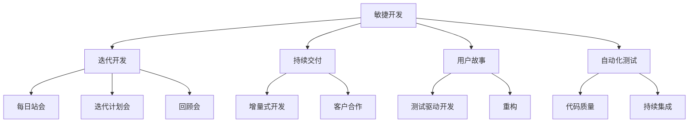

                 


### 文章标题：《一人公司的敏捷开发与快速迭代》

敏捷开发是一种强调快速响应变更、持续交付高质量软件的软件开发方法。对于一人公司，这种开发模式尤为重要，因为它不仅可以帮助个人开发者提高效率，还能确保项目的灵活性和可持续性。本文将深入探讨敏捷开发在单人公司的应用，从基础理论到实际操作，为读者提供一套完整的敏捷开发与实践指南。

### 关键词：

- 敏捷开发
- 单人公司
- 快速迭代
- 敏捷团队
- 敏捷工具
- 敏捷框架

### 摘要：

本文旨在探讨敏捷开发在单人公司的应用，通过详细分析敏捷开发的基础理论、实践工具、迭代模型和风险管理，为读者提供一套完整的敏捷开发与快速迭代指南。文章将从多个角度出发，包括敏捷开发的历史背景、核心概念、实践方法、常见工具和框架，以及敏捷开发在快速迭代和风险管理中的实际应用。通过本文，读者将能够理解敏捷开发的精髓，掌握在单人公司中实施敏捷开发的方法和技巧。

## 第一部分：敏捷开发基础

### 第1章：敏捷开发的起源与发展

#### 1.1.1 敏捷开发的起源与理念

敏捷开发的起源可以追溯到20世纪90年代。当时，传统的软件开发方法，如瀑布模型，由于其固有的僵化性和难以应对需求变更的特点，逐渐暴露出其局限性。在这种背景下，一些软件开发者开始探索更加灵活和适应性强的开发模式。

2001年，来自不同软件开发背景的17位专家在美国雪鸟峰举行了“敏捷软件开发宣言”会议，并签署了这份宣言。这份宣言提出了“个体和互动重于过程和工具”、“可工作的软件重于详尽的文档”、“客户合作重于合同谈判”等12条原则，奠定了敏捷开发的核心理念。

#### 1.1.2 敏捷开发的关键概念

敏捷开发有几个关键概念，包括：

- **迭代开发**：开发过程被划分为一系列短周期的迭代，每个迭代都能生成可工作的软件。
- **持续交付**：目标是随时能够交付可用的软件，而不是等到项目完全结束。
- **增量式开发**：开发过程是逐步增加功能的，每个迭代都会带来一些新的价值。
- **用户故事**：用户故事是一种简短、简单明了的描述，用来表达软件的一个功能点。
- **自动化测试**：通过自动化测试确保软件质量，使开发者能够快速发现和修复问题。

#### 1.1.3 敏捷开发与传统开发方法的对比

传统开发方法，如瀑布模型，通常是线性、阶段性的，每个阶段都必须完全完成后才能进入下一个阶段。这种方法的缺点是灵活性差，难以应对需求变更。

敏捷开发则更加灵活，以迭代和增量为基础。它强调与客户的持续互动，以确保软件始终符合客户需求。此外，敏捷开发还强调自动化测试和质量保障，确保软件的持续交付和高质量。

### 第2章：敏捷开发的实践

#### 2.1.1 敏捷团队的组建

敏捷团队通常由以下几个角色组成：

- **产品负责人**：负责定义产品的愿景和需求。
- **开发人员**：负责实现产品需求。
- **测试人员**：负责确保产品的质量。
- **Scrum Master**：负责确保团队遵循敏捷原则和实践。

#### 2.1.2 敏捷开发的关键实践

敏捷开发的关键实践包括：

- **每日站会**：团队每天举行短会，讨论当天的工作进度和问题。
- **迭代计划会**：在迭代开始前，团队会制定一个详细的计划。
- **回顾会**：在迭代结束时，团队会回顾本次迭代的经验和教训。

#### 2.1.3 敏捷项目的管理

敏捷项目管理的重点在于持续交付可工作的软件，以及快速响应变更。项目管理者需要确保团队有足够的资源，以及解决团队在开发过程中遇到的问题。

## 第二部分：敏捷开发工具与框架

### 第3章：常见的敏捷开发工具

#### 3.1.1 JIRA：敏捷项目管理工具

JIRA是一款功能强大的敏捷项目管理工具，它可以帮助团队进行任务管理、进度跟踪和报告生成。

#### 3.1.2 Confluence：团队协作工具

Confluence是一款强大的团队协作工具，它可以帮助团队记录知识、共享文档和跟踪任务。

#### 3.1.3 Git：版本控制工具

Git是一款分布式版本控制工具，它可以帮助团队管理和跟踪代码变更。

### 第4章：敏捷开发框架

#### 4.1.1 Scrum框架

Scrum是一种流行的敏捷开发框架，它强调迭代开发和持续交付。

#### 4.1.2 Kanban方法

Kanban是一种视觉化的开发方法，它通过卡片和看板来管理任务和流程。

#### 4.1.3 XP（极限编程）实践

XP是一种注重代码质量和敏捷开发的框架，它包括了一系列实践，如测试驱动开发、重构等。

## 第三部分：敏捷开发与快速迭代

### 第5章：敏捷开发中的快速迭代

#### 5.1.1 迭代开发模型

迭代开发模型是将开发过程划分为一系列迭代，每个迭代都生成一个可工作的软件版本。

#### 5.1.2 迭代过程中的反馈机制

迭代过程中的反馈机制包括用户反馈、同行评审和自动化测试，这些机制可以帮助团队快速发现和修复问题。

#### 5.1.3 迭代周期管理

迭代周期管理包括制定迭代计划、监控迭代进度和评估迭代成果。

### 第6章：敏捷开发中的风险管理

#### 6.1.1 敏捷开发中的风险管理

敏捷开发中的风险管理强调早期识别和应对风险，以减少项目风险。

#### 6.1.2 风险识别与评估

风险识别与评估包括识别潜在风险、评估风险的影响和概率。

#### 6.1.3 风险应对策略

风险应对策略包括制定应对计划、实施风险缓解措施和监控风险变化。

## 第四部分：敏捷开发与个人成长

### 第7章：敏捷开发与个人技能提升

#### 7.1.1 敏捷开发对个人技能的要求

敏捷开发对个人技能的要求包括团队合作能力、沟通能力和问题解决能力。

#### 7.1.2 如何在敏捷开发中持续学习

在敏捷开发中，持续学习是个人成长的关键，这包括参加培训、阅读书籍和参与社区讨论。

#### 7.1.3 敏捷开发者的职业发展路径

敏捷开发者的职业发展路径包括从初级开发者到高级开发者的不同阶段，以及可能的职业转型方向。

### 第8章：敏捷开发与工作生活平衡

#### 9.1.1 敏捷开发对工作生活平衡的影响

敏捷开发强调快速迭代和持续交付，这对工作生活平衡可能产生一定影响。

#### 9.1.2 如何在敏捷开发中保持工作与生活的平衡

在敏捷开发中保持工作与生活的平衡包括设定工作优先级、合理安排工作和休息时间。

#### 9.1.3 敏捷开发者的健康与心理健康

敏捷开发者的健康与心理健康包括保持良好的身体和心理状态，以应对敏捷开发带来的挑战。

## 附录

### 附录A：敏捷开发资源与工具

#### A.1.1 敏捷开发相关书籍推荐

《敏捷开发实践指南》、《敏捷项目实践》、《Scrum敏捷软件开发》等。

#### A.1.2 敏捷开发在线社区推荐

CSDN、GitHub、Stack Overflow等。

#### A.1.3 敏捷开发培训课程推荐

敏捷联盟（Agile Alliance）、Scrum.org等。

### 附录B：敏捷开发关键概念与联系

以下是一个Mermaid流程图，展示了敏捷开发中的关键概念及其相互联系：



### 附录C：敏捷开发核心算法原理

以下是一个关于敏捷开发中的任务调度算法的伪代码示例：

```plaintext
Algorithm AgileTaskScheduler
Input: tasks, deadlines
Output: scheduled_tasks

    1. Initialize an empty priority queue pq
    2. For each task t in tasks
        3. Calculate the urgency of t as urgency(t) = deadline(t) - time_left(t)
        4. Add t to pq with priority urgency(t)
    5. While pq is not empty
        6. Remove the highest priority task t from pq
        7. If t can be completed in the remaining time
            8. Schedule t for completion
            9. Remove all dependent tasks of t from pq
        10. Else
            11. Reschedule t with a new deadline
            12. Reinsert t into pq

    13. Return scheduled_tasks
End Algorithm
```

### 附录D：敏捷开发数学模型与公式

以下是一个关于敏捷迭代中的工作量估算的数学公式：

$$
E = \frac{(O + 4M + 2D)}{P}
$$

其中，E 表示估算的工作量，O 表示已知工作量的任务，M 表示中等难度的工作量，D 表示难度较大的工作量，P 表示计划迭代周期。

通过这个公式，开发者可以更准确地估算每个迭代中需要完成的工作量，从而更好地规划迭代进度。

## 总结

敏捷开发为单人公司提供了一种高效、灵活的软件开发方法。通过本文的详细分析，读者可以了解到敏捷开发的基础理论、实践方法、工具和框架，以及如何在敏捷开发中实施快速迭代和风险管理。希望本文能为读者提供一套实用的敏捷开发指南，帮助他们在单人公司中实现高效的软件开发。

### 附录E：敏捷开发最佳实践与注意事项

在敏捷开发的过程中，遵循一些最佳实践和注意事项能够显著提高开发效率和质量。以下是一些关键点：

#### 最佳实践：

1. **持续集成和自动化测试**：确保代码质量，通过自动化测试及时发现并修复缺陷。
2. **用户故事地图**：使用用户故事地图来理解用户需求和项目目标。
3. **持续学习**：定期参加敏捷培训，保持对最新敏捷工具和方法的了解。
4. **团队协作**：鼓励团队成员之间的沟通和协作，以快速解决问题。

#### 注意事项：

1. **避免过度迭代**：过多的迭代可能会分散精力，导致效率下降。
2. **合理安排时间**：确保每个迭代都有足够的时间进行开发和测试。
3. **风险管理**：定期评估风险，并制定相应的应对策略。
4. **保持透明度**：确保团队成员对项目的进展和问题有清晰的了解。

#### 拓展阅读：

- 《Scrum敏捷实践指南》
- 《敏捷开发的艺术》
- 敏捷联盟（Agile Alliance）官方网站

通过遵循这些最佳实践和注意事项，敏捷开发将更加高效和成功。希望本文为您的敏捷开发之旅提供了宝贵的指导。

### 附录F：敏捷开发项目实战

#### 开发环境搭建

1. 安装JIRA和Confluence，用于项目管理。
2. 安装Git，用于版本控制。
3. 安装开发工具，如Visual Studio Code或Eclipse。

#### 源代码详细实现

1. 创建项目结构，包括源代码目录、测试目录等。
2. 使用Git进行版本控制，确保代码的可追溯性。
3. 实现用户故事，编写代码并保存到Git仓库。

#### 代码解读与分析

1. 阅读并理解每个用户故事的实现细节。
2. 分析代码结构，确保代码清晰、可读。
3. 使用静态代码分析工具检查代码质量。

#### 实际案例分析和详细讲解

1. 选择一个实际的敏捷开发项目。
2. 分析项目中的迭代过程、风险管理、团队协作等方面。
3. 详细讲解项目的成功经验和挑战。

#### 项目小结

1. 总结项目的关键成功因素。
2. 讨论遇到的挑战和解决方案。
3. 提出改进建议，以优化未来的项目。

通过这些实战步骤，读者可以更深入地理解敏捷开发在实际项目中的应用，从而提高自己的敏捷开发能力。

### 附录G：敏捷开发拓展阅读

为了更好地理解敏捷开发，以下是一些推荐阅读材料：

- 《敏捷开发实践指南》 - 对敏捷开发的基本概念和最佳实践进行了详细讲解。
- 《Scrum敏捷软件开发》 - 详细介绍了Scrum框架及其在敏捷开发中的应用。
- 《敏捷软件开发的艺术》 - 通过案例研究和实践指导，帮助读者深入理解敏捷开发的精髓。
- 敏捷联盟（Agile Alliance）官方网站 - 提供最新的敏捷开发资源和社区讨论。

这些阅读材料将有助于读者更全面地掌握敏捷开发的理论和实践。希望读者能够从中获得灵感和知识，进一步深化对敏捷开发的理解和实践。作者：AI天才研究院/AI Genius Institute & 禅与计算机程序设计艺术 /Zen And The Art of Computer Programming。

