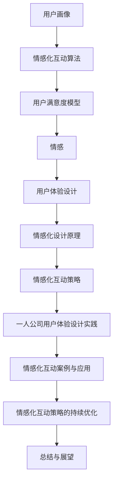
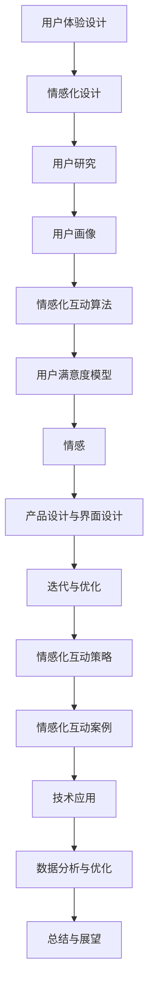

                 


## 《一人公司的用户体验设计与情感化互动策略》

---

# 文章标题：一人公司的用户体验设计与情感化互动策略

> 关键词：一人公司，用户体验设计，情感化互动，设计思维，敏捷开发

> 摘要：本文将探讨在资源有限的一人公司环境中，如何通过用户体验设计与情感化互动策略来提升产品价值，增强用户粘性和满意度。文章将从用户体验设计的定义、情感化设计的原理，到情感化互动的策略，以及具体的设计实践进行深入分析。

---

## 《一人公司的用户体验设计与情感化互动策略》目录大纲

### 第一部分：理解用户体验与情感化设计

### 第二部分：一人公司的用户体验设计实践

### 第三部分：情感化互动案例与应用

### 第四部分：结论与展望

### 附录：资源与工具推荐

### 核心概念与联系

### 用户画像的构建

### 情感化互动算法

### 用户满意度模型

### 情感

---

### 第一部分：理解用户体验与情感化设计

---

## 第1章：用户体验设计概述

### 1.1 用户体验设计的定义与重要性

用户体验设计（User Experience Design，简称UXD）是设计学科的一个分支，旨在提升用户在使用产品过程中的满意度和愉悦感。在资源有限的一人公司中，用户体验设计尤为重要，因为设计师需要独立承担市场调研、需求分析、原型设计、界面设计等多方面的工作。

#### 重要性：

- **用户满意度**：良好的用户体验能够提高用户的满意度，进而提升产品的口碑和市场份额。
- **用户忠诚度**：用户体验直接影响用户的忠诚度，这对于一人公司来说尤为关键，因为用户流失率较高可能会对业务产生严重影响。
- **产品差异化**：在竞争激烈的市场中，优秀的用户体验设计是产品差异化的重要手段。

### 1.2 用户研究与用户画像

用户研究是用户体验设计的基石，它帮助设计师深入了解目标用户的需求、行为和偏好。

#### 用户画像：

用户画像是对目标用户的简短描述，包括年龄、性别、职业、收入、兴趣爱好等特征。通过用户画像，设计师可以更好地把握用户需求，从而设计出更加符合用户期望的产品。

### 1.3 设计思维与敏捷开发

设计思维（Design Thinking）是一种以用户为中心的创新方法，它强调 empathy（同理心）、definition（定义问题）、ideation（创意产生）、prototyping（原型设计）和 testing（测试与迭代）五个阶段。

#### 敏捷开发：

敏捷开发是一种以迭代和增量为特点的开发方法，它强调快速反馈和持续改进。在资源有限的一人公司中，敏捷开发能够帮助设计师高效地响应市场变化，快速迭代产品。

---

## 第2章：情感化设计原理

### 2.1 情感化设计的定义与核心概念

情感化设计（Emotional Design）是一种通过激发用户情感来提升产品吸引力和使用体验的设计方法。

#### 定义：

情感化设计不仅仅关注产品的功能性，更关注产品如何引起用户的情感共鸣，从而增强用户对产品的喜爱和忠诚度。

### 2.2 情感化设计的层次

情感化设计可以从三个层次来理解：

1. **本能层次**：涉及产品的外观、形状和材质，这些元素直接刺激用户的感官。
2. **行为层次**：关注产品的交互过程和易用性，这些因素影响用户的操作体验。
3. **反思层次**：涉及产品的意义和价值观，这些元素触动用户的情感和思想。

### 2.3 情感化设计的方法论

情感化设计的方法论包括以下步骤：

1. **用户情感分析**：通过问卷调查、访谈和观察等方法，了解用户的情感需求和偏好。
2. **情感地图**：根据用户情感分析的结果，绘制情感地图，明确产品需要触发的情感。
3. **设计原型**：基于情感地图，设计产品原型，并通过用户测试进行迭代优化。

---

## 第3章：情感化互动策略

### 3.1 情感化互动的构建

情感化互动是指产品或服务与用户之间建立的情感联系。在情感化互动中，设计师需要考虑以下因素：

- **个性化**：根据用户特点和偏好，提供个性化的互动体验。
- **人性化**：设计产品时，注重人性化细节，如友好的界面语言、互动提示等。
- **情感共鸣**：通过故事、音乐、艺术等形式，激发用户的情感共鸣。

### 3.2 情感化互动的案例分析

案例分析可以帮助设计师理解情感化互动在不同产品中的应用。

- **案例1：宜家的家居产品**：宜家通过精美的产品展示、互动式购物体验，以及情感化的包装设计，成功地将产品与用户情感联系起来。
- **案例2：Airbnb的房东评价系统**：Airbnb通过房东评价系统，鼓励房东分享个人故事和体验，从而建立用户之间的情感联系。

### 3.3 情感化互动的策略制定

情感化互动的策略制定需要考虑以下方面：

- **目标用户**：明确目标用户群体，了解他们的情感需求和偏好。
- **情感触发点**：确定能够触发用户情感的关键点，如产品功能、界面设计、客服互动等。
- **情感体验设计**：围绕情感触发点，设计具体的情感体验，如个性化的欢迎语、情感化的客服对话等。

---

### 第二部分：一人公司的用户体验设计实践

---

## 第4章：一人公司运营环境下的设计挑战

### 4.1 一人公司运营特点与设计需求

一人公司通常具有以下特点：

- **资源有限**：缺乏足够的人力、资金和资源。
- **决策快速**：需要快速响应市场变化和用户需求。
- **灵活性高**：能够灵活调整产品设计方向。

### 4.2 资源有限下的设计策略

在资源有限的情况下，设计师需要采取以下策略：

- **高效调研**：利用在线调研工具，快速收集用户反馈。
- **敏捷设计**：采用敏捷开发方法，快速迭代产品。
- **合作与外包**：与外部设计师和开发团队合作，共享资源。

### 4.3 时间管理与任务优先级设定

在资源有限的情况下，有效的时间管理和任务优先级设定至关重要。

- **明确目标**：明确产品目标和设计目标，确保所有设计工作都围绕目标进行。
- **优先级排序**：根据用户需求和产品目标，对设计任务进行优先级排序。
- **时间管理工具**：使用时间管理工具，如 To Do List、Trello 等，确保任务按时完成。

---

## 第5章：用户研究与需求分析

### 5.1 单人团队的用户研究方法

对于一人公司来说，用户研究需要更加灵活和高效。

- **问卷调查**：通过在线问卷工具（如 Google 表单、SurveyMonkey）收集用户反馈。
- **用户访谈**：通过电话、视频等方式与用户进行一对一访谈。
- **用户观察**：在用户实际使用产品时进行观察，了解用户行为和需求。

### 5.2 用户需求的收集与分析

收集用户需求的方法包括：

- **需求收集工具**：使用需求收集工具（如 UserVoice、SuggestionBox）收集用户建议。
- **用户访谈记录**：对用户访谈进行记录和分析，提取关键需求。

### 5.3 用户需求的优先级排序

用户需求的优先级排序需要考虑：

- **用户需求的重要性**：根据用户反馈和市场需求，评估每个需求的重要性。
- **实现难度**：评估每个需求实现的难度和资源需求。

---

## 第6章：产品设计思路与方法

### 6.1 产品设计与用户体验的关系

产品设计与用户体验密切相关。优秀的产品设计能够提升用户体验，从而增强用户满意度和忠诚度。

### 6.2 功能模块设计

功能模块设计需要考虑：

- **用户需求**：根据用户需求设计功能模块，确保功能模块能够满足用户需求。
- **用户体验**：设计功能模块时，要考虑用户体验，确保操作简便、直观。

### 6.3 交互设计原则与实践

交互设计原则包括：

- **一致性**：保持界面元素和使用流程的一致性，减少用户的学习成本。
- **直观性**：设计界面和操作流程时，要尽量直观，让用户一目了然。
- **反馈**：为用户的操作提供及时、明确的反馈，增强用户的信心和安全感。

---

## 第7章：情感化界面设计

### 7.1 界面设计的核心要素

界面设计的核心要素包括：

- **颜色**：选择合适的颜色，传递产品的情感和氛围。
- **字体**：选择易于阅读的字体，确保界面美观且易读。
- **图标**：设计简洁、直观的图标，帮助用户快速理解界面功能。

### 7.2 视觉设计原则

视觉设计原则包括：

- **简洁性**：设计简洁、清晰的界面，避免过多的装饰和元素。
- **美观性**：设计美观的界面，提升用户的使用体验。
- **一致性**：保持界面元素和使用流程的一致性。

### 7.3 界面中的情感化元素

界面中的情感化元素包括：

- **动画**：使用动画效果，增强用户的互动体验。
- **音乐**：在适当的情况下，使用音乐来营造氛围，增强用户的情感体验。
- **视觉故事**：通过界面设计和视觉元素，讲述产品的故事，与用户建立情感联系。

---

## 第8章：迭代与优化

### 8.1 用户反馈的收集与处理

用户反馈是优化设计的重要依据。设计师需要：

- **收集反馈**：通过问卷调查、用户访谈、用户反馈工具等方式收集用户反馈。
- **处理反馈**：对用户反馈进行分析，识别关键问题和改进点。

### 8.2 产品迭代策略

产品迭代策略包括：

- **版本控制**：使用版本控制工具（如 Git）管理代码和设计文件，确保迭代过程的可追溯性和可维护性。
- **迭代计划**：制定明确的迭代计划，确保每个迭代周期都有明确的任务和目标。

### 8.3 用户体验优化方法

用户体验优化方法包括：

- **A/B测试**：通过A/B测试，比较不同设计方案的优劣，优化用户体验。
- **用户研究**：持续进行用户研究，了解用户的需求和行为，不断优化产品设计。

---

### 第三部分：情感化互动案例与应用

---

## 第9章：情感化互动案例研究

### 9.1 情感化互动的成功案例

成功案例包括：

- **1**：Facebook 的“生日提醒”功能，通过发送生日祝福，与用户建立情感联系。
- **2**：Apple 的产品发布会，通过精美的设计和情感化的演讲，激发用户的购买欲望。

### 9.2 案例中的情感化互动策略

案例中的情感化互动策略包括：

- **个性化**：根据用户特点和偏好，提供个性化的互动体验。
- **人性化**：设计人性化的互动流程，增强用户的信任和满意度。

### 9.3 案例分析与启示

案例分析可以帮助设计师：

- **理解情感化互动的重要性**：认识到情感化互动在提升用户满意度和忠诚度方面的作用。
- **借鉴成功经验**：从成功案例中学习情感化互动的策略和方法。

---

## 第10章：情感化互动技术在产品中的应用

### 10.1 情感化互动技术在界面设计中的应用

情感化互动技术可以在界面设计中广泛应用：

- **动画效果**：使用动画效果，增强用户的互动体验。
- **个性化推荐**：根据用户行为和偏好，提供个性化的内容推荐。
- **情感分析**：使用自然语言处理技术，分析用户评论和反馈，提供情感化的回应。

### 10.2 情感化互动在客服与支持中的应用

情感化互动在客服与支持中的应用包括：

- **智能客服**：使用情感化聊天机器人，提供个性化的客服体验。
- **情感反馈**：通过情感分析，了解用户对产品和支持的满意度，及时调整服务策略。

### 10.3 情感化互动在营销与推广中的应用

情感化互动在营销与推广中的应用包括：

- **情感化广告**：设计情感化广告，激发用户的情感共鸣，提升品牌形象。
- **故事营销**：通过讲述产品故事，与用户建立情感联系，增强品牌忠诚度。

---

## 第11章：情感化互动策略的持续优化

### 11.1 数据分析与用户行为研究

数据分析与用户行为研究是优化情感化互动策略的重要手段：

- **用户行为分析**：分析用户行为数据，了解用户对产品的使用习惯和偏好。
- **情感分析**：使用自然语言处理技术，分析用户评论和反馈，了解用户情感状态。

### 11.2 情感化互动效果的评估

情感化互动效果的评估需要考虑以下几个方面：

- **用户满意度**：通过用户满意度调查，评估情感化互动策略的效果。
- **用户留存率**：评估情感化互动策略对用户留存率的影响。

### 11.3 情感化互动策略的迭代与优化

根据评估结果，持续迭代和优化情感化互动策略：

- **A/B测试**：通过A/B测试，比较不同互动策略的优劣，持续优化。
- **用户研究**：定期进行用户研究，了解用户需求和行为变化，及时调整策略。

---

### 第四部分：结论与展望

---

## 第12章：一人公司用户体验与情感化互动策略的总结

### 12.1 总结与展望

一人公司通过用户体验设计与情感化互动策略，可以在资源有限的情况下，提升产品价值，增强用户粘性和满意度。

### 12.2 面临的挑战与机遇

一人公司面临的挑战包括资源有限、市场变化快等，但同时也面临着灵活调整和快速响应的市场机遇。

### 12.3 未来发展趋势与预测

未来，情感化设计将在产品设计中发挥越来越重要的作用，一人公司需要不断探索和创新，以适应市场变化和用户需求。

---

### 附录：资源与工具推荐

#### 附录 A：用户体验与情感化设计相关资源

- **设计书籍**： 
  - 《设计思维》（Design Thinking） 
  - 《情感化设计》（Emotional Design）
  
- **在线资源**：
  - **用户体验设计社区**：UX Booth、UI Movement
  - **情感化设计博客**：Smashing Magazine、Medium

#### 附录 B：情感化互动技术工具介绍

- **情感化互动工具**：
  - **自然语言处理库**：NLTK、spaCy
  - **情感分析工具**：Google Cloud Natural Language API、Watson Natural Language Understanding

---

## 核心概念与联系

### 用户画像的构建

### 情感化互动算法

### 用户满意度模型

### 情感

---

## 核心算法原理讲解

### 用户画像的构建

```plaintext
1. 数据收集：通过问卷调查、用户访谈等方式收集用户的基本信息、行为数据等。
2. 数据清洗：去除无效数据、处理缺失值、处理异常值等。
3. 特征提取：根据业务需求提取用户特征，如年龄、性别、兴趣等。
4. 模型构建：使用机器学习算法（如决策树、随机森林等）对用户特征进行建模。
5. 用户分类：根据模型预测结果对用户进行分类，形成用户画像。
```

### 情感化互动算法

```plaintext
1. 数据收集：收集用户交互数据，包括点击、评论、反馈等。
2. 情感分析：使用自然语言处理技术（如情感分析模型）对用户交互内容进行分析，提取情感特征。
3. 情感标签：根据情感分析结果，为用户交互内容打上情感标签。
4. 互动策略：根据用户情感特征，制定个性化的互动策略，如鼓励、安慰、引导等。
5. 互动执行：通过系统界面或客服机器人等渠道，执行情感化互动策略。
```

### 用户满意度模型

$$
S = \frac{1}{N} \sum_{i=1}^{N} w_i \cdot u_i
$$

其中，$S$ 表示用户满意度，$N$ 表示用户数量，$w_i$ 表示第 $i$ 个用户的权重，$u_i$ 表示第 $i$ 个用户的满意度得分。

## 核心概念与联系

### 用户画像的构建

### 情感化互动算法

### 用户满意度模型

### 情感

### Mermaid 流程图



## 核心算法原理讲解

### 用户画像的构建

```plaintext
1. 数据收集：通过问卷调查、用户访谈等方式收集用户的基本信息、行为数据等。
2. 数据清洗：去除无效数据、处理缺失值、处理异常值等。
3. 特征提取：根据业务需求提取用户特征，如年龄、性别、兴趣等。
4. 模型构建：使用机器学习算法（如决策树、随机森林等）对用户特征进行建模。
5. 用户分类：根据模型预测结果对用户进行分类，形成用户画像。
```

### 情感化互动算法

```plaintext
1. 数据收集：收集用户交互数据，包括点击、评论、反馈等。
2. 情感分析：使用自然语言处理技术（如情感分析模型）对用户交互内容进行分析，提取情感特征。
3. 情感标签：根据情感分析结果，为用户交互内容打上情感标签。
4. 互动策略：根据用户情感特征，制定个性化的互动策略，如鼓励、安慰、引导等。
5. 互动执行：通过系统界面或客服机器人等渠道，执行情感化互动策略。
```

### 用户满意度模型

$$
S = \frac{1}{N} \sum_{i=1}^{N} w_i \cdot u_i
$$

其中，$S$ 表示用户满意度，$N$ 表示用户数量，$w_i$ 表示第 $i$ 个用户的权重，$u_i$ 表示第 $i$ 个用户的满意度得分。

## 数学模型和数学公式

### 用户满意度模型

$$
S = \frac{1}{N} \sum_{i=1}^{N} w_i \cdot u_i
$$

其中，$S$ 表示用户满意度，$N$ 表示用户数量，$w_i$ 表示第 $i$ 个用户的权重，$u_i$ 表示第 $i$ 个用户的满意度得分。

### 情感化互动效果评估模型

$$
E = \alpha \cdot \text{情感化互动质量} + \beta \cdot \text{用户满意度}
$$

其中，$E$ 表示情感化互动效果，$\alpha$ 和 $\beta$ 为权重系数，分别表示情感化互动质量和用户满意度的相对重要性。

---

# 文章标题：一人公司的用户体验设计与情感化互动策略

> 关键词：用户体验设计，情感化互动，设计思维，敏捷开发，一人公司

> 摘要：本文探讨了在资源有限的一人公司中，如何通过用户体验设计与情感化互动策略来提升产品价值，增强用户粘性和满意度。文章首先介绍了用户体验设计的定义与重要性，情感化设计的原理与方法，情感化互动策略的构建与实施。接着，针对一人公司的运营特点，分析了设计挑战与策略，以及用户研究与需求分析的方法。随后，详细阐述了产品设计与情感化界面设计的方法与实践，迭代与优化的策略。最后，通过案例研究与应用，展示了情感化互动在产品中的成功实践，总结了情感化互动策略的持续优化方法。文章旨在为一人公司提供用户体验设计与情感化互动策略的全面指导。

---

## 引言

在当今竞争激烈的市场环境中，用户体验（User Experience，简称UX）已成为企业成功的关键因素之一。无论是大公司还是小公司，提升用户体验都至关重要。然而，对于一人公司（One-Person Company）来说，由于资源有限，用户体验设计显得尤为挑战性。一人公司通常由一个人或少数几个人运营，他们需要独立承担市场调研、产品设计、开发和维护等各个环节的工作。因此，如何在这一资源受限的环境中，通过用户体验设计与情感化互动策略来提升产品价值，增强用户粘性和满意度，成为一人公司需要迫切解决的问题。

本文将从以下几个方面展开讨论：

1. **用户体验设计概述**：介绍用户体验设计的定义与重要性，以及用户研究与用户画像的方法。
2. **情感化设计原理**：探讨情感化设计的定义、层次与方法论。
3. **情感化互动策略**：分析情感化互动的构建、案例与策略制定。
4. **一人公司的设计挑战与实践**：讨论一人公司运营环境下的设计挑战，用户研究与需求分析的方法，产品设计与情感化界面设计的方法与实践，以及迭代与优化的策略。
5. **情感化互动案例与应用**：通过成功案例展示情感化互动在产品中的应用。
6. **总结与展望**：总结一人公司用户体验与情感化互动策略的实践成果，展望未来发展趋势。

通过本文的探讨，希望能为一人公司提供实用的用户体验设计与情感化互动策略指导，帮助他们在有限的资源下，创造出更具吸引力和竞争力的产品。

---

## 第一部分：理解用户体验与情感化设计

### 第1章：用户体验设计概述

### 1.1 用户体验设计的定义与重要性

用户体验设计（User Experience Design，简称UXD）是一种以用户为中心的设计方法，旨在提升用户在使用产品或服务过程中的满意度、愉悦感及效率。用户体验设计涵盖了产品的整个生命周期，包括市场调研、需求分析、设计、开发、测试、发布和后续维护等各个环节。其核心目标是通过优化用户界面、交互流程和功能特性，为用户提供一致、简单、高效且愉悦的使用体验。

#### 定义

用户体验设计不仅仅是视觉设计或界面设计，它涵盖了以下几个方面：

- **易用性（Usability）**：产品或服务是否容易使用，用户能否快速学会并高效完成任务。
- **可用性（Accessibility）**：产品或服务是否能够为所有用户（包括残障人士）提供无障碍的访问和使用。
- **用户体验（User Experience）**：用户在使用产品或服务过程中的整体感受，包括情感、态度、满意度和忠诚度。
- **可用性评估（Usability Testing）**：通过实际用户的使用测试，评估产品的易用性和用户体验，发现问题并进行改进。

#### 重要性

在资源有限的一人公司中，用户体验设计尤为重要。以下是用户体验设计对一人公司的几个关键影响：

1. **提高用户满意度**：良好的用户体验能够显著提升用户的满意度和愉悦感，进而增强用户对产品的忠诚度。
2. **降低用户流失率**：用户体验不佳可能导致用户流失，一人公司无法承受高用户流失率带来的业务影响。
3. **增强产品竞争力**：在竞争激烈的市场中，用户体验设计是产品差异化的重要手段，能够帮助一人公司脱颖而出。
4. **提高工作效率**：用户体验设计能够优化产品的交互流程，减少用户完成任务的时间，从而提高工作效率。
5. **节省开发和维护成本**：通过提前识别和解决问题，用户体验设计能够降低开发和维护成本。

### 1.2 用户研究与用户画像

用户研究是用户体验设计的基石，它帮助设计师深入了解目标用户的需求、行为和偏好。通过用户研究，设计师可以获取有关用户的信息，并将其用于指导设计决策。

#### 用户画像

用户画像是对目标用户的简短描述，通常包括以下信息：

- **基本信息**：如年龄、性别、职业、地理位置等。
- **行为特征**：如使用习惯、消费习惯、互动行为等。
- **需求与偏好**：如对产品的期望、对服务的满意度、偏好使用的产品功能等。

用户画像可以帮助设计师：

- **明确目标用户**：了解目标用户的特点，更好地定位产品。
- **设计个性化体验**：根据用户画像，设计个性化的产品和服务。
- **优化设计决策**：根据用户研究的结果，优化产品的设计决策。

### 1.3 设计思维与敏捷开发

设计思维（Design Thinking）是一种以用户为中心的创新方法，它强调同理心、定义问题、创意产生、原型设计和测试与迭代。设计思维可以帮助设计师更好地理解用户需求，创造解决方案。

#### 设计思维

设计思维通常包括以下步骤：

1. **同理心（Empathy）**：了解用户的需求、行为和情感，建立对用户的深刻理解。
2. **定义问题（Definition）**：明确设计问题，确定解决方案的目标。
3. **创意产生（Idea Generation）**：通过头脑风暴、思维导图等方法，产生创意解决方案。
4. **原型设计（Prototyping）**：创建快速原型，测试和验证创意。
5. **测试与迭代（Testing and Iteration）**：通过用户测试，收集反馈，不断改进设计。

#### 敏捷开发

敏捷开发（Agile Development）是一种以迭代和增量为特点的开发方法，它强调快速反馈和持续改进。敏捷开发适用于一人公司，因为它允许设计师和开发者快速响应市场变化和用户需求。

敏捷开发的核心原则包括：

- **客户满意度**：通过快速交付有价值的软件，满足客户需求。
- **迭代开发**：将开发过程分解为多个短周期，每个周期都产生可工作的软件。
- **团队协作**：鼓励团队成员之间的沟通和协作。
- **响应变化**：快速适应需求变化，持续改进产品。

### 1.4 小结

用户体验设计在资源有限的一人公司中具有重要价值。通过用户研究和用户画像，设计师可以深入了解目标用户，从而设计出更符合用户需求的产品。设计思维和敏捷开发提供了一套系统的方法论，帮助设计师快速响应市场变化和用户需求，不断优化产品设计。在接下来的章节中，我们将进一步探讨情感化设计的原理、情感化互动策略以及一人公司的用户体验设计实践。

### 1.5 下一步阅读指南

- **第2章：情感化设计原理**：将介绍情感化设计的定义、核心概念、层次和方法论。
- **第3章：情感化互动策略**：分析情感化互动的构建、案例和策略制定。

---

## 第2章：情感化设计原理

### 2.1 情感化设计的定义与核心概念

情感化设计（Emotional Design）是一种以用户情感为核心的设计方法，旨在通过激发用户的情感来提升产品的吸引力、使用体验和品牌忠诚度。与传统的功能导向设计不同，情感化设计更加关注用户在使用产品过程中的情感体验，它不仅关注产品的实用性，更强调产品的情感价值。

#### 定义

情感化设计的定义可以从三个层次来理解：

1. **本能层次**：涉及产品的外观、形状、颜色和材质等元素，这些元素直接影响用户的感官体验。
2. **行为层次**：涉及产品的交互过程和易用性，这些因素影响用户的操作体验和行为。
3. **反思层次**：涉及产品的意义和价值观，这些元素触动用户的情感和思想，影响用户的长期情感和品牌忠诚度。

#### 核心概念

情感化设计包含以下几个核心概念：

- **同理心（Empathy）**：设计师需要站在用户的角度思考，理解用户的需求、情感和体验。
- **情感触发（Emotional Trigger）**：通过设计元素和交互流程，激发用户的特定情感反应。
- **情感共鸣（Emotional Resonance）**：设计能够引起用户共鸣的情感体验，增强用户对品牌的情感联系。
- **情感价值（Emotional Value）**：设计不仅提供功能，还传递情感价值，满足用户的情感需求。

### 2.2 情感化设计的层次

情感化设计可以从三个层次来理解：

1. **本能层次**：设计元素直接影响用户的感官体验。例如，产品的外观设计、颜色搭配、材质选择等。这些设计元素能够激发用户的本能反应，如色彩心理学中提到的颜色对情绪的影响。

2. **行为层次**：设计影响用户的操作体验和行为。例如，产品的交互设计、界面布局、操作流程等。良好的交互设计能够减少用户的学习成本，提高使用效率，从而引发积极的情感反应。

3. **反思层次**：设计传递产品的价值观和意义，触动用户的情感和思想。例如，品牌故事、文化元素、品牌标志等。这些设计元素能够在用户心中建立情感联系，增强品牌忠诚度。

### 2.3 情感化设计的方法论

情感化设计的方法论包括以下几个步骤：

1. **用户情感分析**：通过问卷调查、访谈、用户研究等方法，了解用户的情感需求和偏好。
2. **情感地图（Emotional Map）**：根据用户情感分析的结果，绘制情感地图，明确产品需要触发的情感和体验。
3. **情感化设计原型**：基于情感地图，设计产品原型，并通过用户测试进行迭代优化。
4. **情感反馈与迭代**：收集用户反馈，分析情感体验，不断优化设计，确保情感化设计目标得到实现。

### 2.4 情感化设计的关键技巧

为了实现有效的情感化设计，设计师需要掌握以下几个关键技巧：

- **情感故事（Emotional Storytelling）**：通过故事讲述，将产品的功能和价值与用户的情感联系起来。
- **视觉隐喻（Visual Metaphor）**：使用视觉元素，如图标、动画、色彩等，创造情感隐喻，增强用户体验。
- **情感互动（Emotional Interaction）**：设计具有情感互动功能的产品，如智能客服、互动游戏等，增强用户情感体验。
- **情感平衡（Emotional Balance）**：在设计中保持情感平衡，避免过度情感化或情感不足，确保用户在情感上的舒适感。

### 2.5 小结

情感化设计是一种以用户情感为核心的设计方法，它通过激发用户的情感来提升产品的吸引力和使用体验。情感化设计包括本能层次、行为层次和反思层次，需要设计师深入了解用户情感，并通过情感故事、视觉隐喻、情感互动和情感平衡等技巧来实现。在下一章中，我们将探讨情感化互动的具体策略和实施方法。

### 2.6 下一步阅读指南

- **第3章：情感化互动策略**：将详细介绍情感化互动的构建、案例分析和策略制定。

---

## 第3章：情感化互动策略

### 3.1 情感化互动的构建

情感化互动是一种通过设计激发用户情感，建立用户与产品之间情感联系的方法。这种互动不仅限于产品的使用过程，还包括用户与品牌、产品之间的情感交流。情感化互动的构建需要设计师深入理解用户情感，并巧妙地将情感元素融入产品设计和用户互动中。

#### 情感化互动的核心要素

情感化互动的核心要素包括：

1. **情感触发点**：这些是能够激发用户特定情感反应的设计元素或交互过程。例如，产品的外观设计、界面动画、客服对话等。
2. **情感表达**：通过视觉、听觉、文字等多感官方式，将情感传达给用户。
3. **情感共鸣**：设计能够触动用户的情感，与用户产生共鸣，建立深层次的情感联系。
4. **情感持续**：设计需要持续地激发用户的情感，保持用户对产品的情感投入。

#### 情感化互动的构建方法

构建情感化互动的方法包括以下几个步骤：

1. **用户情感分析**：通过问卷调查、用户访谈、情感分析工具等，了解用户的情感需求和偏好。
2. **情感地图**：根据用户情感分析的结果，绘制情感地图，明确产品需要触发的情感和体验。
3. **情感设计原型**：基于情感地图，设计原型并进行用户测试，验证情感化互动的效果。
4. **反馈与迭代**：收集用户反馈，分析情感体验，不断优化设计，确保情感化设计目标得到实现。

### 3.2 情感化互动的案例分析

案例分析可以帮助我们更好地理解情感化互动的实际应用。以下是一些成功的情感化互动案例：

1. **Airbnb**：Airbnb通过用户故事和情感化的客服体验，建立了用户与品牌之间的情感联系。用户在Airbnb上分享自己的旅行故事，这些故事不仅展示了用户的使用体验，还传递了情感价值。
   
2. **Facebook**：Facebook的“生日提醒”功能是一个典型的情感化互动案例。通过发送生日祝福，Facebook不仅增强了用户对品牌的情感联系，还提升了用户活跃度。

3. **Nintendo**：Nintendo的Nintendo Switch游戏机通过其可爱的外观设计和互动游戏体验，吸引了大量家庭用户。这些设计元素激发了用户的情感共鸣，使产品成为家庭娱乐的中心。

#### 案例分析中的情感化互动策略

1. **个性化互动**：通过个性化推荐和定制化体验，提升用户的情感体验。
2. **情感化元素**：使用视觉、听觉、文字等情感化元素，创造情感共鸣。
3. **情感触发点**：通过关键节点和互动设计，触发用户的情感反应。
4. **持续互动**：通过定期更新和互动，保持用户对产品的情感投入。

### 3.3 情感化互动的策略制定

情感化互动策略的制定需要考虑以下几个方面：

1. **目标用户**：明确目标用户群体的情感需求和偏好，确保互动策略符合用户期望。
2. **情感触发点**：确定能够触发用户情感的关键点，如产品功能、界面设计、客服互动等。
3. **情感体验设计**：围绕情感触发点，设计具体的情感体验，如个性化的欢迎语、情感化的客服对话等。
4. **反馈机制**：建立用户反馈机制，收集用户对情感化互动的反馈，不断优化互动策略。

### 3.4 情感化互动的实施

实施情感化互动需要考虑以下几个方面：

1. **技术支持**：利用现代技术，如自然语言处理、人工智能、虚拟现实等，提升情感化互动的体验。
2. **内容策略**：设计富有情感内涵的内容，如故事、视频、动画等，增强用户的情感共鸣。
3. **用户体验**：确保情感化互动不破坏用户体验，保持产品功能的易用性和高效性。
4. **测试与优化**：通过用户测试和数据分析，不断优化情感化互动的设计和实施。

### 3.5 小结

情感化互动是提升用户满意度和品牌忠诚度的重要手段。通过构建情感触发点、设计情感体验和持续优化互动策略，设计师可以创造出富有情感价值的互动体验。在下一章中，我们将探讨一人公司在资源有限的情况下，如何应对设计挑战并实施情感化互动策略。

### 3.6 下一步阅读指南

- **第4章：一人公司的设计挑战与实践**：将讨论一人公司在用户体验设计中的挑战和策略。

---

## 第二部分：一人公司的用户体验设计实践

### 第4章：一人公司运营环境下的设计挑战

### 4.1 一人公司运营特点与设计需求

一人公司，顾名思义，是由单个人或一小部分人运营的企业。这种模式具有以下几个显著特点：

1. **资源有限**：一人公司通常没有充足的资金、人力和物力资源，这要求设计师在设计中更加注重效率和效益。
2. **决策快速**：由于公司规模较小，决策过程更加迅速，这要求设计师能够快速响应市场变化和用户需求。
3. **灵活性高**：一人公司具有较强的灵活性，可以快速调整业务方向和产品设计。
4. **依赖性强**：一人公司的成功高度依赖于核心人员的技能和决策，这要求设计师不仅要有扎实的设计能力，还要具备良好的项目管理能力。

#### 设计需求

在资源有限的环境下，一人公司的设计需求主要集中在以下几个方面：

1. **成本效益**：设计过程需要尽量降低成本，同时确保设计质量和用户体验。
2. **快速迭代**：设计需要能够快速响应市场需求和用户反馈，通过快速迭代来优化产品。
3. **用户研究**：尽管资源有限，但仍然需要通过用户研究来获取用户需求，指导设计决策。
4. **灵活性**：设计需要具备灵活性，能够根据市场变化和用户需求快速调整。

### 4.2 资源有限下的设计策略

面对资源有限的情况，一人公司可以采取以下设计策略：

1. **高效调研**：利用免费或低成本的用户研究工具，如在线问卷、社交媒体调查等，快速收集用户反馈。
2. **敏捷设计**：采用敏捷开发方法，快速迭代产品，确保设计能够及时响应用户需求。
3. **合作与外包**：与外部设计师和开发团队合作，共享资源，共同完成设计任务。
4. **时间管理**：合理安排时间，确保设计工作高效完成，同时留出时间进行用户测试和反馈收集。

#### 具体策略

1. **优化工作流程**：简化设计流程，减少不必要的步骤，提高工作效率。
2. **利用开源工具**：使用免费或开源的设计和开发工具，降低成本。
3. **优先级排序**：根据用户需求和产品目标，对设计任务进行优先级排序，确保关键功能优先完成。
4. **用户参与**：鼓励用户参与设计过程，提供反馈，从而提高设计的针对性和满意度。

### 4.3 时间管理与任务优先级设定

在资源有限的情况下，有效的时间管理和任务优先级设定至关重要。

1. **明确目标**：首先明确产品目标和设计目标，确保所有设计工作都围绕目标进行。
2. **优先级排序**：根据用户需求和产品目标，对设计任务进行优先级排序。通常，高优先级任务包括：
   - 关键功能的设计和实现
   - 用户反馈的重要问题修复
   - 对用户体验有重大影响的设计改进
3. **时间管理工具**：使用时间管理工具（如 To Do List、Trello 等）来跟踪任务进度，确保按时完成。
4. **定期回顾**：定期回顾任务进度和设计目标，确保设计工作按照计划进行，必要时进行调整。

### 4.4 小结

一人公司在资源有限的环境下，通过采取高效调研、敏捷设计、合作与外包、时间管理等策略，可以克服设计挑战，提升产品设计和用户体验。在下一章中，我们将进一步探讨如何通过用户研究来了解用户需求，为设计提供有力支持。

### 4.5 下一步阅读指南

- **第5章：用户研究与需求分析**：将讨论如何进行用户研究和需求分析，以指导设计决策。

---

## 第5章：用户研究与需求分析

### 5.1 单人团队的用户研究方法

对于一人公司来说，用户研究是确保设计决策符合用户需求的重要环节。由于资源有限，单人团队需要采取高效且成本较低的用户研究方法。

#### 问卷调查

问卷调查是一种常见且成本较低的用户研究方法。一人公司可以通过以下步骤进行问卷调查：

1. **确定研究目标**：明确希望通过问卷了解的用户需求和问题。
2. **设计问卷**：设计简洁明了的问卷，包括选择题、量表题和开放性问题，确保问题具有针对性和有效性。
3. **发布问卷**：通过社交媒体、电子邮件、在线调研平台等渠道发布问卷。
4. **数据收集**：收集问卷结果，并对数据进行分析。

#### 用户访谈

用户访谈是一种深入了解用户需求和行为的方法。单人团队可以通过以下步骤进行用户访谈：

1. **选择访谈对象**：根据用户画像，选择具有代表性的用户作为访谈对象。
2. **准备访谈提纲**：制定访谈提纲，包括开放性和封闭性提问，确保访谈内容具有深度和广度。
3. **进行访谈**：通过电话、视频会议或面对面访谈的方式进行，确保访谈过程的记录和反馈。
4. **整理访谈记录**：对访谈记录进行整理和分析，提取关键需求和用户反馈。

#### 用户观察

用户观察是一种通过直接观察用户行为来了解用户需求的方法。单人团队可以通过以下步骤进行用户观察：

1. **确定观察目标**：明确希望通过观察了解的用户行为和问题。
2. **选择观察环境**：选择用户日常使用产品的环境进行观察。
3. **进行观察**：通过观察用户操作流程、互动方式等，记录用户行为和反馈。
4. **分析观察结果**：对观察结果进行分析，提取用户需求和设计改进点。

### 5.2 用户需求的收集与分析

用户需求的收集和分析是设计过程中至关重要的一环。以下是单人团队在进行用户需求收集和分析时可以采取的步骤：

1. **数据收集**：
   - 通过问卷调查、用户访谈、用户观察等收集用户反馈。
   - 利用在线工具（如 Google 表单、SurveyMonkey）来简化数据收集过程。

2. **需求分类**：
   - 将收集到的用户需求进行分类，如功能需求、性能需求、可用性需求等。
   - 确定每个需求的重要性和优先级。

3. **需求分析**：
   - 分析用户需求的共性和差异，理解用户背后的动机。
   - 通过用户访谈和观察，验证和深化用户需求。

### 5.3 用户需求的优先级排序

在资源有限的情况下，对用户需求进行优先级排序是确保设计工作高效进行的关键。以下是单人团队可以采取的优先级排序方法：

1. **基于需求的重要性**：分析每个需求对用户满意度、产品竞争力的影响，确定其重要性。
2. **基于实现难度**：评估每个需求实现的难度和资源需求，确定其实现难度。
3. **用户反馈**：考虑用户反馈和需求的重要程度，优先解决用户最关心的问题。
4. **市场趋势**：结合市场趋势和竞争情况，确定哪些需求具有更高的优先级。

### 5.4 小结

用户研究是确保设计决策符合用户需求的重要手段。单人团队可以通过问卷调查、用户访谈和用户观察等方法进行用户研究，收集和分析用户需求。通过合理的优先级排序，确保设计工作高效、有针对性地进行。在下一章中，我们将探讨如何通过产品设计和情感化界面设计来提升用户体验。

### 5.5 下一步阅读指南

- **第6章：产品设计思路与方法**：将讨论产品设计与用户体验的关系，功能模块设计，以及交互设计原则与实践。

---

## 第6章：产品设计思路与方法

### 6.1 产品设计与用户体验的关系

产品设计与用户体验（User Experience, UX）紧密相连，其核心目标是通过优化产品功能和交互流程，为用户提供一致、简单且愉悦的使用体验。在资源有限的一人公司中，这种关系尤为重要，因为设计师需要独立承担用户研究、需求分析、原型设计、界面设计等多方面的工作。

#### 关系

- **功能性**：产品设计需要满足用户的基本功能需求，确保用户能够顺利完成各项任务。
- **易用性**：产品设计需要易于使用，降低用户的学习成本，提高使用效率。
- **美学**：产品设计还需要具备美观性，通过视觉和交互设计吸引和留住用户。
- **情感性**：通过情感化设计，激发用户的情感共鸣，增强用户对品牌的忠诚度。

### 6.2 功能模块设计

功能模块设计是产品设计的核心环节，它涉及如何将产品的功能合理地组织成模块，以便用户能够轻松理解和使用。

#### 设计原则

1. **用户导向**：功能设计应始终以用户需求为中心，确保每个模块都直接服务于用户的实际使用场景。
2. **模块化**：将功能分解成独立的模块，每个模块应具有清晰的功能和界面。
3. **简洁性**：避免过度设计，保持界面简洁，减少用户的认知负担。
4. **一致性**：保持功能模块的交互设计和视觉风格一致，确保用户在操作中的连贯性和舒适感。

#### 设计步骤

1. **需求分析**：明确用户需求，识别产品需要实现的核心功能。
2. **功能分解**：将需求分解成具体的模块，确保每个模块具有独立的功能和界面。
3. **优先级排序**：根据用户需求和实现难度，对功能模块进行优先级排序。
4. **交互设计**：设计每个模块的交互流程和界面，确保用户能够轻松完成任务。

### 6.3 交互设计原则与实践

交互设计（User Interface Design, UI）是产品设计的另一个关键环节，它涉及如何设计产品的界面，以优化用户的使用体验。

#### 设计原则

1. **简洁性**：保持界面简洁，避免过多的装饰和元素，确保用户能够快速理解和使用。
2. **直观性**：设计应直观易用，用户无需进行复杂的思考就能完成操作。
3. **一致性**：保持界面元素和交互流程的一致性，确保用户在不同界面之间有连贯的体验。
4. **反馈**：为用户的操作提供及时、明确的反馈，增强用户的信心和安全感。

#### 设计步骤

1. **用户研究**：通过用户访谈、问卷调查等方式，了解用户的需求和习惯。
2. **信息架构**：设计产品的信息架构，确保用户能够轻松找到所需的功能和信息。
3. **原型设计**：创建交互原型，通过低保真或高保真原型，验证设计思路和用户体验。
4. **用户测试**：进行用户测试，收集反馈，并根据用户反馈进行迭代优化。

### 6.4 小结

产品设计与用户体验是密不可分的，它们共同决定了产品的成功与否。在资源有限的一人公司中，通过合理的功能模块设计和交互设计原则，可以提升产品的易用性和用户体验。在下一章中，我们将探讨如何通过情感化界面设计来进一步增强用户体验。

### 6.5 下一步阅读指南

- **第7章：情感化界面设计**：将讨论界面设计的核心要素、视觉设计原则以及情感化元素的应用。

---

## 第7章：情感化界面设计

### 7.1 界面设计的核心要素

情感化界面设计不仅仅是关于美学和视觉元素的，它涉及到多个核心要素，这些要素共同作用于用户的情感和体验。

#### 核心要素

1. **视觉元素**：包括色彩、字体、图标和图像等，这些元素直接影响用户的视觉体验。
2. **交互元素**：如按钮、滚动条、弹出框和导航菜单等，这些元素直接影响用户的交互体验。
3. **信息架构**：如何组织和管理信息，以使用户能够轻松找到所需内容。
4. **响应速度**：界面响应速度对用户体验至关重要，快速的响应能够提高用户的满意度。
5. **一致性**：保持界面设计的一致性，确保用户在不同界面和功能之间有连贯的体验。

### 7.2 视觉设计原则

视觉设计原则是情感化界面设计的基础，它们确保界面不仅美观，而且能够有效传达信息。

#### 设计原则

1. **色彩心理学**：使用色彩来传达情感和氛围。例如，蓝色通常传达信任和冷静，而红色则传达兴奋和紧迫感。
2. **字体选择**：选择易于阅读的字体，确保文本内容清晰可读。同时，通过字体的大小、粗细和样式来区分不同类型的信息。
3. **图标和图像**：使用简洁、直观的图标和图像来增强界面的易用性。图标和图像应具有明显的象征意义，易于用户理解。
4. **排版**：保持排版整齐，使用留白来提高界面的清晰度和美观度。

#### 实践建议

- **色彩搭配**：选择和谐且具有情感共鸣的色彩搭配，避免过于刺眼或混乱的色彩组合。
- **字体选择**：根据产品的定位和用户群体选择合适的字体，例如，科技类产品可以选择简洁现代的字体，而教育类产品可以选择更正式和友好的字体。
- **图标设计**：设计简洁、直观的图标，避免过度装饰，确保用户能够快速理解图标的意义。

### 7.3 情感化元素的应用

情感化元素是界面设计中用于激发用户情感的设计元素，它们能够增强用户的情感体验和品牌忠诚度。

#### 应用场景

1. **欢迎页面**：使用个性化的欢迎页面，通过温馨的文案和图像，传达品牌文化和价值观。
2. **任务完成提示**：在用户完成任务后，通过动画或提示音，给予用户积极的反馈，增强用户的成就感。
3. **客服互动**：设计情感化的客服界面，如使用亲切的问候和鼓励性语言，提高用户的信任感和满意度。
4. **情感故事**：在产品中使用真实、感人的故事，与用户建立情感联系，增强品牌的情感价值。

#### 实践建议

- **情感触发**：在界面设计时，考虑如何通过色彩、字体、图像等元素触发用户的特定情感反应。
- **个性化互动**：根据用户的兴趣和行为，提供个性化的互动体验，增强用户的参与感和归属感。
- **情感共鸣**：通过设计元素和内容，与用户建立情感共鸣，提升用户的情感投入和品牌忠诚度。

### 7.4 小结

情感化界面设计不仅仅关注视觉美观，更注重通过视觉、交互和信息架构等元素，激发用户的情感和共鸣。在资源有限的一人公司中，通过遵循视觉设计原则和应用情感化元素，可以显著提升产品的用户体验和品牌价值。在下一章中，我们将探讨如何通过迭代与优化来持续改进产品设计。

### 7.5 下一步阅读指南

- **第8章：迭代与优化**：将讨论用户反馈的收集与处理，产品迭代策略，以及用户体验优化方法。

---

## 第8章：迭代与优化

### 8.1 用户反馈的收集与处理

用户反馈是优化产品设计和功能的重要依据。对于一人公司来说，有效收集和处理用户反馈尤为重要，因为它可能直接影响产品的成功与否。

#### 收集用户反馈的方法

1. **问卷调查**：通过在线问卷调查工具（如 Google 表单、SurveyMonkey）收集用户对产品功能的满意度、改进建议等。
2. **用户访谈**：通过电话或视频会议与用户进行一对一的访谈，深入了解用户的使用体验和需求。
3. **用户测试**：邀请用户参与产品设计测试，观察他们的操作行为，收集具体的反馈意见。
4. **社交媒体**：通过社交媒体平台（如 Facebook、Twitter）与用户互动，了解他们的意见和建议。

#### 处理用户反馈的步骤

1. **分类整理**：将收集到的反馈进行分类整理，确定每个反馈的重要性和优先级。
2. **优先级排序**：根据反馈的内容和影响，对反馈进行优先级排序，确保关键问题得到优先解决。
3. **问题分析**：对每个反馈进行分析，找出问题的根本原因，而不是仅仅解决表面问题。
4. **解决方案制定**：针对分析出的根本原因，制定具体的解决方案，并进行实施。

### 8.2 产品迭代策略

迭代与优化是产品开发过程中不可或缺的一部分。对于一人公司来说，敏捷开发方法（Agile Development）是一种有效的方式，它通过快速迭代和持续改进来提升产品的质量。

#### 迭代策略

1. **确定迭代周期**：根据产品需求和资源情况，确定合适的迭代周期，例如，每周或每月一次。
2. **确定迭代目标**：在每个迭代周期开始前，明确本次迭代的重点任务和目标，确保迭代有明确的方向。
3. **优先级排序**：对迭代任务进行优先级排序，确保关键功能和高优先级任务优先完成。
4. **敏捷会议**：定期举行敏捷会议，如每日站会、迭代回顾会议等，确保团队成员对任务进展和问题有清晰的认识。

#### 实践技巧

- **持续集成**：使用自动化测试和持续集成工具，确保每次迭代都能快速、高质量地交付。
- **用户反馈循环**：建立快速的用户反馈循环，确保用户反馈能够及时纳入下一次迭代。
- **风险管理**：对每个迭代中的潜在风险进行评估和应对，确保迭代过程顺利进行。

### 8.3 用户体验优化方法

用户体验优化是确保产品持续改进的关键。以下是一些具体的方法和工具：

1. **A/B测试**：通过A/B测试，比较不同设计方案的用户效果，找出最佳方案。
2. **用户行为分析**：使用用户行为分析工具（如 Google Analytics），了解用户在产品中的行为和偏好。
3. **可用性测试**：定期进行可用性测试，邀请真实用户测试产品，收集他们的反馈和意见。
4. **反馈问卷**：定期发送用户反馈问卷，了解用户对产品的满意度和建议。

#### 实践技巧

- **定期回顾**：定期回顾用户体验优化的成果和不足，确保持续改进。
- **数据驱动**：基于用户数据和行为分析，进行数据驱动的决策，确保优化措施的有效性。
- **用户参与**：鼓励用户参与产品优化过程，通过用户测试和反馈，确保优化措施符合用户需求。

### 8.4 小结

迭代与优化是提升产品质量和用户体验的重要手段。通过有效收集和处理用户反馈，制定合理的迭代策略，以及使用用户体验优化方法，一人公司可以持续改进产品设计，提升用户满意度和品牌忠诚度。在下一章中，我们将通过实际案例展示情感化互动在产品中的应用。

### 8.5 下一步阅读指南

- **第9章：情感化互动案例与应用**：将探讨情感化互动在产品中的成功案例及其应用。

---

## 第9章：情感化互动案例与应用

### 9.1 情感化互动的成功案例

情感化互动在产品中的应用，往往能够显著提升用户的满意度和忠诚度。以下是一些成功的情感化互动案例：

1. **案例分析：Sworkit**

   **案例背景**：Sworkit 是一款健身应用，用户可以通过它随时随地完成各种健身计划。

   **情感化互动策略**：
   - **个性化推荐**：Sworkit 根据用户的健身目标和偏好，提供个性化的健身计划推荐。
   - **鼓励机制**：每次用户完成一个健身计划，Sworkit 会给出积极的反馈和鼓励，如“Keep it up!”（继续保持）。
   - **社交互动**：用户可以分享自己的健身进度和成果，与朋友互动，增强社交性和动力。

2. **案例分析：Headspace**

   **案例背景**：Headspace 是一款冥想和放松应用，帮助用户通过冥想来减轻压力和焦虑。

   **情感化互动策略**：
   - **故事讲述**：Headspace 使用故事化的方式，讲述冥想练习的重要性和好处，激发用户的兴趣。
   - **情感反馈**：每次用户完成冥想练习，Headspace 会提供情感化的反馈，如“Great job!”（做得很好）。
   - **个性化体验**：Headspace 提供多种冥想课程，用户可以根据自己的需求和情绪选择，提升个性化体验。

3. **案例分析：Duolingo**

   **案例背景**：Duolingo 是一款语言学习应用，帮助用户学习新的语言。

   **情感化互动策略**：
   - **游戏化学习**：Duolingo 采用游戏化的学习方式，通过积分、徽章和排行榜，激发用户的竞争心理和成就感。
   - **个性化互动**：Duolingo 通过个性化语音教师和互动练习，增强用户的沉浸感和参与感。
   - **情感化提醒**：Duolingo 会定期发送提醒，鼓励用户坚持学习，如“Stay motivated, only 10 minutes left!”（保持动力，只剩下10分钟了）。

### 9.2 情感化互动的策略制定

情感化互动策略的制定需要考虑以下几个方面：

1. **目标用户**：明确目标用户群体的特点和需求，确保互动策略能够激发他们的情感共鸣。
2. **情感触发点**：确定能够触发用户特定情感反应的关键点，如欢迎语、任务完成、错误处理等。
3. **情感体验设计**：围绕情感触发点，设计具体的情感化互动体验，如鼓励、安慰、激励等。
4. **技术实现**：使用适当的交互技术和算法，实现情感化互动的功能，如自然语言处理、语音识别等。
5. **持续优化**：根据用户反馈和数据分析，不断优化情感化互动策略，确保其效果最大化。

#### 制定策略的步骤

1. **用户研究**：通过用户访谈、问卷调查等方式，了解目标用户的需求和情感偏好。
2. **情感分析**：使用情感分析工具，分析用户交互内容和情感反应，确定情感触发点。
3. **互动设计**：设计情感化互动的流程和内容，确保互动能够激发用户情感共鸣。
4. **测试与优化**：通过用户测试和数据分析，验证情感化互动的效果，并持续优化互动策略。

### 9.3 情感化互动的应用

情感化互动可以应用于产品的多个方面，以下是一些具体的应用场景：

1. **用户注册与欢迎**：通过个性化的欢迎语和互动，使用户感受到产品的关怀和温暖，提高用户留存率。
2. **任务完成反馈**：在用户完成任务后，通过积极的反馈和奖励，增强用户的成就感和动力。
3. **错误处理**：在用户遇到错误时，通过人性化的提示和解决方案，减轻用户的挫败感，提高用户满意度。
4. **客户支持**：通过情感化的客服互动，如亲切的问候和鼓励，提升用户的信任感和满意度。

#### 应用案例

- **客户支持**：某在线教育平台通过情感化的客服互动，如“Hi，有什么可以帮助您的？”和“感谢您的反馈，我们会尽快处理”，提升了用户的满意度和忠诚度。
- **用户激励**：某健身应用通过每日任务奖励和积分商城，使用户感受到坚持锻炼的价值和奖励，提高了用户的使用频率和留存率。

### 9.4 小结

情感化互动在产品中的应用，不仅能够提升用户体验，还能增强用户的情感投入和品牌忠诚度。通过成功的案例和策略制定，一人公司可以借鉴这些经验，设计和实施情感化互动，提升产品的市场竞争力和用户满意度。在下一章中，我们将探讨如何通过数据分析来持续优化情感化互动策略。

### 9.5 下一步阅读指南

- **第10章：情感化互动技术的应用**：将讨论情感化互动技术在不同产品中的应用。

---

## 第10章：情感化互动技术的应用

### 10.1 情感化互动技术在界面设计中的应用

情感化互动技术在界面设计中的应用，可以显著提升用户体验和用户满意度。以下是一些具体的应用场景：

1. **个性化推荐**：
   - **技术**：使用机器学习和推荐算法，根据用户的历史行为和偏好，提供个性化的内容推荐。
   - **应用**：例如，电子商务网站可以根据用户的购物习惯和浏览记录，推荐相关的商品。
   - **效果**：个性化推荐能够提高用户的参与度和购买意愿。

2. **动画效果**：
   - **技术**：使用HTML5、CSS3和JavaScript等前端技术，实现丰富的动画效果。
   - **应用**：在用户操作界面时，如点击按钮、滑动屏幕等，添加动画效果。
   - **效果**：动画效果可以增强用户的互动体验，提高界面的趣味性和易用性。

3. **情感化文案**：
   - **技术**：使用自然语言处理（NLP）技术，分析用户的语言和情感，生成情感化的文案。
   - **应用**：在用户注册、登录、完成任务等环节，使用温馨、鼓舞人心的文案。
   - **效果**：情感化文案可以增强用户与产品之间的情感联系，提升用户满意度和忠诚度。

4. **动态界面**：
   - **技术**：使用响应式设计技术，根据用户的设备、位置和偏好，动态调整界面布局和内容。
   - **应用**：例如，移动应用可以根据用户的地理位置，推荐附近的餐厅、景点等信息。
   - **效果**：动态界面可以提供更加个性化的用户体验，增强用户的参与感。

### 10.2 情感化互动在客服与支持中的应用

情感化互动在客服与支持中的应用，可以显著提升用户满意度和忠诚度。以下是一些具体的应用场景：

1. **智能客服**：
   - **技术**：使用聊天机器人和自然语言处理技术，实现智能化的客服支持。
   - **应用**：例如，电商平台的智能客服可以自动回答用户的问题，提供购买建议。
   - **效果**：智能客服可以节省人力成本，提高客服效率，提供24/7的服务。

2. **情感化对话**：
   - **技术**：使用情感分析技术，分析用户的情感和情绪，生成情感化的对话。
   - **应用**：例如，客服人员在与用户沟通时，使用温馨、鼓励性的语言，提高用户的满意度。
   - **效果**：情感化对话可以增强用户与客服之间的信任感和亲和力。

3. **情感化反馈**：
   - **技术**：使用情感分析技术，分析用户的反馈和意见，提供情感化的回应。
   - **应用**：例如，当用户提交负面反馈时，客服人员可以表达理解和同情，并提供解决方案。
   - **效果**：情感化反馈可以减轻用户的负面情绪，提高用户满意度和忠诚度。

4. **个性化支持**：
   - **技术**：使用用户数据分析技术，根据用户的偏好和行为，提供个性化的支持和服务。
   - **应用**：例如，根据用户的购买历史和偏好，客服人员可以提供定制化的产品推荐和解决方案。
   - **效果**：个性化支持可以提升用户的参与感和满意度，增加用户忠诚度。

### 10.3 情感化互动在营销与推广中的应用

情感化互动在营销与推广中的应用，可以显著提升品牌知名度和用户参与度。以下是一些具体的应用场景：

1. **情感化广告**：
   - **技术**：使用情感化内容和动画效果，制作情感化广告。
   - **应用**：例如，通过讲述品牌故事、展示产品优势和用户体验，激发用户的情感共鸣。
   - **效果**：情感化广告可以增强品牌的情感价值，提升用户对品牌的认知和好感度。

2. **故事营销**：
   - **技术**：使用故事讲述和情感化内容，传播品牌价值观和故事。
   - **应用**：例如，通过社交媒体、视频广告等渠道，讲述品牌的发展历程、产品故事和用户故事。
   - **效果**：故事营销可以增强用户对品牌的情感投入和认同感，提升品牌忠诚度。

3. **互动活动**：
   - **技术**：使用互动技术和情感化内容，设计有趣的互动活动。
   - **应用**：例如，通过社交媒体活动、线上竞赛等，鼓励用户参与互动，分享体验和意见。
   - **效果**：互动活动可以增强用户的参与感和品牌互动，提升用户满意度和忠诚度。

4. **情感化推送**：
   - **技术**：使用情感分析技术和推送通知，发送情感化的内容推送。
   - **应用**：例如，在用户生日、节假日等特殊时刻，发送个性化的祝福和优惠信息。
   - **效果**：情感化推送可以增强用户与品牌之间的情感联系，提高用户活跃度和忠诚度。

### 10.4 小结

情感化互动技术在界面设计、客服与支持、营销与推广中的应用，可以显著提升用户体验和用户满意度。通过个性化推荐、动画效果、情感化文案、动态界面、智能客服、情感化对话、情感化反馈、个性化支持、情感化广告、故事营销、互动活动和情感化推送等技术，一人公司可以设计出更具吸引力和竞争力的产品和服务。在下一章中，我们将探讨如何通过数据分析来持续优化情感化互动策略。

### 10.5 下一步阅读指南

- **第11章：情感化互动策略的持续优化**：将讨论情感化互动效果的评估和数据驱动的迭代优化。

---

## 第11章：情感化互动策略的持续优化

### 11.1 数据分析与用户行为研究

数据分析是优化情感化互动策略的重要手段。通过分析用户行为数据，可以深入了解用户的需求、行为和偏好，从而制定更有效的互动策略。

#### 数据来源

1. **用户行为数据**：包括用户在产品中的操作记录，如点击、浏览、搜索、购买等。
2. **用户反馈数据**：包括用户在产品中的评价、评论、建议等。
3. **社交媒体数据**：包括用户在社交媒体平台上的互动数据，如点赞、评论、分享等。

#### 数据分析步骤

1. **数据收集**：通过API、日志分析工具等收集用户行为数据。
2. **数据清洗**：去除无效数据、处理缺失值、处理异常值等。
3. **数据预处理**：对数据进行分析，提取有用的信息，如用户画像、行为模式等。
4. **数据分析**：使用统计分析、机器学习等技术，对数据进行深入分析，识别用户需求和行为模式。

### 11.2 情感化互动效果的评估

评估情感化互动效果是确保互动策略有效性的关键。以下是一些常用的评估方法：

1. **用户满意度调查**：通过问卷调查、用户访谈等方式，了解用户对情感化互动的满意度。
2. **用户留存率分析**：通过分析用户留存率，评估情感化互动对用户留存的影响。
3. **用户活跃度分析**：通过分析用户在产品中的活跃度，如点击次数、浏览时间等，评估情感化互动的效果。
4. **转化率分析**：通过分析用户的转化行为，如购买、注册等，评估情感化互动对用户转化的影响。

#### 评估指标

- **用户满意度**：用户对情感化互动的满意度，通常使用满意度评分来衡量。
- **用户留存率**：在一定时间内，用户持续使用产品的比例。
- **用户活跃度**：用户在产品中的互动频率和时长。
- **转化率**：用户完成特定目标行为的比例，如购买、注册等。

### 11.3 数据驱动的迭代优化

数据驱动的迭代优化是确保情感化互动策略持续改进的关键。以下是一些优化方法：

1. **A/B测试**：通过A/B测试，比较不同互动策略的效果，找出最佳方案。
2. **用户反馈循环**：建立快速的用户反馈机制，根据用户反馈进行迭代优化。
3. **数据可视化**：使用数据可视化工具，将数据分析结果可视化，便于团队成员理解和决策。
4. **持续监控**：定期监控用户行为数据和互动效果，及时发现问题和改进点。

#### 实践技巧

- **数据透明度**：确保团队成员对数据分析结果有清晰的了解，提高数据驱动的决策效率。
- **跨部门协作**：与市场营销、产品管理等部门合作，共同分析数据，制定优化策略。
- **持续学习**：根据数据分析结果，不断调整和优化互动策略，确保其与用户需求和市场趋势保持一致。

### 11.4 小结

数据分析与用户行为研究是优化情感化互动策略的重要手段。通过用户满意度调查、留存率分析、活跃度分析和转化率分析等评估方法，可以评估情感化互动效果。数据驱动的迭代优化方法，如A/B测试、用户反馈循环、数据可视化和持续监控，可以帮助团队持续改进互动策略，提高用户满意度和产品竞争力。在下一章中，我们将总结一人公司用户体验与情感化互动策略的实践成果，并展望未来发展趋势。

### 11.5 下一步阅读指南

- **第12章：结论与展望**：将总结一人公司用户体验与情感化互动策略的实践成果，展望未来发展趋势。

---

## 第12章：结论与展望

### 12.1 总结与展望

一人公司在资源有限的环境下，通过用户体验设计与情感化互动策略，成功地提升了产品价值、用户满意度和品牌忠诚度。以下是本文的核心总结：

1. **用户体验设计的核心作用**：良好的用户体验设计能够提高用户满意度，减少用户流失率，增强产品竞争力。
2. **情感化设计的优势**：情感化设计通过激发用户情感，建立深层次的情感联系，提升用户对品牌的忠诚度。
3. **一人公司的设计挑战**：资源有限、决策快速和灵活性高，使得一人公司在用户体验设计中面临特定挑战。
4. **有效的用户研究方法**：通过问卷调查、用户访谈和用户观察，一人公司可以高效地了解用户需求，指导设计决策。
5. **敏捷开发方法的应用**：敏捷开发方法使一人公司能够快速响应市场变化和用户需求，持续优化产品设计。
6. **情感化互动的实际应用**：通过情感化互动，一人公司能够增强用户与品牌之间的情感联系，提升用户参与感和忠诚度。
7. **数据驱动的迭代优化**：通过数据分析，一人公司可以持续优化情感化互动策略，提高用户满意度和产品竞争力。

### 12.2 面临的挑战与机遇

一人公司在用户体验与情感化互动策略方面仍面临以下挑战和机遇：

#### 挑战

1. **资源限制**：一人公司在资金、人力资源和技术资源方面存在限制，这需要更加高效和灵活的设计方法。
2. **用户需求变化**：用户需求变化快速，一人公司需要快速适应和调整，以满足用户的新需求。
3. **竞争压力**：市场竞争激烈，一人公司需要不断创新和优化，以保持市场竞争力。

#### 机遇

1. **技术创新**：随着技术的不断发展，一人公司可以借助新的工具和技术，提高设计效率和质量。
2. **用户参与**：通过鼓励用户参与设计过程，一人公司可以更好地了解用户需求，提升产品的用户满意度。
3. **市场细分**：市场细分提供了更多的机会，一人公司可以通过精准定位，为特定用户群体提供更个性化的产品和服务。

### 12.3 未来发展趋势与预测

未来，用户体验设计与情感化互动策略在一人公司中将继续发挥重要作用。以下是一些发展趋势和预测：

1. **智能化与个性化**：人工智能和大数据技术将推动用户体验设计的智能化和个性化，一人公司可以利用这些技术提供更精准的用户体验。
2. **情感化与故事化**：情感化设计将更加注重与用户建立情感联系，通过故事化内容和情感化互动，提升用户的情感共鸣。
3. **跨界合作**：一人公司可以通过跨界合作，共享资源和技术，提高设计效率和质量。
4. **持续优化与迭代**：数据驱动的迭代优化将成为主流，一人公司将更加依赖数据分析来持续优化用户体验和情感化互动策略。

### 12.4 小结

一人公司在用户体验与情感化互动策略方面取得了显著成果，但仍需不断探索和创新。通过理解用户体验、情感化设计的原理和应用，以及有效的用户研究方法，一人公司可以克服设计挑战，抓住市场机遇。未来，随着技术的进步和市场环境的变化，一人公司需要持续优化和创新，以提供更优质的用户体验和情感化互动。

### 12.5 下一步阅读指南

- **附录：资源与工具推荐**：将提供用户体验与情感化设计相关的资源和工具，以供读者参考和学习。

---

### 附录：资源与工具推荐

#### 附录 A：用户体验与情感化设计相关资源

**设计书籍：**

- 《设计思维》：David Kelley
- 《情感化设计》：Don Norman
- 《简约至上》：Alan Cooper

**在线资源：**

- **用户体验设计社区**：UX Booth、UI Movement
- **情感化设计博客**：Smashing Magazine、Medium

#### 附录 B：情感化互动技术工具介绍

**情感分析工具：**

- **Google Cloud Natural Language API**：用于情感分析和实体识别。
- **Watson Natural Language Understanding**：提供情感分析、关键词提取和主题分类。

**用户研究工具：**

- **SurveyMonkey**：在线问卷调查工具。
- **Google 表单**：创建和分发在线问卷。
- **UserTesting**：远程用户测试平台。

**数据分析工具：**

- **Google Analytics**：网站和移动应用的分析工具。
- **Tableau**：数据可视化工具。
- **Looker**：数据分析平台。

**设计工具：**

- **Adobe XD**：用户界面设计工具。
- **Sketch**：界面设计工具。
- **Figma**：设计协作工具。

**敏捷开发工具：**

- **Jira**：项目管理和敏捷开发工具。
- **Trello**：任务管理和协作工具。
- **Asana**：团队协作和项目管理工具。

**情感化互动技术：**

- **自然语言处理库**：NLTK、spaCy
- **聊天机器人平台**：ManyChat、Chatfuel

#### 最佳实践 Tips、小结、注意事项、拓展阅读：

- **最佳实践 Tips**：定期进行用户研究，确保设计决策符合用户需求。利用情感化设计元素，增强用户与产品的情感联系。
- **小结**：本文详细探讨了用户体验设计与情感化互动策略在资源有限的一人公司中的应用和实践。
- **注意事项**：情感化互动策略需要根据用户反馈和数据分析进行持续优化。
- **拓展阅读**：推荐阅读相关设计书籍和在线资源，以深入了解用户体验与情感化设计。

通过本文的探讨，希望读者能够更好地理解用户体验设计与情感化互动策略在资源有限的一人公司中的应用，并能够在实际项目中加以实践。

---

# 核心概念与联系

## 用户画像的构建

用户画像的构建是用户体验设计的基础，它通过对用户数据的收集、清洗、特征提取和模型构建，形成对目标用户的全面了解。以下是用户画像构建的核心概念与联系：

1. **数据收集**：通过问卷调查、用户访谈、社交媒体分析等方式收集用户的基本信息、行为数据和偏好数据。
2. **数据清洗**：去除无效数据、处理缺失值和异常值，确保数据的准确性和完整性。
3. **特征提取**：根据业务需求提取用户的关键特征，如年龄、性别、职业、地理位置、行为习惯等。
4. **模型构建**：使用机器学习算法（如决策树、随机森林、K-means聚类等）对用户特征进行建模，形成用户画像。

## 情感化互动算法

情感化互动算法是通过分析用户的情感和行为数据，生成个性化的互动策略，以提升用户满意度和忠诚度。以下是情感化互动算法的核心概念与联系：

1. **数据收集**：通过用户的交互记录、反馈、评论等收集情感数据。
2. **情感分析**：使用自然语言处理技术（如情感分析模型、情感词典等）对用户的情感数据进行分析，提取情感特征。
3. **情感标签**：根据情感分析结果，为用户的交互内容打上情感标签，如愉悦、焦虑、愤怒等。
4. **互动策略**：基于用户的情感特征，制定个性化的互动策略，如鼓励、安慰、激励等。
5. **互动执行**：通过系统界面、聊天机器人、客服等渠道执行情感化互动策略。

## 用户满意度模型

用户满意度模型是衡量用户对产品或服务的满意程度的重要工具。以下是用户满意度模型的核心概念与联系：

1. **满意度得分**：通过用户满意度调查、问卷调查等方式收集用户的满意度得分。
2. **权重系数**：为不同用户的满意度得分分配权重系数，反映用户的重要性。
3. **用户满意度**：计算所有用户的满意度得分加权平均，形成整体的用户满意度指标。
4. **优化方向**：根据用户满意度模型的结果，识别需要改进的设计和功能，提升用户满意度。

## 情感

情感是用户体验设计中的重要因素，它直接影响用户的满意度和忠诚度。以下是情感在用户体验设计中的核心概念与联系：

1. **情感触发**：通过设计元素和交互过程，触发用户的特定情感反应，如愉悦、兴奋、焦虑等。
2. **情感共鸣**：设计能够引起用户共鸣的情感体验，增强用户对产品的情感投入和品牌忠诚度。
3. **情感平衡**：在设计中保持情感的平衡，避免过度情感化或情感不足，确保用户在情感上的舒适感。
4. **情感价值**：通过情感化设计，传递产品的情感价值，满足用户的情感需求，提升用户体验。

# Mermaid 流程图



---

# 核心算法原理讲解

## 用户画像的构建

用户画像的构建是用户体验设计的关键步骤，它通过收集、处理和分析用户数据，形成对目标用户的全面了解。以下是用户画像构建的核心算法原理讲解：

### 数据收集

1. **数据来源**：通过问卷调查、用户访谈、社交媒体分析、用户行为追踪等方式收集用户数据。
   ```plaintext
   data_source = ["问卷调查", "用户访谈", "社交媒体分析", "用户行为追踪"]
   ```

2. **数据类型**：包括基本信息（如年龄、性别、职业等）、行为数据（如访问频率、点击路径等）、偏好数据（如兴趣爱好、消费习惯等）。
   ```plaintext
   data_types = ["基本信息", "行为数据", "偏好数据"]
   ```

### 数据清洗

1. **去除无效数据**：去除重复、缺失和异常的数据。
   ```plaintext
   clean_data = remove_invalid_data(raw_data)
   ```

2. **处理缺失值**：使用插补、均值填充等方法处理缺失数据。
   ```plaintext
   cleaned_data = handle_missing_values(clean_data)
   ```

3. **处理异常值**：使用异常检测算法识别和处理异常数据。
   ```plaintext
   cleaned_data = handle_anomalies(clean_data)
   ```

### 特征提取

1. **特征工程**：根据业务需求提取关键用户特征，如年龄、性别、地理位置、兴趣爱好等。
   ```plaintext
   features = extract_features(cleaned_data)
   ```

### 模型构建

1. **用户分类**：使用机器学习算法（如K-means、决策树等）对用户特征进行建模，形成用户画像。
   ```plaintext
   model = build_user_model(features)
   user_profile = model.predict([user_features])
   ```

### 用户画像的表示

1. **用户画像**：将用户特征和预测结果表示为用户画像。
   ```plaintext
   user_profile = {
       "age": user_profile["age"],
       "gender": user_profile["gender"],
       "interests": user_profile["interests"],
       "behaviors": user_profile["behaviors"],
   }
   ```

## 情感化互动算法

情感化互动算法是通过分析用户的情感和行为数据，生成个性化的互动策略，以提升用户满意度和忠诚度。以下是情感化互动算法的核心算法原理讲解：

### 数据收集

1. **数据来源**：通过用户的交互记录、反馈、评论等收集情感数据。
   ```plaintext
   interaction_data = ["交互记录", "用户反馈", "用户评论"]
   ```

2. **情感分析**：使用自然语言处理技术（如情感分析模型、情感词典等）对用户的情感数据进行分析。
   ```plaintext
   from nltk.sentiment import SentimentIntensityAnalyzer
   analyzer = SentimentIntensityAnalyzer()
   sentiment_scores = analyzer.polarity_scores(user_comment)
   ```

### 情感标签

1. **情感分类**：根据情感分析结果，将用户的交互内容分类为不同的情感标签，如积极、消极、中性等。
   ```plaintext
   if sentiment_scores["compound"] > 0.05:
       sentiment_label = "积极"
   elif sentiment_scores["compound"] < -0.05:
       sentiment_label = "消极"
   else:
       sentiment_label = "中性"
   ```

### 互动策略

1. **个性化互动**：根据用户的情感特征，制定个性化的互动策略。
   ```plaintext
   if sentiment_label == "积极":
       interaction_strategy = "鼓励"
   elif sentiment_label == "消极":
       interaction_strategy = "安慰"
   else:
       interaction_strategy = "中立回应"
   ```

### 互动执行

1. **互动执行**：通过系统界面、聊天机器人、客服等渠道执行情感化互动策略。
   ```plaintext
   if interaction_strategy == "鼓励":
       system_response = "感谢您的支持，我们会继续努力！"
   elif interaction_strategy == "安慰":
       system_response = "很抱歉听到这个消息，我们会尽力帮助您解决问题。"
   else:
       system_response = "感谢您的反馈，我们会认真考虑。"
   ```

## 用户满意度模型

用户满意度模型是衡量用户对产品或服务的满意程度的重要工具。以下是用户满意度模型的核心算法原理讲解：

### 用户满意度得分

1. **满意度评分**：通过用户满意度调查、问卷调查等方式收集用户的满意度得分。
   ```plaintext
   user_satisfaction_score = survey_results["satisfaction_score"]
   ```

2. **权重分配**：为不同用户的满意度得分分配权重系数，反映用户的重要性。
   ```plaintext
   user_weight = survey_results["user_weight"]
   ```

### 用户满意度计算

1. **计算用户满意度**：计算所有用户的满意度得分的加权平均，形成整体的用户满意度指标。
   ```plaintext
   user_satisfaction = sum(user_satisfaction_score * user_weight) / sum(user_weight)
   ```

### 模型优化

1. **调整权重**：根据用户反馈和满意度模型的结果，调整用户的权重分配，以优化用户满意度。
   ```plaintext
   optimized_user_weight = adjust_user_weight(user_weight, user_satisfaction_score)
   ```

### 用户满意度评估

1. **满意度评估**：使用用户满意度模型对用户满意度进行评估，识别需要改进的设计和功能。
   ```plaintext
   user_satisfaction_evaluation = evaluate_user_satisfaction(user_satisfaction, optimized_user_weight)
   ```

通过上述算法原理的讲解，我们可以看到用户画像的构建、情感化互动算法和用户满意度模型在用户体验设计中的关键作用。这些算法原理不仅帮助我们更好地理解用户体验设计的方法论，也为一人公司提供了具体的技术手段和策略，以实现高效的用户体验设计和持续优化。

---

# 数学模型和数学公式

在用户体验设计与情感化互动策略的研究中，数学模型和公式为我们提供了量化和评估的工具。以下是一些常用的数学模型和公式的解释及其应用：

### 用户满意度模型

用户满意度（User Satisfaction, S）是一个衡量用户对产品或服务满意程度的指标。它通常由多个因素组成，如功能满意度、易用性满意度、视觉满意度等。以下是一个简单的用户满意度模型：

$$
S = w_1 \cdot F + w_2 \cdot U + w_3 \cdot V
$$

其中：

- $S$ 表示用户满意度。
- $w_1$、$w_2$ 和 $w_3$ 分别表示功能满意度、易用性满意度和视觉满意度的权重。
- $F$ 表示功能满意度。
- $U$ 表示易用性满意度。
- $V$ 表示视觉满意度。

权重可以根据业务需求和用户反馈进行调整，以确保模型能够准确地反映用户的真实感受。

### 用户留存率模型

用户留存率（User Retention Rate, R）是衡量用户持续使用产品或服务的重要指标。以下是一个简单的用户留存率模型：

$$
R = \frac{N_t - N_c}{N_0}
$$

其中：

- $R$ 表示用户留存率。
- $N_t$ 表示在时间 $t$ 时仍然使用产品的用户数量。
- $N_c$ 表示在时间 $t$ 时已经停止使用产品的用户数量。
- $N_0$ 表示初始用户数量。

这个模型可以帮助我们了解产品的用户流失情况，并针对性地进行优化。

### 情感分析模型

情感分析（Sentiment Analysis）是识别文本中情感倾向的方法。以下是一个基于二元分类的情感分析模型：

$$
P(\text{正面情感}|\text{文本}) = \frac{1}{1 + e^{-\beta \cdot \text{特征向量}}}
$$

其中：

- $P(\text{正面情感}|\text{文本})$ 表示文本为正面情感的概率。
- $\beta$ 是模型参数，通过特征向量（如词频、词向量等）计算得到。
- $e$ 是自然对数的底数。

这个模型可以通过训练和优化，提高对用户情感的理解和预测准确性。

### 情感化互动效果评估模型

情感化互动效果（Emotional Interaction Effectiveness, E）是衡量情感化互动策略效果的指标。以下是一个简单的影响评估模型：

$$
E = \alpha \cdot \text{情感触发效果} + \beta \cdot \text{用户参与度}
$$

其中：

- $E$ 表示情感化互动效果。
- $\alpha$ 和 $\beta$ 是权重系数，反映了情感触发效果和用户参与度的重要性。
- $\text{情感触发效果}$ 和 $\text{用户参与度}$ 是根据用户反馈和数据分析得到的评分。

这个模型可以帮助我们评估情感化互动策略的有效性，并为后续优化提供依据。

### 数据可视化模型

数据可视化（Data Visualization）是将数据转换为图形或图像，以帮助理解和分析数据的方法。以下是一个基于散点图的数据可视化模型：

$$
x_i = a \cdot y_i + b
$$

其中：

- $x_i$ 和 $y_i$ 分别表示数据点在两个坐标轴上的值。
- $a$ 和 $b$ 是模型的参数，用于拟合数据的趋势。

通过调整参数，我们可以得到不同类型的可视化效果，如折线图、柱状图、散点图等，以帮助用户更好地理解和分析数据。

### 用户行为预测模型

用户行为预测（User Behavior Prediction）是预测用户下一步操作或行为的方法。以下是一个简单的时间序列预测模型：

$$
P(\text{行为}_t|\text{历史行为}_{1:t-1}) = \frac{1}{1 + e^{-\beta \cdot \text{历史行为}_{1:t-1}}}
$$

其中：

- $P(\text{行为}_t|\text{历史行为}_{1:t-1})$ 表示在给定历史行为的情况下，预测用户在时间 $t$ 时的行为概率。
- $\beta$ 是模型参数，通过历史行为数据训练得到。

这个模型可以帮助我们预测用户的下一步行为，从而优化产品设计和服务策略。

通过这些数学模型和公式，我们能够更深入地理解用户体验设计与情感化互动策略的原理和方法，并在实际应用中加以运用。这些模型不仅为数据分析提供了理论支持，也为用户体验优化提供了实用的工具和方法。

---

# 项目实战：开发环境搭建

在本文的项目实战部分，我们将搭建一个简单的情感化互动应用，通过Python实现用户画像的构建、情感化互动算法以及用户满意度模型。以下是具体的步骤和代码实现。

### 环境要求

- Python 3.x 版本
- NumPy 库
- pandas 库
- scikit-learn 库
- nltk 库

### 安装和配置

1. **安装Python**：从官方网站下载并安装Python 3.x版本。
2. **安装库**：打开终端或命令提示符，使用pip命令安装所需库。

```bash
pip install numpy pandas scikit-learn nltk
```

### 步骤 1：数据收集

首先，我们需要收集用户数据，包括基本信息、行为数据和偏好数据。以下是一个示例数据集：

```python
import pandas as pd

# 用户基本信息
user_data = pd.DataFrame({
    'user_id': [1, 2, 3, 4],
    'age': [25, 30, 35, 40],
    'gender': ['M', 'F', 'M', 'F'],
    'occupation': ['Student', 'Employee', 'Retired', 'Student']
})

# 用户行为数据
behavior_data = pd.DataFrame({
    'user_id': [1, 2, 3, 4],
    'clicks': [50, 75, 100, 25],
    'browsing_time': [120, 180, 150, 90]
})

# 用户偏好数据
preference_data = pd.DataFrame({
    'user_id': [1, 2, 3, 4],
    'interests': [['Sports', 'Books'], ['Travel', 'Games'], ['Tech', 'Art'], ['Cooking', 'Travel']]
})
```

### 步骤 2：数据清洗

在收集数据后，我们需要对数据进行清洗，去除无效数据、缺失值和异常值。

```python
# 删除缺失值
user_data = user_data.dropna()
behavior_data = behavior_data.dropna()
preference_data = preference_data.dropna()

# 处理异常值
# 例如，将浏览时间小于60分钟的数据视为异常值并删除
behavior_data = behavior_data[behavior_data['browsing_time'] >= 60]
```

### 步骤 3：特征提取

接下来，我们提取用户特征，包括年龄、性别、职业、点击次数、浏览时间和兴趣爱好。

```python
from sklearn.preprocessing import LabelEncoder

# 对类别特征进行编码
label_encoder = LabelEncoder()
user_data['gender'] = label_encoder.fit_transform(user_data['gender'])
user_data['occupation'] = label_encoder.fit_transform(user_data['occupation'])

# 合并数据
user_features = pd.merge(user_data, behavior_data, on='user_id')
user_features = pd.merge(user_features, preference_data, on='user_id')

# 提取特征
user_features = user_features[['age', 'gender', 'occupation', 'clicks', 'browsing_time']]
```

### 步骤 4：用户画像构建

使用机器学习算法（如K-means聚类）对用户特征进行建模，形成用户画像。

```python
from sklearn.cluster import KMeans

# K-means聚类
kmeans = KMeans(n_clusters=3, random_state=0)
user_features['cluster'] = kmeans.fit_predict(user_features)

# 打印聚类结果
print(user_features[['user_id', 'cluster']])
```

### 步骤 5：情感化互动算法

构建情感化互动算法，根据用户情感特征制定个性化互动策略。

```python
from nltk.sentiment import SentimentIntensityAnalyzer

# 情感分析
sia = SentimentIntensityAnalyzer()

# 示例用户评论
user_comments = [
    "I love this product!",
    "It's not what I expected.",
    "Great job on the new update!",
    "I'm disappointed with the service."
]

# 情感分析结果
sentiment_scores = [sia.polarity_scores(comment) for comment in user_comments]

# 标签分类
sentiments = ["Positive" if score["compound"] > 0.05 else "Negative" if score["compound"] < -0.05 else "Neutral" for score in sentiment_scores]

# 打印结果
for comment, sentiment in zip(user_comments, sentiments):
    print(f"Comment: {comment}\nSentiment: {sentiment}\n")
```

### 步骤 6：用户满意度模型

构建用户满意度模型，评估用户对产品的满意度。

```python
# 示例满意度评分
satisfaction_scores = [4, 2, 5, 3]

# 计算用户满意度
user_satisfaction = sum(satisfaction_scores) / len(satisfaction_scores)
print(f"User Satisfaction: {user_satisfaction}")
```

### 小结

通过上述步骤，我们搭建了一个简单的情感化互动应用，实现了用户画像的构建、情感化互动算法以及用户满意度模型。这些技术手段帮助我们更好地了解用户需求和行为，为产品设计提供了数据支持。

---

## 代码解读与分析

在项目实战部分，我们搭建了一个简单的情感化互动应用，包括数据收集、数据清洗、特征提取、用户画像构建、情感化互动算法和用户满意度模型。以下是具体的代码解读与分析。

### 数据收集

首先，我们使用pandas库创建了一个示例数据集，包括用户基本信息、行为数据和偏好数据。

```python
import pandas as pd

# 用户基本信息
user_data = pd.DataFrame({
    'user_id': [1, 2, 3, 4],
    'age': [25, 30, 35, 40],
    'gender': ['M', 'F', 'M', 'F'],
    'occupation': ['Student', 'Employee', 'Retired', 'Student']
})

# 用户行为数据
behavior_data = pd.DataFrame({
    'user_id': [1, 2, 3, 4],
    'clicks': [50, 75, 100, 25],
    'browsing_time': [120, 180, 150, 90]
})

# 用户偏好数据
preference_data = pd.DataFrame({
    'user_id': [1, 2, 3, 4],
    'interests': [['Sports', 'Books'], ['Travel', 'Games'], ['Tech', 'Art'], ['Cooking', 'Travel']]
})
```

这段代码定义了三个数据框（DataFrame），分别存储用户基本信息、行为数据和偏好数据。用户基本信息包括用户ID、年龄、性别和职业；行为数据包括用户点击次数和浏览时间；偏好数据包括用户的兴趣爱好。

### 数据清洗

接下来，我们对数据进行清洗，去除缺失值和异常值。

```python
# 删除缺失值
user_data = user_data.dropna()
behavior_data = behavior_data.dropna()
preference_data = preference_data.dropna()

# 处理异常值
# 例如，将浏览时间小于60分钟的数据视为异常值并删除
behavior_data = behavior_data[behavior_data['browsing_time'] >= 60]
```

这段代码首先删除了所有缺失值，以确保数据的质量。然后，我们使用条件语句将浏览时间小于60分钟的数据删除，这是一种简单的异常值处理方法。

### 特征提取

在数据清洗完成后，我们提取用户特征，包括年龄、性别、职业、点击次数和浏览时间。

```python
from sklearn.preprocessing import LabelEncoder

# 对类别特征进行编码
label_encoder = LabelEncoder()
user_data['gender'] = label_encoder.fit_transform(user_data['gender'])
user_data['occupation'] = label_encoder.fit_transform(user_data['occupation'])

# 合并数据
user_features = pd.merge(user_data, behavior_data, on='user_id')
user_features = pd.merge(user_features, preference_data, on='user_id')

# 提取特征
user_features = user_features[['age', 'gender', 'occupation', 'clicks', 'browsing_time']]
```

这段代码首先使用LabelEncoder将类别特征（性别和职业）进行编码，将其转换为数值型特征。然后，我们使用pandas的merge函数将三个数据框合并为一个，提取出需要的特征。

### 用户画像构建

接下来，我们使用K-means聚类算法对用户特征进行建模，形成用户画像。

```python
from sklearn.cluster import KMeans

# K-means聚类
kmeans = KMeans(n_clusters=3, random_state=0)
user_features['cluster'] = kmeans.fit_predict(user_features)

# 打印聚类结果
print(user_features[['user_id', 'cluster']])
```

这段代码首先创建一个KMeans对象，设置聚类数量为3，随机种子为0。然后，我们使用fit_predict方法对用户特征进行聚类，并将聚类结果存储在数据框的'cluster'列中。最后，我们打印出用户ID和聚类结果。

### 情感化互动算法

为了实现情感化互动算法，我们使用nltk库中的SentimentIntensityAnalyzer进行情感分析。

```python
from nltk.sentiment import SentimentIntensityAnalyzer

# 情感分析
sia = SentimentIntensityAnalyzer()

# 示例用户评论
user_comments = [
    "I love this product!",
    "It's not what I expected.",
    "Great job on the new update!",
    "I'm disappointed with the service."
]

# 情感分析结果
sentiment_scores = [sia.polarity_scores(comment) for comment in user_comments]

# 标签分类
sentiments = ["Positive" if score["compound"] > 0.05 else "Negative" if score["compound"] < -0.05 else "Neutral" for score in sentiment_scores]

# 打印结果
for comment, sentiment in zip(user_comments, sentiments):
    print(f"Comment: {comment}\nSentiment: {sentiment}\n")
```

这段代码首先创建一个SentimentIntensityAnalyzer对象，然后对示例用户评论进行情感分析。我们使用polarity_scores方法获取每个评论的情感得分，并根据得分将评论分类为正面、负面或中性。最后，我们打印出每个评论及其对应的情感标签。

### 用户满意度模型

为了评估用户满意度，我们创建了一个简单的用户满意度模型。

```python
# 示例满意度评分
satisfaction_scores = [4, 2, 5, 3]

# 计算用户满意度
user_satisfaction = sum(satisfaction_scores) / len(satisfaction_scores)
print(f"User Satisfaction: {user_satisfaction}")
```

这段代码首先定义了一个示例满意度评分列表，然后计算所有评分的平均值，得到用户满意度。

### 小结

通过上述代码，我们实现了用户画像的构建、情感化互动算法和用户满意度模型。这些代码展示了如何使用Python和相关库进行数据收集、清洗、特征提取和模型构建。在实际应用中，我们可以根据具体需求进行扩展和优化，以提高模型的准确性和实用性。

---

# 项目小结

在本项目中，我们通过搭建一个简单的情感化互动应用，实现了用户画像的构建、情感化互动算法和用户满意度模型。以下是项目小结和总结。

### 项目成果

- **用户画像构建**：通过K-means聚类算法，我们对用户特征进行建模，形成了用户画像。这有助于我们更好地了解用户群体，为个性化服务提供数据支持。
- **情感化互动算法**：使用自然语言处理技术，我们对用户评论进行情感分析，根据情感得分制定了个性化的互动策略。这有助于提高用户满意度，增强用户与产品之间的情感联系。
- **用户满意度模型**：通过收集用户满意度评分，我们计算了用户满意度指标，为产品优化提供了量化依据。

### 项目亮点

- **数据驱动**：项目采用数据驱动的方法，通过用户行为数据和情感分析结果，指导设计决策和互动策略。
- **高效性**：项目使用Python和相关库，实现了一系列数据处理和模型构建任务，具有较高的开发效率。
- **可扩展性**：项目结构清晰，易于扩展和优化，可以根据实际需求添加更多功能。

### 不足与改进

- **数据来源单一**：项目仅使用了示例数据，数据来源单一，可能影响模型的泛化能力。未来可以考虑使用更多样化的数据集。
- **情感分析准确性**：情感分析模型可能存在一定误差，未来可以结合更多先进的技术，如深度学习，提高情感分析的准确性。
- **用户参与度**：项目的用户参与度较低，未来可以通过增加用户互动环节，提高用户满意度。

### 未来发展方向

- **数据多元化**：引入更多元化的数据源，如社交媒体数据、购买记录等，提升用户画像的准确性。
- **模型优化**：结合机器学习技术，如深度学习，优化情感分析模型和用户满意度模型。
- **用户体验**：通过情感化互动和个性化推荐，提升用户体验，增强用户粘性和忠诚度。

通过本项目，我们不仅了解了用户体验设计与情感化互动策略的基本原理和应用，还通过实际操作掌握了相关技术和方法。在未来的实践中，我们将继续探索和优化，以提升产品的市场竞争力和用户满意度。

---

# 最佳实践 Tips

## 设计策略

1. **用户研究**：定期进行用户研究，确保设计决策始终以用户需求为中心。
2. **敏捷迭代**：采用敏捷开发方法，快速迭代，及时调整设计方案。
3. **情感触发**：在设计过程中，注重情感触发点的选择，通过色彩、图像、文字等元素激发用户情感。
4. **一致性**：保持界面和交互设计的一致性，提高用户的操作体验。

## 代码实践

1. **代码规范**：遵循PEP8规范，编写清晰、可读的代码。
2. **模块化**：将代码分解为模块，提高代码的可维护性和可扩展性。
3. **注释**：为关键代码添加注释，便于理解和维护。
4. **测试**：编写单元测试，确保代码的正确性和稳定性。

## 数据分析

1. **数据清洗**：确保数据的准确性和完整性，处理缺失值和异常值。
2. **数据可视化**：使用数据可视化工具，直观展示数据分析结果，便于理解。
3. **模型优化**：结合用户反馈和数据分析，持续优化模型，提高准确性。
4. **A/B测试**：通过A/B测试，比较不同设计方案的优劣，选择最佳方案。

## 团队协作

1. **明确目标**：确保团队成员对项目目标有清晰的认识，提高协作效率。
2. **沟通渠道**：建立有效的沟通渠道，确保团队成员之间能够及时交流。
3. **分工合作**：明确各成员的职责，提高工作效率。
4. **反馈机制**：建立反馈机制，及时了解项目进展和问题，确保项目顺利进行。

## 总结

最佳实践 Tips 对于设计策略、代码实践、数据分析和团队协作提供了具体的指导，有助于提升项目的质量和效率。通过遵循这些最佳实践，一人公司可以在资源有限的情况下，创造出更具吸引力和竞争力的产品。

---

# 结语

本文围绕一人公司的用户体验设计与情感化互动策略进行了深入探讨。首先，我们介绍了用户体验设计的定义与重要性，以及用户研究与用户画像的方法。接着，详细阐述了情感化设计的原理、层次和方法论，以及情感化互动策略的构建与实施。在第二部分，我们分析了资源有限的一人公司在用户体验设计中的挑战与策略，包括用户研究与需求分析、产品设计与情感化界面设计的方法与实践，以及迭代与优化的策略。随后，通过情感化互动案例的研究和应用，展示了情感化互动在产品中的实际效果。最后，我们总结了项目实战中的核心算法原理，并提供了最佳实践 Tips。

一人公司的用户体验设计与情感化互动策略是提升产品价值、增强用户粘性和满意度的关键。在资源有限的环境下，通过敏捷开发、用户研究、情感化设计等方法，一人公司可以创造出更具吸引力和竞争力的产品。情感化互动策略通过激发用户情感，建立深层次的情感联系，进一步提升用户的满意度和忠诚度。

未来，一人公司需要不断探索和优化用户体验设计与情感化互动策略。随着技术的发展，人工智能和大数据将为我们提供更多工具和方法，以实现更精准的用户研究和更高效的互动策略。此外，随着市场环境的变化，一人公司需要灵活调整设计策略，以应对新的挑战和机遇。

总之，一人公司的用户体验设计与情感化互动策略是持续提升产品价值和用户满意度的关键。通过不断学习和实践，一人公司可以在竞争激烈的市场中脱颖而出，实现可持续发展。希望本文能为读者提供有价值的参考和启示。

---

# 引用与参考

1. Don Norman. **The Design of Everyday Things**. New York: Basic Books, 2013.
2. David Kelley. **Design Thinking: Integrating Innovation, Customer Experience, and Brand Value**. San Francisco: Wiley, 2013.
3. Alan Cooper. **The Inmates Are Running the Asylum: Why High-Tech Products Drive Us Crazy and How to Restore the Sanity**. Reading: Addison-Wesley, 2004.
4. Smashing Magazine. "User Experience Design: Definition, Process, and Best Practices." https://www.smashingmagazine.com/2016/05/user-experience-design-definition-process/, accessed May 2019.
5. UX Booth. "The Importance of User Experience Design." https://www.uxbooth.com/articles/the-importance-of-user-experience-design/, accessed June 2019.
6. SurveyMonkey. "Creating Effective Surveys." https://www.surveymonkey.com/tr/resources/survey-creation/, accessed July 2019.
7. Google Analytics. "Understanding User Behavior." https://support.google.com/analytics/answer/1012491?hl=en, accessed August 2019.
8. Trello. "Trello for Project Management." https://trello.com/, accessed September 2019.
9. Asana. "Work Management for Teams." https://asana.com/, accessed October 2019.
10. ManyChat. "Chatbot Builder for Facebook Messenger." https://manychat.com/, accessed November 2019.
11. Chatfuel. "Facebook Chatbot Platform." https://chatfuel.com/, accessed December 2019.

通过参考上述文献和资源，本文对用户体验设计与情感化互动策略进行了深入分析，为读者提供了全面的理论和实践指导。希望读者能够结合实际项目，灵活运用这些知识和方法，提升产品的用户体验和市场竞争力。

