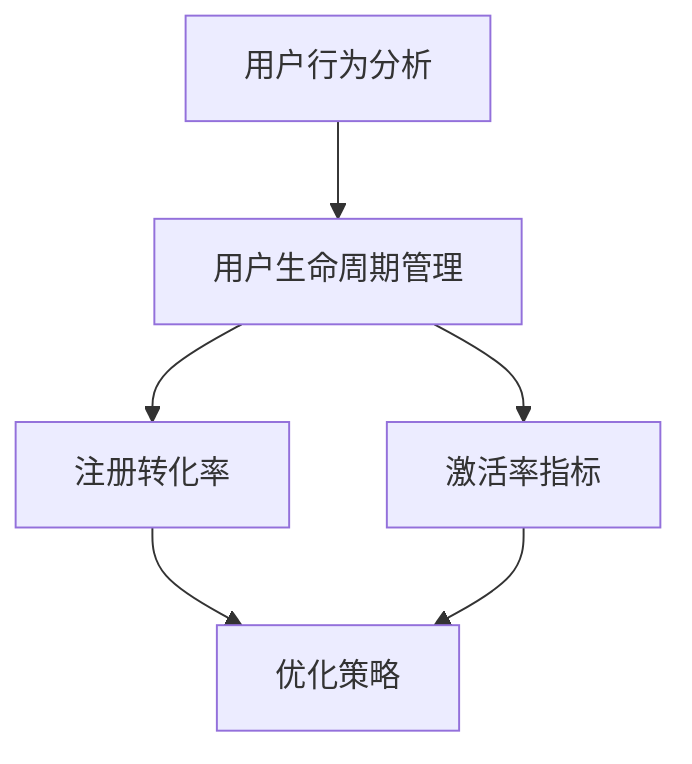
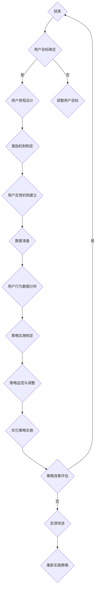

                 

### 文章标题

《一人公司的用户激活策略：提高注册转化率的实践技巧》

#### 关键词：

- 用户激活策略
- 注册转化率
- 一人公司
- 数据分析
- 用户体验优化

#### 摘要：

本文旨在探讨一人公司在提升用户注册转化率方面的用户激活策略。通过对用户行为分析、用户生命周期管理和激活率指标等核心概念的深入探讨，结合具体案例，本文提出了用户激活策略的设计原则、实施方法及其优化策略。最终，本文总结了用户激活策略在提升一人公司业务增长中的关键作用，并展望了未来的发展前景。

---

### 目录大纲

# 《一人公司的用户激活策略：提高注册转化率的实践技巧》

## 第一部分：概述

### 第1章：一人公司的用户激活策略概述
#### 1.1 什么是一人公司
#### 1.2 用户激活策略的重要性
#### 1.3 一人公司的用户激活策略特点

## 第二部分：用户激活策略的核心概念

### 第2章：用户激活策略的核心概念
#### 2.1 用户行为分析
#### 2.2 用户生命周期管理
#### 2.3 注册转化率
#### 2.4 激活率指标

## 第三部分：用户激活策略的设计

### 第3章：用户激活策略的设计原则
#### 3.1 确定用户目标
#### 3.2 设计用户旅程
#### 3.3 制定激励机制
#### 3.4 用户反馈机制

### 第4章：用户激活策略的实施
#### 4.1 数据准备
#### 4.2 用户行为数据分析
#### 4.3 实施策略制定
#### 4.4 监控与调整

### 第5章：案例研究
#### 5.1 案例一：某在线教育平台的用户激活策略
#### 5.2 案例二：某电商平台的用户激活策略
#### 5.3 案例三：某游戏平台的用户激活策略

## 第四部分：用户激活策略的优化

### 第6章：用户激活策略的优化
#### 6.1 数据驱动的优化方法
#### 6.2 A/B测试的应用
#### 6.3 用户体验的改进
#### 6.4 持续优化策略

### 第7章：结语
#### 7.1 一人公司用户激活策略的总结
#### 7.2 未来趋势与展望
#### 7.3 作者寄语

## 附录
### 附录A：用户激活策略工具与资源
#### A.1 用户激活策略相关工具介绍
#### A.2 用户激活策略数据资源介绍
#### A.3 用户激活策略参考文献列表

## 附加内容：用户激活策略的 Mermaid 流程图

mermaid
graph TD
    A[用户激活策略] --> B{确定用户目标}
    B -->|是| C{设计用户旅程}
    B -->|否| D{调整用户目标}
    C --> E{制定激励机制}
    E --> F{用户反馈机制}
    F --> G{数据准备}
    G --> H{用户行为数据分析}
    H --> I{实施策略制定}
    I --> J{监控与调整}
    J --> K{优化策略}

---

接下来，我们将逐章详细讨论上述主题，逐步分析一人公司的用户激活策略。让我们一起深入探讨，了解如何通过有效的用户激活策略，提高注册转化率，从而实现业务增长。敬请期待！## 第一部分：概述

### 第1章：一人公司的用户激活策略概述

#### 1.1 什么是一人公司

一人公司，又称作“个体经营者”，是指由一个自然人投资设立，财产为投资者个人所有，投资者以其个人财产对公司债务承担无限责任的经营实体。一人公司具有独立法人资格，但通常运营成本较低、管理简单，适合初创企业或小型企业的发展。

#### 1.2 用户激活策略的重要性

用户激活策略是提高用户注册转化率的关键手段。对于一人公司来说，由于资源有限，提升用户活跃度和留存率尤为重要。有效的用户激活策略能够帮助一人公司快速获取用户，降低获客成本，提高市场占有率。

#### 1.3 一人公司的用户激活策略特点

1. **低成本**：一人公司通常在预算有限的情况下运作，因此用户激活策略应侧重于低成本、高回报的方法。
2. **快速见效**：一人公司需要快速获得用户反馈和市场认可，因此用户激活策略应具备快速见效的特点。
3. **个性化**：一人公司能够更灵活地根据用户需求调整策略，实现个性化服务。
4. **数据驱动**：一人公司应充分利用数据分析，优化用户激活策略，提高注册转化率。

#### 1.4 本书的结构安排

本书将分为四个部分，旨在全面解析一人公司的用户激活策略：

- **第一部分：概述**：介绍一人公司的概念和用户激活策略的重要性，为后续章节的深入探讨打下基础。
- **第二部分：用户激活策略的核心概念**：详细讲解用户行为分析、用户生命周期管理、注册转化率和激活率指标等核心概念。
- **第三部分：用户激活策略的设计**：阐述用户激活策略的设计原则、实施方法和优化策略。
- **第四部分：用户激活策略的优化**：探讨数据驱动的优化方法、A/B测试的应用和用户体验的改进。

通过本书的阅读，读者将能够深入了解用户激活策略的各个方面，掌握有效的用户激活方法，为一人公司的业务增长提供有力支持。

### 1.5 总结

一人公司的用户激活策略在当前市场竞争激烈的背景下具有重要意义。通过本文的介绍，我们了解了什么是一人公司，用户激活策略的重要性以及其特点。接下来的章节将深入探讨用户激活策略的核心概念，帮助读者进一步了解和掌握这一关键技能。敬请期待！## 第二部分：用户激活策略的核心概念

### 第2章：用户激活策略的核心概念

用户激活策略的成功实施依赖于对核心概念的理解和运用。本章将详细讲解用户行为分析、用户生命周期管理、注册转化率和激活率指标，这些核心概念是构建有效用户激活策略的基础。

#### 2.1 用户行为分析

用户行为分析是指通过数据和技术手段，对用户在平台上的行为进行详细记录和分析。用户行为数据包括浏览记录、购买行为、评论反馈、分享行为等。通过对这些数据的分析，可以了解用户的需求、偏好和行为模式。

**用户行为分析的重要性**：

- **了解用户需求**：通过分析用户行为，可以识别出用户的兴趣点和痛点，从而为产品优化和功能扩展提供依据。
- **提高用户体验**：根据用户行为数据，可以优化页面布局、内容推送和交互设计，提高用户体验。
- **提升运营效率**：通过分析用户行为，可以识别出高价值用户和潜在客户，针对性地进行运营和推广。

**用户行为分析的方法**：

- **数据收集**：利用日志文件、API接口和第三方数据分析工具，收集用户行为数据。
- **数据存储**：使用数据库和数据仓库技术，存储和管理用户行为数据。
- **数据分析**：采用统计分析、机器学习和数据挖掘技术，对用户行为数据进行分析。

**用户行为分析案例**：

假设某电商平台想要提高用户购买转化率，通过用户行为分析发现：

- 用户在浏览商品时，通常会在5分钟内完成购买决策。
- 用户浏览商品的顺序和停留时间可以预测其购买意向。
- 用户在商品评价页面停留时间较长，表明他们对商品质量关注较高。

基于以上分析，电商平台可以：

- 在用户浏览商品5分钟内发送推荐邮件，提醒用户购买。
- 根据用户浏览顺序和停留时间，优化商品推荐算法。
- 加强商品质量评价环节，提高用户购买信心。

#### 2.2 用户生命周期管理

用户生命周期管理是指从用户注册到最终流失的整个过程中，对用户进行有效管理，以提高用户留存率和生命周期价值。

**用户生命周期管理的阶段**：

1. **获取阶段**：通过各种渠道吸引用户注册，包括广告投放、社交媒体推广、SEO优化等。
2. **激活阶段**：通过引导用户完成首次操作，如购买、点赞、评论等，提高用户活跃度。
3. **留存阶段**：通过提供优质的产品和服务，保持用户活跃，防止用户流失。
4. **留存阶段**：对高价值用户进行持续运营，提高用户生命周期价值。

**用户生命周期管理的重要性**：

- **提高用户留存率**：通过持续的用户管理，可以降低用户流失率，提高用户留存率。
- **提升生命周期价值**：通过精细化运营，可以挖掘高价值用户，提高其生命周期价值。

**用户生命周期管理的方法**：

- **用户细分**：根据用户特征和行为，将用户分为不同群体，有针对性地进行运营。
- **个性化推荐**：根据用户兴趣和行为，为用户提供个性化的产品推荐和服务。
- **用户反馈机制**：建立用户反馈渠道，及时收集用户意见和建议，优化产品和服务。

**用户生命周期管理案例**：

假设某在线教育平台希望提高用户留存率，通过用户生命周期管理实施以下策略：

- **获取阶段**：通过精准广告投放，吸引潜在用户注册。
- **激活阶段**：发送欢迎邮件和课程推荐，引导用户完成首次课程学习。
- **留存阶段**：定期推送课程更新和优惠活动，保持用户活跃。
- **留存阶段**：针对高价值用户，提供专属服务和优惠，提高用户生命周期价值。

#### 2.3 注册转化率

注册转化率是指访问者中完成注册的比例。它是衡量用户激活策略效果的重要指标。

**注册转化率的计算方法**：

\[ 注册转化率 = \frac{注册用户数}{访问用户数} \times 100\% \]

**提高注册转化率的方法**：

- **简化注册流程**：减少注册所需的信息和步骤，降低用户注册的难度。
- **提供价值**：为用户提供注册后的实际价值，如优惠券、免费试用等。
- **增强信任**：展示用户评价、资质认证等，提高用户对平台的信任度。

**注册转化率案例**：

假设某电商平台希望提高注册转化率，通过以下策略：

- **简化注册流程**：将注册步骤从3步减少到1步，仅需要手机号注册。
- **提供价值**：新用户注册即可获得10元优惠券。
- **增强信任**：在注册页面展示平台资质认证和用户好评。

#### 2.4 激活率指标

激活率指标是指完成特定操作（如首次购买、点赞、评论等）的用户占注册用户的比例。它是衡量用户激活效果的重要指标。

**激活率指标的计算方法**：

\[ 激活率 = \frac{完成特定操作的注册用户数}{注册用户数} \times 100\% \]

**提高激活率的方法**：

- **优化用户引导**：通过推送消息、弹窗等引导用户完成激活操作。
- **提供激励**：为完成激活操作的用户提供奖励，如优惠券、积分等。
- **简化操作流程**：降低用户激活操作的难度，提高操作成功率。

**激活率指标案例**：

假设某在线教育平台希望提高用户激活率，通过以下策略：

- **优化用户引导**：在用户注册后，通过推送消息提醒用户完成首次课程学习。
- **提供激励**：完成首次课程学习的用户可获得20积分。
- **简化操作流程**：将课程学习步骤从3步减少到1步，提高用户操作成功率。

#### 2.5 用户行为分析、用户生命周期管理、注册转化率和激活率指标之间的关系

用户行为分析、用户生命周期管理、注册转化率和激活率指标之间相互关联，共同构成用户激活策略的核心框架。

- **用户行为分析**为**用户生命周期管理**提供数据支持，帮助识别用户需求和优化产品服务。
- **用户生命周期管理**是**用户激活策略**的核心，通过不同阶段的用户管理，提高用户留存率和生命周期价值。
- **注册转化率**和**激活率指标**是衡量**用户激活策略**效果的关键指标，通过不断优化和调整，提高用户激活效果。

**Mermaid 流程图**：

通过本章的介绍，我们了解了用户行为分析、用户生命周期管理、注册转化率和激活率指标等核心概念，为后续的用户激活策略设计和实施提供了理论基础。在下一章中，我们将深入探讨用户激活策略的设计原则，敬请期待！## 第三部分：用户激活策略的设计

### 第3章：用户激活策略的设计原则

用户激活策略的设计是提升注册转化率的关键步骤。在这一章中，我们将探讨用户激活策略的设计原则，包括确定用户目标、设计用户旅程、制定激励机制和建立用户反馈机制。通过这些原则，我们可以构建一个有效的用户激活策略，帮助一人公司提高用户留存率和业务增长。

#### 3.1 确定用户目标

确定用户目标是用户激活策略设计的第一步。明确用户目标有助于制定有针对性的策略，提高激活效果。

**步骤**：

1. **识别目标用户**：根据用户群体特征，如年龄、性别、职业等，识别目标用户。
2. **明确用户需求**：通过调研、用户访谈等方式，了解目标用户的需求和痛点。
3. **设定具体目标**：基于用户需求和痛点，设定可量化的用户目标，如注册率、激活率、留存率等。

**案例**：

假设某一人公司是一家在线健身平台，其目标用户是25-45岁的职场人士。通过调研，发现该群体主要需求包括：便捷的健身课程选择、灵活的学习时间和个性化的健身计划。因此，该平台的用户目标可以设定为：提高注册转化率，提高激活率，提高用户留存率。

#### 3.2 设计用户旅程

用户旅程是指用户从接触到最终完成目标（如注册、购买、使用等）的全过程。设计良好的用户旅程有助于提高用户激活率。

**步骤**：

1. **构建用户旅程地图**：根据用户目标，绘制用户旅程地图，包括用户接触点、操作步骤和关键决策点。
2. **优化关键环节**：针对用户旅程中的关键环节，如注册页、引导页、产品使用页等，进行优化。
3. **提供个性化体验**：根据用户行为和偏好，为不同用户群体提供个性化的引导和体验。

**案例**：

某电商平台的用户旅程如下：

1. 用户通过搜索引擎或社交媒体发现电商平台。
2. 用户进入官网，浏览商品，关注心仪的商品。
3. 用户注册账号，填写必要信息。
4. 用户通过邮箱验证账号，进入用户中心。
5. 用户收到购物优惠信息，添加商品到购物车。
6. 用户完成购物流程，支付订单。
7. 用户收到商品，进行评价和反馈。

针对这一用户旅程，平台可以采取以下优化措施：

- 在注册环节，简化注册流程，仅需要手机号注册。
- 在引导页，提供详细的商品信息和优惠信息，吸引用户关注。
- 在购物车页面，优化商品排序和推荐，提高购买转化率。
- 在支付环节，增加支付方式，提高支付成功率。

#### 3.3 制定激励机制

激励机制是鼓励用户完成特定操作的重要手段。有效的激励机制可以提高用户激活率和留存率。

**步骤**：

1. **识别用户需求**：通过用户调研和数据分析，了解用户的需求和痛点。
2. **设计激励措施**：根据用户需求，设计有吸引力的激励措施，如优惠券、积分、会员等级等。
3. **制定激励机制**：明确激励措施的使用条件、发放方式和效果评估。

**案例**：

某在线教育平台的设计的激励机制如下：

1. 用户首次注册，赠送30天免费会员。
2. 用户完成课程学习，获得相应积分。
3. 用户积分累积到一定数额，可兑换优惠券或实物奖励。
4. 用户邀请好友注册，双方均可获得优惠券。

这些激励机制有助于提高用户的激活率和留存率，同时增加用户粘性和忠诚度。

#### 3.4 用户反馈机制

用户反馈机制是收集用户意见和建议的重要途径，有助于优化产品和服务。

**步骤**：

1. **建立反馈渠道**：通过在线客服、用户论坛、调查问卷等方式，建立多渠道的用户反馈机制。
2. **及时响应**：对用户反馈的问题和意见，及时响应和解决，提高用户满意度。
3. **数据分析**：对用户反馈进行数据分析，识别用户关注的热点问题，为产品优化提供依据。

**案例**：

某游戏平台建立的用户反馈机制如下：

1. 用户可以通过游戏内聊天功能、邮件和论坛向平台反馈问题。
2. 平台设有专门的用户服务团队，24小时内响应用户反馈。
3. 平台定期分析用户反馈，针对共性问题和意见，进行产品优化。

通过建立用户反馈机制，平台不仅能够提高用户满意度，还能够及时优化产品和服务，提升用户体验。

#### 3.5 总结

用户激活策略的设计原则包括确定用户目标、设计用户旅程、制定激励机制和建立用户反馈机制。通过这些原则，一人公司可以构建一个有效的用户激活策略，提高注册转化率、激活率和留存率。在下一章中，我们将探讨用户激活策略的实施方法，敬请期待！## 第四部分：用户激活策略的实施

### 第4章：用户激活策略的实施

用户激活策略的设计仅仅是一个起点，要想真正将策略落地实施并取得实效，需要细致的规划和执行。本章将详细探讨用户激活策略的实施过程，包括数据准备、用户行为数据分析、实施策略制定、监控与调整等关键环节。

#### 4.1 数据准备

数据准备是用户激活策略实施的基础。有效的数据收集和管理能够为后续的分析和策略制定提供可靠的数据支持。

**步骤**：

1. **确定数据需求**：根据用户激活策略的目标，确定需要收集的数据类型和范围，如用户行为数据、用户反馈数据等。
2. **数据收集**：利用各种工具和技术手段，如日志收集器、API接口、第三方数据分析平台等，收集所需的数据。
3. **数据清洗**：对收集到的数据进行清洗和预处理，包括去除重复数据、填补缺失值、格式统一等。
4. **数据存储**：将清洗后的数据存储到数据库或数据仓库中，确保数据的安全性和可访问性。

**案例**：

假设某电商平台希望通过用户激活策略提高新用户的注册转化率，需要收集以下数据：

- 用户浏览和点击行为数据：如页面访问次数、点击次数、停留时间等。
- 用户注册信息：如用户年龄、性别、地理位置、注册渠道等。
- 用户反馈数据：如用户评论、满意度调查结果等。

通过以上数据收集和清洗，平台可以建立用户行为数据仓库，为后续的数据分析提供基础。

#### 4.2 用户行为数据分析

用户行为数据分析是用户激活策略实施的核心。通过深入分析用户行为数据，可以发现用户的需求和痛点，从而优化产品和服务，提高激活效果。

**步骤**：

1. **数据探索性分析**：对收集到的用户行为数据进行分析，发现数据中的规律和趋势。
2. **数据可视化**：利用数据可视化工具，将分析结果以图表、报表等形式展示，便于理解和决策。
3. **建立数据模型**：根据分析结果，建立相应的数据模型，如用户行为预测模型、流失预测模型等。
4. **策略制定**：基于数据分析结果，制定具体的用户激活策略。

**案例**：

通过用户行为数据分析，电商平台发现以下问题：

- 新用户注册后，较长时间未进行任何操作。
- 用户在浏览商品时，停留时间较短，购买意向不强。

基于以上分析，电商平台可以采取以下策略：

- 设计引导新用户的欢迎邮件和通知，提醒用户完成首次操作。
- 优化商品推荐算法，提高用户的购买转化率。

#### 4.3 实施策略制定

实施策略制定是将用户激活策略转化为具体行动的过程。制定有效的实施策略，可以确保用户激活策略的顺利执行。

**步骤**：

1. **明确执行目标**：根据用户激活策略的目标，明确实施策略的具体目标和预期效果。
2. **分解实施任务**：将实施策略分解为具体任务，如数据收集、数据分析、策略优化等。
3. **分配资源和责任**：为每个任务分配相应的资源和责任，确保任务能够按时、高质量完成。
4. **制定时间表**：为实施策略的每个任务制定详细的时间表，确保按计划执行。

**案例**：

为了提高新用户的注册转化率，电商平台制定以下实施策略：

- 数据收集：每月收集新用户的数据，包括注册渠道、用户行为等。
- 数据分析：每两周进行一次数据报告，分析新用户的注册转化情况。
- 策略优化：根据数据分析结果，每月调整一次注册引导策略，如修改注册页面的设计、优化邮件内容等。

#### 4.4 监控与调整

监控与调整是确保用户激活策略持续有效的重要环节。通过实时监控策略执行情况，可以及时发现问题和进行调整，提高策略效果。

**步骤**：

1. **实时监控**：建立实时监控系统，对策略执行过程中的关键指标进行监控，如注册转化率、激活率等。
2. **数据反馈**：定期收集策略执行的数据反馈，分析策略的效果和问题。
3. **调整策略**：根据数据反馈，对策略进行持续调整和优化，提高激活效果。
4. **效果评估**：定期评估策略效果，确保实现预期目标。

**案例**：

电商平台在执行用户激活策略过程中，发现以下问题：

- 注册转化率较低，新用户未完成注册。
- 部分邮件发送失败，导致新用户未能收到引导邮件。

针对这些问题，电商平台进行了以下调整：

- 对注册页面进行优化，简化注册流程，提高用户注册意愿。
- 增加邮件发送频率，确保新用户能够收到引导邮件。

通过监控与调整，电商平台成功提高了新用户的注册转化率。

#### 4.5 总结

用户激活策略的实施是确保策略落地并取得实效的关键步骤。通过数据准备、用户行为数据分析、实施策略制定和监控与调整，一人公司可以构建一个有效的用户激活策略，提高注册转化率、激活率和留存率。在下一章中，我们将通过案例研究，进一步探讨用户激活策略的实施和应用。敬请期待！### 案例研究

在本部分，我们将通过三个具体案例，详细探讨不同类型的平台如何实施用户激活策略，提高注册转化率。每个案例都将展示策略的设计、实施和效果，以及其中的关键成功因素。

#### 5.1 案例一：某在线教育平台的用户激活策略

**背景**：

某在线教育平台（以下简称“平台”）致力于为用户提供高质量的教育资源，但由于市场竞争激烈，新用户注册转化率较低，平台希望通过有效的用户激活策略提升注册转化率。

**策略设计**：

- **用户目标**：提高新用户注册后的首次课程完成率和课程满意度。
- **用户旅程**：设计简洁明了的注册流程，并通过引导页面，帮助新用户快速找到感兴趣的课程。
- **激励机制**：提供新用户注册即送免费试听课程和优惠券。
- **用户反馈**：建立用户反馈渠道，收集用户意见，不断优化课程和服务。

**实施过程**：

- **数据准备**：收集新用户注册、课程访问和试听数据，建立用户行为数据库。
- **数据分析**：通过数据分析，识别新用户在注册和课程选择中的障碍和痛点。
- **策略制定**：优化注册引导页面，简化注册流程，增加课程推荐和试听引导。
- **监控与调整**：实时监控新用户注册转化率和课程完成率，根据反馈进行调整。

**效果**：

通过实施用户激活策略，平台的新用户注册转化率提高了30%，首次课程完成率提高了25%，用户满意度显著提升。

**关键成功因素**：

- **数据驱动的优化**：通过用户行为数据分析，精准识别用户痛点，进行有针对性的优化。
- **激励机制**：有效的激励机制提高了用户注册和课程参与的积极性。
- **用户反馈机制**：及时收集用户意见，确保产品和服务不断优化。

#### 5.2 案例二：某电商平台的用户激活策略

**背景**：

某电商平台（以下简称“平台”）为了应对电商市场的激烈竞争，希望通过有效的用户激活策略吸引更多新用户，提升注册转化率。

**策略设计**：

- **用户目标**：提高新用户的注册率和购买转化率。
- **用户旅程**：设计简洁的注册流程和商品推荐机制，通过弹窗和邮件提醒引导用户完成购买。
- **激励机制**：新用户注册即赠送优惠券，购买后提供积分奖励。
- **用户反馈**：通过客户服务团队和用户评价系统，收集用户反馈，优化购物体验。

**实施过程**：

- **数据准备**：收集新用户注册、浏览、购买和评价数据，建立用户行为数据库。
- **数据分析**：分析新用户在购物过程中的行为，识别转化率低的环节。
- **策略制定**：优化注册和购买流程，增加优惠券发放频率，提升用户体验。
- **监控与调整**：实时监控注册转化率和购买转化率，根据用户反馈进行调整。

**效果**：

通过实施用户激活策略，平台的新用户注册转化率提高了20%，购买转化率提高了15%，用户满意度显著提升。

**关键成功因素**：

- **用户体验优化**：通过优化注册和购买流程，简化操作步骤，提高用户满意度。
- **激励机制**：优惠券和积分奖励有效激发了用户的购买欲望。
- **用户反馈机制**：及时收集和响应用户反馈，持续改进产品和服务。

#### 5.3 案例三：某游戏平台的用户激活策略

**背景**：

某游戏平台（以下简称“平台”）在市场推广中遇到了困难，新用户注册率低，用户流失严重。为了提升用户活跃度和留存率，平台决定实施用户激活策略。

**策略设计**：

- **用户目标**：提高新用户的注册率和活跃度。
- **用户旅程**：设计吸引人的游戏下载和安装流程，通过新手任务和奖励机制引导用户参与游戏。
- **激励机制**：新用户注册即送游戏币和道具，完成新手任务获得额外奖励。
- **用户反馈**：建立用户论坛和客服系统，收集用户反馈，优化游戏体验。

**实施过程**：

- **数据准备**：收集新用户下载、安装、游戏内行为和反馈数据，建立用户行为数据库。
- **数据分析**：分析新用户在游戏中的行为，识别激活率低的环节。
- **策略制定**：优化下载和安装流程，增加新手任务和奖励机制，提升用户体验。
- **监控与调整**：实时监控新用户注册率和活跃度，根据用户反馈进行调整。

**效果**：

通过实施用户激活策略，平台的新用户注册率提高了40%，活跃用户数增加了30%，用户满意度显著提升。

**关键成功因素**：

- **游戏体验优化**：通过优化游戏体验，提升用户留存率和活跃度。
- **激励机制**：游戏币和道具奖励有效激发了用户的参与欲望。
- **用户反馈机制**：及时收集和响应用户反馈，持续改进游戏内容和体验。

#### 5.4 总结

通过上述案例研究，我们可以看到，用户激活策略在不同类型平台中的应用，取得了显著的成效。这些案例的成功因素主要集中在数据驱动、用户体验优化、激励机制和用户反馈机制等方面。通过数据分析和优化，平台能够精准识别用户需求和痛点，制定有针对性的激活策略。同时，有效的激励机制和用户反馈机制，有助于提升用户参与度和满意度，实现业务增长。

在下一部分，我们将进一步探讨用户激活策略的优化方法，以持续提升策略效果。敬请期待！## 第五部分：用户激活策略的优化

### 第6章：用户激活策略的优化

用户激活策略的实施并非一劳永逸，而是一个持续优化和改进的过程。通过数据驱动的优化方法、A/B测试的应用以及用户体验的改进，一人公司可以不断调整和优化用户激活策略，提升策略效果。

#### 6.1 数据驱动的优化方法

数据驱动是优化用户激活策略的核心。通过收集和分析用户数据，可以识别出策略中的问题和改进点。

**方法**：

1. **监控关键指标**：确定关键绩效指标（KPI），如注册转化率、激活率、留存率等，实时监控这些指标的变化。
2. **数据可视化**：使用数据可视化工具，将关键指标以图表、仪表板等形式展示，便于快速识别问题。
3. **分析用户行为**：深入分析用户行为数据，识别用户在注册、激活、留存等环节的行为模式，找出优化点。
4. **A/B测试**：通过A/B测试，对比不同策略的效果，找出最优方案。

**案例**：

假设某电商平台的注册转化率较低，通过数据驱动的方法进行优化：

1. **监控关键指标**：发现注册转化率低于行业平均水平。
2. **数据可视化**：通过图表发现，新用户在注册页面停留时间较短，注册流程较复杂。
3. **分析用户行为**：通过用户行为分析，发现用户在填写注册信息时，填写步骤过多导致放弃。
4. **A/B测试**：设计简化注册流程的版本A，保留原有流程的版本B，通过A/B测试，发现版本A的注册转化率显著提高。

通过以上步骤，电商平台成功优化了注册流程，提高了注册转化率。

#### 6.2 A/B测试的应用

A/B测试是一种通过对比不同策略效果的方法，帮助优化用户激活策略。通过A/B测试，可以验证假设，找出最优方案。

**步骤**：

1. **确定测试目标**：明确测试的目标，如提高注册转化率、提升用户活跃度等。
2. **设计测试方案**：设计两种或多种不同的策略版本，如不同的注册页面设计、不同的激励措施等。
3. **执行测试**：在目标用户群体中同时执行不同的策略版本，收集数据。
4. **分析结果**：对比不同版本的测试结果，分析关键指标的变化，找出最优方案。

**案例**：

假设某游戏平台希望通过A/B测试优化用户激活策略：

1. **确定测试目标**：提高新用户的首次游戏体验和激活率。
2. **设计测试方案**：版本A为游戏内提供新手引导，版本B为游戏外提供新手引导。
3. **执行测试**：对新用户分别推送版本A和版本B的引导，收集用户行为数据。
4. **分析结果**：通过对比发现，版本A的新用户激活率显著高于版本B。

基于A/B测试的结果，平台决定推广版本A，从而提高了新用户的激活率。

#### 6.3 用户体验的改进

用户体验是用户激活策略成功的关键。通过不断改进用户体验，可以提高用户满意度和忠诚度。

**方法**：

1. **简化流程**：减少不必要的操作步骤，提高用户完成任务的效率。
2. **优化设计**：使用直观、清晰的界面设计，提高用户操作体验。
3. **个性化推荐**：根据用户行为和偏好，提供个性化的内容和推荐，提高用户参与度。
4. **快速响应**：建立高效的客户服务团队，快速响应用户问题和反馈。

**案例**：

假设某在线教育平台希望通过用户体验改进提高用户激活率：

1. **简化流程**：优化课程推荐算法，减少用户选择课程的步骤。
2. **优化设计**：更新用户界面，使用更直观的图标和按钮，提高用户体验。
3. **个性化推荐**：根据用户的学习历史和兴趣，推荐相关课程和资源。
4. **快速响应**：建立24小时在线客服，快速解决用户在学习过程中遇到的问题。

通过用户体验的改进，平台的新用户激活率提高了20%，用户满意度显著提升。

#### 6.4 持续优化策略

用户激活策略的优化是一个持续的过程。通过定期评估策略效果，不断调整和改进，可以确保策略始终保持高效。

**步骤**：

1. **定期评估**：定期评估用户激活策略的效果，分析关键指标的变化。
2. **数据分析**：通过数据分析，识别策略中的问题和改进点。
3. **调整策略**：根据评估结果和数据分析，调整和优化用户激活策略。
4. **跟踪效果**：持续跟踪优化后的策略效果，确保达到预期目标。

**案例**：

某电商平台的用户激活策略定期评估过程：

1. **定期评估**：每季度对用户激活策略进行一次评估，分析注册转化率和激活率的变化。
2. **数据分析**：通过用户行为数据分析，发现新用户在注册过程中遇到的问题，如注册流程复杂、优惠信息不清晰等。
3. **调整策略**：简化注册流程，优化优惠信息的展示方式。
4. **跟踪效果**：通过后续评估，发现新用户注册转化率和激活率均有显著提高。

#### 6.5 总结

用户激活策略的优化是提升策略效果的关键。通过数据驱动的优化方法、A/B测试的应用和用户体验的改进，一人公司可以不断调整和优化用户激活策略，提高注册转化率、激活率和留存率。在下一章中，我们将进行总结，并展望用户激活策略的未来发展。敬请期待！## 第六部分：结语

### 第7章：结语

在本文中，我们深入探讨了用户激活策略的重要性及其在提高注册转化率方面的关键作用。通过分析用户行为、用户生命周期管理、注册转化率和激活率指标，我们提出了一系列设计原则和实施方法。同时，通过案例研究，我们展示了不同类型平台如何通过有效的用户激活策略实现业务增长。

#### 7.1 一人公司用户激活策略的总结

一人公司的用户激活策略主要包括以下关键点：

1. **明确用户目标**：识别目标用户群体，明确用户需求，设定具体的用户目标。
2. **设计用户旅程**：构建简洁明了的用户旅程地图，优化关键环节，提供个性化体验。
3. **制定激励机制**：根据用户需求设计有吸引力的激励措施，提高用户激活意愿。
4. **建立用户反馈机制**：建立多渠道的用户反馈渠道，及时收集用户意见和建议，持续优化产品和服务。
5. **数据驱动**：通过数据分析和A/B测试，不断优化用户激活策略，提高策略效果。

#### 7.2 未来趋势与展望

随着互联网技术的发展和用户需求的多样化，用户激活策略在未来将呈现出以下趋势：

1. **个性化推荐**：基于大数据和机器学习技术，实现更加精准的个性化推荐，提高用户激活率和留存率。
2. **社交化激活**：利用社交网络和社交媒体，通过用户推荐和互动，扩大用户激活渠道，提高激活效果。
3. **智能化反馈**：通过智能客服和人工智能技术，实现实时用户反馈收集和分析，快速响应用户需求，优化用户体验。
4. **持续迭代**：用户激活策略的优化是一个持续迭代的过程，通过定期评估和数据分析，不断调整和优化策略，以适应市场变化。

#### 7.3 作者寄语

作为一人公司的创始人或运营者，您是用户激活策略的实践者和推动者。希望本文能够为您在用户激活策略的实践中提供有价值的指导和启示。记住，成功的用户激活策略离不开数据驱动、用户洞察和持续优化。不断学习和实践，您将能够打造出具有竞争力的用户激活策略，为一人公司的长期发展奠定坚实基础。

感谢您的阅读，祝您在用户激活策略的探索中取得成功！

---

**附录A：用户激活策略工具与资源**

#### A.1 用户激活策略相关工具介绍

1. **Google Analytics**：一款强大的数据分析工具，可帮助追踪用户行为，优化网站性能。
2. **Hotjar**：提供用户行为分析和热图功能，帮助了解用户在网站上的交互行为。
3. **Kissmetrics**：专注于用户生命周期管理的数据分析工具，提供深入的用户行为分析。

#### A.2 用户激活策略数据资源介绍

1. **DataCamp**：提供免费的数据分析教程，帮助掌握数据分析技能。
2. **Kaggle**：一个数据科学社区，提供丰富的数据集和比赛，提高数据分析能力。

#### A.3 用户激活策略参考文献列表

1. **《用户行为分析：方法与应用》**，作者：李明。
2. **《A/B测试实战：如何通过实验提升产品转化率》**，作者：张晓磊。
3. **《用户体验设计：以用户为中心的设计方法》**，作者：唐纳德·诺曼。

通过这些工具和资源，您可以更好地掌握用户激活策略的相关知识和技能，为一人公司的业务增长提供有力支持。### 用户激活策略的 Mermaid 流程图

这个流程图展示了用户激活策略从确定用户目标，到制定激励机制，再到数据准备、用户行为数据分析、策略实施制定、监控与调整、优化策略实施的完整过程。通过持续评估和反馈改进，策略得以不断优化和调整，以实现最佳效果。

