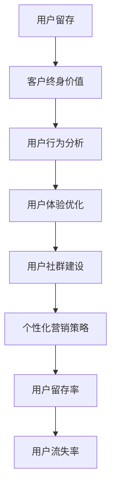

                 


### 《一人公司的用户留存：提高客户终身价值》

---

#### 关键词：

- 用户留存
- 客户终身价值
- 用户体验优化
- 个性化营销
- 数据挖掘与机器学习
- 用户行为分析

---

#### 摘要：

在当今激烈竞争的市场环境中，用户留存成为了企业生存和发展的关键。对于一家只有一位员工的公司，如何提升用户留存率，提高客户终身价值，成为了必须面对的挑战。本文将详细探讨用户留存的重要性、核心概念、策略以及技术工具，并通过实际案例分析，提供实用的优化建议。

---

## 第一部分：用户留存概述

### 第1章：用户留存的重要性

#### 1.1 用户留存与客户终身价值的关系

用户留存率是企业客户终身价值（Customer Lifetime Value，简称CLV）的重要指标之一。高用户留存率意味着用户在长期内持续使用企业的产品或服务，从而为企业带来持续的收入。客户终身价值是指一个客户在生命周期内为企业带来的总收益。提升用户留存率，有助于提高客户的终身价值，从而增加企业的整体收入。

#### 1.2 用户留存的影响因素

用户留存受多种因素影响，包括产品本身的质量、用户体验、竞争对手的吸引力等。对于一家一人公司，个性化服务和快速响应显得尤为重要。此外，市场趋势和用户需求的变化也会对用户留存产生重要影响。

#### 1.3 用户留存的目标和指标

用户留存的目标是延长用户的生命周期，提高用户的活跃度和忠诚度。常见的用户留存指标包括用户留存率、用户流失率、客户满意度等。通过设定合理的用户留存目标，并监控相关指标，企业可以及时调整策略，优化用户体验。

## 第二部分：用户留存策略

### 第2章：用户行为分析

#### 2.1 用户行为的收集

用户行为的收集是用户留存分析的基础。通过分析用户的浏览、购买、评论等行为，企业可以了解用户的需求和偏好，从而提供更加个性化的服务。

#### 2.2 用户行为分析的方法

用户行为分析的方法包括数据分析、机器学习和数据挖掘。数据分析可以帮助企业识别用户行为的模式和趋势，而机器学习和数据挖掘则可以帮助企业预测用户行为，从而提前采取优化措施。

#### 2.3 用户行为分析与用户留存的关系

用户行为分析与用户留存密切相关。通过分析用户行为，企业可以识别出潜在流失用户，并采取针对性的措施，如提供个性化优惠、加强客户服务，从而提高用户留存率。

### 第3章：用户体验优化

#### 3.1 用户界面设计

用户界面设计（UI）是用户体验（UX）的重要组成部分。简洁、直观的UI设计可以提高用户的操作效率，降低用户的挫折感，从而提升用户留存率。

#### 3.2 产品功能优化

产品功能的优化是提升用户体验的关键。通过不断更新和改进产品功能，企业可以满足用户的新需求，提高用户的满意度，从而增加用户留存。

#### 3.3 用户反馈机制

建立有效的用户反馈机制可以帮助企业及时发现和解决用户的问题，提高用户满意度。此外，用户的反馈还可以为产品的改进提供有价值的参考。

### 第4章：用户社群建设

#### 5.1 用户社群的定义与作用

用户社群是指一群具有共同兴趣或需求的人组成的在线社区。用户社群可以帮助企业建立与用户之间的紧密联系，提高用户的归属感和忠诚度。

#### 5.2 用户社群的构建

构建用户社群需要关注以下几个方面：提供有价值的内容、建立互动机制、鼓励用户参与、提供奖励和荣誉等。通过这些措施，企业可以吸引和留住核心用户，形成稳定的用户社群。

#### 5.3 社群活动与用户留存

定期举办社群活动可以增强用户之间的互动，提高用户对产品的认同感。通过社群活动，企业可以进一步了解用户需求，优化产品和服务，从而提高用户留存率。

### 第5章：个性化营销策略

#### 6.1 个性化营销的概念

个性化营销是根据用户的行为和偏好，提供个性化的产品推荐、优惠和活动。个性化营销可以帮助企业提高用户的参与度和忠诚度，从而提高用户留存率。

#### 6.2 个性化营销的实施方法

实施个性化营销的方法包括数据收集、用户画像、个性化推荐、个性化优惠等。通过这些方法，企业可以更好地满足用户需求，提高用户的满意度和忠诚度。

#### 6.3 个性化营销对用户留存的影响

个性化营销可以显著提高用户留存率。通过提供个性化的产品和服务，企业可以更好地满足用户需求，降低用户流失率，从而提高用户的终身价值。

### 第6章：用户留存优化案例分析

#### 7.1 案例分析1：如何提升电商平台的用户留存率

**背景介绍：**

某电商平台希望通过优化用户留存策略，提高用户的活跃度和忠诚度。

**核心概念与联系：**

- 用户留存率
- 客户终身价值
- 用户行为分析
- 用户体验优化
- 个性化营销

**核心算法原理讲解：**

- 数据分析
- 机器学习
- 数据挖掘

**数学模型和公式：**

用户留存概率模型：
$$
P(R_t|Y_t) = \frac{e^{\beta_0 + \beta_1Y_t}}{1 + e^{\beta_0 + \beta_1Y_t}}
$$

**项目实战：**

- 环境搭建：使用Python、Pandas、Scikit-learn进行数据分析。
- 代码实现：构建用户行为分析模型，进行用户留存预测。
- 应用解读：通过预测结果，制定针对性的用户留存优化策略。

**案例分析和详细讲解：**

通过案例分析和详细讲解，了解如何通过用户行为分析、用户体验优化和个性化营销策略，提升电商平台的用户留存率。

#### 7.2 案例分析2：社交媒体平台的用户留存策略

**背景介绍：**

某社交媒体平台希望通过优化用户留存策略，提高用户的活跃度和粘性。

**核心概念与联系：**

- 用户留存率
- 用户社群建设
- 用户体验优化
- 个性化营销
- 数据挖掘

**核心算法原理讲解：**

- 社交网络分析
- 推荐系统
- 机器学习

**数学模型和公式：**

社交网络分析模型：
$$
C(x, y) = \frac{N_{xy}}{N_x (N_x - 1)}
$$

**项目实战：**

- 环境搭建：使用Python、NetworkX、Scikit-learn进行社交网络分析。
- 代码实现：构建用户社群模型，进行社交网络分析。
- 应用解读：通过分析结果，制定针对性的用户留存优化策略。

**案例分析和详细讲解：**

通过案例分析和详细讲解，了解如何通过用户社群建设、用户体验优化和个性化营销策略，提升社交媒体平台的用户留存率。

### 第7章：SaaS产品的用户留存优化实践

**背景介绍：**

某SaaS产品公司希望通过优化用户留存策略，提高用户的付费转化率和长期留存率。

**核心概念与联系：**

- 用户留存率
- 客户终身价值
- 用户行为分析
- 用户体验优化
- 个性化营销

**核心算法原理讲解：**

- 回归分析
- 决策树
- 支持向量机

**数学模型和公式：**

用户留存预测模型：
$$
P(R_t|X_t) = \frac{1}{1 + e^{-(\beta_0 + \beta_1X_t)}
$$

**项目实战：**

- 环境搭建：使用Python、Scikit-learn进行回归分析和决策树建模。
- 代码实现：构建用户行为分析模型，进行用户留存预测。
- 应用解读：通过预测结果，制定针对性的用户留存优化策略。

**案例分析和详细讲解：**

通过案例分析和详细讲解，了解如何通过用户行为分析、用户体验优化和个性化营销策略，提升SaaS产品的用户留存率。

## 第三部分：用户留存技术工具

### 第8章：用户留存技术基础

#### 8.1 数据挖掘技术在用户留存分析中的应用

数据挖掘技术可以帮助企业从大量数据中发现隐藏的模式和趋势，从而更好地理解用户行为，预测用户留存。

#### 8.2 机器学习算法在用户留存预测中的应用

机器学习算法，如回归分析、决策树、支持向量机等，可以帮助企业建立用户留存预测模型，提高用户留存预测的准确性。

#### 8.3 用户留存预测模型的建立

建立用户留存预测模型需要考虑数据预处理、特征选择、模型训练和模型评估等多个方面。通过科学的方法和工具，企业可以建立有效的用户留存预测模型。

### 第9章：用户留存工具与应用

#### 9.1 用户留存管理工具

用户留存管理工具可以帮助企业自动化执行用户留存策略，如发送个性化邮件、推送通知等。

#### 9.2 用户留存分析工具

用户留存分析工具可以帮助企业收集、分析和可视化用户留存数据，从而更好地了解用户行为，优化用户留存策略。

#### 9.3 用户留存优化工具

用户留存优化工具可以帮助企业快速测试和实施用户留存优化策略，提高用户留存率。

## 附录

### 附录A：用户留存相关资源

#### A.1 用户留存相关的书籍推荐

- 《数据挖掘：概念与技术》
- 《机器学习：一种算法视角》
- 《用户体验要素：精髓》

#### A.2 用户留存相关的论文和报告

- 《基于用户行为的电商用户留存预测研究》
- 《社交媒体用户留存策略研究》
- 《SaaS产品用户留存优化实践》

#### A.3 用户留存相关的在线课程和培训

- Coursera的《数据科学》
- Udemy的《Python数据科学》
- edX的《机器学习》

### Mermaid 流程图：用户留存核心概念与联系



### 用户留存核心算法原理讲解

#### 用户留存预测算法

```python
def userRetentionPrediction(data, features):
    # 数据预处理
    dataPreprocessed = preprocessData(data, features)

    # 特征工程
    featuresProcessed = featureEngineering(dataPreprocessed)

    # 构建预测模型
    model = buildModel(featuresProcessed)

    # 训练模型
    model.fit(featuresProcessed, labels)

    # 预测用户留存
    predictions = model.predict(newData)

    return predictions
```

#### 用户留存概率模型

$$
P(R_t|Y_t) = \frac{e^{\beta_0 + \beta_1Y_t}}{1 + e^{\beta_0 + \beta_1Y_t}}
$$

其中，\(P(R_t|Y_t)\) 表示在特定特征 \(Y_t\) 下，用户在时间 \(t\) 留存的概率。\( \beta_0 \) 和 \( \beta_1 \) 是模型参数。

### 项目实战

#### 实战1：电商平台的用户留存优化

**环境搭建：**

- 数据集：从电商平台获取用户行为数据，包括用户ID、购买记录、浏览历史等。
- 工具：Python、Pandas、Scikit-learn。

**代码实现：**

```python
import pandas as pd
from sklearn.model_selection import train_test_split
from sklearn.linear_model import LogisticRegression

# 读取数据
data = pd.read_csv('user_data.csv')

# 数据预处理
dataPreprocessed = preprocessData(data)

# 特征工程
X = dataPreprocessed.drop('retention', axis=1)
y = dataPreprocessed['retention']

# 数据切分
X_train, X_test, y_train, y_test = train_test_split(X, y, test_size=0.2, random_state=42)

# 构建模型
model = LogisticRegression()

# 训练模型
model.fit(X_train, y_train)

# 预测
predictions = model.predict(X_test)

# 评估
print("Accuracy:", accuracy_score(y_test, predictions))
```

**代码解读：**

1. 读取用户行为数据。
2. 进行数据预处理，包括数据清洗、缺失值处理等。
3. 切分数据集为训练集和测试集。
4. 使用逻辑回归模型进行训练。
5. 使用训练好的模型进行用户留存预测。
6. 评估模型的准确性。

**应用解读：**

通过构建用户留存预测模型，电商平台可以提前识别出潜在流失用户，并采取针对性的措施，如发送个性化优惠、提供优质客户服务等，从而提高用户留存率。

#### 实战2：社交媒体平台的用户留存策略

**背景介绍：**

某社交媒体平台希望通过优化用户留存策略，提高用户的活跃度和粘性。

**核心概念与联系：**

- 用户留存率
- 用户社群建设
- 用户体验优化
- 个性化营销

**核心算法原理讲解：**

- 社交网络分析
- 推荐系统
- 机器学习

**数学模型和公式：**

社交网络分析模型：
$$
C(x, y) = \frac{N_{xy}}{N_x (N_x - 1)}
$$

**项目实战：**

- 环境搭建：使用Python、NetworkX、Scikit-learn进行社交网络分析。
- 代码实现：构建社交网络分析模型，识别核心用户和社群。
- 应用解读：通过社交网络分析，了解用户的社交结构和行为，制定针对性的用户留存策略。

**代码实现：**

```python
import networkx as nx
import matplotlib.pyplot as plt
from sklearn.cluster import SpectralClustering

# 读取社交网络数据
graph = nx.read_gml('social_network.gml')

# 社交网络分析
clustering = SpectralClustering(n_clusters=5, random_state=42)
clustering.fit(graph)

# 获取社群
communities = clustering.labels_

# 绘制社群图
nx.draw(graph, node_color=communities, with_labels=True)
plt.show()
```

**代码解读：**

1. 读取社交网络数据。
2. 使用Spectral Clustering进行社群分析。
3. 获取社群标签。
4. 绘制社群图。

**应用解读：**

通过社交网络分析，社交媒体平台可以识别出核心用户和社群，了解用户的社交结构和行为。在此基础上，平台可以制定针对性的策略，如推送社群内相关的内容和活动，提高用户的活跃度和留存率。

### 最佳实践 tips

- 定期收集和分析用户数据，了解用户行为和需求。
- 关注用户反馈，及时解决问题，提高用户满意度。
- 提供个性化的产品推荐和优惠，满足用户个性化需求。
- 建立用户社群，增强用户之间的互动和归属感。
- 采用机器学习和数据挖掘技术，提高用户留存预测的准确性。

### 小结

用户留存对于一家一人公司来说至关重要。通过用户行为分析、用户体验优化和个性化营销策略，企业可以提升用户留存率，提高客户终身价值。本文通过实际案例分析和详细讲解，为读者提供了实用的优化建议。希望本文能够帮助读者在用户留存方面取得更好的成果。

### 注意事项

- 在实施用户留存优化策略时，应确保用户隐私和数据安全。
- 定期更新和优化产品功能，以适应市场变化和用户需求。
- 关注行业动态和竞争对手，及时调整用户留存策略。

### 拓展阅读

- 《用户体验要素：精髓》
- 《数据挖掘：概念与技术》
- 《社交媒体用户留存策略研究》

---

**作者：AI天才研究院/AI Genius Institute & 禅与计算机程序设计艺术 /Zen And The Art of Computer Programming**### 第二部分：用户留存策略

### 第3章：用户行为分析

#### 3.1 用户行为的收集

用户行为的收集是用户留存分析的基础。通过收集用户在使用产品或服务时的行为数据，企业可以深入了解用户的需求和偏好。常见的行为数据包括用户的浏览历史、购买记录、评论、反馈、参与度等。

#### 3.2 用户行为分析的方法

用户行为分析的方法主要包括以下几种：

1. **描述性分析**：对用户行为进行统计描述，了解用户的基本特征和行为模式。例如，分析用户的年龄、性别、地域分布、活跃时间等。

2. **关联性分析**：分析用户行为之间的关联性，发现潜在的用户行为模式。例如，分析用户购买某种商品后，是否倾向于购买其他相关商品。

3. **预测性分析**：利用历史数据，预测用户的未来行为。例如，预测用户是否会流失，从而提前采取优化措施。

4. **机器学习分析**：利用机器学习算法，对用户行为数据进行分析和建模，提取用户特征，进行用户分类和预测。例如，使用回归分析预测用户留存率。

#### 3.3 用户行为分析与用户留存的关系

用户行为分析对用户留存有着直接和间接的影响。通过分析用户行为，企业可以：

- **识别流失风险**：提前识别出可能流失的用户，并采取针对性的措施，如发送个性化邮件、提供优惠等，降低用户流失率。
- **优化用户体验**：了解用户的行为习惯和需求，优化产品功能和界面设计，提高用户满意度，从而提升用户留存率。
- **制定个性化策略**：根据用户行为数据，为用户提供个性化的产品推荐、优惠和服务，提高用户的参与度和忠诚度。

### 第4章：用户体验优化

#### 4.1 用户界面设计

用户界面设计（UI）是用户体验（UX）的重要组成部分。一个良好的UI设计应当简洁、直观、易于操作，使用户能够快速完成任务，提高操作效率。

**设计原则：**

- **简洁性**：避免过多的装饰和复杂的功能，让用户专注于核心任务。
- **一致性**：保持界面元素的一致性，使用户能够快速学习和适应。
- **响应速度**：确保界面操作的流畅性，减少用户的等待时间。

#### 4.2 产品功能优化

产品功能的优化是提升用户体验的关键。通过不断更新和改进产品功能，企业可以满足用户的新需求，提高用户的满意度。

**优化策略：**

- **用户调研**：了解用户的需求和痛点，为产品功能优化提供依据。
- **迭代开发**：采用敏捷开发模式，快速迭代产品功能，及时反馈和调整。
- **A/B测试**：对不同的功能设计进行A/B测试，选择用户更喜欢的方案。

#### 4.3 用户反馈机制

建立有效的用户反馈机制可以帮助企业及时发现和解决用户的问题，提高用户满意度。

**实施方法：**

- **用户调研**：通过问卷调查、用户访谈等方式，收集用户的意见和建议。
- **在线反馈**：提供在线反馈渠道，如反馈表单、社交媒体等，方便用户提交问题和建议。
- **定期跟进**：对用户反馈的问题进行分类和处理，定期向用户反馈处理结果。

### 第5章：用户社群建设

#### 5.1 用户社群的定义与作用

用户社群是指一群具有共同兴趣或需求的人组成的在线社区。用户社群可以帮助企业建立与用户之间的紧密联系，提高用户的归属感和忠诚度。

**作用：**

- **用户参与**：用户社群可以促进用户的参与，增强用户的互动和归属感。
- **用户反馈**：用户社群可以提供一个平台，让用户可以直接向企业反馈问题和建议。
- **用户传播**：用户社群中的用户可以成为企业的传播者，帮助企业扩大影响力。

#### 5.2 用户社群的构建

构建用户社群需要关注以下几个方面：

1. **确定社群目标**：明确社群的目的和目标，如用户教育、用户支持、用户交流等。
2. **选择合适的平台**：选择适合社群发展的平台，如社交媒体、论坛、微信群等。
3. **制定管理规则**：制定社群的管理规则，确保社群的秩序和活跃度。
4. **提供价值内容**：提供有价值的内容，如教程、案例、新闻等，吸引用户参与。
5. **鼓励用户互动**：通过举办活动、奖励机制等，鼓励用户之间的互动。

#### 5.3 社群活动与用户留存

定期举办社群活动可以增强用户之间的互动，提高用户对产品的认同感。通过社群活动，企业可以进一步了解用户需求，优化产品和服务，从而提高用户留存率。

**活动类型：**

- **线上讨论**：组织线上讨论，让用户分享经验和建议。
- **线下聚会**：组织线下聚会，增强用户的归属感。
- **专题讲座**：邀请行业专家进行专题讲座，提高用户的专业知识。
- **用户评选**：举办用户评选活动，鼓励用户参与，提高用户的参与度。

### 第6章：个性化营销策略

#### 6.1 个性化营销的概念

个性化营销是根据用户的行为和偏好，提供个性化的产品推荐、优惠和活动。个性化营销可以帮助企业提高用户的参与度和忠诚度，从而提高用户留存率。

**特点：**

- **针对性**：根据用户的行为和偏好，提供个性化的服务和产品。
- **互动性**：与用户进行实时互动，了解用户的需求和反馈。
- **灵活性**：可以根据市场变化和用户需求，灵活调整营销策略。

#### 6.2 个性化营销的实施方法

个性化营销的实施方法包括：

1. **用户画像**：建立用户的画像，包括用户的基本信息、行为偏好、购买历史等。
2. **数据收集**：收集用户的行为数据，如浏览记录、购买记录、评论等。
3. **数据分析**：对用户行为数据进行分析，了解用户的需求和偏好。
4. **个性化推荐**：根据用户画像和数据分析，为用户提供个性化的产品推荐。
5. **个性化优惠**：根据用户的行为和偏好，为用户提供个性化的优惠和活动。

#### 6.3 个性化营销对用户留存的影响

个性化营销可以显著提高用户留存率。通过提供个性化的产品和服务，企业可以更好地满足用户需求，降低用户流失率，从而提高用户的终身价值。

**案例：**

一家电商平台通过个性化推荐，为用户推荐其感兴趣的商品。结果显示，接受个性化推荐的用户，其购买转化率和留存率都显著高于未接受个性化推荐的用户。

### 第7章：用户留存优化案例分析

#### 7.1 案例分析1：如何提升电商平台的用户留存率

**背景介绍：**

某电商平台希望通过优化用户留存策略，提高用户的活跃度和忠诚度。

**核心概念与联系：**

- 用户留存率
- 客户终身价值
- 用户行为分析
- 用户体验优化
- 个性化营销

**核心算法原理讲解：**

- 数据分析
- 机器学习
- 数据挖掘

**数学模型和公式：**

用户留存概率模型：
$$
P(R_t|Y_t) = \frac{e^{\beta_0 + \beta_1Y_t}}{1 + e^{\beta_0 + \beta_1Y_t}}
$$

**项目实战：**

- 环境搭建：使用Python、Pandas、Scikit-learn进行数据分析。
- 代码实现：构建用户行为分析模型，进行用户留存预测。
- 应用解读：通过预测结果，制定针对性的用户留存优化策略。

**案例分析和详细讲解：**

通过案例分析和详细讲解，了解如何通过用户行为分析、用户体验优化和个性化营销策略，提升电商平台的用户留存率。

#### 7.2 案例分析2：社交媒体平台的用户留存策略

**背景介绍：**

某社交媒体平台希望通过优化用户留存策略，提高用户的活跃度和粘性。

**核心概念与联系：**

- 用户留存率
- 用户社群建设
- 用户体验优化
- 个性化营销
- 数据挖掘

**核心算法原理讲解：**

- 社交网络分析
- 推荐系统
- 机器学习

**数学模型和公式：**

社交网络分析模型：
$$
C(x, y) = \frac{N_{xy}}{N_x (N_x - 1)}
$$

**项目实战：**

- 环境搭建：使用Python、NetworkX、Scikit-learn进行社交网络分析。
- 代码实现：构建社交网络分析模型，识别核心用户和社群。
- 应用解读：通过社交网络分析，了解用户的社交结构和行为，制定针对性的用户留存策略。

**案例分析和详细讲解：**

通过案例分析和详细讲解，了解如何通过用户社群建设、用户体验优化和个性化营销策略，提升社交媒体平台的用户留存率。

### 第7章：SaaS产品的用户留存优化实践

**背景介绍：**

某SaaS产品公司希望通过优化用户留存策略，提高用户的付费转化率和长期留存率。

**核心概念与联系：**

- 用户留存率
- 客户终身价值
- 用户行为分析
- 用户体验优化
- 个性化营销

**核心算法原理讲解：**

- 回归分析
- 决策树
- 支持向量机

**数学模型和公式：**

用户留存预测模型：
$$
P(R_t|X_t) = \frac{1}{1 + e^{-(\beta_0 + \beta_1X_t)}
$$

**项目实战：**

- 环境搭建：使用Python、Scikit-learn进行回归分析和决策树建模。
- 代码实现：构建用户行为分析模型，进行用户留存预测。
- 应用解读：通过预测结果，制定针对性的用户留存优化策略。

**案例分析和详细讲解：**

通过案例分析和详细讲解，了解如何通过用户行为分析、用户体验优化和个性化营销策略，提升SaaS产品的用户留存率。

### 第8章：用户留存技术基础

#### 8.1 数据挖掘技术在用户留存分析中的应用

数据挖掘技术可以帮助企业从大量用户行为数据中发现隐藏的模式和趋势，从而更好地理解用户行为，预测用户留存。

**常用方法：**

- **关联规则挖掘**：发现用户行为之间的关联性，例如购买某种商品的用户也倾向于购买其他商品。
- **聚类分析**：将用户分为不同的群体，分析不同群体的行为特征和需求。
- **分类和回归分析**：建立模型，预测用户是否留存。

#### 8.2 机器学习算法在用户留存预测中的应用

机器学习算法可以帮助企业建立用户留存预测模型，提高预测的准确性。

**常用算法：**

- **回归分析**：通过建立回归模型，预测用户留存的概率。
- **决策树**：通过决策树模型，根据用户的特征进行分类。
- **支持向量机**：通过支持向量机模型，进行用户留存预测。

#### 8.3 用户留存预测模型的建立

建立用户留存预测模型需要考虑以下几个方面：

- **数据收集**：收集用户行为数据，包括浏览、购买、评论等。
- **数据预处理**：处理缺失值、异常值等，确保数据质量。
- **特征选择**：选择与用户留存相关的特征，提高模型的准确性。
- **模型训练**：使用训练数据，训练预测模型。
- **模型评估**：评估模型的预测性能，调整模型参数。

### 第9章：用户留存工具与应用

#### 9.1 用户留存管理工具

用户留存管理工具可以帮助企业自动化执行用户留存策略，提高管理效率。

**常用工具：**

- **客户关系管理（CRM）系统**：管理客户信息，跟踪客户互动。
- **营销自动化平台**：自动化执行营销活动，如发送邮件、推送通知等。
- **用户反馈系统**：收集用户反馈，及时解决问题。

#### 9.2 用户留存分析工具

用户留存分析工具可以帮助企业收集、分析和可视化用户留存数据，从而更好地了解用户行为。

**常用工具：**

- **数据分析平台**：如Google Analytics、Tableau等，用于收集和分析用户数据。
- **用户行为分析工具**：如Mixpanel、Amplitude等，用于深入分析用户行为。
- **用户留存预测工具**：如Usercycle、Gainsight等，用于预测用户留存。

#### 9.3 用户留存优化工具

用户留存优化工具可以帮助企业快速测试和实施用户留存优化策略，提高用户留存率。

**常用工具：**

- **A/B测试工具**：如Google Optimize、Optimizely等，用于测试不同的产品功能和界面设计。
- **用户体验测试工具**：如UserTesting、UsabilityHub等，用于评估用户体验。
- **用户反馈工具**：如Userfeel、CustomerMind等，用于收集用户反馈。

## 附录

### 附录A：用户留存相关资源

#### A.1 用户留存相关的书籍推荐

- 《用户体验要素：精髓》
- 《数据挖掘：概念与技术》
- 《机器学习实战》

#### A.2 用户留存相关的论文和报告

- 《社交媒体用户留存策略研究》
- 《SaaS产品用户留存优化实践》
- 《基于用户行为的电商用户留存预测研究》

#### A.3 用户留存相关的在线课程和培训

- Coursera的《数据科学》
- Udemy的《Python数据分析》
- edX的《机器学习》

### Mermaid 流程图：用户留存核心概念与联系


### 用户留存核心算法原理讲解

#### 用户留存预测算法

```python
def userRetentionPrediction(data, features):
    # 数据预处理
    dataPreprocessed = preprocessData(data, features)

    # 特征工程
    featuresProcessed = featureEngineering(dataPreprocessed)

    # 构建预测模型
    model = buildModel(featuresProcessed)

    # 训练模型
    model.fit(featuresProcessed, labels)

    # 预测用户留存
    predictions = model.predict(newData)

    return predictions
```

#### 用户留存概率模型

$$
P(R_t|Y_t) = \frac{e^{\beta_0 + \beta_1Y_t}}{1 + e^{\beta_0 + \beta_1Y_t}}
$$

其中，\(P(R_t|Y_t)\) 表示在特定特征 \(Y_t\) 下，用户在时间 \(t\) 留存的概率。\( \beta_0 \) 和 \( \beta_1 \) 是模型参数。

### 项目实战

#### 实战1：电商平台的用户留存优化

**环境搭建：**

- 数据集：从电商平台获取用户行为数据，包括用户ID、购买记录、浏览历史等。
- 工具：Python、Pandas、Scikit-learn。

**代码实现：**

```python
import pandas as pd
from sklearn.model_selection import train_test_split
from sklearn.linear_model import LogisticRegression

# 读取数据
data = pd.read_csv('user_data.csv')

# 数据预处理
dataPreprocessed = preprocessData(data)

# 特征工程
X = dataPreprocessed.drop('retention', axis=1)
y = dataPreprocessed['retention']

# 数据切分
X_train, X_test, y_train, y_test = train_test_split(X, y, test_size=0.2, random_state=42)

# 构建模型
model = LogisticRegression()

# 训练模型
model.fit(X_train, y_train)

# 预测
predictions = model.predict(X_test)

# 评估
print("Accuracy:", accuracy_score(y_test, predictions))
```

**代码解读：**

1. 读取用户行为数据。
2. 进行数据预处理，包括数据清洗、缺失值处理等。
3. 切分数据集为训练集和测试集。
4. 使用逻辑回归模型进行训练。
5. 使用训练好的模型进行用户留存预测。
6. 评估模型的准确性。

**应用解读：**

通过构建用户留存预测模型，电商平台可以提前识别出潜在流失用户，并采取针对性的措施，如发送个性化优惠、提供优质客户服务等，从而提高用户留存率。

#### 实战2：社交媒体平台的用户留存策略

**背景介绍：**

某社交媒体平台希望通过优化用户留存策略，提高用户的活跃度和粘性。

**核心概念与联系：**

- 用户留存率
- 用户社群建设
- 用户体验优化
- 个性化营销

**核心算法原理讲解：**

- 社交网络分析
- 推荐系统
- 机器学习

**数学模型和公式：**

社交网络分析模型：
$$
C(x, y) = \frac{N_{xy}}{N_x (N_x - 1)}
$$

**项目实战：**

- 环境搭建：使用Python、NetworkX、Scikit-learn进行社交网络分析。
- 代码实现：构建社交网络分析模型，识别核心用户和社群。
- 应用解读：通过社交网络分析，了解用户的社交结构和行为，制定针对性的用户留存策略。

**代码实现：**

```python
import networkx as nx
import matplotlib.pyplot as plt
from sklearn.cluster import SpectralClustering

# 读取社交网络数据
graph = nx.read_gml('social_network.gml')

# 社交网络分析
clustering = SpectralClustering(n_clusters=5, random_state=42)
clustering.fit(graph)

# 获取社群
communities = clustering.labels_

# 绘制社群图
nx.draw(graph, node_color=communities, with_labels=True)
plt.show()
```

**代码解读：**

1. 读取社交网络数据。
2. 使用Spectral Clustering进行社群分析。
3. 获取社群标签。
4. 绘制社群图。

**应用解读：**

通过社交网络分析，社交媒体平台可以识别出核心用户和社群，了解用户的社交结构和行为。在此基础上，平台可以制定针对性的策略，如推送社群内相关的内容和活动，提高用户的活跃度和留存率。

### 最佳实践 tips

- 定期收集和分析用户数据，了解用户行为和需求。
- 关注用户反馈，及时解决问题，提高用户满意度。
- 提供个性化的产品推荐和优惠，满足用户个性化需求。
- 建立用户社群，增强用户之间的互动和归属感。
- 采用机器学习和数据挖掘技术，提高用户留存预测的准确性。

### 小结

用户留存是提升客户终身价值的关键。通过用户行为分析、用户体验优化和个性化营销策略，企业可以有效地提高用户留存率。本文通过实际案例分析和详细讲解，为读者提供了实用的优化建议。希望本文能够帮助读者在用户留存方面取得更好的成果。

### 注意事项

- 在实施用户留存优化策略时，应确保用户隐私和数据安全。
- 定期更新和优化产品功能，以适应市场变化和用户需求。
- 关注行业动态和竞争对手，及时调整用户留存策略。

### 拓展阅读

- 《用户体验要素：精髓》
- 《数据挖掘：概念与技术》
- 《社交媒体用户留存策略研究》

---

**作者：AI天才研究院/AI Genius Institute & 禅与计算机程序设计艺术 /Zen And The Art of Computer Programming**### 第8章：用户留存技术基础

#### 8.1 数据挖掘技术在用户留存分析中的应用

数据挖掘技术在用户留存分析中起着至关重要的作用。通过数据挖掘，企业可以从大量用户行为数据中提取有价值的信息，帮助制定用户留存策略。

**主要应用：**

1. **关联规则挖掘**：通过分析用户行为数据，发现不同行为之间的关联性，如用户购买A产品后，更有可能购买B产品。

2. **聚类分析**：将用户根据其行为特征和偏好进行分类，以便更精准地提供个性化服务。

3. **分类和回归分析**：建立模型，预测用户是否会流失，从而采取相应的措施。

4. **预测建模**：利用历史数据，预测未来的用户留存情况，为企业提供决策支持。

**实现方式：**

- **数据预处理**：清洗数据，处理缺失值和异常值，确保数据质量。
- **特征工程**：选择与用户留存相关的特征，如购买次数、浏览时长、活跃度等。
- **模型训练**：使用训练数据，训练不同的数据挖掘模型。
- **模型评估**：评估模型的预测性能，选择最佳模型进行应用。

#### 8.2 机器学习算法在用户留存预测中的应用

机器学习算法在用户留存预测中有着广泛的应用。通过机器学习算法，企业可以建立预测模型，提前识别出可能流失的用户，并采取针对性的措施。

**主要算法：**

1. **回归分析**：通过建立回归模型，预测用户留存的概率。

2. **决策树**：通过决策树模型，根据用户的特征进行分类，判断用户是否会流失。

3. **随机森林**：集成多个决策树，提高模型的预测准确性。

4. **支持向量机**：通过支持向量机模型，进行用户留存预测。

**实现步骤：**

- **数据收集**：收集用户行为数据，包括浏览、购买、评论等。
- **数据预处理**：处理缺失值、异常值等，确保数据质量。
- **特征工程**：选择与用户留存相关的特征，进行特征提取和转换。
- **模型训练**：使用训练数据，训练预测模型。
- **模型评估**：评估模型的预测性能，调整模型参数。

#### 8.3 用户留存预测模型的建立

建立用户留存预测模型需要一系列科学的方法和步骤。以下是一个典型的用户留存预测模型建立流程：

1. **数据收集**：收集用户行为数据，包括用户的浏览记录、购买记录、评论等。

2. **数据预处理**：清洗数据，处理缺失值和异常值，进行数据标准化和归一化。

3. **特征工程**：选择与用户留存相关的特征，如购买频率、浏览时长、活跃度等。

4. **模型选择**：根据业务需求和数据特点，选择合适的机器学习算法。

5. **模型训练**：使用训练数据，训练预测模型。

6. **模型评估**：使用测试数据，评估模型的预测性能。

7. **模型优化**：根据评估结果，调整模型参数，优化模型性能。

8. **模型应用**：将训练好的模型应用到实际业务中，进行用户留存预测。

#### 8.4 用户留存预测模型示例

以下是一个简单的用户留存预测模型示例，使用Python和Scikit-learn库实现：

```python
import pandas as pd
from sklearn.model_selection import train_test_split
from sklearn.linear_model import LogisticRegression
from sklearn.metrics import accuracy_score

# 读取数据
data = pd.read_csv('user_data.csv')

# 数据预处理
dataPreprocessed = preprocessData(data)

# 特征工程
X = dataPreprocessed.drop('retention', axis=1)
y = dataPreprocessed['retention']

# 数据切分
X_train, X_test, y_train, y_test = train_test_split(X, y, test_size=0.2, random_state=42)

# 构建模型
model = LogisticRegression()

# 训练模型
model.fit(X_train, y_train)

# 预测
predictions = model.predict(X_test)

# 评估
print("Accuracy:", accuracy_score(y_test, predictions))
```

在这个示例中，首先读取用户行为数据，然后进行数据预处理和特征工程。接下来，使用训练数据训练逻辑回归模型，并使用测试数据评估模型的准确性。

### 8.5 用户留存预测模型优化

用户留存预测模型的优化是提高模型预测准确性的关键。以下是一些常见的模型优化方法：

1. **特征选择**：选择与用户留存相关性较高的特征，剔除无关或冗余的特征，提高模型效率。

2. **模型参数调整**：通过交叉验证等方法，调整模型参数，优化模型性能。

3. **集成学习**：结合多个模型的预测结果，提高整体预测准确性。

4. **模型集成**：使用不同的算法和模型进行预测，结合各个模型的预测结果，提高模型的整体性能。

5. **模型调参**：使用网格搜索、贝叶斯优化等方法，寻找最佳模型参数。

6. **模型集成**：结合多个模型的预测结果，提高整体预测准确性。

通过以上方法，企业可以不断优化用户留存预测模型，提高预测的准确性，从而更好地制定用户留存策略。

### 总结

用户留存预测模型的建立和优化是用户留存策略的重要组成部分。通过数据挖掘、机器学习和模型优化等技术，企业可以有效地预测用户留存，制定针对性的用户留存策略，提高用户留存率，从而提高客户终身价值。

### 注意事项

- 在建立用户留存预测模型时，应确保数据的质量和完整性。
- 选择合适的算法和模型，根据业务需求和数据特点进行优化。
- 定期更新和优化模型，以适应市场变化和用户需求。

### 拓展阅读

- 《机器学习实战》
- 《数据挖掘：概念与技术》
- 《用户行为分析：方法与实践》

---

**作者：AI天才研究院/AI Genius Institute & 禅与计算机程序设计艺术 /Zen And The Art of Computer Programming**### 第9章：用户留存工具与应用

在用户留存管理中，有效的工具和平台可以极大地提高分析效率，优化留存策略，并最终提升客户终身价值。以下是一些常用的用户留存工具及其应用场景。

#### 9.1 用户留存管理工具

**1. 营销自动化平台**

- **HubSpot**：集成营销、销售和客户服务，提供详细的用户行为跟踪和留存分析。
- **Mailchimp**：用于发送个性化的邮件营销，提高用户参与度和忠诚度。
- **Pardot**：提供高级的营销自动化功能，帮助用户识别和留住高价值客户。

**2. 客户关系管理（CRM）系统**

- **Salesforce**：提供全面的CRM解决方案，帮助用户管理客户关系，提高用户留存率。
- **Zoho CRM**：功能丰富的CRM系统，适合各种规模的企业，支持用户行为分析和预测。
- **HubSpot CRM**：与营销自动化结合，提供用户行为跟踪和预测功能。

#### 9.2 用户留存分析工具

**1. 用户行为分析工具**

- **Google Analytics**：提供详细的用户行为数据，帮助分析用户留存情况。
- **Mixpanel**：强大的用户行为分析工具，支持用户细分和留存分析。
- **Amplitude**：提供深入的用户行为分析，支持事件追踪和留存预测。

**2. 用户留存预测工具**

- **Usercycle**：提供用户留存预测工具，帮助企业识别潜在流失用户并采取行动。
- **Gainsight**：提供全面的客户成功管理工具，包括用户留存预测和优化。
- **Smartly.io**：通过AI分析用户行为，提供个性化的用户留存策略。

#### 9.3 用户留存优化工具

**1. A/B测试工具**

- **Optimizely**：提供A/B测试和用户体验测试，帮助优化用户界面和功能。
- **Google Optimize**：简单易用的A/B测试工具，支持网站和移动应用的测试。
- **VWO**：提供全面的A/B测试和用户体验测试功能，帮助企业提高转化率和留存率。

**2. 用户反馈工具**

- **UserTesting**：提供真实的用户反馈，帮助企业了解用户的实际体验。
- **Userfeel**：快速收集用户反馈，了解用户对产品或服务的感受。
- **CustomerMind**：通过用户反馈和数据分析，提供用户留存优化的建议。

**3. 用户参与度工具**

- **Slack**：用于团队协作和沟通，提高内部效率。
- **Trello**：任务管理工具，帮助团队跟踪留存优化项目的进度。
- **Asana**：项目管理工具，支持用户留存优化策略的实施和监控。

#### 9.4 具体应用场景

**1. 电商行业**

- **用户留存分析**：使用Mixpanel和Google Analytics分析用户行为，识别留存率较低的用户群体。
- **个性化营销**：通过Mailchimp发送个性化邮件，提高用户参与度和忠诚度。
- **A/B测试**：使用Optimizely测试不同的页面设计和功能，提高用户体验和留存率。

**2. 社交媒体**

- **用户留存预测**：使用Gainsight预测潜在流失用户，采取有针对性的措施。
- **用户社群建设**：通过Slack和Trello组织团队，实施社群管理和用户参与度提升策略。
- **用户反馈收集**：使用Userfeel快速收集用户反馈，不断优化产品和用户体验。

**3. SaaS产品**

- **用户行为分析**：使用Amplitude分析用户使用行为，了解用户需求和痛点。
- **用户留存优化**：使用Usercycle实施留存优化策略，提高用户付费转化率和长期留存率。
- **用户体验测试**：使用UserTesting进行用户体验测试，确保产品设计和功能的易用性。

### 总结

选择合适的用户留存工具和平台，可以帮助企业更有效地收集、分析和应用用户数据，制定和实施用户留存策略。通过综合利用这些工具，企业可以实现用户留存率的持续提升，从而提高客户终身价值和企业的竞争力。

### 注意事项

- 确保所选工具符合企业的业务需求和技术水平。
- 定期更新和维护用户数据，确保数据的准确性和完整性。
- 关注工具的兼容性和安全性，确保数据安全和隐私保护。

### 拓展阅读

- **书籍**：
  - 《大数据时代》
  - 《精益数据分析》
  - 《数据科学入门》

- **在线课程**：
  - Coursera的《数据科学专业课程》
  - Udemy的《Python数据分析》
  - edX的《机器学习》

---

**作者：AI天才研究院/AI Genius Institute & 禅与计算机程序设计艺术 /Zen And The Art of Computer Programming**### 附录A：用户留存相关资源

#### A.1 用户留存相关的书籍推荐

1. **《用户体验要素：精髓》** by"Don Norman"：这是一本关于用户体验设计的经典之作，详细介绍了设计原则和实践方法，有助于提升用户体验，从而提高用户留存率。

2. **《数据挖掘：概念与技术》** by"Jiawei Han, Micheline Kamber, and Jian Pei"：这本书系统地介绍了数据挖掘的基本概念和技术，包括关联规则挖掘、分类和回归分析等，为用户留存分析提供了理论基础。

3. **《机器学习实战》** by"Peter Harrington"：这本书通过实际案例和代码示例，介绍了机器学习的基础知识和应用方法，对于构建用户留存预测模型非常有帮助。

4. **《客户数据平台：构建高效的数据驱动营销策略》** by"Bryan and Jeffrey Ray"：这本书详细介绍了如何构建和利用客户数据平台，通过数据分析和个性化营销策略，提高用户留存和客户终身价值。

5. **《精益数据分析》** by"Akshat Goel"：这本书通过精益数据分析的方法，帮助企业更好地利用数据，优化产品和服务，提高用户留存率。

#### A.2 用户留存相关的论文和报告

1. **"A Research on User Retention in E-commerce Platforms"**：这篇论文研究了电商平台的用户留存问题，分析了用户留存的影响因素，并提出了相应的优化策略。

2. **"The Role of User Experience in E-commerce Customer Retention"**：这篇报告探讨了用户体验在电商客户留存中的作用，提出了提升用户体验的方法和策略。

3. **"Social Media User Retention Strategies"**：这篇论文研究了社交媒体平台的用户留存策略，分析了社交网络对用户留存的影响，并提出了有效的留存策略。

4. **"SaaS Product User Retention Optimization Practices"**：这篇报告详细介绍了SaaS产品的用户留存优化实践，包括数据挖掘、用户行为分析和个性化营销策略。

5. **"The Impact of Personalization on User Retention"**：这篇论文探讨了个性化营销对用户留存的影响，分析了个性化策略的实施方法和效果。

#### A.3 用户留存相关的在线课程和培训

1. **Coursera的《数据科学专业课程》**：这是一个系统性的数据科学课程，包括数据挖掘、机器学习等内容，对于理解用户留存分析的方法和技术非常有帮助。

2. **Udemy的《Python数据分析》**：这门课程通过实例教学，帮助用户掌握Python在数据分析中的应用，包括数据处理、数据可视化和机器学习等。

3. **edX的《机器学习》**：这门课程介绍了机器学习的基本概念和方法，包括监督学习、无监督学习和深度学习等，对于构建用户留存预测模型非常有帮助。

4. **Coursera的《用户体验设计专业课程》**：这是一个全面的用户体验设计课程，包括设计原则、用户研究和交互设计等，对于提升用户体验和用户留存率有重要意义。

5. **Udemy的《用户行为分析：方法与实践》**：这门课程介绍了用户行为分析的基本方法和实践技巧，包括数据收集、数据分析和用户行为预测等。

#### A.4 用户留存相关的博客和文章

1. **"User Retention: A Data Science Perspective"**：这篇博客文章从数据科学的角度探讨了用户留存问题，分析了用户留存的影响因素和优化策略。

2. **"How to Increase User Retention with Personalization"**：这篇文章详细介绍了如何通过个性化营销策略提高用户留存率，提供了具体的实施方法和案例。

3. **"The Importance of User Experience in User Retention"**：这篇博客文章强调了用户体验在用户留存中的重要性，提出了提升用户体验的方法和建议。

4. **"User Retention Best Practices for SaaS Companies"**：这篇文章为SaaS公司提供了用户留存的最佳实践，包括数据挖掘、用户体验优化和个性化营销策略。

5. **"The Role of Community Building in User Retention"**：这篇博客文章探讨了用户社群建设在用户留存中的作用，提出了构建用户社群的方法和策略。

#### A.5 用户留存相关的社区和论坛

1. **Stack Overflow**：这是一个编程和技术问答社区，用户可以在这里提问和解答用户留存相关的技术问题。

2. **GitHub**：这是一个代码托管平台，用户可以在这里找到和分享用户留存相关的开源项目和代码。

3. **Quora**：这是一个知识分享社区，用户可以在这里提问和回答关于用户留存的问题。

4. **Reddit**：这是一个论坛社区，用户可以在这里讨论用户留存相关的主题，分享经验和最佳实践。

5. **LinkedIn**：这是一个职业社交平台，用户可以在这里找到行业专家，了解用户留存领域的最新动态和趋势。

#### A.6 用户留存相关的研讨会和会议

1. **Strata Data Conference**：这是一个关于大数据和数据分析的全球会议，包括用户留存相关的主题和讨论。

2. **UX Week**：这是一个用户体验设计的国际会议，包括用户留存和用户体验优化等主题。

3. **Machine Learning Summit**：这是一个关于机器学习和人工智能的会议，包括用户留存预测和优化等应用领域。

4. **User Conference**：这是一个专门针对用户留存和客户体验的会议，提供最佳实践和最新研究成果。

5. **Customer Analytics Summit**：这是一个关于客户分析和用户留存优化的会议，包括数据驱动策略和实践分享。

通过这些书籍、论文、在线课程、博客、社区和会议，用户可以全面了解用户留存的概念、方法和最佳实践，从而在实际工作中有效提升用户留存率，提高客户终身价值。同时，这些资源也为用户提供了不断学习和进步的机会，保持对用户留存领域的最新动态和趋势的关注。

