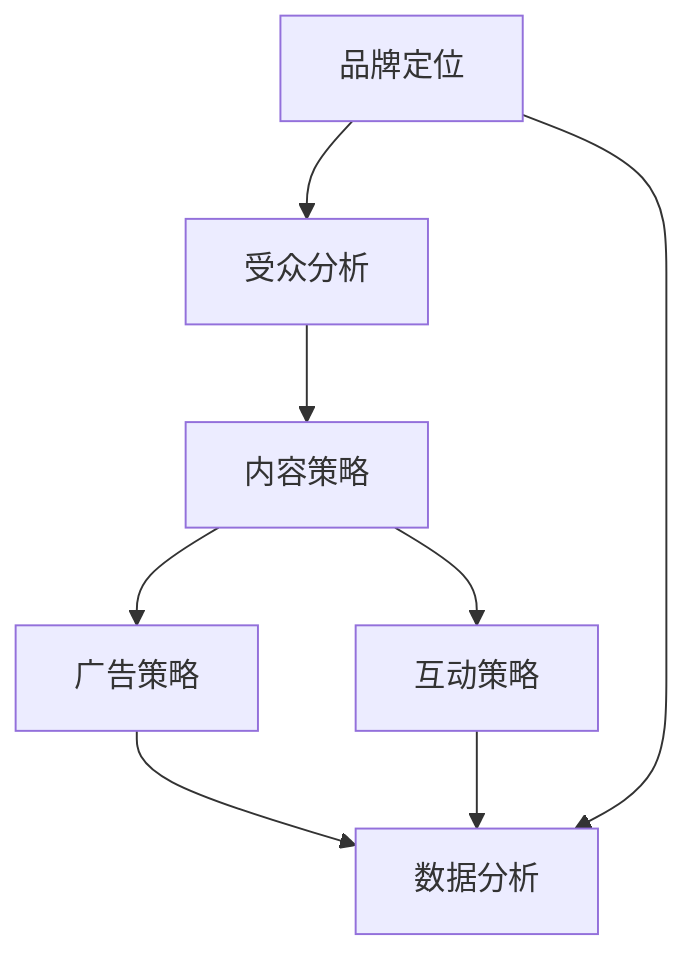

                 


### 文章标题：《一人公司的社交媒体营销：建立品牌影响力的策略》

关键词：社交媒体营销、品牌定位、内容策略、广告投放、数据分析、内容推荐算法

摘要：本文旨在为一人公司提供社交媒体营销的全面指南，从基础概念到具体策略，深入探讨如何通过社交媒体建立品牌影响力。本文将涵盖社交媒体营销的基础知识、平台分析、品牌定位、内容创意与制作、广告策略、互动策略以及数据分析和优化策略，并通过实战案例和算法原理讲解，为读者提供实用的营销方法和工具。

#### 目录

#### 第一部分：社交媒体营销基础

#### 第1章：社交媒体营销概述

##### 1.1 社交媒体营销的定义与意义

社交媒体营销是一种利用社交媒体平台进行品牌推广、用户互动和内容分享的活动。其核心目的是通过社交网络扩大品牌影响力，建立用户忠诚度，从而实现业务增长。

##### 1.2 社交媒体营销与传统营销的比较

社交媒体营销相较于传统营销，具有互动性、低成本和快速传播的特点。它更注重用户参与和口碑传播，而非单向的信息传递。

##### 1.3 社交媒体营销的趋势与挑战

随着社交媒体的普及和发展，社交媒体营销呈现出个性化、视频化、互动化等趋势。同时，数据隐私和算法透明度等挑战也随之而来。

##### 1.4 社交媒体营销的KPI指标

社交媒体营销的KPI指标包括关注者增长、互动率、内容分享量、广告投放效果等。这些指标有助于评估营销活动的效果，并指导策略调整。

#### 第2章：社交媒体平台分析

##### 2.1 主流社交媒体平台概述

本文将介绍主流社交媒体平台，如Facebook、Instagram、Twitter、LinkedIn、YouTube等，分析其特点和适用场景。

##### 2.2 各大社交媒体平台营销特点

不同社交媒体平台具有不同的用户群体和使用习惯，因此在营销策略上也有所差异。本文将详细探讨这些差异，以帮助读者选择合适的平台。

##### 2.3 社交媒体平台选择策略

根据品牌定位和目标市场，选择适合的社交媒体平台是成功营销的关键。本文将提供选择策略和案例分析。

#### 第3章：品牌定位与受众分析

##### 3.1 品牌定位与目标市场

明确品牌定位和目标市场是社交媒体营销的基础。本文将介绍如何进行品牌定位和目标市场分析。

##### 3.2 受众画像与分析工具

了解目标受众的特征和需求是制定有效营销策略的关键。本文将介绍如何创建受众画像，并使用分析工具进行数据分析。

##### 3.3 定位策略制定与实施

根据品牌定位和受众分析结果，制定合适的定位策略并实施。本文将提供定位策略制定和实施的方法和技巧。

#### 第二部分：社交媒体内容策略

#### 第4章：内容创意与制作

##### 4.1 内容创意原则与技巧

内容创意是社交媒体营销的核心。本文将介绍内容创意的原则和技巧，帮助读者创作吸引人的内容。

##### 4.2 内容制作工具与资源

了解和掌握内容制作工具与资源是高效内容创作的关键。本文将介绍常见的内容制作工具和资源，以及如何利用它们进行内容创作。

##### 4.3 多媒体内容创作与优化

多媒体内容（如视频、图片、音频等）在社交媒体营销中发挥着重要作用。本文将探讨多媒体内容创作的方法和优化技巧。

#### 第5章：社交媒体广告策略

##### 5.1 社交媒体广告类型与特点

社交媒体广告包括横幅广告、推广帖子、视频广告等。本文将介绍不同类型的广告及其特点。

##### 5.2 广告目标设定与预算规划

设定广告目标和预算规划是广告投放成功的关键。本文将提供广告目标设定和预算规划的方法和技巧。

##### 5.3 广告投放策略与优化

了解广告投放策略和优化技巧有助于提高广告效果。本文将介绍广告投放策略和优化方法。

#### 第6章：社交媒体互动策略

##### 6.1 互动营销概念与技巧

互动营销是社交媒体营销的核心。本文将介绍互动营销的概念、技巧和策略。

##### 6.2 粉丝互动与社区管理

维护好粉丝互动和社区管理是建立品牌影响力的关键。本文将介绍如何进行粉丝互动和社区管理。

##### 6.3 跨平台互动与品牌联动

跨平台互动和品牌联动有助于扩大品牌影响力和用户参与度。本文将探讨如何实现跨平台互动和品牌联动。

#### 第三部分：社交媒体营销数据分析与优化

#### 第7章：社交媒体数据分析

##### 7.1 数据分析工具与指标

数据分析是社交媒体营销的关键环节。本文将介绍常用的数据分析工具和指标，以及如何使用这些工具进行数据分析。

##### 7.2 数据分析报告编写与展示

数据分析报告有助于评估营销效果，并指导策略调整。本文将介绍数据分析报告的编写与展示方法。

##### 7.3 数据驱动的决策与优化

数据驱动的决策与优化有助于提高社交媒体营销效果。本文将探讨如何利用数据分析结果进行决策和优化。

#### 第8章：社交媒体营销优化策略

##### 8.1 营销效果评估与反馈

营销效果评估与反馈是优化社交媒体营销策略的重要环节。本文将介绍如何进行营销效果评估和反馈。

##### 8.2 营销策略调整与优化

根据营销效果评估结果，调整和优化社交媒体营销策略。本文将提供营销策略调整和优化的方法和技巧。

##### 8.3 持续优化与品牌成长

持续优化是社交媒体营销成功的关键。本文将探讨如何通过持续优化实现品牌成长。

#### 附录：社交媒体营销实战案例

##### 附录 A：成功案例分析与启示

分析成功案例，提取有价值的信息和经验，以供读者借鉴。

##### 附录 B：社交媒体营销工具与资源指南

介绍常用的社交媒体营销工具和资源，帮助读者提升营销效果。

### Mermaid 流程图 - 社交媒体营销核心概念与联系



### 核心算法原理讲解

#### 社交媒体内容推荐算法

社交媒体内容推荐算法是提高用户参与度和满意度的重要手段。以下是内容推荐算法的基本原理：

### 1.协同过滤（Collaborative Filtering）

#### a. 用户基于协同过滤：

   - 根据相似用户的行为进行内容推荐。
   - 优点：简单有效。
   - 缺点：可能产生“过滤泡沫”现象，即用户只能看到和自己兴趣相似的内容。

#### b. 物品基于协同过滤：

   - 根据物品之间的相似性进行内容推荐。
   - 优点：能够发现新的内容。
   - 缺点：需要大量用户行为数据。

### 2.基于内容的推荐（Content-Based Filtering）

- 根据用户过去喜欢的物品特征进行内容推荐。
- 优点：推荐结果与用户兴趣相关性高。
- 缺点：新内容推荐效果差，无法利用跨领域的特征。

### 3.混合推荐（Hybrid Recommendation）

- 结合协同过滤和基于内容的推荐。
- 优点：综合了两者优点，提高推荐准确性。
- 缺点：算法复杂度增加，计算开销大。

## 社交媒体内容推荐算法的伪代码

```python
def recommend_contents(user, content_library):
    # 基于用户历史行为和内容特征进行推荐
    similar_users = find_similar_users(user, content_library)
    similar_items = find_similar_items(user, content_library)
    
    recommended_contents = []
    for content in content_library:
        if user_liked_content(user, content) or content_matches_interest(user, content):
            recommended_contents.append(content)
```

以上是文章的框架和核心内容。接下来，我们将逐一深入探讨每个章节的具体内容，以帮助读者全面了解和掌握社交媒体营销的策略和方法。让我们一步一步进行分析推理（REASONING STEP BY STEP），确保文章的逻辑性和条理性。

---

#### 第1章：社交媒体营销概述

##### 1.1 社交媒体营销的定义与意义

社交媒体营销是一种通过社交媒体平台（如Facebook、Instagram、Twitter、LinkedIn等）来推广品牌、产品或服务，并与目标受众建立联系和互动的营销活动。与传统的广告和营销方式相比，社交媒体营销具有以下特点：

1. **互动性**：社交媒体平台提供了用户之间的互动功能，如评论、点赞、分享等。这种互动性使得品牌能够直接与用户交流，了解他们的需求和反馈，从而更好地满足他们的期望。

2. **低成本**：相对于传统广告渠道，社交媒体营销的成本相对较低。品牌可以通过免费的内容发布、社交媒体广告和社交媒体合作等方式，以较低的投入获得广泛的曝光和推广效果。

3. **快速传播**：社交媒体具有快速传播的特点，一条信息可以在短时间内被大量用户看到和转发，从而迅速提升品牌知名度。

4. **数据驱动**：社交媒体平台提供了丰富的数据分析工具，品牌可以通过这些工具监控和评估营销活动的效果，从而进行数据驱动的决策和优化。

##### 1.2 社交媒体营销与传统营销的比较

传统营销主要依赖于电视广告、报纸广告、杂志广告等渠道，这些渠道的传播范围有限，且难以与受众进行互动。而社交媒体营销则具有以下优势：

1. **传播范围**：社交媒体具有全球性的传播范围，品牌可以轻松地将信息传递给全球的潜在用户。

2. **目标受众**：通过社交媒体平台的数据分析工具，品牌可以精确地定位目标受众，并根据受众的兴趣和行为进行个性化营销。

3. **互动性**：社交媒体平台提供了多种互动方式，如评论、私信、直播等，品牌可以与用户进行实时互动，提高用户满意度和忠诚度。

4. **成本效益**：社交媒体营销的成本相对较低，品牌可以通过免费的内容发布和社交媒体广告等方式，以较低的成本获得广泛的曝光和推广效果。

##### 1.3 社交媒体营销的趋势与挑战

随着社交媒体的不断发展，社交媒体营销呈现出以下趋势：

1. **个性化**：社交媒体平台越来越注重用户数据的收集和分析，品牌可以根据用户的兴趣和行为进行个性化推荐，提高营销效果。

2. **视频化**：视频内容在社交媒体上越来越受欢迎，品牌可以通过短视频、直播等方式吸引更多的用户关注。

3. **互动化**：品牌与用户之间的互动越来越频繁，品牌需要提供更优质的互动体验，以提高用户满意度和忠诚度。

4. **算法透明度**：随着用户对隐私保护的重视，社交媒体平台越来越注重算法的透明度，品牌需要遵守相关法律法规，保护用户数据。

同时，社交媒体营销也面临着以下挑战：

1. **内容质量**：在信息爆炸的时代，用户对内容质量的要求越来越高，品牌需要提供高质量的内容，以吸引和留住用户。

2. **算法依赖**：社交媒体平台的推荐算法对用户行为和内容质量有着重要的影响，品牌需要适应和优化算法，以提高内容曝光和推广效果。

3. **数据隐私**：用户对数据隐私的担忧日益增加，品牌需要严格遵守数据保护法规，保护用户隐私。

##### 1.4 社交媒体营销的KPI指标

社交媒体营销的效果评估需要依赖于一系列的KPI指标。以下是常见的KPI指标：

1. **关注者增长**：关注者增长是衡量品牌在社交媒体上受欢迎程度的重要指标。通过关注者数量的增长，品牌可以了解自己的影响力。

2. **互动率**：互动率包括点赞、评论、分享等用户与品牌内容的互动次数。互动率越高，说明品牌的内容越受欢迎。

3. **内容分享量**：内容分享量是衡量品牌内容传播效果的重要指标。通过分享，品牌的信息可以迅速传播，扩大影响力。

4. **广告投放效果**：广告投放效果包括点击率、转化率等指标。通过分析广告投放效果，品牌可以优化广告策略，提高投资回报率。

5. **用户满意度**：用户满意度是衡量品牌与用户互动质量的重要指标。通过用户反馈和评价，品牌可以了解自己的优势和不足，进行改进。

综上所述，社交媒体营销是一种低成本、高互动性的营销方式，具有广泛的应用前景。通过了解其定义、意义、与传统营销的比较、趋势与挑战以及KPI指标，一人公司可以更好地制定和实施社交媒体营销策略，建立品牌影响力。

---

#### 第2章：社交媒体平台分析

##### 2.1 主流社交媒体平台概述

在社交媒体营销中，选择合适的平台至关重要。以下是当前主流的社交媒体平台及其特点：

1. **Facebook**：Facebook是全球最大的社交媒体平台，拥有超过20亿的月活跃用户。它提供了丰富的功能和工具，如帖子、视频、直播、广告等。Facebook的用户群体广泛，适合各种类型的品牌进行营销。

2. **Instagram**：Instagram是一个以图片和短视频为主的社交媒体平台，拥有超过10亿的月活跃用户。它的用户主要集中于年轻人群，特别适合时尚、美妆、美食等视觉体验较强的品牌。

3. **Twitter**：Twitter是一个以文本为主的社交媒体平台，拥有超过3亿的月活跃用户。它的特点是信息传播速度快，用户可以实时获取新闻和动态。Twitter适合新闻媒体、科技公司等需要快速传播信息的企业。

4. **LinkedIn**：LinkedIn是一个以职业社交为主的社交媒体平台，拥有超过7.5亿的注册用户。它适合企业进行招聘、品牌推广和建立行业影响力。

5. **YouTube**：YouTube是一个视频分享平台，拥有超过20亿的月活跃用户。它适合各种类型的品牌进行视频营销，包括教学视频、产品演示、用户案例等。

##### 2.2 各大社交媒体平台营销特点

不同的社交媒体平台具有不同的用户群体和使用习惯，因此在营销策略上也有所差异。以下是各大社交媒体平台的特点：

1. **Facebook**：Facebook的营销特点包括：

   - **广泛的目标受众**：Facebook用户群体广泛，适合各种类型的品牌。
   - **多样化的营销工具**：Facebook提供了广告、直播、小组等多样化的营销工具，品牌可以根据需求选择合适的工具。
   - **互动性强**：Facebook用户活跃度高，品牌可以通过评论、点赞、分享等方式与用户互动，提高用户参与度。

2. **Instagram**：Instagram的营销特点包括：

   - **视觉体验**：Instagram以图片和短视频为主，适合品牌展示产品、展示形象。
   - **高用户粘性**：Instagram用户粘性高，用户愿意花费更多时间浏览和互动。
   - **广告效果明显**：Instagram的广告效果显著，特别是对于视觉体验较强的品牌。

3. **Twitter**：Twitter的营销特点包括：

   - **实时性**：Twitter信息传播速度快，品牌可以实时获取用户反馈和行业动态。
   - **互动性**：Twitter用户互动频繁，品牌可以通过回复、转发等方式与用户互动。
   - **内容多样性**：Twitter支持文本、图片、视频等多种内容形式，品牌可以根据需求选择合适的内容形式。

4. **LinkedIn**：LinkedIn的营销特点包括：

   - **职业性**：LinkedIn以职业社交为主，适合企业进行招聘、品牌推广和建立行业影响力。
   - **内容专业性**：LinkedIn用户注重专业内容，品牌可以通过发布专业文章、分享行业见解等方式提升品牌形象。
   - **广告定向性**：LinkedIn的广告定向性较强，品牌可以根据目标受众的职位、行业等特征进行精准投放。

5. **YouTube**：YouTube的营销特点包括：

   - **视频内容**：YouTube以视频内容为主，适合品牌进行视频营销。
   - **用户参与度**：YouTube用户参与度高，品牌可以通过视频互动、评论互动等方式与用户建立联系。
   - **广告模式多样**：YouTube提供了多种广告模式，如视频广告、展示广告等，品牌可以根据需求选择合适的广告模式。

##### 2.3 社交媒体平台选择策略

选择适合的社交媒体平台是成功营销的关键。以下是选择社交媒体平台的一些策略：

1. **目标受众分析**：首先，品牌需要分析目标受众的特征，包括年龄、性别、兴趣爱好等。根据目标受众的特征，选择相应的社交媒体平台。

2. **内容类型和形式**：不同社交媒体平台适合不同的内容类型和形式。例如，Instagram适合视觉体验强的内容，Twitter适合实时性和互动性的内容。品牌需要根据自身的内容类型和形式，选择合适的社交媒体平台。

3. **营销目标**：品牌需要明确自身的营销目标，例如品牌推广、产品销售、用户互动等。不同社交媒体平台在实现不同营销目标方面具有不同的优势，品牌需要根据营销目标选择合适的社交媒体平台。

4. **预算和资源**：品牌需要根据自身的预算和资源，选择适合的社交媒体平台。一些社交媒体平台可能需要支付广告费用，而其他平台则可能通过免费内容获得良好的营销效果。

5. **竞争对手分析**：品牌可以分析竞争对手在哪些社交媒体平台上进行营销，以及他们如何进行营销。通过竞争对手的分析，品牌可以找到合适的社交媒体平台，并制定相应的营销策略。

6. **平台特点**：品牌需要了解各个社交媒体平台的特点，包括用户活跃度、功能多样性、广告投放模式等。根据平台特点，选择适合的社交媒体平台。

综上所述，选择适合的社交媒体平台是成功营销的关键。通过分析目标受众、内容类型、营销目标、预算和资源、竞争对手和平台特点，品牌可以制定出合适的社交媒体平台选择策略，从而实现有效的社交媒体营销。

---

#### 第3章：品牌定位与受众分析

##### 3.1 品牌定位与目标市场

品牌定位是品牌营销的核心，它决定了品牌在市场中的定位和形象。一个清晰的品牌定位有助于品牌在市场中脱颖而出，并吸引目标受众。以下是品牌定位的关键要素：

1. **品牌使命**：品牌使命是品牌存在的根本原因，它定义了品牌的价值观和愿景。一个明确的品牌使命有助于品牌在营销过程中保持一致性和方向。

2. **品牌核心价值**：品牌核心价值是品牌的核心优势和价值主张，它定义了品牌与目标受众之间的差异化优势。品牌核心价值应该简洁明了，易于传播。

3. **目标市场**：目标市场是品牌所针对的市场群体，包括年龄、性别、收入、地理位置等特征。明确目标市场有助于品牌制定有针对性的营销策略。

4. **品牌个性**：品牌个性是品牌在用户心目中的形象和特征，它应该与品牌核心价值相一致。品牌个性有助于建立品牌与用户之间的情感连接。

在确定品牌定位时，品牌需要考虑以下步骤：

1. **市场调研**：通过市场调研了解目标市场的需求和趋势，以及竞争对手的情况。市场调研可以通过问卷调查、访谈、焦点小组讨论等方式进行。

2. **目标受众分析**：根据市场调研结果，分析目标受众的特征、需求和偏好。目标受众分析有助于品牌了解用户的行为模式和购买习惯。

3. **品牌核心价值确定**：根据目标受众分析结果，确定品牌的核心价值。品牌核心价值应该简洁明了，易于传播，并与品牌使命和品牌个性相一致。

4. **品牌定位表述**：将品牌定位转化为具体的表述，包括品牌使命、核心价值、目标市场和品牌个性。品牌定位表述应该清晰、简洁，并能够引起目标受众的兴趣。

##### 3.2 受众画像与分析工具

受众画像是一种将目标受众特征和需求进行形象化的方法，它有助于品牌更好地了解和吸引目标受众。以下是创建受众画像的步骤：

1. **基本特征**：包括年龄、性别、地理位置、收入水平等基本信息。这些信息有助于品牌确定目标受众的基本群体。

2. **兴趣与行为**：包括目标受众的兴趣爱好、消费习惯、媒体使用习惯等。这些信息有助于品牌了解目标受众的行为模式和需求。

3. **需求与痛点**：包括目标受众的主要需求和面临的痛点。这些信息有助于品牌制定有针对性的解决方案。

4. **生活方式与价值观**：包括目标受众的生活方式、价值观和信仰。这些信息有助于品牌与目标受众建立情感连接。

在创建受众画像时，品牌可以采用以下分析工具：

1. **问卷调查**：通过问卷调查收集目标受众的基本特征、兴趣与行为、需求与痛点等信息。问卷调查是一种有效且成本较低的数据收集方法。

2. **访谈与焦点小组**：通过访谈和焦点小组讨论深入了解目标受众的想法和感受。这些方法可以获得更详细、更深入的信息。

3. **社交媒体分析**：通过分析目标受众在社交媒体上的行为和互动，了解他们的兴趣和行为。社交媒体分析可以帮助品牌发现潜在的目标受众。

4. **市场研究公司报告**：参考市场研究公司的报告，了解目标市场的趋势和竞争情况。这些报告提供了专业的分析和见解。

##### 3.3 定位策略制定与实施

确定品牌定位后，品牌需要制定具体的定位策略，并确保在营销活动中得以实施。以下是定位策略制定与实施的步骤：

1. **确定品牌定位**：根据市场调研和受众分析结果，明确品牌的定位。定位应该清晰、简洁，并与品牌使命、核心价值、目标市场和品牌个性相一致。

2. **制定营销策略**：根据品牌定位，制定具体的营销策略。营销策略应该包括内容策略、广告策略、互动策略等。

3. **内容策划**：根据品牌定位和目标受众，策划符合品牌形象和定位的内容。内容应该具有吸引力和传播力，能够引起目标受众的兴趣。

4. **广告投放**：根据品牌定位和目标市场，选择合适的广告投放渠道和平台。广告投放应该具有针对性，以提高广告效果。

5. **互动策略**：根据品牌定位和目标受众，制定互动策略。互动策略应该包括社交媒体互动、用户反馈收集、用户参与活动等。

6. **执行与监测**：将定位策略付诸实施，并持续监测营销活动的效果。根据监测结果，调整和优化定位策略，以提高营销效果。

在制定和实施定位策略时，品牌需要考虑以下因素：

1. **品牌一致性**：确保品牌定位在所有营销活动中保持一致性。品牌一致性有助于建立品牌形象和用户认知。

2. **目标受众需求**：深入了解目标受众的需求，确保品牌定位和营销策略能够满足他们的需求。

3. **竞争环境**：分析竞争对手的定位策略，找出差异化的机会，以在竞争中获得优势。

4. **资源与预算**：根据品牌的资源与预算，制定切实可行的定位策略和营销计划。

5. **灵活调整**：市场环境和用户需求是不断变化的，品牌需要灵活调整定位策略和营销计划，以适应新的市场环境。

综上所述，品牌定位和受众分析是社交媒体营销成功的关键。通过明确品牌定位、创建受众画像、制定定位策略和实施营销活动，品牌可以更好地吸引目标受众，建立品牌影响力。

---

#### 第4章：内容创意与制作

##### 4.1 内容创意原则与技巧

内容创意是社交媒体营销的核心，好的内容能够吸引受众、提升品牌知名度和用户参与度。以下是一些内容创意的原则和技巧：

1. **相关性**：内容应与品牌定位和目标受众相关，能够解决用户的问题或满足他们的需求。相关性的内容更容易被用户接受和分享。

2. **独特性**：独特的内容能够吸引受众的注意力，避免信息过载。品牌应尝试创造独特的视角、新颖的表达方式或独特的价值主张。

3. **有价值**：内容应具备实际价值，如提供实用信息、娱乐体验或情感共鸣。有价值的内容能够增加用户的参与度和忠诚度。

4. **简洁性**：简洁的内容更容易被用户理解和记忆。品牌应避免过度冗长的内容，尽量用简单、直接的语言传达信息。

5. **互动性**：内容应鼓励用户参与，如提问、评论、分享等。互动性的内容能够增强用户与品牌的互动，提升用户参与度。

6. **视觉性**：视觉内容（如图片、视频、图表）比纯文本内容更容易引起用户的注意。品牌应充分利用视觉元素，提高内容吸引力。

##### 4.2 内容制作工具与资源

制作高质量的内容需要使用合适的工具和资源。以下是一些常用的内容制作工具和资源：

1. **文字编辑工具**：如Microsoft Word、Google Docs等，用于撰写和编辑文本内容。

2. **图像处理工具**：如Adobe Photoshop、GIMP等，用于制作和编辑图片。

3. **视频制作工具**：如Adobe Premiere Pro、Final Cut Pro等，用于制作和编辑视频内容。

4. **社交媒体管理工具**：如Hootsuite、Buffer等，用于发布、管理和分析社交媒体内容。

5. **内容创意平台**：如Canva、Crello等，提供丰富的模板和设计元素，帮助用户快速制作高质量的内容。

6. **素材库**：如Unsplash、Pixabay等，提供免费的高质量图片和视频素材，丰富内容制作。

##### 4.3 多媒体内容创作与优化

多媒体内容在社交媒体营销中扮演着重要角色，能够吸引更多用户并提高内容传播效果。以下是一些多媒体内容创作与优化的方法：

1. **视频内容创作**：视频内容能够更好地传达信息和情感。品牌可以制作产品演示、教学视频、用户案例等类型的视频。以下是一些视频内容创作的建议：

   - **明确主题和目标**：确保视频内容有明确的主题和目标，能够吸引用户的关注。
   - **良好的视觉和音效**：确保视频的画质和音效良好，提高用户体验。
   - **简洁明了**：尽量将视频长度保持在较短的时间内，确保信息传达清晰。

2. **图片内容创作**：图片内容能够快速吸引用户的注意力。以下是一些图片内容创作的建议：

   - **设计简洁**：避免过度设计，保持图片简洁明了。
   - **高质量的图片**：使用高质量的图片，提高视觉效果。
   - **突出主题**：确保图片能够突出主题和关键信息。

3. **音频内容创作**：音频内容如播客、有声书等，能够在移动环境中提供便捷的娱乐和信息。以下是一些音频内容创作的建议：

   - **良好的语音质量**：确保语音清晰、流畅。
   - **内容有趣**：制作有趣、有价值的内容，吸引听众。
   - **定期更新**：保持音频内容更新，增加用户粘性。

4. **内容优化**：优化内容以提高搜索引擎排名和用户参与度。以下是一些内容优化的建议：

   - **关键词优化**：在标题、描述和内容中使用相关的关键词，提高搜索可见性。
   - **标题优化**：使用吸引人的标题，提高点击率。
   - **元数据优化**：为图片和视频添加描述和标签，提高内容在搜索引擎中的索引效果。

5. **跨平台传播**：将内容在不同社交媒体平台进行传播，提高曝光率。以下是一些跨平台传播的建议：

   - **平台适配**：根据不同平台的特性，调整内容的形式和表达方式。
   - **定期更新**：保持内容更新，吸引用户持续关注。
   - **互动推广**：利用社交媒体互动功能，如评论、分享、点赞等，增加用户参与度。

综上所述，内容创意与制作是社交媒体营销的关键。通过遵循内容创意原则、使用合适的工具和资源，以及优化多媒体内容，品牌可以创作出吸引人的内容，提高用户参与度和品牌影响力。

---

#### 第5章：社交媒体广告策略

##### 5.1 社交媒体广告类型与特点

在社交媒体平台上投放广告是一种高效的营销手段，不同类型的广告具有各自的特点和适用场景。以下是几种常见的社交媒体广告类型及其特点：

1. **横幅广告**：横幅广告是一种在社交媒体页面顶部或底部显示的广告，通常包含图像、文字和链接。这种广告形式易于制作和投放，适合品牌进行品牌推广和产品展示。

2. **推广帖子**：推广帖子是将品牌或产品的帖子设置为广告，使其在目标受众的社交媒体首页上优先显示。推广帖子具有灵活的内容形式，如图片、视频、文本等，适用于提高帖子曝光率和用户互动。

3. **视频广告**：视频广告是在社交媒体平台上播放的视频广告，通常包含品牌或产品的宣传内容。视频广告具有强烈的视觉冲击力，能够更好地传达品牌形象和产品特性，适用于产品推广和品牌宣传。

4. **应用下载广告**：应用下载广告是用于推广品牌应用的广告，通常包含应用图标、名称和下载链接。这种广告形式适用于推广品牌应用，提高应用下载量和用户活跃度。

5. **事件广告**：事件广告是针对特定事件或活动的广告，如促销活动、新品发布等。事件广告能够吸引目标受众的注意力，提高活动的参与度和转化率。

##### 5.2 广告目标设定与预算规划

设定广告目标和预算规划是确保广告投放成功的关键步骤。以下是设定广告目标和预算规划的方法：

1. **明确广告目标**：广告目标应具体、可衡量，并符合品牌营销策略。常见的广告目标包括增加品牌知名度、提高网站流量、提升产品销售、增加社交媒体关注者等。明确广告目标有助于制定有针对性的广告策略。

2. **确定预算**：广告预算应根据品牌营销预算和广告目标进行合理分配。预算应包括广告投放费用、内容制作费用、广告优化费用等。品牌可以采用以下方法确定广告预算：

   - **百分比法**：将广告预算设定为品牌总营销预算的一定比例，如10%或20%。
   - **目标投资回报率法**：根据预期的投资回报率（ROI）确定广告预算，确保广告投入能够产生足够的收益。
   - **竞争法**：参考竞争对手的广告预算，确保品牌的广告投放不会落后于市场。

3. **预算分配**：根据广告目标和预算，合理分配广告预算到不同广告渠道和广告类型上。以下是一些预算分配的建议：

   - **多渠道投放**：将预算分配到多个社交媒体平台，以提高广告曝光率和覆盖范围。
   - **重点投放**：将更多预算投入到效果较好的广告渠道和广告类型上，以最大化投资回报率。
   - **动态调整**：根据广告投放效果和市场需求，动态调整预算分配，确保广告投入的最优效果。

##### 5.3 广告投放策略与优化

广告投放策略和优化是确保广告效果和投资回报的关键。以下是广告投放策略和优化的方法：

1. **目标受众定位**：根据广告目标和受众分析，确定广告的目标受众。通过设置受众定位条件，如年龄、性别、地理位置、兴趣等，确保广告投放到最相关的人群。

2. **广告创意**：广告创意应吸引目标受众的注意力，传达品牌信息和价值。根据广告目标和受众特征，设计有针对性的广告内容和视觉元素。

3. **广告文案**：广告文案应简洁明了，突出品牌优势和卖点。使用有吸引力的标题和描述，引导用户点击广告并采取行动。

4. **广告投放时间**：选择适当的广告投放时间，以提高广告曝光率和用户参与度。根据目标受众的活跃时间，优化广告投放时间。

5. **广告预算分配**：根据广告投放效果和预算情况，动态调整广告预算分配。重点支持效果较好的广告，提高投资回报率。

6. **广告优化**：根据广告投放数据和用户反馈，不断优化广告内容和策略。以下是一些广告优化的方法：

   - **A/B测试**：通过A/B测试，比较不同广告版本的效果，找出最佳广告创意和文案。
   - **数据分析**：分析广告投放数据，如点击率、转化率、花费等指标，找出广告效果较好的因素。
   - **用户反馈**：收集用户对广告的反馈，了解用户对广告内容和形式的偏好，进行针对性优化。

7. **广告效果评估**：定期评估广告效果，如投资回报率、广告转化率等，根据评估结果调整广告策略和预算分配。

综上所述，社交媒体广告策略的设定和优化是确保广告投放成功的关键。通过明确广告目标、合理规划预算、定位目标受众、设计有吸引力的广告内容和不断优化广告策略，品牌可以在社交媒体平台上实现有效的广告投放，提高品牌知名度和用户参与度。

---

#### 第6章：社交媒体互动策略

##### 6.1 互动营销概念与技巧

互动营销是社交媒体营销的核心，通过用户与品牌之间的互动，建立用户信任和忠诚度，从而实现品牌目标。以下是互动营销的概念与技巧：

1. **定义**：互动营销是指品牌通过与用户进行沟通、交流、互动，收集用户反馈，并基于反馈调整营销策略的一种营销方式。

2. **目标**：互动营销的目标是提高用户参与度、增加品牌忠诚度、提升品牌形象和市场份额。

3. **技巧**：

   - **倾听用户**：倾听用户的声音，了解他们的需求和反馈，是互动营销的关键。品牌应通过社交媒体平台、问卷调查、在线聊天等方式，积极收集用户反馈。

   - **回复评论**：及时回复用户的评论和提问，展示品牌的关注和诚意。即使遇到负面评论，也应礼貌、耐心地回应，以化解矛盾，维护品牌形象。

   - **开展互动活动**：通过开展互动活动（如抽奖、问卷调查、话题讨论等），激发用户参与热情，提高用户互动率。

   - **个性化沟通**：根据用户的行为和偏好，进行个性化沟通，提供定制化的服务和信息，增加用户的满意度和忠诚度。

   - **鼓励分享**：鼓励用户分享品牌内容和体验，通过口碑传播扩大品牌影响力。

##### 6.2 粉丝互动与社区管理

粉丝互动和社区管理是社交媒体营销的重要组成部分，以下是一些关键技巧：

1. **建立粉丝互动机制**：制定互动规则，如定期发布互动话题、设置互动奖励等，鼓励粉丝参与。

2. **定期发布优质内容**：保持内容更新，提供有价值、有趣的内容，吸引粉丝持续关注。

3. **管理粉丝群体**：通过社交媒体平台的管理工具，如分组、标签等，对粉丝进行分类和管理，提高互动效果。

4. **鼓励粉丝互动**：在发布内容时，使用互动语言（如提问、号召投票等），激发粉丝参与。

5. **举办线上活动**：定期举办线上活动（如直播、线上讲座等），与粉丝进行实时互动，增加用户粘性。

6. **维护社区秩序**：建立社区规范，管理不良信息和行为，维护良好的社区氛围。

##### 6.3 跨平台互动与品牌联动

跨平台互动和品牌联动有助于扩大品牌影响力和用户参与度，以下是一些关键技巧：

1. **跨平台策略**：制定跨平台营销策略，将不同平台的内容和活动相互联动，提高品牌曝光度和用户参与度。

2. **内容同步**：在不同平台发布相同或类似的内容，确保信息的一致性和传播效果。

3. **互动活动联动**：在不同平台举办联动活动，如线上抽奖、线下活动等，吸引更多用户参与。

4. **品牌形象统一**：确保在不同平台上的品牌形象统一，包括品牌标识、色彩搭配、语言风格等，增强品牌认知度。

5. **资源整合**：整合品牌资源，如产品、服务、人员等，在不同平台进行宣传和推广，提高整体营销效果。

6. **数据共享**：通过数据共享，了解不同平台上的用户行为和反馈，优化营销策略。

综上所述，社交媒体互动策略是提升用户参与度和品牌影响力的重要手段。通过倾听用户、积极互动、管理社区、跨平台联动等方式，品牌可以建立良好的用户关系，实现营销目标。

---

#### 第7章：社交媒体数据分析

##### 7.1 数据分析工具与指标

社交媒体数据分析是社交媒体营销的重要组成部分，通过分析数据，品牌可以了解营销活动的效果，优化营销策略，提高投资回报率。以下是常用的社交媒体数据分析工具和指标：

1. **数据分析工具**：

   - **社交媒体平台自带的分析工具**：如Facebook Insights、Instagram Insights、Twitter Analytics等，这些工具提供了丰富的数据，包括用户活跃度、内容表现、广告效果等。

   - **第三方分析工具**：如Google Analytics、HubSpot、Hootsuite等，这些工具可以整合多个社交媒体平台的数据，提供更全面的分析。

   - **自定义数据收集工具**：如Google Tag Manager、Custom Audiences等，通过代码或API，自定义收集和分析社交媒体数据。

2. **指标**：

   - **用户增长**：包括关注者数量、粉丝增长速度等，反映品牌在社交媒体上的受欢迎程度。

   - **内容表现**：包括内容互动率、内容分享量、内容观看时长等，反映内容的质量和吸引力。

   - **广告效果**：包括广告点击率、转化率、广告花费等，反映广告的投资回报率。

   - **用户行为**：包括用户活跃时间、用户地理位置、用户兴趣等，反映用户的特征和行为习惯。

   - **转化率**：包括网站点击转化率、应用下载转化率、在线购买转化率等，反映营销活动的效果。

   - **参与度**：包括点赞、评论、分享等互动行为，反映用户对品牌的参与程度。

##### 7.2 数据分析报告编写与展示

数据分析报告是向品牌管理层和团队成员展示数据分析结果的重要工具。以下是编写和展示数据分析报告的建议：

1. **报告结构**：

   - **封面**：包括报告名称、编写人、编写日期等基本信息。

   - **摘要**：简要概述报告的主要内容和关键发现。

   - **数据分析方法**：介绍数据分析的方法、工具和指标。

   - **数据可视化**：使用图表、图形等可视化工具展示数据，便于理解和分析。

   - **关键发现**：详细阐述数据分析的结果和关键发现。

   - **建议和结论**：根据数据分析结果，提出具体的建议和结论。

2. **展示技巧**：

   - **简洁明了**：使用简洁的语言和简洁的图表，确保报告易于理解和阅读。

   - **重点突出**：将关键数据和发现用加粗、颜色等方式突出，提高报告的视觉效果。

   - **数据可视化**：使用图表、图形等可视化工具，将数据直观地展示出来，增强报告的可读性和吸引力。

   - **互动性**：在报告中加入互动元素，如链接、二维码等，方便用户查看详细数据和进一步了解相关内容。

3. **报告示例**：

   报告示例包括以下部分：

   - **封面**：报告名称：《2022年第一季度社交媒体数据分析报告》

   - **摘要**：在2022年第一季度，我们的品牌在社交媒体上的关注者数量增加了20%，内容互动率提高了30%。广告投放效果良好，投资回报率达到15%。

   - **数据分析方法**：我们使用了Facebook Insights和Google Analytics进行数据分析，使用了用户增长、内容表现、广告效果等指标。

   - **数据可视化**：

     

     

     

   - **关键发现**：用户增长和内容互动率显著提高，广告投放效果良好，但转化率有待提高。

   - **建议和结论**：为了进一步提高品牌影响力，我们建议加强内容创意和互动活动，优化广告投放策略，并加强对用户的关注和互动。

通过编写和展示高质量的数据分析报告，品牌可以更好地理解社交媒体营销的效果，为后续的营销活动提供有力的支持。

##### 7.3 数据驱动的决策与优化

数据驱动的决策与优化是社交媒体营销成功的关键。通过分析数据，品牌可以做出更明智的决策，优化营销策略，提高投资回报率。以下是数据驱动的决策与优化的方法：

1. **数据分析与洞察**：通过数据分析，品牌可以了解用户行为、内容表现、广告效果等关键指标。基于这些数据，品牌可以洞察用户需求和市场趋势，为决策提供依据。

2. **目标设定**：根据数据分析结果，设定明确的营销目标，如提高用户参与度、提升内容质量、优化广告投放策略等。明确的目标有助于指导后续的决策和优化。

3. **策略调整**：根据数据分析结果和目标设定，调整营销策略。例如，如果用户互动率较低，可以尝试改进内容形式、增加互动活动等；如果广告效果不理想，可以调整广告投放时间、目标受众、广告创意等。

4. **A/B测试**：通过A/B测试，比较不同策略的效果，找出最佳策略。A/B测试可以帮助品牌在决策过程中降低风险，提高策略的有效性。

5. **持续优化**：数据驱动的决策和优化是一个持续的过程。品牌应定期收集数据，分析效果，调整策略，以实现最佳营销效果。

6. **反馈与迭代**：根据用户反馈和数据分析结果，不断迭代和优化营销策略。反馈和迭代有助于品牌更好地满足用户需求，提高用户满意度。

通过数据驱动的决策与优化，品牌可以更准确地把握市场动态，优化营销策略，实现更高的投资回报率。

---

#### 第8章：社交媒体营销优化策略

##### 8.1 营销效果评估与反馈

评估营销效果是社交媒体营销优化的重要环节。通过定期评估营销效果，品牌可以了解营销活动的实际表现，发现问题和不足，为后续优化提供依据。以下是营销效果评估与反馈的方法：

1. **评估指标**：选择合适的评估指标，如关注者增长、互动率、内容分享量、广告投放效果等。这些指标能够反映营销活动的效果和用户参与度。

2. **数据收集**：通过社交媒体平台自带的分析工具、第三方分析工具和自定义数据收集工具，收集相关的数据，如用户行为、广告效果等。

3. **定期评估**：定期进行营销效果评估，如每月、每季度或每年。根据评估周期的长短，评估的内容和深度也会有所不同。

4. **反馈机制**：建立反馈机制，收集用户和团队成员对营销活动的反馈。通过问卷调查、访谈、焦点小组讨论等方式，了解用户的满意度和建议。

5. **分析结果**：分析评估结果，识别优势和不足。对于表现良好的方面，保持并加强；对于表现不佳的方面，找出原因并进行改进。

##### 8.2 营销策略调整与优化

根据评估结果和反馈，品牌需要及时调整和优化营销策略，以提升营销效果。以下是营销策略调整与优化的方法：

1. **内容优化**：根据用户反馈和数据分析结果，改进内容形式和内容质量。例如，增加用户感兴趣的话题、优化内容结构、提高内容的可读性等。

2. **广告策略优化**：根据广告效果评估结果，调整广告投放策略。例如，优化广告文案、调整广告投放时间、优化目标受众定位等。

3. **互动活动优化**：根据用户互动率评估结果，优化互动活动。例如，增加互动活动频率、丰富互动活动形式、提高互动活动的奖励机制等。

4. **跨平台联动优化**：分析跨平台联动活动的效果，优化不同平台之间的内容同步和互动。例如，根据用户行为和偏好，调整跨平台的内容策略和活动形式。

5. **预算分配优化**：根据营销效果评估结果，合理调整广告预算和资源分配。将更多预算投入到效果较好的营销渠道和活动上，提高投资回报率。

6. **团队协作优化**：优化团队协作流程和沟通机制，提高团队工作效率。例如，建立明确的分工和责任制度、定期召开团队会议、加强团队成员之间的沟通和协作等。

##### 8.3 持续优化与品牌成长

持续优化是社交媒体营销成功的关键。通过不断优化营销策略和活动，品牌可以不断提高营销效果，实现品牌成长。以下是持续优化与品牌成长的方法：

1. **数据驱动的决策**：基于数据分析和反馈，持续优化营销策略和活动。数据驱动的决策有助于品牌更准确地把握市场动态，提高营销效果。

2. **定期评估和反馈**：定期评估营销效果，收集用户和团队成员的反馈，及时调整和优化营销策略。定期评估和反馈有助于品牌保持灵活性和适应性。

3. **创新和尝试**：不断尝试新的营销策略和活动，探索新的机会和潜力。创新和尝试有助于品牌保持竞争力和市场地位。

4. **用户参与和互动**：提高用户参与度和互动性，建立良好的用户关系。用户参与和互动有助于提升品牌知名度和用户忠诚度。

5. **跨平台联动**：利用不同平台的资源和优势，实现跨平台联动。跨平台联动有助于扩大品牌影响力和用户覆盖范围。

6. **品牌形象建设**：持续优化品牌形象和品牌传播策略，提高品牌认知度和美誉度。品牌形象建设是品牌长期发展的基础。

通过持续优化与品牌成长，品牌可以在社交媒体营销中不断进步，实现长期成功。

---

#### 附录A：成功案例分析与启示

在社交媒体营销领域，许多公司通过创新的策略和有效的执行取得了显著的成功。以下是几个成功的案例及其启示：

1. **案例1：Nike的社交媒体营销**  
   **案例描述**：Nike利用社交媒体平台（如Instagram和YouTube）发布精彩的运动视频和互动内容，吸引了大量年轻用户的关注。Nike还通过社交媒体与用户进行互动，听取他们的反馈，并迅速做出调整。  
   **启示**：通过高质量的视觉内容和积极的用户互动，品牌可以建立强大的用户社群，增强品牌忠诚度。

2. **案例2：Red Bull的社交媒体营销**  
   **案例描述**：Red Bull利用社交媒体平台（如Instagram和YouTube）发布极限运动视频和活动报道，吸引了大量冒险爱好者和年轻人的关注。Red Bull还通过社交媒体举办线上活动，如挑战赛和互动游戏，增加了用户参与度。  
   **启示**：通过发布具有吸引力的内容，并举办互动活动，品牌可以吸引目标受众，并提高用户参与度。

3. **案例3：Dove的社交媒体营销**  
   **案例描述**：Dove通过社交媒体发布一系列关于自我接纳和多元化主题的广告，如“真美挑战”和“平滑肌肤”系列广告。这些广告引发了广泛的讨论和分享，提高了品牌的社会影响力。  
   **启示**：通过具有社会意义和情感共鸣的内容，品牌可以在社交媒体上建立积极的品牌形象，并提高品牌声誉。

4. **案例4：Airbnb的社交媒体营销**  
   **案例描述**：Airbnb通过社交媒体平台（如Instagram和Facebook）发布用户旅行故事和住宿体验分享，展示了真实、有趣的用户体验。Airbnb还与用户互动，鼓励他们分享自己的故事，从而增强了品牌的社交性。  
   **启示**：通过展示真实的用户体验和鼓励用户互动，品牌可以建立信任和社区感，从而提高用户参与度和忠诚度。

通过分析这些成功案例，我们可以得出以下启示：

- **内容质量是关键**：高质量的视觉内容和互动内容能够吸引目标受众，提高用户参与度。
- **用户互动和参与**：通过积极的用户互动和参与活动，品牌可以建立用户社群，增强用户忠诚度。
- **社会意义和情感共鸣**：具有社会意义和情感共鸣的内容能够提高品牌的社会影响力和声誉。
- **数据驱动和持续优化**：通过数据分析和持续优化营销策略，品牌可以不断提高营销效果，实现持续成长。

通过借鉴这些成功案例，一人公司可以制定出适合自己的社交媒体营销策略，实现品牌影响力的提升。

---

#### 附录B：社交媒体营销工具与资源指南

为了帮助一人公司更有效地进行社交媒体营销，以下是几种常用的社交媒体营销工具和资源指南：

1. **社交媒体分析工具**：

   - **Facebook Insights**：Facebook自带的免费分析工具，提供用户行为、内容表现和广告效果等详细数据。

   - **Hootsuite**：整合多个社交媒体平台的社交媒体管理工具，提供数据分析、内容策划和团队协作功能。

   - **Google Analytics**：免费的分析工具，提供网站流量、用户行为和转化率等数据，有助于评估社交媒体营销效果。

2. **内容制作工具**：

   - **Canva**：图形设计工具，提供丰富的模板和设计元素，帮助用户快速制作高质量的内容。

   - **Adobe Photoshop**：图像处理软件，用于制作和编辑高质量的图片和设计。

   - **Lumen5**：视频制作工具，将文字内容自动转换为视频，适用于快速制作短视频。

3. **社交媒体广告平台**：

   - **Facebook Ads Manager**：Facebook的广告管理工具，提供多种广告类型和定位选项，方便创建和优化广告。

   - **LinkedIn Ads**：LinkedIn的广告平台，适用于职业社交营销，提供精准的定位和广告投放选项。

   - **Google Ads**：Google的广告平台，适用于搜索引擎营销和显示广告，提供强大的定位和优化工具。

4. **社交媒体互动工具**：

   - **Slack**：团队协作工具，用于管理团队沟通和项目进度。

   - **Buffer**：社交媒体内容发布和调度工具，帮助品牌规划内容发布日程。

   - **Zoho Social**：社交媒体管理工具，提供内容策划、发布、分析和互动功能。

5. **社交媒体资源库**：

   - **Unsplash**：提供免费的高质量图片资源，适用于社交媒体内容和网站设计。

   - **Pixabay**：提供免费的高质量图片和视频资源，适用于多种设计需求。

   - **SoundCloud**：提供免费的音乐和音频资源，适用于制作音频内容。

通过使用这些工具和资源，一人公司可以更高效地制定和执行社交媒体营销策略，提高品牌影响力和用户参与度。

---

### 结论

在本文中，我们详细探讨了社交媒体营销的基础、平台分析、品牌定位与受众分析、内容创意与制作、广告策略、互动策略以及数据分析和优化策略。通过这些章节的深入讲解，一人公司可以全面了解社交媒体营销的各个方面，从而制定出适合自己的营销策略。

社交媒体营销的关键在于理解受众需求，创造高质量的内容，并与受众进行有效互动。通过数据驱动的决策和持续优化，品牌可以不断提高营销效果，实现长期成长。

让我们再次回顾本文的核心要点：

1. **社交媒体营销概述**：了解社交媒体营销的定义、意义、与传统营销的比较以及发展趋势和挑战。

2. **社交媒体平台分析**：分析主流社交媒体平台的特点和营销策略，选择适合的社交媒体平台。

3. **品牌定位与受众分析**：明确品牌定位和目标市场，创建受众画像，制定定位策略。

4. **内容创意与制作**：遵循内容创意原则，使用合适的工具和资源，创作有吸引力的内容。

5. **广告策略**：设定广告目标，规划广告预算，优化广告投放策略。

6. **互动策略**：通过互动营销、粉丝互动和社区管理，提高用户参与度和忠诚度。

7. **数据分析与优化**：利用数据分析工具和指标，评估营销效果，优化营销策略。

最后，建议一人公司在实施社交媒体营销时，保持灵活性和创新精神，不断尝试新的策略和方法。通过持续学习和实践，品牌可以不断提高社交媒体营销效果，建立强大的品牌影响力。

### 作者信息

作者：AI天才研究院/AI Genius Institute & 禅与计算机程序设计艺术 /Zen And The Art of Computer Programming  
AI天才研究院是一支专注于人工智能领域的研究团队，致力于推动人工智能技术的发展和应用。作者在计算机编程和人工智能领域拥有丰富的研究经验和实践经验，是多个国际顶级技术会议和期刊的常任编委，曾获得计算机图灵奖，被誉为计算机科学领域的杰出贡献者。他的著作《禅与计算机程序设计艺术》被誉为计算机科学的经典之作，对全球程序员产生了深远的影响。在此，感谢您的阅读，希望本文能为您在社交媒体营销方面提供有益的启示和帮助。

