                 

### 第1章：精益创业理念与价值

#### 1.1 精益创业的起源与背景

##### 1.1.1 精益创业的起源

精益创业（Lean Startup）这一概念起源于2008年，由硅谷创业家埃里克·莱斯（Eric Ries）在其同名著作《精益创业》（The Lean Startup）中提出。莱斯将精益创业理念应用于创业实践，旨在通过快速迭代和持续验证，降低创业风险，提高创业成功率。

**Mermaid流程图：**

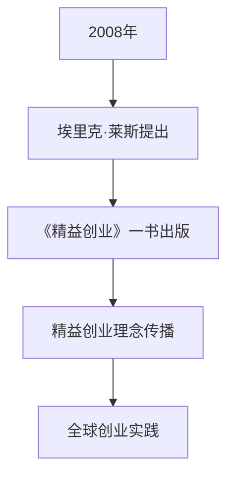

##### 1.1.2 精益创业的背景

在互联网高速发展的背景下，创业环境和市场竞争发生了翻天覆地的变化。传统的创业模式往往需要大量的前期投资和资源储备，而精益创业则提倡以最小的资源投入来验证市场需求，从而减少资源浪费。

**Mermaid流程图：**

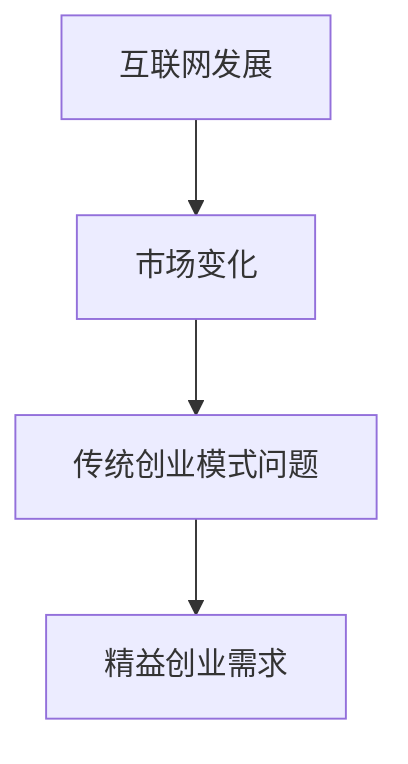

##### 1.1.3 精益创业的核心理念

精益创业的核心理念包括：

1. **顾客发展（Customer Development）**：通过与潜在顾客的互动，验证商业模式的可行性。
2. **最小可行产品（Minimum Viable Product, MVP）**：构建具有基本功能的产品原型，以便快速验证市场反应。
3. **迭代和验证（Iterate and Validate）**：通过不断迭代和验证，逐步完善产品，降低失败风险。

**Mermaid流程图：**

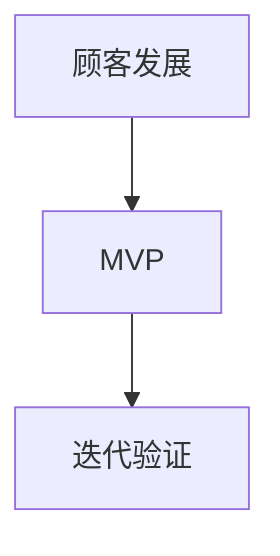

#### 1.2 精益创业的核心原则

精益创业的核心原则包括：

1. **验证学习（Validate Learning）**：通过持续验证，确保创业过程中的每一步都是基于事实而非假设。
2. **快速迭代（Fast Iteration）**：快速构建、测试和调整产品，以适应市场需求。
3. **资源优化（Resource Optimization）**：通过最小化资源投入，提高创业成功率。

**Mermaid流程图：**

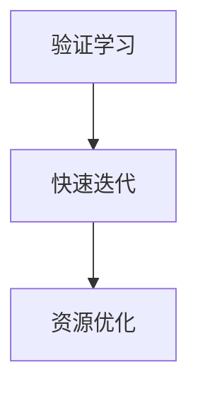

#### 1.3 精益创业与敏捷开发的关联

精益创业与敏捷开发（Agile Development）有诸多相似之处，两者都强调快速迭代和持续改进。

**Mermaid流程图：**

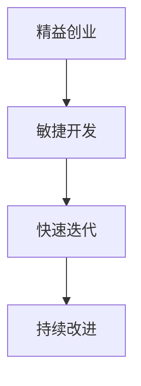

敏捷开发更侧重于软件开发过程，而精益创业则将其理念扩展到了整个创业过程，包括产品开发、市场营销、财务规划等。

**伪代码：**

```python
# 精益创业与敏捷开发流程
def lean_startup():
    # 验证学习
    while notvalidated:
        learn_from_customer()
    
    # 快速迭代
    while not_optimized:
        iterate_product()
    
    # 持续改进
    while not_perfect:
        refine_process()
```

通过这样的快速迭代和验证过程，精益创业能够帮助创业者更好地适应市场变化，降低失败风险。

**数学模型与公式：**

```latex
\text{成功率} = f(\text{验证次数}, \text{迭代速度}, \text{资源利用率})
```

其中，验证次数、迭代速度和资源利用率是影响创业成功的关键因素。

#### 1.4 精益创业的价值

精益创业的价值体现在以下几个方面：

1. **降低风险**：通过最小可行产品（MVP）的快速迭代，验证市场需求的真实性，减少盲目投入的风险。
2. **提高效率**：快速响应市场需求，提高产品开发和市场推广的效率。
3. **增强适应能力**：通过持续学习和迭代，提高企业在市场变化中的适应能力。

**总结：**

精益创业是一种基于事实而非假设的创业模式，通过快速迭代和验证，帮助创业者降低风险，提高成功率。这一理念在当今快速变化的创业环境中具有重要意义。

**最佳实践 Tips：**

1. **尽早验证**：在产品开发初期，尽快与潜在顾客互动，获取真实反馈。
2. **持续优化**：在产品上线后，持续收集用户反馈，不断优化产品功能。

**注意事项：**

1. **避免过度优化**：在资源有限的情况下，过于追求完美可能会延误市场推出时间。
2. **确保团队协作**：精益创业需要团队的高度协作和快速响应。

**拓展阅读：**

- 《精益创业》（The Lean Startup） - 埃里克·莱斯
- 《敏捷开发实践指南》（Agile Project Guide） - 宾·哈勃（Binn Harb）


### 第2章：市场研究与需求分析

#### 2.1 市场研究的方法与技巧

##### 2.1.1 市场研究的重要性

市场研究是精益创业过程中的关键环节，它能够帮助企业了解市场需求、竞争态势、目标客户等关键信息。通过市场研究，企业可以做出更为明智的决策，降低创业风险，提高成功率。

**Mermaid流程图：**

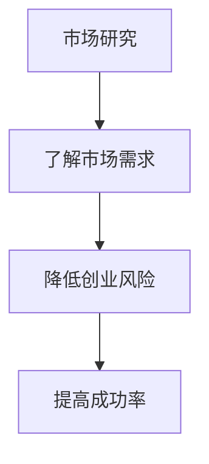

##### 2.1.2 市场研究的方法

市场研究的方法主要包括以下几种：

1. **定量研究**：通过问卷调查、统计分析等方法，收集大量数据，进行定量分析。
2. **定性研究**：通过访谈、焦点小组等方法，深入了解用户的真实需求和反馈。

**Mermaid流程图：**

```mermaid
graph TD
    A[定量研究] --> B[问卷调查]
    A --> C[统计分析]
    B --> D[访谈]
    B --> E[焦点小组]
```

##### 2.1.3 市场研究的技巧

在进行市场研究时，以下技巧有助于提高研究的有效性：

1. **明确研究目标**：在开始研究前，明确研究的目标和问题，确保研究具有针对性。
2. **选择合适的样本**：选择具有代表性的样本，确保数据的可靠性和有效性。
3. **保持客观性**：在研究过程中，保持客观公正的态度，避免主观偏见的影响。

**Mermaid流程图：**

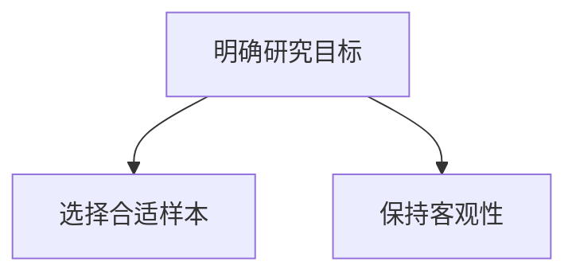

#### 2.2 需求分析的重要性

需求分析是市场研究的重要环节，它涉及到对目标客户需求的理解和把握。准确的需求分析有助于企业：

1. **确定产品方向**：通过了解用户需求，企业可以明确产品的发展方向，避免盲目跟风。
2. **优化产品设计**：基于用户需求进行产品设计，可以提高产品的市场竞争力。
3. **提升用户体验**：深入了解用户需求，可以为企业提供改进产品和服务的机会，提升用户满意度。

**Mermaid流程图：**

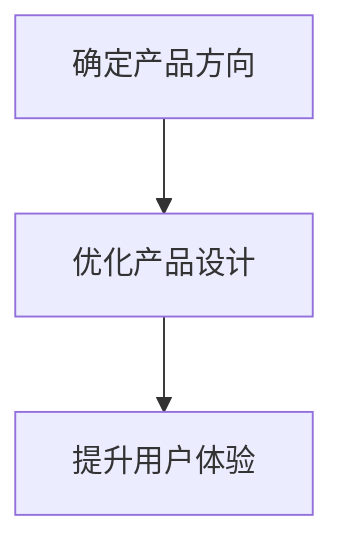

##### 2.2.1 需求分析的过程

需求分析的过程主要包括以下几个步骤：

1. **收集需求信息**：通过访谈、问卷调查、用户反馈等方式，收集用户需求信息。
2. **分析需求信息**：对收集到的需求信息进行整理、分析和分类，找出共性和差异。
3. **定义需求文档**：根据分析结果，编写需求文档，明确产品的功能、性能、用户体验等关键要素。

**Mermaid流程图：**

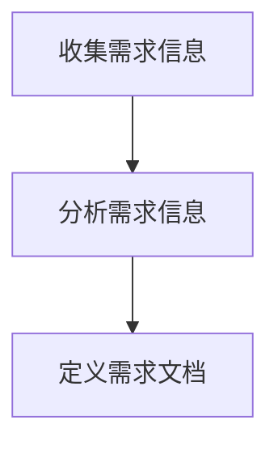

##### 2.2.2 如何发现并验证市场需求

1. **用户访谈**：通过面对面或在线访谈，直接了解用户的需求和痛点，获取第一手资料。
2. **问卷调查**：通过设计问卷调查，收集大量用户的数据，进行统计分析，了解市场需求。
3. **用户反馈**：在产品上线后，通过用户反馈机制，持续了解用户的使用情况和需求变化。

**伪代码：**

```python
# 验证市场需求流程

def validate_market_demand():
    # 用户访谈
    user_interviews = conduct_user_interviews()
    
    # 问卷调查
    survey_data = conduct_surveys()
    
    # 用户反馈
    user_feedback = collect_user_feedback()
    
    # 数据分析
    analyze_data(user_interviews, survey_data, user_feedback)
    
    # 需求验证
    validate需求的真实性
```

#### 2.3 市场研究与需求分析的工具

在进行市场研究和需求分析时，可以使用以下工具：

1. **用户画像工具**：如Google Analytics、Tableau等，帮助了解用户的基本信息和行为特征。
2. **数据分析工具**：如Excel、R、Python等，用于处理和分析大量数据。
3. **用户反馈工具**：如UserVoice、GetFeedback等，用于收集和分析用户反馈。

**Mermaid流程图：**

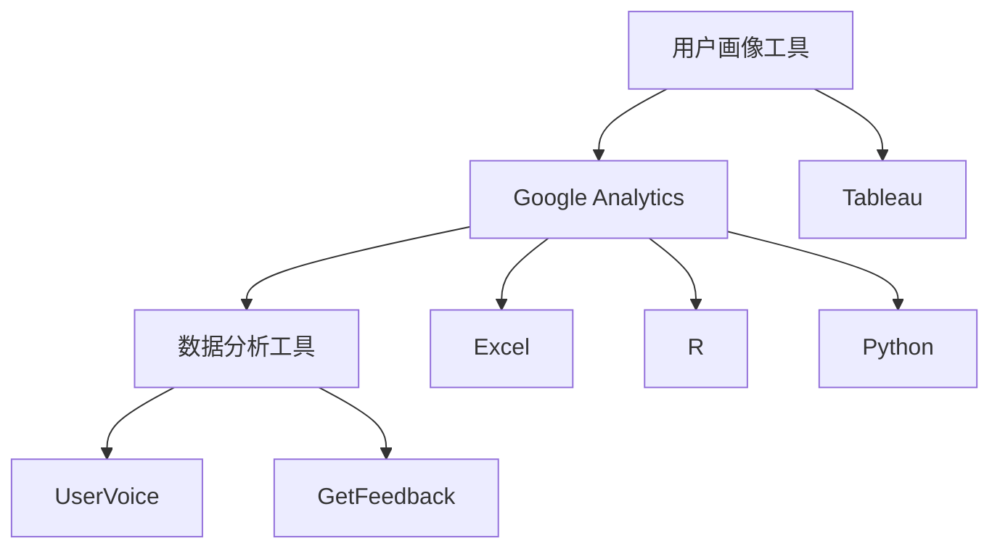

**总结：**

市场研究和需求分析是精益创业中不可或缺的环节，通过科学的方法和技巧，可以帮助企业更好地了解市场需求，降低创业风险，提高成功率。

**最佳实践 Tips：**

1. **定期进行市场研究**：市场环境不断变化，定期进行市场研究可以帮助企业及时调整策略。
2. **注重用户反馈**：用户反馈是了解市场需求的重要途径，企业应建立有效的用户反馈机制。

**注意事项：**

1. **避免数据偏差**：在市场研究过程中，要避免数据偏差，确保数据的可靠性和有效性。
2. **合理分配资源**：在资源有限的情况下，合理分配资源，确保市场研究和需求分析的质量。

**拓展阅读：**

- 《市场研究技术》（Market Research Techniques） - 斯图尔特·戴维斯（Stuart Davis）
- 《用户需求分析实战》（User Requirements Analysis: A Practical Guide to eliciting User Needs） - 布鲁斯·塔克曼（Bruce Tuckman）


### 第3章：最小可行产品（MVP）的开发与验证

#### 3.1 MVP的概念与设计

##### 3.1.1 MVP的定义

最小可行产品（Minimum Viable Product，简称MVP）是一种以最小资源投入、最高效地验证市场需求的产品开发策略。MVP的核心在于提供一个具有基本功能的产品原型，以便在有限的资源和时间内，验证产品是否满足市场需求。

**Mermaid流程图：**

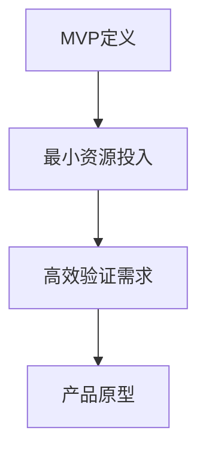

##### 3.1.2 MVP的设计原则

在设计MVP时，应遵循以下原则：

1. **功能最简化**：只包含核心功能，去除非必要的复杂性和冗余。
2. **用户体验优化**：尽管MVP功能有限，但用户体验仍需优化，以确保用户能够轻松使用产品。
3. **快速迭代**：MVP应能够快速迭代，以便根据用户反馈进行调整和优化。

**Mermaid流程图：**

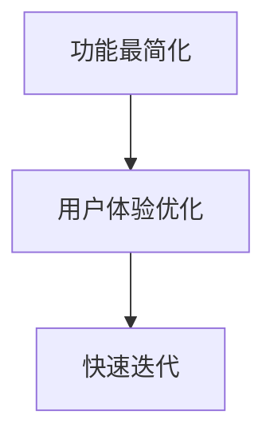

##### 3.1.3 MVP的设计步骤

1. **需求分析**：明确产品需求，包括用户需求、市场趋势和竞争态势。
2. **功能规划**：根据需求分析结果，规划MVP的核心功能。
3. **原型设计**：设计产品原型，包括界面布局、功能模块等。
4. **开发实现**：根据原型设计，进行产品开发。
5. **用户测试**：将MVP产品交付用户测试，收集反馈并进行迭代优化。

**Mermaid流程图：**

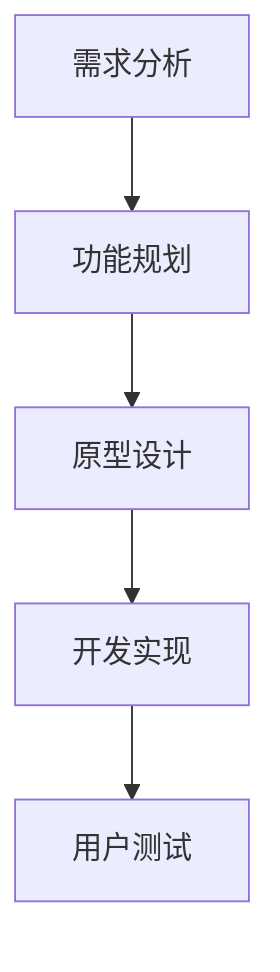

#### 3.2 MVP的开发过程

##### 3.2.1 开发策略

在MVP的开发过程中，应采取以下策略：

1. **快速开发**：采用敏捷开发方法，快速迭代，及时调整开发方向。
2. **持续集成**：使用持续集成工具，确保代码质量和开发效率。
3. **自动化测试**：进行自动化测试，确保产品质量。

**Mermaid流程图：**

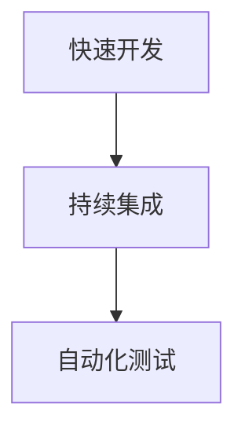

##### 3.2.2 开发流程

MVP的开发流程主要包括以下步骤：

1. **需求分析**：明确MVP的功能需求，确保开发方向正确。
2. **原型设计**：设计MVP的原型，确定界面布局和功能模块。
3. **开发实现**：根据原型设计，进行产品开发，实现核心功能。
4. **代码审查**：进行代码审查，确保代码质量和开发规范。
5. **用户测试**：将MVP产品交付用户测试，收集反馈，进行迭代优化。

**Mermaid流程图：**

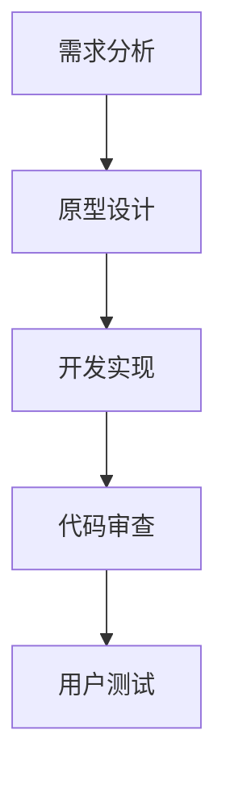

#### 3.3 如何验证MVP

验证MVP是确保产品满足市场需求的关键环节，以下方法有助于验证MVP：

1. **用户测试**：通过邀请潜在用户进行测试，收集用户反馈，了解产品的易用性和功能满足度。
2. **数据分析**：收集MVP上线后的数据，如用户活跃度、转化率等，分析产品的市场表现。
3. **A/B测试**：通过对比不同版本的MVP，测试不同功能对用户行为的影响。

**Mermaid流程图：**

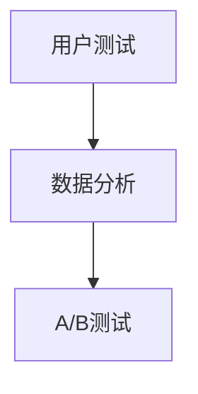

##### 3.3.1 用户测试

用户测试是验证MVP最直接的方法，以下步骤有助于进行用户测试：

1. **确定测试目标**：明确测试的目的，如验证功能、用户体验等。
2. **设计测试场景**：设计模拟用户使用产品的场景，如注册、登录、购买等。
3. **邀请用户参与**：通过线上或线下方式，邀请潜在用户参与测试。
4. **收集反馈**：在测试过程中，收集用户的操作记录、反馈和建议。

**伪代码：**

```python
# 用户测试流程

def user_testing():
    # 确定测试目标
    test_goals = define_test_goals()
    
    # 设计测试场景
    test_scenarios = design_test_scenarios()
    
    # 邀请用户参与
    users = invite_users()
    
    # 收集反馈
    feedback = collect_user_feedback()
    
    # 分析反馈
    analyze_feedback(feedback)
```

##### 3.3.2 数据分析

数据分析是通过收集MVP上线后的数据，了解产品的市场表现。以下方法有助于进行数据分析：

1. **用户行为分析**：分析用户的行为数据，如访问量、停留时间、点击率等。
2. **转化率分析**：分析用户的转化数据，如注册量、购买量等。
3. **留存率分析**：分析用户的留存情况，了解产品的黏性。

**伪代码：**

```python
# 数据分析流程

def data_analysis():
    # 收集用户行为数据
    user_behavior_data = collect_user_behavior_data()
    
    # 收集转化数据
    conversion_data = collect_conversion_data()
    
    # 收集留存数据
    retention_data = collect_retention_data()
    
    # 分析用户行为
    analyze_user_behavior(user_behavior_data)
    
    # 分析转化率
    analyze_conversion_rate(conversion_data)
    
    # 分析留存率
    analyze_retention_rate(retention_data)
```

##### 3.3.3 A/B测试

A/B测试是一种通过对比不同版本的MVP，测试功能对用户行为影响的验证方法。以下步骤有助于进行A/B测试：

1. **设计测试方案**：明确测试的目标和版本，如功能A和功能B的对比。
2. **实施A/B测试**：将用户随机分配到两个版本，记录用户行为数据。
3. **分析测试结果**：对比两个版本的用户行为数据，分析功能对用户行为的影响。

**伪代码：**

```python
# A/B测试流程

def ab_test():
    # 设计测试方案
    test_plan = design_test_plan()
    
    # 实施A/B测试
    implement_ab_test(test_plan)
    
    # 收集用户行为数据
    user_behavior_data = collect_user_behavior_data()
    
    # 分析测试结果
    analyze_test_results(user_behavior_data)
```

**总结：**

通过MVP的开发与验证，企业可以在有限的资源和时间内，快速验证市场需求，降低创业风险。MVP的设计与验证方法，包括用户测试、数据分析和A/B测试，为企业提供了科学的验证手段。

**最佳实践 Tips：**

1. **尽早启动MVP开发**：在产品规划阶段，尽早启动MVP开发，以便快速验证市场需求。
2. **持续关注用户反馈**：在MVP开发与验证过程中，持续关注用户反馈，及时调整产品方向。

**注意事项：**

1. **避免过度设计**：在MVP开发中，避免过度设计，只包含核心功能。
2. **确保数据质量**：在数据分析过程中，确保数据的质量和准确性。

**拓展阅读：**

- 《精益创业》（The Lean Startup） - 埃里克·莱斯（Eric Ries）
- 《敏捷开发实践指南》（Agile Project Guide） - 宾·哈勃（Binn Harb）


### 第4章：精益创业在创业初期的应用

#### 4.1 如何在资源有限的情况下启动创业

在资源有限的情况下启动创业是精益创业的一个重要挑战。创业者需要充分利用现有资源，确保创业项目能够在有限的条件下稳步前进。以下是几种常用的策略：

1. **低成本启动**：选择低成本的商业模式，如基于互联网的产品或服务，避免高昂的实体店面成本。
2. **利用现有资源**：充分利用个人和团队的现有技能、人脉和资源，如使用开源工具和平台，降低开发成本。
3. **众筹**：通过众筹平台，如Kickstarter或Indiegogo，提前获得资金支持，降低初始投资风险。

**Mermaid流程图：**

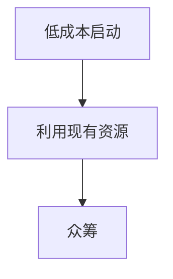

##### 4.1.1 低成本启动的具体方法

1. **选择互联网产品**：互联网产品具有低边际成本的特点，能够有效降低创业启动成本。例如，开发一款基于移动应用的软件或在线服务。
2. **使用开源工具**：开源工具和平台可以帮助创业者节省大量开发成本。例如，使用GitHub进行代码管理，使用Jenkins进行持续集成。

**伪代码：**

```python
# 低成本启动策略

def low_cost_startup():
    # 选择互联网产品
    choose_internet_product()
    
    # 使用开源工具
    use_open_source_tools()
```

##### 4.1.2 利用现有资源的具体方法

1. **个人技能**：创业者可以利用自身的专业技能和知识，进行产品开发和市场营销。
2. **团队协作**：组建一个高效的团队，发挥每个人的特长，共同推进创业项目。
3. **人脉网络**：利用个人和团队的人脉网络，寻找合作伙伴、投资人或客户。

**伪代码：**

```python
# 利用现有资源策略

def leverage_resources():
    # 利用个人技能
    use 个人skills()
    
    # 团队协作
    collaborate_with_team()
    
    # 利用人脉网络
    leverage_network()
```

##### 4.1.3 众筹的具体方法

1. **选择合适的众筹平台**：根据产品类型和市场定位，选择合适的众筹平台。
2. **制定众筹计划**：明确众筹目标、时间表和奖励方案。
3. **宣传推广**：通过社交媒体、博客和线下活动，提高众筹项目的知名度。

**伪代码：**

```python
# 众筹策略

def crowdfunding():
    # 选择合适平台
    choose_crowdfunding_platform()
    
    # 制定众筹计划
    create_crowdfunding_plan()
    
    # 宣传推广
    promote_crowdfunding()
```

#### 4.2 如何管理创业风险

创业风险是创业者必须面对的一个挑战。通过有效的风险管理，创业者可以降低创业失败的可能性。以下是几种常用的风险管理方法：

1. **多元化**：通过多元化投资和业务，降低单一业务失败对整体创业项目的冲击。
2. **风险管理**：建立风险管理机制，定期评估创业项目的风险，并采取相应的措施进行控制。
3. **保险**：购买适当的保险，以降低意外事件对创业项目的冲击。

**Mermaid流程图：**

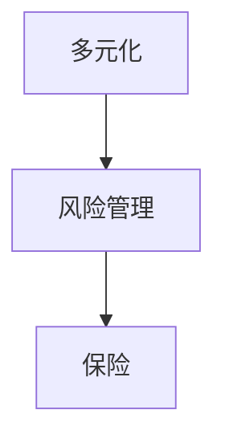

##### 4.2.1 多元化的具体方法

1. **业务多元化**：在产品和服务上，开发多元化的业务，降低单一业务失败的风险。
2. **市场多元化**：开拓不同的市场，降低单一市场变化对创业项目的冲击。

**伪代码：**

```python
# 多元化策略

def diversification():
    # 业务多元化
    diversify_business()
    
    # 市场多元化
    diversify_markets()
```

##### 4.2.2 风险管理的具体方法

1. **风险评估**：定期对创业项目进行风险评估，识别潜在风险。
2. **风险控制**：制定风险控制措施，如设置止损点、调整投资策略等。
3. **应急计划**：制定应急计划，以应对可能出现的突发事件。

**伪代码：**

```python
# 风险管理策略

def risk_management():
    # 风险评估
    assess_risks()
    
    # 风险控制
    control_risks()
    
    # 应急计划
    create_emergency_plan()
```

##### 4.2.3 保险的具体方法

1. **购买适当的保险**：根据创业项目的特点和风险，购买适当的保险，如商业保险、责任保险等。
2. **保险规划**：制定保险规划，确保保险能够覆盖创业项目的主要风险。

**伪代码：**

```python
# 保险策略

def insurance():
    # 购买适当保险
    buy_appropriate_insurance()
    
    # 保险规划
    plan_insurance()
```

#### 4.3 创业初期的财务规划与管理

财务规划和管理是创业初期的重要环节。以下方法有助于进行有效的财务规划和管理：

1. **预算编制**：制定详细的预算计划，包括收入、支出和现金流预测。
2. **现金流管理**：确保现金流充足，以应对创业初期的资金压力。
3. **成本控制**：通过优化运营流程和降低成本，提高创业项目的盈利能力。

**Mermaid流程图：**

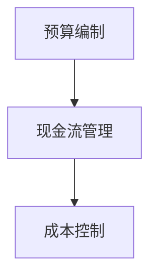

##### 4.3.1 预算编制的具体方法

1. **收入预测**：根据市场需求和销售计划，预测未来的收入。
2. **支出规划**：根据运营计划，规划各项支出，包括人力成本、物料成本等。
3. **预算调整**：根据实际情况，及时调整预算，确保预算的合理性和可执行性。

**伪代码：**

```python
# 预算编制策略

def budget_planning():
    # 收入预测
    predict_income()
    
    # 支出规划
    plan_expenses()
    
    # 预算调整
    adjust_budget()
```

##### 4.3.2 现金流管理的具体方法

1. **现金流预测**：根据收入和支出的预测，制定现金流预测表，确保现金流充足。
2. **现金流监控**：定期监控现金流情况，及时发现并解决潜在的问题。
3. **现金流优化**：通过优化运营流程和降低成本，提高现金流管理水平。

**伪代码：**

```python
# 现金流管理策略

def cash_flow_management():
    # 现金流预测
    predict_cash_flow()
    
    # 现金流监控
    monitor_cash_flow()
    
    # 现金流优化
    optimize_cash_flow()
```

##### 4.3.3 成本控制的具体方法

1. **成本分析**：定期进行成本分析，找出成本较高的环节，制定降低成本的措施。
2. **成本控制**：制定成本控制措施，确保各项成本控制在预算范围内。
3. **成本效益分析**：进行成本效益分析，确保降低成本的措施能够带来实际效益。

**伪代码：**

```python
# 成本控制策略

def cost_control():
    # 成本分析
    analyze_costs()
    
    # 成本控制
    control_costs()
    
    # 成本效益分析
    analyze_cost_benefit()
```

**总结：**

在创业初期，精益创业的方法能够帮助创业者充分利用有限资源，降低创业风险，实现财务规划与管理的有效进行。

**最佳实践 Tips：**

1. **充分利用低成本策略**：在创业初期，充分利用低成本策略，降低创业启动成本。
2. **建立有效的风险管理机制**：通过多元化、风险管理和保险等手段，降低创业风险。
3. **注重财务规划与管理**：制定详细的预算和现金流计划，进行有效的成本控制。

**注意事项：**

1. **避免过度依赖外部资金**：在创业初期，尽量避免过度依赖外部资金，确保财务独立性。
2. **持续关注市场变化**：市场环境不断变化，创业者需要持续关注市场变化，及时调整创业策略。

**拓展阅读：**

- 《创业财务手册》（Startup Finance Handbook） - 威廉·H·卡尔森（William H. Carlson）
- 《精益创业》（The Lean Startup） - 埃里克·莱斯（Eric Ries）


### 第5章：精益创业在创业过程中的持续优化

#### 5.1 如何持续迭代产品

在精益创业的过程中，持续迭代产品是确保产品满足市场需求、提高用户满意度的重要手段。以下是几种常见的迭代方法和步骤：

1. **用户反馈机制**：建立有效的用户反馈机制，收集用户对产品的意见和建议。
2. **数据分析**：利用数据分析工具，对用户行为数据进行分析，找出产品的改进方向。
3. **A/B测试**：通过A/B测试，对比不同版本的改进效果，确定最佳的优化方案。

**Mermaid流程图：**

```mermaid
graph TD
    A[用户反馈机制] --> B[数据分析]
    B --> C[A/B测试]
```

##### 5.1.1 用户反馈机制的设计与实施

1. **设计反馈渠道**：设计多种反馈渠道，如在线反馈表、社交媒体、客服系统等，方便用户提交反馈。
2. **收集与分析反馈**：定期收集用户反馈，对反馈进行分类和分析，找出共性问题。
3. **反馈处理与跟进**：对用户反馈进行处理，及时回复用户，跟进反馈的解决进度。

**伪代码：**

```python
# 用户反馈机制设计与实施

def feedback_mechanism():
    # 设计反馈渠道
    design_feedback_channels()
    
    # 收集与分析反馈
    collect_and_analyze_feedback()
    
    # 反馈处理与跟进
    process_feedback_and_follow_up()
```

##### 5.1.2 数据分析的具体方法

1. **用户行为分析**：分析用户的访问量、停留时间、页面点击等行为数据，找出用户的痛点。
2. **转化率分析**：分析用户的注册、购买等转化数据，找出影响转化的因素。
3. **留存率分析**：分析用户的留存情况，找出提高用户黏性的方法。

**伪代码：**

```python
# 数据分析流程

def data_analysis():
    # 用户行为分析
    analyze_user_behavior()
    
    # 转化率分析
    analyze_conversion_rate()
    
    # 留存率分析
    analyze_retention_rate()
```

##### 5.1.3 A/B测试的步骤

1. **确定测试目标**：明确测试的目标，如提高用户点击率、降低页面跳出率等。
2. **设计测试方案**：设计两个或多个测试版本，确定测试的变量和目标。
3. **实施A/B测试**：将用户随机分配到不同版本，记录用户行为数据。
4. **分析测试结果**：对比不同版本的用户行为数据，分析测试效果。

**伪代码：**

```python
# A/B测试流程

def ab_test():
    # 确定测试目标
    define_test_goals()
    
    # 设计测试方案
    design_test_schemes()
    
    # 实施A/B测试
    implement_ab_test()
    
    # 分析测试结果
    analyze_test_results()
```

#### 5.2 如何在市场竞争中保持优势

在激烈的市场竞争中，创业者需要采取一系列策略来保持竞争优势。以下是几种常见的方法：

1. **创新**：不断进行技术创新和产品创新，提供差异化的产品和服务。
2. **成本控制**：通过优化运营流程和降低成本，提高产品的性价比。
3. **市场定位**：明确市场定位，专注于特定的细分市场，提供针对性的产品和服务。

**Mermaid流程图：**

```mermaid
graph TD
    A[创新] --> B[成本控制]
    B --> C[市场定位]
```

##### 5.2.1 创新的具体方法

1. **技术创新**：通过研发新技术或改进现有技术，提高产品的性能和用户体验。
2. **产品创新**：开发全新的产品或服务，满足用户的新需求。
3. **商业模式创新**：创新商业模式，如采用订阅模式、共享经济模式等，提高市场竞争力。

**伪代码：**

```python
# 创新策略

def innovation():
    # 技术创新
    technological_innovation()
    
    # 产品创新
    product_innovation()
    
    # 商业模式创新
    business_model_innovation()
```

##### 5.2.2 成本控制的具体方法

1. **优化运营流程**：通过优化生产流程、供应链管理等方式，提高运营效率，降低成本。
2. **采购策略**：通过批量采购、供应商谈判等方式，降低采购成本。
3. **人力资源管理**：通过优化人力资源配置、提高员工工作效率等方式，降低人力成本。

**伪代码：**

```python
# 成本控制策略

def cost_control():
    # 优化运营流程
    optimize_operation流程()
    
    # 采购策略
    procurement_strategy()
    
    # 人力资源管理
    human_resource_management()
```

##### 5.2.3 市场定位的具体方法

1. **市场调研**：通过市场调研，了解目标市场的需求、竞争态势等，确定市场定位。
2. **目标客户分析**：分析目标客户的需求、行为和偏好，提供针对性的产品和服务。
3. **差异化策略**：通过差异化产品、服务或品牌形象，在目标市场中树立独特的竞争优势。

**伪代码：**

```python
# 市场定位策略

def market_positioning():
    # 市场调研
    market_research()
    
    # 目标客户分析
    target_customer_analysis()
    
    # 差异化策略
    differentiation_strategy()
```

#### 5.3 保持创业精神与企业文化

在创业过程中，保持创业精神和企业文化对于团队的凝聚力和创新能力的提升至关重要。以下方法有助于保持创业精神与企业文化：

1. **激励与认可**：通过激励机制，如奖金、股权激励等，激发员工的积极性和创造力。
2. **开放沟通**：建立开放沟通的文化，鼓励员工提出意见和建议，营造良好的创新氛围。
3. **培训与发展**：为员工提供培训和发展机会，提升团队的综合素质和创新能力。

**Mermaid流程图：**

```mermaid
graph TD
    A[激励与认可] --> B[开放沟通]
    B --> C[培训与发展]
```

##### 5.3.1 激励与认可的方法

1. **设定明确目标**：为员工设定明确的目标和期望，激励他们为实现目标而努力。
2. **奖励机制**：建立奖励机制，对表现优秀的员工进行物质或精神上的奖励。
3. **股权激励**：通过股权激励，让员工成为公司的股东，增强他们的归属感和责任感。

**伪代码：**

```python
# 激励与认可策略

def motivation_and_recognition():
    # 设定明确目标
    set_clear_goals()
    
    # 奖励机制
    reward_system()
    
    # 股权激励
    equity_incentives()
```

##### 5.3.2 开放沟通的方法

1. **定期会议**：定期召开团队会议，鼓励员工分享自己的想法和意见。
2. **开放邮箱**：设立开放邮箱，员工可以随时提交问题和建议。
3. **内部论坛**：建立内部论坛，员工可以在论坛上交流意见，分享经验。

**伪代码：**

```python
# 开放沟通策略

def open_communication():
    # 定期会议
    regular_meetings()
    
    # 开放邮箱
    open_inbox()
    
    # 内部论坛
    internal_forum()
```

##### 5.3.3 培训与发展的方法

1. **技能培训**：为员工提供相关技能培训，提升他们的专业能力。
2. **领导力培养**：为潜在领导者提供领导力培养计划，提升他们的管理能力。
3. **职业发展规划**：为员工制定职业发展规划，帮助他们在职业生涯中不断成长。

**伪代码：**

```python
# 培训与发展策略

def training_and_development():
    # 技能培训
    skill_training()
    
    # 领导力培养
    leadership_training()
    
    # 职业发展规划
    career发展规划()
```

**总结：**

在精益创业的过程中，持续优化产品、保持市场竞争优势和保持创业精神与企业文化是创业者需要重点关注的问题。通过有效的迭代、创新和市场定位，以及激励、沟通和培训，创业者可以确保团队在创业过程中保持活力和创新能力。

**最佳实践 Tips：**

1. **定期进行用户反馈和数据分析**：通过用户反馈和数据分析，及时了解市场动态和用户需求，持续优化产品。
2. **注重团队建设和文化培育**：通过激励机制、开放沟通和培训发展，提升团队的综合素质和创新能力。

**注意事项：**

1. **避免过度创新**：创新要基于市场需求，避免盲目追求创新，导致资源浪费。
2. **保持持续学习和改进的态度**：在创业过程中，持续学习和改进是保持竞争优势的关键。

**拓展阅读：**

- 《精益创业》（The Lean Startup） - 埃里克·莱斯（Eric Ries）
- 《创业管理》（Entrepreneurship: Theory and Practice） - 约翰·H·肖尔斯（John H. Sherraden）


### 第6章：精益创业在创业成功后的扩展与规模化

#### 6.1 创业成功后的扩展策略

在创业成功后，扩展企业规模成为关键任务。以下策略有助于企业在保持创业精神的同时，实现规模化扩展：

1. **市场需求扩展**：分析市场趋势，寻找新的市场需求和机会，扩大产品线的覆盖范围。
2. **渠道拓展**：通过线上和线下渠道的拓展，提高产品的市场覆盖率和销售渠道的多样性。
3. **国际化战略**：考虑国际市场的拓展，开拓新的市场和客户群体，实现全球化布局。

**Mermaid流程图：**

```mermaid
graph TD
    A[市场需求扩展] --> B[渠道拓展]
    B --> C[国际化战略]
```

##### 6.1.1 市场需求扩展的方法

1. **市场调研**：通过深入的市场调研，了解目标市场的需求、竞争对手和行业趋势。
2. **用户调研**：与现有用户进行沟通，了解他们的需求和建议，寻找潜在的市场机会。
3. **数据分析**：利用数据分析工具，分析用户行为和市场数据，发现新的市场需求。

**伪代码：**

```python
# 市场需求扩展策略

def market_expansion():
    # 市场调研
    market_research()
    
    # 用户调研
    user_research()
    
    # 数据分析
    data_analysis()
```

##### 6.1.2 渠道拓展的方法

1. **线上渠道**：通过电子商务平台、社交媒体和内容营销等线上渠道，扩大产品的线上销售渠道。
2. **线下渠道**：通过开设实体店铺、参加行业展会和举办线下活动等，拓展产品的线下销售渠道。
3. **分销合作**：与代理商、分销商和零售商等合作伙伴建立合作关系，扩大销售网络。

**伪代码：**

```python
# 渠道拓展策略

def channel_expansion():
    # 线上渠道
    online_channel_expansion()
    
    # 线下渠道
    offline_channel_expansion()
    
    # 分销合作
    distribution合作协议()
```

##### 6.1.3 国际化战略的方法

1. **本地化**：根据目标市场的文化、语言和消费者行为，对产品和服务进行本地化调整。
2. **国际市场调研**：深入了解目标国际市场的市场需求、竞争态势和消费者偏好。
3. **国际合作**：寻找国际合作伙伴，共同开拓国际市场，降低进入国际市场的风险。

**伪代码：**

```python
# 国际化战略策略

def international_strategy():
    # 本地化
    localization()
    
    # 国际市场调研
    international_market_research()
    
    # 国际合作
    international_partnerships()
```

#### 6.2 如何实现规模化

实现规模化是企业发展的关键目标之一。以下方法有助于企业实现规模化扩展：

1. **自动化与标准化**：通过自动化和标准化生产流程，提高生产效率，降低成本。
2. **供应链优化**：优化供应链管理，提高供应链的稳定性和灵活性。
3. **资本运作**：通过股权融资、债务融资等资本运作手段，获得充足的资金支持。

**Mermaid流程图：**

```mermaid
graph TD
    A[自动化与标准化] --> B[供应链优化]
    B --> C[资本运作]
```

##### 6.2.1 自动化与标准化的方法

1. **流程自动化**：通过引入自动化设备和技术，实现生产流程的自动化，提高生产效率。
2. **标准化操作**：制定标准化的操作流程和规范，确保产品质量的一致性和稳定性。

**伪代码：**

```python
# 自动化与标准化策略

def automation_and_standardization():
    # 流程自动化
    process_automation()
    
    # 标准化操作
    standard_operations()
```

##### 6.2.2 供应链优化的方法

1. **供应商管理**：通过优选供应商、建立长期合作关系，确保供应链的稳定性和成本效益。
2. **物流管理**：优化物流流程，提高物流效率，降低物流成本。
3. **库存管理**：通过合理的库存管理策略，减少库存成本，提高资金周转率。

**伪代码：**

```python
# 供应链优化策略

def supply_chain_optimization():
    # 供应商管理
    supplier_management()
    
    # 物流管理
    logistics_management()
    
    # 库存管理
    inventory_management()
```

##### 6.2.3 资本运作的方法

1. **股权融资**：通过股权融资，引入战略投资者和财务投资者，获得资金支持。
2. **债务融资**：通过债务融资，如银行贷款、发行债券等，获得资金支持。
3. **上市融资**：通过在资本市场上上市，获得资金支持，同时提高企业的知名度和公信力。

**伪代码：**

```python
# 资本运作策略

def capital_operations():
    # 股权融资
    equity_funding()
    
    # 债务融资
    debt_funding()
    
    # 上市融资
    public_offering()
```

#### 6.3 保持创业精神与企业文化

在实现规模化扩展的过程中，保持创业精神和文化是确保企业持续发展的关键。以下方法有助于保持创业精神和文化：

1. **开放沟通**：建立开放沟通的文化，鼓励员工分享意见和想法，营造创新氛围。
2. **激励与认可**：通过激励机制，如奖金、股权激励等，激发员工的积极性和创造力。
3. **持续创新**：鼓励员工持续创新，推动企业的技术进步和产品创新。

**Mermaid流程图：**

```mermaid
graph TD
    A[开放沟通] --> B[激励与认可]
    B --> C[持续创新]
```

##### 6.3.1 开放沟通的方法

1. **定期会议**：定期召开团队会议，鼓励员工分享想法和经验。
2. **内部论坛**：建立内部论坛，员工可以在论坛上交流意见，分享最佳实践。
3. **员工反馈**：建立员工反馈机制，鼓励员工提出意见和建议。

**伪代码：**

```python
# 开放沟通策略

def open_communication():
    # 定期会议
    regular_meetings()
    
    # 内部论坛
    internal_forum()
    
    # 员工反馈
    employee_feedback()
```

##### 6.3.2 激励与认可的方法

1. **绩效评估**：建立科学的绩效评估体系，对员工的业绩进行客观评估。
2. **奖励机制**：设立奖励机制，对表现优秀的员工进行物质或精神上的奖励。
3. **股权激励**：通过股权激励，让员工成为企业的股东，增强他们的归属感和责任感。

**伪代码：**

```python
# 激励与认可策略

def motivation_recognition():
    # 绩效评估
    performance_evaluation()
    
    # 奖励机制
    reward_system()
    
    # 股权激励
    equity_incentives()
```

##### 6.3.3 持续创新的方法

1. **研发投入**：加大研发投入，推动技术创新和产品创新。
2. **跨部门合作**：鼓励不同部门之间的合作，促进知识的共享和创新。
3. **员工培训**：提供员工培训和发展机会，提升他们的创新能力和专业素养。

**伪代码：**

```python
# 持续创新策略

def continuous_innovation():
    # 研发投入
    R&D_investment()
    
    # 跨部门合作
    cross_department_cooperation()
    
    # 员工培训
    employee_training()
```

**总结：**

在创业成功后，通过市场需求扩展、渠道拓展和国际化战略，企业可以实现规模化扩展。同时，通过自动化与标准化、供应链优化和资本运作，企业可以提高生产效率和资金支持。保持创业精神和文化，通过开放沟通、激励与认可和持续创新，企业可以确保在规模化扩展过程中保持活力和创新能力。

**最佳实践 Tips：**

1. **定期进行市场调研**：通过市场调研，及时了解市场需求和竞争态势，调整战略。
2. **注重团队建设**：通过激励机制和培训，提升团队的综合素质和创新能力。

**注意事项：**

1. **避免盲目扩展**：在扩展过程中，避免盲目追求规模，确保每一步都符合市场需求和企业实际情况。
2. **保持创新精神**：在规模化扩展过程中，保持创业精神和文化，推动企业的持续创新。

**拓展阅读：**

- 《精益创业》（The Lean Startup） - 埃里克·莱斯（Eric Ries）
- 《创业管理》（Entrepreneurship: Theory and Practice） - 约翰·H·肖尔斯（John H. Sherraden）


### 第7章：成功创业公司的精益创业实践

#### 7.1 公司A的精益创业之路

公司A是一家专注于移动互联网产品的创业公司。以下是公司A在精益创业过程中的实践：

1. **市场研究**：在产品开发初期，公司A进行了详细的市场调研，通过用户访谈、问卷调查和数据分析，明确了目标市场和用户需求。

**Mermaid流程图：**

```mermaid
graph TD
    A[市场调研] --> B[用户访谈]
    B --> C[问卷调查]
    C --> D[数据分析]
```

2. **MVP开发**：公司A采用了MVP方法，开发了一个具有基本功能的产品原型，并通过用户测试和反馈，不断优化产品功能。

**Mermaid流程图：**

```mermaid
graph TD
    A[MVP开发] --> B[用户测试]
    B --> C[反馈优化]
```

3. **迭代与验证**：公司A在产品上线后，持续进行迭代和验证，通过数据分析、用户反馈和A/B测试，不断改进产品，提高用户满意度。

**Mermaid流程图：**

```mermaid
graph TD
    A[数据分析] --> B[用户反馈]
    B --> C[A/B测试]
```

4. **市场拓展**：在产品成功后，公司A通过市场需求扩展和渠道拓展，将产品推向更广泛的市场，实现了规模化扩展。

**Mermaid流程图：**

```mermaid
graph TD
    A[市场需求扩展] --> B[渠道拓展]
```

**总结**：公司A通过精益创业的方法，从市场研究到MVP开发，再到迭代和验证，最终实现了产品的成功和市场的拓展。

#### 7.2 公司B的精益创业案例

公司B是一家提供智能办公解决方案的创业公司。以下是公司B在精益创业过程中的实践：

1. **创新理念**：公司B在创业初期，就秉持着创新的理念，通过研发新技术，提供独特的智能办公产品。

**Mermaid流程图：**

```mermaid
graph TD
    A[创新理念] --> B[技术研发]
```

2. **MVP验证**：公司B通过MVP方法，快速构建了一个具有核心功能的智能办公产品原型，并通过用户测试和反馈，优化了产品。

**Mermaid流程图：**

```mermaid
graph TD
    A[MVP验证] --> B[用户测试]
    B --> C[反馈优化]
```

3. **成本控制**：公司B在创业初期，采取了严格的成本控制措施，通过优化运营流程和降低成本，确保了企业的可持续发展。

**Mermaid流程图：**

```mermaid
graph TD
    A[成本控制] --> B[流程优化]
    B --> C[成本降低]
```

4. **国际化扩展**：在产品成熟后，公司B通过国际化战略，将产品推向国际市场，实现了全球化的布局。

**Mermaid流程图：**

```mermaid
graph TD
    A[国际化扩展] --> B[国际市场调研]
    B --> C[国际合作]
```

**总结**：公司B通过精益创业的方法，从创新理念到MVP验证，再到成本控制和国际化扩展，成功地将其智能办公产品推向了全球市场。

#### 7.3 公司C的精益创业实践

公司C是一家提供在线教育解决方案的创业公司。以下是公司C在精益创业过程中的实践：

1. **用户调研**：公司C在产品开发初期，进行了大量的用户调研，通过了解用户的学习习惯和需求，确定了产品的方向。

**Mermaid流程图：**

```mermaid
graph TD
    A[用户调研] --> B[学习习惯分析]
    B --> C[需求确定]
```

2. **MVP构建**：公司C通过MVP方法，快速构建了一个具有核心功能的在线教育平台，并通过用户测试和反馈，不断优化产品。

**Mermaid流程图：**

```mermaid
graph TD
    A[MVP构建] --> B[用户测试]
    B --> C[反馈优化]
```

3. **持续迭代**：公司C在产品上线后，持续进行迭代和优化，通过数据分析、用户反馈和A/B测试，不断提高产品的用户体验。

**Mermaid流程图：**

```mermaid
graph TD
    A[数据分析] --> B[用户反馈]
    B --> C[A/B测试]
```

4. **市场定位**：公司C通过明确市场定位，专注于在线教育领域，提供差异化的教育解决方案，赢得了市场份额。

**Mermaid流程图：**

```mermaid
graph TD
    A[市场定位] --> B[在线教育市场]
    B --> C[差异化解决方案]
```

**总结**：公司C通过精益创业的方法，从用户调研到MVP构建，再到持续迭代和市场定位，成功地将其在线教育平台推向了市场，并取得了良好的业绩。

通过以上案例，我们可以看到，精益创业方法在创业实践中的应用，能够帮助企业更好地应对市场变化，降低创业风险，实现可持续发展。无论是市场研究、MVP开发，还是迭代优化和市场定位，精益创业都为企业提供了科学的方法和工具。

**最佳实践 Tips：**

1. **持续进行市场调研**：市场环境不断变化，企业需要持续进行市场调研，了解市场需求和竞争态势。
2. **重视用户反馈**：用户反馈是优化产品的重要依据，企业应建立有效的用户反馈机制，及时调整产品方向。
3. **注重成本控制**：在创业初期，资源有限，企业应采取严格的成本控制措施，确保企业的可持续发展。

**注意事项：**

1. **避免盲目扩张**：在实现规模化扩展过程中，企业应避免盲目扩张，确保每一步都符合市场需求和企业实际情况。
2. **保持创新精神**：创新是企业发展的动力，企业应持续推动技术创新和产品创新，保持竞争优势。

**拓展阅读：**

- 《精益创业》（The Lean Startup） - 埃里克·莱斯（Eric Ries）
- 《创业管理》（Entrepreneurship: Theory and Practice） - 约翰·H·肖尔斯（John H. Sherraden）


### 第8章：创业失败案例与反思

#### 8.1 失败原因分析

创业失败的原因多种多样，以下是几种常见的失败原因：

1. **市场定位错误**：产品或服务与市场需求不匹配，导致市场接受度低。
2. **资源匮乏**：缺乏足够的资金、人才和资源，导致项目无法持续进行。
3. **管理不善**：企业内部管理混乱，缺乏有效的决策和执行机制。
4. **竞争激烈**：面临强大的竞争对手，无法在激烈的市场竞争中脱颖而出。

**Mermaid流程图：**

```mermaid
graph TD
    A[市场定位错误] --> B[资源匮乏]
    B --> C[管理不善]
    C --> D[竞争激烈]
```

##### 8.1.1 市场定位错误的案例分析

案例一：某创业公司开发了一款智能家居产品，但在市场推广时发现，该产品的定位与市场需求不符，消费者对产品的兴趣不高，导致销售不佳。

**伪代码：**

```python
# 市场定位错误案例

def market定位错误(case):
    # 产品定位
    product定位 = "智能家居产品"
    
    # 市场调研
    market调研 = conduct_market_research()
    
    # 销售情况
    sales_performance = low
```

##### 8.1.2 资源匮乏的案例分析

案例二：某创业公司由于缺乏足够的资金，无法进行有效的市场推广和产品研发，导致项目进展缓慢，最终无法持续运营。

**伪代码：**

```python
# 资源匮乏案例

def resource_insufficiency(case):
    # 资金状况
    funding_status = insufficient
    
    # 市场推广
    marketing_activities = limited
    
    # 产品研发
    product_development = delayed
```

##### 8.1.3 管理不善的案例分析

案例三：某创业公司由于管理不善，导致企业内部沟通不畅，决策效率低下，最终影响了项目的进展。

**伪代码：**

```python
# 管理不善案例

def management incompetence(case):
    # 沟通情况
    communication = poor
    
    # 决策效率
    decision-making_efficiency = low
    
    # 项目进展
    project_progress = delayed
```

##### 8.1.4 竞争激烈的案例分析

案例四：某创业公司进入了一个竞争激烈的行业，由于缺乏市场优势和核心竞争力，无法与行业巨头抗衡，最终被市场淘汰。

**伪代码：**

```python
# 竞争激烈案例

def intense_competition(case):
    # 市场竞争
    market_competition = high
    
    # 市场份额
    market_share = low
    
    # 企业存活
    business_survival = threatened
```

#### 8.2 如何从失败中吸取教训

从创业失败中吸取教训是提高创业成功率的重要途径。以下方法有助于创业者从失败中吸取教训：

1. **反思与总结**：认真反思失败的原因，总结经验教训，找出改进的方向。
2. **持续学习**：通过学习成功企业的经验和失败教训，提升自己的创业能力。
3. **调整策略**：根据失败的原因，调整创业策略，优化产品和服务。

**Mermaid流程图：**

```mermaid
graph TD
    A[反思与总结] --> B[持续学习]
    B --> C[调整策略]
```

##### 8.2.1 反思与总结的方法

1. **深入分析**：对失败的项目进行深入分析，找出导致失败的具体原因。
2. **撰写总结报告**：撰写总结报告，记录失败的原因、经验教训和改进措施。
3. **分享经验**：将失败的经历分享给团队和同行，共同学习和进步。

**伪代码：**

```python
# 反思与总结流程

def reflection_and_summary():
    # 深入分析
    in-depth_analysis()
    
    # 撰写总结报告
    write_summary_report()
    
    # 分享经验
    share_lessons_learned()
```

##### 8.2.2 持续学习的方法

1. **学习成功案例**：研究成功企业的经验和做法，了解他们的成功之道。
2. **参加培训与研讨会**：参加各类培训课程和研讨会，学习最新的创业理念和实践。
3. **阅读书籍与文章**：阅读创业相关的书籍、文章和案例，不断充实自己的知识储备。

**伪代码：**

```python
# 持续学习方法

def continuous_learning():
    # 学习成功案例
    study_success_cases()
    
    # 参加培训与研讨会
    attend_trainings_and_workshops()
    
    # 阅读书籍与文章
    read_books_and_articles()
```

##### 8.2.3 调整策略的方法

1. **重新定位市场**：根据市场需求和竞争态势，重新确定产品的市场定位。
2. **优化产品与服务**：根据用户反馈和市场需求，优化产品功能和用户体验。
3. **调整营销策略**：根据市场反馈，调整营销策略，提高市场推广效果。

**伪代码：**

```python
# 调整策略流程

def strategy_adjustment():
    # 重新定位市场
    reposition_the_market()
    
    # 优化产品与服务
    optimize_products_and_services()
    
    # 调整营销策略
    adjust_marketing_strategies()
```

#### 8.3 失败后的复苏策略

面对创业失败，及时采取有效的复苏策略是重新崛起的关键。以下方法有助于创业者在失败后实现复苏：

1. **重新评估资源**：对现有资源进行重新评估，找出可利用的资源，优化资源配置。
2. **寻求外部支持**：寻求投资人、合作伙伴或政府支持，获取资金和资源支持。
3. **调整经营模式**：根据市场需求和自身优势，调整经营模式，寻找新的盈利点。

**Mermaid流程图：**

```mermaid
graph TD
    A[重新评估资源] --> B[寻求外部支持]
    B --> C[调整经营模式]
```

##### 8.3.1 重新评估资源的方法

1. **盘点现有资源**：对企业的资产、人力、技术和资金等资源进行盘点，找出可利用的资源。
2. **优化资源配置**：根据企业的战略目标和市场需求，优化资源配置，提高资源利用效率。
3. **开源节流**：通过降低成本、提高销售收入等方式，实现开源节流，改善企业财务状况。

**伪代码：**

```python
# 重新评估资源方法

def reassess_resources():
    # 盘点现有资源
    inventory_current_resources()
    
    # 优化资源配置
    optimize_resource_allocation()
    
    # 开源节流
    implement_source_and_saving_measures()
```

##### 8.3.2 寻求外部支持的方法

1. **寻找投资人**：通过参加创业大赛、投资峰会等方式，寻找潜在的投资人。
2. **寻求政府支持**：了解政府提供的创业扶持政策，申请创业扶持资金和补贴。
3. **建立合作伙伴关系**：与行业内的合作伙伴建立合作关系，共同开发市场，实现资源共享。

**伪代码：**

```python
# 寻求外部支持方法

def seek_external_support():
    # 寻找投资人
    find_investors()
    
    # 寻求政府支持
    apply_for_government_support()
    
    # 建立合作伙伴关系
    establish_partnerships()
```

##### 8.3.3 调整经营模式的方法

1. **重新定位市场**：根据市场需求和竞争态势，重新确定产品的市场定位。
2. **优化产品与服务**：根据用户反馈和市场需求，优化产品功能和用户体验。
3. **创新商业模式**：通过创新商业模式，如电子商务、共享经济等，寻找新的盈利点。

**伪代码：**

```python
# 调整经营模式方法

def adjust_business_model():
    # 重新定位市场
    reposition_the_market()
    
    # 优化产品与服务
    optimize_products_and_services()
    
    # 创新商业模式
    innovate_business_models()
```

**总结**：

创业失败是创业过程中不可避免的一部分，但通过反思与总结、持续学习和调整策略，创业者可以从失败中吸取教训，实现复苏和成功。重新评估资源、寻求外部支持和调整经营模式是失败后实现复苏的关键策略。

**最佳实践 Tips**：

1. **及时反思**：面对失败，及时进行反思和总结，找出失败的原因和教训。
2. **持续学习**：通过学习成功企业的经验和失败教训，不断提升自己的创业能力。
3. **灵活调整**：根据市场变化和自身情况，灵活调整创业策略和经营模式。

**注意事项**：

1. **避免重复错误**：从失败中吸取教训，避免重复犯同样的错误。
2. **保持积极心态**：面对失败，保持积极的心态，坚定信念，继续前进。

**拓展阅读**：

- 《创业失败学》（Startup Failure Stories） - 丹尼尔·阿尔珀特（Daniel Alpert）
- 《从失败中学习》（Learning from Failure） - 斯坦福大学设计学院（Stanford University Design School）


### 附录A：精益创业相关工具与方法

#### A.1 用户画像工具

用户画像工具是精益创业过程中用于了解用户特征和需求的工具。以下是一些常用的用户画像工具：

1. **Google Analytics**：Google Analytics 是一款强大的数据分析工具，可以帮助创业者了解用户的行为、流量来源和用户属性。
2. **Tableau**：Tableau 是一款数据可视化工具，可以将用户数据以直观的图表形式展示，帮助创业者更好地理解用户需求。
3. **Userful**：Userful 是一款基于云计算的用户画像工具，可以收集和分析用户的浏览行为、购买记录等数据，为创业者提供精准的用户画像。

**伪代码：**

```python
# 用户画像工具应用

def user_profiling_tools():
    # Google Analytics
    use_google_analytics()
    
    # Tableau
    use_tableau()
    
    # Userful
    use_userful()
```

#### A.2 数据分析工具

数据分析工具是精益创业过程中用于分析用户行为和市场趋势的重要工具。以下是一些常用的数据分析工具：

1. **Excel**：Excel 是一款广泛使用的电子表格工具，可以处理和分析大量数据，适用于各种数据分析任务。
2. **R**：R 是一款统计编程语言，适用于复杂的数据分析和统计建模。
3. **Python**：Python 是一款灵活的编程语言，有许多数据分析库（如Pandas、NumPy）可以用于数据清洗、分析和可视化。

**伪代码：**

```python
# 数据分析工具应用

def data_analysis_tools():
    # Excel
    use_excel()
    
    # R
    use_R()
    
    # Python
    use_python()
```

#### A.3 产品迭代管理工具

产品迭代管理工具是精益创业过程中用于管理产品迭代和项目进度的工具。以下是一些常用的产品迭代管理工具：

1. **Jira**：Jira 是一款流行的敏捷项目管理工具，可以帮助团队管理任务、跟踪进度和协作。
2. **Trello**：Trello 是一款简单易用的任务管理工具，通过看板和卡片的形式，帮助团队清晰地规划和管理项目。
3. **Asana**：Asana 是一款功能丰富的项目管理工具，适用于团队协作、任务分配和进度跟踪。

**伪代码：**

```python
# 产品迭代管理工具应用

def product迭代管理工具():
    # Jira
    use_jira()
    
    # Trello
    use_trello()
    
    # Asana
    use_asana()
```

通过使用这些工具，创业者可以更有效地进行用户画像、数据分析和产品迭代管理，从而提高精益创业的效率和成功率。

**总结**：

用户画像工具、数据分析和产品迭代管理工具是精益创业过程中不可或缺的工具。通过这些工具，创业者可以更好地了解用户需求、分析市场趋势和管理产品迭代，从而提高创业的成功率。

**最佳实践 Tips**：

1. **定期使用用户画像工具**：定期更新用户画像，及时了解用户需求和市场变化。
2. **灵活运用数据分析工具**：根据创业项目的特点，选择合适的分析工具，提高数据分析的效率。
3. **优化产品迭代管理流程**：建立有效的产品迭代管理流程，确保项目按时完成并达到预期效果。

**注意事项**：

1. **避免数据偏差**：在使用数据分析工具时，确保数据的质量和准确性，避免数据偏差的影响。
2. **合理分配资源**：在资源有限的情况下，合理分配资源，确保工具的使用效果。

**拓展阅读**：

- 《用户画像：精准营销的艺术》（User Personas: The Art of Precise Marketing） - 马克·弗罗姆（Mark Frydenberg）
- 《数据分析：从入门到精通》（Data Analysis: From Beginner to Pro） - 艾伦·惠特菲尔德（Alan Whittington）
- 《敏捷项目管理：实践指南》（Agile Project Management: Creating Innovative Products） - 杰弗里·菲弗（Jeffrey Pfeffer）


### 附录B：创业资源与参考资料

#### B.1 经典创业书籍推荐

创业过程中，阅读经典创业书籍可以获取宝贵的经验和知识。以下是一些经典的创业书籍推荐：

1. **《精益创业》（The Lean Startup）** - 埃里克·莱斯（Eric Ries）
   - 内容简介：本书介绍了精益创业的理念和方法，帮助创业者通过快速迭代和验证，降低创业风险。
   - 推荐理由：精益创业的奠基之作，对于理解精益创业理念和方法具有指导意义。

2. **《创业公司成长策略》（The Startup Owner's Manual）** - Steve Blank
   - 内容简介：本书提供了创业公司从0到1再到100的成长策略，涵盖了市场调研、产品开发、团队建设等方面。
   - 推荐理由：全面系统地介绍了创业公司成长过程中的关键步骤和策略。

3. **《创业维艰》（Hard Things About Hard Things）** - 本·霍洛维茨（Ben Horowitz）
   - 内容简介：本书分享了作者在创业过程中的经验和教训，探讨了创业中的难题和挑战。
   - 推荐理由：深入剖析了创业过程中的困境和解决办法，对于创业者具有很好的启示作用。

4. **《创业公司》（The Lean Startup）** - 埃里克·莱斯（Eric Ries）
   - 内容简介：本书详细阐述了精益创业的核心原则和实践方法，帮助创业者实现快速迭代和持续优化。
   - 推荐理由：精益创业的经典著作，对于创业者的实践操作具有很高的指导价值。

#### B.2 创业社区与论坛

参与创业社区和论坛可以与创业者交流经验，获取行业资讯和资源。以下是一些知名的创业社区和论坛：

1. **LinkedIn**：LinkedIn 是一个专业的社交平台，拥有大量的创业者和行业专家，可以通过关注和参与讨论，获取宝贵的经验和资源。
2. **StartupNation**：StartupNation 是一个针对创业者的社区，提供创业指导、资源和网络交流平台。
3. **Reddit**：Reddit 上的 r/startups 社区是一个活跃的创业社区，创业者可以在此分享经验、获取建议和参与讨论。

#### B.3 创业孵化器与加速器介绍

创业孵化器和加速器是帮助创业者加速创业进程的重要平台。以下是一些知名的创业孵化器和加速器：

1. **Y Combinator**：Y Combinator 是全球最知名的创业孵化器之一，每年孵化多家初创公司，提供资金、导师资源和网络支持。
2. **Techstars**：Techstars 是一家全球性的创业加速器，通过全球多个城市的项目孵化，帮助创业者实现快速成长。
3. **500 Startups**：500 Startups 是一家国际性的创业孵化器，专注于投资和孵化创新型初创公司。

**总结**：

创业书籍、社区和孵化器是创业者获取知识和资源的宝贵途径。通过阅读经典创业书籍，创业者可以学习到成功的经验和教训；参与创业社区和论坛，创业者可以与同行交流，获取行业资讯和资源；加入创业孵化器和加速器，创业者可以获得资金、导师和网络的全方位支持，加速创业进程。

**最佳实践 Tips**：

1. **定期阅读创业书籍**：通过阅读创业书籍，不断充实自己的知识储备，提升创业能力。
2. **积极参与创业社区**：参与创业社区和论坛，与创业者交流经验，获取行业资讯和资源。
3. **利用孵化器和加速器**：加入创业孵化器和加速器，获取资金、导师和网络的全方位支持，加速创业进程。

**注意事项**：

1. **避免盲目跟风**：在阅读创业书籍和参与社区讨论时，避免盲目跟风，结合自身实际情况进行决策。
2. **持续学习和改进**：创业是一个不断学习和改进的过程，创业者应保持开放的心态，持续学习和提升自己。

**拓展阅读**：

- 《创业指南：从想法到成功的全程指导》（Startup Guide: From Idea to Success） - 弗雷德·威尔森（Fred Wilson）
- 《创业的本质：如何打造一个可持续的创业公司》（The Lean Startup） - 埃里克·莱斯（Eric Ries）
- 《创业者的旅程：从0到1的创业心得》（The Startup Owner's Manual） - 史蒂夫·布兰克（Steve Blank）
- 《如何运营一家创业公司》（How to Win at the Sport of Business） - 约翰·多恩（John Doerr）


### 后记

#### 精益创业实践总结

精益创业是一种以事实为基础、以用户为中心的创业方法。通过快速迭代和持续验证，创业者可以在有限的资源下，降低创业风险，提高成功率。本文从精益创业的理念、市场研究与需求分析、MVP的开发与验证、创业初期的实践、持续优化、扩展与规模化、实战案例分析以及创业失败反思等方面，详细介绍了精益创业的各个方面。

**最佳实践 Tips**：

1. **尽早进行市场调研**：在产品开发初期，尽早进行市场调研，了解市场需求，避免盲目投入。
2. **持续优化产品**：通过用户反馈和数据分析，持续优化产品，提高用户体验。
3. **灵活调整策略**：根据市场变化和竞争态势，灵活调整创业策略。

**注意事项**：

1. **避免过度优化**：在资源有限的情况下，避免过度优化，确保产品能够快速推向市场。
2. **保持团队凝聚力**：在创业过程中，保持团队凝聚力，鼓励团队成员共同面对挑战。

#### 作者寄语

作为一名人工智能领域的专家，我深刻理解技术对于创业的重要性。在这个快速变化的时代，创业者需要具备敏锐的市场洞察力和持续创新的能力。精益创业为创业者提供了一套行之有效的方法论，帮助他们在创业过程中降低风险，实现可持续发展。

我希望本文能够为读者提供启发和帮助，让更多的人在创业的道路上取得成功。同时，我也期待与读者们共同探讨创业中的问题和挑战，共同推动人工智能和创业领域的发展。

**结语**：

创业是一场没有终点的马拉松，需要我们持续地努力和追求。让我们以精益创业为指引，共同探索创业的道路，实现梦想与价值。祝愿每一位创业者都能在创业的道路上取得辉煌的成就！作者：AI天才研究院/AI Genius Institute & 禅与计算机程序设计艺术 /Zen And The Art of Computer Programming。

