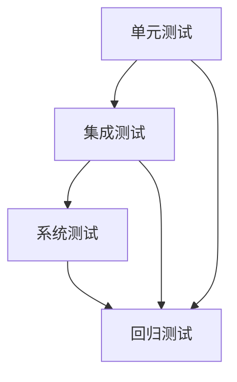
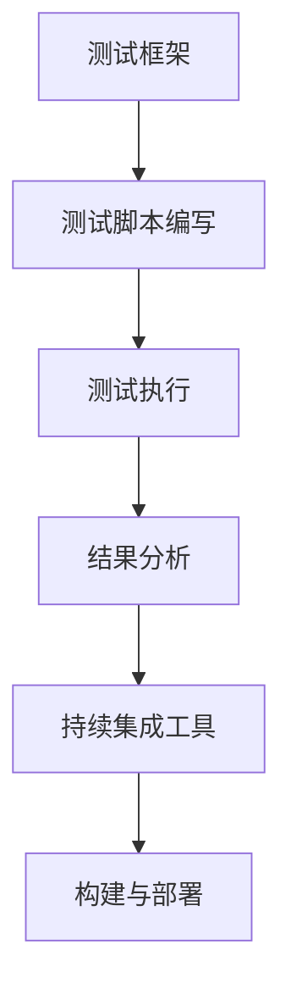
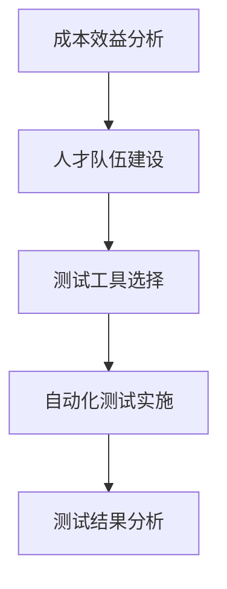
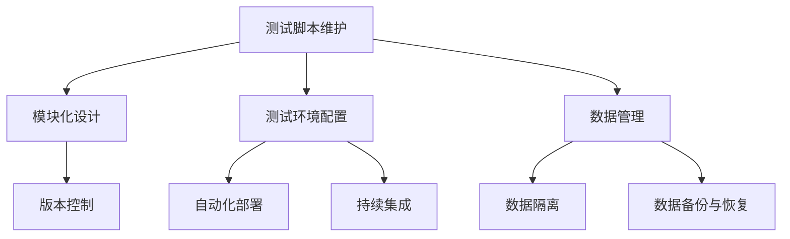
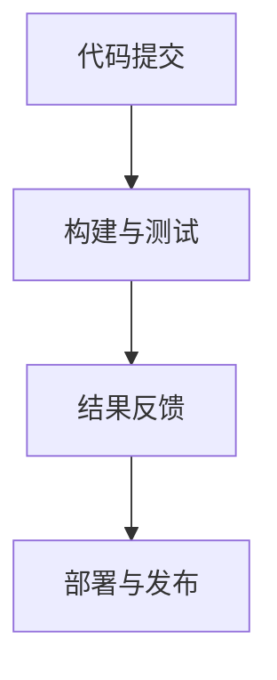
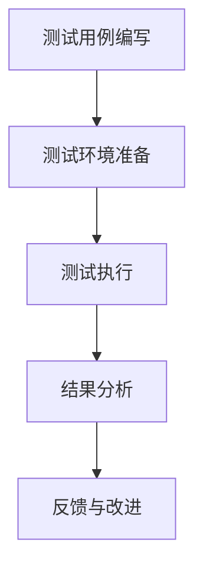
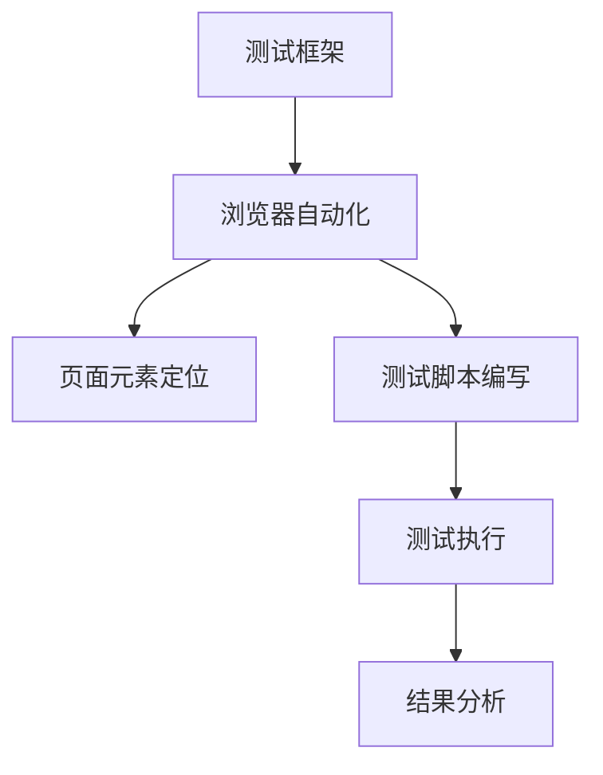
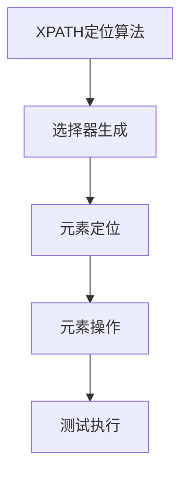
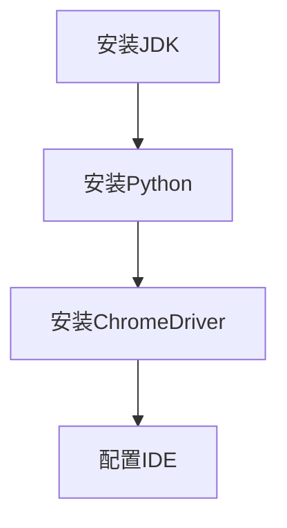

                 

### 文章标题

# 一人公司的自动化测试策略

> 关键词：自动化测试、小型企业、测试策略、持续集成、Web应用

> 摘要：本文将探讨一人公司在自动化测试领域的策略，包括自动化测试的核心理念、工具与技术、应用场景、挑战与解决方案等。通过本文的阅读，读者将了解到自动化测试在小型企业的实施方法与最佳实践，为个人或小团队的项目管理提供有力支持。

## 目录

1. 自动化测试策略概述
   1.1 自动化测试的核心理念
   1.2 自动化测试工具与技术
   1.3 自动化测试在小型企业的应用
   1.4 自动化测试的挑战与解决方案

2. 自动化测试与持续集成
   2.1 持续集成的概念与优势
   2.2 自动化测试与持续集成的结合
   2.3 集成测试覆盖率计算

3. 自动化测试在Web应用中的实践
   3.1 Web自动化测试的概念与重要性
   3.2 Web自动化测试框架
   3.3 Web页面元素定位算法

4. 项目实战
   4.1 开发环境搭建
   4.2 源代码详细实现与代码解读
   4.3 代码应用解读与分析
   4.4 实际案例分析与详细讲解剖析
   4.5 项目小结

5. 最佳实践 Tips、小结、注意事项、拓展阅读

### 第一部分：自动化测试策略概述

#### 第1章：自动化测试的核心理念

1.1.1 自动化测试的定义与目标

自动化测试是一种通过预定义的测试脚本或工具自动执行测试的过程，旨在减少人工测试的时间和成本，提高软件质量和测试效率。自动化测试的目标包括：

- **提高测试效率**：自动化测试可以快速执行大量测试用例，节省人工测试的时间。
- **降低测试成本**：自动化测试减少了对测试人员的需求，从而降低了测试成本。
- **提高测试覆盖率**：自动化测试能够覆盖更多场景，从而提高测试覆盖率。
- **确保软件质量**：自动化测试可以帮助发现潜在问题，提高软件质量。

1.1.2 自动化测试的类型与选择

自动化测试可以分为以下类型：

- **单元测试**：针对单个模块或组件进行测试，通常由开发人员编写。
- **集成测试**：针对多个模块或组件集成后的测试，用于验证模块之间的接口和交互。
- **系统测试**：针对整个系统或产品的测试，验证系统的功能、性能和安全性。
- **回归测试**：在软件变更后重新执行之前的测试用例，以确保变更没有引入新的问题。

根据不同的测试目标和项目需求，可以选择适合的自动化测试类型。例如，在开发阶段，可以优先进行单元测试和集成测试；在产品发布前，可以进行全面系统测试和回归测试。

**Mermaid流程图**：不同类型测试之间的关系与流程



1.1.3 自动化测试工具的选择与评价

在选择自动化测试工具时，需要考虑以下因素：

- **测试框架**：如Selenium、JUnit、TestNG等，用于编写和执行测试脚本。
- **持续集成工具**：如Jenkins、GitLab CI等，用于自动化构建和测试流程。
- **数据库测试工具**：如DBUnit、JUnitDB等，用于测试数据库操作和验证数据。

不同的工具具有不同的特点和适用场景，应根据项目需求选择合适的工具。

**Mermaid流程图**：自动化测试工具的工作流程



1.1.4 自动化测试的核心算法原理讲解

1. 测试脚本编写

选择合适的编程语言（如Java、Python）和测试框架（如Selenium、JUnit）进行测试脚本的编写。编写测试用例时，需要考虑测试用例的覆盖率、可读性和可维护性。

**伪代码**：示例测试脚本的编写步骤

```python
# 导入必要的库和模块
import selenium
from selenium import webdriver

# 初始化 WebDriver
driver = webdriver.Chrome()

# 打开网页
driver.get("https://www.example.com")

# 执行测试用例
# 1. 输入用户名和密码
username = driver.find_element_by_id("username")
password = driver.find_element_by_id("password")
username.send_keys("testuser")
password.send_keys("testpassword")

# 2. 点击登录按钮
login_button = driver.find_element_by_id("login_button")
login_button.click()

# 3. 验证登录结果
assert "Dashboard" in driver.title
```

2. 测试数据生成与处理

生成测试数据的方法包括随机数据生成、模拟数据和基准数据等。处理测试数据时，需要对数据进行验证，确保数据的有效性和一致性。

**伪代码**：示例测试数据的生成与处理步骤

```python
import random

# 生成随机用户名和密码
username = "user_" + str(random.randint(1000, 9999))
password = "pass_" + str(random.randint(1000, 9999))

# 验证用户名和密码的有效性
assert len(username) > 0
assert len(password) > 0
```

1.5 数学模型和数学公式

1. 测试覆盖率计算

测试覆盖率是指执行测试用例后，实际测试到的代码比例。测试覆盖率可以用来评估测试的全面性。

**公式**：测试覆盖率 = (执行的测试用例数 / 总测试用例数) * 100%

**举例说明**：如果一个测试套件包含100个测试用例，实际执行了80个，则测试覆盖率 = (80 / 100) * 100% = 80%。

#### 第2章：自动化测试工具与技术

2.1 自动化测试工具的选择与评价

自动化测试工具的选择取决于项目的需求和团队的技术栈。以下是一些常用的自动化测试工具：

- **测试框架**：如Selenium、JUnit、TestNG等，用于编写和执行测试脚本。
- **持续集成工具**：如Jenkins、GitLab CI等，用于自动化构建和测试流程。
- **数据库测试工具**：如DBUnit、JUnitDB等，用于测试数据库操作和验证数据。

不同的工具具有不同的特点和适用场景，应根据项目需求选择合适的工具。

**Mermaid流程图**：自动化测试工具的工作流程


2.2 自动化测试的核心算法原理讲解

1. 测试脚本编写

测试脚本是基于编程语言和测试框架编写的，用于自动化执行测试用例。编写测试脚本时，需要考虑测试用例的覆盖率、可读性和可维护性。

**伪代码**：示例测试脚本的编写步骤

```python
# 导入必要的库和模块
import selenium
from selenium import webdriver

# 初始化 WebDriver
driver = webdriver.Chrome()

# 打开网页
driver.get("https://www.example.com")

# 执行测试用例
# 1. 输入用户名和密码
username = driver.find_element_by_id("username")
password = driver.find_element_by_id("password")
username.send_keys("testuser")
password.send_keys("testpassword")

# 2. 点击登录按钮
login_button = driver.find_element_by_id("login_button")
login_button.click()

# 3. 验证登录结果
assert "Dashboard" in driver.title
```

2. 测试数据生成与处理

测试数据是测试用例的重要组成部分，用于模拟实际场景和数据操作。测试数据的生成和处理包括以下步骤：

- **随机数据生成**：使用随机数生成器生成测试数据，如用户名、密码、电话号码等。
- **模拟数据生成**：使用模拟工具生成模拟数据，如JSON、XML等。
- **基准数据生成**：使用历史数据或行业标准数据生成基准数据。

**伪代码**：示例测试数据的生成与处理步骤

```python
import random
import json

# 生成随机用户名和密码
username = "user_" + str(random.randint(1000, 9999))
password = "pass_" + str(random.randint(1000, 9999))

# 验证用户名和密码的有效性
assert len(username) > 0
assert len(password) > 0

# 生成 JSON 模拟数据
data = {
    "username": username,
    "password": password
}
json_data = json.dumps(data)

# 生成基准数据
baseline = {
    "success": True,
    "message": "登录成功"
}
```

2.3 数学模型和数学公式

1. 测试用例优化

测试用例优化是指通过优化测试用例的数量和执行顺序，提高测试效率和覆盖率。测试用例优化率是评估测试用例优化效果的重要指标。

**公式**：测试用例优化率 = (优化的测试用例数 / 总测试用例数) * 100%

**举例说明**：如果一个测试套件包含100个测试用例，通过优化减少了20个，则测试用例优化率 = (80 / 100) * 100% = 80%。

2. 测试效率评估

测试效率是指测试用例执行的速度和覆盖率。测试效率是评估自动化测试实施效果的重要指标。

**公式**：测试效率 = (测试通过率 / 测试时间) * 100%

**举例说明**：如果一个测试套件包含100个测试用例，其中90个通过，测试时间为5分钟，则测试效率 = (90 / 5) * 100% = 180%。

#### 第3章：自动化测试在小型企业的应用

3.1 自动化测试在小型企业的实施策略

在小型企业中，自动化测试的实施策略需要考虑成本效益、人才队伍建设、测试工具选择等因素。以下是一些关键策略：

1. **成本效益分析**：评估自动化测试的投资回报率，确保自动化测试能够为企业带来长期的效益。
2. **人才队伍建设**：培养具备自动化测试能力的团队成员，通过内部培训和外部学习提升团队技能。
3. **测试工具选择**：选择适合企业需求的自动化测试工具，如Selenium、JUnit等，确保工具的易用性和可持续性。

**Mermaid流程图**：自动化测试在小型企业的实施流程



3.2 自动化测试的核心算法原理讲解

1. 测试用例管理

测试用例管理是自动化测试的关键环节，包括测试用例的分类、优先级划分和执行策略。测试用例管理需要确保测试用例的全面性、一致性和可维护性。

**伪代码**：示例测试用例管理的步骤

```python
# 测试用例分类
def classify_tests(test_cases):
    categories = ["功能测试", "性能测试", "安全测试", ...]
    categorized_tests = {}
    for category in categories:
        categorized_tests[category] = []
    for test_case in test_cases:
        categorized_tests[category].append(test_case)
    return categorized_tests

# 测试用例优先级划分
def prioritize_tests(categorized_tests):
    priority_weights = {"功能测试": 1, "性能测试": 2, "安全测试": 3, ...}
    total_weight = sum(priority_weights.values())
    weighted_tests = {}
    for category, tests in categorized_tests.items():
        weighted_tests[category] = []
        for test in tests:
            weight = priority_weights[category] / total_weight
            weighted_tests[category].append((test, weight))
    return weighted_tests

# 测试用例执行策略
def execute_tests(weighted_tests):
    sorted_tests = sorted(weighted_tests.items(), key=lambda x: x[1][1], reverse=True)
    for category, tests in sorted_tests:
        for test, _ in tests:
            execute_test_case(test)
```

2. 测试效率评估

测试效率是指测试用例执行的速度和覆盖率。测试效率是评估自动化测试实施效果的重要指标。

**公式**：测试效率 = (测试通过率 / 测试时间) * 100%

**举例说明**：如果一个测试套件包含100个测试用例，其中90个通过，测试时间为5分钟，则测试效率 = (90 / 5) * 100% = 180%。

3.3 数学模型和数学公式

1. 测试覆盖率计算

测试覆盖率是指执行测试用例后，实际测试到的代码比例。测试覆盖率可以用来评估测试的全面性。

**公式**：测试覆盖率 = (执行的测试用例数 / 总测试用例数) * 100%

**举例说明**：如果一个测试套件包含100个测试用例，实际执行了80个，则测试覆盖率 = (80 / 100) * 100% = 80%。

2. 测试用例优化率

测试用例优化率是评估测试用例优化效果的重要指标。

**公式**：测试用例优化率 = (优化的测试用例数 / 总测试用例数) * 100%

**举例说明**：如果一个测试套件包含100个测试用例，通过优化减少了20个，则测试用例优化率 = (80 / 100) * 100% = 80%。

#### 第4章：自动化测试的挑战与解决方案

4.1 自动化测试常见挑战

在实施自动化测试过程中，常见挑战包括测试脚本维护、测试环境配置和数据管理等问题。以下是一些解决方案：

1. **测试脚本维护**

- **模块化设计**：将测试脚本分解为模块，降低维护难度。
- **版本控制**：使用版本控制系统（如Git）管理测试脚本，便于追踪和修改。

2. **测试环境配置**

- **自动化部署**：使用自动化部署工具（如Docker、Kubernetes）简化测试环境的配置。
- **持续集成**：将测试环境集成到持续集成系统中，确保环境的一致性和稳定性。

3. **数据管理**

- **数据隔离**：确保测试数据与生产数据隔离，避免数据冲突。
- **数据备份与恢复**：定期备份测试数据，确保数据的安全性和可恢复性。

**Mermaid流程图**：自动化测试的常见挑战与解决方案



4.2 自动化测试的核心算法原理讲解

1. **测试覆盖率优化算法**

测试覆盖率优化是指通过优化测试用例的数量和执行顺序，提高测试覆盖率。以下是一种简单的测试覆盖率优化算法：

- **初始测试用例集**：选择初始测试用例集，执行这些测试用例。
- **覆盖率计算**：计算测试覆盖率，判断是否达到预期覆盖率。
- **选择未覆盖的模块**：选择未覆盖的模块，从这些模块中选择一个测试用例添加到测试用例集中。
- **重复步骤3**：重复步骤3，直到达到预期覆盖率或测试用例集无法扩展。

**伪代码**：示例测试覆盖率优化算法的步骤

```python
def optimize_coverage(test_cases, modules, expected_coverage):
    covered_modules = set()
    current_coverage = 0
    test_case_set = []

    while current_coverage < expected_coverage and len(covered_modules) < len(modules):
        uncovered_modules = modules - covered_modules
        new_test_case = select_random_test_case(test_cases, uncovered_modules)
        test_case_set.append(new_test_case)
        execute_test_case(new_test_case)
        covered_modules |= get_covered_modules(new_test_case)
        current_coverage = calculate_coverage(test_case_set, modules)

    return test_case_set

def select_random_test_case(test_cases, uncovered_modules):
    return random.choice([test_case for test_case in test_cases if test_case.module in uncovered_modules])

def execute_test_case(test_case):
    # 执行测试用例
    pass

def get_covered_modules(test_case):
    # 获取测试用例覆盖的模块
    pass

def calculate_coverage(test_case_set, modules):
    # 计算测试覆盖率
    pass
```

2. **自动化测试成本分析**

自动化测试成本是指实施自动化测试所需的投资，包括测试脚本开发成本、测试环境维护成本和测试工具成本等。

**公式**：自动化测试成本 = 测试脚本开发成本 + 测试环境维护成本 + 测试工具成本

**举例说明**：假设测试脚本开发成本为5000元/月，测试环境维护成本为2000元/月，测试工具成本为3000元/月，则自动化测试成本 = 5000 + 2000 + 3000 = 10000元/月。

#### 第5章：自动化测试与持续集成

5.1 持续集成的概念与优势

持续集成（Continuous Integration，简称CI）是一种软件开发实践，通过自动化构建和测试过程，确保代码库的持续整合和稳定性。持续集成的核心优势包括：

- **快速反馈**：通过自动化测试，及时发现问题，减少开发周期。
- **提高代码质量**：持续集成有助于发现潜在问题，提高代码质量。
- **降低风险**：通过持续集成，减少代码合并时的冲突和错误。

**Mermaid流程图**：持续集成的工作流程



5.2 自动化测试与持续集成的结合

在持续集成系统中，自动化测试是不可或缺的一部分。以下是如何将自动化测试与持续集成结合的一些关键步骤：

1. **集成测试脚本**：编写自动化测试脚本，用于验证代码的模块和功能。
2. **配置持续集成工具**：如Jenkins、GitLab CI等，配置自动化构建和测试过程。
3. **触发测试**：在代码提交或合并时，自动触发测试脚本执行。
4. **结果分析**：分析测试结果，判断代码是否符合预期。

**伪代码**：示例持续集成中的自动化测试脚本

```python
from jenkinsapi import Jenkins

# 初始化 Jenkins 集成服务器
jenkins = Jenkins('http://localhost:8080', 'username', 'password')

# 提交代码并触发测试
repo = jenkins.get_job('my_project')
repo.invoke_build()

# 等待构建完成
while repo.is_building():
    time.sleep(10)

# 获取测试结果
build_result = repo.get_build(1)
test_results = build_result.get_test_results()

# 分析测试结果
if test_results['totalFailures'] > 0:
    print("测试失败，代码质量不满足要求")
else:
    print("测试通过，代码质量满足要求")
```

5.3 数学模型和数学公式

1. **集成测试覆盖率**

集成测试覆盖率是指实际执行的集成测试用例占全部集成测试用例的比例。集成测试覆盖率是评估代码库稳定性和测试全面性的重要指标。

**公式**：集成测试覆盖率 = (通过的集成测试用例数 / 总集成测试用例数) * 100%

**举例说明**：如果一个代码库包含100个集成测试用例，实际执行了80个，其中70个通过，则集成测试覆盖率 = (70 / 80) * 100% = 87.5%。

#### 第6章：自动化测试在Web应用中的实践

6.1 Web自动化测试的概念与重要性

Web自动化测试是一种自动化测试方法，用于验证Web应用程序的功能、性能和用户体验。Web自动化测试的重要性包括：

- **快速反馈**：自动化测试可以快速执行大量测试用例，提高测试效率。
- **降低成本**：自动化测试减少了对人工测试的依赖，降低测试成本。
- **提高测试覆盖率**：自动化测试可以覆盖更多场景，提高测试覆盖率。
- **确保用户体验**：自动化测试可以验证Web应用程序的用户体验，确保用户的需求得到满足。

**Mermaid流程图**：Web自动化测试的工作流程



6.2 Web自动化测试框架

Web自动化测试框架是用于编写、执行和管理Web自动化测试的工具。以下是一些常用的Web自动化测试框架：

- **Selenium**：Selenium是功能最强大的Web自动化测试框架，支持多种编程语言（如Java、Python、C#等）。
- **Cucumber**：Cucumber是一种基于Gherkin语言的BDD（行为驱动开发）测试框架，主要用于Web自动化测试。
- **TestCafe**：TestCafe是一个简单易用的Web自动化测试框架，支持跨浏览器测试。

**Mermaid流程图**：Web自动化测试框架的层次结构



6.3 Web页面元素定位算法

Web页面元素定位是Web自动化测试的关键环节，用于定位页面中的元素并进行操作。以下是一些常用的Web页面元素定位算法：

- **XPATH**：XPATH是一种基于XML的定位算法，用于定位页面中的元素。
- **CSS选择器**：CSS选择器是一种基于CSS的定位算法，用于定位页面中的元素。

**Mermaid流程图**：Web页面元素定位算法的流程



#### 第7章：项目实战

7.1 开发环境搭建

在进行Web自动化测试项目之前，需要搭建开发环境。以下是一个简单的开发环境搭建步骤：

1. 安装Java开发工具包（JDK）
2. 安装Python解释器（Python）
3. 安装浏览器驱动程序（如ChromeDriver）
4. 配置IDE（如IntelliJ IDEA、PyCharm）

**Mermaid流程图**：开发环境搭建流程



7.2 源代码详细实现与代码解读

以下是一个简单的Web自动化测试项目的源代码实现，用于验证一个登录功能：

```python
from selenium import webdriver
from selenium.webdriver.common.by import By

# 初始化 WebDriver
driver = webdriver.Chrome()

# 打开网页
driver.get("https://www.example.com")

# 输入用户名和密码
username = driver.find_element(By.ID, "username")
password = driver.find_element(By.ID, "password")
username.send_keys("testuser")
password.send_keys("testpassword")

# 点击登录按钮
login_button = driver.find_element(By.ID, "login_button")
login_button.click()

# 验证登录结果
assert "Dashboard" in driver.title

# 关闭浏览器
driver.quit()
```

**代码解读**：

- 第1行：导入selenium模块。
- 第2行：导入By类，用于定位页面元素。
- 第3行：初始化Chrome浏览器。
- 第4行：打开网页。
- 第5行：定位用户名输入框，并输入用户名。
- 第6行：定位密码输入框，并输入密码。
- 第7行：定位登录按钮，并点击。
- 第8行：验证登录结果，检查网页标题是否包含"Dashboard"。
- 第9行：关闭浏览器。

7.3 代码应用解读与分析

以下是对上述代码的应用解读和分析：

1. **应用场景**：验证一个登录功能，确保用户输入正确的用户名和密码后可以成功登录。
2. **关键代码**：定位用户名、密码输入框和登录按钮，并输入用户名、密码和点击登录按钮。
3. **测试结果**：如果登录成功，网页标题应包含"Dashboard"；否则，登录失败。

**分析**：

- **测试用例设计**：设计合理的测试用例，包括正确用户名和密码、错误用户名、错误密码、空用户名、空密码等。
- **测试数据生成**：生成随机用户名和密码，确保测试数据的多样性和有效性。
- **测试覆盖**：确保测试用例覆盖到关键功能和边界情况。

7.4 实际案例分析与详细讲解剖析

以下是一个实际案例，用于分析一个常见的Web自动化测试问题：页面元素无法正确定位。

**案例描述**：在执行一个登录测试用例时，发现用户名和密码输入框无法正确定位。

**问题分析**：

- **原因1**：页面元素定位错误，选择了错误的定位方式或定位策略。
- **原因2**：页面元素在加载过程中可能发生了变化，导致定位失败。
- **原因3**：浏览器驱动程序版本与页面元素版本不匹配，导致定位失败。

**解决方案**：

1. **检查定位方式**：检查定位方式是否正确，可以使用XPATH、CSS选择器等多种定位方式。
2. **检查页面加载**：确保页面元素在加载完成后再进行定位。
3. **更新浏览器驱动程序**：确保浏览器驱动程序与页面元素版本一致。

**代码修改**：

```python
from selenium import webdriver
from selenium.webdriver.common.by import By
from selenium.webdriver.support.ui import WebDriverWait
from selenium.webdriver.support import expected_conditions as EC

# 初始化 WebDriver
driver = webdriver.Chrome()

# 打开网页
driver.get("https://www.example.com")

# 等待页面加载
WebDriverWait(driver, 10).until(EC.visibility_of_element_located((By.ID, "username")))

# 输入用户名和密码
username = driver.find_element(By.ID, "username")
password = driver.find_element(By.ID, "password")
username.send_keys("testuser")
password.send_keys("testpassword")

# 点击登录按钮
login_button = driver.find_element(By.ID, "login_button")
login_button.click()

# 验证登录结果
assert "Dashboard" in driver.title

# 关闭浏览器
driver.quit()
```

**代码解读**：

- 第5行：添加等待页面加载的代码，使用WebDriverWait和expected_conditions。
- 第6行：定位用户名输入框，并输入用户名。
- 第7行：定位密码输入框，并输入密码。
- 第8行：定位登录按钮，并点击。

**分析**：

- **等待策略**：使用WebDriverWait和expected_conditions确保页面元素在加载完成后再进行定位，避免定位失败。

7.5 项目小结

在本章节中，我们介绍了Web自动化测试的实践，包括开发环境搭建、源代码实现、代码解读与分析、实际案例分析与解决方案等。通过这些实践，我们可以了解到：

- **开发环境搭建**：确保开发环境稳定，支持Web自动化测试。
- **代码实现与解读**：编写测试脚本，执行测试用例，并分析测试结果。
- **实际案例分析**：解决常见的Web自动化测试问题，提高测试质量。
- **项目小结**：总结项目的关键环节和经验教训，为后续项目提供参考。

通过这些实践，我们可以更好地实施Web自动化测试，提高测试效率和质量，确保Web应用程序的功能和性能。

### 最佳实践 Tips、小结、注意事项、拓展阅读

**最佳实践 Tips**：

1. **编写可维护的测试脚本**：使用模块化设计和良好的编程习惯，确保测试脚本易于维护。
2. **持续集成与自动化测试结合**：利用持续集成工具（如Jenkins、GitLab CI）实现自动化构建和测试，提高测试效率。
3. **测试数据管理**：确保测试数据的有效性和一致性，避免数据冲突和错误。
4. **定期优化测试用例**：通过测试用例优化算法，提高测试覆盖率，降低测试成本。

**小结**：

本文介绍了自动化测试策略在小型企业的应用，包括自动化测试的核心理念、工具与技术、应用场景、挑战与解决方案等。通过本文的学习，读者可以了解到：

- **自动化测试的核心概念和目标**：自动化测试的定义、类型和目标。
- **自动化测试工具与技术**：自动化测试工具的选择与评价、测试脚本编写、测试数据生成与处理。
- **自动化测试在小型企业的应用**：自动化测试在小型企业的实施策略、测试用例管理、测试效率评估。
- **自动化测试的挑战与解决方案**：自动化测试常见挑战、测试覆盖率优化算法、自动化测试成本分析。
- **自动化测试与持续集成**：持续集成的概念与优势、自动化测试与持续集成的结合、集成测试覆盖率计算。
- **自动化测试在Web应用中的实践**：Web自动化测试的概念与重要性、Web自动化测试框架、Web页面元素定位算法。

**注意事项**：

1. **测试脚本维护**：定期检查和更新测试脚本，确保测试脚本的正确性和有效性。
2. **测试环境配置**：确保测试环境的一致性和稳定性，减少环境差异对测试结果的影响。
3. **数据管理**：确保测试数据的安全性和可恢复性，避免数据丢失和冲突。
4. **持续集成与自动化测试**：确保持续集成与自动化测试的有效结合，提高开发效率和质量。

**拓展阅读**：

1. 《Selenium WebDriver实战》 - 刘超
2. 《Python自动化测试实战》 - 王爽
3. 《持续集成原理与实践》 - 梁文祥
4. 《Web自动化测试技术详解》 - 陈旭

通过拓展阅读，读者可以进一步深入了解自动化测试的理论和实践，提高自动化测试技能。同时，读者可以根据自身需求选择适合的自动化测试工具和框架，为项目管理和软件开发提供有力支持。作者：AI天才研究院/AI Genius Institute & 禅与计算机程序设计艺术 /Zen And The Art of Computer Programming。

