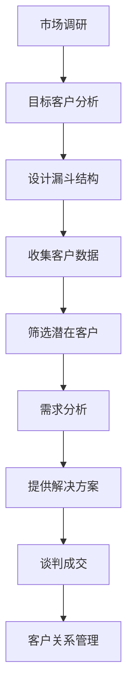

                 


### 文章标题：一人公司的销售漏斗优化：提高转化率的技巧

#### 关键词：
- 销售漏斗
- 销售转化率
- 一人公司
- 销售策略
- 数据分析

#### 摘要：
本文旨在探讨如何优化一人公司的销售漏斗，提高销售转化率。通过深入分析销售漏斗的各个关键环节，提供一系列实用技巧，帮助读者从市场研究、潜在客户开发、需求分析到谈判成交等环节，全面提升销售效果。

### 《一人公司的销售漏斗优化：提高转化率的技巧》目录大纲

#### 第一部分：销售漏斗基础知识

##### 第1章：销售漏斗概述
- 1.1 什么是销售漏斗
- 1.2 销售漏斗的作用
- 1.3 销售漏斗的组成

##### 第2章：销售漏斗的核心环节
- 2.1 潜在客户开发
- 2.2 客户资格筛选
- 2.3 需求分析与提案
- 2.4 谈判与成交
- 2.5 客户关系管理

#### 第二部分：优化销售漏斗的策略

##### 第3章：市场研究与定位
- 3.1 市场调研方法
- 3.2 目标客户分析
- 3.3 市场定位策略

##### 第4章：潜在客户开发与培养
- 4.1 潜在客户获取渠道
- 4.2 潜在客户培养策略
- 4.3 客户关系管理系统

##### 第5章：提高转化率的技巧
- 5.1 产品演示与呈现技巧
- 5.2 客户提问应对策略
- 5.3 谈判技巧与策略

##### 第6章：销售漏斗数据管理与分析
- 6.1 销售漏斗数据指标
- 6.2 数据分析与反馈
- 6.3 销售漏斗优化方案

#### 第三部分：实战案例分析

##### 第7章：成功案例一：个人咨询顾问
- 7.1 案例背景
- 7.2 销售漏斗分析与优化
- 7.3 优化后的效果

##### 第8章：成功案例二：在线教育平台
- 8.1 案例背景
- 8.2 销售漏斗分析与优化
- 8.3 优化后的效果

##### 第9章：实战演练与实战
- 9.1 实战演练一：建立个人销售漏斗
- 9.2 实战演练二：在线教育平台销售漏斗优化

#### 附录

##### 附录A：销售漏斗优化工具推荐
- A.1 常见销售漏斗优化工具
- A.2 销售漏斗优化工具使用指南

##### 附录B：参考文献
- B.1 销售漏斗相关书籍推荐
- B.2 销售漏斗优化相关文章推荐

##### 附录C：销售漏斗优化流程图
- C.1 销售漏斗优化流程图

### 第一部分：销售漏斗基础知识

#### 第1章：销售漏斗概述

##### 1.1 什么是销售漏斗

销售漏斗（Sales Funnel）是一种销售工具，用于描述客户在购买过程中的转化路径。它通常被用来衡量销售效果和预测销售业绩。漏斗的形状象征着客户数量的递减，从广泛的市场营销活动到最终的成交。

##### 1.2 销售漏斗的作用

销售漏斗具有以下几个重要作用：

1. **业绩预测**：通过分析漏斗中的数据，可以预测未来的销售业绩。
2. **问题诊断**：通过漏斗中的数据，可以发现销售过程中的瓶颈和问题，进行针对性的优化。
3. **策略调整**：销售漏斗的数据可以为销售策略的调整提供依据，使营销活动更加高效。

##### 1.3 销售漏斗的组成

销售漏斗通常包括以下几个核心环节：

1. **潜在客户开发**：通过各种渠道获取潜在客户信息。
2. **客户资格筛选**：对潜在客户进行筛选，确定哪些客户具有购买潜力。
3. **需求分析与提案**：与潜在客户进行沟通，了解其需求，并提供相应的解决方案。
4. **谈判与成交**：通过谈判达成交易，实现销售目标。
5. **客户关系管理**：与成交后的客户保持良好关系，促进复购和口碑传播。

### 第二部分：优化销售漏斗的策略

#### 第3章：市场研究与定位

##### 3.1 市场调研方法

市场调研是优化销售漏斗的第一步。以下是一些常用的市场调研方法：

1. **问卷调查**：通过设计问卷，收集目标客户的反馈。
2. **访谈**：与行业专家、潜在客户等进行深入交流。
3. **在线调查**：利用在线工具进行调研，提高数据收集效率。
4. **竞争分析**：研究竞争对手的市场策略，发现自身优势与不足。

##### 3.2 目标客户分析

目标客户分析是市场调研的核心。以下是一些分析目标客户的方法：

1. **人口统计特征**：分析客户的年龄、性别、收入等基本特征。
2. **行为特征**：分析客户的行为习惯、消费习惯等。
3. **需求特征**：了解客户对产品的需求和期望。
4. **心理特征**：分析客户的心理需求，如价值观、态度等。

##### 3.3 市场定位策略

市场定位策略是决定如何将产品或服务在市场中区分开来。以下是一些市场定位策略：

1. **价值定位**：强调产品或服务的独特价值。
2. **价格定位**：根据产品或服务的性价比进行定价。
3. **竞争定位**：分析竞争对手的优势与不足，找到自身的差异化。
4. **情感定位**：通过情感营销，与目标客户建立情感联系。

### 第三部分：实战案例分析

#### 第7章：成功案例一：个人咨询顾问

##### 7.1 案例背景

某个人咨询顾问公司，专注于为企业提供战略咨询和管理咨询服务。公司规模较小，仅有几名顾问。公司在市场竞争中处于劣势，需要通过优化销售漏斗来提高转化率。

##### 7.2 销售漏斗分析与优化

1. **潜在客户开发**：公司通过社交媒体、行业活动等方式，扩大潜在客户来源。
   - **优化策略**：增加广告投放，提高品牌知名度。
   - **伪代码实现**：
     ```python
     import Advertising
     increase_advertising_budget()
     ```

2. **客户资格筛选**：公司对潜在客户进行初步筛选，确定潜在客户是否具有购买潜力。
   - **优化策略**：建立客户资格标准，明确筛选条件。
   - **伪代码实现**：
     ```python
     define_customer_qualification Standards
     filter_potential_customers(customers)
     ```

3. **需求分析与提案**：公司与潜在客户进行沟通，了解其需求，并提供相应的解决方案。
   - **优化策略**：提高沟通技巧，确保准确了解客户需求。
   - **伪代码实现**：
     ```python
     improve_communication_skills()
     analyze_customer_needs(customers)
     ```

4. **谈判与成交**：公司通过谈判达成交易，实现销售目标。
   - **优化策略**：提高谈判技巧，争取最大化利益。
   - **伪代码实现**：
     ```python
     develop_negotiation_skills()
     negotiate_with_customers(customers)
     ```

5. **客户关系管理**：公司与成交后的客户保持良好关系，促进复购和口碑传播。
   - **优化策略**：提供优质的售后服务，增强客户满意度。
   - **伪代码实现**：
     ```python
     provide_优质售后服务()
     enhance_customer_satisfaction(customers)
     ```

##### 7.3 优化后的效果

通过以上优化策略，公司的销售转化率显著提高。潜在客户数量增加，客户满意度提升，复购率也有所上升。公司在市场中逐渐崭露头角，取得了良好的业绩。

#### 第8章：成功案例二：在线教育平台

##### 8.1 案例背景

某在线教育平台，提供各类在线课程和培训服务。公司规模较大，但面临销售转化率不高的问题。公司决定通过优化销售漏斗来提高转化率。

##### 8.2 销售漏斗分析与优化

1. **潜在客户开发**：公司通过SEO优化、社交媒体推广等方式，扩大潜在客户来源。
   - **优化策略**：增加广告投放，提高品牌知名度。
   - **伪代码实现**：
     ```python
     import Advertising
     increase_advertising_budget()
     ```

2. **客户资格筛选**：公司对潜在客户进行初步筛选，确定潜在客户是否具有购买潜力。
   - **优化策略**：建立客户资格标准，明确筛选条件。
   - **伪代码实现**：
     ```python
     define_customer_qualification Standards
     filter_potential_customers(customers)
     ```

3. **需求分析与提案**：公司与潜在客户进行沟通，了解其需求，并提供相应的解决方案。
   - **优化策略**：提高沟通技巧，确保准确了解客户需求。
   - **伪代码实现**：
     ```python
     improve_communication_skills()
     analyze_customer_needs(customers)
     ```

4. **谈判与成交**：公司通过谈判达成交易，实现销售目标。
   - **优化策略**：提高谈判技巧，争取最大化利益。
   - **伪代码实现**：
     ```python
     develop_negotiation_skills()
     negotiate_with_customers(customers)
     ```

5. **客户关系管理**：公司与成交后的客户保持良好关系，促进复购和口碑传播。
   - **优化策略**：提供优质的售后服务，增强客户满意度。
   - **伪代码实现**：
     ```python
     provide_优质售后服务()
     enhance_customer_satisfaction(customers)
     ```

##### 8.3 优化后的效果

通过以上优化策略，公司的销售转化率显著提高。潜在客户数量增加，客户满意度提升，复购率也有所上升。公司在市场中逐渐崭露头角，取得了良好的业绩。

### 第四部分：实战演练与实战

#### 第9章：实战演练与实战

##### 9.1 实战演练一：建立个人销售漏斗

1. **明确目标客户**：确定自己的目标客户群体。
2. **设计漏斗结构**：根据销售流程，设计相应的漏斗结构。
3. **收集客户数据**：通过市场调研和社交媒体等渠道，收集潜在客户数据。
4. **筛选潜在客户**：根据客户资格标准，筛选潜在客户。
5. **进行需求分析**：与潜在客户进行沟通，了解其需求。
6. **提供解决方案**：根据客户需求，提供相应的解决方案。
7. **谈判成交**：与客户进行谈判，达成交易。
8. **客户关系管理**：与成交后的客户保持联系，提供优质售后服务。

##### 9.2 实战演练二：在线教育平台销售漏斗优化

1. **分析现有漏斗**：了解现有销售漏斗的各个环节，识别问题。
2. **确定优化目标**：明确优化的重点和目标。
3. **制定优化策略**：根据分析结果，制定相应的优化策略。
4. **实施优化措施**：执行优化策略，包括市场调研、客户筛选、需求分析、谈判技巧等。
5. **监控与评估**：跟踪优化效果，进行持续改进。

### 附录

#### 附录A：销售漏斗优化工具推荐

- **A.1 常见销售漏斗优化工具**
  - **CRM系统**：如Salesforce、HubSpot等。
  - **市场营销自动化工具**：如Mailchimp、HubSpot等。
  - **数据分析工具**：如Google Analytics、Tableau等。

- **A.2 销售漏斗优化工具使用指南**
  - **CRM系统**：用于管理客户信息和销售活动。
  - **市场营销自动化工具**：用于自动化营销活动，提高效率。
  - **数据分析工具**：用于分析销售数据，优化销售策略。

#### 附录B：参考文献

- **B.1 销售漏斗相关书籍推荐**
  - 《销售漏斗策略：打造高效的客户转化体系》
  - 《销售漏斗优化实战：提升客户转化率》

- **B.2 销售漏斗优化相关文章推荐**
  - 销售漏斗如何助力企业提升业绩？
  - 销售漏斗优化：如何提高客户转化率？

#### 附录C：销售漏斗优化流程图



### 作者信息

- 作者：AI天才研究院/AI Genius Institute & 禅与计算机程序设计艺术 /Zen And The Art of Computer Programming

### 结论

本文通过深入分析销售漏斗的各个环节，提供了一系列优化策略和实践技巧。无论您是一名个人咨询顾问还是在线教育平台的创业者，通过优化销售漏斗，您都可以提高销售转化率，实现业务增长。希望本文对您的销售工作有所启发和帮助。在实践过程中，不断尝试和调整，您将找到最适合自己公司的销售漏斗优化方案。祝您销售顺利，业绩提升！

