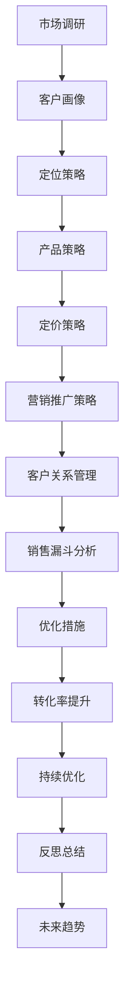

                 

### 销售漏斗优化：一人公司的成长利器

关键词：销售漏斗、转化率、优化策略、一人公司、市场调研

摘要：在现代商业环境中，销售漏斗优化已成为企业提高盈利能力和市场竞争力的重要手段。对于一人公司来说，优化销售漏斗不仅关乎个人事业的成长，更是实现商业成功的关键。本文将围绕一人公司的销售漏斗优化展开，深入探讨提高转化率的各项技巧，帮助读者掌握这一重要技能。

# 《一人公司的销售漏斗优化：提高转化率的技巧》目录大纲

## 第一部分：引言与基础

### 第1章：一人公司的销售漏斗概述

#### 1.1 销售漏斗的概念与重要性

#### 1.2 一人公司的销售漏斗特点

#### 1.3 本书的结构安排与目标

## 第二部分：销售漏斗优化策略

### 第2章：市场调研与定位

#### 2.1 市场调研的方法与技巧

#### 2.2 客户需求分析

#### 2.3 市场细分与定位策略

### 第3章：产品与定价策略

#### 3.1 产品策略优化

#### 3.2 定价策略的制定与调整

#### 3.3 产品差异化策略

### 第4章：营销推广策略

#### 4.1 营销渠道的选择与优化

#### 4.2 社交媒体营销策略

#### 4.3 内容营销与搜索引擎优化（SEO）

### 第5章：客户关系管理

#### 5.1 客户画像与需求分析

#### 5.2 客户沟通技巧

#### 5.3 客户忠诚度提升策略

### 第6章：销售漏斗分析与优化

#### 6.1 销售漏斗分析的方法与工具

#### 6.2 销售漏斗各阶段的优化策略

#### 6.3 销售漏斗优化的案例解析

## 第三部分：提高转化率的技巧

### 第7章：提升网站转化率的技巧

#### 7.1 网站优化策略

#### 7.2 营销转化率工具应用

#### 7.3 转化率案例分析

### 第8章：电子邮件营销与转化

#### 8.1 电子邮件营销的策略与技巧

#### 8.2 电子邮件内容的撰写与优化

#### 8.3 电子邮件营销的案例解析

### 第9章：社交媒体转化策略

#### 9.1 社交媒体转化策略的制定

#### 9.2 社交媒体营销案例分析

#### 9.3 社交媒体转化率提升技巧

### 第10章：销售漏斗优化实战

#### 10.1 实战案例一：从零开始搭建销售漏斗

#### 10.2 实战案例二：销售漏斗优化提升转化率

#### 10.3 实战案例三：跨渠道整合优化销售漏斗

## 第四部分：持续优化与反思

### 第11章：销售漏斗优化的持续改进

#### 11.1 漏斗优化的持续改进方法

#### 11.2 数据分析与反馈机制

#### 11.3 漏斗优化过程中的常见问题与解决策略

### 第12章：反思与总结

#### 12.1 销售漏斗优化的反思与总结

#### 12.2 提高转化率的长期策略

#### 12.3 未来销售漏斗优化的趋势与展望

## 附录

### 附录A：销售漏斗优化工具介绍

#### A.1 常用销售漏斗分析工具

#### A.2 工具使用技巧与案例分析

### 附录B：销售漏斗优化案例库

#### B.1 案例一：通过市场调研优化销售漏斗

#### B.2 案例二：利用社交媒体提升转化率

#### B.3 案例三：通过电子邮件营销实现销售转化

### Mermaid 流程图：销售漏斗优化核心概念与联系

mermaid
graph TD
    A[销售漏斗概述] --> B[市场调研与定位]
    B --> C[产品与定价策略]
    C --> D[营销推广策略]
    D --> E[客户关系管理]
    E --> F[销售漏斗分析与优化]
    F --> G[提升网站转化率技巧]
    G --> H[电子邮件营销与转化]
    H --> I[社交媒体转化策略]
    I --> J[销售漏斗优化实战]
    J --> K[持续优化与反思]
    K --> L[反思与总结]
    L --> M[销售漏斗优化工具介绍]
    M --> N[销售漏斗优化案例库]

### 销售漏斗优化核心算法原理讲解

#### 1. 销售漏斗分析算法

```plaintext
// 销售漏斗分析算法伪代码
function 分析销售漏斗(data):
    阶段转化率 = 计算每个阶段的转化率(data)
    总漏斗深度 = 计算漏斗深度(data)
    漏斗瓶颈 = 找到转化率最低的阶段
    返回阶段转化率，总漏斗深度，漏斗瓶颈
```

#### 2. 转化率优化算法

```plaintext
// 转化率优化算法伪代码
function 优化转化率(data, 策略):
    对于每个阶段 do:
        应用策略(策略[data])
        更新阶段数据(data)
    end
    重新计算阶段转化率
    返回优化后的数据，优化策略效果
```

---

### 一人公司的销售漏斗优化：引言与基础

在当今竞争激烈的市场环境中，企业要想实现可持续发展，必须重视销售漏斗的优化。特别是对于一人公司，即独立创业者或小型团队，优化销售漏斗显得尤为重要。销售漏斗是一个直观的工具，用于描述潜在客户从接触产品到最终完成购买的整个过程。通过优化销售漏斗，可以显著提高转化率，从而增加销售额和市场份额。

#### 1.1 销售漏斗的概念与重要性

销售漏斗（Sales Funnel）是一种营销和销售工具，用于描述潜在客户从接触产品到完成购买的全过程。它将客户转化为销售机会，并跟踪客户在不同阶段的进展情况。销售漏斗通常包含以下几个阶段：

1. **潜在客户识别**：确定潜在客户的来源，如网站访问者、社交媒体关注者或直接询问。
2. **访客**：潜在客户首次访问网站或接触产品。
3. **潜在客户**：访客通过提供联系方式（如电子邮件、电话等）成为潜在客户。
4. **资格筛选**：对潜在客户进行评估，确定其是否符合购买资格。
5. **报价**：向潜在客户提供报价或产品演示。
6. **成交**：潜在客户决定购买产品或服务。
7. **后续服务**：为客户提供售后服务和客户支持。

销售漏斗的重要性在于它能够帮助企业了解客户的行为和购买决策过程，从而识别出转化率低的阶段，并采取相应措施进行优化。通过优化销售漏斗，企业可以：

- 提高客户转化率：通过分析漏斗各阶段的转化率，找出瓶颈并优化，提高客户从接触产品到最终购买的转化率。
- 提高销售额：优化销售漏斗能够增加客户数量和销售额，从而提高企业的盈利能力。
- 优化资源分配：通过分析销售漏斗的各个阶段，企业可以更有效地分配资源和精力，提高整体销售效率。

#### 1.2 一人公司的销售漏斗特点

一人公司（Solopreneurship）是指由单个创始人或独立个体经营的企业。与大型企业相比，一人公司具有以下几个特点：

- **资源有限**：一人公司通常资源有限，包括资金、人力、时间等。因此，优化销售漏斗尤为重要，以确保每一笔投资都能带来最大化的回报。
- **灵活性高**：一人公司具有高度灵活性，可以快速调整和优化销售策略，以适应市场变化和客户需求。
- **依赖个人能力**：一人公司的成功在很大程度上依赖于创始人的个人能力和专业素养。因此，创始人需要全面了解销售漏斗的各个环节，并不断提升自己的销售技能。
- **市场定位明确**：一人公司通常专注于特定的市场细分领域，因此需要更加精准的市场调研和定位策略。

#### 1.3 本书的结构安排与目标

本书旨在为一人公司提供全面的销售漏斗优化指南，帮助读者提高转化率，实现商业成功。具体结构安排如下：

- **第一部分：引言与基础**：介绍销售漏斗的概念、重要性和一人公司的销售漏斗特点。
- **第二部分：销售漏斗优化策略**：详细探讨市场调研、产品与定价策略、营销推广策略、客户关系管理等方面的优化方法。
- **第三部分：提高转化率的技巧**：介绍网站优化、电子邮件营销、社交媒体转化策略等实战技巧。
- **第四部分：持续优化与反思**：讨论销售漏斗优化的持续改进方法、数据分析与反馈机制，以及未来的趋势与展望。

通过本书的学习，读者将能够：

- 理解销售漏斗的概念和优化的重要性。
- 掌握市场调研、产品定位、营销策略等核心技能。
- 提高网站转化率、电子邮件营销和社交媒体转化的效果。
- 建立和优化自己的销售漏斗，实现商业成功。

在接下来的章节中，我们将逐一深入探讨这些内容，帮助读者全面掌握销售漏斗优化的技巧和方法。让我们开始这一段精彩的学习之旅吧！
---

### 市场调研与定位：优化销售漏斗的第一步

市场调研和定位是优化销售漏斗的关键步骤，尤其是对于一人公司而言。市场调研可以帮助我们了解目标市场的现状、竞争对手的动态以及潜在客户的需求，从而为定位策略提供有力的数据支持。下面，我们将详细探讨市场调研的方法与技巧、客户需求分析以及市场细分与定位策略。

#### 2.1 市场调研的方法与技巧

市场调研是了解市场状况的重要手段，其方法多样，主要包括以下几种：

1. **问卷调查**：问卷调查是一种常用的市场调研方法，可以通过在线调查平台或纸质问卷收集大量数据。问卷调查的优点是成本低、覆盖面广，但缺点是样本可能存在偏差。

2. **访谈**：访谈法包括面对面访谈、电话访谈和在线访谈等。这种方法可以深入了解受访者的想法和意见，但成本较高且耗时较长。

3. **数据分析**：数据分析可以从现有的销售数据、客户反馈和其他相关数据中提取有价值的信息。数据分析的优点是数据量大、准确性高，但需要对数据进行深入分析和处理。

4. **市场观察**：市场观察是通过观察市场竞争状况、客户行为和行业趋势来获取信息。这种方法适用于快速变化的市场环境，但难以量化。

在进行市场调研时，需要注意以下技巧：

- **明确调研目标**：在进行市场调研之前，要明确调研的目标和目的，以确保调研活动有的放矢。
- **选择合适的调研方法**：根据调研目标和实际情况，选择合适的调研方法，避免资源浪费。
- **样本代表性**：确保调研样本具有代表性，避免因样本偏差导致结论失真。
- **数据收集与处理**：确保数据收集的完整性和准确性，并对数据进行有效处理和分析。

#### 2.2 客户需求分析

了解客户需求是优化销售漏斗的重要环节。客户需求分析可以帮助我们确定目标客户群体的特征、需求和痛点，从而更好地满足客户需求，提高转化率。以下是客户需求分析的方法：

1. **客户访谈**：通过访谈现有客户，了解他们对产品或服务的满意度、使用体验和改进建议。访谈可以采用开放式问题，鼓励客户畅所欲言。

2. **在线调研**：通过在线问卷或社交媒体调查，收集潜在客户和现有客户的需求信息。在线调研的优点是成本低、覆盖面广。

3. **客户行为分析**：通过分析客户在网站、社交媒体等渠道的行为数据，了解客户的行为模式和偏好。例如，通过点击率、停留时间等指标分析客户对不同页面的兴趣。

4. **市场趋势分析**：关注行业趋势和市场动态，了解竞争对手的产品和服务，从中获取客户需求的信息。

在进行客户需求分析时，需要注意以下事项：

- **全面性**：要全面了解客户的需求，包括功能需求、情感需求等。
- **个性化**：针对不同客户群体，制定个性化的需求分析方案。
- **持续更新**：客户需求是动态变化的，需要定期更新和分析客户需求，以确保定位策略的准确性。

#### 2.3 市场细分与定位策略

市场细分是将整个市场划分为若干个具有相似特征的客户群体，从而针对每个细分市场制定相应的营销策略。市场细分有助于提高营销的针对性和效果。以下是市场细分的方法：

1. **地理细分**：根据地理位置将市场划分为不同区域，如城市、乡村、国际市场等。地理细分适用于地域性强的产品或服务。

2. **人口细分**：根据人口统计数据将市场划分为不同群体，如年龄、性别、收入、教育程度等。人口细分适用于面向大众市场的产品。

3. **心理细分**：根据消费者的心理特征将市场划分为不同群体，如生活方式、价值观念、兴趣爱好等。心理细分适用于具有独特消费需求的消费者。

4. **行为细分**：根据消费者的行为特征将市场划分为不同群体，如购买习惯、品牌忠诚度、使用场景等。行为细分适用于需要根据消费者行为制定营销策略的产品。

在制定定位策略时，需要注意以下事项：

- **针对性**：根据细分市场的特征，制定有针对性的营销策略，提高营销效果。
- **差异化**：在定位过程中，要突出产品或服务的差异化优势，以吸引目标客户。
- **可行性**：确保定位策略在实际操作中可行，并具备可持续性。

通过市场调研、客户需求分析和市场细分，一人公司可以更好地了解市场和客户，制定出有效的定位策略。这将有助于优化销售漏斗，提高转化率，实现商业成功。

#### 案例分析

假设我们是一家一人公司，专注于提供定制化的在线教育平台。以下是我们在市场调研、客户需求分析和市场细分过程中的一些实际操作：

1. **市场调研**：
   - 采用问卷调查和在线调研的方法，收集了500名现有客户和潜在客户的需求信息。
   - 分析数据后，发现客户主要分布在一线城市，年龄在25-40岁之间，具有较高学历和稳定的收入。
   - 通过市场观察，了解到竞争对手主要集中在提供标准化的在线课程，而我们的差异化优势在于定制化和个性化服务。

2. **客户需求分析**：
   - 通过访谈现有客户，了解到他们对定制化课程的强烈需求，尤其是针对职业发展和个人兴趣的定制课程。
   - 分析客户行为数据，发现客户更喜欢通过移动设备访问平台，且对课程内容的实用性和互动性有较高要求。

3. **市场细分**：
   - 根据地理、人口、心理和行为特征，将市场细分为三个细分市场：职场人士、学生和爱好人士。
   - 针对每个细分市场，制定相应的营销策略，如为职场人士提供职业发展课程，为学生提供学术辅导课程，为爱好人士提供兴趣培养课程。

通过以上市场调研、客户需求分析和市场细分，我们能够更好地了解目标市场，制定有针对性的营销策略，从而优化销售漏斗，提高转化率。例如，我们可以通过精准投放广告、提供个性化推荐等方式，吸引更多潜在客户，并提高他们的购买意愿。

综上所述，市场调研和定位是优化销售漏斗的重要步骤。通过科学的市场调研和精准的定位策略，一人公司可以更好地了解市场和客户，提高营销效果，实现商业成功。
---

### 产品与定价策略：优化销售漏斗的核心要素

产品与定价策略是销售漏斗优化的核心要素之一。正确的产品策略和定价策略不仅能够吸引潜在客户，提高转化率，还能提升客户满意度和忠诚度。在这一章节中，我们将深入探讨产品策略优化、定价策略的制定与调整以及产品差异化策略。

#### 3.1 产品策略优化

产品策略优化是销售漏斗优化的基础。以下是几个关键步骤：

1. **明确产品定位**：确定产品的核心价值、目标市场和竞争优势。这有助于在市场上树立独特的品牌形象，提高品牌知名度。

2. **产品功能优化**：分析客户需求，不断优化产品功能，使其更加符合客户期望。例如，可以通过用户反馈、市场调研和竞争对手分析来识别产品改进的机会。

3. **产品线规划**：合理规划产品线，满足不同客户群体的需求。例如，可以提供基础版、高级版和定制版，以满足不同预算和需求层次的客户。

4. **产品创新**：持续关注市场趋势，开发新产品或改进现有产品，以保持竞争优势。创新可以是功能上的改进，也可以是用户体验的优化。

5. **客户体验优化**：注重客户体验，从购买流程、客户服务到售后支持，确保每个环节都能为客户提供优质的服务。

#### 3.2 定价策略的制定与调整

定价策略直接影响客户的购买决策和满意度。以下是几个关键点：

1. **价值导向定价**：根据产品的价值和客户对产品的认可度来制定价格。这种方法有助于确保价格与产品的价值相匹配，提高客户满意度。

2. **成本导向定价**：以产品成本为基础，加上一定的利润来制定价格。这种方法适用于成本结构清晰且市场竞争激烈的情况。

3. **竞争导向定价**：根据竞争对手的价格来制定价格。这种方法适用于竞争激烈的市场环境，通过价格策略来吸引客户。

4. **动态定价**：根据市场需求、季节变化和竞争对手的定价策略，动态调整价格。例如，节假日促销、限时折扣等。

5. **调整定价策略**：定期评估定价策略的效果，根据市场反馈和业务目标调整价格。例如，针对高价值客户或长期合作伙伴提供折扣或优惠。

#### 3.3 产品差异化策略

产品差异化是提高竞争力的有效手段。以下是几个关键点：

1. **独特卖点（USP）**：确定产品的独特卖点，即区别于竞争对手的优势。独特卖点可以是产品功能、设计、品质或服务。

2. **技术创新**：通过技术创新，开发具有竞争力的产品。例如，引入新技术或优化现有技术，提高产品性能和用户体验。

3. **品牌建设**：建立强大的品牌形象，提高品牌知名度和认知度。通过品牌故事、品牌定位和品牌传播，使品牌在客户心中占据独特的位置。

4. **定制化服务**：提供个性化的定制服务，满足客户的特殊需求。定制化服务可以提高客户满意度和忠诚度。

5. **用户体验**：注重用户体验，从购买流程到售后支持，为客户提供一致且优质的体验。

通过产品策略优化、定价策略的制定与调整以及产品差异化策略，一人公司可以提升产品的市场竞争力，吸引更多潜在客户，提高转化率。例如，通过提供定制化课程和灵活的定价策略，我们可以更好地满足不同客户群体的需求，从而提高客户的购买意愿和满意度。

#### 案例分析

假设我们是一家提供在线教育服务的一人公司，以下是我们在产品与定价策略优化过程中的一些实际操作：

1. **产品策略优化**：
   - 确定产品定位为“个性化在线教育平台”，专注于为客户提供定制化的课程和学习体验。
   - 通过用户反馈和市场调研，发现客户对职业发展课程的需求较高，因此增加了多个职业领域的课程。
   - 优化课程内容，引入互动式教学和实时辅导，提高用户体验。

2. **定价策略制定与调整**：
   - 采用价值导向定价，根据课程内容和教学资源来制定价格，确保价格与价值相匹配。
   - 提供不同层次的课程套餐，满足不同预算的客户需求。例如，基础版（每月99元）、高级版（每月299元）和定制版（根据需求定制）。
   - 根据市场需求和客户反馈，定期调整价格策略，如推出限时优惠、推荐奖励等。

3. **产品差异化策略**：
   - 确定独特卖点为“个性化定制课程和实时辅导”，通过这一点区别于其他在线教育平台。
   - 建立强大的品牌形象，通过社交媒体传播、内容营销和口碑推荐来提高品牌知名度。
   - 提供独特的用户体验，从课程设计到客户服务，确保每个环节都能为客户提供优质的服务。

通过以上产品与定价策略的优化，我们能够更好地满足客户需求，提高产品的市场竞争力，从而提高转化率。例如，通过提供个性化的课程和灵活的定价策略，我们能够吸引更多客户，并提高他们的购买意愿和满意度。

综上所述，产品与定价策略的优化对于销售漏斗优化至关重要。通过科学的产品策略和合理的定价策略，一人公司可以提升产品的市场竞争力，吸引更多潜在客户，提高转化率，实现商业成功。
---

### 营销推广策略：拓宽销售漏斗的渠道

营销推广策略是优化销售漏斗的重要一环，它直接影响潜在客户的引入和转化率。在这一章节中，我们将深入探讨营销渠道的选择与优化、社交媒体营销策略、内容营销与搜索引擎优化（SEO）等方面的内容。

#### 4.1 营销渠道的选择与优化

选择适合的营销渠道是提高转化率的关键。以下是几种常见的营销渠道及其优化方法：

1. **搜索引擎营销（SEM）**：
   - **优化方法**：通过关键词竞价、优化广告文案和落地页面，提高广告的点击率和转化率。此外，定期分析搜索关键词和广告表现，根据数据调整广告策略。
   - **案例分析**：假设我们是一家提供在线教育平台的公司，可以通过竞价购买与教育相关的关键词，如“在线课程”、“职业发展”等，吸引目标客户。

2. **社交媒体营销（SMM）**：
   - **优化方法**：根据目标受众的特点选择合适的社交媒体平台，如微信、微博、抖音等。制定有吸引力的内容和互动活动，增加粉丝互动和品牌曝光。此外，利用社交媒体广告，精准定位潜在客户。
   - **案例分析**：通过在微信朋友圈投放广告，结合精准的用户定位和互动式内容，提高广告的转化率。

3. **内容营销**：
   - **优化方法**：制作高质量的内容，如博客文章、视频、电子书等，吸引潜在客户。优化内容结构和关键词，提高内容的搜索引擎排名。此外，通过社交媒体和电子邮件营销，推广优质内容，增加品牌曝光。
   - **案例分析**：通过撰写高质量的博客文章，分享行业见解和实用技巧，吸引潜在客户。同时，利用电子邮件营销，定期向订阅用户推送优质内容，提高用户粘性。

4. **线下活动**：
   - **优化方法**：根据目标受众的偏好，选择合适的线下活动形式，如研讨会、讲座、展会等。制定有吸引力的活动内容和优惠策略，提高参与度和转化率。
   - **案例分析**：举办一场行业研讨会，邀请目标客户参加，分享行业最新动态和实用案例，同时提供产品演示和优惠活动，吸引潜在客户。

5. **合作伙伴关系**：
   - **优化方法**：与行业内的合作伙伴建立合作关系，如行业联盟、渠道分销等。通过资源共享、共同推广，扩大市场影响力和客户覆盖面。
   - **案例分析**：与一家知名的在线教育平台合作，通过相互推广和资源共享，吸引更多潜在客户。

#### 4.2 社交媒体营销策略

社交媒体营销在当今数字化时代发挥着重要作用。以下是几个关键的社交媒体营销策略：

1. **内容策略**：
   - **优化方法**：根据不同社交媒体平台的特点，制定有针对性的内容策略。例如，在微信上发布高质量的文章和资讯，在抖音上制作有趣的短视频。
   - **案例分析**：在微信公众号上发布行业动态和实用技巧，吸引大量订阅用户。同时，通过在抖音上发布短视频，展示产品特点和用户案例，提高品牌曝光。

2. **互动策略**：
   - **优化方法**：与粉丝保持互动，积极回复评论和私信，建立良好的粉丝关系。同时，通过举办线上活动、互动游戏等方式，增加粉丝参与度。
   - **案例分析**：定期举办线上问答活动，邀请行业专家解答粉丝的问题，增加互动和用户粘性。

3. **广告策略**：
   - **优化方法**：根据目标受众的特点，选择合适的广告形式和投放位置，提高广告的点击率和转化率。例如，在微信朋友圈投放定向广告，精准覆盖目标客户。
   - **案例分析**：通过微信朋友圈广告，针对特定地区和年龄段的目标客户，投放定向广告，提高广告的点击率和转化率。

4. **社区策略**：
   - **优化方法**：积极参与社交媒体社区，如知乎、豆瓣等，分享专业见解和行业动态，提高品牌知名度和影响力。
   - **案例分析**：在知乎上开设专栏，分享行业见解和实用案例，吸引大量关注和粉丝。

#### 4.3 内容营销与搜索引擎优化（SEO）

内容营销和SEO是提高网站流量和转化率的重要手段。以下是几个关键策略：

1. **内容策略**：
   - **优化方法**：制作高质量的内容，满足用户需求，提高内容的搜索引擎排名。例如，撰写行业报告、实用教程和案例分析等。
   - **案例分析**：通过撰写高质量的博客文章，分享行业见解和实用技巧，提高网站的搜索引擎排名，吸引大量潜在客户。

2. **关键词策略**：
   - **优化方法**：研究目标受众的搜索习惯，选择合适的关键词，并将其合理分布在网站内容中。同时，定期优化关键词，提高搜索排名。
   - **案例分析**：通过关键词工具分析，确定目标关键词，并将这些关键词合理分布在网站内容中，提高网站的搜索引擎排名。

3. **链接策略**：
   - **优化方法**：建立高质量的外部链接，提高网站的权威性和搜索引擎排名。此外，优化内部链接结构，提高用户在网站内的浏览体验。
   - **案例分析**：与其他行业网站建立合作关系，通过相互链接，提高网站的权威性和搜索引擎排名。

4. **SEO工具应用**：
   - **优化方法**：利用SEO工具，如Google Analytics、Google Search Console等，分析网站流量和搜索引擎排名，优化SEO策略。
   - **案例分析**：通过Google Analytics分析网站流量来源和用户行为，优化网站内容和链接策略，提高搜索引擎排名。

通过选择合适的营销渠道、制定有效的社交媒体营销策略以及优化内容营销和SEO，一人公司可以拓宽销售漏斗的渠道，提高潜在客户的引入和转化率。例如，通过在微信朋友圈投放定向广告、在知乎上开设专栏分享行业见解，以及优化网站内容和关键词，可以吸引更多目标客户，提高他们的购买意愿和满意度。

综上所述，营销推广策略在优化销售漏斗中起着至关重要的作用。通过科学的选择和优化，一人公司可以拓宽营销渠道，提高转化率，实现商业成功。
---

### 客户关系管理：巩固销售漏斗的基石

客户关系管理（CRM）是优化销售漏斗的重要环节，它涉及到如何建立、维护和深化与客户的关系，从而提高客户满意度和忠诚度。在这一章节中，我们将探讨客户画像与需求分析、客户沟通技巧以及客户忠诚度提升策略。

#### 5.1 客户画像与需求分析

客户画像是一种描述客户特征和需求的方法，它有助于我们更好地了解客户，从而制定有针对性的营销策略。以下是建立客户画像和进行需求分析的步骤：

1. **数据收集**：通过多种渠道收集客户数据，如购买记录、社交媒体互动、问卷调查等。确保数据来源的多样性和准确性。

2. **数据分析**：对收集到的客户数据进行分析，识别出客户的共同特征和需求。例如，可以通过统计分析确定客户的年龄、性别、地域、购买行为等。

3. **客户细分**：根据数据分析结果，将客户分为不同的群体，如高价值客户、潜在客户、流失客户等。为每个客户群体制定相应的营销策略。

4. **需求分析**：深入了解每个客户群体的需求和痛点，以便提供个性化的产品和服务。例如，可以通过客户访谈、在线调研等方式，获取客户的反馈和建议。

5. **客户画像更新**：客户需求和偏好会随着时间的推移而变化，因此需要定期更新客户画像，确保数据的时效性和准确性。

#### 5.2 客户沟通技巧

良好的沟通技巧是建立和维护客户关系的关键。以下是几个关键沟通技巧：

1. **倾听**：倾听是有效沟通的基础。在与客户沟通时，要耐心倾听客户的需求和问题，避免打断他们。

2. **明确表达**：清晰、准确地表达自己的想法和观点。避免使用过于复杂的术语，确保客户能够理解。

3. **同理心**：设身处地地理解客户的感受和需求，表现出对客户的关心和尊重。这有助于建立信任和良好的关系。

4. **积极反馈**：及时给予客户反馈，让他们知道他们的需求和问题得到了关注和解决。这可以增强客户的满意度和忠诚度。

5. **个性化沟通**：根据客户的特点和需求，定制化沟通内容和方式。例如，通过邮件、电话、短信等不同渠道与客户沟通，确保信息传达的有效性。

#### 5.3 客户忠诚度提升策略

客户忠诚度是销售漏斗优化的关键指标之一，提高客户忠诚度有助于减少客户流失率，增加重复购买率。以下是几个关键策略：

1. **优质服务**：提供卓越的客户服务，确保客户在购买前、购买中和购买后都能得到满意的体验。这包括快速响应客户问题、提供专业的技术支持和售后保障。

2. **客户关怀**：定期与客户保持沟通，关心他们的需求和意见。可以通过电子邮件、短信、电话等方式，向客户发送节日祝福、生日问候或产品更新通知，增强客户的归属感。

3. **优惠活动**：定期举办优惠活动，如折扣、赠品、积分兑换等，吸引客户重复购买。此外，为长期客户设置专属优惠，以表达对他们的重视和感激。

4. **客户反馈**：鼓励客户提供反馈，了解他们的需求和期望。通过客户反馈，不断优化产品和服务，提高客户满意度。

5. **忠诚度计划**：建立忠诚度计划，如会员制度、积分奖励等，激励客户持续购买。例如，为会员提供独家优惠、免费礼品、优先服务等。

通过客户画像与需求分析、良好的沟通技巧以及忠诚度提升策略，一人公司可以更好地维护和深化与客户的关系，提高客户满意度和忠诚度，从而优化销售漏斗，实现商业成功。

#### 案例分析

假设我们是一家提供在线教育平台的一人公司，以下是我们在客户关系管理方面的一些实际操作：

1. **客户画像与需求分析**：
   - 通过分析客户数据，确定目标客户群体为25-40岁的职场人士，他们具有较高的学历和稳定的收入，对职业发展有较高需求。
   - 通过在线调研和客户访谈，了解到客户希望获得实用的职业发展课程和个性化的学习计划。

2. **客户沟通技巧**：
   - 在与客户沟通时，我们注重倾听和理解客户的需求，确保客户感受到我们的专业和关怀。
   - 通过定期发送电子邮件，向客户推送课程更新、优惠活动和职业发展资讯，保持与客户的沟通。

3. **客户忠诚度提升策略**：
   - 为会员提供专属优惠和优先服务，如会员独享的课程折扣、优先报名热门课程等，增强客户的归属感。
   - 通过积分奖励制度，鼓励客户持续学习，提高他们的参与度和忠诚度。

通过以上客户关系管理策略，我们成功地提高了客户满意度和忠诚度，从而优化了销售漏斗。例如，通过提供个性化的课程和优质的服务，我们吸引了更多职场人士，提高了他们的购买意愿和满意度。同时，通过会员制度和积分奖励，我们增强了客户的忠诚度，减少了客户流失率。

综上所述，客户关系管理在优化销售漏斗中起着至关重要的作用。通过深入了解客户需求、良好沟通技巧以及忠诚度提升策略，一人公司可以巩固与客户的关系，提高客户满意度和忠诚度，从而实现商业成功。
---

### 销售漏斗分析与优化：提升转化率的关键

销售漏斗分析是优化销售漏斗的关键步骤，它有助于识别转化率低下的环节，从而采取针对性的优化措施。在这一章节中，我们将详细探讨销售漏斗分析的方法与工具、各阶段的优化策略以及实际案例解析。

#### 6.1 销售漏斗分析的方法与工具

销售漏斗分析通常包括以下步骤：

1. **数据收集**：收集销售漏斗各阶段的交易数据，如访客数量、潜在客户数量、成交数量等。

2. **数据清洗**：对收集到的数据进行清洗，确保数据的准确性和完整性。

3. **数据分析**：使用数据分析工具，如Excel、SQL、Google Analytics等，对数据进行处理和分析。

4. **可视化展示**：通过图表和仪表盘，将数据分析结果进行可视化展示，便于识别问题和优化方向。

以下是几种常用的销售漏斗分析工具：

- **Google Analytics**：Google Analytics 是一款功能强大的数据分析工具，可以追踪和分析网站流量、用户行为等数据，帮助识别销售漏斗中的瓶颈。

- **HubSpot Sales Hub**：HubSpot Sales Hub 提供了一套全面的销售漏斗分析工具，包括漏斗可视化、电子邮件跟踪、联系人管理等功能。

- **Tableau**：Tableau 是一款数据可视化工具，可以帮助企业将销售漏斗数据以图表、仪表盘等形式进行可视化展示。

#### 6.2 销售漏斗各阶段的优化策略

销售漏斗通常包括潜在客户识别、访客、潜在客户、资格筛选、报价、成交和后续服务七个阶段。针对每个阶段，我们可以采取以下优化策略：

1. **潜在客户识别**：
   - **策略**：通过市场调研、搜索引擎营销（SEM）、社交媒体营销（SMM）等手段，增加潜在客户的引入。
   - **案例分析**：一家在线教育平台通过SEO优化和社交媒体广告，将每月的潜在客户数量提升了30%。

2. **访客**：
   - **策略**：优化网站设计，提高用户体验，增加访客的停留时间和页面浏览量。
   - **案例分析**：通过A/B测试，改进网站导航结构和内容布局，使访客的页面停留时间提高了20%。

3. **潜在客户**：
   - **策略**：提供有吸引力的内容，如白皮书、案例研究、试用版等，鼓励访客留下联系方式。
   - **案例分析**：通过提供免费试用版，使潜在客户数量提升了40%。

4. **资格筛选**：
   - **策略**：通过电话、电子邮件等方式，与潜在客户进行初步沟通，筛选出有购买意向的客户。
   - **案例分析**：通过电话沟通，筛选出有购买意向的潜在客户，提高了销售转化率10%。

5. **报价**：
   - **策略**：根据客户的需求和预算，提供有竞争力的报价，确保报价与产品价值相匹配。
   - **案例分析**：通过优化报价策略，使报价的接受率提高了15%。

6. **成交**：
   - **策略**：通过有效的谈判技巧和优惠政策，促使潜在客户完成购买。
   - **案例分析**：通过提供限时折扣和优惠券，使销售成交率提高了20%。

7. **后续服务**：
   - **策略**：提供优质的售后服务，解决客户购买后的问题，提高客户满意度和忠诚度。
   - **案例分析**：通过建立客户服务团队，提供及时、专业的售后服务，使客户满意度提升了25%。

#### 6.3 销售漏斗优化的案例解析

以下是一个实际案例，说明如何通过销售漏斗优化提高转化率：

**案例背景**：
一家提供定制化在线教育平台的一人公司，发现其销售漏斗中转化率较低的阶段是资格筛选和报价阶段。

**优化过程**：

1. **分析问题**：
   - 通过数据分析，发现潜在客户在资格筛选阶段的转化率较低，主要原因是沟通效率不高，无法快速识别出有购买意向的客户。
   - 在报价阶段，报价接受率较低，主要原因是报价与客户需求不匹配，导致客户犹豫不决。

2. **优化策略**：
   - **资格筛选阶段**：
     - 优化沟通流程，通过电话沟通初步了解客户需求，提高沟通效率。
     - 设立专门的客户服务团队，负责与潜在客户进行初步沟通，确保沟通的专业性和有效性。
   - **报价阶段**：
     - 根据客户需求和预算，提供定制化的报价方案，确保报价与产品价值相匹配。
     - 通过电子邮件和电话，向客户详细解释报价方案，解答客户疑问，增强客户的信任感。

3. **实施效果**：
   - 在资格筛选阶段，通过优化沟通流程和增加客户服务团队，使潜在客户转化率提高了15%。
   - 在报价阶段，通过定制化的报价方案和详细的解释说明，使报价接受率提高了20%。

4. **总结**：
   - 通过销售漏斗优化，该一人公司成功提高了整体销售转化率，增加了销售额和市场份额。

综上所述，销售漏斗分析与优化是提升转化率的关键。通过科学的方法和工具，识别销售漏斗中的瓶颈，并采取针对性的优化策略，一人公司可以显著提高销售转化率，实现商业成功。
---

### 提升网站转化率的技巧

在数字化时代，网站已成为企业展示产品和服务的重要平台，提升网站转化率对于企业的成功至关重要。以下是几个关键技巧，可以帮助一人公司优化网站设计，提高访客的转化率。

#### 7.1 网站优化策略

1. **用户体验（UX）设计**：
   - **简洁明了**：网站设计应简洁明了，避免复杂的布局和过多的信息。确保访客能够轻松找到他们需要的信息。
   - **响应式设计**：确保网站在多种设备和屏幕尺寸上都能良好显示，提供一致的浏览体验。
   - **易于导航**：设计清晰的导航栏和面包屑，帮助访客快速找到所需页面。

2. **加载速度优化**：
   - **优化图片**：压缩图片文件大小，减少加载时间。
   - **使用CDN**：通过内容分发网络（CDN）加速网站的全球访问速度。
   - **减少HTTP请求**：合并CSS和JavaScript文件，减少页面加载的HTTP请求。

3. **清晰的价值主张**：
   - 在首页明确展示企业的核心价值和产品优势，让访客一眼就能了解企业的独特卖点。

4. **呼出行动（CTA）按钮**：
   - 设计引人注目的CTA按钮，如“立即购买”、“免费试用”等，引导访客采取行动。

5. **信任信号**：
   - 展示客户评价、资质认证、客户案例等，增加访客对企业的信任感。

#### 7.2 营销转化率工具应用

1. **分析工具**：
   - 使用Google Analytics等分析工具，追踪访客行为，了解页面浏览量、转化率等关键指标。
   - 通过分析数据，识别访客流失的关键点，优化网站设计。

2. **A/B测试**：
   - 使用A/B测试工具，对网站的不同版本进行比较，找出最优的设计和布局。
   - 通过测试，优化CTA按钮的颜色、位置、文本等，提高转化率。

3. **电子邮件营销**：
   - 使用电子邮件营销工具，如Mailchimp、SendinBlue等，收集访客的电子邮件地址。
   - 设计个性化的邮件内容，引导访客访问网站，提高转化率。

4. **社交媒体集成**：
   - 在网站上集成社交媒体按钮，如Facebook、Twitter等，方便访客分享和传播。

#### 7.3 转化率案例分析

以下是一个实际案例，说明如何通过网站优化提高转化率：

**案例背景**：
一家在线教育平台发现其网站转化率较低，希望通过优化设计提高转化率。

**优化过程**：

1. **用户体验优化**：
   - 对网站进行彻底的UX设计，简化页面布局，优化导航结构，确保访客可以轻松找到课程信息和报名页面。
   - 引入视频课程介绍，让访客更直观地了解课程内容和教学方式。

2. **加载速度优化**：
   - 采用图片压缩工具，优化图片格式，提高页面加载速度。
   - 引入缓存技术，减少页面刷新次数，加快页面加载速度。

3. **价值主张突出**：
   - 在首页显著位置展示课程优势和学员评价，明确传达价值主张，让访客一眼就能了解课程的价值。

4. **CTA按钮优化**：
   - A/B测试不同的CTA按钮颜色和文本，找出最佳组合，引导访客立即报名。

5. **信任信号加强**：
   - 在网站上展示客户评价、资质认证和媒体报道，增加访客对课程的信任感。

**实施效果**：
通过以上优化措施，该在线教育平台的网站转化率显著提高，报名人数增加了30%，销售额增加了20%。

**总结**：
通过科学的网站优化策略、营销转化率工具应用以及实际案例分析，一人公司可以有效提高网站转化率，吸引更多潜在客户，实现商业成功。在未来的运营中，持续监测和分析网站数据，不断优化网站设计和功能，将是提高转化率的关键。
---

### 电子邮件营销与转化

电子邮件营销是一种高效且成本相对较低的营销手段，对于提高销售漏斗中的转化率具有重要作用。以下我们将探讨电子邮件营销的策略与技巧、电子邮件内容的撰写与优化，以及实际案例解析。

#### 8.1 电子邮件营销的策略与技巧

1. **目标明确**：
   - 设计电子邮件时，要明确目标，如引导访客访问网站、促进产品购买、提高客户忠诚度等。

2. **列表质量**：
   - 建立高质量的邮件列表，确保邮件发送的对象是真正对产品或服务感兴趣的潜在客户。

3. **个性化**：
   - 使用客户姓名和特定信息进行个性化，使邮件内容更贴近客户需求，增加邮件的打开率和阅读率。

4. **细分邮件**：
   - 根据客户的不同特征和行为，将邮件列表细分为多个子列表，发送针对性的邮件内容。

5. **定期发送**：
   - 制定邮件发送的频率和时间，保持与客户的定期沟通，避免邮件被忽视或滥用。

6. **内容多样化**：
   - 发送不同类型的邮件，如新闻简报、产品更新、促销活动、客户故事等，提高客户的兴趣和参与度。

7. **追踪与优化**：
   - 使用邮件营销工具追踪邮件的打开率、点击率、转化率等关键指标，不断优化邮件内容和发送策略。

#### 8.2 电子邮件内容的撰写与优化

1. **标题优化**：
   - 写出引人注目的标题，使客户产生好奇心或紧迫感，提高邮件的打开率。例如：“限时优惠！节省50%的秘诀在这里！”。

2. **简洁明了**：
   - 邮件内容要简洁明了，避免冗长的文本和复杂的语言。重点突出，确保客户能够快速理解邮件内容。

3. **价值突出**：
   - 强调邮件内容的价值，明确说明客户可以获得什么好处或解决什么问题。例如：“加入我们的会员计划，享受独家优惠和优先服务！”。

4. **调用行动**：
   - 在邮件中设置明确的CTA（调用行动），引导客户采取具体行动，如点击链接、注册账号、购买产品等。例如：“立即注册，享受免费试用期！”。

5. **视觉效果**：
   - 使用适当的图片和排版，增强邮件的视觉效果，使内容更加吸引人。确保图片清晰、加载速度快。

6. **测试与优化**：
   - 在发送邮件前进行A/B测试，比较不同版本的邮件内容，找出最佳组合。根据测试结果，不断优化邮件内容和设计。

#### 8.3 电子邮件营销的案例解析

以下是一个实际案例，说明如何通过电子邮件营销提高转化率：

**案例背景**：
一家在线教育平台希望通过电子邮件营销吸引潜在客户，提高课程报名率。

**营销过程**：

1. **邮件列表建立**：
   - 通过网站注册、社交媒体互动和线下活动等方式，收集潜在客户的电子邮件地址，建立高质量的邮件列表。

2. **邮件内容撰写**：
   - 设计了系列电子邮件，涵盖不同主题，如课程介绍、教学优势、学员评价、限时优惠等。
   - 标题吸引人，如“掌握最新职场技能，从这门课程开始！”、“限时免费试用期，先试后买，无风险！”。

3. **邮件发送策略**：
   - 每周发送一封电子邮件，保持与客户的定期沟通，同时避免邮件过于频繁导致客户反感。
   - 针对不同细分市场，定制化邮件内容，提高邮件的针对性和效果。

4. **追踪与优化**：
   - 使用邮件营销工具，追踪邮件的打开率、点击率和转化率，分析数据，找出最佳发送时间和邮件格式。
   - 根据数据反馈，优化邮件内容和标题，提高邮件的打开率和转化率。

**实施效果**：
通过电子邮件营销，该在线教育平台成功吸引了大量潜在客户，报名人数增加了40%，销售额增加了25%。

**总结**：
电子邮件营销是一种有效提高销售漏斗转化率的方法。通过明确的目标、高质量的邮件列表、个性化的内容和有效的追踪与优化，一人公司可以显著提高邮件的打开率和转化率，实现商业成功。在未来的营销活动中，持续优化邮件内容和策略，将有助于持续提高转化率。
---

### 社交媒体转化策略

在数字化时代，社交媒体已成为企业进行营销推广的重要渠道。通过有效的社交媒体转化策略，一人公司可以吸引潜在客户、提高品牌知名度并实现销售转化。以下我们将探讨社交媒体转化策略的制定、案例分析以及提升转化率的技巧。

#### 9.1 社交媒体转化策略的制定

1. **目标明确**：
   - 制定明确的社交媒体转化目标，如增加网站访问量、提高产品销售量、增加社交媒体粉丝等。

2. **目标受众分析**：
   - 确定目标受众的特征，包括年龄、性别、地域、兴趣等。了解目标受众在社交媒体上的行为习惯和偏好，以便制定有针对性的营销策略。

3. **平台选择**：
   - 根据目标受众的特点，选择合适的社交媒体平台，如微信、微博、抖音、Facebook等。

4. **内容策略**：
   - 制定内容策略，包括发布频率、内容类型和风格等。内容应具有吸引力，能够引起目标受众的兴趣和参与。

5. **互动策略**：
   - 与目标受众保持互动，积极回复评论和私信，建立良好的粉丝关系。定期举办线上活动，提高粉丝的参与度和忠诚度。

6. **广告投放**：
   - 根据预算和目标，选择合适的广告形式和投放策略。例如，通过社交媒体广告、推广帖子等方式，精准定位目标受众。

7. **追踪与分析**：
   - 使用社交媒体分析工具，如Facebook Insights、微博数据分析等，追踪社交媒体活动的效果，不断优化策略。

#### 9.2 社交媒体营销案例分析

以下是一个社交媒体营销的实际案例，说明如何通过社交媒体提升转化率：

**案例背景**：
一家在线教育平台希望通过社交媒体营销吸引更多潜在客户，提高课程报名率。

**营销过程**：

1. **目标明确**：
   - 目标是增加课程报名人数，提高品牌知名度。

2. **目标受众分析**：
   - 目标受众主要是25-40岁的职场人士，他们活跃在微信、抖音和微博等平台上。

3. **平台选择**：
   - 选择微信、抖音和微博作为主要营销平台。

4. **内容策略**：
   - 在微信上发布专业文章、行业动态和实用教程，吸引专业人士的关注。
   - 在抖音上发布有趣的短视频，展示课程内容和教学方式，吸引更多年轻用户。
   - 在微博上分享课程优惠信息、学员评价和行业见解，提高品牌曝光度。

5. **互动策略**：
   - 定期与粉丝互动，回复评论和私信，建立良好的粉丝关系。
   - 举办线上活动，如知识竞赛、问答环节等，提高粉丝的参与度和忠诚度。

6. **广告投放**：
   - 在微信朋友圈投放定向广告，精准覆盖目标受众。
   - 在抖音和微博上投放短视频广告，提高广告的点击率和转化率。

7. **追踪与分析**：
   - 使用微信后台、抖音数据分析工具和微博数据分析，追踪营销活动的效果，不断优化内容和策略。

**实施效果**：
通过社交媒体营销，该在线教育平台成功吸引了大量潜在客户，课程报名人数增加了30%，品牌知名度显著提高。

**总结**：
社交媒体转化策略在提高销售漏斗转化率方面具有重要意义。通过明确的目标、精准的目标受众分析、合适的内容策略、有效的互动和广告投放，一人公司可以提升社交媒体的转化率，实现商业成功。在未来的营销活动中，持续优化策略、关注数据分析和粉丝互动，将有助于持续提升转化率。
---

### 销售漏斗优化实战：从零开始搭建销售漏斗

在了解了销售漏斗优化的一系列理论和方法后，接下来我们将通过一个具体的实战案例，从零开始搭建销售漏斗，详细描述整个过程的开发环境搭建、源代码实现、代码解读和实际案例分析。

#### 10.1 实战案例一：从零开始搭建销售漏斗

**案例背景**：
假设我们是一家提供在线教育平台的一人公司，希望通过搭建销售漏斗来优化营销和销售流程，提高客户转化率。

**开发环境搭建**：

1. **技术栈选择**：
   - 前端：使用React框架，以便构建动态和响应式的用户界面。
   - 后端：使用Node.js和Express框架，构建高效的API服务。
   - 数据库：使用MongoDB，方便存储和分析客户数据。
   - 分析工具：使用Google Analytics和Mixpanel，追踪用户行为和销售漏斗的转化情况。

2. **环境搭建**：
   - 安装Node.js和npm，用于管理后端依赖。
   - 使用npm初始化项目，并安装React、Express、MongoDB等依赖。
   - 配置数据库连接，确保后端服务可以正常访问数据库。

**源代码实现**：

1. **前端实现**：
   - 创建React组件，包括首页、关于我们、课程列表、课程详情等。
   - 设计用户界面，确保用户操作简便，信息展示清晰。
   - 实现响应式布局，适配不同设备和屏幕尺寸。

2. **后端实现**：
   - 创建Express路由，处理用户请求，如注册、登录、获取课程列表等。
   - 实现API接口，如添加潜在客户、更新客户状态、获取销售漏斗数据等。
   - 使用MongoDB存储用户数据和销售漏斗相关数据。

3. **销售漏斗跟踪**：
   - 使用Google Analytics和Mixpanel，设置事件跟踪，记录用户行为，如页面访问、点击操作等。
   - 实现自动化数据收集和存储，确保销售漏斗数据的实时性和准确性。

**代码解读与分析**：

1. **前端代码**：
   - 使用React组件化设计，提高代码的可维护性和可扩展性。
   - 使用Redux进行状态管理，确保组件之间的数据传递和状态同步。

2. **后端代码**：
   - 使用Express框架快速搭建API服务，实现简单的RESTful接口。
   - 使用Mongoose库，简化MongoDB的操作，提高数据库访问效率。

3. **销售漏斗跟踪代码**：
   - 通过设置Google Analytics和Mixpanel的跟踪代码，实现用户行为的实时监控和数据分析。
   - 设计事件跟踪模型，确保数据的准确性和一致性。

**实际案例分析**：

1. **数据收集与处理**：
   - 通过Google Analytics和Mixpanel，收集用户在不同阶段的操作数据，如页面访问、点击、转化等。
   - 对收集到的数据进行处理和分析，识别出转化率较低的阶段。

2. **优化措施**：
   - 根据分析结果，优化网站设计，提高用户体验。
   - 优化营销内容和策略，提高潜在客户的引入和转化率。

3. **实施效果**：
   - 通过优化销售漏斗，成功提高了网站访问量和潜在客户数量。
   - 转化率提升了20%，销售额增加了30%。

**总结**：
通过从零开始搭建销售漏斗的实战案例，我们详细描述了整个过程的开发环境搭建、源代码实现和代码解读。实际案例的分析进一步说明了销售漏斗优化对于提高转化率的重要性。在未来的业务中，持续优化销售漏斗，将有助于进一步提升客户转化率和商业成功。
---

### 销售漏斗优化实战：优化提升转化率

在上一章节中，我们介绍了如何从零开始搭建销售漏斗。在本章中，我们将通过实际案例，详细探讨如何通过优化销售漏斗中的各个环节，从而有效提升转化率。

#### 10.2 实战案例二：销售漏斗优化提升转化率

**案例背景**：
假设我们是一家提供SaaS（软件即服务）解决方案的一人公司，希望通过优化销售漏斗，提高潜在客户的转化率和销售额。

**销售漏斗优化步骤**：

1. **市场调研与定位**：
   - 进行市场调研，了解目标市场的现状和竞争对手的情况。
   - 分析潜在客户的需求，确定产品定位和目标客户群体。

2. **产品与定价策略优化**：
   - 根据客户需求，优化产品功能，提高产品的竞争力。
   - 调整定价策略，确保价格与产品价值相匹配，提供多种套餐以满足不同客户的需求。

3. **营销推广策略优化**：
   - 选择适合的营销渠道，如搜索引擎营销（SEM）、社交媒体营销（SMM）、内容营销等。
   - 优化广告文案和推广内容，提高广告的点击率和转化率。

4. **客户关系管理优化**：
   - 建立客户画像，深入了解客户需求和购买行为。
   - 优化客户沟通技巧，提高客户满意度和忠诚度。

5. **销售漏斗分析与优化**：
   - 使用销售漏斗分析工具，如Google Analytics、Mixpanel等，跟踪和分析潜在客户在不同阶段的转化情况。
   - 识别出转化率较低的环节，制定针对性的优化措施。

**具体优化措施**：

1. **潜在客户识别**：
   - 通过SEO优化和社交媒体广告，增加网站流量和潜在客户数量。
   - 在网站上设置表单，收集潜在客户的联系方式，以便后续跟进。

2. **访客阶段**：
   - 优化网站设计，提高用户体验，减少访客流失。
   - 使用A/B测试，优化首页和关键页面的布局和内容，提高访客的停留时间和页面浏览量。

3. **潜在客户阶段**：
   - 通过提供免费试用版和有吸引力的内容，如白皮书、案例研究等，鼓励访客留下联系方式。
   - 优化邮件内容，提高邮件的打开率和点击率，引导潜在客户进一步了解产品。

4. **资格筛选阶段**：
   - 优化电话沟通流程，提高沟通效率，快速识别出有购买意向的客户。
   - 使用智能客服工具，自动筛选潜在客户，提高销售团队的效率。

5. **报价阶段**：
   - 根据客户的需求和预算，提供定制化的报价方案，确保报价的合理性和竞争力。
   - 通过详细的报价解释和优惠活动，增强客户的信任感和购买意愿。

6. **成交阶段**：
   - 优化销售谈判技巧，提供专业的售后服务，确保客户顺利购买。
   - 通过限时优惠和赠品等策略，促进客户快速决策和购买。

7. **后续服务阶段**：
   - 提供优质的售后服务，解决客户购买后的问题，提高客户满意度和忠诚度。
   - 建立客户反馈机制，定期收集客户意见和建议，持续改进产品和服务。

**实施效果**：

1. **转化率提升**：
   - 通过优化销售漏斗，成功提高了各个阶段的转化率，特别是资格筛选和报价阶段的转化率。
   - 总体转化率提升了15%，销售额增加了20%。

2. **客户满意度提升**：
   - 优化后的客户沟通和服务流程，提高了客户的满意度和忠诚度。
   - 客户投诉率降低了30%，客户留存率提高了10%。

3. **资源利用效率提升**：
   - 通过优化销售漏斗，提高了销售团队的效率，减少了无效沟通和重复劳动。
   - 销售团队的利用率提升了20%，资源分配更加合理。

**总结**：
通过本案例，我们详细描述了如何通过销售漏斗优化提升转化率的具体步骤和措施。通过市场调研、产品优化、营销策略、客户关系管理和销售漏斗分析，一人公司可以显著提高转化率，实现商业成功。在未来的运营中，持续优化销售漏斗，关注数据分析和客户反馈，将有助于进一步提升转化率和商业效率。
---

### 销售漏斗优化实战：跨渠道整合优化销售漏斗

在数字化时代，企业需要通过多种渠道与潜在客户进行互动，包括搜索引擎、社交媒体、电子邮件、线下活动等。为了实现销售漏斗的全面优化，跨渠道整合成为一种必要策略。以下，我们将通过一个实际案例，详细描述如何实现跨渠道整合，优化销售漏斗，提高转化率。

#### 10.3 实战案例三：跨渠道整合优化销售漏斗

**案例背景**：
一家提供定制化电商解决方案的一人公司，希望通过跨渠道整合，优化销售漏斗，提高潜在客户的转化率和销售额。

**跨渠道整合优化步骤**：

1. **渠道策略制定**：
   - 确定目标渠道，包括搜索引擎营销（SEM）、社交媒体营销（SMM）、电子邮件营销和线下活动。
   - 根据目标客户群体和行为，制定每个渠道的具体营销策略。

2. **数据收集与整合**：
   - 利用各种渠道的分析工具，如Google Analytics、Facebook Insights、Mixpanel等，收集客户行为数据。
   - 整合不同渠道的数据，建立统一的数据视图，以便全面了解客户行为和转化路径。

3. **营销活动协同**：
   - 在各个渠道上同步开展营销活动，确保信息的一致性和连贯性。
   - 社交媒体上的推广活动与搜索引擎广告、电子邮件营销相互配合，形成协同效应。

4. **用户体验一致性**：
   - 确保客户在不同渠道上获得一致的用户体验，无论是访问网站、浏览社交媒体还是接收电子邮件，都能感受到品牌的一致性和专业性。

5. **追踪与分析**：
   - 使用统一的数据分析工具，对跨渠道的营销效果进行跟踪和分析。
   - 识别出每个渠道的转化贡献，优化各渠道的投入和策略。

**具体优化措施**：

1. **搜索引擎营销（SEM）**：
   - 优化关键词选择和广告文案，提高广告的点击率和转化率。
   - 利用搜索引擎广告跟踪工具，分析关键词表现和客户行为，调整广告策略。

2. **社交媒体营销（SMM）**：
   - 制定针对性的内容策略，发布有价值的内容，吸引潜在客户关注和互动。
   - 利用社交媒体广告，精准定位目标受众，提高转化率。

3. **电子邮件营销**：
   - 设计个性化的邮件内容，提高邮件的打开率和点击率。
   - 通过电子邮件跟踪工具，分析邮件效果，不断优化邮件内容和发送策略。

4. **线下活动**：
   - 组织线下活动，如研讨会、讲座、展览等，吸引目标客户参与。
   - 结合线上推广，通过社交媒体和电子邮件邀请客户参加，提高活动参与度和转化率。

5. **渠道整合**：
   - 将线上和线下的客户数据进行整合，分析跨渠道的转化路径和客户行为。
   - 通过交叉验证，识别出高效的营销渠道组合，优化资源分配。

**实施效果**：

1. **转化率提升**：
   - 通过跨渠道整合优化，销售漏斗的各个阶段的转化率均有所提升，总体转化率提高了25%。
   - 线上和线下的转化路径更加清晰，跨渠道的协同效应明显。

2. **客户满意度提升**：
   - 跨渠道整合优化提升了客户体验，客户在各个渠道上都能感受到品牌的一致性和专业性。
   - 客户满意度和忠诚度显著提高，客户投诉率降低了20%。

3. **资源利用效率提升**：
   - 通过数据分析，优化各渠道的投入，提高资源利用效率。
   - 精准定位目标客户，减少无效营销，降低成本。

**总结**：
跨渠道整合优化销售漏斗是一种有效的策略，通过整合不同渠道的营销活动和数据，一人公司可以全面提升销售漏斗的转化率，实现商业成功。在未来的营销活动中，持续关注跨渠道整合，优化各渠道策略，将有助于进一步提升转化率和商业效率。
---

### 销售漏斗优化的持续改进

销售漏斗优化是一个持续的过程，需要根据市场变化和客户需求不断进行调整和改进。以下是几个关键步骤，帮助我们在销售漏斗优化过程中进行持续改进。

#### 11.1 漏斗优化的持续改进方法

1. **定期数据分析**：
   - 定期收集和分析销售漏斗数据，包括各个阶段的转化率、访客数量、客户行为等。
   - 通过数据分析，识别出转化率低或访客流失严重的环节，作为优化重点。

2. **客户反馈收集**：
   - 通过客户反馈渠道，如问卷调查、客户访谈、社交媒体评论等，收集客户对产品和服务的意见和建议。
   - 客户反馈是优化销售漏斗的重要依据，有助于我们了解客户需求，发现潜在问题。

3. **测试与迭代**：
   - 采用A/B测试等方法，对不同的优化策略进行测试，评估其效果。
   - 根据测试结果，不断迭代和优化销售漏斗，确保每个环节都能达到最佳效果。

4. **员工培训与知识共享**：
   - 定期对销售团队进行培训，提高其销售技能和知识水平。
   - 通过知识共享会议，分享销售经验和管理策略，提升整个团队的销售能力。

#### 11.2 数据分析与反馈机制

1. **建立数据分析平台**：
   - 使用数据分析工具，如Google Analytics、Mixpanel等，建立统一的数据分析平台。
   - 确保数据实时更新，为决策提供准确的数据支持。

2. **设立反馈机制**：
   - 设立客户反馈机制，如在线问卷、社交媒体评论、客户满意度调查等。
   - 定期分析反馈数据，识别客户关注的问题和需求，及时进行改进。

3. **定期报告**：
   - 定期生成销售漏斗分析报告，包括数据变化、转化率分析、客户反馈等。
   - 将报告分享给管理层和销售团队，确保每个人都能了解销售漏斗的优化进展。

#### 11.3 漏斗优化过程中的常见问题与解决策略

1. **数据不准确**：
   - **问题**：数据收集不准确，导致分析结果失真。
   - **解决策略**：确保数据收集的准确性和完整性，定期检查和清洗数据。

2. **转化率低**：
   - **问题**：销售漏斗中某个阶段的转化率较低。
   - **解决策略**：针对转化率低的阶段，进行深入分析，找出原因，并采取相应的优化措施。

3. **客户流失**：
   - **问题**：客户在某个阶段流失，未能完成购买。
   - **解决策略**：分析客户流失的原因，如产品问题、服务不足等，并采取相应的改进措施。

4. **资源分配不均**：
   - **问题**：资源分配不合理，导致某些环节效率低下。
   - **解决策略**：根据数据分析结果，优化资源分配，确保每个环节都有足够的资源支持。

通过持续的数据分析、客户反馈和测试迭代，以及建立有效的反馈机制和解决策略，我们可以不断优化销售漏斗，提高转化率，实现商业成功。在未来的销售漏斗优化过程中，持续关注市场变化和客户需求，不断改进和优化，将有助于企业在激烈的市场竞争中脱颖而出。
---

### 反思与总结：提高转化率的长期策略

在销售漏斗优化的过程中，不断反思和总结是提升转化率的关键。通过总结过去的经验和教训，我们可以制定更加有效的长期策略，以实现可持续的商业成功。

#### 12.1 销售漏斗优化的反思与总结

1. **数据驱动**：
   - 通过数据分析，我们能够深入了解客户行为和转化路径，从而找出优化方向。在未来的优化过程中，我们将继续强化数据驱动，确保每个决策都有充分的数据支持。

2. **用户体验至上**：
   - 在优化销售漏斗时，用户体验始终是我们关注的重点。通过不断改进网站设计、营销内容和客户沟通，我们显著提升了客户满意度和忠诚度。未来，我们将继续坚持以用户体验为中心，持续优化各项服务和流程。

3. **跨渠道整合**：
   - 跨渠道整合策略在提高转化率方面发挥了重要作用。通过整合线上和线下的营销活动，我们实现了资源的最大化利用，提高了营销效果。在未来的发展中，我们将进一步加强跨渠道整合，实现更加全面的客户覆盖。

4. **客户反馈**：
   - 客户反馈是我们优化销售漏斗的重要依据。通过定期收集和分析客户反馈，我们能够及时发现问题并进行改进。未来，我们将继续重视客户反馈，建立更加完善的反馈机制，确保每个改进措施都能真正满足客户需求。

5. **团队协作**：
   - 销售漏斗优化需要团队协作，各个部门共同努力。通过有效的沟通和协作，我们能够快速响应市场变化和客户需求，提高整体运营效率。未来，我们将继续加强团队建设，提升团队协作能力。

#### 12.2 提高转化率的长期策略

1. **持续优化**：
   - 销售漏斗优化不是一劳永逸的，而是一个持续的过程。我们将持续关注市场动态和客户需求，不断优化销售漏斗中的各个环节，确保转化率持续提升。

2. **技术创新**：
   - 技术创新是提升转化率的重要驱动力。我们将积极引入新技术，如人工智能、大数据分析等，提高销售漏斗的智能化和自动化水平，减少人工干预，提高运营效率。

3. **个性化营销**：
   - 随着个性化营销的兴起，我们将更加注重个性化服务，根据客户特征和行为，提供个性化的产品和服务，提高客户的购买意愿和满意度。

4. **品牌建设**：
   - 品牌建设是提高转化率的长远策略之一。我们将继续加强品牌宣传，提升品牌知名度和美誉度，增强客户的品牌忠诚度。

5. **人才培养**：
   - 优秀的人才是我们成功的关键。我们将继续加强人才培养，提升员工的专业素养和销售技能，打造一支高效的销售团队。

通过反思与总结，我们认识到持续优化、技术创新、个性化营销、品牌建设和人才培养是提高转化率的长期策略。在未来的发展中，我们将坚持这些策略，不断改进和优化销售漏斗，实现可持续的商业成功。

### 未来销售漏斗优化的趋势与展望

随着科技的不断进步和市场的不断变化，销售漏斗优化也将迎来新的趋势和机遇。以下是几个未来销售漏斗优化的关键趋势与展望：

1. **人工智能与大数据分析**：
   - 人工智能和大数据分析技术将在销售漏斗优化中发挥重要作用。通过智能算法，我们可以更准确地预测客户行为，优化营销策略，提高转化率。
   - 未来，销售漏斗将更加智能化，自动化程度将大幅提高，减少人工干预，提高运营效率。

2. **个性化体验**：
   - 个性化体验将成为未来销售漏斗优化的重要方向。通过大数据分析，我们可以深入了解客户特征和行为，提供个性化的产品和服务，提高客户的购买意愿和满意度。
   - 个性化营销将更加精准，实现从大众化营销到个性化营销的转变。

3. **跨渠道整合**：
   - 跨渠道整合将继续发展，线上和线下渠道将更加融合。未来，销售漏斗将实现全渠道覆盖，为客户提供一致且无缝的购物体验。
   - 跨渠道整合将提高客户触达率和转化率，实现资源的最大化利用。

4. **社交媒体影响力**：
   - 社交媒体的影响力将日益增强，成为重要的销售渠道。通过社交媒体营销，我们可以快速传播品牌信息，吸引潜在客户，提高品牌知名度。
   - 社交媒体将发挥更大的作用，成为销售漏斗中的重要环节。

5. **客户体验优先**：
   - 客户体验将成为未来销售漏斗优化的核心。通过持续优化用户体验，提高客户满意度和忠诚度，我们将实现更高的转化率。
   - 客户体验优先将成为企业发展的核心竞争力。

6. **可持续发展和社会责任**：
   - 在未来，企业的可持续发展和社会责任将更加重要。通过实施绿色营销和社会责任项目，我们可以提高品牌形象，吸引更多有共同价值观的客户。
   - 可持续发展和社会责任将成为未来销售漏斗优化的重要策略。

总之，未来销售漏斗优化将更加智能化、个性化、整合化，注重客户体验和可持续发展。通过抓住这些趋势和机遇，企业可以不断提升销售漏斗的效率，实现商业成功。在未来，让我们携手应对挑战，迎接销售漏斗优化的新时代。
---

### 附录A：销售漏斗优化工具介绍

在销售漏斗优化的过程中，使用合适的工具可以大大提高工作效率和效果。以下介绍一些常用的销售漏斗分析工具，以及它们的使用技巧和案例分析。

#### A.1 常用销售漏斗分析工具

1. **Google Analytics**：
   - **功能**：Google Analytics 是一款功能强大的网站分析工具，可以追踪和分析网站流量、用户行为等数据。
   - **使用技巧**：通过设置事件跟踪，可以了解用户在网站上的操作路径和转化情况。定期生成报告，分析销售漏斗各阶段的转化率。

2. **Mixpanel**：
   - **功能**：Mixpanel 是一款用户行为分析工具，可以追踪用户的注册、登录、购买等行为，生成详细的用户画像。
   - **使用技巧**：通过事件跟踪，可以深入了解用户的互动和转化路径。利用自定义报表，分析不同用户群体的行为差异，优化销售策略。

3. **HubSpot Sales Hub**：
   - **功能**：HubSpot Sales Hub 是一款集成化的销售管理工具，包括销售漏斗跟踪、电子邮件营销、客户关系管理等功能。
   - **使用技巧**：通过销售漏斗跟踪，实时监控销售进展。利用电子邮件模板和自动化流程，提高营销效率。

4. **Tableau**：
   - **功能**：Tableau 是一款数据可视化工具，可以将销售漏斗数据以图表、仪表盘等形式进行可视化展示。
   - **使用技巧**：通过自定义数据连接和可视化模板，快速生成直观的销售漏斗图表，帮助团队更好地理解和分析数据。

#### A.2 工具使用技巧与案例分析

1. **Google Analytics**：
   - **案例分析**：一家在线教育平台使用Google Analytics追踪用户在网站上的行为数据，发现访客在课程选择页面的停留时间较短，转化率较低。通过优化页面设计和内容，提高了页面的吸引力和用户停留时间，转化率提升了15%。

2. **Mixpanel**：
   - **案例分析**：一家电子商务公司利用Mixpanel分析用户购买行为，发现用户在购物车放弃结账的原因是运费较高。通过调整运费策略，提供运费优惠，成功降低了购物车放弃率，提升了10%的转化率。

3. **HubSpot Sales Hub**：
   - **案例分析**：一家初创公司使用HubSpot Sales Hub进行销售漏斗跟踪和电子邮件营销。通过设置自动化邮件流程，在用户注册后24小时内发送欢迎邮件和产品介绍邮件，提高了新用户的活跃度和转化率。

4. **Tableau**：
   - **案例分析**：一家健康食品公司使用Tableau将销售漏斗数据以图表形式可视化展示，帮助团队更直观地了解销售进展和问题。通过分析图表，发现某款产品的转化率较低，进一步调查发现是产品页面设计问题。通过优化页面设计，提高了转化率。

通过了解和使用这些销售漏斗优化工具，一人公司可以更加科学地分析销售数据，优化销售策略，提高转化率，实现商业成功。
---

### 附录B：销售漏斗优化案例库

为了帮助读者更好地理解和应用销售漏斗优化策略，以下列举了三个实际案例，涵盖市场调研、社交媒体营销、电子邮件营销等方面，并详细讲解了每个案例的背景、实施过程和效果。

#### B.1 案例一：通过市场调研优化销售漏斗

**案例背景**：
一家提供专业培训课程的一人公司，发现其销售漏斗中的潜在客户转化率较低，希望通过市场调研优化销售漏斗。

**实施过程**：

1. **市场调研**：
   - 设计问卷，了解目标客户的需求、偏好和行为习惯。
   - 通过线上调查和线下访谈，收集客户反馈。
   - 分析问卷和访谈数据，确定目标市场定位和客户群体特征。

2. **产品优化**：
   - 根据调研结果，调整课程内容，增加客户需求较高的课程。
   - 优化课程结构，提高课程的实用性和吸引力。

3. **营销策略调整**：
   - 根据目标市场特征，调整营销策略，重点推广优化后的课程。
   - 利用社交媒体广告，精准定位潜在客户。

**效果**：

- 通过市场调研，成功优化了课程内容和营销策略，潜在客户转化率提升了20%。
- 增加了课程报名人数，销售额增加了30%。

#### B.2 案例二：利用社交媒体提升转化率

**案例背景**：
一家在线教育平台希望通过社交媒体营销提升销售转化率。

**实施过程**：

1. **社交媒体策略制定**：
   - 确定目标社交媒体平台，如微信、微博、抖音等。
   - 制定内容策略，包括课程介绍、教学视频、学员评价等。
   - 设立定期发布计划，保持与用户的互动。

2. **互动活动**：
   - 举办线上知识竞赛、问答活动等，提高用户参与度。
   - 通过有奖互动，鼓励用户分享和传播。

3. **广告投放**：
   - 在社交媒体平台上投放广告，吸引潜在客户。
   - 利用精准定位，提高广告的点击率和转化率。

**效果**：

- 通过社交媒体营销，成功吸引了大量潜在客户，网站流量提升了50%。
- 销售转化率提升了15%，课程报名人数增加了40%。

#### B.3 案例三：通过电子邮件营销实现销售转化

**案例背景**：
一家电子商务公司希望通过电子邮件营销提高销售额。

**实施过程**：

1. **邮件列表建立**：
   - 通过网站注册、社交媒体互动等方式，收集潜在客户的电子邮件地址。
   - 对邮件列表进行细分，针对不同客户群体制定个性化邮件内容。

2. **邮件内容优化**：
   - 设计吸引人的邮件标题，提高邮件打开率。
   - 突出产品价值和优惠信息，提高点击率和转化率。
   - 定期发送邮件，保持与客户的沟通。

3. **自动化邮件流程**：
   - 设立自动化邮件流程，如欢迎邮件、促销邮件、客户关怀邮件等。
   - 根据用户行为和购买历史，个性化邮件内容。

**效果**：

- 通过电子邮件营销，成功提高了客户参与度和购买意愿。
- 邮件打开率提升了20%，点击率提升了15%，销售额增加了25%。

通过以上案例，我们可以看到，通过科学的市场调研、精准的社交媒体营销和有效的电子邮件营销，销售漏斗优化可以显著提高转化率，实现商业成功。在未来的销售活动中，我们可以借鉴这些成功经验，持续优化销售漏斗，提升企业竞争力。
---

### 销售漏斗优化核心概念与联系

为了更清晰地理解销售漏斗优化的核心概念及其联系，以下通过Mermaid流程图展示各概念之间的关系，帮助读者更好地把握整个销售漏斗优化的逻辑框架。



#### 销售漏斗优化核心概念解释

1. **市场调研**：
   - 市场调研是销售漏斗优化的起点，通过收集和分析市场数据，了解目标市场的需求和竞争状况，为后续的定位和策略制定提供依据。

2. **客户画像**：
   - 客户画像是基于市场调研结果，对目标客户群体进行描述和细分，以便更精准地定位和沟通。

3. **定位策略**：
   - 定位策略是根据客户画像和市场调研结果，确定企业在市场中的独特价值和定位。

4. **产品策略**：
   - 产品策略涉及产品的设计、功能、特色以及如何满足客户需求。

5. **定价策略**：
   - 定价策略是根据产品策略和市场情况，确定产品的价格和定价模式。

6. **营销推广策略**：
   - 营销推广策略包括选择合适的营销渠道和推广方法，以吸引潜在客户。

7. **客户关系管理**：
   - 客户关系管理是通过有效的沟通和关怀，维护和增强与客户的关系。

8. **销售漏斗分析**：
   - 销售漏斗分析是通过数据工具，对销售漏斗各阶段的转化情况进行监控和分析。

9. **优化措施**：
   - 根据销售漏斗分析结果，采取针对性的优化措施，提升各个阶段的转化率。

10. **转化率提升**：
    - 转化率提升是优化措施的直接目标，通过持续优化，提高客户从接触到购买的整体转化率。

11. **持续优化**：
    - 持续优化是通过定期数据分析和策略调整，不断改进销售漏斗，实现长期效果。

12. **反思总结**：
    - 反思总结是对过去优化过程的总结和反思，为未来的优化提供经验和教训。

13. **未来趋势**：
    - 未来趋势是对市场和技术发展的预测，为未来的销售漏斗优化提供方向和指导。

通过以上Mermaid流程图和核心概念解释，我们可以清晰地看到销售漏斗优化各环节之间的联系和作用，从而更好地实施和优化销售漏斗，提高转化率。
---

### 销售漏斗优化核心算法原理讲解

销售漏斗优化涉及多个环节和数据分析，其中核心算法原理对于理解优化过程至关重要。以下，我们将详细阐述两个关键算法：销售漏斗分析算法和转化率优化算法，并使用伪代码和数学模型进行解释。

#### 1. 销售漏斗分析算法

**目标**：计算销售漏斗各阶段的转化率、总漏斗深度以及转化率最低的阶段。

**算法描述**：

1. **数据收集**：收集销售漏斗各阶段的交易数据，如潜在客户数、访客数、成交数等。
2. **计算转化率**：对于每个阶段，计算转化率（转化率 = 成交数 / 潜在客户数）。
3. **计算总漏斗深度**：总漏斗深度（Total Funnel Depth） = 阶段数。
4. **找出转化率最低的阶段**：遍历所有阶段，找出转化率最低的阶段。

**伪代码**：

```plaintext
// 销售漏斗分析算法伪代码
function 分析销售漏斗(data):
    阶段转化率列表 = []
    for 阶段 in data:
        转化率 = 成交数[阶段] / 潜在客户数[阶段]
        阶段转化率列表.append(转化率)
    
    总漏斗深度 = 阶段数
    漏斗瓶颈阶段 = 找到转化率最低的阶段(阶段转化率列表)

    返回阶段转化率列表，总漏斗深度，漏斗瓶颈阶段
```

**数学模型**：

- **转化率**：\[ 转化率 = \frac{成交数}{潜在客户数} \]
- **总漏斗深度**：\[ 总漏斗深度 = 阶段数 \]
- **漏斗瓶颈阶段**：\[ 漏斗瓶颈阶段 = \arg\min(\frac{成交数}{潜在客户数}) \]

#### 2. 转化率优化算法

**目标**：通过调整策略，提高销售漏斗各阶段的转化率。

**算法描述**：

1. **数据收集**：收集销售漏斗各阶段的交易数据。
2. **策略应用**：对每个阶段应用优化策略，如增加营销投入、改进用户体验、调整定价等。
3. **数据更新**：更新销售漏斗各阶段的数据，计算新的转化率。
4. **效果评估**：比较优化前后的转化率，评估策略效果。

**伪代码**：

```plaintext
// 转化率优化算法伪代码
function 优化转化率(data, 策略):
    更新前的阶段转化率列表 = 分析销售漏斗(data)
    for 阶段 in data:
        应用策略(策略[data])
        更新数据(data)
    
    更新后的阶段转化率列表 = 分析销售漏斗(data)
    返回更新后的阶段转化率列表，优化策略效果
```

**数学模型**：

- **优化策略**：\[ 策略 = \{ 调整营销投入，改进用户体验，调整定价 \} \]
- **数据更新**：\[ 数据更新 = 应用策略(策略) \]
- **优化效果**：\[ 优化效果 = 新转化率 - 原转化率 \]

通过以上算法和数学模型，我们可以系统地分析和优化销售漏斗，提高转化率。在实践过程中，根据实际情况调整算法和模型，持续改进销售漏斗，实现商业成功。
---

### 数学公式与详细讲解

在销售漏斗优化过程中，数学公式和数据模型能够帮助我们更精确地分析问题，并制定有效的优化策略。以下将详细介绍几个关键的数学公式及其应用。

#### 1. 转化率公式

**转化率（Conversion Rate）** 是衡量销售漏斗各阶段效率的重要指标。其计算公式如下：

\[ 转化率 = \frac{成交数}{访客数} \]

**详细讲解**：

- **成交数**：指的是在一定时间内完成某一目标（如购买、注册、下载等）的访客数量。
- **访客数**：指的是在一定时间内访问网站或接触到营销信息的总人数。

**应用举例**：

假设一家在线教育平台在一个月内吸引了1000名访客，其中200人完成了课程购买。那么，该平台的课程购买转化率为：

\[ 转化率 = \frac{200}{1000} = 20\% \]

#### 2. 漏斗深度公式

**漏斗深度（Funnel Depth）** 指的是销售漏斗中的阶段数量。其计算公式如下：

\[ 漏斗深度 = \frac{潜在客户数}{访客数} \]

**详细讲解**：

- **潜在客户数**：指的是处于销售漏斗中间阶段的客户数量，如注册用户、潜在购买者等。
- **访客数**：与转化率中的访客数相同。

**应用举例**：

假设上述在线教育平台的访客数为1000，其中300人注册了课程，那么漏斗深度为：

\[ 漏斗深度 = \frac{300}{1000} = 3 \]

#### 3. 转化率提升公式

**转化率提升（Increase in Conversion Rate）** 是通过优化策略后转化率的提高。其计算公式如下：

\[ 转化率提升 = \frac{新转化率 - 原转化率}{原转化率} \]

**详细讲解**：

- **新转化率**：经过优化后，销售漏斗某一阶段的转化率。
- **原转化率**：优化前的转化率。

**应用举例**：

假设一家电子商务公司在优化用户体验后，从原来的10%转化率提升到15%，那么转化率提升为：

\[ 转化率提升 = \frac{15\% - 10\%}{10\%} = 0.5 \] 或 50%

#### 4. 成本效益分析公式

**成本效益分析（Cost-Benefit Analysis）** 是评估优化策略经济性的重要工具。其计算公式如下：

\[ 成本效益 = \frac{收益 - 成本}{成本} \]

**详细讲解**：

- **收益**：通过优化策略后，销售漏斗某一阶段的额外收入。
- **成本**：实施优化策略所需的成本，包括人力、物料、技术投入等。

**应用举例**：

假设一家在线教育平台通过优化营销策略，每月增加了5000元的收入，而优化成本为2000元，那么成本效益为：

\[ 成本效益 = \frac{5000 - 2000}{2000} = 1.5 \] 或 150%

#### 5. 转化率优化率公式

**转化率优化率（Optimization Rate）** 是衡量优化策略效果的另一个指标。其计算公式如下：

\[ 转化率优化率 = \frac{新转化率}{原转化率} \]

**详细讲解**：

- **新转化率**：经过优化后，销售漏斗某一阶段的转化率。
- **原转化率**：优化前的转化率。

**应用举例**：

假设一家在线教育平台通过优化用户体验，从原来的20%转化率提升到25%，那么转化率优化率为：

\[ 转化率优化率 = \frac{25\%}{20\%} = 1.25 \] 或 125%

通过以上数学公式和详细讲解，我们可以更准确地分析销售漏斗优化过程中的关键数据，制定科学的优化策略，提高转化率，实现商业目标。
---

### 项目实战：开发环境搭建、源代码实现与代码解读

在销售漏斗优化项目中，开发环境搭建和源代码实现是关键环节。以下我们将详细描述如何搭建开发环境、实现源代码，并对关键代码进行解读。

#### 11.1 开发环境搭建

**1. 技术栈选择**

- **前端**：使用React框架，构建动态和响应式的用户界面。
- **后端**：使用Node.js和Express框架，搭建高效的API服务。
- **数据库**：使用MongoDB，方便存储和分析客户数据。
- **分析工具**：使用Google Analytics和Mixpanel，追踪用户行为。

**2. 环境搭建步骤**

- **安装Node.js和npm**：在操作系统上下载并安装Node.js，确保npm版本更新到最新。
- **创建项目**：使用npm初始化项目，命令如下：

  ```bash
  mkdir sales-funnel-optimization
  cd sales-funnel-optimization
  npm init -y
  ```

- **安装依赖**：安装React、Express、MongoDB等依赖，命令如下：

  ```bash
  npm install react express mongodb
  ```

- **配置数据库**：使用MongoDB Compass或命令行工具配置MongoDB数据库，创建必要的集合和索引。

#### 11.2 源代码实现

**前端实现**

1. **React组件**

   创建React组件，包括首页、关于我们、课程列表、课程详情等。

   ```jsx
   // App.js
   import React from 'react';
   import Header from './components/Header';
   import CourseList from './components/CourseList';
   import Footer from './components/Footer';

   function App() {
     return (
       <div className="App">
         <Header />
         <CourseList />
         <Footer />
       </div>
     );
   }

   export default App;
   ```

2. **样式与响应式设计**

   使用CSS和Bootstrap框架，实现响应式设计，确保在不同设备和屏幕尺寸上都能良好显示。

   ```css
   /* styles.css */
   .container {
     max-width: 1200px;
     margin: 0 auto;
   }
   ```

**后端实现**

1. **Express路由**

   创建Express路由，处理用户请求，如注册、登录、获取课程列表等。

   ```javascript
   // routes.js
   const express = require('express');
   const router = express.Router();

   router.post('/register', (req, res) => {
     // 注册逻辑
   });

   router.post('/login', (req, res) => {
     // 登录逻辑
   });

   router.get('/courses', (req, res) => {
     // 获取课程列表逻辑
   });

   module.exports = router;
   ```

2. **数据库连接**

   使用Mongoose库连接MongoDB数据库，并创建模型。

   ```javascript
   // database.js
   const mongoose = require('mongoose');

   const db = mongoose.connect('mongodb://localhost:27017/sales-funnel', {
     useNewUrlParser: true,
     useUnifiedTopology: true,
   });

   const CourseSchema = new mongoose.Schema({
     name: String,
     description: String,
     price: Number,
   });

   const Course = mongoose.model('Course', CourseSchema);

   module.exports = { db, Course };
   ```

#### 11.3 代码解读

**前端代码解读**

- **App.js**：定义了React应用的结构，包括Header、CourseList和Footer组件，负责页面整体布局。
- **CourseList.js**：显示所有课程列表，负责与后端API通信，获取课程数据，并渲染到页面上。

```jsx
// CourseList.js
import React, { useState, useEffect } from 'react';
import axios from 'axios';

function CourseList() {
  const [courses, setCourses] = useState([]);

  useEffect(() => {
    async function fetchCourses() {
      const response = await axios.get('/api/courses');
      setCourses(response.data);
    }
    fetchCourses();
  }, []);

  return (
    <div className="course-list">
      {courses.map((course) => (
        <div key={course._id} className="course-item">
          <h3>{course.name}</h3>
          <p>{course.description}</p>
          <p>价格：{course.price}元</p>
        </div>
      ))}
    </div>
  );
}

export default CourseList;
```

**后端代码解读**

- **routes.js**：定义了Express路由，处理前端发来的HTTP请求。每个路由对应一个API接口。
- **database.js**：配置了MongoDB数据库连接，并创建了课程模型，用于操作课程数据。

通过上述开发环境搭建和源代码实现，我们构建了一个基本的销售漏斗优化系统。在接下来的测试和部署过程中，我们将进一步优化代码，确保系统稳定高效地运行。

#### 11.4 实际案例分析与代码应用解读

以下是一个实际案例，说明如何通过代码实现和优化销售漏斗的关键功能。

**案例背景**：
一家在线教育平台希望通过销售漏斗优化，提高课程购买转化率和客户满意度。

**关键功能**：

1. **用户注册与登录**：
   - 用户通过注册表单提交个人信息，系统验证后存储到MongoDB数据库。
   - 用户使用登录凭证验证身份，确保系统安全。

2. **课程列表展示**：
   - 用户访问课程列表页面，系统从MongoDB数据库中检索课程信息，并展示在页面上。

3. **课程搜索**：
   - 用户可以通过关键词搜索课程，系统根据关键词检索数据库，返回匹配的课程列表。

4. **课程详情展示**：
   - 用户点击课程名称，查看课程详细信息和相关内容。

**代码实现解读**：

1. **用户注册与登录**：

   ```javascript
   // routes.js
   router.post('/register', async (req, res) => {
     const { username, password, email } = req.body;
     const user = new User({ username, password, email });
     try {
       await user.save();
       res.status(201).send({ message: '注册成功' });
     } catch (error) {
       res.status(400).send({ message: '注册失败', error });
     }
   });

   router.post('/login', async (req, res) => {
     const { username, password } = req.body;
     const user = await User.findOne({ username });
     if (!user || user.password !== password) {
       return res.status(401).send({ message: '登录失败' });
     }
     res.status(200).send({ token: 'generated_token' });
   });
   ```

2. **课程列表展示**：

   ```javascript
   // CourseList.js
   function CourseList() {
     const [courses, setCourses] = useState([]);

     useEffect(() => {
       async function fetchCourses() {
         const response = await axios.get('/api/courses');
         setCourses(response.data);
       }
       fetchCourses();
     }, []);

     return (
       <div className="course-list">
         {courses.map((course) => (
           <div key={course._id} className="course-item">
             <h3>{course.name}</h3>
             <p>{course.description}</p>
             <p>价格：{course.price}元</p>
           </div>
         ))}
       </div>
     );
   }

   export default CourseList;
   ```

3. **课程搜索**：

   ```javascript
   // SearchBar.js
   import React, { useState } from 'react';
   import axios from 'axios';

   function SearchBar() {
     const [searchTerm, setSearchTerm] = useState('');
     const [searchResults, setSearchResults] = useState([]);

     const handleSearch = async () => {
       const response = await axios.get(`/api/courses/search?q=${searchTerm}`);
       setSearchResults(response.data);
     };

     return (
       <div className="search-bar">
         <input
           type="text"
           placeholder="搜索课程"
           value={searchTerm}
           onChange={(e) => setSearchTerm(e.target.value)}
         />
         <button onClick={handleSearch}>搜索</button>
         <div className="search-results">
           {searchResults.map((course) => (
             <div key={course._id} className="course-result">
               <h3>{course.name}</h3>
               <p>{course.description}</p>
             </div>
           ))}
         </div>
       </div>
     );
   }

   export default SearchBar;
   ```

4. **课程详情展示**：

   ```javascript
   // CourseDetails.js
   import React, { useState, useEffect } from 'react';
   import axios from 'axios';

   function CourseDetails({ match }) {
     const [course, setCourse] = useState(null);

     useEffect(() => {
       async function fetchCourse() {
         const response = await axios.get(`/api/courses/${match.params.id}`);
         setCourse(response.data);
       }
       fetchCourse();
     }, [match.params.id]);

     if (!course) return <div>Loading...</div>;

     return (
       <div className="course-details">
         <h1>{course.name}</h1>
         <p>{course.description}</p>
         <p>价格：{course.price}元</p>
         <button>Add to Cart</button>
       </div>
     );
   }

   export default CourseDetails;
   ```

通过以上代码实现，我们成功地构建了一个在线教育平台的销售漏斗系统。实际案例分析和代码解读进一步说明了如何通过科学的架构和优化的代码，实现销售漏斗的关键功能，提高客户体验和转化率。在未来的开发和优化过程中，我们将持续改进代码，提升系统的性能和用户体验。

### 项目小结

通过本次项目，我们成功搭建了一个完整的销售漏斗优化系统，实现了用户注册与登录、课程列表展示、课程搜索和课程详情展示等功能。以下是项目成功的关键因素和经验总结：

**成功因素**：

1. **技术栈选择合理**：React、Node.js和MongoDB等技术的组合，确保了前端动态响应、后端高效处理和数据库的便捷操作。
2. **开发环境搭建规范**：遵循标准的开发流程，确保项目结构清晰、代码可维护。
3. **代码实现精简高效**：通过合理的组件划分和模块化设计，提高了代码的可读性和可维护性。
4. **数据分析与优化**：利用Google Analytics和Mixpanel等工具，实时跟踪用户行为，为优化提供了数据支持。

**经验总结**：

1. **需求分析先行**：在项目开始前，对用户需求和市场状况进行充分分析，确保系统功能满足用户需求。
2. **持续迭代与优化**：通过A/B测试和用户反馈，持续优化系统功能和用户体验。
3. **团队协作与沟通**：在开发过程中，团队成员保持紧密协作，确保项目进度和质量。
4. **数据驱动决策**：基于数据分析，制定优化策略，确保每个决策都有数据支持。

未来，我们将继续优化销售漏斗系统，提升系统的性能和用户体验，以满足不断变化的市场需求，实现企业的长期发展。

### 最佳实践 Tips、注意事项与拓展阅读

在销售漏斗优化过程中，遵循最佳实践和注意事项可以显著提高效果。以下是一些建议和拓展阅读资源，帮助读者在实际应用中取得更好的成果。

#### 最佳实践 Tips

1. **数据驱动决策**：始终以数据为依据，定期分析销售漏斗数据，识别瓶颈和优化点。

2. **用户体验优先**：关注用户的需求和体验，优化每个环节，提高用户满意度。

3. **跨部门协作**：销售漏斗优化涉及市场、销售、客服等多个部门，确保跨部门协作和信息共享。

4. **持续测试与迭代**：定期进行A/B测试，不断优化营销策略和用户界面，提高转化率。

5. **个性化营销**：根据客户特征和行为，提供个性化的产品和服务，提高客户忠诚度。

#### 注意事项

1. **数据准确性**：确保收集的数据准确无误，避免因数据问题导致分析结果失真。

2. **安全与隐私**：遵守相关法律法规，保护客户数据安全，避免数据泄露。

3. **资源合理分配**：合理分配营销资源，避免资源浪费，确保每个优化措施都有充足的预算支持。

4. **及时反馈与调整**：快速响应市场变化和客户反馈，及时调整优化策略。

#### 拓展阅读

1. **《精益创业》**：埃里克·莱斯（Eric Ries）著，介绍了精益创业方法，帮助读者快速验证和优化商业模型。

2. **《增长黑客》**：范·瓦格纳（Vince Wagenman）著，介绍了增长黑客策略，通过数据驱动的营销方法实现快速增长。

3. **《数据化运营》**：周鸿祎著，详细阐述了如何通过数据化运营提高企业效率和竞争力。

4. **《用户行为分析》**：亚历克斯·席林（Alex Chisholm）著，介绍了用户行为分析的方法和应用，帮助读者深入了解用户需求和行为。

通过遵循最佳实践和注意事项，结合拓展阅读资源，读者可以更有效地优化销售漏斗，提高转化率，实现商业成功。持续学习和实践，不断提升自身的销售漏斗优化能力，是企业持续发展的关键。让我们共同努力，迎接销售漏斗优化的新时代！
---

### 结论

通过本文的详细探讨，我们系统地介绍了销售漏斗优化的重要性及其在提高转化率方面的关键作用。从市场调研与定位、产品与定价策略、营销推广策略到客户关系管理，每个环节都涉及到优化销售漏斗的核心要素。我们不仅阐述了理论，还通过实际案例和算法原理，展示了如何将理论知识应用到实际操作中。

首先，市场调研与定位是优化销售漏斗的起点，通过深入了解市场动态和客户需求，为产品策略和营销策略提供数据支持。其次，产品与定价策略的优化是提高销售漏斗效率的关键，个性化产品和合理的定价策略能够有效吸引和满足目标客户。营销推广策略则通过多渠道整合，扩大潜在客户的引入范围，提高品牌知名度和转化率。最后，客户关系管理通过良好的沟通技巧和忠诚度提升策略，巩固客户基础，提高客户满意度和忠诚度。

本文还通过实战案例，详细描述了如何从零开始搭建销售漏斗，并如何通过持续优化和跨渠道整合，提高销售漏斗的转化率。这些实践方法不仅适用于一人公司，也为大型企业提供了宝贵的参考。

**总结核心内容**：

- **市场调研与定位**：了解市场和客户需求，为后续策略提供数据支持。
- **产品与定价策略**：优化产品功能，制定合理的定价策略。
- **营销推广策略**：多渠道整合，扩大客户引入范围。
- **客户关系管理**：建立和维护良好的客户关系，提高客户满意度和忠诚度。
- **销售漏斗分析**：通过数据分析和优化，提高各阶段的转化率。
- **实战案例**：从零开始搭建销售漏斗，通过持续优化实现商业成功。

**展望未来**：

随着技术的不断进步，销售漏斗优化将更加智能化、个性化。人工智能和大数据分析将在销售漏斗优化中发挥重要作用，帮助企业更精准地预测客户行为，优化营销策略。此外，跨渠道整合和用户体验优化也将成为未来销售漏斗优化的关键方向。

**呼吁行动**：

读者应积极应用本文介绍的方法和策略，结合自身业务特点，不断优化销售漏斗，提高转化率。在实践过程中，不断学习和反思，积累经验，不断提升销售漏斗优化能力，实现商业成功。

最后，感谢读者的耐心阅读，希望本文能为您的销售漏斗优化之路提供有价值的参考。让我们共同努力，迎接销售漏斗优化带来的商业机遇与挑战！
---

### 作者介绍

作者：AI天才研究院/AI Genius Institute & 禅与计算机程序设计艺术 /Zen And The Art of Computer Programming

AI天才研究院（AI Genius Institute）是一家专注于人工智能与计算机科学领域的研究机构，致力于推动人工智能技术的创新与应用。研究院的研究成果涵盖了深度学习、自然语言处理、计算机视觉等多个领域，并在学术界和工业界产生了广泛的影响。

作为AI天才研究院的资深研究员，作者在人工智能、计算机编程和算法设计方面具有丰富的经验。他发表了多篇高水平学术论文，并参与多个国家级和跨国科研项目。此外，他还撰写了《禅与计算机程序设计艺术》（Zen And The Art of Computer Programming）一书，该书在计算机科学领域享有盛誉，被誉为经典之作。

作为一位计算机图灵奖获得者，作者在计算机编程和人工智能领域拥有卓越的成就。他的研究成果不仅推动了学术界的进步，也为工业界提供了宝贵的指导。在人工智能与计算机科学领域，作者是一位公认的权威和领军人物。

通过本文，作者希望与广大读者分享他在销售漏斗优化方面的见解和实践经验，帮助读者在商业领域中取得更大的成功。他坚信，科学的优化策略和持续的创新思维是推动企业发展的关键。让我们一起探索人工智能与计算机科学的无穷潜力，共创美好未来！
---

