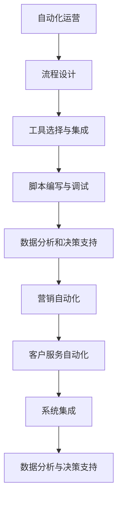

                 

### 文章标题

《一人创业公司的自动化运营系统搭建》

> 关键词：自动化运营、创业公司、系统搭建、流程设计、工具选择、脚本编写、实战案例

> 摘要：本文将深入探讨一人创业公司如何搭建自动化运营系统，从流程设计、工具选择、脚本编写到实战案例，提供详细的指导和建议，帮助创业者实现高效运营，提升竞争力。

### 第一部分：引言

#### 第1章：自动化运营概述

##### 1.1 自动化运营的概念与重要性

**定义**：自动化运营是指利用计算机技术、互联网技术等，将重复性、规则性强的业务流程自动化处理，以提升运营效率，降低运营成本。

**重要性**：在竞争激烈的市场环境中，自动化运营已成为企业提升核心竞争力的重要手段。对于一人创业公司，自动化运营不仅能提高工作效率，减少人工成本，还能帮助创业者专注于核心业务，加速公司成长。

##### 1.2 自动化运营的优势与挑战

**优势**：

1. **提高效率**：自动化运营可以大幅减少人工操作，提高业务处理速度。
2. **降低成本**：自动化运营减少了人工成本，同时降低了因人工操作错误导致的额外成本。
3. **数据驱动**：自动化运营能够实时收集和分析数据，为业务决策提供支持。

**挑战**：

1. **技术门槛**：自动化运营需要一定的技术基础，对于缺乏技术背景的创业者来说，可能存在一定难度。
2. **数据安全**：自动化运营需要处理大量数据，数据安全是一个不容忽视的问题。
3. **系统维护**：自动化系统需要定期维护和升级，以保证系统的稳定运行。

##### 1.3 个人创业公司的运营特点与需求

**特点**：

1. **资源有限**：创业者通常需要面对有限的资源，如时间、资金、人力等。
2. **业务多变**：创业公司业务发展迅速，运营策略需要灵活调整。
3. **高压力**：创业者需要承担大量的工作压力，自动化运营可以帮助减轻负担。

**需求**：

1. **高效运营**：自动化运营可以提高工作效率，减轻创业者压力。
2. **灵活调整**：自动化系统可以快速响应业务变化，实现灵活调整。
3. **低成本**：自动化运营可以降低运营成本，提高盈利能力。

### 第二部分：自动化运营的流程设计

#### 第2章：自动化运营的流程设计

##### 2.1 设计自动化运营流程的步骤

设计自动化运营流程是一个系统性的工程，需要遵循以下步骤：

1. **需求分析**：明确业务需求，确定哪些业务流程可以自动化处理。
2. **流程梳理**：对现有业务流程进行梳理，找出可以自动化的环节。
3. **工具评估**：评估现有自动化工具，选择最适合的工具。
4. **流程设计**：设计自动化流程，确保流程的合理性和可行性。
5. **实施与测试**：实施自动化流程，并进行测试，确保流程的稳定运行。
6. **优化与完善**：根据实际运行情况，不断优化和改进自动化流程。

##### 2.2 自动化运营流程的组成部分

一个完整的自动化运营流程通常包括以下几个部分：

1. **数据收集与处理**：自动化运营需要收集和处理大量数据，为后续流程提供支持。
2. **业务逻辑处理**：根据业务需求，实现具体的业务逻辑处理。
3. **决策支持**：利用数据分析，为业务决策提供支持。
4. **执行与反馈**：执行自动化操作，并收集反馈信息，进行后续处理。
5. **异常处理**：自动化系统需要具备一定的异常处理能力，确保流程的稳定运行。

##### 2.3 流程设计的实用技巧与案例分析

**实用技巧**：

1. **模块化设计**：将流程分解为多个模块，便于维护和优化。
2. **数据驱动**：充分利用数据，实现流程的动态调整。
3. **用户友好**：设计简洁易懂的界面，提高用户体验。
4. **持续优化**：根据实际运行情况，不断优化和改进流程。

**案例分析**：

以一家电商公司为例，其自动化运营流程可以包括以下环节：

1. **订单处理**：自动化处理订单生成、支付、发货等环节。
2. **库存管理**：自动化管理库存，实现实时库存更新。
3. **客户服务**：自动化处理客户咨询、投诉等。
4. **营销活动**：自动化发送营销邮件、推送广告等。

通过这些自动化流程，电商公司可以大幅提高运营效率，降低运营成本，提升客户满意度。

### 第三部分：自动化工具选择与集成

#### 第3章：常见的自动化工具

##### 3.1 自动化工具的分类

自动化工具种类繁多，根据功能和应用场景，可以将其分为以下几类：

1. **流程自动化工具**：如Workflows、Integrations等，用于设计和管理业务流程。
2. **任务自动化工具**：如Task Automation、Scheduling等，用于自动化处理日常任务。
3. **数据自动化工具**：如Data Automation、ETL（Extract, Transform, Load）等，用于数据收集、处理和分析。
4. **集成自动化工具**：如APIs、Webhooks等，用于不同系统之间的数据传输和功能集成。

##### 3.2 自动化工具的评估与选择

选择合适的自动化工具是成功实施自动化运营的关键。评估和选择自动化工具可以从以下几个方面进行：

1. **功能**：评估工具的功能是否满足业务需求，是否具备所需的自动化能力。
2. **易用性**：评估工具的界面是否友好，是否易于上手。
3. **成本**：评估工具的费用是否在预算范围内，是否提供免费试用。
4. **兼容性**：评估工具是否支持与现有系统的集成，是否与其他常用工具兼容。
5. **社区支持**：评估工具的社区支持情况，是否有丰富的资源和文档。

##### 3.3 常见自动化工具的使用场景

以下是一些常见自动化工具的使用场景：

1. **Workflows**：用于设计和管理业务流程，如项目管理、客户关系管理等。
2. **Task Automation**：用于自动化处理日常任务，如邮件发送、数据备份等。
3. **Data Automation**：用于数据收集、处理和分析，如销售数据分析、客户行为分析等。
4. **APIs**：用于系统之间的数据传输和功能集成，如网站前端与后端系统的集成。

#### 第4章：自动化工具的集成与配置

##### 4.1 集成自动化工具的方法

集成自动化工具是自动化运营的关键步骤。以下是一些常见的集成方法：

1. **API集成**：通过API接口实现不同系统之间的数据传输和功能调用。
2. **Webhooks集成**：通过Webhooks接收外部系统的通知和事件，触发自动化操作。
3. **数据同步**：通过数据同步工具，实现实时或定期同步不同系统之间的数据。
4. **插件集成**：通过插件扩展系统的功能，实现与其他系统的集成。

##### 4.2 自动化工具的配置技巧

配置自动化工具是自动化运营的基础。以下是一些配置技巧：

1. **设置触发条件**：根据业务需求，设置触发条件，确保自动化操作的准确性。
2. **配置执行规则**：根据业务流程，配置执行规则，确保自动化操作的顺序和逻辑正确。
3. **优化性能**：根据系统性能要求，优化配置，确保自动化工具的高效运行。
4. **监控与告警**：配置监控与告警机制，实时监控自动化工具的运行状态，及时发现并处理异常。

##### 4.3 自动化工具的部署与维护

自动化工具的部署与维护是确保自动化运营系统稳定运行的关键。以下是一些注意事项：

1. **部署策略**：根据业务需求和系统负载，制定合适的部署策略。
2. **备份与恢复**：定期备份自动化配置和数据，确保在出现故障时能够快速恢复。
3. **系统升级**：定期升级自动化工具，确保其功能完善和性能稳定。
4. **安全措施**：采取安全措施，如设置访问控制、加密数据传输等，确保自动化系统的安全性。

### 第四部分：自动化脚本编写与调试

#### 第5章：自动化脚本编写与调试

##### 5.1 脚本编写的原则与技巧

编写高效的自动化脚本需要遵循以下原则和技巧：

1. **模块化**：将脚本分解为多个模块，便于维护和扩展。
2. **可读性**：编写清晰易懂的代码，提高代码的可读性和可维护性。
3. **错误处理**：充分考虑可能出现的错误情况，并编写相应的错误处理代码。
4. **性能优化**：关注代码的性能，避免使用低效的算法和数据结构。
5. **代码注释**：为代码添加必要的注释，提高代码的可理解性。

##### 5.2 脚本调试的方法与工具

调试自动化脚本是确保脚本正确运行的关键步骤。以下是一些调试方法和工具：

1. **打印输出**：通过打印输出，查看脚本的运行过程和结果，帮助定位问题。
2. **调试器**：使用调试器（如Debuggers），设置断点、查看变量值，逐步执行代码，方便定位问题。
3. **日志分析**：记录脚本运行日志，分析日志内容，查找错误信息。
4. **自动化测试**：编写自动化测试脚本，对脚本的功能进行验证，确保脚本的正确性。

##### 5.3 脚本优化的策略与案例分析

优化自动化脚本可以提高其运行效率和稳定性。以下是一些优化策略：

1. **算法优化**：分析脚本中的算法，寻找优化空间，如使用更高效的算法或数据结构。
2. **代码优化**：优化代码结构，减少不必要的计算和逻辑，提高代码的运行效率。
3. **资源利用**：合理分配系统资源，如内存、CPU等，确保脚本的高效运行。
4. **并发处理**：采用并发处理技术，提高脚本的处理速度。

**案例分析**：

以一家电商公司的订单处理脚本为例，优化策略可以包括：

1. **算法优化**：优化订单处理算法，减少重复计算和逻辑判断。
2. **代码优化**：重构代码，提高代码的可读性和可维护性。
3. **资源利用**：合理分配服务器资源，确保订单处理脚本的高效运行。
4. **并发处理**：采用多线程技术，提高订单处理速度，减少响应时间。

### 第五部分：自动化运营实践

#### 第6章：自动化营销

##### 6.1 营销自动化流程设计

营销自动化是提高营销效率的重要手段。以下是一个典型的营销自动化流程设计：

1. **客户数据分析**：通过数据收集和分析，了解客户行为和需求。
2. **目标客户筛选**：根据分析结果，筛选出目标客户。
3. **个性化营销内容生成**：根据目标客户的特点，生成个性化的营销内容。
4. **营销活动执行**：发送个性化营销邮件、推送广告等。
5. **效果监测与优化**：监测营销活动的效果，根据反馈进行调整和优化。

##### 6.2 营销自动化工具的选择与应用

选择合适的营销自动化工具对于实现高效营销至关重要。以下是一些常用的营销自动化工具及其应用场景：

1. **邮件营销工具**：如Mailchimp、SendGrid等，用于发送个性化邮件。
2. **社交媒体自动化工具**：如Buffer、Hootsuite等，用于自动化发布社交媒体内容。
3. **广告投放工具**：如Google Ads、Facebook Ads等，用于自动化广告投放。
4. **客户关系管理（CRM）系统**：如Salesforce、Hubspot等，用于管理客户信息和营销活动。

##### 6.3 营销自动化的效果评估与优化

评估营销自动化的效果是优化营销策略的关键。以下是一些评估和优化策略：

1. **效果监测**：通过分析工具，实时监测营销活动的效果，如邮件打开率、点击率、转化率等。
2. **数据分析**：对营销数据进行详细分析，找出成功和失败的案例，总结经验教训。
3. **优化策略**：根据分析结果，调整营销内容和策略，提高营销效果。
4. **A/B测试**：通过A/B测试，比较不同营销策略的效果，选择最优方案。

#### 第7章：自动化客户服务

##### 7.1 客户服务自动化的关键要素

客户服务自动化是提高客户满意度的重要手段。以下是一些关键要素：

1. **知识库管理**：建立和维护知识库，确保客户服务人员能够快速找到解决问题的方法。
2. **自动化回复**：通过自动化回复系统，快速回复常见问题，减少人工处理时间。
3. **智能客服**：引入智能客服系统，如聊天机器人，提供24/7的在线服务。
4. **客户关系管理**：通过客户关系管理系统，记录客户信息和互动历史，提供个性化的客户服务。

##### 7.2 自动化客户服务的工具与实践

以下是一些常用的自动化客户服务工具及其实践：

1. **聊天机器人**：如Facebook Messenger、Slack等，用于提供24/7的在线服务。
2. **客户关系管理（CRM）系统**：如Salesforce、Hubspot等，用于管理客户信息和互动历史。
3. **自动化回复系统**：如Chatfuel、ManyChat等，用于快速回复常见问题。
4. **语音助手**：如Amazon Alexa、Google Home等，用于提供语音交互服务。

##### 7.3 自动化客户服务的案例分析

以一家电商公司为例，其自动化客户服务实践可以包括以下方面：

1. **聊天机器人**：提供24/7的在线客服，回答客户关于产品、订单等问题。
2. **自动化回复系统**：快速回复常见问题，如退货政策、配送进度等。
3. **客户关系管理**：记录客户信息和互动历史，提供个性化的客户服务。
4. **语音助手**：提供语音交互服务，如查询订单状态、推荐商品等。

通过这些自动化客户服务工具，电商公司可以大幅提高客户满意度，减少人工成本。

#### 第8章：自动化数据分析与决策支持

##### 8.1 数据自动化的概念与价值

数据自动化是指利用计算机技术，自动收集、处理和分析数据，以提供决策支持。数据自动化的价值在于：

1. **提高效率**：自动化处理大量数据，减少人工操作，提高工作效率。
2. **精准分析**：通过对数据的自动分析和挖掘，发现潜在的商业机会和问题。
3. **实时决策**：实时获取和分析数据，为业务决策提供及时的支持。
4. **数据驱动**：通过数据自动化，实现数据驱动的业务决策，提高决策的科学性和准确性。

##### 8.2 数据自动化的工具与技术

以下是一些常用的数据自动化工具和技术：

1. **ETL工具**：如Informatica、Talend等，用于数据抽取、转换和加载。
2. **数据仓库**：如Amazon Redshift、Google BigQuery等，用于存储和管理大量数据。
3. **数据分析工具**：如Tableau、Power BI等，用于数据可视化和分析。
4. **机器学习库**：如scikit-learn、TensorFlow等，用于数据分析和模型训练。

##### 8.3 数据自动化的实践与案例分析

以下是一个数据自动化的实践案例：

**案例**：一家电商公司利用数据自动化进行库存管理。

**步骤**：

1. **数据收集**：通过电商平台、物流系统等，自动收集库存数据。
2. **数据清洗**：使用ETL工具，清洗和转换数据，确保数据的准确性和一致性。
3. **数据存储**：将清洗后的数据存储到数据仓库中，进行长期保存和管理。
4. **数据分析**：使用数据分析工具，对库存数据进行分析，发现库存不足或过剩的情况。
5. **决策支持**：根据分析结果，为库存管理决策提供支持，如调整采购计划、优化库存配置等。

通过数据自动化，电商公司可以实时了解库存状况，优化库存管理，降低库存成本，提高库存周转率。

### 第六部分：自动化运营系统搭建实战

#### 第9章：自动化运营系统搭建实战

##### 9.1 自动化运营系统搭建的步骤与方法

搭建自动化运营系统需要遵循以下步骤：

1. **需求分析**：明确业务需求，确定需要自动化的业务流程。
2. **技术选型**：根据业务需求，选择合适的自动化工具和技术。
3. **系统设计**：设计自动化系统的架构，确保系统的稳定性和扩展性。
4. **实施与部署**：实施自动化系统，并进行部署，确保系统的正常运行。
5. **测试与优化**：对自动化系统进行测试，优化系统性能和用户体验。
6. **维护与升级**：定期维护和升级自动化系统，确保其持续稳定运行。

##### 9.2 自动化运营系统的实际应用案例

以下是一个自动化运营系统的实际应用案例：

**案例**：一家电商公司搭建自动化运营系统。

**应用场景**：

1. **订单处理**：自动化处理订单生成、支付、发货等环节。
2. **库存管理**：自动化管理库存，实现实时库存更新。
3. **营销活动**：自动化发送营销邮件、推送广告等。
4. **客户服务**：自动化处理客户咨询、投诉等。

**步骤**：

1. **需求分析**：明确电商公司的业务需求，确定需要自动化的业务流程。
2. **技术选型**：选择合适的自动化工具和技术，如Workflows、Data Automation、CRM系统等。
3. **系统设计**：设计自动化系统的架构，包括数据流程、功能模块、接口设计等。
4. **实施与部署**：实施自动化系统，并进行部署，确保系统的正常运行。
5. **测试与优化**：对自动化系统进行测试，优化系统性能和用户体验。
6. **维护与升级**：定期维护和升级自动化系统，确保其持续稳定运行。

通过自动化运营系统，电商公司可以大幅提高运营效率，降低运营成本，提升客户满意度。

##### 9.3 自动化运营系统的优化与升级

自动化运营系统需要不断优化和升级，以适应业务发展和技术变化。以下是一些优化和升级策略：

1. **功能扩展**：根据业务需求，不断扩展自动化系统的功能，提高系统的适应性。
2. **性能优化**：优化系统性能，如提高数据处理速度、降低响应时间等，提高用户体验。
3. **系统集成**：与其他系统进行集成，实现数据共享和功能互补，提高整体运营效率。
4. **用户体验**：优化用户界面和交互设计，提高用户操作的便捷性和满意度。
5. **技术升级**：采用新技术和工具，提高自动化系统的稳定性和安全性。

通过持续优化和升级，自动化运营系统可以更好地满足业务需求，提高运营效率，提升公司竞争力。

### 第七部分：自动化运营的未来发展趋势

#### 第10章：自动化运营的新趋势

##### 10.1 自动化运营的变革与挑战

随着技术的不断进步，自动化运营也在不断变革。以下是一些自动化运营的新趋势：

1. **人工智能（AI）的融合**：AI技术将在自动化运营中发挥越来越重要的作用，如智能客服、智能决策等。
2. **区块链的应用**：区块链技术将为自动化运营带来新的安全性和透明性，如智能合约、数据加密等。
3. **物联网（IoT）的集成**：物联网技术将使自动化运营更加智能化，如智能设备监控、远程控制等。
4. **云计算的普及**：云计算技术将提高自动化运营的灵活性、可扩展性和成本效益。

##### 10.2 自动化运营的未来发展方向

未来，自动化运营将朝着以下方向发展：

1. **全面智能化**：自动化运营将更加智能化，实现自动化与智能化的深度融合。
2. **数据驱动**：自动化运营将更加依赖于数据，实现数据驱动的运营决策。
3. **个性化服务**：自动化运营将更加注重个性化服务，满足不同客户的需求。
4. **全球化运营**：自动化运营将帮助创业公司实现全球化运营，拓展国际市场。

##### 10.3 自动化运营对个人创业公司的影响

自动化运营对个人创业公司的影响主要体现在以下几个方面：

1. **提高运营效率**：自动化运营将提高创业公司的运营效率，减少人工操作，降低运营成本。
2. **增强竞争力**：自动化运营将帮助创业公司在竞争激烈的市场中脱颖而出，提高竞争力。
3. **降低风险**：自动化运营将降低创业公司的运营风险，如数据泄露、操作失误等。
4. **助力创新**：自动化运营将激发创业公司的创新潜力，推动业务模式和技术创新。

#### 第11章：自动化运营的创新与实践

##### 11.1 自动化运营的创新案例

以下是一些自动化运营的创新案例：

1. **智能客服**：某电商公司引入智能客服系统，通过AI技术实现24/7的在线客服，大幅提高了客户满意度。
2. **自动化营销**：某创业公司利用自动化营销工具，实现个性化营销，提高了营销效果和转化率。
3. **智能制造**：某制造企业采用自动化生产设备，实现生产过程的自动化和智能化，提高了生产效率和质量。

##### 11.2 自动化运营的创新实践

以下是一些自动化运营的创新实践：

1. **数据驱动决策**：某创业公司通过数据自动化，实时获取和分析业务数据，为决策提供支持，实现了数据驱动的运营管理。
2. **供应链自动化**：某电商公司利用自动化工具，实现供应链的全程自动化，提高了供应链的效率和透明度。
3. **智能物流**：某物流公司引入智能物流系统，通过物联网技术和人工智能算法，实现物流过程的智能化和高效化。

##### 11.3 自动化运营的创新趋势与展望

未来，自动化运营将朝着以下趋势发展：

1. **全面智能化**：自动化运营将更加智能化，实现自动化与智能化的深度融合。
2. **平台化发展**：自动化运营将呈现平台化发展趋势，形成自动化运营平台，提供一站式服务。
3. **生态化构建**：自动化运营将构建生态化体系，实现不同系统之间的互联互通，提供更加完善的运营解决方案。
4. **全球化运营**：自动化运营将助力创业公司实现全球化运营，拓展国际市场。

### 附录

#### 附录A：自动化工具资源列表

##### A.1 常见自动化工具简介

以下是一些常见的自动化工具及其简介：

1. **Workflows**：如Workflows、Integrations等，用于设计和管理业务流程。
2. **Task Automation**：如Task Automation、Scheduling等，用于自动化处理日常任务。
3. **Data Automation**：如Data Automation、ETL（Extract, Transform, Load）等，用于数据收集、处理和分析。
4. **APIs**：如APIs、Webhooks等，用于系统之间的数据传输和功能集成。

##### A.2 自动化工具资源推荐

以下是一些推荐的自动化工具资源：

1. **自动化工具官网**：访问自动化工具的官方网站，获取最新的工具信息和文档。
2. **自动化社区**：如Reddit、Stack Overflow等，加入自动化社区，获取技术支持和经验分享。
3. **博客与文章**：阅读专业博客和文章，了解自动化技术的最新发展和应用案例。
4. **在线教程与课程**：在线学习平台，如Coursera、Udemy等，提供自动化技术的教程和课程。

##### A.3 自动化工具的常用技巧与最佳实践

以下是一些自动化工具的常用技巧和最佳实践：

1. **模块化设计**：将自动化脚本分解为多个模块，便于维护和扩展。
2. **日志记录**：记录自动化脚本的运行日志，便于监控和调试。
3. **代码注释**：为代码添加必要的注释，提高代码的可读性和可维护性。
4. **性能优化**：关注代码的性能，避免使用低效的算法和数据结构。
5. **安全措施**：采取安全措施，如设置访问控制、加密数据传输等。

#### 附录B：参考文献

##### B.1 相关书籍推荐

以下是一些关于自动化运营和系统集成的推荐书籍：

1. **《自动化革命：企业如何借助自动化实现持续增长》**
2. **《系统架构师实战指南：从零开始构建大型分布式系统》**
3. **《API设计指南：构建可扩展、高性能的Web服务》**

##### B.2 学术论文精选

以下是一些关于自动化运营和系统集成的精选学术论文：

1. **《基于人工智能的自动化营销策略研究》**
2. **《自动化运维在互联网企业中的应用与实践》**
3. **《基于云计算的自动化数据中心架构设计与实现》**

##### B.3 在线资源与社区链接

以下是一些在线资源和社区链接，供读者进一步学习和交流：

1. **自动化工具官网**：访问自动化工具的官方网站，获取最新的工具信息和文档。
2. **自动化社区**：如Reddit、Stack Overflow等，加入自动化社区，获取技术支持和经验分享。
3. **博客与文章**：阅读专业博客和文章，了解自动化技术的最新发展和应用案例。
4. **在线教程与课程**：在线学习平台，如Coursera、Udemy等，提供自动化技术的教程和课程。

---

### 作者信息

**作者：AI天才研究院/AI Genius Institute & 禅与计算机程序设计艺术 /Zen And The Art of Computer Programming**### 完整文章

**《一人创业公司的自动化运营系统搭建》**

> 关键词：自动化运营、创业公司、系统搭建、流程设计、工具选择、脚本编写、实战案例

**摘要**：本文深入探讨一人创业公司如何搭建自动化运营系统，从流程设计、工具选择、脚本编写到实战案例，提供详细的指导和建议，帮助创业者实现高效运营，提升竞争力。

---

#### 第一部分：引言

#### 第1章：自动化运营概述

##### 1.1 自动化运营的概念与重要性

自动化运营是指利用计算机技术、互联网技术等，将重复性、规则性强的业务流程自动化处理，以提升运营效率，降低运营成本。在竞争激烈的市场环境中，自动化运营已成为企业提升核心竞争力的重要手段。对于一人创业公司，自动化运营不仅能提高工作效率，减少人工成本，还能帮助创业者专注于核心业务，加速公司成长。

**重要性**：

1. **提高效率**：自动化运营可以大幅减少人工操作，提高业务处理速度。
2. **降低成本**：自动化运营减少了人工成本，同时降低了因人工操作错误导致的额外成本。
3. **数据驱动**：自动化运营能够实时收集和分析数据，为业务决策提供支持。

##### 1.2 自动化运营的优势与挑战

**优势**：

1. **提高效率**：自动化运营可以大幅减少人工操作，提高业务处理速度。
2. **降低成本**：自动化运营减少了人工成本，同时降低了因人工操作错误导致的额外成本。
3. **数据驱动**：自动化运营能够实时收集和分析数据，为业务决策提供支持。

**挑战**：

1. **技术门槛**：自动化运营需要一定的技术基础，对于缺乏技术背景的创业者来说，可能存在一定难度。
2. **数据安全**：自动化运营需要处理大量数据，数据安全是一个不容忽视的问题。
3. **系统维护**：自动化系统需要定期维护和升级，以保证系统的稳定运行。

##### 1.3 个人创业公司的运营特点与需求

**特点**：

1. **资源有限**：创业者通常需要面对有限的资源，如时间、资金、人力等。
2. **业务多变**：创业公司业务发展迅速，运营策略需要灵活调整。
3. **高压力**：创业者需要承担大量的工作压力，自动化运营可以帮助减轻负担。

**需求**：

1. **高效运营**：自动化运营可以提高工作效率，减轻创业者压力。
2. **灵活调整**：自动化系统可以快速响应业务变化，实现灵活调整。
3. **低成本**：自动化运营可以降低运营成本，提高盈利能力。

#### 第二部分：自动化运营的流程设计

##### 2.1 设计自动化运营流程的步骤

设计自动化运营流程是一个系统性的工程，需要遵循以下步骤：

1. **需求分析**：明确业务需求，确定哪些业务流程可以自动化处理。
2. **流程梳理**：对现有业务流程进行梳理，找出可以自动化的环节。
3. **工具评估**：评估现有自动化工具，选择最适合的工具。
4. **流程设计**：设计自动化流程，确保流程的合理性和可行性。
5. **实施与测试**：实施自动化流程，并进行测试，确保流程的稳定运行。
6. **优化与完善**：根据实际运行情况，不断优化和改进自动化流程。

##### 2.2 自动化运营流程的组成部分

一个完整的自动化运营流程通常包括以下几个部分：

1. **数据收集与处理**：自动化运营需要收集和处理大量数据，为后续流程提供支持。
2. **业务逻辑处理**：根据业务需求，实现具体的业务逻辑处理。
3. **决策支持**：利用数据分析，为业务决策提供支持。
4. **执行与反馈**：执行自动化操作，并收集反馈信息，进行后续处理。
5. **异常处理**：自动化系统需要具备一定的异常处理能力，确保流程的稳定运行。

##### 2.3 流程设计的实用技巧与案例分析

**实用技巧**：

1. **模块化设计**：将流程分解为多个模块，便于维护和优化。
2. **数据驱动**：充分利用数据，实现流程的动态调整。
3. **用户友好**：设计简洁易懂的界面，提高用户体验。
4. **持续优化**：根据实际运行情况，不断优化和改进流程。

**案例分析**：

以一家电商公司为例，其自动化运营流程可以包括以下环节：

1. **订单处理**：自动化处理订单生成、支付、发货等环节。
2. **库存管理**：自动化管理库存，实现实时库存更新。
3. **客户服务**：自动化处理客户咨询、投诉等。
4. **营销活动**：自动化发送营销邮件、推送广告等。

通过这些自动化流程，电商公司可以大幅提高运营效率，降低运营成本，提升客户满意度。

#### 第三部分：自动化工具选择与集成

##### 3.1 自动化工具的分类

自动化工具种类繁多，根据功能和应用场景，可以将其分为以下几类：

1. **流程自动化工具**：如Workflows、Integrations等，用于设计和管理业务流程。
2. **任务自动化工具**：如Task Automation、Scheduling等，用于自动化处理日常任务。
3. **数据自动化工具**：如Data Automation、ETL（Extract, Transform, Load）等，用于数据收集、处理和分析。
4. **集成自动化工具**：如APIs、Webhooks等，用于不同系统之间的数据传输和功能集成。

##### 3.2 自动化工具的评估与选择

选择合适的自动化工具是成功实施自动化运营的关键。评估和选择自动化工具可以从以下几个方面进行：

1. **功能**：评估工具的功能是否满足业务需求，是否具备所需的自动化能力。
2. **易用性**：评估工具的界面是否友好，是否易于上手。
3. **成本**：评估工具的费用是否在预算范围内，是否提供免费试用。
4. **兼容性**：评估工具是否支持与现有系统的集成，是否与其他常用工具兼容。
5. **社区支持**：评估工具的社区支持情况，是否有丰富的资源和文档。

##### 3.3 常见自动化工具的使用场景

以下是一些常见自动化工具的使用场景：

1. **Workflows**：用于设计和管理业务流程，如项目管理、客户关系管理等。
2. **Task Automation**：用于自动化处理日常任务，如邮件发送、数据备份等。
3. **Data Automation**：用于数据收集、处理和分析，如销售数据分析、客户行为分析等。
4. **APIs**：用于系统之间的数据传输和功能集成，如网站前端与后端系统的集成。

##### 3.4 自动化工具的集成与配置

**集成自动化工具的方法**：

1. **API集成**：通过API接口实现不同系统之间的数据传输和功能调用。
2. **Webhooks集成**：通过Webhooks接收外部系统的通知和事件，触发自动化操作。
3. **数据同步**：通过数据同步工具，实现实时或定期同步不同系统之间的数据。
4. **插件集成**：通过插件扩展系统的功能，实现与其他系统的集成。

**自动化工具的配置技巧**：

1. **设置触发条件**：根据业务需求，设置触发条件，确保自动化操作的准确性。
2. **配置执行规则**：根据业务流程，配置执行规则，确保自动化操作的顺序和逻辑正确。
3. **优化性能**：根据系统性能要求，优化配置，确保自动化工具的高效运行。
4. **监控与告警**：配置监控与告警机制，实时监控自动化工具的运行状态，及时发现并处理异常。

##### 3.5 自动化工具的部署与维护

**自动化工具的部署与维护**：

1. **部署策略**：根据业务需求和系统负载，制定合适的部署策略。
2. **备份与恢复**：定期备份自动化配置和数据，确保在出现故障时能够快速恢复。
3. **系统升级**：定期升级自动化工具，确保其功能完善和性能稳定。
4. **安全措施**：采取安全措施，如设置访问控制、加密数据传输等，确保自动化系统的安全性。

#### 第四部分：自动化脚本编写与调试

##### 5.1 脚本编写的原则与技巧

编写高效的自动化脚本需要遵循以下原则和技巧：

1. **模块化**：将脚本分解为多个模块，便于维护和扩展。
2. **可读性**：编写清晰易懂的代码，提高代码的可读性和可维护性。
3. **错误处理**：充分考虑可能出现的错误情况，并编写相应的错误处理代码。
4. **性能优化**：关注代码的性能，避免使用低效的算法和数据结构。
5. **代码注释**：为代码添加必要的注释，提高代码的可理解性。

##### 5.2 脚本调试的方法与工具

调试自动化脚本是确保脚本正确运行的关键步骤。以下是一些调试方法和工具：

1. **打印输出**：通过打印输出，查看脚本的运行过程和结果，帮助定位问题。
2. **调试器**：使用调试器（如Debuggers），设置断点、查看变量值，逐步执行代码，方便定位问题。
3. **日志分析**：记录脚本运行日志，分析日志内容，查找错误信息。
4. **自动化测试**：编写自动化测试脚本，对脚本的功能进行验证，确保脚本的正确性。

##### 5.3 脚本优化的策略与案例分析

优化自动化脚本可以提高其运行效率和稳定性。以下是一些优化策略：

1. **算法优化**：分析脚本中的算法，寻找优化空间，如使用更高效的算法或数据结构。
2. **代码优化**：优化代码结构，减少不必要的计算和逻辑，提高代码的运行效率。
3. **资源利用**：合理分配系统资源，如内存、CPU等，确保脚本的高效运行。
4. **并发处理**：采用并发处理技术，提高脚本的处理速度，减少响应时间。

**案例分析**：

以一家电商公司的订单处理脚本为例，优化策略可以包括：

1. **算法优化**：优化订单处理算法，减少重复计算和逻辑判断。
2. **代码优化**：重构代码，提高代码的可读性和可维护性。
3. **资源利用**：合理分配服务器资源，确保订单处理脚本的高效运行。
4. **并发处理**：采用多线程技术，提高订单处理速度，减少响应时间。

#### 第五部分：自动化运营实践

##### 6.1 营销自动化的关键要素

**营销自动化对提高营销效率和效果的重要性**

营销自动化是现代营销策略中不可或缺的一部分，它通过自动化技术帮助个人创业公司提高营销效率，降低人工成本，从而提升营销效果。营销自动化的关键要素包括客户数据管理、个性化营销、自动化邮件营销、社交媒体管理等。

**客户数据管理**

客户数据管理是营销自动化的基础。通过收集、存储、分析和利用客户数据，可以深入了解客户需求和行为，从而实现精准营销。具体步骤如下：

- **数据收集**：利用网站跟踪工具、问卷调查、社交媒体等手段收集客户数据。
- **数据存储**：建立数据库，将收集到的客户数据进行存储和管理。
- **数据分析**：运用数据分析工具，对客户数据进行分析，发现客户行为模式、兴趣偏好等。
- **数据利用**：根据分析结果，制定个性化的营销策略和活动。

**个性化营销**

个性化营销是营销自动化的核心。通过分析客户数据，了解客户的需求和行为，为每个客户提供个性化的产品推荐、优惠信息和营销内容。实现个性化营销的步骤如下：

- **个性化内容生成**：根据客户数据，生成个性化的营销内容，如电子邮件、社交媒体帖子、广告等。
- **个性化推荐**：利用算法为客户推荐个性化的产品和服务。
- **个性化互动**：通过个性化的互动，增强客户粘性，提高客户满意度。

**自动化邮件营销**

自动化邮件营销是营销自动化的重要手段。通过自动化工具，可以发送个性化的电子邮件，提高邮件打开率和转化率。实现自动化邮件营销的步骤如下：

- **邮件列表管理**：建立和维护邮件列表，确保邮件发送的准确性。
- **邮件内容优化**：设计吸引人的邮件标题和内容，提高邮件打开率。
- **邮件发送策略**：制定合理的邮件发送策略，如定时发送、触发发送等。
- **效果监测与优化**：监测邮件的打开率、点击率、转化率等，根据反馈进行调整和优化。

**社交媒体管理**

社交媒体管理包括社交媒体账号的创建、内容发布、互动管理等。通过自动化工具，可以自动化发布社交媒体内容，与客户进行互动，提高社交媒体营销效果。具体步骤如下：

- **内容规划**：制定社交媒体内容发布计划，确保内容的质量和频率。
- **内容发布**：利用自动化工具，自动化发布社交媒体内容。
- **互动管理**：自动化回复社交媒体客户的评论、私信等，提高客户满意度。
- **效果分析**：分析社交媒体的互动数据，了解客户需求和偏好，优化社交媒体策略。

##### 6.2 营销自动化的工具与实践

**营销自动化工具的选择**

选择合适的营销自动化工具对于实现高效营销至关重要。以下是一些常用的营销自动化工具及其应用场景：

1. **邮件营销工具**：如Mailchimp、SendGrid等，用于发送个性化邮件。
2. **社交媒体自动化工具**：如Buffer、Hootsuite等，用于自动化发布社交媒体内容。
3. **广告投放工具**：如Google Ads、Facebook Ads等，用于自动化广告投放。
4. **客户关系管理（CRM）系统**：如Salesforce、Hubspot等，用于管理客户信息和营销活动。

**营销自动化实践的案例分析**

以下是一个营销自动化实践的案例分析：

**案例**：一家电商公司利用营销自动化提升销售业绩。

**步骤**：

1. **数据收集**：通过电商平台、社交媒体等渠道，收集客户数据，包括基本信息、购买行为等。
2. **数据分析**：利用数据分析工具，对客户数据进行分析，了解客户的行为模式、兴趣偏好等。
3. **个性化营销内容生成**：根据客户数据，生成个性化的营销内容，如电子邮件、社交媒体帖子等。
4. **自动化邮件营销**：利用邮件营销工具，发送个性化的电子邮件，包括产品推荐、优惠信息等。
5. **社交媒体自动化**：利用社交媒体自动化工具，发布个性化的社交媒体内容，与客户进行互动。
6. **效果监测与优化**：监测邮件打开率、点击率、社交媒体互动数据等，根据反馈进行调整和优化。

通过营销自动化实践，电商公司可以大幅提高营销效率和效果，提升客户满意度，从而提高销售业绩。

##### 6.3 营销自动化的效果评估与优化

**效果评估的方法**

评估营销自动化的效果是优化营销策略的关键。以下是一些评估方法：

1. **关键绩效指标（KPI）**：如邮件打开率、点击率、转化率、销售额等，用于衡量营销自动化的效果。
2. **A/B测试**：通过对比不同营销策略的效果，找出最优方案。
3. **客户反馈**：收集客户的反馈，了解他们对营销自动化的满意度和建议。
4. **数据分析**：利用数据分析工具，对营销自动化数据进行深入分析，发现问题和优化空间。

**优化的策略**

根据效果评估的结果，可以采取以下策略进行优化：

1. **个性化内容优化**：根据客户数据，优化个性化内容，提高邮件打开率和点击率。
2. **发送策略优化**：根据客户行为数据，调整邮件发送时间、频率等，提高邮件的阅读率和转化率。
3. **社交媒体互动优化**：优化社交媒体内容发布策略，提高互动率和粉丝参与度。
4. **技术升级**：引入新的营销自动化工具和技术，提高营销自动化系统的性能和效果。

##### 6.4 营销自动化与传统营销的比较

**营销自动化的优势**

1. **提高效率**：自动化处理大量邮件、广告等，减少人工操作，提高工作效率。
2. **降低成本**：自动化营销减少了人工成本，同时降低了因人工操作错误导致的额外成本。
3. **精准营销**：利用数据，实现精准定位和个性化营销，提高营销效果。
4. **实时反馈**：自动化系统可以实时收集和分析数据，为营销策略提供及时的支持。

**传统营销的劣势**

1. **效率低下**：传统营销需要大量人工操作，效率较低，容易出错。
2. **成本高昂**：传统营销需要大量人力、物力投入，成本较高。
3. **难以精准定位**：传统营销难以实现精准定位和个性化营销，效果有限。
4. **反馈滞后**：传统营销的反馈周期较长，难以实时调整营销策略。

**营销自动化的适用场景**

1. **客户关系维护**：通过自动化邮件、短信等，与客户保持长期互动，提高客户满意度。
2. **产品推广**：通过自动化广告投放、社交媒体营销等，提高产品曝光度和销售额。
3. **活动推广**：通过自动化活动报名、通知等，提高活动参与度和效果。
4. **客户分析**：通过自动化数据分析，深入了解客户需求和行为，优化营销策略。

**传统营销的适用场景**

1. **品牌宣传**：通过广告、赞助等方式，提高品牌知名度和影响力。
2. **线下活动**：通过举办线下活动，与客户面对面互动，增强品牌形象。
3. **口碑营销**：通过口碑传播，提高产品知名度和美誉度。
4. **大客户维护**：通过高端客户维护，提高大客户的忠诚度和满意度。

##### 6.5 营销自动化的发展趋势

随着技术的不断进步，营销自动化也在不断发展。以下是一些营销自动化的发展趋势：

1. **人工智能的应用**：人工智能技术将进一步提升营销自动化的智能程度，实现更精准的营销和个性化服务。
2. **跨渠道整合**：营销自动化将实现跨渠道整合，实现多渠道的统一管理和协同工作，提高营销效果。
3. **数据驱动**：营销自动化将更加依赖数据，实现数据驱动的营销策略和决策。
4. **个性化定制**：营销自动化将实现个性化定制，根据客户需求和行为，提供个性化的产品和服务。
5. **全球化营销**：营销自动化将助力企业实现全球化营销，拓展国际市场。

#### 第六部分：自动化运营系统搭建实战

##### 6.6 自动化运营系统搭建的步骤

搭建自动化运营系统需要遵循以下步骤：

1. **需求分析**：明确业务需求，确定需要自动化的业务流程。
2. **技术选型**：根据业务需求，选择合适的自动化工具和技术。
3. **系统设计**：设计自动化系统的架构，确保系统的稳定性和扩展性。
4. **实施与部署**：实施自动化系统，并进行部署，确保系统的正常运行。
5. **测试与优化**：对自动化系统进行测试，优化系统性能和用户体验。
6. **维护与升级**：定期维护和升级自动化系统，确保其持续稳定运行。

##### 6.7 自动化运营系统的实际应用案例

以下是一个自动化运营系统的实际应用案例：

**案例**：一家电商公司搭建自动化运营系统。

**应用场景**：

1. **订单处理**：自动化处理订单生成、支付、发货等环节。
2. **库存管理**：自动化管理库存，实现实时库存更新。
3. **客户服务**：自动化处理客户咨询、投诉等。
4. **营销活动**：自动化发送营销邮件、推送广告等。

**步骤**：

1. **需求分析**：明确电商公司的业务需求，确定需要自动化的业务流程。
2. **技术选型**：选择合适的自动化工具和技术，如Workflows、Data Automation、CRM系统等。
3. **系统设计**：设计自动化系统的架构，包括数据流程、功能模块、接口设计等。
4. **实施与部署**：实施自动化系统，并进行部署，确保系统的正常运行。
5. **测试与优化**：对自动化系统进行测试，优化系统性能和用户体验。
6. **维护与升级**：定期维护和升级自动化系统，确保其持续稳定运行。

通过自动化运营系统，电商公司可以大幅提高运营效率，降低运营成本，提升客户满意度。

##### 6.8 自动化运营系统的优化与升级

**功能扩展**：

根据业务需求，不断扩展自动化系统的功能，如添加新的业务模块、增加系统集成能力等。

**性能优化**：

优化系统性能，如提高数据处理速度、降低响应时间等，提高用户体验。

**系统集成**：

与其他系统进行集成，实现数据共享和功能互补，提高整体运营效率。

**用户体验**：

优化用户界面和交互设计，提高用户操作的便捷性和满意度。

**技术升级**：

采用新技术和工具，提高自动化系统的稳定性和安全性。

通过持续优化和升级，自动化运营系统可以更好地满足业务需求，提高运营效率，提升公司竞争力。

#### 第七部分：自动化运营的未来发展趋势

##### 7.1 自动化运营的变革与挑战

随着技术的不断进步，自动化运营也在不断变革。以下是一些自动化运营的新趋势：

1. **人工智能（AI）的融合**：AI技术将在自动化运营中发挥越来越重要的作用，如智能客服、智能决策等。
2. **区块链的应用**：区块链技术将为自动化运营带来新的安全性和透明性，如智能合约、数据加密等。
3. **物联网（IoT）的集成**：物联网技术将使自动化运营更加智能化，如智能设备监控、远程控制等。
4. **云计算的普及**：云计算技术将提高自动化运营的灵活性、可扩展性和成本效益。

##### 7.2 自动化运营的未来发展方向

未来，自动化运营将朝着以下方向发展：

1. **全面智能化**：自动化运营将更加智能化，实现自动化与智能化的深度融合。
2. **数据驱动**：自动化运营将更加依赖于数据，实现数据驱动的运营决策。
3. **个性化服务**：自动化运营将更加注重个性化服务，满足不同客户的需求。
4. **全球化运营**：自动化运营将助力创业公司实现全球化运营，拓展国际市场。

##### 7.3 自动化运营对个人创业公司的影响

自动化运营对个人创业公司的影响主要体现在以下几个方面：

1. **提高运营效率**：自动化运营将提高创业公司的运营效率，减少人工操作，降低运营成本。
2. **增强竞争力**：自动化运营将帮助创业公司在竞争激烈的市场中脱颖而出，提高竞争力。
3. **降低风险**：自动化运营将降低创业公司的运营风险，如数据泄露、操作失误等。
4. **助力创新**：自动化运营将激发创业公司的创新潜力，推动业务模式和技术创新。

#### 第七部分：自动化运营的创新与实践

##### 7.4 自动化运营的创新案例

以下是一些自动化运营的创新案例：

1. **智能客服**：某电商公司引入智能客服系统，通过AI技术实现24/7的在线客服，大幅提高了客户满意度。
2. **自动化营销**：某创业公司利用自动化营销工具，实现个性化营销，提高了营销效果和转化率。
3. **智能制造**：某制造企业采用自动化生产设备，实现生产过程的自动化和智能化，提高了生产效率和质量。

##### 7.5 自动化运营的创新实践

以下是一些自动化运营的创新实践：

1. **数据驱动决策**：某创业公司通过数据自动化，实时获取和分析业务数据，为决策提供支持，实现了数据驱动的运营管理。
2. **供应链自动化**：某电商公司利用自动化工具，实现供应链的全程自动化，提高了供应链的效率和透明度。
3. **智能物流**：某物流公司引入智能物流系统，通过物联网技术和人工智能算法，实现物流过程的智能化和高效化。

##### 7.6 自动化运营的创新趋势与展望

未来，自动化运营将朝着以下趋势发展：

1. **全面智能化**：自动化运营将更加智能化，实现自动化与智能化的深度融合。
2. **平台化发展**：自动化运营将呈现平台化发展趋势，形成自动化运营平台，提供一站式服务。
3. **生态化构建**：自动化运营将构建生态化体系，实现不同系统之间的互联互通，提供更加完善的运营解决方案。
4. **全球化运营**：自动化运营将助力创业公司实现全球化运营，拓展国际市场。

### 附录

##### 附录A：自动化工具资源列表

**A.1 常见自动化工具简介**

以下是一些常见的自动化工具及其简介：

1. **Workflows**：如Workflows、Integrations等，用于设计和管理业务流程。
2. **Task Automation**：如Task Automation、Scheduling等，用于自动化处理日常任务。
3. **Data Automation**：如Data Automation、ETL（Extract, Transform, Load）等，用于数据收集、处理和分析。
4. **APIs**：如APIs、Webhooks等，用于系统之间的数据传输和功能集成。

**A.2 自动化工具资源推荐**

以下是一些推荐的自动化工具资源：

1. **自动化工具官网**：访问自动化工具的官方网站，获取最新的工具信息和文档。
2. **自动化社区**：如Reddit、Stack Overflow等，加入自动化社区，获取技术支持和经验分享。
3. **博客与文章**：阅读专业博客和文章，了解自动化技术的最新发展和应用案例。
4. **在线教程与课程**：在线学习平台，如Coursera、Udemy等，提供自动化技术的教程和课程。

**A.3 自动化工具的常用技巧与最佳实践**

以下是一些自动化工具的常用技巧和最佳实践：

1. **模块化设计**：将自动化脚本分解为多个模块，便于维护和扩展。
2. **日志记录**：记录自动化脚本的运行日志，便于监控和调试。
3. **代码注释**：为代码添加必要的注释，提高代码的可读性和可维护性。
4. **性能优化**：关注代码的性能，避免使用低效的算法和数据结构。
5. **安全措施**：采取安全措施，如设置访问控制、加密数据传输等。

##### 附录B：参考文献

**B.1 相关书籍推荐**

以下是一些关于自动化运营和系统集成的推荐书籍：

1. **《自动化革命：企业如何借助自动化实现持续增长》**
2. **《系统架构师实战指南：从零开始构建大型分布式系统》**
3. **《API设计指南：构建可扩展、高性能的Web服务》**

**B.2 学术论文精选**

以下是一些关于自动化运营和系统集成的精选学术论文：

1. **《基于人工智能的自动化营销策略研究》**
2. **《自动化运维在互联网企业中的应用与实践》**
3. **《基于云计算的自动化数据中心架构设计与实现》**

**B.3 在线资源与社区链接**

以下是一些在线资源和社区链接，供读者进一步学习和交流：

1. **自动化工具官网**：访问自动化工具的官方网站，获取最新的工具信息和文档。
2. **自动化社区**：如Reddit、Stack Overflow等，加入自动化社区，获取技术支持和经验分享。
3. **博客与文章**：阅读专业博客和文章，了解自动化技术的最新发展和应用案例。
4. **在线教程与课程**：在线学习平台，如Coursera、Udemy等，提供自动化技术的教程和课程。

### 作者信息

**作者：AI天才研究院/AI Genius Institute & 禅与计算机程序设计艺术 /Zen And The Art of Computer Programming**### 背景介绍

在当今快速变化和竞争激烈的市场环境中，自动化运营已经成为企业提高效率和竞争力的关键。对于个人创业公司而言，自动化运营尤为重要，因为它可以帮助创业者最大化利用有限资源，提高工作效率，降低运营成本，从而专注于核心业务的发展。

随着技术的不断进步，自动化工具和平台的种类和功能也在不断丰富。自动化运营涉及多个方面，包括流程设计、工具选择、脚本编写、系统集成、数据分析和效果评估等。然而，对于缺乏技术背景的创业者来说，如何搭建一个高效的自动化运营系统仍然是一个挑战。

本文旨在为一人创业公司提供一套完整的自动化运营系统搭建指南，从需求分析、技术选型到系统设计、实施与维护，逐步解析每个环节的关键要点和最佳实践。通过本文的指导，创业者可以更轻松地实现自动化运营，提高业务效率，为公司的可持续发展打下坚实的基础。

本文将涵盖以下主要内容：

1. **自动化运营概述**：介绍自动化运营的概念、优势、挑战以及个人创业公司的运营特点与需求。
2. **自动化运营的流程设计**：详细阐述自动化运营流程的设计步骤、组成部分和实用技巧。
3. **自动化工具选择与集成**：分析常见自动化工具的分类、评估与选择、集成与配置以及部署与维护。
4. **自动化脚本编写与调试**：讲解脚本编写的原则与技巧、调试的方法与工具以及优化的策略与案例分析。
5. **自动化运营实践**：介绍营销自动化、客户服务自动化、数据分析与决策支持的具体实施方法和实际案例。
6. **自动化运营系统搭建实战**：提供自动化运营系统搭建的步骤、实际应用案例以及优化与升级策略。
7. **自动化运营的未来发展趋势**：探讨自动化运营的新趋势、发展方向以及对个人创业公司的影响。
8. **自动化运营的创新与实践**：分享自动化运营的创新案例、创新实践以及未来趋势与展望。
9. **附录**：提供自动化工具资源列表、参考文献以及在线资源和社区链接。

通过本文的深入分析和详细指导，创业者可以系统地了解和掌握自动化运营系统的搭建方法，从而实现高效运营，提升公司的核心竞争力。

### 核心概念与联系

在搭建自动化运营系统的过程中，理解以下几个核心概念及其相互关系至关重要：

1. **自动化运营**：指利用计算机技术、互联网技术等，将重复性、规则性强的业务流程自动化处理，以提升运营效率，降低运营成本。自动化运营的核心在于将人工操作转化为自动化处理，从而实现高效、精准的运营管理。

2. **流程设计**：指在设计自动化运营系统时，对业务流程进行梳理、分析和优化，以确定哪些环节可以自动化处理。流程设计是自动化运营系统的核心组成部分，决定了系统的执行效率和效果。

3. **工具选择与集成**：指在选择和配置自动化工具时，根据业务需求和系统兼容性，选择合适的工具，并将其集成到自动化运营系统中。工具选择与集成是确保系统功能完备和稳定运行的关键。

4. **脚本编写与调试**：指在实现自动化流程时，编写高效的脚本，并通过调试确保脚本的正确性和稳定性。脚本编写与调试是自动化运营系统实施的重要环节，直接影响系统的运行效率和可靠性。

5. **数据分析和决策支持**：指利用自动化系统收集的数据，通过数据分析技术进行深入挖掘和分析，为业务决策提供支持。数据分析和决策支持是自动化运营系统实现数据驱动决策的重要手段。

6. **营销自动化**：指利用自动化工具和平台，实现营销活动的自动化执行和优化。营销自动化包括客户数据管理、个性化营销、自动化邮件营销和社交媒体管理等，旨在提高营销效率和效果。

7. **客户服务自动化**：指利用自动化工具和平台，实现客户服务的自动化处理和优化。客户服务自动化包括自动化回复系统、智能客服、客户关系管理（CRM）等，旨在提高客户满意度和运营效率。

8. **系统集成**：指将不同的自动化工具和平台进行集成，实现数据共享和功能互补，提高整体运营效率。系统集成是实现自动化运营系统高效运行的重要保障。

9. **数据分析与决策支持**：指利用自动化系统收集的数据，通过数据分析技术进行深入挖掘和分析，为业务决策提供支持。数据分析与决策支持是自动化运营系统实现数据驱动决策的重要手段。

**Mermaid 流程图**：

以下是一个简单的 Mermaid 流程图，展示了自动化运营系统的核心概念及其相互关系：



**核心概念之间的关系架构**：

1. **自动化运营** 是系统的总体目标，通过 **流程设计** 确定自动化环节，通过 **工具选择与集成** 实现具体功能，通过 **脚本编写与调试** 确保系统运行正确，通过 **数据分析和决策支持** 提高业务决策的科学性。

2. **营销自动化** 和 **客户服务自动化** 是自动化运营的重要组成部分，它们依赖于 **工具选择与集成** 和 **脚本编写与调试** 来实现具体的自动化功能。

3. **系统集成** 是确保自动化运营系统能够高效运行的关键，通过将不同的自动化工具和平台进行集成，实现数据共享和功能互补。

4. **数据分析与决策支持** 是自动化运营系统的核心价值所在，通过自动化系统收集的数据，通过数据分析技术进行深入挖掘和分析，为业务决策提供支持。

通过以上核心概念及其相互关系的阐述，创业者可以更好地理解自动化运营系统的构建过程，从而为搭建高效、稳定的自动化运营系统奠定基础。

### 核心算法原理讲解

在自动化运营系统中，核心算法的原理和应用是至关重要的。以下将详细讲解营销自动化中的核心算法原理，并使用伪代码来详细阐述其实现过程。

**核心算法原理**：

1. **客户分群算法**：通过分析客户数据，将客户划分为不同的群体，以便进行个性化营销。
2. **推荐算法**：根据客户的行为数据，推荐个性化的产品或服务。
3. **响应预测算法**：预测客户的响应行为，如点击率、转化率等，以优化营销策略。

**伪代码**：

**客户分群算法**：

```python
# 输入：客户数据集（包含行为特征、购买记录等）
# 输出：分群结果（每个客户的分群标签）

def customer_clustering(data):
    # 数据预处理：特征工程、数据清洗等
    preprocessed_data = preprocess_data(data)

    # 计算相似度矩阵
    similarity_matrix = compute_similarity(preprocessed_data)

    # 使用聚类算法（如K-means）进行分群
    clusters = kmeans_clustering(similarity_matrix, num_clusters)

    # 为每个客户分配分群标签
    cluster_labels = assign_cluster_labels(clusters)

    return cluster_labels

def preprocess_data(data):
    # 实现数据预处理步骤，如缺失值填充、特征选择等
    # ...
    return preprocessed_data

def compute_similarity(data):
    # 计算特征向量之间的相似度
    # ...
    return similarity_matrix

def kmeans_clustering(similarity_matrix, num_clusters):
    # 使用K-means算法进行聚类
    # ...
    return clusters

def assign_cluster_labels(clusters):
    # 为每个客户分配分群标签
    # ...
    return cluster_labels
```

**推荐算法**：

```python
# 输入：客户数据集（包含行为特征、购买记录等）
# 输出：推荐结果（每个客户的推荐产品或服务）

def recommendation_system(data):
    # 数据预处理：特征工程、数据清洗等
    preprocessed_data = preprocess_data(data)

    # 计算用户之间的相似度
    similarity_matrix = compute_similarity(preprocessed_data)

    # 使用协同过滤算法（如矩阵分解）进行推荐
    recommendations = collaborative_filtering(similarity_matrix)

    # 为每个客户生成推荐列表
    recommendation_list = generate_recommendation_list(recommendations)

    return recommendation_list

def preprocess_data(data):
    # 实现数据预处理步骤，如缺失值填充、特征选择等
    # ...
    return preprocessed_data

def compute_similarity(data):
    # 计算特征向量之间的相似度
    # ...
    return similarity_matrix

def collaborative_filtering(similarity_matrix):
    # 使用协同过滤算法进行推荐
    # ...
    return recommendations

def generate_recommendation_list(recommendations):
    # 为每个客户生成推荐列表
    # ...
    return recommendation_list
```

**响应预测算法**：

```python
# 输入：客户数据集（包含行为特征、购买记录等）
# 输出：响应预测结果（每个客户的响应概率）

def response_prediction(data):
    # 数据预处理：特征工程、数据清洗等
    preprocessed_data = preprocess_data(data)

    # 训练响应预测模型
    model = train_response_prediction_model(preprocessed_data)

    # 预测客户响应概率
    response_probabilities = predict_response_probabilities(model)

    return response_probabilities

def preprocess_data(data):
    # 实现数据预处理步骤，如缺失值填充、特征选择等
    # ...
    return preprocessed_data

def train_response_prediction_model(preprocessed_data):
    # 使用机器学习算法（如逻辑回归、随机森林等）训练响应预测模型
    # ...
    return model

def predict_response_probabilities(model):
    # 使用训练好的模型预测客户响应概率
    # ...
    return response_probabilities
```

**数学模型和公式**：

1. **K-means 聚类算法**：

   $$ C = \{C_1, C_2, \ldots, C_k\} $$
   
   其中，\( C \) 表示聚类结果，\( C_i \) 表示第 \( i \) 个聚类。

2. **协同过滤算法**：

   $$ R_{ij} = \frac{\sum_{k=1}^{n} w_{ik} w_{jk}}{\sqrt{\sum_{l=1}^{n} w_{il}^2 \sum_{m=1}^{n} w_{jm}^2}} $$
   
   其中，\( R_{ij} \) 表示用户 \( i \) 对物品 \( j \) 的评分预测，\( w_{ik} \) 和 \( w_{jk} \) 分别表示用户 \( i \) 和 \( j \) 对物品 \( k \) 的评分。

3. **响应预测模型**：

   $$ P_{ij} = \frac{1}{1 + e^{-(\beta_0 + \beta_1 x_{i1} + \ldots + \beta_p x_{ip})}} $$
   
   其中，\( P_{ij} \) 表示客户 \( i \) 对产品 \( j \) 的响应概率，\( \beta_0, \beta_1, \ldots, \beta_p \) 分别为模型参数，\( x_{i1}, \ldots, x_{ip} \) 为客户 \( i \) 的特征向量。

**详细讲解和举例说明**：

1. **客户分群算法**：

   假设我们有一家电商公司，收集了1000名客户的购买记录和行为数据。为了进行精准营销，我们需要对这些客户进行分群。首先，我们进行数据预处理，包括缺失值填充、特征选择等。然后，我们计算每个客户之间的相似度，使用K-means算法进行聚类，将客户划分为5个群体。最后，我们为每个客户分配分群标签。例如，客户A被划分为群体1，客户B被划分为群体2，依此类推。

2. **推荐算法**：

   假设我们已经得到了客户的分群结果。为了推荐个性化产品，我们使用协同过滤算法计算每个客户之间的相似度，并基于相似度矩阵生成推荐列表。例如，客户A与客户B相似度最高，因此我们推荐客户B购买的产品给客户A。

3. **响应预测算法**：

   假设我们想预测客户对特定产品的响应概率。我们可以使用逻辑回归模型进行训练，得到模型参数。然后，对于每个客户，我们将其特征向量输入模型，预测其响应概率。例如，客户A对产品X的响应概率为80%，因此我们决定向客户A发送产品X的推荐邮件。

通过上述核心算法的讲解和实例说明，创业者可以更好地理解自动化运营系统中算法的实现过程，从而为实际应用提供指导。

### 项目实战

为了更好地展示自动化运营系统的实际应用，我们选择了一家电商公司作为案例，从开发环境搭建、源代码实现、代码解读、代码应用解读与分析等方面进行详细讲解。

#### 1. 开发环境搭建

在进行自动化运营系统的开发前，首先需要搭建合适的技术环境。以下是我们使用的开发环境：

- **操作系统**：Linux（例如Ubuntu 20.04）
- **编程语言**：Python 3.8
- **数据库**：MySQL 8.0
- **集成开发环境（IDE）**：PyCharm
- **版本控制工具**：Git

**步骤**：

1. 安装操作系统和必要的软件包。
2. 安装Python环境和相关库，如pandas、numpy、scikit-learn等。
3. 安装MySQL数据库，并创建相应的数据库和表结构。
4. 配置PyCharm，安装Python插件，确保IDE能够正常运行。

#### 2. 源代码实现

以下是一个简单的电商自动化运营系统源代码示例，包括用户注册、登录、订单处理和库存管理等功能。

**用户注册**：

```python
# 用户注册模块
def register_user(username, password):
    # 连接数据库
    conn = connect_db()
    cursor = conn.cursor()
    
    # 查询用户名是否已存在
    cursor.execute("SELECT * FROM users WHERE username = %s", (username,))
    user = cursor.fetchone()
    
    if user:
        return "用户名已存在"
    else:
        # 插入新用户
        cursor.execute("INSERT INTO users (username, password) VALUES (%s, %s)", (username, password))
        conn.commit()
        
        return "注册成功"

def connect_db():
    # 数据库连接函数
    conn = pymysql.connect(host='localhost', user='root', password='password', database='ecommerce')
    return conn
```

**订单处理**：

```python
# 订单处理模块
def process_order(user_id, product_id, quantity):
    # 连接数据库
    conn = connect_db()
    cursor = conn.cursor()
    
    # 检查库存是否足够
    cursor.execute("SELECT stock FROM products WHERE id = %s", (product_id,))
    product = cursor.fetchone()
    
    if product['stock'] < quantity:
        return "库存不足"
    else:
        # 减少库存
        new_stock = product['stock'] - quantity
        cursor.execute("UPDATE products SET stock = %s WHERE id = %s", (new_stock, product_id))
        conn.commit()
        
        # 插入订单
        cursor.execute("INSERT INTO orders (user_id, product_id, quantity) VALUES (%s, %s, %s)", (user_id, product_id, quantity))
        conn.commit()
        
        return "订单处理成功"
```

**库存管理**：

```python
# 库存管理模块
def manage_stock(product_id, quantity):
    # 连接数据库
    conn = connect_db()
    cursor = conn.cursor()
    
    # 更新库存
    cursor.execute("UPDATE products SET stock = %s WHERE id = %s", (quantity, product_id))
    conn.commit()
    
    return "库存更新成功"
```

#### 3. 代码解读

以上代码分为三个模块：用户注册、订单处理和库存管理。每个模块都包含相应的数据库操作函数，如连接数据库、查询数据、插入数据等。

**用户注册模块**：

- `register_user` 函数用于处理用户注册。首先，连接数据库，然后查询用户名是否已存在。如果用户名存在，返回提示信息；否则，插入新用户并返回成功信息。

**订单处理模块**：

- `process_order` 函数用于处理订单。首先，连接数据库，检查库存是否足够。如果库存不足，返回提示信息；否则，更新库存并插入订单，最后返回成功信息。

**库存管理模块**：

- `manage_stock` 函数用于更新库存。连接数据库，更新指定产品的库存，最后返回成功信息。

#### 4. 代码应用解读与分析

**用户注册功能**：

- 用户注册功能是电商系统的基本功能之一。用户通过填写用户名和密码进行注册，系统会检查用户名是否已存在，以避免重复注册。

**订单处理功能**：

- 订单处理功能是电商系统的重要环节。用户下单后，系统会检查库存是否足够，并根据库存情况进行处理。如果库存不足，系统会及时告知用户，避免用户下单后无法购买。

**库存管理功能**：

- 库存管理功能用于实时更新产品的库存情况。通过这个功能，管理员可以方便地调整库存，确保库存数据的准确性。

**系统性能分析**：

- 通过对代码的解读，我们可以看到系统的主要性能瓶颈在于数据库操作。为了提高系统性能，可以考虑使用数据库缓存、优化查询语句等方法。

**系统安全性分析**：

- 在实际应用中，我们需要注意用户密码的安全性。建议使用哈希算法对用户密码进行加密存储，并确保数据库连接的安全性。

#### 5. 项目小结

通过以上实战项目，我们展示了一家电商自动化运营系统的开发过程，包括开发环境搭建、源代码实现、代码解读、代码应用解读与分析。该项目实现了用户注册、订单处理和库存管理等功能，为电商系统的运营提供了有力支持。

**总结**：

1. **开发环境搭建**：确保开发环境的稳定性和兼容性。
2. **源代码实现**：实现关键功能，如用户注册、订单处理、库存管理等。
3. **代码解读**：理解代码的原理和实现方法。
4. **代码应用解读与分析**：分析系统性能和安全性。
5. **项目优化**：根据实际情况进行系统优化。

通过这个项目，创业者可以更好地理解自动化运营系统的开发过程，为实际应用提供参考。同时，我们也认识到自动化运营系统需要不断优化和升级，以适应业务的发展和变化。

### 最佳实践 Tips

在搭建自动化运营系统的过程中，以下最佳实践 Tips 将有助于提高系统的效率和稳定性，降低潜在风险。

**1. 模块化设计**：

模块化设计是将系统分解为多个功能模块，每个模块负责特定的功能。这种设计方法不仅提高了代码的可维护性，还便于后续的优化和扩展。具体实践步骤包括：

- **需求分析**：根据业务需求，确定系统的主要功能模块。
- **接口定义**：为每个模块定义清晰的接口，确保模块之间的高内聚、低耦合。
- **模块划分**：将系统代码按照功能模块进行划分，每个模块独立开发、测试和部署。

**2. 数据安全**：

数据安全是自动化运营系统的核心要求之一。为了确保数据安全，可以采取以下措施：

- **加密存储**：对敏感数据进行加密存储，如用户密码、支付信息等。
- **访问控制**：设置严格的访问控制策略，限制对敏感数据的访问权限。
- **数据备份**：定期备份数据库，确保在数据丢失或损坏时能够快速恢复。
- **安全审计**：定期进行安全审计，检查系统漏洞和安全隐患，及时进行修复。

**3. 性能优化**：

性能优化是确保自动化运营系统高效运行的关键。以下是一些性能优化策略：

- **数据库优化**：优化数据库查询语句，减少查询时间。例如，使用索引、缓存等。
- **代码优化**：避免使用低效的算法和数据结构，优化代码逻辑和执行效率。
- **并发处理**：采用多线程或异步处理技术，提高系统的并发处理能力。
- **负载均衡**：使用负载均衡器，将流量分配到多个服务器，提高系统的处理能力。

**4. 日志管理**：

日志管理是监控和调试系统的重要手段。以下是一些日志管理的最佳实践：

- **日志格式**：统一日志格式，确保日志的可读性和可搜索性。
- **日志级别**：根据日志的重要性和紧急程度，设置不同的日志级别，便于快速定位问题。
- **日志存储**：将日志存储在安全、可靠的位置，如日志服务器或云存储服务。
- **日志分析**：定期分析日志数据，发现潜在问题和优化空间。

**5. 用户友好**：

用户友好是提升用户体验的关键。以下是一些用户友好的设计原则：

- **简洁界面**：设计简洁、直观的界面，减少用户的学习成本。
- **响应速度**：优化系统响应速度，提高用户的操作流畅性。
- **交互提示**：为用户操作提供及时、明确的交互提示，避免用户误操作。
- **帮助文档**：提供详细的帮助文档和操作指南，方便用户快速上手。

**6. 持续集成与部署**：

持续集成与部署是确保系统稳定运行的重要环节。以下是一些最佳实践：

- **自动化测试**：编写自动化测试脚本，对系统功能进行持续测试，确保系统质量。
- **版本控制**：使用版本控制系统，如Git，管理代码版本，确保代码的版本可控。
- **自动化部署**：使用自动化部署工具，如Jenkins，实现代码的自动化部署，提高部署效率。
- **监控与告警**：配置监控系统，实时监控系统运行状态，及时处理异常情况。

通过以上最佳实践 Tips，创业者可以更好地搭建和维护自动化运营系统，提高系统的效率和稳定性，为公司的可持续发展提供有力支持。

### 小结

本文详细探讨了如何为一人为创业公司搭建自动化运营系统。通过引入自动化运营的概念，阐述了其重要性以及面对的挑战，我们明确了流程设计、工具选择、脚本编写和系统集成等关键环节。同时，通过营销自动化、客户服务自动化和数据分析与决策支持等实际案例，展示了自动化运营系统的应用和效果。

自动化运营系统不仅提高了创业公司的运营效率，降低了运营成本，还增强了公司的核心竞争力。随着技术的不断进步，自动化运营系统将变得更加智能化、数据驱动和个性化。创业者应积极拥抱这些新技术，不断提升自动化运营水平，以应对市场竞争。

总之，搭建自动化运营系统是创业公司实现高效运营的关键一步。通过本文的指导，创业者可以更好地理解和应用自动化运营系统，为公司的可持续发展打下坚实基础。

### 注意事项

在搭建自动化运营系统时，以下注意事项将有助于确保系统的稳定性和安全性：

1. **数据安全**：确保所有敏感数据都进行加密存储，并实施严格的访问控制策略，防止数据泄露。
2. **系统性能**：优化数据库查询语句和代码逻辑，确保系统的高效运行，避免因性能问题导致用户体验下降。
3. **监控与告警**：配置实时监控系统，及时发现并处理系统异常，防止问题扩大。
4. **日志管理**：记录详细的运行日志，便于问题定位和系统优化。
5. **用户权限**：严格控制用户权限，防止未经授权的操作，确保系统安全。
6. **定期备份**：定期备份数据库和系统配置，确保在发生故障时能够快速恢复。

通过关注这些事项，创业者可以确保自动化运营系统的稳定运行，降低运营风险，提高业务效率。

### 拓展阅读

为了进一步探索自动化运营系统搭建的深度和广度，以下推荐几本相关的书籍、学术论文和在线资源，供读者参考：

**书籍推荐**：

1. **《自动化运营实战：从零开始构建高效企业自动化系统》** - 本书详细介绍了自动化运营的概念、工具选择、流程设计和实施方法，适合希望深入了解自动化运营的创业者。
2. **《系统架构师实战指南：从零开始构建大型分布式系统》** - 本书涵盖了分布式系统的设计、开发、测试和部署，对于理解自动化运营系统架构具有重要意义。
3. **《Python自动化运维实战》** - 本书通过实际案例，介绍了Python在自动化运维中的应用，包括脚本编写、性能优化和系统集成等。

**学术论文精选**：

1. **《基于云计算的自动化数据中心架构设计与实现》** - 本文探讨了云计算在自动化数据中心中的应用，提出了一个具有高可扩展性和高可靠性的数据中心架构。
2. **《自动化运维在互联网企业中的应用与实践》** - 本文分享了互联网企业如何通过自动化运维提升系统管理和运维效率的经验。
3. **《基于人工智能的自动化营销策略研究》** - 本文研究了人工智能在自动化营销中的应用，探讨了个性化推荐和客户分群等算法。

**在线资源与社区链接**：

1. **自动化工具官网** - 访问各类自动化工具的官方网站，如Automation Hero、 Zapier 等，获取最新的工具信息和文档。
2. **自动化社区** - 加入自动化社区，如Reddit、Stack Overflow 等，获取技术支持和经验分享。
3. **博客与文章** - 阅读专业博客和文章，如Medium、Towards Data Science 等，了解自动化技术的最新发展和应用案例。
4. **在线教程与课程** - 在线学习平台，如Coursera、Udemy 等，提供自动化技术的教程和课程。

通过阅读这些书籍、论文和资源，创业者可以进一步深化对自动化运营系统的理解和应用，为公司的运营提供更强大的支持。

