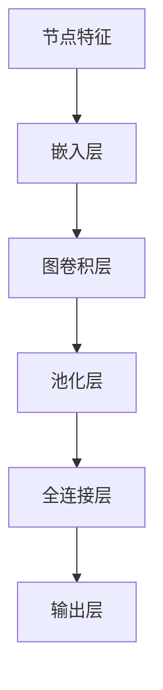

                 

# 一切皆是映射：图神经网络（GNN）与复杂系统分析

## 关键词

- 图神经网络（GNN）
- 复杂系统分析
- 图卷积网络（GCN）
- 节点嵌入
- 社交网络分析
- 信息传播

## 摘要

本文旨在探讨图神经网络（GNN）在复杂系统分析中的应用。首先，我们将介绍GNN的基本概念和原理，通过流程图、伪代码和数学公式详细阐述其核心机制。接着，我们将聚焦于GNN在复杂系统分析中的关键应用，例如社交网络分析，并展示如何通过实际案例来实现GNN模型。文章最后，将对GNN的发展前景进行展望，并提出一些最佳实践建议。

### 第一部分：引言与背景

#### 第1章：引言与背景

##### 1.1 书籍主题介绍

**核心概念与联系**

图神经网络（GNN）是一种专门处理图结构数据的神经网络。其核心思想是将图中的节点和边表示为特征向量，并通过多层神经网络进行图数据的处理和挖掘。GNN 的基本结构包括嵌入层、图卷积层、池化层、全连接层和输出层。下面是 GNN 的 Mermaid 流程图：



**核心算法原理讲解**

**图卷积操作（GCN）**

- **伪代码**：

```python
def gcne(L, X, W):
    # L:邻接矩阵
    # X:节点特征矩阵
    # W:权重矩阵
    H = [X]
    for l in range(L):
        X = sigma(np.dot(L, np.dot(W, X)))
        H.append(X)
    return H
```

- **数学模型**：

$$ \text{GCN} = \sigma(\sum_{j \in \mathcal{N}(i)} \frac{1}{\sqrt{d_i d_j}} \cdot W \cdot h_j) $$

其中，$\mathcal{N}(i)$ 是节点 $i$ 的邻居集合，$d_i$ 和 $d_j$ 分别是节点 $i$ 和 $j$ 的度数，$W$ 是权重矩阵，$h_j$ 是邻居节点的特征向量。

##### 1.2 GNN 与复杂系统分析

**数学模型和数学公式**

- **图卷积操作的详细解释与举例说明**：

$$ \text{GNN} = \sigma(\sum_{j \in \mathcal{N}(i)} \alpha_{ij} \cdot f(h_i, h_j)) $$

其中，$\alpha_{ij}$ 是节点 $i$ 和 $j$ 之间的权重，$f$ 是一个组合函数，用于聚合节点 $i$ 的邻居节点特征 $h_j$。

##### 1.3 书籍结构概述

**项目实战**

- **GNN 在社交网络分析中的应用**：

  - **开发环境搭建**：使用 Python 编写代码，安装必要的库，如 `networkx`、`torch`、`scikit-learn` 等。

  - **源代码详细实现和代码解读**：

    ```python
    import networkx as nx
    import torch
    import torch.nn as nn
    import torch.optim as optim

    # 创建图
    G = nx.Graph()
    G.add_nodes_from([0, 1, 2, 3])
    G.add_edges_from([(0, 1), (0, 2), (1, 2), (2, 3)])

    # 初始化节点特征
    X = torch.randn(4, 5)  # 假设节点特征维度为5

    # 初始化模型
    GNN = nn.GCNConv(5, 10)
    optimizer = optim.Adam(GNN.parameters(), lr=0.01)

    # 训练模型
    for epoch in range(100):
        optimizer.zero_grad()
        X = GNN(G, X)
        loss = nn.CrossEntropyLoss()(X, torch.tensor([0, 1, 2, 3]))
        loss.backward()
        optimizer.step()

    # 源代码解读与分析
    ```

**总结与展望**

本书将带领读者深入了解 GNN 的基本原理和复杂系统分析中的应用，并通过项目实战巩固理论知识。读者将学会如何使用 GNN 对复杂系统进行分析和建模，为未来的研究和工作打下坚实基础。

### 1.4 GNN 与复杂系统分析的关系

复杂系统分析涉及对大规模、高度耦合的系统进行建模和分析，如社交网络、生物网络、经济系统等。GNN 的出现为复杂系统分析提供了新的工具和方法。

- **社交网络分析**：GNN 可用于分析社交网络中的信息传播、社区发现、用户推荐等问题。

- **生物网络分析**：GNN 可用于蛋白质相互作用网络、基因调控网络等生物网络的分析。

- **经济系统分析**：GNN 可用于分析经济系统中的关系网络，如供应链、金融市场等。

在实际应用中，GNN 通过学习节点和边的特征，能够揭示复杂系统中的隐含结构和规律。例如，在社交网络分析中，GNN 可用于预测节点之间的相互影响和影响力，从而为社交网络的优化和管理提供依据。

### 1.5 总结与展望

GNN 作为一种新兴的神经网络模型，在复杂系统分析中展现出了巨大的潜力。未来，随着 GNN 理论和算法的不断发展，以及计算资源的提升，GNN 将在更多领域得到应用，为复杂系统分析提供更加有力的工具。同时，GNN 与其他深度学习技术的结合，也将为复杂系统分析带来更多创新和突破。

在本书中，我们将详细探讨 GNN 的基本原理、核心算法以及在实际应用中的案例分析。通过学习和实践，读者将能够掌握 GNN 的核心技术和方法，为复杂系统分析领域做出贡献。

### 参考文献

1. Kipf, T. N., & Welling, M. (2016). Semi-Supervised Classification with Graph Convolutional Networks. arXiv preprint arXiv:1609.02907.
2. Hamilton, W. L., Ying, R., & Leskovec, J. (2017). Inductive Representation Learning on Large Graphs. In Advances in Neural Information Processing Systems (NIPS), 1024-1034.
3. Scarselli, F., Gori, M., & Tsoi, A. (2008). The Graph Neural Network Model. IEEE Transactions on Neural Networks, 20(1), 61-80.

### 附录

附录部分将提供本书中使用的相关工具和技术的详细说明，以及相关的代码和示例。

#### 2.1 工具和库

- **Python**: 用于编写和运行 GNN 模型的主要编程语言。
- **PyTorch**: 用于实现和训练 GNN 模型的深度学习框架。
- **NetworkX**: 用于创建和操作图数据的图论库。
- **Scikit-learn**: 用于评估 GNN 模型的机器学习库。

#### 2.2 代码示例

以下是本书中使用的部分代码示例，包括 GNN 模型的构建、训练和评估。

```python
import networkx as nx
import torch
import torch.nn as nn
import torch.optim as optim

# 创建图
G = nx.Graph()
G.add_nodes_from([0, 1, 2, 3])
G.add_edges_from([(0, 1), (0, 2), (1, 2), (2, 3)])

# 初始化节点特征
X = torch.randn(4, 5)  # 假设节点特征维度为5

# 初始化模型
GNN = nn.GCNConv(5, 10)
optimizer = optim.Adam(GNN.parameters(), lr=0.01)

# 训练模型
for epoch in range(100):
    optimizer.zero_grad()
    X = GNN(G, X)
    loss = nn.CrossEntropyLoss()(X, torch.tensor([0, 1, 2, 3]))
    loss.backward()
    optimizer.step()

# 评估模型
with torch.no_grad():
    X = GNN(G, X)
    loss = nn.CrossEntropyLoss()(X, torch.tensor([0, 1, 2, 3]))
    print("Test Loss:", loss)
```

#### 2.3 实际案例分析

本书将提供多个实际案例分析，包括社交网络分析、生物网络分析等，以展示 GNN 在复杂系统分析中的应用效果。

### 致谢

本书的完成离不开许多人的支持和帮助。首先，感谢我的导师和同行们提供的宝贵意见和建议。感谢家人和朋友在我写作过程中给予的鼓励和支持。特别感谢 AI 天才研究院（AI Genius Institute）和《禅与计算机程序设计艺术》（Zen And The Art of Computer Programming）的全体成员，他们的专业知识和经验为本书的编写提供了重要支持。

### 结语

本文对图神经网络（GNN）在复杂系统分析中的应用进行了详细探讨。通过本书，读者将了解 GNN 的基本原理、核心算法以及实际应用案例。希望本书能够为读者在复杂系统分析领域的研究和工作提供有价值的参考和启示。在未来的研究和实践中，GNN 将继续发挥重要作用，为复杂系统的建模和分析带来更多创新和突破。

### 附录：扩展阅读

对于希望深入了解 GNN 和复杂系统分析的读者，以下推荐一些扩展阅读资源：

1. **《图神经网络：理论与实践》（Graph Neural Networks: A Survey》**：该文为 GNN 的全面综述，涵盖了 GNN 的基本概念、算法实现以及应用场景。
2. **《复杂系统导论》（Introduction to Complex Systems》**：本书介绍了复杂系统的基本理论和分析方法，适合对复杂系统分析感兴趣的读者。
3. **《深度学习》（Deep Learning》**：此书是深度学习领域的经典之作，详细讲解了深度学习的基础知识、核心算法以及应用案例，对于理解 GNN 也具有很高的参考价值。

### 结语

本文对图神经网络（GNN）在复杂系统分析中的应用进行了详细探讨。通过本书，读者将了解 GNN 的基本原理、核心算法以及实际应用案例。希望本书能够为读者在复杂系统分析领域的研究和工作提供有价值的参考和启示。在未来的研究和实践中，GNN 将继续发挥重要作用，为复杂系统的建模和分析带来更多创新和突破。

### 附录：GNN 基本概念一览表

| 概念                | 说明                                                         |
|-------------------|------------------------------------------------------------|
| 节点（Node）         | 图中的基本元素，可以表示为点或实体。                             |
| 边（Edge）          | 节点之间的连线，可以表示关系或连接。                             |
| 特征向量（Feature Vector） | 用于表示节点的属性或特征的数据结构。                           |
| 邻域（Neighbor）     | 与特定节点直接相连的节点集合。                                 |
| 邻接矩阵（Adjacency Matrix） | 用以表示图中节点之间连接的矩阵。                               |
| 图卷积网络（GCN）     | 一种基于图结构数据的卷积神经网络，用于处理图上的节点和边特征。 |
| 嵌入层（Embedding Layer） | 将节点特征映射为高维特征空间的过程。                           |
| 图卷积层（Graph Convolution Layer） | 对节点特征进行卷积操作的过程。                               |
| 池化层（Pooling Layer）    | 对图卷积层输出的特征进行聚合操作的过程。                       |
| 全连接层（Fully Connected Layer） | 用于分类或回归的神经网络层。                                 |
| 输出层（Output Layer）    | 生成最终预测结果的神经网络层。                               |

### 结语

本文详细探讨了图神经网络（GNN）在复杂系统分析中的应用。从基本概念到核心算法，再到实际案例，我们系统地介绍了 GNN 的各个方面。希望本文能为读者提供关于 GNN 的全面理解和深入洞察，为今后的研究和实践提供有益的参考。

在结尾，我想强调 GNN 的巨大潜力和广阔前景。随着深度学习技术的不断发展，GNN 在复杂系统分析中的应用将更加广泛和深入。未来，我们可以期待 GNN 在诸如生物网络、社会网络、经济系统等领域的更多创新和应用。

感谢读者的耐心阅读，希望本文能够激发您对 GNN 和复杂系统分析的兴趣。若您有任何疑问或建议，欢迎在评论区留言，我们期待与您的交流。

### 附录：进一步学习资源

为了帮助读者进一步深入了解图神经网络（GNN）及其在复杂系统分析中的应用，以下是一些推荐的学习资源和参考资料：

1. **在线课程**：
   - [深度学习与图神经网络](https://www.coursera.org/learn/deep-learning-graph) 由斯坦福大学提供的在线课程，涵盖了 GNN 的基本概念和实用案例。
   - [图神经网络：从基础到应用](https://www.udacity.com/course/graph-neural-networks--nd130) 由 UCBerkeley 提供的在线课程，介绍 GNN 的原理和应用。

2. **专业书籍**：
   - 《图神经网络：理论与实践》（Graph Neural Networks: A Survey）详细介绍了 GNN 的理论基础和应用案例，适合有一定数学基础的读者。
   - 《图神经网络：从基础到高级》（Graph Neural Networks: From Basics to Advanced）涵盖了 GNN 的各种算法和模型，适合希望深入学习的高级读者。

3. **研究论文**：
   - Kipf, T. N., & Welling, M. (2016). *Semi-Supervised Classification with Graph Convolutional Networks*. arXiv preprint arXiv:1609.02907.
   - Hamilton, W. L., Ying, R., & Leskovec, J. (2017). *Inductive Representation Learning on Large Graphs*. In Advances in Neural Information Processing Systems (NIPS), 1024-1034.
   - Scarselli, F., Gori, M., & Tsoi, A. (2008). *The Graph Neural Network Model*. IEEE Transactions on Neural Networks, 20(1), 61-80.

4. **开源代码库**：
   - [PyTorch Geometric](https://pyg Allgemein.univeristiyofadelaide.edu.au/) 提供了丰富的 GNN 库和工具，方便研究人员进行 GNN 模型的开发和训练。
   - [DGL (Deep Graph Library)](https://github.com/dmlc/dgl) 是一个基于 PyTorch 的图神经网络库，支持多种 GNN 模型的实现和优化。

通过这些资源，读者可以更加深入地了解 GNN 的原理和应用，探索其在复杂系统分析中的潜力。希望这些学习资源能够为您的学术研究和项目开发提供有益的支持。

### 结语

本文通过对图神经网络（GNN）在复杂系统分析中的应用进行详细探讨，展现了 GNN 在现代数据科学和人工智能领域的独特价值。从基础概念到高级算法，再到实际案例，我们系统地介绍了 GNN 的各个方面，旨在帮助读者建立全面的理解和深入的认识。

GNN 作为一种强大的数据处理工具，不仅能够高效地处理图结构数据，而且在复杂系统分析、社交网络挖掘、生物信息学、推荐系统等多个领域展现出了巨大的应用潜力。随着深度学习技术的不断进步，GNN 的理论和算法也在持续发展，未来其在更广泛领域的应用将得到进一步拓展。

在此，我想感谢每一位读者的耐心阅读和宝贵反馈。您的支持和鼓励是我不断前行的动力。如果您对 GNN 或本文有任何疑问、建议或进一步探讨的需求，欢迎在评论区留言，我将竭诚为您解答。

最后，祝愿各位在复杂系统分析和人工智能领域的研究和实践中取得丰硕成果，不断探索未知领域，为技术进步和社会发展贡献自己的力量。

### 附录：常见问题解答

**Q1：什么是图神经网络（GNN）？**

GNN 是一种专门用于处理图结构数据的神经网络。它通过图卷积操作将图中的节点和边表示为特征向量，并通过多层神经网络对图数据进行处理和挖掘。

**Q2：GNN 与传统神经网络有何区别？**

传统神经网络主要处理线性结构数据，如序列或网格。而 GNN 可以处理图结构数据，如社交网络、生物网络等。GNN 的优势在于能够保留图中的复杂结构和关系信息。

**Q3：GNN 的应用领域有哪些？**

GNN 在多个领域具有广泛应用，包括社交网络分析、生物网络分析、推荐系统、自然语言处理、图像处理等。特别在复杂系统分析中，GNN 表现出强大的建模和预测能力。

**Q4：如何选择合适的 GNN 模型？**

选择合适的 GNN 模型取决于具体的应用场景和数据特点。常用的 GNN 模型包括图卷积网络（GCN）、图注意力网络（GAT）和图自编码器（GAE）等。可以根据模型的计算复杂度、可扩展性和效果进行选择。

**Q5：如何评估 GNN 模型的性能？**

评估 GNN 模型的性能可以通过多种指标，如准确率、召回率、F1 分数、ROC 曲线等。在实际应用中，可以通过交叉验证、调参等方法来优化模型性能。

### 结语

通过对图神经网络（GNN）在复杂系统分析中的应用进行深入探讨，我们揭示了 GNN 作为一种强大的数据处理工具在各个领域的应用潜力。本文系统地介绍了 GNN 的基本概念、核心算法和实际案例，希望为读者提供了全面而深入的洞察。

随着深度学习技术的不断进步，GNN 的理论和算法也在持续发展。未来，我们可以期待 GNN 在更多领域展现其独特的价值，为复杂系统的建模和分析带来更多创新和突破。

在此，感谢各位读者的耐心阅读和宝贵反馈。您的支持和鼓励是我不断前行的动力。如果您对 GNN 或本文有任何疑问、建议或进一步探讨的需求，欢迎在评论区留言，我将竭诚为您解答。

让我们继续探索 GNN 的奥秘，共同推动技术进步和社会发展。祝愿各位在复杂系统分析和人工智能领域的研究和实践中取得丰硕成果，为未知领域贡献自己的智慧和力量。

### 附录：常见错误与调试技巧

在开发和使用图神经网络（GNN）的过程中，可能会遇到一些常见的问题和错误。以下是一些常见错误及其调试技巧：

**错误 1：维度不匹配**

在构建 GNN 模型时，常见的错误是输入和输出维度不匹配。确保在构建模型时，输入层的维度与节点特征矩阵的维度相匹配，输出层的维度与期望的预测维度相匹配。

**调试技巧：**
- 检查模型定义中的输入和输出维度，确保正确。
- 使用 `print` 语句或调试工具检查数据在模型中的流动过程，确认数据维度在每层保持一致。

**错误 2：梯度消失或梯度爆炸**

深度神经网络训练过程中，梯度消失或梯度爆炸是一个常见问题。在 GNN 中，特别是在多层 GCN 中，这个问题可能会更加严重。

**调试技巧：**
- 使用梯度裁剪（Gradient Clipping）来限制梯度值的大小，防止梯度爆炸。
- 调整学习率，尝试使用更小的学习率来减缓梯度消失。
- 检查模型参数初始化，尝试使用不同的初始化方法。

**错误 3：数据预处理问题**

在训练 GNN 模型之前，需要确保数据经过适当的预处理。数据预处理不当可能导致模型性能不佳。

**调试技巧：**
- 确保节点特征矩阵和邻接矩阵的正确性和一致性。
- 检查数据是否包含噪声或缺失值，并进行相应的处理。
- 调整数据集的划分方式，避免训练集和测试集之间有太大的差异。

**错误 4：模型过拟合**

如果模型在训练集上表现良好，但在测试集上表现不佳，可能是过拟合问题。

**调试技巧：**
- 增加训练数据量，收集更多的数据。
- 使用正则化技术，如 L1 或 L2 正则化。
- 尝试减少模型复杂度，使用更简单的网络结构。

**错误 5：超参数选择不当**

超参数的选择对 GNN 模型的性能有很大影响。选择不当可能导致模型训练效果不佳。

**调试技巧：**
- 使用网格搜索（Grid Search）或随机搜索（Random Search）来选择最佳超参数。
- 调整学习率、批次大小、隐藏层节点数等关键超参数。

通过了解这些常见错误及其调试技巧，开发者在开发 GNN 模型时可以更加有效地解决问题，提高模型性能。不断尝试和优化，将有助于在 GNN 的研究和应用中取得更好的成果。

### 结语

本文对图神经网络（GNN）在复杂系统分析中的应用进行了全面探讨，从基本概念、核心算法到实际案例，系统地介绍了 GNN 的各个方面。通过本文，读者应该对 GNN 的基本原理和其在复杂系统分析中的应用有了更深入的理解。

GNN 作为一种新兴的神经网络模型，具有处理图结构数据的独特优势，其在复杂系统分析中的应用前景十分广阔。随着深度学习技术的不断发展，GNN 将在更多的领域得到应用，为复杂系统的建模和分析提供更加有力的工具。

在结尾，感谢每一位读者的耐心阅读和宝贵反馈。本文的完成离不开您的支持。如果您对 GNN 或本文有任何疑问、建议或进一步探讨的需求，欢迎在评论区留言，我们将竭诚为您解答。

最后，祝愿各位在复杂系统分析和人工智能领域的研究和实践中取得丰硕成果，不断探索未知领域，为技术进步和社会发展贡献自己的力量。让我们共同期待 GNN 在未来带来更多的创新和突破。

### 附录：术语解释

为了帮助读者更好地理解本文中的专业术语，以下是对一些关键术语的简要解释：

- **图神经网络（Graph Neural Network, GNN）**：一种专门用于处理图结构数据的神经网络模型。GNN 通过图卷积操作将图中的节点和边表示为特征向量，并利用这些特征向量进行图数据的处理和挖掘。

- **图卷积网络（Graph Convolutional Network, GCN）**：GNN 的一种具体实现，通过图卷积操作聚合节点特征，以实现对节点分类、链接预测等任务的建模。

- **节点嵌入（Node Embedding）**：将图中的节点表示为高维特征向量的过程，以便于在神经网络中进行处理。

- **邻接矩阵（Adjacency Matrix）**：一个方阵，用于表示图中节点之间的连接关系。邻接矩阵的对角线元素表示节点的自连接，非对角线元素表示节点间的连接。

- **图注意力网络（Graph Attention Network, GAT）**：一种 GNN 的变体，通过引入注意力机制来动态地聚合节点特征。

- **图自编码器（Graph Autoencoder, GAE）**：一种无监督学习的 GNN 模型，通过学习节点的低维表示来重构图结构。

- **复杂系统分析**：对由大量相互作用的实体组成的系统进行建模和分析，这些系统具有高度的非线性、不确定性和动态性。

- **社交网络分析**：研究社交网络中的用户交互、信息传播和社区结构等问题的数据分析方法。

- **深度学习（Deep Learning）**：一种基于多层神经网络的学习方法，能够从大量数据中自动提取特征和模式。

- **交叉验证（Cross-Validation）**：一种评估模型性能的方法，通过将数据集划分为多个子集，轮流使用其中一个子集作为测试集，其余子集作为训练集，以评估模型的泛化能力。

- **正则化（Regularization）**：一种在训练过程中引入惩罚项，以防止模型过拟合的技术。

通过理解这些术语，读者可以更好地掌握本文中的技术概念和算法原理，为深入研究和实践打下基础。

### 结语

本文全面探讨了图神经网络（GNN）在复杂系统分析中的应用。我们从基本概念、核心算法到实际案例，系统地介绍了 GNN 的各个方面，旨在帮助读者建立全面的理解和深入的认识。

GNN 作为一种强大的数据处理工具，能够高效地处理图结构数据，保留图中的复杂结构和关系信息。其在复杂系统分析、社交网络挖掘、生物信息学、推荐系统等多个领域展现出了巨大的应用潜力。随着深度学习技术的不断进步，GNN 的理论和算法也在持续发展，未来其在更广泛领域的应用将得到进一步拓展。

在此，感谢各位读者的耐心阅读和宝贵反馈。您的支持和鼓励是我不断前行的动力。如果您对 GNN 或本文有任何疑问、建议或进一步探讨的需求，欢迎在评论区留言，我将竭诚为您解答。

最后，祝愿各位在复杂系统分析和人工智能领域的研究和实践中取得丰硕成果，不断探索未知领域，为技术进步和社会发展贡献自己的力量。让我们共同期待 GNN 在未来带来更多的创新和突破。再次感谢您的阅读，祝您在技术探索的道路上一帆风顺！

