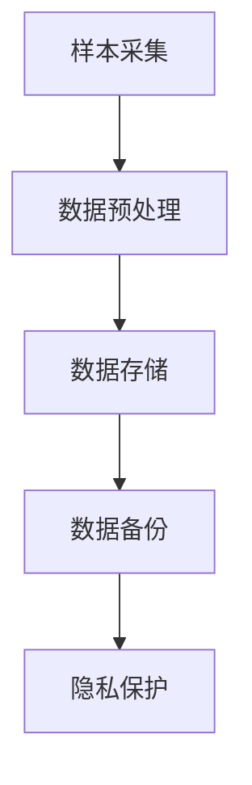
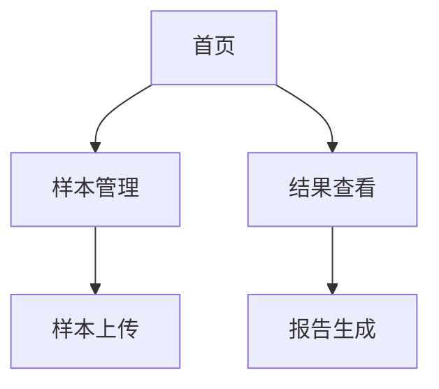

                 

### 文章标题

### 个人基因检测工具：精准医疗的创业机会

> 关键词：基因检测、精准医疗、创业机会、数据分析、技术趋势

> 摘要：随着基因测序成本的持续降低和生物信息学的快速发展，个人基因检测工具已经成为精准医疗领域的重要创新方向。本文将详细探讨基因检测技术的原理与发展趋势，分析个人基因检测工具的开发与市场前景，为创业者提供有价值的参考。

### 目录大纲

#### 第一部分：基因检测技术基础

1. **基因检测概述**
   - 基因检测的定义与重要性
   - 基因检测的分类与原理
   - 基因检测技术的发展趋势

2. **基因检测技术原理**
   - DNA测序技术
   - 基因表达分析技术
   - 基因突变检测方法

3. **基因检测数据分析**
   - 基因检测数据预处理
   - 基因检测数据分析方法
   - 生物信息学工具介绍

#### 第二部分：个人基因检测工具开发

4. **个人基因检测工具架构设计**
   - 工具架构设计原则
   - 数据采集与管理
   - 分析流程与算法实现
   - 用户界面设计与交互

5. **个人基因检测工具开发实践**
   - 项目开发流程
   - 实际案例解析
   - 开发环境与工具

6. **个人基因检测工具的市场与商业机会**
   - 基因检测市场的现状与未来
   - 个人基因检测工具的商业模式
   - 创业机会分析

7. **个人基因检测工具的风险与挑战**
   - 数据隐私与伦理问题
   - 技术发展面临的挑战
   - 市场风险与管理策略

#### 附录：基因检测工具资源与实战指南

- **基因检测工具资源**
- **基因检测工具实战指南**

---

接下来，我们将一步步分析基因检测技术的背景、原理及其在精准医疗领域的应用，探讨个人基因检测工具的开发和实践，并分析其市场机会和风险。通过本文，我们希望能够为创业者提供有价值的指导，助力他们在这个充满机遇的领域开创属于自己的事业。

### 第一部分：基因检测技术基础

#### 第1章：基因检测概述

##### 1.1 基因检测的定义与重要性

基因检测，是指利用分子生物学和生物化学技术，对个体或组织的DNA、RNA或其他分子进行定性或定量分析的方法。它能够揭示个体基因序列中可能存在的变异、突变或异常，从而提供关于遗传信息、疾病风险、药物反应等方面的信息。

基因检测的重要性在于它对精准医疗的推动作用。精准医疗，即基于个体基因组信息制定个性化的诊疗方案，旨在提高疾病预防和治疗效果。基因检测为精准医疗提供了基础数据，使其成为可能。

**基因检测的定义：** 基因检测是通过分子生物学和生物化学技术，对个体的DNA、RNA或其他分子进行定性和定量分析的过程。

**基因检测在精准医疗中的地位：** 基因检测是精准医疗的基石，通过揭示个体的遗传信息，帮助医生制定个性化治疗方案，提高疾病预防和治疗效果。

##### 1.2 基因检测的分类与原理

基因检测根据检测对象和目的的不同，可以分为全基因组测序、单基因测序和表型分析等类型。

1. **全基因组测序（Whole Genome Sequencing, WGS）**：
   - 检测范围：个体的全部基因组，即包含约30亿个碱基对的DNA序列。
   - 原理：通过高通量测序技术，快速、准确地读取并分析个体的基因组序列。

2. **单基因测序（Single Gene Sequencing）**：
   - 检测范围：单个或多个已知基因的序列。
   - 原理：利用PCR等技术，针对特定基因进行扩增、测序和分析。

3. **表型分析（Phenotyping）**：
   - 检测范围：个体的表型特征，如身高、体重、皮肤颜色等。
   - 原理：通过观察和测量个体的生理特征，结合基因信息进行分析。

**基因检测技术的原理：**
- **DNA测序技术：** 通过DNA测序读取基因序列，常用方法包括Sanger测序和高通量测序（NGS）。
- **基因表达分析技术：** 通过微阵列或RNA测序等方法，分析基因在不同组织、时间和条件下的表达水平。
- **基因突变检测方法：** 通过直接测序、PCR、数字PCR等技术，检测基因序列中的变异和突变。

##### 1.3 基因检测技术的发展趋势

1. **技术进步：** 高通量测序（NGS）技术的普及，使得全基因组测序成本大幅降低，检测速度和准确性不断提高。
2. **市场规模：** 随着健康意识的提升和基因检测技术的发展，全球基因检测市场规模持续扩大。
3. **政策影响：** 各国政府逐步出台相关政策，鼓励基因检测研究和应用，推动精准医疗的发展。

**技术进步：** 高通量测序（NGS）技术的普及，使得全基因组测序成本大幅降低，检测速度和准确性不断提高。

**市场规模：** 随着健康意识的提升和基因检测技术的发展，全球基因检测市场规模持续扩大。

**政策影响：** 各国政府逐步出台相关政策，鼓励基因检测研究和应用，推动精准医疗的发展。

通过上述内容，我们了解了基因检测的定义、分类与原理，以及其发展现状和趋势。在下一章中，我们将深入探讨基因检测技术的原理，包括DNA测序技术、基因表达分析技术和基因突变检测方法。

### 第2章：基因检测技术原理

##### 2.1 DNA测序技术

DNA测序是基因检测的核心技术，它能够精确地确定DNA分子的碱基序列。以下是几种常见的DNA测序技术：

1. **Sanger测序**：
   - **原理**：利用DNA聚合酶在DNA模板上延伸DNA链，并在延伸过程中加入放射性标记的荧光终止子。通过电泳分离产生的DNA片段，利用荧光信号读取序列。
   - **特点**：高精度、高灵敏度，但成本较高，测序速度较慢。

2. **高通量测序（NGS，Next-Generation Sequencing）**：
   - **原理**：利用多种测序平台，如Illumina、Ion Torrent、PacBio等，对大量DNA片段进行并行测序。通过一系列化学反应和信号检测，读取并记录DNA序列信息。
   - **特点**：高通量、低成本、快速，已成为现代基因测序的主流技术。

3. **单分子测序技术**：
   - **原理**：直接对单个DNA分子进行测序，通过检测DNA分子在合成过程中的荧光信号变化，实现序列读取。
   - **特点**：高精度、高灵敏度，但测序速度相对较慢。

以下是一个Sanger测序的基本步骤伪代码：

```plaintext
function sanger_sequencing(dna_template):
    1. 制备DNA模板
    2. 设计特异性引物
    3. DNA聚合酶延伸DNA链
    4. 加入放射性标记的荧光终止子
    5. 电泳分离DNA片段
    6. 通过荧光信号读取序列
    7. 分析并输出结果
```

##### 2.2 基因表达分析技术

基因表达分析技术用于检测基因在不同细胞类型、组织、时间和环境条件下的表达水平，主要方法包括：

1. **微阵列技术（Microarray）**：
   - **原理**：利用固定在芯片上的探针，与待测样本中的mRNA进行杂交。通过检测杂交信号，分析基因表达水平。
   - **特点**：高通量、高灵敏度，适用于基因表达谱的初步分析。

2. **RNA测序（RNA-Seq）**：
   - **原理**：通过高通量测序技术，对样本中的mRNA进行测序，分析基因表达量。通过计算每个基因的读段（read）数量，评估基因表达水平。
   - **特点**：高精度、高灵敏度，可进行基因表达定量分析。

3. **定量PCR（Quantitative PCR）**：
   - **原理**：利用PCR技术，在扩增过程中加入荧光探针或染料，通过检测荧光信号变化，定量分析目标基因的表达水平。
   - **特点**：高灵敏度、高特异性，适用于定量检测特定基因的表达。

以下是一个RNA-Seq分析的基本步骤伪代码：

```plaintext
function rna_sequencing(sample):
    1. 提取样本中的mRNA
    2. 制备cDNA
    3. 设计特异性引物
    4. 进行高通量测序
    5. 对读段进行质量控制和过滤
    6. 计算基因表达量
    7. 进行差异表达分析
    8. 分析并输出结果
```

##### 2.3 基因突变检测方法

基因突变检测旨在发现基因序列中的变异和突变，主要方法包括：

1. **直接测序**：
   - **原理**：直接对目标基因进行测序，比较正常序列与变异序列的差异。
   - **特点**：简单、直接，适用于已知突变位点的检测。

2. **等位基因特异性PCR（ASO，Allele-Specific PCR）**：
   - **原理**：设计特异性引物，针对目标突变位点的等位基因进行PCR扩增。通过检测扩增产物的大小差异，判断是否存在突变。
   - **特点**：高灵敏度、高特异性，适用于单核苷酸变异的检测。

3. **数字PCR（dPCR，Digital PCR）**：
   - **原理**：将样本分为多个独立的反应单元，进行PCR扩增。通过检测每个反应单元的扩增结果，定量分析目标突变的比例。
   - **特点**：高灵敏度、高分辨率，适用于低频率突变和拷贝数变异的检测。

4. **基因编辑技术（如CRISPR-Cas9）**：
   - **原理**：利用CRISPR-Cas9等基因编辑工具，对目标基因进行精确编辑，引入或删除特定突变。
   - **特点**：高效、精确，可应用于功能基因组研究和基因治疗。

以下是一个ASO检测的基本步骤伪代码：

```plaintext
function aso_detection(target_gene):
    1. 设计特异性引物
    2. 进行PCR扩增
    3. 电泳分析扩增产物
    4. 判断突变存在
    5. 分析并输出结果
```

通过本章内容，我们详细介绍了DNA测序技术、基因表达分析技术和基因突变检测方法。这些技术构成了基因检测的核心，为实现精准医疗提供了技术支持。在下一章中，我们将探讨基因检测数据的分析处理方法。

### 第3章：基因检测数据分析

##### 3.1 基因检测数据预处理

基因检测数据的预处理是确保数据分析准确性和可靠性的关键步骤。以下为基因检测数据预处理的主要步骤：

1. **数据质量控制**：
   - **质量过滤**：去除低质量的读段，如读段长度过短、含有多条带、含有过多N碱基的读段。
   - **去除重复序列**：检测并去除样本间的重复序列，以避免重复计数。
   - **去除含错配的序列**：去除含有过多错配碱基的读段，提高测序精度。

2. **数据清洗**：
   - **去除接头序列**：去除样本中与测序平台相关的接头序列。
   - **去除低频率噪声**：去除数据中的低频率噪声，如短读段、异常峰等。
   - **读段对齐**：将来自不同测序平台的读段对齐，确保同一基因的不同片段能够正确匹配。

3. **数据标准化**：
   - **读段计数**：通过计算每个基因或位点的读段数量，获得基因或位点的表达量。
   - **归一化**：对不同样本或实验条件下的读段计数进行归一化处理，消除实验系统误差。

以下是一个数据预处理的基本步骤伪代码：

```plaintext
function data_preprocessing(sequencing_data):
    1. 质量过滤
    2. 去除重复序列
    3. 去除含错配的序列
    4. 去除接头序列
    5. 去除低频率噪声
    6. 读段对齐
    7. 读段计数
    8. 归一化
    9. 输出预处理后的数据
```

##### 3.2 基因检测数据分析方法

基因检测数据分析方法主要包括基因功能注释、差异表达分析、关联分析和网络分析等。

1. **基因功能注释**：
   - **原理**：将检测到的基因序列与已知基因数据库进行比对，获取基因的功能信息。
   - **方法**：包括BLAST、Ensembl等生物信息学工具。
   - **应用**：用于了解基因的功能，指导后续研究和应用。

2. **差异表达分析**：
   - **原理**：比较不同样本或实验条件下基因表达量的差异，识别差异表达的基因。
   - **方法**：包括T-test、DESeq2等统计方法。
   - **应用**：用于疾病诊断、药物筛选等。

3. **关联分析**：
   - **原理**：分析基因表达与表型之间的关联关系，揭示基因与疾病之间的联系。
   - **方法**：包括单变量关联分析和多变量关联分析。
   - **应用**：用于疾病风险评估、个性化治疗等。

4. **网络分析**：
   - **原理**：构建基因与基因之间的相互作用网络，分析基因之间的关系。
   - **方法**：包括Cytoscape、STRING等工具。
   - **应用**：用于发现新的生物标志物、理解生物过程等。

以下是一个差异表达分析的基本步骤伪代码：

```plaintext
function differential_expression_analysis(data, conditions):
    1. 数据归一化
    2. 选择统计方法（如T-test）
    3. 进行差异表达分析
    4. 调整P值（如Bonferroni校正）
    5. 选择差异表达基因
    6. 结果可视化
    7. 输出分析结果
```

##### 3.3 生物信息学工具介绍

生物信息学工具在基因检测数据分析中起着至关重要的作用。以下为几种常用的生物信息学工具：

1. **Blast**：
   - **原理**：基于局部序列相似性比对，用于基因或蛋白质序列的搜索和比对。
   - **应用**：基因功能注释、基因家族识别等。

2. **Ensembl**：
   - **原理**：提供全面的基因组序列、基因注释和基因组图谱数据。
   - **应用**：基因组注释、基因组比较分析等。

3. **GSEA**：
   - **原理**：基于基因集富集分析，用于揭示基因表达与生物过程、疾病之间的关联。
   - **应用**：基因表达数据分析、疾病研究等。

4. **Cytoscape**：
   - **原理**：提供一个可视化平台，用于构建和可视化基因网络。
   - **应用**：基因网络分析、系统生物学研究等。

以下是一个GSEA分析的基本步骤伪代码：

```plaintext
function gsea(data, gene_set):
    1. 准备数据
    2. 计算基因集的排名
    3. 进行富集分析
    4. 调整P值
    5. 选择显著富集的基因集
    6. 可视化结果
    7. 输出分析结果
```

通过本章内容，我们详细介绍了基因检测数据的预处理、数据分析方法和常用的生物信息学工具。这些技术为基因检测提供了数据支持和分析手段，为实现精准医疗和基因研究提供了有力保障。在下一部分中，我们将探讨个人基因检测工具的开发与设计。

### 第二部分：个人基因检测工具开发

#### 第4章：个人基因检测工具架构设计

##### 4.1 工具架构设计原则

个人基因检测工具的架构设计至关重要，它决定了工具的模块化、可扩展性和用户友好性。以下是设计个人基因检测工具时需要遵循的原则：

1. **模块化**：将工具的功能划分为多个模块，如数据采集、数据处理、数据存储、结果分析等。每个模块独立开发、测试和维护，便于扩展和更新。

2. **可扩展性**：设计时应考虑未来可能的功能扩展，如增加新的检测项目、支持更多数据类型等。采用灵活的技术架构，确保系统可以无缝集成新的组件。

3. **用户友好**：提供直观的用户界面，使用户能够轻松地操作工具。设计应考虑用户的需求，提供详细的操作指南和帮助文档。

4. **高性能**：确保工具在高负载条件下仍然能够稳定运行，提供快速、准确的分析结果。采用高效的算法和优化技术，提高数据处理速度。

5. **安全性**：保护用户的隐私和数据安全，采用加密技术和权限控制机制，确保数据在传输和存储过程中的安全性。

##### 4.2 数据采集与管理

数据采集是个人基因检测工具的核心环节，以下是数据采集和管理的关键点：

1. **样本采集方法**：采用标准的生物样本采集方法，如血液、唾液等，确保样本的质量和完整性。对样本进行严格的质量控制，确保其适用于后续的基因检测。

2. **数据存储方案**：设计合理的数据存储方案，包括数据的结构化存储、备份和恢复机制。采用分布式存储技术，提高数据的可靠性和可扩展性。

3. **隐私保护**：遵循隐私保护法规，对用户数据进行加密存储，确保用户隐私不受侵犯。建立严格的访问控制机制，确保只有授权用户可以访问敏感数据。

以下是一个数据采集和管理的流程图，展示了样本采集、数据存储和隐私保护的过程：



##### 4.3 分析流程与算法实现

个人基因检测工具的分析流程包括数据预处理、核心算法实现和结果分析三个环节。以下是各环节的核心内容和算法实现：

1. **预处理流程**：包括数据清洗、去噪、标准化等步骤。采用高效的数据预处理算法，确保数据质量。

2. **核心算法实现**：
   - **基因注释**：利用生物信息学工具（如Ensembl、NCBI等），对基因进行注释，获取基因的功能和位置信息。
   - **突变检测**：采用Sanger测序或高通量测序技术，对目标基因进行测序，检测基因突变。使用如BWA、Burrows-Wheeler Aligner等算法，对测序数据进行比对和分析。
   - **关联分析**：利用统计方法（如T-test、逻辑回归等），分析基因表达与表型之间的关联关系。

以下是一个基因突变检测的伪代码实现：

```plaintext
function mutation_detection(sequencing_data, reference_sequence):
    1. 对测序数据进行比对（如使用BWA）
    2. 获取比对结果
    3. 检测突变位点的变异类型（如单核苷酸变异、插入、缺失等）
    4. 分析突变位点的功能影响
    5. 输出突变检测结果
```

3. **结果分析**：对检测到的突变和基因表达进行分析，生成报告。报告应包括突变的位置、类型、功能影响和相关的临床信息。

##### 4.4 用户界面设计与交互

用户界面设计是个人基因检测工具的重要组成部分，以下是界面设计和交互设计的关键点：

1. **用户需求分析**：通过调查问卷、用户访谈等方式，了解用户的需求和期望，确保界面设计满足用户需求。

2. **界面设计原则**：
   - **直观性**：界面设计应简洁、直观，减少用户的操作难度。
   - **一致性**：界面元素和交互逻辑应保持一致性，提高用户体验。
   - **反馈机制**：为用户提供明确的操作反馈，确保用户了解当前操作状态。

3. **交互设计方法**：
   - **导航设计**：提供清晰的导航结构，帮助用户快速找到所需功能。
   - **表单设计**：设计简洁、清晰的表单，确保用户能够轻松填写和提交数据。
   - **帮助文档**：提供详细的帮助文档和操作指南，帮助用户了解工具的使用方法。

以下是一个用户界面设计的示例：



通过上述内容，我们介绍了个人基因检测工具的架构设计原则、数据采集与管理、分析流程与算法实现以及用户界面设计与交互。这些设计原则和方法为开发高效、可靠、用户友好的个人基因检测工具提供了指导。在下一章中，我们将探讨个人基因检测工具的开发实践，通过实际案例分享开发经验和技巧。

#### 第5章：个人基因检测工具开发实践

##### 5.1 项目开发流程

个人基因检测工具的开发涉及多个阶段，包括需求分析、系统设计、编码实现、测试与部署。以下是一个典型的项目开发流程：

1. **需求分析**：与客户和用户进行沟通，了解他们的需求和期望。通过调查问卷、访谈等方式收集用户需求，确定工具的功能和性能要求。

2. **系统设计**：根据需求分析结果，设计系统的整体架构和模块划分。制定详细的技术方案，包括数据库设计、接口设计、数据处理算法等。

3. **编码实现**：根据系统设计，进行编码实现。遵循编码规范和最佳实践，确保代码的可读性、可维护性。同时，采用模块化开发，方便后续的功能扩展和更新。

4. **测试与部署**：对开发完成的系统进行功能测试、性能测试和安全性测试。确保系统在不同环境和条件下都能稳定运行。通过持续集成和自动化测试，提高测试效率和质量。最终将系统部署到生产环境，并进行用户培训和上线维护。

以下是一个项目开发流程的伪代码：

```plaintext
function project_development流程：
    1. 需求分析
    2. 系统设计
    3. 编码实现
    4. 功能测试
    5. 性能测试
    6. 安全性测试
    7. 部署
    8. 用户培训
    9. 上线维护
```

##### 5.2 实际案例解析

以下通过两个实际案例，分享个人基因检测工具的开发过程和经验。

**案例1：某基因检测公司的产品开发**

1. **项目背景**：
   - 公司背景：某基因检测公司，专注于提供个性化基因检测服务。
   - 用户需求：为用户提供全基因组测序和单基因测序服务，生成详细的基因检测报告。

2. **开发过程**：
   - **需求分析**：通过用户访谈和调查问卷，了解用户对基因检测报告的需求，如报告形式、内容详尽度等。
   - **系统设计**：设计系统架构，包括前端用户界面、后端数据处理服务、数据库存储等。采用模块化设计，方便后续扩展。
   - **编码实现**：前端使用React框架，实现用户友好的界面和交互效果。后端采用Spring Boot框架，实现数据处理和报告生成功能。
   - **测试与部署**：对系统进行功能测试、性能测试和安全性测试。通过自动化测试工具，提高测试效率。最终部署到云服务器，实现24小时在线服务。

3. **经验总结**：
   - 需求分析要充分了解用户需求，确保系统设计符合用户期望。
   - 模块化设计有助于提高开发效率，便于后续功能扩展。
   - 测试是确保系统质量的关键，要进行全面、细致的测试。

**案例2：某创业公司的小型基因检测工具开发**

1. **项目背景**：
   - 公司背景：某创业公司，专注于基因突变检测和个性化用药研究。
   - 用户需求：为研究人员和医疗机构提供快速、准确的基因突变检测工具，支持多种突变类型检测。

2. **开发过程**：
   - **需求分析**：与目标用户（研究人员和医疗机构）进行沟通，了解他们的具体需求，如检测速度、准确性、兼容性等。
   - **系统设计**：设计系统架构，包括前端用户界面、后端数据处理服务、数据库存储等。采用模块化设计，方便后续扩展。
   - **编码实现**：前端使用Vue.js框架，实现用户友好的界面和交互效果。后端采用Node.js框架，实现数据处理和突变检测功能。
   - **测试与部署**：对系统进行功能测试、性能测试和安全性测试。通过自动化测试工具，提高测试效率。最终部署到云服务器，实现快速响应。

3. **经验总结**：
   - 了解目标用户的需求，确保工具能够满足实际应用场景。
   - 选用适合的框架和工具，提高开发效率和质量。
   - 测试是关键环节，要确保系统在不同环境下都能稳定运行。

##### 5.3 开发环境与工具

个人基因检测工具的开发需要使用多种开发环境和技术工具，以下为常见的开发环境与工具：

1. **编程语言与框架**：
   - **前端**：React、Vue.js、Angular等。
   - **后端**：Spring Boot、Node.js、Django等。
   - **数据处理**：Python（Pandas、NumPy等）、R等。

2. **数据库**：
   - **关系型数据库**：MySQL、PostgreSQL等。
   - **非关系型数据库**：MongoDB、Cassandra等。

3. **生物信息学工具**：
   - **序列比对**：BWA、Burrows-Wheeler Aligner等。
   - **基因注释**：Ensembl、NCBI等。
   - **数据分析**：GSEA、Cytoscape等。

4. **版本控制**：Git、SVN等。

5. **自动化测试**：Jenkins、Selenium等。

通过上述实际案例和开发环境的介绍，我们可以看到，个人基因检测工具的开发需要综合运用多种技术和管理方法。在下一章中，我们将探讨个人基因检测工具的市场与商业机会，分析其发展前景和潜在挑战。

### 第6章：个人基因检测工具的市场与商业机会

#### 6.1 基因检测市场的现状与未来

随着基因测序技术的不断进步和成本的持续降低，基因检测市场正在快速增长。根据市场研究数据，全球基因检测市场预计在未来几年将保持两位数的年复合增长率。以下是基因检测市场的主要现状与未来趋势：

1. **市场规模**：
   - 当前市场规模：全球基因检测市场规模已达到数十亿美元，并且还在快速增长。
   - 增长预测：预计到2025年，全球基因检测市场规模将超过100亿美元。

2. **行业趋势**：
   - **个性化医疗**：基因检测在个性化医疗中的应用越来越广泛，通过基因信息制定个性化的诊断和治疗方案。
   - **癌症筛查**：癌症筛查是基因检测的重要应用领域，通过早期检测和预防，提高癌症的治愈率。
   - **新生儿筛查**：新生儿基因检测成为家庭健康关注的重要方面，有助于早期发现潜在的健康问题。

3. **竞争格局**：
   - **行业领导者**：几家大型基因检测公司，如Illumina、Thermo Fisher Scientific等，占据了全球市场的主导地位。
   - **新兴公司**：许多新兴基因检测公司，尤其是初创企业，也在积极探索市场机会，通过技术创新和差异化产品获得市场份额。

#### 6.2 个人基因检测工具的商业模式

个人基因检测工具的商业模式多种多样，以下是一些常见的商业模式：

1. **直接销售**：
   - **产品形式**：提供基因检测设备、试剂盒等，直接面向终端消费者。
   - **盈利模式**：通过销售设备、试剂盒获得利润。
   - **市场前景**：随着基因检测技术的普及，直接销售模式具有较大的市场潜力。

2. **服务订阅**：
   - **产品形式**：提供在线基因检测服务，用户按月或按年订阅服务。
   - **盈利模式**：通过订阅费用获得持续收入。
   - **市场前景**：随着用户对健康和个性化的需求增加，服务订阅模式具有较好的市场前景。

3. **合作开发**：
   - **产品形式**：与医疗机构、科研机构合作，共同开发和推广基因检测工具。
   - **盈利模式**：通过合作分成、知识产权授权等方式获得收益。
   - **市场前景**：合作开发模式有助于快速占领市场，通过合作方的资源和渠道拓展市场。

#### 6.3 创业机会分析

在基因检测市场中，个人基因检测工具提供了丰富的创业机会。以下为几个关键因素：

1. **市场需求**：
   - **个性化健康需求**：随着健康意识的提高，用户对个性化健康管理的需求不断增加，个人基因检测工具正好满足了这一需求。
   - **预防医学**：基因检测在预防医学中的应用，如癌症筛查、新生儿健康筛查等，为创业公司提供了市场空间。

2. **技术创新**：
   - **测序技术**：高通量测序（NGS）技术的发展，使得全基因组测序和单基因测序变得更加高效和低成本，为创业公司提供了技术优势。
   - **数据分析**：生物信息学工具和算法的进步，提高了基因检测数据的分析能力，为创业公司提供了技术支持。

3. **政策支持**：
   - **法规监管**：各国政府逐步出台相关政策，规范基因检测市场和保护用户隐私，为创业公司提供了政策支持。
   - **科研支持**：政府科研基金和创新创业基金的投入，为基因检测领域的创业公司提供了资金支持。

#### 6.4 潜在风险与管理策略

尽管个人基因检测工具市场前景广阔，但仍面临一些潜在风险和挑战：

1. **数据隐私与伦理问题**：
   - **隐私保护**：基因数据属于高度敏感信息，保护用户隐私是基因检测工具开发的重要挑战。需要采用先进的加密技术和隐私保护算法，确保数据安全。
   - **伦理道德**：基因检测可能引发伦理道德问题，如基因歧视、隐私泄露等。需要建立严格的伦理规范和监管机制，确保基因检测的伦理合规。

2. **技术发展挑战**：
   - **数据处理能力**：基因检测数据量大、复杂度高，需要强大的数据处理和分析能力。创业公司需要投入大量资源进行技术研发和优化。
   - **质量控制问题**：基因检测结果的准确性取决于测序技术和数据分析方法的可靠性。需要建立严格的质量控制体系，确保检测结果的准确性。

3. **市场竞争**：
   - **激烈竞争**：基因检测市场竞争激烈，创业公司需要不断创新和优化产品，以在市场中脱颖而出。
   - **市场份额**：创业公司需要寻找差异化的市场定位，以获取更多的市场份额。

#### 6.5 最佳实践建议

为了在个人基因检测工具市场中取得成功，以下是一些建议：

1. **注重用户体验**：提供简单易用的用户界面和操作流程，确保用户能够轻松使用工具。
2. **聚焦细分市场**：针对特定应用场景和用户需求，开发具有差异化优势的产品。
3. **加强技术研发**：持续投入技术研发，提高测序技术和数据分析算法的效率和准确性。
4. **建立合作伙伴关系**：与医疗机构、科研机构建立合作关系，共同拓展市场。
5. **重视数据安全和隐私保护**：采用先进的技术和严格的规范，确保用户数据的安全和隐私。

通过上述分析，我们可以看到，个人基因检测工具在精准医疗领域具有巨大的市场潜力和创业机会。然而，也面临着诸多挑战和风险。只有通过技术创新、市场策略和严格的管理，创业公司才能在激烈的市场竞争中脱颖而出，实现可持续发展。

### 第7章：个人基因检测工具的风险与挑战

#### 7.1 数据隐私与伦理问题

个人基因检测工具在数据隐私和伦理方面面临着诸多挑战。基因数据是一种高度敏感的信息，包含了个体遗传特征、疾病风险等信息，一旦泄露，可能对用户造成严重后果。以下是数据隐私与伦理问题的具体分析：

1. **隐私保护法规**：
   - **国际法规**：全球各国已经出台了多项隐私保护法规，如《通用数据保护条例》（GDPR）和《加州消费者隐私法案》（CCPA）等，对个人数据的收集、存储、处理和传输进行了严格规定。
   - **国内法规**：我国也颁布了《网络安全法》和《个人信息保护法》，要求企业采取有效措施保护个人隐私和数据安全。

2. **隐私保护技术**：
   - **加密技术**：使用先进的加密算法，对用户数据进行加密存储和传输，确保数据在传输过程中不被窃取或篡改。
   - **匿名化处理**：在数据处理和分析过程中，对用户身份信息进行匿名化处理，防止个人身份信息泄露。
   - **访问控制**：建立严格的访问控制机制，确保只有授权人员才能访问敏感数据，防止数据泄露。

3. **伦理道德考量**：
   - **基因歧视**：基因检测可能会揭示个体的遗传特征和疾病风险，这可能导致雇主、保险公司等对个体进行不公平对待。需要建立伦理规范，防止基因歧视的发生。
   - **基因编辑**：基因编辑技术的快速发展，引发了关于其伦理问题的讨论。需要建立严格的伦理审查机制，确保基因编辑技术的合理和合规使用。

#### 7.2 技术发展面临的挑战

个人基因检测工具在技术发展方面也面临着诸多挑战，这些挑战会影响其性能、准确性和可靠性。

1. **技术瓶颈**：
   - **测序准确性**：尽管测序技术已取得显著进展，但仍存在一定的误差率，特别是在长序列读取和复杂基因组区域。需要进一步优化测序技术，提高测序准确性。
   - **数据分析能力**：基因检测产生的数据量大、复杂度高，现有的数据分析算法和工具可能无法满足需求。需要研发更高效、更准确的数据分析技术。

2. **数据处理能力**：
   - **存储和传输**：基因检测数据量大，需要高效的存储和传输方案，以确保数据处理和分析的效率。需要采用分布式存储和云计算技术，提高数据处理能力。
   - **实时处理**：对于紧急医疗情况，需要实现实时基因检测和数据分析，以快速提供诊断结果。需要优化数据处理算法和系统架构，提高实时处理能力。

3. **质量控制问题**：
   - **标准化**：基因检测工具的质量控制需要建立严格的标准化流程，包括样本采集、测序、数据分析等。需要制定行业标准和规范，确保检测结果的准确性和可靠性。
   - **设备校准**：基因检测设备需要定期校准和维护，以确保其性能稳定和准确性。需要建立完善的设备校准和维护体系。

#### 7.3 市场风险与管理策略

个人基因检测工具在市场上也面临一定的风险，这些风险可能影响其市场接受度和商业化进程。

1. **市场竞争**：
   - **激烈竞争**：基因检测市场已有多家企业竞争，创业公司需要通过技术创新和差异化产品来获得市场份额。需要持续关注市场动态，及时调整战略。
   - **市场份额**：基因检测市场的增长潜力巨大，但市场份额有限。创业公司需要寻找细分市场，打造差异化优势，以在竞争中脱颖而出。

2. **政策风险**：
   - **法规变化**：基因检测市场的监管政策可能发生变化，影响企业的经营和业务发展。需要密切关注政策动态，及时调整经营策略。
   - **知识产权**：基因检测技术涉及大量的知识产权，包括专利、商标和著作权等。需要建立完善的知识产权保护体系，防止侵权和知识产权纠纷。

3. **用户需求变化**：
   - **用户需求多样化**：随着基因检测技术的普及，用户需求日益多样化。创业公司需要不断研发新产品，满足用户不同需求。
   - **用户信任度**：基因检测结果的准确性和可靠性直接影响用户信任度。需要建立严格的检测和质量控制体系，提高用户信任度。

#### 7.4 管理策略与建议

为了应对个人基因检测工具的风险与挑战，以下是一些建议：

1. **加强技术研发**：持续投入技术研发，提高测序技术和数据分析算法的效率和准确性，保持技术领先优势。
2. **注重数据安全和隐私保护**：采用先进的技术和严格的规范，确保用户数据的安全和隐私，建立良好的用户信任关系。
3. **建立合作伙伴关系**：与医疗机构、科研机构建立合作关系，共同拓展市场，提高市场影响力。
4. **注重用户体验**：提供简单易用的用户界面和操作流程，确保用户能够轻松使用工具。
5. **建立质量管理体系**：建立严格的检测和质量控制体系，确保检测结果的准确性和可靠性。

通过上述分析，我们可以看到，个人基因检测工具在数据隐私与伦理、技术发展、市场竞争等方面面临着诸多挑战。只有通过技术创新、严格管理和良好的市场策略，才能在激烈的市场竞争中取得成功。

### 附录：基因检测工具资源与实战指南

#### 附录 A：基因检测工具资源

基因检测领域拥有丰富的工具和资源，以下是一些常用的开源工具、数据库和在线教程：

1. **开源工具**：
   - **BWA**：高效的短读段比对工具，常用于高通量测序数据比对。
   - **Samtools**：用于处理和转换SAM和BAM文件的工具。
   - **Picard**：用于处理和BAM文件相关的各种任务，如标记统计、排序、索引等。
   - **GATK**：高通量基因组分析工具包，用于变异检测、基因表达分析等。

2. **数据库**：
   - **Ensembl**：提供全面的基因组序列、基因注释和基因组图谱数据。
   - **NCBI**：国家生物技术信息中心，提供多种生物信息学数据库，如GenBank、PubMed等。
   - **UCSC Genome Browser**：提供多种基因组图谱和基因注释数据。

3. **在线教程和文档**：
   - **生物信息学在线教程**：提供丰富的生物信息学教程和课程，如Coursera、edX等。
   - **GitHub**：许多开源项目在GitHub上提供了详细的文档和使用教程。
   - **生物信息学论坛**：如Bioinformatics.org、BioStar等，提供技术交流和问题解答。

#### 附录 B：基因检测工具实战指南

为了帮助开发者和研究者更好地使用基因检测工具，以下提供了一些实战指南和案例研究：

1. **案例研究**：
   - **案例1**：某研究团队利用BWA和GATK对全基因组测序数据进行比对和变异检测，成功识别了多个与疾病相关的基因突变。
   - **案例2**：某创业公司使用Ensembl和Picard开发了一套基因表达分析工具，帮助医疗机构进行个性化诊断和治疗方案制定。

2. **开发步骤详解**：
   - **步骤1**：准备测序数据，包括质控、去噪和归一化等。
   - **步骤2**：使用比对工具（如BWA）对测序数据进行比对，生成SAM文件。
   - **步骤3**：使用Samtools将SAM文件转换为BAM文件，并进行索引。
   - **步骤4**：使用GATK进行变异检测，包括单核苷酸变异、插入和缺失等。
   - **步骤5**：使用其他工具（如Picard）进行数据处理和质量控制。

3. **实战技巧分享**：
   - **技巧1**：合理配置计算资源和优化参数，以提高测序数据处理速度和效率。
   - **技巧2**：根据研究目的和样本类型，选择合适的测序技术和数据分析方法。
   - **技巧3**：定期备份数据和代码，确保项目进度的可追溯性和可靠性。

通过上述实战指南，开发者可以更好地掌握基因检测工具的使用方法，提高工作效率和项目质量。在基因检测领域，不断学习和实践是取得成功的关键。

### 总结与展望

本文详细探讨了基因检测技术的原理、个人基因检测工具的开发与实践，以及市场机会和风险。基因检测作为一种精准医疗的重要手段，正日益受到关注。通过分析基因检测技术的分类、原理和数据分析方法，我们了解了基因检测工具的开发要点和实际应用。

在开发个人基因检测工具时，需要遵循模块化、可扩展性、用户友好性等设计原则，确保工具的高性能和安全。同时，我们需要关注数据隐私与伦理问题，遵守相关法规，建立严格的隐私保护机制。市场机会方面，个人基因检测工具具有巨大的发展潜力，创业者可以通过技术创新和差异化产品获得市场份额。

然而，个人基因检测工具也面临着数据隐私、技术发展和市场竞争等多重挑战。通过加强技术研发、注重数据安全和隐私保护，以及建立合作伙伴关系，创业者可以应对这些挑战，实现可持续发展。

未来，随着基因测序成本的降低和生物信息学工具的进步，个人基因检测工具将继续在精准医疗领域发挥重要作用。我们期待看到更多创新性工具和解决方案的出现，为推动医疗健康事业的发展贡献力量。

### 作者信息

作者：AI天才研究院/AI Genius Institute & 禅与计算机程序设计艺术 /Zen And The Art of Computer Programming

