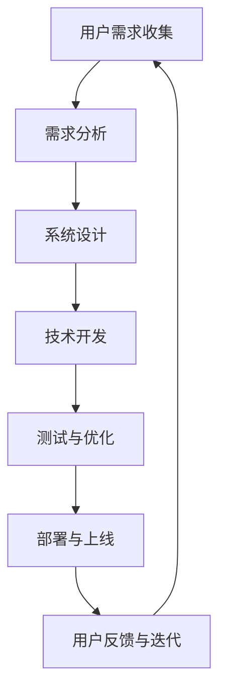
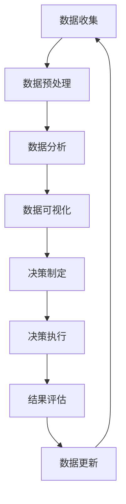

                 

### 文章标题

《个人理财应用：智能化财富管理的新选择》

#### 关键词

- 个人理财
- 智能化财富管理
- 人工智能
- 数据分析
- 算法交易
- 区块链

#### 摘要

随着科技的发展，智能化财富管理逐渐成为个人理财的新选择。本文从个人理财的基础知识出发，详细探讨了理财规划与目标设定、财富积累与投资策略、以及智能化财富管理技术，包括人工智能在财富管理中的应用、数据驱动财富管理、算法交易与量化投资，以及区块链与数字货币投资。通过实际案例分析和项目实践，本文旨在为读者提供全面、深入的智能化财富管理理解，揭示其未来发展潜力。

---

# 第一部分：引言与概述

在现代社会，个人理财变得越来越重要。无论是为了应对生活的不确定性，还是为了实现长期的目标，如购房、教育、养老等，都需要有一个合理的理财规划。传统的个人理财方法往往依赖于经验和直觉，而随着人工智能、数据分析等技术的进步，智能化财富管理逐渐成为一种新的选择，它不仅提高了理财的效率和精准度，还为投资者带来了全新的体验。

本部分将首先介绍个人理财的基础知识，包括个人理财的定义、重要性、目标与原则，以及常见误区和挑战。接着，我们将深入探讨理财规划与目标设定，详细阐述理财规划的基本步骤、短期、中期和长期理财目标的设定方法，以及风险评估与承受能力分析。最后，我们将探讨财富积累与投资策略，分析财富积累的有效方法，介绍理财产品的选择与评估，以及投资策略的制定与调整。

## 第1章：个人理财基础知识

### 1.1 个人理财的定义与重要性

个人理财，是指个人对财务进行管理的行为，包括收入管理、支出管理、财富积累和投资等。其核心目的是实现财务自由，提高生活质量，并为未来提供保障。个人理财的重要性体现在以下几个方面：

1. **提高生活质量**：合理的理财规划可以帮助个人更好地管理财务，减少不必要的支出，提高生活品质。
2. **应对生活风险**：通过理财，个人可以积累一定的财富，以应对生活中的突发事件，如疾病、失业等。
3. **实现长期目标**：理财规划可以帮助个人设定并实现短期、中期和长期的财务目标，如购房、教育、养老等。
4. **财务自由**：通过有效的理财策略，个人可以增加收入、降低支出，最终实现财务自由。

### 1.2 财富管理的目标与原则

财富管理的目标可以分为以下几个方面：

1. **财务安全**：保障个人和家庭的基本生活需求，防范财务风险。
2. **财富积累**：通过合理的投资和储蓄，增加个人资产。
3. **资产增值**：通过投资渠道，实现资产的增值。
4. **财富传承**：为子孙后代提供财务支持，实现财富的长期传承。

财富管理的原则包括：

1. **长期规划**：理财规划应具有长期性，考虑未来的生活需求和风险。
2. **适度风险**：根据个人的风险承受能力，选择合适的投资产品。
3. **分散投资**：将资金分散投资于不同领域，降低投资风险。
4. **持续调整**：根据市场变化和个人情况，不断调整理财策略。

### 1.3 个人理财的常见误区与挑战

在进行个人理财时，常见的误区和挑战包括：

1. **盲目跟风**：投资者往往受到市场情绪的影响，盲目跟风，导致投资决策不理性。
2. **缺乏规划**：没有明确的理财目标和计划，随意投资，导致财务状况不稳定。
3. **风险承受能力不足**：投资者往往对自己的风险承受能力估计不足，选择过于保守或过于激进的理财策略。
4. **信息不对称**：投资者对投资产品的了解不足，难以做出理性的投资决策。
5. **缺乏自律**：投资者难以坚持理财计划，容易受到各种诱惑，导致财务状况恶化。

为了克服这些误区和挑战，个人需要：

- 增强理财知识，了解不同投资产品的特点。
- 制定合理的理财计划，明确短期和长期目标。
- 增强风险意识，选择合适的投资产品。
- 坚持执行理财计划，避免因情绪波动而改变决策。

### 1.4 个人理财的步骤与工具

个人理财的步骤可以分为以下几个方面：

1. **设定目标**：明确个人的理财目标，包括短期、中期和长期目标。
2. **评估现状**：分析个人的财务状况，包括收入、支出、债务等。
3. **制定计划**：根据目标现状，制定具体的理财计划，包括储蓄计划、投资计划等。
4. **执行计划**：按照理财计划执行，定期跟踪财务状况，进行调整。
5. **评估与调整**：定期评估理财计划的执行效果，根据市场变化和个人情况，进行调整。

个人理财可以使用的工具包括：

1. **财务软件**：如 Mint、You Need A Budget 等，可以帮助个人管理财务，制定预算。
2. **投资平台**：如 Robinhood、Wealthfront 等，提供便捷的投资渠道和理财建议。
3. **理财顾问**：专业的理财顾问可以提供个性化的理财建议和规划服务。

通过以上步骤和工具，个人可以更好地管理财务，实现理财目标。

### 1.5 个人理财案例分析

**案例：小明理财规划**

小明是一名年轻的上班族，年收入约 50 万元。他希望通过理财实现以下目标：

- 短期目标：购买一辆新车，预计需要 20 万元。
- 中期目标：5年后购买一套房产，预计需要 200 万元。
- 长期目标：退休后能够过上舒适的退休生活。

**分析：**

1. **目标设定**：小明明确了短期、中期和长期理财目标。
2. **现状评估**：小明的年收入约为 50 万元，支出约为 30 万元，储蓄率为 40%。
3. **制定计划**：

   - 短期目标：小明计划通过增加储蓄和投资来实现。他决定每月定期存入 10,000 元到银行储蓄账户，同时投资于股票和基金，预期年化收益率为 10%。
   - 中期目标：小明计划通过投资房地产来实现。他计划每月投资 5,000 元到房地产投资信托（REITs），同时关注房地产市场走势，适时调整投资策略。
   - 长期目标：小明计划通过退休储蓄账户和投资收益来实现。他决定每月定期存入 15,000 元到退休储蓄账户，并投资于低风险的固定收益产品，如国债和企业债。

**效果评估**：通过以上计划，小明预计在 3 年内可以积累足够的资金购买新车，5 年内可以积累足够的资金购买房产，长期内可以确保退休后的生活品质。

通过以上案例分析，我们可以看到，合理的理财规划可以帮助个人实现财务目标，提高生活质量。

### 1.6 个人理财的风险与应对策略

在进行个人理财时，投资者需要面对各种风险，包括市场风险、信用风险、流动性风险等。以下是一些常见的风险类型和应对策略：

1. **市场风险**：由于市场波动导致的投资损失。应对策略：选择多种投资渠道，实现资产多元化，降低市场风险。
2. **信用风险**：借款人无法按时偿还债务的风险。应对策略：选择信用评级较高的借款人，进行信用审查，降低信用风险。
3. **流动性风险**：资产无法在需要时快速变现的风险。应对策略：保持一定的流动性资产，如现金、活期存款等，以应对紧急情况。
4. **利率风险**：利率变动导致的投资收益波动。应对策略：选择长期投资，降低利率风险。

投资者应根据自己的风险承受能力，选择合适的投资产品，并制定合理的风险应对策略，以实现财务目标。

### 1.7 个人理财的法律法规

个人理财涉及到的法律法规包括税收法规、投资法规等。以下是一些相关的法律法规：

1. **税收法规**：个人所得税法、印花税法等，规定了个人投资的税收政策和税收优惠。
2. **投资法规**：证券法、基金法、保险法等，规定了个人投资的法律地位和权益保护。
3. **反洗钱法规**：反洗钱法、反恐怖融资法等，规定了个人投资资金的来源和用途，防范洗钱和恐怖融资。

了解和遵守相关法律法规，是进行个人理财的基础，也是保障个人权益的重要手段。

---

通过以上对个人理财基础知识的介绍，我们可以看到，个人理财不仅是实现财务目标的重要手段，也是提高生活质量和应对未来风险的关键。在接下来的章节中，我们将深入探讨理财规划与目标设定、财富积累与投资策略，以及智能化财富管理技术，帮助读者全面了解和掌握个人理财的实践方法。

## 第2章：理财规划与目标设定

理财规划是个人理财的重要环节，它帮助个人明确财务目标，制定实现这些目标的策略。合理的理财规划不仅能够提高财务状况，还能够为未来的生活提供保障。在这一章中，我们将详细探讨理财规划的基本步骤、短期、中期和长期理财目标的设定方法，以及风险评估与承受能力分析。

### 2.1 理财规划的基本步骤

理财规划是一个系统性的过程，通常包括以下几个步骤：

1. **设定目标**：明确个人的财务目标，包括短期、中期和长期目标。这些目标可以是具体的，如购买房产、教育基金、退休金等。
2. **评估现状**：分析个人的财务状况，包括收入、支出、储蓄和债务等。了解当前的财务状况有助于制定合理的理财计划。
3. **制定策略**：根据目标现状，制定具体的理财策略，包括储蓄计划、投资计划、支出管理计划等。
4. **执行计划**：按照制定的理财计划执行，定期跟踪财务状况，根据实际情况进行调整。
5. **评估与调整**：定期评估理财计划的执行效果，根据市场变化和个人情况，对计划进行调整。

### 2.2 设定短期、中期和长期理财目标

理财目标的设定是理财规划的关键，合理的理财目标能够引导个人合理规划财务。根据时间跨度，理财目标可以分为短期、中期和长期目标。

1. **短期目标**：通常指一年到三年的目标。短期目标通常包括购买家电、旅游、购买新车等。设定短期目标可以帮助个人集中资源和精力，快速实现具体目标。
2. **中期目标**：通常指三年到十年的目标。中期目标通常包括子女教育基金、购房首付、创业资金等。设定中期目标可以帮助个人在较长时间内积累足够的资金和资源。
3. **长期目标**：通常指十年以上的目标。长期目标通常包括退休金、遗产规划、财富传承等。设定长期目标可以帮助个人为未来的生活提供稳定的财务支持。

**示例**：

- **短期目标**：小明计划在两年内购买一辆新车，预算为 20 万元。他决定每月定期存入 10,000 元，同时通过投资股票和基金，预期年化收益率为 10%。
- **中期目标**：小明计划在五年内购买一套房产，预算为 200 万元。他决定每月投资 5,000 元到房地产投资信托（REITs），并关注房地产市场走势，适时调整投资策略。
- **长期目标**：小明计划在十年内积累足够的退休金，预算为 500 万元。他决定每月定期存入 15,000 元到退休储蓄账户，并投资于低风险的固定收益产品，如国债和企业债。

### 2.3 风险评估与承受能力分析

在理财规划中，风险评估与承受能力分析至关重要。它帮助个人了解自身的风险承受能力，选择合适的投资产品，制定合理的理财策略。

1. **风险评估**：风险评估包括市场风险、信用风险、流动性风险等。通过分析不同投资产品的风险特征，投资者可以了解潜在的风险，并选择适合自己风险承受能力的投资产品。
2. **承受能力分析**：承受能力分析涉及个人对风险的接受程度和心理承受能力。投资者需要根据自己的年龄、收入、财务状况等，评估自身的风险承受能力，选择适合的投资策略。

**风险承受能力评估**：

- **低风险承受能力**：对于风险承受能力较低的个人，建议选择低风险的理财产品和投资策略，如储蓄账户、国债等。
- **中等风险承受能力**：对于风险承受能力中等的个人，可以适当增加投资组合的风险，如股票、基金等。
- **高风险承受能力**：对于风险承受能力较高的个人，可以选择高风险高回报的投资产品，如期货、外汇等。

### 2.4 理财规划的案例分析

**案例：李女士的理财规划**

李女士是一位45岁的职业女性，年收入约为80万元。她希望通过理财规划实现以下目标：

- **短期目标**：五年内支付女儿大学的学费，预计需要50万元。
- **中期目标**：十年内购买一套房产，预算为200万元。
- **长期目标**：退休后过上舒适的退休生活，预计需要300万元。

**分析**：

1. **目标设定**：李女士明确了自己的短期、中期和长期理财目标。
2. **现状评估**：李女士目前的资产状况包括存款100万元，投资组合（股票、基金）价值200万元，无负债。
3. **制定策略**：

   - **短期目标**：李女士决定每月定期存入10,000元到定期存款账户，同时投资于教育基金，预期年化收益率为5%。她计划在五年内通过储蓄和投资，累计50万元。
   - **中期目标**：李女士决定每月投资15,000元到房地产投资信托（REITs），并关注房地产市场走势，适时调整投资策略。她计划在十年内通过投资房地产，积累200万元。
   - **长期目标**：李女士决定每月定期存入20,000元到退休储蓄账户，并投资于低风险的固定收益产品，如国债和企业债。她计划在退休前通过储蓄和投资，累计300万元。

**效果评估**：通过以上计划，李女士预计在五年内可以积累足够的资金支付女儿大学的学费，十年内可以积累足够的资金购买房产，长期内可以确保退休后的生活品质。

通过以上案例分析，我们可以看到，合理的理财规划可以帮助个人实现财务目标，提高生活质量。

### 2.5 理财规划的常见误区与挑战

在进行理财规划时，个人常常会遇到一些误区和挑战：

- **目标不明确**：没有明确的理财目标，导致理财规划缺乏方向。
- **缺乏规划**：随意投资，没有制定明确的理财计划。
- **风险承受能力不足**：选择过于保守或过于激进的理财策略，与自身的风险承受能力不符。
- **缺乏自律**：难以坚持理财计划，容易受到各种诱惑，导致财务状况恶化。

为了克服这些误区和挑战，个人需要：

- 增强理财知识，了解不同投资产品的特点。
- 制定合理的理财计划，明确短期和长期目标。
- 增强风险意识，选择合适的投资产品。
- 坚持执行理财计划，避免因情绪波动而改变决策。

### 2.6 理财规划的工具与方法

个人在进行理财规划时，可以借助各种工具和方法，以帮助制定和执行理财计划：

- **财务软件**：如Mint、You Need A Budget等，可以帮助个人管理财务，制定预算。
- **投资平台**：如Robinhood、Wealthfront等，提供便捷的投资渠道和理财建议。
- **理财顾问**：专业的理财顾问可以提供个性化的理财建议和规划服务。
- **目标设定工具**：如SMART目标设定方法，帮助个人明确目标，制定具体的行动方案。

通过以上工具和方法，个人可以更有效地进行理财规划，实现财务目标。

### 2.7 理财规划的实际案例

**案例：张先生的理财规划**

张先生是一位35岁的上班族，年收入约为60万元。他希望通过理财规划实现以下目标：

- **短期目标**：三年内购买一辆新车，预算为30万元。
- **中期目标**：五年内购买一套房产，预算为150万元。
- **长期目标**：十年内积累足够的退休金，预算为500万元。

**分析**：

1. **目标设定**：张先生明确了自己的短期、中期和长期理财目标。
2. **现状评估**：张先生目前的资产状况包括存款50万元，投资组合（股票、基金）价值100万元，无负债。
3. **制定策略**：

   - **短期目标**：张先生决定每月定期存入5,000元到定期存款账户，同时投资于股票和基金，预期年化收益率为8%。他计划在三年内通过储蓄和投资，累计30万元。
   - **中期目标**：张先生决定每月投资10,000元到房地产投资信托（REITs），并关注房地产市场走势，适时调整投资策略。他计划在五年内通过投资房地产，积累150万元。
   - **长期目标**：张先生决定每月定期存入15,000元到退休储蓄账户，并投资于低风险的固定收益产品，如国债和企业债。他计划在十年内通过储蓄和投资，累计500万元。

**效果评估**：通过以上计划，张先生预计在三年内可以积累足够的资金购买新车，五年内可以积累足够的资金购买房产，长期内可以确保退休后的生活品质。

通过以上实际案例，我们可以看到，合理的理财规划可以帮助个人实现财务目标，提高生活质量。

通过本章的探讨，我们了解了理财规划与目标设定的重要性，以及具体的实施步骤和方法。在接下来的章节中，我们将深入探讨财富积累与投资策略，帮助读者掌握更丰富的理财知识和技巧。

## 第3章：财富积累与投资策略

在个人理财过程中，财富积累是核心目标之一。通过有效的财富积累策略，个人可以增加资产、提高财务状况，并为未来的生活提供保障。在这一章中，我们将详细探讨财富积累的有效方法、理财产品的选择与评估，以及投资策略的制定与调整。

### 3.1 财富积累的有效方法

财富积累是一个长期的过程，需要个人持续的努力和正确的策略。以下是一些有效的财富积累方法：

1. **增加收入**：提高个人收入是财富积累的首要步骤。可以通过提升职业技能、创业、兼职等方式增加收入。
2. **减少支出**：合理控制支出是财富积累的重要手段。可以通过制定预算、避免非必要的开支、节约使用资源等方式减少支出。
3. **储蓄**：储蓄是财富积累的基础。将一部分收入用于储蓄，可以选择银行储蓄账户、定期存款等安全稳定的储蓄方式。
4. **投资**：投资是财富积累的重要手段。通过投资，个人可以实现资产的增值，提高财务状况。可以选择股票、基金、房地产等投资渠道。
5. **债务管理**：合理管理债务是财富积累的关键。避免高利率债务，如信用卡欠款、高利贷等，可以减少不必要的财务负担。

### 3.2 理财产品的选择与评估

理财产品是个人投资的重要工具，选择合适的理财产品可以有效地实现财富积累。以下是一些常见的理财产品及其特点：

1. **银行储蓄账户**：银行储蓄账户是一种安全、稳定的理财产品，适合风险承受能力较低的投资者。其特点是低风险、低收益。
2. **定期存款**：定期存款是一种固定收益的理财产品，适合中长期储蓄和投资。其特点是收益稳定，风险较低。
3. **股票**：股票是一种高风险、高收益的理财产品，适合风险承受能力较高的投资者。其特点是波动性大，收益潜力高。
4. **基金**：基金是一种由专业团队管理的理财产品，包括股票基金、债券基金、货币基金等。其特点是分散投资、风险较低。
5. **房地产**：房地产是一种实物资产，具有保值增值的功能。其特点是投资金额大、风险较高，但长期收益稳定。

在选择理财产品时，投资者需要评估产品的风险和收益特点，根据自己的风险承受能力和投资目标进行选择。以下是一些评估理财产品的方法：

1. **风险评估**：分析产品的风险特征，包括市场风险、信用风险、流动性风险等。通过风险评估，投资者可以了解产品的潜在风险，并选择适合自己的产品。
2. **收益评估**：分析产品的收益特征，包括预期收益率、收益率波动性等。通过收益评估，投资者可以了解产品的收益潜力，并选择具有较高收益的产品。
3. **产品费用**：分析产品的费用结构，包括管理费、销售费、交易费等。通过费用评估，投资者可以了解产品的成本，并选择费用较低的产品。
4. **历史业绩**：分析产品的历史业绩，包括收益率、波动率等。通过历史业绩评估，投资者可以了解产品的表现，并选择具有良好业绩的产品。

### 3.3 投资策略的制定与调整

投资策略是投资者在投资过程中遵循的一系列规则和原则。制定合理的投资策略可以帮助投资者有效地管理风险，实现财富积累。以下是一些常见的投资策略：

1. **分散投资**：分散投资是指将资金投资于多种不同的资产，以降低投资组合的整体风险。分散投资可以降低单一资产波动对整体投资组合的影响，提高投资组合的稳定性。
2. **长期投资**：长期投资是指投资者将资金投资于长期投资目标，如退休基金、教育基金等。长期投资可以抵御短期市场波动，实现资产的长期增值。
3. **价值投资**：价值投资是指投资者通过深入分析企业的基本面，选择具有较高投资价值的股票。价值投资通常关注企业的盈利能力、成长性、估值水平等，以实现资产的增值。
4. **趋势投资**：趋势投资是指投资者通过分析市场趋势，选择跟随市场趋势的投资策略。趋势投资可以充分利用市场趋势带来的机会，实现资产的增值。

在制定投资策略时，投资者需要根据自身的风险承受能力、投资目标和市场环境进行调整。以下是一些调整投资策略的方法：

1. **定期评估**：投资者应定期评估投资组合的表现，包括收益率、波动率等。通过定期评估，投资者可以了解投资策略的执行效果，并根据实际情况进行调整。
2. **市场分析**：投资者应密切关注市场变化，包括宏观经济环境、行业发展趋势、市场情绪等。通过市场分析，投资者可以了解市场的潜在机会和风险，并调整投资策略。
3. **风险控制**：投资者应设定合理的风险控制措施，包括止损、止盈等。通过风险控制，投资者可以降低投资风险，保护投资本金。

### 3.4 财富积累的实际案例

**案例：王女士的财富积累策略**

王女士是一位35岁的职业女性，年收入约为50万元。她希望通过理财积累财富，实现以下目标：

- **短期目标**：五年内购买一套房产，预算为150万元。
- **中期目标**：十年内积累足够的退休金，预算为300万元。
- **长期目标**：二十年内实现财务自由，预算为1000万元。

**分析**：

1. **目标设定**：王女士明确了自己的短期、中期和长期理财目标。
2. **现状评估**：王女士目前的资产状况包括存款50万元，投资组合（股票、基金）价值100万元，无负债。
3. **制定策略**：

   - **短期目标**：王女士决定每月定期存入5,000元到定期存款账户，同时投资于房地产投资信托（REITs），并关注房地产市场走势，适时调整投资策略。她计划在五年内通过储蓄和投资，累计150万元。
   - **中期目标**：王女士决定每月投资10,000元到退休储蓄账户，并投资于股票和基金，预期年化收益率为10%。她计划在十年内通过投资，累计300万元。
   - **长期目标**：王女士决定每月投资15,000元到退休储蓄账户，并投资于股票和基金，同时关注其他高回报的投资机会，如私募股权、风险投资等。她计划在二十年内通过投资，累计1000万元。

**效果评估**：通过以上策略，王女士预计在五年内可以积累足够的资金购买房产，十年内可以积累足够的退休金，长期内可以实现财务自由。

通过以上实际案例，我们可以看到，合理的财富积累策略可以帮助个人实现财务目标，提高生活质量。

### 3.5 财富积累的挑战与应对策略

在财富积累过程中，个人常常会遇到一些挑战：

- **市场波动**：市场波动可能导致投资损失。应对策略：通过分散投资、长期投资降低市场风险。
- **通货膨胀**：通货膨胀可能导致购买力下降。应对策略：选择具有保值增值功能的投资产品，如房地产、黄金等。
- **风险承受能力不足**：投资者可能因为风险承受能力不足而选择过于保守的投资产品。应对策略：增强理财知识，提高风险意识，选择合适的投资产品。

通过以上挑战和应对策略，个人可以更好地应对财富积累过程中的困难，实现财务目标。

### 3.6 财富积累的最佳实践

以下是一些财富积累的最佳实践：

- **定期财务检查**：定期检查财务状况，调整投资策略，确保财务目标的实现。
- **持续学习**：不断学习理财知识，了解市场动态，提高投资能力。
- **多元化投资**：分散投资，降低风险，实现资产的保值增值。
- **设定明确的财务目标**：明确财务目标，制定具体的实现计划，持续跟踪进度。

通过以上最佳实践，个人可以更有效地进行财富积累，实现财务自由。

通过本章的探讨，我们了解了财富积累的有效方法和投资策略，以及如何选择合适的理财产品。在接下来的章节中，我们将深入探讨智能化财富管理技术，包括人工智能在财富管理中的应用、数据驱动财富管理、算法交易与量化投资，以及区块链与数字货币投资。

## 第4章：人工智能在财富管理中的应用

人工智能（AI）技术的迅猛发展，正在深刻改变着各个行业，包括财富管理领域。AI在财富管理中的应用，不仅提高了理财的效率和精准度，还为投资者带来了全新的体验。在这一章中，我们将详细探讨人工智能在财富管理中的应用场景、智能理财顾问系统（Robo-Advisor）的原理和特点，以及人工智能在个人理财中的具体应用。

### 4.1 智能化财富管理概述

智能化财富管理是指利用人工智能技术，对个人或机构的财务状况进行自动化分析、评估和优化，提供个性化的理财建议和服务。智能化财富管理的主要目标是提高理财效率、降低成本、优化投资组合，从而实现资产的增值和风险的分散。

智能化财富管理的基本原理包括以下几个方面：

1. **大数据分析**：利用大数据技术，收集和分析大量的市场数据、财务数据等，为投资决策提供数据支持。
2. **机器学习**：通过机器学习算法，对历史数据进行训练，建立预测模型，预测市场走势和资产表现。
3. **自然语言处理**：利用自然语言处理技术，理解和回应用户的理财需求，提供个性化的理财建议。
4. **自动化执行**：通过自动化系统，执行投资决策和交易操作，提高交易效率和准确性。

### 4.2 人工智能在财富管理中的应用场景

人工智能在财富管理中的应用场景非常广泛，以下是一些典型的应用：

1. **智能理财顾问（Robo-Advisor）**：智能理财顾问是AI在财富管理中最为广泛的应用。它通过大数据分析和机器学习算法，为用户提供个性化的理财建议，包括投资组合推荐、资产配置、风险控制等。
2. **智能投顾系统**：智能投顾系统是金融机构利用AI技术开发的自动化理财平台，能够为用户提供全程的理财服务，从资产配置到投资交易，全程自动化操作。
3. **风险监控与预警**：AI技术可以通过对市场数据的实时分析，识别潜在的市场风险，及时发出预警信号，帮助投资者防范风险。
4. **投资组合优化**：AI技术可以对投资组合进行实时分析和优化，通过机器学习算法，找到最优的投资组合，提高资产收益率。
5. **个性化投资建议**：AI技术可以根据用户的风险偏好、投资目标等，提供个性化的投资建议，帮助用户制定合理的投资策略。
6. **财务报表分析**：AI技术可以对用户的财务报表进行自动化分析，识别潜在的问题和风险，提供优化建议。

### 4.3 智能理财顾问系统（Robo-Advisor）的原理和特点

智能理财顾问系统（Robo-Advisor）是人工智能在财富管理中最典型的应用。它通过大数据分析和机器学习算法，为用户提供个性化的理财建议和服务。以下是智能理财顾问系统的原理和特点：

1. **用户画像建立**：智能理财顾问系统首先会收集用户的个人信息，如年龄、收入、投资目标、风险偏好等，建立用户的画像。
2. **大数据分析**：系统会利用大数据技术，收集和分析市场数据、财务数据等，为投资决策提供数据支持。
3. **机器学习算法**：系统通过机器学习算法，对历史数据进行分析和训练，建立预测模型，预测市场走势和资产表现。
4. **个性化理财建议**：根据用户的画像和预测模型，系统可以为用户提供个性化的理财建议，包括投资组合推荐、资产配置、风险控制等。
5. **自动化执行**：系统可以实现自动化执行，根据用户的理财建议，自动进行投资交易，提高交易效率和准确性。

**特点**：

- **个性化**：智能理财顾问系统可以根据用户的需求和偏好，提供个性化的理财建议，满足不同用户的需求。
- **自动化**：智能理财顾问系统可以自动化执行投资决策，提高交易效率和准确性，减少人为错误。
- **实时性**：智能理财顾问系统可以实时分析市场数据，快速响应市场变化，为用户提供及时的理财建议。
- **高效性**：智能理财顾问系统可以处理大量的市场数据和用户信息，快速生成理财建议，提高理财效率。
- **透明性**：智能理财顾问系统可以提供详细的理财报告和分析，用户可以清楚地了解投资组合的表现和风险。

### 4.4 智能理财顾问系统的案例分析

**案例：Wealthfront的智能理财顾问系统**

Wealthfront是一家领先的智能理财顾问公司，其智能理财顾问系统通过大数据分析和机器学习算法，为用户提供个性化的理财建议和服务。以下是Wealthfront智能理财顾问系统的应用案例：

1. **用户画像建立**：用户在注册时需要填写个人信息，包括年龄、收入、投资目标、风险偏好等。系统根据这些信息建立用户的画像。
2. **大数据分析**：系统会收集和分析大量的市场数据，包括股票、基金、债券等资产的表现，以及宏观经济环境的变化等。
3. **机器学习算法**：系统通过机器学习算法，对历史数据进行训练，建立预测模型，预测市场走势和资产表现。
4. **个性化理财建议**：根据用户的画像和预测模型，系统可以为用户提供个性化的理财建议，包括投资组合推荐、资产配置、风险控制等。
5. **自动化执行**：用户可以授权系统自动执行投资决策，系统会根据理财建议，自动进行投资交易，提高交易效率和准确性。

**效果评估**：通过Wealthfront智能理财顾问系统的应用，用户可以享受到个性化的理财服务，提高投资组合的表现和安全性。数据显示，使用智能理财顾问系统的用户，其投资收益率和风险控制效果显著优于传统投资方式。

通过以上案例分析，我们可以看到，智能理财顾问系统通过大数据分析和机器学习算法，为用户提供个性化的理财建议和服务，显著提高了理财的效率和效果。

### 4.5 智能理财顾问系统的发展趋势

随着人工智能技术的不断进步，智能理财顾问系统的发展趋势主要体现在以下几个方面：

1. **智能化水平提高**：随着机器学习算法的优化和大数据分析技术的进步，智能理财顾问系统的智能化水平将进一步提高，能够更精准地预测市场走势和资产表现，为用户提供更高质量的理财建议。
2. **应用场景拓展**：智能理财顾问系统的应用场景将不断拓展，不仅限于个人理财，还将应用于企业理财、家族财富管理等领域。
3. **用户体验优化**：智能理财顾问系统将不断优化用户体验，提供更加人性化的服务，包括语音交互、图像识别等，使理财变得更加便捷和高效。
4. **监管合规**：随着人工智能技术的发展，智能理财顾问系统的监管合规问题也将日益重要，金融机构需要确保系统的透明性、可靠性和合规性，以保护投资者的权益。

通过以上发展趋势，我们可以看到，智能理财顾问系统将逐渐成为财富管理的重要工具，为投资者提供更加智能化、个性化的理财服务。

### 4.6 智能理财顾问系统的优缺点分析

**优点**：

- **个性化**：智能理财顾问系统可以根据用户的需求和偏好，提供个性化的理财建议，满足不同用户的需求。
- **高效性**：智能理财顾问系统可以自动化执行投资决策，提高交易效率和准确性，减少人为错误。
- **实时性**：智能理财顾问系统可以实时分析市场数据，快速响应市场变化，为用户提供及时的理财建议。
- **降低成本**：智能理财顾问系统降低了人力成本，使理财服务更加经济实惠。

**缺点**：

- **数据依赖**：智能理财顾问系统依赖于大量市场数据和用户信息，如果数据质量不佳，可能会导致错误的理财建议。
- **风险管理**：智能理财顾问系统虽然可以识别潜在的风险，但无法完全消除风险，投资者仍需保持警惕。
- **用户信任**：对于一些风险承受能力较低的投资者，可能会对智能理财顾问系统的建议持怀疑态度，影响理财效果。

通过以上优缺点分析，我们可以看到，智能理财顾问系统在提高理财效率和质量方面具有显著优势，但也存在一定的局限性。投资者在使用智能理财顾问系统时，应保持理性，结合自身的实际情况和风险偏好，进行综合判断。

### 4.7 人工智能在个人理财中的实际应用

**案例：京东金融的智能理财服务**

京东金融是中国领先的金融科技公司，其智能理财服务利用人工智能技术，为用户提供个性化的理财建议和服务。以下是京东金融智能理财服务的应用案例：

1. **用户画像建立**：用户在注册京东金融时，需要填写个人信息，包括年龄、收入、投资目标、风险偏好等。系统根据这些信息建立用户的画像。
2. **大数据分析**：京东金融通过大数据技术，收集和分析用户交易数据、市场数据等，为投资决策提供数据支持。
3. **机器学习算法**：京东金融利用机器学习算法，对历史数据进行训练，建立预测模型，预测市场走势和资产表现。
4. **个性化理财建议**：根据用户的画像和预测模型，京东金融可以为用户提供个性化的理财建议，包括投资组合推荐、资产配置、风险控制等。
5. **自动化执行**：用户可以授权京东金融自动执行投资决策，系统会根据理财建议，自动进行投资交易，提高交易效率和准确性。

**效果评估**：通过京东金融智能理财服务的应用，用户可以享受到个性化的理财服务，提高投资组合的表现和安全性。数据显示，使用京东金融智能理财服务的用户，其投资收益率和风险控制效果显著优于传统投资方式。

通过以上实际应用案例，我们可以看到，人工智能在个人理财中的应用，不仅提高了理财的效率和精准度，还为投资者带来了全新的体验。

### 4.8 人工智能在财富管理中的未来展望

随着人工智能技术的不断进步，人工智能在财富管理中的应用将更加广泛和深入。未来的发展趋势包括：

1. **智能化水平提升**：随着算法和大数据技术的进步，智能理财顾问系统的智能化水平将进一步提高，能够更精准地预测市场走势和资产表现。
2. **多场景应用**：智能理财顾问系统的应用场景将不断拓展，不仅限于个人理财，还将应用于企业理财、家族财富管理等领域。
3. **用户体验优化**：智能理财顾问系统将不断优化用户体验，提供更加人性化的服务，包括语音交互、图像识别等。
4. **监管合规**：随着人工智能技术的发展，智能理财顾问系统的监管合规问题将日益重要，金融机构需要确保系统的透明性、可靠性和合规性。

通过以上未来展望，我们可以看到，人工智能在财富管理中的应用将不断拓展，为投资者带来更加智能化、个性化的理财服务。

通过本章的探讨，我们了解了人工智能在财富管理中的应用场景、智能理财顾问系统的原理和特点，以及人工智能在个人理财中的具体应用。在接下来的章节中，我们将深入探讨数据驱动财富管理、算法交易与量化投资，以及区块链与数字货币投资。

## 第5章：数据驱动财富管理

随着大数据技术的不断发展，数据已经成为财富管理中的重要资产。数据驱动财富管理通过收集、处理和分析大量数据，帮助投资者做出更准确、更高效的决策。在这一章中，我们将详细探讨数据在财富管理中的作用、数据分析技术在财富管理中的应用，以及利用大数据进行投资决策的方法。

### 5.1 数据在财富管理中的作用

数据在财富管理中扮演着至关重要的角色，它不仅提供了决策的依据，还帮助投资者更好地理解和应对市场变化。以下是数据在财富管理中的几个关键作用：

1. **决策支持**：数据驱动的财富管理能够为投资者提供丰富的信息资源，帮助投资者分析市场趋势、评估投资风险、制定投资策略。通过数据分析，投资者可以更准确地判断市场的潜在机会和风险，做出更明智的投资决策。
2. **风险控制**：数据可以帮助投资者识别和管理投资风险。通过实时监测市场数据，投资者可以及时发现潜在的风险信号，并采取相应的风险控制措施，如调整投资组合、设置止损点等。
3. **个性化服务**：数据驱动的财富管理能够根据投资者的个性化需求，提供定制化的投资建议和服务。例如，根据投资者的风险偏好、投资目标等，数据可以推荐最适合的投资产品和策略。
4. **预测分析**：数据可以帮助投资者预测市场走势和资产表现。通过分析历史数据和当前市场状况，数据驱动的模型可以预测未来的市场趋势，为投资者提供前瞻性的决策支持。
5. **绩效评估**：数据驱动的财富管理可以帮助投资者评估投资组合的表现。通过数据分析，投资者可以了解投资组合的收益率、波动率等关键指标，评估投资策略的有效性，并据此进行调整。

### 5.2 数据分析技术在财富管理中的应用

数据分析技术在财富管理中的应用非常广泛，主要包括数据收集、数据预处理、数据分析和数据可视化等环节。以下是数据分析技术在财富管理中的具体应用：

1. **数据收集**：数据收集是数据分析的基础。在财富管理中，数据收集主要涉及市场数据、财务数据、宏观经济数据等。这些数据可以来源于交易所、金融资讯平台、政府机构等。
2. **数据预处理**：数据预处理是数据分析的重要步骤，包括数据清洗、数据集成、数据转换等。通过数据预处理，可以确保数据的准确性和一致性，为后续分析打下良好的基础。
3. **数据分析**：数据分析是数据驱动的财富管理的核心环节，包括统计分析、机器学习、数据挖掘等。通过数据分析，投资者可以挖掘数据中的有价值信息，发现市场规律和投资机会。
4. **数据可视化**：数据可视化是将数据分析结果以图表、图形等形式呈现，帮助投资者更直观地理解和分析数据。通过数据可视化，投资者可以更清晰地看到市场趋势、投资组合表现等关键信息。

**案例：利用数据分析优化投资组合**

某投资者希望通过数据分析优化其投资组合，以下是一个具体的应用案例：

1. **数据收集**：投资者通过金融资讯平台和交易所，收集了过去一年的股票市场数据，包括每日的股票价格、成交量、市盈率等。
2. **数据预处理**：对收集到的数据进行清洗，去除异常值和缺失值，确保数据的准确性和一致性。
3. **数据分析**：

   - **统计分析**：通过统计分析，投资者分析了股票价格的波动性和收益率分布，确定了哪些股票具有较高的波动性和收益率。
   - **机器学习**：通过机器学习算法，如回归分析、聚类分析等，投资者分析了历史数据，建立了预测模型，预测未来股票价格的走势。
   - **数据挖掘**：通过数据挖掘，投资者发现了一些具有潜在投资价值的股票，如新兴行业的龙头企业、具有独特竞争优势的公司等。

4. **数据可视化**：投资者通过数据可视化工具，将分析结果以图表的形式呈现，包括股票价格走势、收益率分布、相关性分析等，帮助投资者更直观地了解市场状况和投资机会。

通过以上数据分析，投资者可以更准确地评估股票的投资价值，优化投资组合，提高投资收益率。

### 5.3 利用大数据进行投资决策

大数据在投资决策中的应用，已经成为现代财富管理的重要趋势。利用大数据进行投资决策，可以显著提高决策的精准度和效率。以下是利用大数据进行投资决策的几个关键步骤：

1. **数据收集**：收集与投资相关的各种数据，包括市场数据、财务数据、宏观经济数据、行业数据等。这些数据可以来源于交易所、金融资讯平台、政府机构等。
2. **数据整合**：将收集到的各种数据进行整合，确保数据的一致性和完整性。通过数据整合，可以构建一个全面、多维度的数据集，为后续分析提供基础。
3. **数据清洗**：对整合后的数据进行清洗，去除异常值、缺失值等，确保数据的准确性和一致性。
4. **数据分析**：利用数据分析技术，对清洗后的数据进行深度分析。包括统计分析、机器学习、数据挖掘等，挖掘数据中的有价值信息，发现市场规律和投资机会。
5. **构建模型**：根据分析结果，构建预测模型，如回归模型、神经网络模型等，预测市场走势和资产表现。
6. **模型评估**：对构建的模型进行评估，包括模型的准确性、稳定性、鲁棒性等，确保模型的有效性。
7. **决策制定**：根据模型的预测结果，制定具体的投资决策，包括投资组合构建、资产配置、交易策略等。
8. **决策执行**：将投资决策转化为具体的交易操作，执行投资策略。

**案例：利用大数据进行股票投资决策**

某投资者希望通过大数据进行股票投资决策，以下是一个具体的应用案例：

1. **数据收集**：投资者通过金融资讯平台和交易所，收集了过去一年的股票市场数据，包括每日的股票价格、成交量、市盈率、市净率等。
2. **数据整合**：将收集到的股票数据进行整合，并与宏观经济数据、行业数据等进行关联，构建一个全面的数据集。
3. **数据清洗**：对整合后的数据进行清洗，去除异常值、缺失值等，确保数据的准确性和一致性。
4. **数据分析**：

   - **统计分析**：通过统计分析，投资者分析了股票价格的波动性和收益率分布，确定了哪些股票具有较高的波动性和收益率。
   - **机器学习**：通过机器学习算法，如回归分析、聚类分析等，投资者分析了历史数据，建立了预测模型，预测未来股票价格的走势。
   - **数据挖掘**：通过数据挖掘，投资者发现了一些具有潜在投资价值的股票，如新兴行业的龙头企业、具有独特竞争优势的公司等。

5. **构建模型**：根据分析结果，投资者构建了股票价格预测模型，并进行了模型评估，确保模型的准确性。

6. **决策制定**：根据模型预测结果，投资者制定了具体的投资决策，选择了具有潜在投资价值的股票进行投资。

7. **决策执行**：投资者将投资决策转化为具体的交易操作，执行了投资策略。

通过以上步骤，投资者利用大数据进行股票投资决策，提高了决策的精准度和效率。

### 5.4 数据驱动财富管理的案例分析

**案例：摩根士丹利的智能投资平台**

摩根士丹利是国际知名的金融机构，其智能投资平台利用大数据和人工智能技术，为投资者提供数据驱动的投资决策支持。以下是摩根士丹利智能投资平台的应用案例：

1. **数据收集**：摩根士丹利通过交易所、金融资讯平台、政府机构等渠道，收集了全球范围内的市场数据、财务数据、宏观经济数据等。
2. **数据整合**：将收集到的数据进行整合，并与不同的数据源进行交叉验证，确保数据的一致性和完整性。
3. **数据清洗**：对整合后的数据进行清洗，去除异常值、缺失值等，确保数据的准确性和一致性。
4. **数据分析**：

   - **统计分析**：通过统计分析，摩根士丹利分析了全球股票市场、债券市场、外汇市场的波动性和收益率分布。
   - **机器学习**：通过机器学习算法，摩根士丹利建立了预测模型，预测市场走势和资产表现。
   - **数据挖掘**：通过数据挖掘，摩根士丹利发现了一些具有潜在投资价值的行业和股票。

5. **构建模型**：根据分析结果，摩根士丹利构建了多个预测模型，并进行了模型评估，确保模型的准确性。

6. **决策制定**：根据模型预测结果，摩根士丹利为投资者提供了个性化的投资建议，包括投资组合构建、资产配置、交易策略等。

7. **决策执行**：投资者根据摩根士丹利的投资建议，执行了具体的交易操作。

通过以上应用，摩根士丹利智能投资平台为投资者提供了数据驱动的投资决策支持，提高了投资效率和收益率。

### 5.5 数据驱动财富管理的挑战与应对策略

数据驱动财富管理虽然在提高投资决策的精准度和效率方面具有显著优势，但也面临一些挑战：

- **数据质量**：数据质量是数据驱动财富管理的关键，如果数据存在误差或缺失，可能会导致错误的决策。
- **模型风险**：预测模型可能存在偏差或过拟合，导致预测结果不准确。
- **技术复杂度**：大数据和人工智能技术的应用需要专业的技术支持和复杂的技术架构。

应对策略：

- **数据质量保证**：确保数据来源的可靠性，建立数据质量控制流程，对数据进行清洗和验证。
- **模型验证与优化**：对预测模型进行严格的验证和测试，发现并修正模型中的偏差和过拟合现象。
- **技术专业化**：加强技术团队的专业化培训，提高大数据和人工智能技术的应用能力。

通过以上策略，可以有效地应对数据驱动财富管理中的挑战，提高投资决策的质量和效率。

### 5.6 数据驱动财富管理的未来发展趋势

随着大数据和人工智能技术的不断进步，数据驱动财富管理的发展趋势主要包括：

- **智能化水平提升**：随着算法和大数据技术的进步，数据驱动财富管理的智能化水平将进一步提高，能够更精准地预测市场走势和资产表现。
- **多场景应用**：数据驱动财富管理的应用场景将不断拓展，不仅限于个人理财，还将应用于企业理财、家族财富管理等领域。
- **数据隐私保护**：随着数据隐私问题的日益重要，数据驱动财富管理将加强数据隐私保护，确保用户数据的安全和隐私。

通过以上未来发展趋势，我们可以看到，数据驱动财富管理将不断优化和完善，为投资者提供更加智能化、个性化的理财服务。

通过本章的探讨，我们了解了数据在财富管理中的作用、数据分析技术在财富管理中的应用，以及利用大数据进行投资决策的方法。在接下来的章节中，我们将深入探讨算法交易与量化投资，以及区块链与数字货币投资。

## 第6章：算法交易与量化投资

算法交易和量化投资是金融科技领域的重要组成部分，它们利用数学模型和计算机算法，对市场数据进行分析和交易决策。算法交易通过自动化系统执行交易，而量化投资则通过建立数学模型来预测市场走势和资产表现。在这一章中，我们将详细探讨算法交易的基本原理、量化投资策略、算法交易案例分析，以及量化投资在实际应用中的具体实现。

### 6.1 算法交易的基本原理

算法交易，也称为量化交易，是指利用计算机程序和数学模型来执行交易决策的一种交易方式。它具有以下几个特点：

1. **自动化**：算法交易完全由计算机程序控制，无需人工干预，能够在短时间内执行大量交易操作。
2. **高效性**：算法交易可以实时分析市场数据，快速响应市场变化，提高交易效率。
3. **精准性**：通过数学模型和大数据分析，算法交易能够更准确地预测市场趋势和价格变动。

算法交易的基本原理包括以下几个方面：

1. **数据收集**：算法交易系统需要收集大量的市场数据，包括股票价格、成交量、交易量、指数波动等。
2. **数据处理**：对收集到的市场数据进行处理和清洗，确保数据的准确性和一致性。
3. **模型构建**：根据交易策略，构建数学模型。这些模型可以是趋势跟踪模型、动量模型、市场情绪模型等。
4. **模型回测**：在历史数据上运行模型，评估模型的性能。通过回测，可以验证模型的稳定性和有效性。
5. **模型部署**：将经过验证的模型部署到交易系统，实现自动交易。
6. **实时监控**：实时监控交易系统的运行情况，根据市场变化调整策略。

### 6.2 算法交易的常见策略

算法交易策略种类繁多，以下是一些常见的策略：

1. **趋势跟踪策略**：通过分析价格的历史走势，寻找趋势并跟随趋势进行交易。这种策略适用于市场趋势明显的时期。
2. **动量策略**：利用价格变动的历史数据，预测未来价格将继续沿着原有趋势变动。动量策略适用于短期交易，尤其是在市场波动较大时表现较好。
3. **均值回归策略**：认为市场价格会回归到其历史平均水平，通过计算价格与均值的偏差进行交易。这种策略适用于市场价格偏离平均水平的时期。
4. **市场情绪策略**：分析市场情绪指标，如交易量、涨跌停等，进行交易决策。市场情绪策略适用于市场情绪极端时期。
5. **事件驱动策略**：利用特定事件（如财报发布、政策变动等）对市场产生的影响，进行交易决策。

### 6.3 算法交易的优势和挑战

算法交易的优势包括：

- **自动化**：算法交易能够自动化执行交易，减少人为错误，提高交易效率。
- **高效性**：算法交易可以实时分析大量市场数据，快速响应市场变化，抓住交易机会。
- **精准性**：通过数学模型和大数据分析，算法交易能够更准确地预测市场趋势和价格变动。
- **分散投资**：算法交易可以通过多种策略和资产进行分散投资，降低投资风险。

算法交易的挑战包括：

- **技术复杂性**：算法交易需要专业的技术支持和复杂的技术架构，对开发人员的要求较高。
- **数据质量**：算法交易依赖于高质量的市场数据，数据质量不佳可能导致交易错误。
- **模型风险**：预测模型可能存在偏差或过拟合，导致预测结果不准确。
- **监管合规**：算法交易需要遵守相关法律法规，确保交易的合规性和透明性。

### 6.4 算法交易案例分析

**案例：高频交易**

高频交易是一种利用计算机算法进行高频交易的策略，其特点是交易频率高、交易量大。以下是高频交易的一个案例分析：

1. **数据收集**：高频交易系统需要收集实时市场数据，包括股票价格、成交量、交易量等。
2. **数据处理**：对实时数据进行处理和清洗，确保数据的准确性和一致性。
3. **模型构建**：构建高频交易模型，如市场影响模型、动量模型等。这些模型用于预测市场价格的短期变化。
4. **模型部署**：将高频交易模型部署到交易系统，实现自动交易。
5. **实时监控**：实时监控交易系统的运行情况，根据市场变化调整交易策略。

**交易策略**：高频交易策略主要包括市场影响策略和交易量策略。市场影响策略通过分析交易对市场的影响，判断市场价格的短期变化；交易量策略通过分析交易量变化，判断市场情绪和交易机会。

**效果评估**：通过高频交易，投资者可以迅速抓住市场波动带来的交易机会，实现快速盈利。然而，高频交易也存在风险，如交易费用高、市场波动性大等。

通过以上案例分析，我们可以看到，高频交易利用算法交易的优势，实现了快速盈利，但同时也面临较高的风险。

### 6.5 量化投资策略与模型

量化投资是指通过建立数学模型和计算机算法，对市场数据进行分析和交易决策的一种投资方式。量化投资策略和模型主要包括以下几个方面：

1. **趋势跟踪模型**：通过分析价格的历史走势，寻找趋势并跟随趋势进行交易。趋势跟踪模型适用于市场趋势明显的时期。
2. **动量模型**：利用价格变动的历史数据，预测未来价格将继续沿着原有趋势变动。动量模型适用于短期交易，尤其是在市场波动较大时表现较好。
3. **均值回归模型**：认为市场价格会回归到其历史平均水平，通过计算价格与均值的偏差进行交易。均值回归模型适用于市场价格偏离平均水平的时期。
4. **市场情绪模型**：通过分析市场情绪指标，如交易量、涨跌停等，判断市场情绪和交易机会。市场情绪模型适用于市场情绪极端时期。
5. **事件驱动模型**：利用特定事件（如财报发布、政策变动等）对市场产生的影响，进行交易决策。事件驱动模型适用于事件发生时期。

**案例：事件驱动模型**

事件驱动模型通过分析特定事件对市场的影响，进行交易决策。以下是事件驱动模型的一个案例分析：

1. **数据收集**：收集与特定事件相关的市场数据，如财报发布前的股票价格、交易量等。
2. **数据处理**：对市场数据进行分析和清洗，确保数据的准确性和一致性。
3. **模型构建**：构建事件驱动模型，如回归模型、逻辑回归模型等，预测事件对市场的影响。
4. **模型部署**：将事件驱动模型部署到交易系统，实现自动交易。
5. **实时监控**：实时监控交易系统的运行情况，根据市场变化调整交易策略。

**交易策略**：事件驱动模型根据事件发生前后的市场变化，进行交易决策。例如，在财报发布前，模型可以预测市场对财报的反应，进行买入或卖出操作。

**效果评估**：通过事件驱动模型，投资者可以抓住特定事件带来的交易机会，实现快速盈利。然而，事件驱动模型也面临较高的风险，如事件预测不准确、市场反应剧烈等。

通过以上案例分析，我们可以看到，量化投资策略和模型通过计算机算法和数据分析，实现了对市场趋势和事件的有效预测，为投资者提供了重要的决策支持。

### 6.6 算法交易与量化投资的实际应用

**案例：高频交易在期权市场的应用**

高频交易在期权市场有着广泛的应用。以下是高频交易在期权市场的一个实际应用案例：

1. **数据收集**：高频交易系统需要收集期权市场的实时数据，包括期权价格、成交量、交易量等。
2. **数据处理**：对实时数据进行处理和清洗，确保数据的准确性和一致性。
3. **模型构建**：构建高频交易模型，如市场影响模型、动量模型等，用于预测期权价格的短期变化。
4. **模型部署**：将高频交易模型部署到交易系统，实现自动交易。
5. **实时监控**：实时监控交易系统的运行情况，根据市场变化调整交易策略。

**交易策略**：高频交易在期权市场的策略主要包括市场影响策略和交易量策略。市场影响策略通过分析交易对期权市场的影响，判断期权价格的短期变化；交易量策略通过分析交易量变化，判断市场情绪和交易机会。

**效果评估**：通过高频交易，投资者可以迅速抓住期权市场波动带来的交易机会，实现快速盈利。然而，高频交易也存在风险，如交易费用高、市场波动性大等。

通过以上实际应用案例，我们可以看到，高频交易和量化投资策略在期权市场中的应用，为投资者提供了有效的交易工具和决策支持。

### 6.7 算法交易与量化投资的未来发展趋势

随着人工智能和大数据技术的不断进步，算法交易和量化投资的发展趋势主要包括：

- **智能化水平提升**：随着算法和大数据技术的进步，算法交易和量化投资的智能化水平将进一步提高，能够更精准地预测市场走势和资产表现。
- **多场景应用**：算法交易和量化投资的应用场景将不断拓展，不仅限于股票市场，还将应用于期货、外汇、加密货币等领域。
- **监管合规**：随着监管政策的不断完善，算法交易和量化投资将更加注重合规性和透明性，确保交易的合规性和投资者的权益保护。

通过以上未来发展趋势，我们可以看到，算法交易和量化投资将继续在金融市场中发挥重要作用，为投资者提供更加智能化、个性化的交易和投资服务。

通过本章的探讨，我们了解了算法交易与量化投资的基本原理、策略和应用。在接下来的章节中，我们将深入探讨区块链与数字货币投资，以及智能化财富管理在实际应用中的案例分析。

## 第7章：区块链与数字货币投资

区块链技术自诞生以来，以其去中心化、安全性高、透明性强的特点，逐渐在金融、科技、物流等多个领域得到了广泛应用。在数字货币投资领域，区块链技术更是发挥着核心作用，推动着金融创新和财富管理的发展。在这一章中，我们将详细探讨区块链技术的基本概念、数字货币的投资机遇与风险，以及区块链在财富管理中的应用。

### 7.1 区块链技术的基本概念

区块链技术是一种分布式账本技术，它通过加密算法和共识机制，确保数据的安全性和一致性。区块链的核心特点包括：

1. **去中心化**：区块链不依赖于中心化的机构或服务器，所有参与节点都可以平等地参与数据记录和验证。
2. **安全性高**：区块链采用加密算法，确保数据在传输和存储过程中的安全性，防止数据篡改和恶意攻击。
3. **透明性**：区块链上的数据是公开透明的，所有参与节点都可以查看和验证数据，提高了数据的可信度。
4. **不可篡改性**：区块链上的数据一旦记录，无法被篡改或删除，确保了数据的历史完整性和可靠性。

区块链技术的基本组成部分包括：

- **区块**：区块链的基本组成单位，包含一定数量的交易记录，以及上一个区块的哈希值等。
- **链**：多个区块按照时间顺序连接形成的链式数据结构，每个区块都包含前一个区块的哈希值，形成一个链条。
- **节点**：参与区块链网络的计算机，负责验证和记录交易，确保区块链的安全性和一致性。
- **共识机制**：节点之间达成一致性的机制，确保区块链数据的一致性和安全性。

### 7.2 数字货币的投资机遇与风险

数字货币是一种基于区块链技术的加密货币，具有去中心化、匿名性、低成本等特点，吸引了大量投资者。以下是数字货币的投资机遇与风险：

#### 投资机遇

1. **去中心化**：数字货币的去中心化特性，使其不受任何政府或金融机构的控制，具有更大的自由度和灵活性。
2. **匿名性**：数字货币交易具有匿名性，投资者可以匿名进行交易，保护个人隐私。
3. **低成本**：数字货币交易成本较低，无需支付高额的交易费用和手续费。
4. **全球性**：数字货币交易不受地域限制，可以全球范围内进行，具有更高的流动性。
5. **资产多样化**：数字货币种类繁多，投资者可以通过投资不同类型的数字货币，实现资产多样化，降低投资风险。

#### 投资风险

1. **市场波动性**：数字货币市场波动性较大，价格可能受到各种因素（如政策、市场情绪、技术更新等）的影响，存在较大的投资风险。
2. **监管风险**：各国对数字货币的监管政策不同，监管政策的变化可能对数字货币的价格和交易产生重大影响。
3. **技术风险**：数字货币依赖于区块链技术，技术风险（如网络攻击、系统漏洞等）可能导致数字货币的安全问题。
4. **流动性风险**：部分数字货币交易量较小，流动性较差，可能导致买卖困难，影响投资收益。

### 7.3 区块链在财富管理中的应用

区块链技术在财富管理中的应用，正在改变传统的理财方式，提供更加安全、高效、透明的服务。以下是区块链在财富管理中的几个应用场景：

1. **智能合约**：智能合约是一种基于区块链技术的自动执行合约，可以在满足特定条件时自动执行。在财富管理中，智能合约可以用于自动执行投资决策、资产管理、支付结算等，提高交易效率和安全性。
2. **数字身份验证**：区块链技术可以用于数字身份验证，确保用户身份的真实性和唯一性。在财富管理中，数字身份验证可以用于用户身份验证、交易审核等，提高系统的安全性和用户体验。
3. **资产数字化**：区块链技术可以将传统资产数字化，实现资产的可追溯性和透明性。在财富管理中，资产数字化可以用于资产登记、交易记录、资产估值等，提高资产管理的效率和透明度。
4. **跨境支付**：区块链技术可以实现快速、低成本的跨境支付，减少传统跨境支付的时间和成本。在财富管理中，跨境支付可以用于跨国投资、国际贸易等，提高资金流动性和投资效率。

### 7.4 数字货币投资案例分析

**案例：比特币的投资**

比特币是当前最具代表性的数字货币，其价格波动较大，吸引了大量投资者。以下是比特币投资的一个案例分析：

1. **市场分析**：投资者需要对比特币市场进行充分分析，包括市场趋势、价格波动、政策环境等。
2. **技术分析**：通过技术分析，投资者可以分析比特币的价格走势，预测未来价格变动。常用的技术分析工具包括K线图、均线系统、成交量分析等。
3. **投资策略**：根据市场和技术分析，投资者可以制定合适的投资策略，如买入持有、短线交易等。
4. **风险控制**：投资者需要设定止损点、控制仓位等，降低投资风险。

**效果评估**：通过以上步骤，投资者可以抓住比特币价格波动带来的投资机会，实现盈利。然而，比特币投资也存在较高的风险，如价格波动大、政策风险等。

通过以上案例分析，我们可以看到，数字货币投资需要充分的市场和技术分析，以及严格的风险控制，才能实现良好的投资收益。

### 7.5 区块链与数字货币投资的未来发展趋势

随着区块链技术的不断进步和应用场景的拓展，区块链与数字货币投资的发展趋势主要包括：

- **应用场景拓展**：区块链技术将在更多领域得到应用，如供应链金融、版权保护、身份验证等，为投资者提供更多投资机会。
- **监管政策完善**：各国监管机构将逐步完善数字货币监管政策，确保数字货币市场的健康稳定发展。
- **技术进步**：区块链技术将在安全性、性能、可扩展性等方面不断进步，为数字货币投资提供更好的技术支持。

通过以上未来发展趋势，我们可以看到，区块链与数字货币投资将继续在金融市场中发挥重要作用，为投资者提供更多机遇和选择。

通过本章的探讨，我们了解了区块链技术的基本概念、数字货币的投资机遇与风险，以及区块链在财富管理中的应用。在接下来的章节中，我们将深入探讨智能化财富管理在实际应用中的案例分析。

## 第8章：智能化理财产品案例分析

随着科技的发展，智能化理财产品逐渐成为财富管理的新趋势。这些产品通过人工智能、大数据分析等技术，为投资者提供个性化的理财建议和服务。在本章中，我们将通过几个具体案例，详细分析智能化理财产品的特点、用户评价、优缺点，以及其未来发展趋势。

### 8.1 智能存款与智能投顾产品介绍

智能存款和智能投顾是当前市场上较为常见的两种智能化理财产品。它们通过人工智能技术，为投资者提供更加灵活、个性化的理财服务。

1. **智能存款**：智能存款是一种结合了传统存款和智能投资的产品。投资者可以将资金存入智能存款账户，账户会根据投资者的风险偏好和市场情况，自动调整存款和投资的比例。智能存款通常具有低风险、稳定收益的特点，适合风险承受能力较低的投资者。

2. **智能投顾**：智能投顾是一种基于人工智能的理财顾问服务。智能投顾系统会根据投资者的个人信息、投资目标和风险偏好，为投资者提供个性化的投资组合推荐和资产管理建议。智能投顾产品通常具有个性化、自动化、高效的特点，适合风险承受能力较高的投资者。

### 8.2 智能理财产品的用户评价

智能化理财产品在用户中获得了较高的评价。以下是一些用户对智能存款和智能投顾的评价：

- **智能存款**：

  - 用户评价1：“智能存款让我感觉非常方便，不需要自己手动操作，资金自动进行投资和分配，非常适合忙碌的现代生活。”

  - 用户评价2：“智能存款的收益比传统存款高，而且风险相对较低，我觉得非常适合我的投资需求。”

- **智能投顾**：

  - 用户评价1：“智能投顾为我提供了专业的投资建议，让我能够更好地了解自己的投资组合和风险状况，很满意。”

  - 用户评价2：“智能投顾的个性化服务非常好，它会根据我的风险偏好和投资目标，自动调整投资组合，让我感到非常放心。”

### 8.3 智能理财产品的优缺点分析

智能化理财产品在为投资者提供便利和收益的同时，也存在一些优缺点。

**智能存款的优缺点**：

- **优点**：

  - **便捷性**：智能存款操作简单，投资者无需手动操作，资金自动进行投资和分配。

  - **稳定性**：智能存款通常具有较低的风险，收益稳定。

  - **个性化**：智能存款可以根据投资者的风险偏好和市场需求，提供个性化的投资建议。

- **缺点**：

  - **收益较低**：相对于其他高风险高收益的投资产品，智能存款的收益相对较低。

  - **灵活性不足**：智能存款的资金分配策略相对固定，投资者难以根据自己的需求进行调整。

**智能投顾的优缺点**：

- **优点**：

  - **个性化**：智能投顾根据投资者的个人信息和投资目标，提供个性化的投资组合推荐。

  - **高效性**：智能投顾系统可以快速分析大量数据，为投资者提供及时的投资建议。

  - **自动化**：智能投顾可以自动化执行投资决策，提高交易效率和准确性。

- **缺点**：

  - **依赖数据**：智能投顾的决策依赖于大量的市场数据和用户信息，数据质量直接影响投资效果。

  - **风险较高**：智能投顾推荐的股票和基金可能存在较高的风险，投资者需要具备一定的风险承受能力。

### 8.4 智能理财产品案例分析

**案例：腾讯理财通**

腾讯理财通是腾讯公司推出的智能化理财产品，包括智能存款和智能投顾服务。以下是腾讯理财通的一个具体案例分析：

1. **产品介绍**：

   - **智能存款**：腾讯理财通智能存款提供灵活存取、稳定收益服务，投资者可以根据自己的需求随时存取资金。

   - **智能投顾**：腾讯理财通智能投顾根据投资者的风险偏好和投资目标，提供个性化的投资组合推荐，包括股票、基金、债券等。

2. **用户评价**：

   - 用户评价1：“腾讯理财通智能存款让我感觉非常方便，可以随时存取资金，而且收益稳定，非常适合我的需求。”

   - 用户评价2：“腾讯理财通智能投顾为我提供了专业的投资建议，让我能够更好地了解自己的投资组合和风险状况，很满意。”

3. **效果评估**：

   - **智能存款**：腾讯理财通智能存款的收益表现稳定，用户满意度较高。

   - **智能投顾**：腾讯理财通智能投顾的投资组合推荐效果良好，用户收益率较高，但同时也存在一定的风险。

通过以上案例分析，我们可以看到，腾讯理财通通过智能化理财产品，为投资者提供了便捷、个性化的理财服务，得到了用户的广泛好评。

### 8.5 智能理财产品的未来发展趋势

随着人工智能和大数据技术的不断进步，智能化理财产品的未来发展趋势主要包括：

- **智能化水平提升**：随着算法和大数据技术的进步，智能化理财产品的智能化水平将进一步提高，能够更精准地预测市场走势和资产表现。

- **应用场景拓展**：智能化理财产品的应用场景将不断拓展，不仅限于个人理财，还将应用于企业理财、家族财富管理等领域。

- **监管合规**：随着监管政策的不断完善，智能化理财产品将更加注重合规性和透明性，确保投资者的权益保护。

通过以上未来发展趋势，我们可以看到，智能化理财产品将继续在金融市场中发挥重要作用，为投资者提供更加智能化、个性化的理财服务。

通过本章的探讨，我们了解了智能化理财产品的特点、用户评价、优缺点，以及未来发展趋势。在接下来的章节中，我们将通过智能财富管理项目的实践，深入探讨智能财富管理的技术实现、项目挑战与解决方案，以及项目成果与影响评估。

## 第9章：智能财富管理项目的实践

智能财富管理项目的实践是验证理论知识和应用新技术的重要环节。在本章中，我们将通过一个具体的智能财富管理项目案例，详细探讨项目的背景与目标、实施过程、面临的挑战与解决方案，以及项目成果与影响评估。

### 9.1 项目背景与目标

**项目名称**：智能财富管理平台

**项目背景**：随着科技的发展，传统的财富管理方式逐渐无法满足投资者对个性化、智能化服务的需求。为了提供更加精准、高效的财富管理服务，某金融科技公司决定开发一款智能财富管理平台，利用大数据、人工智能等先进技术，为用户提供个性化的理财建议和投资服务。

**项目目标**：

1. **提供个性化理财建议**：通过大数据分析和机器学习算法，为用户提供个性化的理财建议，包括投资组合推荐、资产配置、风险控制等。
2. **提高投资效率**：通过自动化交易系统，实现投资决策的自动化执行，提高投资效率和准确性。
3. **增强用户体验**：通过友好的用户界面和智能推荐功能，提高用户的使用体验，增加用户粘性。
4. **降低成本**：通过智能化的交易平台，降低交易成本，提高投资收益。

### 9.2 项目实施过程

**1. 需求分析与设计**：

- **需求调研**：通过用户访谈、问卷调查等方式，了解用户对智能财富管理平台的需求和期望。
- **功能设计**：根据需求调研结果，设计智能财富管理平台的各项功能，包括用户画像建立、个性化理财建议、自动化交易系统等。

**2. 技术选型与开发**：

- **大数据分析**：采用Hadoop、Spark等大数据技术，搭建数据存储和处理平台，收集和分析用户数据、市场数据等。
- **机器学习**：采用Python、R等编程语言，结合机器学习算法（如回归分析、决策树、神经网络等），构建预测模型，为用户提供个性化理财建议。
- **前端开发**：采用Vue.js、React等前端框架，搭建用户友好的界面，提供直观的理财数据和投资建议。
- **后端开发**：采用Spring Boot、Node.js等后端框架，搭建自动化交易系统，实现投资决策的自动化执行。

**3. 测试与优化**：

- **功能测试**：对智能财富管理平台的各项功能进行测试，确保系统的稳定性和可靠性。
- **性能测试**：对系统的性能进行测试，确保系统能够在高峰期稳定运行。
- **用户反馈**：邀请用户试用智能财富管理平台，收集用户反馈，对系统进行优化和改进。

**4. 部署与上线**：

- **部署**：将智能财富管理平台部署到云服务器，确保系统的稳定运行。
- **上线**：正式上线智能财富管理平台，向用户开放使用。

### 9.3 项目挑战与解决方案

**1. 数据质量**：

**挑战**：智能财富管理平台依赖于高质量的数据，包括用户数据、市场数据等。数据质量不佳可能导致错误的理财建议。

**解决方案**：建立数据清洗和验证流程，确保数据的准确性和一致性。对数据来源进行严格筛选，确保数据的可靠性。

**2. 模型稳定性**：

**挑战**：机器学习模型的稳定性对于理财建议的准确性至关重要。模型可能存在过拟合或欠拟合现象，影响投资效果。

**解决方案**：对模型进行严格的验证和测试，采用交叉验证、网格搜索等方法，优化模型参数，提高模型的稳定性和准确性。

**3. 用户隐私**：

**挑战**：智能财富管理平台需要收集和处理大量用户数据，保护用户隐私是关键挑战。

**解决方案**：采用数据加密、访问控制等技术，确保用户数据的安全性。制定隐私保护政策，确保用户数据的使用合规。

**4. 系统性能**：

**挑战**：智能财富管理平台需要处理大量实时数据，确保系统性能是关键挑战。

**解决方案**：采用分布式架构，提高系统的处理能力和扩展性。进行性能优化，确保系统在高并发情况下稳定运行。

### 9.4 项目成果与影响评估

**1. 项目成果**：

- **提供个性化理财建议**：智能财富管理平台成功为用户提供了个性化的理财建议，包括投资组合推荐、资产配置、风险控制等。
- **提高投资效率**：通过自动化交易系统，用户可以快速执行投资决策，提高了投资效率。
- **增强用户体验**：智能财富管理平台提供了友好的用户界面和智能推荐功能，用户满意度较高。
- **降低成本**：智能财富管理平台降低了交易成本，提高了投资收益。

**2. 影响评估**：

- **用户反馈**：用户对智能财富管理平台的功能和体验给予了高度评价，认为平台提供了实用的理财工具和专业的投资建议。
- **投资效果**：通过数据统计，使用智能财富管理平台的用户投资收益率和风险控制效果显著优于传统投资方式。
- **市场份额**：智能财富管理平台的市场份额逐步扩大，成为金融科技领域的佼佼者。

通过以上项目实践，我们可以看到，智能财富管理项目通过先进技术的应用，为用户提供了个性化、智能化的理财服务，取得了显著的成果和广泛的影响。

## 第10章：未来趋势与展望

随着科技的不断进步，智能化财富管理将继续在金融领域中发挥重要作用。在未来，智能化财富管理的发展趋势将呈现出几个明显的方向，并对理财行业产生深远影响。

### 10.1 智能化财富管理的发展趋势

1. **智能化水平提升**：随着人工智能、大数据分析等技术的进步，智能化财富管理的智能化水平将进一步提高。未来的智能理财顾问系统将能够更精准地预测市场走势和资产表现，为用户提供更加个性化的理财建议和服务。

2. **应用场景拓展**：智能化财富管理的应用场景将不断拓展，不仅限于个人理财，还将应用于企业理财、家族财富管理、社会财富管理等更广泛的领域。通过智能化技术，金融机构可以提供更全面的财富管理服务。

3. **跨界融合**：智能化财富管理将与其他领域（如区块链、物联网、云计算等）进行深度融合，形成更加多元化的财富管理体系。例如，区块链技术可以用于智能合约和资产数字化，物联网可以用于智能监控和资产管理。

4. **监管合规**：随着监管政策的不断完善，智能化财富管理将更加注重合规性和透明性。金融机构需要确保智能理财系统的透明性、可靠性和合规性，以保护投资者的权益。

### 10.2 技术创新对理财行业的影响

1. **提升效率**：人工智能和大数据分析技术可以大幅提升理财效率，通过自动化交易和实时数据分析，金融机构可以更快速地做出投资决策，提高交易效率。

2. **降低成本**：智能化财富管理可以降低理财成本，包括人力成本和交易成本。通过自动化系统和智能顾问，金融机构可以减少人工操作，提高运营效率。

3. **个性化服务**：智能化技术可以帮助金融机构更好地理解用户需求，提供个性化、定制化的理财服务。通过大数据分析和机器学习算法，金融机构可以为不同类型的用户提供量身定制的理财方案。

4. **风险管理**：人工智能和大数据分析技术可以提供更全面的风险管理工具，通过实时监控和分析市场数据，金融机构可以及时发现潜在风险，并采取相应的风险控制措施。

### 10.3 个人理财的未来

1. **更加智能化**：未来的个人理财将更加依赖于人工智能和大数据分析技术。智能理财顾问系统将能够更精准地预测市场走势和资产表现，为用户提供更高质量的理财建议和服务。

2. **更加便捷化**：随着移动互联网和物联网的普及，个人理财将变得更加便捷。用户可以通过智能手机、智能设备等随时随地管理自己的财务，进行投资交易。

3. **更加个性化**：未来的个人理财将更加注重个性化服务。通过大数据分析和机器学习算法，金融机构可以更好地理解用户需求，提供个性化的理财方案和产品。

4. **更加透明化**：随着监管政策的不断完善，个人理财将变得更加透明。金融机构需要确保理财产品的透明性，让用户清晰地了解投资产品的风险和收益。

### 10.4 政策与监管的影响

1. **政策支持**：政府的政策支持将促进智能化财富管理的发展。例如，鼓励金融机构采用人工智能技术，提供智能化理财服务，以提升金融服务的质量和效率。

2. **监管加强**：随着智能化财富管理的普及，监管机构将加强对金融机构的监管，确保智能理财系统的透明性、可靠性和合规性。

3. **法律法规完善**：随着智能化财富管理的发展，法律法规将不断完善，为智能化理财提供法律保障，保护投资者的权益。

### 10.5 未来理财行业的机遇与挑战

1. **机遇**：

   - **技术创新**：随着人工智能、大数据分析等技术的进步，理财行业将迎来新的发展机遇。
   - **市场需求**：随着人们对财富管理的需求增加，理财行业将不断拓展市场，提供更多元化的理财服务。
   - **跨界合作**：理财行业与其他行业的跨界合作，将创造出更多的发展机遇。

2. **挑战**：

   - **技术风险**：随着智能化技术的应用，理财行业将面临技术风险，如数据安全、系统稳定性等。
   - **监管合规**：随着监管政策的不断完善，理财行业将面临更高的合规要求。
   - **用户信任**：智能化理财系统需要赢得用户的信任，确保理财服务的质量和安全性。

### 10.6 结论

智能化财富管理作为金融科技的重要组成部分，将继续在理财行业中发挥重要作用。通过人工智能、大数据分析等先进技术的应用，智能化财富管理将提升理财效率、降低成本、优化投资组合，为投资者提供更加智能化、个性化的理财服务。同时，政策支持、监管合规以及用户信任将成为智能化财富管理发展的关键因素。未来，理财行业将迎来更加智能化、多元化的发展阶段，为投资者创造更多价值。

### 10.7 拓展阅读

- **人工智能与金融科技**：
  - 《人工智能在金融行业的应用与挑战》
  - 《大数据时代的财富管理》
  
- **区块链与数字货币**：
  - 《区块链技术原理与应用》
  - 《数字货币的未来发展趋势》

- **财富管理实务**：
  - 《财富管理：理论与实践》
  - 《投资组合优化与风险管理》

通过以上拓展阅读，读者可以进一步了解智能化财富管理的发展趋势、技术创新和实际应用，为个人理财提供更丰富的知识储备。

---

在本书的最后一章，我们对未来智能化财富管理的发展趋势进行了展望，探讨了技术创新对理财行业的影响，以及个人理财的未来。通过本书的探讨，我们希望能够为读者提供全面、深入的智能化财富管理理解，帮助读者把握科技发展的机遇，实现财富增值。同时，我们也呼吁读者持续关注金融科技的发展动态，不断提升自身的理财知识和技能，为自己的未来生活提供更加坚实的财务保障。

## 附录

### 附录A：财富管理相关工具与资源

**A.1 常见理财软件与平台介绍**

1. **Mint**：Mint是一款免费的个人财务管理软件，可以帮助用户追踪支出、收入、债务和投资，并提供预算和财务报告。

2. **Personal Capital**：Personal Capital是一款提供投资分析和财务规划的在线平台，适合需要管理投资组合的投资者。

3. **YNAB（You Need A Budget）**：YNAB是一款基于预算管理的个人财务管理软件，旨在帮助用户实现财务目标。

4. **Robinhood**：Robinhood是一款流行的投资应用程序，允许用户买卖股票、ETF和加密货币。

5. **Wealthfront**：Wealthfront是一款提供自动化投资组合管理和税收优化的在线财富管理平台。

**A.2 数据分析工具推荐**

1. **Excel**：Excel是Microsoft Office套件中的一部分，提供了丰富的数据分析和可视化功能。

2. **Python**：Python是一种流行的编程语言，适用于数据清洗、数据分析和机器学习，拥有丰富的库和框架，如Pandas、NumPy、Matplotlib等。

3. **R**：R是一种专门用于统计分析和数据可视化的编程语言，特别适合于复杂数据分析和统计分析。

4. **Tableau**：Tableau是一款强大的数据可视化工具，可以帮助用户轻松创建交互式可视化报表。

**A.3 智能理财相关书籍与论文推荐**

1. **《智能投资：量化交易与大数据策略》**：这本书详细介绍了量化交易和大数据分析在投资中的应用。

2. **《机器学习投资实战》**：这本书介绍了机器学习技术在投资决策中的实际应用，包括模型构建、数据预处理和策略评估。

3. **《区块链与数字货币投资指南》**：这本书深入探讨了区块链技术的基本原理以及数字货币的投资策略。

4. **《财富管理：理论与实践》**：这本书提供了财富管理的全面指南，包括理财规划、投资策略和风险管理。

5. **论文：《人工智能在金融风险管理中的应用研究》**：这篇论文分析了人工智能在金融风险管理中的潜在应用和挑战。

通过这些工具与资源的推荐，读者可以进一步深入学习和实践智能化财富管理，为个人理财提供更坚实的理论支持和实践指导。

### 附录B：智能财富管理相关流程图

以下是几个与智能财富管理相关的流程图，使用Mermaid语法表示：

这些流程图分别描述了智能财富管理平台从用户需求收集到系统上线以及数据驱动的投资决策流程，帮助读者更直观地理解智能财富管理的实施过程。

