                 

## 文章标题：为企业客户提供定制化解决方案

在当今快速发展的信息技术时代，企业客户对解决方案的需求日益多样化和复杂化。定制化解决方案不仅是满足企业特定需求的利器，更是提升企业竞争力的重要手段。本文旨在深入探讨如何为企业客户提供定制化解决方案，通过系统的需求分析、精心的解决方案设计与开发、高效的实施与持续优化，为企业客户创造最大化的价值。本文将分为三个主要部分：第一部分将探讨企业需求分析的重要性及方法；第二部分将阐述解决方案的设计与开发过程；第三部分则关注解决方案的实施与持续优化。通过逻辑清晰、步骤明确的分析推理，本文旨在为读者提供全面的定制化解决方案提供指导。

### 关键词

- 企业需求分析
- 定制化解决方案
- 解决方案设计与开发
- 解决方案实施与优化

### 摘要

本文深入探讨了如何为企业客户提供定制化解决方案的整个过程。首先，通过需求分析，理解企业的核心需求和挑战；接着，通过精心的解决方案设计与开发，确保方案的高效实施；最后，通过持续的优化，不断提升解决方案的价值。本文结合理论讲解与实际案例，旨在为IT专业人士和企业管理者提供实用的操作指南。

## 《为企业客户提供定制化解决方案》书籍目录大纲

### 第一部分：企业需求分析

#### 第1章：企业需求概述
在企业信息化进程中，需求分析是至关重要的一环。本章将概述企业需求分析的重要性，分类，以及如何进行有效需求收集。

##### 1.1 企业需求分析的重要性

**背景介绍**：企业需求分析是信息化建设的起点，直接影响项目成功与否。

**核心概念与联系**：需求分析是连接业务目标和IT解决方案的桥梁，关系架构图如下：

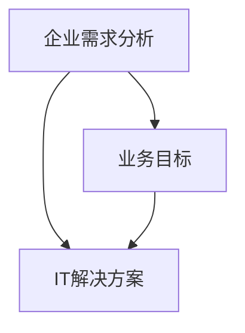

**核心算法原理讲解**：需求分析算法主要包括需求识别和需求排序。需求识别是发现业务痛点，需求排序是确定需求优先级。

**数学模型和公式**：无特定公式，但可以通过优先级评分模型进行量化分析。

**详细讲解与举例说明**：例如，一家制造企业需要提高生产效率，通过需求分析发现，优化生产流程是首要需求。

##### 1.2 企业需求的分类

**背景介绍**：企业需求可以分为功能需求和非功能需求。

**核心概念与联系**：功能需求是软件应实现的具体功能，非功能需求是软件性能、安全性等方面的要求。关系架构图如下：

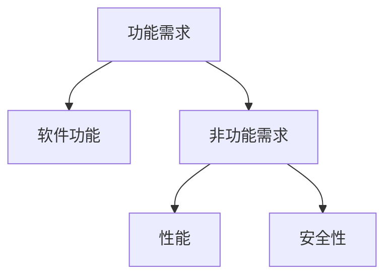

**核心算法原理讲解**：无特定算法，但可以通过需求分类模板进行分类。

**详细讲解与举例说明**：例如，一家电商企业需要提高网站响应速度，这属于非功能需求。

##### 1.3 企业需求的收集方法

**背景介绍**：有效的需求收集是需求分析的基础。

**核心概念与联系**：需求收集方法包括问卷调查、访谈、观察等。关系架构图如下：

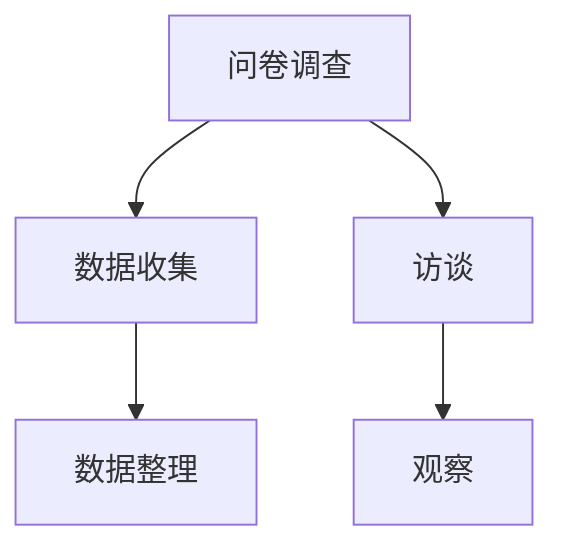

**核心算法原理讲解**：无特定算法，但可以通过数据整理方法进行数据清洗和分类。

**详细讲解与举例说明**：例如，通过问卷调查收集用户对电商平台的功能需求。

**注意事项**：需求收集时需确保数据的真实性和有效性。

##### 1.4 需求优先级排序

**背景介绍**：需求优先级排序是需求分析的重要环节。

**核心概念与联系**：优先级排序可以通过优先级评分模型进行，模型如下：

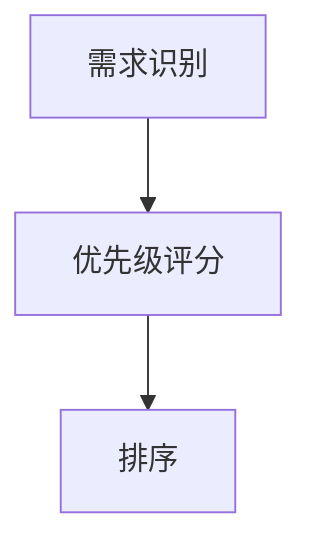

**核心算法原理讲解**：评分模型可以通过专家评分、工作量估算等方法进行。

**详细讲解与举例说明**：例如，通过专家评分确定需求优先级。

**注意事项**：需求优先级排序需结合业务目标和资源限制。

#### 第2章：客户访谈与调研

##### 2.1 客户访谈的技巧

**背景介绍**：客户访谈是了解企业需求的重要方法。

**核心概念与联系**：客户访谈技巧包括问题设计、倾听和反馈等。关系架构图如下：

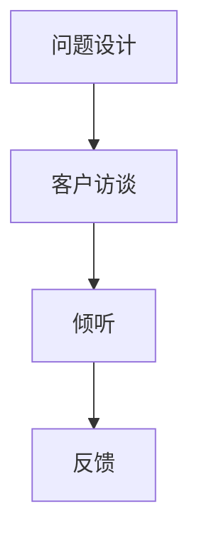

**核心算法原理讲解**：无特定算法，但可以通过访谈指南进行指导。

**详细讲解与举例说明**：例如，通过开放式问题了解客户需求。

**注意事项**：访谈时需注意沟通技巧，确保信息准确传达。

##### 2.2 调研方法的多样化

**背景介绍**：调研方法多样化为深入了解企业需求提供支持。

**核心概念与联系**：调研方法包括问卷调查、访谈、观察等。关系架构图如下：

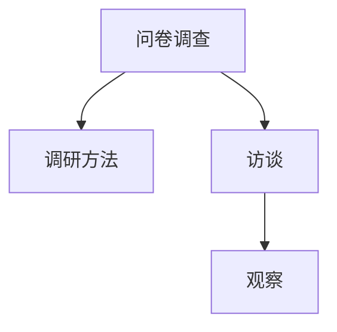

**核心算法原理讲解**：无特定算法，但可以通过数据整理方法进行数据清洗和分类。

**详细讲解与举例说明**：例如，通过问卷调查收集用户对电商平台的功能需求。

**注意事项**：选择合适的调研方法，确保调研数据的有效性。

##### 2.3 调研数据的有效性分析

**背景介绍**：调研数据的有效性直接影响需求分析的质量。

**核心概念与联系**：数据有效性分析包括数据完整性、准确性和一致性。关系架构图如下：

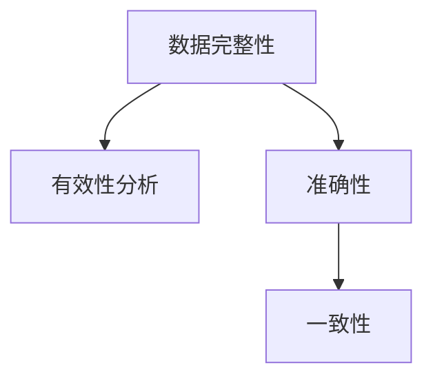

**核心算法原理讲解**：数据有效性分析可以通过数据清洗、验证等方法进行。

**详细讲解与举例说明**：例如，通过数据清洗去除无效数据。

**注意事项**：确保调研数据的有效性，为需求分析提供可靠依据。

#### 第3章：需求分析框架

##### 3.1 功能需求分析

**背景介绍**：功能需求分析是需求分析的核心。

**核心概念与联系**：功能需求分析包括需求识别、需求描述和需求验证。关系架构图如下：

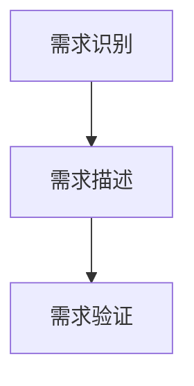

**核心算法原理讲解**：需求识别可以通过用户故事地图、需求文档编写等方法进行。

**详细讲解与举例说明**：例如，通过用户故事地图识别电商平台的购物流程需求。

**注意事项**：确保功能需求描述的清晰和准确。

##### 3.2 非功能需求分析

**背景介绍**：非功能需求分析是需求分析的重要组成部分。

**核心概念与联系**：非功能需求分析包括性能、安全性、可用性等。关系架构图如下：

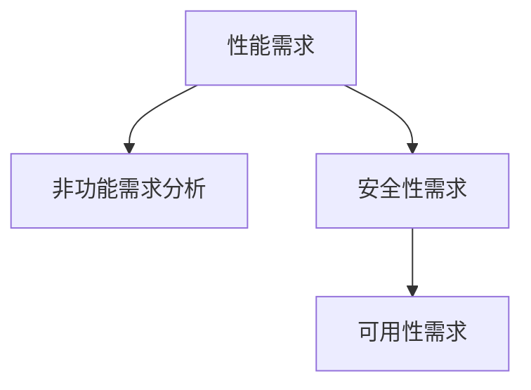

**核心算法原理讲解**：无特定算法，但可以通过非功能需求模板进行描述。

**详细讲解与举例说明**：例如，通过安全性需求模板描述电商平台的安全要求。

**注意事项**：确保非功能需求分析全面、准确。

##### 3.3 需求优先级排序

**背景介绍**：需求优先级排序是需求分析的重要环节。

**核心概念与联系**：需求优先级排序可以通过优先级评分模型进行。关系架构图如下：


**核心算法原理讲解**：评分模型可以通过专家评分、工作量估算等方法进行。

**详细讲解与举例说明**：例如，通过专家评分确定需求优先级。

**注意事项**：需求优先级排序需结合业务目标和资源限制。

#### 第4章：需求文档编写与评审

##### 4.1 需求文档的结构与内容

**背景介绍**：需求文档是需求分析的结果，也是解决方案设计的基础。

**核心概念与联系**：需求文档包括概述、功能需求、非功能需求、需求验证等部分。关系架构图如下：

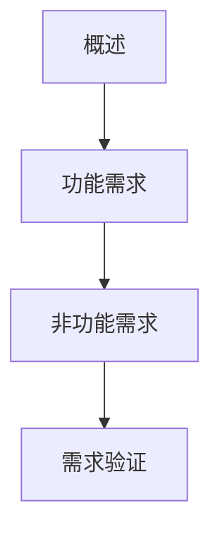

**核心算法原理讲解**：无特定算法，但可以通过需求文档模板进行编写。

**详细讲解与举例说明**：例如，通过需求文档模板编写电商平台的用户需求。

**注意事项**：确保需求文档的清晰、完整和准确。

##### 4.2 需求文档的评审流程

**背景介绍**：需求文档评审是确保需求质量的重要环节。

**核心概念与联系**：需求文档评审包括内部评审和客户评审。关系架构图如下：

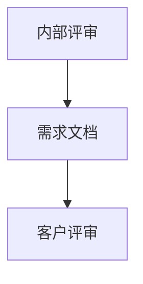

**核心算法原理讲解**：无特定算法，但可以通过评审流程模板进行。

**详细讲解与举例说明**：例如，通过内部评审发现并修正需求文档中的错误。

**注意事项**：评审过程中需注意沟通和协调。

##### 4.3 需求变更管理

**背景介绍**：需求变更在项目实施过程中是不可避免的。

**核心概念与联系**：需求变更管理包括变更请求、变更评估和变更实施。关系架构图如下：

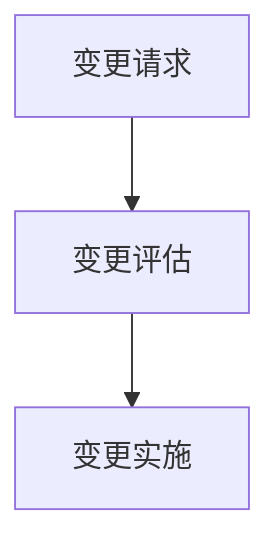

**核心算法原理讲解**：变更评估可以通过影响分析和成本效益分析进行。

**详细讲解与举例说明**：例如，通过影响分析确定变更对项目的影响。

**注意事项**：需求变更管理需确保变更的及时性和合理性。

#### 第5章：跨部门协作与沟通

##### 5.1 跨部门协作的重要性

**背景介绍**：跨部门协作是项目成功的关键。

**核心概念与联系**：跨部门协作包括项目团队内部和与外部合作伙伴的沟通。关系架构图如下：

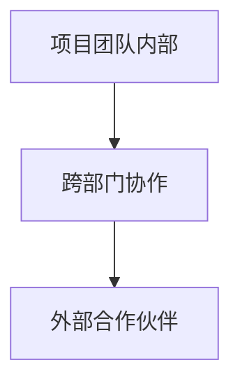

**核心算法原理讲解**：无特定算法，但可以通过协作框架进行。

**详细讲解与举例说明**：例如，通过协作框架提高项目团队的沟通效率。

**注意事项**：跨部门协作需注重沟通和协调。

##### 5.2 沟通技巧提升

**背景介绍**：提升沟通技巧是跨部门协作的重要一环。

**核心概念与联系**：沟通技巧包括倾听、表达和反馈等。关系架构图如下：

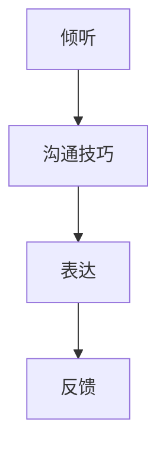

**核心算法原理讲解**：无特定算法，但可以通过沟通技巧培训进行。

**详细讲解与举例说明**：例如，通过倾听技巧提高会议效果。

**注意事项**：沟通技巧提升需注重实践和反思。

##### 5.3 案例分析：跨部门协作的挑战与解决方案

**背景介绍**：跨部门协作中常面临各种挑战。

**核心概念与联系**：挑战包括沟通不畅、资源冲突等，解决方案包括建立协作机制和明确职责。关系架构图如下：

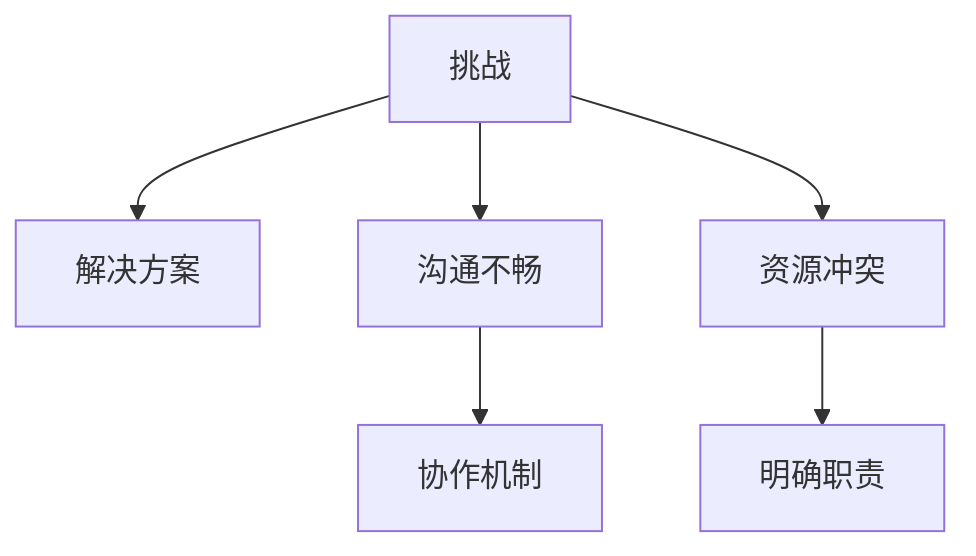

**核心算法原理讲解**：无特定算法，但可以通过协作机制和职责明确模板进行。

**详细讲解与举例说明**：例如，通过协作机制解决项目进度延误问题。

**注意事项**：案例分析需结合实际情况进行。

## 第二部分：解决方案设计与开发

### 第6章：解决方案设计方法论

##### 6.1 设计思路的确定

**背景介绍**：设计思路的确定是解决方案设计的第一步。

**核心概念与联系**：设计思路包括需求分析、问题定义、目标设定等。关系架构图如下：

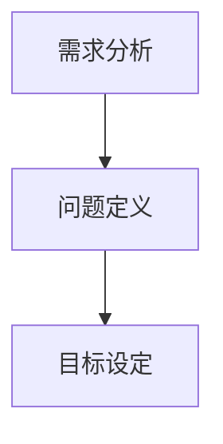

**核心算法原理讲解**：无特定算法，但可以通过需求分析模型和问题定义框架进行。

**详细讲解与举例说明**：例如，通过需求分析模型确定电商平台的用户需求。

**注意事项**：设计思路需结合企业实际情况进行。

##### 6.2 设计原则的遵循

**背景介绍**：设计原则是确保解决方案有效性和可维护性的关键。

**核心概念与联系**：设计原则包括模块化、可扩展性、高内聚和低耦合等。关系架构图如下：

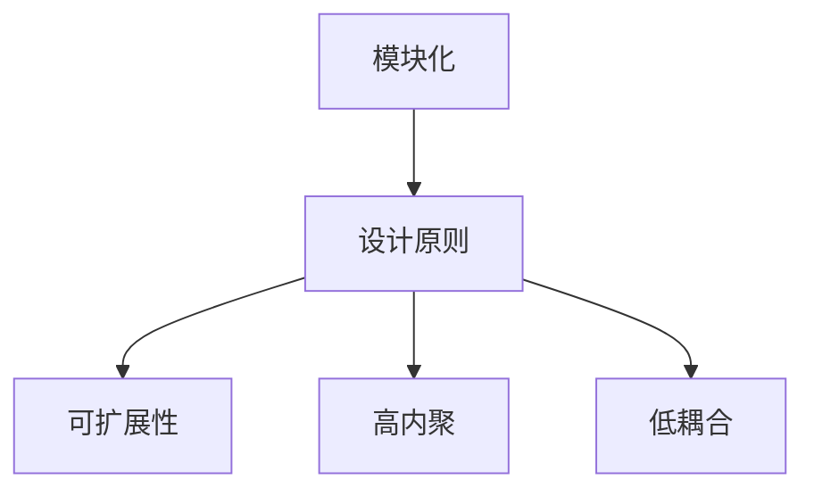

**核心算法原理讲解**：无特定算法，但可以通过设计原则模板进行遵循。

**详细讲解与举例说明**：例如，通过模块化设计提高电商平台的可维护性。

**注意事项**：设计原则需灵活运用，确保解决方案的优化。

##### 6.3 设计阶段的输出

**背景介绍**：设计阶段的输出是解决方案设计的重要成果。

**核心概念与联系**：设计阶段的输出包括系统架构图、模块设计文档、接口设计文档等。关系架构图如下：

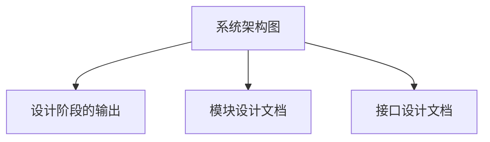

**核心算法原理讲解**：无特定算法，但可以通过设计文档模板进行编写。

**详细讲解与举例说明**：例如，通过系统架构图明确电商平台的整体架构。

**注意事项**：设计输出需确保清晰、完整和准确。

### 第7章：技术选型与架构设计

##### 7.1 技术选型的策略

**背景介绍**：技术选型是确保解决方案技术可行性的关键。

**核心概念与联系**：技术选型策略包括技术评估、市场需求分析和团队技能评估。关系架构图如下：

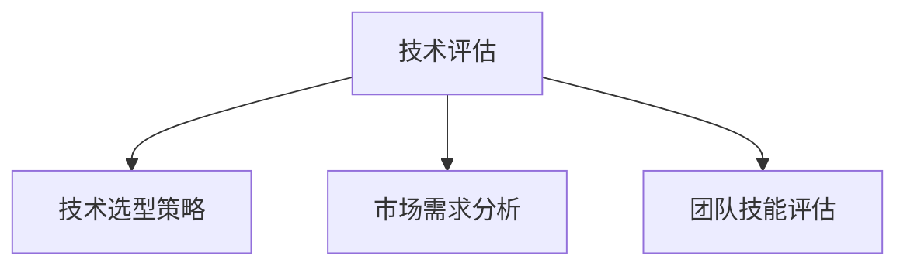

**核心算法原理讲解**：无特定算法，但可以通过技术评估模型和市场需求分析框架进行。

**详细讲解与举例说明**：例如，通过技术评估模型选择适合电商平台的数据库技术。

**注意事项**：技术选型需结合实际需求和团队技能进行。

##### 7.2 架构设计的原则

**背景介绍**：架构设计是确保解决方案性能和可扩展性的关键。

**核心概念与联系**：架构设计原则包括模块化、高内聚、低耦合、高可用性和高扩展性等。关系架构图如下：

```mermaid
graph TD
A[模块化] --> B[架构设计原则]
B --> C[高内聚]
B --> D[低耦合]
B --> E[高可用性]
B --> F[高扩展性]
```

**核心算法原理讲解**：无特定算法，但可以通过架构设计原则模板进行遵循。

**详细讲解与举例说明**：例如，通过模块化设计提高电商平台的可维护性。

**注意事项**：架构设计原则需灵活运用，确保解决方案的优化。

##### 7.3 常见架构模式介绍

**背景介绍**：常见架构模式是解决特定问题的有效方法。

**核心概念与联系**：常见架构模式包括单体架构、微服务架构、分布式架构等。关系架构图如下：

```mermaid
graph TD
A[单体架构] --> B[常见架构模式]
B --> C[微服务架构]
B --> D[分布式架构]
```

**核心算法原理讲解**：无特定算法，但可以通过架构模式对比分析进行。

**详细讲解与举例说明**：例如，通过微服务架构解决电商平台的可扩展性问题。

**注意事项**：常见架构模式需结合实际情况进行选择。

### 第8章：系统开发流程

##### 8.1 开发流程的标准化

**背景介绍**：开发流程的标准化是确保项目进度和质量的关键。

**核心概念与联系**：开发流程包括需求分析、设计、编码、测试等阶段。关系架构图如下：

```mermaid
graph TD
A[需求分析] --> B[设计]
B --> C[编码]
C --> D[测试]
```

**核心算法原理讲解**：无特定算法，但可以通过开发流程模板进行标准化。

**详细讲解与举例说明**：例如，通过开发流程模板确保电商平台的开发进度。

**注意事项**：开发流程需根据项目特点进行灵活调整。

##### 8.2 版本控制与文档管理

**背景介绍**：版本控制和文档管理是确保代码质量和文档完整性的关键。

**核心概念与联系**：版本控制和文档管理包括版本管理工具和文档编写规范。关系架构图如下：

```mermaid
graph TD
A[版本管理工具] --> B[版本控制]
B --> C[文档编写规范]
C --> D[文档管理]
```

**核心算法原理讲解**：无特定算法，但可以通过版本控制工具和文档编写规范模板进行。

**详细讲解与举例说明**：例如，通过Git进行版本控制和Markdown编写文档。

**注意事项**：版本控制和文档管理需确保代码和文档的一致性。

##### 8.3 开发过程中的质量保证

**背景介绍**：质量保证是确保系统稳定性和可靠性的关键。

**核心概念与联系**：质量保证包括代码审查、测试和持续集成。关系架构图如下：

```mermaid
graph TD
A[代码审查] --> B[质量保证]
B --> C[测试]
C --> D[持续集成]
```

**核心算法原理讲解**：无特定算法，但可以通过质量保证流程模板进行。

**详细讲解与举例说明**：例如，通过代码审查和自动化测试确保代码质量。

**注意事项**：质量保证需贯穿整个开发过程。

### 第9章：开发团队协作

##### 9.1 团队合作的挑战

**背景介绍**：团队合作是项目成功的关键，但也面临诸多挑战。

**核心概念与联系**：团队合作挑战包括沟通障碍、任务分工不均、团队冲突等。关系架构图如下：

```mermaid
graph TD
A[沟通障碍] --> B[团队合作挑战]
A --> C[任务分工不均]
C --> D[团队冲突]
```

**核心算法原理讲解**：无特定算法，但可以通过团队合作模型和沟通技巧进行解决。

**详细讲解与举例说明**：例如，通过改进沟通方式解决团队合作中的沟通障碍。

**注意事项**：团队合作挑战需注重沟通和协调。

##### 9.2 团队协作工具的使用

**背景介绍**：团队协作工具是提高团队协作效率的重要手段。

**核心概念与联系**：团队协作工具包括项目管理工具、即时通讯工具、版本控制工具等。关系架构图如下：

```mermaid
graph TD
A[项目管理工具] --> B[团队协作工具]
A --> C[即时通讯工具]
A --> D[版本控制工具]
```

**核心算法原理讲解**：无特定算法，但可以通过工具选型和集成方法进行。

**详细讲解与举例说明**：例如，通过JIRA进行项目管理，通过Slack进行即时通讯。

**注意事项**：选择合适的团队协作工具，确保工具的高效使用。

##### 9.3 团队协作的激励机制

**背景介绍**：激励机制是提高团队协作积极性和效率的重要手段。

**核心概念与联系**：激励机制包括奖励制度、团队建设活动、工作氛围营造等。关系架构图如下：

```mermaid
graph TD
A[奖励制度] --> B[激励机制]
A --> C[团队建设活动]
A --> D[工作氛围营造]
```

**核心算法原理讲解**：无特定算法，但可以通过激励机制模型和团队建设活动规划进行。

**详细讲解与举例说明**：例如，通过奖励制度激励团队成员达成目标。

**注意事项**：激励机制需结合团队特点和实际需求进行。

### 第10章：系统测试与优化

##### 10.1 测试策略的制定

**背景介绍**：测试策略的制定是确保系统质量和可靠性的关键。

**核心概念与联系**：测试策略包括测试目标、测试方法、测试工具等。关系架构图如下：

```mermaid
graph TD
A[测试目标] --> B[测试策略]
A --> C[测试方法]
A --> D[测试工具]
```

**核心算法原理讲解**：无特定算法，但可以通过测试策略模板进行制定。

**详细讲解与举例说明**：例如，通过黑盒测试和自动化测试方法确保系统功能正确性。

**注意事项**：测试策略需结合项目特点和需求进行。

##### 10.2 测试用例的设计

**背景介绍**：测试用例的设计是测试实施的重要环节。

**核心概念与联系**：测试用例包括功能测试用例、性能测试用例、安全测试用例等。关系架构图如下：

```mermaid
graph TD
A[功能测试用例] --> B[测试用例设计]
A --> C[性能测试用例]
A --> D[安全测试用例]
```

**核心算法原理讲解**：无特定算法，但可以通过测试用例模板进行设计。

**详细讲解与举例说明**：例如，通过功能测试用例验证电商平台的购物流程。

**注意事项**：测试用例需覆盖所有功能点和异常情况。

##### 10.3 测试结果分析与优化

**背景介绍**：测试结果分析与优化是确保系统质量的重要环节。

**核心概念与联系**：测试结果分析包括缺陷分析、性能分析、用户体验分析等。关系架构图如下：

```mermaid
graph TD
A[缺陷分析] --> B[测试结果分析]
A --> C[性能分析]
A --> D[用户体验分析]
```

**核心算法原理讲解**：无特定算法，但可以通过数据分析方法和优化策略进行。

**详细讲解与举例说明**：例如，通过性能分析优化电商平台的响应速度。

**注意事项**：测试结果分析与优化需持续进行，确保系统持续改进。

## 第三部分：解决方案实施与优化

### 第11章：解决方案实施策略

##### 11.1 实施计划的制定

**背景介绍**：实施计划的制定是确保解决方案顺利实施的关键。

**核心概念与联系**：实施计划包括项目进度安排、资源分配、风险评估等。关系架构图如下：

```mermaid
graph TD
A[项目进度安排] --> B[实施计划]
A --> C[资源分配]
A --> D[风险评估]
```

**核心算法原理讲解**：无特定算法，但可以通过项目进度管理方法和风险评估模型进行。

**详细讲解与举例说明**：例如，通过甘特图制定项目进度安排。

**注意事项**：实施计划需结合项目特点和资源情况进行制定。

##### 11.2 风险管理的策略

**背景介绍**：风险管理是确保项目顺利进行的重要手段。

**核心概念与联系**：风险管理包括风险识别、风险评估、风险应对等。关系架构图如下：

```mermaid
graph TD
A[风险识别] --> B[风险管理]
A --> C[风险评估]
A --> D[风险应对]
```

**核心算法原理讲解**：无特定算法，但可以通过风险识别方法和风险评估模型进行。

**详细讲解与举例说明**：例如，通过SWOT分析进行风险评估。

**注意事项**：风险管理需贯穿整个项目实施过程。

##### 11.3 实施中的变更管理

**背景介绍**：变更管理是确保项目实施过程中需求变更得到有效控制的重要手段。

**核心概念与联系**：变更管理包括变更请求、变更评估、变更实施等。关系架构图如下：

```mermaid
graph TD
A[变更请求] --> B[变更管理]
A --> C[变更评估]
A --> D[变更实施]
```

**核心算法原理讲解**：无特定算法，但可以通过变更管理流程模板进行。

**详细讲解与举例说明**：例如，通过变更评估模型确定变更对项目的影响。

**注意事项**：变更管理需确保变更的及时性和合理性。

### 第12章：解决方案交付与部署

##### 12.1 交付物的准备

**背景介绍**：交付物的准备是确保解决方案顺利交付的重要环节。

**核心概念与联系**：交付物包括软件产品、用户手册、安装指南等。关系架构图如下：

```mermaid
graph TD
A[软件产品] --> B[交付物]
A --> C[用户手册]
A --> D[安装指南]
```

**核心算法原理讲解**：无特定算法，但可以通过交付物准备模板进行。

**详细讲解与举例说明**：例如，通过用户手册详细介绍电商平台的操作流程。

**注意事项**：交付物需确保清晰、准确和完整。

##### 12.2 部署流程的优化

**背景介绍**：部署流程的优化是确保解决方案顺利部署的关键。

**核心概念与联系**：部署流程包括环境准备、软件安装、配置调整等。关系架构图如下：

```mermaid
graph TD
A[环境准备] --> B[部署流程]
A --> C[软件安装]
A --> D[配置调整]
```

**核心算法原理讲解**：无特定算法，但可以通过部署流程模板进行优化。

**详细讲解与举例说明**：例如，通过自动化部署工具优化部署流程。

**注意事项**：部署流程需确保高效、稳定和安全。

##### 12.3 部署后的支持与维护

**背景介绍**：部署后的支持与维护是确保解决方案长期稳定运行的重要环节。

**核心概念与联系**：支持与维护包括问题响应、性能监控、系统升级等。关系架构图如下：

```mermaid
graph TD
A[问题响应] --> B[部署后的支持与维护]
A --> C[性能监控]
A --> D[系统升级]
```

**核心算法原理讲解**：无特定算法，但可以通过支持与维护流程模板进行。

**详细讲解与举例说明**：例如，通过性能监控工具监测电商平台运行状态。

**注意事项**：支持与维护需确保及时响应和持续优化。

### 第13章：客户反馈与持续优化

##### 13.1 客户反馈的收集

**背景介绍**：客户反馈是优化解决方案的重要依据。

**核心概念与联系**：客户反馈包括功能评价、性能评价、用户体验评价等。关系架构图如下：

```mermaid
graph TD
A[功能评价] --> B[客户反馈]
A --> C[性能评价]
A --> D[用户体验评价]
```

**核心算法原理讲解**：无特定算法，但可以通过问卷调查和访谈方法进行。

**详细讲解与举例说明**：例如，通过问卷调查收集用户对电商平台的评价。

**注意事项**：客户反馈需确保真实、有效和全面。

##### 13.2 优化策略的制定

**背景介绍**：优化策略的制定是持续提升解决方案价值的关键。

**核心概念与联系**：优化策略包括功能优化、性能优化、用户体验优化等。关系架构图如下：

```mermaid
graph TD
A[功能优化] --> B[优化策略]
A --> C[性能优化]
A --> D[用户体验优化]
```

**核心算法原理讲解**：无特定算法，但可以通过优化策略模板进行制定。

**详细讲解与举例说明**：例如，通过性能优化提升电商平台的响应速度。

**注意事项**：优化策略需结合客户反馈和项目实际情况进行制定。

##### 13.3 优化案例分享

**背景介绍**：优化案例分享是推广最佳实践的重要手段。

**核心概念与联系**：优化案例包括功能优化案例、性能优化案例、用户体验优化案例等。关系架构图如下：

```mermaid
graph TD
A[功能优化案例] --> B[优化案例分享]
A --> C[性能优化案例]
A --> D[用户体验优化案例]
```

**核心算法原理讲解**：无特定算法，但可以通过优化案例模板进行分享。

**详细讲解与举例说明**：例如，通过性能优化案例介绍如何提升电商平台的服务器性能。

**注意事项**：优化案例需注重实用性和可操作性。

### 第14章：案例分析

##### 14.1 案例一：定制化电商平台的构建

**背景介绍**：本案例旨在通过实际案例展示如何为企业客户构建定制化电商平台。

**核心概念与联系**：定制化电商平台包括功能需求分析、技术选型、系统开发、测试与优化等环节。关系架构图如下：

```mermaid
graph TD
A[功能需求分析] --> B[技术选型]
B --> C[系统开发]
C --> D[测试与优化]
```

**核心算法原理讲解**：无特定算法，但可以通过需求分析模型、技术选型方法和系统开发流程进行。

**详细讲解与举例说明**：例如，通过需求分析确定电商平台的用户需求，通过技术选型选择适合的数据库和开发框架。

**注意事项**：本案例需注重实际操作和效果展示。

##### 14.2 案例二：企业内部管理系统优化

**背景介绍**：本案例旨在通过实际案例展示如何为企业客户优化内部管理系统。

**核心概念与联系**：企业内部管理系统优化包括需求分析、架构设计、系统开发、性能优化等环节。关系架构图如下：

```mermaid
graph TD
A[需求分析] --> B[架构设计]
B --> C[系统开发]
C --> D[性能优化]
```

**核心算法原理讲解**：无特定算法，但可以通过需求分析模型、架构设计原则和方法、系统开发流程进行。

**详细讲解与举例说明**：例如，通过需求分析确定内部管理系统的优化需求，通过架构设计优化系统的性能。

**注意事项**：本案例需注重实际效果和业务价值。

##### 14.3 案例三：智能客服系统的实现

**背景介绍**：本案例旨在通过实际案例展示如何为企业客户实现智能客服系统。

**核心概念与联系**：智能客服系统包括需求分析、系统设计、开发实现、测试与优化等环节。关系架构图如下：

```mermaid
graph TD
A[需求分析] --> B[系统设计]
B --> C[开发实现]
C --> D[测试与优化]
```

**核心算法原理讲解**：无特定算法，但可以通过需求分析模型、系统设计原则和方法、开发实现流程进行。

**详细讲解与举例说明**：例如，通过需求分析确定智能客服系统的功能需求，通过系统设计实现智能对话功能。

**注意事项**：本案例需注重实际效果和用户体验。

### 附录

#### 附录A：定制化解决方案设计工具与方法

**A.1 常用工具介绍**

**背景介绍**：介绍常用的定制化解决方案设计工具和方法。

**核心概念与联系**：包括需求分析工具、设计工具、开发工具等。关系架构图如下：

```mermaid
graph TD
A[需求分析工具] --> B[设计工具]
B --> C[开发工具]
```

**核心算法原理讲解**：无特定算法，但可以通过工具选型和集成方法进行。

**详细讲解与举例说明**：例如，介绍Axure作为需求分析工具，Sketch作为设计工具，以及Visual Studio Code作为开发工具。

**注意事项**：选择合适的工具，确保设计流程的高效和准确。

#### A.2 方法论的应用

**背景介绍**：方法论是确保定制化解决方案设计系统化和标准化的关键。

**核心概念与联系**：包括敏捷开发方法、迭代开发方法等。关系架构图如下：

```mermaid
graph TD
A[敏捷开发方法] --> B[方法论]
A --> C[迭代开发方法]
```

**核心算法原理讲解**：无特定算法，但可以通过方法论框架和流程进行。

**详细讲解与举例说明**：例如，通过敏捷开发方法实现快速需求迭代和系统优化。

**注意事项**：方法论需结合项目特点和需求进行灵活应用。

#### 附录B：参考文献与推荐阅读

**B.1 相关书籍推荐**

**背景介绍**：推荐一些经典的定制化解决方案设计相关书籍。

**核心概念与联系**：包括需求分析、系统设计、项目管理等领域的书籍。关系架构图如下：

```mermaid
graph TD
A[需求分析书籍] --> B[系统设计书籍]
B --> C[项目管理书籍]
```

**核心算法原理讲解**：无特定算法，但可以通过书籍内容和读者评价进行选择。

**详细讲解与举例说明**：例如，推荐《需求分析技术》和《软件架构设计》等书籍。

**注意事项**：选择适合自己水平和需求的书籍进行阅读。

#### B.2 学术论文精选

**背景介绍**：精选一些与定制化解决方案设计相关的学术论文。

**核心概念与联系**：包括需求工程、软件架构、敏捷开发等领域的论文。关系架构图如下：

```mermaid
graph TD
A[需求工程论文] --> B[软件架构论文]
B --> C[敏捷开发论文]
```

**核心算法原理讲解**：无特定算法，但可以通过论文主题和研究方法进行选择。

**详细讲解与举例说明**：例如，推荐《需求工程中的用户故事》和《敏捷开发的实践研究》等论文。

**注意事项**：阅读论文时注重论文的研究方法和结论。

#### B.3 行业报告参考

**背景介绍**：参考一些与定制化解决方案设计相关的行业报告。

**核心概念与联系**：包括市场需求、技术趋势、行业应用等领域的报告。关系架构图如下：

```mermaid
graph TD
A[市场需求报告] --> B[技术趋势报告]
B --> C[行业应用报告]
```

**核心算法原理讲解**：无特定算法，但可以通过报告内容和行业趋势进行选择。

**详细讲解与举例说明**：例如，参考《2022年中国定制化解决方案市场分析报告》和《2023年全球人工智能行业发展趋势报告》等报告。

**注意事项**：行业报告可帮助了解市场动态和行业趋势，为定制化解决方案设计提供参考。

## 完整文章

### 引言

在当今信息化和数字化时代，企业面临着前所未有的竞争压力和变革机遇。为了在市场中脱颖而出，企业客户越来越依赖于定制化解决方案来满足其独特的业务需求。定制化解决方案不仅能够提升企业的运营效率，还能为企业带来独特的竞争优势。然而，如何为企业客户提供有效的定制化解决方案，成为IT专业人士和企业管理者共同面临的挑战。

本文旨在深入探讨如何为企业客户提供定制化解决方案的全过程。通过系统的需求分析、精心的解决方案设计与开发、高效的实施与持续优化，本文将为企业客户提供一套实用的操作指南。文章分为三个主要部分：第一部分将探讨企业需求分析的重要性及方法；第二部分将阐述解决方案的设计与开发过程；第三部分则关注解决方案的实施与持续优化。通过逻辑清晰、步骤明确的分析推理，本文旨在为读者提供全面的定制化解决方案提供指导。

### 第一部分：企业需求分析

#### 第1章：企业需求概述

在企业信息化和数字化转型过程中，需求分析是至关重要的环节。企业需求分析不仅仅是识别业务需求和痛点，更是连接业务目标和IT解决方案的桥梁。本章将概述企业需求分析的重要性，详细探讨企业需求的分类以及如何进行有效需求收集。

##### 1.1 企业需求分析的重要性

企业需求分析是信息化建设的起点，它直接影响项目的成功与否。通过需求分析，企业可以明确自身的业务目标和需求，确保IT解决方案能够真正满足企业的实际需求，从而提高项目的价值和成功率。

**核心概念与联系**：需求分析是企业与IT解决方案之间的桥梁，关系架构图如下：

```mermaid
graph TD
A[企业需求分析] --> B[业务目标]
A --> C[IT解决方案]
B --> C
```

**核心算法原理讲解**：需求分析算法主要包括需求识别和需求排序。需求识别是发现业务痛点，需求排序是确定需求优先级。

**详细讲解与举例说明**：例如，一家制造企业需要提高生产效率，通过需求分析发现，优化生产流程是首要需求。

**注意事项**：需求分析需结合企业实际情况和业务目标进行。

##### 1.2 企业需求的分类

企业需求可以分为功能需求和非功能需求。功能需求是指软件应实现的具体功能，例如电商平台中的购物流程、支付功能等。而非功能需求则是指软件的性能、安全性、可靠性等方面的要求，例如系统的响应时间、数据的安全性等。

**核心概念与联系**：功能需求是软件应实现的具体功能，非功能需求是软件性能、安全性等方面的要求。关系架构图如下：

```mermaid
graph TD
A[功能需求] --> B[软件功能]
A --> C[非功能需求]
C --> D[性能]
C --> E[安全性]
```

**核心算法原理讲解**：无特定算法，但可以通过需求分类模板进行分类。

**详细讲解与举例说明**：例如，一家电商企业需要提高网站响应速度，这属于非功能需求。

**注意事项**：在需求分析过程中，需全面考虑功能需求和非功能需求，确保需求的完整性和准确性。

##### 1.3 企业需求的收集方法

有效收集企业需求是需求分析的基础。需求收集方法包括问卷调查、访谈、观察等，这些方法各有优劣，适用于不同类型的需求收集场景。

**核心概念与联系**：需求收集方法包括问卷调查、访谈、观察等。关系架构图如下：

```mermaid
graph TD
A[问卷调查] --> B[数据收集]
A --> C[访谈]
C --> D[观察]
B --> E[数据整理]
```

**核心算法原理讲解**：无特定算法，但可以通过数据整理方法进行数据清洗和分类。

**详细讲解与举例说明**：例如，通过问卷调查收集用户对电商平台的功能需求。

**注意事项**：需求收集时需确保数据的真实性和有效性。

#### 第2章：客户访谈与调研

##### 2.1 客户访谈的技巧

客户访谈是了解企业需求的重要方法。通过有效访谈，可以深入了解客户的业务流程、痛点需求，为需求分析提供可靠依据。

**核心概念与联系**：客户访谈技巧包括问题设计、倾听和反馈等。关系架构图如下：

```mermaid
graph TD
A[问题设计] --> B[客户访谈]
B --> C[倾听]
C --> D[反馈]
```

**核心算法原理讲解**：无特定算法，但可以通过访谈指南进行指导。

**详细讲解与举例说明**：例如，通过开放式问题了解客户需求。

**注意事项**：访谈时需注意沟通技巧，确保信息准确传达。

##### 2.2 调研方法的多样化

调研方法多样化是为了更全面、更深入地了解企业需求。问卷调查、访谈、观察等方法各有特点，适用于不同类型的调研场景。

**核心概念与联系**：调研方法包括问卷调查、访谈、观察等。关系架构图如下：

```mermaid
graph TD
A[问卷调查] --> B[调研方法]
A --> C[访谈]
C --> D[观察]
```

**核心算法原理讲解**：无特定算法，但可以通过数据整理方法进行数据清洗和分类。

**详细讲解与举例说明**：例如，通过问卷调查收集用户对电商平台的功能需求。

**注意事项**：选择合适的调研方法，确保调研数据的有效性。

##### 2.3 调研数据的有效性分析

调研数据的有效性直接影响需求分析的质量。因此，对调研数据进行分析和验证是需求分析的重要环节。

**核心概念与联系**：数据有效性分析包括数据完整性、准确性和一致性。关系架构图如下：

```mermaid
graph TD
A[数据完整性] --> B[有效性分析]
A --> C[准确性]
C --> D[一致性]
```

**核心算法原理讲解**：数据有效性分析可以通过数据清洗、验证等方法进行。

**详细讲解与举例说明**：例如，通过数据清洗去除无效数据。

**注意事项**：确保调研数据的有效性，为需求分析提供可靠依据。

#### 第3章：需求分析框架

##### 3.1 功能需求分析

功能需求分析是需求分析的核心环节，它包括需求识别、需求描述和需求验证等步骤。

**核心概念与联系**：功能需求分析包括需求识别、需求描述和需求验证。关系架构图如下：

```mermaid
graph TD
A[需求识别] --> B[需求描述]
B --> C[需求验证]
```

**核心算法原理讲解**：需求识别可以通过用户故事地图、需求文档编写等方法进行。

**详细讲解与举例说明**：例如，通过用户故事地图识别电商平台的购物流程需求。

**注意事项**：确保功能需求描述的清晰和准确。

##### 3.2 非功能需求分析

非功能需求分析是需求分析的重要组成部分，它包括性能、安全性、可用性等方面的需求。

**核心概念与联系**：非功能需求分析包括性能、安全性、可用性等。关系架构图如下：

```mermaid
graph TD
A[性能需求] --> B[非功能需求分析]
A --> C[安全性需求]
C --> D[可用性需求]
```

**核心算法原理讲解**：无特定算法，但可以通过非功能需求模板进行描述。

**详细讲解与举例说明**：例如，通过安全性需求模板描述电商平台的安全要求。

**注意事项**：确保非功能需求分析全面、准确。

##### 3.3 需求优先级排序

需求优先级排序是需求分析的重要环节，它有助于确定哪些需求优先满足，以确保项目能够按计划推进。

**核心概念与联系**：需求优先级排序可以通过优先级评分模型进行。关系架构图如下：

```mermaid
graph TD
A[需求识别] --> B[优先级评分]
B --> C[排序]
```

**核心算法原理讲解**：评分模型可以通过专家评分、工作量估算等方法进行。

**详细讲解与举例说明**：例如，通过专家评分确定需求优先级。

**注意事项**：需求优先级排序需结合业务目标和资源限制。

#### 第4章：需求文档编写与评审

##### 4.1 需求文档的结构与内容

需求文档是需求分析的结果，也是解决方案设计的基础。一个完整的需求文档应包括概述、功能需求、非功能需求、需求验证等部分。

**核心概念与联系**：需求文档包括概述、功能需求、非功能需求、需求验证等部分。关系架构图如下：

```mermaid
graph TD
A[概述] --> B[功能需求]
B --> C[非功能需求]
C --> D[需求验证]
```

**核心算法原理讲解**：无特定算法，但可以通过需求文档模板进行编写。

**详细讲解与举例说明**：例如，通过需求文档模板编写电商平台的用户需求。

**注意事项**：确保需求文档的清晰、完整和准确。

##### 4.2 需求文档的评审流程

需求文档评审是确保需求质量的重要环节。评审流程包括内部评审和客户评审，通过评审发现并修正需求文档中的错误。

**核心概念与联系**：需求文档评审包括内部评审和客户评审。关系架构图如下：

```mermaid
graph TD
A[内部评审] --> B[需求文档]
B --> C[客户评审]
```

**核心算法原理讲解**：无特定算法，但可以通过评审流程模板进行。

**详细讲解与举例说明**：例如，通过内部评审发现并修正需求文档中的错误。

**注意事项**：评审过程中需注意沟通和协调。

##### 4.3 需求变更管理

需求变更在项目实施过程中是不可避免的。需求变更管理包括变更请求、变更评估和变更实施等步骤，以确保变更的及时性和合理性。

**核心概念与联系**：需求变更管理包括变更请求、变更评估和变更实施。关系架构图如下：

```mermaid
graph TD
A[变更请求] --> B[变更评估]
B --> C[变更实施]
```

**核心算法原理讲解**：变更评估可以通过影响分析和成本效益分析进行。

**详细讲解与举例说明**：例如，通过影响分析确定变更对项目的影响。

**注意事项**：需求变更管理需确保变更的及时性和合理性。

#### 第5章：跨部门协作与沟通

##### 5.1 跨部门协作的重要性

跨部门协作是项目成功的关键。在复杂的项目中，不同部门之间的协作和沟通直接影响项目的进度和质量。

**核心概念与联系**：跨部门协作包括项目团队内部和与外部合作伙伴的沟通。关系架构图如下：

```mermaid
graph TD
A[项目团队内部] --> B[跨部门协作]
B --> C[外部合作伙伴]
```

**核心算法原理讲解**：无特定算法，但可以通过协作框架进行。

**详细讲解与举例说明**：例如，通过协作框架提高项目团队的沟通效率。

**注意事项**：跨部门协作需注重沟通和协调。

##### 5.2 沟通技巧提升

提升沟通技巧是跨部门协作的重要一环。沟通技巧包括倾听、表达和反馈等，这些技巧有助于提高沟通效果。

**核心概念与联系**：沟通技巧包括倾听、表达和反馈等。关系架构图如下：

```mermaid
graph TD
A[倾听] --> B[沟通技巧]
B --> C[表达]
C --> D[反馈]
```

**核心算法原理讲解**：无特定算法，但可以通过沟通技巧培训进行。

**详细讲解与举例说明**：例如，通过倾听技巧提高会议效果。

**注意事项**：沟通技巧提升需注重实践和反思。

##### 5.3 案例分析：跨部门协作的挑战与解决方案

跨部门协作中常面临各种挑战，如沟通障碍、任务分工不均等。本节通过案例分析，探讨跨部门协作的挑战及其解决方案。

**核心概念与联系**：挑战包括沟通不畅、资源冲突等，解决方案包括建立协作机制和明确职责。关系架构图如下：

```mermaid
graph TD
A[挑战] --> B[解决方案]
A --> C[沟通不畅]
C --> D[协作机制]
A --> E[资源冲突]
E --> F[明确职责]
```

**核心算法原理讲解**：无特定算法，但可以通过协作机制和职责明确模板进行。

**详细讲解与举例说明**：例如，通过协作机制解决项目进度延误问题。

**注意事项**：案例分析需结合实际情况进行。

### 第二部分：解决方案设计与开发

#### 第6章：解决方案设计方法论

##### 6.1 设计思路的确定

设计思路的确定是解决方案设计的第一步。设计思路包括需求分析、问题定义、目标设定等步骤，通过这些步骤，确保解决方案能够满足企业的实际需求。

**核心概念与联系**：设计思路包括需求分析、问题定义、目标设定。关系架构图如下：

```mermaid
graph TD
A[需求分析] --> B[问题定义]
B --> C[目标设定]
```

**核心算法原理讲解**：无特定算法，但可以通过需求分析模型和问题定义框架进行。

**详细讲解与举例说明**：例如，通过需求分析模型确定电商平台的用户需求。

**注意事项**：设计思路需结合企业实际情况进行。

##### 6.2 设计原则的遵循

设计原则是确保解决方案有效性和可维护性的关键。设计原则包括模块化、可扩展性、高内聚和低耦合等，遵循这些原则能够提高解决方案的灵活性、可靠性和可维护性。

**核心概念与联系**：设计原则包括模块化、可扩展性、高内聚和低耦合。关系架构图如下：

```mermaid
graph TD
A[模块化] --> B[设计原则]
B --> C[可扩展性]
B --> D[高内聚]
B --> E[低耦合]
```

**核心算法原理讲解**：无特定算法，但可以通过设计原则模板进行遵循。

**详细讲解与举例说明**：例如，通过模块化设计提高电商平台的可维护性。

**注意事项**：设计原则需灵活运用，确保解决方案的优化。

##### 6.3 设计阶段的输出

设计阶段的输出是解决方案设计的重要成果，包括系统架构图、模块设计文档、接口设计文档等。这些文档为后续开发提供了清晰的指导和依据。

**核心概念与联系**：设计阶段的输出包括系统架构图、模块设计文档、接口设计文档。关系架构图如下：

```mermaid
graph TD
A[系统架构图] --> B[设计阶段的输出]
A --> C[模块设计文档]
A --> D[接口设计文档]
```

**核心算法原理讲解**：无特定算法，但可以通过设计文档模板进行编写。

**详细讲解与举例说明**：例如，通过系统架构图明确电商平台的整体架构。

**注意事项**：设计输出需确保清晰、完整和准确。

#### 第7章：技术选型与架构设计

##### 7.1 技术选型的策略

技术选型是确保解决方案技术可行性的关键。技术选型策略包括技术评估、市场需求分析和团队技能评估，通过这些策略，确保选定的技术能够满足企业需求。

**核心概念与联系**：技术选型策略包括技术评估、市场需求分析和团队技能评估。关系架构图如下：

```mermaid
graph TD
A[技术评估] --> B[技术选型策略]
A --> C[市场需求分析]
A --> D[团队技能评估]
```

**核心算法原理讲解**：无特定算法，但可以通过技术评估模型和市场需求分析框架进行。

**详细讲解与举例说明**：例如，通过技术评估模型选择适合电商平台的数据库技术。

**注意事项**：技术选型需结合实际需求和团队技能进行。

##### 7.2 架构设计的原则

架构设计是确保解决方案性能和可扩展性的关键。架构设计原则包括模块化、高内聚、低耦合、高可用性和高扩展性等，遵循这些原则能够提高解决方案的灵活性和可靠性。

**核心概念与联系**：架构设计原则包括模块化、高内聚、低耦合、高可用性和高扩展性。关系架构图如下：

```mermaid
graph TD
A[模块化] --> B[架构设计原则]
B --> C[高内聚]
B --> D[低耦合]
B --> E[高可用性]
B --> F[高扩展性]
```

**核心算法原理讲解**：无特定算法，但可以通过架构设计原则模板进行遵循。

**详细讲解与举例说明**：例如，通过模块化设计提高电商平台的可维护性。

**注意事项**：架构设计原则需灵活运用，确保解决方案的优化。

##### 7.3 常见架构模式介绍

常见架构模式包括单体架构、微服务架构、分布式架构等，每种架构模式都有其适用的场景和优缺点。了解并掌握这些架构模式，有助于为不同类型的企业需求选择合适的解决方案。

**核心概念与联系**：常见架构模式包括单体架构、微服务架构、分布式架构。关系架构图如下：

```mermaid
graph TD
A[单体架构] --> B[常见架构模式]
B --> C[微服务架构]
B --> D[分布式架构]
```

**核心算法原理讲解**：无特定算法，但可以通过架构模式对比分析进行。

**详细讲解与举例说明**：例如，通过微服务架构解决电商平台的可扩展性问题。

**注意事项**：常见架构模式需结合实际情况进行选择。

#### 第8章：系统开发流程

##### 8.1 开发流程的标准化

开发流程的标准化是确保项目进度和质量的关键。开发流程包括需求分析、设计、编码、测试等阶段，通过标准化流程，确保每个阶段的工作有序进行。

**核心概念与联系**：开发流程包括需求分析、设计、编码、测试等阶段。关系架构图如下：

```mermaid
graph TD
A[需求分析] --> B[设计]
B --> C[编码]
C --> D[测试]
```

**核心算法原理讲解**：无特定算法，但可以通过开发流程模板进行标准化。

**详细讲解与举例说明**：例如，通过开发流程模板确保电商平台的开发进度。

**注意事项**：开发流程需根据项目特点进行灵活调整。

##### 8.2 版本控制与文档管理

版本控制和文档管理是确保代码质量和文档完整性的关键。版本控制通过版本管理工具实现，文档管理则通过编写规范和文档模板进行。

**核心概念与联系**：版本控制和文档管理包括版本管理工具和文档编写规范。关系架构图如下：

```mermaid
graph TD
A[版本管理工具] --> B[版本控制]
B --> C[文档编写规范]
C --> D[文档管理]
```

**核心算法原理讲解**：无特定算法，但可以通过版本控制工具和文档编写规范模板进行。

**详细讲解与举例说明**：例如，通过Git进行版本控制和Markdown编写文档。

**注意事项**：版本控制和文档管理需确保代码和文档的一致性。

##### 8.3 开发过程中的质量保证

质量保证是确保系统稳定性和可靠性的关键。开发过程中的质量保证包括代码审查、测试和持续集成，通过这些措施，确保每个阶段的代码质量。

**核心概念与联系**：质量保证包括代码审查、测试和持续集成。关系架构图如下：

```mermaid
graph TD
A[代码审查] --> B[质量保证]
B --> C[测试]
C --> D[持续集成]
```

**核心算法原理讲解**：无特定算法，但可以通过质量保证流程模板进行。

**详细讲解与举例说明**：例如，通过代码审查和自动化测试确保代码质量。

**注意事项**：质量保证需贯穿整个开发过程。

#### 第9章：开发团队协作

##### 9.1 团队合作的挑战

团队合作是项目成功的关键，但也面临诸多挑战。挑战包括沟通障碍、任务分工不均、团队冲突等。

**核心概念与联系**：团队合作挑战包括沟通障碍、任务分工不均、团队冲突等。关系架构图如下：

```mermaid
graph TD
A[沟通障碍] --> B[团队合作挑战]
A --> C[任务分工不均]
C --> D[团队冲突]
```

**核心算法原理讲解**：无特定算法，但可以通过团队合作模型和沟通技巧进行解决。

**详细讲解与举例说明**：例如，通过改进沟通方式解决团队合作中的沟通障碍。

**注意事项**：团队合作挑战需注重沟通和协调。

##### 9.2 团队协作工具的使用

团队协作工具是提高团队协作效率的重要手段。常见的团队协作工具包括项目管理工具、即时通讯工具和版本控制工具等。

**核心概念与联系**：团队协作工具包括项目管理工具、即时通讯工具、版本控制工具等。关系架构图如下：

```mermaid
graph TD
A[项目管理工具] --> B[团队协作工具]
A --> C[即时通讯工具]
A --> D[版本控制工具]
```

**核心算法原理讲解**：无特定算法，但可以通过工具选型和集成方法进行。

**详细讲解与举例说明**：例如，通过JIRA进行项目管理，通过Slack进行即时通讯。

**注意事项**：选择合适的团队协作工具，确保工具的高效使用。

##### 9.3 团队协作的激励机制

激励机制是提高团队协作积极性和效率的重要手段。激励机制包括奖励制度、团队建设活动和工作氛围营造等。

**核心概念与联系**：激励机制包括奖励制度、团队建设活动、工作氛围营造等。关系架构图如下：

```mermaid
graph TD
A[奖励制度] --> B[激励机制]
A --> C[团队建设活动]
A --> D[工作氛围营造]
```

**核心算法原理讲解**：无特定算法，但可以通过激励机制模型和团队建设活动规划进行。

**详细讲解与举例说明**：例如，通过奖励制度激励团队成员达成目标。

**注意事项**：激励机制需结合团队特点和实际需求进行。

#### 第10章：系统测试与优化

##### 10.1 测试策略的制定

测试策略的制定是确保系统质量和可靠性的关键。测试策略包括测试目标、测试方法、测试工具等，通过这些策略，确保测试工作的有序进行。

**核心概念与联系**：测试策略包括测试目标、测试方法、测试工具等。关系架构图如下：

```mermaid
graph TD
A[测试目标] --> B[测试策略]
A --> C[测试方法]
A --> D[测试工具]
```

**核心算法原理讲解**：无特定算法，但可以通过测试策略模板进行制定。

**详细讲解与举例说明**：例如，通过黑盒测试和自动化测试方法确保系统功能正确性。

**注意事项**：测试策略需结合项目特点和需求进行。

##### 10.2 测试用例的设计

测试用例的设计是测试实施的重要环节。测试用例包括功能测试用例、性能测试用例、安全测试用例等，通过设计详细的测试用例，确保测试的全面性和准确性。

**核心概念与联系**：测试用例包括功能测试用例、性能测试用例、安全测试用例等。关系架构图如下：

```mermaid
graph TD
A[功能测试用例] --> B[测试用例设计]
A --> C[性能测试用例]
A --> D[安全测试用例]
```

**核心算法原理讲解**：无特定算法，但可以通过测试用例模板进行设计。

**详细讲解与举例说明**：例如，通过功能测试用例验证电商平台的购物流程。

**注意事项**：测试用例需覆盖所有功能点和异常情况。

##### 10.3 测试结果分析与优化

测试结果分析是确保系统质量的重要环节。通过测试结果分析，可以发现系统的缺陷和不足，从而进行优化。优化策略包括功能优化、性能优化、用户体验优化等。

**核心概念与联系**：测试结果分析包括缺陷分析、性能分析、用户体验分析等。关系架构图如下：

```mermaid
graph TD
A[缺陷分析] --> B[测试结果分析]
A --> C[性能分析]
A --> D[用户体验分析]
```

**核心算法原理讲解**：无特定算法，但可以通过数据分析方法和优化策略进行。

**详细讲解与举例说明**：例如，通过性能分析优化电商平台的响应速度。

**注意事项**：测试结果分析与优化需持续进行，确保系统持续改进。

### 第三部分：解决方案实施与优化

#### 第11章：解决方案实施策略

##### 11.1 实施计划的制定

实施计划的制定是确保解决方案顺利实施的关键。实施计划包括项目进度安排、资源分配、风险评估等，通过这些安排，确保项目能够按计划推进。

**核心概念与联系**：实施计划包括项目进度安排、资源分配、风险评估等。关系架构图如下：

```mermaid
graph TD
A[项目进度安排] --> B[实施计划]
A --> C[资源分配]
A --> D[风险评估]
```

**核心算法原理讲解**：无特定算法，但可以通过项目进度管理方法和风险评估模型进行。

**详细讲解与举例说明**：例如，通过甘特图制定项目进度安排。

**注意事项**：实施计划需结合项目特点和资源情况进行制定。

##### 11.2 风险管理的策略

风险管理是确保项目顺利进行的重要手段。风险管理包括风险识别、风险评估、风险应对等，通过这些措施，确保项目能够应对各种风险。

**核心概念与联系**：风险管理包括风险识别、风险评估、风险应对等。关系架构图如下：

```mermaid
graph TD
A[风险识别] --> B[风险管理]
A --> C[风险评估]
A --> D[风险应对]
```

**核心算法原理讲解**：无特定算法，但可以通过风险识别方法和风险评估模型进行。

**详细讲解与举例说明**：例如，通过SWOT分析进行风险评估。

**注意事项**：风险管理需贯穿整个项目实施过程。

##### 11.3 实施中的变更管理

变更管理是确保项目实施过程中需求变更得到有效控制的重要手段。变更管理包括变更请求、变更评估、变更实施等，通过这些措施，确保变更的及时性和合理性。

**核心概念与联系**：变更管理包括变更请求、变更评估、变更实施等。关系架构图如下：

```mermaid
graph TD
A[变更请求] --> B[变更管理]
A --> C[变更评估]
A --> D[变更实施]
```

**核心算法原理讲解**：无特定算法，但可以通过变更管理流程模板进行。

**详细讲解与举例说明**：例如，通过变更评估模型确定变更对项目的影响。

**注意事项**：变更管理需确保变更的及时性和合理性。

#### 第12章：解决方案交付与部署

##### 12.1 交付物的准备

交付物的准备是确保解决方案顺利交付的重要环节。交付物包括软件产品、用户手册、安装指南等，通过这些交付物，确保客户能够顺利使用和操作解决方案。

**核心概念与联系**：交付物包括软件产品、用户手册、安装指南等。关系架构图如下：

```mermaid
graph TD
A[软件产品] --> B[交付物]
A --> C[用户手册]
A --> D[安装指南]
```

**核心算法原理讲解**：无特定算法，但可以通过交付物准备模板进行。

**详细讲解与举例说明**：例如，通过用户手册详细介绍电商平台的操作流程。

**注意事项**：交付物需确保清晰、准确和完整。

##### 12.2 部署流程的优化

部署流程的优化是确保解决方案顺利部署的关键。部署流程包括环境准备、软件安装、配置调整等，通过优化部署流程，提高部署效率和稳定性。

**核心概念与联系**：部署流程包括环境准备、软件安装、配置调整等。关系架构图如下：

```mermaid
graph TD
A[环境准备] --> B[部署流程]
A --> C[软件安装]
A --> D[配置调整]
```

**核心算法原理讲解**：无特定算法，但可以通过部署流程模板进行优化。

**详细讲解与举例说明**：例如，通过自动化部署工具优化部署流程。

**注意事项**：部署流程需确保高效、稳定和安全。

##### 12.3 部署后的支持与维护

部署后的支持与维护是确保解决方案长期稳定运行的重要环节。支持与维护包括问题响应、性能监控、系统升级等，通过这些支持与维护措施，确保解决方案能够持续优化和改进。

**核心概念与联系**：支持与维护包括问题响应、性能监控、系统升级等。关系架构图如下：

```mermaid
graph TD
A[问题响应] --> B[部署后的支持与维护]
A --> C[性能监控]
A --> D[系统升级]
```

**核心算法原理讲解**：无特定算法，但可以通过支持与维护流程模板进行。

**详细讲解与举例说明**：例如，通过性能监控工具监测电商平台运行状态。

**注意事项**：支持与维护需确保及时响应和持续优化。

#### 第13章：客户反馈与持续优化

##### 13.1 客户反馈的收集

客户反馈是优化解决方案的重要依据。通过收集客户反馈，可以了解客户对解决方案的使用体验和需求，从而进行持续优化。

**核心概念与联系**：客户反馈包括功能评价、性能评价、用户体验评价等。关系架构图如下：

```mermaid
graph TD
A[功能评价] --> B[客户反馈]
A --> C[性能评价]
A --> D[用户体验评价]
```

**核心算法原理讲解**：无特定算法，但可以通过问卷调查和访谈方法进行。

**详细讲解与举例说明**：例如，通过问卷调查收集用户对电商平台的评价。

**注意事项**：客户反馈需确保真实、有效和全面。

##### 13.2 优化策略的制定

优化策略的制定是持续提升解决方案价值的关键。优化策略包括功能优化、性能优化、用户体验优化等，通过这些策略，确保解决方案能够持续改进。

**核心概念与联系**：优化策略包括功能优化、性能优化、用户体验优化等。关系架构图如下：

```mermaid
graph TD
A[功能优化] --> B[优化策略]
A --> C[性能优化]
A --> D[用户体验优化]
```

**核心算法原理讲解**：无特定算法，但可以通过优化策略模板进行制定。

**详细讲解与举例说明**：例如，通过性能优化提升电商平台的响应速度。

**注意事项**：优化策略需结合客户反馈和项目实际情况进行制定。

##### 13.3 优化案例分享

优化案例分享是推广最佳实践的重要手段。通过分享优化案例，可以了解其他企业如何通过优化解决方案提升业务价值。

**核心概念与联系**：优化案例包括功能优化案例、性能优化案例、用户体验优化案例等。关系架构图如下：

```mermaid
graph TD
A[功能优化案例] --> B[优化案例分享]
A --> C[性能优化案例]
A --> D[用户体验优化案例]
```

**核心算法原理讲解**：无特定算法，但可以通过优化案例模板进行分享。

**详细讲解与举例说明**：例如，通过性能优化案例介绍如何提升电商平台的服务器性能。

**注意事项**：优化案例需注重实用性和可操作性。

#### 第14章：案例分析

##### 14.1 案例一：定制化电商平台的构建

**背景介绍**：本案例旨在通过实际案例展示如何为企业客户构建定制化电商平台。

**核心概念与联系**：定制化电商平台包括功能需求分析、技术选型、系统开发、测试与优化等环节。关系架构图如下：

```mermaid
graph TD
A[功能需求分析] --> B[技术选型]
B --> C[系统开发]
C --> D[测试与优化]
```

**核心算法原理讲解**：无特定算法，但可以通过需求分析模型、技术选型方法和系统开发流程进行。

**详细讲解与举例说明**：例如，通过需求分析确定电商平台的用户需求，通过技术选型选择适合的数据库和开发框架。

**注意事项**：本案例需注重实际操作和效果展示。

##### 14.2 案例二：企业内部管理系统优化

**背景介绍**：本案例旨在通过实际案例展示如何为企业客户优化内部管理系统。

**核心概念与联系**：企业内部管理系统优化包括需求分析、架构设计、系统开发、性能优化等环节。关系架构图如下：

```mermaid
graph TD
A[需求分析] --> B[架构设计]
B --> C[系统开发]
C --> D[性能优化]
```

**核心算法原理讲解**：无特定算法，但可以通过需求分析模型、架构设计原则和方法、系统开发流程进行。

**详细讲解与举例说明**：例如，通过需求分析确定内部管理系统的优化需求，通过架构设计优化系统的性能。

**注意事项**：本案例需注重实际效果和业务价值。

##### 14.3 案例三：智能客服系统的实现

**背景介绍**：本案例旨在通过实际案例展示如何为企业客户实现智能客服系统。

**核心概念与联系**：智能客服系统包括需求分析、系统设计、开发实现、测试与优化等环节。关系架构图如下：

```mermaid
graph TD
A[需求分析] --> B[系统设计]
B --> C[开发实现]
C --> D[测试与优化]
```

**核心算法原理讲解**：无特定算法，但可以通过需求分析模型、系统设计原则和方法、开发实现流程进行。

**详细讲解与举例说明**：例如，通过需求分析确定智能客服系统的功能需求，通过系统设计实现智能对话功能。

**注意事项**：本案例需注重实际效果和用户体验。

### 附录

#### 附录A：定制化解决方案设计工具与方法

**A.1 常用工具介绍**

**背景介绍**：介绍常用的定制化解决方案设计工具和方法。

**核心概念与联系**：包括需求分析工具、设计工具、开发工具等。关系架构图如下：

```mermaid
graph TD
A[需求分析工具] --> B[设计工具]
B --> C[开发工具]
```

**核心算法原理讲解**：无特定算法，但可以通过工具选型和集成方法进行。

**详细讲解与举例说明**：例如，介绍Axure作为需求分析工具，Sketch作为设计工具，以及Visual Studio Code作为开发工具。

**注意事项**：选择合适的工具，确保设计流程的高效和准确。

#### A.2 方法论的应用

**背景介绍**：方法论是确保定制化解决方案设计系统化和标准化的关键。

**核心概念与联系**：包括敏捷开发方法、迭代开发方法等。关系架构图如下：

```mermaid
graph TD
A[敏捷开发方法] --> B[方法论]
A --> C[迭代开发方法]
```

**核心算法原理讲解**：无特定算法，但可以通过方法论框架和流程进行。

**详细讲解与举例说明**：例如，通过敏捷开发方法实现快速需求迭代和系统优化。

**注意事项**：方法论需结合项目特点和需求进行灵活应用。

#### 附录B：参考文献与推荐阅读

**B.1 相关书籍推荐**

**背景介绍**：推荐一些经典的定制化解决方案设计相关书籍。

**核心概念与联系**：包括需求分析、系统设计、项目管理等领域的书籍。关系架构图如下：

```mermaid
graph TD
A[需求分析书籍] --> B[系统设计书籍]
B --> C[项目管理书籍]
```

**核心算法原理讲解**：无特定算法，但可以通过书籍内容和读者评价进行选择。

**详细讲解与举例说明**：例如，推荐《需求分析技术》和《软件架构设计》等书籍。

**注意事项**：选择适合自己水平和需求的书籍进行阅读。

#### B.2 学术论文精选

**背景介绍**：精选一些与定制化解决方案设计相关的学术论文。

**核心概念与联系**：包括需求工程、软件架构、敏捷开发等领域的论文。关系架构图如下：

```mermaid
graph TD
A[需求工程论文] --> B[软件架构论文]
B --> C[敏捷开发论文]
```

**核心算法原理讲解**：无特定算法，但可以通过论文主题和研究方法进行选择。

**详细讲解与举例说明**：例如，推荐《需求工程中的用户故事》和《敏捷开发的实践研究》等论文。

**注意事项**：阅读论文时注重论文的研究方法和结论。

#### B.3 行业报告参考

**背景介绍**：参考一些与定制化解决方案设计相关的行业报告。

**核心概念与联系**：包括市场需求、技术趋势、行业应用等领域的报告。关系架构图如下：

```mermaid
graph TD
A[市场需求报告] --> B[技术趋势报告]
B --> C[行业应用报告]
```

**核心算法原理讲解**：无特定算法，但可以通过报告内容和行业趋势进行选择。

**详细讲解与举例说明**：例如，参考《2022年中国定制化解决方案市场分析报告》和《2023年全球人工智能行业发展趋势报告》等报告。

**注意事项**：行业报告可帮助了解市场动态和行业趋势，为定制化解决方案设计提供参考。

## 全文总结

### 引言

在信息化和数字化迅速发展的今天，企业客户对定制化解决方案的需求日益增加。定制化解决方案不仅是满足企业特定需求的利器，更是提升企业竞争力的重要手段。本文深入探讨了如何为企业客户提供定制化解决方案的全过程，从需求分析、解决方案设计与开发到实施与优化，全面系统地阐述了每个环节的重要性和具体方法。

### 第一部分：企业需求分析

企业需求分析是企业信息化建设的起点，也是定制化解决方案的基础。本章详细介绍了企业需求分析的重要性，分类方法以及收集和优先级排序的技巧。通过客户访谈与调研，能够深入了解企业的实际需求和痛点，为需求分析提供可靠的依据。

#### 第1章：企业需求概述
企业需求分析的重要性在于它是连接业务目标和IT解决方案的桥梁，核心概念包括需求识别和需求排序。通过实际案例，如制造企业优化生产流程，展示了需求分析如何帮助企业明确业务目标。

#### 第2章：客户访谈与调研
客户访谈与调研是需求收集的关键环节。本章介绍了客户访谈的技巧和多样化的调研方法，如问卷调查和观察。同时，强调了调研数据的有效性分析，确保数据的真实性和完整性。

#### 第3章：需求分析框架
本章详细阐述了功能需求和非功能需求的分析方法，包括需求识别、需求描述和需求验证。通过需求优先级排序，确定哪些需求优先满足，以确保项目能够按计划推进。

#### 第4章：需求文档编写与评审
需求文档是需求分析的结果，也是解决方案设计的基础。本章介绍了需求文档的结构与内容，包括概述、功能需求、非功能需求和需求验证。同时，详细讲解了需求文档的评审流程和需求变更管理。

#### 第5章：跨部门协作与沟通
跨部门协作是项目成功的关键。本章介绍了跨部门协作的重要性，沟通技巧的提升，以及案例分析，如跨部门协作的挑战与解决方案。通过有效的协作和沟通，确保项目团队能够高效合作。

### 第二部分：解决方案设计与开发

#### 第6章：解决方案设计方法论
本章介绍了解决方案设计方法论，包括设计思路的确定、设计原则的遵循和设计阶段的输出。通过系统架构图和模块设计文档，确保解决方案的设计思路清晰、设计原则得到遵循。

#### 第7章：技术选型与架构设计
技术选型和架构设计是确保解决方案技术可行性和性能的关键。本章详细介绍了技术选型的策略、架构设计的原则以及常见架构模式的介绍。

#### 第8章：系统开发流程
系统开发流程的标准化、版本控制与文档管理以及开发过程中的质量保证是本章的重点。通过详细的开发流程和版本控制，确保项目的有序进行。

#### 第9章：开发团队协作
开发团队协作是项目成功的重要保障。本章介绍了团队合作中的挑战、团队协作工具的使用以及团队协作的激励机制，提高团队协作的效率。

#### 第10章：系统测试与优化
系统测试与优化是确保系统质量和可靠性的关键。本章介绍了测试策略的制定、测试用例的设计以及测试结果的分析与优化。

### 第三部分：解决方案实施与优化

#### 第11章：解决方案实施策略
本章详细介绍了解决方案实施策略，包括实施计划的制定、风险管理的策略和变更管理。通过有效的实施策略，确保项目能够顺利推进。

#### 第12章：解决方案交付与部署
本章讲述了解决方案交付与部署的流程，包括交付物的准备、部署流程的优化和部署后的支持与维护。通过这些措施，确保解决方案能够顺利交付并长期稳定运行。

#### 第13章：客户反馈与持续优化
客户反馈是优化解决方案的重要依据。本章介绍了客户反馈的收集、优化策略的制定以及优化案例的分享，确保解决方案能够持续改进。

#### 第14章：案例分析
本章通过实际案例展示了如何为企业客户提供定制化解决方案，包括电商平台的构建、企业内部管理系统优化和智能客服系统的实现。案例分析提供了实用的操作经验和指导。

### 附录

#### 附录A：定制化解决方案设计工具与方法
附录A介绍了常用的定制化解决方案设计工具与方法，包括需求分析工具、设计工具和开发工具等。同时，方法论的应用为解决方案设计提供了系统化和标准化的指导。

#### 附录B：参考文献与推荐阅读
附录B精选了与定制化解决方案设计相关的参考文献与推荐阅读，包括书籍、学术论文和行业报告等。这些资源为读者提供了进一步学习和了解定制化解决方案设计的机会。

通过本文的全面探讨，读者可以深入了解如何为企业客户提供定制化解决方案，从需求分析到实施与优化，每一个环节都至关重要。本文旨在为IT专业人士和企业管理者提供实用的操作指南，帮助他们在实际项目中成功实施定制化解决方案。

### 结束语

本文系统地阐述了为企业客户提供定制化解决方案的全过程，从需求分析、解决方案设计与开发到实施与优化，每个环节都至关重要。通过本文的阅读，读者可以深入了解定制化解决方案的重要性以及如何有效实施和优化。以下是本文的主要内容总结和关键要点：

1. **企业需求分析的重要性**：需求分析是信息化建设的起点，通过需求分析可以明确企业的业务目标和需求，确保IT解决方案能够真正满足企业的实际需求。

2. **企业需求的分类与收集方法**：企业需求可以分为功能需求和非功能需求。有效的需求收集方法包括问卷调查、访谈、观察等，这些方法各有优劣，适用于不同类型的需求收集场景。

3. **需求分析框架**：需求分析框架包括功能需求分析、非功能需求分析和需求优先级排序。通过需求识别、需求描述和需求验证，确保需求的清晰和准确。

4. **解决方案设计方法论**：解决方案设计方法论包括设计思路的确定、设计原则的遵循和设计阶段的输出。系统架构图和模块设计文档是设计阶段的重要成果。

5. **技术选型与架构设计**：技术选型和架构设计是确保解决方案技术可行性和性能的关键。选择合适的技术和架构模式，如微服务架构，可以提高系统的灵活性、可靠性和可维护性。

6. **系统开发流程**：系统开发流程的标准化、版本控制和文档管理以及开发过程中的质量保证，是确保项目有序进行和质量的重要措施。

7. **开发团队协作**：团队合作是项目成功的关键。通过有效的沟通技巧、团队协作工具和激励机制，可以提高团队协作的效率。

8. **系统测试与优化**：系统测试与优化是确保系统质量和可靠性的关键。通过测试策略的制定、测试用例的设计以及测试结果的分析与优化，确保系统持续改进。

9. **解决方案实施与优化**：实施计划、风险管理、交付与部署以及客户反馈和持续优化，是确保解决方案顺利实施和长期运行的重要环节。

10. **案例分析**：通过实际案例展示了如何为企业客户提供定制化解决方案，为读者提供了实用的操作经验和指导。

通过本文的详细探讨，读者可以更好地理解定制化解决方案的整个流程，从而在实际项目中更有效地为企业客户提供定制化解决方案。本文旨在为IT专业人士和企业管理者提供实用的操作指南，帮助他们提升业务效率和竞争力。

### 最佳实践 Tips

在为企业客户提供定制化解决方案时，以下最佳实践 Tips 可以为您提供指导：

1. **提前规划**：在项目启动阶段，制定详细的项目计划和时间表，确保所有团队和相关方对项目目标、进度和预期成果有清晰的认识。

2. **持续沟通**：定期与客户沟通，了解需求变化和项目进展，及时调整项目计划，确保项目始终符合客户期望。

3. **团队合作**：建立跨部门协作机制，确保团队成员之间的沟通畅通，共同应对项目中的挑战。

4. **灵活应对**：在项目实施过程中，面对需求变化和技术难题，保持灵活性和适应性，及时调整策略和方案。

5. **持续优化**：项目完成后，收集客户反馈，进行持续优化，确保解决方案能够长期满足客户需求。

6. **文档管理**：建立完善的文档管理制度，确保项目文档的完整性、准确性和可追溯性，为后续维护和改进提供依据。

7. **质量保证**：在开发过程中，进行严格的代码审查和测试，确保软件质量和稳定性。

8. **客户参与**：在项目初期和关键阶段，邀请客户参与项目评审，确保解决方案符合客户需求。

通过以上最佳实践 Tips，您可以为企业客户提供更高质量、更有效的定制化解决方案。

### 注意事项

在实施定制化解决方案的过程中，以下注意事项将有助于确保项目的成功和客户满意度：

1. **需求确认**：确保在项目开始前，与客户充分沟通，明确并确认需求，避免后续出现误解和需求变更。

2. **资源分配**：合理分配项目资源，确保项目团队能够按时按质完成任务。

3. **风险评估**：在项目启动前，进行全面的风险评估，制定相应的风险应对策略，以降低项目风险。

4. **变更管理**：建立有效的变更管理流程，确保所有变更都经过评估和审批，避免未经授权的变更导致项目偏离原计划。

5. **质量保证**：实施严格的代码审查和测试流程，确保软件质量和性能满足预期。

6. **沟通协调**：确保项目团队内部和与客户之间的沟通畅通，及时解决项目中出现的问题。

7. **持续优化**：在项目完成后，持续收集客户反馈，进行优化和改进，提升解决方案的长期价值。

8. **文档记录**：及时记录项目的重要信息，包括需求、设计、测试结果等，为后续维护和改进提供参考。

通过严格遵守以上注意事项，可以大幅提高定制化解决方案项目的成功率，确保客户满意。

### 拓展阅读

为了深入了解定制化解决方案的设计和实施，以下是几篇推荐阅读的文章和书籍：

1. **文章《企业需求分析的五大步骤》**：本文详细介绍了企业需求分析的五个关键步骤，包括需求收集、需求分析、需求排序、需求文档编写和需求评审。通过实际案例，读者可以更直观地理解每个步骤的具体方法和应用。

2. **文章《定制化解决方案的实战案例》**：本文通过多个实际案例，展示了如何为企业客户提供定制化解决方案。案例涵盖了不同行业和场景，包括电商平台的构建、企业内部管理系统优化和智能客服系统的实现。读者可以从中获得宝贵的经验和教训。

3. **书籍《软件需求Specification by Example》**：这本书是软件需求分析的经典著作，通过示例和案例，详细介绍了如何使用SBE（Specification by Example）方法进行需求分析和文档编写。对于初学者和专业人士都有很高的参考价值。

4. **书籍《敏捷软件开发：原则、实践与模式》**：这本书深入探讨了敏捷开发的方法和原则，包括迭代开发、用户故事、Scrum等。通过实际案例和模式，读者可以学习如何在实际项目中应用敏捷开发方法，提高开发效率和项目成功率。

5. **书籍《软件架构：实践者的研究方法》**：本书系统介绍了软件架构的概念、原则和方法，包括架构设计、架构评估和架构重构。对于希望深入了解软件架构设计和优化的读者，这本书提供了丰富的理论和实践指导。

通过阅读这些文章和书籍，读者可以进一步扩展自己的知识和技能，为实际项目提供更加坚实的理论支持和实践指导。

