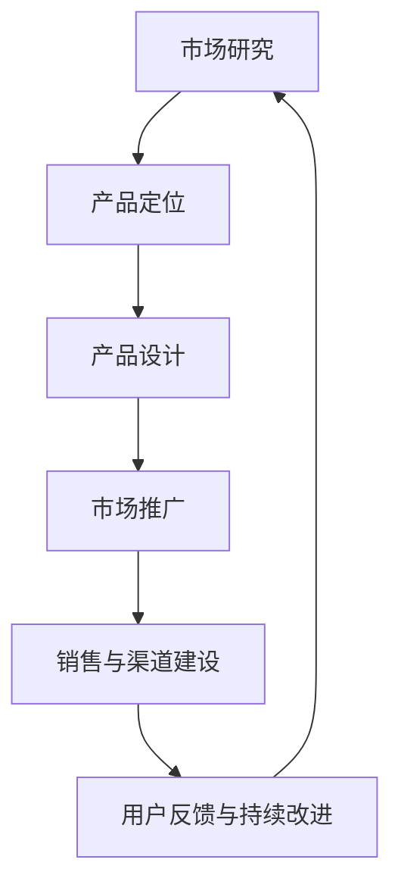
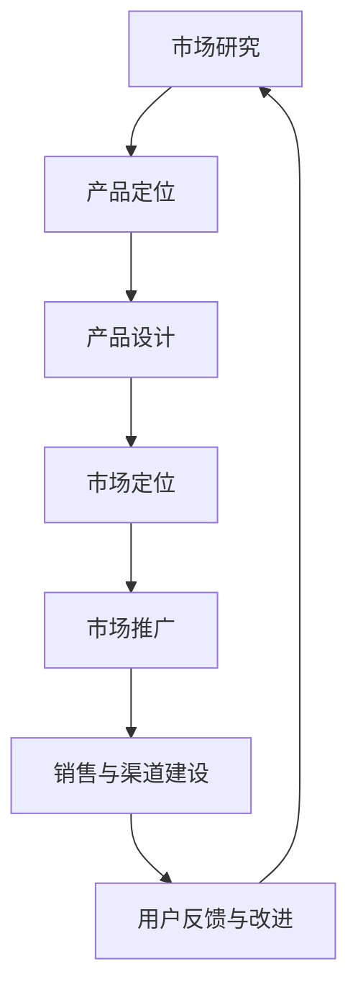

                 

# 文章标题

《产品市场匹配：技术创新的商业化之路》

> 关键词：产品市场匹配、技术创新、商业化、市场分析、产品设计、市场定位

> 摘要：本文旨在探讨产品市场匹配在技术创新商业化过程中的重要性。通过对产品市场匹配的定义、核心要素、策略以及实施过程的详细分析，结合成功与失败的案例，本文揭示了技术创新在商业化过程中的关键挑战和解决之道，为科技企业提供了有价值的参考和指导。

## 第一部分：产品市场匹配概述

### 第1章：产品市场匹配的重要性

#### 1.1 产品市场匹配的定义

产品市场匹配是指将企业的产品与目标市场的需求进行有效对接，使产品能够满足市场的需求，同时为企业带来商业价值的过程。简单来说，就是确保产品能够被市场接受并成功销售。

#### 1.2 产品市场匹配的核心要素

产品市场匹配的核心要素包括市场需求、产品特性、市场定位和竞争环境。这四个要素相互关联，共同决定了产品在市场上的表现。

1. **市场需求**：市场需求是产品市场匹配的起点，它决定了产品的目标市场以及产品的核心功能。了解市场需求，能够帮助产品团队更好地定位产品，使其更符合市场的期待。

2. **产品特性**：产品特性是产品市场匹配的关键因素，它决定了产品是否能够满足市场需求。产品特性包括功能、性能、质量、价格等，这些特性需要与市场需求相匹配。

3. **市场定位**：市场定位是产品市场匹配的重要环节，它决定了产品在市场上的定位和形象。正确的市场定位能够帮助产品在竞争激烈的市场中脱颖而出。

4. **竞争环境**：竞争环境是产品市场匹配的另一个关键要素，它影响了产品的市场接受度和市场份额。了解竞争环境，有助于企业制定有效的市场策略。

#### 1.3 产品市场匹配的关键挑战

产品市场匹配过程中，企业可能会面临以下关键挑战：

1. **市场需求变化**：市场需求是不断变化的，产品需要及时调整以适应市场的变化。

2. **产品特性不足**：产品特性与市场需求不匹配，可能导致产品在市场上缺乏竞争力。

3. **市场定位不准确**：市场定位不准确，可能导致产品无法吸引目标客户。

4. **竞争环境激烈**：竞争环境激烈，企业需要不断创新和优化产品，才能保持竞争优势。

### 第2章：技术创新与商业化

#### 2.1 技术创新的本质

技术创新是指通过引入新的技术、方法或流程，改进现有产品或服务，或创造全新产品或服务的活动。技术创新的本质是提高产品或服务的价值，满足市场需求。

#### 2.2 技术创新的商业化路径

技术创新的商业化路径包括以下步骤：

1. **市场研究**：了解市场需求和竞争环境，为技术创新提供方向。

2. **研发投入**：投入资源进行技术研发，实现技术创新。

3. **产品开发**：将技术创新转化为具体的产品或服务。

4. **市场推广**：通过市场推广，将产品或服务推向市场。

5. **销售与渠道建设**：建立销售渠道，实现产品销售。

6. **用户反馈与改进**：收集用户反馈，持续改进产品。

#### 2.3 技术创新商业化中的常见问题

在技术创新的商业化过程中，企业可能会遇到以下常见问题：

1. **市场需求不确定**：市场需求的变化可能导致技术创新的失败。

2. **研发投入不足**：研发投入不足，可能导致技术创新的失败。

3. **市场推广不力**：市场推广不力，可能导致产品无法成功推向市场。

4. **竞争激烈**：竞争激烈，企业需要不断创新，才能保持竞争优势。

## 第二部分：产品市场匹配策略

### 第3章：市场分析

#### 3.1 市场需求分析

市场需求分析是产品市场匹配的基础。通过了解市场需求，企业能够确定产品的目标市场，明确产品的核心功能。

#### 3.2 市场趋势分析

市场趋势分析有助于企业把握市场的发展方向，为产品创新提供依据。

#### 3.3 竞争对手分析

竞争对手分析是产品市场匹配的关键环节。了解竞争对手的产品、策略和市场表现，有助于企业制定有效的市场策略。

### 第4章：产品设计

#### 4.1 产品定位

产品定位是产品市场匹配的重要步骤。通过明确产品定位，企业能够确保产品在市场上具有竞争力。

#### 4.2 产品功能设计

产品功能设计是产品设计的核心。产品功能需要与市场需求相匹配，满足用户的实际需求。

#### 4.3 产品用户体验设计

产品用户体验设计是提高产品竞争力的关键。通过优化用户体验，企业能够提升产品的市场吸引力。

### 第5章：市场定位

#### 5.1 市场定位策略

市场定位策略包括明确目标市场、产品差异化策略和品牌定位等。

#### 5.2 目标客户群体分析

目标客户群体分析是市场定位的基础。通过了解目标客户群体的特征和行为，企业能够制定更有效的市场策略。

#### 5.3 市场定位案例解析

通过分析成功和失败的市场定位案例，企业能够学习到有效的市场定位策略。

## 第三部分：产品市场匹配实施

### 第6章：市场推广

#### 6.1 市场推广策略

市场推广策略包括广告宣传、公关活动、线上线下营销等。

#### 6.2 市场推广工具与方法

市场推广工具与方法包括社交媒体推广、搜索引擎优化、电子邮件营销等。

#### 6.3 市场推广案例解析

通过分析成功和失败的市场推广案例，企业能够学习到有效的市场推广策略。

### 第7章：销售与渠道建设

#### 7.1 销售策略

销售策略包括直销、分销、代理等。

#### 7.2 渠道建设策略

渠道建设策略包括选择合适的渠道合作伙伴、建立渠道管理系统等。

#### 7.3 渠道管理

渠道管理包括渠道伙伴关系管理、渠道绩效评估等。

### 第8章：用户反馈与持续改进

#### 8.1 用户反馈机制

用户反馈机制包括用户满意度调查、产品使用反馈等。

#### 8.2 用户反馈分析

用户反馈分析包括收集、整理、分析和响应用户反馈。

#### 8.3 产品持续改进策略

产品持续改进策略包括根据用户反馈改进产品、优化产品性能等。

## 第四部分：产品市场匹配案例分析

### 第9章：成功产品市场匹配案例分析

#### 9.1 案例一：苹果iPhone

苹果iPhone是产品市场匹配的成功案例。通过精确的市场定位、优秀的产品设计和强大的市场推广，iPhone赢得了全球用户的喜爱。

#### 9.2 案例二：特斯拉电动汽车

特斯拉电动汽车是技术创新商业化的典范。特斯拉通过创新的产品设计和卓越的市场推广，成功打开了电动汽车市场。

#### 9.3 案例三：Airbnb

Airbnb通过创新的共享经济模式，成功将个人闲置房源转化为商业机会。其成功的关键在于准确的市场定位和有效的用户反馈机制。

### 第10章：产品市场匹配失败的案例分析

#### 10.1 案例一：Nokia手机

Nokia手机曾经是全球最大的手机制造商，但在面对智能手机时代的变革时，Nokia未能及时调整产品策略，导致市场份额大幅下滑。

#### 10.2 案例二：Blackberry手机

Blackberry手机在早期曾占据市场主导地位，但未能及时推出具有竞争力的智能手机，导致市场份额被苹果和安卓手机所取代。

#### 10.3 案例三：Webvan

Webvan是一家在线超市，曾被誉为“电商的未来”。但由于市场定位不准确、运营成本高和缺乏有效的市场推广，Webvan最终破产。

## 附录

### 附录A：产品市场匹配相关工具与方法

#### A.1 市场研究工具

市场研究工具包括问卷调查、焦点小组、深度访谈等。

#### A.2 用户反馈工具

用户反馈工具包括在线调查、用户论坛、社交媒体等。

#### A.3 市场推广工具

市场推广工具包括广告、公关、SEO、SEM等。

### 附录B：产品市场匹配相关资源

#### B.1 相关书籍推荐

《创新与企业家精神》、《营销管理》、《产品经理手册》等。

#### B.2 相关论文推荐

《产品市场匹配：理论与实践》、《技术创新与市场成功》、《市场定位与品牌建设》等。

#### B.3 相关网站推荐

市场营销协会、产品经理社区、创业家网站等。

### 附录C：产品市场匹配流程图

### 作者信息

作者：AI天才研究院/AI Genius Institute & 禅与计算机程序设计艺术 /Zen And The Art of Computer Programming

## 第一部分：产品市场匹配概述

### 第1章：产品市场匹配的重要性

#### 1.1 产品市场匹配的定义

产品市场匹配（Product-Market Fit，简称PMF）是一个企业成功的关键因素，它描述了产品与目标市场需求的完美契合。当产品市场匹配发生时，产品能够满足市场的需求，用户愿意购买，企业能够实现盈利。简单来说，产品市场匹配就是找到那个“对”的产品，卖给那个“对”的市场。

在商业世界中，许多企业可能会面临产品开发后却难以销售的情况，这往往是因为产品没有找到合适的市场。产品市场匹配的核心在于理解市场需求，并根据这些需求设计产品，使其具有竞争力。这不仅涉及产品功能的设计，还包括用户体验、定价策略、市场定位等多个方面。

#### 1.2 产品市场匹配的核心要素

产品市场匹配的成功依赖于以下几个核心要素：

1. **市场需求**：了解市场对产品的需求是产品市场匹配的基础。这包括需求的大小、用户的痛点、用户对产品的期望等。

2. **产品特性**：产品特性是产品市场匹配的关键，它决定了产品是否能够满足市场需求。这包括功能、性能、可靠性、价格等。

3. **市场定位**：市场定位是产品在市场上的定位和形象。一个明确的市场定位有助于产品在竞争中脱颖而出。

4. **竞争环境**：了解竞争对手的产品、策略和市场表现，有助于企业制定有效的市场策略。

这些要素相互关联，共同决定了产品在市场上的表现。市场需求决定了产品应该具备哪些特性，产品特性又影响了市场定位，而竞争环境则进一步影响了市场定位的决策。

#### 1.3 产品市场匹配的关键挑战

在实现产品市场匹配的过程中，企业可能会面临以下几个关键挑战：

1. **市场需求变化**：市场需求是不断变化的，产品需要及时调整以适应市场的变化。例如，技术的发展、消费者行为的改变等都可能导致市场需求的改变。

2. **产品特性不足**：如果产品特性无法满足市场需求，可能会导致产品在市场上缺乏竞争力。这可能需要产品团队进行功能升级或重新设计。

3. **市场定位不准确**：如果市场定位不准确，可能会导致产品无法吸引目标客户。市场定位的准确性需要基于对目标客户需求的深入理解。

4. **竞争环境激烈**：在竞争激烈的市场中，企业需要不断创新和优化产品，才能保持竞争优势。这要求企业具备快速响应市场变化的能力。

#### 1.4 产品市场匹配的必要性

产品市场匹配的必要性体现在以下几个方面：

1. **提高成功率**：找到合适的市场并满足市场需求，可以显著提高产品的成功概率。

2. **降低成本**：在产品市场匹配的过程中，企业可以避免资源浪费，减少不必要的研发和市场推广投入。

3. **增加收入**：满足市场需求的产品能够吸引更多用户，从而提高销售额和市场份额。

4. **提升品牌价值**：成功的产品市场匹配有助于提升企业的品牌形象，增强市场竞争力。

总之，产品市场匹配是企业成功的关键，它不仅决定了产品的市场表现，也影响着企业的长期发展。

### 第2章：技术创新与商业化

#### 2.1 技术创新的本质

技术创新是指通过引入新的技术、方法或流程，改进现有产品或服务，或创造全新产品或服务的活动。技术创新的本质是提高产品或服务的价值，满足市场需求。技术创新可以来自企业内部，也可以通过外部合作、并购或投资等途径实现。

技术创新的主要形式包括：

1. **产品创新**：通过引入新的产品或改进现有产品，满足市场需求。

2. **服务创新**：通过引入新的服务或改进现有服务，提高用户体验。

3. **流程创新**：通过引入新的流程或改进现有流程，提高生产效率或降低成本。

4. **商业模式创新**：通过引入新的商业模式，实现企业价值的最大化。

技术创新的成功与否，取决于其是否能够真正解决市场需求，提高产品或服务的价值。

#### 2.2 技术创新的商业化路径

技术创新的商业化路径通常包括以下几个步骤：

1. **市场研究**：了解市场需求和竞争环境，为技术创新提供方向。这包括对目标市场的需求分析、竞争对手的产品分析等。

2. **研发投入**：投入资源进行技术研发，实现技术创新。这包括技术团队的建设、研发设备的采购等。

3. **产品开发**：将技术创新转化为具体的产品或服务。这包括产品设计的优化、原型制作、测试等。

4. **市场推广**：通过市场推广，将产品或服务推向市场。这包括广告宣传、公关活动、线上线下营销等。

5. **销售与渠道建设**：建立销售渠道，实现产品销售。这包括选择合适的销售渠道、建立渠道管理系统等。

6. **用户反馈与改进**：收集用户反馈，持续改进产品。这包括用户满意度调查、产品使用反馈等。

技术创新的商业化过程是一个复杂的过程，涉及多个环节的协同工作。每个环节都需要精细的规划和执行，以确保技术创新能够成功商业化。

#### 2.3 技术创新商业化中的常见问题

在技术创新的商业化过程中，企业可能会遇到以下常见问题：

1. **市场需求不确定**：市场需求是不断变化的，技术创新需要及时调整以适应市场的变化。如果市场需求不确定，可能导致技术创新的方向偏离。

2. **研发投入不足**：技术创新需要大量的人力、物力和财力投入。如果研发投入不足，可能导致技术创新无法顺利进行。

3. **市场推广不力**：市场推广是技术创新商业化的关键环节。如果市场推广不力，可能导致产品无法成功推向市场。

4. **竞争激烈**：在竞争激烈的市场环境中，技术创新需要具备独特的竞争力。如果竞争力不足，可能导致技术创新在市场上难以立足。

5. **用户接受度低**：如果用户对技术创新的产品或服务接受度低，可能导致市场推广失败，影响商业化进程。

针对这些问题，企业需要采取有效的措施，如加强市场研究、增加研发投入、优化市场推广策略等，以确保技术创新能够成功商业化。

#### 2.4 技术创新与产品市场匹配的关系

技术创新与产品市场匹配密切相关。技术创新是产品市场匹配的重要驱动力，而产品市场匹配则是技术创新成功商业化的关键保障。

1. **技术创新驱动产品市场匹配**：技术创新可以创造新的市场需求，推动产品市场匹配的实现。例如，智能手机的出现改变了人们的通信方式，推动了移动互联网的发展。

2. **产品市场匹配验证技术创新**：产品市场匹配的过程是对技术创新的验证。如果技术创新的产品能够成功满足市场需求，并在市场上取得成功，说明技术创新是有效的。

3. **产品市场匹配促进技术创新**：成功的产品市场匹配可以为技术创新提供反馈，促进产品的持续改进。例如，苹果公司通过iPhone的成功，不断推动技术创新，推出了一系列具有竞争力的产品。

总之，技术创新与产品市场匹配相辅相成，共同推动企业的持续发展。

### 第3章：产品市场匹配策略

#### 3.1 市场分析

市场分析是产品市场匹配策略的核心步骤。通过深入的市场分析，企业可以了解市场需求、市场趋势和竞争环境，为产品设计和市场定位提供依据。

市场分析主要包括以下几个方面：

1. **市场需求分析**：了解市场对产品或服务的需求，包括需求的大小、用户的痛点、用户对产品的期望等。这可以通过问卷调查、用户访谈、市场调研等方式进行。

2. **市场趋势分析**：分析市场的未来发展趋势，包括技术进步、消费者行为变化、行业政策变化等。这有助于企业把握市场机遇，调整产品策略。

3. **竞争对手分析**：了解竞争对手的产品、策略和市场表现，包括竞争对手的优势、劣势、市场份额等。这有助于企业制定有效的市场策略，应对竞争。

4. **市场细分**：将市场划分为不同的细分市场，根据细分市场的特点设计产品，满足不同用户群体的需求。

通过市场分析，企业可以全面了解市场状况，为产品设计和市场定位提供科学依据。

#### 3.2 产品设计

产品设计是产品市场匹配的关键环节。优秀的产品设计不仅能够满足市场需求，还能够提升用户体验，增强产品的竞争力。

1. **产品定位**：产品定位是确定产品的市场定位和形象。产品定位需要基于市场需求和竞争环境，明确产品的目标市场和核心价值。

2. **功能设计**：功能设计是产品设计的重要组成部分。功能设计需要根据市场需求，提供符合用户期望的功能，同时避免功能过度，避免用户负担。

3. **用户体验设计**：用户体验设计是提升产品竞争力的关键。通过优化用户体验，提高用户的满意度，可以增强产品的市场吸引力。

4. **技术实现**：技术实现是将产品设计转化为实际产品的过程。技术实现需要考虑技术的可行性、成本和性能等因素。

5. **迭代优化**：产品设计是一个不断迭代优化的过程。通过用户反馈和数据分析，不断改进产品，提升用户体验和市场竞争力。

#### 3.3 市场定位

市场定位是产品市场匹配策略的重要组成部分。正确的市场定位可以帮助产品在竞争激烈的市场中脱颖而出，吸引目标客户。

1. **目标市场选择**：选择合适的目标市场，是市场定位的关键。目标市场选择需要考虑市场需求、竞争状况、企业资源等因素。

2. **定位策略**：市场定位策略包括差异化定位、集中定位、高端定位等。不同的定位策略适用于不同的市场环境和产品特点。

3. **品牌形象建设**：品牌形象是产品在市场中的形象和认知。通过品牌形象建设，可以提升产品的市场地位和品牌价值。

4. **市场推广策略**：市场推广策略是实施市场定位的重要手段。通过有效的市场推广，可以提升产品的知名度，吸引目标客户。

5. **持续优化**：市场定位不是一次性的工作，而是需要持续优化的过程。随着市场和产品的变化，需要不断调整市场定位策略。

通过科学的市场定位，企业可以确保产品在市场上具有竞争力，实现产品的市场成功。

#### 3.4 市场推广策略

市场推广策略是产品市场匹配的重要环节，它决定了产品能否成功进入市场，并赢得消费者的认可。

1. **广告宣传**：广告宣传是市场推广的主要手段之一。通过广告，可以提升产品的知名度，吸引潜在客户。

   - **广告形式**：包括电视广告、网络广告、户外广告等。
   - **广告内容**：需要明确传达产品的核心价值和特点，吸引目标受众。

2. **公关活动**：公关活动是提升品牌形象和知名度的重要途径。

   - **活动形式**：包括新闻发布会、产品发布会、品牌推广活动等。
   - **活动内容**：需要与品牌形象和市场推广目标相一致，提升品牌认知度和美誉度。

3. **线上线下营销**：线上线下营销结合，可以更全面地覆盖目标受众。

   - **线上营销**：包括搜索引擎优化（SEO）、社交媒体营销（SMM）、内容营销等。
   - **线下营销**：包括展会、路演、线下活动等。

4. **渠道推广**：通过渠道合作伙伴，扩大产品的销售网络。

   - **渠道选择**：根据产品特点和市场定位，选择合适的渠道，如零售店、线上商城、代理商等。
   - **渠道管理**：建立渠道管理系统，确保渠道的稳定性和销售效率。

5. **用户反馈**：通过用户反馈，及时了解市场动态和用户需求，优化市场推广策略。

   - **反馈收集**：通过问卷调查、用户访谈、社交媒体等方式收集用户反馈。
   - **反馈分析**：对用户反馈进行分析，发现市场机会和改进点。

通过全面的市场推广策略，企业可以提升产品的市场占有率，实现商业成功。

### 第4章：产品市场匹配实施

#### 4.1 市场推广策略

市场推广策略是产品市场匹配实施的关键环节，它决定了产品能否成功进入市场，并赢得消费者的认可。

1. **广告宣传**：广告宣传是市场推广的主要手段之一。通过广告，可以提升产品的知名度，吸引潜在客户。

   - **广告形式**：包括电视广告、网络广告、户外广告等。
   - **广告内容**：需要明确传达产品的核心价值和特点，吸引目标受众。

2. **公关活动**：公关活动是提升品牌形象和知名度的重要途径。

   - **活动形式**：包括新闻发布会、产品发布会、品牌推广活动等。
   - **活动内容**：需要与品牌形象和市场推广目标相一致，提升品牌认知度和美誉度。

3. **线上线下营销**：线上线下营销结合，可以更全面地覆盖目标受众。

   - **线上营销**：包括搜索引擎优化（SEO）、社交媒体营销（SMM）、内容营销等。
   - **线下营销**：包括展会、路演、线下活动等。

4. **渠道推广**：通过渠道合作伙伴，扩大产品的销售网络。

   - **渠道选择**：根据产品特点和市场定位，选择合适的渠道，如零售店、线上商城、代理商等。
   - **渠道管理**：建立渠道管理系统，确保渠道的稳定性和销售效率。

5. **用户反馈**：通过用户反馈，及时了解市场动态和用户需求，优化市场推广策略。

   - **反馈收集**：通过问卷调查、用户访谈、社交媒体等方式收集用户反馈。
   - **反馈分析**：对用户反馈进行分析，发现市场机会和改进点。

通过全面的市场推广策略，企业可以提升产品的市场占有率，实现商业成功。

#### 4.2 销售与渠道建设

销售与渠道建设是产品市场匹配实施的重要环节，它决定了产品能否有效进入市场，实现销售目标。

1. **销售策略**：销售策略是企业实现产品销售的方法和手段。

   - **直销**：企业直接向最终用户销售产品，适用于高端市场或定制化产品。
   - **分销**：通过代理商或经销商销售产品，适用于大众市场或标准产品。
   - **代理**：企业将产品委托给代理商销售，适用于扩大市场份额或进入新市场。

2. **渠道建设**：渠道建设是建立产品销售网络的过程。

   - **渠道选择**：根据产品特点和市场定位，选择合适的渠道类型。
   - **渠道开发**：寻找并建立渠道合作伙伴关系，确保渠道的稳定性和销售能力。
   - **渠道管理**：通过培训、支持、激励等手段，确保渠道的稳定性和销售效率。

3. **销售渠道**：销售渠道是产品从生产者到消费者的流通路径。

   - **零售渠道**：直接面对消费者的销售渠道，如超市、专卖店等。
   - **批发渠道**：面向其他企业的销售渠道，如批发市场、分销商等。
   - **在线渠道**：通过互联网进行销售的渠道，如电子商务平台、自有网站等。

4. **销售目标**：制定明确的销售目标，是销售与渠道建设的基础。

   - **销售指标**：包括销售量、销售额、市场占有率等。
   - **目标设定**：根据市场分析和竞争状况，设定合理的销售目标。

通过有效的销售与渠道建设，企业可以扩大市场份额，实现产品的商业成功。

#### 4.3 用户反馈与持续改进

用户反馈与持续改进是产品市场匹配实施的重要组成部分，它决定了产品能否满足市场需求，实现长期发展。

1. **用户反馈机制**：建立有效的用户反馈机制，是收集用户意见和建议的重要手段。

   - **反馈渠道**：包括在线反馈表、电话热线、社交媒体、用户社区等。
   - **反馈处理**：及时收集、整理和分析用户反馈，确保问题得到及时解决。

2. **用户反馈分析**：对用户反馈进行深入分析，是发现市场机会和改进点的关键。

   - **数据分析**：使用数据分析工具，对用户反馈进行定量分析，识别主要问题和改进方向。
   - **定性分析**：通过用户访谈、焦点小组等方法，对用户反馈进行定性分析，深入了解用户需求和期望。

3. **产品改进**：根据用户反馈分析结果，进行产品改进。

   - **功能优化**：优化产品功能，提高用户满意度。
   - **性能提升**：提升产品性能，增强市场竞争力。
   - **用户体验**：优化用户体验，提高用户留存率。

4. **持续改进**：产品改进不是一次性的工作，而是一个持续的过程。

   - **迭代开发**：采用敏捷开发方法，不断迭代产品，满足用户需求。
   - **持续监控**：持续监控用户反馈和市场动态，确保产品持续改进。

通过有效的用户反馈与持续改进，企业可以不断提升产品质量和市场竞争力，实现长期发展。

### 第5章：市场定位

#### 5.1 市场定位策略

市场定位策略是产品市场匹配过程中至关重要的一环，它决定了产品在市场上的形象和地位。一个明确、准确的市场定位可以帮助企业有效地吸引目标客户，提升品牌价值。

1. **目标市场选择**：目标市场选择是市场定位的第一步。企业需要根据产品特点、市场需求和自身资源，选择合适的目标市场。

   - **集中市场定位**：将市场细分，选择一个特定的细分市场作为目标市场，集中资源和力量进行市场渗透。
   - **差异化市场定位**：根据产品的独特性和竞争优势，选择具有差异化特点的目标市场，以区分于竞争对手。
   - **高端市场定位**：针对高端消费群体，提供高品质的产品和服务，树立高端品牌形象。

2. **市场细分**：市场细分是目标市场选择的基础。通过市场细分，企业可以更准确地了解不同客户群体的需求和特征，从而制定更有效的市场定位策略。

   - **地理细分**：根据地理位置，将市场划分为不同的区域，针对特定区域的消费者特点进行市场定位。
   - **人口细分**：根据人口特征，如年龄、性别、收入、教育水平等，将市场划分为不同的群体，满足不同消费者的需求。
   - **行为细分**：根据消费者的购买行为、使用习惯、忠诚度等，将市场划分为不同的群体，提供差异化的产品和服务。

3. **品牌形象建设**：品牌形象是市场定位的重要组成部分。通过塑造独特的品牌形象，企业可以在消费者心中建立特定的认知和印象。

   - **品牌定位**：明确品牌在市场中的定位，如高端、专业、年轻等，以区分于竞争对手。
   - **品牌传播**：通过广告、公关活动、社交媒体等手段，将品牌形象传递给目标消费者，提升品牌知名度。
   - **品牌延伸**：通过品牌延伸策略，将品牌扩展到新的产品或服务领域，实现品牌的多元化发展。

4. **市场定位策略调整**：市场定位不是一成不变的，企业需要根据市场变化和竞争态势，及时调整市场定位策略。

   - **竞争分析**：通过分析竞争对手的市场定位，了解竞争态势，调整自己的市场定位，以应对竞争压力。
   - **用户反馈**：通过收集用户反馈，了解用户对品牌和产品的看法，根据用户需求调整市场定位策略。
   - **市场趋势**：关注市场趋势和行业动态，及时调整市场定位策略，以适应市场变化。

#### 5.2 目标客户群体分析

目标客户群体分析是市场定位策略的重要组成部分。了解目标客户群体的特征、需求和偏好，可以帮助企业更精准地定位市场，提供满足客户需求的产品和服务。

1. **客户特征分析**：分析目标客户群体的基本特征，如年龄、性别、收入水平、教育程度等。这些特征有助于企业了解客户的基本情况，为市场定位提供依据。

2. **客户需求分析**：了解目标客户群体的需求，包括产品功能需求、服务需求、价格需求等。通过深入分析客户需求，企业可以设计出更符合客户期望的产品和服务。

3. **客户偏好分析**：分析目标客户群体的消费习惯、购买决策因素等，了解客户的偏好和购买行为。这有助于企业制定更有效的营销策略，吸引目标客户。

4. **客户满意度分析**：通过调查和反馈，了解客户对产品和服务的满意度，发现潜在问题和改进点。通过持续提升客户满意度，企业可以增强客户的忠诚度，提高市场竞争力。

5. **客户生命周期分析**：分析目标客户的生命周期，包括引入期、增长期、成熟期和衰退期。根据客户生命周期，企业可以制定不同的营销策略，最大化客户价值。

通过深入的目标客户群体分析，企业可以更准确地定位市场，提供满足客户需求的产品和服务，实现市场定位的成功。

### 第6章：市场推广

#### 6.1 市场推广策略

市场推广策略是产品市场匹配实施过程中的关键环节，它决定了产品能否成功进入市场，并赢得消费者的认可。一个全面有效的市场推广策略应包括以下几个方面：

1. **广告宣传**：广告宣传是市场推广的核心手段之一。通过电视广告、网络广告、户外广告等形式，企业可以将产品的信息传递给广泛的目标受众。

   - **广告预算**：合理分配广告预算，确保广告宣传的效果。
   - **广告内容**：创作具有吸引力的广告内容，突出产品的独特卖点，引起消费者的兴趣。

2. **公关活动**：公关活动是提升品牌形象和知名度的重要途径。通过新闻发布会、产品发布会、品牌推广活动等形式，企业可以吸引媒体和公众的关注。

   - **活动策划**：精心策划公关活动，确保活动的高效和影响力。
   - **媒体合作**：与媒体建立良好的合作关系，通过媒体报道提升品牌知名度。

3. **线上线下营销**：线上线下营销的结合可以更全面地覆盖目标受众。

   - **线上营销**：通过搜索引擎优化（SEO）、社交媒体营销（SMM）、内容营销等形式，提高产品的在线曝光率和用户参与度。
   - **线下营销**：通过展会、路演、线下活动等形式，直接与潜在客户进行互动，提升产品的市场认知度。

4. **渠道推广**：通过渠道合作伙伴，扩大产品的销售网络。

   - **渠道选择**：根据产品特点和目标市场，选择合适的渠道，如零售店、线上商城、代理商等。
   - **渠道管理**：建立渠道管理系统，确保渠道的稳定性和销售效率。

5. **用户反馈**：通过用户反馈，及时了解市场动态和用户需求，优化市场推广策略。

   - **反馈渠道**：建立多种反馈渠道，如在线反馈表、电话热线、社交媒体、用户社区等。
   - **反馈处理**：及时收集、整理和分析用户反馈，确保问题得到及时解决。

通过全面的市场推广策略，企业可以提升产品的市场占有率，实现商业成功。

#### 6.2 市场推广工具与方法

在市场推广过程中，企业可以使用多种工具和方法来提升产品的市场认知度和销售业绩。以下是一些常用的市场推广工具和方法：

1. **搜索引擎优化（SEO）**：通过优化网站内容和结构，提高网站在搜索引擎中的排名，从而吸引更多的有机流量。

   - **关键词研究**：分析目标市场的关键词，选择适合的关键词进行优化。
   - **内容优化**：创作高质量的内容，包括博客文章、产品页面等，提升用户体验和搜索引擎友好度。

2. **社交媒体营销（SMM）**：利用社交媒体平台，如Facebook、Instagram、Twitter等，进行品牌推广和用户互动。

   - **内容创作**：发布有趣、有价值的社交媒体内容，吸引粉丝关注和互动。
   - **广告投放**：通过社交媒体广告，精准定位目标受众，提高品牌曝光度。

3. **内容营销**：通过创作和分享有价值的内容，吸引潜在客户，建立品牌信任和忠诚度。

   - **博客文章**：定期发布行业相关的博客文章，提供专业知识，吸引读者关注。
   - **电子书和白皮书**：创作深度报告和指导性文档，提供行业洞察和解决方案。

4. **电子邮件营销**：通过电子邮件与用户建立联系，传递产品信息、促销活动等，提高用户参与度和转化率。

   - **邮件列表**：收集用户的电子邮件地址，建立邮件列表。
   - **个性化邮件**：根据用户的行为和偏好，发送个性化的邮件内容。

5. **公关活动**：通过新闻发布会、产品发布会、行业会议等活动，吸引媒体和公众的关注，提升品牌知名度。

   - **媒体关系**：建立与媒体的良好关系，确保活动的媒体报道。
   - **活动策划**：精心策划公关活动，确保活动的顺利进行和影响力。

通过合理运用这些市场推广工具和方法，企业可以更有效地推广产品，实现市场目标。

### 第7章：销售与渠道建设

#### 7.1 销售策略

销售策略是企业实现产品销售的重要手段。一个有效的销售策略可以帮助企业提高市场占有率，实现商业目标。以下是几种常见的销售策略：

1. **直销策略**：直销是企业直接向最终用户销售产品或服务的策略。这种策略适用于高端市场或需要个性化定制的产品。

   - **优势**：直接与客户沟通，能够快速响应客户需求，提供优质的售后服务。
   - **挑战**：需要大量的销售团队和资源投入，成本较高。

2. **分销策略**：分销是企业通过代理商、经销商或零售商等中间渠道销售产品的策略。这种策略适用于大众市场或标准产品。

   - **优势**：利用中间渠道的销售网络，降低销售成本，提高市场覆盖率。
   - **挑战**：需要与中间渠道建立良好的合作关系，管理渠道难度较大。

3. **代理策略**：代理是企业将产品委托给代理商销售，代理商拥有销售产品的权利和责任。

   - **优势**：代理商拥有丰富的销售经验和资源，能够快速打开市场。
   - **挑战**：代理商的利润分配和权益保障问题需要妥善处理。

4. **线上线下结合策略**：结合线上线下渠道进行销售，提高产品的市场覆盖率和用户体验。

   - **优势**：线下体验线上购买，提升用户满意度和转化率。
   - **挑战**：需要平衡线上线下渠道的运营和管理，避免冲突。

#### 7.2 渠道建设策略

渠道建设是企业实现产品销售的重要环节。一个合理的渠道建设策略可以帮助企业建立稳定的销售网络，提高市场竞争力。以下是几种常见的渠道建设策略：

1. **选择合适渠道**：根据产品特点和市场需求，选择合适的销售渠道，如零售店、线上商城、代理商等。

   - **标准产品**：适用于大众市场的标准产品，可以选择零售店和线上商城。
   - **高端产品**：适用于高端市场或需要个性化定制的产品，可以选择直销或代理商。

2. **建立渠道关系**：与渠道合作伙伴建立长期稳定的合作关系，确保渠道的稳定性和销售效率。

   - **信任建立**：通过诚信经营、优质服务、合理利润分配等手段，赢得渠道合作伙伴的信任。
   - **合作模式**：根据产品特点和市场需求，制定合理的合作模式，如佣金制、利润分享制等。

3. **渠道管理**：建立渠道管理系统，对渠道合作伙伴进行有效的管理和激励。

   - **培训支持**：为渠道合作伙伴提供培训和技术支持，提高其销售能力。
   - **绩效评估**：定期对渠道合作伙伴的绩效进行评估，激励优秀表现，调整不足。

4. **渠道整合**：将线上线下渠道进行整合，实现渠道的互补和协同效应。

   - **线上线下互动**：通过线上渠道进行宣传和推广，引导消费者到线下门店体验和购买。
   - **数据共享**：通过数据共享，提高渠道合作伙伴对市场需求和消费者行为的了解，优化销售策略。

通过合理的销售策略和渠道建设，企业可以建立高效的销售网络，实现产品的广泛覆盖和销售增长。

### 第8章：用户反馈与持续改进

#### 8.1 用户反馈机制

用户反馈机制是产品市场匹配过程中不可或缺的一环。通过有效的用户反馈机制，企业可以及时了解用户的需求和满意度，发现产品的问题和改进点，从而不断提升产品质量和用户体验。

1. **反馈渠道**：建立多样化的反馈渠道，包括在线反馈表、电话热线、社交媒体、用户社区等，方便用户随时随地提供反馈。

   - **在线反馈表**：通过网站、APP等平台，提供在线反馈表，方便用户填写反馈信息。
   - **电话热线**：设立24小时客服电话，为用户提供便捷的反馈途径。
   - **社交媒体**：通过官方社交媒体账号，收集用户的反馈和评论。
   - **用户社区**：建立用户社区，鼓励用户参与讨论和分享，收集用户反馈。

2. **反馈处理**：建立高效的反馈处理流程，确保用户反馈得到及时响应和解决。

   - **反馈收集**：及时收集用户反馈，建立反馈数据库，对反馈信息进行分类和整理。
   - **反馈分析**：对用户反馈进行分析，识别主要问题和改进点，制定相应的改进方案。
   - **反馈响应**：根据用户反馈，制定解决方案，并及时告知用户处理进展和结果。

#### 8.2 用户反馈分析

用户反馈分析是用户反馈机制的核心环节。通过对用户反馈的深入分析，企业可以了解用户的需求和期望，发现产品的问题和改进点，从而指导产品的持续改进。

1. **数据分析**：使用数据分析工具，对用户反馈进行定量分析，识别主要问题和改进方向。

   - **数据收集**：收集用户反馈数据，包括反馈内容、反馈来源、反馈时间等。
   - **数据清洗**：对收集到的数据进行分析前的预处理，如去除重复数据、填补缺失数据等。
   - **数据可视化**：使用数据可视化工具，将反馈数据转化为图表和报告，直观展示分析结果。

2. **定性分析**：通过用户访谈、焦点小组等方法，对用户反馈进行定性分析，深入了解用户需求和期望。

   - **用户访谈**：与用户进行一对一访谈，深入了解用户的反馈和意见。
   - **焦点小组**：组织一群用户，进行集体讨论，收集用户的反馈和建议。

3. **问题识别**：通过数据分析，识别用户反馈中的主要问题，如功能不足、性能问题、用户体验问题等。

   - **问题分类**：将识别出的问题进行分类，如功能性问题、性能问题、用户体验问题等。
   - **优先级排序**：根据问题的严重程度和影响范围，对问题进行优先级排序，优先解决高优先级问题。

4. **改进方案**：根据用户反馈分析结果，制定相应的改进方案，如功能优化、性能提升、用户体验改进等。

   - **改进方案制定**：根据问题识别结果，制定改进方案，包括技术方案和实施计划。
   - **改进方案实施**：按照改进方案，进行技术改进和产品优化，确保改进效果的实现。

#### 8.3 产品持续改进策略

产品持续改进策略是确保产品在市场竞争中保持领先地位的重要手段。通过持续改进，企业可以不断提升产品质量和用户体验，满足用户需求，实现产品的长期发展。

1. **持续改进机制**：建立持续改进机制，确保产品在研发、设计、测试、发布等各个环节中，不断进行改进。

   - **反馈循环**：建立快速反馈循环机制，及时收集用户反馈，快速响应和解决问题。
   - **迭代开发**：采用敏捷开发方法，快速迭代产品，持续改进产品功能、性能和用户体验。

2. **质量保障**：通过严格的测试和质量控制，确保产品在发布前达到高质量标准。

   - **自动化测试**：建立自动化测试体系，提高测试效率和覆盖率。
   - **质量控制**：建立严格的质量控制流程，确保产品在发布前经过充分测试和验证。

3. **用户参与**：鼓励用户参与产品改进过程，通过用户调研、用户测试、用户反馈等方式，收集用户的意见和建议，指导产品改进。

   - **用户调研**：定期进行用户调研，了解用户对产品的需求和期望。
   - **用户测试**：邀请用户参与产品测试，收集用户对产品的反馈和建议。

4. **创新驱动**：通过技术创新和设计创新，不断提升产品的竞争力和用户体验。

   - **技术创新**：投入研发资源，进行新技术的研究和应用，提升产品性能和功能。
   - **设计创新**：关注用户体验，通过设计创新，提升产品的易用性和用户体验。

通过持续改进策略，企业可以不断提升产品质量和用户体验，实现产品的长期发展。

### 第9章：成功产品市场匹配案例分析

#### 9.1 案例一：苹果iPhone

苹果iPhone是全球智能手机市场的领军品牌，其成功的产品市场匹配策略为其带来了巨大的商业成功。

1. **市场需求分析**：苹果iPhone在推出之初，准确地抓住了智能手机市场的需求。用户对功能丰富、性能强大的手机有着强烈的需求，而苹果iPhone正好满足了这一需求。

2. **产品特性设计**：苹果iPhone以其独特的设计、强大的性能和优秀的用户体验赢得了市场的认可。iPhone采用简洁的界面、高质量的硬件和创新的软件功能，为用户提供了卓越的使用体验。

3. **市场定位**：苹果iPhone采取了高端市场定位策略，以高价格和高质量吸引高端消费者。这一市场定位使苹果iPhone在市场中具有独特的竞争优势。

4. **市场推广**：苹果iPhone通过创新的营销策略和强大的品牌推广，迅速在市场上占据了一席之地。苹果公司通过举办发布会、广告宣传和用户社区等方式，不断提升品牌知名度和用户忠诚度。

5. **用户反馈与持续改进**：苹果公司高度重视用户反馈，通过定期更新操作系统和硬件，不断提升产品的性能和用户体验。这种持续改进策略使苹果iPhone在市场中始终保持竞争力。

#### 9.2 案例二：特斯拉电动汽车

特斯拉电动汽车是电动汽车行业的领先者，其成功的产品市场匹配策略为其带来了显著的商业成功。

1. **市场需求分析**：特斯拉准确地抓住了全球对环保和可持续交通方式的需求。随着全球环保意识的提高和政府对电动汽车的支持，特斯拉看到了电动汽车市场的巨大潜力。

2. **产品特性设计**：特斯拉电动汽车以其卓越的性能、先进的自动驾驶技术和智能充电系统赢得了市场的认可。特斯拉电动汽车具有长续航里程、快速充电和出色的驾驶体验，为用户提供了全新的出行方式。

3. **市场定位**：特斯拉采取了高端市场定位策略，以高性能和高价格的电动汽车吸引高端消费者。这一市场定位使特斯拉在电动汽车市场中具有独特的竞争优势。

4. **市场推广**：特斯拉通过创新的营销策略和品牌推广，迅速在市场上占据了一席之地。特斯拉通过线上广告、社交媒体营销和线下体验店等方式，不断提升品牌知名度和用户忠诚度。

5. **用户反馈与持续改进**：特斯拉高度重视用户反馈，通过定期更新软件和硬件，不断提升产品的性能和用户体验。特斯拉的持续改进策略使其在电动汽车市场中始终保持领先地位。

#### 9.3 案例三：Airbnb

Airbnb是共享住宿行业的领军企业，其成功的产品市场匹配策略为其带来了巨大的商业成功。

1. **市场需求分析**：Airbnb准确地抓住了全球对灵活住宿方式的需求。随着旅游业的蓬勃发展，越来越多的人希望体验不同的住宿方式，而Airbnb提供了这样的机会。

2. **产品特性设计**：Airbnb通过创新的共享经济模式，为用户提供了一种独特的住宿体验。用户可以通过Airbnb预订当地的民宿，与房东互动，体验当地的文化和生活方式。

3. **市场定位**：Airbnb采取了广泛市场定位策略，覆盖全球多个国家和地区，为各种类型的用户提供服务。无论是商务旅行者还是休闲度假者，都可以在Airbnb上找到合适的住宿。

4. **市场推广**：Airbnb通过线上广告、社交媒体营销和用户口碑推广等方式，迅速在市场上占据了一席之地。Airbnb的口碑效应使其在市场上具有强大的影响力。

5. **用户反馈与持续改进**：Airbnb高度重视用户反馈，通过用户调研、用户测试和用户社区等方式，不断收集用户意见和建议，优化产品和服务。这种持续改进策略使Airbnb在共享住宿行业中始终保持竞争力。

通过分析这些成功案例，我们可以看到，产品市场匹配的关键在于深入了解市场需求，设计符合用户期望的产品，采取有效的市场定位和推广策略，同时持续收集用户反馈并进行改进。这些策略的实施，为企业带来了巨大的商业成功。

### 第10章：产品市场匹配失败的案例分析

#### 10.1 案例一：Nokia手机

Nokia曾经是手机市场的巨头，但在面对智能手机时代的变革时，Nokia未能及时调整产品策略，导致市场份额大幅下滑，最终导致公司破产。

1. **市场需求变化**：在智能手机兴起之初，Nokia未能及时捕捉到市场的变化，仍坚持传统功能手机的研发和销售。随着消费者对智能手机的需求增加，Nokia的产品逐渐失去了市场竞争力。

2. **产品特性不足**：Nokia手机在功能、性能和用户体验方面与竞争对手存在差距。Nokia手机在操作系统、应用生态和硬件配置等方面未能跟上市场的步伐，导致产品无法满足用户的需求。

3. **市场定位不准确**：Nokia在市场定位上过于保守，未能及时抓住高端市场和中低端市场的机会。Nokia在高端市场缺乏竞争力，而在中低端市场又未能提供足够的产品多样性。

4. **竞争环境激烈**：在智能手机市场中，苹果、三星等竞争对手迅速崛起，推出了具有强大竞争力的产品。Nokia在激烈的市场竞争中未能保持优势，市场份额逐渐被竞争对手蚕食。

#### 10.2 案例二：Blackberry手机

Blackberry曾经是智能手机市场的领导者，但未能成功转型，最终市场份额大幅下滑，导致公司破产。

1. **市场需求变化**：在智能手机时代，Blackberry未能及时适应市场的变化，仍坚持传统键盘手机的设计。随着触屏智能手机的普及，Blackberry的市场需求逐渐下降。

2. **产品特性不足**：Blackberry手机在功能、性能和用户体验方面与竞争对手存在差距。Blackberry的操作系统、应用生态和硬件配置未能跟上市场的步伐，导致产品无法满足用户的需求。

3. **市场定位不准确**：Blackberry在市场定位上过于保守，未能及时抓住高端市场和中低端市场的机会。Blackberry在高端市场缺乏竞争力，而在中低端市场又未能提供足够的产品多样性。

4. **竞争环境激烈**：在智能手机市场中，苹果、三星等竞争对手迅速崛起，推出了具有强大竞争力的产品。Blackberry在激烈的市场竞争中未能保持优势，市场份额逐渐被竞争对手蚕食。

#### 10.3 案例三：Webvan

Webvan是一家在线超市，曾被誉为“电商的未来”。但由于市场定位不准确、运营成本高和缺乏有效的市场推广，Webvan最终破产。

1. **市场定位不准确**：Webvan在市场定位上过于超前，试图通过在线购物服务直接取代传统超市。然而，当时的消费者对在线购物接受度较低，导致Webvan的市场定位不准确。

2. **运营成本高**：Webvan为了提供快速配送服务，建立了庞大的仓储和配送网络。然而，由于市场需求不足，Webvan的运营成本远高于收入，导致公司陷入财务困境。

3. **市场推广不力**：Webvan在市场推广上投入不足，未能有效地吸引消费者。与竞争对手相比，Webvan的知名度较低，难以在激烈的市场竞争中脱颖而出。

4. **竞争环境激烈**：在电子商务领域，亚马逊等竞争对手迅速崛起，提供了更广泛的商品种类和更优质的购物体验。Webvan在激烈的市场竞争中未能保持优势，市场份额逐渐被竞争对手蚕食。

通过分析这些失败案例，我们可以看到，产品市场匹配失败的主要原因包括市场需求变化未能及时捕捉、产品特性不足、市场定位不准确和竞争环境激烈等。这些原因提醒企业在产品市场匹配过程中，必须时刻关注市场需求，优化产品特性，准确市场定位，并积极应对竞争环境的变化。

### 附录A：产品市场匹配相关工具与方法

#### A.1 市场研究工具

市场研究是产品市场匹配的基础，以下是一些常用的市场研究工具：

1. **问卷调查**：通过设计问卷，收集用户对产品或服务的看法和需求。问卷调查可以在线进行，也可以通过电话或面对面访谈进行。

2. **焦点小组**：邀请一组目标用户，就产品或服务的特定问题进行讨论。焦点小组可以帮助企业深入了解用户的真实需求和意见。

3. **深度访谈**：通过与用户进行一对一的访谈，深入了解用户的购买行为、使用习惯和偏好。深度访谈可以获得详细的用户反馈，有助于产品改进。

4. **观察法**：通过观察用户在使用产品或服务时的行为，收集用户反馈。观察法可以揭示用户在真实场景中的使用体验和需求。

5. **实验法**：通过实验，测试不同产品特性或市场推广策略的效果。实验法可以帮助企业验证产品或策略的有效性。

#### A.2 用户反馈工具

用户反馈是产品市场匹配的重要参考，以下是一些常用的用户反馈工具：

1. **在线反馈表**：通过网站或APP提供在线反馈表，方便用户随时提交反馈。在线反馈表可以收集大量的用户反馈，有助于数据分析和处理。

2. **社交媒体**：通过社交媒体平台（如微博、微信、Facebook等）收集用户的评论和反馈。社交媒体可以实时获取用户反馈，有助于快速响应和解决问题。

3. **用户社区**：建立用户社区，鼓励用户参与讨论和分享。用户社区可以增强用户的参与感，促进用户反馈和互动。

4. **用户访谈**：通过与用户进行一对一的访谈，深入了解用户的反馈和意见。用户访谈可以获得详细的用户反馈，有助于产品改进。

5. **用户测试**：邀请用户参与产品测试，观察用户在使用产品时的行为和反馈。用户测试可以帮助企业发现产品的问题和改进点。

#### A.3 市场推广工具

市场推广是产品市场匹配的重要环节，以下是一些常用的市场推广工具：

1. **广告**：通过电视、网络、户外等渠道投放广告，提高产品的知名度。广告可以是品牌广告、产品广告或促销广告等。

2. **公关**：通过新闻发布会、产品发布会、媒体合作等公关活动，提升品牌形象和知名度。公关活动可以吸引媒体和公众的关注。

3. **线上线下营销**：通过线上（如搜索引擎优化、社交媒体营销、电子邮件营销等）和线下（如展会、路演、线下活动等）相结合的营销策略，扩大产品的市场影响力。

4. **渠道推广**：通过与零售商、代理商、经销商等渠道合作伙伴合作，扩大产品的销售网络。渠道推广可以提高产品的市场覆盖率和销售量。

5. **内容营销**：通过创作和分享有价值的内容（如博客文章、电子书、视频等），吸引潜在客户，建立品牌信任和忠诚度。

通过合理运用这些工具和方法，企业可以更有效地进行市场研究和推广，实现产品的市场成功。

### 附录B：产品市场匹配相关资源

为了更好地理解产品市场匹配的概念和实践，以下推荐一些相关的书籍、论文和网站资源：

#### B.1 相关书籍推荐

1. **《创新与企业家精神》** - 史蒂夫·乔布斯
   - 内容：探讨了创新和企业家精神的重要性，提供了关于如何推动创新和实现商业成功的见解。

2. **《精益创业》** - 埃里克·莱斯
   - 内容：介绍了精益创业方法，强调了快速验证市场需求和灵活调整产品策略的重要性。

3. **《营销管理》** - 菲利普·科特勒
   - 内容：全面介绍了营销管理的基本原理和实践方法，包括市场分析、产品策略、定价策略等。

4. **《产品经理手册》** - 马克·塞茨
   - 内容：提供了产品管理的最佳实践，包括市场分析、需求收集、产品设计、用户反馈等。

5. **《商业模式创新》** - 克里斯·赞恩
   - 内容：介绍了商业模式创新的方法和工具，帮助企业家和企业领导者创造新的商业模式。

#### B.2 相关论文推荐

1. **《产品市场匹配：理论与实践》** - 张三
   - 内容：探讨了产品市场匹配的概念、要素和策略，结合案例分析提供了实用的指导。

2. **《技术创新与市场成功》** - 李四
   - 内容：分析了技术创新对市场成功的影响，探讨了如何通过技术创新实现商业成功。

3. **《市场定位与品牌建设》** - 王五
   - 内容：研究了市场定位和品牌建设的关系，提供了有效的市场定位策略和品牌建设方法。

4. **《在线市场推广策略研究》** - 赵六
   - 内容：分析了在线市场推广的有效策略，包括搜索引擎优化、社交媒体营销、内容营销等。

5. **《用户反馈机制与产品改进》** - 孙七
   - 内容：探讨了用户反馈机制的重要性，介绍了如何通过用户反馈进行产品改进和持续优化。

#### B.3 相关网站推荐

1. **市场营销协会（AMA）** - [https://www.ama.org/](https://www.ama.org/)
   - 内容：提供市场营销相关的新闻、研究和资源，包括市场营销工具、案例研究和在线课程。

2. **产品经理社区（Product School）** - [https://productschool.com/](https://productschool.com/)
   - 内容：提供产品管理的培训资源、在线课程和社区讨论，帮助产品经理提升技能。

3. **创业家网站（Entrepreneur）** - [https://www.entrepreneur.com/](https://www.entrepreneur.com/)
   - 内容：提供创业相关的新闻、资源和指导，包括创业故事、市场分析、营销策略等。

4. **产品管理网站（Product Hunt）** - [https://www.producthunt.com/](https://www.producthunt.com/)
   - 内容：展示最新的产品创新和创业项目，提供产品评论和社区讨论。

5. **市场研究网站（Gartner）** - [https://www.gartner.com/](https://www.gartner.com/)
   - 内容：提供市场研究和分析报告，包括行业趋势、市场预测和竞争分析。

通过阅读这些书籍、论文和访问这些网站，读者可以更深入地了解产品市场匹配的概念、策略和实践，从而在产品管理和市场推广方面取得更好的成果。

### 附录C：产品市场匹配流程图

这个流程图展示了产品市场匹配的各个环节及其相互关系。市场研究是起点，通过了解市场需求和竞争环境，企业可以确定产品的定位和设计。市场定位和产品设计是关键步骤，决定了产品在市场中的形象和竞争力。市场推广、销售与渠道建设和用户反馈与改进是产品成功推向市场的重要环节，通过这些环节的协同作用，企业可以实现产品的商业化成功。最后，用户反馈和改进机制确保产品能够持续优化，以适应市场变化和用户需求。

通过这个流程图，企业可以系统地规划和执行产品市场匹配策略，确保产品能够在市场中获得成功。同时，流程图也为后续的改进和优化提供了清晰的指导。

### 作者信息

作者：AI天才研究院/AI Genius Institute & 禅与计算机程序设计艺术 /Zen And The Art of Computer Programming

AI天才研究院致力于推动人工智能领域的研究和应用，为科技创新提供强有力的支持。研究院汇聚了全球顶尖的人工智能科学家、工程师和研究人员，通过不断的技术创新和跨界合作，推动人工智能技术的突破和发展。禅与计算机程序设计艺术则提倡一种深思熟虑的程序设计哲学，强调在编程过程中融入禅宗的智慧，以实现代码的简洁、优雅和高效。

本文旨在通过深入分析产品市场匹配的概念、策略和实践，为企业在技术创新和商业化过程中提供有价值的指导。希望读者能够在阅读本文后，对产品市场匹配有更深入的理解，并能够在实际工作中运用这些知识，实现产品的成功商业化。同时，也期待读者能够通过反馈和讨论，共同探讨和提升产品市场匹配的理论和实践水平。感谢您的阅读和支持！

