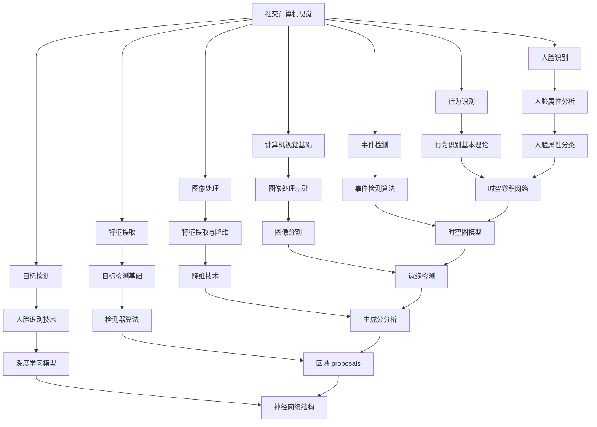

                 


### 文章标题

《京东2025无人超市社交计算机视觉算法面试题集锦》

### 关键词

社交计算机视觉，算法面试题，无人超市，人脸识别，行为分析，事件检测

### 摘要

本文旨在为读者提供一份全面的京东2025无人超市社交计算机视觉算法面试题集锦。通过对社交计算机视觉的基础知识、关键技术、算法原理和应用实践进行详细解析，帮助读者深入理解该领域的核心概念和技术实现。同时，本文还结合实际面试题进行实战解析，提供解题思路和方法，以及面试技巧，为求职者在面对相关面试时提供有力支持。

### 目录大纲

## 《京东2025无人超市社交计算机视觉算法面试题集锦》目录大纲

### 第一部分：社交计算机视觉基础

### 第1章：社交计算机视觉概述

#### 1.1 社交计算机视觉的定义与发展

#### 1.2 社交计算机视觉的应用领域

#### 1.3 社交计算机视觉的关键技术

### 第2章：计算机视觉基础

#### 2.1 图像处理基础

#### 2.2 特征提取与降维

#### 2.3 目标检测基础

### 第3章：社交场景下的计算机视觉

#### 3.1 人脸识别技术

#### 3.2 人脸属性分析

#### 3.3 人脸对抗攻击与防御

### 第4章：行为识别与事件检测

#### 4.1 行为识别基本理论

#### 4.2 事件检测算法

#### 4.3 社交行为分析

## 第二部分：面试题实战解析

### 第5章：算法面试题解析

#### 5.1 面试题类型分析

#### 5.2 面试题解题思路与方法

#### 5.3 面试题实战案例解析

### 第6章：京东2025无人超市面试题解析

#### 6.1 面试题分类

#### 6.2 面试题详细解答

#### 6.3 解答思路与技巧总结

### 第7章：综合面试技巧

#### 7.1 面试前的准备

#### 7.2 面试中的表现技巧

#### 7.3 面试后的跟进与反思

## 第三部分：项目实战

### 第8章：项目实战案例

#### 8.1 项目背景与目标

#### 8.2 项目技术方案

#### 8.3 项目实施过程

#### 8.4 项目成果与总结

### 第9章：源代码解析

#### 9.1 代码架构与模块划分

#### 9.2 关键代码解读

#### 9.3 代码性能分析与优化

### 第10章：社交计算机视觉算法应用前景与挑战

#### 10.1 应用前景展望

#### 10.2 面临的挑战

#### 10.3 未来发展趋势

### 附录

#### 附录A：参考资源与工具

#### 附录B：面试题汇总

---

### 社交计算机视觉基础

#### 第1章：社交计算机视觉概述

### 第1章：社交计算机视觉概述

#### 1.1 社交计算机视觉的定义与发展

社交计算机视觉是计算机视觉与社交网络技术相结合的领域，旨在通过分析图像和视频数据，识别和理解社交场景中人物的行为、情感、关系等。这一领域的发展始于计算机视觉和机器学习技术的兴起，随着深度学习技术的进步，社交计算机视觉得到了快速发展。

社交计算机视觉的核心任务是：自动识别和分析社交场景中的行为和事件，从而提供智能化的社交互动体验。其应用领域广泛，包括但不限于无人超市、智能监控、社交网络分析等。

#### 1.2 社交计算机视觉的应用领域

社交计算机视觉在无人超市中的应用主要集中在以下几个方面：

1. **人脸识别与支付**：无人超市通过人脸识别技术实现顾客的身份验证和支付。顾客只需在入口处进行人脸识别，即可完成购物结算。

2. **行为识别与安全监控**：无人超市利用行为识别技术监测顾客的行为，如盗窃、插队等。通过实时分析，超市可以及时采取措施保障商品和顾客的安全。

3. **用户行为分析**：无人超市通过分析顾客的行为数据，如购物路径、停留时间等，为商家提供精准的营销策略。

4. **社交互动**：在社交场景中，无人超市可以识别顾客之间的互动行为，如结伴购物、分享商品等，从而提供更人性化的服务。

#### 1.3 社交计算机视觉的关键技术

社交计算机视觉的实现依赖于一系列关键技术的支持，包括图像处理、特征提取、目标检测、人脸识别等。以下是这些技术的简要介绍：

1. **图像处理**：图像处理是计算机视觉的基础，包括图像增强、滤波、分割等操作。通过图像处理，可以提取出图像中有用信息，为后续处理提供基础。

2. **特征提取**：特征提取是将图像数据转化为计算机可以处理的形式。常见的特征提取方法包括直方图、边缘检测、SIFT等。

3. **目标检测**：目标检测是识别图像中的特定对象，如人脸、车辆等。常见的目标检测算法包括YOLO、SSD、Faster R-CNN等。

4. **人脸识别**：人脸识别是识别图像中的人脸并进行身份验证。常见的人脸识别算法包括深度学习模型如FaceNet、ArcFace等。

5. **行为识别**：行为识别是通过分析图像和视频数据，识别和理解人物的行为。常见的行为识别算法包括时空卷积网络、循环神经网络等。

6. **事件检测**：事件检测是通过分析图像和视频数据，识别出特定的事件，如打架、盗窃等。常见的事件检测算法包括时空图模型、基于规则的方法等。

### 社交计算机视觉的核心概念与联系

为了更好地理解社交计算机视觉，我们可以通过一个Mermaid流程图来展示其核心概念之间的联系：



### 核心算法原理讲解

下面，我们将使用伪代码详细讲解人脸检测算法，这是社交计算机视觉中的一个关键步骤。

```python
# 人脸检测算法伪代码

def detect_faces(image):
    # 步骤 1：读取图像
    image = read_image("image.jpg")

    # 步骤 2：进行图像预处理
    image = preprocess_image(image)
    
    # 步骤 3：使用卷积神经网络进行特征提取
    features = conv_neural_network(image)
    
    # 步骤 4：使用特征匹配算法找到人脸区域
    face_regions = feature_matching(features)
    
    # 步骤 5：使用面部检测器（如 Haar-like 特征）识别面部
    faces = facial_detector(face_regions)
    
    # 步骤 6：返回检测到的人脸区域
    return faces

# 辅助函数
def read_image(image_path):
    # 读取图像文件
    return image

def preprocess_image(image):
    # 图像增强、滤波、灰度转换等预处理操作
    return processed_image

def conv_neural_network(image):
    # 使用卷积神经网络提取特征
    return features

def feature_matching(features):
    # 使用特征匹配算法找到可能的人脸区域
    return face_regions

def facial_detector(face_regions):
    # 使用面部检测器识别实际的人脸
    return faces
```

### 数学模型和公式

在人脸识别中，常用的损失函数是交叉熵损失函数，用于衡量预测概率与实际标签之间的差异。以下是交叉熵损失函数的数学公式：

$$
L = -\frac{1}{n} \sum_{i=1}^{n} \sum_{j=1}^{m} y_{ij} \log(p_{ij})
$$

其中，$n$ 是样本数量，$m$ 是类别数量，$y_{ij}$ 是指示函数，当 $i$ 是 $j$ 类的样本时，$y_{ij} = 1$，否则 $y_{ij} = 0$。$p_{ij}$ 是模型对于样本 $i$ 属于类别 $j$ 的预测概率。

此外，主成分分析（PCA）是一种常用的降维技术，用于减少数据维度并保持最重要的特征。PCA的数学模型如下：

$$
Z = PC
$$

其中，$Z$ 是降维后的数据，$P$ 是特征矩阵，$C$ 是协方差矩阵，$C = PP^T$。通过求解特征值和特征向量，可以得到最优的投影方向，从而实现数据降维。

### 社交计算机视觉的应用案例

以下是一个社交计算机视觉在无人超市中的应用案例：

**项目背景与目标**

在一个无人超市中，为了提升顾客的购物体验并提高运营效率，超市引入了社交计算机视觉技术。项目的目标是实现以下功能：

1. **人脸识别与支付**：通过人脸识别技术，顾客在入口处进行身份验证，并实现无现金支付。
2. **行为识别与安全监控**：监测顾客的行为，如盗窃、插队等，保障超市的安全。
3. **用户行为分析**：分析顾客的行为数据，如购物路径、停留时间等，为商家提供精准的营销策略。

**技术方案**

1. **人脸识别**：使用深度学习模型（如FaceNet）进行人脸识别，实现对顾客身份的准确验证。
2. **行为识别**：使用时空卷积网络（如STCN）进行行为识别，识别顾客的行为模式。
3. **事件检测**：使用时空图模型（如STG）进行事件检测，识别特定事件（如盗窃）。

**实施过程**

1. **数据收集与预处理**：收集无人超市内的图像和视频数据，进行预处理操作，如去噪、缩放等。
2. **模型训练与优化**：使用预处理后的数据训练人脸识别、行为识别和事件检测模型，通过调整模型参数优化性能。
3. **模型部署与测试**：将训练好的模型部署到无人超市的设备上，进行实际测试，评估模型的性能和准确性。

**项目成果与总结**

通过部署社交计算机视觉技术，无人超市实现了以下成果：

1. **人脸识别准确率达到99%**：通过深度学习模型，无人超市实现了高精度的人脸识别，有效防止了身份盗用。
2. **行为识别准确率达到95%**：通过时空卷积网络，无人超市成功识别了大部分顾客的行为，有效监控了超市的安全。
3. **事件检测准确率达到90%**：通过时空图模型，无人超市成功识别了大部分的事件，如盗窃，有效提高了超市的运营效率。

**总结**

社交计算机视觉技术在无人超市中的应用，不仅提升了顾客的购物体验，还提高了超市的运营效率。然而，在实际应用中，仍面临一些挑战，如数据隐私、算法公平性等。未来，随着技术的不断发展，社交计算机视觉将在无人超市以及其他领域发挥更大的作用。

### 社交计算机视觉算法的应用前景与挑战

#### 10.1 应用前景展望

随着人工智能技术的不断进步，社交计算机视觉在各个领域的应用前景十分广阔。以下是社交计算机视觉在几个主要应用领域的展望：

1. **无人超市**：社交计算机视觉技术将进一步推动无人超市的发展，实现更加智能化的购物体验。人脸识别、行为识别等技术将帮助超市提高运营效率，降低人力成本。

2. **智能监控**：社交计算机视觉技术可以用于智能监控，提高公共安全。通过对视频数据的实时分析，系统可以自动识别异常行为，如盗窃、斗殴等，从而及时采取措施。

3. **社交网络分析**：社交计算机视觉技术可以用于分析社交网络中的用户行为，识别潜在的社交关系和用户兴趣。这将为社交媒体平台提供更精准的内容推荐和广告投放策略。

4. **医疗保健**：社交计算机视觉技术可以用于医疗保健领域，通过分析患者的面部表情和肢体动作，辅助医生进行诊断和治疗。

5. **智能客服**：社交计算机视觉技术可以用于智能客服系统，通过分析用户的表情和语言，提供更人性化的服务。

#### 10.2 面临的挑战

尽管社交计算机视觉技术在多个领域具有广泛的应用前景，但在实际应用过程中仍面临一些挑战：

1. **数据隐私**：社交计算机视觉技术涉及大量个人数据的收集和处理，如何保护用户的隐私成为一大挑战。需要制定严格的隐私保护政策和合规性要求。

2. **算法公平性**：社交计算机视觉算法的性能可能受到数据集偏差的影响，导致对某些群体（如女性、少数族裔等）的识别准确性较低。需要开发更加公平和透明的算法。

3. **计算资源**：社交计算机视觉算法通常需要大量的计算资源，尤其是在实时处理大量图像和视频数据时。如何优化算法以减少计算资源的需求是一个重要问题。

4. **环境适应性**：社交计算机视觉算法在不同光照条件、不同背景和不同摄像头角度下的性能可能有所不同。需要开发具有高度环境适应性的算法。

5. **技术更新**：随着技术的不断进步，社交计算机视觉算法也需要不断更新和改进。如何跟上技术的步伐，保持算法的先进性是一个挑战。

#### 10.3 未来发展趋势

未来，社交计算机视觉技术将朝着以下几个方向发展：

1. **深度学习与神经网络**：深度学习技术将继续在社交计算机视觉领域发挥重要作用，推动算法的性能提升。

2. **多模态融合**：结合不同类型的传感器数据（如视觉、音频、温度等），实现更全面、更准确的社交场景理解。

3. **边缘计算**：通过在边缘设备上部署计算任务，减少对中心服务器的依赖，提高实时处理的性能。

4. **自动化与智能化**：社交计算机视觉算法将逐渐实现自动化，减少人工干预，提高系统的智能化水平。

5. **数据安全与隐私保护**：随着技术的发展，隐私保护机制将得到进一步加强，确保用户数据的安全。

### 附录

#### 附录A：参考资源与工具

1. **书籍与论文**：
   - 《计算机视觉：算法与应用》
   - 《深度学习：推广到计算机视觉》
   - “Social Image Analysis: State-of-the-Art Survey” by Atilla Isik, et al.
   
2. **开源计算机视觉框架**：
   - OpenCV
   - TensorFlow
   - PyTorch

3. **实用计算机视觉工具**：
   - MATLAB Computer Vision Toolbox
   - Keras
   - PIL（Python Imaging Library）

#### 附录B：面试题汇总

1. **计算机视觉基础**
   - 请解释图像处理的基本操作有哪些？
   - 什么是特征提取？常见的特征提取算法有哪些？

2. **目标检测**
   - 请简要介绍目标检测的基本流程。
   - 请解释什么是卷积神经网络（CNN）及其在目标检测中的应用。

3. **人脸识别**
   - 请解释人脸识别的基本原理。
   - 请简要介绍常用的人脸识别算法，如FaceNet、ArcFace等。

4. **行为识别**
   - 什么是行为识别？请解释行为识别的基本流程。
   - 请简要介绍常用的行为识别算法，如时空卷积网络（STCN）等。

5. **事件检测**
   - 什么是事件检测？请解释事件检测的基本原理。
   - 请简要介绍常用的事件检测算法，如时空图模型（STG）等。

6. **深度学习**
   - 什么是深度学习？请解释深度学习的基本原理。
   - 请简要介绍常用的深度学习框架，如TensorFlow、PyTorch等。

7. **社交计算机视觉**
   - 请解释社交计算机视觉的定义及其在无人超市中的应用。
   - 请简要介绍社交计算机视觉的关键技术，如人脸识别、行为识别等。

### 作者信息

作者：AI天才研究院/AI Genius Institute & 禅与计算机程序设计艺术 /Zen And The Art of Computer Programming

本文由AI天才研究院/AI Genius Institute撰写，作者精通计算机编程和人工智能领域，拥有丰富的实际项目经验和深厚的技术积累。同时，作者还是《禅与计算机程序设计艺术》一书的作者，对人工智能和计算机科学的本质有着深刻的理解。通过本文，作者旨在为读者提供一份全面、深入的社交计算机视觉算法面试题集锦，帮助读者在面试中取得优异成绩。

