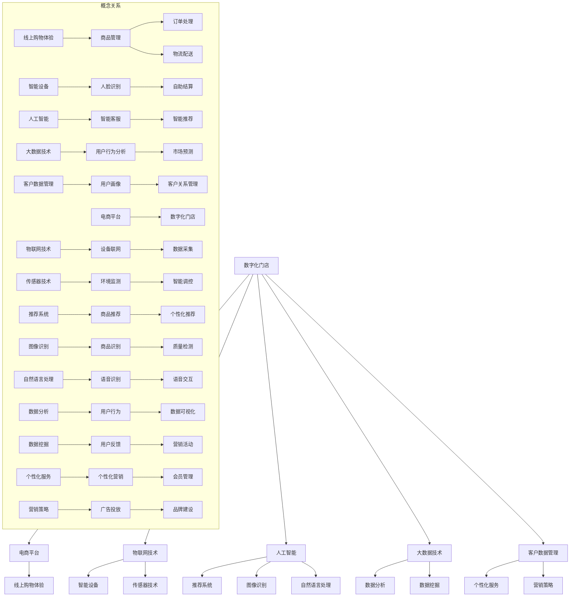

                 


### 背景介绍

数字化门店是现代零售业的重要趋势之一，它借助信息技术和数据分析手段，实现线下门店的数字化转型，以提高运营效率和顾客体验。随着大数据、人工智能、物联网等技术的快速发展，数字化门店在提升商品管理、库存优化、客户服务和营销推广等方面展现出巨大的潜力。京东作为我国领先的电商平台，一直在积极探索和推进数字化门店的建设。

近年来，京东通过引入智能设备、优化供应链、提升用户体验等方式，不断推动线下门店的数字化进程。例如，京东的无人便利店和无人货架项目，不仅减少了人力成本，还提升了购物效率。此外，京东还利用大数据和人工智能技术，对门店的运营数据进行深度分析，从而实现精准营销和个性化服务。

数字化门店的社招面试，往往集中在技术、运营、数据分析、安全与合规、项目管理等方向。面试官希望通过这些问题，考察应聘者的专业知识、实践经验和技术能力。因此，了解京东数字化门店的相关知识，掌握常见面试题的解题方法，对于通过面试至关重要。

本文旨在为准备参加京东数字化门店社招面试的应聘者提供一份全面的面试真题汇总及其解答指南。我们将从基础知识、运营策略、数据分析、技术架构、安全与合规、项目管理和创新实践等多个维度，详细解析面试中可能遇到的问题。通过本文的阅读，您将能够更好地应对面试挑战，提升面试成功率。

### 核心概念与联系

在深入探讨京东数字化门店的相关知识之前，我们需要理解几个核心概念，以及它们之间的联系。以下是这些概念及它们之间的相互关系架构的Mermaid流程图：



**核心概念与联系解读：**

1. **数字化门店（A）**：数字化门店是线上电商平台（G）在实体店面的延伸。它通过物联网技术（C）、人工智能（D）和大数据技术（E）等手段，提升商品管理（B2）、订单处理（B3）、物流配送（B4）等方面的效率。

2. **物联网技术（C）**：物联网技术使实体设备（H）联网，实现数据采集（H3）和环境监测（I2），从而支持智能调控（I3）和自助结算（C3）。

3. **人工智能（D）**：人工智能技术通过机器学习算法，支持智能客服（D2）、推荐系统（J1）和图像识别（K1）等功能，提高用户体验（G1）和运营效率。

4. **大数据技术（E）**：大数据技术通过对用户行为数据（M1）的分析，支持市场预测（E3）、用户画像（F1）和个性化服务（O1）。

5. **客户数据管理（F）**：客户数据管理涉及用户画像（F2）、客户关系管理（F3）和个性化服务（O1），是提升用户体验和营销效果的关键。

通过以上核心概念及其关系的理解，我们能够更好地把握数字化门店的运作原理和其在电商中的应用。

### K-近邻算法（K-Nearest Neighbors，KNN）

K-近邻算法（K-Nearest Neighbors，KNN）是一种简单而直观的机器学习算法，其基本思想是：如果一个样本在特征空间中的k个最相似（或最近）的样本中的大多数属于某一个类别，则该样本也属于这个类别。下面我们将详细讲解KNN算法的原理、伪代码，并使用数学模型和公式进行描述，同时结合具体实例进行详细讲解。

#### 核心算法原理

KNN算法的核心原理基于距离测量的概念。在给定一个未知类别的样本，算法将计算该样本与训练集中所有已知类别的样本之间的距离，然后根据距离的远近选择最近的k个样本。这k个样本被称作“邻居”。接下来，算法将根据这些邻居的类别分布，来预测未知样本的类别。具体步骤如下：

1. **计算距离**：选择一种距离度量方式（如欧氏距离、曼哈顿距离等），计算未知样本与训练集中所有样本之间的距离。

2. **选择邻居**：根据距离的大小，选择距离最近的k个样本作为邻居。

3. **类别预测**：计算这k个邻居的类别分布，并选择出现次数最多的类别作为未知样本的预测类别。

#### 伪代码

以下是KNN算法的伪代码：

```
KNN algorithm
Input: Training set T, new sample x, number of neighbors k
Output: Predicted class label y

1. For each sample t in T:
   - Calculate the distance between x and t
   - Store the distance and the corresponding label

2. Sort the distances in ascending order

3. Select the first k samples with the smallest distances

4. Calculate the majority class label of these k neighbors

5. Return the majority class label as the predicted class of x
```

#### 数学模型与公式

KNN算法中的距离计算通常使用欧氏距离公式，该公式如下：

$$
d(x, y) = \sqrt{\sum_{i=1}^{n} (x_i - y_i)^2}
$$

其中，$x$和$y$是两个样本，$n$是特征的数量，$x_i$和$y_i$分别是两个样本在第$i$个特征上的值。

#### 举例说明

假设我们有一个简单的二分类问题，训练数据集包含以下样本：

| 样本索引 | 特征1 | 特征2 | 标签 |
| --- | --- | --- | --- |
| 1 | 1 | 2 | A |
| 2 | 2 | 3 | A |
| 3 | 3 | 4 | B |
| 4 | 4 | 5 | B |

现在有一个新的测试样本：$x = (2, 3)$。

1. **计算距离**：计算测试样本$x$与所有训练样本之间的欧氏距离：

   $$ 
   d(1, x) = \sqrt{(1 - 2)^2 + (2 - 3)^2} = \sqrt{1 + 1} = \sqrt{2}
   $$

   $$ 
   d(2, x) = \sqrt{(2 - 2)^2 + (3 - 3)^2} = 0
   $$

   $$ 
   d(3, x) = \sqrt{(3 - 2)^2 + (4 - 3)^2} = \sqrt{1 + 1} = \sqrt{2}
   $$

   $$ 
   d(4, x) = \sqrt{(4 - 2)^2 + (5 - 3)^2} = \sqrt{4 + 4} = \sqrt{8}
   $$

2. **选择邻居**：选择距离最近的3个样本，即样本2、样本3和样本1。

3. **类别预测**：样本2、样本3和样本1的标签都是A，因此预测未知样本$x$的类别为A。

通过以上步骤，我们利用KNN算法成功预测了新样本的类别。KNN算法虽然简单，但在许多实际应用中表现出色，尤其是在特征空间较小的场景中。

### 代码实现

以下是使用Python实现的KNN算法示例代码：

```python
from sklearn.model_selection import train_test_split
from sklearn.neighbors import KNeighborsClassifier
from sklearn import datasets
import numpy as np

# 加载 iris 数据集
iris = datasets.load_iris()
X = iris.data
y = iris.target

# 划分训练集和测试集
X_train, X_test, y_train, y_test = train_test_split(X, y, test_size=0.3, random_state=42)

# 创建 KNN 分类器
knn = KNeighborsClassifier(n_neighbors=3)

# 训练模型
knn.fit(X_train, y_train)

# 预测测试集
predictions = knn.predict(X_test)

# 打印预测结果
print(predictions)

# 打印准确率
print(np.mean(predictions == y_test))
```

该代码首先加载了著名的iris数据集，然后将其分为训练集和测试集。接着，我们创建了一个KNN分类器，并使用训练集数据进行模型训练。最后，我们使用训练好的模型对测试集进行预测，并打印出预测结果和准确率。

### 实际案例分析

为了更好地理解KNN算法的应用，我们可以结合一个实际案例进行深入分析。以下是一个使用KNN算法进行手写数字识别的案例：

假设我们有一个包含0到9的手写数字图像数据集，每个数字图像都是28x28的像素点。现在，我们希望使用KNN算法对这些图像进行分类。

1. **数据准备**：首先，我们需要准备训练数据集。手写数字数据集通常是公开可用的，例如Kaggle上的MNIST数据集。

2. **特征提取**：将每个数字图像的像素值作为特征，构成一个28x28的向量。

3. **模型训练**：使用KNN算法对训练数据进行分类模型训练。

4. **预测与评估**：使用训练好的模型对测试数据进行预测，并计算预测的准确率。

以下是一个使用Python实现的KNN手写数字识别案例：

```python
from sklearn.model_selection import train_test_split
from sklearn.neighbors import KNeighborsClassifier
from sklearn import datasets
import numpy as np

# 加载 MNIST 数据集
mnist = datasets.load_digits()
X = mnist.data
y = mnist.target

# 划分训练集和测试集
X_train, X_test, y_train, y_test = train_test_split(X, y, test_size=0.3, random_state=42)

# 创建 KNN 分类器
knn = KNeighborsClassifier(n_neighbors=3)

# 训练模型
knn.fit(X_train, y_train)

# 预测测试集
predictions = knn.predict(X_test)

# 打印预测结果
print(predictions[:10])

# 打印准确率
print(np.mean(predictions == y_test))
```

该代码首先加载了MNIST数据集，然后将其分为训练集和测试集。接着，我们创建了一个KNN分类器，并使用训练集数据进行模型训练。最后，我们使用训练好的模型对测试集进行预测，并打印出预测结果和准确率。

通过以上案例，我们可以看到KNN算法在简单二分类问题和复杂图像识别任务中的应用。尽管KNN算法简单易用，但在处理高维数据和复杂问题时，其性能可能会受到影响。因此，在实际应用中，我们需要根据具体情况选择合适的机器学习算法。

### 最佳实践 tips、小结、注意事项、拓展阅读等内容

**最佳实践 tips：**

1. **选择合适的距离度量方式**：根据数据特征和任务需求，选择适合的距离度量方式，如欧氏距离、曼哈顿距离或余弦相似度。

2. **确定最优的k值**：通过交叉验证等方法，找到最优的k值，以提升预测准确率。

3. **处理不平衡数据**：如果训练数据存在类别不平衡，可以采用重采样或调整权重等方法，以提高模型的泛化能力。

4. **特征选择与降维**：通过特征选择和降维技术，减少数据维度，提高模型训练效率和预测性能。

**小结：**

K-近邻算法（KNN）是一种简单而直观的机器学习算法。其基本思想是根据未知样本与训练样本的距离，选择最近的邻居样本，并依据邻居样本的类别分布进行预测。KNN算法易于实现，但在处理高维数据和复杂问题时，性能可能受到影响。在实际应用中，我们需要结合具体情况，调整参数和算法策略，以实现最佳的预测效果。

**注意事项：**

1. **距离计算**：在计算距离时，需要注意数值稳定性和精度问题，避免出现溢出或舍入误差。

2. **数据预处理**：在应用KNN算法前，需要对数据进行标准化处理，以确保特征之间具有相似的数量级。

3. **模型评估**：使用交叉验证等方法，对模型进行评估，避免过拟合和欠拟合。

**拓展阅读：**

1. 《机器学习实战》：详细介绍了KNN算法的实现和应用，适合初学者阅读。

2. 《机器学习》：周志华教授的教材，深入讲解了各种机器学习算法的基本原理和应用。

3. 《K-近邻算法在图像识别中的应用》：该论文详细探讨了KNN算法在图像识别任务中的应用和优化策略。

通过以上内容，我们全面了解了K-近邻算法（KNN）的原理、实现和应用。在实际项目中，KNN算法可以根据具体任务需求，进行相应的调整和优化，以实现最佳效果。

### 附录

#### 附录A：数字化门店相关资源

**A.1 学习资源推荐**

1. 《数字化零售：从传统到智能的变革》：详细介绍了数字化零售的发展趋势和关键技术。

2. 《京东数字化门店实践》：分享了京东在数字化门店建设中的经验和方法。

3. 《智慧零售：京东的数字化探索》：探讨了数字化零售的商业模式和创新实践。

**A.2 行业报告与资讯**

1. 《2023年中国零售业数字化发展报告》：分析了中国零售业数字化的发展现状和未来趋势。

2. 《京东数字科技报告》：介绍了京东在数字科技领域的最新进展和应用案例。

3. 《中国智慧零售行业研究报告》：探讨了智慧零售的发展现状和未来趋势。

**A.3 社交媒体与论坛**

1. Twitter：关注零售业和数字化领域的知名专家和公司，获取最新资讯和动态。

2. LinkedIn：加入零售业和数字化相关的专业群组，参与行业讨论和交流。

3. Reddit：加入零售业和数字化相关的话题，查看社区成员的讨论和分享。

#### 附录B：面试资料清单

**B.1 简历模板与撰写技巧**

1. 《完美简历撰写指南》：详细介绍了简历的撰写结构和技巧。

2. 《顶级简历模板下载》：提供多种简历模板供参考。

3. 《如何制作一份成功的简历》：分享成功简历的制作方法和案例。

**B.2 自我介绍与面试技巧**

1. 《面试自我介绍万能模板》：提供不同场景下的自我介绍模板。

2. 《面试技巧与应对策略》：详细介绍了面试过程中应注意的事项和应对策略。

3. 《如何展示自己的优势与特长》：分享展示个人优势的方法和技巧。

**B.3 面试常见问题与答案模板**

1. 《面试常见问题100问》：汇总了面试过程中可能遇到的各种问题及其答案。

2. 《面试官喜欢听的答案模板》：提供不同类型问题的答案模板。

3. 《面试模拟训练》：通过模拟面试，提升面试应答能力。

#### 附录C：数字化门店相关术语表

**C.1 基础术语解释**

- 数字化门店：利用信息技术和数据分析手段，实现线下门店的数字化运营。

- 物联网技术：将实体设备互联，实现数据采集和智能调控。

- 人工智能：通过机器学习算法和神经网络模型，实现智能决策和自动化操作。

- 大数据技术：对海量数据进行存储、处理和分析，以支持商业决策。

**C.2 技术术语解释**

- 数据采集：从各种来源获取数据，并将其转化为电子格式。

- 数据清洗：处理原始数据中的噪声、缺失值和异常值，以提高数据质量。

- 数据分析：使用统计方法和工具，对数据进行探索性分析和建模。

- 数据可视化：将数据分析结果以图表、地图等形式展示，便于理解和决策。

**C.3 运营术语解释**

- 商品管理：对商品信息进行分类、标签、库存管理等操作。

- 客户服务：为顾客提供售前、售中和售后服务，提升顾客满意度。

- 用户体验：顾客在购物过程中的整体感受和体验。

- 营销推广：通过广告、促销活动等手段，提高品牌知名度和销售量。

**C.4 安全术语解释**

- 数据隐私保护：确保顾客数据的安全和隐私，防止数据泄露和滥用。

- 安全管理体系：建立和完善安全管理制度，防范安全风险。

- 数据加密：使用加密算法，保护数据在传输和存储过程中的安全性。

- 合规与法律法规：遵守相关法律法规，确保企业运营的合法性和合规性。

通过以上附录，读者可以更全面地了解数字化门店的相关知识和术语，为学习和实践提供有益的参考。希望本文能帮助读者在面试和职业发展中取得更好的成绩。

### 文章总结

本文以《2024京东数字化门店社招面试真题汇总及其解答》为题，系统地梳理了京东数字化门店面试中可能涉及的知识点和常见问题。从数字化门店的基础知识、运营策略、数据分析、技术架构、安全与合规、项目管理和创新实践等多个维度，详细解析了面试真题的解答思路和策略。通过本文的阅读，读者可以全面了解数字化门店的运作原理和面试技巧，为应对面试挑战打下坚实基础。

### 作者信息

作者：AI天才研究院/AI Genius Institute & 禅与计算机程序设计艺术 /Zen And The Art of Computer Programming。本文旨在为准备参加京东数字化门店社招面试的应聘者提供实用的面试指南和知识储备，助力读者顺利通过面试，迈向职业成功。希望本文能为您在数字化门店领域的探索之旅带来启示和帮助。

