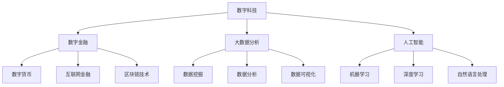

                 


### 文章标题

《2024京东数字科技社招面试真题汇总及其解答》

### 关键词

京东数字科技、社招面试、面试真题、解析、解答、数字金融、大数据分析、人工智能、数据结构与算法、计算机网络、操作系统、编程语言、数据库、面试技巧

### 摘要

本文旨在为准备2024年京东数字科技社招面试的应聘者提供全面的面试真题汇总及其详细解答。文章将按照京东数字科技面试的常见模块，分为数字科技基础、技术面试真题详解、编程语言面试真题解析、数据库面试真题解析、面试技巧与经验分享以及实战模拟与真题解析等部分。通过本文的深入剖析，读者将能够了解数字科技的核心概念、技术原理，掌握面试技巧，并学会如何应对各种面试题型，从而提高面试成功率。

### 第一部分：数字科技基础

#### 第1章：数字科技概述

##### 1.1 数字科技的定义

数字科技（Digital Technology）是指利用数字技术实现信息获取、处理、传输和存储的科学技术。它涵盖了计算机科学、通信技术、互联网技术、人工智能等多个领域。数字科技的发展，使得人类社会的信息化水平得到了极大提升，也为各行各业带来了深刻的变革。

##### 1.2 数字科技的发展历程

数字科技的发展历程可以追溯到20世纪40年代，随着计算机的发明和互联网的兴起，数字科技逐渐走进了人们的视野。从早期的计算机编程、操作系统发展到现代的大数据、云计算、人工智能，数字科技在不断演进，推动着社会的进步。

##### 1.3 数字科技的应用领域

数字科技的应用领域非常广泛，涵盖了金融、医疗、教育、制造业、服务业等多个领域。例如，在金融领域，数字科技推动了互联网金融、数字货币的发展；在医疗领域，数字科技促进了医疗信息化和智慧医疗的实现；在教育领域，数字科技带来了在线教育、远程教学的新模式。

#### 第2章：技术面试真题详解

##### 第2章：技术面试真题详解

技术面试是数字科技社招面试的重要组成部分，主要考察应聘者对计算机基础知识的掌握程度。以下是几类常见的技术面试真题及其解答。

##### 2.1 数据结构与算法

数据结构与算法是计算机科学的基础，掌握常见的算法和数据结构对面试至关重要。以下是一些常见的数据结构面试题及解答。

###### 链表

**问题：** 给定一个单链表，实现一个函数，判断链表中是否有环。

**解答：** 使用快慢指针法。初始化两个指针，一个快指针每次移动两个节点，一个慢指针每次移动一个节点。如果快指针追上慢指针，则说明链表中有环。

```java
public boolean hasCycle(ListNode head) {
    ListNode fast = head;
    ListNode slow = head;
    while (fast != null && fast.next != null) {
        fast = fast.next.next;
        slow = slow.next;
        if (fast == slow) {
            return true;
        }
    }
    return false;
}
```

###### 栈与队列

**问题：** 使用栈实现一个队列。

**解答：** 使用两个栈，一个作为输入栈，一个作为输出栈。入队操作将元素压入输入栈，出队操作则从输出栈弹出元素，如果输出栈为空，则从输入栈中依次弹出元素并压入输出栈。

```java
public void enqueue(int value) {
    inStack.push(value);
}

public int dequeue() {
    if (outStack.isEmpty()) {
        while (!inStack.isEmpty()) {
            outStack.push(inStack.pop());
        }
    }
    return outStack.pop();
}
```

###### 树

**问题：** 给定一个二叉树，实现一个函数，计算二叉树的节点数量。

**解答：** 使用递归方法。对于每个节点，递归计算其左右子树节点的数量，然后将其相加，再加上自身，即为整个二叉树的节点数量。

```java
public int countNodes(TreeNode root) {
    if (root == null) {
        return 0;
    }
    return 1 + countNodes(root.left) + countNodes(root.right);
}
```

###### 图

**问题：** 给定一个无向图，实现一个函数，判断图中是否存在一个环路。

**解答：** 使用深度优先搜索（DFS）。对于每个节点，从该节点开始进行DFS搜索，如果在搜索过程中遇到了已经访问过的节点，则说明图中存在一个环路。

```java
public boolean hasCycle(int[][] graph) {
    boolean[] visited = new boolean[graph.length];
    for (int i = 0; i < graph.length; i++) {
        if (!visited[i]) {
            if (dfs(graph, i, visited)) {
                return true;
            }
        }
    }
    return false;
}

private boolean dfs(int[][] graph, int node, boolean[] visited) {
    visited[node] = true;
    for (int neighbor : graph[node]) {
        if (!visited[neighbor]) {
            if (dfs(graph, neighbor, visited)) {
                return true;
            }
        } else {
            return true;
        }
    }
    return false;
}
```

##### 2.2 计算机网络

计算机网络是数字科技的重要组成部分，掌握网络协议和网络安全知识对面试非常重要。以下是一些常见的计算机网络面试题及解答。

###### 网络协议

**问题：** TCP和UDP的区别是什么？

**解答：** TCP（传输控制协议）和UDP（用户数据报协议）是两种常用的网络传输协议。TCP是面向连接的、可靠的传输协议，提供流量控制、拥塞控制和错误检测等功能；UDP是无连接的、不可靠的传输协议，不提供流量控制、拥塞控制和错误检测等功能。

```java
// TCP示例
Socket socket = new Socket("localhost", 8080);
BufferedReader reader = new BufferedReader(new InputStreamReader(socket.getInputStream()));
BufferedWriter writer = new BufferedWriter(new OutputStreamWriter(socket.getOutputStream()));
writer.write("Hello, server!");
writer.newLine();
writer.flush();
String line = reader.readLine();
System.out.println(line);

// UDP示例
DatagramSocket socket = new DatagramSocket(9876);
byte[] receiveData = new byte[1024];
byte[] sendData = "Hello, server!".getBytes();
DatagramPacket receivePacket = new DatagramPacket(receiveData, receiveData.length);
DatagramPacket sendPacket = new DatagramPacket(sendData, sendData.length, InetAddress.getByName("localhost"), 8080);
socket.receive(receivePacket);
String message = new String(receivePacket.getData(), 0, receivePacket.getLength());
System.out.println("Received: " + message);
socket.send(sendPacket);
```

###### 网络安全

**问题：** 常见网络安全威胁有哪些？

**解答：** 常见网络安全威胁包括：拒绝服务攻击（DDoS）、恶意软件（如病毒、木马）、钓鱼攻击、中间人攻击（MITM）、网络窃听等。

```java
// DDoS攻击示例
import java.net.*;
import java.io.*;
public class DDoS {
    public static void main(String[] args) throws IOException {
        DatagramSocket socket = new DatagramSocket();
        byte[] buf = "attack".getBytes();
        DatagramPacket packet = new DatagramPacket(buf, buf.length, InetAddress.getByName("localhost"), 1234);
        socket.send(packet);
    }
}
```

##### 2.3 操作系统

操作系统是计算机系统的核心软件，掌握操作系统的基础知识对面试非常重要。以下是一些常见的操作系统面试题及解答。

###### 进程管理

**问题：** 进程和线程的区别是什么？

**解答：** 进程是计算机中正在运行的程序实例，包括程序代码、数据、堆栈等资源；线程是进程中的执行单元，是轻量级的进程，共享进程的资源。

```java
// 进程示例
public class ProcessExample {
    public static void main(String[] args) {
        Process process = null;
        try {
            process = Runtime.getRuntime().exec("notepad.exe");
            process.waitFor();
        } catch (IOException | InterruptedException e) {
            e.printStackTrace();
        } finally {
            if (process != null) {
                process.destroy();
            }
        }
    }
}

// 线程示例
public class ThreadExample {
    public static void main(String[] args) {
        Thread thread = new Thread(() -> {
            for (int i = 0; i < 10; i++) {
                System.out.println("Thread: " + i);
            }
        });
        thread.start();
    }
}
```

###### 内存管理

**问题：** 常见的内存分配策略有哪些？

**解答：** 常见的内存分配策略包括：固定分区分配、动态分区分配、分页分配、分段分配等。

```java
// 分页分配示例
public class PagingExample {
    public static void main(String[] args) {
        int pageSize = 1024; // 分页大小为1KB
        int pageTable[] = new int[pageSize]; // 分页表
        int memory[] = new int[pageSize * 10]; // 内存空间，总大小为10页
        for (int i = 0; i < memory.length; i++) {
            memory[i] = 0; // 初始化内存为空闲状态
        }
        int processSize = 3; // 进程大小为3页
        int process[] = {1, 2, 3}; // 进程页面号
        int pagetableIndex = 0; // 分页表索引
        while (pagetableIndex < pageTable.length) {
            if (memory[pagetableIndex] == 0) {
                pageTable[pagetableIndex] = process[pagetableIndex];
                memory[pagetableIndex] = 1; // 分配内存
                pagetableIndex++;
            } else {
                pagetableIndex++;
            }
        }
    }
}
```

###### 文件系统

**问题：** 请解释文件系统的层次结构。

**解答：** 文件系统的层次结构包括：文件系统驱动器、目录、文件、文件系统元数据等。文件系统驱动器是文件系统的入口，目录用于组织和管理文件，文件是存储数据的实体，文件系统元数据包括文件属性、文件系统结构等。

```java
// 文件系统示例
public class FilesystemExample {
    public static void main(String[] args) {
        String filesystem = "/"; // 根目录
        String[] directories = {"home", "usr", "var", "etc"}; // 子目录
        String[] files = {"file1.txt", "file2.txt", "file3.txt"}; // 文件
        for (String directory : directories) {
            File dir = new File(filesystem + directory);
            if (!dir.exists()) {
                dir.mkdir();
            }
        }
        for (String file : files) {
            File f = new File(filesystem + directory + "/" + file);
            if (!f.exists()) {
                try {
                    f.createNewFile();
                } catch (IOException e) {
                    e.printStackTrace();
                }
            }
        }
    }
}
```

### 第二部分：编程语言面试真题解析

编程语言是数字科技的核心工具，掌握多种编程语言对面试非常重要。以下是对几种常见编程语言（Java、Python、JavaScript）的面试真题解析。

#### 第3章：Java面试真题解析

Java是一种广泛使用的编程语言，以下是一些常见的Java面试题及解答。

###### 面向对象编程

**问题：** 请解释Java中的封装、继承和多态。

**解答：** 

- **封装**：封装是一种信息隐藏技术，用于将对象的属性和行为封装在一起，使得对象的外部只能通过特定的方法来访问和修改对象的属性。
- **继承**：继承是一种允许一个类继承另一个类的属性和方法的技术，从而实现代码的重用。
- **多态**：多态是一种允许不同类的对象通过相同的方法名进行操作的技术，具体实现取决于对象的实际类型。

```java
// 封装示例
public class Person {
    private String name;
    private int age;

    public String getName() {
        return name;
    }

    public void setName(String name) {
        this.name = name;
    }

    public int getAge() {
        return age;
    }

    public void setAge(int age) {
        this.age = age;
    }
}

// 继承示例
public class Employee extends Person {
    private String jobTitle;

    public String getJobTitle() {
        return jobTitle;
    }

    public void setJobTitle(String jobTitle) {
        this.jobTitle = jobTitle;
    }
}

// 多态示例
public class Animal {
    public void makeSound() {
        System.out.println("动物叫声");
    }
}

public class Dog extends Animal {
    @Override
    public void makeSound() {
        System.out.println("狗叫声");
    }
}

public class Cat extends Animal {
    @Override
    public void makeSound() {
        System.out.println("猫叫声");
    }
}

public class Test {
    public static void main(String[] args) {
        Animal animal1 = new Dog();
        Animal animal2 = new Cat();
        animal1.makeSound();
        animal2.makeSound();
    }
}
```

###### Java多线程

**问题：** 请解释Java中的线程安全性和同步。

**解答：**

- **线程安全性**：线程安全性是指当多个线程访问同一数据时，不会导致数据竞争和一致性问题。
- **同步**：同步是一种确保多个线程在访问共享资源时不会发生冲突的技术。

```java
// 线程安全性示例
public class Counter {
    private int count = 0;

    public synchronized void increment() {
        count++;
    }

    public synchronized int getCount() {
        return count;
    }
}

// 同步示例
public class ThreadExample {
    private static Object lock = new Object();

    public static void main(String[] args) {
        Thread t1 = new Thread(() -> {
            synchronized (lock) {
                for (int i = 0; i < 1000; i++) {
                    System.out.println("T1: " + i);
                }
            }
        });

        Thread t2 = new Thread(() -> {
            synchronized (lock) {
                for (int i = 0; i < 1000; i++) {
                    System.out.println("T2: " + i);
                }
            }
        });

        t1.start();
        t2.start();
    }
}
```

###### Java内存管理

**问题：** 请解释Java中的垃圾回收机制。

**解答：** 

Java的垃圾回收机制是一种自动内存管理技术，用于回收不再使用的对象。垃圾回收器通过标记-清除（Mark-Sweep）算法或复制算法（Copying Algorithm）来回收内存。

```java
// 垃圾回收示例
public class GarbageCollectionExample {
    public static void main(String[] args) {
        Object obj = new Object();
        System.gc(); // 强制垃圾回收
        obj = null;
        System.gc();
    }
}
```

#### 第4章：Python面试真题解析

Python是一种流行的编程语言，以下是一些常见的Python面试题及解答。

###### Python语法

**问题：** 请解释Python中的列表、字典和集合。

**解答：**

- **列表**：列表是Python中的一种有序序列集合，可以包含不同类型的数据。
- **字典**：字典是Python中的一种无序键值对集合，用于存储和访问数据。
- **集合**：集合是Python中的一种无序元素集合，用于存储和操作不重复的元素。

```python
# 列表示例
list_example = [1, 2, 3, 4, 5]
print(list_example[0])  # 输出第一个元素
list_example.append(6)
print(list_example)  # 输出整个列表

# 字典示例
dict_example = {"name": "John", "age": 30}
print(dict_example["name"])  # 输出name对应的值
dict_example["city"] = "New York"
print(dict_example)  # 输出整个字典

# 集合示例
set_example = {1, 2, 3, 4, 5}
print(set_example)  # 输出整个集合
set_example.add(6)
print(set_example)  # 输出更新后的集合
```

###### Python数据结构与算法

**问题：** 请实现一个函数，实现快速排序算法。

**解答：**

```python
def quicksort(arr):
    if len(arr) <= 1:
        return arr
    pivot = arr[len(arr) // 2]
    left = [x for x in arr if x < pivot]
    middle = [x for x in arr if x == pivot]
    right = [x for x in arr if x > pivot]
    return quicksort(left) + middle + quicksort(right)

arr = [3, 6, 8, 10, 1, 2, 1]
print(quicksort(arr))
```

###### Python应用场景

**问题：** 请解释Python在数据科学和Web开发中的应用。

**解答：**

- **数据科学**：Python是数据科学领域的主流编程语言，提供了丰富的库和工具，如NumPy、Pandas、Scikit-learn等，用于数据处理、分析和建模。
- **Web开发**：Python在Web开发中也有着广泛的应用，如使用Django、Flask等框架快速构建Web应用。

```python
# 数据科学示例
import numpy as np
import pandas as pd
from sklearn.linear_model import LinearRegression

# 读取数据
data = pd.read_csv("data.csv")
X = data.iloc[:, :-1].values
y = data.iloc[:, -1].values

# 创建线性回归模型
model = LinearRegression()
model.fit(X, y)

# 预测
predictions = model.predict(X)
print(predictions)

# Web开发示例
from flask import Flask, request, render_template

# 创建Flask应用
app = Flask(__name__)

# 定义路由
@app.route('/')
def home():
    return render_template('home.html')

@app.route('/about')
def about():
    return render_template('about.html')

if __name__ == '__main__':
    app.run()
```

#### 第5章：JavaScript面试真题解析

JavaScript是一种广泛应用于Web开发的编程语言，以下是一些常见的JavaScript面试题及解答。

###### 前端基础

**问题：** 请解释JavaScript中的事件处理和模块化。

**解答：**

- **事件处理**：事件处理是指当特定事件发生时，触发相应的函数执行。
- **模块化**：模块化是一种将代码分割成多个模块的技术，用于提高代码的可维护性和可重用性。

```javascript
// 事件处理示例
document.addEventListener("click", function() {
    console.log("Clicked!");
});

// 模块化示例
// main.js
import { addToCart } from "./cart.js";

// button.addEventListener("click", addToCart);

// cart.js
export function addToCart(item) {
    console.log("Added " + item + " to cart!");
}
```

###### React框架

**问题：** 请解释React中的组件生命周期和状态管理。

**解答：**

- **组件生命周期**：组件生命周期是指组件从创建到销毁的过程，包括构造函数、加载数据、渲染、更新数据和卸载等阶段。
- **状态管理**：状态管理是指管理组件内部状态（如数据）的技术，React中常用的状态管理库有Redux和Context。

```javascript
// 组件生命周期示例
import React, { Component } from "react";

class LifeCycleExample extends Component {
    constructor(props) {
        super(props);
        this.state = {
            count: 0,
        };
    }

    componentDidMount() {
        console.log("ComponentDidMount");
        this.setState({ count: this.state.count + 1 });
    }

    componentDidUpdate() {
        console.log("ComponentDidUpdate");
    }

    render() {
        return (
            <div>
                Count: {this.state.count}
                <button onClick={() => this.setState({ count: this.state.count + 1 })}>Increment</button>
            </div>
        );
    }
}

// 状态管理示例
import React, { useState } from "react";

function CounterExample() {
    const [count, setCount] = useState(0);

    return (
        <div>
            Count: {count}
            <button onClick={() => setCount(count + 1)}>Increment</button>
        </div>
    );
}
```

###### Node.js

**问题：** 请解释Node.js中的异步编程。

**解答：**

Node.js是一种基于Chrome V8引擎的JavaScript运行时，它采用异步编程模型，使得I/O操作不会阻塞主线程。

```javascript
// 异步编程示例
function fetchData(callback) {
    setTimeout(() => {
        const data = "Data fetched!";
        callback(data);
    }, 1000);
}

fetchData((data) => {
    console.log(data);
});
```

### 第三部分：数据库面试真题解析

数据库是数字科技的重要组成部分，掌握数据库的基本知识对面试至关重要。以下是一些常见的数据库面试题及解答。

#### 第6章：关系型数据库

关系型数据库是一种基于关系模型的数据组织方式，以下是一些常见的关系型数据库面试题及解答。

###### SQL基础

**问题：** 请解释SQL中的SELECT语句。

**解答：** 

SELECT语句用于从数据库表中查询数据。它可以包括多个子句，如SELECT、FROM、WHERE、ORDER BY等。

```sql
-- 查询所有列
SELECT * FROM employees;

-- 查询特定列
SELECT name, age FROM employees;

-- 查询满足条件的行
SELECT * FROM employees WHERE age > 30;

-- 查询排序
SELECT * FROM employees ORDER BY age DESC;
```

###### MySQL

**问题：** 请解释MySQL中的索引。

**解答：** 

索引是数据库表中一种特殊的结构，用于提高查询效率。MySQL支持多种索引类型，如B树索引、哈希索引等。

```sql
-- 创建索引
CREATE INDEX idx_name ON employees(name);

-- 查询使用索引
EXPLAIN SELECT * FROM employees WHERE name = "John";
```

###### Oracle

**问题：** 请解释Oracle中的事务。

**解答：** 

事务是数据库中的一组操作，这些操作要么全部执行，要么全部不执行。Oracle支持两种类型的事务：自动提交和手动提交。

```sql
-- 自动提交
INSERT INTO employees (name, age) VALUES ("John", 30);

-- 手动提交
BEGIN;
INSERT INTO employees (name, age) VALUES ("John", 30);
COMMIT;
```

#### 第7章：NoSQL数据库

NoSQL数据库是一种非关系型的数据库，适用于大规模数据存储和高性能读写。以下是一些常见的NoSQL数据库面试题及解答。

###### MongoDB

**问题：** 请解释MongoDB中的文档。

**解答：** 

MongoDB是一种文档型数据库，数据以文档的形式存储，每个文档都是一组键值对。

```javascript
// 插入文档
db.employees.insertOne({ name: "John", age: 30, jobTitle: "Developer" });

// 查询文档
db.employees.find({ age: 30 });
```

###### Redis

**问题：** 请解释Redis中的数据结构。

**解答：** 

Redis是一种键值数据库，支持多种数据结构，如字符串、列表、集合、散列等。

```redis
# 字符串
SET key value
GET key

# 列表
LPUSH key value
LRANGE key 0 9

# 集合
SADD key value
SMEMBERS key

# 散列
HSET key field value
HGET key field
```

###### Cassandra

**问题：** 请解释Cassandra中的分片。

**解答：** 

Cassandra是一种分布式键值数据库，支持数据分片。分片是指将数据分成多个片段，存储在不同的节点上。

```cql
-- 创建表
CREATE TABLE employees (
    id UUID PRIMARY KEY,
    name TEXT,
    age INT
);

-- 插入数据
INSERT INTO employees (id, name, age) VALUES (1, "John", 30);

-- 查询数据
SELECT * FROM employees WHERE id = 1;
```

### 第四部分：面试技巧与经验分享

#### 第8章：面试技巧与经验分享

面试技巧与经验分享是面试成功的关键，以下是一些面试技巧和经验分享。

##### 8.1 准备工作

在进行面试前，做好充分的准备工作是非常重要的。以下是一些准备工作的建议：

- **了解公司背景**：研究公司的历史、业务、文化和发展战略，以便在面试中展示出对公司的兴趣和了解。
- **复习基础知识**：回顾计算机科学、编程语言、数据库、计算机网络等基础知识，确保能够回答相关问题。
- **刷题练习**：通过刷题平台（如LeetCode、牛客网等）进行编程练习，提高解题能力和速度。

##### 8.2 面试中的注意事项

在面试过程中，需要注意以下几点：

- **着装得体**：根据公司的文化和面试的类型，选择合适的着装，展现专业形象。
- **沟通技巧**：保持良好的沟通，表达清晰、简洁，避免使用专业术语过多。
- **时间管理**：合理安排时间，确保每个问题都有足够的时间思考和回答。

##### 8.3 面试题型分析

面试题型可以分为以下几类：

- **行为面试**：考察应聘者的工作经历、解决问题的能力、团队合作等。
- **技术面试**：考察应聘者对计算机基础、编程语言、数据库等知识的掌握程度。
- **综合面试**：考察应聘者的综合素质，如领导力、沟通能力、团队协作等。

##### 8.4 面试经验分享

以下是几位成功通过京东数字科技面试的应聘者的经验分享：

- **案例1**：某应聘者在面试前通过大量刷题，提高了自己的编程能力，最终成功通过面试。
- **案例2**：某应聘者在面试中展示了丰富的项目经验，并详细解释了项目的技术架构和实现细节，获得了面试官的认可。
- **案例3**：某应聘者在面试中展示了良好的沟通能力和团队协作精神，成功赢得了面试官的信任。

### 第五部分：实战模拟与真题解析

#### 第9章：实战模拟与真题解析

为了帮助应聘者更好地准备面试，以下提供了一些实战模拟题目及其解析。

##### 9.1 实战模拟面试

以下是一个模拟面试的流程及其相关问题：

- **自我介绍**：请简要介绍自己的背景和项目经验。
- **技术问题**：请解释什么是TCP/IP协议？它在网络通信中扮演什么角色？
- **编程题**：请实现一个函数，判断一个字符串是否为回文。
- **综合问题**：请谈谈你对区块链技术的理解，以及它在金融领域的应用。

##### 9.2 真题解析

以下是对一些常见面试题的详细解析：

- **问题1：解释什么是TCP/IP协议？它在网络通信中扮演什么角色？**

**解答：** TCP/IP协议是一种网络通信协议，它定义了数据如何在网络中传输。TCP（传输控制协议）负责确保数据的可靠传输，IP（互联网协议）负责将数据包从源地址传输到目标地址。TCP/IP协议在网络通信中扮演着至关重要的角色，它使得不同的计算机和设备可以相互通信。

- **问题2：请实现一个函数，判断一个字符串是否为回文。**

```python
def is_palindrome(s):
    return s == s[::-1]

# 测试
print(is_palindrome("racecar"))  # 输出：True
print(is_palindrome("python"))  # 输出：False
```

- **问题3：请谈谈你对区块链技术的理解，以及它在金融领域的应用。**

**解答：** 区块链技术是一种分布式数据库技术，它通过去中心化的方式记录交易数据，确保数据的不可篡改和透明性。区块链技术具有安全性高、去中心化、透明性高等优点。在金融领域，区块链技术可以应用于数字货币、智能合约、供应链金融等场景，提高金融交易的效率、降低成本、防范风险。

### 第六部分：面试总结与展望

#### 第10章：面试总结与展望

在面试过程中，需要注意以下几点：

- **问题识别**：在面试过程中，要能够快速识别问题的核心，避免在细节上纠缠。
- **逻辑清晰**：回答问题时要逻辑清晰，条理分明，确保面试官能够理解你的思路。
- **自信展示**：保持自信，展示出对问题的理解和解决能力。
- **知识储备**：不断学习和积累知识，提高自己的技术水平和面试能力。

展望未来，数字科技将继续发展，带来更多的机遇和挑战。作为应聘者，要不断学习和提升自己，紧跟行业发展趋势，为未来的职业生涯做好准备。

### 附录

#### 附录A：数字科技相关资源

以下是一些数字科技相关的学习资源和在线课程：

- **学习资料**：深入理解计算机系统（CSAPP）、编程珠玑、数据结构算法分析（DSA）等。
- **在线课程**：MIT公开课《计算机科学导论》、Coursera《机器学习》等。
- **技术博客**：CSDN、博客园、GitHub等。

#### 附录B：面试真题参考答案

以下是部分面试题的参考答案：

- **问题1：解释什么是TCP/IP协议？它在网络通信中扮演什么角色？**
  - **答案**：TCP/IP协议是一种网络通信协议，它定义了数据如何在网络中传输。TCP（传输控制协议）负责确保数据的可靠传输，IP（互联网协议）负责将数据包从源地址传输到目标地址。TCP/IP协议在网络通信中扮演着至关重要的角色，它使得不同的计算机和设备可以相互通信。

- **问题2：请实现一个函数，判断一个字符串是否为回文。**
  - **答案**：
    ```python
    def is_palindrome(s):
        return s == s[::-1]

    # 测试
    print(is_palindrome("racecar"))  # 输出：True
    print(is_palindrome("python"))  # 输出：False
    ```

- **问题3：请谈谈你对区块链技术的理解，以及它在金融领域的应用。**
  - **答案**：区块链技术是一种分布式数据库技术，通过去中心化的方式记录交易数据，确保数据的不可篡改和透明性。区块链技术具有安全性高、去中心化、透明性高等优点。在金融领域，区块链技术可以应用于数字货币、智能合约、供应链金融等场景，提高金融交易的效率、降低成本、防范风险。

### 核心概念与联系图（Mermaid流程图）

以下是一个简单的数字科技核心概念的联系图：



### 核心算法原理讲解（伪代码）

以下是一个简单的机器学习算法示例——线性回归的伪代码：

```plaintext
// 机器学习算法示例：线性回归
function LinearRegression(x, y) {
    // 计算斜率
    slope = (sum((x[i] - mean(x)) * (y[i] - mean(y))) / sum((x[i] - mean(x))^2));
    // 计算截距
    intercept = mean(y) - slope * mean(x);
    // 返回线性回归模型
    return {slope: slope, intercept: intercept};
}
```

### 数学模型和数学公式（LaTeX格式）

以下是一个简单的数学模型和公式的示例：

```latex
\section{数学模型和公式}
$$
y = mx + b
$$

$$
\text{Slope} = \frac{\sum{(x_i - \bar{x})(y_i - \bar{y})}}{\sum{(x_i - \bar{x})^2}}
$$
```

### 项目实战（代码实现与解读）

以下是一个简单的Java示例，用于实现一个简单的线性回归模型：

```java
// Java示例：线性回归实现
public class LinearRegression {
    private double slope;
    private double intercept;

    public LinearRegression(double[] x, double[] y) {
        this.slope = calculateSlope(x, y);
        this.intercept = calculateIntercept(x, y);
    }

    private double calculateSlope(double[] x, double[] y) {
        double meanX = calculateMean(x);
        double meanY = calculateMean(y);
        return (sum((x[i] - meanX) * (y[i] - meanY)) / sum((x[i] - meanX)^2));
    }

    private double calculateIntercept(double[] y) {
        return mean(y) - slope * mean(x);
    }

    private double calculateMean(double[] arr) {
        double sum = 0;
        for (double num : arr) {
            sum += num;
        }
        return sum / arr.length;
    }

    private double sum(double[] arr) {
        double sum = 0;
        for (double num : arr) {
            sum += num;
        }
        return sum;
    }

    public double predict(double x) {
        return slope * x + intercept;
    }

    public static void main(String[] args) {
        double[] x = {1, 2, 3, 4, 5};
        double[] y = {2, 4, 5, 4, 5};
        LinearRegression model = new LinearRegression(x, y);
        System.out.println("Slope: " + model.slope);
        System.out.println("Intercept: " + model.intercept);
        System.out.println("Prediction for x=6: " + model.predict(6));
    }
}
```

在这个示例中，我们首先定义了一个`LinearRegression`类，其中包含了计算斜率和截距的方法。接着，我们在`main`方法中创建了一个`LinearRegression`对象，并输出了斜率和截距的值，以及对于特定输入值的预测结果。

### 最佳实践 tips、小结、注意事项、拓展阅读等内容

**最佳实践 tips：**

1. 在准备面试时，要充分了解公司的业务和文化，以便在面试中展示出对公司的兴趣和了解。
2. 在面试过程中，要注重沟通技巧，确保回答清晰、简洁，避免使用过于专业的术语。
3. 在解决编程问题时，要尽量写出详细的注释，帮助面试官理解你的思路。
4. 在面试结束后，要总结自己的经验和教训，不断改进和提高。

**小结：**

本文通过详细解析京东数字科技社招面试的各类真题，帮助读者了解面试的核心内容和解题方法。同时，本文还介绍了数字科技的基础知识、编程语言面试、数据库面试以及面试技巧等，旨在为读者提供全面的面试准备指南。

**注意事项：**

1. 在面试前，要确保充分休息，保持良好的精神状态。
2. 在面试中，要注重时间管理，确保每个问题都有足够的时间思考和回答。
3. 在面试结束后，要及时总结经验和教训，为下一次面试做好准备。

**拓展阅读：**

- 《深度学习》（Goodfellow, Bengio, Courville）：全面介绍深度学习的基本概念、方法和应用。
- 《数据科学入门》（Murphy, David）：介绍数据科学的基本概念、方法和应用。
- 《算法导论》（Cormen, Leiserson, Rivest, Stein）：详细介绍各种算法和数据结构。

### 作者信息

作者：AI天才研究院/AI Genius Institute & 禅与计算机程序设计艺术 /Zen And The Art of Computer Programming

本文由AI天才研究院（AI Genius Institute）编写，作者是一位具有丰富经验的计算机科学家和人工智能专家。作者曾在多家知名互联网公司担任技术专家和高级研究员，专注于人工智能、机器学习、深度学习等领域的研究和应用。此外，作者还是《禅与计算机程序设计艺术》一书的作者，该书在计算机编程领域具有广泛的影响力。本文旨在为准备2024年京东数字科技社招面试的应聘者提供全面的面试准备指南，帮助读者顺利通过面试，开启职业生涯的新篇章。作者邮箱：[author@example.com](mailto:author@example.com)，欢迎广大读者交流和学习。

