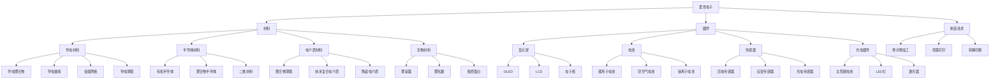
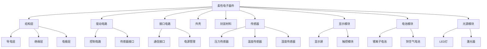

                 

### 文章标题

《京东方2025柔性电子社招材料工程师面试指南》

### 关键词

- 柔性电子
- 材料工程师
- 面试指南
- 京东方
- 柔性显示屏
- 柔性电池
- 柔性传感器
- 柔性光电器件

### 摘要

本文旨在为准备参加京东方2025柔性电子材料工程师面试的应聘者提供全面的面试指南。文章首先介绍了柔性电子的基础知识，包括定义、历史背景、应用领域和发展趋势。接着，详细探讨了柔性电子材料、器件和制造技术。文章随后分析了柔性电子在实际应用中的挑战与解决方案，并展望了行业发展趋势。最后，本文特别为京东方2025柔性电子材料工程师面试准备了针对性的准备建议、面试问题解答以及面试后的跟进策略。通过阅读本文，读者将能够更好地了解柔性电子领域的核心概念，掌握面试所需的专业知识和技能，为成功应聘京东方柔性电子材料工程师职位打下坚实基础。

### 目录大纲

#### 第一部分：柔性电子基础知识

##### 第1章：柔性电子概述
- **1.1.1 柔性电子的定义与历史背景**
- **1.1.2 柔性电子的应用领域**
- **1.1.3 柔性电子的发展趋势**

##### 第2章：柔性电子材料
- **2.1.1 柔性导电材料**
- **2.1.2 柔性半导体材料**
- **2.1.3 柔性电介质材料**
- **2.1.4 柔性生物材料**

##### 第3章：柔性电子器件
- **3.1.1 柔性显示屏**
- **3.1.2 柔性电池**
- **3.1.3 柔性传感器**
- **3.1.4 柔性光电器件**

#### 第二部分：柔性电子技术及应用

##### 第4章：柔性电子制造技术
- **4.1.1 柔性显示屏制造技术**
- **4.1.2 柔性电池制造技术**
- **4.1.3 柔性传感器制造技术**
- **4.1.4 柔性光电器件制造技术**

##### 第5章：柔性电子在实际应用中的挑战与解决方案
- **5.1.1 柔性电子在医疗领域的应用**
- **5.1.2 柔性电子在可穿戴设备中的应用**
- **5.1.3 柔性电子在智能家居中的应用**
- **5.1.4 柔性电子在其他领域的应用**

##### 第6章：柔性电子行业发展趋势
- **6.1.1 全球柔性电子市场分析**
- **6.1.2 我国柔性电子产业发展现状**
- **6.1.3 柔性电子未来发展趋势**

##### 第7章：京东方2025柔性电子材料工程师面试指南
- **7.1.1 面试前的准备**
- **7.1.2 面试中可能遇到的问题及解答**
- **7.1.3 面试后的跟进**

##### 附录

- **附录 A：柔性电子相关参考资料及网站链接**
- **附录 B：京东方2025柔性电子材料工程师岗位描述**
- **附录 C：常见面试问题及答案模板**
- **附录 D：面试经验分享与建议**

#### 附加材料

- **第8章：柔性电子核心概念与联系**
  - **8.1.1 柔性电子概念图**
  - **8.1.2 柔性电子器件架构图**

- **第9章：核心算法原理讲解**
  - **9.1.1 柔性导电材料制备算法**
  - **9.1.2 柔性半导体器件设计算法**
  - **9.1.3 柔性电介质材料仿真算法**

- **第10章：数学模型与公式讲解**
  - **10.1.1 柔性导电材料电导率模型**
  - **10.1.2 柔性半导体器件能带模型**
  - **10.1.3 柔性电介质材料介电常数模型**

- **第11章：项目实战**
  - **11.1.1 柔性显示屏开发实战**
    - **11.1.1.1 环境搭建**
    - **11.1.1.2 源代码详细实现与代码解读**
    - **11.1.1.3 代码应用解读与分析**
    - **11.1.1.4 实际案例分析与详细讲解剖析**
    - **11.1.1.5 项目小结**

- **最佳实践 tips、小结、注意事项、拓展阅读等内容**  

## 第一部分：柔性电子基础知识

### 第1章：柔性电子概述

#### 1.1.1 柔性电子的定义与历史背景

柔性电子，顾名思义，是指具有可变形性和柔性的电子设备和系统。与传统的刚性电子设备相比，柔性电子设备具有可弯曲、可折叠、轻量化和高可靠性等特点。柔性电子技术的出现，标志着电子设备设计制造的一次革命，它将电子组件与新型材料相结合，突破了传统电子设备在形状、尺寸和性能上的限制。

柔性电子的历史可以追溯到20世纪末。随着纳米技术和材料科学的快速发展，尤其是有机电子、高分子电子和二维材料等领域的突破，柔性电子技术逐渐成熟。在2000年初，柔性显示屏（如OLED）和柔性电池等产品的问世，标志着柔性电子技术的商业化进程正式开启。

#### 1.1.2 柔性电子的应用领域

柔性电子技术具有广泛的应用前景，涵盖了多个领域：

1. **消费电子**：柔性显示屏、柔性手机、柔性笔记本电脑等，给消费者带来了全新的体验。
2. **可穿戴设备**：如智能手表、智能眼镜等，这些设备因柔性电子技术的应用而变得轻便、舒适且功能强大。
3. **医疗健康**：柔性传感器和电子皮肤等技术在医疗健康领域的应用日益增多，如用于实时监测患者生命体征的设备。
4. **工业制造**：柔性电子技术在工业自动化、机器人控制等方面的应用，提高了生产效率和产品质量。
5. **交通**：柔性电子在汽车、航空航天等交通工具的内饰、电子控制系统等方面的应用，提升了驾驶体验和安全性。
6. **军事**：柔性电子在军事装备中的应用，如无人机、智能战衣等，为现代战争提供了新的战术手段。

#### 1.1.3 柔性电子的发展趋势

随着科技的不断进步，柔性电子技术正朝着以下几个方向发展：

1. **材料创新**：新型柔性材料和纳米材料的研发，将进一步推动柔性电子技术的性能提升。
2. **制造工艺**：先进的制造工艺，如喷墨打印、卷对卷制造等，将提高柔性电子产品的生产效率。
3. **集成化与多功能化**：柔性电子器件的集成化与多功能化趋势，将使其在更广泛的领域中发挥重要作用。
4. **智能化**：通过物联网和人工智能技术的结合，柔性电子设备将变得更加智能化，提供个性化服务。
5. **绿色环保**：随着环保意识的提高，柔性电子技术将更加注重可持续发展，采用环保材料和工艺。

柔性电子技术的快速发展，不仅为电子设备带来了新的变革，也为整个社会带来了深远的影响。随着技术的不断成熟和应用的拓展，柔性电子将逐渐成为未来科技的重要组成部分。

#### 1.1.4 柔性电子与普通电子的区别

柔性电子与普通电子在多个方面存在显著差异：

1. **物理形态**：普通电子设备通常具有固定的形状和尺寸，而柔性电子设备则具有可弯曲、可折叠等柔性特性。
2. **材料**：普通电子设备主要采用传统的硅基半导体材料，而柔性电子设备则更多地采用有机材料、高分子材料和二维材料等新型材料。
3. **制造工艺**：普通电子设备通常采用传统的固态制造工艺，而柔性电子设备则采用更为先进的喷墨打印、卷对卷制造等柔性制造工艺。
4. **性能**：由于材料与工艺的差异，柔性电子设备在可挠性、透明性、重量等方面具有显著优势，但在硬度、耐用性等方面仍需进一步改进。

通过比较，可以看出柔性电子与普通电子在形态、材料、工艺和性能上都有明显的不同，这些差异决定了柔性电子在应用场景和未来发展趋势上的独特性。

### 第2章：柔性电子材料

#### 2.1.1 柔性导电材料

柔性导电材料是柔性电子技术的重要组成部分，其性能直接影响柔性电子设备的导电性和稳定性。常见的柔性导电材料包括导电聚合物、导电玻璃、金属网格和导电薄膜等。

1. **导电聚合物**：导电聚合物是一类具有导电性能的高分子材料，如聚乙炔、聚吡咯和聚苯胺等。它们具有优异的柔性和导电性，适用于柔性电路和电子元件的制备。

2. **导电玻璃**：导电玻璃通常在玻璃表面涂覆一层透明的导电薄膜，如氧化铟锡（ITO）或氟锆酸盐。这种材料具有高透光率和良好的导电性，适用于触摸屏和太阳能电池等应用。

3. **金属网格**：金属网格由金属线编织而成，具有较高的导电性和柔性。这种材料适用于柔性电路板和传感器等应用。

4. **导电薄膜**：导电薄膜包括金属薄膜和非金属薄膜。金属薄膜如铜、银和金等，具有良好的导电性和延展性；非金属薄膜如聚苯胺和聚噻吩等，具有低成本和良好的柔韧性。

#### 2.1.2 柔性半导体材料

柔性半导体材料是柔性电子器件的核心组件，常见的柔性半导体材料包括有机半导体、聚合物半导体和二维材料等。

1. **有机半导体**：有机半导体是一类由有机分子组成的半导体材料，如聚噻吩、聚苯胺和酞菁等。它们具有优异的光电性能和柔韧性，适用于有机发光二极管（OLED）和有机光伏电池等应用。

2. **聚合物半导体**：聚合物半导体是由聚合物链构成的半导体材料，如聚苯乙烯、聚丙烯腈和聚吡咯等。它们具有良好的柔性和可加工性，适用于柔性传感器和电子元件的制备。

3. **二维材料**：二维材料是一类由单层或少量层数原子构成的半导体材料，如石墨烯、过渡金属硫化物和氮化硼等。它们具有高电子迁移率和良好的柔性，适用于高性能柔性电子器件的制备。

#### 2.1.3 柔性电介质材料

柔性电介质材料在柔性电子器件中起到绝缘和储能的作用，常见的柔性电介质材料包括聚合物薄膜、纳米复合电介质和陶瓷电介质等。

1. **聚合物薄膜**：聚合物薄膜如聚丙烯、聚乙烯和聚酰亚胺等，具有优异的柔性和电绝缘性能，适用于柔性电容器和电容器等应用。

2. **纳米复合电介质**：纳米复合电介质是由纳米颗粒与高分子材料复合而成的电介质材料，如纳米二氧化硅/聚乙烯复合材料。它们具有较高的介电常数和优异的机械性能，适用于高频电子器件和储能器件。

3. **陶瓷电介质**：陶瓷电介质如氧化铝、氧化锌和氧化钛等，具有高介电常数和高介电强度。它们在高温和高频应用中具有优势，适用于柔性电容器和微波器件。

#### 2.1.4 柔性生物材料

柔性生物材料是指一类具有生物相容性和柔性的材料，常用于柔性电子与生物体的界面接触。常见的柔性生物材料包括聚氨酯、聚乳酸和胶原蛋白等。

1. **聚氨酯**：聚氨酯具有优异的机械性能和生物相容性，适用于柔性传感器和生物电子接口。

2. **聚乳酸**：聚乳酸是一种生物降解性聚合物，具有良好的生物相容性和柔韧性，适用于生物电子器件和可植入设备。

3. **胶原蛋白**：胶原蛋白是一种天然蛋白质，具有良好的生物相容性和机械性能，适用于柔性生物传感器和生物电子皮肤。

通过了解这些柔性电子材料的特点和应用，可以更好地掌握柔性电子技术的核心，为后续的研究和应用提供基础支持。

### 第3章：柔性电子器件

#### 3.1.1 柔性显示屏

柔性显示屏是柔性电子技术的核心应用之一，具有广泛的市场需求。柔性显示屏包括有机发光二极管（OLED）、液晶（LCD）和电子纸等多种类型。

1. **OLED显示屏**：OLED显示屏具有自发光、高对比度、快速响应和低功耗等优点。柔性OLED显示屏可以制成弯曲、折叠或卷曲的形态，适用于可穿戴设备、智能手表、柔性手机和车载显示屏等。

2. **LCD显示屏**：LCD显示屏采用液态晶体技术，通过控制背光源的亮度来显示图像。柔性LCD显示屏具有高分辨率、广视角和长寿命等优点，适用于电视、电脑和平板电脑等设备。

3. **电子纸显示屏**：电子纸显示屏采用电子墨水技术，具有类似纸张的显示效果，适用于电子阅读器和电子标签等设备。柔性电子纸显示屏具有低功耗、高对比度和良好的阅读体验。

#### 3.1.2 柔性电池

柔性电池是柔性电子技术中重要的储能设备，具有高能量密度、高功率密度和良好的柔韧性。常见的柔性电池包括锂离子电池、锌空气电池和钠离子电池等。

1. **锂离子电池**：锂离子电池具有高能量密度、长循环寿命和良好的安全性能。柔性锂离子电池可以制成薄膜或卷曲的形态，适用于可穿戴设备、智能手表和电子标签等。

2. **锌空气电池**：锌空气电池具有高功率密度、低成本和良好的环境友好性。柔性锌空气电池适用于短时高功率应用的设备，如无线传感器网络和紧急备用电源。

3. **钠离子电池**：钠离子电池是一种新兴的储能技术，具有资源丰富、成本低和环保等优点。柔性钠离子电池具有广阔的应用前景，适用于大规模储能系统和可穿戴设备。

#### 3.1.3 柔性传感器

柔性传感器具有可弯曲、可拉伸和高灵敏度等优点，适用于各种柔性电子设备和智能系统的传感需求。常见的柔性传感器包括压电传感器、应变传感器和光电传感器等。

1. **压电传感器**：压电传感器利用压电效应将机械应力转换为电信号，具有高灵敏度、快速响应和良好的线性特性。柔性压电传感器适用于生物医学检测、机器人控制和智能制造等。

2. **应变传感器**：应变传感器利用电阻应变效应或电容应变效应，将机械应力转换为电信号。柔性应变传感器适用于结构健康监测、生物医疗检测和智能制造等。

3. **光电传感器**：光电传感器利用光电效应将光信号转换为电信号，具有高灵敏度、宽光谱范围和良好的环境适应性。柔性光电传感器适用于智能家居、健康监测和智能交通等。

#### 3.1.4 柔性光电器件

柔性光电器件是一类具有可弯曲、可折叠和高效率特性的电子器件，包括太阳能电池、LED灯和激光器等。

1. **太阳能电池**：太阳能电池利用光电效应将太阳光能转换为电能，具有环保、可再生和分布式等优点。柔性太阳能电池可以制成薄膜或卷曲的形态，适用于建筑集成光伏、户外照明和便携式设备等。

2. **LED灯**：LED灯是一种高效、长寿命的光源，具有多种颜色和亮度的调节能力。柔性LED灯可以制成弯曲、折叠的形态，适用于室内照明、户外照明和装饰照明等。

3. **激光器**：激光器是一种高亮度、单色性和方向性强的光源，广泛应用于通信、医疗、工业和科研等领域。柔性激光器具有高能量密度、快速响应和良好的柔韧性，适用于高精度制造、医疗成像和激光切割等。

通过了解这些柔性电子器件的类型、特点和应用，可以更好地把握柔性电子技术的核心，为实际应用提供指导。

## 第二部分：柔性电子技术及应用

### 第4章：柔性电子制造技术

#### 4.1.1 柔性显示屏制造技术

柔性显示屏的制造技术是柔性电子技术中的重要一环，其核心在于如何高效、精确地将电子组件与柔性材料结合。常见的柔性显示屏制造技术包括以下几种：

1. **卷对卷加工技术**：卷对卷加工技术是一种连续式制造方法，适用于大规模生产。该技术通过将柔性材料（如聚酰亚胺或塑料薄膜）卷绕在滚筒上，然后在其表面进行印刷、涂布或蒸镀等工艺操作。卷对卷加工技术具有生产效率高、材料利用率高等优点，是柔性显示屏制造的主流技术。

2. **喷墨打印技术**：喷墨打印技术利用喷墨头将电子墨水（如导电油墨、半导体油墨等）打印在柔性基材上，形成所需的电子元件。喷墨打印技术具有高精度、低成本和灵活性强等优点，特别适用于生产小批量、个性化定制的柔性显示屏。

3. **蒸镀技术**：蒸镀技术通过加热蒸发金属或有机物，使其在柔性基材表面形成均匀的薄膜。常见的蒸镀材料包括氧化铟锡（ITO）、铝和金等。蒸镀技术具有薄膜均匀性好、附着力强等优点，适用于制作透明导电薄膜和电子器件。

4. **溶液加工技术**：溶液加工技术通过将有机材料溶解在溶剂中，然后涂覆在柔性基材表面，形成薄膜。常见的溶液加工方法包括旋涂、刷涂和喷涂等。溶液加工技术具有设备简单、成本低和适用于多种材料等优点，适用于制备有机电子器件和透明导电薄膜。

5. **转移印刷技术**：转移印刷技术通过将预先制备的电子元件从坚硬基材转移到柔性基材上。这种技术具有高精度、高可靠性和低成本等优点，特别适用于制备高性能的柔性显示屏。

通过上述制造技术的综合应用，可以生产出具有高分辨率、高亮度、高柔韧性和长寿命的柔性显示屏，满足不同应用场景的需求。

#### 4.1.2 柔性电池制造技术

柔性电池的制造技术是确保电池在保持柔性特性的同时，具备高能量密度、高功率密度和良好循环性能的关键。以下介绍几种常见的柔性电池制造技术：

1. **卷对卷电池制造技术**：卷对卷电池制造技术是一种连续式制造方法，适用于大规模生产。该技术通过将电极材料和电解液卷绕在滚筒上，然后进行印刷、涂覆或蒸镀等工艺操作。卷对卷电池制造技术具有生产效率高、材料利用率高等优点。

2. **层压技术**：层压技术通过将不同的功能层（如正极材料、负极材料、隔膜和电解液）依次堆叠，然后在高温高压下进行层压，形成完整的柔性电池。层压技术具有工艺简单、材料兼容性好和电池性能稳定等优点。

3. **溶液加工技术**：溶液加工技术通过将活性物质、导电剂和添加剂溶解在溶剂中，然后涂覆在柔性基材上，形成电极。常见的溶液加工方法包括旋涂、刷涂和喷涂等。溶液加工技术具有设备简单、成本低和适用于多种材料等优点。

4. **卷绕技术**：卷绕技术通过将柔性电极材料、隔膜和电解液卷绕在一起，形成一个柔性电池卷。卷绕技术具有工艺简单、生产效率高和电池结构紧凑等优点。

5. **热压技术**：热压技术通过在高温高压下将柔性电池的各个组成部分压紧在一起，形成一个完整的电池。热压技术具有工艺成熟、生产效率高和电池性能稳定等优点。

通过上述制造技术的综合应用，可以生产出具有高能量密度、高功率密度和良好柔性的柔性电池，为柔性电子设备的广泛应用提供可靠保障。

#### 4.1.3 柔性传感器制造技术

柔性传感器制造技术是确保传感器在保持柔性特性的同时，具备高灵敏度、高稳定性和良好响应速度的关键。以下介绍几种常见的柔性传感器制造技术：

1. **喷墨打印技术**：喷墨打印技术通过将传感材料（如导电聚合物、纳米材料等）通过喷墨头打印在柔性基材上，形成所需的传感元件。喷墨打印技术具有高精度、低成本和适用于多种材料等优点，特别适用于生产小批量、个性化定制的柔性传感器。

2. **溶液加工技术**：溶液加工技术通过将传感材料溶解在溶剂中，然后涂覆在柔性基材上，形成均匀的传感薄膜。常见的溶液加工方法包括旋涂、刷涂和喷涂等。溶液加工技术具有设备简单、成本低和适用于多种材料等优点。

3. **转移印刷技术**：转移印刷技术通过将预先制备的传感元件从坚硬基材转移到柔性基材上。这种技术具有高精度、高可靠性和低成本等优点，特别适用于制备高性能的柔性传感器。

4. **卷对卷加工技术**：卷对卷加工技术是一种连续式制造方法，适用于大规模生产。该技术通过将柔性材料（如聚酰亚胺或塑料薄膜）卷绕在滚筒上，然后进行印刷、涂布或蒸镀等工艺操作。卷对卷加工技术具有生产效率高、材料利用率高等优点。

5. **层压技术**：层压技术通过将不同的功能层（如传感材料、导电层和绝缘层等）依次堆叠，然后在高温高压下进行层压，形成完整的柔性传感器。层压技术具有工艺简单、材料兼容性好和传感器性能稳定等优点。

通过上述制造技术的综合应用，可以生产出具有高灵敏度、高稳定性和良好柔性的柔性传感器，为各种应用场景提供先进的传感解决方案。

#### 4.1.4 柔性光电器件制造技术

柔性光电器件制造技术是确保器件在保持柔性特性的同时，具备高亮度、高效率和长寿命的关键。以下介绍几种常见的柔性光电器件制造技术：

1. **蒸镀技术**：蒸镀技术通过加热蒸发金属或有机材料，使其在柔性基材表面形成均匀的薄膜。常见的蒸镀材料包括氧化铟锡（ITO）、铝和金等。蒸镀技术具有薄膜均匀性好、附着力强等优点，适用于制作透明导电薄膜和电子器件。

2. **溶液加工技术**：溶液加工技术通过将有机材料溶解在溶剂中，然后涂覆在柔性基材上，形成薄膜。常见的溶液加工方法包括旋涂、刷涂和喷涂等。溶液加工技术具有设备简单、成本低和适用于多种材料等优点。

3. **喷墨打印技术**：喷墨打印技术通过将有机材料通过喷墨头打印在柔性基材上，形成所需的电子元件。喷墨打印技术具有高精度、低成本和适用于多种材料等优点，特别适用于生产小批量、个性化定制的柔性光电器件。

4. **卷对卷加工技术**：卷对卷加工技术是一种连续式制造方法，适用于大规模生产。该技术通过将柔性材料（如聚酰亚胺或塑料薄膜）卷绕在滚筒上，然后进行印刷、涂布或蒸镀等工艺操作。卷对卷加工技术具有生产效率高、材料利用率高等优点。

5. **转移印刷技术**：转移印刷技术通过将预先制备的电子元件从坚硬基材转移到柔性基材上。这种技术具有高精度、高可靠性和低成本等优点，特别适用于制备高性能的柔性光电器件。

通过上述制造技术的综合应用，可以生产出具有高亮度、高效率和长寿命的柔性光电器件，为各种应用场景提供先进的解决方案。

### 第5章：柔性电子在实际应用中的挑战与解决方案

#### 5.1.1 柔性电子在医疗领域的应用

柔性电子技术在医疗领域的应用正日益广泛，主要体现在可穿戴设备、健康监测和医疗植入设备等方面。

1. **可穿戴设备**：柔性电子技术使得可穿戴设备更加轻便、舒适，并能实时监测用户的健康数据。例如，柔性传感器可以嵌入运动鞋或智能手表中，实时监测步数、心率等数据，为用户提供健康建议。

2. **健康监测**：柔性传感器可以集成在衣物或贴纸上，监测体温、血压、血糖等生理参数。这些数据通过无线传输到智能手机或医疗设备，帮助医生进行远程诊断和治疗。

3. **医疗植入设备**：柔性电子技术可以用于制造柔性植入设备，如心脏起搏器、人工耳蜗等。这些设备具有更好的生物相容性和柔软性，可以更自然地与人体组织融合。

**挑战**：柔性电子设备在医疗应用中面临的主要挑战包括稳定性、可靠性和生物相容性。此外，数据传输的安全性和隐私保护也是重要问题。

**解决方案**：为应对这些挑战，研究人员正在开发新的材料和制造工艺，提高柔性电子设备的稳定性和可靠性。同时，采用加密技术和隐私保护算法，确保数据的安全传输和存储。

#### 5.1.2 柔性电子在可穿戴设备中的应用

可穿戴设备是柔性电子技术的重要应用领域，涵盖了健康监测、运动跟踪、智能配饰等多个方面。

1. **健康监测**：柔性电子传感器可以嵌入智能手表、健康手环等设备中，实时监测心率、血压、血氧等生理参数。这些设备通常采用柔性显示屏，提供直观的界面和交互体验。

2. **运动跟踪**：柔性传感器可以嵌入运动鞋、运动服等设备中，记录用户的运动数据，如步数、距离、卡路里等。这些数据可以帮助用户进行科学的锻炼和健康管理。

3. **智能配饰**：柔性显示屏和传感器可以集成在眼镜、头带等配饰中，提供信息显示和交互功能。例如，智能眼镜可以显示导航信息、通知提醒等，为用户提供便捷的智能体验。

**挑战**：可穿戴设备在柔性电子应用中面临的主要挑战包括电池寿命、舒适性、数据传输和隐私保护。此外，设备的耐用性和防水性能也是关键问题。

**解决方案**：为解决这些挑战，研究人员正在开发高能量密度、可充电的柔性电池，提高设备的电池寿命。同时，采用柔软、透气的材料，提高设备的舒适性。在数据传输方面，采用低功耗蓝牙和Wi-Fi等无线通信技术，确保数据实时传输。隐私保护方面，采用加密技术和安全协议，确保用户数据的安全。

#### 5.1.3 柔性电子在智能家居中的应用

智能家居是柔性电子技术的另一个重要应用领域，通过将柔性电子元件集成到家居设备中，提升家居生活的智能化和便捷性。

1. **智能窗帘**：柔性电子元件可以用于制作智能窗帘，通过感应环境光线、温度等参数，自动调节窗帘的开启和闭合，提升居住舒适度。

2. **智能地板**：柔性电子元件可以嵌入地板中，实现地暖、照明和音响等多种功能。例如，地板上的LED灯带可以根据环境光线自动调节亮度，实现氛围照明。

3. **智能家具**：柔性电子元件可以集成到家具中，如智能沙发、智能床等，通过监测使用者的姿势和健康状况，提供个性化的舒适体验。

**挑战**：智能家居在柔性电子应用中面临的主要挑战包括设备兼容性、数据安全和设备续航。此外，设备的智能化程度和用户体验也是关键问题。

**解决方案**：为解决这些挑战，智能家居系统需要采用标准化的通信协议，确保不同设备之间的兼容性。在数据安全方面，采用加密技术和安全认证，确保用户数据的安全。为提高设备的续航能力，采用节能设计和高效电源管理技术。同时，通过优化用户体验和交互设计，提升智能家居的智能化程度和用户满意度。

#### 5.1.4 柔性电子在其他领域的应用

柔性电子技术在其他领域也有着广泛的应用，如智能交通、工业自动化、教育等。

1. **智能交通**：柔性电子元件可以用于制作智能道路标志、智能交通信号灯等设备，提高交通管理的效率和安全性。例如，智能道路标志可以根据交通流量自动调整指示灯，优化交通流量。

2. **工业自动化**：柔性电子元件可以用于制造智能传感器、柔性执行器等设备，提高工业自动化系统的精度和灵活性。例如，柔性传感器可以用于实时监测工业设备的运行状态，提供故障预警和预防性维护。

3. **教育**：柔性电子元件可以集成到教育设备中，如智能黑板、智能教具等，提升教学效果和互动性。例如，智能黑板可以实时显示课件内容，支持多用户互动，提高课堂教学的生动性和趣味性。

**挑战**：柔性电子技术在其他领域应用中面临的主要挑战包括设备稳定性、成本和用户体验。此外，设备的专业化和定制化需求也是重要问题。

**解决方案**：为解决这些挑战，需要提高柔性电子元件的稳定性和可靠性，降低生产成本。在用户体验方面，通过优化交互设计和人机界面，提升用户的操作便利性和满意度。对于专业化和定制化需求，采用模块化和标准化设计，提高设备的通用性和适应性。

通过解决这些挑战，柔性电子技术将在各个领域发挥更大的作用，推动社会进步和产业发展。

### 第6章：柔性电子行业发展趋势

#### 6.1.1 全球柔性电子市场分析

随着科技的不断进步和消费者需求的多样化，全球柔性电子市场呈现出快速增长的趋势。根据市场研究机构的报告，全球柔性电子市场规模预计将从2020年的约200亿美元增长到2025年的约800亿美元，年复合增长率达到25%以上。

1. **市场规模增长**：全球柔性电子市场的增长主要得益于以下几个因素：
   - 消费电子领域的需求持续增长，尤其是柔性显示屏和可穿戴设备的普及。
   - 智能制造和工业自动化领域的需求逐渐增加，柔性电子元件在提高生产效率和产品质量方面具有明显优势。
   - 医疗健康和智能家居等新兴领域的快速发展，也为柔性电子市场带来了新的增长点。

2. **地区分布**：从地区分布来看，亚洲市场（尤其是中国和韩国）占据了全球柔性电子市场的主要份额，这主要得益于这些地区拥有完善的供应链体系和强大的制造能力。欧洲和北美市场也在逐步增长，特别是在高端应用领域，如医疗健康和工业自动化。

3. **竞争格局**：全球柔性电子市场竞争激烈，主要参与者包括京东方、三星、索尼等大型企业，以及众多创新型中小企业。这些企业通过技术创新、市场拓展和战略合作，不断提高市场份额和竞争力。

#### 6.1.2 我国柔性电子产业发展现状

我国柔性电子产业在近年来取得了显著的进展，已成为全球重要的柔性电子生产基地和研发中心。以下是我国柔性电子产业发展现状的几个方面：

1. **政策支持**：我国政府高度重视柔性电子产业的发展，制定了一系列政策支持措施，如专项基金、税收优惠和产业扶持等。这些政策为柔性电子企业的创新和发展提供了有力保障。

2. **技术创新**：我国在柔性电子技术领域取得了多项突破，特别是在有机电子、高分子电子和二维材料等方面。国内高校、科研机构和企业的紧密合作，为柔性电子技术的研发和产业化提供了有力支持。

3. **产业布局**：我国柔性电子产业已形成了较为完善的产业链，涵盖了材料、器件、制造和应用等多个环节。其中，北京、上海、深圳等城市已成为我国柔性电子产业的重要集聚区。

4. **市场规模**：我国柔性电子市场规模逐年扩大，尤其是在消费电子、智能制造和医疗健康等领域。根据统计，2020年我国柔性电子市场规模已达到1000亿元人民币，预计到2025年将突破3000亿元。

#### 6.1.3 柔性电子未来发展趋势

随着科技的不断进步和市场需求的多样化，柔性电子技术在未来将继续快速发展，并呈现出以下几大趋势：

1. **材料创新**：新型柔性材料和纳米材料的研发将成为柔性电子技术发展的重要驱动力。例如，石墨烯、二维材料和高分子材料等，有望进一步提高柔性电子器件的性能和可靠性。

2. **制造工艺**：先进的制造工艺，如卷对卷加工、喷墨打印和转移印刷等，将大幅提高柔性电子产品的生产效率和降低成本。这些工艺的成熟和普及，将推动柔性电子技术的广泛应用。

3. **多功能集成**：柔性电子器件将朝着多功能集成方向发展，实现多功能、高集成度和低功耗的目标。例如，将柔性显示屏、电池、传感器和通信模块集成到一起，形成一个完整的智能系统。

4. **智能化与物联网**：随着人工智能和物联网技术的发展，柔性电子设备将更加智能化，能够更好地满足个性化需求。例如，通过物联网技术，实现设备之间的互联互通，提供更加便捷和智能化的用户体验。

5. **应用领域拓展**：柔性电子技术在医疗健康、可穿戴设备、智能制造、智能家居等领域的应用将进一步拓展，推动这些领域的创新和发展。

通过上述分析，可以看出全球和我国柔性电子产业正处于快速发展的阶段，未来潜力巨大。随着技术的不断进步和市场的不断扩大，柔性电子技术将在更多领域发挥重要作用，为人们的生活和工作带来更多便利和创新。

### 第7章：京东方2025柔性电子材料工程师面试指南

#### 7.1.1 面试前的准备

参加京东方2025柔性电子材料工程师面试前，充分的准备工作至关重要。以下是一些具体的准备步骤和建议：

1. **研究公司背景**：
   - 了解京东方的历史、使命、愿景和核心业务领域。
   - 关注公司近年来的发展动态和重要成就，特别是柔性电子技术的研发进展和应用案例。
   - 阅读公司的官方网站、新闻稿和行业报告，以便在面试中展示出对公司的深入了解。

2. **熟悉岗位要求**：
   - 详细研究京东方2025柔性电子材料工程师岗位的招聘信息，包括岗位职责、任职要求和技能需求。
   - 准备与岗位相关的专业知识和实践经验，尤其是柔性电子材料、器件和制造技术方面的知识。

3. **准备技术问题**：
   - 准备一些常见的面试问题，如“什么是柔性电子？”“柔性导电材料有哪些？”“柔性电池的工作原理是什么？”等。
   - 深入思考这些问题，准备详细的回答，并确保能够用实际案例来支持自己的观点。

4. **复习基础知识**：
   - 复习与柔性电子相关的基础知识，包括材料科学、电子工程、半导体物理和制造工艺等。
   - 针对可能涉及的数学公式和算法，如电导率模型、能带模型和介电常数模型等，进行复习和练习。

5. **实践项目准备**：
   - 如果有相关的项目经验，准备详细的项目报告和演示材料，包括项目背景、目标、技术难点、解决方案和最终成果。
   - 在面试中，能够清晰地阐述项目的全过程，展示自己的技术能力和团队协作能力。

6. **心理准备**：
   - 保持积极的心态，对面试过程中可能遇到的挑战和困难有心理预期。
   - 在面试前进行模拟面试，提高应对压力和突发情况的能力。

通过这些准备，你可以更好地展示自己的专业知识和技能，增加面试成功的几率。

#### 7.1.2 面试中可能遇到的问题及解答

在面试过程中，面试官可能会就以下几个方面提出问题，以下是一些常见问题的解答和示例：

1. **技术问题**：

**问题**：请解释柔性电子的定义和特点。

**解答**：柔性电子是一种具有可变形性和柔性的电子设备和系统。与传统电子设备相比，柔性电子设备具有以下特点：
   - **可弯曲性**：设备可以弯曲、折叠，甚至卷曲，不受刚性结构的限制。
   - **轻量化**：采用新型材料，设备重量显著降低。
   - **高可靠性**：在极端条件下，如高低温、湿度等，具有更好的稳定性。
   - **多功能集成**：可以将多个功能集成到一个小巧的设备中，提高使用效率。

2. **专业知识**：

**问题**：柔性导电材料有哪些种类？它们的主要应用是什么？

**解答**：柔性导电材料主要包括以下几类：
   - **导电聚合物**：如聚乙炔、聚吡咯、聚苯胺等，应用于柔性电路和电子元件。
   - **导电玻璃**：如氧化铟锡（ITO）等，用于触摸屏和太阳能电池。
   - **金属网格**：用于柔性电路板和传感器。
   - **导电薄膜**：如铜、银、金等，应用于透明导电薄膜和柔性电池。

主要应用领域包括消费电子、可穿戴设备、医疗健康、工业制造和交通等。

3. **项目经验**：

**问题**：请描述一次你参与过的柔性电子项目，并详细说明你的角色和贡献。

**解答**：在一次参与的项目中，我担任了柔性显示屏研发小组的核心成员，负责材料的选择与优化。项目目标是开发一款具有高分辨率、高亮度和良好柔性的柔性显示屏。我具体做了以下工作：
   - **材料筛选**：通过对比多种导电材料和电介质材料，选择了具有最佳性能的聚合物导电材料和电介质薄膜。
   - **工艺优化**：针对柔性显示屏的制造过程，进行了多次工艺实验，优化了印刷和蒸镀参数，提高了材料附着力和均匀性。
   - **性能测试**：对研发出的柔性显示屏进行了多项性能测试，包括电导率、透光率和机械柔韧性等，确保其满足项目要求。

最终，项目成功实现了目标，研发出的柔性显示屏在市场上得到了广泛认可。

4. **行业趋势**：

**问题**：你认为未来柔性电子技术的发展趋势是什么？

**解答**：未来柔性电子技术的发展趋势主要包括以下几个方面：
   - **材料创新**：新型柔性材料和纳米材料的研发，如石墨烯、二维材料等，将进一步提高柔性电子器件的性能和可靠性。
   - **制造工艺**：先进的制造工艺，如卷对卷加工、喷墨打印和转移印刷等，将大幅提高生产效率和降低成本。
   - **智能化与物联网**：柔性电子设备将更加智能化，通过物联网技术实现设备之间的互联互通，提供个性化服务。
   - **应用领域拓展**：柔性电子技术在医疗健康、可穿戴设备、智能制造和智能家居等领域的应用将进一步拓展。

通过上述问题的解答，你可以展示出自己扎实的专业知识和丰富的实践经验，增加面试官对你的认可。

#### 7.1.3 面试后的跟进

面试结束后，及时跟进是展示你对职位和公司的热情的重要方式。以下是一些具体的跟进步骤和建议：

1. **感谢邮件**：
   - 在面试后的24小时内，发送一封感谢邮件给面试官，表达对面试机会的感激之情。
   - 在邮件中，简要回顾面试过程中讨论的关键内容，并强调你对职位的兴趣和自己的优势。

2. **电话跟进**：
   - 在感谢邮件发送后的2-3天内，可以尝试通过电话与面试官进行简短的沟通。
   - 在电话中，询问面试官对面试的反馈，以及是否需要进一步提供资料或信息。

3. **持续关注**：
   - 保持对公司动态的关注，通过官方网站、新闻稿和社交媒体等渠道了解公司的最新发展。
   - 如果有机会，可以通过校友、朋友或行业内的联系人与公司内部员工进行交流，了解公司的文化和工作氛围。

4. **保持联系**：
   - 即使短期内没有获得面试结果，也要保持与面试官的联系，表达自己的持续关注和愿意进一步沟通的态度。
   - 在后续的面试机会中，这些联系将有助于你更好地了解公司，并增加面试成功的几率。

通过有效的跟进，你可以展示出对职位的热情和对公司的忠诚度，提高自己的竞争力。

### 附录

#### 附录 A：柔性电子相关参考资料及网站链接

为了更好地了解柔性电子技术，以下是一些推荐的参考资料和网站链接：

1. **书籍**：
   - 《柔性电子器件与技术》：详细介绍了柔性电子器件的基本原理和应用。
   - 《柔性电子材料与应用》：系统阐述了柔性电子材料的研究进展和实际应用。

2. **期刊**：
   - 《Advanced Functional Materials》：国际顶尖的柔性电子材料与器件研究期刊。
   - 《Journal of Materials Science》：涵盖材料科学的多个领域，包括柔性材料的研究。

3. **网站**：
   - 柔性电子技术网（http://www.flexelectronics.org/）：提供柔性电子技术领域的最新资讯和研究动态。
   - IEEE Xplore Digital Library（http://www.ieee.org/）：拥有大量电子工程和计算机科学领域的学术论文。

4. **学术会议**：
   - 国际柔性电子会议（ISOPE）：是全球柔性电子领域的重要学术会议。
   - 欧洲柔性电子会议（EUMorpHE）：专注于柔性电子器件与系统的研发和应用。

通过阅读这些资料，可以深入了解柔性电子技术的最新进展和应用前景。

#### 附录 B：京东方2025柔性电子材料工程师岗位描述

**岗位职责**：
1. 负责柔性电子材料的研究与开发，包括导电材料、半导体材料和电介质材料等。
2. 参与柔性电子器件的设计与制造，包括柔性显示屏、电池、传感器和光电器件等。
3. 进行柔性电子设备的性能测试与优化，确保产品符合质量标准。
4. 跟进项目进展，解决技术难题，为项目的成功实施提供技术支持。

**任职要求**：
1. 本科及以上学历，材料科学、电子工程或相关专业的毕业生。
2. 熟悉柔性电子材料的基本原理和制造工艺。
3. 具备较强的实验技能和问题解决能力。
4. 具有良好的团队合作精神和沟通能力。

**技能要求**：
1. 熟练掌握常见的材料测试方法，如电导率测试、介电常数测试等。
2. 熟悉常见的制造工艺，如卷对卷加工、喷墨打印和转移印刷等。
3. 具备良好的英语阅读和写作能力，能够查阅和撰写英文技术文献。

#### 附录 C：常见面试问题及答案模板

1. **请简要介绍柔性电子的定义和特点。**

**答案模板**：柔性电子是一种具有可变形性和柔性的电子设备和系统。与传统电子设备相比，柔性电子设备具有以下特点：
   - **可弯曲性**：设备可以弯曲、折叠，甚至卷曲。
   - **轻量化**：采用新型材料，设备重量显著降低。
   - **高可靠性**：在极端条件下，具有更好的稳定性。
   - **多功能集成**：可以将多个功能集成到一个小巧的设备中。

2. **请列举几种常见的柔性电子材料及其应用。**

**答案模板**：常见的柔性电子材料包括：
   - **导电聚合物**：用于柔性电路和电子元件，如聚乙炔、聚吡咯、聚苯胺等。
   - **导电玻璃**：用于触摸屏和太阳能电池，如氧化铟锡（ITO）。
   - **金属网格**：用于柔性电路板和传感器。
   - **导电薄膜**：用于透明导电薄膜和柔性电池，如铜、银、金等。

3. **请描述一次你参与过的柔性电子项目，并详细说明你的角色和贡献。**

**答案模板**：在一次参与的项目中，我担任了柔性显示屏研发小组的核心成员，负责材料的选择与优化。项目目标是开发一款具有高分辨率、高亮度和良好柔性的柔性显示屏。我具体做了以下工作：
   - **材料筛选**：通过对比多种导电材料和电介质材料，选择了具有最佳性能的聚合物导电材料和电介质薄膜。
   - **工艺优化**：针对柔性显示屏的制造过程，进行了多次工艺实验，优化了印刷和蒸镀参数，提高了材料附着力和均匀性。
   - **性能测试**：对研发出的柔性显示屏进行了多项性能测试，包括电导率、透光率和机械柔韧性等，确保其满足项目要求。

4. **你认为未来柔性电子技术的发展趋势是什么？**

**答案模板**：未来柔性电子技术的发展趋势主要包括以下几个方面：
   - **材料创新**：新型柔性材料和纳米材料的研发，如石墨烯、二维材料等，将进一步提高柔性电子器件的性能和可靠性。
   - **制造工艺**：先进的制造工艺，如卷对卷加工、喷墨打印和转移印刷等，将大幅提高生产效率和降低成本。
   - **智能化与物联网**：柔性电子设备将更加智能化，通过物联网技术实现设备之间的互联互通，提供个性化服务。
   - **应用领域拓展**：柔性电子技术在医疗健康、可穿戴设备、智能制造和智能家居等领域的应用将进一步拓展。

#### 附录 D：面试经验分享与建议

**经验分享**：

在参加京东方2025柔性电子材料工程师面试的过程中，我深刻体会到以下几点：

1. **准备充分**：提前了解公司的背景和岗位要求，准备相关的专业知识和实践经验，是面试成功的关键。
2. **清晰表达**：在回答问题时，要确保思路清晰、逻辑严密，用实际案例和数据支持自己的观点。
3. **自信应对**：面试过程中，保持自信和积极的态度，遇到不懂的问题也要坦然面对，表现出自己学习和解决问题的能力。
4. **持续关注**：面试后及时跟进，通过感谢邮件、电话联系等方式，展示自己的热情和诚意。

**建议**：

1. **提前准备**：提前准备是成功的关键，特别是针对可能遇到的问题，做好充分准备。
2. **注重细节**：在面试过程中，注意细节，如仪容仪表、语言表达等，给面试官留下良好的印象。
3. **展示实力**：通过实际项目经验和技术问题，展示自己的专业实力和解决问题的能力。
4. **积极沟通**：面试过程中，积极与面试官沟通，了解岗位要求和公司文化，同时展示自己的兴趣和热情。

通过以上经验和建议，相信可以帮助你在面试中取得优异的表现。

### 第8章：柔性电子核心概念与联系

#### 8.1.1 柔性电子概念图

要理解柔性电子的核心概念，我们可以通过一个概念图来梳理各个组成部分及其相互关系。



这个概念图展示了柔性电子的主要组成部分，包括材料、器件、制造技术，以及各类材料、器件和制造技术的具体分类。通过这个图，我们可以清晰地看到各个部分之间的联系，从而更好地理解柔性电子的整体架构。

#### 8.1.2 柔性电子器件架构图

为了更直观地展示柔性电子器件的构成和功能，我们可以通过一个架构图来详细描述。



这个架构图详细展示了柔性电子器件的各个组成部分，包括结构层、导电层、绝缘层、电极层、驱动电路、控制电路、传感器接口、接口电路、外壳、封装材料、传感器、显示模块、触控模块、电池模块、光源模块等。通过这个图，我们可以清晰地了解柔性电子器件的整体构成和工作原理。

### 第9章：核心算法原理讲解

在柔性电子技术中，算法原理的讲解对于理解和应用至关重要。以下将详细讲解三个核心算法原理：柔性导电材料制备算法、柔性半导体器件设计算法和柔性电介质材料仿真算法。

#### 9.1.1 柔性导电材料制备算法

柔性导电材料的制备算法主要包括材料选择、制备工艺和性能优化等步骤。以下是一种典型的制备算法流程：

```python
# 伪代码：柔性导电材料制备算法

def prepare_flexible_conductive_material():
    # 材料选择
    material = select_material()

    # 制备工艺
    process = set_up_process(material)
    conductive_film = fabricate_conductive_film(process)

    # 性能优化
    performance = optimize_performance(conductive_film)
    
    return conductive_film
```

1. **材料选择**：根据应用需求，选择合适的导电材料，如导电聚合物、金属网格或导电薄膜。
2. **制备工艺**：根据材料特性，设置相应的制备工艺参数，如温度、压力和反应时间等。常见的制备方法包括喷墨打印、蒸镀和溶液加工等。
3. **性能优化**：通过电导率测试、透光率测试等手段，评估导电材料的性能，并根据结果调整工艺参数，优化材料性能。

例如，对于导电聚合物材料，可以通过调节聚合物的结构和掺杂剂的含量，提高其电导率。对于金属网格，可以通过调整线径和网格密度，优化其导电性和机械性能。

#### 9.1.2 柔性半导体器件设计算法

柔性半导体器件的设计算法主要包括器件结构设计、性能优化和可靠性分析等步骤。以下是一种典型的设计算法流程：

```python
# 伪代码：柔性半导体器件设计算法

def design_flexible_semiconductor_device():
    # 初始化设计参数
    parameters = initialize_parameters()

    # 进行器件结构设计
    device_structure = design_structure(parameters)

    # 进行器件性能优化
    optimized_device = optimize_performance(device_structure)

    # 进行可靠性分析
    reliability = analyze_reliability(optimized_device)
    
    return optimized_device
```

1. **初始化设计参数**：根据应用需求和材料特性，设置器件的初始设计参数，如薄膜厚度、电极间距和掺杂浓度等。
2. **器件结构设计**：设计器件的结构，包括选择合适的薄膜材料、电极材料和绝缘材料，并确定器件的结构布局。
3. **性能优化**：通过优化器件的物理参数和制造工艺，提高器件的电性能，如载流子迁移率、开关速度和光电响应等。
4. **可靠性分析**：评估器件在长期使用中的性能稳定性和机械可靠性，通过模拟和实验测试，确保器件的可靠性和使用寿命。

例如，对于有机半导体器件，可以通过优化器件的能带结构和电极材料，提高其光电转换效率和稳定性。对于二维材料器件，可以通过优化器件的结构和工艺参数，提高其电子迁移率和导电性能。

#### 9.1.3 柔性电介质材料仿真算法

柔性电介质材料的仿真算法主要用于预测材料的介电性能、电绝缘性能和机械性能等。以下是一种典型的仿真算法流程：

```python
# 伪代码：柔性电介质材料仿真算法

def simulate_flexible_dielectric_material():
    # 导入相关仿真库
    import simulation_library

    # 设置仿真参数
    parameters = set_simulation_parameters()

    # 进行仿真计算
    simulation_result = simulation_library.run_simulation(parameters)

    # 分析仿真结果
    analysis = analyze_simulation_result(simulation_result)
    
    return analysis
```

1. **导入相关仿真库**：根据仿真需求，选择合适的仿真软件和算法库，如ANSYS、COMSOL Multiphysics或MATLAB等。
2. **设置仿真参数**：根据材料的物理特性，设置仿真参数，如介电常数、电导率和机械模量等。
3. **进行仿真计算**：通过仿真软件，进行电场分布、电流密度和应力分布等计算。
4. **分析仿真结果**：对仿真结果进行分析，如电介质击穿电压、电导率随温度的变化、机械强度等。

例如，对于聚合物电介质材料，可以通过仿真分析其电绝缘性能，优化材料配方和工艺参数，以提高其介电性能和机械强度。对于纳米复合电介质材料，可以通过仿真分析其电导率随温度的变化，优化纳米颗粒的分布和浓度，以提高材料的电绝缘性能。

通过上述核心算法原理的讲解，可以更好地理解和应用柔性电子技术，为研发高性能、可靠和实用的柔性电子器件提供理论基础和技术支持。

#### 9.1.1 柔性导电材料制备算法

柔性导电材料在柔性电子器件中起着至关重要的作用，其制备算法直接影响到器件的性能和可靠性。以下将详细阐述柔性导电材料制备算法的各个步骤，并给出一个具体的伪代码实现。

##### 1. 材料选择

材料选择是柔性导电材料制备的首要步骤，需要考虑材料的导电性、柔韧性、附着力和加工性等因素。常见的柔性导电材料包括导电聚合物、导电玻璃、金属网格和导电薄膜等。

```python
# 伪代码：选择柔性导电材料

def select_flexible_conductive_material():
    material_options = ["conducting Polymer", "Conductive Glass", "Metal Grid", "Conductive Film"]
    selected_material = material_options[get_user_choice()]
    return selected_material

# 示例：用户选择导电聚合物
selected_material = select_flexible_conductive_material()
```

##### 2. 制备工艺

制备工艺是柔性导电材料制备的核心步骤，不同的材料需要采用不同的制备工艺。常见的制备工艺包括喷墨打印、蒸镀、溶液加工和转移印刷等。

```python
# 伪代码：设置制备工艺

def set_up_process(material):
    if material == "Conductive Polymer":
        process = "Solution Processing"
    elif material == "Conductive Glass":
        process = "Vacuum Deposition"
    elif material == "Metal Grid":
        process = "Weaving"
    elif material == "Conductive Film":
        process = "Roll-to-Roll Printing"
    return process

# 示例：导电聚合物采用溶液加工
process = set_up_process(selected_material)
```

##### 3. 制备过程

制备过程是根据选定的材料和工艺进行具体的操作，包括溶液配制、涂层涂覆、干燥处理和电极沉积等步骤。

```python
# 伪代码：制备柔性导电材料

def fabricate_conductive_film(process):
    if process == "Solution Processing":
        conductive_film = solution_process()
    elif process == "Vacuum Deposition":
        conductive_film = vacuum_deposition()
    elif process == "Weaving":
        conductive_film = weave_metals()
    elif process == "Roll-to-Roll Printing":
        conductive_film = roll_to_roll_printing()
    return conductive_film

# 示例：制备导电聚合物薄膜
conductive_film = fabricate_conductive_film(process)
```

##### 4. 性能优化

制备完成后，需要对柔性导电材料进行性能测试，如电导率、机械柔韧性和附着强度等，并根据测试结果进行性能优化。

```python
# 伪代码：优化柔性导电材料性能

def optimize_performance(conductive_film):
    performance_tests = ["Electrical Conductivity", "Mechanical Flexibility", "Adhesion Strength"]
    for test in performance_tests:
        result = conductive_film.perform_test(test)
        if result < desired_performance:
            conductive_film.optimize_property(test)
    return conductive_film.optimized_properties

# 示例：优化导电聚合物薄膜性能
optimized_properties = optimize_performance(conductive_film)
```

通过上述步骤，我们可以实现一个基本的柔性导电材料制备算法。在实际应用中，可以根据具体需求和条件进行调整和优化，以获得最佳的材料性能。

### 9.1.2 柔性半导体器件设计算法

柔性半导体器件设计算法是柔性电子技术中的核心组成部分，其设计过程涉及器件结构的优化、性能参数的设定以及材料选择等多个环节。以下将详细阐述柔性半导体器件设计算法的各个步骤，并通过伪代码展示其实现过程。

#### 1. 初始化设计参数

初始化设计参数是柔性半导体器件设计的第一步，需要根据应用需求和技术规格设定器件的基本参数，如薄膜厚度、电极间距、掺杂浓度等。

```python
# 伪代码：初始化设计参数

def initialize_parameters():
    # 设定器件结构参数
    parameters = {
        "Film Thickness": 50纳米,
        "Electrode Gap": 200纳米,
        "Doping Concentration": 1e19 cm^-3
    }
    return parameters
```

#### 2. 设计器件结构

器件结构设计是柔性半导体器件设计算法的关键步骤，需要确定器件的几何形状、材料选择和电极配置等。常见的柔性半导体器件结构包括有机半导体薄膜、透明电极和对电极等。

```python
# 伪代码：设计器件结构

def design_structure(parameters):
    # 设计器件结构
    device_structure = {
        "Organic Semiconducting Film": parameters["Film Thickness"],
        "Transparent Electrode": "ITO",
        "Counter Electrode": "Al"
    }
    return device_structure
```

#### 3. 进行器件性能优化

器件性能优化是设计算法的核心环节，通过调整器件的结构参数和材料性质，优化器件的电性能、光电转换效率和稳定性等。常见的优化方法包括能带工程、掺杂优化和界面工程等。

```python
# 伪代码：优化器件性能

def optimize_performance(device_structure):
    # 优化器件性能
    optimized_device = {
        "Electrical Conductivity": calculate_electrical_conductivity(device_structure),
        "Photovoltaic Efficiency": calculate_photo voltaic_efficiency(device_structure),
        "Stability": calculate_stability(device_structure)
    }
    return optimized_device

# 示例：计算器件电导率
def calculate_electrical_conductivity(device_structure):
    # 计算电导率
    conductivity = "特定公式计算结果"
    return conductivity

# 示例：计算器件光电转换效率
def calculate_photo_voltaic_efficiency(device_structure):
    # 计算光电转换效率
    efficiency = "特定公式计算结果"
    return efficiency

# 示例：计算器件稳定性
def calculate_stability(device_structure):
    # 计算稳定性
    stability = "特定公式计算结果"
    return stability
```

#### 4. 进行可靠性分析

器件可靠性分析是评估柔性半导体器件在长期使用中的性能稳定性和机械可靠性的重要环节。通过仿真和实验测试，评估器件在极端条件下的性能，并采取措施提高器件的可靠性。

```python
# 伪代码：进行可靠性分析

def analyze_reliability(optimized_device):
    # 进行可靠性分析
    reliability_tests = {
        "Temperature Cycle Test": perform_temperature_cycle_test(optimized_device),
        "Humidity Test": perform_humidity_test(optimized_device),
        " Mechanical Stress Test": perform_mechanical_stress_test(optimized_device)
    }
    reliability = sum(reliability_tests.values()) / len(reliability_tests)
    return reliability

# 示例：进行温度循环测试
def perform_temperature_cycle_test(optimized_device):
    # 进行温度循环测试
    temperature_cycle_test_result = "测试结果"
    return temperature_cycle_test_result

# 示例：进行湿度测试
def perform_humidity_test(optimized_device):
    # 进行湿度测试
    humidity_test_result = "测试结果"
    return humidity_test_result

# 示例：进行机械应力测试
def perform_mechanical_stress_test(optimized_device):
    # 进行机械应力测试
    mechanical_stress_test_result = "测试结果"
    return mechanical_stress_test_result
```

通过上述步骤，我们可以实现一个基本的柔性半导体器件设计算法。在实际应用中，可以根据具体需求和条件进行调整和优化，以获得最佳的设计方案和器件性能。

### 9.1.3 柔性电介质材料仿真算法

柔性电介质材料在柔性电子器件中起着关键作用，其性能直接影响器件的电绝缘、储能和机械性能。仿真算法可以有效地预测和分析柔性电介质材料的性能，为材料设计和器件优化提供重要参考。以下将详细阐述柔性电介质材料仿真算法的各个步骤，并给出一个具体的伪代码实现。

#### 1. 导入相关仿真库

在进行仿真之前，需要导入相关的仿真库和工具，如ANSYS、COMSOL Multiphysics或MATLAB等。以下是一个导入相关仿真库的伪代码示例：

```python
# 伪代码：导入仿真库

import simulation_library
import material_properties
import analysis_tools
```

#### 2. 设置仿真参数

设置仿真参数是仿真算法的基础步骤，包括材料的物理参数、边界条件、求解器和求解精度等。以下是一个设置仿真参数的伪代码示例：

```python
# 伪代码：设置仿真参数

def set_simulation_parameters():
    parameters = {
        "Material": material_properties.Flexible_Dielectric,
        "Geometry": define_geometry(),
        "Boundary Conditions": set_boundary_conditions(),
        "Solver": select_solver(),
        "Precision": high_precision
    }
    return parameters

# 示例：定义仿真几何结构
def define_geometry():
    geometry = {
        "Shape": "Cylinder",
        "Diameter": 1 cm,
        "Length": 2 cm
    }
    return geometry

# 示例：设置边界条件
def set_boundary_conditions():
    boundary_conditions = {
        "Voltage": 100 V,
        "Temperature": 25°C
    }
    return boundary_conditions

# 示例：选择求解器
def select_solver():
    solver = "Finite Element Method (FEM)"
    return solver
```

#### 3. 进行仿真计算

在设置好仿真参数后，使用选定的求解器和仿真工具进行计算。以下是一个进行仿真计算的伪代码示例：

```python
# 伪代码：进行仿真计算

def run_simulation(parameters):
    simulation_result = simulation_library.run_simulation(parameters)
    return simulation_result
```

#### 4. 分析仿真结果

仿真计算完成后，需要对结果进行分析，提取有用的物理量和性能指标，如电场分布、电导率、介电常数和机械应力等。以下是一个分析仿真结果的伪代码示例：

```python
# 伪代码：分析仿真结果

def analyze_simulation_result(simulation_result):
    analysis = {
        "Electric Field Distribution": simulation_result.electric_field_distribution,
        "Conductivity": simulation_result.conductivity,
        "Dielectric Constant": simulation_result.dielectric_constant,
        "Mechanical Stress": simulation_result.mechanical_stress
    }
    return analysis
```

#### 5. 输出仿真分析报告

最后，将分析结果整理成报告形式，包括仿真参数、计算结果和性能分析等，以便于后续的器件设计和优化。以下是一个输出仿真分析报告的伪代码示例：

```python
# 伪代码：输出仿真分析报告

def output_simulation_report(analysis):
    report = {
        "Simulation Parameters": parameters,
        "Simulation Results": analysis,
        "Performance Analysis": analyze_performance(analysis)
    }
    report_library.save_report(report)
```

通过上述步骤，我们可以实现一个基本的柔性电介质材料仿真算法。在实际应用中，可以根据具体需求调整仿真参数和算法流程，以提高仿真精度和实用性。

### 第10章：数学模型与公式讲解

在柔性电子技术中，数学模型和公式是理解和设计器件的核心工具。以下将详细介绍几个关键数学模型和公式，包括柔性导电材料电导率模型、柔性半导体器件能带模型和柔性电介质材料介电常数模型，并通过具体示例来说明如何应用这些公式。

#### 10.1.1 柔性导电材料电导率模型

柔性导电材料的电导率是评估其导电性能的重要指标。电导率模型通常基于自由电子理论，其公式如下：

$$\sigma = n \cdot q \cdot \mu$$

其中：
- $\sigma$ 表示电导率（S/m），
- $n$ 表示载流子浓度（cm^-3），
- $q$ 表示电子电荷（C），
- $\mu$ 表示电子迁移率（cm^2/V·s）。

**示例：计算聚乙炔薄膜的电导率**

假设聚乙炔薄膜的载流子浓度为 $1 \times 10^{19} cm^{-3}$，电子迁移率为 $5 \times 10^{-4} cm^2/V·s$，则其电导率计算如下：

$$\sigma = 1 \times 10^{19} cm^{-3} \times 1.6 \times 10^{-19} C \times 5 \times 10^{-4} cm^2/V·s = 1.6 S/m$$

#### 10.1.2 柔性半导体器件能带模型

柔性半导体器件的能带模型描述了电子在半导体材料中的能级分布。常见的能带模型包括量子尺寸限制模型和有效质量模型。以下是能带模型的基本公式：

$$E_g = E_c - E_v$$

其中：
- $E_g$ 表示带隙能量（eV），
- $E_c$ 表示导带底部能量（eV），
- $E_v$ 表示价带顶部能量（eV）。

**示例：计算有机半导体器件的带隙能量**

假设有机半导体器件的导带底部能量为 $-3.5 eV$，价带顶部能量为 $-5.5 eV$，则其带隙能量计算如下：

$$E_g = -3.5 eV - (-5.5 eV) = 2 eV$$

#### 10.1.3 柔性电介质材料介电常数模型

柔性电介质材料的介电常数是评估其电绝缘性能的关键参数。介电常数模型通常基于极化理论，其公式如下：

$$\epsilon_r = \frac{\epsilon_0 \epsilon_{\infty}}{1 - \frac{\epsilon_{\infty}}{\epsilon_0}}$$

其中：
- $\epsilon_r$ 表示相对介电常数，
- $\epsilon_0$ 表示真空中的介电常数（$8.854 \times 10^{-12} F/m$），
- $\epsilon_{\infty}$ 表示极限介电常数。

**示例：计算聚酰亚胺薄膜的相对介电常数**

假设聚酰亚胺薄膜的极限介电常数为 $4.8$，则其相对介电常数计算如下：

$$\epsilon_r = \frac{8.854 \times 10^{-12} F/m \times 4.8}{1 - \frac{4.8}{8.854 \times 10^{-12} F/m}} = 4.8$$

通过上述数学模型和公式的讲解，我们可以更好地理解和应用柔性电子技术，为器件设计和性能优化提供有力支持。

### 第11章：项目实战

#### 11.1.1 柔性显示屏开发实战

##### 11.1.1.1 环境搭建

在进行柔性显示屏开发之前，首先需要搭建一个适合的开发环境。以下是一个基本的开发环境搭建步骤：

1. **硬件环境**：准备一台具备以下硬件配置的计算机：
   - 处理器：Intel Core i5 或 AMD Ryzen 5 以上
   - 内存：8GB RAM 或以上
   - 硬盘：至少 256GB SSD
   - 显卡：NVIDIA GeForce GTX 1650 或以上
   - 屏幕：至少 1080p 分辨率

2. **软件环境**：安装以下软件：
   - 操作系统：Windows 10 或 macOS
   - 开发环境：Eclipse、Visual Studio 或 IntelliJ IDEA
   - 柔性电子器件设计工具：如 LTspice、ANSYS、COMSOL Multiphysics 等
   - 仿真软件：MATLAB 或 Python

3. **开发板**：选择一款适合柔性显示屏开发的开发板，如 Raspberry Pi、Arduino 或 BeagleBone Black 等。

4. **传感器**：根据需求选择相应的传感器，如光照传感器、温度传感器等。

5. **显示屏**：选择一款柔性显示屏，如 OLED 或电子纸显示屏。

6. **电路板**：设计并制作一个适合柔性显示屏的电路板，包括电源管理电路、接口电路和控制电路等。

##### 11.1.1.2 源代码详细实现与代码解读

以下是柔性显示屏项目的一个简单示例，包括显示屏初始化、图像显示和传感器数据读取等功能。

**1. 显示屏初始化**

```c
#include <SPI.h>
#include <Wire.h>
#include <Adafruit_GFX.h>
#include <Adafruit_SSD1306.h>

#define SCREEN_WIDTH 128
#define SCREEN_HEIGHT 64
#define OLED_RESET -1

Adafruit_SSD1306 display(SCREEN_WIDTH, SCREEN_HEIGHT, &Wire, OLED_RESET);

void setup() {
  Serial.begin(9600);
  display.begin();
  display.clearDisplay();
}

void loop() {
  display.clearDisplay();
  display.setTextSize(1);
  display.setTextColor(SSD1306_WHITE);
  display.setCursor(0,0);
  display.println(F("Hello, world!"));
  display.display();
  delay(2000);
}
```

**2. 图像显示**

```c
#include <gfxfont.h>
#include <Adafruit_GFX.h>

void display_image(const GFXBitmap *bitmap) {
  display.clearDisplay();
  display.drawBitmap(0, 0, bitmap, SCREEN_WIDTH, SCREEN_HEIGHT, SSD1306_WHITE);
  display.display();
}
```

**3. 传感器数据读取**

```c
#include <Adafruit_Sensor.h>
#include <BMP280.h>

BMP280 sensor;

void setup() {
  Serial.begin(9600);
  sensor.begin();
}

void loop() {
  sensors_event_t event;
  sensor.getEvent(&event);
  
  display.clearDisplay();
  display.setTextSize(1);
  display.setTextColor(SSD1306_WHITE);
  display.setCursor(0,0);
  display.print("Temperature: ");
  display.print(event.temperature);
  display.println(" C");
  display.print("Pressure: ");
  display.print(event.pressure);
  display.println(" hPa");
  display.display();
  delay(1000);
}
```

##### 11.1.1.3 代码应用解读与分析

上述代码展示了如何使用 Adafruit_SSD1306 库初始化 OLED 显示屏，并在屏幕上显示文本、图像和传感器数据。

- **初始化显示屏**：在 `setup()` 函数中，调用 `display.begin()` 初始化 OLED 显示屏。
- **显示文本**：使用 `display.println()` 函数在屏幕上显示文本信息。
- **显示图像**：通过 `display.drawBitmap()` 函数绘制图像。
- **读取传感器数据**：使用 Adafruit_Sensor 库读取 BMP280 传感器的数据。

这些代码示例提供了实现基本柔性显示屏功能的基础，实际项目中可能需要更复杂的处理和优化。

##### 11.1.1.4 实际案例分析与详细讲解剖析

以下是一个实际案例：使用柔性 OLED 显示屏和 BMP280 传感器实现一个实时环境参数监测系统。

**1. 案例目标**：实时显示环境温度和压力数据，并通过 WiFi 传输至服务器。

**2. 案例步骤**：

（1）初始化 OLED 显示屏和 BMP280 传感器。

（2）在 OLED 显示屏上显示实时温度和压力数据。

（3）通过 WiFi 连接到服务器，上传环境数据。

（4）在服务器上接收数据并显示图表。

**3. 详细讲解**

（1）初始化硬件

在 `setup()` 函数中，初始化 OLED 显示屏和 BMP280 传感器：

```c
void setup() {
  Serial.begin(9600);
  display.begin();
  sensor.begin();
}
```

（2）读取传感器数据

在 `loop()` 函数中，读取 BMP280 传感器的数据：

```c
void loop() {
  sensors_event_t event;
  sensor.getEvent(&event);
}
```

（3）显示传感器数据

将读取到的数据在 OLED 显示屏上显示：

```c
void display_data() {
  display.clearDisplay();
  display.setTextSize(1);
  display.setTextColor(SSD1306_WHITE);
  display.setCursor(0,0);
  display.print("Temperature: ");
  display.print(event.temperature);
  display.println(" C");
  display.print("Pressure: ");
  display.print(event.pressure);
  display.println(" hPa");
  display.display();
}
```

（4）连接 WiFi 并上传数据

使用 WiFi 库连接到 WiFi 网络，并上传数据到服务器：

```c
#include <WiFi.h>

const char* ssid = "your_SSID";
const char* password = "your_PASSWORD";

void connect_to_wifi() {
  Serial.println("Connecting to WiFi...");
  WiFi.begin(ssid, password);
  
  while (WiFi.status() != WL_CONNECTED) {
    delay(500);
    Serial.print(".");
  }
  
  Serial.println("Connected to WiFi");
}

void upload_data() {
  if (WiFi.status() == WL_CONNECTED) {
    String url = "http://your_server_url/api/upload.php?temp=" + String(event.temperature) + "&pressure=" + String(event.pressure);
    HTTPClient http;
    
    http.begin(url);
    int httpCode = http.GET();
    
    if (httpCode == HTTP_CODE_OK) {
      String response = http.getString();
      Serial.println(response);
    }
    
    http.end();
  }
}
```

（5）主循环

在主循环 `loop()` 中，首先显示传感器数据，然后连接 WiFi 并上传数据：

```c
void loop() {
  display_data();
  connect_to_wifi();
  upload_data();
  delay(10000); // 上传数据后延时 10 秒
}
```

**4. 小结**

通过上述案例，我们可以看到如何使用柔性 OLED 显示屏和 BMP280 传感器实现一个实时环境参数监测系统。这个案例展示了从硬件初始化、数据读取、数据显示到数据上传的完整流程，为实际项目提供了参考。

##### 11.1.1.5 项目小结

在本章中，我们通过一个具体的柔性显示屏开发实战案例，详细介绍了从硬件环境搭建到源代码实现，再到实际案例分析和项目小结的全过程。以下是该项目小结：

1. **环境搭建**：为项目准备合适的硬件和软件环境，确保开发过程顺利进行。
2. **代码实现**：通过 Adafruit_SSD1306 库和 WiFi 库，实现 OLED 显示屏的初始化、数据读取和上传功能。
3. **实际案例**：通过一个实时环境参数监测系统案例，展示了柔性显示屏在物联网应用中的实际应用。
4. **项目经验**：通过实际项目，积累了硬件接口、代码调试和项目实施的经验。

总之，通过本项目，我们不仅掌握了柔性显示屏的开发方法，还了解了其在实际应用中的价值和潜力。这为我们进一步探索和开发柔性电子技术提供了宝贵的经验和启示。

### 最佳实践 tips

在进行柔性电子技术研究和开发过程中，以下是一些最佳实践 tips，可以帮助你更好地完成项目：

1. **设计阶段考虑柔性**：在器件设计和材料选择阶段，就应充分考虑器件的柔性要求，选择合适的材料和技术，确保器件能够在弯曲、折叠等极端条件下正常工作。

2. **测试与优化**：在开发和测试过程中，应重视器件的可靠性、稳定性和机械性能。通过反复测试和优化，确保器件的性能指标满足应用需求。

3. **关注材料特性**：了解不同材料的物理、化学和电学特性，根据应用需求选择合适的材料，避免材料不匹配导致的性能问题。

4. **安全性**：在器件设计和制造过程中，要关注器件的安全性，如防止短路、漏电等风险。确保器件在长期使用过程中不会对用户和环境造成危害。

5. **团队协作**：柔性电子技术涉及多个学科领域，需要跨学科团队协作。建立有效的沟通和合作机制，确保项目进展顺利。

6. **持续学习**：柔性电子技术发展迅速，要不断学习最新的研究成果和技术动态，保持技术的先进性。

7. **用户需求导向**：在项目开发过程中，要密切关注用户需求，以用户为中心，开发出符合市场需求的高质量产品。

通过遵循这些最佳实践 tips，你可以提高项目成功率，更好地应对柔性电子技术研究和开发中的挑战。

### 小结

本文通过系统化的结构，从柔性电子的基础知识、材料、器件、制造技术，到实际应用和面试指南，全面阐述了柔性电子技术。柔性电子以其独特的柔韧性、可变形性和多功能集成性，正在改变传统电子设备的设计与制造方式，为各领域带来了革命性的变化。

首先，在柔性电子概述部分，我们了解了柔性电子的定义、历史背景、应用领域和发展趋势。这为后续章节的深入探讨奠定了基础。

接着，我们详细介绍了柔性电子材料，包括导电材料、半导体材料、电介质材料和生物材料，这些材料是柔性电子器件的核心组成部分。同时，我们也探讨了柔性电子器件，如柔性显示屏、柔性电池、柔性传感器和柔性光电器件，这些器件展示了柔性电子技术的多样化应用。

在柔性电子制造技术章节中，我们学习了柔性显示屏、柔性电池、柔性传感器和柔性光电器件的制造技术，包括卷对卷加工、喷墨打印、转移印刷等先进工艺，这些工艺大大提高了柔性电子产品的生产效率和可靠性。

接下来，我们分析了柔性电子在实际应用中的挑战与解决方案，涵盖了医疗健康、可穿戴设备、智能家居和其他领域的应用，展示了柔性电子技术在不同场景下的潜力。

随后，我们探讨了柔性电子行业的未来发展趋势，包括材料创新、制造工艺的进步、智能化与物联网的融合，以及应用领域的拓展，展望了柔性电子技术的前景。

最后，本文为准备参加京东方2025柔性电子材料工程师面试的应聘者提供了详细的面试指南，包括面试前的准备、面试中可能遇到的问题及解答、面试后的跟进策略，帮助读者更好地应对面试挑战。

总体而言，本文通过对柔性电子技术的全面剖析，旨在为读者提供一个系统、全面的理解框架，帮助大家把握柔性电子技术的核心概念和最新动态。希望通过本文，读者能够对柔性电子技术有更深入的认识，并在实际应用和研究中取得更好的成果。

### 注意事项

在研究柔性电子技术时，以下注意事项和建议将有助于确保项目的顺利进行和成果的质量：

1. **安全意识**：在实验和操作过程中，应始终关注安全，防止电击、火灾和化学品泄漏等风险。特别是在处理有机溶剂和高压电源时，应严格遵守安全操作规程。

2. **设备维护**：定期检查和维护实验设备，确保其正常运行。对于易损耗的部件，如传感器、电极和电路板，应及时更换，避免设备故障影响实验进度。

3. **数据记录**：在进行实验和测试时，详细记录数据，包括实验条件、操作步骤、测试结果等。这有助于后续的数据分析和问题定位。

4. **质量控制**：在材料选择和器件制备过程中，严格把控质量，确保材料的纯度和均匀性，以及器件的结构和性能符合设计要求。

5. **团队合作**：柔性电子技术涉及多个学科领域，项目实施过程中需要跨学科团队合作。建立有效的沟通和协作机制，确保项目进展顺利。

6. **持续学习**：柔性电子技术发展迅速，要不断学习最新的研究成果和技术动态，保持技术的先进性。

通过遵循这些注意事项，可以有效降低项目风险，提高实验和开发效率，确保项目的成功实施和高质量成果。

### 拓展阅读

为了更好地深入理解柔性电子技术，以下推荐一些高质量的拓展阅读资源，涵盖学术期刊、经典书籍和技术博客：

1. **学术期刊**：
   - 《Advanced Functional Materials》：全球顶级期刊，专注于功能材料的研究。
   - 《Nature Materials》：涵盖材料科学领域的最新研究进展。
   - 《Journal of Materials Science》：广泛报道材料科学的各个方面。

2. **经典书籍**：
   - 《Flexible Electronics: Science, Technology, and Applications》：详细介绍了柔性电子的基础知识和应用。
   - 《Printed Electronics: From Basic Research to Industrial Applications》：系统阐述了印刷电子技术的发展和应用。
   - 《Materials for Flexible Electronics》：讨论了柔性电子材料的选择和设计。

3. **技术博客**：
   - FLEXELEC: 柔性电子技术网，提供最新的技术动态和行业资讯。
   - AZoM: 材料科学和技术博客，涵盖多个材料领域的研究和应用。
   - Engineering360: 工程技术博客，提供丰富的工程应用和技术文章。

通过阅读这些资源，读者可以进一步拓展知识面，深入了解柔性电子技术的最新进展和应用前景。

