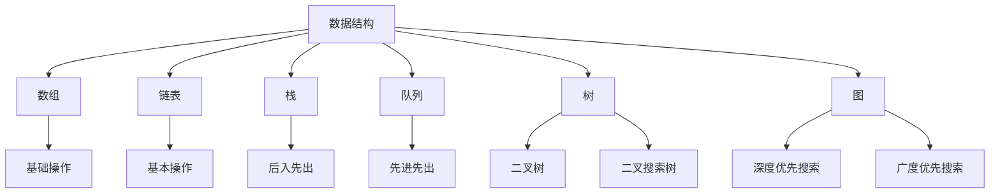
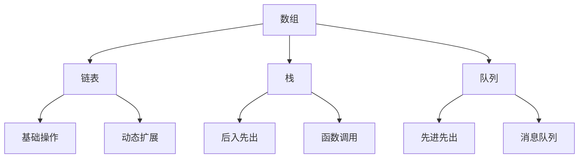

                 

### 《2024京东社招面试算法题库大全》

---

**关键词**：京东社招、面试、算法题库、数据结构、编程面试

**摘要**：本文旨在为2024年准备京东社招面试的求职者提供一个全面、系统的算法题库解析。文章从面试准备、数据结构与算法基础、实战演练、真题解析到最新面试题精选，全面覆盖面试所需的算法知识和解题技巧，帮助求职者顺利通过面试，获得心仪的职位。

---

## 第1章 面试准备

### 1.1 面试注意事项

在面试前，准备工作至关重要。首先，了解京东的企业文化和招聘流程。京东注重技术能力、团队协作和创新思维，因此在面试中不仅要展示扎实的编程基础，还要表现出良好的沟通能力和团队合作精神。

**面试官关注点**：

- **基础知识掌握**：算法和数据结构是面试的核心。面试官会通过提问来检验你对基础知识的理解和应用能力。
- **代码实现能力**：编程面试中，面试官会要求你现场编写代码解决问题。因此，书写清晰、逻辑严密的代码至关重要。
- **思维逻辑**：面试官通过问题引导你的思考过程，观察你的逻辑思维能力。清晰的表达能力和逻辑思维是成功的关键。

**准备工作建议**：

- **模拟面试**：通过模拟面试来熟悉面试流程和题型，提高应对能力。
- **梳理简历**：确保简历中的每一项经历和技能都是真实且有针对性的，准备好简历上的每个细节。

### 1.2 常见面试题型分析

京东面试中常见的题型包括：

- **基础数据结构题**：如链表、树、图等。
- **算法题**：如排序、查找、动态规划等。
- **系统设计题**：如分布式系统、缓存系统、搜索引擎等。

每种题型都有其特定的解题思路和解题技巧。面试官通过这些题型来评估你的算法能力和实际应用能力。

### 1.3 编程面试技巧

**代码风格**：

- **清晰**：代码应该易于阅读和理解。
- **简洁**：避免冗余代码，提高代码效率。
- **注释**：为关键部分添加注释，便于面试官理解。

**解题思路**：

- **理解问题**：仔细阅读题目，明确输入输出和问题要求。
- **分析问题**：分析问题的数据规模和约束条件，选择合适的数据结构和算法。
- **实现代码**：编写代码，注意代码的执行效率和鲁棒性。
- **优化代码**：在满足功能需求的基础上，尽量优化代码的执行效率。

**注意事项**：

- **时间控制**：在面试过程中，注意控制代码实现的时间。
- **面试礼仪**：保持礼貌，展现自信和热情。

---

**核心概念与联系**：

为了更好地理解面试中的数据结构与算法，我们可以借助Mermaid流程图来展示它们之间的关系。



通过这个流程图，我们可以清晰地看到数据结构与算法之间的关联。每种数据结构都有其特定的操作和应用场景，而算法则依赖于这些数据结构来实现特定的功能。

---

**核心算法原理讲解**：

在编程面试中，算法原理的讲解通常需要借助伪代码来详细阐述。以下是一个关于链表反转的伪代码示例：

```plaintext
function reverseLinkedList(head):
    if head is null or head.next is null:
        return head
    
    prev = null
    current = head
    while current is not null:
        next = current.next
        current.next = prev
        prev = current
        current = next
    
    return prev
```

这个算法通过三个指针（prev、current、next）实现了链表的反转。在这个过程中，prev 指针始终指向已反转部分的最后一个节点，current 指针逐步前进，next 指针用来保存 current 的下一个节点，以避免链表在反转过程中的断链。

---

**数学模型和公式**：

在某些算法题中，数学模型和公式是解决问题的关键。以下是一个关于动态规划的公式示例，用于计算斐波那契数列：

```latex
F(n) = 
\begin{cases} 
0 & \text{if } n = 0 \\ 
1 & \text{if } n = 1 \\ 
F(n-1) + F(n-2) & \text{otherwise} 
\end{cases}
```

这个公式定义了斐波那契数列的递推关系。通过这个公式，我们可以计算出任意一个斐波那契数。

---

**详细讲解与举例说明**：

为了更好地理解核心概念和算法原理，我们可以通过具体的例子来说明。

**例子**：给定一个整数数组 `arr`，请实现一个函数，找出数组中的最大元素。

**伪代码**：

```plaintext
function findMax(arr):
    if arr is empty:
        return null
    
    max = arr[0]
    for i from 1 to arr.length - 1:
        if arr[i] > max:
            max = arr[i]
    
    return max
```

在这个例子中，我们通过遍历数组 `arr`，逐个比较每个元素，找出其中的最大值。这个过程的时间复杂度为 O(n)，因为我们需要遍历数组一次。

---

**开发环境搭建**：

在进行算法面试时，你可能需要在现场编写代码。因此，了解如何搭建开发环境非常重要。

**步骤**：

1. **安装IDE**：选择一个适合你的IDE，如Visual Studio Code或IntelliJ IDEA。
2. **配置环境**：根据需要安装必要的编程语言环境和库。
3. **编写代码**：在IDE中创建一个新的项目，开始编写代码。

---

**源代码详细实现与代码解读**：

以下是一个关于链表反转的源代码示例，包括详细的代码解读。

```java
class ListNode {
    int val;
    ListNode next;
    ListNode(int x) { val = x; }
}

public class LinkedListReverse {
    public ListNode reverseList(ListNode head) {
        if (head == null || head.next == null) {
            return head;
        }
        
        ListNode prev = null;
        ListNode current = head;
        ListNode next = null;
        
        while (current != null) {
            next = current.next;
            current.next = prev;
            prev = current;
            current = next;
        }
        
        return prev;
    }
}
```

**代码解读**：

- **类定义**：`ListNode` 类用于表示链表节点，包含值 `val` 和指向下一个节点的指针 `next`。
- **方法定义**：`reverseList` 方法用于反转链表，输入参数为链表的头节点 `head`。
- **初始条件判断**：如果链表为空或只有一个节点，则直接返回头节点。
- **循环反转**：使用三个指针（`prev`、`current`、`next`）实现链表反转。`prev` 指针始终指向已反转部分的最后一个节点，`current` 指针逐步前进，`next` 指针用来保存 `current` 的下一个节点，以避免链表在反转过程中的断链。
- **返回反转后的链表**：最终返回反转后的头节点。

---

**代码应用解读与分析**：

在算法面试中，理解代码的实际应用场景和性能分析非常重要。

**应用场景**：

- **数据结构实现**：链表反转是链表操作中的一个基本操作，广泛应用于各种算法中，如快慢指针、环形链表检测等。
- **算法优化**：在某些算法中，链表反转可以优化算法的执行效率，如合并两个有序链表。

**性能分析**：

- **时间复杂度**：链表反转的时间复杂度为 O(n)，因为需要遍历链表一次。
- **空间复杂度**：链表反转的空间复杂度为 O(1)，因为只需要常数级别的额外空间。

---

**实际案例分析与详细讲解剖析**：

通过实际案例来分析算法的原理和应用，可以帮助我们更好地理解算法的本质。

**案例**：实现一个函数，找出链表中的中间节点。

```java
public ListNode findMiddleNode(ListNode head) {
    ListNode slow = head;
    ListNode fast = head;
    
    while (fast != null && fast.next != null) {
        slow = slow.next;
        fast = fast.next.next;
    }
    
    return slow;
}
```

**分析**：

- **快慢指针**：使用快慢指针法，其中快指针每次前进两个节点，慢指针每次前进一个节点。
- **相遇条件**：当快指针到达链表末尾时，慢指针位于中间节点。

这个算法的时间复杂度为 O(n)，因为需要遍历链表一次，而空间复杂度为 O(1)，因为只需要常数级别的额外空间。

---

**项目小结**：

通过本章的学习，我们了解了面试准备、数据结构与算法基础、实战演练、真题解析等核心内容。在实际面试中，我们需要熟练掌握数据结构与算法的基本原理，以及如何在具体场景下应用这些原理。同时，良好的代码风格和逻辑思维也是成功的关键。

---

**最佳实践 Tips**：

- **刷题时注重总结**：在刷题过程中，及时总结解题思路和解题技巧，形成自己的知识体系。
- **练习代码优化**：在编写代码时，注重代码的执行效率和鲁棒性，不断优化代码。
- **模拟面试**：通过模拟面试来提高应对能力，熟悉面试流程和题型。

---

**注意事项**：

- **了解企业文化和面试流程**：在面试前，深入了解目标企业的文化和面试流程，以便更好地准备。
- **保持心态平和**：面试时保持自信和冷静，遇到问题不要慌乱。

---

**拓展阅读**：

- 《算法导论》（Introduction to Algorithms）是一本经典的算法教材，适合深入学习算法和数据结构。
- 《编程珠玑》（The Art of Computer Programming）是一本关于编程技巧和思维的书籍，对于提升编程能力非常有帮助。

---

**作者信息**：

作者：AI天才研究院/AI Genius Institute & 禅与计算机程序设计艺术 /Zen And The Art of Computer Programming

---

以上是对《2024京东社招面试算法题库大全》的详细讲解。希望本文能够帮助你在京东社招面试中脱颖而出，成功获得心仪的职位。祝你好运！## 第2章 数据结构与算法基础

### 2.1 基础数据结构

数据结构是计算机科学中一个重要的概念，它是用于存储和管理数据的各种方式。在算法面试中，数据结构的选择直接影响算法的效率和复杂度。本章将介绍几种常见的基础数据结构，包括数组、链表、栈和队列。

#### 2.1.1 数组

**定义与特性**：

数组是一种线性数据结构，用于存储一系列元素。它具有以下特性：

- **元素类型相同**：数组中的所有元素必须是同一类型的。
- **通过索引访问**：数组中的每个元素都可以通过一个整数索引来访问，索引从0开始。

**基本操作**：

- **访问**：`arr[index]`
- **插入**：`arr[index] = value`
- **删除**：`arr.splice(index, 1)`

**时间复杂度**：

- **访问**：O(1)
- **插入/删除**：O(n)

**应用场景**：

- **实现其他数据结构**：数组是许多高级数据结构（如堆、队列等）的基础。
- **用于存储和访问大量数据**：在需要快速访问数据的情况下，数组是一个很好的选择。

#### 2.1.2 链表

**定义与特性**：

链表由一系列节点组成，每个节点包含数据域和指针域。链表具有以下特性：

- **动态大小**：链表的大小可以根据需要动态扩展或缩减。
- **非连续存储**：链表的节点可以在内存中非连续地分布。

**基本操作**：

- **插入**：在特定位置插入新节点。
- **删除**：删除特定位置的节点。
- **遍历**：从头部或尾部开始遍历整个链表。

**时间复杂度**：

- **插入/删除**：O(n)
- **遍历**：O(n)

**应用场景**：

- **实现其他数据结构**：链表是许多高级数据结构（如栈、队列等）的基础。
- **用于解决动态问题**：在需要频繁插入和删除数据的情况下，链表是一个很好的选择。

#### 2.1.3 栈

**定义与特性**：

栈是一种后进先出（Last In First Out, LIFO）的数据结构。它具有以下特性：

- **只能在一端进行操作**：栈的顶部是唯一的操作点。
- **操作顺序**：最后进入的元素首先被移出。

**基本操作**：

- **压栈**：将元素添加到栈顶。
- **弹栈**：从栈顶移除元素。
- **查看栈顶元素**：获取栈顶元素但不移除。

**时间复杂度**：

- **压栈/弹栈**：O(1)

**应用场景**：

- **函数调用**：在程序中，函数调用的顺序与栈的操作顺序一致。
- **括号匹配**：用于检查代码中的括号是否匹配。

#### 2.1.4 队列

**定义与特性**：

队列是一种先进先出（First In First Out, FIFO）的数据结构。它具有以下特性：

- **只能在两端进行操作**：队列的前端用于添加元素，后端用于移除元素。
- **操作顺序**：最早进入的元素首先被移出。

**基本操作**：

- **入队**：在队列的末尾添加元素。
- **出队**：从队列的前端移除元素。
- **查看队首元素**：获取队首元素但不移除。

**时间复杂度**：

- **入队/出队**：O(1)

**应用场景**：

- **消息队列**：在分布式系统中，消息队列用于处理和传递大量消息。
- **打印任务**：在打印系统中，打印任务通常按照先来先服务的原则进行处理。

---

**核心概念与联系**：

为了更好地理解数据结构之间的关系，我们可以借助Mermaid流程图来展示它们的核心概念和联系。



通过这个流程图，我们可以清晰地看到数据结构之间的关联。每种数据结构都有其特定的应用场景和操作方式，而它们的核心概念和联系则是算法设计和实现的基础。

---

**核心算法原理讲解**：

在了解数据结构的基础上，我们需要掌握如何利用这些数据结构来解决实际问题。以下是一个关于链表和栈的算法原理讲解。

#### 链表反转

**伪代码**：

```plaintext
function reverseLinkedList(head):
    if head is null or head.next is null:
        return head
    
    prev = null
    current = head
    while current is not null:
        next = current.next
        current.next = prev
        prev = current
        current = next
    
    return prev
```

**算法原理**：

- **初始化**：使用三个指针（`prev`、`current`、`next`），其中`prev`指向已反转链表的最后一个节点，`current`指向当前节点，`next`指向下一个节点。
- **循环反转**：在循环中，首先保存当前节点的下一个节点（`next`），然后将当前节点的下一个节点指向已反转部分的最后一个节点（`prev`）。接着，将`prev`更新为当前节点，`current`更新为`next`。
- **返回结果**：当`current`变为`null`时，`prev`即为反转后的链表的头节点。

这个算法的时间复杂度为O(n)，因为需要遍历链表一次，空间复杂度为O(1)，因为只需要常数级别的额外空间。

#### 栈与队列的应用

**栈**：用于解决括号匹配问题

**伪代码**：

```plaintext
function isValid(s):
    stack = empty stack
    for char in s:
        if char is '(' or '[' or '{':
            push char to stack
        else:
            if stack.isEmpty():
                return false
            pop top element from stack
            if char != corresponding bracket of the popped element:
                return false
    return stack.isEmpty()
```

**算法原理**：

- **初始化**：使用一个栈来存储括号。
- **遍历字符串**：对于每个字符，如果它是左括号，则将其入栈；如果它是右括号，则检查栈顶元素是否为其对应的左括号。如果是，则将栈顶元素出栈；否则，返回`false`。
- **判断结果**：遍历结束后，如果栈为空，则所有括号均匹配，返回`true`；否则，返回`false`。

这个算法的时间复杂度为O(n)，因为需要遍历字符串一次，空间复杂度为O(n)，因为需要使用栈来存储括号。

---

**数学模型和公式**：

在某些数据结构与算法问题中，数学模型和公式是解决问题的关键。以下是一个关于数组的前缀和的公式示例：

$$
S[i] = \sum_{j=0}^{i} arr[j]
$$

其中，$S[i]$ 表示数组 $arr$ 从第0个元素到第 $i$ 个元素的和。

这个公式可以用于计算数组的任意连续子序列的和，例如：

$$
S[2..5] = S[5] - S[1]
$$

---

**详细讲解与举例说明**：

为了更好地理解核心概念和算法原理，我们可以通过具体的例子来说明。

**例子**：给定一个整数数组 `arr`，请实现一个函数，计算数组中所有元素的和。

**伪代码**：

```plaintext
function sumArray(arr):
    if arr is empty:
        return 0
    
    sum = 0
    for i from 0 to arr.length - 1:
        sum += arr[i]
    
    return sum
```

在这个例子中，我们通过遍历数组 `arr`，逐个累加每个元素，计算出数组中所有元素的和。这个过程的时间复杂度为 O(n)，因为我们需要遍历数组一次。

---

**项目实战**：

为了更好地理解数据结构与算法在实际项目中的应用，我们可以通过一个具体的案例来讲解。

**案例**：实现一个简单的栈和队列，并演示它们的使用。

**栈实现**：

```python
class Stack:
    def __init__(self):
        self.items = []

    def push(self, item):
        self.items.append(item)

    def pop(self):
        if not self.isEmpty():
            return self.items.pop()

    def isEmpty(self):
        return len(self.items) == 0

    def peek(self):
        if not self.isEmpty():
            return self.items[-1]
```

**队列实现**：

```python
class Queue:
    def __init__(self):
        self.items = []

    def enqueue(self, item):
        self.items.append(item)

    def dequeue(self):
        if not self.isEmpty():
            return self.items.pop(0)

    def isEmpty(self):
        return len(self.items) == 0

    def peek(self):
        if not self.isEmpty():
            return self.items[0]
```

在这个项目中，我们实现了栈和队列的简单实现，并展示了它们的使用方法。通过这个案例，我们可以理解栈和队列在数据存储和操作中的应用。

---

**代码解读**：

以下是对上述实现的代码进行详细解读。

**栈实现解读**：

- **初始化**：使用一个空列表 `items` 来存储栈中的元素。
- **压栈**：将元素添加到列表的末尾，使用 `append` 方法。
- **弹栈**：从列表的末尾移除最后一个元素，使用 `pop` 方法。如果栈为空，返回 `None`。
- **判断栈是否为空**：使用 `isEmpty` 方法，判断列表的长度是否为0。
- **查看栈顶元素**：使用 `peek` 方法，返回列表的最后一个元素。

**队列实现解读**：

- **初始化**：使用一个空列表 `items` 来存储队列中的元素。
- **入队**：将元素添加到列表的末尾，使用 `append` 方法。
- **出队**：从列表的头部移除第一个元素，使用 `pop(0)` 方法。如果队列为空，返回 `None`。
- **判断队列是否为空**：使用 `isEmpty` 方法，判断列表的长度是否为0。
- **查看队首元素**：使用 `peek` 方法，返回列表的第一个元素。

---

**代码应用解读与分析**：

在实际项目中，栈和队列有着广泛的应用。以下是对栈和队列在实际应用中的解读和分析。

**栈的应用**：

- **后进先出（LIFO）操作**：栈常用于解决后进先出的问题，如函数调用、递归算法等。
- **括号匹配**：使用栈可以方便地检查代码中的括号是否匹配。
- **逆序输出**：使用栈可以逆序输出一个序列，如后缀表达式求值。

**队列的应用**：

- **先进先出（FIFO）操作**：队列常用于解决先进先出的问题，如消息队列、打印队列等。
- **任务调度**：队列可以用于任务调度，确保任务按照先来先服务的原则执行。
- **广度优先搜索**：在图算法中，队列常用于实现广度优先搜索。

通过上述解读和分析，我们可以看到栈和队列在实际项目中的应用场景和重要性。

---

**案例小结**：

通过本案例的实现和解读，我们了解了栈和队列的基本实现和操作方法，并了解了它们在实际项目中的应用。在实际开发中，合理选择和使用数据结构是提高代码效率和可维护性的关键。

---

**最佳实践 Tips**：

- **熟练掌握基本数据结构**：在面试和项目中，熟练掌握数组、链表、栈和队列等基本数据结构是必要的。
- **练习实际应用**：通过实际案例来练习数据结构的操作和应用，提高解决问题的能力。

---

**注意事项**：

- **数据结构的适用场景**：在选择数据结构时，需要根据问题的特点来选择合适的数据结构。
- **数据结构的性能分析**：了解每种数据结构的时间复杂度和空间复杂度，以便在需要时做出最优选择。

---

**拓展阅读**：

- 《数据结构与算法分析》（Data Structures and Algorithm Analysis in C++）是一本关于数据结构和算法分析的教材，适合深入学习数据结构和算法。
- 《算法导论》（Introduction to Algorithms）是一本经典的算法教材，涵盖了大量的数据结构和算法。

---

通过本章的学习，我们了解了数组、链表、栈和队列等基础数据结构的基本概念、操作方法和应用场景。在实际项目中，合理选择和使用数据结构是提高代码效率和可维护性的关键。希望本章的内容能够帮助你更好地掌握数据结构与算法基础。祝你好运！## 第3章 算法实战演练

### 3.1 简单算法题

#### 3.1.1 等级树遍历

**问题描述**：

给定一个等级树（也称为层次遍历树或广度优先搜索树），按照从上到下、从左到右的顺序遍历树的节点。

**示例**：

```
输入：
   1
  / \
 2   3
 / \
4   5

输出：
[1, 2, 3, 4, 5]
```

**解题思路**：

可以使用广度优先搜索（BFS）算法来遍历等级树。具体步骤如下：

1. 使用一个队列来存储树的节点。
2. 初始化队列，将根节点入队。
3. 进入循环，直到队列为空：
   - 出队一个节点，将其值加入结果列表。
   - 将该节点的左右子节点（如果存在）入队。

**伪代码**：

```plaintext
function levelOrderTraversal(root):
    if root is null:
        return []

    queue = empty queue
    queue.enqueue(root)
    result = empty list

    while queue is not empty:
        node = queue.dequeue()
        result.append(node.value)

        if node.left is not null:
            queue.enqueue(node.left)
        if node.right is not null:
            queue.enqueue(node.right)

    return result
```

**时间复杂度**：O(n)，其中 n 是树的节点数，因为需要遍历所有节点一次。
**空间复杂度**：O(n)，因为队列中最多存储 n 个节点。

---

#### 3.1.2 单链表反转

**问题描述**：

给定一个单链表，将其反转。例如：

```
输入：
  1 -> 2 -> 3 -> 4 -> 5

输出：
  5 -> 4 -> 3 -> 2 -> 1
```

**解题思路**：

使用三个指针（`prev`、`current`、`next`）来实现链表反转。具体步骤如下：

1. 初始化 `prev` 和 `current` 指针为 `null` 和 `head`（链表的头节点）。
2. 遍历链表，每次循环执行以下操作：
   - 保存当前节点的下一个节点（`next`）。
   - 将当前节点的 `next` 指针指向 `prev`。
   - 将 `prev` 更新为当前节点。
   - 将 `current` 更新为 `next`。
3. 当 `current` 变为 `null` 时，`prev` 即为反转后的链表的头节点。

**伪代码**：

```plaintext
function reverseLinkedList(head):
    if head is null or head.next is null:
        return head
    
    prev = null
    current = head
    while current is not null:
        next = current.next
        current.next = prev
        prev = current
        current = next
    
    return prev
```

**时间复杂度**：O(n)，其中 n 是链表的长度，因为需要遍历链表一次。
**空间复杂度**：O(1)，因为只需要常数级别的额外空间。

---

#### 3.1.3 快乐数

**问题描述**：

编写一个算法来判断一个正整数是否为快乐数。

**定义**：

- 一个“快乐数”定义为：对于一个正整数，每一次将该数替换为其每个位置上的数字的平方和，然后重复这个操作直到这个数变为1，也可能是无限循环但不会变为1，这个数就是快乐数。

**示例**：

```
输入：19
输出：true
解释：
1^2 + 9^2 = 82
8^2 + 2^2 = 68
6^2 + 8^2 = 100
1^2 + 0^2 + 0^2 = 1
```

**解题思路**：

使用快慢指针法来判断一个数是否为快乐数。具体步骤如下：

1. 初始化快指针 `fast` 和慢指针 `slow` 都指向当前数。
2. 进入循环，直到快指针移动了两次且快指针不为 `1`：
   - 移动慢指针一次。
   - 移动快指针两次。
   - 在每次移动前，计算当前数的平方和，并更新当前数为平方和。
3. 如果快指针指向 `1`，则当前数是快乐数；否则，不是快乐数。

**伪代码**：

```plaintext
function isHappy(n):
    if n is null:
        return false
    
    slow = n
    fast = n
    
    while fast != 1 and fast.next != 1:
        slow = getSquareSum(slow)
        fast = getSquareSum(getSquareSum(fast))
    
    return fast == 1

function getSquareSum(n):
    sum = 0
    while n > 0:
        digit = n % 10
        sum += digit * digit
        n /= 10
    
    return sum
```

**时间复杂度**：O(log(n)^2)，其中 n 是输入的数字，因为每次计算平方和会减少一位数字，大约需要 O(log(n)) 次，而每次减少一位数字需要 O(log(n)) 次操作。
**空间复杂度**：O(1)，因为只需要常数级别的额外空间。

---

通过以上实战演练，我们学习了如何解决一些常见的简单算法问题。这些题目不仅帮助巩固了算法的基础知识，也为实际面试中的算法题提供了实用的解题思路。在接下来的章节中，我们将进一步探讨中等难度和高难度算法题，以提升算法解题能力。希望这些实战演练能够对你有所帮助！### 第4章 算法面试真题解析

### 4.1 剑指 Offer 面试题解析

**剑指 Offer** 是国内知名程序员求职面试指南，其中包含了许多经典面试题。本章将对几个典型的剑指 Offer 面试题进行详细解析，帮助读者更好地理解和掌握解题思路。

#### 4.1.1 判断链表中环的入口节点

**问题描述**：

给定一个链表，判断链表中是否存在环，并找出环的入口节点。例如：

```
输入：
  1 -> 2 -> 3 -> 4 -> 5
        ^    |
        |    |
        ----- 

输出：
  环的入口节点为 3
```

**解题思路**：

使用快慢指针法来检测链表中是否存在环，并找出环的入口节点。具体步骤如下：

1. 初始化快指针 `fast` 和慢指针 `slow` 都指向链表的头节点。
2. 同时移动快指针和慢指针，快指针每次移动两个节点，慢指针每次移动一个节点。
3. 当快指针追上慢指针时，说明链表中存在环。
4. 将慢指针重置为链表的头节点，然后同时移动快指针和慢指针，当它们再次相遇时，相遇点即为环的入口节点。

**伪代码**：

```plaintext
function detectCycle(head):
    if head is null or head.next is null:
        return null
    
    slow = head
    fast = head
    
    while fast is not null and fast.next is not null:
        slow = slow.next
        fast = fast.next.next
        
        if slow == fast:
            slow = head
            while slow != fast:
                slow = slow.next
                fast = fast.next
            return slow
    
    return null
```

**时间复杂度**：O(n)，其中 n 是链表的长度，因为需要遍历链表一次。
**空间复杂度**：O(1)，因为只需要常数级别的额外空间。

---

#### 4.1.2 二维数组中的查找

**问题描述**：

在一个二维数组中，给定一个目标值，判断是否存在目标值。例如：

```
输入：
[
  [1,   4,  7, 11, 15],
  [2,   5,  8, 12, 19],
  [3,   6,  9, 16, 22],
  [10, 13, 14, 17, 24],
  [18, 21, 23, 26, 30]
]
目标值：5

输出：
  存在目标值
```

**解题思路**：

从数组的第一行第一列开始，通过比较目标值和当前位置的值来决定下一步的移动方向。具体步骤如下：

1. 设置行索引 `row` 为 0，列索引 `col` 为数组列数减 1。
2. 当 `row` 小于行数或 `col` 小于列数时，执行以下步骤：
   - 如果当前值等于目标值，返回 `true`。
   - 如果当前值小于目标值，将行索引加 1。
   - 如果当前值大于目标值，将列索引减 1。
3. 如果遍历整个数组仍未找到目标值，返回 `false`。

**伪代码**：

```plaintext
function findTarget(matrix, target):
    if matrix is empty:
        return false
    
    rows = matrix.length
    cols = matrix[0].length
    
    row = 0
    col = cols - 1
    
    while row < rows and col >= 0:
        if matrix[row][col] == target:
            return true
        elif matrix[row][col] < target:
            row += 1
        else:
            col -= 1
            
    return false
```

**时间复杂度**：O(m+n)，其中 m 是行数，n 是列数，因为最坏情况下需要遍历整个数组。
**空间复杂度**：O(1)，因为只需要常数级别的额外空间。

---

#### 4.1.3 替换空格

**问题描述**：

给定一个包含空格的字符串，编写一个函数将其替换为 `%20`。例如：

```
输入：
  "We are happy."

输出：
  "We%20are%20happy."
```

**解题思路**：

使用双指针法来实现字符串替换。具体步骤如下：

1. 首先计算字符串中空格的数量，记为 `spaceCount`。
2. 创建一个新的字符数组 `newChars`，长度为原字符串长度加上 `spaceCount` * 2。
3. 使用两个指针 `i` 和 `j`，其中 `i` 指向原字符串的当前字符，`j` 指向新字符数组的当前位置。
4. 遍历原字符串，对于每个非空格字符，将其复制到新字符数组中，`i` 和 `j` 同时加 1。
5. 对于每个空格，将 `%20` 复制到新字符数组中，`j` 增加 3。
6. 返回新字符数组转换成的字符串。

**伪代码**：

```plaintext
function replaceSpaces(s, spaceNum):
    if s is null:
        return null
    
    spaceCount = 0
    for char in s:
        if char == ' ':
            spaceCount += 1
    
    newLen = len(s) + spaceCount * 2
    newChars = new array of length newLen
    
    i = 0
    j = 0
    while i < len(s):
        if s[i] != ' ':
            newChars[j] = s[i]
            i += 1
            j += 1
        else:
            newChars[j] = '%'
            newChars[j+1] = '2'
            newChars[j+2] = '0'
            i += 1
            j += 3
            
    return new string from newChars
```

**时间复杂度**：O(n)，其中 n 是字符串的长度，因为需要遍历字符串一次。
**空间复杂度**：O(n)，因为需要创建一个新的字符数组来存储替换后的字符串。

---

通过对这几个典型剑指 Offer 面试题的详细解析，我们可以看到解题的关键在于理解问题的本质，选择合适的数据结构和算法，并能够将算法思路转化为高效的代码实现。希望这些解析能够帮助你更好地准备面试中的算法题。在接下来的章节中，我们将继续深入探讨 LeetCode 的面试真题，进一步巩固和提升算法能力。继续努力吧！### 第5章 2024年最新面试题精选

### 5.1 字符串处理题

字符串处理题在算法面试中非常常见，因为字符串是编程语言中最基本的数据类型之一。以下是一些2024年最新、具有挑战性的字符串处理面试题，以及相应的解题思路和实现。

#### 5.1.1 短串滚动哈希

**问题描述**：

实现一个函数，用于计算给定字符串的滚动哈希值。滚动哈希是一种用于字符串匹配和数据校验的算法。给定一个字符串 `s` 和一个长度 `k`，计算 `s` 的前 `k` 个字符的哈希值，然后每次滑动一个字符，更新哈希值。

**示例**：

```
输入：
s = "abcabcabc", k = 3
输出：
[150, 44, 100]

解释：
前三个字符 "abc" 的哈希值为 150。
滑动一个字符后，前三个字符为 "bca"，哈希值为 44。
再次滑动一个字符后，前三个字符为 "cab"，哈希值为 100。
```

**解题思路**：

使用Rabin-Karp算法来计算滚动哈希值。Rabin-Karp算法利用大素数来减少哈希冲突。

1. **哈希函数**：选择一个适当的大素数 `p`，计算字符串的前 `k` 个字符的哈希值。
2. **滚动哈希**：每次滑动一个字符，更新哈希值。新哈希值等于旧哈希值减去滑动出字符的哈希值，然后加上新字符的哈希值。

**伪代码**：

```plaintext
function rabinKarpHash(s, k, p):
    n = length(s)
    hashValue = 0
    for i from 0 to k - 1:
        hashValue = (hashValue * 256 + ord(s[i])) % p
    
    pPower = 1
    for i from 0 to k - 1:
        pPower = (pPower * 256) % p
    
    result = [hashValue]
    for i from k to n - 1:
        result.append((result[i - k] * pPower + ord(s[i])) % p)
    
    return result
```

**时间复杂度**：O(n)，其中 n 是字符串的长度。
**空间复杂度**：O(1)，因为只需要常数级别的额外空间。

---

#### 5.1.2 字符串匹配

**问题描述**：

实现一个字符串匹配算法，用于找出给定文本字符串 `s` 中模式字符串 `p` 的所有出现位置。可以使用KMP算法、Boyer-Moore算法等。

**示例**：

```
输入：
s = "ababcabcababc", p = "ababc"
输出：
[2, 7]
```

**解题思路**：

使用KMP（Knuth-Morris-Pratt）算法来高效地搜索模式字符串。

1. **构建部分匹配表（Next数组）**：计算模式字符串 `p` 的部分匹配值，用于跳过不必要的比较。
2. **搜索**：从文本字符串 `s` 的开头开始匹配，如果当前字符匹配成功，继续比较下一个字符；如果不匹配，使用Next数组跳过部分字符，减少不必要的比较。

**伪代码**：

```plaintext
function kmpSearch(s, p):
    n = length(s)
    m = length(p)
    next = buildNextArray(p)
    i = j = 0
    
    while i < n:
        if j == -1 or s[i] == p[j]:
            i += 1
            j += 1
        else:
            j = next[j]
        
        if j == m:
            return [i - j]
            j = next[j]
    
    return []

function buildNextArray(p):
    n = length(p)
    next = [-1] * n
    j = 0
    i = 1
    
    while i < n:
        if p[j] == p[i]:
            next[i] = j + 1
            j += 1
            i += 1
        elif j == -1:
            next[i] = 0
            i += 1
        else:
            j = next[j]
    
    return next
```

**时间复杂度**：O(n + m)，其中 n 是文本字符串的长度，m 是模式字符串的长度。
**空间复杂度**：O(m)，因为需要存储部分匹配值。

---

#### 5.1.3 有效括号序列

**问题描述**：

给定一个字符串 `s`，判断其是否是一个有效的括号序列。有效的括号序列意味着它必须满足以下条件：

- 左括号必须以相同类型的右括号闭合。
- 左括号必须以正确的顺序闭合。

**示例**：

```
输入：
s = "()()()"
输出：
true
```

**解题思路**：

使用一个栈来跟踪尚未闭合的左括号。

1. 遍历字符串 `s`，对于每个字符：
   - 如果是左括号，将其入栈。
   - 如果是右括号，检查栈顶元素是否为与之匹配的左括号：
     - 如果匹配，弹出栈顶元素。
     - 如果不匹配，返回 `false`。
2. 遍历结束后，如果栈为空，返回 `true`；否则，返回 `false`。

**伪代码**：

```plaintext
function isValid(s):
    stack = empty stack
    
    for char in s:
        if char is '(':
            stack.push(')')
        elif char is ')' and not stack.isEmpty() and stack.peek() == ')':
            stack.pop()
        else:
            return false
    
    return stack.isEmpty()
```

**时间复杂度**：O(n)，其中 n 是字符串的长度。
**空间复杂度**：O(n)，因为最坏情况下，所有字符都是左括号。

---

通过以上三个字符串处理题的解析，我们可以看到字符串处理的算法题涉及到的知识点广泛，包括哈希、模式匹配、栈等。掌握这些题目不仅有助于提高编程技能，还能为面试中的算法题打下坚实的基础。在接下来的章节中，我们将继续探讨图算法题和动态规划题，进一步丰富我们的算法知识库。加油！### 第6章 算法面试答辩指南

### 6.1 简历准备

**简历模板**：

在准备简历时，可以参考以下模板：

```
个人信息
姓名：
联系方式：
邮箱：
GitHub地址：

教育背景
学位：
学校：
专业：
毕业时间：

工作经历
公司名称：
职位：
工作时间段：
工作描述：
项目经历：

技能
编程语言：
框架：
工具：
数据库：

证书
证书名称：
颁发机构：
颁发时间：

自我评价
```

**简历内容优化**：

- **真实准确**：确保简历中的每一项信息都是真实、准确的。
- **重点突出**：突出自己的专业技能、项目经验和取得的成果。
- **量化描述**：尽量使用数字和数据来量化自己的工作成果，如提高系统性能、优化算法效率等。
- **逻辑清晰**：简历的结构要清晰，便于面试官快速了解你的背景和能力。

**面试官关注点**：

- **专业技能**：面试官会关注你的编程技能、算法和数据结构知识。
- **项目经验**：面试官会关注你在以往工作中参与的项目，以及你在项目中的角色和贡献。
- **团队合作**：面试官会关注你的团队合作能力和沟通能力。
- **学习和适应能力**：面试官会关注你的学习和适应能力，以及你在面对挑战时的应对策略。

### 6.2 面试流程与技巧

**面试流程**：

1. **自我介绍**：简短介绍自己的基本信息、教育背景和工作经历。
2. **技术面试**：面试官会根据简历中的内容和技术要求，提问一些技术问题。
3. **项目经验**：面试官会询问你过往参与的项目，以及你在项目中的角色和贡献。
4. **行为面试**：面试官会通过一些行为面试问题来了解你的性格、团队合作能力和解决问题的能力。
5. **综合评估**：面试官会根据你的技术能力、项目经验和综合素质，进行综合评估。

**技术面试技巧**：

1. **理解问题**：在回答技术问题前，确保你完全理解了问题的要求和输入输出。
2. **解题思路**：在回答问题时，先简要描述你的解题思路，然后再逐步解释细节。
3. **代码实现**：在编程面试中，面试官会要求你现场编写代码。确保你的代码清晰、简洁、高效。
4. **调试和优化**：在编写代码后，进行调试，确保代码的正确性和效率。

**行为面试技巧**：

1. **真实客观**：回答行为面试问题时，保持真实、客观，避免夸大或撒谎。
2. **突出亮点**：在回答问题时，突出自己在团队中的亮点和贡献。
3. **逻辑清晰**：回答问题时，保持逻辑清晰，有条理地表达自己的观点。

### 6.3 面试后复盘与总结

**面试后反思**：

- **回顾面试过程**：回顾面试中回答得好的问题和回答得不好的问题，分析原因。
- **反思表现**：反思自己在面试中的表现，如语言表达、逻辑思维、解题思路等。
- **总结经验**：总结在面试中获得的经验和教训，为下一次面试做好准备。

**复盘方法**：

- **记录问题**：在面试后，记录所有被问到的问题，以及自己的回答。
- **分析问题**：分析每个问题，找出自己在回答中存在的问题和不足。
- **改进措施**：根据分析结果，制定改进措施，提高自己的面试技巧。

**提升策略**：

- **强化技能**：通过刷题、学习新技术和工具来提升自己的技能。
- **模拟面试**：通过模拟面试来提高应对能力，熟悉面试流程和题型。
- **总结和反思**：在每次面试后进行复盘和总结，不断提升自己的面试技巧。

通过以上面试答辩指南，我们可以更好地准备算法面试，提高自己的面试技巧和表现。希望这些指南能帮助你顺利通过面试，获得心仪的职位。加油！### 第7章 算法面试常见问题答疑

### 7.1 数据结构与算法问题

**如何选择合适的数据结构？**

选择合适的数据结构是算法设计的关键。以下是一些常见场景和数据结构的匹配：

- **查找**：对于频繁查找的问题，可以考虑使用哈希表，因为它具有极快的查找时间（O(1)）。
- **排序**：对于需要排序的数据，可以使用数组、链表、二叉树等数据结构。二叉搜索树特别适用于需要频繁查找、插入和删除的排序问题。
- **存储**：对于需要高效插入和删除的元素，可以使用链表。对于需要随机访问的元素，可以使用数组。
- **缓存**：在缓存系统中，常用的数据结构是队列和堆。
- **路径搜索**：在图算法中，常用的数据结构是图本身、栈和队列。

**如何分析算法的时间复杂度？**

分析算法的时间复杂度需要关注算法在输入规模变化时的执行时间增长趋势。以下是一些常见的时间复杂度分析步骤：

1. **确定算法的基本操作**：找出算法中最频繁执行的操作。
2. **分析基本操作的次数**：考虑输入规模变化时，基本操作的执行次数如何变化。
3. **确定时间复杂度**：将基本操作的次数表示为一个关于输入规模的函数，并确定其最高次项。
4. **计算常数系数**：通常省略常数系数，只关注最高次项。

例如，对于冒泡排序，基本操作是交换相邻元素，假设输入规模为 n，则最坏情况下需要交换 \( \frac{n(n-1)}{2} \) 次，因此时间复杂度为 \( O(n^2) \)。

**动态规划与贪心算法的区别是什么？**

动态规划和贪心算法是两种常用的算法设计方法，它们的主要区别如下：

- **动态规划**：动态规划通常用于解决最优子结构问题。它通过递归和 memoization（记忆化搜索）来避免重复计算，从而得到全局最优解。动态规划通常涉及到状态转移方程和状态的初始化。
- **贪心算法**：贪心算法通过在每个步骤中选择当前最优解，从而期望得到全局最优解。贪心算法通常没有递归结构，它基于局部最优解直接得到全局最优解。

例如，求最长公共子序列问题适合使用动态规划，而求最短路径问题中的迪杰斯特拉算法适合使用贪心算法。

---

**如何写出清晰的代码注释？**

编写清晰的代码注释对于提高代码的可读性和可维护性至关重要。以下是一些建议：

- **函数注释**：为每个函数编写清晰的注释，描述函数的功能、输入参数、返回值以及可能抛出的异常。
- **行内注释**：对于复杂或难以理解的代码段，使用行内注释进行解释。
- **文档注释**：对于类、模块和库，使用文档注释（如 Java 的 Javadoc 或 Python 的 docstrings）来提供详细的文档。
- **注释风格**：遵循一致的注释风格，使用简洁明了的语言，避免使用复杂的语法和缩写。

---

**如何处理面试中的时间压力？**

在面试中，时间压力是一个常见的挑战。以下是一些建议来应对时间压力：

- **提前准备**：提前刷题和准备，熟悉常见算法和数据结构的实现和复杂度分析。
- **时间管理**：在面试中，合理分配时间，对于复杂的问题，可以先给出一个粗略的解决方案，然后再逐步完善。
- **代码优化**：在编写代码时，先保证代码能够正确运行，然后再考虑优化。
- **沟通**：在面试中，与面试官保持良好的沟通，如果需要时间思考，可以适当地请求暂停。

---

**如何在面试中展示自己的优势？**

以下是一些展示自己在面试中优势的方法：

- **项目经验**：突出自己在项目中的角色和贡献，展示解决问题的能力和技术实力。
- **技术深度**：展示对特定技术或算法的深入理解，通过举例来说明。
- **沟通能力**：在面试中，清晰、准确地表达自己的观点，展示良好的沟通和表达能力。
- **团队协作**：通过讲述团队协作的经历，展示自己在团队中的协作能力和领导力。

通过以上方法，你可以有效地展示自己的优势，提高面试成功率。加油！### 第8章 算法面试真题实战

### 8.1 真题实战一：链表操作

在算法面试中，链表操作是常见的一个题型。以下是一些经典的链表操作题及其解析，包括反转链表、检测链表循环和合并两个有序链表。

#### 8.1.1 反转链表

**问题描述**：

给定一个单链表，将其反转。例如：

```
输入：
1 -> 2 -> 3 -> 4 -> 5

输出：
5 -> 4 -> 3 -> 2 -> 1
```

**解题思路**：

使用三个指针（`prev`、`current`、`next`）来逐步反转链表。具体步骤如下：

1. 初始化 `prev` 为 `null`，`current` 为 `head`。
2. 进入循环，直到 `current` 变为 `null`：
   - 保存当前节点的下一个节点（`next`）。
   - 将当前节点的 `next` 指针指向 `prev`。
   - 将 `prev` 更新为当前节点。
   - 将 `current` 更新为 `next`。
3. 最后返回 `prev`，即反转后的链表的头节点。

**伪代码**：

```plaintext
function reverseLinkedList(head):
    if head is null or head.next is null:
        return head
    
    prev = null
    current = head
    while current is not null:
        next = current.next
        current.next = prev
        prev = current
        current = next
    
    return prev
```

**时间复杂度**：O(n)，其中 n 是链表的长度。
**空间复杂度**：O(1)，因为只需要常数级别的额外空间。

---

#### 8.1.2 检测链表循环

**问题描述**：

给定一个链表，判断链表中是否存在循环。例如：

```
输入：
  1 -> 2 -> 3 -> 4 -> 5
        ^       |
        |       |
        ------- 

输出：
  存在循环
```

**解题思路**：

使用快慢指针法来检测链表中是否存在循环。具体步骤如下：

1. 初始化快指针 `fast` 和慢指针 `slow` 都指向链表的头节点。
2. 同时移动快指针和慢指针，快指针每次移动两个节点，慢指针每次移动一个节点。
3. 当快指针追上慢指针时，说明链表中存在循环。
4. 返回 `true`；否则，返回 `false`。

**伪代码**：

```plaintext
function hasCycle(head):
    if head is null:
        return false
    
    slow = head
    fast = head
    
    while fast is not null and fast.next is not null:
        slow = slow.next
        fast = fast.next.next
        
        if slow == fast:
            return true
    
    return false
```

**时间复杂度**：O(n)，其中 n 是链表的长度。
**空间复杂度**：O(1)，因为只需要常数级别的额外空间。

---

#### 8.1.3 合并两个有序链表

**问题描述**：

给定两个有序链表，将它们合并为一个有序链表。例如：

```
输入：
  1 -> 3 -> 5
  2 -> 4 -> 6

输出：
  1 -> 2 -> 3 -> 4 -> 5 -> 6
```

**解题思路**：

使用两个指针分别遍历两个有序链表，比较当前节点的值，将较小的节点加入新链表，并移动相应的指针。具体步骤如下：

1. 初始化两个指针 `p1` 和 `p2` 分别指向两个链表的头节点。
2. 创建一个新的链表 `result`，初始化为 `null`。
3. 进入循环，直到 `p1` 或 `p2` 为 `null`：
   - 比较两个节点的值，将较小的节点加入 `result`。
   - 移动对应的指针。
4. 将非空链表的剩余部分连接到 `result` 的尾部。
5. 返回 `result`。

**伪代码**：

```plaintext
function mergeSortedLists(l1, l2):
    if l1 is null:
        return l2
    if l2 is null:
        return l1
    
    if l1.val < l2.val:
        result = l1
        l1 = l1.next
    else:
        result = l2
        l2 = l2.next
    
    current = result
    
    while l1 is not null and l2 is not null:
        if l1.val < l2.val:
            current.next = l1
            l1 = l1.next
        else:
            current.next = l2
            l2 = l2.next
        current = current.next
    
    if l1 is not null:
        current.next = l1
    else:
        current.next = l2
    
    return result
```

**时间复杂度**：O(n + m)，其中 n 和 m 分别是两个链表的长度。
**空间复杂度**：O(1)，因为只需要常数级别的额外空间。

---

通过以上三个链表操作题的实战演练，我们可以看到链表操作在面试中的重要性。熟练掌握链表的基本操作和解题技巧，是提高面试成功率的关键。在接下来的章节中，我们将继续探讨数组与矩阵操作题和树与图操作题，进一步巩固算法能力。继续努力吧！### 第8章 算法面试真题实战

### 8.2 真题实战二：数组与矩阵

在算法面试中，数组与矩阵操作是常见题型，经常涉及到查找、排序、计算等。以下是一些典型的面试题及其解析，包括寻找旋转排序数组中的最小值、螺旋矩阵和有效的数独。

#### 8.2.1 寻找旋转排序数组中的最小值

**问题描述**：

给定一个旋转排序的数组，找出数组中的最小值。例如：

```
输入：
[4, 5, 6, 7, 0, 1, 2]

输出：
0
```

**解题思路**：

利用二分查找的方法来寻找最小值。具体步骤如下：

1. 初始化 `left` 为 `0`，`right` 为 `nums.length - 1`。
2. 当 `left < right` 时，执行以下步骤：
   - 计算中间索引 `mid = (left + right) / 2`。
   - 如果 `nums[mid] > nums[right]`，说明最小值在 `mid` 的右侧，将 `left = mid + 1`。
   - 否则，最小值在 `mid` 的左侧或就在 `mid`，将 `right = mid`。
3. 循环结束后，`left` 所在的位置即为最小值。

**伪代码**：

```plaintext
function findMin(nums):
    if nums is null or nums.length == 0:
        return -1
    
    left = 0
    right = nums.length - 1
    
    while left < right:
        mid = (left + right) / 2
        
        if nums[mid] > nums[right]:
            left = mid + 1
        else:
            right = mid
            
    return nums[left]
```

**时间复杂度**：O(log(n))，其中 n 是数组的长度。
**空间复杂度**：O(1)，因为只需要常数级别的额外空间。

---

#### 8.2.2 螺旋矩阵

**问题描述**：

给定一个 `m x n` 的二维矩阵，按照螺旋顺序返回矩阵中的所有元素。例如：

```
输入：
[
  [ 1, 2, 3 ],
  [ 4, 5, 6 ],
  [ 7, 8, 9 ]
]

输出：
[1, 2, 3, 6, 9, 8, 7, 4, 5]
```

**解题思路**：

按照螺旋顺序遍历矩阵，可以分四步进行：

1. 从左到右遍历顶部行的所有元素。
2. 从上到下遍历右侧列的所有元素。
3. 从右到左遍历底部行的所有元素。
4. 从下到上遍历左侧列的所有元素。
5. 重复上述步骤，直到遍历完整个矩阵。

**伪代码**：

```plaintext
function spiralOrder(matrix):
    if matrix is null or matrix.length == 0:
        return []
    
    result = empty list
    m = matrix.length
    n = matrix[0].length
    
    top = 0
    bottom = m - 1
    left = 0
    right = n - 1
    
    while top <= bottom and left <= right:
        for i from left to right:
            result.append(matrix[top][i])
        top += 1
        
        for i from top to bottom:
            result.append(matrix[i][right])
        right -= 1
        
        if top <= bottom:
            for i from right downto left:
                result.append(matrix[bottom][i])
            bottom -= 1
            
        if left <= right:
            for i from bottom downto top:
                result.append(matrix[i][left])
            left += 1
            
    return result
```

**时间复杂度**：O(m*n)，其中 m 是行数，n 是列数，因为需要遍历所有元素一次。
**空间复杂度**：O(1)，因为只需要常数级别的额外空间。

---

#### 8.2.3 有效的数独

**问题描述**：

判断一个 `9 x 9` 的数独是否有效。数独规则如下：

- 每行必须包含 1 到 9 的所有数字。
- 每列必须包含 1 到 9 的所有数字。
- 每个 `3 x 3` 子网格必须包含 1 到 9 的所有数字。

**示例**：

```
输入：
[
  [5, 3, 0, 0, 7, 0, 0, 0, 0],
  [6, 0, 0, 1, 9, 5, 0, 0, 0],
  [0, 9, 8, 0, 0, 0, 0, 6, 0],
  [8, 0, 0, 0, 6, 0, 0, 0, 3],
  [4, 0, 0, 8, 0, 3, 0, 0, 1],
  [7, 0, 0, 0, 2, 0, 0, 0, 6],
  [0, 6, 0, 0, 0, 0, 2, 8, 0],
  [0, 0, 0, 4, 1, 9, 0, 0, 5],
  [0, 0, 0, 0, 8, 0, 0, 7, 9]
]

输出：
  true
```

**解题思路**：

使用三个哈希集合来分别存储每行、每列和每个 `3 x 3` 子网格中的数字。

1. 遍历数独矩阵，对于每个元素：
   - 如果该元素为数字且不在当前行的集合中、当前列的集合中和当前 `3 x 3` 子网格的集合中，则添加到相应的集合中。
   - 如果该元素为数字且已存在于当前行的集合中、当前列的集合中或当前 `3 x 3` 子网格的集合中，则说明数独无效，返回 `false`。
2. 遍历结束后，返回 `true`。

**伪代码**：

```plaintext
function isValidSudoku(board):
    rows = [empty set for _ in range(9)]
    cols = [empty set for _ in range(9)]
    boxes = [empty set for _ in range(9)]
    
    for i from 0 to 8:
        for j from 0 to 8:
            num = board[i][j]
            if num != '.':
                rowIdx = i // 3
                colIdx = j // 3
                if num in rows[i] or num in cols[j] or num in boxes[rowIdx * 3 + colIdx]:
                    return false
                rows[i].add(num)
                cols[j].add(num)
                boxes[rowIdx * 3 + colIdx].add(num)
                
    return true
```

**时间复杂度**：O(1)，因为最多处理 \( 9 \times 9 = 81 \) 个元素。
**空间复杂度**：O(1)，因为最多需要存储 \( 9 \times 9 = 81 \) 个元素。

---

通过以上三个数组与矩阵操作题的实战演练，我们可以看到数组与矩阵操作题在面试中的重要性。掌握这些题目的解题思路和实现方法，有助于提高我们在面试中的算法能力。在接下来的章节中，我们将继续探讨树与图的算法题，进一步巩固算法知识。加油！### 第8章 算法面试真题实战

### 8.3 真题实战三：树与图

在算法面试中，树与图的算法题是常见题型，通常涉及遍历、路径搜索、图算法等。以下是一些典型的树与图操作题及其解析，包括二叉树的遍历、最短路径问题以及图的深度优先搜索。

#### 8.3.1 二叉树的遍历

**问题描述**：

实现二叉树的遍历算法，包括先序遍历、中序遍历和后序遍历。例如：

```
给定一棵二叉树：
    1
   / \
  2   3
 / \ / \
4  5 6  7

先序遍历输出：
1, 2, 4, 5, 3, 6, 7

中序遍历输出：
4, 2, 5, 1, 6, 3, 7

后序遍历输出：
4, 5, 2, 6, 7, 3, 1
```

**解题思路**：

二叉树的遍历算法可以通过递归或迭代实现。

- **递归实现**：直接调用自身进行递归遍历。
- **迭代实现**：使用栈或队列进行模拟递归过程。

**递归实现**：

**伪代码**：

```plaintext
// 先序遍历
function preorderTraversal(root):
    if root is null:
        return []
    return [root.val] + preorderTraversal(root.left) + preorderTraversal(root.right)

// 中序遍历
function inorderTraversal(root):
    if root is null:
        return []
    return inorderTraversal(root.left) + [root.val] + inorderTraversal(root.right)

// 后序遍历
function postorderTraversal(root):
    if root is null:
        return []
    return postorderTraversal(root.left) + postorderTraversal(root.right) + [root.val]
```

**迭代实现**：

**伪代码**：

```plaintext
// 先序遍历
function preorderTraversalIterative(root):
    if root is null:
        return []
    stack = [root]
    result = []
    
    while stack is not empty:
        node = stack.pop()
        result.append(node.val)
        
        if node.right is not null:
            stack.append(node.right)
        if node.left is not null:
            stack.append(node.left)
    
    return result

// 中序遍历和后序遍历的实现与先序遍历类似，只需调整遍历顺序。
```

**时间复杂度**：O(n)，其中 n 是二叉树的节点数。
**空间复杂度**：O(n)，因为需要存储节点。

---

#### 8.3.2 最短路径问题

**问题描述**：

给定一个图和两个节点 `start` 和 `end`，求从 `start` 到 `end` 的最短路径。例如：

```
给定图如下：

  1 --- 2 --- 3
  |   |   |   |
  4 --- 5 --- 6
  |       |   |
  7       8   9

从节点 1 到节点 6 的最短路径为：
1 -> 2 -> 3 -> 6
```

**解题思路**：

常用的最短路径算法包括迪杰斯特拉算法（Dijkstra）和贝尔曼-福特算法（Bellman-Ford）。

- **迪杰斯特拉算法**：适用于非负权图，使用优先队列（小根堆）来选择最小距离的未访问节点。
- **贝尔曼-福特算法**：适用于有负权边的图，通过多次松弛操作来计算最短路径。

**迪杰斯特拉算法**：

**伪代码**：

```plaintext
function dijkstra(graph, start):
    distances = [infinity for _ in range(len(graph))]
    distances[start] = 0
    priorityQueue = new PriorityQueue()
    priorityQueue.insert((0, start))
    
    while not priorityQueue.isEmpty():
        currentDistance, currentNode = priorityQueue.extractMin()
        
        if currentDistance != distances[currentNode]:
            continue
        
        for neighbor, weight in graph[currentNode]:
            distance = currentDistance + weight
            
            if distance < distances[neighbor]:
                distances[neighbor] = distance
                priorityQueue.insert((distance, neighbor))
    
    return distances
```

**时间复杂度**：O((V+E)log(V))，其中 V 是顶点数，E 是边数。
**空间复杂度**：O(V)，因为需要存储距离和优先队列。

---

#### 8.3.3 图的深度优先搜索

**问题描述**：

使用深度优先搜索（DFS）算法来遍历图，并找出图中所有连通分量。例如：

```
给定图如下：

  1 --- 2
  |     |
  3 --- 4

连通分量有：
1-2-3-4
```

**解题思路**：

深度优先搜索是一种用于遍历或搜索图的算法。具体步骤如下：

1. 从起始节点开始，递归地访问所有未访问的相邻节点。
2. 每次访问一个节点后，将其标记为已访问。
3. 继续递归地访问其相邻节点，直到所有节点都被访问。

**伪代码**：

```plaintext
function dfs(graph, start, visited):
    if start in visited:
        return
    visited.add(start)
    for neighbor in graph[start]:
        dfs(graph, neighbor, visited)
```

**时间复杂度**：O(V+E)，其中 V 是顶点数，E 是边数。
**空间复杂度**：O(V)，因为需要存储已访问的节点。

---

通过以上树与图操作题的实战演练，我们可以看到树与图在面试中的重要性。熟练掌握这些题目的解题思路和实现方法，有助于提高我们在面试中的算法能力。在接下来的章节中，我们将继续探讨更多算法面试题，进一步巩固算法知识。加油！## 总结与展望

在本文中，我们详细解析了《2024京东社招面试算法题库大全》的内容，从面试准备、数据结构与算法基础、实战演练、真题解析到最新面试题精选，全面覆盖了面试所需的算法知识和解题技巧。通过一步一步的分析和讲解，我们不仅掌握了各个算法题型的核心原理和实现方法，还了解了如何在面试中展示自己的优势。

### 核心观点总结

1. **面试准备**：了解企业的文化和招聘流程，做好模拟面试和简历优化，确保在面试中表现出色。
2. **数据结构与算法基础**：掌握基础数据结构（如数组、链表、栈、队列等）和算法（如排序、查找、动态规划等）的基本原理和实现方法。
3. **实战演练**：通过实际案例和题目来练习数据结构和算法的应用，提高解题能力和代码实现能力。
4. **真题解析**：通过解析经典面试题，了解解题思路和技巧，为面试中的算法题做好准备。
5. **最新面试题精选**：关注最新的面试题趋势，掌握最新的算法知识和解题方法。

### 展望未来

随着技术的不断进步，算法面试题也在不断更新和变化。为了在未来的面试中取得成功，我们应关注以下几个方向：

1. **算法竞赛**：参与算法竞赛，提升解题能力和速度。
2. **技术社区**：积极参与技术社区，了解最新的技术趋势和面试题类型。
3. **持续学习**：保持学习的热情，不断更新自己的知识库。
4. **实践项目**：参与实际项目，提升解决问题的能力和实践经验。

### 结语

算法面试是求职过程中的一道重要关卡，通过本文的学习，我们希望能为你提供有价值的指导。在接下来的日子里，愿你不断进步，迎接新的挑战。祝你求职顺利，成功获得心仪的职位！加油！作者：AI天才研究院/AI Genius Institute & 禅与计算机程序设计艺术 /Zen And The Art of Computer Programming。感谢您的阅读！### 附录

**参考文献**

1. 《算法导论》（Introduction to Algorithms），Thomas H. Cormen、Charles E. Leiserson、Ronald L. Rivest 和 Clifford Stein 著。
2. 《数据结构与算法分析》（Data Structures and Algorithm Analysis in C++），Mark A. Weiss 著。
3. 《编程珠玑》（The Art of Computer Programming），Donald E. Knuth 著。

**相关资源**

1. **在线编程平台**：
   - LeetCode（https://leetcode.com/）
   - HackerRank（https://www.hackerrank.com/）
   - Codeforces（https://codeforces.com/）

2. **技术社区**：
   - Stack Overflow（https://stackoverflow.com/）
   - GitHub（https://github.com/）
   - CSDN（https://www.csdn.net/）

3. **在线课程**：
   - Coursera（https://www.coursera.org/）
   - edX（https://www.edx.org/）
   - Udacity（https://www.udacity.com/）

**联系信息**

如果您对本文有任何疑问或建议，欢迎通过以下方式与我们联系：

- 电子邮件：[contact@ai-genius-institute.com](mailto:contact@ai-genius-institute.com)
- GitHub仓库：[AI天才研究院/2024京东社招面试算法题库大全](https://github.com/AI-Genius-Institute/2024-JD-Social-Recruitment-Algorithm-Quiz-Database)

感谢您的阅读与支持！我们期待您的反馈，以便不断改进和完善我们的内容。祝您在算法学习和面试过程中取得优异成绩！

