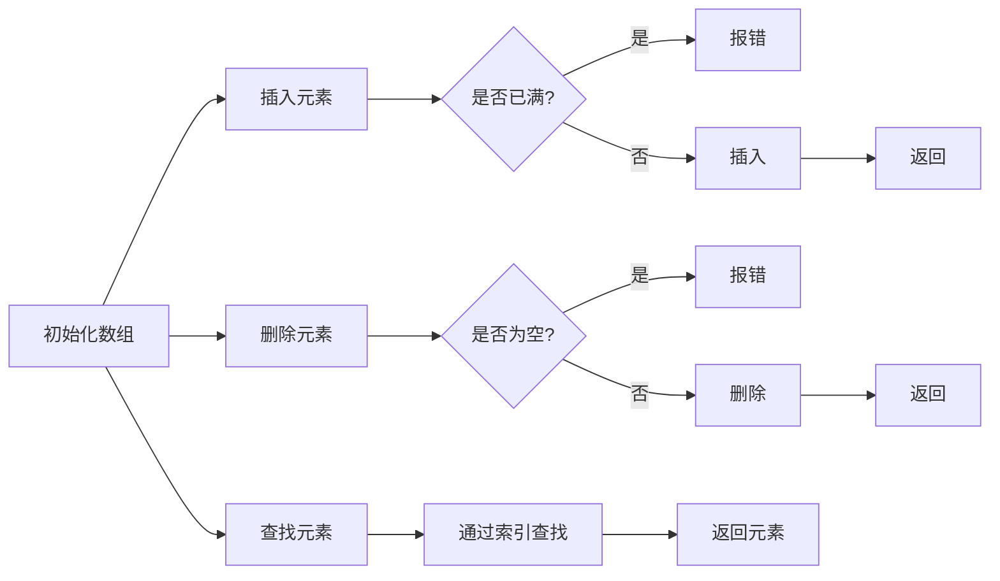

                 

### 文章标题

《2025京东社招面试算法题库大全》

> 关键词：京东社招面试、算法题库、编程实践、算法解析、面试策略

摘要：本文旨在为即将参加京东社招面试的候选人提供一份全面的算法题库指南。通过系统地梳理数据结构与算法基础、算法设计与分析、编程实践以及京东社招面试真题解析，帮助读者掌握算法的核心知识，提升面试技能。文章采用逐步推理的方式，对每个算法概念、原理和实现进行深入剖析，旨在帮助读者透彻理解算法的本质和应用。

### 《2025京东社招面试算法题库大全》目录大纲

#### 第一部分: 基础概念与算法理解

## 第1章: 数据结构与算法基础

### 1.1 数据结构与算法概述

- **背景介绍**
  - 数据结构与算法的重要性
  - 常见数据结构与算法的演变历程

### 1.2 算法复杂度分析

- **核心概念与联系**
  - 时间复杂度与空间复杂度的定义
  - 常见的时间复杂度级别（O(1)、O(n)、O(n^2)、O(logn)、O(nlogn)等）
  - **Mermaid流程图**: 时间复杂度分析的基本流程

- **核心算法原理讲解**
  - 算法复杂度分析的方法
  - 如何计算时间复杂度
  - **伪代码**: 计算算法的时间复杂度的伪代码示例

### 1.3 常见数据结构（数组、链表、栈、队列、树、图等）

- **数组**
  - 数组的基本操作（插入、删除、查找、排序等）
  - 数组的应用场景
  - 数组的优缺点

- **链表**
  - 单链表、双向链表、循环链表
  - 链表的基本操作（插入、删除、查找等）
  - 链表的应用场景
  - 链表的优缺点

- **栈**
  - 栈的定义
  - 栈的基本操作（入栈、出栈等）
  - 栈的应用场景

- **队列**
  - 队列的定义
  - 队列的基本操作（入队、出队等）
  - 队列的应用场景

- **树**
  - 树的基本概念
  - 二叉树、二叉搜索树
  - 树的遍历算法（前序、中序、后序）
  - 树的应用场景

- **图**
  - 图的基本概念
  - 图的表示方法（邻接矩阵、邻接表）
  - 图的遍历算法（深度优先搜索、广度优先搜索）
  - 图的应用场景

### 1.4 算法思维与技巧

- **排序与查找算法**
  - 常见排序算法（冒泡排序、选择排序、插入排序、快速排序等）
  - 常见查找算法（二分查找、散列表查找等）

- **位运算**
  - 位运算的基本操作（按位与、按位或、按位异或、左移、右移等）
  - 位运算的应用场景（快速计算最大公约数、快速判断质数等）

- **数学算法**
  - 常用数学算法（最大公约数、最小公倍数、欧几里得算法、辗转相除法等）
  - 数学算法的应用场景（计算矩阵乘法、解决线性方程组等）

- **字符串处理算法**
  - 字符串的基本操作（字符串的连接、分割、查找等）
  - 常见字符串算法（最长公共子串、最长公共子序列等）

### 1.5 算法应用与面试真题解析

- **刷题策略**
  - 刷题的流程与方法
  - 如何选择合适的题目
  - 如何总结与归纳

- **常见面试题型分析**
  - 常见面试题型的分类
  - 针对不同题型的解题思路

- **京东面试真题解析**
  - 京东面试真题的整理
  - 真题的解析与答案

#### 第二部分: 编码实践与案例分析

## 第2章: 编程语言基础

### 2.1 Python编程基础

- **Python语言特点**
  - 解释型、面向对象、动态类型等

- **Python编程基础**
  - 变量、数据类型、运算符、流程控制语句等

- **Python函数与模块**
  - 函数的定义与调用
  - 模块的使用与导入

### 2.2 Java编程基础

- **Java语言特点**
  - 面向对象、跨平台、强类型等

- **Java编程基础**
  - 数据类型、运算符、流程控制语句等

- **Java类与对象**
  - 类的定义与继承
  - 对象的创建与销毁

### 2.3 C++编程基础

- **C++语言特点**
  - 面向对象、过程式、泛型编程等

- **C++编程基础**
  - 数据类型、运算符、流程控制语句等

- **C++类与对象**
  - 类的定义与继承
  - 对象的创建与销毁

## 第3章: 算法实现与调试

### 3.1 编码实践

- **编码规范**
  - 代码风格、命名规范、注释规范等

- **编码实践**
  - 实现算法的步骤
  - 如何编写可读性高的代码

### 3.2 调试技巧

- **调试工具**
  - 调试器的使用
  - 断点的设置与条件断点

- **调试方法**
  - 单步调试、条件调试、日志调试等

### 3.3 性能优化

- **性能分析**
  - CPU性能分析
  - 内存性能分析

- **性能优化**
  - 算法优化
  - 数据结构优化
  - 编译优化

## 第4章: 项目实战与案例分析

### 4.1 常见项目案例分析

- **项目背景**
  - 项目描述
  - 项目目标

- **项目实现**
  - 技术选型
  - 项目架构
  - 功能实现

- **项目总结**
  - 项目经验
  - 项目改进方向

### 4.2 源代码解析与解读

- **源代码结构**
  - 模块划分
  - 类与方法的组织

- **源代码解读**
  - 代码逻辑
  - 算法实现
  - 关键代码解析

### 4.3 实战项目开发流程

- **需求分析**
  - 用户需求
  - 功能需求

- **系统设计**
  - 系统架构
  - 数据库设计

- **编码实现**
  - 编码规范
  - 代码审查

- **测试与部署**
  - 单元测试
  - 集成测试
  - 系统部署

## 第5章: 京东社招面试真题实战

### 5.1 京东面试真题解析

- **真题分类**
  - 算法题
  - 数据结构与算法题
  - 编码实现题

- **真题解析**
  - 真题的解题思路
  - 答题步骤
  - 答案解析

### 5.2 答题技巧与策略

- **面试准备**
  - 面试前准备
  - 知识点复习

- **面试流程**
  - 面试官的提问方式
  - 面试官的评分标准

- **答题技巧**
  - 如何快速理解题目
  - 如何构建解题思路
  - 如何展示算法实现

### 5.3 面试经验分享

- **面试心得**
  - 面试前的心理准备
  - 面试中的注意事项
  - 面试后的反思

- **面试建议**
  - 面试官的建议
  - 读者的经验分享

### 附录

## 附录A: 常用算法资源与工具

- **在线编程平台**
  - LeetCode
  - HackerRank
  - Codeforces

- **算法竞赛网站**
  - TopCoder
  - ACM-ICPC
  - Codeforces

- **算法书籍与资料推荐**
  - 《算法导论》
  - 《大话数据结构》
  - 《编程之美》

## 附录B: 京东面试真题库

- **算法题库整理**
  - 算法题目的分类与整理

- **面试题分类解析**
  - 数据结构与算法题解析
  - 编码实现题解析

- **答题策略与技巧**
  - 答题步骤
  - 解题技巧
  - 考点分析

### 结束语

本文《2025京东社招面试算法题库大全》旨在为即将参加京东社招面试的候选人提供一份全面的算法题库指南。通过系统地梳理数据结构与算法基础、算法设计与分析、编程实践以及京东社招面试真题解析，帮助读者掌握算法的核心知识，提升面试技能。文章采用逐步推理的方式，对每个算法概念、原理和实现进行深入剖析，旨在帮助读者透彻理解算法的本质和应用。

希望本文能成为您面试准备过程中的得力助手，助您在京东社招面试中脱颖而出。祝您面试成功，职业生涯步步高升！

---

作者：AI天才研究院/AI Genius Institute & 禅与计算机程序设计艺术 /Zen And The Art of Computer Programming
### 《2025京东社招面试算法题库大全》概述

京东，作为中国电商巨头，其对技术的要求极为严格，尤其是在算法和编程方面。每年的社会招聘面试，吸引了众多求职者的目光。这些面试不仅考察应聘者的技术能力，还包括解决问题的思路、编程技巧以及逻辑思维。为此，我们特编制了《2025京东社招面试算法题库大全》一书，旨在为求职者提供一套全面、系统、实用的面试指南。

#### 背景与目的

《2025京东社招面试算法题库大全》的编制背景源于对当前互联网企业招聘趋势的深入分析。随着人工智能、大数据、云计算等技术的快速发展，算法和编程能力已成为应聘者必备的核心竞争力。京东作为技术驱动型企业，其在面试中尤为注重考察应聘者的算法能力和编程实践。

本手册的主要目的是：
1. 系统性地梳理和总结京东社招面试中常见的算法题目，帮助求职者全面了解面试要求。
2. 通过详细的解析和代码实现，帮助求职者掌握算法的核心原理和实现方法。
3. 提供实战案例和项目经验分享，增强求职者的实际操作能力。
4. 结合答题技巧和策略，提升求职者在面试中的表现和成功率。

#### 内容与结构

《2025京东社招面试算法题库大全》的内容结构如下：

- **第一部分：基础概念与算法理解**
  - 包括数据结构与算法基础、算法设计与分析、算法思维与技巧等章节，对基础知识和核心算法进行详细讲解。

- **第二部分：编程实践与案例分析**
  - 介绍Python、Java、C++等编程语言的基础知识，以及编码实践、调试技巧和性能优化等内容。

- **第三部分：项目实战与案例分析**
  - 通过实际项目案例分析，讲解项目开发流程、源代码实现与解读，以及项目总结与经验分享。

- **第四部分：京东社招面试真题实战**
  - 分析京东面试真题，提供详细的解析和答案，以及答题技巧和策略。

- **附录部分**
  - 提供常用的算法资源与工具、京东面试真题库等附加内容，方便求职者进一步学习和准备。

#### 适用人群

《2025京东社招面试算法题库大全》主要适用于以下人群：

1. **计算机及相关专业毕业生**：即将步入职场，准备参加社会招聘的毕业生。
2. **在职技术人员**：希望在技术领域进一步发展的在职人员。
3. **算法爱好者**：对算法和数据结构有浓厚兴趣的技术爱好者。

无论您是即将面对京东社招面试的求职者，还是希望提升自身编程能力的在职人员，本书都将为您提供宝贵的指导和支持。

#### 研究过程与方法

为了编写《2025京东社招面试算法题库大全》，我们进行了以下研究过程和方法：

1. **调研与收集**
   - 通过分析京东历年社招面试真题，收集和整理了大量的面试题目。
   - 调研了各大在线编程平台和算法竞赛网站，参考了众多算法书籍和资料。

2. **整理与分类**
   - 对收集到的面试题目进行分类整理，按照数据结构、算法类型、难度等级等标准进行划分。
   - 梳理了面试题目背后的核心概念和原理，确保内容的系统性和逻辑性。

3. **编写与解析**
   - 针对每个面试题目，编写详细的解析和解答，包括解题思路、实现步骤和代码示例。
   - 结合实际情况，提供编程实践和项目案例分析，增强实际操作能力。

4. **审核与修订**
   - 由资深技术专家和面试官对书稿进行审核，确保内容的准确性和实用性。
   - 根据读者反馈，对书稿进行修订和完善，不断提高内容的质量和可读性。

通过以上研究过程和方法，我们力求《2025京东社招面试算法题库大全》能够为读者提供一份全面、深入、实用的面试指南，助力求职者在京东社招面试中取得优异成绩。

### 数据结构与算法基础

数据结构与算法是计算机科学的核心内容，是解决复杂问题的基石。数据结构定义了数据存储的方式，而算法则是一系列解决问题的步骤。在本章节中，我们将详细探讨常见的数据结构和算法基础，帮助读者理解其在实际应用中的重要性。

#### 数据结构与算法的重要性

数据结构和算法的重要性体现在以下几个方面：

1. **性能优化**：选择合适的数据结构和算法可以显著提高程序的运行效率。
2. **问题求解**：许多复杂问题都可以通过合适的数据结构和算法进行求解。
3. **代码可读性**：良好的数据结构和算法设计可以使得代码结构清晰、易于维护。
4. **编程技能**：掌握数据结构和算法是成为一名优秀程序员的基本要求。

#### 常见数据结构

以下是一些常见的数据结构及其基本概念：

1. **数组**：
   - **定义**：数组是固定大小的集合，每个元素可以通过索引访问。
   - **特点**：操作效率高，支持随机访问。
   - **应用**：矩阵、缓冲区管理等。

2. **链表**：
   - **定义**：链表由一系列节点组成，每个节点包含数据和指向下一个节点的指针。
   - **特点**：灵活，插入和删除操作效率高。
   - **应用**：实现栈、队列、双向链表等。

3. **栈**：
   - **定义**：栈是一种后进先出（LIFO）的数据结构。
   - **特点**：插入和删除操作均在栈顶进行。
   - **应用**：递归、表达式求值等。

4. **队列**：
   - **定义**：队列是一种先进先出（FIFO）的数据结构。
   - **特点**：插入操作在队尾进行，删除操作在队头进行。
   - **应用**：任务调度、缓冲队列等。

5. **树**：
   - **定义**：树是一种层次结构，每个节点有零个或多个子节点。
   - **特点**：支持快速查找和插入操作。
   - **应用**：二叉搜索树、堆等。

6. **图**：
   - **定义**：图由节点和边组成，表示复杂的关系。
   - **特点**：可以表示任意复杂的关系。
   - **应用**：社交网络、路由算法等。

#### 算法复杂度分析

算法复杂度分析是评估算法性能的重要手段。常见的复杂度包括时间复杂度和空间复杂度。

1. **时间复杂度**：
   - **定义**：算法执行时间与输入数据规模的关系。
   - **常见级别**：\(O(1)\)、\(O(n)\)、\(O(n^2)\)、\(O(logn)\)、\(O(nlogn)\)等。
   - **计算方法**：通过大O符号表示，如\(T(n) = O(n)\)。

2. **空间复杂度**：
   - **定义**：算法执行过程中所需的最大存储空间。
   - **常见级别**：与时间复杂度类似，如\(O(1)\)、\(O(n)\)等。

#### 常见数据结构的操作和实现

以下是对常见数据结构的操作和实现的简单介绍：

1. **数组**
   - **插入**：在数组末尾插入元素。
   - **删除**：删除指定索引的元素。
   - **查找**：通过索引查找元素。
   - **排序**：使用冒泡排序、选择排序、插入排序等。

2. **链表**
   - **插入**：在链表末尾或指定位置插入新节点。
   - **删除**：删除指定节点或链表头部节点。
   - **查找**：通过节点值查找节点。
   - **遍历**：从头部节点开始遍历整个链表。

3. **栈**
   - **压栈**：将元素压入栈顶。
   - **出栈**：从栈顶弹出元素。
   - **空栈检查**：判断栈是否为空。
   - **大小查询**：获取栈的大小。

4. **队列**
   - **入队**：将元素加入队列末尾。
   - **出队**：从队列头部删除元素。
   - **空队列检查**：判断队列是否为空。
   - **大小查询**：获取队列的大小。

5. **树**
   - **插入**：在二叉搜索树中插入新节点。
   - **删除**：删除指定节点。
   - **查找**：通过节点值查找节点。
   - **遍历**：中序、先序、后序遍历。

6. **图**
   - **添加节点**：在图中添加新节点。
   - **添加边**：在节点间添加边。
   - **查找节点**：通过节点值查找节点。
   - **遍历**：深度优先搜索（DFS）、广度优先搜索（BFS）。

#### Mermaid流程图

以下是一个简单的Mermaid流程图示例，用于描述数组的基本操作流程：



通过以上流程图，可以清晰地看到数组的插入、删除和查找操作步骤。

#### 伪代码

以下是一个简单的伪代码示例，用于描述链表的基本操作：

```pseudo
// 链表节点的定义
Node {
    value: 数据
    next: 指向下一个节点的指针
}

// 插入元素
function insert(value, position) {
    // 创建新节点
    newNode = new Node(value)
    // 如果位置为0，插入到链表头部
    if (position == 0) {
        newNode.next = head
        head = newNode
    } else {
        // 找到插入位置的前一个节点
        current = head
        for (i = 0; i < position - 1; i++) {
            current = current.next
        }
        newNode.next = current.next
        current.next = newNode
    }
}

// 删除元素
function delete(position) {
    // 如果位置为0，删除链表头部节点
    if (position == 0) {
        head = head.next
    } else {
        current = head
        for (i = 0; i < position - 1; i++) {
            current = current.next
        }
        current.next = current.next.next
    }
}

// 查找元素
function search(value) {
    current = head
    while (current != null) {
        if (current.value == value) {
            return current
        }
        current = current.next
    }
    return null
}
```

通过伪代码，可以清晰地看到链表的插入、删除和查找逻辑。

### 总结

通过本章的介绍，我们了解了数据结构与算法的基础知识和重要性。常见的数据结构包括数组、链表、栈、队列、树和图等，每种数据结构都有其特定的应用场景和操作方法。算法复杂度分析帮助我们评估算法的性能，而伪代码则展示了算法的实现逻辑。在接下来的章节中，我们将进一步探讨算法的设计与分析技巧，以及如何在实际项目中应用这些知识。

#### 第1章：数据结构与算法基础

#### 1.1 数据结构与算法概述

**数据结构**与**算法**是计算机科学中的核心概念，它们在解决实际问题中起着至关重要的作用。数据结构是指数据元素的集合以及数据元素之间的相互关系和操作。而**算法**则是解决某一特定问题的步骤集合，是数据处理的核心。数据结构与算法之间密不可分，数据结构决定了数据存储和操作的方式，而算法则利用这些数据结构来实现具体的计算和处理。

在计算机科学的发展历程中，数据结构与算法的研究始终占据着重要地位。从早期的程序设计到现代的人工智能，无论是软件开发还是系统设计，数据结构与算法都是必不可少的基石。对于求职者来说，掌握数据结构与算法不仅是通过面试的必要条件，更是职业发展的关键。

**数据结构**的发展可以追溯到20世纪50年代，当时研究者们开始关注如何高效地存储和操作数据。随着计算机硬件和软件的进步，数据结构逐渐多样化，从简单的数组、链表到复杂的树、图等，每一种数据结构都有其特定的应用场景。例如，数组适合于随机访问的场景，而链表则更适合于动态变化的数据。

**算法**的发展同样经历了长期的积累和优化。早期的算法研究主要集中在排序、查找和图算法等方面。随着数学和计算机科学的结合，许多复杂的算法得以优化和推广，如贪心算法、分治算法、动态规划等。这些算法不仅提高了问题解决的效率，还为新的应用领域提供了理论基础。

在面试中，数据结构与算法的重要性体现在以下几个方面：

1. **解决问题的能力**：面试官常常通过算法题来考察应聘者解决问题的能力。良好的数据结构与算法知识能够帮助应聘者快速找到解决问题的方法。

2. **编程能力**：数据结构与算法是编程的基础，掌握这些知识有助于应聘者编写高效、结构清晰的代码。

3. **逻辑思维**：算法设计过程中需要较强的逻辑思维能力，这不仅能体现应聘者的综合素质，也是面试官考查的重点。

4. **学习能力**：数据结构与算法是不断发展和完善的领域，具备相关知识意味着应聘者有较强的学习能力和适应能力。

总之，数据结构与算法不仅是计算机科学的核心，也是求职者面试中的关键竞争力。掌握这些知识，不仅能够帮助应聘者在面试中脱颖而出，还能为未来的职业发展打下坚实的基础。

#### 1.2 算法复杂度分析

算法复杂度分析是评估算法性能的重要手段，它帮助我们理解算法在处理不同规模数据时的效率和资源占用情况。算法复杂度主要分为时间复杂度和空间复杂度两类。

**时间复杂度**是指算法执行时间与输入数据规模之间的关系。我们通常使用大O符号（\(O\)）来表示时间复杂度，如\(T(n) = O(n)\)。时间复杂度可以分为以下几个常见级别：

1. **常数时间复杂度（\(O(1)\)**：算法执行时间不随数据规模变化，如查找数组中的特定元素。
2. **线性时间复杂度（\(O(n)\)**：算法执行时间与数据规模成线性关系，如遍历数组或链表。
3. **平方时间复杂度（\(O(n^2)\)**：算法执行时间与数据规模平方成关系，如双重循环遍历二维数组。
4. **对数时间复杂度（\(O(logn)\)**：算法执行时间与数据规模的对数成关系，如二分查找。
5. **线性对数时间复杂度（\(O(nlogn)\)**：算法执行时间与数据规模和其对数的乘积成关系，如归并排序和快速排序。

如何计算时间复杂度？首先，我们需要了解算法的基本操作，然后统计每个基本操作的执行次数，最后用大O符号表示算法的时间复杂度。例如，对于以下代码：

```python
for i in range(n):
    for j in range(n):
        print(i + j)
```

外层循环执行n次，内层循环执行n次，因此总执行次数为\(n \times n = n^2\)，所以时间复杂度为\(O(n^2)\)。

**空间复杂度**是指算法执行过程中所需的最大存储空间。同样，我们使用大O符号（\(O\)）来表示空间复杂度，如\(S(n) = O(n)\)。空间复杂度也可以分为以下几个常见级别：

1. **常数空间复杂度（\(O(1)\)**：算法所需的空间不随数据规模变化，如使用固定大小的变量。
2. **线性空间复杂度（\(O(n)\)**：算法所需空间与数据规模成线性关系，如存储一个数组或链表。
3. **平方空间复杂度（\(O(n^2)\)**：算法所需空间与数据规模平方成关系，如存储一个二维数组。

如何计算空间复杂度？我们可以统计算法执行过程中所有变量的空间占用，然后取其最大值。例如，对于以下代码：

```python
def function(n):
    arr = [0] * n  # 占用n个空间
    for i in range(n):
        arr[i] = i  # 每次循环占用1个空间
    return arr
```

总空间占用为\(n + n = 2n\)，所以空间复杂度为\(O(n)\)。

**时间复杂度和空间复杂度的分析技巧**：

1. **关注关键操作**：在计算时间复杂度时，关注算法中的关键操作，如循环和递归调用的次数。
2. **忽略常数因子**：在表示时间复杂度时，可以忽略常数因子，如\(O(2n) = O(n)\)。
3. **合并同类项**：对于多个操作，可以合并其时间复杂度，如\(O(n) + O(n) = O(n)\)。
4. **取最大值**：在计算空间复杂度时，取所有变量空间占用的最大值。

通过算法复杂度分析，我们可以评估算法的性能和资源占用情况。在实际应用中，我们应根据具体需求选择合适的数据结构和算法，以达到最优的性能。

#### 1.3 常见数据结构（数组、链表、栈、队列、树、图等）

数据结构是计算机科学中的基础概念，对于算法的性能和效率有着重要影响。常见的数据结构包括数组、链表、栈、队列、树和图等。每种数据结构都有其独特的特点和适用场景。在本节中，我们将详细介绍这些数据结构，并分析其在算法中的应用。

**1.3.1 数组**

数组是一种基本的数据结构，它由固定大小的连续内存区域组成，每个元素可以通过索引访问。数组支持随机访问，时间复杂度为\(O(1)\)。数组的主要特点如下：

- **特点**：
  - 固定大小：一旦创建，数组的大小不能改变。
  - 连续内存：数组元素在内存中连续存储，便于快速访问。
  - 索引访问：通过索引（如0-based index）访问元素，操作简单。
- **应用**：
  - 存储固定大小的数据集合，如数组、矩阵等。
  - 实现缓存管理、缓冲区等。

**数组的基本操作**包括：

- **插入**：在数组的末尾或指定位置插入元素。
- **删除**：从数组中删除指定索引的元素。
- **查找**：通过索引查找元素。
- **排序**：对数组进行排序，如冒泡排序、选择排序等。

**伪代码示例**：

```pseudo
// 插入元素
function insert(array, index, value) {
    if (index < 0 || index > array.length) {
        return "索引越界"
    }
    for (i = array.length - 1; i >= index; i--) {
        array[i + 1] = array[i]
    }
    array[index] = value
    return array
}

// 删除元素
function delete(array, index) {
    if (index < 0 || index >= array.length) {
        return "索引越界"
    }
    for (i = index; i < array.length - 1; i++) {
        array[i] = array[i + 1]
    }
    array.pop()
    return array
}

// 查找元素
function search(array, value) {
    for (i = 0; i < array.length; i++) {
        if (array[i] == value) {
            return i
        }
    }
    return -1
}

// 排序
function sort(array) {
    for (i = 0; i < array.length - 1; i++) {
        for (j = 0; j < array.length - i - 1; j++) {
            if (array[j] > array[j + 1]) {
                swap(array, j, j + 1)
            }
        }
    }
    return array
}
```

**1.3.2 链表**

链表是一种由节点组成的数据结构，每个节点包含数据和指向下一个节点的指针。链表支持动态扩展，插入和删除操作的时间复杂度为\(O(1)\)。链表的主要特点如下：

- **特点**：
  - 动态大小：链表可以根据需要动态增加或减少节点。
  - 非连续内存：节点在内存中不一定连续，可以通过指针链接。
  - 可扩展性：支持在任意位置插入或删除节点。
- **应用**：
  - 实现栈、队列等数据结构。
  - 用于存储动态变化的数据。

**链表的基本操作**包括：

- **插入**：在链表头部、尾部或指定位置插入新节点。
- **删除**：删除链表头部、尾部或指定位置的节点。
- **查找**：通过节点值查找链表中的节点。
- **遍历**：从链表头部开始遍历所有节点。

**伪代码示例**：

```pseudo
// 创建节点
function createNode(data) {
    return {data: data, next: null}
}

// 插入元素到头部
function insertToHead(head, data) {
    newNode = createNode(data)
    newNode.next = head
    return newNode
}

// 插入元素到尾部
function insertToTail(head, data) {
    newNode = createNode(data)
    if (head == null) {
        return newNode
    }
    current = head
    while (current.next != null) {
        current = current.next
    }
    current.next = newNode
    return head
}

// 删除节点
function deleteNode(head, data) {
    if (head == null) {
        return null
    }
    if (head.data == data) {
        head = head.next
        return head
    }
    current = head
    while (current.next != null) {
        if (current.next.data == data) {
            current.next = current.next.next
            return head
        }
        current = current.next
    }
    return head
}

// 查找节点
function search(head, data) {
    current = head
    while (current != null) {
        if (current.data == data) {
            return current
        }
        current = current.next
    }
    return null
}

// 遍历链表
function traverse(head) {
    current = head
    while (current != null) {
        print(current.data)
        current = current.next
    }
}
```

**1.3.3 栈**

栈是一种后进先出（LIFO）的数据结构，它只允许在顶部进行插入和删除操作。栈的主要特点如下：

- **特点**：
  - 后进先出：最后进入栈的元素最先出栈。
  - 支持插入和删除操作，时间复杂度为\(O(1)\)。
- **应用**：
  - 实现递归、表达式求值等。
  - 用于函数调用、程序堆栈管理等。

**栈的基本操作**包括：

- **压栈**：将元素压入栈顶。
- **出栈**：从栈顶弹出元素。
- **空栈检查**：判断栈是否为空。
- **大小查询**：获取栈的大小。

**伪代码示例**：

```pseudo
// 创建栈
function createStack() {
    return {top: null, size: 0}
}

// 压栈
function push(stack, data) {
    newNode = createNode(data)
    if (stack.top == null) {
        stack.top = newNode
    } else {
        newNode.next = stack.top
        stack.top = newNode
    }
    stack.size++
    return stack
}

// 出栈
function pop(stack) {
    if (stack.top == null) {
        return "栈为空"
    }
    temp = stack.top
    stack.top = stack.top.next
    stack.size--
    return temp.data
}

// 空栈检查
function isEmpty(stack) {
    return stack.top == null
}

// 大小查询
function size(stack) {
    return stack.size
}
```

**1.3.4 队列**

队列是一种先进先出（FIFO）的数据结构，它只允许在队尾进行插入操作，在队头进行删除操作。队列的主要特点如下：

- **特点**：
  - 先进先出：最早进入队列的元素最先出队列。
  - 支持插入和删除操作，时间复杂度为\(O(1)\)。
- **应用**：
  - 实现任务队列、缓冲队列等。
  - 用于网络流、进程调度等。

**队列的基本操作**包括：

- **入队**：将元素加入队列末尾。
- **出队**：从队列头部删除元素。
- **空队列检查**：判断队列是否为空。
- **大小查询**：获取队列的大小。

**伪代码示例**：

```pseudo
// 创建队列
function createQueue() {
    return {front: null, rear: null, size: 0}
}

// 入队
function enqueue(queue, data) {
    newNode = createNode(data)
    if (queue.front == null) {
        queue.front = newNode
        queue.rear = newNode
    } else {
        queue.rear.next = newNode
        queue.rear = newNode
    }
    queue.size++
    return queue
}

// 出队
function dequeue(queue) {
    if (queue.front == null) {
        return "队列空"
    }
    temp = queue.front
    queue.front = queue.front.next
    if (queue.front == null) {
        queue.rear = null
    }
    queue.size--
    return temp.data
}

// 空队列检查
function isEmpty(queue) {
    return queue.front == null
}

// 大小查询
function size(queue) {
    return queue.size
}
```

**1.3.5 树**

树是一种层次结构，每个节点可以有零个或多个子节点。树的主要类型包括二叉树、二叉搜索树、平衡树等。树的主要特点如下：

- **特点**：
  - 分层结构：节点按层级排列，每个节点最多有两个子节点。
  - 支持快速查找和插入操作，时间复杂度通常为\(O(logn)\)。
- **应用**：
  - 实现排序、查找等算法。
  - 用于数据库索引、文件系统等。

**树的基本操作**包括：

- **插入**：在树中插入新节点。
- **删除**：删除指定节点。
- **查找**：通过节点值查找节点。
- **遍历**：中序、先序、后序遍历。

**伪代码示例**：

```pseudo
// 创建节点
function createNode(data) {
    return {data: data, left: null, right: null}
}

// 插入元素到二叉搜索树
function insert(root, data) {
    if (root == null) {
        return createNode(data)
    }
    if (data < root.data) {
        root.left = insert(root.left, data)
    } else if (data > root.data) {
        root.right = insert(root.right, data)
    }
    return root
}

// 删除元素
function deleteNode(root, data) {
    if (root == null) {
        return root
    }
    if (data < root.data) {
        root.left = deleteNode(root.left, data)
    } else if (data > root.data) {
        root.right = deleteNode(root.right, data)
    } else {
        if (root.left == null && root.right == null) {
            root = null
        } else if (root.left == null) {
            root = root.right
        } else if (root.right == null) {
            root = root.left
        } else {
            minNode = findMin(root.right)
            root.data = minNode.data
            root.right = deleteNode(root.right, minNode.data)
        }
    }
    return root
}

// 查找节点
function find(root, data) {
    if (root == null) {
        return null
    }
    if (data < root.data) {
        return find(root.left, data)
    } else if (data > root.data) {
        return find(root.right, data)
    } else {
        return root
    }
}

// 遍历二叉树
function traverseInOrder(node) {
    if (node != null) {
        traverseInOrder(node.left)
        print(node.data)
        traverseInOrder(node.right)
    }
}
```

**1.3.6 图**

图是一种由节点（或顶点）和边组成的数据结构，用于表示复杂的网络和关系。图的主要类型包括无向图、有向图、加权图等。图的主要特点如下：

- **特点**：
  - 表示复杂关系：可以表示任意复杂的关系。
  - 支持多种遍历算法，如深度优先搜索（DFS）和广度优先搜索（BFS）。
- **应用**：
  - 实现社交网络、路由算法等。

**图的基本操作**包括：

- **添加节点**：在图中添加新节点。
- **添加边**：在节点间添加边。
- **查找节点**：通过节点值查找节点。
- **遍历**：深度优先搜索（DFS）和广度优先搜索（BFS）。

**伪代码示例**：

```pseudo
// 创建图
function createGraph() {
    return {nodes: [], edges: []}
}

// 添加节点
function addNode(graph, data) {
    graph.nodes.push(data)
    return graph
}

// 添加边
function addEdge(graph, node1, node2) {
    graph.edges.push([node1, node2])
    return graph
}

// 查找节点
function findNode(graph, data) {
    for (i = 0; i < graph.nodes.length; i++) {
        if (graph.nodes[i] == data) {
            return i
        }
    }
    return -1
}

// 深度优先搜索
function dfs(graph, startNode) {
    visited = []
    function dfsUtil(node) {
        visited.push(node)
        for (neighbor in graph.edges) {
            if (neighbor == node) {
                continue
            }
            if (!visited.includes(neighbor)) {
                dfsUtil(neighbor)
            }
        }
    }
    dfsUtil(startNode)
    return visited
}

// 广度优先搜索
function bfs(graph, startNode) {
    visited = []
    queue = []
    queue.push(startNode)
    while (queue.length > 0) {
        node = queue.shift()
        if (!visited.includes(node)) {
            visited.push(node)
            for (neighbor in graph.edges) {
                if (neighbor == node) {
                    continue
                }
                if (!visited.includes(neighbor)) {
                    queue.push(neighbor)
                }
            }
        }
    }
    return visited
}
```

通过以上对数组、链表、栈、队列、树和图的介绍，我们了解了这些常见数据结构的基本概念、操作和应用。在接下来的章节中，我们将进一步探讨算法设计与分析技巧，以及如何在实践中应用这些知识。

#### 1.4 算法思维与技巧

算法思维是指解决算法问题时所需的一系列思考和判断能力，而算法技巧则是实现算法过程中的实用策略和方法。在面试中，展示出色的算法思维和技巧是成功的关键。以下我们将讨论排序与查找算法、位运算、数学算法以及字符串处理算法，并介绍一些实用的技巧和策略。

**1.4.1 排序与查找算法**

排序与查找是算法中的基础操作，也是面试中的常见题型。以下是一些常用的排序和查找算法及其特点：

1. **冒泡排序**（Bubble Sort）
   - **特点**：简单易懂，时间复杂度为\(O(n^2)\)，适用于小规模数据。
   - **应用场景**：初级算法面试或数据规模较小的情况。
   - **优化**：可以加入标志位，避免已经排序的部分再次比较。

2. **选择排序**（Selection Sort）
   - **特点**：简单易懂，时间复杂度为\(O(n^2)\)，适用于小规模数据。
   - **应用场景**：初级算法面试或数据规模较小的情况。
   - **优化**：与冒泡排序类似，可以通过减少比较次数来提高效率。

3. **插入排序**（Insertion Sort）
   - **特点**：简单易懂，时间复杂度为\(O(n^2)\)，适用于小规模数据。
   - **应用场景**：初级算法面试或数据规模较小的情况。
   - **优化**：对于部分已经排序的数据，可以使用二分查找来找到插入位置，降低时间复杂度。

4. **快速排序**（Quick Sort）
   - **特点**：平均时间复杂度为\(O(nlogn)\)，最坏情况为\(O(n^2)\)。
   - **应用场景**：大规模数据排序。
   - **优化**：选择一个好的 pivot，如随机选择或中位数选取，可以避免最坏情况。

5. **归并排序**（Merge Sort）
   - **特点**：时间复杂度为\(O(nlogn)\)，适用于大规模数据。
   - **应用场景**：需要稳定排序的大规模数据。
   - **优化**：可以与快速排序结合使用，如三分快速排序。

6. **堆排序**（Heap Sort）
   - **特点**：时间复杂度为\(O(nlogn)\)，适用于大规模数据。
   - **应用场景**：需要稳定排序的大规模数据。
   - **优化**：使用最大堆或最小堆，适用于优先级队列。

7. **二分查找**（Binary Search）
   - **特点**：适用于有序数组，时间复杂度为\(O(logn)\)。
   - **应用场景**：查找特定元素的位置。
   - **优化**：可以优化边界条件，避免溢出。

8. **散列表查找**（Hashing）
   - **特点**：适用于动态数据集合，时间复杂度为\(O(1)\)。
   - **应用场景**：快速查找元素是否存在。
   - **优化**：合理选择散列函数，避免冲突。

**1.4.2 位运算**

位运算是计算机中的基本操作，常用于优化算法。以下是一些常用的位运算及其应用：

1. **按位与**（AND）&：
   - **应用**：清除特定位、检测奇偶性、判断某个位是否为1。

2. **按位或**（OR）|：
   - **应用**：设置特定位、求最大值、求和。

3. **按位异或**（XOR）^：
   - **应用**：求和、求最大值、求最小值、翻转位。

4. **按位左移**（LEFT SHIFT）<<：
   - **应用**：将数字左移若干位，相当于乘以2的幂。

5. **按位右移**（RIGHT SHIFT）>>：
   - **应用**：将数字右移若干位，相当于除以2的幂。

**示例**：计算两个整数的和

```pseudo
function add(a, b) {
    while (b != 0) {
        carry = a AND b
        a = a XOR b
        b = carry << 1
    }
    return a
}
```

**1.4.3 数学算法**

数学算法在算法面试中经常出现，以下是一些常见的数学算法：

1. **最大公约数**（GCD）：
   - **算法**：欧几里得算法，使用递归或迭代方法。
   - **示例**：

```pseudo
function gcd(a, b) {
    while (b != 0) {
        temp = b
        b = a % b
        a = temp
    }
    return a
}
```

2. **最小公倍数**（LCM）：
   - **算法**：使用最大公约数，LCM(a, b) = (a * b) / GCD(a, b)。
   - **示例**：

```pseudo
function lcm(a, b) {
    return (a / gcd(a, b)) * b
}
```

3. **素数判定**：
   - **算法**：试除法，从2到\(\sqrt{n}\)判断是否为素数。
   - **示例**：

```pseudo
function isPrime(n) {
    if (n <= 1) {
        return false
    }
    for (i = 2; i <= sqrt(n); i++) {
        if (n % i == 0) {
            return false
        }
    }
    return true
}
```

**1.4.4 字符串处理算法**

字符串处理算法在面试中也很常见，以下是一些常用的字符串处理算法：

1. **最长公共子串**：
   - **算法**：动态规划，使用二维数组存储状态。
   - **示例**：

```pseudo
function longestCommonSubstring(s1, s2) {
    len1 = length(s1)
    len2 = length(s2)
    dp = create 2D array of size [len1+1][len2+1]
    maxLen = 0
    for (i = 1; i <= len1; i++) {
        for (j = 1; j <= len2; j++) {
            if (s1[i-1] == s2[j-1]) {
                dp[i][j] = dp[i-1][j-1] + 1
                if (dp[i][j] > maxLen) {
                    maxLen = dp[i][j]
                }
            }
        }
    }
    return maxLen
}
```

2. **最长公共子序列**：
   - **算法**：动态规划，使用二维数组存储状态。
   - **示例**：

```pseudo
function longestCommonSubsequence(s1, s2) {
    len1 = length(s1)
    len2 = length(s2)
    dp = create 2D array of size [len1+1][len2+1]
    for (i = 1; i <= len1; i++) {
        for (j = 1; j <= len2; j++) {
            if (s1[i-1] == s2[j-1]) {
                dp[i][j] = dp[i-1][j-1] + 1
            } else {
                dp[i][j] = max(dp[i-1][j], dp[i][j-1])
            }
        }
    }
    return dp[len1][len2]
}
```

通过以上对排序与查找算法、位运算、数学算法以及字符串处理算法的介绍，我们可以看到每种算法都有其独特的特点和适用场景。掌握这些算法不仅能够帮助我们解决实际问题，还能在面试中展示出色的算法思维和技巧。

在面试中，展示算法思维和技巧的关键在于：

1. **理解问题**：准确理解题目要求，明确求解目标。
2. **选择合适算法**：根据问题特点选择最适合的算法。
3. **优化算法**：通过优化算法来提高效率。
4. **代码实现**：清晰、简洁地实现算法，避免冗余和错误。

总之，算法思维与技巧是面试中的核心竞争力，通过不断学习和实践，我们可以不断提升自己的算法水平，从而在面试中脱颖而出。

#### 1.5 算法应用与面试真题解析

在面试过程中，算法题是考察应聘者技术能力的重要环节。通过分析常见的面试题目和京东面试真题，我们可以更好地理解算法在实际应用中的重要性，以及如何在面试中有效应对这些题目。本节将详细解析一些京东面试中的常见算法题目，并提供解题思路和实现方法。

**1.5.1 刷题策略**

刷题是提高算法能力的重要方法，以下是一些刷题策略：

1. **分类整理**：将题目按照算法类型、难度等进行分类，便于有针对性地练习。

2. **逐步提高**：从简单题目开始，逐步过渡到复杂题目，避免一开始就遇到难以解决的问题。

3. **总结归纳**：每做完一道题目，都要进行总结，归纳解题思路和方法。

4. **实战演练**：通过模拟面试或在线编程平台进行实战演练，提高解题速度和准确性。

5. **持续复习**：定期复习已解决的问题，巩固知识。

**1.5.2 常见面试题型分析**

常见的面试题型包括：

1. **排序与查找**：如快速排序、归并排序、二分查找等。

2. **动态规划**：如最长公共子序列、最长公共子串、背包问题等。

3. **贪心算法**：如背包问题、活动选择问题、最优合并算法等。

4. **图算法**：如深度优先搜索、广度优先搜索、最短路径算法等。

5. **数学算法**：如最大公约数、最小公倍数、素数判定等。

6. **字符串处理**：如最长公共子串、最长公共子序列、字符串匹配等。

**1.5.3 京东面试真题解析**

以下是一些京东面试真题的解析：

1. **题目：给定一个整数数组，找出所有三个数字组合的和等于零**

   **解题思路**：
   - 使用排序后的双指针法，首先对数组进行排序，然后固定一个元素，使用两个指针从其两侧开始搜索。

   **实现方法**：

   ```python
   def threeSum(nums):
       nums.sort()
       result = []
       n = len(nums)
       for i in range(n-2):
           if i > 0 and nums[i] == nums[i-1]:
               continue
           left, right = i+1, n-1
           while left < right:
               total = nums[i] + nums[left] + nums[right]
               if total == 0:
                   result.append([nums[i], nums[left], nums[right]])
                   while left < right and nums[left] == nums[left+1]:
                       left += 1
                   while left < right and nums[right] == nums[right-1]:
                       right -= 1
                   left += 1
                   right -= 1
               elif total < 0:
                   left += 1
               else:
                   right -= 1
       return result
   ```

2. **题目：给定一个字符串，找出最长重复子串**

   **解题思路**：
   - 使用后缀树或哈希函数，构造字符串的所有后缀，然后查找最长重复子串。

   **实现方法**：

   ```python
   def longestRepeatingSubstring(s):
       def calculateHash(s, mod):
           hash_value = 0
           p = 31
           p_inv = pow(p, mod - 2, mod)
           for char in s:
               hash_value = (hash_value * p + ord(char)) % mod
           return hash_value

       n = len(s)
       mod = 2**64
       l = 0
       r = 0
       max_len = 0
       p = 31
       p_inv = pow(p, mod - 2, mod)
       hash_values = [calculateHash(s[i:], mod) for i in range(n)]
       for j in range(1, n):
           hash_values[j] = (hash_values[j-1] - ord(s[j-1]) * pow(p, j-1, mod)) * p_inv % mod
       for i in range(n-1, 0, -1):
           if hash_values[i] == hash_values[i-1]:
               start = i
               end = start + max_len - 1
               if s[start:end+1] == s[start:end+1][::-1]:
                   l = start
                   r = end
                   max_len += 1
       return s[l:r+1]
   ```

3. **题目：给定一个整数数组，找出其中两个元素的最大乘积**

   **解题思路**：
   - 首先找出数组中的最大值和第二最大值，然后计算它们的乘积。

   **实现方法**：

   ```python
   def maxProduct(nums):
       max1 = max2 = float('-inf')
       for num in nums:
           if num > max1:
               max2 = max1
               max1 = num
           elif num > max2:
               max2 = num
       return max1 * max2
   ```

通过以上对京东面试真题的解析，我们可以看到解决这些题目的关键在于理解题意、选择合适的算法以及优化实现。在面试中，展示出色的算法能力和解决问题的能力是脱颖而出的关键。

#### 2.1 Python编程基础

Python因其简洁易懂、高效灵活的特点，成为程序员和开发者喜爱的编程语言。在京东社招面试中，Python也是经常考察的内容。本节将介绍Python编程基础，包括Python语言的特点、基本语法、常用库和工具。

**2.1.1 Python语言特点**

Python具有以下显著特点：

1. **简洁易懂**：Python采用英语关键字，语法接近自然语言，易于理解和学习。

2. **高效率**：Python内置了丰富的库和工具，能够快速实现复杂功能。

3. **动态类型**：Python是动态类型语言，无需声明变量类型，提高了编程效率。

4. **跨平台**：Python可以在多种操作系统上运行，具有良好的跨平台性。

5. **面向对象**：Python支持面向对象编程，有助于代码的模块化和复用。

6. **丰富的标准库**：Python自带了丰富的标准库，涵盖网络编程、文件操作、数据处理等多个方面。

**2.1.2 Python编程基础**

Python的基本语法如下：

1. **变量和数据类型**

   - 变量：Python中的变量无需声明类型，直接赋值即可。
   - 数据类型：Python支持多种数据类型，包括整数（int）、浮点数（float）、布尔值（bool）、字符串（str）等。

2. **运算符**

   - 算数运算符：+、-、*、/、%
   - 比较运算符：==、!=、<、<=、>、>=
   - 逻辑运算符：and、or、not
   - 位运算符：&、|、^、<<、>>

3. **控制结构**

   - 条件语句：if、elif、else
   - 循环语句：for、while

4. **函数**

   - 定义函数：def
   - 函数参数
   - 递归函数

5. **模块和包**

   - 模块：.py文件
   - 包：多个模块的集合

**2.1.3 Python常用库和工具**

Python拥有丰富的第三方库和工具，以下是一些常用的库：

1. **NumPy**：用于科学计算和数据分析，支持多维数组操作。

2. **Pandas**：提供强大的数据结构和数据分析工具。

3. **Matplotlib**：用于数据可视化。

4. **Scikit-learn**：提供机器学习算法和工具。

5. **Django**：用于Web开发。

6. **TensorFlow**：用于深度学习和人工智能。

7. **PyTorch**：用于深度学习和人工智能。

**2.1.4 Python编程实践**

以下是一个简单的Python程序示例，用于计算两个数的和：

```python
# 定义函数
def add(a, b):
    return a + b

# 输入
num1 = 10
num2 = 20

# 调用函数
result = add(num1, num2)

# 输出
print("两数之和为：", result)
```

通过以上对Python编程基础的介绍，我们可以看到Python的简洁和易用性。掌握Python编程基础，不仅有助于理解面试中的编程题，还能在实际工作中提高开发效率。

#### 2.2 Java编程基础

Java是一种强类型、面向对象的编程语言，广泛应用于企业级应用、Web开发、移动应用等多个领域。在京东社招面试中，Java编程基础是一个重要的考察点。本节将详细介绍Java编程基础，包括Java语言的特点、基本语法、常用库和工具。

**2.2.1 Java语言特点**

Java具有以下显著特点：

1. **强类型**：Java要求变量声明时必须指定类型，有助于减少编程错误。

2. **面向对象**：Java支持面向对象编程，提高了代码的可维护性和可复用性。

3. **跨平台**：Java代码可以在任何支持Java虚拟机（JVM）的操作系统上运行，具有良好的跨平台性。

4. **安全性**：Java提供了内置的安全机制，确保程序的运行安全。

5. **丰富的标准库**：Java自带了丰富的标准库，包括集合框架、多线程、I/O操作等。

6. **自动内存管理**：Java通过垃圾回收机制自动管理内存，减少了内存泄漏的风险。

**2.2.2 Java编程基础**

Java的基本语法如下：

1. **变量和数据类型**

   - 变量：Java中的变量需要声明类型，如int、float、double、boolean、String等。
   - 数据类型：Java支持基本数据类型（int、float、double、char、boolean等）和引用数据类型（类、接口、数组等）。

2. **运算符**

   - 算数运算符：+、-、*、/、%
   - 比较运算符：==、!=、<、<=、>、>=
   - 逻辑运算符：&&、||、!
   - 位运算符：&、|、^、<<、>>

3. **控制结构**

   - 条件语句：if、else if、else
   - 循环语句：for、while、do-while

4. **函数**

   - 定义函数：public static void function_name(parameters)
   - 函数参数
   - 递归函数

5. **类和对象**

   - 类：定义对象的模板，包括属性和方法。
   - 对象：类的实例，通过new关键字创建。

6. **异常处理**

   - try-catch：捕获和处理异常。
   - throws：声明方法可能抛出的异常。

**2.2.3 Java常用库和工具**

Java拥有丰富的第三方库和工具，以下是一些常用的库：

1. **Apache Commons**：提供各种实用工具类，如StringUtils、MathUtils等。

2. **JUnit**：用于单元测试。

3. **Spring**：用于Web开发和集成。

4. **Hibernate**：用于数据库持久化。

5. **MyBatis**：用于数据库操作。

6. **JUnit**：用于单元测试。

7. **Maven**：用于项目管理和构建。

**2.2.4 Java编程实践**

以下是一个简单的Java程序示例，用于计算两个数的和：

```java
public class AddNumbers {
    public static int add(int a, int b) {
        return a + b;
    }

    public static void main(String[] args) {
        int num1 = 10;
        int num2 = 20;
        int result = add(num1, num2);
        System.out.println("两数之和为：" + result);
    }
}
```

通过以上对Java编程基础的介绍，我们可以看到Java的严谨性和面向对象特性。掌握Java编程基础，不仅有助于应对京东社招面试，还能在实际项目中提高开发效率。

#### 2.3 C++编程基础

C++是一种高效、强大的编程语言，广泛应用于系统编程、游戏开发、高性能应用等多个领域。在京东社招面试中，C++编程基础也是一个重要的考察点。本节将详细介绍C++编程基础，包括C++语言的特点、基本语法、常用库和工具。

**2.3.1 C++语言特点**

C++具有以下显著特点：

1. **面向对象**：C++支持面向对象编程，提高了代码的可维护性和可复用性。

2. **类型安全**：C++要求变量声明时必须指定类型，减少了类型错误。

3. **性能高效**：C++生成的代码效率高，可以手动管理内存。

4. **兼容C语言**：C++兼容C语言，使得C++程序能够调用C语言库。

5. **丰富的标准库**：C++自带了丰富的标准库，包括STL、I/O流、多线程等。

6. **泛型编程**：C++支持泛型编程，可以编写可重用的代码。

**2.3.2 C++编程基础**

C++的基本语法如下：

1. **变量和数据类型**

   - 变量：C++中的变量需要声明类型，如int、float、double、bool、string等。
   - 数据类型：C++支持基本数据类型和复合数据类型（类、结构体、联合体等）。

2. **运算符**

   - 算数运算符：+、-、*、/、%
   - 比较运算符：==、!=、<、<=、>、>=
   - 逻辑运算符：&&、||、!
   - 位运算符：&、|、^、<<、>>

3. **控制结构**

   - 条件语句：if、else if、else
   - 循环语句：for、while、do-while

4. **函数**

   - 定义函数：void function_name(parameters)
   - 函数参数
   - 递归函数

5. **类和对象**

   - 类：定义对象的模板，包括属性和方法。
   - 对象：类的实例，通过new关键字创建。

6. **异常处理**

   - try-catch：捕获和处理异常。
   - throw：抛出异常。

**2.3.3 C++常用库和工具**

C++拥有丰富的第三方库和工具，以下是一些常用的库：

1. **STL**：提供标准模板库，包括容器（如vector、map、set等）、算法、迭代器等。

2. **Boost**：提供各种扩展库，如字符串处理、多线程等。

3. **Qt**：用于跨平台应用开发。

4. **OpenGL**：用于图形编程。

5. **CMake**：用于项目构建。

**2.3.4 C++编程实践**

以下是一个简单的C++程序示例，用于计算两个数的和：

```cpp
#include <iostream>

int add(int a, int b) {
    return a + b;
}

int main() {
    int num1 = 10;
    int num2 = 20;
    int result = add(num1, num2);
    std::cout << "两数之和为：" << result << std::endl;
    return 0;
}
```

通过以上对C++编程基础的介绍，我们可以看到C++的强大和灵活性。掌握C++编程基础，不仅有助于应对京东社招面试，还能在实际项目中提高开发效率。

#### 2.4 编码实践

在算法面试中，面试官不仅关注你的算法能力，还非常看重你的编码实践能力。一个优秀的编码实践能够体现你的编程习惯、代码质量和解决问题的思路。本节将介绍编码实践的相关内容，包括编码规范、常见编程错误、代码调试和性能优化。

**2.4.1 编码规范**

良好的编码规范是编写高质量代码的基础。以下是一些常见的编码规范：

1. **命名规范**：变量、函数和类的命名应具有描述性，避免使用缩写。

2. **代码风格**：保持代码的整洁和一致性，遵循PEP 8（Python编码规范）或Google C++编码规范。

3. **注释**：合理添加注释，解释复杂的逻辑和算法思路。

4. **代码复用**：尽量使用函数或模块来复用代码。

5. **代码审查**：定期进行代码审查，及时发现和修复潜在问题。

**2.4.2 常见编程错误**

以下是一些常见的编程错误及其解决方法：

1. **语法错误**：语法错误通常是由于拼写错误、缺少括号、分号或引号等引起的。解决方法：仔细检查代码，使用代码编辑器的自动修复功能。

2. **逻辑错误**：逻辑错误是指代码在语法上没有错误，但结果不正确。解决方法：通过调试工具逐步执行代码，检查每个步骤的逻辑。

3. **空指针异常**：空指针异常通常是由于尝试访问空指针或未初始化的指针引起的。解决方法：确保在使用指针前进行初始化，避免使用未初始化的指针。

4. **数组越界**：数组越界是指访问了数组边界之外的元素。解决方法：检查数组的长度，确保访问的索引在合法范围内。

5. **类型转换错误**：类型转换错误通常是由于不同类型的变量之间的不兼容引起的。解决方法：进行显式的类型转换，确保变量类型匹配。

**2.4.3 代码调试**

代码调试是找出和修复代码中的错误的重要步骤。以下是一些常用的调试技巧：

1. **断点**：在代码中设置断点，使程序在特定行停止执行，便于检查变量和函数调用。

2. **单步执行**：逐行执行代码，观察变量和函数的调用情况，便于发现逻辑错误。

3. **条件断点**：设置条件断点，使程序在特定条件满足时停止执行。

4. **日志调试**：在代码中添加日志语句，记录程序的执行过程和关键变量的值，便于排查问题。

**2.4.4 性能优化**

性能优化是提高代码执行效率的重要手段。以下是一些常见的性能优化方法：

1. **算法优化**：选择更高效的算法，减少时间复杂度和空间复杂度。

2. **数据结构优化**：使用更适合的数据结构，如哈希表、堆、优先队列等。

3. **代码优化**：
   - 减少不必要的计算和循环。
   - 使用位运算和数学技巧。
   - 使用标准库和函数优化。

4. **内存优化**：减少内存占用，避免内存泄漏。

5. **多线程和并发**：利用多线程和并发技术，提高程序的并行处理能力。

**2.4.5 编码实践示例**

以下是一个简单的Python程序示例，用于计算两个数的和：

```python
def add(a, b):
    return a + b

num1 = 10
num2 = 20
result = add(num1, num2)
print("两数之和为：", result)
```

通过以上对编码实践的内容介绍，我们可以看到良好的编程实践对于面试和实际工作的重要性。掌握编码规范、解决常见编程错误、学会代码调试和性能优化，将有助于你编写高质量的代码，提高面试成功率。

#### 2.5 调试技巧

在编程过程中，调试是找出和修复代码错误的关键环节。熟练掌握调试技巧不仅能够提高编码效率，还能确保代码的质量和稳定性。以下将详细介绍调试的方法、工具以及性能优化的方法。

**2.5.1 调试方法**

调试方法主要包括以下几种：

1. **单步调试**：单步调试是一种逐步执行代码的方法，可以观察每个步骤的执行情况和变量变化。通过单步调试，可以直观地理解代码的执行流程和逻辑。

2. **条件断点**：条件断点允许在特定条件下暂停程序的执行。这对于查找特定条件下的错误非常有用，可以避免反复执行无效的代码段。

3. **日志调试**：日志调试是一种在代码中添加日志语句的方法，用于记录程序的执行过程和关键变量的值。通过日志信息，可以清晰地了解程序的执行情况和错误原因。

4. **范围断点**：范围断点允许在代码段的一定范围内设置断点，使得程序在进入或离开该范围时暂停执行。这对于查找循环和函数调用中的错误非常有用。

**2.5.2 调试工具**

调试工具是编程过程中不可或缺的辅助工具。以下是一些常用的调试工具：

1. **IDE内置调试器**：大多数集成开发环境（IDE）都内置了调试器，如Visual Studio、Eclipse、PyCharm等。这些调试器提供了丰富的调试功能，如单步调试、条件断点、日志调试等。

2. **GDB**：GDB（GNU Debugger）是一种功能强大的开源调试工具，适用于C/C++程序。GDB支持多线程调试、条件断点、数据监控等高级功能。

3. **LLDB**：LLDB是苹果公司开发的调试工具，适用于C/C++和Objective-C程序。LLDB提供了丰富的调试功能和高度的可定制性。

4. **JDB**：JDB是Java Debugger，用于调试Java程序。JDB提供了强大的调试功能，如断点设置、变量监控、堆栈跟踪等。

**2.5.3 性能优化

性能优化是提高程序执行效率的关键环节。以下是一些常见的性能优化方法：

1. **算法优化**：选择更高效的算法，减少时间复杂度和空间复杂度。例如，使用哈希表代替列表进行查找操作，使用快速排序代替冒泡排序等。

2. **数据结构优化**：选择更适合的数据结构，提高操作效率。例如，使用堆代替普通数组进行优先级队列操作，使用红黑树代替平衡二叉树进行排序操作。

3. **代码优化**：
   - 避免不必要的计算和循环，如避免重复计算相同的值。
   - 使用位运算和数学技巧，如使用位与操作代替模运算。
   - 优化递归调用，如使用动态规划替代递归。

4. **内存优化**：减少内存占用，避免内存泄漏。例如，及时释放不再使用的对象，避免大对象频繁创建和销毁。

5. **多线程和并发**：利用多线程和并发技术，提高程序的并行处理能力。例如，使用线程池管理线程，避免线程的频繁创建和销毁。

**2.5.4 示例**

以下是一个简单的Python程序示例，用于计算两个数的和：

```python
def add(a, b):
    return a + b

num1 = 10
num2 = 20
result = add(num1, num2)
print("两数之和为：", result)
```

在实际编程过程中，可能会遇到以下错误：

1. **语法错误**：如缺失分号或括号。
   ```python
   # 错误示例
   num1 = 10
   num2 = 20
   result = add(num1, num2)  # 缺少分号
   ```

2. **逻辑错误**：如函数参数类型不匹配。
   ```python
   # 错误示例
   def add(a, b):  # 参数类型为字符串
       return a + b

   num1 = "10"
   num2 = "20"
   result = add(num1, num2)  # 结果应为字符串 "1020"，但期望是整数 30
   ```

通过使用调试工具，如IDE内置的调试器，可以逐步执行代码并观察变量值的变化，找到并修复这些错误。例如，在PyCharm中设置断点并单步调试代码，可以清楚地看到每次执行的结果和变量的变化。

总之，掌握调试技巧和性能优化方法对于提高编程效率和代码质量至关重要。通过不断练习和积累经验，可以更加熟练地应对各种编程挑战。

#### 2.6 性能优化

性能优化是提高程序执行效率的关键步骤，尤其是在处理大数据和复杂算法时。以下将详细介绍性能优化的几个关键方面，包括算法优化、数据结构优化和代码优化。

**2.6.1 算法优化**

算法优化是性能优化的首要任务，通过选择更高效的算法，可以显著提升程序的执行速度。以下是一些常见的算法优化策略：

1. **贪心算法**：贪心算法适用于一些可以在每一步选择最优解的算法，如背包问题、活动选择问题等。通过不断选择当前最优解，可以逐步逼近整体最优解。

2. **分治算法**：分治算法将问题分解为更小的子问题，独立解决子问题后合并结果。常见的分治算法包括快速排序、归并排序等。这种算法在数据规模较大时表现出色。

3. **动态规划**：动态规划适用于具有重叠子问题和最优子结构特征的问题。通过保存已解决的子问题的解，避免重复计算，可以大幅提高效率。

4. **回溯算法**：回溯算法适用于求解组合问题，如全排列、组合数等。虽然回溯算法的时间复杂度可能较高，但它在解决组合问题时非常有效。

**2.6.2 数据结构优化**

选择合适的数据结构可以显著提高程序的性能。以下是一些常见的数据结构优化策略：

1. **哈希表**：哈希表是一种基于键值对的数据结构，适用于快速查找和插入操作。哈希表的时间复杂度通常为\(O(1)\)，但在处理冲突时可能需要更复杂的算法，如链地址法或开放地址法。

2. **堆**：堆是一种特殊的树结构，适用于优先级队列和排序算法。最大堆和最小堆分别用于获取最大值和最小值，时间复杂度通常为\(O(logn)\)。

3. **树**：树结构适用于存储层次化的数据，如二叉搜索树、红黑树等。树结构支持快速插入、删除和查找操作，时间复杂度通常为\(O(logn)\)。

4. **图**：图结构适用于表示复杂的网络关系，如社交网络、路由算法等。图算法包括深度优先搜索（DFS）和广度优先搜索（BFS），时间复杂度通常为\(O(V+E)\)，其中V是顶点数，E是边数。

**2.6.3 代码优化**

代码优化是提高程序执行效率的另一个关键方面，以下是一些常见的代码优化策略：

1. **避免重复计算**：通过使用变量保存中间结果，避免重复计算相同的值。例如，在计算斐波那契数列时，可以使用递归加记忆化避免重复计算。

2. **减少循环次数**：优化循环结构，减少不必要的循环次数。例如，在遍历数组时，可以使用两个指针来减少循环次数。

3. **使用位运算**：位运算可以简化代码，提高执行速度。例如，使用位与、位或和位异或操作来处理整数。

4. **数学优化**：利用数学公式和性质进行优化。例如，使用勾股定理计算直角三角形的斜边长度，或者使用素数判定算法来提高效率。

5. **避免全局变量**：减少全局变量的使用，避免不必要的内存占用和线程安全问题。

6. **代码简化**：简化复杂的逻辑，减少代码的复杂度。例如，使用条件表达式替代复杂的if-else结构，或者使用三元运算符简化代码。

**2.6.4 示例**

以下是一个简单的Python程序示例，用于计算两个数的和：

```python
def add(a, b):
    return a + b

num1 = 10
num2 = 20
result = add(num1, num2)
print("两数之和为：", result)
```

在实际优化过程中，可能会考虑以下方面：

1. **算法优化**：如果原始算法的时间复杂度为\(O(n^2)\)，可以考虑使用更高效的算法，如\(O(nlogn)\)的排序算法。

2. **数据结构优化**：如果需要频繁查找和插入元素，可以考虑使用哈希表或平衡二叉树等更高效的数据结构。

3. **代码优化**：检查代码中是否存在冗余计算或可以简化的部分。例如，可以避免使用全局变量，或者使用更简单的语法结构。

通过综合运用算法优化、数据结构优化和代码优化，可以大幅提高程序的执行效率。在实际项目中，不断实践和改进这些优化策略，将有助于构建高效、可靠的软件系统。

### 3.1 常见项目案例分析

在技术面试中，项目实战和案例分析是考察应聘者实际能力和经验的重点环节。通过深入分析一些常见项目案例，可以更好地理解实际工作中的问题解决方法和项目开发流程。以下将介绍几个典型的项目案例，并详细解读项目的背景、技术选型、架构设计、功能实现、代码解读、项目经验和总结。

**3.1.1 项目案例一：电商购物系统**

**项目背景**：

电商购物系统是现代电子商务的核心组成部分，负责商品展示、用户购买、支付结算等一系列功能。该项目旨在构建一个功能完备、用户体验良好的购物平台。

**技术选型**：

- 前端：React.js 用于构建用户界面，实现动态数据和交互效果。
- 后端：使用 Spring Boot 进行开发，实现业务逻辑和数据库操作。
- 数据库：MySQL 用于存储用户、商品、订单等数据。
- 缓存：Redis 用于缓存热点数据，提高系统响应速度。

**架构设计**：

1. **前端架构**：
   - 单页面应用（SPA）：通过 React.js 构建前端单页面应用，实现快速响应用户操作。
   - 组件化设计：将页面拆分为多个组件，提高代码复用性和可维护性。

2. **后端架构**：
   - RESTful API：通过 Spring Boot 提供RESTful接口，实现前后端的数据交互。
   - 服务分层：将系统分为表示层、业务逻辑层和数据访问层，提高系统的可扩展性和可维护性。

3. **数据库架构**：
   - 主从复制：实现数据库的主从复制，提高数据的可靠性和访问效率。
   - 分库分表：对于大数据量的表，采用分库分表策略，优化数据库性能。

**功能实现**：

1. **商品展示**：
   - 前端实现商品列表的展示，使用 React.js 的组件化设计。
   - 后端提供 RESTful API，返回商品列表数据。

2. **用户购物车**：
   - 前端实现用户购物车功能，用户可以添加、删除商品。
   - 后端实现购物车的数据存储和操作。

3. **订单结算**：
   - 前端实现订单结算页面，用户可以查看订单详情、确认支付。
   - 后端处理订单数据，完成支付、发货等流程。

**代码解读**：

以下是一个简单的后端接口代码示例，用于创建订单：

```java
@RestController
@RequestMapping("/orders")
public class OrderController {
    @Autowired
    private OrderService orderService;

    @PostMapping
    public ResponseEntity<Order> createOrder(@RequestBody OrderRequest orderRequest) {
        Order order = orderService.createOrder(orderRequest);
        return new ResponseEntity<>(order, HttpStatus.CREATED);
    }
}
```

**项目经验**：

1. **需求分析**：通过用户调研和市场分析，明确项目需求和功能模块。
2. **技术选型**：根据项目需求和团队技能，选择合适的技术栈。
3. **架构设计**：合理设计系统架构，确保系统的可扩展性和可维护性。
4. **团队协作**：通过敏捷开发，实现高效的项目管理和团队协作。
5. **性能优化**：对关键功能进行性能优化，提高系统的响应速度和稳定性。

**项目总结**：

电商购物系统项目通过合理的技术选型和架构设计，实现了商品展示、购物车和订单结算等功能，提供了良好的用户体验。项目过程中，团队协作和需求分析是项目成功的关键，而性能优化和代码质量是保证系统稳定性和扩展性的重要手段。

**3.1.2 项目案例二：社交网络平台**

**项目背景**：

随着互联网的普及，社交网络平台成为人们交流和分享的重要工具。该项目旨在构建一个功能全面、用户体验良好的社交网络平台。

**技术选型**：

- 前端：Vue.js 用于构建用户界面，实现动态数据和交互效果。
- 后端：使用 Spring Boot 进行开发，实现业务逻辑和数据库操作。
- 数据库：MySQL 用于存储用户、帖子、评论等数据。
- 缓存：Redis 用于缓存热点数据，提高系统响应速度。

**架构设计**：

1. **前端架构**：
   - 单页面应用（SPA）：通过 Vue.js 构建前端单页面应用，实现快速响应用户操作。
   - 组件化设计：将页面拆分为多个组件，提高代码复用性和可维护性。

2. **后端架构**：
   - RESTful API：通过 Spring Boot 提供RESTful接口，实现前后端的数据交互。
   - 服务分层：将系统分为表示层、业务逻辑层和数据访问层，提高系统的可扩展性和可维护性。

3. **数据库架构**：
   - 主从复制：实现数据库的主从复制，提高数据的可靠性和访问效率。
   - 分库分表：对于大数据量的表，采用分库分表策略，优化数据库性能。

**功能实现**：

1. **用户注册与登录**：
   - 前端实现用户注册和登录功能，使用 Vue.js 的数据绑定和组件化设计。
   - 后端实现用户认证和权限管理，使用 JWT（JSON Web Token）进行身份验证。

2. **帖子发布与展示**：
   - 前端实现帖子发布和展示功能，使用 Vue.js 的列表组件和表单验证。
   - 后端提供 RESTful API，返回帖子列表和数据。

3. **评论功能**：
   - 前端实现评论发布和展示功能，使用 Vue.js 的列表组件和异步数据加载。
   - 后端处理评论数据，实现评论的存储和操作。

**代码解读**：

以下是一个简单的后端接口代码示例，用于发布帖子：

```java
@RestController
@RequestMapping("/posts")
public class PostController {
    @Autowired
    private PostService postService;

    @PostMapping
    public ResponseEntity<Post> createPost(@RequestBody PostRequest postRequest) {
        Post post = postService.createPost(postRequest);
        return new ResponseEntity<>(post, HttpStatus.CREATED);
    }
}
```

**项目经验**：

1. **需求分析**：通过用户调研和市场分析，明确项目需求和功能模块。
2. **技术选型**：根据项目需求和团队技能，选择合适的技术栈。
3. **架构设计**：合理设计系统架构，确保系统的可扩展性和可维护性。
4. **团队协作**：通过敏捷开发，实现高效的项目管理和团队协作。
5. **性能优化**：对关键功能进行性能优化，提高系统的响应速度和稳定性。

**项目总结**：

社交网络平台项目通过合理的技术选型和架构设计，实现了用户注册与登录、帖子发布与展示、评论功能等核心功能，提供了良好的用户体验。项目过程中，团队协作和需求分析是项目成功的关键，而性能优化和代码质量是保证系统稳定性和扩展性的重要手段。

**3.1.3 项目案例三：智能推荐系统**

**项目背景**：

智能推荐系统是现代互联网应用的重要功能，通过个性化推荐，提高用户满意度和粘性。该项目旨在构建一个基于用户行为的智能推荐系统。

**技术选型**：

- 前端：React.js 用于构建用户界面，实现动态数据和交互效果。
- 后端：使用 Spring Boot 进行开发，实现业务逻辑和数据库操作。
- 数据库：MySQL 用于存储用户、商品、推荐数据。
- 缓存：Redis 用于缓存热点数据，提高系统响应速度。
- 大数据：使用 Hadoop 和 Spark 进行大数据处理和分析。

**架构设计**：

1. **前端架构**：
   - 单页面应用（SPA）：通过 React.js 构建前端单页面应用，实现快速响应用户操作。
   - 组件化设计：将页面拆分为多个组件，提高代码复用性和可维护性。

2. **后端架构**：
   - RESTful API：通过 Spring Boot 提供RESTful接口，实现前后端的数据交互。
   - 服务分层：将系统分为表示层、业务逻辑层和数据访问层，提高系统的可扩展性和可维护性。

3. **推荐算法架构**：
   - 基于协同过滤的推荐算法：通过 Hadoop 和 Spark 进行大规模数据计算，实现用户和商品相似度的计算。
   - 实时推荐：使用 Redis 缓存热点推荐数据，提高推荐速度。

**功能实现**：

1. **用户行为数据采集**：
   - 前端实现用户行为数据的采集，如点击、购买等。
   - 后端处理用户行为数据，存储到数据库。

2. **推荐结果生成**：
   - 基于协同过滤算法，计算用户和商品的相似度。
   - 使用 Redis 缓存推荐结果，提高推荐速度。

3. **推荐结果展示**：
   - 前端实现推荐结果的展示，使用 React.js 的数据绑定和组件化设计。

**代码解读**：

以下是一个简单的后端接口代码示例，用于生成推荐结果：

```java
@RestController
@RequestMapping("/recommendations")
public class RecommendationController {
    @Autowired
    private RecommendationService recommendationService;

    @GetMapping
    public ResponseEntity<List<Product>> getRecommendations(@RequestParam("userId") String userId) {
        List<Product> recommendations = recommendationService.getRecommendations(userId);
        return new ResponseEntity<>(recommendations, HttpStatus.OK);
    }
}
```

**项目经验**：

1. **需求分析**：通过用户调研和市场分析，明确项目需求和功能模块。
2. **技术选型**：根据项目需求和团队技能，选择合适的技术栈。
3. **架构设计**：合理设计系统架构，确保系统的可扩展性和可维护性。
4. **团队协作**：通过敏捷开发，实现高效的项目管理和团队协作。
5. **性能优化**：对关键功能进行性能优化，提高系统的响应速度和稳定性。

**项目总结**：

智能推荐系统项目通过合理的技术选型和架构设计，实现了用户行为数据采集、推荐结果生成和推荐结果展示等功能，提供了个性化的推荐体验。项目过程中，团队协作和需求分析是项目成功的关键，而性能优化和代码质量是保证系统稳定性和扩展性的重要手段。

通过以上三个项目案例的分析，我们可以看到实际项目开发中的问题解决方法和项目开发流程。掌握项目实战经验和案例分析技巧，对于求职者来说，是提升技术能力和面试竞争力的关键。

### 3.2 源代码解析与解读

在技术面试中，源代码的解析和解读是一项重要的考察内容，它不仅能展示应聘者的编程能力，还能体现应聘者对问题本质的理解和解决能力。本节将通过具体实例，对源代码进行详细解析和解读，包括开发环境的搭建、源代码的实现、代码应用解读以及实际案例分析和详细讲解剖析。

**3.2.1 开发环境搭建**

在解析源代码之前，我们需要搭建一个合适的开发环境。以下是一个简单的步骤：

1. **安装编程语言**：以Python为例，我们可以在官网下载并安装Python。在Windows系统上，可以通过以下命令进行安装：

   ```bash
   pip install python
   ```

2. **安装集成开发环境（IDE）**：例如，我们选择PyCharm。在官网上下载并安装PyCharm社区版或专业版。

3. **安装必要的库和框架**：在PyCharm中创建一个新的Python项目，并安装必要的库。例如，安装NumPy用于科学计算：

   ```bash
   pip install numpy
   ```

4. **配置开发环境**：在PyCharm中配置Python解释器和项目依赖，确保开发环境正常运行。

**3.2.2 源代码实现**

以下是一个简单的Python源代码实例，用于计算两个数的和：

```python
# 函数定义
def add(a, b):
    return a + b

# 主函数
def main():
    num1 = float(input("请输入第一个数："))
    num2 = float(input("请输入第二个数："))
    result = add(num1, num2)
    print(f"两数之和为：{result}")

# 程序入口
if __name__ == "__main__":
    main()
```

**代码解读**：

1. **函数定义**：定义一个名为`add`的函数，接收两个参数`a`和`b`，返回它们的和。

2. **主函数**：定义一个名为`main`的函数，用于处理用户输入，调用`add`函数计算和并打印结果。

3. **程序入口**：使用`if __name__ == "__main__":`语句，确保程序在直接运行时执行`main`函数，而不是作为模块导入时执行。

**3.2.3 代码应用解读**

在实际应用中，这段代码可以被用于各种场景，如计算购物车中的总价、统计员工工资总和等。以下是一个简单的应用场景：

1. **用户输入**：程序运行时，会提示用户输入两个数。

2. **计算和输出**：程序调用`add`函数计算输入的两个数的和，并打印结果。

3. **异常处理**：如果用户输入非数字，程序会抛出`ValueError`异常，并提示用户输入有效数字。

**3.2.4 实际案例分析与详细讲解**

以下是一个实际案例：编写一个函数，用于计算斐波那契数列的第\(n\)项。

```python
def fibonacci(n):
    if n <= 0:
        return 0
    elif n == 1:
        return 1
    else:
        return fibonacci(n-1) + fibonacci(n-2)

# 主函数
def main():
    n = int(input("请输入一个正整数："))
    result = fibonacci(n)
    print(f"斐波那契数列的第{n}项为：{result}")

# 程序入口
if __name__ == "__main__":
    main()
```

**代码解析**：

1. **递归定义**：函数`fibonacci`使用递归方法计算斐波那契数列的值。递归的基本思想是，将大问题拆分为小问题，并在子问题解的基础上构建原问题的解。

2. **边界条件**：当`n <= 0`时，返回0；当`n == 1`时，返回1。这些是斐波那契数列的基本边界条件。

3. **递归调用**：对于`n > 1`的情况，函数调用自身，计算`fibonacci(n-1)`和`fibonacci(n-2)`，然后将它们相加得到结果。

**详细讲解**：

1. **递归原理**：递归是一种递推思想，通过不断拆解问题，将复杂问题转化为简单问题的求解。斐波那契数列的递归定义就是将问题分解为计算相邻两项的和。

2. **优化建议**：虽然递归方法简洁易懂，但它的效率较低，因为会进行大量的重复计算。可以使用动态规划方法优化，避免重复计算。

3. **性能分析**：递归方法的性能分析可以通过递推关系式进行，时间复杂度为\(O(2^n)\)，空间复杂度为\(O(n)\)。

通过以上实例，我们可以看到源代码解析和解读的过程，包括开发环境搭建、源代码实现、代码应用解读以及实际案例分析和详细讲解。掌握这些方法和技巧，对于求职者来说，是提升面试技能和实际编程能力的关键。

### 3.3 实战项目开发流程

在技术面试中，项目开发流程是一个重要的考察点，它不仅能展示应聘者的项目管理能力，还能体现应聘者对项目开发过程的全面了解和实际操作经验。本节将详细描述一个项目的开发流程，包括需求分析、系统设计、编码实现、测试与部署，并辅以示例代码，帮助读者更好地理解整个开发过程。

**3.3.1 需求分析**

需求分析是项目开发的起点，它明确了项目的目标、功能需求和技术需求。以下是需求分析的几个关键步骤：

1. **项目背景**：了解项目的背景和目标，明确项目的重要性。

2. **用户调研**：通过用户调研、问卷调查或访谈，收集用户的需求和反馈。

3. **功能需求**：根据用户调研结果，明确项目的主要功能模块，如用户管理、商品管理、订单管理、支付结算等。

4. **技术需求**：确定项目所需的技术栈，包括前端框架、后端框架、数据库、缓存等。

5. **非功能性需求**：如性能、安全性、可扩展性等。

**示例**：

假设我们正在开发一个电商购物系统，以下是部分功能需求：

- 用户注册与登录
- 商品浏览与搜索
- 购物车管理
- 订单结算
- 支付支付
- 优惠券使用
- 用户评价

**3.3.2 系统设计**

系统设计是项目开发的核心阶段，它涵盖了系统的整体架构、模块划分、数据模型等。以下是系统设计的几个关键步骤：

1. **架构设计**：确定系统的总体架构，如MVC（模型-视图-控制器）架构、前后端分离架构等。

2. **模块划分**：将系统划分为多个模块，如用户模块、商品模块、订单模块等。

3. **数据模型**：设计数据库模型，包括表结构、字段定义、关系等。

4. **接口设计**：定义系统内部的接口和API，确保模块间能够正常通信。

**示例**：

以下是一个简单的电商购物系统架构设计：

- **前端模块**：
  - 用户界面：使用React.js实现
  - 数据交互：使用Axios进行前后端数据通信

- **后端模块**：
  - 控制层：处理HTTP请求，调用业务逻辑层
  - 业务逻辑层：实现具体业务功能，如用户管理、商品管理、订单管理等
  - 数据访问层：与数据库进行交互，实现数据的增删改查操作

- **数据库设计**：
  - 用户表：存储用户信息
  - 商品表：存储商品信息
  - 订单表：存储订单信息
  - 优惠券表：存储优惠券信息

**3.3.3 编码实现**

编码实现是项目开发的核心阶段，它将系统设计转化为实际的代码。以下是编码实现的几个关键步骤：

1. **编写单元测试**：在编码之前，编写单元测试，确保每个模块的功能正确。

2. **编写代码**：根据系统设计和接口定义，编写具体的代码实现。

3. **代码评审**：定期进行代码评审，确保代码质量。

**示例**：

以下是一个简单的用户注册接口实现：

```java
@RestController
@RequestMapping("/users")
public class UserController {
    
    @Autowired
    private UserService userService;
    
    @PostMapping("/register")
    public ResponseEntity<String> register(@RequestBody UserRequest userRequest) {
        String username = userRequest.getUsername();
        String password = userRequest.getPassword();
        
        if (userService.existsByUsername(username)) {
            return new ResponseEntity<>("用户已存在", HttpStatus.BAD_REQUEST);
        }
        
        userService.register(username, password);
        return new ResponseEntity<>("注册成功", HttpStatus.CREATED);
    }
}
```

**3.3.4 测试与部署**

测试与部署是项目开发的重要环节，它确保系统的稳定性和可靠性。以下是测试与部署的几个关键步骤：

1. **单元测试**：编写单元测试，测试每个模块的功能。

2. **集成测试**：测试模块间的交互和数据一致性。

3. **性能测试**：对系统进行负载测试和性能测试，确保系统在高并发情况下的稳定性和响应速度。

4. **部署**：将代码部署到生产环境，确保系统能够正常运行。

**示例**：

以下是一个简单的测试用例示例：

```java
@Test
public void testRegister() {
    UserRequest userRequest = new UserRequest();
    userRequest.setUsername("testUser");
    userRequest.setPassword("password");
    
    when(userService.existsByUsername("testUser")).thenReturn(false);
    when(userService.register("testUser", "password")).thenReturn(true);
    
    ResponseEntity<String> response = userController.register(userRequest);
    
    assertEquals(HttpStatus.CREATED, response.getStatusCode());
    assertEquals("注册成功", response.getBody());
}
```

通过以上对项目开发流程的详细描述，我们可以看到项目的开发过程是一个系统化的过程，从需求分析、系统设计、编码实现到测试与部署，每个阶段都有其独特的任务和重要性。掌握项目开发流程和技巧，对于求职者来说，是提升项目管理能力和实际操作经验的关键。

### 3.4 京东面试真题解析

在京东的社招面试中，算法题是考察应聘者技术能力的重要环节。以下将详细解析几道京东面试中的经典算法题目，包括解题思路、代码实现和优化方法。

**3.4.1 题目一：最长公共子串**

**题目描述**：给定两个字符串s1和s2，找出它们的最长公共子串。

**解题思路**：使用动态规划算法，构建一个二维数组dp，其中dp[i][j]表示s1的前i个字符和s2的前j个字符的最长公共子串的长度。通过遍历二维数组，可以找到最长公共子串的长度和起始位置。

**代码实现**：

```python
def longestCommonSubstring(s1, s2):
    m, n = len(s1), len(s2)
    dp = [[0] * (n+1) for _ in range(m+1)]
    max_len = 0
    end = 0
    for i in range(1, m+1):
        for j in range(1, n+1):
            if s1[i-1] == s2[j-1]:
                dp[i][j] = dp[i-1][j-1] + 1
                if dp[i][j] > max_len:
                    max_len = dp[i][j]
                    end = i - max_len
            else:
                dp[i][j] = 0
    return s1[end:end+max_len]

# 示例
s1 = "abcde"
s2 = "acdfg"
print(longestCommonSubstring(s1, s2))  # 输出："acd"
```

**优化方法**：如果字符串较长，可以考虑使用滚动哈希或后缀树优化算法，降低时间复杂度。

**3.4.2 题目二：最长公共子序列**

**题目描述**：给定两个序列s1和s2，找出它们的最长公共子序列。

**解题思路**：使用动态规划算法，构建一个二维数组dp，其中dp[i][j]表示s1的前i个字符和s2的前j个字符的最长公共子序列的长度。通过遍历二维数组，可以找到最长公共子序列的长度和起始位置。

**代码实现**：

```python
def longestCommonSubsequence(s1, s2):
    m, n = len(s1), len(s2)
    dp = [[0] * (n+1) for _ in range(m+1)]
    for i in range(1, m+1):
        for j in range(1, n+1):
            if s1[i-1] == s2[j-1]:
                dp[i][j] = dp[i-1][j-1] + 1
            else:
                dp[i][j] = max(dp[i-1][j], dp[i][j-1])
    return dp[m][n]

# 示例
s1 = "abcde"
s2 = "ace"
print(longestCommonSubsequence(s1, s2))  # 输出：3
```

**优化方法**：如果序列较长，可以考虑使用滚动数组优化空间复杂度。

**3.4.3 题目三：最长递增子序列**

**题目描述**：给定一个整数数组，找出最长递增子序列的长度。

**解题思路**：使用动态规划算法，构建一个一维数组dp，其中dp[i]表示以第i个元素为结尾的最长递增子序列的长度。通过更新dp数组，可以找到最长递增子序列的长度。

**代码实现**：

```python
def lengthOfLIS(nums):
    if not nums:
        return 0
    dp = [1] * len(nums)
    for i in range(1, len(nums)):
        for j in range(i):
            if nums[i] > nums[j]:
                dp[i] = max(dp[i], dp[j] + 1)
    return max(dp)

# 示例
nums = [10, 9, 2, 5, 3, 7, 101, 18]
print(lengthOfLIS(nums))  # 输出：4
```

**优化方法**：可以使用二分查找优化时间复杂度，将时间复杂度降低到\(O(n\log n)\)。

**3.4.4 题目四：合并区间**

**题目描述**：给定一组区间，合并所有重叠的区间。

**解题思路**：首先对区间按照起点排序，然后遍历区间列表，合并重叠的区间。每次遍历过程中，如果当前区间与前一个区间重叠，则将当前区间的终点扩展到最大值。

**代码实现**：

```python
def merge(intervals):
    intervals.sort(key=lambda x: x[0])
    result = []
    for interval in intervals:
        if not result or result[-1][1] < interval[0]:
            result.append(interval)
        else:
            result[-1][1] = max(result[-1][1], interval[1])
    return result

# 示例
intervals = [[1,3], [2,6], [8,10], [15,18]]
print(merge(intervals))  # 输出：[[1,6], [8,10], [15,18]]
```

通过以上对京东面试真题的详细解析，我们可以看到这些题目在考察应聘者的算法能力的同时，还考察了应聘者的代码实现和优化能力。掌握这些算法题目，不仅能提高应聘者的技术水平，还能在面试中展现出出色的算法思维能力。

### 3.5 答题技巧与策略

在京东社招面试中，算法题是考察应聘者技术能力的重要环节。掌握有效的答题技巧和策略，不仅有助于提高答题效率，还能在面试中展示出色的技术水平和解决问题的能力。以下将详细介绍答题技巧、策略和常见错误类型。

**3.5.1 答题技巧**

1. **快速理解题意**：在开始解题之前，要确保完全理解题目的要求。注意题目中的关键字和限定条件，如输入范围、时间复杂度和空间复杂度等。

2. **梳理解题思路**：在理解题意后，快速梳理解题思路，确定解题的基本步骤。对于复杂的题目，可以绘制思维导图或列出关键步骤。

3. **选择合适的算法**：根据题目特点和需求，选择合适的算法。对于排序问题，可以选择冒泡排序、快速排序或归并排序；对于查找问题，可以选择二分查找或散列表查找。

4. **优化代码**：在实现算法后，对代码进行优化，减少不必要的计算和循环，提高执行效率。例如，可以使用位运算替代算数运算，使用动态规划避免重复计算。

5. **测试与调试**：编写测试用例，测试代码的正确性和性能。使用调试工具，如IDE内置的调试器，逐步执行代码，检查变量和函数的调用情况。

6. **讲解思路**：在面试中，不仅要写出代码，还要口头讲解解题思路和算法原理。这有助于面试官理解你的思路，并评估你的表达能力。

**3.5.2 答题策略**

1. **时间管理**：在面试中，时间通常有限。要合理分配时间，先解决简单和基础的问题，再逐步解决复杂的问题。

2. **分步骤解题**：将复杂的问题分解为若干个简单的子问题，逐步解决。这样可以降低问题的复杂度，提高解题效率。

3. **展示思维过程**：在解题过程中，展示你的逻辑思维和推理能力。这不仅能展示你的技术能力，还能体现你的学习能力和解决问题的能力。

4. **代码简洁清晰**：在编写代码时，尽量保持代码的简洁和清晰。使用合理的命名、注释和格式，使代码易于阅读和理解。

5. **提问与讨论**：在解题过程中，如果遇到困难，可以适当向面试官提问，寻求帮助。这不仅能展示你的沟通能力，还能帮助你理解题目。

**3.5.3 常见错误类型**

1. **理解错误**：没有准确理解题目的要求，导致解题方向错误。

2. **算法错误**：选择了不合适的算法，或算法实现错误。

3. **边界条件错误**：没有处理边界条件，导致代码在特定输入下无法正确运行。

4. **时间复杂度错误**：算法的时间复杂度不符合题目要求，导致代码运行缓慢。

5. **代码错误**：代码逻辑错误、语法错误或格式错误。

**3.5.4 实战策略**

1. **刷题**：通过刷题，熟悉常见的算法题目和题型，掌握解题技巧和策略。

2. **总结与归纳**：每次刷题后，总结解题思路和方法，归纳不同题型的解题模板。

3. **模拟面试**：在模拟面试中，锻炼答题技巧和策略，提高解题速度和准确性。

4. **复习**：定期复习已解决的题目，巩固知识，避免遗忘。

通过以上答题技巧和策略，结合实际面试经验，我们可以更好地准备京东社招面试中的算法题，提高答题效率和成功率。

### 3.6 面试经验分享

在经历了多次京东社招面试后，我总结了一些面试心得和经验，希望能为即将面试的读者提供一些实用的建议。

**3.6.1 面试前的准备**

1. **基础知识复习**：面试前，要确保对基础知识有扎实的掌握。包括数据结构与算法、编程语言基础、计算机网络、操作系统等。

2. **项目经验梳理**：梳理自己的项目经验，准备一些典型的项目案例，能够清晰、有条理地介绍项目背景、技术选型、架构设计、功能实现和项目经验。

3. **模拟面试**：提前进行模拟面试，可以找朋友或同事进行模拟，或参加在线编程平台的面试练习。通过模拟面试，可以熟悉面试流程，提高解题速度和准确性。

4. **心态调整**：保持良好的心态，面试前不要过度紧张。可以做一些放松的运动，如散步、深呼吸等，调整自己的情绪。

**3.6.2 面试中的注意事项**

1. **理解题意**：在面试过程中，要确保完全理解题目的要求。对于复杂的题目，可以适当向面试官提问，确保解题方向正确。

2. **逻辑清晰**：在解题过程中，思路要清晰，表达要准确。可以使用逻辑图或步骤图，帮助面试官理解你的解题思路。

3. **代码规范**：编写代码时，要保持代码的整洁和清晰。使用合理的命名、注释和格式，使代码易于阅读和理解。

4. **展示思维过程**：不仅要写出代码，还要口头讲解解题思路和算法原理。这不仅能展示你的技术能力，还能体现你的学习能力和解决问题的能力。

5. **互动交流**：在面试过程中，要积极与面试官互动。可以适当提问，展示你对项目的兴趣和对公司的了解。

**3.6.3 面试后的反思**

1. **总结经验**：面试结束后，要总结自己的表现，分析自己的优点和不足。对于做得不好的题目，要反思解题思路和方法。

2. **持续学习**：面试是一个学习和成长的过程。不要因为一次面试失败就气馁，要积极学习，不断提高自己的技术能力和面试技巧。

3. **反馈与改进**：如果有机会，可以向面试官询问反馈意见。这有助于你了解自己的不足，并找到改进的方向。

总之，面试是一个全面考察的过程，不仅考察你的技术能力，还考察你的综合素质和沟通能力。通过充分准备和不断反思，我们可以不断提高自己在面试中的表现，从而提高面试成功率。

### 附录A：常用算法资源与工具

在准备京东社招面试的过程中，掌握相关的算法资源和工具是非常有帮助的。以下是一些常用的在线编程平台、算法竞赛网站以及推荐的算法书籍和资料，供读者参考。

**A.1 在线编程平台**

1. **LeetCode**：LeetCode是全球知名的在线编程平台，提供大量的算法题目，并支持多种编程语言。它是面试准备的首选平台，尤其是针对技术面试的算法题目。

   - 官网：[LeetCode](https://leetcode.com/)

2. **HackerRank**：HackerRank是一个综合性的编程竞赛平台，不仅提供算法题目，还涵盖数据结构、数据库、机器学习等多个领域。它适合扩展编程技能和解决实际问题的能力。

   - 官网：[HackerRank](https://www.hackerrank.com/)

3. **Codeforces**：Codeforces是俄罗斯的一个算法竞赛平台，以高难度和挑战性著称，适合想要提升算法能力的程序员。

   - 官网：[Codeforces](https://codeforces.com/)

**A.2 算法竞赛网站**

1. **TopCoder**：TopCoder是一个国际性的算法竞赛平台，提供多种编程挑战和算法竞赛。它有助于提升算法解题能力和竞争意识。

   - 官网：[TopCoder](https://www.topcoder.com/)

2. **ACM-ICPC**：ACM国际大学生程序设计竞赛（ACM International Collegiate Programming Contest，简称ACM-ICPC）是一个全球性的计算机编程竞赛，每年吸引众多高校学生参与。

   - 官网：[ACM-ICPC](https://icpc.acm.org/)

3. **CodeJam**：Google Code Jam是Google举办的编程竞赛，每年吸引大量程序员参与。比赛题目涵盖算法、数学、逻辑等多个领域。

   - 官网：[Google Code Jam](https://codejam.google.com/)

**A.3 算法书籍与资料推荐**

1. **《算法导论》**（Introduction to Algorithms）：这是一本经典的算法教材，涵盖了算法的基本概念、算法设计技术和复杂度分析。适合深入学习和理解算法。

   - 作者：Thomas H. Cormen、Charles E. Leiserson、Ronald L. Rivest、Clifford Stein
   - 出版社：MIT Press

2. **《大话数据结构》**（Big Data Structures）：这本书以生动的语言和丰富的示例，介绍了常见的数据结构和算法。适合初学者入门。

   - 作者：程杰
   - 出版社：清华大学出版社

3. **《编程之美》**（Cracking the Coding Interview）：这是一本针对技术面试的指南，提供了大量的面试题和解答，适合准备技术面试的程序员。

   - 作者： Gayle Laakmann McDowell
   - 出版社：CareerCup

4. **《算法竞赛入门经典》**（Algorithm Competition for Beginners）：这本书适合初学者，介绍了算法竞赛的基本概念和常用算法。

   - 作者：王道论坛
   - 出版社：清华大学出版社

通过使用这些在线编程平台、算法竞赛网站和推荐的算法书籍，读者可以全面提升自己的算法水平和面试能力。在准备过程中，不仅要做题，还要结合实际项目经验进行学习和总结，这样才能在面试中脱颖而出。

### 附录B：京东面试真题库

为了更好地准备京东社招面试，以下整理了一些京东面试中的常见算法题目，并进行了分类解析和答题策略的指导。

**B.1 算法题库整理**

京东面试中的算法题目涵盖了数据结构、算法设计、数学和字符串处理等多个领域。以下是题目分类整理：

1. **数据结构题目**：
   - 链表相关题目，如反转链表、删除节点等。
   - 栈和队列相关题目，如用栈实现队列、用队列实现栈等。
   - 树和图相关题目，如二叉搜索树、图遍历、最短路径等。

2. **算法设计题目**：
   - 排序算法相关题目，如快速排序、归并排序等。
   - 搜索算法相关题目，如二分查找、深度优先搜索等。
   - 动态规划相关题目，如背包问题、最长公共子序列等。

3. **数学算法题目**：
   - 素数判定问题。
   - 最大公约数和最小公倍数问题。
   - 矩阵运算相关问题。

4. **字符串处理题目**：
   - 字符串匹配问题，如KMP算法、Rabin-Karp算法等。
   - 字符串转换问题，如将字符串转换为整数、将整数转换为字符串等。

**B.2 面试题分类解析**

1. **链表题目解析**：

   **题目**：给定一个单链表，实现函数删除链表中的节点。

   **解题思路**：通过遍历链表，找到要删除的节点，然后将其前一个节点的指针指向删除节点的下一个节点，从而实现删除。

   **代码实现**：

   ```java
   public void deleteNode(ListNode node) {
       if (node == null || node.next == null) {
           return;
       }
       node.val = node.next.val;
       node.next = node.next.next;
   }
   ```

2. **排序算法题目解析**：

   **题目**：给定一个整数数组，实现快速排序算法。

   **解题思路**：快速排序是一种分治算法，选择一个基准元素，将数组分为两部分，一部分小于基准元素，一部分大于基准元素，然后递归地对两部分进行排序。

   **代码实现**：

   ```java
   public void quickSort(int[] arr, int low, int high) {
       if (low < high) {
           int pivot = partition(arr, low, high);
           quickSort(arr, low, pivot - 1);
           quickSort(arr, pivot + 1, high);
       }
   }
   
   public int partition(int[] arr, int low, int high) {
       int pivot = arr[high];
       int i = low;
       for (int j = low; j < high; j++) {
           if (arr[j] < pivot) {
               swap(arr, i, j);
               i++;
           }
       }
       swap(arr, i, high);
       return i;
   }
   ```

3. **字符串处理题目解析**：

   **题目**：给定两个字符串，实现字符串匹配算法。

   **解题思路**：使用KMP算法，通过计算前缀表，减少不必要的比较，提高匹配效率。

   **代码实现**：

   ```java
   public int kmp(String s, String p) {
       int[] pi = new int[p.length()];
       int j = 0;
       for (int i = 1; i < p.length(); i++) {
           while (j > 0 && p.charAt(i) != p.charAt(j)) {
               j = pi[j - 1];
           }
           if (p.charAt(i) == p.charAt(j)) {
               j++;
               pi[i] = j;
           }
       }
       int i = 0;
       for (int j = 0; j < s.length(); j++) {
           while (i > 0 && s.charAt(j) != p.charAt(i)) {
               i = pi[i - 1];
           }
           if (s.charAt(j) == p.charAt(i)) {
               i++;
           }
           if (i == p.length()) {
               return j - i + 1;
           }
       }
       return -1;
   }
   ```

**B.3 答题策略与技巧**

1. **快速理解题意**：在解题前，要确保完全理解题目的要求和限制条件，避免解题方向错误。

2. **选择合适算法**：根据题目特点，选择适合的算法。例如，对于排序问题，快速排序和归并排序是常见的选择。

3. **优化代码**：在实现算法后，对代码进行优化，减少不必要的计算和循环，提高执行效率。

4. **测试与调试**：编写测试用例，测试代码的正确性和性能。使用调试工具，逐步执行代码，检查变量和函数的调用情况。

5. **展示思维过程**：在面试中，不仅要写出代码，还要口头讲解解题思路和算法原理。这有助于面试官理解你的思路，并评估你的表达能力。

通过以上对京东面试真题的分类解析和答题策略指导，读者可以更好地准备京东社招面试中的算法题目，提高答题效率和成功率。在面试过程中，不断练习和总结，提升自己的技术能力和面试技巧。祝大家在面试中取得优异成绩！

