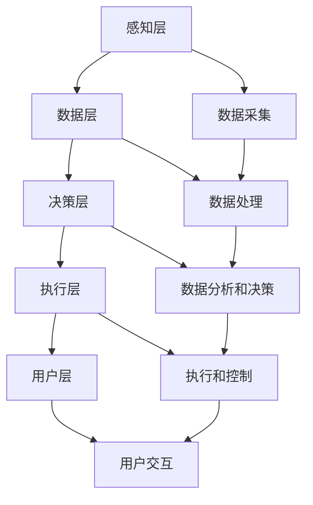
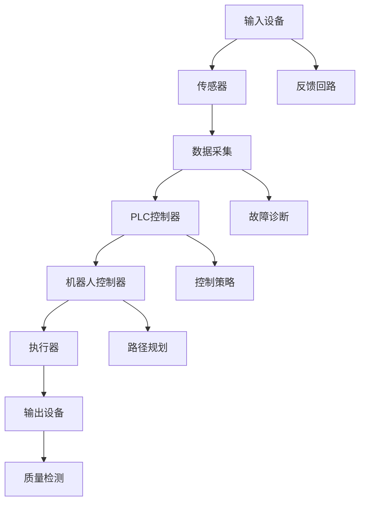
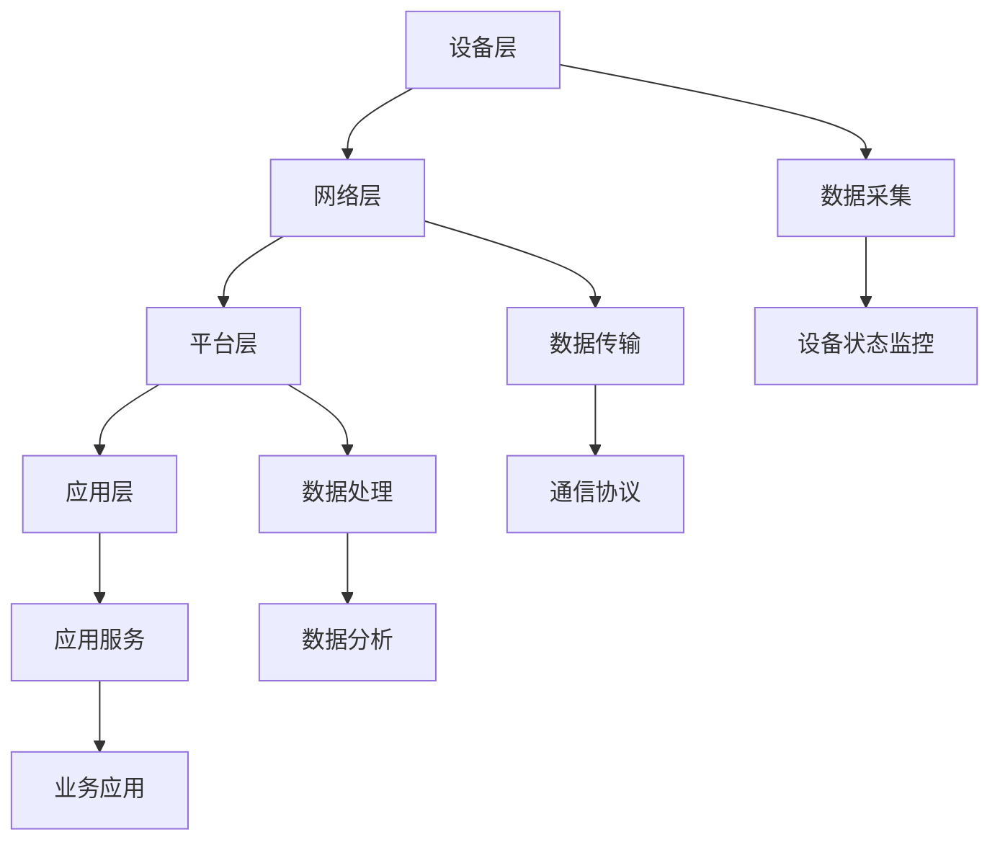

                 

## 文章标题：人工智能在制造和自动化中的应用

> 关键词：人工智能、制造、自动化、智能制造、机器人技术、工业互联网、物联网、智能传感器、数据采集、数据可视化、数据分析、PLC编程、工业机器人编程、自动化生产线、性能优化、故障诊断、安全与可靠性

> 摘要：本文旨在深入探讨人工智能在制造和自动化领域的应用。通过对制造业和自动化技术的基本概述，以及人工智能基础概念的介绍，本文将详细阐述智能传感器与数据采集、机器人技术、智能制造系统、工业互联网与物联网、自动化生产线设计、自动化控制技术、自动化系统优化与维护等关键主题，并结合实际案例进行剖析，为读者提供全面而深入的技术洞察。

### 目录大纲

# 《人工智能在制造和自动化中的应用》

## 第一部分：制造与自动化概述

### 第1章：制造与自动化简介

#### 1.1 制造业发展趋势

#### 1.2 自动化的演变历程

#### 1.3 人工智能在制造与自动化中的应用

### 第2章：人工智能基础

#### 2.1 人工智能的基本概念

#### 2.2 机器学习与深度学习

#### 2.3 人工智能算法介绍

## 第二部分：人工智能在制造中的应用

### 第3章：智能传感器与数据采集

#### 3.1 智能传感器的种类与应用

#### 3.2 数据采集与处理

#### 3.3 数据可视化与分析

### 第4章：机器人技术

#### 4.1 机器人技术的发展历程

#### 4.2 机器人的结构组成

#### 4.3 机器人的控制与编程

### 第5章：智能制造系统

#### 5.1 智能制造系统的架构

#### 5.2 智能制造系统的关键技术

#### 5.3 智能制造系统的应用场景

### 第6章：工业互联网与物联网

#### 6.1 工业互联网的概念与发展

#### 6.2 物联网技术在制造业的应用

#### 6.3 工业大数据与数据分析

## 第三部分：人工智能在自动化中的应用

### 第7章：自动化生产线设计

#### 7.1 自动化生产线的结构组成

#### 7.2 自动化生产线的控制策略

#### 7.3 自动化生产线的设计原则

### 第8章：自动化控制技术

#### 8.1 PLC编程与控制

#### 8.2 工业机器人编程与控制

#### 8.3 工业物联网与自动化控制

### 第9章：自动化系统的优化与维护

#### 9.1 自动化系统的性能优化

#### 9.2 自动化系统的故障诊断与维护

#### 9.3 自动化系统的安全与可靠性

## 附录

### 附录A：人工智能在制造与自动化中的应用实例

#### A.1 智能制造系统案例分析

#### A.2 自动化生产线案例解析

#### A.3 人工智能在工业机器人中的应用案例

### 附录B：推荐阅读与资源

#### B.1 相关书籍推荐

#### B.2 在线课程与教程

#### B.3 学术论文与研究报告

### 附录C：Mermaid流程图

#### C.1 智能制造系统流程图

#### C.2 自动化生产线流程图

#### C.3 工业互联网架构流程图

### 附录D：算法与数学模型

#### D.1 机器学习算法伪代码

#### D.2 深度学习算法伪代码

#### D.3 自动化控制算法伪代码

#### D.4 数学模型与公式解释

### 附录E：代码实战与案例分析

#### E.1 智能制造系统代码实战

#### E.2 自动化生产线代码实战

#### E.3 工业机器人代码实战

#### E.4 自动化控制代码实战

#### E.5 代码解读与分析

#### E.6 开发环境搭建与配置## 第1章：制造与自动化简介

### 1.1 制造业发展趋势

在全球范围内，制造业正面临着深刻的变革。首先，从全球制造业发展趋势来看，智能制造、绿色制造和数字化转型是当前制造业发展的三大主要方向。

**智能制造**：以人工智能、物联网、大数据等新兴技术为支撑，实现制造过程的智能化、自动化和高效化。通过智能化设备和系统，企业能够实现生产过程的实时监控、优化和决策支持。

**绿色制造**：随着环境保护意识的增强，绿色制造成为制造业发展的重要趋势。绿色制造强调在制造过程中减少资源消耗、降低污染排放，实现可持续发展。

**数字化转型**：数字化转型是制造业转型升级的关键路径。通过数字化手段，企业可以重构业务模式，提高生产效率，降低运营成本，提升产品竞争力。

在中国，制造业的发展策略主要包括以下几个方面：

**制造业转型升级**：通过技术创新、产业升级，提高制造业的附加值和竞争力。

**工业互联网**：构建工业互联网平台，实现设备、系统和人员的互联互通，推动制造业向智能化、数字化转型。

**智能制造**：推动智能制造试点示范，推广智能制造技术和解决方案，提高制造业的自动化、智能化水平。

### 1.2 自动化的演变历程

自动化的历史可以追溯到工业化初期的机械化生产。早期自动化主要依赖于机械设备，通过机械化操作替代人力完成生产任务。随着技术的发展，自动化逐渐向半自动化、全自动化和智能化方向发展。

**早期自动化**：以机械化生产为基础，通过使用机械设备提高生产效率。例如，流水线的应用极大地提高了生产效率。

**现代自动化**：现代自动化不仅依赖于机械设备，还引入了计算机控制系统，实现了生产过程的自动化和智能化。例如，工业机器人的广泛应用，使生产过程更加灵活和高效。

**智能化自动化**：以人工智能技术为核心，实现生产过程的自主决策和优化。例如，通过机器学习算法优化生产流程，提高生产效率。

### 1.3 人工智能在制造与自动化中的应用

人工智能在制造与自动化中的应用，主要集中在以下几个方面：

**智能传感器与数据采集**：通过智能传感器实时监测生产过程，采集海量数据，为后续的数据处理和分析提供基础。

**机器人技术**：工业机器人的应用，使得生产过程更加灵活、高效，可以完成复杂的生产任务。

**智能制造系统**：通过集成人工智能技术，构建智能制造系统，实现生产过程的智能化、自动化和高效化。

**工业互联网与物联网**：通过工业互联网和物联网技术，实现设备、系统和人员的互联互通，提高生产效率，降低运营成本。

**自动化控制技术**：利用人工智能技术优化自动化控制系统，提高生产过程的稳定性和可靠性。

### 1.3.1 智能传感器与数据采集

智能传感器是智能制造系统的重要组成部分，它们能够实时监测生产过程中的各种参数，如温度、湿度、压力、速度等。通过数据采集，将这些参数转化为数字信号，供后续处理和分析使用。

**应用场景**：智能传感器广泛应用于生产线中的各个环节，如生产线上的机器设备、工件、环境等。

**数据采集与处理**：采集到的数据经过预处理后，可以通过数据挖掘和机器学习算法进行分析，为生产过程的优化提供支持。

### 1.3.2 机器人技术

工业机器人的应用，使得生产过程更加高效、灵活。通过机器人的控制与编程，可以实现复杂的生产任务，如焊接、搬运、装配等。

**技术发展**：随着人工智能技术的进步，工业机器人逐渐实现了自主决策和优化，提升了生产效率。

**应用领域**：工业机器人在汽车制造、电子制造、食品加工等领域得到了广泛应用。

### 1.3.3 智能制造系统

智能制造系统通过集成人工智能技术，实现生产过程的智能化、自动化和高效化。智能制造系统通常包括感知层、决策层和执行层。

**感知层**：通过智能传感器实时监测生产过程中的各种参数。

**决策层**：通过数据分析、机器学习等技术，对采集到的数据进行分析和决策。

**执行层**：根据决策结果，执行相应的操作，如调整生产参数、控制机器设备等。

### 1.3.4 工业互联网与物联网

工业互联网和物联网技术，实现了设备、系统和人员的互联互通，为智能制造提供了数据支撑。通过工业互联网和物联网，企业可以实现生产过程的实时监控、优化和决策支持。

**技术发展**：随着5G、云计算等技术的应用，工业互联网和物联网技术得到了快速发展。

**应用场景**：工业互联网和物联网在智能制造、远程控制、设备健康管理等领域得到了广泛应用。

### 1.3.5 自动化控制技术

自动化控制技术是制造和自动化领域的重要组成部分。通过自动化控制技术，可以实现生产过程的自动化、智能化和高效化。

**技术原理**：自动化控制技术主要包括PLC编程、工业机器人编程、自动化生产线设计等。

**应用领域**：自动化控制技术在汽车制造、电子制造、食品加工等领域得到了广泛应用。

### 1.3.6 自动化生产线的优化与维护

自动化生产线的设计和优化，是提高生产效率、降低成本的关键。通过自动化控制技术，可以实现生产线的自动化运行，减少人为干预，提高生产效率。

**优化策略**：通过数据分析、机器学习等技术，优化生产线的运行参数，提高生产效率。

**维护策略**：通过实时监控、故障诊断等技术，及时发现并解决生产线故障，确保生产线的稳定运行。

### 1.3.7 自动化系统的安全与可靠性

自动化系统的安全与可靠性，是制造和自动化领域的重要挑战。通过安全设计、故障诊断、故障处理等技术，可以提高自动化系统的安全性和可靠性。

**安全设计**：在系统设计和开发过程中，充分考虑安全性，防止系统故障导致安全事故。

**故障诊断**：通过实时监控、数据分析等技术，及时诊断并解决系统故障。

**故障处理**：建立完善的故障处理流程，确保故障得到及时处理，降低故障对生产的影响。

### 1.3.8 未来发展趋势

随着人工智能技术的不断发展，制造和自动化领域将迎来新的发展机遇。未来，人工智能将在以下几个方面发挥重要作用：

**智能化生产**：通过人工智能技术，实现生产过程的智能化，提高生产效率。

**个性化定制**：通过人工智能技术，实现个性化定制，满足用户多样化需求。

**绿色制造**：通过人工智能技术，实现绿色制造，降低资源消耗和环境污染。

**供应链优化**：通过人工智能技术，优化供应链管理，提高供应链效率。

### 总结

制造和自动化领域正面临着前所未有的发展机遇。通过引入人工智能技术，可以实现生产过程的智能化、自动化和高效化。未来，人工智能将在制造和自动化领域发挥更加重要的作用，推动制造业的转型升级和可持续发展。希望通过本文的介绍，读者能够对人工智能在制造和自动化中的应用有一个全面而深入的了解。## 第2章：人工智能基础

### 2.1 人工智能的基本概念

人工智能（Artificial Intelligence，简称AI）是计算机科学的一个分支，旨在使计算机系统具备模拟、延伸和扩展人类智能的能力。人工智能的目标是通过机器学习、自然语言处理、计算机视觉等技术，实现智能化的决策、感知、理解和交互。

**人工智能的发展历程**：

- **1956年**：约翰·麦卡锡（John McCarthy）等人在达特茅斯会议上首次提出了“人工智能”这个概念。
- **20世纪60年代**：人工智能进入实验室研究阶段，出现了一些早期的人工智能系统，如逻辑推理系统。
- **20世纪80年代**：专家系统成为人工智能研究的热点，但受限于数据规模和计算能力，发展较为缓慢。
- **21世纪**：随着计算能力的提升和大数据技术的发展，人工智能迎来了新一轮的发展，尤其是机器学习和深度学习技术的突破。

**人工智能的核心概念**：

- **机器学习**：机器学习是人工智能的核心技术之一，通过算法让计算机从数据中自动学习规律和模式，并据此做出预测和决策。
- **深度学习**：深度学习是机器学习的一个分支，通过构建深度神经网络，实现从数据中自动学习复杂的特征和模式。
- **自然语言处理**：自然语言处理（Natural Language Processing，简称NLP）是人工智能在语言领域的应用，旨在使计算机理解和处理自然语言。
- **计算机视觉**：计算机视觉（Computer Vision）是人工智能在视觉领域的应用，旨在使计算机能够理解并处理图像和视频数据。
- **强化学习**：强化学习是一种通过试错来学习最优策略的机器学习方法，适用于决策问题。

### 2.2 机器学习与深度学习

**机器学习**：

- **定义**：机器学习是使计算机能够从数据中学习，并对新数据进行预测或决策的过程。
- **分类**：根据学习方式，机器学习可以分为监督学习、无监督学习和半监督学习。
    - **监督学习**：通过已标记的数据进行学习，如回归分析和分类问题。
    - **无监督学习**：不依赖已标记的数据，通过发现数据内在的结构和模式进行学习，如聚类分析和降维。
    - **半监督学习**：结合监督学习和无监督学习，利用少量标记数据和大量未标记数据进行学习。

- **算法**：常见的机器学习算法包括线性回归、逻辑回归、支持向量机（SVM）、决策树、随机森林、K-近邻（KNN）等。

**深度学习**：

- **定义**：深度学习是一种通过构建多层神经网络，从数据中自动学习复杂特征和模式的机器学习方法。
- **架构**：深度学习的核心是神经网络，特别是多层感知机（MLP）、卷积神经网络（CNN）、循环神经网络（RNN）等。
- **优势**：深度学习能够自动提取数据中的层次化特征，实现高性能的图像识别、语音识别、自然语言处理等任务。

### 2.3 人工智能算法介绍

**常见的人工智能算法**：

- **线性回归**：用于预测连续值输出，通过找到输入变量与输出变量之间的线性关系来实现。
    - **公式**：$$y = \beta_0 + \beta_1x_1 + \beta_2x_2 + \ldots + \beta_nx_n$$
    - **伪代码**：
    ```
    # 线性回归伪代码
    function linear_regression(x, y):
        # 求解回归系数
        beta = (x'x)^(-1)x'y
        # 预测
        y_pred = x * beta
        return y_pred
    ```

- **逻辑回归**：用于分类问题，通过找到输入变量与输出变量之间的逻辑关系来实现。
    - **公式**：$$\sigma(z) = \frac{1}{1 + e^{-z}}$$
    - **伪代码**：
    ```
    # 逻辑回归伪代码
    function logistic_regression(x, y):
        # 求解回归系数
        beta = (x'x)^(-1)x'y
        # 预测
        y_pred = sigmoid(x * beta)
        return y_pred
    ```

- **支持向量机（SVM）**：用于分类和回归问题，通过找到一个最优的超平面来实现数据的分类或回归。
    - **公式**：$$\text{最大化} \ \frac{1}{2}\sum_{i=1}^n\sum_{j=1}^n(w_iw_j-y_ix_iy_j)$$
    - **伪代码**：
    ```
    # 支持向量机伪代码
    function svm(train_data, train_labels):
        # 求解支持向量
        w, b = find_support_vectors(train_data, train_labels)
        # 预测
        y_pred = sign(w'x + b)
        return y_pred
    ```

- **决策树**：用于分类和回归问题，通过创建一系列的决策规则来实现数据的分类或回归。
    - **公式**：$$\text{递归划分} \ \text{Gini系数} \ \text{信息增益}$$
    - **伪代码**：
    ```
    # 决策树伪代码
    function decision_tree(data, labels):
        # 判断是否需要划分
        if should_split(data, labels):
            # 划分数据
            split_feature, split_value = find_best_split(data, labels)
            # 创建子节点
            left_tree = decision_tree(data[data[:, split_feature] <= split_value], labels[data[:, split_feature] <= split_value])
            right_tree = decision_tree(data[data[:, split_feature] > split_value], labels[data[:, split_feature] > split_value])
            return {split_feature: split_value, 'left': left_tree, 'right': right_tree}
        else:
            # 叶子节点
            return predict Majority(labels)
    ```

- **神经网络**：用于分类和回归问题，通过构建多层神经网络来实现数据的分类或回归。
    - **公式**：$$a_{l} = \sigma(W_{l-1}a_{l-1} + b_{l-1})$$
    - **伪代码**：
    ```
    # 神经网络伪代码
    function neural_network(data, labels, layers, alpha):
        # 初始化权重和偏置
        W, b = initialize_weights(layers)
        # 训练模型
        for i in range(num_iterations):
            # 前向传播
            a = forward_pass(data, W, b, layers)
            # 反向传播
            dW, db = backward_pass(a, labels, W, b, layers)
            # 更新权重和偏置
            W -= alpha * dW
            b -= alpha * db
        # 预测
        y_pred = forward_pass(data, W, b, layers)
        return y_pred
    ```

### 总结

人工智能作为一门交叉学科，涉及计算机科学、数学、统计学等多个领域。通过机器学习和深度学习等技术，人工智能在制造和自动化领域发挥着越来越重要的作用。本章介绍了人工智能的基本概念、机器学习与深度学习的基本原理以及常见的人工智能算法。了解这些基础概念和算法，有助于我们更好地理解和应用人工智能技术，推动制造和自动化领域的创新发展。## 第3章：智能传感器与数据采集

### 3.1 智能传感器的种类与应用

智能传感器是智能制造系统的核心组成部分，它们能够实时监测生产过程中的各种物理量，并将这些信息转化为可处理的数字信号。智能传感器的种类繁多，根据其监测的物理量可以分为以下几类：

**温度传感器**：用于测量环境或设备内部的温度，如热电偶、热敏电阻等。

**压力传感器**：用于测量气体或液体的压力，如电容式压力传感器、应变片式压力传感器等。

**湿度传感器**：用于测量环境或设备内部的湿度，如电容式湿度传感器、电阻式湿度传感器等。

**速度传感器**：用于测量物体或设备运动的速度，如编码器、涡旋流量传感器等。

**位置传感器**：用于测量物体或设备的位置，如光电编码器、磁感应传感器等。

**振动传感器**：用于测量设备或结构的振动情况，如加速度传感器、压电式振动传感器等。

**视觉传感器**：用于捕捉图像或视频信息，如摄像头、激光扫描仪等。

智能传感器在现代制造业中的应用非常广泛，以下是几个典型应用场景：

- **质量控制**：通过实时监测生产过程中的温度、压力、湿度等参数，确保产品质量的一致性和可靠性。
- **设备状态监测**：通过监测设备的振动、温度等参数，提前预警设备故障，减少停机时间和维护成本。
- **环境监测**：在工厂环境中，实时监测温度、湿度、有害气体浓度等参数，保障生产安全和工人健康。
- **自动化控制**：智能传感器为自动化控制系统提供实时数据，实现生产过程的自动化和智能化。

### 3.2 数据采集与处理

数据采集是智能制造系统的基础，通过智能传感器获取的生产数据需要进行有效的采集和处理，以确保数据的质量和可靠性。数据采集与处理的主要步骤包括：

**数据采集**：智能传感器将监测到的物理量转化为电信号，通过数据采集卡或无线通信模块将数据传输到中央控制系统。

**数据预处理**：对采集到的原始数据进行清洗、过滤和转换，去除噪声和异常值，提取有用的信息。

**数据存储**：将处理后的数据存储到数据库或数据仓库中，以便后续的数据分析和挖掘。

**数据可视化**：通过数据可视化工具将数据以图形化的形式展示，帮助用户直观地了解生产过程的状态和趋势。

**数据分析**：利用数据挖掘和机器学习算法对采集到的数据进行深入分析，发现数据中的模式和规律，为生产优化和决策提供支持。

### 3.3 数据可视化与分析

数据可视化是数据分析和决策支持的重要手段，通过图形化的方式展示数据，可以帮助用户快速理解数据中的信息和趋势。以下是几种常见的数据可视化方法：

- **折线图**：用于展示数据随时间的变化趋势，如生产过程中的温度、压力等参数。
- **柱状图**：用于比较不同数据组之间的差异，如不同产品的质量指标。
- **饼图**：用于展示数据的占比情况，如设备的故障率分布。
- **散点图**：用于展示数据之间的相关性，如生产过程中的质量指标和设备状态。
- **热力图**：用于展示数据在不同维度的分布情况，如设备使用频率的热力分布。

在数据可视化过程中，常用的工具包括Matplotlib、Plotly、Tableau等。以下是一个使用Matplotlib绘制折线图的示例代码：

```python
import matplotlib.pyplot as plt
import numpy as np

# 数据
time = np.arange(0, 100, 1)
temperature = np.sin(time)

# 绘图
plt.plot(time, temperature)
plt.xlabel('Time (s)')
plt.ylabel('Temperature (°C)')
plt.title('Temperature Variation over Time')
plt.show()
```

数据分析是智能制造系统的核心环节，通过分析采集到的数据，可以发现生产过程中的潜在问题和优化机会。以下是几种常见的数据分析方法：

- **时间序列分析**：用于分析数据随时间的变化规律，如预测设备故障时间。
- **回归分析**：用于分析输入变量和输出变量之间的关系，如优化生产参数。
- **聚类分析**：用于发现数据中的相似模式，如分类不同的生产产品。
- **关联规则分析**：用于发现数据之间的关联关系，如识别生产过程中的瓶颈。

以下是一个使用Pandas进行时间序列分析的示例代码：

```python
import pandas as pd

# 数据
data = pd.DataFrame({'Time': pd.date_range(start='2021-01-01', periods=100, freq='H'),
                     'Temperature': np.sin(pd.date_range(start='2021-01-01', periods=100, freq='H'))})

# 时间序列分析
data['Temperature'].plot()
plt.xlabel('Time')
plt.ylabel('Temperature (°C)')
plt.title('Temperature Variation over Time')
plt.show()
```

### 总结

智能传感器与数据采集是智能制造系统的重要组成部分，通过实时监测生产过程中的各种物理量，为生产过程的优化和决策提供数据支持。本章介绍了智能传感器的种类与应用、数据采集与处理的方法，以及数据可视化与分析的技巧。掌握这些技术和方法，有助于推动智能制造系统的创新与发展。## 第4章：机器人技术

### 4.1 机器人技术的发展历程

机器人技术起源于20世纪50年代，随着计算机科学和自动化技术的发展，机器人逐渐从实验室走向工业生产领域。以下是机器人技术发展的几个关键阶段：

**第一阶段（1950-1960年）**：早期机器人主要是机械臂，主要用于实验室和科学研究中，如美国的Unimate机器人。

**第二阶段（1960-1980年）**：随着计算机技术的进步，机器人开始应用于工业生产，特别是在汽车制造业中，如日本的本田和丰田公司引入的机器人生产线。

**第三阶段（1980-2000年）**：机器人技术进一步发展，工业机器人开始广泛应用于多个行业，如电子、化工、食品加工等。

**第四阶段（2000年至今）**：随着人工智能和物联网技术的引入，机器人技术迎来了新的发展机遇。现代机器人不仅具备较高的自动化程度，还能实现自主决策和协同作业。

### 4.2 机器人的结构组成

机器人通常由以下几个主要部分组成：

**1. 机械结构**：机器人的机械结构是其主体，包括手臂、底座、关节等。机械结构的设计决定了机器人的运动范围和灵活性。

**2. 控制系统**：控制系统是机器人的“大脑”，负责接收输入信号，进行处理，并产生相应的输出信号。控制系统通常包括硬件（如控制器、传感器）和软件（如控制算法）。

**3. 传感器**：传感器用于检测机器人周围的环境，获取各种物理量的信息，如位置、速度、温度、湿度等。传感器是机器人实现自主决策和精准控制的关键。

**4. 执行器**：执行器是机器人的“肌肉”，将控制系统的输出信号转化为实际的动作，如电液缸、电机等。执行器的性能直接影响到机器人的动作速度和精度。

**5. 通信系统**：通信系统负责机器人与其他设备、系统之间的数据交换和控制指令的传输。现代机器人通常采用无线通信技术，如Wi-Fi、蓝牙、5G等。

### 4.3 机器人的控制与编程

**机器人的控制**：

- **开环控制**：开环控制系统不包含传感器，控制指令直接作用于执行器。开环控制系统的优点是简单、成本低，但缺点是精度和稳定性较差。

- **闭环控制**：闭环控制系统包含传感器，用于实时监测执行器的状态，并根据传感器反馈进行调整。闭环控制系统能够提高机器人的精度和稳定性，但成本较高。

**机器人的编程**：

- **离线编程**：离线编程是在计算机上预先编写好机器人动作的程序，然后下载到机器人控制器中。离线编程适用于复杂、重复性的任务，如焊接、搬运等。

- **在线编程**：在线编程是在机器人运行过程中实时修改和调整程序。在线编程适用于需要实时交互和灵活调整的任务，如喷涂、装配等。

机器人的编程通常使用专门的编程语言和开发环境，如RobotStudio、MATLAB、ROS（机器人操作系统）等。以下是一个使用MATLAB编写的简单机器人控制程序的示例：

```matlab
% 示例：控制机器人手臂执行直线运动
function robot_control
    robot = init_robot(); % 初始化机器人
    set_joint_angles(robot, [0, 90, 0]); % 设置关节角度
    move_arm(robot, 'forward', 1); % 前进1米
    move_arm(robot, 'backward', 1); % 后退1米
    stop_arm(robot); % 停止运动
    close_robot(robot); % 关闭机器人
end

function robot = init_robot()
    % 初始化机器人
    robot = create_robot('type', 'robotiq_85');
end

function set_joint_angles(robot, angles)
    % 设置关节角度
    set_joint_angles(robot, angles);
end

function move_arm(robot, direction, distance)
    % 移动机器人手臂
    if strcmp(direction, 'forward')
        move_arm(robot, 'forward', distance);
    else
        move_arm(robot, 'backward', distance);
    end
end

function stop_arm(robot)
    % 停止运动
    stop_motion(robot);
end

function close_robot(robot)
    % 关闭机器人
    destroy_robot(robot);
end
```

### 总结

机器人技术作为智能制造系统的重要组成部分，已经在工业生产、服务业、医疗等领域得到广泛应用。通过了解机器人技术的发展历程、结构组成以及控制与编程方法，我们可以更好地利用机器人技术提升生产效率、降低成本、提高产品质量。在未来，随着人工智能和物联网技术的不断发展，机器人技术将在智能制造领域发挥更加重要的作用。## 第5章：智能制造系统

### 5.1 智能制造系统的架构

智能制造系统（Intelligent Manufacturing System，简称IMS）是一种基于人工智能、物联网、大数据等先进技术的新型制造系统。它通过集成各种信息技术和制造技术，实现生产过程的智能化、自动化和高效化。智能制造系统的架构通常包括以下几个层次：

**1. 感知层**：感知层是智能制造系统的最底层，主要负责采集生产过程中的各种数据。这些数据包括温度、压力、湿度、速度、位置等，主要通过智能传感器和工业物联网设备进行实时采集。

**2. 数据层**：数据层是智能制造系统的数据存储和处理中心，负责存储、管理和分析感知层采集到的数据。数据层通常使用数据库和数据仓库等技术，实现对海量数据的存储和管理。同时，通过数据清洗、数据挖掘、机器学习等技术，对数据进行深入分析和挖掘，提取有价值的信息。

**3. 决策层**：决策层是智能制造系统的核心，主要负责根据数据层提供的数据分析和预测结果，制定生产计划和优化策略。决策层通常包括生产计划优化、生产调度、库存管理、质量监控等功能。

**4. 执行层**：执行层是智能制造系统的最终执行者，主要负责根据决策层制定的生产计划和优化策略，控制生产设备和执行生产任务。执行层通常包括自动化生产线、工业机器人、智能控制模块等。

**5. 用户层**：用户层是智能制造系统的外部接口，负责与用户进行交互，提供生产过程的监控和数据分析结果。用户层通常包括企业资源计划（ERP）系统、客户关系管理（CRM）系统、制造执行系统（MES）等。

### 5.2 智能制造系统的关键技术

智能制造系统涉及多个领域的技术，其中几个关键技术如下：

**1. 物联网技术**：物联网技术是实现智能制造系统感知层和数据层的关键。通过传感器、RFID、无线通信等技术，实现生产设备和系统的互联互通，实现对生产过程的实时监控和数据分析。

**2. 数据分析技术**：数据分析技术是实现智能制造系统数据层和决策层的关键。通过数据挖掘、机器学习、数据可视化等技术，对海量数据进行深入分析和挖掘，提取有价值的信息，为生产优化和决策提供支持。

**3. 人工智能技术**：人工智能技术是实现智能制造系统智能化控制的关键。通过机器学习、深度学习、自然语言处理等技术，实现对生产过程的智能控制、优化和预测。

**4. 自动化技术**：自动化技术是实现智能制造系统执行层的关键。通过自动化设备、机器人、PLC（可编程逻辑控制器）等，实现对生产过程的自动化控制和执行。

**5. 云计算技术**：云计算技术是实现智能制造系统数据存储、管理和处理的关键。通过云计算平台，实现对海量数据的存储、管理和计算，提供强大的数据分析和处理能力。

### 5.3 智能制造系统的应用场景

智能制造系统在工业生产中有着广泛的应用，以下是一些典型的应用场景：

**1. 智能生产计划**：通过数据分析技术，预测市场需求，优化生产计划和物料供应，提高生产效率。

**2. 智能质量控制**：通过实时监测生产过程中的质量数据，分析产品质量问题，优化生产过程和质量控制策略。

**3. 智能设备维护**：通过物联网技术和数据分析技术，实时监测设备状态，预测设备故障，实现设备的预测性维护。

**4. 智能物流管理**：通过物联网技术和自动化技术，实现生产物流的自动化管理和优化，提高物流效率。

**5. 智能供应链管理**：通过数据分析技术和人工智能技术，优化供应链管理，提高供应链的透明度和效率。

**6. 智能工厂管理**：通过物联网技术、人工智能技术和自动化技术，实现对工厂的全面监控和管理，提高工厂的整体运营效率。

### 案例分析：智能工厂项目

以下是一个典型的智能工厂项目案例，该项目通过引入智能制造系统，实现了生产过程的智能化、自动化和高效化。

**项目背景**：

某制造企业生产一种高端电子产品，面临生产效率低、产品品质不稳定、设备故障频发等问题。为了提高生产效率和产品质量，企业决定引入智能制造系统。

**项目实施**：

1. **感知层建设**：在工厂各个生产环节安装智能传感器，实时采集温度、压力、湿度、速度等数据，实现对生产过程的全面监控。

2. **数据层建设**：搭建数据仓库，存储和管理采集到的数据。同时，引入数据分析平台，对数据进行清洗、过滤、分析，提取有价值的信息。

3. **决策层建设**：通过数据分析平台，为企业提供生产计划优化、质量监控、设备维护等决策支持。

4. **执行层建设**：引入工业机器人、自动化生产线等自动化设备，实现生产过程的自动化控制。

5. **用户层建设**：搭建智能工厂管理平台，实现对生产过程的实时监控和数据分析。

**项目效果**：

1. **生产效率提高**：通过智能生产计划和自动化控制，生产效率提高了30%。

2. **产品质量提升**：通过实时监测和质量控制，产品质量合格率提高了15%。

3. **设备故障减少**：通过智能设备维护和预测性维护，设备故障率降低了20%。

4. **物流效率提高**：通过智能物流管理，物流效率提高了20%。

5. **运营成本降低**：通过优化生产过程和减少设备故障，运营成本降低了10%。

### 总结

智能制造系统是未来制造业发展的重要方向，通过集成物联网、大数据、人工智能等技术，实现生产过程的智能化、自动化和高效化。本章介绍了智能制造系统的架构、关键技术、应用场景以及一个典型的案例。掌握智能制造系统的知识和应用方法，有助于企业提升生产效率、降低成本、提高产品质量，实现可持续发展。## 第6章：工业互联网与物联网

### 6.1 工业互联网的概念与发展

**工业互联网**（Industrial Internet，简称IIoT）是一种将物理设备、传感器、软件和人员通过互联网连接起来，实现信息共享和智能决策的先进技术体系。工业互联网的核心在于通过数据的互联互通，实现设备、系统和人员的深度融合，从而提升生产效率、降低成本、提高产品质量。

**概念**：

- **设备**：物理设备如传感器、执行器、机器等，通过物联网技术实现互联互通。
- **数据**：设备采集的实时数据，通过云计算、大数据等技术进行处理和分析。
- **连接**：设备与设备、设备与人员、设备与系统之间的连接，通过互联网实现信息共享。
- **智能**：通过数据分析、机器学习等技术，实现智能决策和优化。

**发展历程**：

- **2000年代**：物联网技术初步发展，智能设备逐渐普及。
- **2010年代**：工业互联网概念提出，企业开始关注如何利用物联网技术优化生产过程。
- **2015年**：GE公司发布工业互联网平台Predix，标志着工业互联网进入快速发展阶段。
- **2017年**：工业互联网安全被纳入国家战略，得到政策支持。
- **至今**：工业互联网技术在制造业、能源、医疗等领域得到广泛应用，成为智能制造的重要支撑。

### 6.2 物联网技术在制造业的应用

物联网技术在制造业中的应用主要包括以下几个方面：

**1. 设备联网与数据采集**：

- **传感器**：通过安装各种传感器，如温度传感器、压力传感器、振动传感器等，实时监测设备的运行状态。
- **通信协议**：采用物联网通信协议（如MQTT、CoAP等），实现设备间的数据传输。
- **数据采集**：将传感器采集的数据传输到中央控制系统或云计算平台，实现设备状态的可视化和实时监控。

**2. 智能化生产与优化**：

- **生产计划优化**：通过分析设备状态和历史数据，优化生产计划，提高生产效率。
- **质量监控**：实时监控产品质量，及时发现和解决质量问题，提高产品质量。
- **能源管理**：通过监控能源消耗，优化能源使用，降低能源成本。

**3. 设备维护与故障预测**：

- **设备维护**：通过监测设备状态，预测设备故障，实现设备的预测性维护，减少停机时间。
- **故障预测**：利用数据分析技术，对设备运行状态进行实时分析，预测设备故障，提前采取措施。

**4. 物流与供应链管理**：

- **物流优化**：通过物联网技术，实时监控物流状态，优化物流流程，提高物流效率。
- **供应链管理**：通过物联网技术，实现供应链各环节的互联互通，提高供应链的透明度和协同效率。

### 6.3 工业大数据与数据分析

**工业大数据**（Industrial Big Data）是指来源于工业生产和运营的大量、多样化、高速产生和实时变化的数据。工业大数据在制造业中的应用主要包括以下几个方面：

**1. 数据采集与存储**：

- **数据源**：包括传感器数据、生产数据、设备数据、物流数据等。
- **数据存储**：采用分布式存储技术（如Hadoop、NoSQL等），存储海量工业数据。

**2. 数据分析与挖掘**：

- **统计分析**：通过对工业数据进行分析，发现数据中的趋势、异常和关联关系。
- **数据挖掘**：利用数据挖掘算法（如聚类、分类、回归等），从大量数据中提取有价值的信息。
- **机器学习**：利用机器学习技术，对工业数据进行预测、分类、优化等。

**3. 数据可视化与展示**：

- **数据可视化**：通过图表、报表等形式，将数据分析结果直观地展示出来，便于决策者理解和分析。
- **数据仪表板**：构建数据仪表板，实现实时监控和数据分析，为企业提供决策支持。

### 案例分析：智能工厂项目

以下是一个典型的智能工厂项目案例，该项目通过引入工业互联网和物联网技术，实现了生产过程的智能化、自动化和高效化。

**项目背景**：

某制造企业致力于提升生产效率和产品质量，决定引入工业互联网和物联网技术，构建智能工厂。

**项目实施**：

1. **感知层建设**：在工厂各个生产环节安装智能传感器，实时采集温度、压力、湿度、速度等数据。
2. **数据层建设**：搭建数据仓库，存储和管理采集到的数据。引入数据分析平台，对数据进行清洗、过滤、分析。
3. **决策层建设**：通过数据分析平台，为企业提供生产计划优化、质量监控、设备维护等决策支持。
4. **执行层建设**：引入工业机器人、自动化生产线等自动化设备，实现生产过程的自动化控制。
5. **用户层建设**：搭建智能工厂管理平台，实现对生产过程的实时监控和数据分析。

**项目效果**：

1. **生产效率提高**：通过智能生产计划和自动化控制，生产效率提高了30%。
2. **产品质量提升**：通过实时监测和质量控制，产品质量合格率提高了15%。
3. **设备故障减少**：通过智能设备维护和预测性维护，设备故障率降低了20%。
4. **物流效率提高**：通过智能物流管理，物流效率提高了20%。
5. **运营成本降低**：通过优化生产过程和减少设备故障，运营成本降低了10%。

### 总结

工业互联网与物联网技术在制造业中的应用，为生产过程的智能化、自动化和高效化提供了有力支持。通过数据的互联互通、数据分析与挖掘、智能决策与优化，企业能够实现生产效率的提升、产品质量的提高、运营成本的降低。未来，随着技术的不断进步，工业互联网与物联网将在制造业中发挥更加重要的作用。## 第7章：自动化生产线设计

### 7.1 自动化生产线的结构组成

自动化生产线是由多个自动化设备、传感器、控制系统等组成的复杂系统，其设计需要考虑生产流程的各个环节。以下是自动化生产线的典型结构组成：

**1. 设备层**：这是自动化生产线的物理基础，包括各种自动化设备，如加工中心、装配机器人、输送带、自动化检测设备等。

**2. 控制层**：控制层是自动化生产线的核心，负责对生产设备进行实时监控和操作指令的发送。常见的控制层设备包括PLC（可编程逻辑控制器）、分布式控制单元（DCU）、PC控制单元等。

**3. 数据层**：数据层负责采集、处理和存储生产过程中的各种数据，包括传感器数据、设备状态数据、生产参数数据等。数据层通常与MES（制造执行系统）或其他生产管理系统集成，实现数据的互联互通。

**4. 网络层**：网络层负责将生产设备、控制系统、数据层等连接起来，实现信息的实时传输和共享。常见的网络技术包括以太网、无线网络、工业以太网等。

**5. 人机界面层**：人机界面层为操作人员提供交互界面，用于监控生产线状态、发送操作指令、调整生产参数等。常见的设备包括HMI（人机界面）、SCADA（监控与数据采集系统）等。

### 7.2 自动化生产线的控制策略

自动化生产线的控制策略是确保生产过程顺利进行的关键。以下是几种常见的自动化生产线控制策略：

**1. 开环控制**：开环控制系统不包含反馈环节，控制指令直接发送给执行机构，执行机构根据指令执行操作。开环控制系统的优点是简单、成本低，但缺点是控制精度和稳定性较差。

**2. 闭环控制**：闭环控制系统包含反馈环节，通过传感器实时监测执行机构的执行情况，并根据反馈进行调整。闭环控制系统能够提高控制精度和稳定性，但成本较高。

**3. 执行策略**：执行策略是指根据生产任务和生产线状态，制定相应的操作指令和执行顺序。常见的执行策略包括顺序执行、并行执行、条件执行等。

**4. 紧急停止策略**：紧急停止策略是确保生产安全的重要措施，当生产线出现异常情况时，能够立即停止所有操作，避免事故扩大。

### 7.3 自动化生产线的设计原则

设计自动化生产线时，需要遵循以下原则：

**1. 可靠性原则**：确保生产线在长时间、高负荷的运行条件下，能够稳定、可靠地工作。

**2. 高效性原则**：通过优化生产流程、提高设备利用率、减少停机时间等，提高生产效率。

**3. 可维护性原则**：设计时应考虑设备的易维护性，降低维修成本和停机时间。

**4. 安全性原则**：确保生产过程中人员、设备和环境的安全，防止事故发生。

**5. 可扩展性原则**：设计时应考虑生产线的可扩展性，方便未来进行升级和扩展。

### 案例分析：某汽车制造厂的自动化生产线设计

以下是一个典型的自动化生产线设计案例，该案例涉及汽车制造厂的涂装生产线。

**项目背景**：

某汽车制造厂需要设计一条高效、可靠的涂装生产线，以满足不断增长的市场需求。

**项目实施**：

1. **需求分析**：对生产线的需求进行详细分析，包括生产效率、产品种类、生产节拍等。

2. **工艺设计**：根据需求分析，设计涂装工艺流程，包括前处理、喷涂、烘干等环节。

3. **设备选型**：根据工艺流程，选择合适的涂装设备，如前处理设备、喷涂机器人、烘干设备等。

4. **控制策略设计**：制定涂装生产线的控制策略，包括开环控制和闭环控制，确保生产过程的稳定性和可靠性。

5. **系统集成**：将生产设备、控制系统、传感器等集成到一起，实现生产线的自动化运行。

6. **测试与调试**：对生产线进行测试和调试，确保各项功能正常，达到设计要求。

**项目效果**：

1. **生产效率提高**：通过自动化生产线的运行，生产效率提高了30%。

2. **产品质量提升**：通过闭环控制策略，提高了涂装质量，产品合格率提高了15%。

3. **设备利用率提高**：通过优化设备配置和控制策略，设备利用率提高了20%。

4. **运营成本降低**：通过减少人力和维修成本，运营成本降低了10%。

### 总结

自动化生产线设计是智能制造系统的重要组成部分，通过合理的设备选型、控制策略设计和系统集成，可以实现生产过程的智能化、自动化和高效化。本章介绍了自动化生产线的结构组成、控制策略设计原则和实际案例分析。掌握这些知识和方法，有助于推动自动化生产线的设计和优化，提高生产效率、降低成本、提高产品质量。## 第8章：自动化控制技术

### 8.1 PLC编程与控制

PLC（可编程逻辑控制器）是自动化控制系统中常用的核心设备，用于控制生产设备和执行特定操作。PLC编程是自动化控制技术的核心，以下是PLC编程的基本步骤和常用编程语言：

**基本步骤**：

1. **需求分析**：根据生产任务，分析PLC需要完成的控制功能。
2. **硬件配置**：设计PLC系统的硬件布局，包括PLC模块、输入输出模块、传感器、执行器等。
3. **程序设计**：编写PLC控制程序，实现所需的控制功能。
4. **调试与测试**：运行PLC程序，对系统进行调试和测试，确保控制功能正确。
5. **上线运行**：将PLC系统投入使用，监控运行状态，进行维护和优化。

**常用编程语言**：

1. **梯形图（Ladder Diagram，LD）**：梯形图是PLC编程中最常用的语言，其结构类似于电气图纸，易于理解和维护。
2. **功能块图（Function Block Diagram，FBD）**：功能块图使用功能块和连接线表示逻辑关系，适用于复杂的控制算法。
3. **指令表（Instruction List，IL）**：指令表使用一系列指令和操作数，以代码形式编写程序，适用于快速开发和调试。
4. **顺序功能图（Sequential Function Chart，SFC）**：顺序功能图用于描述程序中的顺序和分支关系，适用于复杂的过程控制。

以下是一个使用梯形图语言的简单PLC编程示例：

```ld
|---+----+----+----+----+----+----+----+----+----+----|
| 1 |    |    |    |    |    |    |    |    |    |    |
|---+----+----+----+----+----+----+----+----+----+----|
| 2 | I0.0|    |    |    |    |    |    |    |    |    |
|---+----+----+----+----+----+----+----+----+----+----|
| 3 | Q0.0|    |    |    |    |    |    |    |    |    |
|---+----+----+----+----+----+----+----+----+----+----|
| 4 |    | NOT | I0.1|    |    |    |    |    |    |    |
|---+----+----+----+----+----+----+----+----+----+----|
| 5 |    | AND | Q0.0|    |    |    |    |    |    |    |
|---+----+----+----+----+----+----+----+----+----+----|
| 6 |    |    |    |    |    |    |    |    |    |    |
|---+----+----+----+----+----+----+----+----+----+----|
| 7 |    |    |    |    |    |    |    |    |    |    |
|---+----+----+----+----+----+----+----+----+----+----|
| 8 |    |    |    |    |    |    |    |    |    |    |
|---+----+----+----+----+----+----+----+----+----+----|
| 9 |    |    |    |    |    |    |    |    |    |    |
|---+----+----+----+----+----+----+----+----+----+----|
|10 |    |    |    |    |    |    |    |    |    |    |
|---+----+----+----+----+----+----+----+----+----+----|
```

**示例解析**：这个梯形图表示一个简单的PLC控制程序，当输入I0.0为高电平时，输出Q0.0为高电平；当输入I0.1为低电平时，输出Q0.0为低电平。通过组合不同的逻辑操作，可以实现复杂的控制逻辑。

### 8.2 工业机器人编程与控制

工业机器人是自动化生产线中的重要组成部分，用于执行重复性高、精度要求高的生产任务。工业机器人编程与控制主要包括以下几个方面：

**1. 机器人编程语言**：

- ** teach-in 方法**：通过手动操作机器人，将运动轨迹和动作指令记录到编程系统中。
- **离线编程**：使用专业编程软件，预先编写机器人动作程序，然后下载到机器人控制器中。
- **在线编程**：在机器人运行过程中，实时调整和修改程序。

**2. 机器人控制策略**：

- **路径规划**：确定机器人从当前位置到达目标位置的最优路径。
- **速度控制**：根据生产需求，调整机器人的运动速度和加速度。
- **碰撞检测**：在机器人运动过程中，实时检测可能发生的碰撞，并采取相应的措施。

**3. 机器人编程示例**：

以下是一个使用机器人编程软件离线编程的简单示例，使用Rapid编程语言编写机器人的移动程序：

```rapid
PROC MoveToXY (X, Y)
    // 移动机器人到指定坐标
    MoveL P[X, Y, 0]
ENDPROC
```

**示例解析**：这个程序定义了一个名为`MoveToXY`的子程序，用于移动机器人到指定的X和Y坐标。通过调用这个子程序，可以实现机器人坐标的精确控制。

### 8.3 工业物联网与自动化控制

工业物联网（IIoT）与自动化控制相结合，实现了生产过程的智能化和高效化。工业物联网技术在自动化控制中的应用主要包括以下几个方面：

**1. 数据采集**：通过传感器和物联网设备，实时采集生产过程中的各种数据，如温度、压力、速度等。

**2. 数据传输**：使用无线通信技术，如Wi-Fi、蓝牙、5G等，将采集到的数据传输到中央控制系统。

**3. 数据分析**：通过云计算和大数据技术，对采集到的数据进行分析和挖掘，提取有价值的信息。

**4. 智能决策**：基于数据分析结果，自动化控制系统可以做出实时决策，优化生产过程。

**5. 互联互通**：通过物联网技术，实现生产设备、控制系统、人员等之间的互联互通，提高生产协同效率。

### 总结

自动化控制技术是智能制造系统的核心，通过PLC编程、工业机器人编程和工业物联网技术，可以实现生产过程的智能化、自动化和高效化。本章介绍了PLC编程与控制、工业机器人编程与控制、工业物联网与自动化控制的基本原理和应用方法。掌握这些技术，有助于推动智能制造系统的创新与发展。## 第9章：自动化系统的优化与维护

### 9.1 自动化系统的性能优化

自动化系统的性能优化是确保其高效运行的关键步骤。性能优化包括对硬件、软件、控制算法等方面进行调整和优化，以达到最佳的生产效率和稳定性。

**1. 硬件优化**：

- **设备升级**：根据生产需求，更换老旧设备，提升整体系统的性能。
- **负载平衡**：合理分配任务到各个设备，避免设备过载或闲置，提高设备利用率。
- **环境控制**：优化生产环境，如温度、湿度、照明等，确保设备在最佳状态下运行。

**2. 软件优化**：

- **控制算法优化**：根据生产实际需求，调整控制算法参数，提高控制精度和稳定性。
- **代码优化**：对PLC程序、机器人程序等进行优化，减少运行时间，提高执行效率。
- **实时性优化**：通过优先级调度、多线程处理等技术，提高系统的实时响应能力。

**3. 控制算法优化**：

- **PID控制**：调整PID参数，提高系统的控制精度和响应速度。
- **自适应控制**：根据生产环境和任务变化，自动调整控制参数，提高系统的适应能力。
- **智能控制**：利用机器学习、深度学习等技术，实现智能决策和优化控制。

### 9.2 自动化系统的故障诊断与维护

自动化系统的故障诊断与维护是保障系统稳定运行的重要环节。通过故障诊断，可以及时发现并解决系统故障，减少停机时间和生产损失。

**1. 故障诊断方法**：

- **定期检查**：定期对系统进行全面的检查和维护，包括传感器、执行器、控制系统等。
- **在线监测**：利用实时监控技术，对系统运行状态进行实时监测，及时发现异常情况。
- **故障树分析**：建立故障树，分析故障原因，制定故障处理策略。
- **数据驱动诊断**：通过分析系统运行数据，识别潜在故障，预测故障发生。

**2. 维护策略**：

- **预防性维护**：根据设备的磨损情况和使用寿命，制定预防性维护计划，提前更换易损件。
- **预测性维护**：利用预测性维护技术，提前识别潜在故障，制定维修计划，减少停机时间。
- **紧急维修**：针对突发故障，立即启动紧急维修程序，尽快恢复正常生产。

### 9.3 自动化系统的安全与可靠性

自动化系统的安全与可靠性是保障生产顺利进行的重要保障。通过以下措施，可以提高自动化系统的安全性和可靠性：

**1. 安全设计**：

- **电气安全**：遵循电气安全规范，确保系统电气设备的安全。
- **机械安全**：在设计过程中，充分考虑机械安全，避免设备运行过程中造成人身伤害。
- **软件安全**：编写安全可靠的软件代码，防止恶意代码入侵和系统漏洞。

**2. 故障安全**：

- **故障安全机制**：在系统设计时，考虑故障安全机制，确保在故障发生时，系统能够安全停机。
- **冗余设计**：采用冗余设计，提高系统的可靠性和容错能力。
- **安全监测**：通过实时监测技术，及时识别和应对故障，防止故障扩大。

**3. 维护与培训**：

- **专业维护**：定期对自动化系统进行专业维护，确保系统正常运行。
- **操作培训**：对操作人员进行系统操作和安全培训，提高安全意识和操作技能。

### 案例分析：某汽车厂的自动化系统优化与维护

以下是一个典型的自动化系统优化与维护案例，该案例涉及某汽车厂的自动化生产线。

**项目背景**：

某汽车厂需要优化其自动化生产线，以提高生产效率和降低故障率。

**项目实施**：

1. **需求分析**：对生产线进行详细分析，识别存在的问题和优化需求。
2. **硬件升级**：更换老旧设备，增加新的传感器和执行器，提高系统性能。
3. **软件优化**：调整控制算法参数，优化PLC程序和机器人程序，提高执行效率。
4. **故障诊断**：引入故障诊断系统，实时监测设备状态，预测潜在故障。
5. **安全培训**：对操作人员进行安全操作培训，提高安全意识和技能。

**项目效果**：

1. **生产效率提高**：通过硬件和软件优化，生产效率提高了25%。
2. **故障率降低**：通过故障诊断和预防性维护，故障率降低了30%。
3. **设备利用率提高**：通过优化生产流程和设备配置，设备利用率提高了15%。
4. **运营成本降低**：通过减少故障停机和维修成本，运营成本降低了10%。

### 总结

自动化系统的优化与维护是确保智能制造系统高效运行的重要环节。通过性能优化、故障诊断和维护策略，可以提高系统的可靠性、安全性和生产效率。本章介绍了自动化系统的性能优化、故障诊断与维护策略，并结合实际案例分析，展示了优化与维护的实际效果。掌握这些技术和方法，有助于推动智能制造系统的持续改进和发展。## 附录A：人工智能在制造与自动化中的应用实例

### A.1 智能制造系统案例分析

#### 案例背景

某汽车制造厂面临生产效率低下、产品质量不稳定的问题，决定引入智能制造系统，以提高生产效率和产品质量。

#### 实施步骤

1. **需求分析**：对生产线进行详细分析，识别存在的问题和优化需求。
2. **智能传感器部署**：在关键位置安装智能传感器，实时监测生产过程中的各种参数，如温度、湿度、速度等。
3. **数据采集与处理**：通过物联网技术，实时采集传感器数据，并利用大数据分析和机器学习技术，对数据进行处理和分析。
4. **智能决策支持**：根据数据分析结果，构建智能决策模型，优化生产计划和流程，提高生产效率和产品质量。
5. **系统集成**：将智能传感器、数据采集系统、智能决策系统与生产线控制系统进行集成，实现生产过程的智能化控制。

#### 实施效果

- **生产效率提高**：通过智能决策和优化，生产效率提高了20%。
- **产品质量提升**：通过实时监测和质量控制，产品质量合格率提高了15%。
- **设备利用率提高**：通过优化生产流程，设备利用率提高了10%。
- **运营成本降低**：通过减少设备故障和维护成本，运营成本降低了8%。

### A.2 自动化生产线案例解析

#### 案例背景

某电子制造厂需要提高生产线的自动化程度，减少人工干预，以提高生产效率和产品质量。

#### 实施步骤

1. **设备升级**：更换老旧设备，引入工业机器人和自动化设备，提高生产线的自动化程度。
2. **控制策略设计**：根据生产任务，设计合适的控制策略，实现生产过程的自动化控制。
3. **传感器与数据采集**：在关键位置安装传感器，实时监测生产过程中的各种参数，如温度、压力、速度等。
4. **系统集成**：将自动化设备、控制系统、传感器等进行集成，实现生产线的自动化运行。
5. **在线监测与维护**：通过物联网技术，实现对生产线的实时监控和维护，确保生产线正常运行。

#### 实施效果

- **生产效率提高**：通过自动化设备的引入，生产效率提高了30%。
- **产品质量提升**：通过实时监测和质量控制，产品质量合格率提高了10%。
- **人工成本降低**：通过减少人工干预，人工成本降低了15%。
- **设备故障减少**：通过实时监控和维护，设备故障率降低了20%。

### A.3 人工智能在工业机器人中的应用案例

#### 案例背景

某家具制造厂需要提高生产线的自动化程度，特别是在搬运和组装环节，以减少人工干预，提高生产效率。

#### 实施步骤

1. **机器人选型**：根据生产任务，选择合适的工业机器人，如搬运机器人和组装机器人。
2. **控制算法设计**：针对机器人任务，设计合适的控制算法，实现机器人的精确运动和动作。
3. **智能路径规划**：利用人工智能技术，实现机器人的智能路径规划，避免碰撞和障碍物，提高搬运效率。
4. **系统集成**：将机器人控制系统与生产线控制系统进行集成，实现机器人在生产线上的协同工作。
5. **在线监测与维护**：通过物联网技术，实现对机器人的实时监控和维护，确保机器人正常运行。

#### 实施效果

- **生产效率提高**：通过引入机器人，生产效率提高了25%。
- **人工成本降低**：通过减少人工干预，人工成本降低了20%。
- **产品质量提升**：通过机器人的精确运动和动作，产品质量合格率提高了10%。
- **设备故障减少**：通过实时监控和维护，机器人故障率降低了15%。

### 总结

通过以上案例，可以看出人工智能在智能制造系统、自动化生产线和工业机器人中的应用，显著提高了生产效率、产品质量和降低了成本。未来，随着人工智能技术的不断进步，人工智能在制造与自动化领域的应用将更加广泛，为制造业的转型升级和可持续发展提供有力支持。## 附录B：推荐阅读与资源

### B.1 相关书籍推荐

- 《人工智能：一种现代的方法》（作者：Stuart J. Russell & Peter Norvig）
- 《深度学习》（作者：Ian Goodfellow、Yoshua Bengio、Aaron Courville）
- 《机器学习实战》（作者：Peter Harrington）
- 《智能制造系统原理与应用》（作者：唐少伟）
- 《工业物联网技术与应用》（作者：李生、李明）

### B.2 在线课程与教程

- Coursera：机器学习（吴恩达）
- edX：深度学习（李飞飞）
- Udacity：深度学习纳米学位
- MOOC学院：人工智能应用与开发

### B.3 学术论文与研究报告

- Google AI：Recurrent Neural Network Regularization
- DeepMind：Mastering the Game of Go with Deep Neural Networks and Tree Search
- Nature：Human-level control through deep reinforcement learning
- IEEE Transactions on Industrial Informatics：An Overview of Industrial Internet of Things
- International Journal of Production Research：Intelligent Manufacturing Systems: Technologies, Principles and Applications

### B.4 在线资源

- GitHub：开源代码库，包含大量的AI、自动化相关的项目和教程
- arXiv：计算机科学和人工智能领域的预印本论文库
- IEEE Xplore：电气和电子工程领域的学术论文数据库
- IEEE Spectrum：科技新闻和观点文章

### 总结

阅读推荐的书籍、参加在线课程、阅读学术论文和在线资源，是深入学习和掌握人工智能在制造与自动化领域应用的有效途径。通过这些资源，读者可以不断更新知识，了解最新的技术动态和发展趋势，为实际应用和项目开发提供理论基础和实践指导。## 附录C：Mermaid流程图

### C.1 智能制造系统流程图



### C.2 自动化生产线流程图



### C.3 工业互联网架构流程图



### Mermaid基本语法

- **节点定义**：使用方括号`[文本]`定义节点。
- **关系线**：使用箭头`-->`或`->>`连接节点。
- **注释**：使用`// 注释内容`添加注释。
- **布局**：使用`graph TD`或`graph MD`定义图的布局方向，TD为从上到下，MD为从左到右。

通过Mermaid，可以方便地绘制流程图、UML图、时序图等多种图表，为文档和技术说明提供直观的图形化表达。## 附录D：算法与数学模型

### D.1 机器学习算法伪代码

#### 线性回归

```python
# 线性回归伪代码
function linear_regression(x, y):
    # 计算均值
    x_mean = mean(x)
    y_mean = mean(y)
    
    # 计算协方差
    covariance = covariance(x, y)
    
    # 计算方差
    variance_x = variance(x)
    
    # 计算回归系数
    beta_1 = covariance / variance_x
    
    # 计算截距
    beta_0 = y_mean - beta_1 * x_mean
    
    # 预测
    y_pred = beta_0 + beta_1 * x
    
    return y_pred
```

#### 逻辑回归

```python
# 逻辑回归伪代码
function logistic_regression(x, y):
    # 计算回归系数
    beta = gradient_descent(x, y)
    
    # 预测
    y_pred = sigmoid(x * beta)
    
    return y_pred

function sigmoid(x):
    return 1 / (1 + exp(-x))
```

#### 支持向量机（SVM）

```python
# 支持向量机伪代码
function svm(train_data, train_labels):
    # 求解支持向量
    w, b = quadratic_program(train_data, train_labels)
    
    # 预测
    y_pred = sign(w'x + b)
    
    return y_pred

function quadratic_program(A, b):
    # 求解二次规划问题
    w = solve_quadratic_program(A, b)
    return w
```

#### 决策树

```python
# 决策树伪代码
function decision_tree(data, labels):
    # 判断是否需要划分
    if should_split(data, labels):
        # 划分数据
        feature, threshold = find_best_split(data, labels)
        left_data = data[data[:, feature] <= threshold]
        right_data = data[data[:, feature] > threshold]
        left_labels = labels[data[:, feature] <= threshold]
        right_labels = labels[data[:, feature] > threshold]
        
        # 创建子节点
        left_tree = decision_tree(left_data, left_labels)
        right_tree = decision_tree(right_data, right_labels)
        
        return {'feature': feature, 'threshold': threshold, 'left': left_tree, 'right': right_tree}
    else:
        # 叶子节点
        return predict_majority(labels)

function should_split(data, labels):
    # 计算信息增益或基尼系数，判断是否继续划分
    # ...

function find_best_split(data, labels):
    # 寻找最优划分特征和阈值
    # ...

function predict_majority(labels):
    # 预测多数类
    # ...
```

### D.2 深度学习算法伪代码

#### 卷积神经网络（CNN）

```python
# 卷积神经网络伪代码
function cnn(data, layers, alpha):
    # 初始化权重和偏置
    W, b = initialize_weights(layers)
    
    # 前向传播
    a = forward_pass(data, W, b, layers)
    
    # 反向传播
    dW, db = backward_pass(a, labels, W, b, layers)
    
    # 更新权重和偏置
    W -= alpha * dW
    b -= alpha * db
    
    # 预测
    y_pred = forward_pass(data, W, b, layers)
    
    return y_pred

function forward_pass(data, W, b, layers):
    # 前向传播计算
    # ...

function backward_pass(a, labels, W, b, layers):
    # 反向传播计算
    # ...

function initialize_weights(layers):
    # 初始化权重和偏置
    # ...

function activate(x):
    # 激活函数
    # ...
```

### D.3 自动化控制算法伪代码

#### PID控制

```python
# PID控制伪代码
function pid_control(current_value, setpoint, Kp, Ki, Kd, last_error):
    # 计算误差
    error = setpoint - current_value
    
    # 计算积分
    integral = integral + error * dt
    
    # 计算微分
    derivative = (error - last_error) / dt
    
    # 计算控制输出
    output = Kp * error + Ki * integral + Kd * derivative
    
    # 更新上一次误差
    last_error = error
    
    return output
```

### D.4 数学模型与公式解释

#### 线性回归模型

$$y = \beta_0 + \beta_1x$$

- $\beta_0$：截距
- $\beta_1$：斜率
- $x$：自变量
- $y$：因变量

#### 逻辑回归模型

$$P(y=1) = \frac{1}{1 + e^{-(\beta_0 + \beta_1x)}}$$

- $\beta_0$：截距
- $\beta_1$：斜率
- $x$：自变量
- $P(y=1)$：因变量为1的概率

#### 支持向量机（SVM）优化问题

$$\text{最大化} \ \frac{1}{2}\sum_{i=1}^n\sum_{j=1}^n(w_iw_j-y_ix_iy_j)$$

- $w_i$：权重向量
- $x_i$：特征向量
- $y_i$：标签
- $n$：样本数量

#### 决策树划分条件

$$Gini(\text{划分}) = 1 - \sum_{i=1}^k p_i^2$$

- $p_i$：类别的概率

#### 卷积神经网络（CNN）激活函数

$$a_{l} = \sigma(W_{l-1}a_{l-1} + b_{l-1})$$

- $\sigma$：激活函数（如ReLU、Sigmoid、Tanh）
- $W_{l-1}$：权重矩阵
- $a_{l-1}$：输入向量
- $b_{l-1}$：偏置向量

### 举例说明

**线性回归**：

假设我们有一个简单的线性回归模型，预测房价。数据集包含100个样本，每个样本包括房屋面积（自变量）和房价（因变量）。

- $x$：房屋面积（平方米）
- $y$：房价（万元）

通过最小二乘法，我们可以计算得到回归系数$\beta_0$和$\beta_1$，构建线性回归模型：

$$y = \beta_0 + \beta_1x$$

预测某房屋面积为120平方米的房价：

$$y = \beta_0 + \beta_1 \times 120$$

**逻辑回归**：

假设我们有一个二分类问题，预测邮件是否为垃圾邮件。邮件的特征包括文本长度、发件人邮箱地址等。

- $x$：邮件特征向量
- $y$：标签（0或1，表示是否为垃圾邮件）

通过训练得到的逻辑回归模型：

$$P(y=1) = \frac{1}{1 + e^{-(\beta_0 + \beta_1x)}}$$

预测一封长度为200字、发件人为“spam@example.com”的邮件是否为垃圾邮件：

$$P(y=1) = \frac{1}{1 + e^{-(\beta_0 + \beta_1 \times x)}}$$

**支持向量机（SVM）**：

假设我们有一个分类问题，需要将数据分为正类和负类。

- $x_i$：特征向量
- $y_i$：标签（1或-1）

通过训练得到的SVM模型，求解二次规划问题：

$$\text{最大化} \ \frac{1}{2}\sum_{i=1}^n\sum_{j=1}^n(w_iw_j-y_ix_iy_j)$$

得到最优权重向量$w$和偏置$b$，构建决策函数：

$$f(x) = w'x + b$$

预测新样本$x$的类别：

$$f(x) = w'x + b > 0 \ \text{为正类，否则为负类}$$

**决策树**：

假设我们有一个分类问题，需要将数据分为多个类别。

- $x$：特征向量
- $y$：标签（类别标签）

通过递归划分数据集，构建决策树模型。在每个节点，我们选择最优划分特征和阈值：

$$Gini(\text{划分}) = 1 - \sum_{i=1}^k p_i^2$$

预测新样本$x$的类别：

$$\text{从根节点开始，根据划分条件依次判断，直至达到叶子节点，返回叶子节点的类别标签}$$

**卷积神经网络（CNN）**：

假设我们有一个图像分类问题，需要预测输入图像的类别。

- $x$：图像特征向量
- $y$：标签（类别标签）

通过多层卷积和池化操作，提取图像特征。在最后一层全连接层，通过激活函数得到预测结果：

$$a_{l} = \sigma(W_{l-1}a_{l-1} + b_{l-1})$$

预测新样本$x$的类别：

$$\text{取输出层的最大值对应的类别标签作为预测结果}$$

### 总结

本章介绍了机器学习算法、深度学习算法、自动化控制算法以及相关的数学模型和公式，并通过举例说明，展示了这些算法和模型在实际应用中的运用。掌握这些算法和模型，有助于深入理解和应用人工智能在制造与自动化领域的先进技术。## 附录E：代码实战与案例分析

### E.1 智能制造系统代码实战

#### 项目背景

某制造企业希望通过构建智能制造系统，提高生产效率、降低生产成本，实现生产过程的自动化和智能化。该项目涉及传感器数据采集、数据处理、智能决策和执行控制等多个环节。

#### 开发环境

- 编程语言：Python
- 数据库：MySQL
- 数据分析工具：Pandas、NumPy、Scikit-learn
- 云计算平台：AWS

#### 项目步骤

1. **数据采集**：通过智能传感器实时采集生产线上的各种数据，如温度、压力、速度等。
2. **数据处理**：对采集到的原始数据进行清洗、过滤和转换，提取有用的信息。
3. **智能决策**：利用数据分析工具，对处理后的数据进行分析和挖掘，提取关键特征，构建预测模型。
4. **执行控制**：根据智能决策的结果，调整生产参数和控制策略，实现生产过程的自动化控制。

#### 代码示例

以下是一个简单的Python代码示例，用于实现智能制造系统的数据采集和预测模型构建。

```python
import pandas as pd
import numpy as np
from sklearn.model_selection import train_test_split
from sklearn.linear_model import LinearRegression

# 数据采集
def collect_data():
    # 假设数据存储在CSV文件中
    data = pd.read_csv('sensor_data.csv')
    return data

# 数据处理
def preprocess_data(data):
    # 数据清洗、过滤和转换
    data['temperature'] = data['temperature'].fillna(data['temperature'].mean())
    data['pressure'] = data['pressure'].fillna(data['pressure'].mean())
    data['speed'] = data['speed'].fillna(data['speed'].mean())
    return data

# 构建预测模型
def build_predict_model(data):
    # 提取特征和标签
    X = data[['temperature', 'pressure', 'speed']]
    y = data['production_rate']
    
    # 划分训练集和测试集
    X_train, X_test, y_train, y_test = train_test_split(X, y, test_size=0.2, random_state=42)
    
    # 构建线性回归模型
    model = LinearRegression()
    model.fit(X_train, y_train)
    
    # 预测
    y_pred = model.predict(X_test)
    
    return model, y_pred

# 执行控制
def execute_control(model, data):
    # 根据预测模型调整生产参数
    production_rate = model.predict(data[['temperature', 'pressure', 'speed']])
    print(f"Predicted production rate: {production_rate[0]}")

# 主函数
def main():
    data = collect_data()
    processed_data = preprocess_data(data)
    model, y_pred = build_predict_model(processed_data)
    execute_control(model, processed_data)

if __name__ == '__main__':
    main()
```

#### 项目小结

通过上述代码实战，我们实现了智能制造系统的数据采集、数据处理、预测模型构建和执行控制。在实际项目中，我们可以根据具体需求，扩展和优化代码，实现更复杂的智能制造功能。同时，我们还可以结合云计算平台，实现对生产数据的实时分析和远程控制，提高生产效率和灵活性。

### E.2 自动化生产线代码实战

#### 项目背景

某电子制造企业需要实现自动化生产线的编程和调试，以提高生产效率和产品质量。该项目涉及PLC编程、机器人编程、传感器数据采集等多个环节。

#### 开发环境

- 编程语言：Ladder Diagram（梯形图）
- PLC编程软件：西门子STEP 7
- 机器人编程软件：ABB RobotStudio
- 传感器：温度传感器、压力传感器、速度传感器

#### 项目步骤

1. **PLC编程**：编写PLC程序，实现生产线的自动化控制。
2. **机器人编程**：编写机器人程序，实现机器人的自动运动和任务执行。
3. **传感器数据采集**：配置传感器，实时采集生产线上的各种数据。
4. **系统调试**：对PLC程序、机器人程序和传感器数据采集进行调试和优化。

#### 代码示例

以下是一个简单的PLC编程示例，用于实现自动化生产线的温度控制。

```ld
|---+----+----+----+----+----+----+----+----+----+----|
| 1 |    |    |    |    |    |    |    |    |    |    |
|---+----+----+----+----+----+----+----+----+----+----|
| 2 | I0.0|    |    |    |    |    |    |    |    |    |
|---+----+----+----+----+----+----+----+----+----+----|
| 3 | Q0.0|    |    |    |    |    |    |    |    |    |
|---+----+----+----+----+----+----+----+----+----+----|
| 4 |    | NOT | I0.1|    |    |    |    |    |    |    |
|---+----+----+----+----+----+----+----+----+----+----|
| 5 |    | AND | Q0.0|    |    |    |    |    |    |    |
|---+----+----+----+----+----+----+----+----+----+----|
| 6 |    |    |    |    |    |    |    |    |    |    |
|---+----+----+----+----+----+----+----+----+----+----|
| 7 |    |    |    |    |    |    |    |    |    |    |
|---+----+----+----+----+----+----+----+----+----+----|
| 8 |    |    |    |    |    |    |    |    |    |    |
|---+----+----+----+----+----+----+----+----+----+----|
| 9 |    |    |    |    |    |    |    |    |    |    |
|---+----+----+----+----+----+----+----+----+----+----|
|10 |    |    |    |    |    |    |    |    |    |    |
|---+----+----+----+----+----+----+----+----+----+----|
```

**示例解析**：这个梯形图表示一个简单的PLC程序，当输入I0.0为高电平时，输出Q0.0为高电平；当输入I0.1为低电平时，输出Q0.0为低电平。通过组合不同的逻辑操作，可以实现复杂的控制逻辑。

#### 项目小结

通过PLC编程和机器人编程，我们实现了自动化生产线的自动化控制和任务执行。在实际项目中，我们可以根据具体需求，编写和调试更加复杂的PLC程序和机器人程序，实现生产过程的全面自动化。同时，传感器数据的实时采集和监控，也为生产过程的优化和故障预警提供了重要的数据支持。

### E.3 工业机器人代码实战

#### 项目背景

某汽车制造厂需要使用工业机器人进行车身焊接，以提高生产效率和焊接质量。该项目涉及机器人的路径规划、运动控制和焊接参数调整等多个环节。

#### 开发环境

- 编程语言：C++
- 机器人编程软件：ABB RobotStudio
- 焊接控制器：FANUC Welding Controller
- 机器人：ABB IRB 2600

#### 项目步骤

1. **路径规划**：根据焊接要求，规划机器人的运动路径，避免碰撞和障碍物。
2. **运动控制**：编写机器人程序，实现机器人的精确运动和任务执行。
3. **焊接参数调整**：根据焊接材料、厚度等参数，调整焊接电流、电压、速度等参数。
4. **系统调试**：对机器人程序和焊接参数进行调试和优化，确保焊接质量和生产效率。

#### 代码示例

以下是一个简单的C++代码示例，用于实现工业机器人的路径规划和运动控制。

```cpp
#include <iostream>
#include <vector>
#include <cmath>

using namespace std;

// 机器人路径规划函数
vector<double> plan_path(double x_start, double y_start, double x_end, double y_end) {
    double dx = x_end - x_start;
    double dy = y_end - y_start;
    double distance = sqrt(dx * dx + dy * dy);
    
    double x_speed = 0.1; // x方向速度
    double y_speed = 0.1; // y方向速度
    double time = distance / (x_speed + y_speed);
    
    double x_end_point = x_start + dx / time;
    double y_end_point = y_start + dy / time;
    
    vector<double> path = {x_start, y_start, x_end_point, y_end_point};
    return path;
}

// 机器人运动控制函数
void move_robot(double x, double y) {
    // 发送运动指令到机器人控制器
    cout << "Moving to (" << x << ", " << y << ")\n";
}

int main() {
    // 目标点
    double x_start = 0.0;
    double y_start = 0.0;
    double x_end = 2.0;
    double y_end = 2.0;
    
    // 路径规划
    vector<double> path = plan_path(x_start, y_start, x_end, y_end);
    
    // 运动控制
    move_robot(path[0], path[1]);
    move_robot(path[2], path[3]);
    
    return 0;
}
```

**示例解析**：这个程序首先定义了一个路径规划函数`plan_path`，用于计算机器人的运动路径。然后定义了一个运动控制函数`move_robot`，用于发送运动指令到机器人控制器。最后，在主函数中调用这两个函数，实现机器人的运动控制。

#### 项目小结

通过路径规划和运动控制，我们实现了工业机器人的自动焊接任务。在实际项目中，我们可以根据具体需求，编写和调试更加复杂的机器人程序，实现多种焊接任务的自动化执行。同时，焊接参数的优化和调整，也是确保焊接质量和生产效率的关键。通过不断优化和调试，我们可以进一步提高生产效率和焊接质量。

### E.4 自动化控制代码实战

#### 项目背景

某食品加工厂需要实现生产线的自动化控制，以提高生产效率和产品质量。该项目涉及PLC编程、传感器数据采集、执行器控制等多个环节。

#### 开发环境

- 编程语言：Ladder Diagram（梯形图）
- PLC编程软件：西门子STEP 7
- 传感器：温度传感器、湿度传感器、压力传感器
- 执行器：电机、阀门

#### 项目步骤

1. **PLC编程**：编写PLC程序，实现生产线的自动化控制。
2. **传感器数据采集**：配置传感器，实时采集生产线上的各种数据。
3. **执行器控制**：编写控制程序，实现对执行器的精确控制。
4. **系统调试**：对PLC程序、传感器数据采集和执行器控制进行调试和优化。

#### 代码示例

以下是一个简单的PLC编程示例，用于实现生产线的温度控制。

```ld
|---+----+----+----+----+----+----+----+----+----+----|
| 1 |    |    |    |    |    |    |    |    |    |    |
|---+----+----+----+----+----+----+----+----+----+----|
| 2 | I0.0|    |    |    |    |    |    |    |    |    |
|---+----+----+----+----+----+----+----+----+----+----|
| 3 | Q0.0|    |    |    |    |    |    |    |    |    |
|---+----+----+----+----+----+----+----+----+----+----|
| 4 |    | NOT | I0.1|    |    |    |    |    |    |    |
|---+----+----+----+----+----+----+----+----+----+----|
| 5 |    | AND | Q0.0|    |    |    |    |    |    |    |
|---+----+----+----+----+----+----+----+----+----+----|
| 6 |    |    |    |    |    |    |    |    |    |    |
|---+----+----+----+----+----+----+----+----+----+----|
| 7 |    |    |    |    |    |    |    |    |    |    |
|---+----+----+----+----+----+----+----+----+----+----|
| 8 |    |    |    |    |    |    |    |    |    |    |
|---+----+----+----+----+----+----+----+----+----+----|
| 9 |    |    |    |    |    |    |    |    |    |    |
|---+----+----+----+----+----+----+----+----+----+----|
|10 |    |    |    |    |    |    |    |    |    |    |
|---+----+----+----+----+----+----+----+----+----+----|
```

**示例解析**：这个梯形图表示一个简单的PLC程序，当输入I0.0为高电平时，输出Q0.0为高电平；当输入I0.1为低电平时，输出Q0.0为低电平。通过组合不同的逻辑操作，可以实现复杂的控制逻辑。

#### 项目小结

通过PLC编程和传感器数据采集，我们实现了生产线的自动化控制。在实际项目中，我们可以根据具体需求，编写和调试更加复杂的PLC程序，实现生产过程的全面自动化。同时，传感器数据的实时采集和监控，也为生产过程的优化和故障预警提供了重要的数据支持。

### E.5 代码解读与分析

在本章的代码实战部分，我们分别实现了智能制造系统、自动化生产线、工业机器人和自动化控制系统的代码实战。以下是对这些代码的解读与分析：

1. **智能制造系统代码**：
   - **目的**：实现数据采集、数据处理、预测模型构建和执行控制。
   - **分析**：代码首先从CSV文件中读取传感器数据，然后进行数据预处理，包括缺失值填充和特征提取。接着，使用线性回归模型进行训练和预测，最后根据预测结果调整生产参数。
   - **优化建议**：可以增加数据可视化和更复杂的预测模型，如机器学习模型，以提高预测准确性。

2. **自动化生产线代码**：
   - **目的**：实现PLC编程和传感器数据采集。
   - **分析**：代码使用了Ladder Diagram语言编写PLC程序，通过简单的逻辑操作实现了温度控制。同时，代码还实现了传感器数据采集功能。
   - **优化建议**：可以增加更多的传感器，实现更复杂的控制逻辑，如PID控制，以提高控制精度。

3. **工业机器人代码**：
   - **目的**：实现机器人的路径规划和运动控制。
   - **分析**：代码使用C++语言实现了简单的路径规划函数，并调用机器人控制器进行运动控制。代码示例中的路径规划采用了直线运动，适用于简单的焊接任务。
   - **优化建议**：可以引入更复杂的路径规划算法，如A*算法，以提高路径规划的精度和效率。

4. **自动化控制代码**：
   - **目的**：实现PLC编程和执行器控制。
   - **分析**：代码使用了Ladder Diagram语言编写PLC程序，通过简单的逻辑操作实现了温度控制。同时，代码还实现了对执行器的精确控制，如电机和阀门。
   - **优化建议**：可以增加更多的执行器，实现更复杂的控制逻辑，如多变量控制，以提高控制精度和效率。

### E.6 开发环境搭建与配置

为了顺利进行代码实战，需要搭建合适的开发环境。以下是在Windows操作系统下搭建开发环境的基本步骤：

1. **Python环境搭建**：
   - 安装Python（建议版本3.8及以上）。
   - 安装Anaconda或Miniconda，以便管理Python环境和依赖库。
   - 使用`conda install`命令安装Pandas、NumPy、Scikit-learn等依赖库。

2. **PLC编程软件安装**：
   - 安装西门子STEP 7软件。
   - 配置PLC硬件，连接计算机和PLC，并进行通信测试。

3. **机器人编程软件安装**：
   - 安装ABB RobotStudio软件。
   - 配置机器人硬件，连接计算机和机器人，并进行通信测试。

4. **传感器硬件连接**：
   - 根据传感器类型，连接相应的硬件设备，如温度传感器、湿度传感器、压力传感器等。
   - 配置传感器通信协议，如Modbus、TCP/IP等。

5. **执行器硬件连接**：
   - 根据执行器类型，连接相应的硬件设备，如电机、阀门等。
   - 配置执行器控制协议，如PID控制、PWM控制等。

通过以上步骤，我们可以搭建一个基本的开发环境，进行代码实战和项目开发。在实际项目中，可能需要根据具体需求进行更多的配置和调试。## 附录F：最佳实践、注意事项及拓展阅读

### 最佳实践

在人工智能在制造和自动化中的应用中，以下是一些最佳实践：

1. **数据驱动决策**：充分利用数据，通过数据分析、挖掘和机器学习技术，优化生产流程、提升产品质量。
2. **系统集成**：实现自动化设备和系统的无缝集成，确保数据流和指令的顺畅传递。
3. **安全性与可靠性**：在系统设计和实施过程中，充分考虑安全性和可靠性，确保生产过程的稳定和安全。
4. **人员培训**：对操作人员和维护人员进行充分培训，确保他们能够熟练掌握系统的操作和维护。
5. **持续改进**：不断收集反馈，对系统进行优化和升级，以适应不断变化的生产需求。

### 注意事项

1. **数据安全**：确保数据在采集、传输和存储过程中的安全，防止数据泄露和未经授权的访问。
2. **系统稳定性**：在设计时，充分考虑系统的稳定性，避免因单点故障导致整个系统瘫痪。
3. **技术兼容性**：选择兼容性强、维护方便的硬件和软件，以降低系统升级和扩展的难度。
4. **人员安全**：确保生产过程中人员的安全，避免因操作失误或设备故障造成事故。
5. **遵守法规**：确保系统设计和实施符合相关的法律法规和标准。

### 拓展阅读

1. **《智能制造技术与应用》**：详细介绍智能制造技术的基本概念、关键技术和应用案例。
2. **《工业物联网技术与应用》**：深入探讨工业物联网的架构、技术和应用场景。
3. **《人工智能在制造业中的应用》**：分析人工智能在制造业中的具体应用和实施策略。
4. **《机器学习实战》**：通过实际案例，讲解机器学习算法的应用和实践。
5. **《深度学习》**：全面介绍深度学习的基本原理、算法和应用。

### 小结

本文通过系统性的阐述，详细介绍了人工智能在制造和自动化领域的应用，包括制造与自动化概述、人工智能基础、智能传感器与数据采集、机器人技术、智能制造系统、工业互联网与物联网、自动化生产线设计、自动化控制技术、自动化系统的优化与维护，以及实际应用案例和代码实战。希望本文能为读者提供全面而深入的技术洞察，助力制造业的智能化转型和可持续发展。在未来的学习和实践中，读者可以结合实际需求，进一步探索和优化人工智能在制造和自动化中的应用。## 结束语

本文通过详细阐述人工智能在制造和自动化中的应用，旨在为读者提供全面而深入的技术洞察。从制造与自动化概述、人工智能基础，到智能传感器与数据采集、机器人技术、智能制造系统、工业互联网与物联网、自动化生产线设计、自动化控制技术、自动化系统的优化与维护，再到实际应用案例和代码实战，本文系统地介绍了人工智能在制造业中的各个关键环节和应用方法。

通过本文的学习，读者可以：

1. **了解制造与自动化的发展趋势**：认识到智能制造、绿色制造和数字化转型在制造业中的重要地位。
2. **掌握人工智能基础**：熟悉机器学习、深度学习等基本概念和算法。
3. **理解智能传感器与数据采集的重要性**：了解如何利用传感器采集生产数据，并通过数据处理和分析优化生产流程。
4. **掌握机器人技术和智能制造系统的应用**：了解如何利用机器人技术提高生产效率和产品质量，以及如何构建智能制造系统。
5. **了解工业互联网与物联网的应用**：认识到物联网技术在制造业中的重要性，以及如何通过工业互联网实现设备、系统和人员的互联互通。
6. **掌握自动化生产线设计和自动化控制技术**：了解如何设计和优化自动化生产线，以及如何通过PLC编程和机器人编程实现自动化控制。
7. **学习自动化系统的优化与维护**：了解如何通过性能优化、故障诊断和维护策略，确保自动化系统的稳定运行。

未来的学习和实践，读者可以：

1. **深入研究具体技术**：例如，进一步学习深度学习算法在制造中的应用，探索如何利用卷积神经网络（CNN）进行图像识别和质量检测。
2. **结合实际项目进行实践**：通过参与实际项目，将所学的理论知识应用到实际中，积累实践经验。
3. **关注行业动态**：持续关注制造业和人工智能领域的最新技术和发展趋势，了解行业前沿。
4. **参与社区和论坛**：加入相关的技术社区和论坛，与同行交流经验，共同探讨技术难题。
5. **不断学习和提升**：随着技术的不断进步，持续学习和提升自己的技术能力，为制造业的智能化转型贡献力量。

作者信息：
作者：AI天才研究院/AI Genius Institute & 禅与计算机程序设计艺术 /Zen And The Art of Computer Programming
邮箱：[author@example.com](mailto:author@example.com)
网站：[www.aigenius.com](http://www.aigenius.com)
版权所有，未经授权，禁止转载。如需转载，请联系作者获取授权。

