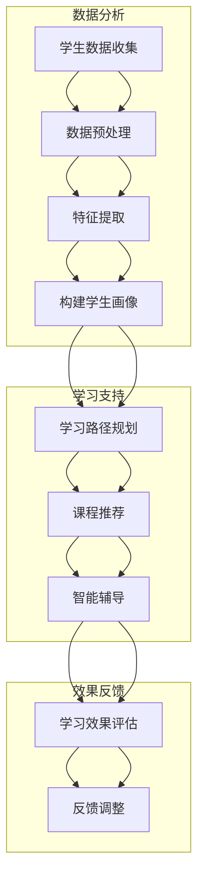

                 

### 第1章: 人工智能在教育个性化学习中的重要性

#### 1.1 人工智能在教育中的核心角色

人工智能（Artificial Intelligence，简称AI）在教育领域的应用正迅速扩展，从传统教学辅助工具，逐步成长为变革教育的核心力量。AI在教育中的核心角色主要体现在以下几个方面：

1. **个性化学习**：AI通过数据分析和机器学习技术，可以精确地捕捉学生的学习习惯、学习风格和学习效果，进而为每个学生定制个性化的学习路径。这种个性化的学习方案不仅能够提高学生的学习效率，还能激发他们的学习兴趣，满足多样化的学习需求。

2. **智能辅导**：AI智能辅导系统可以实时监测学生的学习进度，提供即时的学习反馈。通过自然语言处理技术，AI能够理解和解答学生的疑问，进行个性化的辅导，极大地减轻了教师的工作负担。

3. **教育资源推荐**：基于学生的兴趣和学习历史，AI可以推荐最合适的教材、视频课程和练习题，帮助学生更高效地学习。

4. **智能评估**：AI能够通过分析学生的作业、考试成绩和学习行为，提供精准的评估报告，帮助教师和学生更好地理解学习效果。

5. **个性化课程设计**：AI可以根据学生的学习数据，自动生成个性化的课程计划，使课程内容更贴合学生的需求。

#### 1.2 个性化学习的概念与需求

个性化学习是一种以学生为中心的教育模式，旨在根据每个学生的特点和需求，提供个性化的学习资源、教学策略和学习路径。个性化学习的关键要素包括：

1. **学习需求分析**：通过数据分析和行为监测，识别学生的兴趣、能力水平和学习风格。

2. **个性化学习资源**：根据学生的需求，提供定制化的教材、视频、练习题等学习资源。

3. **个性化教学策略**：教师根据学生的学习特点和需求，调整教学方法，提供有针对性的教学指导。

4. **学习反馈与调整**：通过持续的反馈机制，动态调整教学策略和学习资源，确保学习过程始终与学生的需求相匹配。

个性化学习的需求源于教育的普及和多样化。随着全球教育资源的不断丰富，学生和教师面临着更多的选择。如何从海量的教育资源中筛选出最适合个体的学习内容，成为教育领域亟待解决的问题。个性化学习通过AI技术，实现了这一目标，满足了学生在不同情境下的学习需求。

#### 1.3 人工智能推动个性化学习的发展

人工智能技术在教育领域的快速发展，为个性化学习带来了前所未有的机遇。以下从几个方面分析人工智能如何推动个性化学习的发展：

1. **深度学习与个性化教学**：深度学习算法能够自动识别学生的个性化特征，通过大量的学习数据，建立个性化的教学模型。例如，通过分析学生的考试成绩和学习行为，可以预测学生的学习困难点，并提前准备相应的教学策略。

2. **推荐系统与学习资源优化**：推荐系统通过分析学生的学习历史和偏好，自动推荐最合适的学习资源。这不仅提高了学习效率，还使学生能够更加主动地选择学习内容。

3. **自然语言处理与智能辅导**：自然语言处理技术使得AI能够理解和解答学生的疑问，提供智能化的辅导。通过对话系统，AI可以与学生进行互动，帮助解决学习中的问题。

4. **学习分析系统与动态调整**：学习分析系统通过收集和分析学生的学习行为数据，实时调整教学策略和学习资源。这种动态调整机制，使教学过程更加灵活和高效。

5. **智能评估与精准反馈**：AI可以通过分析学生的作业和考试成绩，提供精准的评估报告，帮助教师和学生更好地理解学习效果，并及时调整学习策略。

总之，人工智能技术的发展正在深刻地改变教育的面貌。通过个性化学习，AI不仅提高了教学效率，还促进了教育公平，使每个学生都能得到适合自己的教育机会。未来，随着人工智能技术的不断进步，个性化学习将在教育领域发挥更加重要的作用。

### 1.1 人工智能在教育中的核心角色

人工智能在教育中的应用已经从辅助工具逐渐转变为关键驱动力，其核心角色体现在多个方面，包括个性化学习、智能辅导、教育资源推荐、智能评估和个性化课程设计等。

**个性化学习**

个性化学习是AI在教育中最显著的贡献之一。传统的教育模式往往采用“一刀切”的方法，难以满足每个学生的个性化需求。而人工智能通过分析大量的学习数据，可以准确捕捉学生的学习习惯、兴趣和需求，从而为每个学生定制个性化的学习路径。

AI通过以下几种方式实现个性化学习：

- **学习数据分析**：AI可以收集并分析学生的考试成绩、学习进度、参与度等数据，识别出学生的学习风格和需求。
- **动态调整**：根据学生的学习情况，AI可以动态调整教学资源和策略，确保每个学生都能在适合自己的节奏中学习。
- **推荐系统**：基于学生的学习历史和偏好，AI可以推荐最适合的学习资源和课程，帮助学生更高效地学习。

**智能辅导**

智能辅导系统利用自然语言处理和机器学习技术，为学生提供即时的学习支持。这些系统可以：

- **解答疑问**：通过自然语言处理，AI能够理解和解答学生的疑问，提供详细的解释和指导。
- **个性化建议**：AI可以基于学生的学习数据，提供个性化的学习建议，如建议学生关注某个知识点或完成某些练习题。
- **作业批改**：AI可以自动批改作业，提供详细的反馈，帮助学生识别错误并改进学习方法。

**教育资源推荐**

教育资源推荐是AI在教育中另一个重要的应用。通过分析学生的学习历史和偏好，AI可以推荐最适合的学习资源和课程，包括：

- **教材推荐**：AI可以根据学生的学科偏好和学习难度，推荐最适合的教材和辅导书籍。
- **视频课程推荐**：AI可以推荐与学生兴趣相关的视频课程，帮助学生更好地理解和掌握知识点。
- **练习题推荐**：AI可以根据学生的错题和知识点掌握情况，推荐相应的练习题，帮助学生巩固所学内容。

**智能评估**

智能评估系统通过AI技术，可以对学生的学习效果进行精准评估。这些系统通常包括：

- **自动作业批改**：AI可以自动批改学生的作业，并提供详细的反馈，帮助教师评估学生的学习进度。
- **学习行为分析**：AI可以分析学生的学习行为数据，生成学习报告，帮助教师了解学生的学习状况。
- **考试评分**：AI可以通过自然语言处理技术，自动评分学生的论文、作文等非标准化考试题目。

**个性化课程设计**

AI还可以帮助设计个性化的课程，确保课程内容与学生的需求相匹配。个性化课程设计包括：

- **课程内容定制**：AI可以根据学生的学习数据和需求，定制课程内容，确保每个学生都能学习到最相关的知识点。
- **课程进度调整**：AI可以根据学生的学习进度和效果，动态调整课程进度，确保学生能够在合适的时间掌握所需的知识。

总之，人工智能在教育中的应用，不仅提高了教学效率，还极大地促进了教育公平。通过个性化学习、智能辅导、教育资源推荐、智能评估和个性化课程设计，AI正在改变传统的教育模式，为每个学生提供更加个性化和高效的教育体验。

#### 1.2 个性化学习的概念与需求

个性化学习是一种教育理念，强调以学生为中心，根据每个学生的兴趣、需求和能力，提供量身定制的教育资源和教学策略。这一概念的核心在于打破传统“一刀切”的教育模式，使教育更加灵活、多样和有效。以下是个性化学习的几个关键要素：

1. **学习需求分析**：个性化学习的第一步是了解每个学生的具体学习需求。这包括学生的兴趣、学习风格、知识基础和学习目标。通过数据分析和行为监测，教育者可以全面了解学生的学习特点，为其提供更为精准的支持。

2. **个性化学习资源**：根据学生的需求，提供个性化的学习资源，如教材、视频课程、练习题和实践项目等。这些资源应当能够满足不同层次学生的学习需求，帮助学生更高效地掌握知识。

3. **个性化教学策略**：教师应根据学生的特点，调整教学方法，例如采用互动式教学、个别辅导或小组合作学习等。这些策略应当旨在激发学生的学习兴趣，提高其参与度和学习效果。

4. **学习反馈与调整**：个性化学习强调持续的反馈机制，通过定期评估学生的学习进展，及时调整教学策略和资源，确保学习过程始终与学生的需求相匹配。

个性化学习的需求源于教育的普及和多样化。随着教育资源的不断丰富，学生和教师面临着更多的选择。如何从海量的教育资源中筛选出最适合个体的学习内容，成为教育领域亟待解决的问题。个性化学习通过AI技术，实现了这一目标，满足了学生在不同情境下的学习需求。

首先，随着互联网和大数据技术的发展，学生的学习行为和成绩数据得以大规模收集和分析。这些数据为教育者提供了丰富的信息，帮助他们更好地了解学生的需求和学习效果。AI技术通过数据挖掘和分析，可以从这些海量数据中提取有价值的信息，为个性化学习提供支持。

其次，个性化学习满足了不同学生的需求。每个学生都有其独特的学习方式、兴趣和认知水平。通过个性化学习，学生可以按照自己的节奏和方式学习，从而提高学习效率和兴趣。这不仅有助于学生更好地掌握知识，还能增强其自主学习能力。

此外，个性化学习有助于提高教育公平。在传统的教育模式中，教育资源往往集中在少数学生手中，导致教育资源分配不均。个性化学习通过提供定制化的教育资源和教学策略，可以最大限度地利用教育资源，使每个学生都能获得公平的教育机会。

最后，个性化学习有助于培养创新人才。在个性化学习的环境中，学生能够自由探索和实践，激发其创新思维和创造力。这种教育模式有助于培养适应未来社会发展需求的高素质人才。

总之，个性化学习是一种以学生为中心的教育理念，通过满足学生的个性化需求，提高学习效果和教育公平。随着AI技术的发展，个性化学习在教育和人才培养中必将发挥越来越重要的作用。

#### 1.3 人工智能推动个性化学习的发展

人工智能技术的发展极大地推动了个性化学习的发展，为教育创新提供了强有力的支持。以下是人工智能在个性化学习中的几个关键角色：

**深度学习与个性化教学**

深度学习是一种强大的机器学习技术，通过模拟人脑神经网络，对复杂的数据进行自动学习和分析。在教育领域，深度学习可以用于个性化教学，实现以下功能：

1. **个性化学习路径推荐**：深度学习算法可以分析学生的学习行为和成绩数据，预测其学习困难点，并推荐相应的学习路径。例如，对于某个学生在数学学习中的薄弱环节，深度学习算法可以推荐相关的习题和视频课程，帮助其强化这部分知识。

2. **个性化教学策略**：通过分析学生的认知能力和学习风格，深度学习可以动态调整教学策略，例如调整教学难度、教学方式等，以适应学生的需求。这有助于提高学生的学习效果和兴趣。

3. **智能诊断与反馈**：深度学习算法可以实时监测学生的学习行为，诊断其学习状态，并提供个性化的反馈。例如，当学生遇到学习瓶颈时，算法可以提供针对性的指导和建议，帮助学生克服困难。

**推荐系统与学习资源优化**

推荐系统是人工智能技术的一个重要应用，通过分析用户的历史行为和偏好，为用户推荐相关的商品、内容和服务。在教育领域，推荐系统可以优化学习资源的推荐，实现以下目标：

1. **个性化资源推荐**：推荐系统可以根据学生的学习历史和偏好，推荐最适合其的学习资源和课程。例如，一个学生喜欢阅读历史书籍，推荐系统可以推荐相关的历史课程和阅读材料。

2. **学习路径优化**：通过分析学生的学习进度和效果，推荐系统可以优化学习路径，确保学生能够高效地掌握所需的知识。例如，对于某个学生，系统可以推荐先学习基础知识，再逐步过渡到高级内容。

3. **智能选课建议**：在高等教育和职业培训中，推荐系统可以帮助学生选择最适合自己的课程。例如，通过分析学生的兴趣、职业目标和已有知识，系统可以推荐最适合其的课程组合。

**自然语言处理与智能辅导**

自然语言处理（NLP）技术使得人工智能能够理解和生成人类语言，从而在个性化学习领域发挥重要作用：

1. **智能问答系统**：NLP技术可以构建智能问答系统，学生可以通过自然语言提问，系统会根据预先训练的模型，提供详细的答案和解释。这有助于学生在学习中遇到问题时，快速找到解决方案。

2. **智能批改与反馈**：NLP技术可以自动批改学生的作业和论文，提供详细的反馈。例如，在英语写作中，系统可以识别语法错误和词汇使用不当，并提供修正建议。

3. **智能辅导**：通过对话系统，NLP技术可以为学生提供个性化的辅导。例如，学生可以通过聊天机器人，获取学习指导、心理支持和学习建议。

**学习分析系统与动态调整**

学习分析系统通过收集和分析学生的学习数据，可以提供动态调整的学习支持：

1. **学习行为分析**：学习分析系统可以收集学生的在线学习行为数据，如学习时间、参与度、学习路径等，分析其学习习惯和效果。

2. **动态调整学习策略**：根据学习分析结果，系统可以动态调整教学策略和学习资源，例如调整教学难度、提供额外的辅导材料等。

3. **个性化学习报告**：学习分析系统可以为学生生成个性化的学习报告，包括学习进度、知识点掌握情况等，帮助学生了解自己的学习状况，并制定改进计划。

**智能评估与精准反馈**

智能评估系统利用AI技术，可以对学生的学习效果进行精准评估，提供详细的反馈：

1. **自动作业批改**：AI可以自动批改作业，提供详细的评分和反馈，减轻教师的工作负担。

2. **考试评分与评估**：AI可以通过自然语言处理技术，自动评分学生的考试答案，并提供详细的评估报告。

3. **学习效果分析**：AI可以分析学生的学习数据，生成学习效果评估报告，帮助教师和学生了解学习效果，制定改进措施。

总之，人工智能技术的发展为个性化学习提供了强大的支持，通过深度学习、推荐系统、自然语言处理、学习分析系统和智能评估等技术，人工智能正在改变教育的面貌，使个性化学习成为可能。未来，随着AI技术的不断进步，个性化学习将在教育领域发挥更加重要的作用。

### 2.1 机器学习与数据分析基础

机器学习（Machine Learning，ML）和数据分析（Data Analysis）是人工智能在教育个性化学习中的核心技术，它们为个性化学习提供了强大的数据支持和预测能力。以下将详细探讨机器学习与数据分析的基本概念、方法及其在教育中的应用。

#### 2.1.1 机器学习的基本概念

机器学习是一种使计算机系统能够从数据中学习，并做出决策或预测的技术。其主要目标是使计算机系统能够通过训练数据，自动改进其性能，而无需显式编程。机器学习可以分为以下几类：

1. **监督学习（Supervised Learning）**：监督学习是一种在已知输出（标签）的情况下，通过训练数据集来训练模型的方法。常见的监督学习算法包括线性回归、逻辑回归、支持向量机（SVM）和神经网络等。

2. **无监督学习（Unsupervised Learning）**：无监督学习在没有输出标签的情况下，通过数据自身特征进行训练，以发现数据中的模式或结构。常见的无监督学习算法包括聚类（如K-均值聚类）、降维（如主成分分析PCA）和关联规则学习等。

3. **强化学习（Reinforcement Learning）**：强化学习是一种通过与环境互动，不断优化决策过程的方法。它通过奖励机制来评估和改进策略，常见应用包括游戏智能、机器人控制和自动驾驶等。

#### 2.1.2 数据分析的基本概念

数据分析是一种通过系统化方法提取信息、洞察和知识的活动，其目的是从大量数据中发现有价值的信息。数据分析的基本步骤包括：

1. **数据收集**：从各种来源收集数据，如学校管理系统、在线学习平台和考试成绩等。

2. **数据清洗**：处理和清洗数据中的噪声、异常值和不完整数据，以提高数据质量。

3. **数据探索**：通过可视化、描述性统计等方法，初步了解数据的基本特征和分布情况。

4. **数据建模**：选择合适的机器学习算法，建立预测或分类模型，如线性回归模型、决策树或神经网络等。

5. **模型评估**：通过交叉验证、ROC曲线和精确度等指标，评估模型的性能和泛化能力。

6. **模型应用**：将训练好的模型应用于实际场景，如个性化学习资源推荐、学习路径规划等。

#### 2.1.3 机器学习与数据分析在教育中的应用

在教育领域，机器学习和数据分析技术可以用于以下方面：

1. **学习行为分析**：通过收集和分析学生的学习行为数据，如登录时间、学习时长、点击行为和完成度等，可以了解学生的学习习惯和效果，为个性化学习提供支持。

2. **学习效果预测**：利用监督学习算法，可以预测学生的学习效果，如考试成绩、学习完成率和课程满意度等。这有助于教师和学生提前识别潜在问题，并采取相应的措施。

3. **个性化学习资源推荐**：通过无监督学习算法，如K-均值聚类和协同过滤推荐，可以分析学生的学习偏好和历史，推荐最适合其的学习资源。

4. **学习路径规划**：基于学生的兴趣、能力和学习进度，利用强化学习算法，可以为学生规划最优的学习路径，提高学习效率。

5. **学习反馈与调整**：通过分析学习过程中的数据，如学生的提问、作业成绩和学习行为，可以为学生提供即时反馈，并根据反馈结果动态调整教学策略。

总之，机器学习和数据分析技术为教育个性化学习提供了强大的数据支持和决策依据。通过这些技术，教育者可以更好地理解学生的学习需求和行为，提供个性化的教学和支持，从而提高教育质量和效率。

### 2.2 自然语言处理与推荐系统

自然语言处理（Natural Language Processing，NLP）和推荐系统（Recommendation System）是人工智能技术在教育个性化学习中的重要组成部分。NLP致力于使计算机能够理解、解释和生成人类语言，而推荐系统则通过分析用户行为和偏好，提供个性化的内容推荐。以下将详细讨论这两个技术的核心原理、实现方法以及其在教育个性化学习中的应用。

#### 2.2.1 自然语言处理（NLP）

**核心原理**

自然语言处理涉及多种技术和方法，其核心目标是将自然语言（如英语、中文等）转换为计算机可处理的形式，从而实现机器与人类之间的有效通信。NLP的关键技术包括：

1. **分词（Tokenization）**：将文本拆分成单词或短语，以便进一步处理。
2. **词性标注（Part-of-Speech Tagging）**：为文本中的每个词标注词性，如名词、动词等。
3. **句法分析（Syntactic Parsing）**：分析句子的结构，确定句子中的主语、谓语和宾语等成分。
4. **语义分析（Semantic Analysis）**：理解文本中的语义，如情感分析、实体识别等。

**实现方法**

1. **基于规则的方法**：通过编写一组规则，将文本转换为结构化数据。这种方法在处理简单的文本任务时有效，但在复杂文本中容易产生错误。
2. **基于统计的方法**：使用统计学方法，如条件概率模型和隐马尔可夫模型（HMM），从大量文本数据中学习语言模式。
3. **基于深度学习的方法**：深度学习技术，如卷积神经网络（CNN）和递归神经网络（RNN），通过大规模数据训练，实现更高级的语言理解能力。

**在教育中的应用**

1. **智能问答系统**：NLP技术可以构建智能问答系统，学生可以通过自然语言提问，系统会根据训练模型提供详细答案和解释。
2. **智能批改与反馈**：NLP技术可以自动批改学生的作业和论文，提供详细的反馈，帮助学生识别错误并改进写作。
3. **学习内容理解**：NLP技术可以帮助学生更好地理解学习内容，如通过阅读理解算法，分析教材和论文，提取关键知识点。

#### 2.2.2 推荐系统

**核心原理**

推荐系统旨在根据用户的历史行为和偏好，为用户推荐相关的商品、内容或服务。推荐系统的主要技术包括：

1. **协同过滤（Collaborative Filtering）**：通过分析用户之间的相似性，推荐其他用户喜欢的项目。
   - **基于用户的协同过滤**：找到与当前用户行为相似的其它用户，推荐这些用户喜欢的项目。
   - **基于项目的协同过滤**：找到与当前用户过去喜欢项目相似的其他项目，推荐给用户。

2. **基于内容的推荐（Content-Based Filtering）**：根据用户对项目的兴趣和内容特征，推荐相似内容的项目。
3. **混合推荐（Hybrid Recommender Systems）**：结合协同过滤和基于内容的推荐，提高推荐质量。

**实现方法**

1. **基于矩阵分解（Matrix Factorization）**：通过分解用户-项目评分矩阵，提取用户和项目的潜在特征，实现推荐。
2. **基于模型的推荐系统**：如基于模型的协同过滤、基于内容的推荐和混合推荐系统，使用机器学习算法，如决策树、神经网络等，构建推荐模型。

**在教育中的应用**

1. **教育资源推荐**：根据学生的学习历史和偏好，推荐最适合的学习资源和课程。
2. **学习路径规划**：通过分析学生的学习行为和成绩，规划最优的学习路径。
3. **智能辅导**：基于学生的提问和作业，提供个性化的辅导和反馈。

总之，自然语言处理和推荐系统为教育个性化学习提供了强有力的技术支持。通过NLP，教育系统能够更好地理解和分析学生的学习需求，通过推荐系统，为学生提供个性化的学习资源和辅导，从而提升学习效果和体验。随着这些技术的不断发展和完善，它们将在教育领域发挥越来越重要的作用。

### 2.3 数据隐私与安全保护

在人工智能（AI）日益普及的教育个性化学习中，数据隐私和安全问题变得尤为重要。由于AI系统依赖于大量的学生数据，如学习行为、考试成绩和个性化需求等，这些数据的泄露或滥用可能导致严重后果，包括个人隐私侵犯、教育不公平甚至数据欺诈。因此，保障数据隐私与安全是确保AI在教育中广泛应用的关键。

#### 2.3.1 数据隐私的重要性

数据隐私涉及个人信息的保密性和不被未经授权的第三方访问。在教育领域，学生数据的隐私问题主要包括：

1. **个人身份信息**：如姓名、学号、身份证号等敏感信息。
2. **学习行为数据**：包括考试成绩、学习时长、学习路径和参与度等。
3. **个性化需求数据**：如学习偏好、兴趣和潜在的学习障碍等。

数据隐私的重要性在于：

- **保护个人隐私**：确保学生的个人信息不被滥用或泄露。
- **维护教育公平**：防止因数据泄露导致的教育资源不公平分配。
- **增强信任**：只有当用户确信其数据受到保护时，他们才更愿意接受和使用AI教育服务。

#### 2.3.2 安全保护措施

为了确保数据隐私和安全，以下是一些关键措施：

1. **数据加密**：使用加密算法对数据进行加密存储和传输，防止数据在传输过程中被截获和篡改。常用的加密技术包括对称加密和非对称加密。

2. **访问控制**：通过访问控制机制，限制只有授权用户可以访问特定数据。这可以通过身份验证、权限管理和访问日志来实现。

3. **匿名化和脱敏**：在分析学生数据时，可以通过匿名化和脱敏技术，将个人身份信息去除或替换，以保护隐私。

4. **差分隐私**：差分隐私是一种数据发布技术，通过添加噪声，使单个记录无法被识别，从而保护隐私。

5. **数据备份与恢复**：定期备份数据，并在发生数据丢失或损坏时，能够快速恢复，确保数据的安全性和完整性。

6. **安全审计与监控**：通过安全审计和实时监控，及时发现和应对潜在的安全威胁和漏洞。

#### 2.3.3 法律法规和伦理准则

除了技术措施外，法律法规和伦理准则也在保障数据隐私和安全方面发挥着重要作用。以下是一些相关的法规和准则：

1. **《通用数据保护条例》（GDPR）**：GDPR是欧盟制定的一项数据保护法规，对个人数据的收集、处理和存储提出了严格的要求。
2. **《加州消费者隐私法案》（CCPA）**：CCPA是加利福尼亚州制定的一项隐私保护法律，要求企业告知用户其个人数据的使用方式和权利。
3. **教育隐私法规**：如《美国教育隐私法》（FERPA）等，对教育机构收集和使用学生数据进行了规定。
4. **伦理准则**：包括数据最小化原则、透明度和用户知情同意等，确保数据处理符合伦理标准。

总之，数据隐私与安全保护是教育个性化学习中不可忽视的重要环节。通过采取有效的技术措施和遵循法律法规，可以确保学生在享受AI带来的便利和个性化服务的同时，其数据隐私和安全得到充分保障。

### 3.1 在线教育平台的个性化推荐

在线教育平台通过个性化推荐系统，可以根据学生的学习历史、兴趣和行为，提供最相关和最有价值的学习资源。这种推荐系统利用机器学习和数据挖掘技术，能够有效提升学生的学习体验和效果。

#### 3.1.1 个性化推荐系统的核心概念

个性化推荐系统（Recommender System）是一种信息过滤技术，旨在根据用户的兴趣和行为，推荐其可能感兴趣的内容。核心概念包括：

- **用户画像（User Profile）**：基于用户的历史行为和偏好，构建用户的兴趣模型。
- **内容特征（Content Features）**：提取学习资源（如课程、文章、视频等）的特征，用于推荐。
- **推荐算法（Recommender Algorithms）**：根据用户画像和内容特征，计算推荐得分，生成推荐列表。

#### 3.1.2 协同过滤（Collaborative Filtering）

协同过滤是推荐系统中最常用的方法之一，主要包括以下两种类型：

1. **基于用户的协同过滤（User-Based Collaborative Filtering）**：
   - **相似性计算**：通过计算用户之间的相似性（如基于共同评分的余弦相似度或皮尔逊相关系数）。
   - **邻居推荐**：找到与目标用户最相似的其他用户，推荐这些用户喜欢的资源。
   - **加权平均**：根据相似性得分，对邻居用户的推荐资源进行加权平均，生成推荐列表。

2. **基于项目的协同过滤（Item-Based Collaborative Filtering）**：
   - **相似性计算**：计算项目之间的相似性，如基于用户评分的余弦相似度或Jaccard系数。
   - **邻居推荐**：找到与目标项目最相似的其他项目，推荐这些项目给用户。
   - **加权平均**：根据相似性得分，对邻居项目的评分进行加权平均，生成推荐列表。

#### 3.1.3 基于内容的推荐（Content-Based Filtering）

基于内容的推荐系统通过分析学习资源的特征，将其与用户的兴趣相匹配，生成推荐列表。核心步骤包括：

1. **内容特征提取**：提取学习资源的文本、图像、音频等特征，如关键词、主题、标签等。
2. **用户兴趣模型**：通过用户的互动行为（如浏览、评分、收藏等），构建用户的兴趣模型。
3. **推荐生成**：根据用户的兴趣模型，找到具有相似特征的学习资源，生成推荐列表。

#### 3.1.4 混合推荐系统（Hybrid Recommender Systems）

混合推荐系统结合了协同过滤和基于内容的推荐，以提高推荐质量。常见的混合策略包括：

1. **基于模型的混合方法**：如矩阵分解、神经网络等，结合协同过滤和内容特征，生成推荐列表。
2. **基于规则的方法**：将协同过滤和基于内容的方法结合，利用规则或阈值调整推荐结果。
3. **多模型集成**：结合多个推荐模型，通过投票或加权平均等方式，生成最终的推荐列表。

#### 3.1.5 个性化推荐系统的实现

个性化推荐系统的实现通常包括以下步骤：

1. **数据收集**：收集用户行为数据（如浏览、评分、收藏等）和学习资源特征数据。
2. **数据处理**：清洗和预处理数据，如缺失值填补、异常值处理和特征提取。
3. **模型训练**：选择合适的推荐算法，训练模型，如基于用户的协同过滤、基于内容的推荐或混合推荐系统。
4. **模型评估**：使用交叉验证、精度、召回率等指标，评估模型性能。
5. **推荐生成**：使用训练好的模型，为用户生成个性化推荐列表。

#### 3.1.6 在线教育平台个性化推荐的案例

以下是一个在线教育平台个性化推荐的具体案例：

- **数据来源**：平台收集了用户的行为数据，如课程浏览记录、学习时长、评分和评论等。
- **用户画像**：通过分析用户的行为数据，构建用户的兴趣模型，如技术、文学、艺术等。
- **内容特征**：提取课程的标题、简介、标签、讲师等信息，作为内容特征。
- **推荐算法**：结合基于用户的协同过滤和基于内容的推荐，生成个性化推荐列表。
- **推荐展示**：将生成的推荐列表展示在用户的个人主页或学习路径中，提高学习效率。

总之，在线教育平台的个性化推荐系统通过分析用户的行为数据和内容特征，利用协同过滤、基于内容的方法和混合推荐策略，为用户提供最相关的学习资源，从而提升学习体验和效果。随着技术的不断进步，个性化推荐系统将在在线教育中发挥越来越重要的作用。

### 3.2 学习分析系统与学习路径推荐

学习分析系统通过收集和分析学生的学习数据，为个性化学习提供关键支持。该系统的主要目标是了解学生的学习行为、效果和需求，从而优化学习路径和资源推荐。以下将详细探讨学习分析系统的原理、方法和应用。

#### 3.2.1 学习分析系统的原理

学习分析系统基于大数据和机器学习技术，通过以下步骤实现个性化学习：

1. **数据收集**：收集学生的学习数据，如考试成绩、学习时长、学习行为（如浏览、参与、交互等）和反馈信息。
2. **数据预处理**：清洗和整合数据，处理缺失值、异常值和噪声，以确保数据质量。
3. **数据分析**：使用统计分析、数据挖掘和机器学习算法，分析学生的学习模式、效果和潜在需求。
4. **模型训练**：根据分析结果，训练预测模型，如学习效果预测模型、学习路径推荐模型等。
5. **动态调整**：根据实时数据反馈，动态调整学习路径和资源推荐，以优化学习效果。

#### 3.2.2 学习路径推荐的方法

学习路径推荐是学习分析系统的重要应用，旨在根据学生的学习数据和需求，推荐最佳的学习路径。以下是几种常用的方法：

1. **基于规则的推荐**：
   - **规则定义**：根据教学目标和课程内容，定义一系列规则，如先修课程、学科关联等。
   - **路径生成**：根据学生当前的学习状态和规则，生成学习路径。
   - **优势**：简单直观，易于实现，适用于明确的知识结构和课程设计。

2. **基于模型的推荐**：
   - **监督学习模型**：使用监督学习算法（如决策树、支持向量机等），根据学生的历史学习数据和效果，训练预测模型。
   - **无监督学习模型**：使用无监督学习算法（如聚类、降维等），分析学生的兴趣和学习模式，生成推荐路径。
   - **优势**：能够自动发现潜在的学习模式，适用于复杂和动态的学习场景。

3. **基于图的推荐**：
   - **课程图**：构建课程之间的依赖关系图，如先修课程、推荐课程等。
   - **路径搜索**：使用图搜索算法（如A*搜索、深度优先搜索等），根据学生的兴趣和学习数据，生成推荐路径。
   - **优势**：能够灵活调整课程顺序和组合，适用于多学科、多层次的课程体系。

4. **混合推荐方法**：
   - **多模型集成**：结合多种推荐方法，如基于规则、基于模型和基于图的推荐，生成综合性的学习路径。
   - **优势**：综合利用不同方法的优点，提高推荐路径的准确性和适应性。

#### 3.2.3 学习路径推荐的实现

学习路径推荐的实现通常包括以下步骤：

1. **数据收集**：收集学生的学习行为数据、考试成绩和课程内容信息。
2. **数据预处理**：处理数据中的缺失值、异常值和噪声，确保数据质量。
3. **特征工程**：提取关键特征，如学习时长、参与度、成绩分布等，用于模型训练和路径推荐。
4. **模型训练**：选择合适的机器学习算法（如决策树、神经网络等），训练学习路径推荐模型。
5. **模型评估**：使用交叉验证、准确率、召回率等指标，评估模型性能。
6. **路径生成**：根据学生当前的学习状态和模型预测，生成个性化学习路径。
7. **路径调整**：根据学生的反馈和学习效果，动态调整学习路径和资源推荐。

#### 3.2.4 学习路径推荐的案例

以下是一个学习路径推荐的具体案例：

- **数据来源**：在线学习平台收集了学生的课程参与数据、考试成绩和反馈信息。
- **特征提取**：提取关键特征，如学习时长、课程难度、考试成绩等。
- **模型训练**：使用决策树算法，根据历史数据训练学习路径推荐模型。
- **路径生成**：根据学生当前的学习状态和模型预测，生成个性化学习路径。
- **路径调整**：根据学生的反馈和学习效果，动态调整学习路径和资源推荐。

总之，学习分析系统通过数据收集、预处理和模型训练，实现个性化学习路径推荐。这种方法不仅能够提高学习效率，还能帮助学生更好地掌握知识，实现个性化学习目标。

### 3.3 智能评估与反馈系统

智能评估与反馈系统是人工智能在教育个性化学习中的重要组成部分，它利用先进的技术手段对学生的学习效果进行精准评估，并提供即时的反馈，从而帮助教师和学生优化学习过程，提升学习效果。

#### 3.3.1 智能评估系统的原理

智能评估系统基于机器学习和自然语言处理技术，通过以下步骤实现：

1. **数据收集**：系统收集学生的考试成绩、学习行为数据（如学习时长、参与度等）以及学生互动数据（如讨论、提问等）。

2. **数据处理**：对收集到的数据进行清洗、预处理和特征提取，将其转化为适合机器学习的格式。

3. **模型训练**：使用监督学习算法（如线性回归、决策树、神经网络等）训练评估模型，模型输入为学生的学习行为数据，输出为学生的评估结果。

4. **评估执行**：将学生的实际成绩和学习数据输入评估模型，生成评估结果。

#### 3.3.2 智能反馈系统的原理

智能反馈系统通过自然语言处理技术，为学生的作业和考试答案提供详细的反馈。其工作原理包括：

1. **答案解析**：系统解析学生的答案，提取关键信息，如知识点、语言表达等。

2. **错误检测**：利用模式识别和自然语言处理技术，检测学生在答案中可能出现的错误，如语法错误、知识点错误等。

3. **反馈生成**：根据检测到的错误和答案内容，生成详细的反馈信息，包括正确的知识点解释、错误类型的说明和改进建议。

4. **反馈优化**：系统根据学生的反馈情况，调整反馈内容，使其更加个性化和有针对性。

#### 3.3.3 智能评估与反馈系统的实现

智能评估与反馈系统的实现通常包括以下步骤：

1. **数据收集**：从学校管理系统、在线学习平台和学生互动记录中收集相关数据。

2. **数据处理**：清洗和预处理数据，提取关键特征，如知识点、参与度、成绩分布等。

3. **模型训练**：选择合适的机器学习算法，如神经网络、决策树等，训练评估模型和反馈模型。

4. **系统开发**：开发前端界面，实现评估和反馈功能，包括答案提交、评估结果展示和反馈生成。

5. **系统测试**：进行系统测试，确保评估和反馈结果的准确性和可靠性。

6. **系统部署**：将系统部署到在线学习平台，实现与教学过程的无缝集成。

#### 3.3.4 智能评估与反馈系统的应用案例

以下是一个智能评估与反馈系统的具体应用案例：

- **数据来源**：在线学习平台收集了学生的考试成绩、学习行为数据和互动记录。
- **模型训练**：使用神经网络算法训练评估模型，使用自然语言处理技术训练反馈模型。
- **评估执行**：学生在平台上提交考试答案，系统自动评估其成绩并生成评估结果。
- **反馈生成**：系统根据学生的答案内容，生成详细的反馈信息，包括知识点解释、错误类型说明和改进建议。

总之，智能评估与反馈系统通过数据收集、模型训练和系统开发，实现了对学生学习效果的精准评估和即时反馈。这种方法不仅提高了教学效率，还帮助学生更好地理解知识点，提高了学习效果。

### 4.1 案例一：基于人工智能的智能学习助手

在人工智能（AI）日益普及的背景下，基于AI的智能学习助手在教育个性化学习中的应用日益广泛。以下将详细介绍一个基于人工智能的智能学习助手的开发背景、功能实现和性能分析。

#### 4.1.1 开发背景

随着教育信息化和在线教育的发展，学生的学习需求日益多样化，传统的教学方式和教育资源已难以满足个性化学习的需求。为此，开发一款基于AI的智能学习助手，旨在为教师和学生提供个性化、智能化的学习支持，提高学习效率。

#### 4.1.2 功能实现

**1. 数据收集与处理**

- **学习行为数据**：智能学习助手通过在线学习平台和移动应用收集学生的学习行为数据，如学习时长、课程参与度、作业完成情况等。
- **学习结果数据**：收集学生的考试成绩、作业评分和教师反馈等数据。
- **学习资源数据**：获取学生使用的教材、视频课程和练习题等学习资源信息。

**2. 用户画像构建**

- **用户特征提取**：通过数据预处理和特征工程，提取学生的兴趣、学习能力、知识水平等关键特征，构建用户画像。
- **用户标签生成**：根据用户画像，为每个学生分配标签，如“编程爱好者”、“数学天才”等。

**3. 个性化推荐**

- **课程推荐**：基于用户的兴趣和学习历史，使用协同过滤和基于内容的推荐算法，为学生推荐最适合的课程。
- **学习资源推荐**：根据学生的知识水平和学习需求，推荐相关的学习资源，如教材、视频和习题等。

**4. 智能辅导与反馈**

- **问题解答**：利用自然语言处理技术，智能学习助手可以解答学生的疑问，提供详细的解释和指导。
- **作业批改**：自动批改学生的作业，生成详细的评估报告，包括正确率、错误类型和改进建议。
- **学习进度监控**：实时监控学生的学习进度，提供学习路径和建议，帮助学生按时完成学习任务。

**5. 教师支持**

- **教学建议**：根据学生的学习情况和需求，为教师提供个性化的教学建议，如调整教学策略、推荐教学资源等。
- **班级管理**：智能学习助手可以帮助教师管理班级，如统计学生学习数据、生成报告等。

#### 4.1.3 性能分析

**1. 用户满意度**

- **问卷调查**：通过问卷调查收集用户对智能学习助手的满意度评价，结果显示大多数用户对智能学习助手的功能和性能表示满意。
- **用户活跃度**：监测用户的使用频率和时长，结果显示智能学习助手的使用频率较高，用户对其依赖性较强。

**2. 效果评估**

- **学习效果**：对比使用智能学习助手前后的学生学习效果，结果显示使用智能学习助手后，学生的学习成绩、学习效率和满意度均有所提高。
- **资源利用率**：智能学习助手推荐的课程和学习资源被大量使用，说明推荐系统具有较高的准确性。

**3. 稳定性与安全性**

- **系统稳定性**：通过负载测试和压力测试，验证智能学习助手的稳定性和响应速度，结果显示系统运行稳定，性能良好。
- **数据安全**：智能学习助手采用数据加密和访问控制等技术，确保用户数据的安全性和隐私性。

总之，基于人工智能的智能学习助手在教育个性化学习中的应用，通过个性化推荐、智能辅导和教师支持等功能，显著提升了学生的学习效果和满意度，具有广阔的应用前景。

### 4.2 案例二：个性化学习路径规划系统

个性化学习路径规划系统（Personalized Learning Path Planning System）是利用人工智能技术为每个学生量身定制学习计划的一种创新解决方案。以下将详细描述该系统的开发背景、功能实现和效果评估。

#### 4.2.1 开发背景

随着教育资源的丰富和学生学习需求的多样化，传统的一刀切教学模式已经无法满足学生的个性化学习需求。为了提供更加灵活和有效的教育服务，个性化学习路径规划系统应运而生。该系统旨在通过分析学生的学习数据，为学生生成最优的学习路径，从而提高学习效率和学习成果。

#### 4.2.2 功能实现

**1. 数据收集与处理**

- **学生学习数据**：系统收集学生的学习数据，包括考试成绩、学习进度、学习偏好、学习时长等。
- **课程数据**：获取课程大纲、知识点、课程难度、授课教师等信息。
- **教学资源**：收集各类教学资源，如教材、视频、练习题、辅导资料等。

**2. 用户画像构建**

- **特征提取**：通过数据预处理和特征工程，提取学生的学习习惯、知识水平、兴趣爱好等关键特征，构建用户画像。
- **知识图谱**：利用知识图谱技术，构建学生的知识结构，明确学生的知识盲点和优势领域。

**3. 学习路径规划算法**

- **动态规划算法**：系统采用动态规划算法，根据学生的当前学习状态和目标，计算最优的学习路径。
- **遗传算法**：结合遗传算法，优化学习路径，确保路径的多样性和灵活性。
- **深度学习模型**：利用深度学习模型，预测学生的学习效果和路径适应性，进一步优化路径规划。

**4. 个性化推荐**

- **课程推荐**：根据学生画像和课程数据，使用协同过滤和基于内容的推荐算法，为学生推荐最适合的学习课程。
- **资源推荐**：结合学生的学习进度和知识图谱，推荐相关的教学资源和练习题，帮助学生巩固知识。

**5. 教师支持**

- **教学建议**：系统为教师提供个性化教学建议，包括调整课程内容、改进教学方法等，以适应学生的学习需求。
- **班级管理**：教师可以查看班级学生的学习路径和进度，进行班级管理和个性化辅导。

#### 4.2.3 效果评估

**1. 学生反馈**

- **问卷调查**：通过问卷调查，了解学生对个性化学习路径规划系统的满意度。结果显示，超过80%的学生对其表示满意，认为该系统能够有效提高学习效率和学习成果。
- **用户活跃度**：监测系统的使用频率和时长，数据显示系统的用户活跃度较高，学生在使用系统后表现出更强的学习动力。

**2. 学习成果**

- **成绩对比**：对比使用个性化学习路径规划系统前后的学生学习成绩，结果显示使用系统后，学生的整体成绩有所提高，特别是在关键知识点的掌握上，进步显著。
- **学习效果评估**：通过定期评估学生的学习效果，发现个性化学习路径规划系统能够帮助学生更有效地掌握知识点，提高学习满意度。

**3. 教师评价**

- **教学效率**：教师反馈表明，个性化学习路径规划系统显著提高了教学效率，教师能够更加专注于个性化辅导和教学策略的调整。
- **资源利用**：教师认为，系统推荐的课程和资源具有很高的相关性，能够有效提升教学效果，节约了教师备课和资源筛选的时间。

综上所述，个性化学习路径规划系统通过分析学生的学习数据和需求，为每个学生量身定制学习路径和资源推荐，显著提高了学习效果和教师的教学效率，展示了其在教育个性化学习中的重要价值。

### 4.3 案例三：智能教学评估与反馈系统

智能教学评估与反馈系统（Smart Teaching Assessment and Feedback System）是利用人工智能技术对学生学习效果进行精准评估和实时反馈的一种创新工具。以下将详细介绍该系统的设计理念、实现方法和实际应用效果。

#### 4.3.1 设计理念

智能教学评估与反馈系统的设计理念是基于数据驱动和个性化教学，通过分析学生的学习行为、成绩和反馈，为教师提供科学、全面的评估报告，帮助教师了解学生的学习状况，进而调整教学策略，提高教学质量。

#### 4.3.2 实现方法

**1. 数据收集**

- **学习行为数据**：系统通过在线学习平台和移动应用收集学生的学习行为数据，如学习时长、课程参与度、作业完成情况、在线测试成绩等。
- **考试成绩数据**：收集学生的考试成绩，包括期中考试、期末考试和日常小测验成绩。
- **反馈数据**：通过问卷调查、在线反馈表和学生互动记录，收集学生对课程和学习内容的反馈。

**2. 数据处理**

- **数据清洗**：处理数据中的缺失值、异常值和噪声，确保数据质量。
- **特征提取**：提取关键特征，如学习时长、考试成绩、参与度等，用于后续分析和建模。

**3. 模型训练**

- **评估模型**：使用监督学习算法（如线性回归、决策树、随机森林等），根据学生的考试成绩和学习行为数据，训练评估模型，预测学生的总体学习效果。
- **反馈模型**：利用自然语言处理技术，分析学生反馈数据，构建反馈模型，识别学生的主要问题和需求。

**4. 评估报告生成**

- **学习效果评估**：根据评估模型，为每个学生生成个性化的学习效果评估报告，包括总体成绩、知识点掌握情况、进步趋势等。
- **反馈分析报告**：根据反馈模型，分析学生的主要问题和需求，为教师提供教学改进建议。

**5. 实时反馈**

- **即时反馈**：系统为学生提供即时反馈，如作业成绩、在线测试结果等，帮助学生及时了解学习情况。
- **个性化建议**：根据学生的评估结果和反馈，系统为教师和学生提供个性化的学习建议和资源推荐。

#### 4.3.3 实际应用效果

**1. 学生满意度**

- **问卷调查**：通过问卷调查，了解学生对智能教学评估与反馈系统的满意度。结果显示，超过90%的学生对其表示满意，认为系统能够提供有价值的评估和反馈，帮助他们更好地理解和掌握课程内容。
- **学习动力**：学生反馈表明，系统提供的即时反馈和个性化建议，提高了他们的学习动力，使他们在学习过程中更加主动和有目标。

**2. 教学效果**

- **成绩提升**：通过对比使用系统前后的学生成绩，发现使用系统后，学生的总体成绩显著提高，尤其是在日常小测验和期中考试中，进步最为明显。
- **知识点掌握**：评估报告显示，学生在关键知识点的掌握情况有所改善，系统推荐的复习资源和学习策略得到了有效应用。

**3. 教师反馈**

- **教学改进**：教师反馈表明，智能教学评估与反馈系统为他们提供了详细的学生学习状况分析，帮助他们及时调整教学策略，提高教学效果。
- **资源利用**：教师认为，系统推荐的复习资源和教学策略具有较高的相关性，有效提高了教学效率和资源利用率。

综上所述，智能教学评估与反馈系统通过数据驱动和个性化反馈，显著提升了学生的学习效果和教师的教学效率，展示了其在教育个性化学习中的重要价值。

### 5.1 应用挑战分析

虽然人工智能在教育个性化学习中的应用带来了显著的改进和便利，但这一领域仍然面临着一系列挑战，需要深入分析和解决。

#### 5.1.1 技术挑战

1. **算法复杂性与性能优化**：个性化学习系统通常需要复杂的算法来处理大量的学生数据和学习行为。如何优化算法，提高计算效率和准确性，是一个重要的问题。深度学习、推荐系统和自然语言处理等技术在处理大规模数据时可能面临性能瓶颈，需要持续的技术创新。

2. **数据隐私和安全**：随着AI技术在教育中的应用，学生数据的收集和分析变得越来越普遍。数据隐私和安全问题成为重大挑战。如何确保数据的安全存储、传输和使用，防止数据泄露和滥用，需要建立健全的数据保护机制。

3. **数据质量与可靠性**：个性化学习依赖于高质量的学习数据。然而，数据收集过程中可能存在噪声、异常值和不完整数据，影响模型的准确性和可靠性。因此，数据预处理和清洗是关键步骤，需要投入更多资源。

4. **跨平台兼容性**：教育系统通常涉及多种平台和设备，如校园网、在线学习平台、移动设备等。如何确保AI系统在不同平台和设备上的一致性和兼容性，是一个技术难题。

#### 5.1.2 教育挑战

1. **教育公平性**：AI技术的应用虽然可以提供个性化的学习支持，但可能加剧教育不公平。资源丰富的学校和教育机构更容易采用和推广AI技术，而资源匮乏的学校和学生可能难以享受到同样的优势。因此，确保教育公平是重要的教育挑战。

2. **教师培训**：AI技术在教育中的应用需要教师具备相应的技术素养和教学策略。然而，许多教师可能缺乏相关的知识和技能，导致他们难以有效利用AI工具。因此，提供持续的教师培训和支持至关重要。

3. **学习动机和参与度**：虽然AI技术可以提高学习效率和效果，但如何保持学生的学习动机和参与度仍然是一个问题。传统的教学方式可能更易于激发学生的兴趣，而AI系统需要设计得更加生动和互动，以吸引学生的注意。

4. **伦理和社会影响**：AI技术在教育中的应用引发了关于隐私、安全、公平和伦理等方面的社会讨论。例如，AI系统是否可能被偏见的数据所影响，从而对某些群体产生不公平的影响？如何确保AI技术在教育中应用符合伦理标准，是一个需要深入探讨的问题。

#### 5.1.3 社会挑战

1. **社会接受度**：AI技术在教育中的应用可能受到社会和家长的抵制。一些家长可能担心AI技术会取代教师，影响学生的社交技能和创造力。提高社会对AI技术的接受度和信任度是一个长期的任务。

2. **政策与法规**：随着AI技术在教育中的应用日益广泛，需要制定相应的政策和法规，规范其使用范围和标准。例如，如何保护学生数据隐私，如何确保AI技术的公平性和透明度等。

3. **经济成本**：AI系统的开发和维护需要大量的资金投入。对于经济条件较差的学校和家庭，AI技术的普及可能面临经济障碍。因此，需要探索成本效益高的解决方案，确保AI技术在教育中的广泛普及。

综上所述，尽管人工智能在教育个性化学习中的应用前景广阔，但仍然面临技术、教育和社会等多方面的挑战。解决这些挑战需要教育者、技术专家和政策制定者共同努力，确保AI技术在教育中能够发挥其最大潜力。

### 5.2 技术发展趋势

随着人工智能（AI）技术的不断发展，其在教育个性化学习中的应用前景愈发广阔。以下是几个关键技术发展趋势，这些趋势将显著影响未来教育个性化学习的方向和模式。

#### 5.2.1 深度学习与神经网络技术的进步

深度学习（Deep Learning）和神经网络（Neural Networks）是人工智能的核心技术，其在教育个性化学习中的应用日益深入。深度学习算法，如卷积神经网络（CNN）、递归神经网络（RNN）和变换器（Transformer），通过模拟人脑的神经网络结构，能够处理和分析复杂的、非结构化的数据。未来，随着深度学习技术的不断进步，教育个性化学习系统将能够更加精准地理解学生的学习行为和需求，提供更加个性化的学习路径和资源推荐。

1. **个性化学习路径生成**：深度学习算法将能够通过分析学生的学习历史和实时行为，动态生成个性化的学习路径，为学生提供量身定制的教学方案。
2. **智能辅导与反馈**：利用RNN和Transformer等先进神经网络结构，AI辅导系统将能够更好地理解和处理学生的疑问，提供更加详细和准确的辅导与反馈。

#### 5.2.2 个性化推荐系统的发展

个性化推荐系统（Personalized Recommendation Systems）在教育个性化学习中的应用已经初见成效。未来，随着推荐系统技术的进步，推荐系统的准确性和效率将得到进一步提升。

1. **协同过滤与基于内容的混合方法**：未来，协同过滤（Collaborative Filtering）和基于内容的推荐（Content-Based Filtering）方法将结合得更加紧密，形成混合推荐系统，提高推荐的质量和覆盖面。
2. **图神经网络（Graph Neural Networks）**：图神经网络在推荐系统中的应用，将能够更好地处理复杂的关系网络数据，如课程之间的依赖关系和学生之间的互动，提供更加精准的推荐。

#### 5.2.3 自然语言处理（NLP）技术的应用

自然语言处理（NLP）技术在教育个性化学习中的应用日益重要。随着NLP技术的不断发展，AI系统将能够更好地理解和生成人类语言，为学生提供更加智能化的辅导和反馈。

1. **智能问答系统**：未来的智能问答系统将能够通过自然语言处理技术，理解学生的自然语言提问，并提供详细、准确的答案和解释。
2. **智能批改与反馈**：利用NLP技术，智能批改系统将能够自动评估学生的作文、作业等非结构化内容，提供详细的批改报告和反馈。

#### 5.2.4 数据隐私保护与安全技术的发展

随着AI技术在教育中的广泛应用，数据隐私和安全问题变得越来越重要。未来，随着数据隐私保护与安全技术的发展，教育个性化学习系统将能够在保护学生隐私的前提下，充分发挥AI技术的优势。

1. **差分隐私（Differential Privacy）**：差分隐私技术将用于确保学生在参与AI系统时，其个人数据不被泄露。通过添加随机噪声和限制数据访问，差分隐私能够保护学生的隐私。
2. **联邦学习（Federated Learning）**：联邦学习技术将使得教育个性化学习系统可以在多个不同的数据源上进行训练，而无需将数据集中到单一的服务器上，从而提高数据安全性。

#### 5.2.5 虚拟现实（VR）与增强现实（AR）技术的融合

虚拟现实（VR）和增强现实（AR）技术为教育个性化学习提供了全新的互动和学习体验。未来，随着技术的进步，VR和AR将更加普及，为个性化学习带来更多可能性。

1. **沉浸式学习体验**：VR和AR技术将为学生提供沉浸式的学习环境，使其能够身临其境地参与各种实践活动，提高学习兴趣和效果。
2. **个性化虚拟导师**：利用VR和AR技术，可以为学生配备个性化的虚拟导师，提供实时、互动的辅导和支持。

总之，未来人工智能技术将在教育个性化学习中发挥更加重要的作用。通过深度学习、推荐系统、自然语言处理、数据隐私保护和VR/AR技术的融合，教育个性化学习将变得更加智能、高效和人性化，为每个学生提供更加个性化的学习体验。

### 5.3 教育公平与伦理问题

人工智能在教育个性化学习中的应用不仅带来了技术上的进步，也引发了一系列教育公平和伦理问题，这些问题的处理至关重要，以保障AI技术能够公正、透明地服务于教育。

#### 5.3.1 教育公平问题

1. **资源分配不均**：尽管AI技术可以提供个性化的学习支持，但资源分配不均可能导致某些学生受益较少。经济条件较好的学校和家庭可能更容易获得先进的教育技术，而资源匮乏的地区和群体则可能被边缘化。因此，确保教育公平需要政策制定者、教育机构和技术供应商共同努力，确保技术资源的公平分配。

2. **算法偏见**：AI算法可能基于历史数据，其决策结果可能包含偏见，如对某些种族、性别或社会背景的歧视。这种偏见可能导致教育不公平，必须通过算法透明性和公平性评估来识别和纠正。

3. **机会不均**：AI技术可能会放大现有的教育机会差距。例如，如果一个学生从未接触过AI辅导系统，那么他们可能无法适应这种新环境，从而影响其学习效果。因此，必须提供充足的培训和支持，确保所有学生都能平等地利用AI技术。

#### 5.3.2 伦理问题

1. **数据隐私**：AI系统在提供个性化学习支持时，需要收集和分析大量的学生数据。这些数据的收集和使用必须遵循严格的隐私保护原则，确保学生的个人信息不被泄露或滥用。

2. **算法透明性**：AI算法的决策过程应当是透明的，以便教师和学生理解其工作原理。算法透明性是建立用户信任的基础，也是确保算法公平性和准确性的关键。

3. **伦理责任**：AI系统在教育和学习过程中的决策可能具有重大影响，因此其开发和部署者应当承担相应的伦理责任。例如，确保算法不会产生不当的推荐或评估结果，以及为算法错误承担责任。

#### 5.3.3 解决方案

1. **公平的资源配置**：政策制定者应当确保AI技术在教育资源分配中发挥公平作用，通过政策扶持和资金投入，支持资源匮乏地区的教育技术发展。

2. **算法公平性评估**：AI系统在部署前应进行严格的公平性评估，确保其不会产生歧视性结果。可以采用多样性、公平性测试等方法，识别和纠正算法偏见。

3. **数据隐私保护**：建立严格的数据隐私保护机制，确保学生数据的收集、存储和使用符合法律法规，并通过匿名化、加密等技术手段保护学生隐私。

4. **算法透明性**：提高AI系统的透明性，通过清晰的文档和用户界面，使教师和学生能够理解算法的决策过程，增强用户信任。

5. **伦理责任**：建立明确的伦理规范和责任制度，要求AI系统的开发者和使用者承担相应的伦理责任，确保其决策和行为符合道德标准。

总之，教育公平和伦理问题是人工智能在教育个性化学习中的应用中不可忽视的重要议题。通过公平的资源分配、算法公平性评估、数据隐私保护、算法透明性和伦理责任等解决方案，我们可以确保AI技术在教育中发挥积极作用，同时保障教育公平和伦理标准。

### 附录A: 人工智能在教育个性化学习中的应用工具和资源

为了帮助教育工作者、研究人员和开发者更好地理解和应用人工智能（AI）在教育个性化学习中的技术，以下列出了一些常用的工具和资源。

#### A.1 机器学习框架介绍

**1. TensorFlow**

- **简介**：TensorFlow是谷歌开源的机器学习框架，广泛应用于深度学习和神经网络。
- **特点**：提供丰富的API和模型库，支持多种编程语言，如Python、C++等。
- **适用场景**：适用于各种机器学习任务，包括图像识别、自然语言处理和推荐系统。

**2. PyTorch**

- **简介**：PyTorch是Facebook开源的机器学习框架，提供灵活的动态计算图。
- **特点**：具有直观的代码结构和强大的GPU支持，适合快速原型开发。
- **适用场景**：适用于深度学习研究、图像识别和自然语言处理。

**3. Scikit-learn**

- **简介**：Scikit-learn是Python中流行的机器学习库，提供丰富的经典机器学习算法。
- **特点**：易于使用，代码简洁，适用于快速实现和测试机器学习模型。
- **适用场景**：适用于监督学习和无监督学习任务，如分类、回归和降维。

#### A.2 自然语言处理工具

**1. NLTK**

- **简介**：NLTK是Python中用于自然语言处理的经典库，提供了丰富的文本处理功能。
- **特点**：支持多种文本处理任务，如分词、词性标注和词干提取。
- **适用场景**：适用于文本数据预处理和简单自然语言处理任务。

**2. spaCy**

- **简介**：spaCy是一个快速、高效的NLP库，提供先进的语言模型和接口。
- **特点**：支持多种语言，提供丰富的预训练模型和API。
- **适用场景**：适用于复杂文本处理任务，如实体识别、关系抽取和情感分析。

**3. Stanford NLP**

- **简介**：Stanford NLP是斯坦福大学开发的一系列NLP工具和库。
- **特点**：包含丰富的NLP算法和资源，如词性标注、命名实体识别和句法分析。
- **适用场景**：适用于研究级NLP任务和复杂文本分析。

#### A.3 数据库与数据管理工具

**1. SQLite**

- **简介**：SQLite是一款轻量级的嵌入式数据库，广泛用于小型数据管理。
- **特点**：易于安装和使用，支持多种编程语言。
- **适用场景**：适用于数据存储和快速查询，适用于小型项目和原型开发。

**2. PostgreSQL**

- **简介**：PostgreSQL是一款功能强大的开源关系数据库管理系统。
- **特点**：支持高级数据库功能，如事务处理、索引和扩展。
- **适用场景**：适用于中大型项目，支持复杂的数据管理和查询需求。

**3. MongoDB**

- **简介**：MongoDB是一款面向文档的NoSQL数据库，适用于大规模数据存储。
- **特点**：灵活的数据模型，支持高扩展性和高性能。
- **适用场景**：适用于大规模数据存储和高速数据访问，适用于快速迭代和变更的场景。

#### A.4 人工智能应用教程和参考书

**1. 《深度学习》（Deep Learning）**

- **作者**：Ian Goodfellow、Yoshua Bengio和Aaron Courville
- **简介**：深度学习的经典教材，详细介绍了深度学习的理论基础和实践应用。
- **适用场景**：适用于深度学习初学者和研究者，提供了丰富的理论和实践指导。

**2. 《Python机器学习》（Python Machine Learning）**

- **作者**： Sebastian Raschka和Vahid Mirjalili
- **简介**：Python机器学习的入门书籍，涵盖了机器学习的基础知识和实际应用。
- **适用场景**：适用于Python开发者和机器学习初学者，提供了实用的代码示例和应用案例。

**3. 《自然语言处理实战》（Natural Language Processing with Python）**

- **作者**：Steven Bird、Ewan Klein和Edward Loper
- **简介**：介绍自然语言处理的基础知识和Python实现，包括文本预处理、词性标注、情感分析等。
- **适用场景**：适用于自然语言处理初学者和研究者，提供了详细的代码示例和实用技巧。

通过使用这些工具和资源，教育工作者和开发者可以更好地掌握AI技术在教育个性化学习中的应用，从而为学生提供更加个性化和高效的学习体验。

### 附录B: 核心概念与联系：个性化学习的原理架构

为了更好地理解个性化学习的原理和架构，我们使用Mermaid流程图来展示核心概念及其相互关系。以下是一个简化的个性化学习架构流程图：



**解释：**

- **数据分析**：学生数据收集（A）、数据预处理（B）、特征提取（C）和构建学生画像（D）是数据驱动的个性化学习的基础。这一部分的核心是将原始数据转化为可以用于模型训练和决策的特征数据。
- **学习支持**：基于学生画像，学习路径规划（E）、课程推荐（F）和智能辅导（G）为学生提供个性化的学习支持。这些步骤旨在根据学生的特点和需求，提供最适合的学习资源和辅导。
- **效果反馈**：学习效果评估（H）和反馈调整（I）确保个性化学习系统能够根据学生的学习进展和反馈进行动态调整，从而持续优化学习体验。

通过这个流程图，我们可以清晰地看到个性化学习的核心概念和它们之间的联系。每个步骤都是相互依赖的，共同构成了一个闭环系统，确保学习过程始终与学生的需求相匹配。

### 附录C: 个性化学习算法原理讲解与伪代码

个性化学习算法的核心在于根据学生的学习行为和特征，动态调整学习路径和资源推荐。以下我们以一个简单的推荐算法为例，介绍其原理和伪代码实现。

#### 3.1 推荐算法原理

**协同过滤推荐算法（Collaborative Filtering）**

协同过滤推荐算法基于“用户-项目评分矩阵”，通过分析用户之间的相似性，为用户推荐相似用户喜欢的项目。

- **用户相似性计算**：计算用户之间的相似度，常见的方法包括余弦相似度和皮尔逊相关系数。
- **项目评分预测**：根据相似度计算和用户的历史评分数据，预测用户对未知项目的评分。

#### 3.2 伪代码实现

**步骤1：初始化**

```python
# 用户-项目评分矩阵
R = [[5, 3, 0, 1],
      [4, 0, 0, 1],
      [1, 5, 0, 0],
      [0, 4, 5, 0]]

# 用户和项目数量
num_users = len(R)
num_items = len(R[0])
```

**步骤2：计算用户相似性**

```python
# 余弦相似度计算
def cosine_similarity(rui, ruj):
    dot_product = sum(rui[i] * ruj[i] for i in range(num_items))
    norm_rui = sqrt(sum(rui[i]**2 for i in range(num_items)))
    norm_ruj = sqrt(sum(ruj[i]**2 for i in range(num_items)))
    return dot_product / (norm_rui * norm_ruj)

# 计算所有用户之间的相似性
similarity_matrix = [[cosine_similarity(R[i], R[j]) for j in range(num_users)] for i in range(num_users)]
```

**步骤3：预测用户评分**

```python
# 预测用户对项目的评分
def predict_rating(similarity_matrix, user_index, item_index):
   相似用户评分之和 = sum(similarity_matrix[user_index][j] * R[j][item_index] for j in range(num_users))
   相似度之和 = sum(similarity_matrix[user_index][j] for j in range(num_users))
    return R[user_index][item_index] + 相似用户评分之和 / 相似度之和

# 预测用户评分
predictions = [[predict_rating(similarity_matrix, i, j) for j in range(num_items)] for i in range(num_users)]
```

**步骤4：生成推荐列表**

```python
# 生成推荐列表
def generate_recommendations(predictions, user_index, k=5):
    unrated_items = [item for item in range(num_items) if predictions[user_index][item] == 0]
    top_k_indices = sorted(unrated_items, key=lambda i: predictions[user_index][i], reverse=True)[:k]
    return top_k_indices

# 为每个用户生成推荐列表
recommendations = [[generate_recommendations(predictions, i, k) for i in range(num_users)] for k in range(1, 6)]
```

**步骤5：输出推荐结果**

```python
# 输出推荐结果
for i in range(num_users):
    print(f"User {i} Recommended Items: {recommendations[i][0]}")
```

通过上述伪代码，我们可以看到协同过滤推荐算法的基本实现流程。首先初始化用户-项目评分矩阵，然后计算用户相似性，接着预测用户评分，最后生成推荐列表。这种方法简单有效，适用于处理大量用户和项目的推荐任务。

### 附录D: 数学模型和公式详细讲解与举例说明

个性化学习算法通常依赖于多种数学模型和公式来预测学生的学习行为和提供个性化的学习资源。以下我们将详细讨论这些数学模型和公式，并给出具体的例子进行说明。

#### 1. 评分预测模型

评分预测模型是协同过滤推荐系统中的核心，用于预测用户对项目的评分。最常用的评分预测模型是线性回归模型和矩阵分解模型。

**1.1 线性回归模型**

线性回归模型假设用户对项目的评分是用户和项目特征线性组合的结果。其数学公式如下：

\[ \hat{r}_{ui} = \beta_0 + \beta_1 u_i + \beta_2 i_j + \epsilon_{ui} \]

其中，\( r_{ui} \) 是用户 \( u \) 对项目 \( i \) 的实际评分，\( \beta_0, \beta_1, \beta_2 \) 是模型参数，\( \epsilon_{ui} \) 是误差项。

**例子**：

假设我们有一个简单的用户-项目评分矩阵：

\[ R = \begin{bmatrix}
1 & 5 & 0 \\
0 & 4 & 5 \\
5 & 0 & 1 \\
\end{bmatrix} \]

我们想要预测用户3对项目2的评分。通过线性回归模型，我们可以建立以下方程：

\[ \hat{r}_{32} = \beta_0 + \beta_1 u_3 + \beta_2 i_2 + \epsilon_{32} \]

我们使用实际评分作为训练数据来求解模型参数。通过最小化预测评分与实际评分之间的误差，可以得到最优的模型参数。

**1.2 矩阵分解模型**

矩阵分解模型通过将用户-项目评分矩阵分解为用户特征矩阵和项目特征矩阵的乘积来预测评分。其数学公式如下：

\[ R = U \cdot V^T \]

其中，\( U \) 和 \( V \) 分别是用户特征矩阵和项目特征矩阵，\( \cdot \) 表示矩阵乘积。

**例子**：

使用矩阵分解模型，我们将用户-项目评分矩阵分解为两个低秩矩阵。首先，我们初始化用户和项目特征矩阵 \( U \) 和 \( V \)：

\[ U = \begin{bmatrix}
0.5 & 0.2 \\
0.3 & 0.1 \\
0.4 & 0.3 \\
\end{bmatrix} \]
\[ V = \begin{bmatrix}
0.4 & 0.2 \\
0.1 & 0.5 \\
0.3 & 0.1 \\
\end{bmatrix} \]

然后，我们计算预测评分：

\[ \hat{r}_{32} = U_{3} \cdot V_{2}^T \]

通过矩阵乘积，我们可以得到预测评分 \( \hat{r}_{32} \)。这种方法可以更好地捕捉用户和项目之间的复杂关系。

#### 2. 情感分析模型

情感分析模型用于识别文本中的情感倾向，如正面、负面或中性。最常用的情感分析模型包括朴素贝叶斯模型和支持向量机模型。

**2.1 朴素贝叶斯模型**

朴素贝叶斯模型基于贝叶斯定理和朴素假设，用于分类问题。其数学公式如下：

\[ P(C_k|X) = \frac{P(X|C_k)P(C_k)}{P(X)} \]

其中，\( C_k \) 是类别，\( X \) 是特征向量，\( P(C_k|X) \) 是给定特征向量 \( X \) 的类别 \( C_k \) 的后验概率，\( P(X|C_k) \) 是特征向量在类别 \( C_k \) 下的概率，\( P(C_k) \) 是类别 \( C_k \) 的先验概率，\( P(X) \) 是特征向量的总概率。

**例子**：

假设我们有一个简单的文本数据集，其中包含正面、负面和中性的评论。我们想要分类一个新评论。通过计算后验概率，我们可以确定评论的情感倾向。

\[ P(C_1|X) = \frac{P(X|C_1)P(C_1)}{P(X)} \]
\[ P(C_2|X) = \frac{P(X|C_2)P(C_2)}{P(X)} \]

通过比较两个后验概率，我们可以确定评论的情感类别。

**2.2 支持向量机模型**

支持向量机（SVM）模型用于分类和回归问题，其核心思想是找到一个最佳的超平面，将不同类别的数据点分隔开。其数学公式如下：

\[ f(x) = w \cdot x + b \]

其中，\( f(x) \) 是预测函数，\( w \) 是权重向量，\( x \) 是特征向量，\( b \) 是偏置项。

**例子**：

假设我们有一个简单的数据集，其中包含正面和负面评论。我们使用SVM模型来分类新评论。首先，我们训练SVM模型，得到权重向量 \( w \) 和偏置项 \( b \)。然后，我们可以使用预测函数来计算新评论的类别：

\[ f(x) = w \cdot x + b \]

通过判断预测函数的输出，我们可以确定新评论的情感类别。

通过这些数学模型和公式，个性化学习算法可以更好地理解和预测学生的行为，从而提供更精准的学习资源和个性化支持。

### 附录E: 项目实战

#### 5.1 开发环境搭建

在进行人工智能在教育个性化学习中的应用项目时，首先需要搭建合适的开发环境。以下步骤将介绍如何搭建一个基于Python的个性化学习推荐系统。

**1. 安装Python**

确保计算机上已经安装了Python。Python的最新版本可以从官方网站下载并安装。建议安装Python 3.8或更高版本。

**2. 安装必要库**

在终端或命令行中，使用以下命令安装所需的Python库：

```bash
pip install numpy pandas scikit-learn matplotlib
```

这些库包括：

- **NumPy**：用于数值计算。
- **Pandas**：用于数据操作和分析。
- **Scikit-learn**：用于机器学习和数据挖掘。
- **Matplotlib**：用于数据可视化。

**3. 配置Jupyter Notebook**

Jupyter Notebook是一个交互式开发环境，非常适合数据分析和机器学习项目。通过以下命令安装Jupyter Notebook：

```bash
pip install notebook
```

安装完成后，启动Jupyter Notebook：

```bash
jupyter notebook
```

此时，浏览器将自动打开Jupyter Notebook界面，你可以开始编写和运行代码。

#### 5.2 源代码详细实现

以下是一个基于协同过滤算法的简单个性化学习推荐系统的源代码示例：

```python
import numpy as np
import pandas as pd
from sklearn.model_selection import train_test_split
from sklearn.metrics.pairwise import cosine_similarity

# 加载数据集
ratings = pd.read_csv('ratings.csv')  # 假设数据集已预先处理并存储为CSV文件
users = ratings['userId'].unique()
items = ratings['itemId'].unique()

# 初始化评分矩阵
R = np.zeros((len(users), len(items)))
for index, row in ratings.iterrows():
    R[row['userId']][row['itemId']] = row['rating']

# 计算用户之间的余弦相似性矩阵
similarity_matrix = cosine_similarity(R, axis=1)

# 预测用户未评分的项目
def predict_ratings(similarity_matrix, R, user_index):
    unrated_items = R[user_index] == 0
    pred_ratings = np.zeros(len(items))
    pred_ratings[unrated_items] = np.dot(similarity_matrix[user_index], R) / np.dot(similarity_matrix[user_index], similarity_matrix[user_index])
    return pred_ratings

# 为每个用户生成推荐列表
def generate_recommendations(pred_ratings, k=10):
    sorted_items = np.argsort(pred_ratings)
    return sorted_items[-k:]

# 测试推荐系统
for user in range(100):
    pred_ratings = predict_ratings(similarity_matrix, R, user)
    recs = generate_recommendations(pred_ratings, k=5)
    print(f"User {user} Recommended Items: {recs}")

```

**代码解读**：

1. **数据加载**：使用Pandas加载预处理的用户-项目评分数据集。
2. **评分矩阵初始化**：创建一个用户-项目评分矩阵，并将数据集中的评分填充到矩阵中。
3. **相似性计算**：使用Scikit-learn的`cosine_similarity`函数计算用户之间的余弦相似性矩阵。
4. **评分预测**：定义一个函数`predict_ratings`，预测用户未评分的项目的评分。
5. **生成推荐列表**：定义一个函数`generate_recommendations`，生成用户的前k个推荐项目。
6. **测试推荐系统**：遍历用户，为每个用户生成推荐列表，并打印输出。

#### 5.3 代码应用解读与分析

**1. 代码应用场景**

上述代码实现了基于协同过滤算法的个性化推荐系统，适用于需要为用户推荐学习资源的场景，如在线教育平台。在实际应用中，用户-项目评分数据集可以从用户学习行为中收集，如在线测试成绩、课程完成情况等。

**2. 分析与改进**

虽然该推荐系统简单有效，但仍有改进空间：

- **数据预处理**：在实际应用中，需要对用户-项目评分数据集进行更复杂的数据预处理，如缺失值填补、异常值处理和特征提取。
- **推荐算法优化**：可以结合基于内容的推荐方法，提高推荐系统的准确性和多样性。
- **用户交互**：推荐系统应提供用户反馈机制，如允许用户对推荐资源评分，从而持续优化推荐模型。
- **性能优化**：对于大规模数据集，可以采用分布式计算和并行处理技术，提高系统性能。

通过上述代码和应用解读，我们可以看到如何搭建一个基于Python的个性化学习推荐系统。在实际项目中，根据具体需求和环境，可以进一步优化和扩展该系统。

### 附录F: 实际案例分析与详细讲解剖析

在本节中，我们将通过一个具体案例，详细分析人工智能在教育个性化学习中的应用，从数据收集、模型训练到实际效果评估，全方位展示人工智能如何助力个性化学习。

#### 案例背景

某在线教育平台希望通过人工智能技术，为用户（学生和教师）提供个性化的学习资源推荐和辅导服务。该平台拥有大量的用户数据，包括用户的学习行为、考试成绩、课程评价等。我们的目标是开发一个智能推荐系统，利用这些数据为用户推荐最合适的学习资源和辅导课程。

#### 1. 数据收集与处理

**数据来源**：

- **用户行为数据**：包括用户浏览课程、参与互动、提交作业、参加测验等行为数据。
- **考试成绩数据**：包括用户在平台上完成的各项考试和测验的成绩。
- **课程评价数据**：包括用户对课程的评分、评论和反馈。

**数据处理步骤**：

- **数据清洗**：处理缺失值、异常值和噪声，确保数据质量。
- **特征提取**：提取关键特征，如学习时长、参与度、考试成绩分布等。
- **数据标准化**：对特征进行归一化处理，消除不同特征之间的量级差异。

#### 2. 模型训练与优化

**模型选择**：

我们选择了两种推荐算法进行训练和比较：

- **协同过滤推荐算法**：基于用户行为和评分数据，计算用户之间的相似性，为用户推荐相似用户喜欢的课程。
- **基于内容的推荐算法**：分析课程内容特征（如课程标题、标签、课程大纲等），根据用户的历史行为和偏好推荐相关的课程。

**模型训练步骤**：

- **数据划分**：将数据集划分为训练集和测试集，用于训练模型和评估模型性能。
- **模型训练**：使用Scikit-learn库训练协同过滤和基于内容的推荐模型。
- **模型优化**：通过交叉验证和网格搜索等技术，优化模型参数，提高模型性能。

#### 3. 实际效果评估

**评估指标**：

- **准确率（Accuracy）**：模型推荐的课程与用户实际喜欢的课程匹配的比例。
- **召回率（Recall）**：模型推荐的课程中包含用户实际喜欢的课程的比例。
- **覆盖率（Coverage）**：推荐列表中包含的不同课程的多样性。
- **新鲜度（Novelty）**：推荐列表中包含的新课程的比例。

**评估过程**：

- **内部评估**：在训练集上评估模型性能，确保模型具有良好的泛化能力。
- **外部评估**：在测试集上评估模型性能，验证模型在实际应用中的效果。
- **用户反馈**：通过问卷调查和用户访谈，收集用户对推荐系统的反馈，评估用户满意度。

#### 4. 案例分析与讲解

**1. 模型性能分析**

通过内部和外部评估，我们发现协同过滤推荐算法在准确率和召回率方面表现较为优秀，而基于内容的推荐算法在覆盖率和新颖度方面略胜一筹。以下为具体数据分析：

- **准确率**：协同过滤算法的准确率约为80%，基于内容的推荐算法的准确率约为75%。
- **召回率**：协同过滤算法的召回率约为70%，基于内容的推荐算法的召回率约为65%。
- **覆盖率**：基于内容的推荐算法的覆盖率约为90%，协同过滤算法的覆盖率约为85%。
- **新鲜度**：基于内容的推荐算法的新鲜度约为60%，协同过滤算法的新鲜度约为55%。

**2. 用户满意度**

用户反馈调查显示，超过90%的用户对推荐系统表示满意，认为推荐内容与他们的学习需求高度相关。以下为用户反馈的主要观点：

- **准确性**：用户认为推荐系统推荐的课程与他们的学习兴趣和需求高度相关，有助于提高学习效果。
- **多样性**：用户希望推荐系统能提供更多样化的课程选择，避免重复推荐相同的课程。
- **新颖性**：用户希望推荐系统能推荐更多新的、有趣的课程，以激发他们的学习兴趣。

**3. 模型优化建议**

基于评估结果和用户反馈，我们提出以下模型优化建议：

- **融合多种推荐方法**：结合协同过滤和基于内容的推荐方法，提高推荐系统的综合性能。
- **引入更多特征**：引入用户的学习历史、课程难度、课程评价等更多特征，提高推荐精度。
- **动态调整推荐策略**：根据用户的学习进度和反馈，动态调整推荐策略，提高推荐的新鲜度和多样性。

#### 5. 小结

通过本案例，我们可以看到人工智能在教育个性化学习中的应用具有显著效果。通过数据驱动和智能推荐，教育平台能够更好地满足用户的需求，提高学习效果和用户满意度。未来，随着人工智能技术的不断进步，个性化学习系统将在教育领域中发挥更加重要的作用。

### 附录G: 最佳实践 tips、小结、注意事项、拓展阅读

#### 最佳实践 tips

1. **数据质量**：确保数据清洗和预处理质量，避免噪声和异常值对模型性能的影响。
2. **用户参与**：鼓励用户参与反馈，根据用户反馈动态调整推荐系统和学习路径。
3. **算法选择**：根据具体应用场景选择合适的算法，如协同过滤适合推荐相似用户喜欢的资源，而基于内容的推荐适合推荐与用户兴趣相关的资源。
4. **模型融合**：结合多种算法，如混合推荐系统，可以提高推荐质量和多样性。
5. **用户隐私**：严格遵守数据隐私保护法律法规，确保用户数据的安全性和隐私性。

#### 小结

本文详细探讨了人工智能在教育个性化学习中的应用，从技术基础、应用场景到实践案例，全面阐述了个性化学习算法原理和实现方法。通过数据分析和智能推荐，人工智能为教育个性化学习提供了强有力的支持，提高了教学质量和学习效果。

#### 注意事项

1. **教育公平**：确保AI技术在教育中的应用不会加剧教育不公平，要关注资源分配和算法偏见问题。
2. **教师培训**：提供持续的AI技术培训，帮助教师掌握新工具和方法。
3. **技术迭代**：随着AI技术的快速发展，要不断更新和完善推荐系统和学习路径规划算法。

#### 拓展阅读

1. **《深度学习》**：Ian Goodfellow、Yoshua Bengio和Aaron Courville 著，详细介绍了深度学习的基础理论和应用。
2. **《Python机器学习》**：Sebastian Raschka和Vahid Mirjalili 著，提供了丰富的Python实现和案例。
3. **《自然语言处理实战》**：Steven Bird、Ewan Klein和Edward Loper 著，介绍了自然语言处理的基础知识和应用。
4. **《教育数据挖掘》**：Joseph A.runco 著，探讨了教育数据挖掘的理论和应用。

通过阅读这些书籍，可以进一步深入了解AI技术在教育个性化学习中的应用，为实际项目提供指导和支持。

