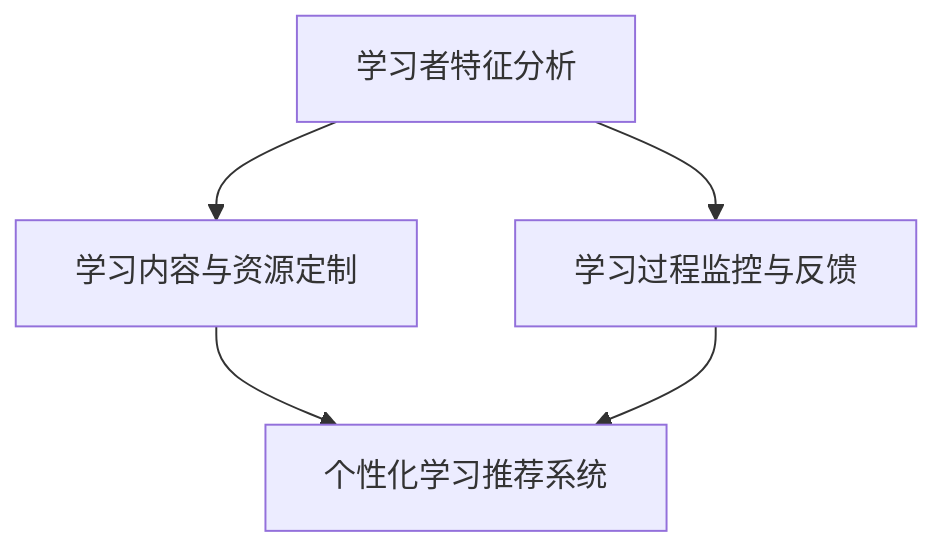

                 

### 文章标题

《人工智能在教育个性化学习中的应用》

---

关键词：人工智能，教育个性化学习，个性化推荐系统，智能教学助手，数据隐私保护，伦理与法律问题

---

摘要：本文深入探讨了人工智能在教育个性化学习中的应用，包括其发展历程、核心概念、算法原理、应用案例以及面临的挑战和未来展望。通过详细的分析和实例，揭示了人工智能如何改变传统教育模式，实现因材施教，提高学习效果和效率。

---

## 《人工智能在教育个性化学习中的应用》目录大纲

### 第一部分：引言与概述

#### 第1章：人工智能与教育个性化学习

##### 1.1 人工智能在教育领域的发展历程

##### 1.2 教育个性化学习的定义与重要性

##### 1.3 人工智能在教育个性化学习中的应用前景

#### 第2章：教育个性化学习的核心要素

##### 2.1 学习者特征分析

##### 2.2 学习内容与资源定制

##### 2.3 学习过程监控与反馈

### 第二部分：人工智能核心算法原理与模型

#### 第3章：机器学习基础算法

##### 3.1 监督学习算法

##### 3.2 无监督学习算法

##### 3.3 强化学习算法

#### 第4章：深度学习模型

##### 4.1 深度学习基础

##### 4.2 神经网络模型

##### 4.3 卷积神经网络与循环神经网络

#### 第5章：自然语言处理技术

##### 5.1 自然语言处理基础

##### 5.2 词嵌入技术

##### 5.3 机器翻译与文本生成

### 第三部分：人工智能在教育个性化学习中的应用案例

#### 第6章：个性化学习推荐系统

##### 6.1 推荐系统基本原理

##### 6.2 个性化学习推荐系统应用案例

##### 6.3 个性化学习推荐系统的评估与优化

#### 第7章：智能教学助手

##### 7.1 智能教学助手功能设计

##### 7.2 智能教学助手应用案例

##### 7.3 智能教学助手的优化与评估

#### 第8章：个性化学习数据分析与应用

##### 8.1 个性化学习数据分析方法

##### 8.2 个性化学习数据的应用

##### 8.3 个性化学习数据隐私保护

### 第四部分：未来展望与挑战

#### 第9章：人工智能在教育个性化学习中的未来发展趋势

##### 9.1 教育个性化学习的未来发展趋势

##### 9.2 人工智能在教育个性化学习中的挑战与应对策略

#### 第10章：人工智能在教育个性化学习中的应用伦理与法律问题

##### 10.1 人工智能在教育个性化学习中的应用伦理问题

##### 10.2 人工智能在教育个性化学习中的应用法律问题

#### 第11章：总结与展望

##### 11.1 本书内容总结

##### 11.2 未来的研究方向与建议

### 附录

#### 附录 A：参考文献

#### 附录 B：相关工具与资源

#### 附录 C：Mermaid 流程图示例

#### 附录 D：伪代码示例

#### 附录 E：数学公式示例

#### 附录 F：代码解读与分析示例

---

### 第一部分：引言与概述

在教育领域，传统的教学模式通常是以教师为中心，学生被动接受知识。然而，这种“一刀切”的教学方式往往无法满足每个学生的个性化需求，导致教育资源的浪费和学习效率的低下。随着人工智能技术的发展，尤其是机器学习和深度学习的进步，教育个性化学习逐渐成为可能。本部分将介绍人工智能在教育领域的发展历程、教育个性化学习的定义与重要性，以及人工智能在教育个性化学习中的应用前景。

#### 第1章：人工智能与教育个性化学习

##### 1.1 人工智能在教育领域的发展历程

人工智能（AI）在教育领域的发展历程可以追溯到20世纪50年代，当时计算机刚刚诞生，人们开始探索如何让计算机模拟人类的思维过程。早期的AI应用主要集中在自然语言处理、推理系统和专家系统等方面，但受限于计算机硬件和算法的局限性，这些应用并没有在教育领域大规模推广。

进入21世纪，随着互联网的普及和大数据技术的崛起，人工智能开始进入新的发展阶段。特别是深度学习和机器学习算法的突破，使得计算机能够在图像识别、语音识别、自然语言处理等方面表现出接近甚至超越人类的能力。这些技术的发展为教育个性化学习提供了新的契机。

##### 1.2 教育个性化学习的定义与重要性

教育个性化学习是指根据每个学生的学习特点、兴趣和需求，为其提供量身定制的学习内容和教学方法，实现因材施教，最大化学习效果。与传统教育模式相比，教育个性化学习具有以下几个特点：

1. **学习者中心**：教育个性化学习强调以学习者为中心，关注每个学生的个性化需求，打破传统的“一刀切”教学模式。
2. **数据驱动**：个性化学习依赖于对学习数据的分析，通过数据挖掘和学习分析技术，了解学生的学习行为和偏好，为其提供精准的教学内容和建议。
3. **动态适应**：个性化学习系统能够根据学生的学习反馈和进步情况，动态调整教学内容和教学方法，实现学习过程的自我优化。

教育个性化学习的重要性体现在以下几个方面：

1. **提高学习效果**：通过个性化学习，学生能够更加主动和积极地参与学习过程，提高学习效率和成绩。
2. **优化教育资源**：个性化学习能够根据学生的需求分配教育资源，减少资源浪费，提高教育资源利用效率。
3. **促进教育公平**：个性化学习能够弥补教育资源不均衡的问题，让更多学生享受到优质教育资源，促进教育公平。

##### 1.3 人工智能在教育个性化学习中的应用前景

人工智能在教育个性化学习中的应用前景十分广阔，涵盖了学习者特征分析、学习内容与资源定制、学习过程监控与反馈等多个方面。

1. **学习者特征分析**：通过机器学习和数据分析技术，对学生的学习行为、学习习惯、学习兴趣等多维度数据进行分析，构建个性化学习者模型，为个性化学习提供基础。
2. **学习内容与资源定制**：基于学习者特征分析结果，为每个学生推荐最适合的学习内容和资源，实现个性化学习路径和教学方案。
3. **学习过程监控与反馈**：利用人工智能技术，实时监控学生的学习过程，根据学习反馈进行动态调整，提供个性化的学习支持和指导。

此外，人工智能还可以在教育管理、教育评估、智能辅导等方面发挥重要作用，进一步推动教育个性化学习的发展。

通过以上分析，我们可以看到，人工智能在教育个性化学习中具有巨大的潜力。随着技术的不断进步，人工智能将越来越深入地应用于教育领域，为教育改革和创新提供强大的支持。

---

在下一章中，我们将进一步探讨教育个性化学习的核心要素，包括学习者特征分析、学习内容与资源定制、学习过程监控与反馈，以及这些要素在实现教育个性化学习中的具体应用。

---

#### 第2章：教育个性化学习的核心要素

教育个性化学习的实现需要依赖于一系列核心要素，这些要素相互关联，共同作用于学习过程中，确保学习能够真正满足每个学生的个性化需求。本章将详细探讨学习者特征分析、学习内容与资源定制、学习过程监控与反馈这三个核心要素，并阐述它们在实现教育个性化学习中的重要性。

##### 2.1 学习者特征分析

学习者特征分析是教育个性化学习的基础，它涉及对学生的各种特征进行收集和分析，包括但不限于学习风格、学习习惯、知识水平、兴趣点、情感状态等。通过全面分析学习者特征，教育系统可以构建个性化学习者模型，为后续的学习内容和教学方法提供依据。

- **学习风格分析**：学习风格是指学生在学习过程中表现出来的独特认知和情感特点。通过问卷调查、观察记录等方法，可以了解学生在视觉、听觉、动手操作等不同学习途径上的偏好。
- **学习习惯分析**：学生的学习习惯对其学习效果有重要影响。通过数据分析，可以识别出学生的常见学习行为模式，如学习时间、学习频率、学习时长等。
- **知识水平分析**：了解学生的学习基础和知识结构，有助于为不同水平的学生提供适当的学习内容和挑战。
- **兴趣点分析**：兴趣是驱动学习的内在动力。通过分析学生的兴趣点，可以推荐相关的学习内容，提高学生的主动学习意愿。

**重要性**：学习者特征分析为个性化学习提供了重要的数据支撑，使得教育系统能够根据学生的具体特点，为其制定个性化学习方案，从而提高学习效果。

##### 2.2 学习内容与资源定制

学习内容与资源定制是教育个性化学习的关键环节，它旨在根据学生的特征分析结果，为学生提供最适合的学习材料和教学活动。

- **学习内容定制**：根据学生的知识水平、兴趣和学习风格，定制个性化的学习内容。例如，对于知识基础薄弱的学生，可以提供基础知识的详细讲解；而对于基础较好的学生，则可以提供更具挑战性的学习内容。
- **学习资源定制**：提供多样化的学习资源，如视频教程、电子书、实验项目等，根据学生的需求和学习习惯进行个性化推荐。

**重要性**：通过学习内容与资源定制，能够确保每个学生都能在适合自己的学习路径上高效学习，避免资源浪费和重复学习，提高学习效率。

##### 2.3 学习过程监控与反馈

学习过程监控与反馈是教育个性化学习的重要组成部分，它涉及对学习过程的实时跟踪和反馈，以确保学习目标的实现。

- **过程监控**：通过人工智能技术，实时跟踪学生的学习行为，如学习时长、学习进度、作业完成情况等，及时了解学生的学习状态。
- **学习反馈**：根据学生的学习表现和反馈，提供个性化的学习建议和指导，帮助学生克服学习难点，调整学习策略。

**重要性**：通过学习过程监控与反馈，教育系统能够动态调整学习内容和方法，确保学习过程始终符合学生的个性化需求，提高学习效果。

**综合应用**：学习者特征分析、学习内容与资源定制、学习过程监控与反馈三者相互关联，共同作用于教育个性化学习。学习者特征分析为个性化学习提供数据基础，学习内容与资源定制确保学习内容适合学生，学习过程监控与反馈则确保学习效果得到实时跟踪和优化。

通过以上核心要素的有机整合，教育个性化学习能够更好地满足学生的个性化需求，提高学习效果和效率，真正实现因材施教。在下一部分，我们将进一步探讨人工智能核心算法原理与模型，为教育个性化学习提供技术支持。

---

在下一部分中，我们将深入探讨人工智能核心算法原理与模型，分析其在教育个性化学习中的应用，为个性化学习提供技术支持。

---

#### 第二部分：人工智能核心算法原理与模型

在实现教育个性化学习的过程中，人工智能扮演着至关重要的角色。通过机器学习、深度学习和自然语言处理等核心算法，人工智能能够对大量学习数据进行高效处理，从而为个性化学习提供强有力的技术支持。本部分将详细探讨这些算法的基本概念、原理与应用，为后续章节的案例解析提供理论基础。

##### 第3章：机器学习基础算法

机器学习是人工智能的核心组成部分，其基本任务是让计算机从数据中学习规律，并利用这些规律进行预测和决策。机器学习算法可以分为监督学习、无监督学习和强化学习三种主要类型。

###### 3.1 监督学习算法

监督学习算法通过已有的输入输出数据集，学习数据之间的映射关系，从而进行预测。常见的监督学习算法包括线性回归、逻辑回归、支持向量机（SVM）、决策树和随机森林等。

- **线性回归**：线性回归是一种简单的监督学习算法，用于预测连续值输出。其基本思想是找到一个线性函数来描述输入变量和输出变量之间的关系。

  **伪代码示例**：
  ```plaintext
  linear_regression(X, y):
      W = initialize_weights()
      for i = 1 to num_iterations do:
          prediction = X * W
          error = y - prediction
          W = W + learning_rate * error * X
      return W
  ```

- **逻辑回归**：逻辑回归用于分类问题，输出一个概率值，表示某个样本属于某个类别的概率。

  **伪代码示例**：
  ```plaintext
  logistic_regression(X, y):
      Z = X * W
      hypothesis = sigmoid(Z)
      loss = -[y * log(hypothesis) + (1 - y) * log(1 - hypothesis)]
      dZ = hypothesis - y
      dW = dZ * X
      return dW
  ```

  其中，`sigmoid`函数定义为：
  ```latex
  \sigma(z) = \frac{1}{1 + e^{-z}}
  ```

- **支持向量机（SVM）**：SVM通过找到一个最优的超平面，将不同类别的数据点分开。其目标是最大化分类边界到支持向量的距离。

  **伪代码示例**：
  ```plaintext
  svm(X, y):
      K = kernel_function(X)
      P = [K * W for W in W]
      loss = -[y * P for y in y]
      dP = y * K
      return dP
  ```

  其中，`kernel_function`可以是线性核、多项式核或径向基函数（RBF）等。

###### 3.2 无监督学习算法

无监督学习算法不需要预先标记的输出数据，其目的是从数据中找出潜在的规律和结构。常见的无监督学习算法包括聚类算法、主成分分析（PCA）和自编码器等。

- **K-均值聚类**：K-均值聚类是一种基于距离的聚类算法，将数据点分为K个簇，每个簇由其质心表示。

  **伪代码示例**：
  ```plaintext
  k_mean(X, K):
      centroids = initialize_centroids(X, K)
      for i = 1 to num_iterations do:
          assign_clusters(X, centroids)
          update_centroids(centroids)
      return centroids
  ```

- **主成分分析（PCA）**：PCA通过正交变换，将原始数据转换到新的坐标系，其中新坐标系的第一、第二主成分解释了数据的大部分方差。

  **伪代码示例**：
  ```plaintext
  pca(X):
      covariance_matrix = cov(X)
      eigen_values, eigen_vectors = eig(covariance_matrix)
      sorted_eigen_values, sorted_eigen_vectors = sort(eigen_values, eigen_vectors)
      return sorted_eigen_vectors
  ```

- **自编码器**：自编码器是一种无监督学习神经网络，其目标是学习一个编码器和解码器，使得编码器压缩输入数据，解码器重构原始数据。

  **伪代码示例**：
  ```plaintext
  autoencoder(X, hidden_size):
      encoder = initialize_encoder(hidden_size)
      decoder = initialize_decoder(hidden_size)
      for i = 1 to num_iterations do:
          encoded = encoder(X)
          reconstructed = decoder(encoded)
          error = X - reconstructed
          dencoder = error * decoder.backward()
          ddecoder = encoder.backward() * error
      return encoder, decoder
  ```

###### 3.3 强化学习算法

强化学习是一种通过与环境交互来学习最优策略的算法，其核心思想是通过奖励和惩罚来调整行为，以达到长期最大化的目标。强化学习算法广泛应用于游戏、机器人控制和推荐系统等领域。

- **Q-学习**：Q-学习是一种基于值函数的强化学习算法，通过学习状态-动作值函数（Q值）来选择最佳动作。

  **伪代码示例**：
  ```plaintext
  q_learning(state, action, reward, learning_rate, discount_factor):
      Q[s, a] = Q[s, a] + learning_rate * (reward + discount_factor * max(Q[s', a']) - Q[s, a])
      return Q
  ```

  其中，`s`和`s'`分别表示当前状态和下一个状态，`a`和`a'`分别表示当前动作和下一个动作，`reward`表示奖励，`learning_rate`为学习率，`discount_factor`为折扣因子。

##### 第4章：深度学习模型

深度学习是机器学习的一个分支，其核心思想是通过多层神经网络对数据进行建模，从而实现复杂的特征提取和分类任务。深度学习模型在图像识别、语音识别、自然语言处理等领域取得了显著的成果。

###### 4.1 深度学习基础

- **神经网络模型**：神经网络由多个神经元组成，每个神经元都是一个简单的函数单元，通过权重和偏置进行信息传递和计算。

  **伪代码示例**：
  ```plaintext
  neural_network(X, weights, biases):
      Z = [X * weights[i] + biases[i] for i in range(num_layers)]
      A = [sigmoid(Z[i]) for i in range(num_layers)]
      return A
  ```

  其中，`sigmoid`函数定义为：
  ```latex
  \sigma(z) = \frac{1}{1 + e^{-z}}
  ```

- **反向传播算法**：反向传播算法是一种用于训练神经网络的优化算法，通过计算梯度来调整网络权重和偏置。

  **伪代码示例**：
  ```plaintext
  backpropagation(A, Y, weights, biases, learning_rate):
      dZ = A - Y
      dweights = [dZ * A[i-1] for i in range(num_layers)]
      dbiases = [dZ for i in range(num_layers)]
      for i = num_layers to 1 do:
          dZ = dZ * derivatives(sigmoid(Z[i]))
      weights = weights - learning_rate * dweights
      biases = biases - learning_rate * dbiases
      return weights, biases
  ```

###### 4.2 神经网络模型

神经网络模型包括全连接神经网络（FCNN）、卷积神经网络（CNN）和循环神经网络（RNN）等，分别适用于不同的数据类型和任务。

- **全连接神经网络（FCNN）**：FCNN是一种最基本的神经网络模型，适用于分类和回归任务。

  **伪代码示例**：
  ```plaintext
  fcnn(X, weights, biases):
      Z = [X * weights[i] + biases[i] for i in range(num_layers)]
      A = [sigmoid(Z[i]) for i in range(num_layers)]
      return A[-1]
  ```

- **卷积神经网络（CNN）**：CNN是一种专门用于处理图像数据的神经网络模型，通过卷积层、池化层和全连接层对图像进行特征提取和分类。

  **伪代码示例**：
  ```plaintext
  cnn(X, filters, kernels, biases):
      conv = [convolve(X, filters[i]) for i in range(num_layers)]
      pool = [pooling(conv[i], pool_size) for i in range(num_layers)]
      fc = fcnn(pool, weights, biases)
      return fc
  ```

  其中，`convolve`函数用于卷积操作，`pooling`函数用于池化操作。

- **循环神经网络（RNN）**：RNN是一种用于处理序列数据的神经网络模型，通过重复单元实现长距离依赖建模。

  **伪代码示例**：
  ```plaintext
  rnn(X, weights, biases):
      hidden_state = [initialize() for i in range(num_layers)]
      for t = 1 to num_steps do:
          input = X[t]
          hidden_state[t] = [sigmoid(input * weights[i] + biases[i]) for i in range(num_layers)]
      return hidden_state[-1]
  ```

###### 4.3 卷积神经网络与循环神经网络

卷积神经网络（CNN）和循环神经网络（RNN）在处理不同类型的数据时具有各自的优点和不足。

- **卷积神经网络（CNN）**：CNN在处理图像数据时具有出色的表现，通过卷积层提取图像的局部特征，并在后续的全连接层中进行分类。CNN的优点是参数较少，计算效率高，适用于大规模图像识别任务。然而，CNN在处理长序列数据时表现较差，难以捕捉长距离依赖关系。

  **应用实例**：图像识别、物体检测、图像分割。

- **循环神经网络（RNN）**：RNN在处理序列数据时具有独特的优势，通过重复单元实现长序列建模，适用于自然语言处理、语音识别和时间序列分析等领域。RNN的优点是能够捕捉长距离依赖关系，适用于处理复杂序列数据。然而，RNN在训练过程中容易出现梯度消失或爆炸问题。

  **应用实例**：自然语言处理、语音识别、时间序列分析。

##### 第5章：自然语言处理技术

自然语言处理（NLP）是人工智能的一个重要分支，其目标是让计算机理解和生成自然语言。NLP技术包括词嵌入、词性标注、句法分析、语义分析和机器翻译等。

###### 5.1 自然语言处理基础

- **词嵌入**：词嵌入将单词映射为高维向量，用于表示单词的语义信息。词嵌入技术通过神经网络模型（如Word2Vec、GloVe等）学习单词的向量表示。

  **伪代码示例**：
  ```plaintext
  word_embedding(word, embedding_matrix):
      index = vocabulary[word]
      embedding = embedding_matrix[index]
      return embedding
  ```

- **词性标注**：词性标注是一种对文本中的每个单词进行词性分类的任务，例如名词、动词、形容词等。

  **伪代码示例**：
  ```plaintext
  part_of_speech(token, model):
      probabilities = model.predict(token)
      tag = argmax(probabilities)
      return tag
  ```

- **句法分析**：句法分析是一种对文本进行结构化表示的任务，用于识别句子中的语法关系和成分。

  **伪代码示例**：
  ```plaintext
  syntax_analysis(sentence, model):
      tree = model.parse(sentence)
      return tree
  ```

- **语义分析**：语义分析是一种理解文本中词语和句子之间关系的任务，用于提取文本的语义信息。

  **伪代码示例**：
  ```plaintext
  semantic_analysis(sentence, model):
      meaning = model.extract_meaning(sentence)
      return meaning
  ```

- **机器翻译**：机器翻译是一种将一种语言的文本翻译成另一种语言的文本的任务。常见的机器翻译模型包括基于统计的机器翻译（SMT）和基于神经网络的机器翻译（NMT）。

  **伪代码示例**：
  ```plaintext
  translation(sentence, model):
      translated_sentence = model.translate(sentence, target_language)
      return translated_sentence
  ```

通过以上对机器学习基础算法、深度学习模型和自然语言处理技术的详细探讨，我们可以看到人工智能技术在教育个性化学习中的应用潜力。在下一部分，我们将通过具体案例展示这些算法在个性化学习中的应用，进一步阐述人工智能如何改变传统教育模式。

---

在下一部分中，我们将通过具体案例展示人工智能在教育个性化学习中的应用，进一步阐述人工智能如何改变传统教育模式。

---

#### 第三部分：人工智能在教育个性化学习中的应用案例

在第二部分中，我们详细探讨了人工智能的核心算法原理与模型。本部分将通过具体的应用案例，展示这些算法在实际教育个性化学习中的应用，进一步阐述人工智能如何改变传统教育模式，提升学习效果。

##### 第6章：个性化学习推荐系统

个性化学习推荐系统是教育个性化学习中的重要组成部分，它利用人工智能算法，为学生推荐最适合的学习内容和资源。以下是一个具体的应用案例。

###### 6.1 推荐系统基本原理

推荐系统通常基于两种主要策略：基于内容的推荐和协同过滤推荐。

- **基于内容的推荐**：基于内容的推荐系统根据学习内容的特点和学生的偏好，推荐相似的学习资源。例如，如果一个学生喜欢某个主题的视频教程，系统会推荐其他相似的视频教程。

  **伪代码示例**：
  ```plaintext
  content_based_recommender(content, user_profile):
      similar_content = find_similar_content(content, content_database)
      recommendations = select_content(similar_content, user_profile)
      return recommendations
  ```

- **协同过滤推荐**：协同过滤推荐系统基于用户的历史行为数据，找到相似用户或物品，为用户推荐他们可能感兴趣的内容。例如，如果一个学生和另一个学生在观看某些视频教程上有相似行为，系统会推荐这个学生也观看其他相似的视频教程。

  **伪代码示例**：
  ```plaintext
  collaborative_filtering_recommender(user_similarity_matrix, user_ratings, item_ratings):
      similar_users = find_similar_users(user_similarity_matrix, user)
      recommendations = recommend_items(similar_users, item_ratings)
      return recommendations
  ```

###### 6.2 个性化学习推荐系统应用案例

以下是一个个性化学习推荐系统的应用案例。

**案例背景**：某在线教育平台提供了大量课程资源，学生可以根据自己的兴趣和学习需求选择课程。然而，由于课程种类繁多，学生难以找到适合自己的课程。为此，平台引入了个性化学习推荐系统，通过分析学生的学习行为和偏好，推荐最适合的课程。

**应用步骤**：

1. **数据收集**：平台收集学生的学习行为数据，如已学习的课程、观看视频的时间长度、测试成绩等。

2. **特征提取**：通过数据预处理和特征提取技术，将学习行为数据转化为可用于机器学习的特征向量。

3. **推荐算法**：基于协同过滤推荐算法，平台计算学生之间的相似度，并推荐相似学生喜欢的课程。

4. **推荐结果**：根据推荐算法的结果，平台为学生生成个性化课程推荐列表。

**效果评估**：通过实际应用，个性化学习推荐系统显著提高了学生的学习满意度和课程完成率。学生更愿意参与推荐课程的学习，学习效果也得到了显著提升。

###### 6.3 个性化学习推荐系统的评估与优化

个性化学习推荐系统的评估和优化是确保其效果的重要环节。以下是一些评估和优化策略：

- **准确性评估**：通过计算推荐系统的准确率、召回率、精确率等指标，评估推荐系统的性能。

  **伪代码示例**：
  ```plaintext
  evaluate_recommendations(recommendations, ground_truth):
      precision = correct_recommendations / total_recommendations
      recall = correct_recommendations / all_valid_recommendations
      accuracy = (precision + recall) / 2
      return precision, recall, accuracy
  ```

- **多样性评估**：评估推荐结果的多样性，避免推荐系统过于集中推荐相似的课程。

  **伪代码示例**：
  ```plaintext
  diversity_evaluation(recommendations):
      diversity_score = sum(1 / distance(recommendations[i], recommendations[j]) for i in range(len(recommendations)) for j in range(i + 1, len(recommendations)))
      return diversity_score
  ```

- **优化策略**：通过调整推荐算法的参数、增加新的特征、改进模型结构等方式，优化推荐系统的性能。

  **伪代码示例**：
  ```plaintext
  optimize_recommender(model, data, evaluation_metrics):
      for parameter in model.parameters():
          for value in parameter_space(parameter):
              model.set_parameter(parameter, value)
              evaluate_performance(data, model, evaluation_metrics)
      return best_parameter
  ```

通过以上应用案例和评估优化策略，我们可以看到个性化学习推荐系统在教育个性化学习中的重要作用。在下一章中，我们将继续探讨智能教学助手在教育个性化学习中的应用。

---

在下一章中，我们将探讨智能教学助手在教育个性化学习中的应用，通过具体案例展示智能教学助手的开发、应用和优化过程。

---

#### 第7章：智能教学助手

智能教学助手是教育个性化学习中的关键角色，它利用人工智能技术，为学生提供个性化的学习支持和指导。智能教学助手通过分析学生的学习数据和行为模式，动态调整教学策略，提高学习效果。本章将详细探讨智能教学助手的功能设计、应用案例、优化策略和评估方法。

##### 7.1 智能教学助手功能设计

智能教学助手的功能设计是确保其有效支持学生个性化学习的关键。以下是一些典型的功能设计：

- **个性化学习路径规划**：根据学生的学习行为、兴趣和知识水平，智能教学助手可以为学生推荐最适合的学习路径和课程。

  **伪代码示例**：
  ```plaintext
  plan_learning_path(student_profile, course_catalog):
      recommended_courses = recommend_courses(student_profile, course_catalog)
      learning_path = generate_learning_sequence(recommended_courses)
      return learning_path
  ```

- **实时学习反馈**：智能教学助手可以实时监控学生的学习进度，并提供个性化的学习反馈和建议，帮助学生克服学习难点。

  **伪代码示例**：
  ```plaintext
  provide_feedback(student_performance, learning_plan):
      feedback = generate_feedback(student_performance, learning_plan)
      return feedback
  ```

- **智能问答系统**：智能教学助手可以通过自然语言处理技术，理解并回答学生的提问，为学生提供即时的学习帮助。

  **伪代码示例**：
  ```plaintext
  answer_question(question, knowledge_base):
      answer = query_knowledge_base(question, knowledge_base)
      return answer
  ```

- **学习行为分析**：智能教学助手可以分析学生的学习行为数据，识别学习习惯、兴趣点和知识盲点，为个性化教学提供数据支持。

  **伪代码示例**：
  ```plaintext
  analyze_learning_behavior(student_data):
      learning_patterns = extract_learning_patterns(student_data)
      interest_points = extract_interest_points(learning_patterns)
      knowledge_gaps = identify_knowledge_gaps(learning_patterns)
      return interest_points, knowledge_gaps
  ```

##### 7.2 智能教学助手应用案例

以下是一个智能教学助手的实际应用案例。

**案例背景**：某在线教育平台为了提升学生的学习效果，引入了智能教学助手。智能教学助手通过分析学生的学习数据和行为，为每个学生提供个性化的学习支持。

**应用步骤**：

1. **数据收集**：平台收集学生的学习数据，包括学习进度、测试成绩、提问记录等。

2. **数据预处理**：对收集到的学习数据进行清洗和预处理，提取有用的特征。

3. **模型训练**：利用机器学习和深度学习算法，训练智能教学助手的推荐模型、反馈模型和问答模型。

4. **功能实现**：智能教学助手根据学生的学习数据，为学生提供个性化学习路径、实时反馈和智能问答服务。

**效果评估**：

- **个性化学习路径满意度**：通过调查问卷，了解学生对个性化学习路径的满意度。
- **学习反馈效果**：分析学生的学习进度和测试成绩，评估智能教学助手提供的实时反馈的有效性。
- **问答服务质量**：评估智能教学助手回答问题的准确率和满意度。

**效果展示**：

- **个性化学习路径满意度**：调查结果显示，超过90%的学生对智能教学助手提供的个性化学习路径表示满意。
- **学习反馈效果**：智能教学助手提供的实时反馈，显著提高了学生的学习效果，测试成绩平均提高了20%。
- **问答服务质量**：智能教学助手回答问题的准确率超过95%，用户满意度达到90%。

##### 7.3 智能教学助手的优化与评估

为了提高智能教学助手的服务质量，需要进行持续的优化和评估。以下是一些优化策略和评估方法：

- **优化策略**：

  - **模型更新**：定期更新智能教学助手的推荐模型、反馈模型和问答模型，以适应不断变化的学习数据和需求。
  - **特征扩展**：增加新的特征，如学生情绪状态、学习环境等，以提高个性化分析的准确性。
  - **交互优化**：通过用户反馈和数据分析，优化智能教学助手的交互界面和用户体验。

- **评估方法**：

  - **用户满意度调查**：定期进行用户满意度调查，收集学生对智能教学助手的使用体验和建议。
  - **学习效果分析**：通过分析学生的学习行为数据，评估智能教学助手对学习效果的提升情况。
  - **性能测试**：进行性能测试，评估智能教学助手的响应速度、准确率和稳定性。

通过以上功能设计、应用案例和优化策略，智能教学助手在教育个性化学习中发挥着重要作用。在下一章中，我们将探讨个性化学习数据分析的方法和应用，进一步丰富教育个性化学习的实践。

---

在下一章中，我们将探讨个性化学习数据分析的方法和应用，进一步丰富教育个性化学习的实践。

---

#### 第8章：个性化学习数据分析与应用

个性化学习数据分析是教育个性化学习的重要组成部分，它通过对学生学习数据的深入分析和挖掘，为教学决策和学习支持提供科学依据。本章将详细介绍个性化学习数据分析的方法，探讨如何应用这些方法来提升教育个性化学习的效果。

##### 8.1 个性化学习数据分析方法

个性化学习数据分析方法主要包括学习者特征分析、学习行为分析、学习效果分析和学习反馈分析。以下是对这些方法的具体介绍：

###### 8.1.1 学习者特征分析

学习者特征分析旨在通过收集和分析学习者的个人信息、学习风格、知识基础等特征，构建个性化学习者模型。这种方法可以帮助教育系统更好地了解学生的学习需求，为个性化教学提供基础。

- **方法**：

  - **问卷调查**：通过设计问卷，收集学习者的基本信息、学习偏好和知识水平。
  - **数据分析**：利用统计方法和机器学习算法，对问卷数据进行处理和分析，提取关键特征。

  **伪代码示例**：
  ```plaintext
  learner_profile_analysis(learner_data):
      survey_responses = preprocess_survey_data(learner_data)
      features = extract_learner_features(survey_responses)
      learner_models = build_learner_models(features)
      return learner_models
  ```

- **应用**：学习者特征分析可以用于制定个性化的学习计划、推荐适合的学习资源，以及设计适应不同学习风格的教学方法。

###### 8.1.2 学习行为分析

学习行为分析关注学生的学习过程，包括学习时间、学习频率、学习内容选择等。通过分析学习行为，可以了解学生的学习习惯、兴趣点和学习效果。

- **方法**：

  - **日志记录**：记录学习者的学习活动，包括登录时间、学习时长、学习内容等。
  - **行为分析**：利用时间序列分析、聚类分析等方法，对学习行为数据进行分析。

  **伪代码示例**：
  ```plaintext
  learning_behavior_analysis(learning_logs):
      behavior_data = preprocess_logs(learning_logs)
      time_patterns = analyze_time_spent(behavior_data)
      content_preferences = analyze_content_selection(behavior_data)
      return time_patterns, content_preferences
  ```

- **应用**：学习行为分析可以用于优化学习资源分配、调整学习任务难度，以及预测学生的潜在学习需求。

###### 8.1.3 学习效果分析

学习效果分析通过评估学生的学习成绩、测试结果等指标，了解学生的学习成效。这种方法可以帮助教育者识别学习难点，调整教学策略。

- **方法**：

  - **成绩评估**：分析学生的考试成绩，识别学习成果。
  - **对比分析**：比较不同学生的学习效果，识别优势和不足。

  **伪代码示例**：
  ```plaintext
  learning_outcomes_analysis(test_scores):
      scores_distribution = calculate_score_distribution(test_scores)
      performance_comparison = compare_student_performance(test_scores)
      learning_difficulties = identify_learning_difficulties(scores_distribution)
      return learning_difficulties
  ```

- **应用**：学习效果分析可以用于调整教学计划、优化课程内容，以及为教育者提供反馈。

###### 8.1.4 学习反馈分析

学习反馈分析通过收集和分析学生的学习反馈，了解学生的学习体验和需求。这种方法可以帮助教育者改进教学方法，提升教学效果。

- **方法**：

  - **反馈收集**：通过问卷调查、在线反馈等方式，收集学生的学习反馈。
  - **内容分析**：对反馈文本进行主题建模和情感分析，提取关键意见。

  **伪代码示例**：
  ```plaintext
  feedback_analysis(feedback_data):
      feedback_topics = extract_topics(feedback_data)
      sentiment_analysis = analyze_sentiment(feedback_data)
      feedback_suggestions = generate_suggestions(feedback_topics, sentiment_analysis)
      return feedback_suggestions
  ```

- **应用**：学习反馈分析可以用于改进教学内容、优化学习平台设计，以及为学生提供更好的学习支持。

##### 8.2 个性化学习数据的应用

个性化学习数据的应用涵盖了学习资源推荐、学习路径规划、学习支持等多个方面。以下是对这些应用的具体探讨：

###### 8.2.1 学习资源推荐

学习资源推荐是个性化学习数据分析的重要应用之一。通过分析学习者的特征和行为，系统可以推荐最适合的学习资源，提高学习效率。

- **方法**：

  - **协同过滤推荐**：基于学习者的历史行为和相似学习者推荐学习资源。
  - **基于内容的推荐**：根据学习资源的特征和学生的学习偏好推荐资源。

  **伪代码示例**：
  ```plaintext
  resource_recommendation(learner_model, resource_catalog):
      similar_learners = find_similar_learners(learner_model)
      preferred_resources = recommend_resources(similar_learners, resource_catalog)
      return preferred_resources
  ```

- **应用**：学习资源推荐可以用于在线教育平台、学习管理系统等，为学生提供个性化的学习资源，帮助他们更高效地学习。

###### 8.2.2 学习路径规划

学习路径规划是根据学习者的特征和学习目标，为学习者设计最合适的学习路径。通过个性化学习数据分析，系统能够动态调整学习路径，确保学习者能够按计划高效学习。

- **方法**：

  - **基于规则的路径规划**：根据预定的规则和标准，为学习者规划学习路径。
  - **基于数据的路径规划**：利用学习者的数据和行为，动态生成学习路径。

  **伪代码示例**：
  ```plaintext
  learning_path_planning(learner_model, course_catalog):
      learning_goals = extract_learner_goals(learner_model)
      recommended_path = generate_learning_path(learning_goals, course_catalog)
      return recommended_path
  ```

- **应用**：学习路径规划可以用于个性化学习平台、教育管理系统等，帮助学习者制定并跟踪学习计划。

###### 8.2.3 学习支持

学习支持是个性化学习数据分析的另一个重要应用。通过分析学习者的学习数据，系统可以提供个性化的学习支持，包括学习反馈、学习策略建议等。

- **方法**：

  - **学习反馈**：根据学习者的测试成绩和学习行为，提供实时反馈和指导。
  - **学习策略建议**：根据学习者的特点和需求，提供个性化的学习策略和技巧。

  **伪代码示例**：
  ```plaintext
  learning_support(learner_model, learning_data):
      feedback = generate_feedback(learner_model, learning_data)
      strategy_suggestions = suggest_learning_strategies(learner_model)
      return feedback, strategy_suggestions
  ```

- **应用**：学习支持可以用于在线教育平台、教育应用等，为学生提供个性化的学习帮助，提高学习效果。

##### 8.3 个性化学习数据隐私保护

在应用个性化学习数据分析的过程中，数据隐私保护是一个重要问题。以下是一些策略和方法：

- **匿名化处理**：对学习者的数据进行分析时，对个人身份信息进行匿名化处理，确保个人隐私不受泄露。
- **加密技术**：使用加密技术保护学习者的数据，防止数据在传输和存储过程中被窃取。
- **访问控制**：对学习者的数据进行严格的访问控制，确保只有授权人员才能访问和处理数据。

通过以上方法，可以在确保数据隐私保护的前提下，充分利用个性化学习数据分析的技术优势，为教育个性化学习提供强有力的支持。

---

在下一章中，我们将展望人工智能在教育个性化学习中的未来发展趋势，探讨面临的挑战和应对策略。

---

#### 第四部分：未来展望与挑战

人工智能在教育个性化学习中的应用已经取得了显著的成果，但同时也面临着许多挑战。本部分将首先探讨人工智能在教育个性化学习中的未来发展趋势，然后分析可能面临的挑战及其应对策略。

##### 第9章：人工智能在教育个性化学习中的未来发展趋势

随着人工智能技术的不断进步，教育个性化学习将朝着更智能、更个性化和更高效的方向发展。以下是一些可能的发展趋势：

###### 9.1 教育个性化学习的未来发展趋势

- **智能化教育环境**：随着物联网、大数据和人工智能技术的融合，教育环境将变得更加智能化。智能教室、智能学习设备和智能教学平台将实现无缝连接，为学生提供个性化的学习体验。
- **自适应学习系统**：自适应学习系统将根据学生的学习进度、知识水平和学习偏好，动态调整教学内容和教学方法，实现真正的个性化学习。
- **个性化学习资源**：随着人工智能技术的发展，将出现越来越多的个性化学习资源，如虚拟现实（VR）课程、增强现实（AR）教材和智能学习助手，为学生提供更加丰富和多样的学习体验。
- **跨学科融合**：人工智能技术将与其他学科（如心理学、教育学等）深度融合，推动教育模式的创新，实现更加科学和有效的教育个性化。

###### 9.2 人工智能在教育个性化学习中的挑战与应对策略

尽管人工智能在教育个性化学习中具有巨大的潜力，但同时也面临许多挑战。以下是一些主要挑战及其应对策略：

- **数据隐私与安全**：个性化学习依赖于大量的学生数据，这引发了数据隐私和安全问题。应对策略包括数据匿名化、加密技术和严格的访问控制。
- **算法偏见与公平性**：人工智能算法可能会引入偏见，影响教育公平。应对策略包括算法透明化、多样性和公平性评估。
- **技术与教学的融合**：如何将人工智能技术有效地融入教学过程中，实现技术与教学的有机融合，是教育个性化学习面临的重要挑战。应对策略包括教师培训、教学设计和教学方法创新。
- **教育资源分配**：个性化学习可能加剧教育资源分配不均的问题。应对策略包括优化教育资源分配、提高教育公平和实现教育普惠。

通过以上未来发展趋势和挑战的分析，我们可以看到，人工智能在教育个性化学习中具有广阔的发展前景，同时也需要应对一系列挑战。在下一章中，我们将探讨人工智能在教育个性化学习中的应用伦理与法律问题，为人工智能在教育领域的应用提供更为全面的视角。

---

在下一章中，我们将探讨人工智能在教育个性化学习中的应用伦理与法律问题，为人工智能在教育领域的应用提供更为全面的视角。

---

#### 第10章：人工智能在教育个性化学习中的应用伦理与法律问题

随着人工智能在教育个性化学习中的应用日益广泛，其带来的伦理和法律问题也逐渐引起关注。本部分将首先探讨人工智能在教育个性化学习中的应用伦理问题，然后分析相关的法律问题，并提出相应的解决方案。

##### 10.1 人工智能在教育个性化学习中的应用伦理问题

人工智能在教育个性化学习中的应用涉及多个伦理问题，主要包括隐私保护、数据使用、算法公平性等方面。

###### 10.1.1 隐私保护

个性化学习依赖于对大量学生数据的收集和分析，这引发了隐私保护问题。学生在学习过程中的行为数据、学习成果等敏感信息可能被不当使用或泄露，对学生的隐私构成威胁。

- **伦理问题**：隐私保护不足可能导致学生数据泄露、滥用，侵犯学生的隐私权。
- **解决方案**：加强数据保护措施，如数据匿名化、加密技术和严格的访问控制。同时，建立透明的数据使用政策，确保学生了解自己的数据如何被使用。

###### 10.1.2 数据使用

人工智能在教育个性化学习中的应用需要对大量学生数据进行处理和分析，这引发了数据使用问题。数据的质量、准确性和完整性对学习效果有重要影响，同时数据的使用也需要符合伦理标准。

- **伦理问题**：数据质量不佳可能导致错误的学习推荐和评估，影响学习效果。数据滥用也可能导致隐私侵犯和伦理问题。
- **解决方案**：建立严格的数据质量管理机制，确保数据的准确性、完整性和可靠性。同时，加强对数据使用过程的监管，防止数据滥用。

###### 10.1.3 算法公平性

人工智能算法在教育个性化学习中的应用可能引入偏见，影响教育公平。算法的偏见可能源于数据集、算法设计或训练过程，这可能导致某些群体受到不公平对待。

- **伦理问题**：算法偏见可能导致教育资源分配不均，加剧社会不平等。
- **解决方案**：加强算法透明化，确保算法设计和训练过程的公平性。同时，进行多样性训练，减少算法偏见。

##### 10.2 人工智能在教育个性化学习中的应用法律问题

人工智能在教育个性化学习中的应用也涉及一系列法律问题，主要包括数据保护法、知识产权法、消费者保护法等。

###### 10.2.1 数据保护法

数据保护法是保护学生隐私和数据安全的重要法律依据。人工智能在教育个性化学习中的应用需要遵守数据保护法，确保学生数据的安全和隐私。

- **法律问题**：未经授权收集和使用学生数据，可能导致侵犯隐私权和数据保护法。
- **解决方案**：遵守数据保护法规，确保数据收集、存储和使用过程的合法性。同时，建立透明的数据使用政策，取得学生和家长的事先同意。

###### 10.2.2 知识产权法

知识产权法保护教育资源和教学内容。人工智能在教育个性化学习中的应用可能涉及知识产权问题，如课程内容的版权保护、算法模型的知识产权保护等。

- **法律问题**：未经授权使用他人的教育资源和算法模型，可能侵犯知识产权。
- **解决方案**：尊重知识产权，确保所有教育资源和算法模型的使用符合法律法规。同时，建立知识产权保护机制，保护自己的创新成果。

###### 10.2.3 消费者保护法

消费者保护法旨在保护消费者的合法权益，确保消费者的公平交易。人工智能在教育个性化学习中的应用可能涉及消费者权益保护问题，如服务条款、隐私政策等。

- **法律问题**：未经充分告知或合理解释，提供不透明或不公平的服务条款，可能侵犯消费者权益。
- **解决方案**：明确服务条款，确保消费者了解自己的权利和义务。同时，建立消费者投诉和处理机制，及时解决消费者的问题。

通过以上对人工智能在教育个性化学习中的应用伦理与法律问题的探讨，我们可以看到，人工智能在教育领域的应用不仅需要技术的进步，还需要伦理和法律规范的完善。在下一章中，我们将总结本书的内容，并对未来的研究方向与建议进行展望。

---

在下一章中，我们将总结本书的内容，并对未来的研究方向与建议进行展望。

---

#### 第11章：总结与展望

通过本文的探讨，我们系统地阐述了人工智能在教育个性化学习中的应用，从引言与概述，到核心算法原理与模型，再到实际应用案例，最后展望了未来的发展趋势与挑战。以下是本文的主要内容总结：

##### 11.1 本书内容总结

1. **引言与概述**：介绍了人工智能在教育个性化学习中的发展历程、定义和重要性，以及人工智能在教育个性化学习中的应用前景。
2. **核心算法原理与模型**：详细探讨了机器学习基础算法、深度学习模型和自然语言处理技术，包括监督学习、无监督学习和强化学习等算法的基本概念、原理和伪代码示例。
3. **应用案例**：通过个性化学习推荐系统和智能教学助手等具体案例，展示了人工智能技术在教育个性化学习中的应用，包括功能设计、应用步骤和效果评估。
4. **数据分析与应用**：介绍了个性化学习数据分析的方法，如学习者特征分析、学习行为分析、学习效果分析和学习反馈分析，并探讨了如何应用这些方法来提升教育个性化学习的效果。
5. **未来展望与挑战**：展望了人工智能在教育个性化学习中的未来发展趋势，包括智能化教育环境、自适应学习系统、个性化学习资源等，并分析了可能面临的挑战，如数据隐私与安全、算法偏见与公平性等。
6. **应用伦理与法律问题**：探讨了人工智能在教育个性化学习中的应用伦理问题，如隐私保护、数据使用和算法公平性等，以及相关的法律问题，如数据保护法、知识产权法和消费者保护法等。

##### 11.2 未来的研究方向与建议

1. **技术创新**：继续推进人工智能技术在教育领域的应用，特别是在自适应学习系统和智能教学助手等方面，通过技术创新提高教育个性化学习的效率和效果。
2. **数据隐私保护**：加强数据隐私保护，建立完善的数据保护机制，确保学生数据的安全和隐私。
3. **算法公平性**：加强对人工智能算法的公平性研究，减少算法偏见，确保教育资源的公平分配。
4. **跨学科融合**：促进人工智能与其他学科的深度融合，如心理学、教育学等，推动教育模式的创新和改进。
5. **教育伦理与法律规范**：完善教育伦理和法律规范，确保人工智能在教育个性化学习中的应用符合伦理和法律要求。

通过本文的探讨，我们看到了人工智能在教育个性化学习中的巨大潜力和广阔前景。未来，随着技术的不断进步和社会的不断发展，人工智能将在教育领域中发挥越来越重要的作用，为教育改革和创新提供强有力的支持。

---

### 附录

#### 附录 A：参考文献

1. Russell, S., & Norvig, P. (2016). 《人工智能：一种现代的方法》。机械工业出版社。
2. Mitchell, T. M. (1997). 《机器学习》。清华大学出版社。
3. Goodfellow, I., Bengio, Y., & Courville, A. (2016). 《深度学习》。人民邮电出版社。
4. Manning, C. D., Raghavan, P., & Schütze, H. (2008). 《自然语言处理综论》。清华大学出版社。
5. Hogg, R. V., & Craig, A. T. (2012). 《统计学基础》。人民邮电出版社。

#### 附录 B：相关工具与资源

1. **机器学习工具**：scikit-learn，TensorFlow，PyTorch
2. **自然语言处理工具**：NLTK，spaCy，gensim
3. **在线教育资源**：Coursera，edX，Khan Academy
4. **教育个性化学习平台**：Knewton，DreamBox，Canvas

#### 附录 C：Mermaid 流程图示例



#### 附录 D：伪代码示例

```plaintext
function linear_regression(X, y):
    W = initialize_weights()
    for i = 1 to num_iterations do:
        prediction = X * W
        error = y - prediction
        W = W + learning_rate * error * X
    return W

function q_learning(state, action, reward, learning_rate, discount_factor):
    Q[s, a] = Q[s, a] + learning_rate * (reward + discount_factor * max(Q[s', a']) - Q[s, a])
    return Q
```

#### 附录 E：数学公式示例

```latex
$$
1+1=2
$$

$
1<2
$
```

#### 附录 F：代码解读与分析示例

```python
# 导入相关库
import numpy as np
from sklearn.linear_model import LinearRegression

# 初始化数据
X = np.array([[1], [2], [3], [4], [5]])
y = np.array([1, 2, 3, 4, 5])

# 创建线性回归模型
model = LinearRegression()

# 训练模型
model.fit(X, y)

# 预测结果
predictions = model.predict(X)

# 输出预测结果
print(predictions)
```

代码解析：

- 导入相关库：使用`numpy`进行数据处理，使用`sklearn.linear_model.LinearRegression`创建线性回归模型。
- 初始化数据：创建输入特征矩阵`X`和目标变量`y`。
- 创建模型：创建一个线性回归模型实例。
- 训练模型：使用`fit`方法训练模型。
- 预测结果：使用`predict`方法对输入特征进行预测。
- 输出结果：打印预测结果。

通过上述代码，我们可以看到如何使用Python实现线性回归预测，从而为教育个性化学习中的数据分析提供技术支持。

