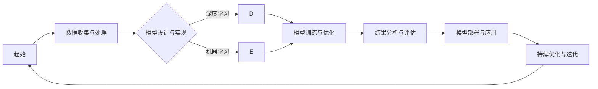

                 

# 文章标题：人工智能在新材料性能优化中的迭代设计

> 关键词：人工智能、新材料、性能优化、迭代设计、深度学习、机器学习、数学模型

> 摘要：本文将探讨人工智能在新材料性能优化中的迭代设计方法。首先，我们将回顾人工智能和新材料的研究背景与现状，并阐述它们结合的意义。接着，我们将详细介绍人工智能的核心算法原理，包括机器学习和深度学习的理论基础，以及这些算法在新材料性能优化中的应用。此外，我们还将解析数学模型在新材料性能优化中的应用，并运用伪代码展示算法的实现细节。最后，我们将通过一个实际应用实例，展示人工智能在新材料性能优化中的具体应用，并探讨其未来发展趋势。

### 目录大纲

1. **人工智能与新材料的背景与联系**
   1.1 人工智能的发展历史与现状
   1.2 新材料的研究背景与现状
   1.3 人工智能与新材料的结合意义
   1.4 人工智能在新材料性能优化中的应用流程

2. **人工智能核心算法原理**
   2.1 机器学习与深度学习基础
   2.2 深度学习算法详解
   2.3 人工智能在新材料性能优化中的应用
   2.4 机器学习算法在新材料性能优化中的应用流程

3. **数学模型与公式解析**
   3.1 数学模型在新材料性能优化中的应用
   3.2 机器学习算法的数学基础
   3.3 LaTeX 公式示例：材料性能优化的数学模型

4. **项目实战与代码解读**
   4.1 项目背景与目标
   4.2 数据收集与处理
   4.3 模型设计与实现
   4.4 代码解读与分析

5. **人工智能在新材料性能优化中的未来趋势**
   5.1 人工智能技术在新材料领域的应用前景
   5.2 未来研究的方向与挑战
   5.3 人工智能在新材料性能优化中的潜在影响

6. **附录**
   6.1 人工智能开发环境搭建
   6.2 常用机器学习框架对比
   6.3 新材料性能优化相关数据库

### Mermaid 流程图：人工智能在新材料性能优化中的应用流程



### 伪代码：卷积神经网络在新材料性能优化中的应用

```python
# 初始化卷积神经网络结构
model = ConvolutionalNeuralNetwork()

# 定义损失函数和优化器
loss_function = CrossEntropyLoss()
optimizer = Adam(model.parameters(), lr=0.001)

# 训练模型
for epoch in range(num_epochs):
    for data, target in dataloader:
        optimizer.zero_grad()  # 清空梯度
        output = model(data)  # 前向传播
        loss = loss_function(output, target)  # 计算损失
        loss.backward()  # 反向传播
        optimizer.step()  # 更新权重

# 模型评估
with torch.no_grad():
    correct = 0
    total = 0
    for data, target in test_dataloader:
        output = model(data)
        _, predicted = torch.max(output.data, 1)
        total += target.size(0)
        correct += (predicted == target).sum().item()

print('准确率：', correct / total)
```

接下来，我们将详细探讨人工智能在新材料性能优化中的应用，包括其历史背景、现状以及结合的意义。然后，我们将深入介绍人工智能的核心算法原理，包括机器学习和深度学习，并解释它们如何应用于新材料性能优化。此外，我们还将探讨数学模型在新材料性能优化中的应用，并运用伪代码展示算法的实现细节。最后，我们将通过一个实际应用实例，展示人工智能在新材料性能优化中的具体应用，并探讨其未来发展趋势。让我们一步步分析推理思考，深入了解这一前沿领域。

