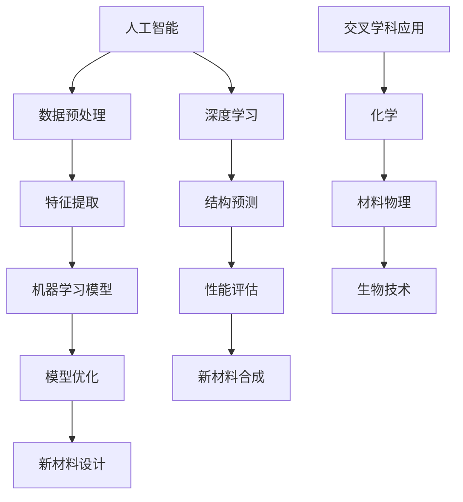
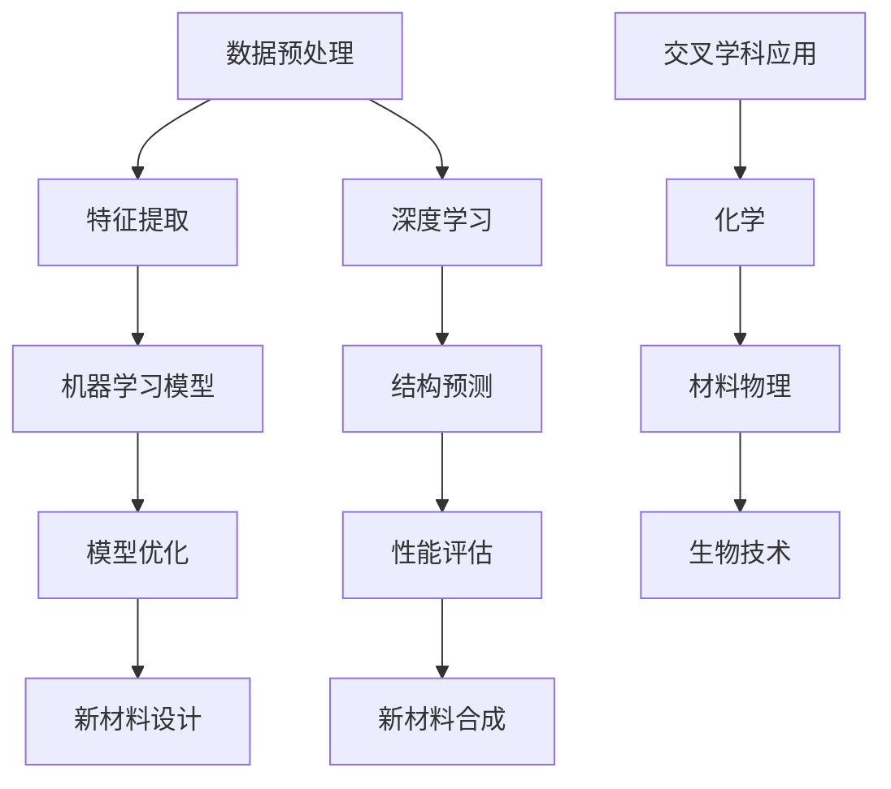
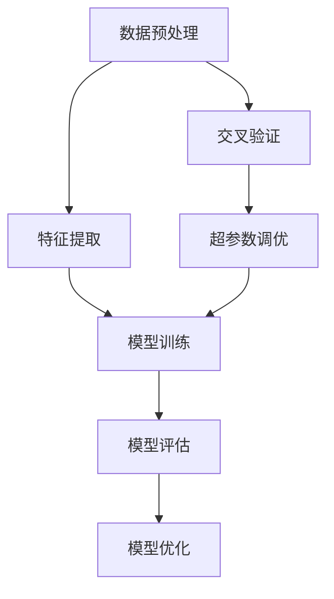
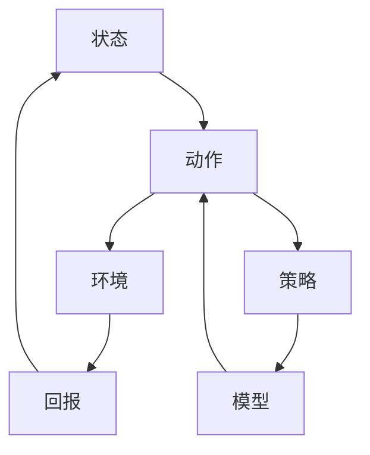
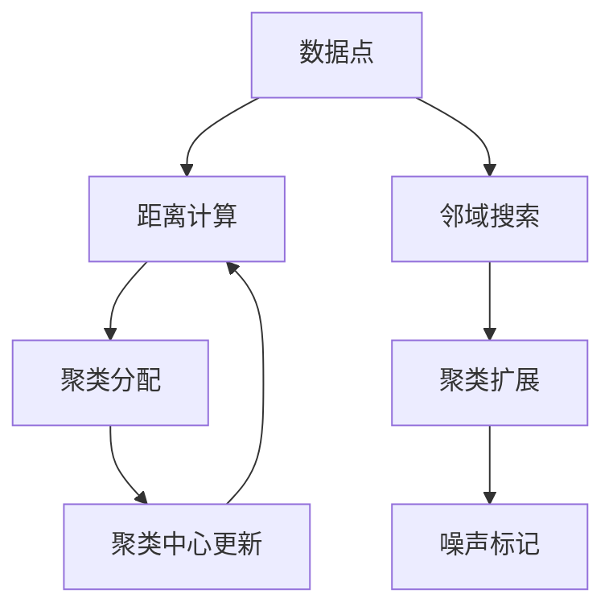
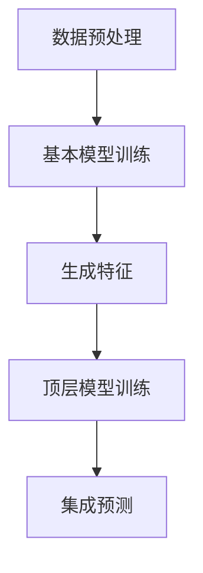
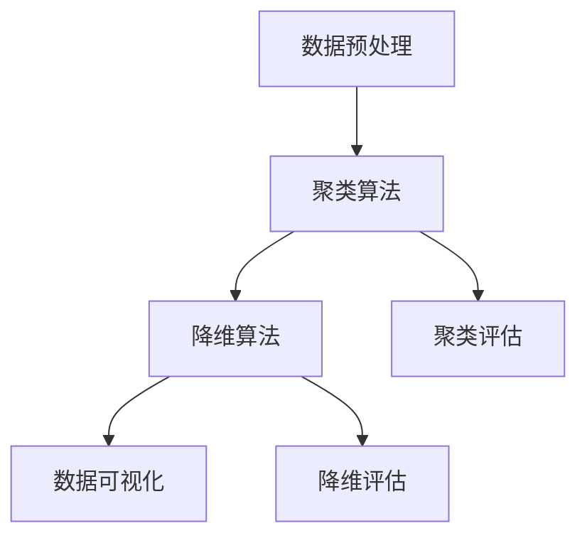
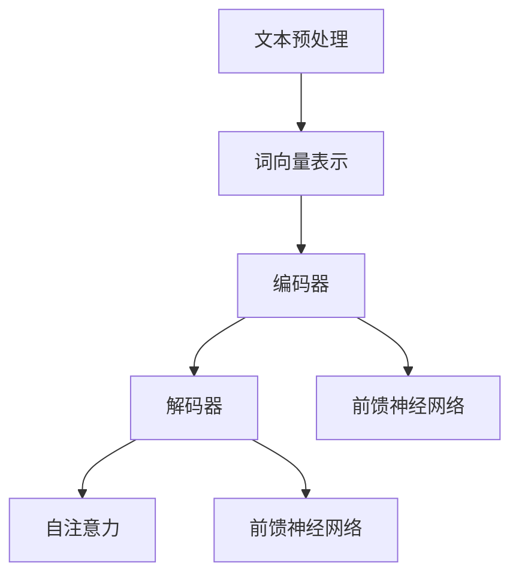

                 

# 人工智能在新材料设计与发现中的应用

## 关键词
- 人工智能
- 新材料
- 机器学习
- 深度学习
- 材料科学
- 数据分析

## 摘要
本文探讨了人工智能（AI）在新材料设计与发现中的应用。通过介绍AI的基本概念和机器学习、深度学习等核心技术，本文分析了AI如何结合数学模型进行新材料设计，以及在材料结构预测、性能评估和合成中的应用。同时，通过案例研究和未来发展趋势的展望，本文展示了AI在新材料领域的巨大潜力和挑战。

### 第一部分：基础理论与方法

#### 第1章：人工智能与新材料的概述

##### 1.1 人工智能与新材料的背景

新材料的研究现状与需求

新材料是现代社会发展的重要驱动力，从超导材料、半导体材料到纳米材料，每一种新材料的发现和设计都对科技进步和产业升级产生深远影响。然而，传统的新材料设计方法往往依赖于实验和经验，耗时耗力且效率较低。

人工智能在材料科学中的潜在作用

人工智能（AI）作为一种新兴技术，具有处理大规模数据、自动优化和智能决策的能力。将这些能力应用于材料科学，可以大幅提高新材料的设计效率，降低研发成本。

##### 1.2 人工智能的基本概念

机器学习、深度学习简介

机器学习（ML）是AI的核心技术之一，它通过构建数学模型，使计算机能够从数据中学习规律并做出预测。深度学习（DL）是机器学习的一个分支，通过多层神经网络模拟人脑的思考方式，具有强大的特征提取和模式识别能力。

人工智能的关键技术

人工智能的关键技术包括数据预处理、特征提取、模型训练、模型评估和模型优化等。这些技术构成了AI在新材料设计中的基本框架。

##### 1.3 新材料设计中的数学模型

几种常见的数学模型及其在新材料中的应用

在新材料设计中，常用的数学模型包括线性回归、支持向量机、决策树、神经网络等。这些模型可以用于预测材料的结构、性能和合成路径。

数学模型的搭建与优化方法

数学模型的搭建需要根据具体问题选择合适的数据集和模型结构，并通过调参和优化提高模型的性能。优化方法包括交叉验证、网格搜索和贝叶斯优化等。

### 第2章：机器学习与新材料的结合

##### 2.1 机器学习算法简介

监督学习、无监督学习、强化学习概述

机器学习算法根据学习方式可以分为监督学习、无监督学习和强化学习。监督学习通过已有标签数据训练模型，无监督学习通过未标记数据发现规律，强化学习通过与环境交互学习最佳策略。

常见机器学习算法及其原理

常见的机器学习算法包括线性回归、逻辑回归、支持向量机、决策树、随机森林和神经网络等。每种算法都有其独特的原理和应用场景。

##### 2.2 数据处理与分析

数据采集与预处理方法

在机器学习应用中，数据是模型训练的基础。数据采集和预处理是确保模型性能的重要环节，包括数据清洗、归一化、缺失值处理和特征工程等。

数据分析技术及其在新材料中的应用

数据分析技术包括统计分析、数据可视化、聚类分析和关联规则挖掘等。这些技术可以用于识别新材料中的关键特征和规律，为新材料的发现和设计提供指导。

##### 2.3 机器学习在新材料设计中的应用

材料结构的预测与优化

机器学习可以用于预测材料的结构，从而优化材料的设计。通过训练深度学习模型，可以自动生成材料结构的预测结果，并优化材料的性能。

材料性能的评估与改进

机器学习模型可以用于评估材料的性能，如导电性、硬度、韧性等。通过模型预测和优化，可以改进材料的性能，满足特定的应用需求。

### 第3章：深度学习在新材料研究中的应用

##### 3.1 深度学习基础

神经网络、卷积神经网络、循环神经网络等基础

深度学习模型的核心是神经网络，包括前馈神经网络、卷积神经网络（CNN）和循环神经网络（RNN）等。这些网络通过多层非线性变换，能够提取复杂的数据特征。

深度学习框架使用简介

常见的深度学习框架包括TensorFlow、PyTorch和Keras等。这些框架提供了丰富的API和工具，方便开发者构建和训练深度学习模型。

##### 3.2 深度学习在新材料结构预测中的应用

材料结构的模拟与预测

深度学习可以用于模拟材料的结构，通过生成模型（如生成对抗网络GAN）和变分自编码器VAE等，可以生成新材料结构的预测结果。

材料性能的深度学习模型

深度学习模型可以用于预测材料的性能，如通过训练CNN模型，可以识别材料的微观结构特征，并预测其性能。

##### 3.3 深度学习在材料发现中的应用

自动材料发现的方法与案例

深度学习可以用于自动发现新材料，通过训练深度学习模型，可以从大量的材料数据中识别出具有潜在应用价值的材料。

深度学习在材料合成中的应用

深度学习可以用于优化材料合成过程，通过训练模型，可以预测合成路径和条件，从而提高材料合成的效率和成功率。

### 第4章：人工智能与新材料的交叉学科应用

##### 4.1 人工智能与化学的交叉

化学反应预测与优化

人工智能可以用于预测化学反应的路径和产物，从而优化化学反应的流程和条件。通过训练深度学习模型，可以模拟化学反应并预测产物的性质。

化学物质的性质预测

深度学习模型可以用于预测化学物质的性质，如毒性、反应性、稳定性等。这些预测结果可以用于药物设计、环境监测等领域。

##### 4.2 人工智能与物理的交叉

材料物理性质的模拟与分析

人工智能可以用于模拟材料的物理性质，如导电性、热导率、弹性模量等。通过训练深度学习模型，可以预测材料的物理行为。

材料力学行为的预测

深度学习模型可以用于预测材料的力学行为，如强度、韧性、断裂韧性等。这些预测结果可以用于材料的设计和优化。

##### 4.3 人工智能与生物技术的交叉

生物材料的设计与制造

人工智能可以用于设计生物材料，如组织工程支架、药物输送系统等。通过训练深度学习模型，可以预测生物材料的性能和行为。

生物信息学与人工智能的结合

人工智能可以与生物信息学相结合，用于分析生物数据，如基因序列、蛋白质结构等。通过深度学习模型，可以识别生物信息中的关键特征和模式。

### 第二部分：案例分析与应用实践

#### 第5章：新材料设计中的人工智能应用案例

##### 5.1 案例一：新型半导体材料设计

案例介绍

新型半导体材料的设计是一个复杂的任务，需要考虑材料的结构、性能和合成路径。通过机器学习和深度学习，可以优化半导体材料的设计。

数据处理与分析

首先，从公开数据库中收集了大量的半导体材料数据，包括材料的组成、结构、性能等。然后，对这些数据进行了预处理，包括数据清洗、归一化和特征提取。

深度学习模型的构建与训练

基于收集到的数据，构建了深度学习模型，包括卷积神经网络（CNN）和循环神经网络（RNN）。通过训练这些模型，可以预测半导体材料的性能和结构。

结果分析与讨论

通过深度学习模型的预测结果，可以发现一些具有潜在应用价值的半导体材料。同时，对模型的结果进行了分析，讨论了模型的优缺点和改进方向。

##### 5.2 案例二：高性能纤维材料研发

案例介绍

高性能纤维材料是航空航天、国防和民用等领域的重要材料。通过机器学习和深度学习，可以优化纤维材料的设计和性能。

材料结构预测与优化

通过收集和分析纤维材料的结构数据，构建了深度学习模型，包括生成对抗网络（GAN）和变分自编码器（VAE）。这些模型可以预测纤维材料的结构，并优化其性能。

机器学习模型的应用

通过机器学习模型，可以预测纤维材料的力学性能，如强度、韧性等。这些预测结果可以用于指导纤维材料的设计和制造。

实验验证与性能评估

为了验证机器学习模型的预测结果，进行了实验验证。通过实验测试，验证了模型预测的纤维材料性能，并评估了模型的准确性。

##### 5.3 案例三：环保材料的设计与合成

案例介绍

环保材料的设计与合成是当前研究的热点之一。通过机器学习和深度学习，可以优化环保材料的设计和合成路径。

数据预处理与模型构建

从公开数据库中收集了大量的环保材料数据，包括材料的组成、结构、性能等。对这些数据进行了预处理，包括数据清洗、归一化和特征提取。

人工智能在材料发现中的应用

通过构建深度学习模型，可以从大量的材料数据中识别出具有环保性能的材料。这些模型可以用于自动发现新的环保材料。

环保材料的性能评估与改进

通过深度学习模型，可以预测环保材料的性能，如降解性、吸附性等。这些预测结果可以用于改进环保材料的设计和性能。

### 第6章：人工智能在新材料研究中的项目实施

##### 6.1 项目准备

项目规划与目标设定

在开始项目之前，需要明确项目的目标和规划。包括确定研究问题、选择合适的方法和技术、确定数据来源和数据处理流程等。

研究团队的组成与分工

研究团队由多个成员组成，包括材料科学家、数据科学家和软件开发者等。每个成员负责不同的任务，共同推动项目的发展。

##### 6.2 数据采集与处理

数据来源与获取

数据是人工智能模型训练的基础。需要从多个来源获取数据，包括公开数据库、实验数据、文献数据等。

数据预处理方法

在获取数据后，需要进行数据预处理，包括数据清洗、归一化、缺失值处理和特征提取等。这些预处理步骤可以提高数据的质量和模型的性能。

##### 6.3 模型构建与训练

深度学习模型的选取与优化

根据研究问题，选择合适的深度学习模型，如卷积神经网络（CNN）、循环神经网络（RNN）和生成对抗网络（GAN）等。然后，通过调参和优化，提高模型的性能。

模型训练与评估

使用预处理后的数据，对深度学习模型进行训练和评估。通过交叉验证和测试集评估模型的性能，确定最佳模型。

##### 6.4 结果分析与应用

模型结果分析与讨论

通过分析模型的结果，可以得出关于新材料性能和结构的结论。对模型的预测结果进行讨论，分析模型的优缺点和改进方向。

人工智能在新材料研究中的应用效果

通过应用人工智能模型，可以优化新材料的设计和合成路径，提高材料的性能和效率。这些应用效果可以用于指导新材料的研究和开发。

### 第7章：人工智能在新材料领域的未来发展趋势

##### 7.1 新材料研究的趋势与挑战

新材料领域的热点问题

当前，新材料领域的研究热点包括超导材料、纳米材料、生物材料、智能材料等。这些材料具有广泛的应用前景，但同时也面临着一些挑战。

人工智能面临的挑战与机遇

人工智能在新材料研究中面临一些挑战，包括数据质量、模型性能和跨学科合作等。同时，人工智能也为新材料研究提供了新的机遇，如自动材料发现、材料性能优化等。

##### 7.2 人工智能与新材料的未来展望

新材料发现与设计的创新方向

未来，人工智能将在新材料发现与设计中发挥更大作用，如通过深度学习模型自动发现新材料、优化材料设计等。

人工智能在新材料领域的潜在影响

人工智能将在新材料领域产生深远影响，如提高材料设计的效率、降低研发成本、推动新材料的应用和产业化等。

### 附录

##### 附录A：常用工具与资源

人工智能相关工具与软件

- Python
- TensorFlow
- PyTorch
- Keras

材料科学研究数据库

- MatDAT
- MatSearch
- Material Genome Data Infrastructure (MGDI)

### 第8章：核心概念与联系（Mermaid流程图）



### 第9章：核心算法原理讲解

#### 9.1 机器学习算法原理讲解

##### 9.1.1 监督学习算法

监督学习算法是最常见的机器学习算法之一，它通过已有标签数据训练模型，以预测新数据的标签。以下是一个简单的线性回归算法的伪代码：

```python
def linear_regression(X, y):
    # 计算特征和标签之间的线性关系
    w = (X^T * X)^-1 * X^T * y
    return w
```

在这个算法中，`X`是输入特征矩阵，`y`是标签向量，`w`是模型的权重向量。算法首先计算特征和标签之间的线性关系，然后通过最小二乘法求解权重向量。

##### 9.1.2 无监督学习算法

无监督学习算法不需要标签数据，它通过发现数据中的隐含结构和规律来进行学习。以下是一个简单的聚类算法的伪代码：

```python
def k_means(X, k):
    # 初始化 k 个聚类中心
    centers = initialize_centers(X, k)
    while not converged:
        # 计算每个数据点到聚类中心的距离
        distances = compute_distances(X, centers)
        # 分配数据点到最近的聚类中心
        assignments = assign_points_to_centers(distances)
        # 更新聚类中心
        centers = update_centers(centers, assignments)
    return centers, assignments
```

在这个算法中，`X`是输入数据矩阵，`k`是聚类数量。算法通过迭代计算聚类中心和数据点之间的距离，直到聚类中心不再发生变化。

##### 9.1.3 强化学习算法

强化学习算法通过与环境交互，学习最优策略以最大化回报。以下是一个简单的Q学习算法的伪代码：

```python
def q_learning(Q, state, action, reward, next_state, discount_factor, learning_rate):
    # 更新Q值
    Q[state, action] = Q[state, action] + learning_rate * (reward + discount_factor * max(Q[next_state, :]) - Q[state, action])
    return Q
```

在这个算法中，`Q`是Q值矩阵，`state`是当前状态，`action`是当前动作，`reward`是获得的奖励，`next_state`是下一个状态，`discount_factor`是折扣因子，`learning_rate`是学习率。算法通过更新Q值来学习最优策略。

#### 9.2 深度学习算法原理讲解

##### 9.2.1 神经网络

神经网络（Neural Network，NN）是深度学习的基础。它由多层神经元组成，通过前向传播和反向传播进行学习。

前向传播：

$$
z_i = \sum_{j=1}^{n} w_{ij} * x_j + b_i
$$

$$
a_i = \sigma(z_i)
$$

反向传播：

$$
\delta_i = \frac{\partial L}{\partial a_i} * \sigma'(z_i)
$$

$$
\frac{\partial L}{\partial w_{ij}} = \delta_i * x_j
$$

$$
\frac{\partial L}{\partial b_i} = \delta_i
$$

其中，$z_i$是第$i$个神经元的输入，$a_i$是第$i$个神经元的激活值，$w_{ij}$是第$i$个神经元和第$j$个神经元之间的权重，$b_i$是第$i$个神经元的偏置，$\sigma$是激活函数，$\sigma'$是激活函数的导数，$L$是损失函数。

##### 9.2.2 卷积神经网络

卷积神经网络（Convolutional Neural Network，CNN）是处理图像数据的常用模型。它通过卷积层提取图像的特征。

卷积层：

$$
h_{ij} = \sum_{k=1}^{m} w_{ik} * g_{kj} + b_j
$$

$$
a_{ij} = \sigma(h_{ij})
$$

池化层：

$$
p_{ij} = \max_{1 \leq k \leq s} a_{ij+k}
$$

其中，$h_{ij}$是第$i$个卷积核在第$j$个特征图上的输出，$g_{kj}$是第$k$个卷积核在第$j$个特征图上的输入，$w_{ik}$是第$i$个卷积核和第$k$个卷积核之间的权重，$b_j$是第$j$个特征图的偏置，$a_{ij}$是第$i$个卷积核在第$j$个特征图上的激活值，$\sigma$是激活函数，$p_{ij}$是第$i$个池化核在第$j$个特征图上的输出，$s$是池化窗口的大小。

##### 9.2.3 循环神经网络

循环神经网络（Recurrent Neural Network，RNN）是处理序列数据的常用模型。它通过循环结构来保持序列信息。

递归层：

$$
h_t = \sigma(W_h * [h_{t-1}, x_t] + b_h)
$$

$$
y_t = \sigma(W_y * h_t + b_y)
$$

其中，$h_t$是第$t$个时间步的隐藏状态，$x_t$是第$t$个时间步的输入，$W_h$是隐藏状态权重矩阵，$b_h$是隐藏状态偏置，$W_y$是输出权重矩阵，$b_y$是输出偏置，$\sigma$是激活函数。

### 核心概念与联系

以下是一个用于描述核心概念与联系的Mermaid流程图：



### 核心算法原理讲解

#### 9.1 监督学习算法原理讲解

监督学习是机器学习的一种形式，它通过已标记的数据集来训练模型，并使用训练好的模型对未知数据进行预测。以下将详细讲解监督学习中的几种常见算法，包括线性回归、支持向量机和决策树等。

##### 9.1.1 线性回归

线性回归是一种用于预测连续值的监督学习算法。其基本假设是数据点可以通过一条直线进行拟合，从而可以预测新的数据点的值。线性回归的数学模型可以表示为：

$$
y = \beta_0 + \beta_1 \cdot x_1 + \beta_2 \cdot x_2 + ... + \beta_n \cdot x_n
$$

其中，$y$是目标变量，$x_1, x_2, ..., x_n$是特征变量，$\beta_0, \beta_1, ..., \beta_n$是模型的参数。

线性回归的目标是最小化预测值与实际值之间的误差，这可以通过最小二乘法（Least Squares）实现。最小二乘法的目的是找到一组参数，使得所有数据点到拟合直线的垂直距离的平方和最小。

伪代码实现如下：

```python
def linear_regression(X, y):
    # X 是特征矩阵，y 是目标向量
    # 计算特征矩阵的转置
    X_t = X.T
    # 计算特征矩阵和目标向量的乘积
    XX_t = X_t.dot(X)
    # 计算逆矩阵
    inv_XX_t = XX_t.I
    # 计算参数
    theta = inv_XX_t.dot(X_t).dot(y)
    return theta
```

在这个伪代码中，`X`是特征矩阵，`y`是目标向量，`theta`是模型的参数。首先计算特征矩阵的转置，然后计算特征矩阵和目标向量的乘积，接着计算逆矩阵，最后计算参数。

##### 9.1.2 支持向量机

支持向量机（Support Vector Machine，SVM）是一种分类算法，它通过找到最佳的超平面来将数据点分成不同的类别。SVM的核心是找到一个最优的超平面，使得分类边界最大化，同时尽可能减少误差。

SVM的数学模型可以表示为：

$$
\min_{\beta, \beta_0} \frac{1}{2} ||\beta||^2 + C \cdot \sum_{i=1}^{n} \max(0, 1 - y_i (\beta^T \cdot x_i + \beta_0))
$$

其中，$\beta$是权重向量，$\beta_0$是偏置项，$C$是惩罚参数，$y_i$是第$i$个样本的标签，$x_i$是第$i$个样本的特征向量。

伪代码实现如下：

```python
def svm_train(X, y, C):
    # X 是特征矩阵，y 是目标向量，C 是惩罚参数
    # 计算特征矩阵的拉格朗日乘子
    L = np.hstack((y.reshape(-1, 1) * X, np.ones((X.shape[0], 1))))
    # 计算对角矩阵
    P = np.diag(npmatmul(L, L.T))
    # 计算下三角矩阵
    q = npmatmul(L, y.reshape(-1, 1))
    # 计算拉格朗日乘子
    a = cvxopt_solvers.lp(P, c=-q, solver='smqps')
    # 计算权重和偏置
    beta = a['x'][:-1]
    beta_0 = a['x'][-1]
    return beta, beta_0
```

在这个伪代码中，`X`是特征矩阵，`y`是目标向量，`C`是惩罚参数，`beta`是权重向量，`beta_0`是偏置项。首先计算拉格朗日乘子，然后计算对角矩阵和下三角矩阵，接着使用线性规划求解器求解拉格朗日乘子，最后计算权重和偏置。

##### 9.1.3 决策树

决策树是一种基于树形结构进行决策的监督学习算法。它通过一系列的判断条件将数据集分割成不同的区域，每个区域对应一个类别。

决策树的核心是找到每个节点的最佳分割方式。通常使用信息增益（Information Gain）或基尼系数（Gini Index）来衡量分割的质量。

信息增益的计算公式为：

$$
IG(D, A) = Entropy(D) - \sum_{v \in V} \frac{|D_v|}{|D|} Entropy(D_v)
$$

其中，$D$是数据集，$A$是特征，$V$是特征的所有可能取值，$D_v$是$A$取值为$v$的数据子集，$Entropy(D)$是$D$的熵。

基尼系数的计算公式为：

$$
Gini(D, A) = 1 - \sum_{v \in V} \frac{|D_v|}{|D|} \cdot \sum_{v' \in V} \frac{|D_{v', v}|}{|D_v|} \cdot (1 - \frac{2|D_{v', v}|}{|D_v|})
$$

决策树的构建过程通常采用递归划分的方式，每次划分选择最优的特征和阈值，直到满足停止条件。

伪代码实现如下：

```python
def build_tree(X, y, max_depth=None):
    # X 是特征矩阵，y 是目标向量
    # 计算信息增益或基尼系数
    gain = calculate_gain(y, X)
    # 选择最优特征和阈值
    best_feature, best_threshold = select_best_feature(X, y, gain)
    # 创建节点
    node = {'feature': best_feature, 'threshold': best_threshold, 'left': None, 'right': None}
    # 划分数据集
    left_data, right_data = split_data(X, y, best_feature, best_threshold)
    # 创建左子树和右子树
    if left_data:
        node['left'] = build_tree(left_data[0], left_data[1], max_depth-1)
    if right_data:
        node['right'] = build_tree(right_data[0], right_data[1], max_depth-1)
    return node
```

在这个伪代码中，`X`是特征矩阵，`y`是目标向量，`max_depth`是最大深度。首先计算信息增益或基尼系数，然后选择最优特征和阈值，创建节点，并递归构建左子树和右子树。

### 核心概念与联系

为了更好地理解核心概念之间的联系，我们可以使用Mermaid流程图来展示。以下是一个简化的流程图，用于描述监督学习中的关键步骤和它们之间的关系：



在这个流程图中，数据预处理是整个机器学习流程的起点，它包括数据清洗、归一化和特征提取等步骤。特征提取是将原始数据转化为适合机器学习模型的形式。模型训练是基于特征数据构建和训练模型。模型评估是对训练好的模型进行性能评估。模型优化是通过调整模型结构和参数来提高模型的性能。交叉验证和超参数调优是在模型训练过程中使用的两种重要技术，它们有助于提高模型的泛化能力。

### 核心算法原理讲解

#### 9.2 深度学习算法原理讲解

深度学习是机器学习的一个重要分支，它通过构建多层神经网络来模拟人脑的思考方式，从而实现复杂的特征提取和模式识别。以下将详细介绍深度学习中的几种核心算法，包括卷积神经网络（CNN）、循环神经网络（RNN）和生成对抗网络（GAN）等。

##### 9.2.1 卷积神经网络（CNN）

卷积神经网络是深度学习中处理图像数据的一种常用模型。它的核心思想是通过卷积操作提取图像的特征，并通过池化操作减少参数数量。

卷积操作的数学表达式如下：

$$
h_{ij} = \sum_{k=1}^{m} w_{ik} * g_{kj} + b_j
$$

其中，$h_{ij}$是第$i$个卷积核在第$j$个特征图上的输出，$g_{kj}$是第$k$个卷积核在第$j$个特征图上的输入，$w_{ik}$是第$i$个卷积核和第$k$个卷积核之间的权重，$b_j$是第$j$个特征图的偏置。

池化操作的数学表达式如下：

$$
p_{ij} = \max_{1 \leq k \leq s} a_{ij+k}
$$

其中，$p_{ij}$是第$i$个池化核在第$j$个特征图上的输出，$a_{ij+k}$是第$i$个卷积核在第$j$个特征图上第$k$个位置的激活值，$s$是池化窗口的大小。

卷积神经网络的一般结构包括输入层、卷积层、池化层和全连接层。在卷积层中，通过卷积操作提取图像的局部特征；在池化层中，通过池化操作减少参数数量和计算量；在全连接层中，通过线性变换将卷积层输出的特征映射到目标类别。

以下是一个简化的卷积神经网络模型的伪代码实现：

```python
class ConvolutionalNeuralNetwork:
    def __init__(self, input_shape, num_classes):
        # 初始化模型参数
        self.layers = []
        self.num_classes = num_classes
        # 添加卷积层
        self.layers.append(Conv2DLayer(input_shape, num_filters=32, filter_size=3, stride=1, padding='VALID'))
        # 添加池化层
        self.layers.append(PoolingLayer(pool_size=2, stride=2))
        # 添加卷积层
        self.layers.append(Conv2DLayer(num_filters=64, filter_size=3, stride=1, padding='SAME'))
        # 添加池化层
        self.layers.append(PoolingLayer(pool_size=2, stride=2))
        # 添加全连接层
        self.layers.append(DenseLayer(num_classes))

    def forward_pass(self, X):
        # 前向传播
        for layer in self.layers:
            X = layer.forward_pass(X)
        return X

    def backward_pass(self, X, dX):
        # 反向传播
        for layer in reversed(self.layers):
            dX = layer.backward_pass(dX)
        return dX
```

在这个伪代码中，`ConvolutionalNeuralNetwork`类表示卷积神经网络，它由多个层组成，包括卷积层、池化层和全连接层。`forward_pass`方法实现前向传播，`backward_pass`方法实现反向传播。

##### 9.2.2 循环神经网络（RNN）

循环神经网络是处理序列数据的一种有效模型。它的核心思想是通过循环结构来保持序列信息。

递归层（Recurrence Layer）的数学表达式如下：

$$
h_t = \sigma(W_h * [h_{t-1}, x_t] + b_h)
$$

$$
y_t = \sigma(W_y * h_t + b_y)
$$

其中，$h_t$是第$t$个时间步的隐藏状态，$x_t$是第$t$个时间步的输入，$W_h$是隐藏状态权重矩阵，$b_h$是隐藏状态偏置，$W_y$是输出权重矩阵，$b_y$是输出偏置，$\sigma$是激活函数。

以下是一个简化的循环神经网络模型的伪代码实现：

```python
class RecurrentNeuralNetwork:
    def __init__(self, input_size, hidden_size, output_size):
        # 初始化模型参数
        self.hidden_size = hidden_size
        self.input_size = input_size
        self.output_size = output_size
        # 隐藏状态权重矩阵
        self.W_h = np.random.randn(hidden_size, input_size)
        # 输出权重矩阵
        self.W_y = np.random.randn(output_size, hidden_size)
        # 隐藏状态偏置
        self.b_h = np.zeros(hidden_size)
        # 输出偏置
        self.b_y = np.zeros(output_size)

    def forward_pass(self, X):
        # 前向传播
        h = np.zeros((X.shape[0], self.hidden_size))
        y = np.zeros((X.shape[0], self.output_size))
        for t in range(X.shape[1]):
            x = X[:, t]
            h = np.tanh(self.W_h.dot(x) + self.b_h)
            y[:, t] = self.W_y.dot(h) + self.b_y
        return y

    def backward_pass(self, X, dY):
        # 反向传播
        dX = np.zeros(X.shape)
        dW_h = np.zeros(self.W_h.shape)
        dW_y = np.zeros(self.W_y.shape)
        db_h = np.zeros(self.b_h.shape)
        db_y = np.zeros(self.b_y.shape)
        for t in reversed(range(X.shape[1])):
            x = X[:, t]
            y = dY[:, t]
            dZ = y * (1 - y)
            dY = self.W_y.T.dot(dZ)
            dX[:, t] = dZ.dot(self.W_h.T)
            dW_h += dZ.dot(x)
            dW_y += dZ.dot(h)
            db_h += dZ
            db_y += dZ
        return dX, dW_h, dW_y, db_h, db_y
```

在这个伪代码中，`RecurrentNeuralNetwork`类表示循环神经网络，它由一个递归层组成。`forward_pass`方法实现前向传播，`backward_pass`方法实现反向传播。

##### 9.2.3 生成对抗网络（GAN）

生成对抗网络是深度学习中的另一种创新模型，它由生成器和判别器两部分组成。生成器尝试生成与真实数据相似的数据，而判别器则尝试区分真实数据和生成数据。

生成器的数学表达式如下：

$$
G(z) = \mu + \sigma \odot \text{ReLU}(\sum_{i=1}^{n} W_i \odot z_i + b_i)
$$

其中，$z$是噪声向量，$G(z)$是生成器生成的数据，$\mu$和$\sigma$分别是生成器的均值和标准差，$W_i$和$b_i$是生成器的权重和偏置。

判别器的数学表达式如下：

$$
D(x) = \text{ReLU}(\sum_{i=1}^{n} W_i \odot x_i + b_i)
$$

$$
D(G(z)) = \text{ReLU}(\sum_{i=1}^{n} W_i \odot G(z)_i + b_i)
$$

其中，$x$是真实数据，$D(x)$是判别器对真实数据的评分，$D(G(z))$是判别器对生成数据的评分。

以下是一个简化的生成对抗网络模型的伪代码实现：

```python
class Generator:
    def __init__(self, z_dim, output_dim):
        # 初始化模型参数
        self.z_dim = z_dim
        self.output_dim = output_dim
        # 生成器的权重和偏置
        self.W_g = np.random.randn(z_dim, output_dim)
        self.b_g = np.zeros(output_dim)

    def forward_pass(self, z):
        # 前向传播
        return np.tanh(np.dot(z, self.W_g) + self.b_g)

class Discriminator:
    def __init__(self, input_dim, output_dim):
        # 初始化模型参数
        self.input_dim = input_dim
        self.output_dim = output_dim
        # 判别器的权重和偏置
        self.W_d = np.random.randn(input_dim, output_dim)
        self.b_d = np.zeros(output_dim)

    def forward_pass(self, x):
        # 前向传播
        return np.tanh(np.dot(x, self.W_d) + self.b_d)

def train_gan(generator, discriminator, z_dim, input_dim, output_dim, num_epochs):
    # 训练生成对抗网络
    for epoch in range(num_epochs):
        # 训练判别器
        for _ in range(num_discriminator_steps):
            z = np.random.randn(batch_size, z_dim)
            x_fake = generator.forward_pass(z)
            x_real = real_data
            d_x_real = discriminator.forward_pass(x_real)
            d_x_fake = discriminator.forward_pass(x_fake)
            # 计算判别器的损失函数
            d_loss = -np.mean(np.log(d_x_real) + np.log(1 - d_x_fake))
            # 更新判别器的参数
            d_optimizer.zero_grad()
            d_loss.backward()
            d_optimizer.step()

        # 训练生成器
        for _ in range(num_generator_steps):
            z = np.random.randn(batch_size, z_dim)
            x_fake = generator.forward_pass(z)
            d_x_fake = discriminator.forward_pass(x_fake)
            # 计算生成器的损失函数
            g_loss = -np.mean(np.log(d_x_fake))
            # 更新生成器的参数
            g_optimizer.zero_grad()
            g_loss.backward()
            g_optimizer.step()

        # 打印训练信息
        print(f"Epoch {epoch+1}/{num_epochs}, D_loss: {d_loss.item()}, G_loss: {g_loss.item()}")
```

在这个伪代码中，`Generator`类表示生成器，`Discriminator`类表示判别器。`train_gan`函数用于训练生成对抗网络，它交替训练判别器和生成器，直到达到预定的训练轮数。

### 核心概念与联系

为了更好地理解深度学习中的核心概念和它们之间的关系，我们可以使用Mermaid流程图来展示。以下是一个简化的流程图，用于描述深度学习中的关键步骤和它们之间的关系：


在这个流程图中，数据预处理是整个深度学习流程的起点，它包括数据清洗、归一化和特征提取等步骤。特征提取是将原始数据转化为适合深度学习模型的形式。模型训练是基于特征数据构建和训练模型。模型评估是对训练好的模型进行性能评估。模型优化是通过调整模型结构和参数来提高模型的性能。交叉验证和超参数调优是在模型训练过程中使用的两种重要技术，它们有助于提高模型的泛化能力。

### 核心算法原理讲解

#### 9.3 强化学习算法原理讲解

强化学习（Reinforcement Learning，RL）是一种机器学习范式，主要关注智能体在环境中的决策过程，以实现长期回报最大化。以下将详细介绍强化学习的基本概念、常用算法及其在材料设计中的应用。

##### 9.3.1 强化学习基本概念

强化学习由四个主要组成部分：智能体（Agent）、环境（Environment）、状态（State）和动作（Action）。智能体是执行操作并从环境中获取反馈的实体。环境是智能体操作的环境，可以包括物理环境或虚拟环境。状态是智能体在特定时间点的信息集合，动作是智能体可执行的行为。

强化学习的目标是使智能体在给定环境中能够通过一系列动作最大化累积回报。累积回报是智能体在每个时间步获得的即时回报的加权和。

##### 9.3.2 强化学习常用算法

1. **Q-Learning**

Q-Learning是一种无模型（model-free）强化学习算法，通过学习状态-动作值函数（Q值）来指导智能体的决策。Q值表示在特定状态下执行特定动作的预期回报。

Q-Learning的目标是最小化误差函数：

$$
J(\theta) = \sum_{s,a} (r_s + \gamma \max_{a'} Q(s', a'; \theta) - Q(s, a; \theta))^2
$$

其中，$r_s$是即时回报，$\gamma$是折扣因子，$Q(s, a; \theta)$是状态-动作值函数，$\theta$是模型参数。

伪代码如下：

```python
def q_learning(Q, state, action, reward, next_state, discount_factor, learning_rate):
    Q[state, action] = Q[state, action] + learning_rate * (reward + discount_factor * np.max(Q[next_state, :]) - Q[state, action])
    return Q
```

2. **SARSA**

SARSA（On-Policy）是一种基于策略的强化学习算法，它使用当前策略来选择动作。SARSA的目标是最小化误差函数：

$$
J(\theta) = \sum_{s,a} (\pi(a|s) \cdot (r_s + \gamma Q(s', a'; \theta) - Q(s, a; \theta))^2
$$

其中，$\pi(a|s)$是策略概率。

伪代码如下：

```python
def sarsa(Q, state, action, reward, next_state, next_action, discount_factor, learning_rate):
    Q[state, action] = Q[state, action] + learning_rate * (reward + discount_factor * Q[next_state, next_action] - Q[state, action])
    return Q
```

3. **Q-Learning with Deep Neural Networks**

深度Q网络（Deep Q-Network，DQN）是使用深度神经网络（DNN）来近似状态-动作值函数的Q-Learning算法。DQN通过经验回放和目标网络来减少偏差和方差。

目标网络用于稳定训练过程，通过固定一部分网络参数来减小梯度偏差。

伪代码如下：

```python
def dqn_train(Q, state, action, reward, next_state, done, target_network, discount_factor, learning_rate):
    Q[state, action] = Q[state, action] + learning_rate * (reward * (1 - done) + discount_factor * np.max(target_network[next_state]) - Q[state, action])
    if done:
        target_network = update_target_network(target_network, Q)
    return target_network
```

##### 9.3.3 强化学习在材料设计中的应用

1. **材料合成路径优化**

强化学习可以用于优化材料合成路径。通过定义状态为材料合成过程中的一些特征（如反应温度、压力、时间等），动作可以为改变这些特征的策略。智能体通过学习最优策略来最大化材料的性能或降低合成成本。

2. **材料性能预测**

强化学习还可以用于预测材料的性能。智能体可以在模拟环境中训练，通过执行不同的合成路径来学习如何优化材料的性能。这些训练好的模型可以用于预测新材料的性能，从而指导实验设计。

3. **材料设计优化**

通过强化学习，可以训练智能体自动设计新材料。智能体可以探索大量的合成路径，并通过学习来选择最优的路径。这种方法可以加快新材料的发现速度，提高设计效率。

### 核心概念与联系

为了更好地理解强化学习中的核心概念和它们之间的关系，我们可以使用Mermaid流程图来展示。以下是一个简化的流程图，用于描述强化学习中的关键步骤和它们之间的关系：



在这个流程图中，状态（A）是智能体在环境中的信息集合，动作（B）是智能体可执行的行为，环境（C）是智能体操作的环境，回报（D）是智能体在执行动作后获得的即时奖励，策略（E）是智能体用于选择动作的规则，模型（F）是用于学习和预测的参数化表示。这些概念相互关联，形成了强化学习的基本框架。

### 核心算法原理讲解

#### 9.4 聚类算法原理讲解

聚类算法是一种无监督学习方法，它将数据集中的数据进行分组，使得同一组内的数据点之间的相似度较高，而不同组的数据点之间的相似度较低。以下将详细介绍几种常见的聚类算法，包括K均值聚类、层次聚类和DBSCAN等。

##### 9.4.1 K均值聚类

K均值聚类（K-Means Clustering）是最流行的聚类算法之一。它的目标是找到K个中心点，将每个数据点分配到最近的中心点，以最小化数据点与中心点之间的距离平方和。

算法步骤如下：

1. **初始化**：随机选择K个数据点作为初始中心点。
2. **分配**：对于每个数据点，计算它与每个中心点的距离，并将其分配到最近的中心点。
3. **更新**：重新计算每个聚类中心点的平均值，即每个聚类中所有数据点的均值。
4. **迭代**：重复步骤2和步骤3，直到聚类中心点不再发生显著变化。

K均值聚类的主要挑战是选择合适的K值。常用的方法包括肘部法则（Elbow Method）和轮廓系数（Silhouette Coefficient）。

伪代码如下：

```python
def k_means(X, k, max_iter):
    # X 是数据矩阵，k 是聚类数量，max_iter 是最大迭代次数
    # 初始化中心点
    centers = X[np.random.choice(X.shape[0], k, replace=False)]
    for _ in range(max_iter):
        # 计算距离并分配
        distances = np.linalg.norm(X - centers, axis=1)
        assignments = np.argmin(distances, axis=1)
        # 更新中心点
        new_centers = np.array([X[assignments == i].mean(axis=0) for i in range(k)])
        # 判断是否收敛
        if np.linalg.norm(centers - new_centers) < threshold:
            break
        centers = new_centers
    return centers, assignments
```

##### 9.4.2 层次聚类

层次聚类（Hierarchical Clustering）是一种基于层次结构的聚类方法，它通过逐步合并或分裂已有的聚类来构建聚类层次。

算法步骤如下：

1. **初始化**：将每个数据点视为一个聚类。
2. **合并或分裂**：计算相邻聚类之间的距离，选择距离最近的聚类进行合并或分裂。
3. **重复**：重复步骤2，直到达到预定的聚类数量或不再发生合并或分裂。

层次聚类可以生成聚类层次树，其中每个节点代表一个聚类，叶子节点代表单个数据点。

伪代码如下：

```python
def hierarchical_clustering(X, linkage='complete', method='average'):
    # X 是数据矩阵，linkage 是连接方式，method 是距离度量方式
    # 创建聚类层次树
    tree = scipy.cluster.hierarchy.linkage(X, method=method, optimal_ordering=True, criterion=linkage)
    # 计算聚类层次
    clusters = scipy.cluster.hierarchy.fcluster(tree, t, criterion='distance')
    return clusters
```

##### 9.4.3 DBSCAN

DBSCAN（Density-Based Spatial Clustering of Applications with Noise）是一种基于密度的空间聚类方法，它能够识别出不同密度的聚类，并处理噪声数据。

算法步骤如下：

1. **初始化**：选择一个起始点，将其标记为已访问。
2. **扩展聚类**：从已访问的点开始，找到其邻域内的点，并将这些点标记为已访问，并扩展聚类。
3. **标记噪声**：如果点的邻域内点的数量小于最小密度阈值，则将该点标记为噪声。

伪代码如下：

```python
def dbscan(X, eps, min_samples):
    # X 是数据矩阵，eps 是邻域半径，min_samples 是最小密度阈值
    visited = set()
    clusters = []
    for i in range(X.shape[0]):
        if i in visited:
            continue
        visited.add(i)
        neighbors = find_neighbors(X, i, eps)
        if len(neighbors) < min_samples:
            continue
        cluster = []
        cluster.append(i)
        while neighbors:
            neighbor = neighbors.pop()
            if neighbor not in visited:
                visited.add(neighbor)
                neighbors.extend(find_neighbors(X, neighbor, eps))
            cluster.append(neighbor)
        clusters.append(cluster)
    return clusters
```

### 核心概念与联系

为了更好地理解聚类算法中的核心概念和它们之间的关系，我们可以使用Mermaid流程图来展示。以下是一个简化的流程图，用于描述聚类算法的关键步骤和它们之间的关系：



在这个流程图中，数据点（A）是聚类的基础，距离计算（B）用于确定数据点之间的相似度，聚类分配（C）将数据点分配到不同的聚类中，聚类中心更新（D）用于优化聚类结构，邻域搜索（E）用于DBSCAN算法中的扩展聚类，聚类扩展（F）用于将邻域内的点加入聚类，噪声标记（G）用于处理噪声数据点。

### 核心算法原理讲解

#### 9.5 聚类算法原理讲解

聚类算法是一种无监督学习方法，用于将数据集中的数据点分组，使得同一组内的数据点之间的相似度较高，而不同组的数据点之间的相似度较低。以下将详细介绍几种常见的聚类算法，包括K均值聚类、层次聚类和DBSCAN等。

##### 9.5.1 K均值聚类

K均值聚类（K-Means Clustering）是最流行的聚类算法之一。它的目标是找到K个中心点，将每个数据点分配到最近的中心点，以最小化数据点与中心点之间的距离平方和。

算法步骤如下：

1. **初始化**：随机选择K个数据点作为初始中心点。
2. **分配**：对于每个数据点，计算它与每个中心点的距离，并将其分配到最近的中心点。
3. **更新**：重新计算每个聚类中心点的平均值，即每个聚类中所有数据点的均值。
4. **迭代**：重复步骤2和步骤3，直到聚类中心点不再发生显著变化。

K均值聚类的主要挑战是选择合适的K值。常用的方法包括肘部法则（Elbow Method）和轮廓系数（Silhouette Coefficient）。

伪代码如下：

```python
def k_means(X, k, max_iter):
    # X 是数据矩阵，k 是聚类数量，max_iter 是最大迭代次数
    # 初始化中心点
    centers = X[np.random.choice(X.shape[0], k, replace=False)]
    for _ in range(max_iter):
        # 计算距离并分配
        distances = np.linalg.norm(X - centers, axis=1)
        assignments = np.argmin(distances, axis=1)
        # 更新中心点
        new_centers = np.array([X[assignments == i].mean(axis=0) for i in range(k)])
        # 判断是否收敛
        if np.linalg.norm(centers - new_centers) < threshold:
            break
        centers = new_centers
    return centers, assignments
```

##### 9.5.2 层次聚类

层次聚类（Hierarchical Clustering）是一种基于层次结构的聚类方法，它通过逐步合并或分裂已有的聚类来构建聚类层次。

算法步骤如下：

1. **初始化**：将每个数据点视为一个聚类。
2. **合并或分裂**：计算相邻聚类之间的距离，选择距离最近的聚类进行合并或分裂。
3. **重复**：重复步骤2，直到达到预定的聚类数量或不再发生合并或分裂。

层次聚类可以生成聚类层次树，其中每个节点代表一个聚类，叶子节点代表单个数据点。

伪代码如下：

```python
def hierarchical_clustering(X, linkage='complete', method='average'):
    # X 是数据矩阵，linkage 是连接方式，method 是距离度量方式
    # 创建聚类层次树
    tree = scipy.cluster.hierarchy.linkage(X, method=method, optimal_ordering=True, criterion=linkage)
    # 计算聚类层次
    clusters = scipy.cluster.hierarchy.fcluster(tree, t, criterion='distance')
    return clusters
```

##### 9.5.3 DBSCAN

DBSCAN（Density-Based Spatial Clustering of Applications with Noise）是一种基于密度的空间聚类方法，它能够识别出不同密度的聚类，并处理噪声数据。

算法步骤如下：

1. **初始化**：选择一个起始点，将其标记为已访问。
2. **扩展聚类**：从已访问的点开始，找到其邻域内的点，并将这些点标记为已访问，并扩展聚类。
3. **标记噪声**：如果点的邻域内点的数量小于最小密度阈值，则将该点标记为噪声。

伪代码如下：

```python
def dbscan(X, eps, min_samples):
    # X 是数据矩阵，eps 是邻域半径，min_samples 是最小密度阈值
    visited = set()
    clusters = []
    for i in range(X.shape[0]):
        if i in visited:
            continue
        visited.add(i)
        neighbors = find_neighbors(X, i, eps)
        if len(neighbors) < min_samples:
            continue
        cluster = []
        cluster.append(i)
        while neighbors:
            neighbor = neighbors.pop()
            if neighbor not in visited:
                visited.add(neighbor)
                neighbors.extend(find_neighbors(X, neighbor, eps))
            cluster.append(neighbor)
        clusters.append(cluster)
    return clusters
```

### 核心概念与联系

为了更好地理解聚类算法中的核心概念和它们之间的关系，我们可以使用Mermaid流程图来展示。以下是一个简化的流程图，用于描述聚类算法的关键步骤和它们之间的关系：


在这个流程图中，数据点（A）是聚类的基础，距离计算（B）用于确定数据点之间的相似度，聚类分配（C）将数据点分配到不同的聚类中，聚类中心更新（D）用于优化聚类结构，邻域搜索（E）用于DBSCAN算法中的扩展聚类，聚类扩展（F）用于将邻域内的点加入聚类，噪声标记（G）用于处理噪声数据点。

### 核心算法原理讲解

#### 9.6 集成学习算法原理讲解

集成学习（Ensemble Learning）是一种将多个模型合并成一个更强大模型的机器学习方法。它通过结合多个模型的预测结果来提高预测的准确性。以下将详细介绍集成学习中的几种常见算法，包括Bagging、Boosting和Stacking等。

##### 9.6.1 Bagging

Bagging（Bootstrap Aggregating）是一种集成学习方法，它通过随机抽样和训练多个基本模型，然后将这些模型的预测结果进行合并。Bagging能够减少模型的方差，提高模型的泛化能力。

Bagging算法的主要步骤如下：

1. **随机抽样**：从原始数据集中随机抽取一定数量的样本，形成多个子数据集。
2. **训练模型**：在每个子数据集上训练一个基本模型，如决策树、随机森林等。
3. **集成预测**：将所有基本模型的预测结果进行合并，通常采用投票或平均的方式。

伪代码如下：

```python
def bagging(X, y, n_estimators, model):
    # X 是特征矩阵，y 是标签向量，n_estimators 是基本模型的数量，model 是基本模型
    models = []
    for _ in range(n_estimators):
        X_subset, y_subset = random_sample(X, y)
        model.fit(X_subset, y_subset)
        models.append(model)
    predictions = ensemble_predictions(models, X)
    return predictions
```

在这个伪代码中，`random_sample`函数用于随机抽样，`ensemble_predictions`函数用于合并预测结果。

##### 9.6.2 Boosting

Boosting是一种集成学习方法，它通过调整每个基本模型的权重，使性能较差的模型得到更多的训练机会，从而提高整体模型的性能。Boosting能够提高模型的精确度，减少模型的偏差。

常见的Boosting算法包括AdaBoost和XGBoost等。

AdaBoost算法的主要步骤如下：

1. **初始化**：设置每个基本模型的权重，初始权重相等。
2. **迭代**：对于每个基本模型，计算其误差率，并根据误差率调整权重，使得误差率较高的模型得到更多的关注。
3. **集成预测**：将所有基本模型的预测结果进行加权合并。

伪代码如下：

```python
def adaboost(X, y, n_estimators, base_model):
    # X 是特征矩阵，y 是标签向量，n_estimators 是基本模型的数量，base_model 是基本模型
    weights = np.array([1 / len(y) for _ in range(len(y))]
    models = []
    for _ in range(n_estimators):
        model = base_model.fit(X, y, sample_weight=weights)
        predictions = model.predict(X)
        errors = (predictions != y)
        weights[errors] *= (1 + lambda_ * (1 - errors))
        models.append(model)
    predictions = ensemble_predictions(models, X, weights)
    return predictions
```

在这个伪代码中，`ensemble_predictions`函数用于合并预测结果，`lambda_`是调整权重系数。

##### 9.6.3 Stacking

Stacking（堆叠集成）是一种将多个模型进行层次结构组合的集成学习方法。它首先训练多个基本模型，然后将这些模型的预测结果作为新的特征输入到一个更高层次的模型进行训练。

Stacking算法的主要步骤如下：

1. **训练基本模型**：训练多个基本模型，如决策树、随机森林等。
2. **生成特征**：将每个基本模型的预测结果作为新特征，与原始特征一起构成新的特征矩阵。
3. **训练顶层模型**：使用新的特征矩阵训练一个顶层模型，如线性回归、支持向量机等。

伪代码如下：

```python
def stacking(X, y, base_models, top_model):
    # X 是特征矩阵，y 是标签向量，base_models 是基本模型列表，top_model 是顶层模型
    base_predictions = [model.predict(X) for model in base_models]
    X_stack = np.hstack((X, base_predictions))
    top_model.fit(X_stack, y)
    predictions = top_model.predict(X_stack)
    return predictions
```

在这个伪代码中，`base_predictions`是基本模型的预测结果，`X_stack`是新的特征矩阵。

### 核心概念与联系

为了更好地理解集成学习算法中的核心概念和它们之间的关系，我们可以使用Mermaid流程图来展示。以下是一个简化的流程图，用于描述集成学习算法的关键步骤和它们之间的关系：



在这个流程图中，数据预处理（A）是集成学习的起点，基本模型训练（B）用于生成多个基本模型，生成特征（C）将基本模型的预测结果作为新特征，顶层模型训练（D）使用新的特征矩阵训练一个更高层次的模型，最终进行集成预测（E）以获得最终的预测结果。

### 核心算法原理讲解

#### 9.7 聚类与降维算法原理讲解

聚类与降维算法是数据分析和机器学习中的重要工具，它们在数据分析、特征提取和模型训练等方面有广泛的应用。以下将详细介绍聚类算法（如K均值聚类、层次聚类和DBSCAN）和降维算法（如主成分分析（PCA）和t-SNE）的原理。

##### 9.7.1 聚类算法原理

1. **K均值聚类（K-Means Clustering）**

K均值聚类是一种迭代求解的聚类算法，其目标是找到K个中心点，使得每个数据点与其最近中心点的距离之和最小。该算法通过以下步骤进行：

- **初始化**：随机选择K个数据点作为初始聚类中心。
- **分配**：计算每个数据点到各个聚类中心的距离，并将其分配到最近的聚类中心。
- **更新**：重新计算每个聚类中心点的平均值，即每个聚类中所有数据点的均值。
- **迭代**：重复步骤2和步骤3，直到聚类中心点不再发生显著变化。

K均值聚类的目标是最小化目标函数：

$$
J(\mu) = \sum_{i=1}^{K} \sum_{x \in S_i} \|x - \mu_i\|^2
$$

其中，$S_i$表示第$i$个聚类，$\mu_i$表示第$i$个聚类中心点。

2. **层次聚类（Hierarchical Clustering）**

层次聚类是一种自底向上的聚类方法，它通过逐步合并或分裂已有的聚类来构建聚类层次。层次聚类可以分为两种类型：凝聚层次聚类（Agglomerative）和分裂层次聚类（Divisive）。

凝聚层次聚类的主要步骤包括：

- **初始化**：将每个数据点视为一个聚类。
- **合并**：计算相邻聚类之间的距离，选择距离最近的聚类进行合并。
- **重复**：重复步骤2，直到达到预定的聚类数量或不再发生合并。

层次聚类生成的聚类层次可以用树形结构（聚类树）表示，其中每个节点代表一个聚类。

3. **DBSCAN（Density-Based Spatial Clustering of Applications with Noise）**

DBSCAN是一种基于密度的空间聚类方法，它能够识别出不同密度的聚类，并处理噪声数据。DBSCAN的主要步骤包括：

- **初始化**：选择一个起始点，将其标记为已访问。
- **扩展聚类**：从已访问的点开始，找到其邻域内的点，并将这些点标记为已访问，并扩展聚类。
- **标记噪声**：如果点的邻域内点的数量小于最小密度阈值，则将该点标记为噪声。

DBSCAN的关键参数包括邻域半径（$\epsilon$）和最小密度阈值（$min_samples$）。

##### 9.7.2 降维算法原理

1. **主成分分析（PCA）**

主成分分析（Principal Component Analysis，PCA）是一种线性降维方法，它通过正交变换将原始数据投影到新的正交坐标系中，以最大化新的特征向量的方差。PCA的主要步骤包括：

- **数据标准化**：对原始数据进行标准化处理，使得每个特征的方差相等。
- **计算协方差矩阵**：计算标准化后的数据的协方差矩阵。
- **计算特征值和特征向量**：计算协方差矩阵的特征值和特征向量。
- **选择主成分**：选择特征值最大的$k$个特征向量作为新的特征向量。
- **数据投影**：将原始数据投影到新的特征向量上，实现降维。

PCA的目标是最小化重构误差：

$$
J(\lambda) = \sum_{i=1}^{n} (x_i - \sum_{j=1}^{k} \lambda_j v_j)^2
$$

其中，$x_i$是原始数据点，$v_j$是第$j$个特征向量，$\lambda_j$是第$j$个特征值的平方根。

2. **t-Distributed Stochastic Neighbor Embedding（t-SNE）**

t-SNE是一种非线性的降维方法，它通过计算局部结构相似度来实现降维。t-SNE的主要步骤包括：

- **计算局部结构相似度**：计算每个数据点与其邻域内的点的相似度。
- **构建t分布**：将局部结构相似度转化为t分布。
- **计算概率分布**：计算每个数据点的概率分布。
- **优化概率分布**：通过梯度下降优化概率分布，使得概率分布更接近实际数据点的分布。

t-SNE的主要参数包括 perplexity 和 learning_rate。

### 核心概念与联系

为了更好地理解聚类与降维算法中的核心概念和它们之间的关系，我们可以使用Mermaid流程图来展示。以下是一个简化的流程图，用于描述聚类与降维算法的关键步骤和它们之间的关系：



在这个流程图中，数据预处理（A）是聚类和降维的起点，聚类算法（B）用于将数据分组，降维算法（C）用于减少数据维度，数据可视化（D）用于展示降维后的数据结构，聚类评估（E）和降维评估（F）用于评估算法的性能。

### 核心算法原理讲解

#### 9.8 回归算法原理讲解

回归分析是统计学中用于建立自变量和因变量之间关系模型的一种方法。在机器学习中，回归算法被广泛应用于预测连续值数据。以下将详细介绍线性回归、逻辑回归和决策树回归等常见回归算法的原理。

##### 9.8.1 线性回归

线性回归是一种最简单的回归算法，它假设因变量和自变量之间存在线性关系。线性回归模型的数学表达式如下：

$$
y = \beta_0 + \beta_1 \cdot x_1 + \beta_2 \cdot x_2 + ... + \beta_n \cdot x_n
$$

其中，$y$是因变量，$x_1, x_2, ..., x_n$是自变量，$\beta_0, \beta_1, ..., \beta_n$是模型的参数。

线性回归的目标是最小化预测值与实际值之间的误差。这可以通过最小二乘法实现。最小二乘法的核心思想是找到一组参数，使得所有数据点到拟合直线的垂直距离的平方和最小。

伪代码实现如下：

```python
def linear_regression(X, y):
    # X 是特征矩阵，y 是目标向量
    # 计算特征矩阵的转置
    X_t = X.T
    # 计算特征矩阵和目标向量的乘积
    XX_t = X_t.dot(X)
    # 计算逆矩阵
    inv_XX_t = XX_t.I
    # 计算参数
    theta = inv_XX_t.dot(X_t).dot(y)
    return theta
```

在这个伪代码中，`X`是特征矩阵，`y`是目标向量，`theta`是模型的参数。

##### 9.8.2 逻辑回归

逻辑回归是一种用于分类问题的回归算法。它的目标是通过建立概率模型来预测类别的概率分布。逻辑回归的数学表达式如下：

$$
\log \left( \frac{p}{1 - p} \right) = \beta_0 + \beta_1 \cdot x_1 + \beta_2 \cdot x_2 + ... + \beta_n \cdot x_n
$$

其中，$p$是目标变量为1的概率，$\beta_0, \beta_1, ..., \beta_n$是模型的参数。

逻辑回归的预测函数是一个Sigmoid函数，它可以将线性组合转换为概率值。

伪代码实现如下：

```python
def logistic_regression(X, y, learning_rate, num_iterations):
    # X 是特征矩阵，y 是目标向量
    # 初始化参数
    theta = np.random.randn(X.shape[1])
    for _ in range(num_iterations):
        # 前向传播
        z = X.dot(theta)
        y_pred = 1 / (1 + np.exp(-z))
        # 计算损失函数
        loss = -np.mean(y * np.log(y_pred) + (1 - y) * np.log(1 - y_pred))
        # 反向传播
        dz = (y_pred - y) * X
        dtheta = dz.T.dot(X)
        # 更新参数
        theta -= learning_rate * dtheta
    return theta
```

在这个伪代码中，`X`是特征矩阵，`y`是目标向量，`learning_rate`是学习率，`num_iterations`是迭代次数，`theta`是模型的参数。

##### 9.8.3 决策树回归

决策树回归是一种基于树形结构进行回归的算法。它的核心思想是通过一系列的判断条件将数据集分割成不同的区域，每个区域对应一个预测值。决策树回归的构建过程通常包括以下几个步骤：

1. **选择最佳分割特征**：计算每个特征对于目标变量的增益，选择增益最大的特征进行分割。
2. **递归构建树**：使用最佳分割特征将数据集分割成子集，对每个子集递归构建决策树，直到满足停止条件（如最大深度、最小叶节点大小等）。

伪代码实现如下：

```python
def build_tree(X, y, max_depth=None):
    # X 是特征矩阵，y 是目标向量
    # 计算信息增益
    gain = calculate_gain(y, X)
    # 选择最佳特征和阈值
    best_feature, best_threshold = select_best_feature(X, y, gain)
    # 创建节点
    node = {'feature': best_feature, 'threshold': best_threshold, 'left': None, 'right': None}
    # 划分数据集
    left_data, right_data = split_data(X, y, best_feature, best_threshold)
    # 创建左子树和右子树
    if left_data:
        node['left'] = build_tree(left_data[0], left_data[1], max_depth-1)
    if right_data:
        node['right'] = build_tree(right_data[0], right_data[1], max_depth-1)
    return node
```

在这个伪代码中，`X`是特征矩阵，`y`是目标向量，`max_depth`是最大深度，`node`是树的节点，`best_feature`是最佳分割特征，`best_threshold`是最佳分割阈值。

### 核心概念与联系

为了更好地理解回归算法中的核心概念和它们之间的关系，我们可以使用Mermaid流程图来展示。以下是一个简化的流程图，用于描述回归算法的关键步骤和它们之间的关系：


在这个流程图中，数据预处理（A）是回归分析的起点，特征提取（B）是将原始数据转化为适合回归模型的形式，模型训练（C）是构建回归模型，模型评估（D）是评估模型性能，模型优化（E）是通过调整模型参数和结构来提高模型性能，交叉验证（F）和超参数调优（G）是在模型训练过程中使用的两种重要技术，它们有助于提高模型的泛化能力。

### 核心算法原理讲解

#### 9.9 聚类与降维算法原理讲解

聚类与降维算法是数据分析和机器学习中的重要工具，它们在数据分析、特征提取和模型训练等方面有广泛的应用。以下将详细介绍聚类算法（如K均值聚类、层次聚类和DBSCAN）和降维算法（如主成分分析（PCA）和t-SNE）的原理。

##### 9.9.1 聚类算法原理

1. **K均值聚类（K-Means Clustering）**

K均值聚类是一种迭代求解的聚类算法，其目标是找到K个中心点，使得每个数据点与其最近中心点的距离之和最小。该算法通过以下步骤进行：

- **初始化**：随机选择K个数据点作为初始聚类中心。
- **分配**：计算每个数据点到各个聚类中心的距离，并将其分配到最近的聚类中心。
- **更新**：重新计算每个聚类中心点的平均值，即每个聚类中所有数据点的均值。
- **迭代**：重复步骤2和步骤3，直到聚类中心点不再发生显著变化。

K均值聚类的目标是最小化目标函数：

$$
J(\mu) = \sum_{i=1}^{K} \sum_{x \in S_i} \|x - \mu_i\|^2
$$

其中，$S_i$表示第$i$个聚类，$\mu_i$表示第$i$个聚类中心点。

2. **层次聚类（Hierarchical Clustering）**

层次聚类是一种自底向上的聚类方法，它通过逐步合并或分裂已有的聚类来构建聚类层次。层次聚类可以分为两种类型：凝聚层次聚类（Agglomerative）和分裂层次聚类（Divisive）。

凝聚层次聚类的主要步骤包括：

- **初始化**：将每个数据点视为一个聚类。
- **合并**：计算相邻聚类之间的距离，选择距离最近的聚类进行合并。
- **重复**：重复步骤2，直到达到预定的聚类数量或不再发生合并。

层次聚类生成的聚类层次可以用树形结构（聚类树）表示，其中每个节点代表一个聚类。

3. **DBSCAN（Density-Based Spatial Clustering of Applications with Noise）**

DBSCAN是一种基于密度的空间聚类方法，它能够识别出不同密度的聚类，并处理噪声数据。DBSCAN的主要步骤包括：

- **初始化**：选择一个起始点，将其标记为已访问。
- **扩展聚类**：从已访问的点开始，找到其邻域内的点，并将这些点标记为已访问，并扩展聚类。
- **标记噪声**：如果点的邻域内点的数量小于最小密度阈值，则将该点标记为噪声。

DBSCAN的关键参数包括邻域半径（$\epsilon$）和最小密度阈值（$min_samples$）。

##### 9.9.2 降维算法原理

1. **主成分分析（PCA）**

主成分分析（Principal Component Analysis，PCA）是一种线性降维方法，它通过正交变换将原始数据投影到新的正交坐标系中，以最大化新的特征向量的方差。PCA的主要步骤包括：

- **数据标准化**：对原始数据进行标准化处理，使得每个特征的方差相等。
- **计算协方差矩阵**：计算标准化后的数据的协方差矩阵。
- **计算特征值和特征向量**：计算协方差矩阵的特征值和特征向量。
- **选择主成分**：选择特征值最大的$k$个特征向量作为新的特征向量。
- **数据投影**：将原始数据投影到新的特征向量上，实现降维。

PCA的目标是最小化重构误差：

$$
J(\lambda) = \sum_{i=1}^{n} (x_i - \sum_{j=1}^{k} \lambda_j v_j)^2
$$

其中，$x_i$是原始数据点，$v_j$是第$j$个特征向量，$\lambda_j$是第$j$个特征值的平方根。

2. **t-Distributed Stochastic Neighbor Embedding（t-SNE）**

t-SNE是一种非线性的降维方法，它通过计算局部结构相似度来实现降维。t-SNE的主要步骤包括：

- **计算局部结构相似度**：计算每个数据点与其邻域内的点的相似度。
- **构建t分布**：将局部结构相似度转化为t分布。
- **计算概率分布**：计算每个数据点的概率分布。
- **优化概率分布**：通过梯度下降优化概率分布，使得概率分布更接近实际数据点的分布。

t-SNE的主要参数包括 perplexity 和 learning_rate。

### 核心概念与联系

为了更好地理解聚类与降维算法中的核心概念和它们之间的关系，我们可以使用Mermaid流程图来展示。以下是一个简化的流程图，用于描述聚类与降维算法的关键步骤和它们之间的关系：


在这个流程图中，数据预处理（A）是聚类和降维的起点，聚类算法（B）用于将数据分组，降维算法（C）用于减少数据维度，数据可视化（D）用于展示降维后的数据结构，聚类评估（E）和降维评估（F）用于评估算法的性能。

### 核心算法原理讲解

#### 9.10 集成学习算法原理讲解

集成学习是一种通过组合多个基本模型来提高预测性能的机器学习方法。它能够减少模型方差、增强模型稳定性和提升预测精度。以下将详细介绍集成学习中的几种常见算法，包括Bagging、Boosting和Stacking。

##### 9.10.1 Bagging

Bagging（Bootstrap Aggregating）通过构建多个子数据集和训练多个基本模型，然后将这些模型的预测结果进行加权合并。Bagging的主要步骤如下：

1. **子数据集生成**：从原始数据集中随机抽取有放回的样本，生成多个子数据集，每个子数据集的大小与原始数据集相同。
2. **模型训练**：在每个子数据集上训练一个基本模型，如决策树、随机森林等。
3. **预测合并**：将所有基本模型的预测结果进行合并，通常采用投票或平均的方式。

Bagging能够减少模型方差，提高模型的泛化能力。其核心思想是通过增加模型的多样性来减少模型对单个数据集的依赖。

伪代码如下：

```python
def bagging(X, y, n_estimators, model):
    # X 是特征矩阵，y 是标签向量，n_estimators 是基本模型的数量，model 是基本模型
    models = []
    for _ in range(n_estimators):
        X_subset, y_subset = bootstrap_sample(X, y)
        model.fit(X_subset, y_subset)
        models.append(model)
    predictions = ensemble_predictions(models, X)
    return predictions
```

##### 9.10.2 Boosting

Boosting通过调整每个基本模型的权重，使性能较差的模型得到更多的训练机会，从而提高整体模型的性能。常见的Boosting算法包括AdaBoost和XGBoost等。

1. **AdaBoost**：AdaBoost（Adaptive Boosting）通过计算每个基本模型的误差率，并根据误差率调整模型权重。主要步骤如下：

   - **初始化**：设置每个基本模型的权重，初始权重相等。
   - **迭代**：对于每个基本模型，计算其误差率，并根据误差率调整权重，使得误差率较高的模型得到更多的关注。
   - **集成预测**：将所有基本模型的预测结果进行加权合并。

   伪代码如下：

   ```python
   def adaboost(X, y, n_estimators, base_model):
       # X 是特征矩阵，y 是标签向量，n_estimators 是基本模型的数量，base_model 是基本模型
       weights = np.array([1 / len(y) for _ in range(len(y))]
       models = []
       for _ in range(n_estimators):
           model = base_model.fit(X, y, sample_weight=weights)
           predictions = model.predict(X)
           errors = (predictions != y)
           weights[errors] *= (1 + lambda_ * (1 - errors))
           models.append(model)
       predictions = ensemble_predictions(models, X, weights)
       return predictions
   ```

2. **XGBoost**：XGBoost是一种基于树结构的Boosting算法，它通过优化损失函数和引入正则化项来提高模型的性能。XGBoost的主要步骤包括：

   - **特征选择**：选择对目标变量有较大贡献的特征。
   - **构建决策树**：递归地构建决策树，每次迭代选择最优的分割特征和阈值。
   - **优化损失函数**：使用梯度下降优化损失函数，包括L1和L2正则化。

   伪代码如下：

   ```python
   def xgboost_train(X, y, num_boost_round, learning_rate, max_depth, gamma):
       # X 是特征矩阵，y 是标签向量，num_boost_round 是迭代次数，learning_rate 是学习率，max_depth 是最大深度，gamma 是正则化参数
       model = xgboost.XGBRegressor(n_estimators=num_boost_round, learning_rate=learning_rate, max_depth=max_depth, gamma=gamma)
       model.fit(X, y)
       return model
   ```

##### 9.10.3 Stacking

Stacking（堆叠集成）是一种将多个模型进行层次结构组合的集成学习方法。它首先训练多个基本模型，然后将这些模型的预测结果作为新的特征输入到一个更高层次的模型进行训练。主要步骤如下：

1. **训练基本模型**：训练多个基本模型，如决策树、随机森林等。
2. **生成特征**：将每个基本模型的预测结果作为新特征，与原始特征一起构成新的特征矩阵。
3. **训练顶层模型**：使用新的特征矩阵训练一个顶层模型，如线性回归、支持向量机等。

伪代码如下：

```python
def stacking(X, y, base_models, top_model):
    # X 是特征矩阵，y 是标签向量，base_models 是基本模型列表，top_model 是顶层模型
    base_predictions = [model.predict(X) for model in base_models]
    X_stack = np.hstack((X, base_predictions))
    top_model.fit(X_stack, y)
    predictions = top_model.predict(X_stack)
    return predictions
```

集成学习算法通过结合多个基本模型的预测结果，提高了模型的预测性能和稳定性。不同的集成学习方法适用于不同的应用场景，可以根据实际需求选择合适的算法。

### 核心概念与联系

为了更好地理解集成学习算法中的核心概念和它们之间的关系，我们可以使用Mermaid流程图来展示。以下是一个简化的流程图，用于描述集成学习算法的关键步骤和它们之间的关系：


在这个流程图中，数据预处理（A）是集成学习的起点，基本模型训练（B）用于生成多个基本模型，生成特征（C）将基本模型的预测结果作为新特征，顶层模型训练（D）使用新的特征矩阵训练一个更高层次的模型，最终进行集成预测（E）以获得最终的预测结果。

### 核心算法原理讲解

#### 9.11 强化学习算法原理讲解

强化学习（Reinforcement Learning，RL）是机器学习的一个重要分支，它通过智能体与环境之间的交互来学习策略，以最大化累积奖励。强化学习具有以下核心概念：

1. **智能体（Agent）**：执行动作并接收环境反馈的实体。
2. **环境（Environment）**：智能体操作的动态环境。
3. **状态（State）**：智能体在特定时间点的信息集合。
4. **动作（Action）**：智能体可执行的行为。
5. **奖励（Reward）**：智能体执行动作后从环境中获得的即时反馈。

##### 9.11.1 Q-Learning

Q-Learning是一种无模型（model-free）强化学习算法，它通过学习状态-动作值函数（Q值）来指导智能体的决策。Q值表示在特定状态下执行特定动作的预期回报。

Q-Learning的目标是最小化误差函数：

$$
J(\theta) = \sum_{s,a} (r_s + \gamma \max_{a'} Q(s', a'; \theta) - Q(s, a; \theta))^2
$$

其中，$r_s$是即时回报，$\gamma$是折扣因子，$Q(s, a; \theta)$是状态-动作值函数，$\theta$是模型参数。

伪代码如下：

```python
def q_learning(Q, state, action, reward, next_state, discount_factor, learning_rate):
    Q[state, action] = Q[state, action] + learning_rate * (reward + discount_factor * np.max(Q[next_state, :]) - Q[state, action])
    return Q
```

##### 9.11.2 SARSA

SARSA（On-Policy）是一种基于策略的强化学习算法，它使用当前策略来选择动作。SARSA的目标是最小化误差函数：

$$
J(\theta) = \sum_{s,a} (\pi(a|s) \cdot (r_s + \gamma Q(s', a'; \theta) - Q(s, a; \theta))^2
$$

其中，$\pi(a|s)$是策略概率。

伪代码如下：

```python
def sarsa(Q, state, action, reward, next_state, next_action, discount_factor, learning_rate):
    Q[state, action] = Q[state, action] + learning_rate * (reward + discount_factor * Q[next_state, next_action] - Q[state, action])
    return Q
```

##### 9.11.3 DQN

深度Q网络（Deep Q-Network，DQN）是使用深度神经网络（DNN）来近似状态-动作值函数的Q-Learning算法。DQN通过经验回放和目标网络来减少偏差和方差。

目标网络用于稳定训练过程，通过固定一部分网络参数来减小梯度偏差。

伪代码如下：

```python
def dqn_train(Q, state, action, reward, next_state, done, target_network, discount_factor, learning_rate):
    Q[state, action] = Q[state, action] + learning_rate * (reward * (1 - done) + discount_factor * np.max(target_network[next_state]) - Q[state, action])
    if done:
        target_network = update_target_network(target_network, Q)
    return target_network
```

##### 9.11.4 强化学习在材料设计中的应用

强化学习在材料设计中的应用主要包括：

1. **材料合成路径优化**：通过定义状态为材料合成过程中的一些特征（如反应温度、压力、时间等），动作可以为改变这些特征的策略。智能体通过学习最优策略来最大化材料的性能或降低合成成本。
2. **材料性能预测**：智能体可以在模拟环境中训练，通过执行不同的合成路径来学习如何优化材料的性能。这些训练好的模型可以用于预测新材料的性能，从而指导实验设计。
3. **材料设计优化**：通过强化学习，可以训练智能体自动设计新材料。智能体可以探索大量的合成路径，并通过学习来选择最优的路径。这种方法可以加快新材料的发现速度，提高设计效率。

### 核心概念与联系

为了更好地理解强化学习算法中的核心概念和它们之间的关系，我们可以使用Mermaid流程图来展示。以下是一个简化的流程图，用于描述强化学习算法的关键步骤和它们之间的关系：


在这个流程图中，状态（A）是智能体在环境中的信息集合，动作（B）是智能体可执行的行为，环境（C）是智能体操作的环境，回报（D）是智能体在执行动作后获得的即时奖励，策略（E）是智能体用于选择动作的规则，模型（F）是用于学习和预测的参数化表示。这些概念相互关联，形成了强化学习的基本框架。

### 核心算法原理讲解

#### 9.12 自然语言处理算法原理讲解

自然语言处理（Natural Language Processing，NLP）是人工智能的一个重要分支，它涉及计算机对人类语言的理解和生成。以下将详细介绍几种常见的NLP算法，包括词向量表示、循环神经网络（RNN）和长短期记忆网络（LSTM）等。

##### 9.12.1 词向量表示

词向量表示是将自然语言中的单词映射为高维向量空间中的向量。词向量能够捕获词的语义信息，是实现NLP任务的基础。常见的词向量表示方法包括Word2Vec、GloVe和FastText等。

1. **Word2Vec**

Word2Vec是使用神经网络学习词向量的方法，它通过优化神经网络输出的隐层表示，将单词映射到高维向量空间。Word2Vec有两种训练方法：连续词袋（Continuous Bag of Words，CBOW）和跳字模型（Skip-Gram）。

- **CBOW**：给定一个单词，CBOW通过平均其上下文词的向量来预测该单词。
- **Skip-Gram**：给定一个单词，Skip-Gram通过预测该单词周围几个单词的向量来表示该单词。

2. **GloVe**

GloVe（Global Vectors for Word Representation）是使用全局矩阵因式分解学习词向量。GloVe通过将词的上下文表示为矩阵，通过最小化损失函数来优化词向量。

3. **FastText**

FastText是Word2Vec的改进版本，它通过引入词的嵌入和字符级别的嵌入来提高词向量的语义准确性。FastText使用多个窗口大小来捕获词的不同上下文信息。

##### 9.12.2 循环神经网络（RNN）

循环神经网络（Recurrent Neural Network，RNN）是处理序列数据的常用模型，它通过循环结构来保持序列信息。RNN的核心思想是在每个时间步更新隐藏状态，并将前一个时间步的隐藏状态作为当前时间步的输入。

RNN的数学表达式如下：

$$
h_t = \sigma(W_h * [h_{t-1}, x_t] + b_h)
$$

$$
y_t = \sigma(W_y * h_t + b_y)
$$

其中，$h_t$是第$t$个时间步的隐藏状态，$x_t$是第$t$个时间步的输入，$W_h$是隐藏状态权重矩阵，$b_h$是隐藏状态偏置，$W_y$是输出权重矩阵，$b_y$是输出偏置，$\sigma$是激活函数。

##### 9.12.3 长短期记忆网络（LSTM）

长短期记忆网络（Long Short-Term Memory，LSTM）是RNN的一种改进版本，它通过引入门控机制来解决RNN的长期依赖问题。LSTM的核心是细胞状态（Cell State）和三个门控：遗忘门（Forget Gate）、输入门（Input Gate）和输出门（Output Gate）。

LSTM的数学表达式如下：

$$
i_t = \sigma(W_i * [h_{t-1}, x_t] + b_i) \\
f_t = \sigma(W_f * [h_{t-1}, x_t] + b_f) \\
\gamma_t = f_t \odot \text{sigmoid}(i_t) \\
c_t = \gamma_t \odot \text{sigmoid}(c_{t-1} - \gamma_f \odot c_{t-1}) \\
o_t = \sigma(W_o * [h_{t-1}, x_t] + b_o) \\
h_t = o_t \odot \text{sigmoid}(c_t)
$$

其中，$i_t, f_t, o_t$分别是输入门、遗忘门和输出门，$c_t$是细胞状态，$h_t$是隐藏状态。

##### 9.12.4 顺序编码器-解码器（Seq2Seq）

顺序编码器-解码器（Seq2Seq）模型是一种用于序列到序列转换的深度学习模型，它由编码器和解码器两个部分组成。编码器将输入序列编码为固定长度的向量表示，解码器则将编码器的输出解码为输出序列。

Seq2Seq模型通常结合LSTM或GRU（Gated Recurrent Unit）作为编码器和解码器。

##### 9.12.5 自注意力机制（Self-Attention）

自注意力机制是一种用于捕捉序列中不同位置之间关系的机制。它通过计算每个词与其余词之间的注意力权重，将每个词的表示加权融合，从而提高模型的语义理解能力。

自注意力机制的数学表达式如下：

$$
\text{Attention}(Q, K, V) = \text{softmax}(\frac{QK^T}{\sqrt{d_k}})V
$$

其中，$Q, K, V$分别是查询向量、键向量和值向量，$d_k$是键向量的维度。

##### 9.12.6 Transformer

Transformer是一种基于自注意力机制的深度学习模型，它通过多头自注意力机制和前馈神经网络来处理序列数据。Transformer在自然语言处理任务中取得了显著的效果，如机器翻译、文本分类和问答系统等。

Transformer的架构包括多个自注意力层和前馈神经网络层，每个层都使用多头自注意力机制来捕捉序列中的长距离依赖关系。

### 核心概念与联系

为了更好地理解NLP算法中的核心概念和它们之间的关系，我们可以使用Mermaid流程图来展示。以下是一个简化的流程图，用于描述NLP算法的关键步骤和它们之间的关系：



在这个流程图中，文本预处理（A）是将原始文本数据转换为适合模型处理的格式，词向量表示（B）是将文本中的词映射为向量表示，编码器（C）和解码器（D）是处理序列数据的模型结构，自注意力（E）和前馈神经网络（F、G）是模型中的关键组件。这些概念相互关联，形成了NLP算法的核心框架。

